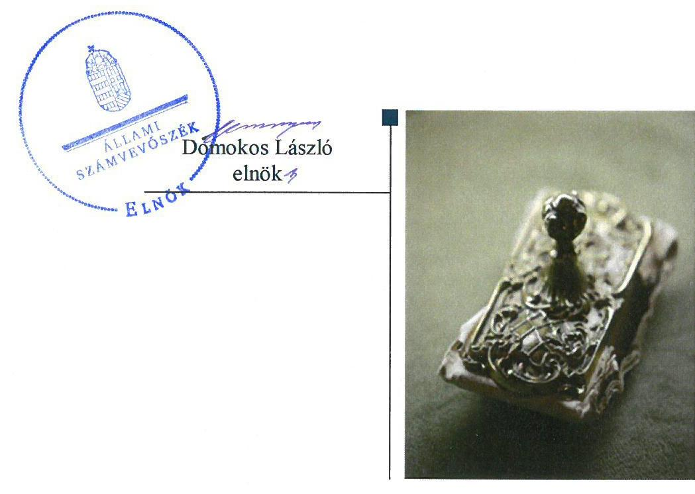
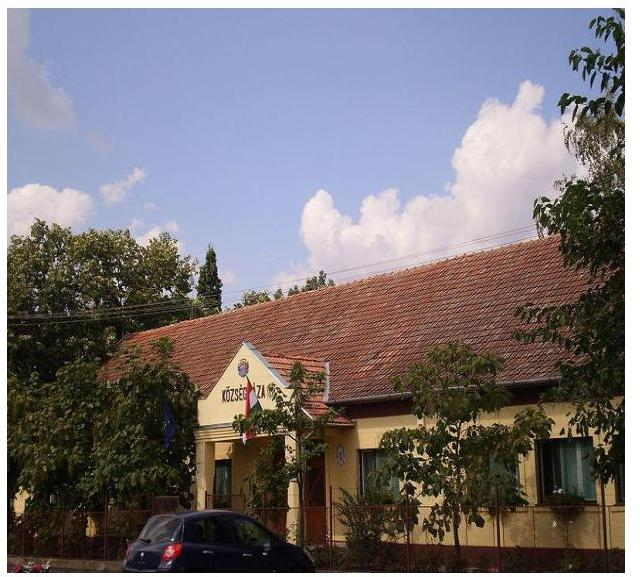
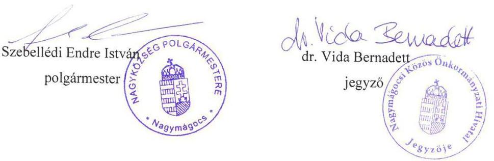
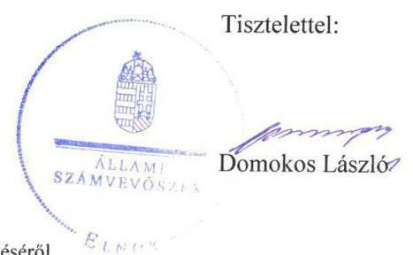
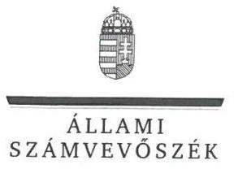
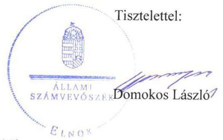

# Jelenetés 

## Önkormányzatok ellenőrzése

Integritás- és belső kontrollrendszer, Befektetési tevékenységek ellenőrzése Nagymágocs Nagyközségi Önkormányzat 2019.

---

# Jelentés 

## Önkormányzatok ellenőrzése

Integritás- és belső kontrollrendszer, Befektetési tevékenységek ellenőrzése Nagymágocs Nagyközségi Önkormányzat 2019. 10. hó 18. nap

---

# AZ ELLENŐRZÉST FELÜGYELTE:

- **KLINGA LÁSZLÓ** felügyeleti vezető
- **AZ ELLENŐRZÉST VEZETTE ÉS A VÉGREHAJTÁSÁÉRT FELELŐS:**
  - **DR. TÓTH VIKTÓRIA** ellenőrzésvezető
  - **RÁCZKEVI KATALIN** ellenőrzésvezető
- **A PROGRAM ÖSSZEÁLLÍTÁSÁÉRT FELELŐS:**
  - **TÓTPÁL SZABOLCS** osztályvezető

**IKTATÓSZÁM:** EL-1698-001/2019

**TÉMASZÁM:** 2485

**ELLENŐRZÉS-AZONOSÍTÓ SZÁM:** V082915

Jelentéseink az Országgyűlés számítógépes hálózatán és az Interneta a www.asz.hu címen is olvashatóak.

---

# TARTALOMJEGYZÉK 

■ ÖSSZEGZÉS ..... 5
■ AZ ELLENŐRZÉS CÉLJA ..... 6
■ AZ ELLENŐRZÉS TERÜLETE ..... 7
■ AZ ELLENŐRZÉS HÁTTERE, INDOKOLTSÁGA ..... 8
■ A JELENTÉS LÉNYEGES KÉRDÉSKÖREI ..... 9
■ AZ ELLENŐRZÉS HATÓKÖRE ÉS MÓDSZEREI ..... 10
■ MEGÁLLAPÍTÁSOK ..... 12
■ JAVASLATOK ..... 15
■ MELLÉKLETEK ..... 17
I. sz. melléklet: Értelmező szótár ..... 17
■ FÜGGELÉKEK ..... 19
I. sz. függelék a jelentéshez ..... 19
II. sz. függelék: Észrevételek ..... 20
■ RÖVIDÍTÉSEK JEGYZÉKE ..... 27

---

.

---

# ÖSSZEGZÉS 

Nagymágocs Nagyközségi Önkormányzat belső kontrollrendszerének kialakítása és müködtetése nem volt szabályszerű, ezáltal a közpénzekkel, a nemzeti vagyonnal való elszámoltatható, felelős gazdálkodás nem volt biztosított. A befektetési tevékenység nem volt szabályszerű.

## Az ellenőrzés társadalmi indokoltsága

Az Állami Számvevőszék alapvető feladata a közpénzekkel, az állami és önkormányzati vagyonnal való gazdálkodás ellenőrzése. Az Alaptörvény szerint az önkormányzatok kötelezettsége a kiegyensúlyozott, átlátható és fenntartható költségvetési gazdálkodás elvének érvényesítése, a nemzeti vagyonnal való rendeltetésszerű és felelős módon való gazdálkodás biztosítása. Az Állami Számvevőszék stratégiájában megfogalmazott célkitűzése az integritás alapú, átlátható és elszámoltatható közpénzfelhasználás elősegítése. Ennek megvalósítása érdekében az Állami Számvevőszék prioritásként kezeli a közpénzzel gazdálkodó szervezetek esetében a belső kontrollrendszer múködésének ellenőrzését. Az önkormányzatok szabad pénzeszközeinek felhasználása során kiemelten fontos a felelős gazdálkodás érvényesülése, amely összhangban kell, hogy legyen az önkormányzati vagyongazdálkodás alapelveivel.

Az Állami Számvevőszék Nagymágocs Nagyközségi Önkormányzatot korábban nem ellenőrizte.

## Főbb megállapítások, következtetések, javaslatok

Nagymágocs Nagyközségi Önkormányzat 2017. évben nem szabályszerű kontrollkörnyezetben múködött, mert nem rendelkezett számlarenddel, a számviteli politika és a leltározási szabályzat nem felelt meg a jogszabályi előírásoknak. Nem múködtették az integrált kockázatkezelési rendszert. A kontrolltevékenységek múködtetése nem volt szabályszerű, mert a jegyző nem gondoskodott arról, hogy a számviteli nyilvántartásokba csak szabályszerűen kiállított bizonylat alapján jegyezzenek be adatokat. Az információs és kommunikációs folyamatok múködtetése nem volt szabályszerű, mert nem rendelkeztek adatvédelmi és adatbiztonsági szabályzattal, iratkezelési szabályzattal, továbbá a jogszabályban előírt közérdekú adatokat nem tették közzé, ezzel nem biztosították az átlátható múködést. Nem alakították ki a szervezet tevékenységének, a célok megvalósításának nyomon követését biztosító rendszert. A korrupció megelőzését támogató integritási kontrollok kialakítása nem történt meg, ezáltal az Önkormányzatnál nem tettek intézkedéseket a korrupciós kockázatok mérséklésére. A teljesítmény mérésének lehetőségét nem biztosították.

A 2013-2017. években a kontrollrendszer nem biztosította a befektetési tevékenységek szabályszerű végzését, mivel ebben az időszakban nem rendelkeztek számlarenddel, bizonylati renddel, a 2013-2015. években nem készítették el az eszközök és források leltárkészítési és leltározási szabályzatát, a 2013-2016. években nem rendelkeztek számviteli politikával, eszközök és források értékelési szabályzatával, nem vezettek nyilvántartást a kötelezettségvállalásra és a teljesítésigazolásra jogosult személyekről és aláírás mintájukról.

Az Állami Számvevőszék a jelentésben foglalt megállapítások alapján a Nagymágocsi Közös Önkormányzati Hivatal jegyzőjének tizenkettő javaslatot, az Önkormányzat polgármesterének kettő javaslatot fogalmazott meg.

---

# AZ ELLENŐRZÉS CÉLJA 

AZ ELLENŐRZÉS CÉLJA annak megállapítása volt, hogy Nagymágocs Nagyközségi Önkormányzat belső kontrollrendszere biztosította-e a közpénzekkel és a nemzeti vagyonnal történő elszámoltatható, átlátható, szabályszerű, gazdaságos, hatékony és eredményes gazdálkodás feltételeit. Az ellenőrzés célja volt továbbá annak értékelése, hogy az önkormányzatnál kiépítették és erősí-tették-e a korrupciós kockázatok kezelését szolgáló integritás kontrollokat, és megteremtették-e a teljesítményellenőrzés feltételeit.

Az ellenőrzés keretében az Állami Számvevőszék értékelte továbbá, hogy a kontrollkörnyezet biztosította-e a befektetési tevékenységek szabályszerű végzését, az egyes befektetési tevékenységekkel kapcsolatos döntéshozatal és a döntések végrehajtása, valamint az egyes befektetések számviteli elszámolása, nyilvántartása szabályszerű volt-e, és a belső és külső ellenőrzések támogatták-e az egyes befektetési tevékenységek szabályszerű végzését.

---

# AZ ELLENŐRZÉS TERÜLETE 

## Nagymágocs Nagyközségi Önkormányzat

Nagymágocs Nagyközség Csongrád megyében található település. Lakónépessége a Központi Statisztikai Hivatal Magyarország közigazgatási hely-névkönyve alapján 2017. január 1-jén 2953 fő volt.

Az Önkormányzat ${ }^{1}$ hét tagú Képviselő-testületének ${ }^{2}$ munkáját két állandó bizottság segítette. Az Önkormányzat gazdálkodási feladatait a Hivatal ${ }^{3}$ látta el.

Az Önkormányzat a Hivatal mellett három költségvetési szervet tartott fenn, a Nagymágocsi Napközi Otthonos Óvoda és Napközit, a Nagymágocsi Petőfi Sándor Művelődési Ház és Könyvtárat és a Nagymágocsi Szociális Szolgáltató Központot.

Az ellenőrzött évben a polgármester ${ }^{4}$ és a jegyző ${ }^{5}$ személye nem változott.

---

# AZ ELLENŐRZÉS HÁTTERE, INDOKOLTSÁGA 

A BELSŐ KONTROLLRENDSZER kialakítása és múködtetése nélkül nem valósítható meg a közpénzek, a közvagyon átlátható, szabályos, gazdaságos, hatékony és eredményes felhasználása. A belső kontrollrendszer azt a célt szolgálja, hogy a költségvetési szervek múködésük és gazdálkodásuk során a tevékenységeket szabályszerűen hajtsák végre, teljesítsék elszámolási kötelezettségeiket és megvédjék az erőforrásokat a veszteségektől, a károktól és a nem rendeltetésszerű használattól.

A belső kontrollrendszer magában foglalja mindazon elveket, eljárásokat és belső szabályzatokat, melyek biztosítják, hogy a költségvetési szerv valamennyi tevékenysége és célja összhangban legyen a szabályszerűséggel, szabályozottsággal, valamint a gazdaságosság, hatékonyság és eredményesség követelményeivel, az eszközökkel és forrásokkal való gazdálkodásban ne kerüljön sor pazarlásra, visszaélésre, rendeltetésellenes felhasználásra. Megfelelő, pontos és naprakész információk álljanak rendelkezésre a költségvetési szerv múködésével kapcsolatosan, és a belső kontrollrendszer harmonizációjára, összehangolására vonatkozó jogszabályok végrehajtásra kerüljenek. Az integritás kontrollok kiépítése, erősítése a szervezet korrupciós kockázatainak kezelését szolgálja. A teljesítménykövetelmények meghatározása és múködtetése megalapozhatja az önkormányzatoknál a teljesítményellenőrzés lefolytatását.

## AZ ÖNKORMÁNYZATI VAGYONGAZDÁLKODÁS ker

etében az önkormányzatok átmenetileg szabad pénzeszközeinek befektetését jogszabály nem tiltja, a befektetések jellege nem korlátozott, a pénzpiaci szolgáltatók közül az önkormányzatok a kínált szolgáltatás és annak költségei alapján, szabadon választhatnak, azonban a veszteséges gazdálkodás kockázatai és következményei az önkormányzatokat terhelik. A szabad pénzeszközök felhasználása során kiemelten fontos a felelős gazdálkodás érvényesülése, amely összhangban kell, hogy legyen, az önkormányzati gazdálkodás alapelveivel.

Az ellenőrzéssel feltárásra kerülhetnek azok a kockázatok, amelyek az önkormányzatok gazdálkodásával, ezen belül befektetési tevékenységeivel, kontrollkörnyezetével kapcsolatosak és a befektetési tevékenységek szabályszerű végrehajtását befolyásolják. Az ellenőrzéssel az önkormányzatok befektetési/vagyongazdálkodási döntései értékelhetővé válnak, és megalapozott megállapítás tehető arra vonatkozóan, hogy milyen hatást gyakoroltak az önkormányzat vagyonára a képviselő-testület döntései.

---

# A JELENTÉS LÉNYEGES KÉRDÉSKÖREI 

1. Az Önkormányzat belső kontrollrendszerének kialakítása és müködtetése szabályszerű volt-e a 2017. évben?
2. A kiépített kontrollrendszer biztositotta-e a befektetési tevékenységek szabályszerű végzését a 2013-2017. években?
3. Az Önkormányzatnál alakítottak-e ki a teljesítmény mérésére alkalmas követelményeket?

---

# AZ ELLENŐRZÉS HATÓKÖRE ÉS MÓDSZEREI 

## Az ellenőrzés típusa

Megfelelőségi ellenőrzés

## Az ellenőrzött időszak

Az ellenőrzött időszak 2017. év, illetve az éves költségvetési beszámoló Áht. ${ }^{6}$ által megállapított jóváhagyásáig (2018. május 31-éig) tartó időszak.

Nagymágocs Nagyközségi Önkormányzat befektetési tevékenysége vonatkozásában 2013. január 1. - 2017. december 31. közötti időszak, továbbá a 2013. január 1. előtti időszak is, amennyiben a 2017. december 31-én meglévő befektetésekkel kapcsolatos döntéshozatalra a 2013. január 1. előtti időszakban került sor.

## Az ellenőrzés tárgya

Az önkormányzat és a gazdálkodási feladatokat ellátó hivatala belső kontrollrendszerének kialakítása és müködtetése, valamint az integritás kontrollok kiépítettsége, a teljesítményellenőrzés feltételei.

Nagymágocs Nagyközségi Önkormányzat 2017. december 31-én meglévő, a Számv. tv7. 3. § (6) bekezdés 2. és 3. pontja szerint az értékpapírokban megtestesülő befektetései, lekötött betétei. Továbbá a 2017. december 31-én meglévő, az önkormányzat szabad pénzeszközei terhére, adásvételi szerződés keretében megszerzett, a kötelező feladatok ellátását nem szolgáló, az Önkormányzat üzleti vagyonába tartozó ingatlanok; az üzleti vagyon körébe tartozó, befektetési céllal megszerzett, de még használatba nem vett ingatlan beruházások, továbbá az - időkorlátozás nélkül megszerzett - kulturális javak (műtárgyak, műalkotások, stb.), illetve egyéb értéktárgyak (pl. ékszerek, befektetési nemesfém).

## Az ellenőrzött szervezet

Nagymágocs Nagyközségi Önkormányzat, valamint Nagymágocsi Közös Önkormányzati Hivatal

## Az ellenőrzés jogalapja

Az ellenőrzés jogszabályi alapját az ÁSZ tv . 1. § (3) bekezdés, 5. § (2) és (6) bekezdései, valamint az Áht. 61. § (2) bekezdésének előírásai képezik.

---

# Az ellenőrzés módszerei 

Az ÁSZ ${ }^{8}$ az ellenőrzést az ellenőrzési program szempontjai, az ellenőrzött időszakban hatályos jogszabályok, az ellenőrzés szakmai szabályai, az egyes ellenőrzési típusokhoz kapcsolódó ÁSZ módszertanok figyelembe vételével végezte.

Az ellenőrzés ideje alatt az ÁSZ az Önkormányzattal a kapcsolattartást az ÁSZ SZMSZ ${ }^{9}$-ének vonatkozó előírásai alapján biztosította.

Az ellenőrzési kérdések megválaszolásához szükséges bizonyítékok megszerzése az Önkormányzat által rendelkezésre bocsátott dokumentumokra, adatokra alapozva megfigyelés, szemle (szemrevételezés), valamint elemző eljárás keretében történt.

Az ellenőrzési bizonyítékként felhasználható adatforrások közé tartoztak egyrészt az ellenőrzési program részletes szempontjainál felsorolt adatforrások, másrészt minden - az ellenőrzés folyamán feltárt, az ellenőrzés szempontjából releváns információt tartalmazó - dokumentum.

Az Önkormányzat belső kontrollrendszere jogszabályi előírások szerinti kialakításának és működtetésének szabályszerűségét, az erre irányuló ellenőrzési kérdésekre adott válaszok összesítése alapján pillérenként (kontrollterületenként) és összesítetten is értékeltük. Az Önkormányzat belső kontrollrendszerének összesített értékelése esetében a „szabályszerű" értékelésnek feltétele volt, hogy egyik kontrollterület sem kaphatott „nem szabályszerű" értékelést.

---

# 1. Az Önkormányzat belső kontrollrendszerének kialakítása és múködtetése szabályszerű volt-e a 2017. évben? 

Összegző megállapítás

Az Önkormányzat belső kontrollrendszerének kialakítása és múködtetése nem volt szabályszerű 2017. évben.

AZ ÖNKORMÁNYZAT NEM SZABÁLYSZERŰ KONTROLLKÖRNYEZETBEN múködött, mivel a jegyző nem gondoskodott
$\longrightarrow$ az Ávr. ${ }^{10}$ 13. § (2) bekezdésében előírt, a múködéshez kapcsolódó, pénzügyi kihatással bíró, jogszabályban nem szabályozott kérdések belső szabályozásban történő rendezéséről;
$\longrightarrow$ a Bkr. ${ }^{11}$ 6. § (3) bekezdés előírásától eltérően a múködési folyamatokra vonatkozó ellenőrzési nyomvonal elkészítéséről;
$\longrightarrow$ a Bkr. 6. § (4) bekezdés ellenére a szervezeti integritást sértő események kezelésének eljárásrendje elkészítéséről;
$\longrightarrow$ Számv. tv.-nek megfelelő számviteli politika ${ }^{12}$ elkészítéséről, mivel az a Számv. tv. 14. § (4) bekezdése ellenére nem tartalmazta azokat a gazdálkodásra jellemző szabályokat, előírásokat, módszereket, melyekkel meghatározza, hogy mit tekintenek a számviteli elszámolás, az értékelés szempontjából lényegesnek, jelentősnek, nem lényegesnek, nem jelentősnek, kivételes nagyságú vagy előfordulású bevételnek, költségnek, ráfordításnak, illetve, hogy a törvényben biztosított választási, minősítési lehetőségek közül melyeket, milyen feltételek fennállása esetén alkalmaznak;
$\longrightarrow$ arról, hogy a Leltározási szabályzat ${ }^{13}$ megfeleljen az Áhsz. ${ }^{14}$ 22. § (2) bekezdés b) pontjában előírtaknak, mivel az nem tartalmazta a használt, de a mérlegben értékkel nem szereplő immateriális javak, tárgyi eszközök, készletek leltározásának módját.
A hivatásetikai alapelvek részletes tartalmát, valamint az etikai eljárás szabályait a Kttv. ${ }^{15}$ 231. § (1) bekezdésében foglaltak ellenére a Képviselőtestület nem állapította meg.

A polgármester nem gondoskodott az Áhsz. 51. § (2) bekezdése ellenére számlarend elkészítéséről, továbbá a Számv. tv. 161. § (2) bekezdés d) pontja ellenére bizonylati rend elkészítéséről.

AZ INTEGRÁLT KOCKÁZATKEZELÉSI RENDSZERT NEM MÚKÖDTETTÉK. A jegyző a Bkr. 7. § (1) bekezdésével ellentétben nem múködtette az Önkormányzat integrált kockázatkezelési rendszerét.

A KONTROLLTEVÉKENYSÉGEK MÚKÖDTETÉSE NEM SZABÁLYSZERŰEN TÖRTÉNT. A jegyző a kiadások

---

teljesítéséhez kapcsolódóan a Számv. tv. 165. § (2) bekezdése ellenére nem gondoskodott arról, hogy a számviteli (könyvviteli) nyilvántartásokba csak szabályszerűen kiállított bizonylat alapján jegyezzenek be adatokat.

# AZ INFORMÁCIÓS ÉS KOMMUNIKÁCIÓS FOLYAMATOK MŰKÖDTETÉSE NEM VOLT SZABÁLY- 

SZERŰ. A jegyző az Info. tv. ${ }^{16}$ 24. § (3) bekezdése ellenére nem gondoskodott adatvédelmi és adatbiztonsági szabályzat elkészítéséről, az Ltv. ${ }^{17}$ 9. § (4) bekezdése ellenére iratkezelési szabályzat kiadásáról, valamint az Info. tv. 37. §-ában és 1. mellékletében (általános közzétételi lista) meghatározott közérdekú adatok közzétételéről.

A SZERVEZET TEVÉKENYSÉGÉNEK, A CÉLOK MEGVALÓSÍTÁSÁNAK NYOMON KÖVETÉSÉT BIZTOSÍTÓ RENDSZERT NEM MŰKÖDTETTÉK. A jegyző a Bkr. 3. § e) pontja és 10. §-a ellenére nem biztosította sem a belső ellenőrzési tevékenység ellátását, sem az operatív tevékenységek keretében megvalósuló folyamatos és eseti nyomon követést.

A jegyző a Bkr. 1. melléklete szerinti nyilatkozatban értékelte a belső kontrollrendszer minőségét.

A SZERVEZET INTEGRITÁS elvű működését nem támogatta a jogszabályok által kötelezően előírt kontrollok kiépítettsége. Kockázatelemzés hiányában az integritás elvű működést támogató célszerű kontrollok nem kerültek kialakításra.

## 2. A kiépített kontrollrendszer biztosította-e a befektetési tevékenységek szabályszerű végzését a 2013-2017. években?

Összegző megállapítás

A kontrollrendszer nem biztosította a befektetési tevékenységek szabályszerű végzését a 2013-2017. években.

A BEFEKTETÉSI TEVÉKENYSÉGEK SZABÁLYSZERŰ VÉGZÉSE NEM VOLT BIZTOSÍTOTT, mivel a jegyző nem gondoskodott

- a Hivatal Szervezeti és Működési Szabályzatának elkészítéséről az Áht. 10. § (5) bekezdés ellenére 2013. január 1-2013. október 16. közötti időszakra;
- a Számv. tv. 14. § (3) bekezdésével ellentétben a számviteli politika elkészítéséről 2013. január 1-2016. december 31. közötti időszakra;
- a Számv. tv. 14. § (5) bekezdés a) pontja ellenére eszközök és források leltárkészítési és leltározási szabályzatának elkészítésről 2013. január 1-2015. december 31. közötti időszakra;
- a Számv. tv. 14. § (5) bekezdés b) pontjával ellentétben eszközök és források értékelési szabályzatának elkészítéséről 2013. január 12016. december 31. közötti időszakra;

---

- Számv. tv. 14. § (5) bekezdés d) pontja ellenére pénzkezelési szabályzat elkészítéséről 2013. január 1-2016. október 31. közötti időszakra;
— az Ávr. 60. § (3) bekezdés ellenére a kötelezettségvállalásra, pénzügyi ellenjegyzésre, teljesítés igazolásra, érvényesítésre ás utalványozásra jogosult személyekről és aláírás mintájukról nyilvántartás vezetéséről 2013. január 1-2016. december 31. közötti időszakra.
A polgármester nem gondoskodott az Áhsz. 51. § (2) bekezdése ellenére számlarend elkészítéséről, továbbá a Számv. tv. 161. § (2) bekezdés d) pontja ellenére bizonylati rend elkészítéséről 2013. január 1-2017. decem-ber 31. közötti időszakra.

A Képviselő-testület az Mötv. ${ }^{18}$ 53. § (1) bekezdés ellenére múködésének részletes szabályait - a 2013. január 1- 2014. november 7. közötti időszakra vonatkozóan - szervezeti és múködési szabályzatról szóló rendeletben nem határozta meg.

# 3. Az Önkormányzatnál alakítottak-e ki a teljesítmény mérésére alkalmas követelményeket? 

## Összegző megállapítás

Az Önkormányzatnál nem alakítottak ki a teljesítmény mérésére alkalmas követelményeket.

A szervezeti célok elérését szolgáló feladatok, folyamatok, tevékenységek mérését szolgáló indikátorokat, mérőszámokat, feladat- és teljesítménymutatókat nem képeztek, ezáltal az Önkormányzat belső kontrollrendszere az Áht. 61. § (1) bekezdés ellenére nem biztosította az államháztartás pénzeszközeivel és a nemzeti vagyonnal történő gazdaságos, hatékony és eredményes gazdálkodás mérésének lehetőségét.

---

# JAVASLATOK 

Az ÁSZ tv. 33. § (1) bekezdésében foglaltak értelmében az ellenőrzött szervezet vezetője köteles a jelentésben foglalt megállapításokhoz kapcsolódó intézkedési tervet összeállítani és azt a jelentés kézhezvételétől számított 30 napon belül az ÁSZ részére megküldeni. Amennyiben az ellenőrzött szervezet vezetője nem küldi meg határidőben az intézkedési tervet, vagy továbbra sem elfogadható intézkedési tervet küld, az Állami Számvevőszék elnöke az ÁSZ tv. 33. § (3) bekezdése a) és b) pontjaiban foglaltakat érvényesítheti.

## Nagymágocsi Közös Önkormányzati Hivatal jegyzőjének

1. Az Önkormányzat szabályszerű kontrollkörnyezetének kialakítása érdekében gondoskodjon:
a) a müködéshez kapcsolódó, a költségvetési szerv előirányzatait terhelő pénzügyi kihatással biró, jogszabályban nem szabályozott kérdések belső szabályzatban történő rendezéséről;
(1. sz. megállapítás 1. bekezdés 1. részbekezdés alapján)
b) az ellenőrzési nyomvonal elkészitéséről;
(1. sz. megállapítás 1. bekezdés 2. részbekezdés alapján)
c) a szervezeti integritást sértő események kezelése eljárásrendjének elkészitéséről;
(1. sz. megállapítás 1. bekezdés 3. részbekezdés alapján)
d) a számviteli politika Számv. tv.-ben elöirtaknak történő megfeleléséről;
(1. sz. megállapítás 1. bekezdés 4. részbekezdés alapján)
e) a Leltározási szabályzat Áhsz.-ben elöirtaknak történő megfeleléséről;
(1. sz. megállapítás 1. bekezdés 5. részbekezdés alapján)
f) a hivatásetikai alapelvek részletes tartalmának, valamint az etikai eljárás szabályainak a Képviselő-testület általi megállapításáról.
(1. sz. megállapítás 2. bekezdése alapján)

---

2. Gondoskodjon az Önkormányzat integrált kockázatkezelési rendszerének müködtetéséről.
(1. sz. megállapítás 4. bekezdése alapján)
3. A kontrolltevékenységek szabályszerű müködtetése érdekében gondoskodjon arról, hogy a számviteli (könyvviteli) nyilvántartásokba csak szabályszerűen kiállított bizonylatok alapján jegyezzenek be adatokat.
(1. sz. megállapítás 5. bekezdés 2. mondata alapján)
4. Az információs és kommunikációs rendszer szabályszerű müködtetése érdekében gondoskodjon:
a) az adatvédelmi és adatbiztonsági szabályzat elkészítéséről;
(1. sz. megállapítás 6. bekezdés 2. mondat 1. tagmondata alapján)
b) az Önkormányzat iratkezelési szabályzatának kiadásáról;
(1. sz. megállapítás 6. bekezdés 2. mondat 2. tagmondata alapján)
c) a közérdekú adatok közzétételéről.
(1. sz. megállapítás 6. bekezdés 2. mondat 3. tagmondata alapján)
5. A szabályszerű monitoring rendszer kialakítása érdekében gondoskodjon a szervezet tevékenységének, a célok megvalósításának nyomon követését biztosító rendszer kialakításáról a jogszabályi előirásoknak megfelelően.
(1. sz. megállapítás 7. bekezdés 2. mondata alapján)

# Nagymágocs Nagyközségi Önkormányzat polgármesterének 

1. Az Önkormányzat szabályszerű kontrollkörnyezetének kialakítása érdekében gondoskodjon:
a) a számlarend elkészítéséről;
(1. sz. megállapítás 3. bekezdés 1. tagmondata alapján)
b) a bizonylati rend elkészítéséről.
(1. sz. megállapítás 3. bekezdés 2. tagmondata alapján)

---

# MELLÉKLETEK 

- I. SZ. MELLÉKLET: ÉRTELMEZŐ SZÓTÁR
belső ellenőrzés
belső kontrollrendszer
belső kontrollrendszer területei
információs és kommunikációs rendszer
integritás
integrált kockázatkezelési rendszer
kontrollkörnyezet
kontrolltevékenységek
közös önkormányzati hivatal
monitoring rendszer

Független, tárgyilagos bizonyosságot adó és tanácsadó tevékenység, amelynek célja, hogy az ellenőrzött szervezet működését fejlessze és eredményességét növelje, az ellenőrzött szervezet céljai elérése érdekében rendszerszemléletű megközelítéssel és módszeresen értékeli, illetve fejleszti az ellenőrzött szervezet irányítási és belső kontrollrendszerének hatékonyságát. (Forrás: Bkr. 2. § b) pontja)
A belső kontrollrendszer a kockázatok kezelése és tárgyilagos bizonyosság megszerzése érdekében kialakított folyamatrendszer, amely azt a célt szolgálja, hogy a müködés és gazdálkodás során a tevékenységeket szabályszerűen, gazdaságosan, hatékonyan, eredményesen hajtsák végre, az elszámolási kötelezettségeket teljesítsék, megvédjék az erőforrásokat a veszteségektől, károktól és nem rendeltetésszerű használattól. (Forrás: Áht. 69. § (1) bekezdése)

A kontrollkörnyezet, a (integrált) kockázatkezelési rendszer, a kontrolltevékenységek, az információs és kommunikációs rendszer, valamint a nyomon követési (monitoring) rendszer. (Forrás: Bkr. 3. §-a)
A költségvetési szerv vezetője által kialakított és müködtetett olyan rendszer, mely biztosítja, hogy a megfelelő információk a megfelelő időben eljutnak az illetékes szervezethez, szervezeti egységhez, illetve személyhez. (Forrás: Bkr. 9. § (1) bekezdés)
Az integritás az elvek, értékek, cselekvések, módszerek, intézkedések konzisztenciáját jelenti, vagyis olyan magatartásmódot, amely meghatározott értékeknek megfelel. (Forrás: Nemzetgazdasági Minisztérium: Magyarországi államháztartási belső kontroll standardok Útmutató 1.6.1. pontja, 2012. december)
Olyan folyamatalapú kockázatkezelési rendszer, amely a szervezet minden tevékenységére kiterjed, egységes módszertan és eljárások alkalmazásával, a szervezet célkitűzéseinek és értékeinek figyelembevételével biztosítja a szervezet kockázatainak teljes körű azonosítását, azok meghatározott kritériumok szerinti értékelését, valamint a kockázatok kezelésére vonatkozó intézkedési terv elkészítését és az abban foglaltak nyomon követését.(Forrás: Bkr. 2. § m) pontja)
A költségvetési szerv vezetője által kialakított olyan elvek, eljárások, belső szabályzatok összessége, amelyben világos a szervezeti struktúra, a folyamatok átláthatók, egyértelműek a felelősségi, hatásköri viszonyok és feladatok, meghatározottak, ismertek és elfogadottak az etikai elvárások a szervezet minden szintjén, átlátható a humánerőforráskezelés, biztosított a szervezeti célokés értékek irányában való elkötelezettség fejlesztése és elősegítése. (Forrás: Bkr. 6. § (1) bekezdés)
A költségvetési szerv vezetője által a szervezeten belül kialakított (kontroll) tevékenységek, melyek biztosítják a kockázatok kezelését, hozzájárulnak a szervezet céljainak eléréséhez és erősítik a szervezet integritását. (Forrás: Bkr. 8. § (1) bekezdés)
A települési képviselő-testület más települési képviselő-testülettel társult képviselő-testületet alakíthat, amely esetén a képviselő-testületek részben vagy egészben egyesítik a költségvetésüket, közös önkormányzati hivatalt tartanak fenn és intézményeiket közösen működtetik. (Forrás: Mötv. 56. § (1)-(2) bekezdései)
A költségvetési szerv vezetője köteles kialakítani a szervezet tevékenységének, a célok megvalósításának nyomon követését biztosító rendszert, amely az operatív tevékenységek keretében megvalósuló folyamatos és eseti nyomon követésből, valamint az operatív tevékenységektől függetlenül működő belső ellenőrzésből állhat. (Forrás: Bkr. 10. §)

---

.

---

# FÜGGELÉKEK 

- I. SZ. FÜGGELÉK A JELENTÉSHEZ

Az Állami Számvevőszék az ellenőrzések során feltárt tényekhez kapcsolódó további körülmények tisztázására eszközrendszerrel nem rendelkezik. Amennyiben az ellenőrzésen túlmutatóan indokoltnak látszik az ellenőrzés során feltárt körülmények további vizsgálata, az Állami Számvevőszék törvényi felhatalmazás alapján az ellenőrzés által feltárt körülményeket továbbítja a hatáskörrel rendelkező szervnek a szükséges intézkedések megtétele, eljárások lefolytatása érdekében.
Nagymágocs Nagyközségi Önkormányzat a Számv. tv. 165. § (2) bekezdésében előirtak ellenére nem gondoskodott arról, hogy a számviteli (könyvviteli) nyilvántartásokba csak szabályszerűen kiállított bizonylat alapján jegyezzenek be adatokat.
Ezért az Önkormányzatnál a könyvvezetés és a beszámoló összeállítása során a Számv. tv. 15. § (3) bekezdésében elöirtak végrehajtása nem igazolt, így az sem igazolt, hogy az Önkormányzat 2017. évi költségvetési beszámolója megbízható, valós összképet mutat.
Az eset konkrét körülményeinek felderítésére a Magyar Államkincstár rendelkezik hatáskörrel.

---

A jelentéstervezetet a Számvevőszék 15 napos észrevételezésre megküldte az ellenőrzött szervezetek vezetőinek az ÁSZ tv. 29. §̊ (1) bekezdése előirásának megfelelően.

Nagymágocs Nagyközségi Önkormányzat polgármestere és a Nagymágocsi Közös Önkormányzati Hivatal jegyzője az ÁSZ tv. 29. § (2) bekezdésében foglalt észrevételezési jogával élt, a jelentéstervezetre észrevételt tett.
A függelék tartalmazza az ellenőrzöttek észrevételeit, illetve az el nem fogadott észrevételek elutasításának indoklását.

[^0]
[^0]:    * 29. § (1) Az Állami Számvevőszék az ellenőrzési megállapításait megküldi az ellenőrzött szervezet vezetőjének vagy az általa megbízott személynek, és annak, akinek személyes felelősségét állapította meg.
    (2) Az ellenőrzött szervezet vezetője és a felelősként megjelölt személy az ellenőrzés megállapításaira tizenöt napon belül írásban észrevételt tehet.
    (3) Az Állami Számvevőszék az észrevételre a beérkezésétől számított harminc napon belül írásban válaszol. A figyelembe nem vett észrevételeket köteles a jelentésben feltüntetni, és megindokolni, hogy azokat miért nem fogadta el.

---

Nagymágocs Nagyközségi Önkormányzat
6622 Nagymágocs, Szentesi út 42.
Tel.: 63/363-002
ikt.sz.: NM/129-10/2019.
ügyintéző: dr. Vida Bernadett

# Állami Számvevőszék 

Budapest 4.
Pf. 54.
1364
Tisztelt Állami Számvevőszék!

Az EL-0813-027/2019. és EL-0813-029/2019. iktatószámra hivatkozva kérem, hogy az ellenőrzés során szíveskedjenek figyelembe venni, hogy a Nagymágocs Nagyközségi Önkormányzat, valamint a Nagymágocsi Közös Hivatal a lehetőségeihez mérten eleget tett a Tisztelt Állami Számvevőszék ellenőrzése során a kötelezettségének.

Sajnálatos módon saját hibából eredően vagy a felületre történő belépési hiba miatt néhány esetben a kért iratokat az internetes felületre nem sikerült a megadott rövid határidőn belül feltölteni, de ettől függetlenül a szabályzatok szinte teljes köre a rendelkezésre állnak.

A jelentéstervezetben foglalt kötelezettségének az önkormányzat és a hivatal is eleget fog tenni. A jelentéstervezet megküldése óta már azonnal elkezdődtek az esetleges hibák, hiányosságok feltárása és annak kijavítása is. Így a polgármester gondoskodott a számlarend és bizonylati rend aktualizálásáról, a jegyző pedig a számviteli politika és a leltározási szabályzat aktualizálásáról, amelyek már a Tisztelt Állami Számvevőszék részére megküldésre kerültek.

A jelentéstervezetben felsorolt, már meglévő önkormányzati és hivatali szabályzatokat a polgármester és a jegyző áttekintik és amennyiben szükséges, úgy azokat aktualizálja, melyeket az elkészült intézkedési tervben foglalt időpontig, a meghatározott módon és formában a Tisztelt Állami Számvevőszék rendelkezésére bocsátja.

---

A 2013-2017-es időszakra vonatkozóan szeretném jelezni, hogy Nagymágocs Nagyközségi Önkormányzat polgármesteri tisztségét Szebellédi Endre István 2014. októbere óta látja el, a Nagymágocsi Közös Önkormányzati Hivatal jegyzőjének dr. Vida Bernadett 2015. április 15én lett kinevezve. Ezen időpontok előtti szabályzatokat iktatott, aláirt formában nem találtuk, így azokat megküldeni nem áll módunkban.

Kérem, hogy a fentieket szíveskedjenek figyelembe venni az ellenőrzés során.

Nagymágocs, 2019. július 4.

Tisztelettel:

---

# Szebellédi Endre István úr   polgármester   Nagymágocs Nagyközségi Önkormányzat 

Nagymágocs

## Tisztelt Polgármester Úr!

Az „Önkormányzatok ellenörzése - Integritás- és belső kontrollrendszer, Befektetési tevékenységek ellenörzése - Nagymágocs Nagyközségi Önkormányzat" címmel készített számvevőszéki jelentéstervezetre tett, NM/129-10/2019. iktatószámú észrevételeit köszönettel megkaptam.
Az Állami Számvevőszék észrevételekre vonatkozó álláspontjáról a felügyeleti vezető által készített részletes tájékoztatást csatoltan megküldöm.
Tájékoztatom Polgármester urat, hogy a számvevőszéki jelentésben - az Állami Számvevőszékről szóló 2011. évi LXVI. törvény 29. § (3) bekezdése alapján - a figyelembe nem vett észrevételeket szerepeltetjük annak indoklásával, hogy azokat az Állami Számvevőszék miért nem fogadta el.

Budapest, 2019. 07 hó 23 nap

Melléklet: Tájékoztatás az észrevételek kezeléséről

---

# Tájékoztatás az észrevételek kezeléséről 

Az „Önkormányzatok ellenőrzése - Integritás- és belső kontrollrendszer, Befektetési tevékenységek ellenőrzése - Nagymágocs Nagyközségi Önkormányzat" címú jelentéstervezetre 2019. július 4-én kelt, NM/129-10/2019. iktatószámú levelében tett észrevételeit áttekintettük, annak kezelésével kapcsolatban a következő tájékoztatást adom:

Polgármester úr észrevételében a számlarend, a bizonylati rend, a számviteli politika, valamint az eszközök és források leltárkészittési és leltározási szabályzatának aktualizálásáról adott tájékoztatást.

Az észrevétel a megállapításainkat nem vitatta, így a jelentéstervezet módosítása nem indokolt.

Budapest, 2019. C7. 27

Tisztelettel:

Klinga László

---

# Dr. Vida Bernadett úrhölgy 

jegyzó
Nagymágocsi Közös Önkormányzati Hivatal

## Nagymágocs

## Tisztelt Jegyző Úrhölgy!

Az „Önkormányzatok ellenőrzése - Integritás- és belső kontrollrendszer, Befektetési tevékenységek ellenőrzése - Nagymágocs Nagyközségi Önkormányzat" címmel készített számvevőszéki jelentéstervezetre tett, NM/129-10/2019. iktatószámú észrevételeit köszönettel megkaptam.
Az Állami Számvevőszék észrevételekre vonatkozó álláspontjáról a felügyeleti vezető által készített részletes tájékoztatást csatoltan megküldöm.
Tájékoztatom Jegyző úrhölgyet, hogy a számvevőszéki jelentésben - az Állami Számvevőszékről szóló 2011. évi LXVI. törvény 29. § (3) bekezdése alapján - a figyelembe nem vett észrevételeket szerepeltetjük annak indoklásával, hogy azokat az Állami Számvevőszék miért nem fogadta el.

Budapest, 2019. 07 hó 23 nap

Melléklet: Tájékoztatás az észrevételek kezeléséről

---

# Tájékoztatás az észrevételek kezeléséről 

Az „Önkormányzatok ellenőrzése - Integritás- és belső kontrollrendszer, Befektetési tevékenységek ellenőrzése - Nagymágocs Nagyközségi Önkormányzat" címú jelentéstervezetre 2019. július 4-én kelt, NM/129-10/2019. iktatószámú levelében tett észrevételeit áttekintettük, annak kezelésével kapcsolatban a következő tájékoztatást adom:

Jegyző úrhölgy észrevételében a számlarend, a bizonylati rend, a számviteli politika, valamint az eszközök és források leltárkészittési és leltározási szabályzatának aktualizálásáról adott tájékoztatást.

Az észrevétel a megállapításainkat nem vitatta, így a jelentéstervezet módosítása nem indokolt.

Budapest, 2019. 37. 17.

Tisztelettel:

Klinga László

---

# RÖVIDÍTÉSEK JEGYZÉKE 

${ }^{1}$ Önkormányzat
${ }^{2}$ Képviselő-testület
${ }^{3}$ Hivatal
${ }^{4}$ polgármester
${ }^{5}$ jegyző
${ }^{6}$ Áht.
${ }^{7}$ Számv. tv.
${ }^{8}$ ÁSZ
${ }^{9}$ ÁSZ SZMSZ
${ }^{10}$ Ávr.
${ }^{11}$ Bkr.
${ }^{12}$ Számviteli politika
${ }^{13}$ Leltározási szabályzat
${ }^{14}$ Áhsz.
${ }^{15}$ Kttv.
${ }^{16}$ Info tv.
${ }^{17}$ Ltv.
${ }^{18}$ Mötv.

Nagymágocs Nagyközségi Önkormányzat
Nagymágocs Nagyközségi Önkormányzat Képviselő-testülete
Nagymágocsi Közös Önkormányzati Hivatal
Nagymágocs Nagyközség polgármestere
Nagymágocs Nagyközségi Önkormányzat jegyzője
2011. évi CXCV. törvény az államháztartásról
2000. évi C. törvény a számvitelről (hatályos: 2001. január 1-jétől)

Állami Számvevőszék
Állami Számvevőszék Szervezeti és Működési Szabályzata
368/2011. (XII. 31.) Korm. rendelet az államháztartásról szóló törvény végrehajtásáról
370/2011. (XII.31.) Korm. rendelet a költségvetési szervek belső kontrollrendszeréről és belső ellenőrzéséről
Nagymágocs Nagyközségi Önkormányzat számviteli politikája
Nagymágocs Nagyközségi Önkormányzat és intézményei leltározási és leltárkészítési szabályzata
4/2013. (I. 11.) Korm. rendelet az államháztartás számviteléről
2011. évi CXCIX. törvény a közszolgálati tisztviselőkről
2011. évi CXII. törvény az információs önrendelkezési jogról és az információszabadságról
1995. évi LXVI. törvény a köziratokról, a közlevéltárakról és a magánlevéltári anyag védelméről
2011. évi CLXXXIX. törvény Magyarország helyi önkormányzatairól

---

# ÁLLAMI SZÁMVEVŐSZÉK 

1052 Budapest, Apáczai Csere János utca 10.
Levélcím: 1364 Budapest 4. Pf. 54
Telefon: +36 14849100 Telefax: +36 14849200
www.asz.hu