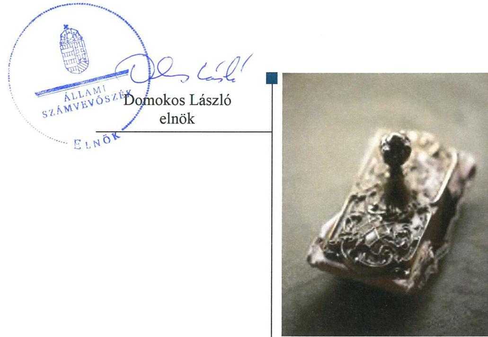
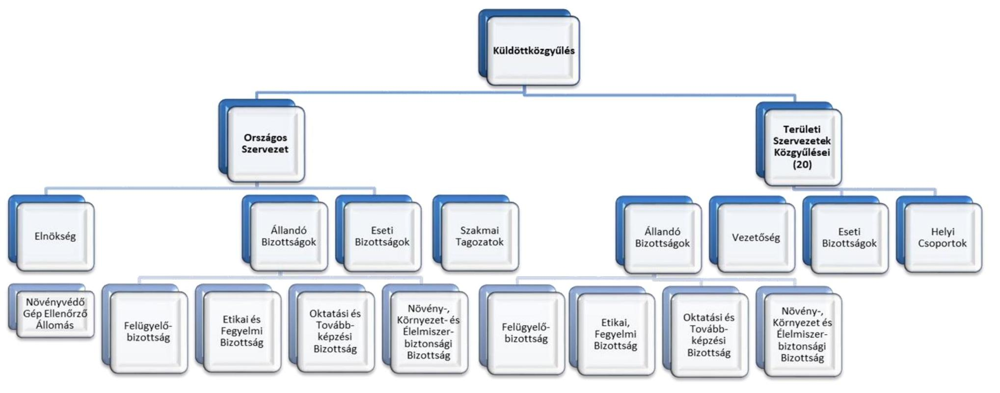

# Jelenés 

## Köztestületek ellenőrzése

Magyar Növényvédő Mérnöki és Növényorvosi Kamara 2019.

---

# Jelenés 

## Köztestületek ellenőrzése

Magyar Növényvédő Mérnöki és Növényorvosi Kamara
2019. 09 hó 14 nap

---

# AZ ELLENŐRZÉST FELÜGYELTE: 

PETŐ KRISZTINA felügyeleti vezető

## AZ ELLENŐRZÉST VEZETTE ÉS A VÉGREHAJTÁSÁÉRT FELELŐS:

DR. NAGY JUDIT ellenőrzésvezető 2018. november 20-ig
NEMESVÁRI-HORTHY ESZTER ellenőrzésvezető 2018. november 21-től

## A PROGRAM ÖSSZEÁLLÍTÁSÁÉRT FELELŐS:

TÓTPÁL SZABOLCS osztályvezető

IKTATÓSZÁM: EL-1701-001/2019.

## Jelentéseink az Országgyülés számítógépes hálózatán és az Interneten a www.asz.hu címen is olvashatóak.

TÉMASZÁM: 2455
ELLENŐRZÉS-AZONOSÍTÓ SZÁM: V079902

---

# TARTALOMJEGYZÉK 

■ ÖSSZEGZÉS ..... 5
■ AZ ELLENŐRZÉS CÉLJA ..... 6
■ AZ ELLENŐRZÉS TERÜLETE ..... 7
■ AZ ELLENŐRZÉS HÁTTERE, INDOKOLTSÁGA ..... 8
■ A JELENTÉS LÉNYEGES KÉRDÉSKÖREI ..... 9
■ AZ ELLENŐRZÉS HATÓKÖRE ÉS MÓDSZEREI ..... 10
■ MEGÁLLAPÍTÁSOK ..... 12
■ JAVASLATOK ..... 14
■ MELLÉKLETEK ..... 17
I. sz. melléklet: Értelmező szótár ..... 17
II. sz. melléklet: A Magyar Növényvédő Mérnöki és Növényorvosi Kamara szervezeti felépítése ..... 18
III. sz. melléklet: A Magyar Növényvédő Mérnöki és Növényorvosi Kamara területi szervezeteinél feltárt szabálytalanságok ..... 19
■ FÜGGELÉKEK ..... 21
I. sz. függelék a jelentéshez ..... 21
II. sz. függelék: Észrevételek ..... 24
■ RÖVIDÍTÉSEK JEGYZÉKE ..... 35

---

.

---

# ÖSSZEGZÉS 

A Magyar Növényvédő Mérnöki és Növényorvosi Kamara gazdálkodása és közpénzfelhasználása nem volt átlátható és elszámoltatható. A kamara a tagdíjkövetelések beszedésére nem intézkedett, így a törvényben előírt feladatát nem látta el.

## Az ellenőrzés társadalmi indokoltsága

A Magyar Növényvédő Mérnöki és Növényorvosi Kamara a növényvédő mérnök, növényorvosi tevékenységet végzők érdekképviseleti szerve, amely szakmai érdekképviseleti feladatai körében tagságához kapcsolódóan szervezi, intézi a növényvédelmi feladatokkal kapcsolatos tevékenységek gyakorlásával összefüggő egyes közfeladatok ellátását, hozzájárul a mezőgazdasági termelés szakszerű folytatásához. Végzi a tevékenységet végzők regisztrálását, vezeti a tagok nyilvántartását. A növényvédő mérnöki-növényorvosi hivatás gyakorlásával összefüggő kérdésekben képviseli és védi tagjainak érdekeit és jogait a jogosulatlan tevékenységet folytatókkal szemben. Közigazgatási feladatai körében hatóságként jár el a felvétellel, tagság megszüntetéssel, szüneteltetéssel, valamint a szüneteltetett tagsági viszony helyreállításával kapcsolatos kamarai hatósági ügyekben.

A Magyar Növényvédő Mérnöki és Növényorvosi Kamara gazdálkodását az Állami Számvevőszék eddig még nem ellenőrizte.

## Főbb megállapítások, következtetések, javaslatok

A Magyar Növényvédő Mérnöki és Növényorvosi Kamara belső szabályait nem alakította ki a jogszabályban előírtakkal összhangban, mert nem határozta meg a kamarai tagdíj összegét alapszabályában, továbbá nem készített számlarendet. Ezzel az átlátható és elszámoltatható gazdálkodás feltételeit nem teremtették meg.

A Magyar Növényvédő Mérnöki és Növényorvosi Kamara nyolc területi szervezete beszámoló készítési kötelezettségének nem tett eleget, további hét területi szervezet mérlegét leltár nem támasztotta alá. A területi szervezeteknél a tagdíjkövetelések nyilvántartása nem volt szabályszerű, mert a főkönyvi könyvelés, az analitikus nyilvántartások és a bizonylatok adatai közötti egyeztetés és ellenőrzés lehetőségét logikailag zárt rendszerrel nem biztosították. A területi szervezetek vagyoni helyzetéről és azok alakulásáról objektív információk nem álltak rendelkezésre, a megbízható és valós összképet nem biztosították.

A közfeladatot ellátó kamara területi szervezetei a tagdíj-követelések beszedése érdekében nem tettek intézkedést. Továbbá a kamara a törvényben előírt feladatát nem látta el, mert a területi szervezetek a tagdíjjal tartozók tagsági viszonyának megszüntetése érdekében nem intézkedtek. Mindezek alapján a növényvédő mérnöki-növényorvosi hivatást gyakorló tagok névjegyzéke, amelyet a kamara vezet nem hiteles.

A költségvetési támogatás felhasználásának nyilvántartása, elszámolása nem volt szabályszerű, így nem biztosították az átlátható és elszámoltatható közpénzfelhasználást.

Az Állami Számvevőszék a Magyar Növényvédő Mérnöki és Növényorvosi Kamara elnökének hét, a Baranya Megyei Területi Szervezet elnökének egy, a Bács-Kiskun Megyei Területi Szervezet elnökének négy, a Békés Megyei Területi Szervezet elnökének kettő, a Borsod-Abaúj-Zemplén Megyei Területi Szervezet elnökének három, a Csongrád Megyei Területi Szervezet elnökének négy, a Fejér Megyei Területi Szervezet elnökének három, a Győr-Moson-Sopron Megyei Területi Szervezet elnökének egy, a Hajdú-Bihar Megyei Területi Szervezet elnökének egy, a Heves Megyei Területi Szervezet elnökének egy, a Jász-Nagykun-Szolnok Megyei Területi Szervezet elnökének egy, a Komárom-Esztergom Megyei Területi Szervezet elnökének kettő, a Nógrád Megyei Területi Szervezet elnökének egy, a Pest Megyei Területi Szervezet elnökének egy, a Somogy Megyei Területi Szervezet elnökének három, a Szabolcs-Szatmár-Bereg Megyei Területi Szervezet elnökének egy, a Tolna Megyei Területi Szervezet elnökének egy, a Vas Megyei Területi Szervezet elnökének három, a Veszprém Megyei Területi Szervezet elnökének egy, a Zala Megyei Területi Szervezet elnökének egy, a Budapest-Főváros Szervezet elnökének három javaslatot fogalmazott meg.

---

# AZ ELLENŐRZÉS CÉLJA 

megfelelően működtek-e.

Az ellenőrzés célja annak megállapítása volt, hogy a Magyar Növényvédő Mérnöki és Növényorvosi Kamara gazdálkodása során betartotta-e a vonatkozó jogszabályi előírásokat, ennek keretében betartotta-e az előírásokat a belső szabályozási keretek kialakítása, a tagdíjbeszedés, a közzétételi és adatszolgáltatási tevékenysége során. Szabályszerűen számolta-e el, illetve tartotta-e nyilván a törvényben rögzített közfeladat ellátására államháztartásból kapott támogatásokat. Az ellenőrzés kiterjedt arra is, hogy a Magyar Növényvédő Mérnöki és Növényorvosi Kamara szabályszerű működését biztosító ellenőrzési rendszerek

---

# **AZ ELLENŐRZÉS TERÜLETE**

## **Magyar Növényvédő Mérnöki és Növényorvosi Kamara**

Az MNMNK^{1} a növényvédő mérnökök-növényorvosok közfeladatokat ellátó, a 2000. évi LXXXIV. törvény^{2} alapján létrejött szakmai és önkormányzati köztestülete, amely jogi személy. Az MNMNK feladatait a megyékben és a fővárosban működő területi szervezetek^{3} és az Országos Szervezete^{4} útján látja el, amelyek mindegyike jogi személy.

A 2000. évi LXXXIV. törvényben meghatározott feladataként az MNMNK növényvédő mérnöki-növényorvosi hivatás gyakorlásával összefüggő kérdésekben képviseli és védi tagjainak érdekeit és jogait a jogosulatlan tevékenységet folytatókkal szemben, valamint közfeladatokat lát el. Az MNMNK véleményezi a növényvédő szer kiskereskedelmi forgalmazási engedély, illetve a növényvédelmi szolgáltatói és szaktanácsadói vállalkozói engedély kiadását, nyilvántartást vezet a növényvédelmi szolgáltatói és növényvédő szer kereskedelmi tevékenységet folytatókról, eljárást kezdeményez a hatáskörrel rendelkező hatóságnál a növényvédelmi tevékenységet jogosultság nélkül, illetve szakszerűtlenül végzők ellen. Az MNMNK tagjairól névjegyzéket vezet, szervezi a növényvédő szert használó mezőgazdasági termelők nem iskolai rendszerű szakmai képzését, közreműködik a növényvédelemmel és a növényvédő mérnökök-növényorvosok tevékenységével kapcsolatos jogszabály előkészítésében, véleményezi a felsőoktatási intézményekkel együttműködve, a növényvédő mérnök, okleveles növényvédő mérnöki és okleveles növényorvosi képzés, szakképzés, valamint továbbképzés képesítési követelményrendszerét.

A növényvédő mérnöki tevékenységet végzőknek a kamarai tagság kötelező. Az MNMNK tagjainak száma a 2015. évi 3315 főről a 2017. évre 3819 főre nőtt. A taglétszám 2015-2017. év végi adatait az 1. táblázat mutatja be.

Működésének költségeit döntően a tagjai által befizetett tagdíjakból, vállalkozási tevékenységből, valamint az államtól átvett, közfeladatai ellátásához (pl.: szakmai oktatás, továbbképzés, a parlagfű elleni közérdekű védekezés stb.) nyújtott állami támogatásból fedezte. A tagdíjak beszedéséért az Alapszabály^{1,2} szerint a területi szervezetek voltak felelősek.

Költségvetési támogatásban az MNMNK – négy, Minisztériummal^{6} kötött támogatási szerződés^{1,4}-ben foglalt feltételekkel – feladatai ellátásához a 2015-2017. közötti időszakban összesen 38,5 M Ft összegben részesült, amely 2015-ben 18,5 M Ft-ot, 2016-ban 9,0 M Ft-ot, míg 2017-ben 11,0 M Ft-ot tett ki.

A törvényességi felügyeletet az MNMNK fölött – a 2000. évi LXXXIV. törvény alapján – a Minisztérium gyakorolja. Az MNMNK-nál törvényességi felügyeleti ellenőrzés az ellenőrzött időszakban nem volt.

1. táblázat

|  MNMNK TAGLÉTSZÁM |   |
| --- | --- |
|  ALAKULÁSA 2015-2017. (Fő) |   |
|  Év | Taglétszám (Fő)  |
|  2015. | 3315  |
|  2016. | 3795  |
|  2017. | 3819  |

*Forrás: MNMNK adatszolgáltatás*

---

# AZ ELLENŐRZÉS HÁTTERE, INDOKOLTSÁGA 

A köztestületek közfeladatot látnak el, amelyre fokozott közérdeklődés irányul.

Társadalmi elvárás a közpénzek értékelvű, rendeltetésszerű felhasználása, a közpénzekből nyújtott támogatások átláthatóságának megteremtése, amelyhez az ÁSZ ${ }^{8}$ az államháztartásból nyújtott támogatások ellenőrzésével kíván hozzájárulni.

Az ellenőrzés eredményeképp a törvényalkotás számára tapasztalatok állnak rendelkezésre a köztestületek szabályozásához. Az ellenőrzöttek számára visszajelzést adhat az ellenőrzés a közfeladataik ellátására államháztartásból kapott támogatások felhasználásának nyilvántartásával, beszámolásával kapcsolatos esetleges hiányosságról, míg a társadalom számára információt szolgáltat a köztestület gazdálkodásáról, a közpénz-felhasználás elszámoltathatóságáról. Az ÁSZ szervezetén belül lehetőség nyílik arra, hogy az intézmény erősítse hozzáadott értéket teremtő tevékenységét és tanácsadó szerepét.

---

# A JELENTÉS LÉNYEGES KÉRDÉSKÖREI 

1. Szabályszerűen történt-e az MNMNK belső szabályozási rendszerének kialakítása?
2. Szabályszerűen gondoskodott-e az MNMNK a tagdíj-követelések nyilvántartásáról, valamint beszedéséről?
3. Szabályszerűen teljesítette-e az MNMNK Országos Szervezete a közzétételi, adatszolgáltatási kötelezettségét?
4. A költségvetési támogatások felhasználásának nyilvántartása, elszámolása szabályszerű volt-e?

---

# AZ ELLENŐRZÉS HATÓKÖRE ÉS MÓDSZEREI 

## Az ellenőrzés típusa

Megfelelőségi ellenőrzés.

## Az ellenőrzött időszak

2015-2017. évek

## Az ellenőrzés tárgya

Az ellenőrzés tárgya kiterjedt az MNMNK-nál a belső szabályozási rendszer kialakítására, tagdíjbeszedésre, közzétételi, adatszolgáltatási tevékenységére, a felhasznált költségvetési támogatások nyilvántartásának, beszámolásának (elszámolásának) szabályszerűségére, valamint a törvényességi felügyeleti ellenőrzések hasznosulására.

## Az ellenőrzött szervezet

Magyar Növényvédő Mérnöki és Növényorvosi Kamara

## Az ellenőrzés jogalapja

Az ÁSZ tv. ${ }^{9}$ 1. § (3) bekezdésében és az 5. § (3) bekezdésében foglaltak.

## Az ellenőrzés módszerei

Az ellenőrzésre az ellenőrzési program szempontjai, az ellenőrzött időszakban hatályos jogszabályok, az ellenőrzés szakmai szabályai, a jelen ellenőrzésre irányadó ÁSZ módszertanok figyelembevételével került sor. A gazdálkodás hibáinak kijavítására irányuló javaslatok kidolgozásakor a hatályos jogszabályok voltak az irányadóak.

Az ellenőrzési kérdések megválaszolásához szükséges bizonyítékok megszerzése az ellenőrzött által rendelkezésre bocsátott dokumentumokra, adatokra alapozva megfigyelés, szemle (szemrevételezés), kérdésfeltevés (információkérés), mintavételezés, valamint elemző eljárás útján történt.

Az ellenőrzés ideje alatt az ellenőrzött szervezettel történő kapcsolattartást az ÁSZ az ÁSZ SZMSZ ${ }^{10}$-ének vonatkozó előírásai alapján biztosította.

---

Az ellenőrzési bizonyítékként felhasználható adatforrások közé tartoztak egyrészt az ellenőrzési program részletes szempontjainál felsorolt adatforrások, másrészt minden egyéb - az ellenőrzés folyamán feltárt, az ellenőrzés szempontjából információt tartalmazó - dokumentum.

Az ellenőrzés lefolytatásához az ellenőrzött a tanúsítványok kitöltésével, hitelesítésével és azok, valamint az ÁSZ által kért dokumentumok megküldésével szolgáltatott adatokat.

A mérlegben lejárt határidejű tagdíj-követeléseket kimutató 5 területi szervezetnél (a Bács-Kiskun, Borsod-Abaúj-Zemplén, Csongrád, Fejér, és a Vas Megyei Területi Szervezetnél) tételes ellenőrzésre került sor. Az ellenőrzés során a lejárt határidejű követelések kimutatásának, beszedésének és a tagság megszüntetésének szabályszerűségét ellenőrizte az ÁSZ.

Az MNMNK részére a központi költségvetésből nyújtott támogatások felhasználásának és elszámolásának szabályszerűségét a már lejárt elszámolási határidejű szerződésekhez kapcsolódóan elkészített elszámolások kifizetési bizonylatai alapján értékelte az ÁSZ.

---

# 1. Szabályszerűen történt-e az MNMNK belső szabályozási rendszerének kialakítása? 

Összegző megállapítás Az MNMNK belső szabályozási rendszerének kialakítása nem volt szabályszerű.

Az MNMNK 2015. április 21-e előtt - a 2000. évi LXXXIV. törvény 2. § (3) bekezdése ellenére - alapszabályt nem alkotott. Az MNMNK országos és a területi szervezeteire kiterjedő Alapszabály ${ }_{1,2}$-t - a 2000. évi LXXXIV. törvény előírásaival összhangba - az Országos Küldöttközgyűlés ${ }^{11}$ hagyta jóvá. Az Alapszabály ${ }_{1,2}$ - a 2000. évi LXXXIV. törvény 15. § (1) bekezdés c) pontja és az Alapszabály ${ }_{1,2}$ 37/1. pontja ellenére - nem határozta meg a kamarai tagdíjat.

Az Országos Szervezet - a Számv. tv. ${ }^{12}$ 14. § (3)-(5) bekezdése ellenére - 2015. július 21-ig nem készítette el a számviteli politikát és
 annak keretében az eszközök és a források leltárkészítési és leltározási szabályzatát; értékelési szabályzatát, valamint a pénzkezelési szabályzatot. Az Országos Szervezet 2015. július 22-től rendelkezett Számviteli politika ${ }_{1,2}{ }^{13}$-vel, azonban - a Számv. tv. 14. § (4) bekezdése ellenére - nem tartalmazta, hogy mit tekintenek kivételes nagyságú vagy előfordulású bevételnek, költségnek, ráfordításnak. Az Országos Szervezet a Számv. tv. 161. § (1) bekezdésében előírtak ellenére számlarendet nem készített.

## 2. Szabályszerűen gondoskodott-e az MNMNK a tagdíj-követelések nyilvántartásáról, valamint beszedéséről?

## Összegző megállapítás

Az MNMNK területi szervezeteinél a tagdíj-követelések nyilvántartása, valamint beszedése nem volt szabályszerű.

A területi szervezetek a tagdíj-követelések nyilvántartása és beszedése során nem tartották be a jogszabályi előírásokat. A Számv. tv. előírásai ellenére beszámoló készítési kötelezettségüket nem teljesítették, a főkönyvi könyvelés, az analitikus nyilvántartások és a bizonylatok adatai közötti egyeztetés és ellenőrzés lehetőségét logikailag zárt rendszerrel nem biztosították. Eredménykimutatásukban a beszámolót készítő területi szervezetek a Számv. tv. előírásai ellenére a tagdíj bevételeket nem az egyéb bevételek között számolták el, a mérlegben szereplő követelések alátámasztásához nem állítottak össze leltárt. Az egyes területi szervezeteknél a tagdíjkövetelések nyilvántartása körében feltárt szabálytalanságokat a III. számú melléklet 1-4. sorai tartalmazzák.

A területi szervezetek, mint az Alapszabály ${ }_{1,2}$ szerint a kamarai tagdíjak beszedésére hatáskörrel rendelkező szervezetek a tagdíj-követelések be-

---

szedése iránt nem intézkedtek, a 2000. évi LXXXIV. törvény előírásai ellenére a 2 hónapot meghaladó tagdíj-tartozás esetén nem szólították fel a tagokat a tagdíjtartozás megfizetésére és nem intézkedtek a tagsági jogviszony megszüntetéséről. Az egyes területi szervezeteknél a tagdíj-követelések beszedése körében feltárt szabálytalanságot a III. számú melléklet 5. sora tartalmazza.

# 3. Szabályszerűen teljesítette-e az MNMNK Országos Szervezete a közzétételi, adatszolgáltatási kötelezettségét? 

Összegző megállapítás Az MNMNK Országos Szervezete közzétételi és adatszolgáltatási kötelezettségeit a jogszabályi előírások ellenére nem teljesítette.

Az Országos Szervezet - az Info tv. ${ }^{14}$ 35. § (3) és 24. § (3) bekezdése ellenére - adatvédelmi és adatbiztonsági szabályzatot, valamint a közzétételi kötelezettség teljesítésének részletes rendjét rögzítő belső szabályzatot nem készített. Az Országos Szervezet a 2015. évi egyszerűsített éves beszámolóját a 224/2000. (XII. 19.) Korm. rendelet ${ }^{15}$ 20. § (1) bekezdése ellenére nem tette közzé, az $\mathrm{OBH}^{16}$ részére nem küldte meg. A 2016-2017. évi, az országos küldöttközgyűlés által jóváhagyott egyszerűsített éves beszámolóját az OBH részére megküldte, a 479/2016. (XII. 28.) Korm. rendeletben ${ }^{17}$ foglalt közzétételi kötelezettségének eleget tett. Az Országos Szervezet az Info tv. 37. § (1) bekezdése, és 1. melléklete III. 1- 2. pontjában előírt gazdálkodási adatokat (éves költségvetés, számviteli beszámoló, foglalkoztatottak létszámára és személyi juttatására vonatkozó adatok) a honlapján nem tette közzé.

Az Országos Szervezet a Stat. tv. ${ }^{18}$ 9. § (1) bekezdésében, a Stat. tv. ${ }^{19}$ 27. § (1) bekezdésében előírt adatszolgáltatási kötelezettségét a 288/2009. (XII. 15.) és a 388/2017. (XII. 13.) Korm. rendelet ${ }^{20}$ 1. mellékletben szereplő 1156. nyilvántartási számú adatszolgáltatásra előírt június 10-i határidőre nem teljesítette.

## 4. A költségvetési támogatások felhasználásának nyilvántartása, elszámolása szabályszerű volt-e?

## Összegző megállapítás

A költségvetési támogatás felhasználásának nyilvántartása, elszámolása nem volt szabályszerű.

Az Országos Szervezet a költségvetési támogatások felhasználásának nyilvántartása során - a Számv. tv. 161/A. § (2) bekezdése és a támogatási szerződés ${ }_{1-3} 6.3$. pontja ellenére - a közpénzek felhasználásának nyilvánossága és ellenőrizhetősége érdekében nyilvántartási (könyvvezetési) rendszerét nem részletezte tovább az Áht. ${ }^{21}$ 54. § (1) bekezdés b) pontja szerinti támogatói ellenőrzés elvégzéséhez.

Az Országos Szervezet - a támogatási szerződés ${ }_{1-2} 4$. pontja, a támogatási szerződés ${ }_{3-4} 3.1$. pontja ellenére - szakmai beszámolót és pénzügyi elszámolást nem készített.

---

# JAVASLATOK 

Az ÁSZ tv. 33. § (1) bekezdésében foglaltak értelmében az ellenőrzött szervezet vezetője köteles a jelentésben foglalt megállapításokhoz kapcsolódó intézkedési tervet összeállítani és azt a jelentés kézhezvételétől számított 30 napon belül az ÁSZ részére megküldeni. Amennyiben az ellenőrzött szervezet vezetője nem küldi meg határidőben az intézkedési tervet, vagy továbbra sem elfogadható intézkedési tervet küld, az Állami Számvevőszék elnöke az ÁSZ tv. 33. § (3) bekezdés a) és b) pontjaiban foglaltakat érvényesítheti.

## a Magyar Növényvédő Mérnöki és Növényorvosi Kamara elnökének:

1. Kezdeményezze az Alapszabály módosítását a jogszabály szerinti kamarai tagdíj meghatározása érdekében.
(1. összegző megállapítás 1. bekezdésének 3. mondata alapján)
2. Intézkedjen a számviteli politika módosítására a jogszabályi előírás betartása érdekében.
(1. összegző megállapítás 2. bekezdésének 2. mondata alapján)
3. Intézkedjen a jogszabály szerinti számlarend elkészítéséről.
(1. összegző megállapítás 2. bekezdésének 3. mondata alapján)
4. Intézkedjen a jogszabályban előírt adatvédelmi és adatbiztonsági szabályzat elkészítéséről.
(3. összegző megállapítás 1. bekezdésének 1. mondata alapján)
5. Intézkedjen a jogszabályban előírt adatszolgáltatási kötelezettség teljesítése érdekében.
(3. összegző megállapítás 2. bekezdése alapján)
6. Intézkedjen a költségvetési támogatások felhasználásának jogszabály szerinti nyilvántartása érdekében.
(4. összegző megállapítás 1. bekezdése alapján)

---

7. Intézkedjen a támogatási szerződésben foglalt szakmai beszámoló és pénzügyi elszámolás elkészítéséről.
(4. összegző megállapítás 2. bekezdése alapján)

# a Magyar Növényvédő Mérnöki és Növényorvosi Kamara Baranya, Győr-Moson-Sopron, Hajdú-Bihar, Heves, Jász-Nagykun-Szolnok, Tolna, Veszprém, Zala Megyei Területi Szervezete elnökének: 

1. Intézkedjen a jogszabályban előírt beszámolókészítési kötelezettség teljesítéséről.
(2. összegző megállapítás 1. bekezdése és a III. sz. melléklet 1. sora alapján)

## a Magyar Növényvédő Mérnöki és Növényorvosi Kamara Bács-Kiskun, Békés, Borsod-Abaúj-Zemplén, Csongrád, Fejér, Komárom-Esztergom, Nógrád, Pest, Somogy, Szabolcs-Szatmár-Bereg, Vas Megyei és Budapest-Főváros Területi Szervezete elnökének:

1. Biztosítsa a jogszabályban előírtak szerint a főkönyvi könyvelés, az analitikus nyilvántartások és a bizonylatok adatai közötti egyeztetés és ellenőrzés lehetőségét logikailag zárt rendszerrel.
(2. összegző megállapítás 1. bekezdése és a III. sz. melléklet 2. sora alapján)

---

# a Magyar Növényvédő Mérnöki és Növényorvosi Kamara Bács-Kiskun, Békés, Borsod-Abaúj-Zemplén, Csongrád, Komárom-Esztergom, Somogy Megyei és Budapest-Főváros Területi Szervezete elnökének: 

1. Intézkedjen a tagdíjak jogszabály szerinti elszámolásáról.
(2. összegző megállapítás 1. bekezdése és a III. sz. melléklet 3. sora alapján)

## a Magyar Növényvédő Mérnöki és Növényorvosi Kamara Bács-Kiskun, Csongrád, Fejér, Somogy, Vas Megyei és Budapest-Főváros Területi Szervezete elnökének:

1. Intézkedjen a mérleg tételeinek alátámasztására a jogszabály szerinti leltár összeállításáról.
(2. összegző megállapítás 1. bekezdése és a III. sz. melléklet 4. sora alapján)

## a Magyar Növényvédő Mérnöki és Növényorvosi Kamara Bács-Kiskun, Borsod-Abaúj-Zemplén, Csongrád, Fejér, Vas Megyei Területi Szervezete elnökének:

1. Intézkedjen a tagdíjkövetelések Alapszabályban foglalt beszedése érdekében, továbbá kezdeményezze a tagsági jogviszony megszüntetését a jogszabályi feltételek fennállása esetén.
(2. összegző megállapítás 2. bekezdése és a III. sz. melléklet 5. sora alapján)

---

# MELLÉKLETEK 

- I. SZ. MELLÉKLET: ÉRTELMEZŐ SZÓTÁR
államháztartás
költségvetési támogatás
közfeladat
köztestület
küldöttközgyűlés
országos szervezet
országos ügyintéző szervek

Az államháztartás a közfeladatok ellátásának egységes szervezeti, tervezési, gazdálkodási, ellenőrzési, finanszírozási, adatszolgáltatási és beszámolási szabályok szerint működő rendszere, amely központi és önkormányzati alrendszerből áll. (Forrás: Áht. 2. §, 3. § (1) bekezdés 2015. január 1-jétől)

Az államháztartás alrendszerei terhére nyújtott pénzbeli vagy nem pénzbeli juttatás, amelyet a támogató nem elsősorban ellenszolgáltatás ellenében, de konkrét program megvalósítása vagy meghatározott időszakban a támogatott szervezet működtetése érdekében nyújt. Költségvetési támogatás különösen: a pályázat útján, valamint egyedi döntéssel kapott költségvetési támogatás; az Európai Unió strukturális alapjaiból, illetve a Kohéziós Alapból származó, a költségvetésből juttatott támogatás; az Európai Unió költségvetéséből vagy más államtól, nemzetközi szervezettől származó támogatás és a személyi jövedelemadó meghatározott részének az adózó rendelkezése szerint felajánlott összege. (Forrás: Ectv. ${ }^{22}$ 2. § 15. pont)
Jogszabályban meghatározott állami vagy önkormányzati feladat, amit az arra kötelezett közérdekből, jogszabályban meghatározott követelményeknek és feltételeknek megfelelve végez, ideértve a lakosság közszolgáltatásokkal való ellátását, továbbá az állam nemzetközi szerződésekben vállalt kötelezettségeiből adódó közérdekű feladatokat, valamint e feladatok ellátásához szükséges infrastruktúra biztosítását is. (Nvtv. ${ }^{23}$ 3. § (1) bekezdés 7. pontja)
A köztestület önkormányzattal és nyilvántartott tagsággal rendelkező szervezet, amelynek létrehozását törvény rendeli el. A köztestület a tagságához, illetőleg a tagsága által végzett tevékenységhez kapcsolódó közfeladatot lát el. A köztestület jogi személy. A szakmai kamarák köztestületként folytatják tevékenységüket (Ptk.: 65. § (1) és (2) bekezdés és az Áhtm. ${ }^{24}$ 8/A. § (1) bekezdése alapján).
A Kamara legfőbb képviseleti szerve a területi szervezet választott küldötteiből álló küldöttközgyűlés. A küldöttközgyűlés - az Alapszabályban foglaltakon túl - kizárólagos hatáskörébe tartozik a Kamara Alapszabályának, illetve etikai-fegyelmi szabályzatának a megalkotása és módosítása; országos tisztségviselőinek, az országos etikaifegyelmi bizottság és felügyelő bizottság tagjainak a megválasztása; az országos elnökség és felügyelő bizottság éves beszámolójának az elfogadása; az éves költségvetésének és a költségvetés végrehajtásáról szóló beszámolónak (zárszámadás) elfogadása; a kamarai tagsági díj bevételének a területi szervezet és országos szervezet közötti megosztása arányának elfogadása. (Forrás: 2000. évi LXXXIV. törvény 8. § (1) és (2) bekezdés.)

Az országos szervezet az MNMNK országos képviseleti, ügyintéző és ellenőrző testületeiből áll. (Forrás: 2000. évi LXXXIV. törvény 8. § (1) bekezdés.)
Az országos szervezet ügyintéző szervei az elnökség, a felügyelő bizottság és az eti-kai-fegyelmi bizottság. Az alapszabály ezen túl egyéb ügyintéző vagy más szerv létrehozásáról is rendelkezhet. (Forrás: 2000. évi LXXXIV. törvény 9. § (2) bekezdés.)

---

Mellékletek

II. SZ. MELLÉKLET: A MAGYAR NÖVÉNYVÉDŐ MÉRNÖKI ÉS NÖVÉNYORVOSI KAMARA SZERVEZETI FELÉPÍTÉSE

Forrás: ÁSZ szerkesztés

---

# *Mellékletek*

## III. SZ. MELLÉKLET: A MAGYAR NÖVÉNYVÉDŐ MÉRNÖKI ÉS NÖVÉNYORVOSI KAMARA TERÜLETI SZERVEZETEINÉL FELTÁRT SZABÁLYTALANSÁGOK

|  A TAGDÍJ-KÖVETELÉSEK NYILVÁNTARTÁSÁNÁL ÉS BESZEDÉSÉNÉL FELTÁRT SZABÁLYTALANSÁGOK |  |  |  |  |  |  |  |  |  |  |  |  |  |  |  |  |  |  |  |  |  |   |
| --- | --- | --- | --- | --- | --- | --- | --- | --- | --- | --- | --- | --- | --- | --- | --- | --- | --- | --- | --- | --- | --- | --- |
|  Sorszám | Szabálytalanság |  |  |  |  |  |  |  |  |  |  |  |  |  |  |  |  |  |  |  |  |   |
|   |  |  |  |  |  |  |  |  |  |  |  |  |  |  |  |  |  |  |  |  |  |   |
|  |   |   |   |   |   |   |   |   |   |   |   |   |

   |   |   |   |   |   |   |   |   |   |
|  |   |   |   |   |   |   |   |   |   |   |   |   |   |   |   |   |   |   |   |   |   |   |
|  |   |   |   |   |   |   |   |   |   |   |   |   |   |   |   |   |   |   |   |   |   |   |
|  |   |   |   |   |   |   |   |   |   |   |   |   |   |   |   |   |   |   |   |   |   |   |
|  |   |   |   |   |   |   |   |   |   |   |   |   |   |   |   |   |   |   |   |   |   |   |
|  |   |   |   |   |   |   |   |   |   |   |   |   |   |   |   |   |   |   |   |   |   |   |
|  1. | A Számv. tv. 4. § (1) bekezdése ellenére beszámoló készítési kötelezettségüknek nem tettek eleget. | X¹ |  |  |  |  |  |  |  |  | X | X | X | X |  |  |  |  |  |  | X |  | X  |
|  2. | A Számv. tv. 165. § (4) bekezdése ellenére a főkönyvi könyvelés, az analitikus nyilvántartások és a bizonylatok adatai közötti egyeztetés és ellenőrzés lehetőségét logikailag zárt rendszerrel nem biztosították. | X³ | X | X | X⁴ | X | X |  |  |  |  |  |  | X | X | X | X | X |  |  | X⁵ |  | X⁵  |
|  3. | A Számv. tv. 77. § (2) bekezdés d) pontja ellenére a tagdíjbevételeket nem az egyéb bevételek között számolták el. | X⁷ | X | X | X | X | X⁸ |  |  |  |  |  |  | X |  |  | X |  |  |  |  |  | X  |

¹ Az MNMNK Baranya Megyei Területi Szervezeténél a szabálytalanság 2016-2017. években volt.

² Az MNMNK Zala Megyei Területi Szervezeténél a szabálytalanság 2016-2017. években volt.

³ Az MNMNK Baranya Megyei Területi Szervezeténél a szabálytalanság 2015. évben volt.

⁴ Az MNMNK Borsod-Abaúj-Zemplén Megyei Területi Szervezeténél a szabálytalanság 2017. évben volt.

⁵ Az MNMNK Vas Megyei Területi Szervezeténél a szabálytalanság 2017. évben volt.

⁶ Az MNMNK Zala Megyei Területi Szervezeténél a szabálytalanság 2015. évben volt.

⁷ Az MNMNK Baranya Megyei Területi Szervezeténél a szabálytalanság 2015. évben volt.

⁸ Az MNMNK Fejér Megyei Területi Szervezeténél a szabálytalanság 2015. évben volt.

---

|  Sorszám | Szabálytalanság |  |  |  |  |  |  |  |  |  |  |  |  |   |
| --- | --- | --- | --- | --- | --- | --- | --- | --- | --- | --- | --- | --- | --- | --- |
|   |  |  |  |  |  |  |  |  |  |  |  |  |  |   |
|   |  |  |  |  |  |  |  |  |  |  |  |  |  |   |
|   |  |  |  |  |  |  |  |  |  |  |  |  |  |   |
|   |  |  |  |  |  |  |  |  |  |  |  |  |  |   |
|   |  |  |  |  |  |  |  |  |  |  |  |  |  |   |
|   |  |  |  |  |  |  |  |  |  |  |  |  |  |   |
|   |  |  |  |  |  |  |  |  |  |  |  |  |  |   |
|   |  |  |  |  |  |  |  |  |  |  |  |  |  |   |
|  4. | A Számv. tv. 69. § (1) bekezdése ellenére a mérlegben a követelések alátámasztásához nem állítottak össze feltárást. |  | X |  |  |  |  |  |  |  |  |  |  |   |
|   |  |  |  |  |  |  |  |  |  |  |  |  |  |   |
|   |  |  |  |  |  |  |  |  |  |  |  |  |  |   |
|   |  |  |  |  |  |  |  |  |  |  |  |  |  |   |
|   |  |  |  |  |  |  |  |  |  |  |  |  |  |   |
|   |  |  |  |  |  |  |  |  |  |  |  |  |  |   |
|   |  |  |  |  |  |  |  |  |  |  |  |  |  |   |
|   |  |  |  |  |  |  |  |  |  |  |  |  |  |   |
|   |  |  |  |  |  |  |  |  |  |  |  |  |  |   |
|   |  |  |  |  |  |  |  |  |  |  |  |  |  |   |
|   |  |  |  |  |  |  |  |  |  |  |  |  |  |   |
|   |  |  |  |  |  |  |  |  |  |  |  |  |  |   |
|   |  |  |  |  |  |  |  |  |  |  |  |  |  |   |
|   |  |  |  |  |  |  |  |  |  |  |  |  |  |   |
|   |  |  |  |  |  |  |  |  |  |  |  |  |  |   |
|  5. | Az Alapszabály 21. § (2) bekezdésében a kamarai tagdíjak beszedésére hatáskörrel rendelkező szervezetként a tagdíj-követelések beszedése iránt nem intézkedtek: a 2000. évi LXXXIV. törvény 19. § (1) bekezdés d) pontja ellenére a 2 hónapot meghaladó tagdíj-tartozás esetén nem szólították fel a tagokat a tagdíjtartozás megfizetésére és nem intézkedtek a tagsági jogviszony megszüntetéséről. |  | X |  |  |  |  |  |  |  |  |  |  |  |   |
|   |  |  |  |  |  |  |  |  |  |  |  |  |  |  |   |
|  

 |  |  |  |  |  |  |  |  |  |  |  |  |  |  |   |
|   |  |  |  |  |  |  |  |  |  |  |  |  |  |  |   |
|   |  |  |  |  |  |  |  |  |  |  |  |  |  |  |   |
|   |  |  |  |  |  |  |  |  |  |  |  |  |  |  |   |
|   |  |  |  |  |  |  |  |  |  |  |  |  |  |  |   |
|   |  |  |  |  |  |  |  |  |  |  |  |  |  |  |   |
|   |  |  |  |  |  |  |  |  |  |  |  |  |  |  |   |
|   |  |  |  |  |  |  |  |  |  |  |  |  |  |  |   |
|   |  |  |  |  |  |  |  |  |  |  |  |  |  |  |   |
|   |  |  |  |  |  |  |  |  |  |  |  |  |  |  |   |
|   |  |  |  |  |  |  |  |  |  |  |  |  |  |  |   |
|   |  |  |  |  |  |  |  |  |  |  |  |  |  |  |   |
|   |  |  |  |  |  |  |  |  |  |  |  |  |  |  |   |
|   |  |  |  |  |  |  |  |  |  |  |  |  |  |  |   |
|   |  |  |  |  |  |  |  |  |  |  |  |  |  |  |   |
|   |  |  |  |  |  |  |  |  |  |  |  |  |  |  |   |
|   |  |  |  |  |  |  |  |  |  |  |  |  |  |  |   |
|   |  |  |  |  |  |  |  |  |  |  |  |  |  |  |   |
|   |  |  |  |  |  |  |  |  |  |  |  |  |  |  |   |
|   |  |  |  |  |  |  |  |  |  |  |  |  |  |  |   |
|   |  |  |  |  |  |  |  |  |  |  |  |  |  |  |   |
|   |  |  |  |  |  |  |  |  |  |  |  |  |  |  |   |
|   |  |  |  |  |  |  |  |  |  |  |  |  |  |  |   |
|   |  |  |  |  |  |  |  |  |  |  |  |  |  |  |   |
|   |  |  |  |  |  |  |  |  |  |  |  |  |  |  |   |
|   |  |  |  |  |  |  |  |  |  |  |  |  |  |  |   |
|   |  |  |  |  |  |  |  |  |  |  |  |  |  |  |   |
|   |  |  |  |  |  |  |  |  |  |  |  |  |  |  |   |
|   |  |  |  |  |  |  |  |  |  |  |  |  |  |  |   |
|  

---

# FÜGGELÉKEK 

## I. SZ. FÜGGELÉK A JELENTÉSHEZ

Az Állami Számvevőszék az ellenőrzések során feltárt tényekhez kapcsolódó további körülmények tisztázására eszközrendszerrel nem rendelkezik. Amennyiben az ellenőrzésen túlmutatóan indokoltnak látszik az ellenőrzés során feltárt körülmények további vizsgálata, az Állami Számvevőszék törvényi felhatalmazás alapján az ellenőrzés által feltárt körülményeket továbbítja a hatáskörrel rendelkező szervnek a szükséges intézkedések megtétele, eljárások lefolytatása érdekében.

Az MNMNK törvénnyel létrehozott, közfeladatokat ellátó, önkormányzattal és nyilvántartott tagsággal rendelkező köztestület, amely jogi személy. Az MNMNK a működési költségeit elsősorban a tagságtól a területi szervezetek által beszedett tagdíjakból fedezi. A területi szervezetek, mint önálló jogi személyek, önállóan gazdálkodnak, ezért kiterjed rájuk a Számv. tv. Gazdálkodásuk során az MNMNK egyes jogi személy szervezetei a Számv. tv. beszámolási és könyvvezetési kötelezettségre vonatkozó előírásait – az egyéb szervezetekre vonatkozó külön jogszabályban foglalt eltérésekkel – kötelesek betartani. Az MNMNK közfeladatai ellátása során a területi szervezetek első fokon közigazgatási hatóságként járnak el.

Az MNMNK Baranya Megyei Területi Szervezete 2016-2017. években a Számv. tv.-ben foglalt beszámolási kötelezettségét elmulasztotta, amellyel a vagyoni helyzetének áttekintését meghiúsította. A 2015. évben a Számv. tv. előírásai ellenére a főkönyvi könyvelés, az analitikus nyilvántartások és a bizonylatok adatai közötti egyeztetés és ellenőrzés lehetőségét logikailag zárt rendszerrel nem biztosította, a tagdíjkövetelésekről nem vezetett nyilvántartást. Ennek következtében könyvviteli nyilvántartása nem biztosította, hogy a követeléseiben bekövetkezett változásokat a valóságnak megfelelően, zárt rendszerben, áttekinthetően bemutassa.

Az MNMNK Bács-Kiskun Megyei Területi Szervezete 2015-2017. években a Számv. tv. előírásai ellenére a főkönyvi könyvelés, az analitikus nyilvántartások és a bizonylatok adatai közötti egyeztetés és ellenőrzés lehetőségét logikailag zárt rendszerrel nem biztosította, a tagdíjkövetelésekről nem vezetett nyilvántartást. Ennek következtében könyvviteli nyilvántartása nem biztosította, hogy a követeléseiben bekövetkezett változásokat a valóságnak megfelelően, zárt rendszerben, áttekinthetően bemutassa. A mérlegben kimutatott követelések értékelésének alátámasztására a Számv. tv. előírásai ellenére nem állított össze leltárt, így nem igazolta, hogy a beszámoló valós és megbízható összképet mutasson. A 2015-2017. években az Alapszabály$_{1,2}$ szerint a tagdíjak beszedésére hatáskörrel rendelkezőként nem gondoskodott a tagdíjak beszedéséről és a 2000. évi LXXXIV. törvény előírásai ellenére a 2 hónapot meghaladó tagdíj-tartozás esetén nem küldött a tagoknak fizetési felszólítást, így nem teremtette meg a tagsági jogviszony megszűnésének jogalapját. Ennek következtében számviteli beszámolóiban valótlanul nyilatkozott a tagságáról, tagdíjakból befolyó bevételekről, követelésállományáról.

Az MNMNK Békés Megyei Területi Szervezete 2015-2017. években a Számv. tv. előírásai ellenére a főkönyvi könyvelés, az analitikus nyilvántartások és a bizonylatok adatai közötti egyeztetés és ellenőrzés lehetőségét logikailag zárt rendszerrel nem biztosította, a tagdíjkövetelésekről nem vezetett nyilvántartást. Ennek következtében könyvviteli nyilvántartása nem biztosította, hogy a követeléseiben bekövetkezett változásokat a valóságnak megfelelően, zárt rendszerben, áttekinthetően bemutassa.

Az MNMNK Borsod-Abaúj-Zemplén Megyei Területi Szervezete 2017. évben a Számv. tv. előírásai ellenére a főkönyvi könyvelés, az analitikus nyilvántartások és a bizonylatok adatai közötti egyeztetés és ellenőrzés lehetőségét logikailag zárt rendszerrel nem biztosította, a tagdíjkövetelésekről nem vezetett nyilvántartást. Ennek következtében könyvviteli nyilvántartása nem biztosította, hogy a követeléseiben bekövetkezett változásokat a valóságnak megfelelően, zárt rendszerben, áttekinthetően bemutassa. A 2015-2016. években a mérlegben kimutatott követelések értékelésének alátámasztására a Számv. tv. előírásai ellenére nem állított össze leltárt, így nem igazolta, hogy a beszámoló valós és megbízható összképet mutasson. A 2015-2016. években az Alapszabály$_{1,2}$ szerint a tagdíjak beszedésére hatáskörrel rendelkezőként nem gondoskodott a tagdíjak beszedéséről és a 2000. évi LXXXIV. törvény előírásai ellenére a 2 hónapot meghaladó tagdíj-tartozás esetén nem küldött a tagoknak fizetési felszólítást a tagdíjtartozás megfizetésére, így nem teremtette meg a tagsági jogviszony megszűnésének jogalapját. Ennek következtében számviteli beszámolóiban valótlanul nyilatkozott a tagságáról, tagdíjakból befolyó bevételekről, követelésállományáról.

---

Az MNMNK Csongrád Megyei Területi Szervezete 2015-2017. években a Számv. tv. előírásai ellenére a főkönyvi könyvelés, az analitikus nyilvántartások és a bizonylatok adatai közötti egyeztetés
 és ellenőrzés lehetőségét logikailag zárt rendszerrel nem biztosította, a tagdíjkövetelésekről nem vezetett nyilvántartást. Ennek következtében könyvviteli nyilvántartása nem biztosította, hogy a követeléseiben bekövetkezett változásokat a valóságnak megfelelően, zárt rendszerben, áttekinthetően bemutassa. A 2015-2017. években a mérlegben kimutatott követelések értékelésének alátámasztására a Számv. tv. előírásai ellenére nem állított össze leltárt, így nem igazolta, hogy a beszámoló valós és megbízható összképet mutasson. A 2015-2017. években az Alapszabály 1,2 szerint a tagdíjak beszedésére hatáskörrel rendelkezőként, nem gondoskodott a tagdíjak beszedéséről és a 2000. évi LXXXIV. törvény előírásai ellenére a 2 hónapot meghaladó tagdíj-tartozás esetén nem küldött a tagoknak fizetési felszólítást a tagdíjtartozás megfizetésére, így nem teremtette meg a tagsági jogviszony megszűnésének jogalapját. Ennek következtében számviteli beszámolóiban valótlanul nyilatkozott a tagságáról, tagdíjakból befolyó bevételekről, követelésállományáról.

Az MNMNK Fejér Megyei Területi Szervezete 2015-2017. években a Számv. tv. előírásai ellenére a főkönyvi könyvelés, az analitikus nyilvántartások és a bizonylatok adatai közötti egyeztetés és ellenőrzés lehetőségét logikailag zárt rendszerrel nem biztosította, amellyel könyvviteli nyilvántartása nem biztosította, hogy a követeléseiben bekövetkezett változásokat a valóságnak megfelelően, zárt rendszerben, áttekinthetően bemutassa. A 2015-2017. években a mérlegben kimutatott követelések értékelésének alátámasztására a Számv. tv. előírásai ellenére nem állított össze leltárt, így nem igazolta, hogy a beszámoló valós és megbízható összképet mutasson. A 2015-2017. években az Alapszabály 1,2 szerint a tagdíjak beszedésére hatáskörrel rendelkezőként, nem gondoskodott a tagdíjak beszedéséről és a 2000. évi LXXXIV. törvény előírásai ellenére a 2 hónapot meghaladó tagdíj-tartozás esetén nem küldött a tagoknak fizetési felszólítást a tagdíjtartozás megfizetésére, nem intézkedett a tagsági jogviszony megszűntetéséről, így nem teremtette meg a tagsági jogviszony megszűnésének jogalapját. Ennek következtében számviteli beszámolóiban valótlanul nyilatkozott a tagságáról, tagdíjakból befolyó bevételekről, követelésállományáról.

Az MNMNK Győr-Moson-Sopron Megyei Területi Szervezete 2015-2017. években a Számv. tv.-ben foglalt beszámolási kötelezettségét elmulasztotta, amellyel a vagyoni helyzetének áttekintését meghiúsította.

Az MNMNK Hajdú-Bihar Megyei Területi Szervezete 2015-2017. években a Számv. tv.-ben foglalt beszámolási kötelezettségét elmulasztotta, amellyel a vagyoni helyzetének áttekintését meghiúsította.

Az MNMNK Heves Megyei Területi Szervezete 2015-2017. években a Számv. tv.-ben foglalt beszámolási kötelezettségét elmulasztotta, amellyel a vagyoni helyzetének áttekintését meghiúsította.

Az MNMNK Jász-Nagykun-Szolnok Megyei Területi Szervezete 2015-2017. években a Számv. tv.-ben foglalt beszámolási kötelezettségét elmulasztotta, amellyel a vagyoni helyzetének áttekintését meghiúsította.

Az MNMNK Komárom-Esztergom Megyei Területi Szervezete 2015-2017. években a Számv. tv. előírásai ellenére a főkönyvi könyvelés, az analitikus nyilvántartások és a bizonylatok adatai közötti egyeztetés és ellenőrzés lehetőségét logikailag zárt rendszerrel nem biztosította, a tagdíjkövetelésekről nem vezetett nyilvántartást. Ennek következtében könyvviteli nyilvántartása nem biztosította, hogy a követeléseiben bekövetkezett változásokat a valóságnak megfelelően, zárt rendszerben, áttekinthetően bemutassa.

Az MNMNK Nógrád Megyei Területi Szervezete 2015-2017. években a Számv. tv. előírásai ellenére a főkönyvi könyvelés, az analitikus nyilvántartások és a bizonylatok adatai közötti egyeztetés és ellenőrzés lehetőségét logikailag zárt rendszerrel nem biztosította, a tagdíjkövetelésekről nem vezetett nyilvántartást. Ennek következtében könyvviteli nyilvántartása nem biztosította, hogy a követeléseiben bekövetkezett változásokat a valóságnak megfelelően, zárt rendszerben, áttekinthetően bemutassa.

Az MNMNK Pest Megyei Területi Szervezete 2015-2017. években a Számv. tv. előírásai ellenére a főkönyvi könyvelés, az analitikus nyilvántartások és a bizonylatok adatai közötti egyeztetés és ellenőrzés lehetőségét logikailag zárt rendszerrel nem biztosította, a tagdíjkövetelésekről nem vezetett nyilvántartást. Ennek következtében könyvviteli nyilvántartása nem biztosította, hogy a követeléseiben bekövetkezett változásokat a valóságnak megfelelően, zárt rendszerben, áttekinthetően bemutassa.

Az MNMNK Somogy Megyei Területi Szervezete 2015-2017. években a Számv. tv. előírásai ellenére a főkönyvi könyvelés, az analitikus nyilvántartások és a bizonylatok adatai közötti egyeztetés és ellenőrzés lehetőségét logikailag zárt rendszerrel nem biztosította, a tagdíjkövetelésekről nem vezetett nyilvántartást. Ennek következtében könyvviteli

---

nyilvántartása nem biztosította, hogy a követeléseiben bekövetkezett változásokat a valóságnak megfelelően, zárt rendszerben, áttekinthetően bemutassa. A 2015-2017. években a mérlegben kimutatott követelések értékelésének alátámasztására a Számv. tv. előírásai ellenére nem állított össze leltárt, így nem igazolta, hogy a beszámoló valós és megbízható összképet mutasson.

Az MNMNK Szabolcs-Szatmár-Bereg Megyei Területi Szervezete 2015-2017. években a Számv. tv. előírásai ellenére a főkönyvi könyvelés, az analitikus nyilvántartások és a bizonylatok adatai közötti egyeztetés és ellenőrzés lehetőségét logikailag zárt rendszerrel nem biztosította, a tagdíjkövetelésekről nem vezetett nyilvántartást. Ennek következtében könyvviteli nyilvántartása nem biztosította, hogy a követeléseiben bekövetkezett változásokat a valóságnak megfelelően, zárt rendszerben, áttekinthetően bemutassa.

Az MNMNK Tolna Megyei Területi Szervezete 2015-2017. években a Számv. tv.-ben foglalt beszámolási kötelezettségét elmulasztotta, amellyel a vagyoni helyzetének áttekintését meghiúsította.

Az MNMNK Vas Megyei Területi Szervezete 2017. évben a Számv. tv. előírásai ellenére a főkönyvi könyvelés, az analitikus nyilvántartások és a bizonylatok adatai közötti egyeztetés és ellenőrzés lehetőségét logikailag zárt rendszerrel nem biztosította. Ennek következtében könyvviteli nyilvántartása nem biztosította, hogy a követeléseiben bekövetkezett változásokat a valóságnak megfelelően, zárt rendszerben, áttekinthetően bemutassa. A 2017. évben a mérlegben a követelések alátámasztásához nem állított össze leltárt, így nem igazolta, hogy a beszámoló valós és megbízható összképet mutasson. Az MNMNK Vas Megyei Területi Szervezete 2016-2017. években az Alapszabály ${ }_{1,2}$ szerint a tagdíjak beszedésére hatáskörrel rendelkezőként, nem gondoskodott a tagdíjak beszedéséről és a 2000. évi LXXXIV. törvény előírásai ellenére a 2 hónapot meghaladó tagdíj-tartozás esetén nem küldött a tagoknak fizetési felszólítást a tagdíjtartozás megfizetésére, így nem teremtette meg a tagsági jogviszony megszűnésének jogalapját. Ennek következtében számviteli beszámolóiban valótlanul nyilatkozott a tagságáról, tagdíjakból befolyó bevételekről, követelésállományáról.

Az MNMNK Veszprém Megyei Területi Szervezete 2015-2017. években a Számv. tv.-ben foglalt beszámolási kötelezettségét elmulasztotta, amellyel a vagyoni helyzetének áttekintését meghiúsította.

Az MNMNK Zala Megyei Területi Szervezete 2016-2017. években a Számv. tv.-ben foglalt beszámolási kötelezettségét elmulasztotta, amellyel a vagyoni helyzetének áttekintését meghiúsította. A 2015. évben a Számv. tv. előírásai ellenére a főkönyvi könyvelés, az analitikus nyilvántartások és a bizonylatok adatai közötti egyeztetés és ellenőrzés lehetőségét logikailag zárt rendszerrel nem biztosította, a tagdíjkövetelésekről nem vezetett nyilvántartást. Ennek következtében könyvviteli nyilvántartása nem biztosította, hogy a követeléseiben bekövetkezett változásokat a valóságnak megfelelően, zárt rendszerben, áttekinthetően bemutassa.

Az MNMNK Budapest-Főváros Szervezete 2015-2017. években a Számv. tv. előírásai ellenére a főkönyvi könyvelés, az analitikus nyilvántartások és a bizonylatok adatai közötti egyeztetés és ellenőrzés lehetőségét logikailag zárt rendszerrel nem biztosította, a tagdíjkövetelésekről nem vezetett nyilvántartást. Ennek következtében könyvviteli nyilvántartása nem biztosította, hogy a követeléseiben bekövetkezett változásokat a valóságnak megfelelően, zárt rendszerben, áttekinthetően bemutassa. A 2015-2017. években a mérlegben kimutatott követelések értékelésének alátámasztására a Számv. tv. előírásai ellenére nem állított össze leltárt, így nem igazolta, hogy a beszámoló valós és megbízható összképet mutasson.

Az MNMNK Bács-Kiskun, Borsod-Abaúj-Zemplén, Csongrád, Fejér, és Vas Megyei Területi Szervezeténél a tagdíjak beszedésével kapcsolatban feltárt körülmények további vizsgálatára az Ügyészség rendelkezik hatáskörrel.

Az MNMNK Baranya, Bács-Kiskun, Békés, Borsod-Abaúj-Zemplén, Csongrád, Fejér, Győr-Moson-Sopron, Hajdú-Bihar, Heves, Jász-Nagykun-Szolnok, Komárom-Esztergom, Nógrád, Pest, Somogy, Szabolcs-Szatmár-Bereg, Tolna, Vas, Veszprém, Zala Megyei Területi Szervezeténél, valamint az MNMNK Budapest-Főváros Szervezeténél a Számv. tv.-ben foglalt, a beszámolási és könyvvezetési kötelezettség körében feltárt körülmények felderítésére a Nemzeti Adó- és Vámhivatal rendelkezik hatáskörrel.

---

A jelentéstervezetet a Számvevőszék 15 napos észrevételezésre megküldte az ellenőrzött szervezetek vezetőinek az ÁSZ tv. 29. § (1) bekezdése előírása szerint.

A Magyar Növényvédő Mérnöki és Növényorvosi Kamara Országos Szervezetének elnöke, továbbá a területi szervezetek részéről a Baranya, Bács-Kiskun, Békés, Hajdú-Bihar, Heves, Jász-Nagykun-Szolnok és Pest Megyei Területi Szervezetének elnökei a jelentéstervezet megállapításaira írásban észrevételt tettek.
A Magyar Növényvédő Mérnöki és Növényorvosi Kamara Borsod-Abaúj-Zemplén és Vas Megyei Területi Szervezetének elnökei a jelentéstervezet megállapításaira érdemi észrevételt nem tettek.
A Magyar Növényvédő Mérnöki és Növényorvosi Kamara további területi szervezeteinek elnökei az ÁSZ tv. 29. § (2) bekezdésében foglalt észrevételezési jogukkal nem éltek, a törvényes határidőn belül írásban észrevételt nem tettek.
Az ÁSZ tv. 29. § (3) bekezdésével összhangban az ÁSZ a Függelékben feltünteti az ellenőrzés megállapításaival kapcsolatban tett, figyelembe nem vett észrevételeket, és megindokolja, hogy azokat miért nem fogadta el.

[^0]
[^0]:    * 29. § (1) Az Állami Számvevőszék az ellenőrzési megállapításait megküldi az ellenőrzött szervezet vezetőjének vagy az általa megbízott személynek, és annak, akinek személyes felelősségét állapította meg.
    (2) Az ellenőrzött szervezet vezetője és a felelősként megjelölt személy az ellenőrzés megállapításaira tizenöt napon belül írásban észrevételt tehet.
    (3) Az Állami Számvevőszék az észrevételre a beérkezésétől számított harminc napon belül írásban válaszol. A figyelembe nem vett észrevételeket köteles a jelentésben feltüntetni, és megindokolni, hogy azokat miért nem fogadta el.

---

A Magyar Növényvédő Mérnöki és Növényorvosi Kamara Országos Szervezet elnökének az ellenőrzés megállapításaival kapcsolatban, írásban tett, figyelembe nem vett észrevételei és azok indoklása.

1. Az észrevétel szerint az MNMNK 2015. szeptember 3-án megalkotott Számviteli politikája tartalmaz számlarendet, de csak a következő részletezettséggel: „Számlarend - A Kamara számlarendjét a számviteli törvény és a kapcsolódó jogszabályok vonatkozó előírásai szabályozzák, minden ezzel kapcsolatos kérdésben az említett jogszabályok szerint kell eljárni. "
Az MNMNK Számviteli politikájának számlarendre vonatkozóan behivatkozott rendelkezése a Számv. tv. 161. § (2) bekezdés előírásainak nem felel meg, amely szerint a számlarend tartalmazza: minden alkalmazásra kijelölt számla számjelét és megnevezését, a számla tartalmát, ha az a számla megnevezéséből egyértelműen nem következik, továbbá a számla értéke növekedésének, csökkenésének jogcímeit, a számlát érintő gazdasági eseményeket, azok más számlákkal való kapcsolatát, a főkönyvi számla és az analitikus nyilvántartás kapcsolatát, valamint a számlarendben foglaltakat alátámasztó bizonylati rendet.
Mindezekre tekintettel az észrevételt nem fogadtuk el, a jelentéstervezet módosítása nem indokolt.
2. Az adatvédelmi és adatbiztonsági szabályzattal kapcsolatos megállapításra tett észrevétel szerint az MNMNK 2014-ben elkészítette Adatkezelési és Adatvédelmi Szabályzatát, amelyet az MNMNK elnöksége az 1./2014.07.02. számú határozattal, 2014. augusztus 1-jei hatálybalépéssel elfogadott. A szabályzat 2018. augusztus 31-ig az MNMNK hivatalos honlapján szerepelt, majd 2018. augusztus 31-től a honlapon a GDPR által előírt, az MNMNK elnöksége által jóváhagyott adatkezelési tájékoztatót szerepeltetik. Továbbá az Országos Szervezet elnöke észrevételében jelezte, hogy a jelentéstervezet megállapításával (,,Az Országos Szervezet a 2015. évi egyszerüsített éves beszámolóját a 224/2000. (XII. 19.) Korm. rendelet 20. § (1) bekezdése ellenére nem tette közzé, az OBH részére nem küldte meg.") szemben a 2015. évi egyszerüsített éves beszámolót az Országos Bírósági Hivatal részére postai úton küldték. Továbbá az Országos Szervezet elnöke tájékoztatást adott arról, hogy az Adatkezelési és Adatvédelmi Szabályzat jogszabályok szerinti kiegészítéséről az MNMNK 2019. szeptember 15-ig gondoskodni fog, továbbá a közzétételi kötelezettség teljesítésének részletes rendjét rögzítő belső szabályzat hiánya miatti megállapítást tudomásul veszik és 2019. szeptember 15-ig az MNMNK elkészíti azt.
Az Állami Számvevőszék az adatbekérés során a Közzétételi szabályzat és az Adatvédelmi és adatbiztonsági szabályzat dokumentumait az EL-0789-032/2018. iktatószámú adatbekérő levél 2. számú
 mellékletében, a dokumentumjegyzék 14-15. pontjában kérte az Országos Szervezettől. A tértivevény tanúsága szerint az MNMNK Országos Szervezete 2018. július 18-án vette át az adatbekérő levelet, azonban az adatszolgáltatásra rendelkezésre álló időben nem küldött dokumentumot, valamint teljességi és hitelességi nyilatkozatot sem bocsátott az Állami Számvevőszék rendelkezésére. Az Állami Számvevőszék az ÁSZ tv. 28. § (1)-(2) bekezdései alapján az adatszolgáltatás során határidőben megküldött dokumentumok kiértékelését követően teszi meg ellenőrzési megállapításait. Mivel az előbbiek alapján az MNMNK Országos Szervezete részéről adatszolgáltatás nem történt, az észrevételt nem fogadtuk el, a jelentéstervezet módosítása nem indokolt.
Az MNMNK Országos Szervezetének 2015. évi egyszerűsített éves beszámolójának közzététele az ellenőrzési bizonyítékok alapján az ellenőrzött időszakban nem történt meg. A 2015. évi egyszerűsített éves beszámoló 2019. június 12-én történő továbbítása az Országos Bírósági Hivatal felé az ellenőrzött időszakra megfogalmazott megállapítást megerősíti, azt nem módosítja.
Az Állami Számvevőszék ellenőrzése során feltárt szabálytalanságok megszüntetésére tervezett intézkedésre vonatkozó tájékoztatás a jelentéstervezet ellenőrzött időszakra megfogalmazott megállapításait nem befolyásolja, így azok módosítása sem indokolt.
3. Az adatszolgáltatási kötelezettség teljesítésével kapcsolatos megállapítására tett észrevétel szerint az MNMNK Országos Szervezete a statisztikai adatszolgáltatási kötelezettségének eleget tett.
Az Állami Számvevőszék az adatbekérés során a statisztikai adatszolgáltatást tartalmazó dokumentumokat az EL-0789-032/2018. iktatószámú levél 2. számú mellékletében, a dokumentumjegyzék 16. pontjában kérte az MNMNK Országos Szervezetétől. A tértivevény tanúsága szerint az MNMNK Országos Szervezete 2018. július 18-án vette át az adatbekérő levelet, azonban az adatszolgáltatásra rendelkezésre álló határidőben nem küldött dokumentumot, valamint teljességi és hitelességi nyilatkozatot sem bocsátott az Állami Számvevőszék rendelkezésére.
Az Állami Számvevőszék az ÁSZ tv. 28. § (1)-(2) bekezdései alapján az adatszolgáltatás során megküldött dokumentumok kiértékelését követően teszi meg ellenőrzési megállapításait. Mivel a fent leírtak alapján az MNMNK Országos Szervezete részéről adatszolgáltatás nem történt, az észrevételt nem fogadtuk el, a jelentéstervezet módosítása nem indokolt.
4. A költségvetési támogatások felhasználásának jogszabály szerinti nyilvántartásával kapcsolatos megállapításra tett észrevétel szerint a költségvetési támogatások felhasználásának jogszabály szerinti nyilvántartása rendelkezésre áll.
Az Állami Számvevőszék az adatbekérés során a költségvetési támogatások felhasználásának jogszabály szerinti nyilvántartásának ellenőrzéséhez az EL-0789-032/2018. iktatószámú levél 2. számú mellékletében, a dokumentumjegyzék 7. pontjában a főkönyvi kivonatokat, a 12. pontjában a számlarendet és 17. pontjában a támogatással kapcsolatos bevételek és kiadások elkülönített nyilvántartását kérte az MNMNK Országos Szervezetétől. A tértivevény tanúsága szerint az MNMNK Országos Szervezete 2018. július 18-án vette át az adatbekérő levelet, azonban az adatszolgáltatásra rendelkezésre álló határidőben nem küldött dokumentumot, valamint teljességi és hitelességi nyilatkozatot sem bocsátott az Állami Számvevőszék rendelkezésére. Az Állami Számvevőszék az ÁSZ tv. 28. § (1)-(2) bekezdései alapján az adatszolgáltatás során határidőben megküldött dokumentumok kiértékelését követően teszi meg ellenőrzési megállapításait. Mivel az előbbiek alapján az MNMNK Országos Szervezete részéről adatszolgáltatásra, dokumentum (ellenőrzési bizonyíték) átadására nem került sor, így az észrevételt nem fogadtuk el, a jelentéstervezet módosítása nem indokolt.
5. A támogatási szerződésben foglalt szakmai beszámoló és pénzügyi elszámolás elkészítésével kapcsolatos megállapításra tett észrevétel szerint a szakmai beszámolót és pénzügyi elszámolást az MNMNK Országos Szervezete az ellenőrzött időszakban elkészítette és a támogatási szerződés szerint a támogatónak megküldte, amelynek elfogadását a támogató hivatalosan visszaigazolta.
Az Állami Számvevőszék az adatbekérés során a költségvetési támogatások felhasználásának jogszabály szerinti nyilvántartásának ellenőrzéséhez az EL-0789032/2018. iktatószámú levél 2. számú mellékletében, a dokumentumjegyzék 21. pontjában a költségvetési támogatás felhasználásáról szóló pénzügyi és szakmai beszámolók dokumentumait, a 24. pontjában a támogató beszámolót elfogadó nyilatkozatát kérte az MNMNK Országos Szervezetétől. A tértivevény tanúsága szerint az MNMNK Országos Szervezete 2018. július 18-án vette át az adatbekérő levelet, azonban az adatszolgáltatásra rendelkezésre álló határidőben nem töltött fel dokumentumot és teljességi és hitelességi nyilatkozatot sem adott át az Állami Számvevőszék részére. Az Állami Számvevőszék az ÁSZ tv. 28. § (1)-(2) bekezdései alapján az adatszolgáltatás során határidőben megküldött dokumentumok kiértékelését követően teszi meg ellenőrzési megállapításait. Az előbbiekre tekintettel az MNMNK Országos Szervezete részéről adatszolgáltatás nem történt, az észrevételt nem fogadtuk el, a jelentéstervezet módosítása nem indokolt.

A Magyar Növényvédő Mérnöki és Növényorvosi Kamara Baranya Megyei Területi Szervezet elnökének az ellenőrzés megállapításaival kapcsolatban, írásban tett, figyelembe nem vett észrevétele és annak indoklása.

1. Az észrevétel szerint a Baranya Megyei Területi Szervezet beszámoló készítési kötelezettségének minden évben eleget tesz, de beszámolójának bírósági közzétételét azóta nem tudja teljesíteni, mióta a beszámolót elektronikus formában, elektronikus rendszeren kell beadni.
Az ellenőrzés által tett megállapítás szerint a Baranya Megyei Területi Szervezet a Számv. tv. 4. § (1) bekezdése ellenére beszámoló készítési kötelezettségének nem tett eleget. A jelentéstervezet a bírósági közzététellel kapcsolatosan a Magyar Növényvédő Mérnöki és Növényorvosi Kamara Baranya Megyei Területi Szervezetére vonatkozóan nem tartalmaz megállapítást, ezért az azzal kapcsolatos tájékoztatását észrevételként nem tudjuk figyelembe venni.
A dokumentumok ismételt felülvizsgálatát követően megállapításra került, hogy az Állami Számvevőszék az általa megküldött EL-0789-044/2018. iktatószámú adatbekérő levél 2. számú mellékletében kérte a „jogi személy területi szervezet éves számviteli beszámolóját". A Baranya Megyei Területi Szervezet a 2015. évi egyszerűsített éves beszámolóhoz kapcsolódó dokumentumot az Állami Számvevőszék részére ugyan átadta, azonban az Állami Számvevőszék aláírás hiányában hiteles dokumentumként (ellenőrzési bizonyítékként) nem fogadja el. Az Állami Számvevőszék adatszolgáltatási felületére a 2015. évi egyszerűsített éves beszámolóhoz kapcsolódó dokumentumot kétszer töltötték fel, azonban a 2016. és 2017. év vonatkozásában egyszerűsített éves beszámolók nem kerültek feltöltésre.

A Magyar Növényvédő Mérnöki és Növényorvosi Kamaráról szóló 2000. évi LXXXIV. törvény szerint a Kamara feladatait a megyékben és a fővárosban működő területi szervezetek, valamint az országos szervezet útján látja el. A Magyar Növényvédő Mérnöki és Növényorvosi Kamaráról szóló 2000. évi LXXXIV. törvény 1. § (4) bekezdése alapján a Kamara Országos Szervezete és területi szervezetei jogi személyek. A Baranya Megyei Területi Területi Szervezet, mint jogi személy a Számv. tv. 4. § (1) bekezdése, a számviteli törvény szerinti egyes egyéb szervezetek beszámolókészítési és könyvvezetési kötelezettségének sajátosságairól szóló 224/2000. (XII. 19.) Korm. rendelet (hatályos 2016. december 31-ig) 6. § (1) bekezdése, valamint a számviteli törvény szerinti egyes egyéb szervezetek beszámoló készítési és könyvvezetési kötelezettségének sajátosságairól szóló 479/2016. (XII. 28.) Korm. rendelet (hatályos 2017. január 1-jétől) 7. § (1) bekezdése alapján köteles beszámolót készíteni.
A fent leírtak alapján a Magyar Növényvédő Mérnöki és Növényorvosi Kamara Baranya Megyei Területi Szervezete a rendelkezésre álló adatszolgáltatási határidőn belül nem küldött be olyan dokumentumokat (ellenőrzési bizonyítékot), amellyel a számviteli beszámolási kötelezettség teljesítését hitelt érdemlően bizonyította volna. Mindezekre tekintettel észrevételét nem fogadtuk el, a jelentéstervezet módosítása nem indokolt.

# A Magyar Növényvédő Mérnöki és Növényorvosi Kamara Bács-Kiskun Megyei Területi Szervezet elnökének az ellenőrzés megállapításaival kapcsolatban, írásban tett, figyelembe nem vett észrevételei és azok indoklása.

1. A jelentéstervezet tagdíj-követelések nyilvántartásával és beszedésével kapcsolatos megállapításra tett észrevétel szerint a megbízott könyvelő iroda zárt rendszerű könyvelést végez kettős könyvelő program alapján.
Az Állami Számvevőszék a megállapításait az ellenőrzési időszakra vonatkozóan fogalmazza meg. A Bács-Kiskun Megyei Területi Szervezet a 2018. október 12-ei helyszíni adatbetekintés során úgy nyilatkozott, hogy vevő analitikával a tagdíjakra vonatkozóan nem rendelkeznek. Analitikus nyilvántartás hiányában - a főkönyvi könyvelés, az analitikus nyilvántartások és a bizonylatok adatai közötti - egyeztetés és ellenőrzés lehetősége az ellenőrzött időszakban nem volt biztosított, amellyel megsértették a Számv. tv. 165. § (4) bekezdését. A Bács-Kiskun Megyei Területi Szervezetnek a 2019. június 14-én kelt észrevételében foglalt azon nyilatkozata, hogy kettős könyvelő program alapján zárt rendszerű könyvelést végeznek, a 2015 és 2017 közötti ellenőrzött időszakra megfogalmazott, és az analitikus nyilvántartás adatainak egyeztetési lehetőségére vonatkozó megállapítást nem befolyásolja, amelyre tekintettel az észrevételt nem fogadtuk el, a jelentéstervezet módosítása nem indokolt.
2. A tagdíj-követelések nyilvántartásával és beszedésével kapcsolatos megállapításra tett észrevétel szerint a Bács-Kiskun Megyei Területi Szervezet csak tárgyi eszköz leltárral rendelkezik, amely minden évben a beszámoló mellékletét képezi, egyéb leltározni való készlet nincs.
Az Állami Számvevőszék az adatszolgáltatás során a részére törvényi határidőben rendelkezésre bocsátott dokumentumokra és a helyszíni adatbetekintésre alapozva fogalmazza meg ellenőrzési megállapításait. A jelentéstervezet megállapítása arra vonatkozott, hogy a mérlegben szereplő követelések alátámasztásához nem állítottak össze leltárt a Számv. tv. 69. § (1) bekezdésében foglaltak ellenére. Észrevételét a tárgyi eszközök leltározásával kapcsolatban fogalmazta meg a Bács-Kiskun Megyei Területi Szervezet, amely más mérlegcsoport, mint amellyel kapcsolatban az Állami Számvevőszék megállapítását tette. A Számv. tv. 69. § (1) bekezdése szerint: „A könyvek üzleti év végi zárásához, a beszámoló elkészítéséhez, a mérleg tételeinek alátámasztásához olyan leltárt kell összeállítani és e törvény előírásai szerint megőrizni, amely tételesen, ellenőrizhető módon tartalmazza - az (5) bekezdés figyelembevételével - a vállalkozónak a mérleg fordulónapján meglévő eszközeit és forrásait mennyiségben és értékben."
Az előbbiekre tekintettel az észrevételt nem fogadtuk el, a jelentéstervezet módosítása nem indokolt.

# A Magyar Növényvédő Mérnöki és Növényorvosi Kamara Békés Megyei Területi Szervezet elnökének az ellenőrzés megállapításaival kapcsolatban, írásban tett, figyelembe nem vett észrevételei és azok indoklása.

1. A főkönyvi könyveléssel és analitikus nyilvántartással kapcsolatos megállapításra vonatkozó észrevétel szerint a kamarai tagdíj mértékét és befizetési határidejét az MNMNK Alapszabálya tartalmazza. A tagdíj befizetés határideje minden évben március 31-e, a befizetés után a tagsági viszony a következő év március 31-éig áll fenn. Ezért január-március hónapokra tagdíj követelés nem lehet, erre az időszakra önkéntes befizetés alapján állítanak ki számlát az éves tagdíjról, amely szintén a következő év március 31-éig tartja fenn a tagsági jogviszonyt. Az MNMNK Békés Megyei Területi Szervezete a tagokról és befizetéseikről naprakész nyilvántartást vezet. Ezekben az években tagdíj elmaradás nem volt, tagi követelés nem állt fenn. A tagdíjakról a jövőben tárgyév januárjában előzetes számlát fognak kiállítani, amelyet követelésként tartanak majd nyilván a könyvelésben, ezzel párhuzamosan vezetik majd az analitikus nyilvántartást, az ellenőrizhetőség érdekében.
Az észrevételt nem fogadtuk el. Az Állami Számvevőszék a megállapításait az adatszolgáltatásra rendelkezésre álló időszak alatt a Békés Megyei Területi Szervezet által megküldött dokumentumok alapján tette meg. Az ÁSZ tv. 28. § (1) bekezdése alapján az Állami Számvevőszék ellenőrzéseinek lefolytatása érdekében az ellenőrzött szervezet közreműködésre köteles. Az ellenőrzött szervezet közreműködési kötelezettsége magában foglalja az ÁSZ tv. 28. § (2) bekezdés szerinti kötelezettséget, amely szerint a közreműködésre felhívott szervezet az Állami Számvevőszék részére - annak kérésére soron kívül, de legkésőbb öt munkanapon belül - az ellenőrzés lefolytatása érdekében szükséges adatokat és dokumentumokat rendelkezésre bocsátja. Az ÁSZ tv. 28. § (2) bekezdés szerinti közreműködési kötelezettség törvényi határidőben történő teljesítése a rendelkezésre bocsátott adatok, dokumentumok Állami Számvevőszék általi befogadásának alapvető feltétele. A Békés Megyei Területi Szervezet elnöke teljességi és hitelességi nyilatkozatával igazolta
 az ellenőrzésnek határidőben átadott dokumentumok teljes körűségét és hitelességét, hogy azokat az objektív ellenőrzés bizonyítékként tudja értékelni és figyelembe venni a megbízható és szakszerű megállapítások megtételéhez. A Békés Megyei Területi Szervezet észrevételéhez mellékelt dokumentumok a fent leírtak alapján ellenőrzési bizonyítékként nem vehetők figyelembe.
Az ellenőrzés során az Állami Számvevőszéknek megküldött 2015. és 2016. évi alapszabályok nem tartalmaznak rendelkezést a tagdíj mértékére és befizetési határidejére. Az alapszabályok II. fejezet A/ Az országos szervezet 7. Küldöttközgyűlésre vonatkozó előírások 8. bekezdése szerint „a küldöttközgyűlés kizárólagos hatáskörébe tartozik a kamarai tagsági díj összegének, valamint a területi szervezet és az országos szervezet közötti megoszlási arányának elfogadása.”
A Békés Megyei Területi Szervezet az ellenőrzés során nem bocsátott az Állami Számvevőszék rendelkezésére számlarendet, így nem igazolta, hogy a 311 Belföldi vevőkövetelések forintban főkönyvi számla év végi egyenlegei, azaz a mérlegekben szereplő vevőkövetelések tagdíjfizetésből eredő követelést nem tartalmazhatnak. Az észrevételhez mellékelt tagnyilvántartások a fentiekben leírtak alapján nem tekinthetők ellenőrzési dokumentumnak, de egyébként sem alkalmasak a tagdíjak befizetésének főkönyvet alátámasztó analitikus nyilvántartására. Nem tartalmazzák a tagdíjszámla kiállításának keltét, fizetési határidejét, a tagdíj befizetésének dátumát, nem állapítható meg belőlük az esetleges díjhátralék összege, a késedelmes befizetések.
Az észrevétel szerint a Békés Megyei Területi Szervezet az ellenőrzési megállapítás alapján a jövőben változtat a tagdíjak számlázási, nyilvántartási módján a feltárt hiányosság megszüntetése érdekében. Az észrevétel a megállapításban foglaltakat megerősíti, ezért a jelentéstervezet módosítása nem indokolt.
2. A tagdíjak elszámolására vonatkozó megállapításra tett észrevétel szerint a kamara alaptevékenységéből származó bevétele a tagdíjak és a képzési díjak befizetései. A tagdíj ebben az esetben nem minősül támogatásnak, illetve juttatásnak. A Békés Megyei Területi Szervezetnél 2018-ban törvényességi felügyeleti ellenőrzés, valamint független könyvvizsgálói ellenőrzés is történt, amelyek a tagdíjak főtevékenységből befolyó jövedelemként történő elszámolását nem kifogásolták, nem jeleztek hibaként.
Az észrevételt nem fogadtuk el. A Békés Megyei Területi Szervezet észrevételében hivatkozott törvényességi felügyeleti ellenőrzés, illetve könyvvizsgálói ellenőrzés során tett megállapítások az Állami Számvevőszék jelentéstervezetének megállapításai szempontjából nem meghatározóak. Az Állami Számvevőszék a megállapításait az

---

adatszolgáltatásra rendelkezésre álló időszak alatt az ellenőrzött szervezet által megküldött dokumentumok alapján tette meg. Az ellenőrzési bizonyítékként felhasználható adatforrások közé tartoztak egyrészt az ellenőrzési program részletes szempontjainál felsorolt adatforrások, másrészt minden egyéb - az ellenőrzés folyamán feltárt, az ellenőrzés szempontjából információt tartalmazó - dokumentumok. Az ellenőrzés lefolytatásához a Békés Megyei Területi Szervezet a tanúsítványok kitöltésével, hitelesítésével és azok, valamint az Állami Számvevőszék által kért dokumentumok megküldésével szolgáltatott adatokat.
A Békés Megyei Területi Szervezet az észrevételében nem vitatta azon megállapítást, hogy a tagdíj bevételeket a Számv. tv. 77. § (2) bekezdés d) pontjában foglalt előírás ellenére nem az egyéb bevételek között számolták el, és jelezte, hogy a jövőben törekedni fog a jogszabályok betartására, a hibák kijavítására. Az észrevétel a megállapításban foglaltakat megerősíti, ezért a jelentéstervezet módosítása nem indokolt.

# A Magyar Növényvédő Mérnöki és Növényorvosi Kamara Hajdú-Bihar Megyei Területi 

Szervezet elnökének az ellenőrzés megállapításaival kapcsolatban, írásban tett, figyelembe nem vett észrevétele és annak indoklása.

1. A beszámoló készítési kötelezettséggel kapcsolatos megállapításra tett észrevétele szerint a jogszabályban előírt beszámoló készítési kötelezettségüknek eleget tettek, azonban a beszámolók utólag kerültek közzétételre ügyviteli és informatikai hiba miatt.
Az Állami Számvevőszék az EL-0789-036/2018. ikt. számú adatbekérő levelében (2. melléklet 1. oldal 1.2. pont) bekérte a Magyar Növényvédő Mérnöki és Növényorvosi Kamara Hajdú-Bihar Megyei Területi Szervezettől éves számviteli beszámolóit. Az adatbekérő levelet a tértivevény tanúsága szerint 2018. augusztus 9-én vették kézhez. A Hajdú-Bihar Megyei Területi Szervezet az ÁSZ tv. 28. § (2) bekezdésében előírt öt munkanapos törvényi határidőben az éves számviteli beszámolóit (sem más dokumentumot) az Állami Számvevőszék Elektronikus Adatszolgáltatási Rendszerébe nem töltött fel.
A Hajdú-Bihar Megyei Területi Szervezet határidőn túl - 2018. augusztus 24-én - adott postára dokumentumokat. Tekintettel arra, hogy a határidőn túl beküldött dokumentumokat az Állami Számvevőszék nem értékeli, az Állami Számvevőszék az EL-0789-159/2018. ikt. számú levelében intézkedett a határidőn túl érkezett dokumentumok visszaküldéséről és tájékoztatta a Hajdú-Bihar Megyei Területi Szervezet elnökét arról, hogy az ÁSZ tv. 28. § (2) bekezdése alapján az Állami Számvevőszék részére soron kívül, de legkésőbb öt munkanapon belül kell a kért dokumentumokat rendelkezésre bocsátania. Tájékoztatta továbbá, hogy az adatszolgáltatásra rendelkezésre álló időszak 2018. augusztus 17-én lejárt, az Állami Számvevőszék Elektronikus Adatszolgáltatási Rendszere 2018. augusztus 17-én éjfélkor lezárásra került és a határidő lejárta után postai úton megküldött dokumentumok nem kerülnek az ellenőrzés során felhasználásra.
A Hajdú-Bihar Megyei Területi Szervezet észrevételéhez mellékletként megküldött dokumentumok az előzőekben leírtak alapján szintén nem kerülnek az ellenőrzés során felhasználásra.

---

A fent leírtak alapján a Hajdú-Bihar Megyei Területi Szervezet a rendelkezésre álló adatszolgáltatási határidőn belül nem küldött be olyan dokumentumot, amellyel a számviteli beszámolási kötelezettség teljesítését hitelt érdemlően bizonyította volna. Mindezekre tekintettel észrevételét nem fogadtuk el, a jelentéstervezet módosítása nem indokolt.

# A Magyar Növényvédő Mérnöki és Növényorvosi Kamara Heves Megyei Területi 

Szervezet elnökének az ellenőrzés megállapításával kapcsolatban, írásban tett, figyelembe nem vett észrevétele és annak indoklása.

1. A beszámoló készítési kötelezettség teljesítésével kapcsolatos megállapításra tett észrevétel szerint a Számv. tv. 4. § (1) bekezdése szerinti beszámolót az MNMNK Heves Megyei Területi Szervezete az ellenőrzött időszak minden évében elkészítette és a közgyűlés elfogadta. A beszámolók nem álltak az Állami Számvevőszék rendelkezésére, mert a Heves Megyei Területi Szervezet adatszolgáltatási kötelezettségének késve tudott eleget tenni, ezért azokat az ellenőrzés során nem kerültek figyelembe vételre.
A dokumentumok ismételt felülvizsgálata alapján az Állami Számvevőszék megállapította, hogy az általa megküldött EL-0789-047/2018. iktatószámú adatbekérő levelet a tértivevény tanúsága szerint a Heves Megyei Területi Szervezet 2018. július 25-én vette át, ezért az adatszolgáltatási felület 2018. július 26. 00:00 és 2018. augusztus 01. 23:59 között volt nyitva adatfeltöltés céljából. Az Állami Számvevőszék az ÁSZ tv. 28. § (1)-(2) bekezdései alapján az adatszolgáltatás során, határidőben megküldött dokumentumokra alapozva teszi meg ellenőrzési megállapításait. Az Állami Számvevőszék tájékoztatta a Heves Megyei Területi Szervezetet, hogy az ellenőrzés során kizárólag az adatszolgáltatásra rendelkezésre álló határidőn belül beérkezett dokumentumokat veszi figyelembe, ezért a 2018. augusztus 1-jei határidőn túl, 2018. augusztus 3-án postai úton megküldött dokumentumok ellenőrzési bizonyítékként való figyelembevételére nem volt lehetőség. Erről az Állami Számvevőszék az EL-0789-127/2018. iktatószámú levelében értesítette a Heves Megyei Területi Szervezetet, valamint a levél mellékleteként a dokumentumokat visszaküldte.
A Heves Megyei Megyei Területi Szervezet észrevételéhez mellékletként megküldött dokumentumok az előbbiekben ismertettek tények alapján szintén nem kerülnek az ellenőrzés során felhasználásra.
A fent leírtak alapján a Heves Megyei Területi Szervezet a rendelkezésre álló adatszolgáltatási határidőn belül nem küldött be olyan dokumentumot, amellyel a számviteli beszámolási kötelezettség teljesítését hitelt érdemlően bizonyította volna. Mindezekre tekintettel észrevételét nem fogadtuk el, a jelentéstervezet módosítása nem indokolt.

---

A Magyar Növényvédő Mérnöki és Növényorvosi Kamara Jász-Nagykun-Szolnok Megyei Területi Szervezet elnökének az ellenőrzés megállapításával kapcsolatban, írásban tett, figyelembe nem vett észrevétele és annak indoklása.

1. Az adatszolgáltatással kapcsolatos megállapításra tett észrevétel szerint az adatszolgáltatás során a Jász-Nagykun-Szolnok Megyei Területi Szervezet informatikai nehézségekbe ütközött, amelyet az Állami Számvevőszék felé jeleztek.
A Jász-Nagykun-Szolnok Megyei Területi Szervezet az Állami Számvevőszék által megküldött adatbekérő levelet 2018. július 25-én vette át a tértivevény tanúsága szerint. Ennek alapján az adatszolgáltatásra rendelkezésre álló időszakban, 2018. július 26. 00:00 és 2018. augusztus 01. 23:59 között volt nyitva a Jász-Nagykun-Szolnok Megyei Területi Szervezet számára az adatszolgáltatási felület. Az Állami Számvevőszék adatszolgáltatási felületének műveleti naplója szerint a kialakított felületre fenti időszakban belépési kísérlet nem történt a Jász-Nagykun-Szolnok Megyei Területi Szervezet részéről. Az adatszolgáltatásra rendelkezésre álló időszakban az adatszolgáltatási felületre adatfeltöltés ezért nem történt, és a Jász-Nagykun-Szolnok Megyei Területi Szervezet a rendelkezésre álló határidőben más formában sem szolgáltatott adatot. A Jász-Nagykun-Szolnok Megyei Területi Szervezettől 2018. augusztus 06-án 14:17 perckor érkezett e-mailhez csatolt adatok az adatszolgáltatásra rendelkezésre álló határidőn túl kerültek megküldésre, ezért azok nem kerültek befogadásra, amelyről 2018. augusztus 16-án az Állami Számvevőszék értesítette a Jász-Nagykun-Szolnok Megyei Területi Szervezetet. Az Állami Számvevőszék az ÁSZ tv. 28. § (1)-(2) bekezdés szerinti adatszolgáltatás során, határidőben megküldött dokumentumokra alapozva teszi meg ellenőrzési megállapításait. Mivel az előbbiek alapján a Jász-Nagykun-Szolnok Megyei Területi Szervezet részéről határidőben adatszolgáltatás nem történt, továbbá a határidőn túl, az észrevétellel megküldött dokumentumok hitelességéről az Állami Számvevőszéknek nem áll módjában meggyőződni, ezért ezeket a dokumentumokat az ellenőrzés során nem tudjuk figyelembe venni. Mindezek alapján az észrevételt nem fogadtuk el, a jelentéstervezet módosítása nem indokolt.

# A Magyar Növényvédő Mérnöki és Növényorvosi Kamara Pest Megyei Területi Szervezet 

elnökének az ellenőrzés megállapításával kapcsolatban, írásban tett, figyelembe nem vett észrevételei és azok indoklása.

1. A főkönyvi könyveléssel és analitikus nyilvántartással kapcsolatos megállapításra tett észrevétel szerint a Pest Megyei Területi Szervezet biztosítja a jogszabályban előírtak szerint a főkönyvi könyvelés, az analitikus nyilvántartások és bizonylatok közötti egyeztetés és ellenőrzés lehetőségét logikailag zárt rendszerben.
Az Állami Számvevőszék az ellenőrzési megállapításait az adatszolgáltatás során a részére törvényi határidőben rendelkezésre bocsátott dokumentumokra alapozva fogalmazza meg. A Pest Megyei Területi Szervezet teljességi és hitelességi nyilatkozata szerint az Állami Számvevőszék részére átadott dokumentumok, adatok megbízhatóak, és a bekért adatokra, dokumentumokra vonatkozóan teljes körű információt tartalmaznak.

---

A Pest Megyei Területi Szervezet teljességi és hitelességi nyilatkozata alapján a Pest Megyei Területi szervezet nem bocsátott az ellenőrzés rendelkezésére az ellenőrzött időszakra vonatkozóan követelések mérlegsort alátámasztó tagdíjak analitikus számviteli nyilvántartását. A hivatkozott analitikus nyilvántartás hiányában a Számv. tv. 165. § (4) bekezdése ellenére a főkönyvi könyvelés, az analitikus nyilvántartások és a bizonylatok adatai közötti egyeztetés és ellenőrzés lehetősége logikailag zárt rendszerrel nem volt biztosított. Az előbbiekre tekintettel az észrevételt nem fogadtuk el, a jelentéstervezet módosítása nem indokolt.
2. A tagdíj-követelések nyilvántartásával kapcsolatos megállapításra tett észrevétele szerint a Pest Megyei Területi Szervezet a tagdíjkövetelésekről nyilvántartást vezet, biztosítva az átláthatóságot és a zárt rendszert.
Az Állami Számvevőszék az ellenőrzési megállapításait az ellenőrzött időszakra vonatkozóan, az adatszolgáltatás során a részére törvényi határidőben rendelkezésre bocsátott dokumentumokra alapozva fogalmazza meg. A Pest Megyei Területi Szervezet teljességi és hitelességi nyilatkozata szerint az Állami Számvevőszék részére átadott dokumentumok, adatok megbízhatóak, és a bekért adatokra, dokumentumokra vonatkozóan teljes körű információt tartalmaznak. A Pest Megyei Területi Szervezet teljességi és hitelességi nyilatkozata alapján a Pest Megyei Területi szervezet nem bocsátott az ellenőrzés rendelkezésére az ellenőrzött időszakra vonatkozóan tagdíjkövetelésekről vezetett nyilvántartást. A jelenre vonatkozó magyarázatuk, miszerint a tagdíjkövetelésekről nyilvántartást vezetnek, az ellenőrzött időszakra vonatkozóan, az adatbekérési dokumentumokra alapozva megfogalmazott megállapításainkat nem befolyásolja, ezért az észrevételt nem fogadtuk el, a jelentéstervezet
 módosítása nem indokolt.

---

# RÖVIDÍTÉSEK JEGYZÉKE 

${ }^{1}$ MNMNK
${ }^{2}$ 2000. évi LXXXIV. törvény
${ }^{3}$ területi szervezet
${ }^{4}$ Országos Szervezet
${ }^{5}$ Alapszabály ${ }_{1,2}$
${ }^{6}$ Minisztérium
${ }^{7}$ támogatási szerződés ${ }_{1-4}$
${ }^{8}$ ÁSZ
${ }^{9}$ ÁSZ tv.
${ }^{10}$ SZMSZ
${ }^{11}$ Országos Küldöttközgyűlés
${ }^{12}$ Számv. tv.
${ }^{13}$ Számviteli politika 1
Számviteli politika 2
${ }^{14}$ Info tv.
${ }^{15}$ 224/2000. (XII. 19.) Korm. rendelet
${ }^{16}$ OBH
${ }^{17}$ 479/2016. (XII. 28.) Korm. rendelet
${ }^{18}$ Stat. tv. 1
${ }^{19}$ Stat. tv. 2
${ }^{20}$ 288/2009.(XII. 15.) Korm. rendelet
388/2017. (XII. 13.) Korm. rendelet

Magyar Növényvédő Mérnöki és Növényorvosi Kamara a növényvédő mérnökök és növényorvosok közfeladatokat ellátó szakmai és önkormányzati köztestülete, amely feladatait a megyékben és fővárosban működő jogi személy területi szervezetei és országos szervezete útján látja el.
2000. évi LXXXIV. törvény a Magyar Növényvédő Mérnöki és Növényorvosi Kamaráról (hatályos 2000. július 22-től)
Valamennyi megyében és a fővárosban képviseleti, ügyintéző szervekkel, valamint önálló költségvetéssel rendelkező jogi személy területi szervezetek működnek, ha létszámuk a 20 főt eléri.
Az országos képviseleti, ügyintéző és ellenőrző testületből álló országos szervezet.
MNMNK Alapszabály ${ }_{1}$ hatályos: 2015. április 21-től;
MNMNK Alapszabály 2 hatályos: 2016. március 9-től
Földművelésügyi Minisztérium, amelynek elnevezése 2018. május 18-tól Agrárminisztériumra változott.
Földművelésügyi Minisztériummal megkötött támogatási szerződések: támogatási szerződés 1: a PTKF/1397-1/2015. számú 2015. október 9-én, támogatási szerződés 2: az ÉlfF-945/2015. számú, 2015. november 27-én, támogatási szerződés 3: a PTKF/1122/1/2016. számú 2016. augusztus 11-én, támogatási szerződés 4: a PTKF/860/6/2017. számú, 2017. augusztus 30-án aláírt szerződések.
Állami Számvevőszék
2011. évi LXVI. törvény az Állami Számvevőszékről (hatályos 2011. július 1-től)

Szervezeti és Működési Szabályzat
MNMNK Országos Küldöttközgyűlése
2000. évi C. törvény a számvitelről (hatályos 2001. január 1-jétől)

MNMNK Számviteli politika és annak keretében elkészített leltározási, értékelési és pénzkezelési szabályzat (hatályos 2015. július 22-től-2015. szeptember 30-ig)
MNMNK Számviteli politika és annak keretében elkészített leltározási, értékelési és pénzkezelési szabályzat (hatályos 2015. október 1-től)
2011. évi CXII. törvény az információs önrendelkezési jogról és az információszabadságról (hatályos 2011. július 27-től)
224/2000. (XII. 19.) Korm. rendelet a számviteli törvény szerinti egyes egyéb szervezetek beszámoló készítési és könyvvezetési kötelezettségének sajátosságairól (hatályos 2016. december 31-ig)
Országos Bírósági Hivatal
479/2016. (XII. 28.) Korm. rendelet a számviteli törvény szerinti egyes egyéb szervezetek beszámoló készítési és könyvvezetési kötelezettségének sajátosságairól, (hatályos 2017. január 1-től)
1993. évi XLVI. törvény a statisztikáról (hatályos: 2016. december 31-ig)
2016. évi CLV. törvény a hivatalos statisztikáról (hatályos: 2017. január 1-jétől)

288/2009. (XII. 15.) Korm. rendelet az Országos Statisztikai Adatgyűjtési Program adatgyűjtéseiről és adatátvételeiről (hatályos 2017. december 31-ig)
388/2017. (XII. 13.) Korm. rendelet az Országos Statisztikai Adatfelvételi Program kötelező adatszolgáltatásairól (hatályos 2018. január 1-jétől)

---

${ }^{21}$ Áht.
${ }^{22}$ Ectv.
${ }^{23} \mathrm{Nvtv}$.
${ }^{24}$ Áhtm.
2011. évi CXCV. törvény az államháztartásról (hatályos 2012. január 1-től)
2011. évi CLXXV. törvény az egyesülési jogról, a közhasznú jogállásról, valamint a civil szervezetek működéséről és támogatásáról (hatályos: 2012. december 22-étől)
2011. évi CXCVI. törvény a nemzeti vagyonról (hatályos 2011. december 31-től)
2006. évi LXV. törvény az államháztartásról szóló 1992. évi XXXVIII. törvény és egyes kapcsolódó törvények módosításáról (hatályos 2006. augusztus 24-től)

---

# ÁLLAMI SZÁMVEVŐSZÉK 

1052 Budapest, Apáczai Csere János utca 10.
Levélcím: 1364 Budapest 4. Pf. 54
Telefon: +36 14849100 Telefax: +36 14849200
www.asz.hu
