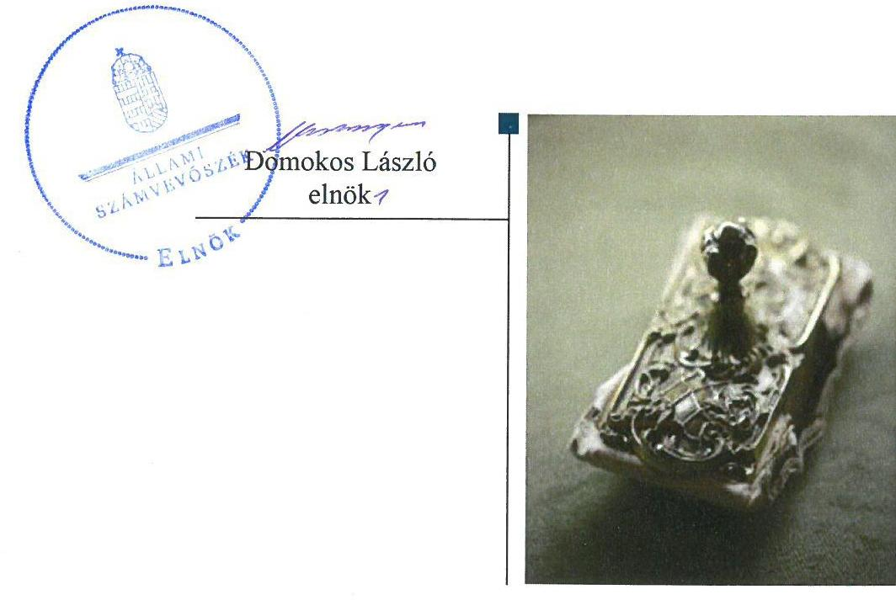
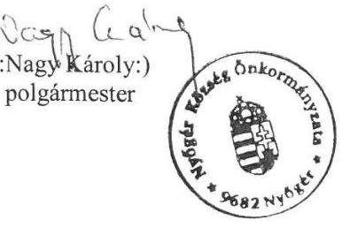
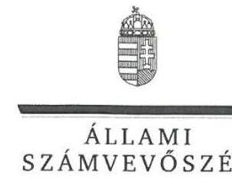
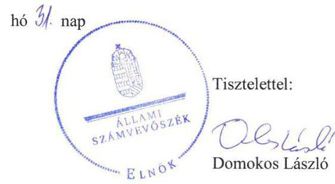
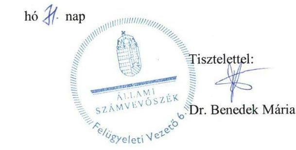

# Jelentés 

## Önkormányzatok ellenőrzése

Integritás- és belső kontrollrendszer, Befektetési tevékenységek ellenőrzése Nyőgér Község Önkormányzata 2019.

---

# Jelentés 

## Önkormányzatok ellenőrzése

Integritás- és belső kontrollrendszer, Befektetési tevékenységek ellenőrzése Nyőgér Község Önkormányzata
2019. 10. hó 10. nap

---

# AZ ELLENŐRZÉST FELÜGYELTE:

DR. BENEDEK MÁRIA felügyeleti vezető

## AZ ELLENŐRZÉST VEZETTE ÉS A VÉGREHAJTÁSÁÉRT FELELŐS:

KUSZINGER ANDREA ellenőrzésvezető

## A PROGRAM ÖSSZEÁLLÍTÁSÁÉRT FELELŐS:

TÓTPÁL SZABOLCS osztályvezető

IKTATÓSZÁM: EL-0837-058/2019.

|  Jelentéseink az Országgyűlés számítógépes hálózatán és az Interneta a www.asz.hu címen is olvashatóak. | TÉMASZÁM: 16.  |
| --- | --- |
|   | ELLENŐRZÉS-AZONOSÍTÓ SZÁM: V082936  |

---

# TARTALOMJEGYZÉK 

■ ÖSSZEGZÉS ..... 5
■ AZ ELLENŐRZÉS CÉLJA ..... 6
■ AZ ELLENŐRZÉS TERÜLETE ..... 7
■ AZ ELLENŐRZÉS HÁTTERE, INDOKOLTSÁGA ..... 8
■ A JELENTÉS LÉNYEGES KÉRDÉSKÖREI ..... 9
■ AZ ELLENŐRZÉS HATÓKÖRE ÉS MÓDSZEREI ..... 10
■ MEGÁLLAPÍTÁSOK ..... 12
■ JAVASLATOK ..... 17
■ MELLÉKLETEK ..... 19
I. sz. melléklet: Értelmező szótár ..... 19
■ FÜGGELÉKEK ..... 21
I. sz. függelék a jelentéshez ..... 21
II. sz. függelék: Észrevételek ..... 22
■ RÖVIDÍTÉSEK JEGYZÉKE ..... 29

---

.

---

# ÖSSZEGZÉS 

Nyögér Község Önkormányzata belső kontrollrendszerének kialakítása és müködtetése nem volt szabályszerű, ezáltal a közpénzekkel, a nemzeti vagyonnal való elszámoltatható, felelős gazdálkodás és a befektetési tevékenység szabályszerű végzése nem volt biztositott. A befektetett vagyonáról nem nyújtott megbizható és valós képet. Az integritás kontrollokat nem építette ki, az integritás alapú müködést nem biztositotta.

## Az ellenőrzés társadalmi indokoltsága

Az önkormányzatok vagyona a nemzeti vagyon része, és az Alaptörvény is rögzíti, hogy a vagyonnal való gazdálkodás célja a közérdek szolgálata, ezért az önkormányzatok felé elvárás a kiegyensúlyozott, átlátható és fenntartható költségvetési gazdálkodás elvének érvényesítése, továbbá a nemzeti vagyonnal való rendeltetésszerű és felelős módon való gazdálkodás. Az Állami Számvevőszék törvényben kapott felhatalmazással élve ellenőrzi az önkormányzatok gazdálkodását, múködését, hogy az ellenőrzések megállapításaival támogassa az ellenőrzött önkormányzatok szabályszerű gazdálkodását, javaslataival elősegítse az Alaptörvényben megfogalmazott alapvetések érvényesülését a mindennapi életben az önkormányzatok szintjén. Az Állami Számvevőszék stratégiájában megfogalmazottak szerint támogatja az integritás alapú, átlátható és elszámoltatható közpénzfelhasználás megteremtését. Mindezekre tekintettel, a közpénzzel gazdálkodó szervezetek esetében a belső kontrollrendszer megfelelő kialakítása és múködtetése ellenőrzését prioritásként kezeli az Állami Számvevőszék.

Az Állami Számvevőszék Nyőgér Község Önkormányzatát korábban nem ellenőrizte.

## Főbb megállapítások, következtetések, javaslatok

Nyőgér Község Önkormányzata belső kontrollrendszerének kialakítása és múködtetése nem volt szabályszerű. A jegyző 2013. február 18-ig nem készítette el a Nyőgéri Közös Önkormányzati Hivatal szervezeti és múködési szabályzatát. A jegyző által készített, 2013. február 19-től hatályos szervezeti és múködési szabályzat nem tartalmazta a szervezeti ábrát, illetve a jegyző és az aljegyző feladatait és hatásköreit. A jegyző a szervezeti integritást sértő események kezelésének eljárásrendjét 2016. október 1-jétől nem szabályozta és 2013. január 1-jétől 2016. szeptember 30-ig a kockázatkezelési rendszert, 2016. október 1-jétől az integrált kockázatkezelési rendszert nem múködtette, így nem biztosította a szabályszerű múködés követelményeinek érvényesülését. A jegyző a teljesítménymérés feltételeit nem alakította ki, ezáltal nem biztosította a szabályszerű, hatékony, gazdaságos és eredményes közpénzfelhasználást. A belső kontrollrendszer múködtetése során feltárt hiányosságok és szabálytalanságok miatt nem volt biztosított a közpénzzel, a nemzeti vagyonnal való elszámoltatható, felelős gazdálkodást.

A 2013-2017 években a kiépített kontrollrendszer nem biztosította a befektetési tevékenység szabályszerű végzését. A jegyző nem készítette el Nyőgér Község Önkormányzata, illetve a Nyőgéri Közös Önkormányzati Hivatal számviteli politikáját és a számviteli politika keretében elkészítendő eszközök és források leltárkészítési és leltározási szabályzatát, az eszközök és források értékelési szabályzatát, valamint a pénzkezelési szabályzatot 2013. június 30-ig. Az egyes befektetések részletező nyilvántartásának nem a jogszabályi előírások szerinti vezetése, valamint leltári alátámasztottsága hiányában Nyőgér Község Önkormányzata beszámolója a vagyonáról nem nyújtott megbízható és valós összképet.

A jegyző a belső ellenőrzést nem szabályszerűen múködtette, a belső ellenőrzés nem támogatta az egyes befektetési tevékenységek szabályszerű ellátását. A jegyző az integritás kontrollokat nem építette ki, a kockázatelemzés hiánya miatt a múködés során az integritás szemlélet nem érvényesült.

Az Állami Számvevőszék az ellenőrzés megállapításai alapján Nyőgér Község Önkormányzata polgármesterének egy javaslatot, jegyzőjének tíz javaslatot fogalmazott meg.

---

# AZ ELLENŐRZÉS CÉLJA 

Az ellenőrzés célja annak megállapítása volt, hogy az önkormányzat belső kontrollrendszere biztosította-e a közpénzekkel és a nemzeti vagyonnal történő elszámoltatható, átlátható, szabályszerű, gazdaságos, hatékony és eredményes gazdálkodás feltételeit. Az ellenőrzés értékelte továbbá, hogy az önkormányzatnál kiépítették és erősítették-e a korrupciós kockázatok kezelését szolgáló integritás kontrollokat és azt, hogy megteremtették-e a teljesítményellenőrzés feltételeit.

Az ellenőrzés további célja annak értékelése volt, hogy a jogszabályi előírásoknak megfelelően alakították-e ki a belső kontrollrendszert, a kontrollkörnyezet biztosította-e a befektetési tevékenységek szabályszerű végzését. Az Állami Számvevőszék értékelte továbbá, hogy az egyes befektetési tevékenységekkel kapcsolatos döntéshozatal és a döntések végrehajtása, valamint az egyes befektetések számviteli elszámolása, nyilvántartása szabályszerű volt-e, és a belső és külső ellenőrzések támogatták-e az egyes befektetési tevékenységek szabályszerű végzését.

---

# **AZ ELLENŐRZÉS TERÜLETE**

## **Nyőgér Község Önkormányzata**

Nyőgér község a Nyugat-Dunántúli régióban, Vas megyében a Sárvári járásban fekszik. Állandó lakosainak száma a KSH1 Magyarország közigazgatási helynévkönyve alapján 2018. január 1-én 338 fő volt.

A polgármester2 2014. október 12-től tölti be tisztségét, a jegyző3 2013. január 1-jétől látja el feladatait. A polgármester és a jegyző személyében a 2017. évben változás nem történt. Nyőgér Község Önkormányzata öt tagú Képviselő-testületét4 az Ügyrendi Bizottság támogatta.

A 2017. évben Nyőgér Község Önkormányzatánál a gazdálkodási feladatokat a Nyőgéri Közös Önkormányzati Hivatal látta el.

Nyőgér Község Önkormányzata a 2017. évi konszolidált beszámolója szerint 259,0 millió Ft költségvetési bevételt ért el, és 181,5 millió Ft költségvetési kiadást teljesített. A könyvviteli mérleg szerinti befektetett eszközvagyon értéke 2017. december 31-én 322,3 millió Ft volt. A követelések értéke 1,2 millió Ft, a kötelezettségek értéke 8,4 millió Ft volt, amelyből az éven túli kötelezettségek összege 4,8 millió Ft volt.

Nyőgér Község Önkormányzatának Képviselő testülete hat települési önkormányzat hivatali feladatainak ellátására 2013. január 1-jével megalapította a Nyőgéri Közös Önkormányzati Hivatalt.

Nyőgér Község Önkormányzata feladatai ellátása érdekében tagja a Társulás1,3-nek.

Nyőgér Község Önkormányzata a belső ellenőrzést 2017. február 7-étől alakította ki, amelyet külső megbízott útján látott el.

Nyőgér Község Önkormányzata a szabad pénzeszközeit tőkegarantált befektetési jegyek vásárlására fordította, amelynek könyv szerinti értéke 2013-ban 17 millió Ft, 2014-ben 24 millió Ft, 2015-ben 31 millió Ft, 2016-ban 31 millió Ft, 2017-ben 38,8 millió Ft volt.

Nyőgér Község Önkormányzata befektetési célú (nem önkormányzati közfeladat-ellátást szolgáló) ingatlannal, kulturális javakkal és egyéb értéktárgyakkal az ellenőrzött időszakban nem rendelkezett.

---

# AZ ELLENŐRZÉS HÁTTERE, INDOKOLTSÁGA 

A belső kontrollrendszer kialakítása és működtetése nélkül nem valósítható meg a közpénzek, a közvagyon átlátható, szabályos, gazdaságos, hatékony és eredményes felhasználása. A belső kontrollrendszer azt a célt szolgálja, hogy a költségvetési szervek működésük és gazdálkodásuk során a tevékenységeket szabályszerűen hajtsák végre, teljesítsék elszámolási kötelezettségeiket és megvédjék az erőforrásokat a veszteségektől, a károktól és a nem rendeltetésszerű használattól. A belső kontrollrendszer magában foglalja mindazon elveket, eljárásokat és belső szabályzatokat, melyek biztosítják, hogy a költségvetési szerv valamennyi tevékenysége és célja összhangban legyen a szabályszerűséggel, szabályozottsággal, valamint a gazdaságosság, hatékonyság és eredményesség követelményeivel, az eszközökkel és forrásokkal való gazdálkodásban ne kerüljön sor pazarlásra, visszaélésre, rendeltetésellenes felhasználásra. Megfelelő, pontos és naprakész információk álljanak rendelkezésre a költségvetési szerv működésével kapcsolatosan, és a belső kontrollrendszer harmonizációjára, öszszehangolására vonatkozó jogszabályok végrehajtásra kerüljenek. Az integritás kontrollok kiépítése, erősítése a szervezet korrupciós kockázatainak kezelését szolgálja. A teljesítménykövetelmények meghatározása és működtetése megalapozhatja az önkormányzatoknál a teljesítményellenőrzés lefolytatását.

Az önkormányzati vagyongazdálkodás keretében az önkormányzatok átmenetileg szabad pénzeszközeinek befektetését jogszabály nem tiltja, a befektetések jellege nem korlátozott, a pénzpiaci szolgáltatók közül az önkormányzatok a kínált szolgáltatás és annak költségei alapján, szabadon választhatnak, azonban a veszteséges gazdálkodás kockázatai és következményei az önkormányzatokat terhelik. A szabad pénzeszközök felhasználása során kiemelten fontos a felelős gazdálkodás érvényesülése, amely összhangban kell, hogy legyen, az önkormányzati gazdálkodás alapelveivel. Az ellenőrzéssel feltárásra kerülhetnek azok a kockázatok, amelyek az önkormányzatok gazdálkodásával, ezen belül befektetési tevékenységeivel, kontrollkörnyezetével kapcsolatosak és a befektetési tevékenységek szabályszerű végrehajtását befolyásolják. Az ellenőrzéssel az önkormányzatok befektetési/vagyongazdálkodási döntései értékelhetővé válnak, és megalapozott megállapítás tehető arra vonatkozóan, hogy milyen hatást gyakoroltak az önkormányzat vagyonára a képviselő-testület döntései.

---

# A JELENTÉS LÉNYEGES KÉRDÉSKÖREI 

1. Az önkormányzat belső kontrollrendszerének kialakítása és müködtetése szabályszerű volt-e a 2017. évben?
2. A befektetési tevékenységek szabályszerű végzését a kiépített kontrollrendszer biztositotta-e a 2013-2017. években?
3. Az önkormányzatnál alakítottak-e ki a teljesítmény mérésére alkalmas követelményeket?
4. Az önkormányzat egyes befektetéseivel kapcsolatos döntéshozatala és az egyes befektetések számviteli elszámolása, nyilvántartása szabályszerű volt-e?

---

# AZ ELLENŐRZÉS HATÓKÖRE ÉS MÓDSZEREI 

## Az ellenőrzés típusa

Megfelelőségi és szabályszerűségi ellenőrzés.

## Az ellenőrzött időszak

Az integritás és belső kontrollrendszer ellenőrzött időszaka a 2017. év, illetve az éves költségvetési beszámoló Áht. ${ }^{6}$ által megállapított jóváhagyásáig, 2018. május 31-éig tartó időszak volt.
Az egyes befektetési tevékenységek ellenőrzése tekintetében az ellenőrzött időszak 2013. január 1. - 2017. december 31. közötti időszak, továbbá a 2013. január 1. előtti időszak, a 2017. december 31-én meglévő befektetésekkel kapcsolatos döntéshozatalra a 2013. január 1. előtti időszakban 2002. január 16-án kelt, OT4703 ADV/00018686 ügyletszámon megkötött befektetési jegy adás-vételi szerződés alapján - került sor.

## Az ellenőrzés tárgya

Az önkormányzat és a gazdálkodási feladatokat ellátó hivatala belső kontrollrendszerének kialakítása és múködtetése, valamint az integritás kontrollok kiépítettsége, a teljesítményellenőrzés feltételeinek ellenőrzése volt.

Az egyes befektetési tevékenységek ellenőrzésének tárgya az önkormányzat 2017. december 31-én meglévő, a Számv. tv . ${ }^{7}$ 3. § (6) bekezdés 2. és 3. pontja szerint az értékpapírokban megtestesülő befektetései, lekötött betétei.

## Az ellenőrzött szervezet

Nyőgér Község Önkormányzata

## Az ellenőrzés jogalapja

Az ellenőrzés jogszabályi alapját az ÁSZ tv. ${ }^{8}$ 1. § (3) bekezdés, 5. § (2) és (6) bekezdései, valamint az Áht. 61. § (2) bekezdésének előírásai képezik.

---

# Az ellenőrzés módszerei 

Az ÁSZ ${ }^{9}$ az ellenőrzést az ellenőrzési program szempontjai, az ellenőrzött időszakban hatályos jogszabályok, az ellenőrzés szakmai szabályai, a jelen ellenőrzésre irányadó ÁSZ módszertanok figyelembevételével hajtotta végre.

Az ÁSZ az ellenőrzés ideje alatt az ellenőrzött szervezettel történő kapcsolattartást az ÁSZ SZMSZ ${ }^{10}$-ének vonatkozó előírásai alapján biztosította.

Az ellenőrzési kérdések megválaszolásához szükséges bizonyítékok megszerzése az ellenőrzött által rendelkezésre bocsátott dokumentumokra, adatokra alapozva megfigyelés, szemle (szemrevételezés), kérdésfeltevés (információkérés), mintavételezés, valamint elemző eljárás útján történt. Az ellenőrzési bizonyítékként felhasználható adatforrások közé tartoztak egyrészt az ellenőrzési program részletes szempontjainál felsorolt adatforrások, másrészt minden - az ellenőrzés folyamán feltárt, az ellenőrzés szempontjából információt tartalmazó - dokumentum.

Az ellenőrzés lefolytatásához az ellenőrzött szervezet tanúsítványok kitöltésével, valamint az ÁSZ által kért dokumentumok megküldésével szolgáltatott adatokat, amelyek valódiságát és teljes körűségét az ellenőrzött szervezet vezetője által tett teljességi és hitelességi nyilatkozat igazolta. A rendelkezésre bocsátott adatok, információk kontrollja az ellenőrzés keretében megtörtént.

Az önkormányzat belső kontrollrendszere egyes pilléreinek kialakítására és működtetésére vonatkozó értékelés „szabályszerű", amennyiben az értékelt területen az elért „igen" válaszok százalékban kifejezett, egész számra kerekített aránya legalább $85 \%$, „nem szabályszerű", ha nem éri el a $85 \%$-ot.

Az önkormányzat belső kontrollrendszerének összesített értékelése az egyes részterületek esetében kapott megfelelőségi arányok számtani átlaga alapján történik és megegyezik a pillérenként (kontrollterületenként) alkalmazott százalékos értékelésekkel, a következő eltérésekkel: a kontrollrendszer egésze esetében a „szabályszerű" értékelésnek a százalékos értéken felül további feltétele, hogy egyik kontrollterület sem kaphat „nem szabályszerű" értékelést.

A 2017. évi kiadások teljesítéséhez kapcsolódó pénzgazdálkodási belső kontrollok működésének szabályszerűsége esetében az ellenőrzés azokra a legnagyobb értékű tételekre - a lényeges sokaságra - terjedt ki, melyek összértéke elérte a teljes sokaság összértékének 50\%-át.

A 2017. évi kiadások esetében a lényeges sokaságot tételesen ellenőrizte az ÁSZ. Az önkormányzatok befektetési tevékenységét a szerződéskötés (és a kapcsolódó döntés-előkészítés, döntéshozatal) kivételével a 2013. január 1. és 2017. december 31. közötti időszak vonatkozásában értékelte az ÁSZ. A szerződéskötést az önkormányzat 2017. december 31-én meglévő értékpapírjai és egyéb befektetései vonatkozásában értékelte az ÁSZ a befektetési döntés előkészítése és döntéshozatala tekintetében, amelyre a 2013. január 1. előtti időszakban - 2002. január 16-án kelt, OT4703 ADV/00018686 ügyletszámon megkötött befektetési jegy adás-vételi szerződés alapján - került sor. A 2013. évet megelőzően történt szerződéskötést, illetve a döntések előkészítését a mindenkor hatályos jogszabályok előírásai alapján értékelte az ÁSZ.

---

# 1. Az önkormányzat belső kontrollrendszerének kialakítása és múködtetése szabályszerű volt-e a 2017. évben? 

## Összegző megállapítás

Az Önkormányzat ${ }^{11}$ belső kontrollrendszerének múködtetése nem volt szabályszerű a 2017. évben.

A kontrollkörnyezet kialakítása 2017-ben nem volt szabályszerű.
A kontrollkörnyezet kialakításával kapcsolatosan feltárt szabálytalanságokat az 1. táblázat mutatja be.

1. táblázat

## A KONTROLLKÖRNYEZET KIALAKÍTÁSÁVAL KAPCSOLATOSAN FELTÁRT SZABÁLYTALANSÁGOK

Sorszám | Részmegállapítás | Megjegyzés

1. A jegyző a Bkr. ${ }^{12}$ 6. § (1) bekezdés c) pontjában foglaltak ellenére a 2017. évben a szervezet minden szintjére vonatkozóan nem határozta meg az etikai elvárásokat.
2. A jegyző a Számv. tv. 14. § (4) bekezdésben foglaltak ellenére a 2017. évben a számviteli politika ${ }_{2-5}$-ben nem határozta meg, hogy az alkalmazott gyakorlatot miIyen okok miatt kell megváltoztatni.
3. A jegyző az Áhsz. ${ }_{2}{ }^{13}$ 50. § (2) bekezdés c) pontjában foglaltak ellenére a 2017. évben a Hivatalra ${ }^{14}$ vonatkozó értékelési szabályzat ${ }_{3-4}$-ben nem rögzítette az egyszerűsített értékelési eljárás alá vont követelések besorolásának elveit, dokumentálásának szabályait.
4. A jegyző az Ltv. 10. § (1) bekezdés c) pontjában foglaltak szerinti egyedi iratkezelési szabályzatot nem adott ki a 2017. évben.

Forrás: ÁSZ

Az integrált kockázatkezelési rendszer működtetése nem volt szabályszerű.

Az integrált kockázatkezelési rendszer működtetésével kapcsolatosan feltárt szabálytalanságot a 2. táblázat mutatja be.
2. táblázat

## AZ INTEGRÁLT KOCKÁZATKEZELÉSI RENDSZER MŰKÖDTETÉSÉVEL KAPCSOLATOSAN FELTÁRT SZABÁLYTALANSÁG

Sorszám | Részmegállapítás | Megjegyzés

1. A jegyző a Bkr. 7. § (1) bekezdésében foglaltak ellenére a 2017. évben integrált kockázatkezelési rendszert nem működtetett.

Forrás: ÁSZ

A kontrolltevékenységek működtetése szabályszerű volt. Az Önkormányzat rendelkezett gazdálkodási szabályzat ${ }_{1-4}{ }^{15}$-gyel. A gazdálkodási jogkörök gyakorlása a 2017. évben a vonatkozó jogszabályokban és a belső szabályzatokban foglaltak szerint történt.

Az információs és kommunikációs rendszer működtetése nem volt szabályszerű. Az Önkormányzat rendelkezett közérdekű adatok megismerésére vonatkozó szabályzattal ${ }^{16}$.

---

Az információs és kommunikációs rendszer működtetése során feltárt szabálytalanságokat a 3. táblázat mutatja be.
3. táblázat

# AZ INFORMÁCIÓS ÉS KOMMUNIKÁCIÓS RENDSZER MŰKÖDTETÉSE SORÁN FELTÁRT SZABÁLYTALANSÁGOK 

Sorszám
1. A jegyző a Bkr. 9. § (1)-(2) bekezdése ellenére a 2017. évben nem múködtetett olyan rendszereket, amelyek biztosítják, hogy a megfelelő információk a megfelelő időben eljussanak az illetékes szervezethez, szervezeti egységhez, illetve személyhez, valamint a beszámolási rendszerek hatékony, megbízható, pontos és összehasonlítható múködése érdekében nem határozta meg világosan a beszámolási szinteket, határidőket és módokat.
2. A jegyző az Info. tv. 37. § (1) bekezdésében hivatkozott 1. melléklete szerinti általános közzétételi lista II/1.,6.,8.,9.,13. valamint a III/2. pontjaiban meghatározott adatokat nem tette közzé.

A jegyző az Info tv. 37. § (1) bekezdésében hivatkozott 1. melléklete szerinti általános közzétételi lista II/13. pontja esetében a közérdekú adatok megismerésére irányuló igények teljesítésének rendjét, az illetékes szervezeti egység nevét, elérhetőségét nem tette közzé.

Fonós: ÁSZ

## A MONITORING RENDSZERT AZ ÖNKORMÁNYZAT

A BELSŐ ELLENŐRZÉS útján valósította meg. A belső ellenőrzés múködtetése nem volt szabályszerű. A belső ellenőrzéssel kapcsolatosan feltárt szabálytalanságot a 4. táblázat szemlélteti:
4. táblázat

## A BELSŐ ELLENŐRZÉSSEL KAPCSOLATOSAN FELTÁRT SZABÁLYTALANSÁG

Sorszám
1. A jegyző a Bkr. 15. § (2) bekezdésében foglaltak ellenére nem írta elő a belső ellenőrzést végző személy feladatait a Hivatali SZMSZ,-ban.

Fonós: ÁSZ

A jegyző a Bkr. 1. melléklete szerinti nyilatkozatban értékelte az Önkormányzat belső kontrollrendszerének minőségét. A jegyző az egyes pilléreket szabályszerűnek értékelte, azonban az ÁSZ ellenőrzés megállapításai a kontrolltevékenységek kivételével - nem támasztották alá a nyilatkozatban foglaltakat.

Az Önkormányzat nem építette ki az integritás kontrollokat. A múködés során az integritás szemlélet nem érvényesült. A jogszabályok által kötelezően elő nem írt kontrollokat nem alakította ki, így a kontrollok nem támogatták az integritás alapú múködést.

## 2. A befektetési tevékenységek szabályszerű végzését a kiépített kontrollrendszer biztosította-e a 2013-2017. években?

Összegző megállapítás
A befektetési tevékenységek szabályszerű végzését a kiépített kontrollrendszer nem biztosította a 2013-2017. években.

A befektetési tevékenységek végzésre kiépített kontrollrendszerrel kapcsolatosan feltárt szabálytalanságokat az 5. táblázat mutatja be.

---

# A BEFEKTETÉSI TEVÉKENYSÉGEK VÉGZÉSRE KIÉPÍTETT KONTROLLRENDSZERREL KAPCSOLATOSAN FELTÁRT SZABÁLYTALANSÁGOK 

| Sorszám | Részmegállapítás | Megjegyzés |
| :--: | :--: | :--: |
| 1. | A jegyző az Áht. 10. § (5) bekezdésében foglaltak ellenére a Hivatal szervezetét, feladatai ellátásának részletes rendjét és módját szervezeti és müködési szabályzatban nem állapította meg 2013. január 1. - 2013. február 18. között. | A Hivatal 2013. február 19-től rendelkezett Hivatali SZMSZ ${ }^{17}{ }_{1-3}$-mal. |
| 2. | A jegyző által készített Hivatali SZMSZ ${ }_{1-3}$ az Ávr. ${ }^{18}$ 13. § (1) bekezdés e) és g) pontjában foglaltak ellenére nem tartalmazta a szervezeti ábrát, valamint a nevesített munkakörök közül a jegyző és az aljegyző feladat- és hatáskörét, a hatáskörök gyakorlásának módját és az ezekhez kapcsolódó felelősségi szabályokat 2013. február 19-től 2017. december 31-ig. | A helyettesítés rendjét a Hivatali SZMSZ ${ }_{1-}$ 3 tartalmazta. |
| 3. | A jegyző a Hivatalra és az Önkormányzatra a Számv. tv. 14. § (3) bekezdésében foglaltak ellenére nem készítette el a számviteli politikát a 2013. január 1. - 2013. június 30. közötti időszakra. | A Hivatal és az Önkormányzat 2013. július 1-jétől rendelkezett számviteli politika ${ }^{19}{ }_{1-}$ 5-tel. |
| 4. | A jegyző a Hivatalra és az Önkormányzatra a Számv. tv. 14. § (5) bekezdésében foglaltak ellenére a számviteli politika keretében nem készítette el az eszközök és források leltárkészítési és leltározási szabályzatát, az eszközök és források értékelési szabályzatát és a pénzkezelési szabályzatot a 2013. január 1. - 2013. június 30. közötti időszakra. | A Hivatal és az Önkormányzat 2013. július 1-jétől rendelkezett az eszközök és források leltárkészítési és leltározási szabályzatával ${ }^{20}{ }_{1-5}$, eszközök és források értékelési szabályzatával ${ }^{21}{ }_{1-4}$ és pénzkezelési szabályzattal ${ }^{22}{ }_{1-9}$. |
| 5. | A jegyző a Bkr. 6. § (4) bekezdésében előírtak ellenére a szabálytalanságok kezelésének eljárásrendjét 2014. december 31-ig nem szabályozta, a szervezeti integritást sértő események kezelésének eljárásrendjét 2016. október 1-jétől nem szabályozta. | A Hivatal 2015. január 1-jétől rendelkezett szabálytalanságkezelési szabályzat-tal ${ }_{1-2}{ }^{23}$, amely nem felelt meg a szervezeti integritást sértő események kezelésére vonatkozó eljárásrendnek. |
| 6. | A jegyző a Bkr. 3. § b) pontjában foglaltak ellenére 2016. szeptember 30-ig nem alakított ki - a szervezet minden szintjén érvényesülő - kockázatkezelési rendszert, 2016. október 01-től 2017. szeptember 28-ig integrált kockázatkezelési rendszert. | A Hivatal 2017. szeptember 29-től rendelkezett kockázatkezelési szabályzat ${ }^{24}$ tal, amely az integrált kockázatkezelési rendszer kialakítására alkalmas volt. |
| 7. | A jegyző a Hivatalra és az Önkormányzatra az Ávr. 13. § (2) bekezdés a) pontjában foglaltak ellenére a kötelezettségvállalás, ellenjegyzés, teljesítés igazolása, érvényesítés, utalványozás gyakorlatának módjával, eljárási és dokumentációs részletszabályaival, valamint az ezeket végző személyek kijelölésének rendjével kapcsolatos belső előírásokat belső szabályzatban nem rendezte 2013. január 1. - 2013. június 30. között. | A Hivatal és az Önkormányzat 2013. július 1-jétől rendelkezett pénzkezelési szabály-zat ${ }_{1-2}$-vel, amely magában foglalta a kötelezettségvállalás, ellenjegyzés, utalványozás, érvényesítés szabályait, illetve a Hivatal és az Önkormányzat 2016. január 1-jétől rendelkezett gazdálkodási szabály-zat ${ }_{1-4}$-gyel. |
| 8. | A jegyző a Bkr. 3. § d) pontjában foglaltak ellenére nem alakította ki a belső kontrollrendszer keretében - a szervezet minden szintjén érvényesülő - információs és kommunikációs rendszert 2013. január 1-jétől 2015. december 31-ig. | A Hivatal 2016. január 1-jétől rendelkezett adatvédelmi szabályzattal ${ }^{25}$, amelynek hatálya az Önkormányzatra is kiterjedt. Az adatvédelmi szabályzat tartalmazta az információs és kommunikációs rendszerre vonatkozó szabályokat. |

Forrás: $A S Z$

Az Önkormányzat a befektetésekre vonatkozóan nem végzett kockázatelemzést, ezáltal a befektetési tevékenységet érintő intézkedések nem fogalmazódtak meg. Az Önkormányzatnál 2013. január 1. - 2017. december 31. közötti időszakban a befektetésekkel kapcsolatos tevékenységet a belső ellenőrzés nem ellenőrizte, ezáltal a belső ellenőrzés nem támogatták az egyes befektetési tevékenységek szabályszerű végzését.

---

# 3. Az önkormányzatnál alakítottak-e ki a teljesítmény mérésére alkalmas követelményeket? 

Összegző megállapítás Az Önkormányzatnál nem alakítottak ki a teljesítmény mérésére alkalmas követelményeket.

A szervezeti célok elérését szolgáló feladatok, folyamatok, tevékenységek mérését szolgáló indikátorokat, mérőszámokat, feladat- és teljesítménymutatókat az Önkormányzat nem képzett, így nem biztosította a teljesítménymérés lehetőségét.

## 4. Az önkormányzat egyes befektetéseivel kapcsolatos döntéshozatala és az egyes befektetések számviteli elszámolása, nyilvántartása szabályszerű volt-e?

Összegző megállapítás Az Önkormányzat egyes befektetéseivel kapcsolatos döntéshozatala a 2013-2017. években szabályszerű volt, az egyes befektetések számviteli elszámolása, nyilvántartása a 20132017. években nem volt szabályszerű.

AZ EGYES BEFEKTETÉSEKKEL KAPCSOLATOS DÖNTÉSHOZATAL a 2013-2017. években szabályszerű volt.

Az Önkormányzat a forgatási célú hitelviszonyt megtestesítő értékpapírokkal (tőkegarantált befektetési jegyekkel) kapcsolatos döntéseket az önkormányzati költségvetési rendeletek ${ }_{1-5}{ }^{26}$ előírásaiban foglaltak szerint hozta meg. Az Önkormányzat a forgatási célú hitelviszonyt megtestesítő értékpapírok (tőkegarantált befektetési jegyek) vásárlására vonatkozó képviselőtestületi határozatokkal rendelkezett.

A SZÁMVITELI ELSZÁMOLÁS ÉS NYILVÁNTARTÁS a 2013-2017. években nem volt szabályszerű.

Az egyes befektetések számviteli elszámolásával, nyilvántartásával kapcsolatosan feltárt szabálytalanságokat a 6. táblázat mutatja be.

---

# AZ EGYES BEFEKTETÉSEK SZÁMVITELI ELSZÁMOLÁSÁVAL, NYILVÁNTARTÁSÁVAL KAPCSOLATBAN FELTÁRT SZABÁLYTALANSÁGOK 

| Sorszám | Részmegállapítás | Megjegyzés |
| :--: | :--: | :--: |
| 1. | A jegyző a 2013-2017. években az Áhsz.; 49. § (1) bekezdésében és az Áhsz.; 45. § (3) bekezdésben foglaltak ellenére a forgatási célú hitelviszonyt megtestesítő értékpapírokra (tőkegarantált befektetési jegy) vonatkozóan az elemi költségvetési beszámoló adatai valóságnak megfelelő, áttekinthető alátámasztásáról és adatszolgáltatási kötelezettségének alátámasztásáról a könyvviteli számlák alábontásával vagy a könyvviteli számlákhoz kapcsolódó részletező nyilvántartások vezetésével nem gondoskodott. |  |
| 2. | A jegyző a Számv. tv. 69.§ (1) bekezdésében foglaltak ellenére a 2013-2015. években a forgatási célú hitelviszonyt megtestesítő értékpapírok (tőkegarantált befektetési jegyek) mérleg tételeinek alátámasztásához nem állított össze olyan leltárt, amely tételesen, ellenőrizhető módon tartalmazza a mérleg fordulónapján meglévő eszközöket mennyiségben és értékben, így a Számv. tv. 15. § (3) bekezdésében előírt valódiság elve nem érvényesült. | A jegyző a 2016-2017. évekre vonatkozóan a forgatási célú hitelviszonyt megtestesítő értékpapírok (tőkegarantált befektetési jegyek) leltározását elvégezte. |

---

# JAVASLATOK 

Az ÁSZ tv. 33. § (1) bekezdésében foglaltak értelmében az ellenőrzött szervezet vezetője köteles a jelentésben foglalt megállapításokhoz kapcsolódó intézkedési tervet összeállítani és azt a jelentés kézhezvételétől számított 30 napon belül az ÁSZ részére megküldeni. Amennyiben az ellenőrzött szervezet vezetője nem küldi meg határidőben az intézkedési tervet, vagy továbbra sem elfogadható intézkedési tervet küld, az Állami Számvevőszék elnöke az ÁSZ tv. 33. § (3) bekezdése a) és b) pontjaiban foglaltakat érvényesítheti.

## a Polgármesternek

1. Intézkedjen az Állami Számvevőszék ellenőrzése során feltárt hiányosságok és/vagy szabálytalanságok tekintetében a munkajogi felelősség tisztázására irányuló eljárás megindításáról, és ennek eredménye ismeretében tegye meg a szükséges intézkedéseket.
(1. táblázat 1-4., 2. táblázat 1., 3. táblázat 1., 3-5., 4. táblázat 1., 5. táblázat 2., 5., 6. táblázat 1 sz. megállapítások alapján)

## a Jegyzőnek

1. Intézkedjen a Bkr. előírásának megfelelően olyan kontrollkörnyezet kialakításáról, amelyben a szervezet minden szintjén meghatározottak az etikai elvárások.
(1. táblázat 1. sz. megállapítás alapján)
2. Intézkedjen arról, hogy a Számv. tv. előírásának megfelelően a számviteli politika keretében meghatározásra kerüljenek, hogy az alkalmazott gyakorlatot milyen okok miatt kell megváltoztatni.
(1. táblázat 2. sz. megállapítás alapján)
3. Intézkedjen arról, hogy az Áhsz. előírásának megfelelően a Hivatalra vonatkozó értékelési szabályzatban rögzítésre kerüljenek az egyszerüsített értékelési eljárás alá vont követelések besorolásának elvei, dokumentálásának szabályai.
(1. táblázat 3. sz. megállapítás alapján)

---

4. Intézkedjen az Ltv. előírásának megfelelően az iratkezelési szabályzat - Magyar Nemzeti Levéltárral és megyei kormányhivatallal egyetértésben történő - kiadásáról.
(1. táblázat 4. sz. megállapítás alapján)
5. Müködtessen a Bkr. előírásának megfelelő integrált kockázatkezelési rendszert.
(2. táblázat 1. sz. megállapítás alapján)
6. Intézkedjen a Bkr. előírásának megfelelően olyan rendszerek müködtetéséről, amelyek biztositják, hogy a megfelelő információk a megfelelő időben eljussanak az illetékes szervezethez, szervezeti egységhez, illetve személyhez, valamint a beszámolási rendszerek hatékony, megbízható, pontos és összehasonlítható müködése érdekében határozza meg világosan a beszámolási szinteket, határidőket és módokat.
(3. táblázat 1. sz. megállapítás alapján)
7. Intézkedjen a Bkr előírásának megfelelően a belső ellenőrzést végző személy faladatainak Hivatali SZMSZ-ben történő előírásáról.
(4. táblázat 1. sz. megállapítás alapján)
8. Intézkedjen arról, hogy a Hivatal szervezeti és müködési szabályzata tartalmazza az Ávr.-ben elöirt szervezeti ábrát, a nevesített munkakörök közül a jegyző és az aljegyző feladat- és hatáskörét, a hatáskörök gyakorlásának módját és az ezekhez kapcsolódó felelősségi szabályokat.
(5. táblázat 2. sz. megállapítás alapján)
9. Intézkedjen a Bkr. előírásának megfelelően a szervezeti integritást sértő események kezelése eljárásrendjének szabályozásáról.
(5. táblázat 5. sz. megállapítás alapján)
10. Intézkedjen az Áhsz. előírásának megfelelően a forgatási célú hitelviszonyt megtestesítő értékpapírok (tőkegarantált befektetési jegyek) vonatkozásában az adatszolgáltatási kötelezettségek alátámasztásáról a könyvviteli számlák Áhsz. szerinti alábontásával vagy a könyvviteli számlákhoz kapcsolódó részletező nyilvántartások vezetésével.
(6. táblázat 1. sz. megállapítás alapján)

---

# MELLÉKLETEK 

- I. SZ. MELLÉKLET: ÉRTELMEZŐ SZÓTÁR
belső ellenőrzés
belső kontrollrendszer
belső kontrollrendszer területei
forgatási célú értékpapír
hitelviszonyt megtestesítő értékpapír
integrált kockázatkezelési
rendszer
integritás
kockázat

Független, tárgyilagos bizonyosságot adó és tanácsadó tevékenység, amelynek célja, hogy az ellenőrzött szervezet működését fejlessze és eredményességét növelje, az ellenőrzött szervezet céljai elérése érdekében rendszerszemléletű megközelítéssel és módszeresen értékeli, illetve fejleszti az ellenőrzött szervezet irányítási és belső kontrollrendszerének hatékonyságát. (Forrás: Bkr. 2. § b) pontja)
A belső kontrollrendszer a kockázatok kezelése és tárgyilagos bizonyosság megszerzése érdekében kialakított folyamatrendszer, amely azt a célt szolgálja, hogy a múködés és gazdálkodás során a tevékenységeket szabályszerűen, gazdaságosan, hatékonyan, eredményesen hajtsák végre, az elszámolási kötelezettségeket teljesítsék, megvédjék az erőforrásokat a veszteségektől, károktól és nem rendeltetésszerű használattól. (Forrás: Áht. 69. § (1) bekezdése)
A kontrollkörnyezet, az integrált kockázatkezelési rendszer, a kontrolltevékenységek, az információs és kommunikációs rendszer, valamint a nyomon követési (monitoring) rendszer. (Forrás: Bkr. 3. §-a)
azok az értékpapírok, amelyeket forgatási célból, kamatbevétel, illetve árfolyamnyereség elérése érdekében szereztek be, továbbá azokat, amelyek a tárgyévet követő üzleti évben lejárnak (Számv. tv. 30. § (5) bekezdés)
minden olyan értékpapír, illetve törvény által értékpapírnak minősített, jogot megtestesítő okirat, amelyben a kibocsátó (adós) meghatározott pénzösszeg rendelkezésére bocsátását elismerve arra kötelezi magát, hogy a pénz (kölcsön) összegét, valamint annak meghatározott módon számított kamatát vagy egyéb hozamát, és az általa esetleg vállalt egyéb szolgáltatásokat az értékpapír birtokosának (a hitelezőnek) a megjelölt időben és módon megfizeti, illetve teljesíti. Ide tartozik különösen: a kötvény, a kincstárjegy, a letéti jegy, a pénztárjegy, a célrészjegy, a takaréklevél, a jelzáloglevél, a hajóraklevél, a közraktárjegy, az árujegy, a zálogjegy, a kárpótlási jegy, a határozott idejű befektetési alap által kibocsátott befektetési jegy (Számv. tv. (6) bekezdés 2. pont)
Olyan folyamatalapú kockázatkezelési rendszer, amely a szervezet minden tevékenységére kiterjed, egységes módszertan és eljárások alkalmazásával, a szervezet célkitűzéseinek és értékeinek figyelembevételével biztosítja a szervezet kockázatainak teljes körű azonosítását, azok meghatározott kritériumok szerinti értékelését, valamint a kockázatok kezelésére vonatkozó intézkedési terv elkészítését és az abban foglaltak nyomon követését. (Forrás: Bkr. 2. § m) pontja, 2016. október 1-jétől)
Az integritás az elvek, értékek, cselekvések, módszerek, intézkedések konzisztenciáját jelenti, vagyis olyan magatartásmódot, amely meghatározott értékeknek megfelel. (Forrás: Nemzetgazdasági Minisztérium: Magyarországi államháztartási belső kontroll standardok Útmutató 1.6.1. pontja, 2012. december)
A kockázat annak a valószínűségét jelenti, hogy egy vagy több esemény vagy intézkedés nem kívánt módon befolyásolja a rendszer múködését, céljainak megvalósulását. (Forrás: Javaslatok a korrupciós kockázatok kezelésére - Kockázatkezelési és ellenőrzési módszertan 35. oldal, ÁSZ)

---

| kontrollkörnyezet | A költségvetési szerv vezetője által kialakított olyan elvek, eljárások, belső szabályzatok összessége, amelyben világos a szervezeti struktúra, a folyamatok átláthatók, egyértelmúek a felelősségi, hatásköri viszonyok és feladatok, meghatározottak, ismertek és elfogadottak az etikai elvárások a szervezet minden szintjén, átlátható a humánerőforrás-kezelés, biztosított a szervezeti célok és értékek irányában való elkötelezettség fejlesztése és elősegítése. (Forrás: Bkr. 6. § (1) bekezdés) |
| :--: | :--: |
| kontrolltevékenységek | A költségvetési szerv vezetője által a szervezeten belül kialakított (kontroll) tevékenységek, melyek biztosítják a kockázatok kezelését, hozzájárulnak a szervezet céljainak eléréséhez és erősítik a szervezet integritását. (Forrás: Bkr. 8. § (1) bekezdés) |
| kommunikáció | Az a tevékenység, melynek során információ továbbítása valósul meg. A kommunikációs folyamat résztvevői között tájékoztatás történik, mely során tényeket, ezek magyarázatát közlik. |
| közös önkormányzati hivatal | A települési képviselő-testület más települési képviselő-testülettel társult képviselőtestületet alakíthat, amely esetén a képviselő-testületek részben vagy egészben egyesítik a költségvetésüket, közös önkormányzati hivatalt tartanak fenn és intézményeiket közösen múködtetik. (Forrás: Mötv. 56. § (1)-(2) bekezdései) |
| önkormányzati hivatal | A polgármesteri hivatal, a főpolgármesteri hivatal, a megyei önkormányzati hivatal és a közös önkormányzati hivatal. (Forrás: Áht. 1. § 18. pont) |
| társulás | A helyi önkormányzatok képviselő-testületei megállapodhatnak abban, hogy egy vagy több önkormányzati feladat- és hatáskör, valamint a polgármester és a jegyző államigazgatási feladat- és hatáskörének hatékonyabb, célszerűbb ellátására jogi személyiséggel rendelkező társulást hoznak létre. (Forrás: Mötv. 87. §) |

---

# FÜGGELÉKEK 

- I. SZ. FÜGGELÉK A JELENTÉSHEZ

Az Állami Számvevőszék az ellenőrzések során feltárt tényekhez kapcsolódó további körülmények tisztázására eszközrendszerrel nem rendelkezik. Amennyiben az ellenőrzésen túlmutatóan indokoltnak látszik az ellenőrzés során feltárt körülmények további vizsgálata, az Állami Számvevőszék törvényi felhatalmazás alapján az ellenőrzés által feltárt körülményeket továbbítja a hatáskörrel rendelkező szervnek a szükséges intézkedések megtétele, eljárások lefolytatása érdekében.
Az Önkormányzat a 2013-2017. években forgatási célú, hitelviszonyt megtestesítő értékpapírokat (tőkegarantált befektetési jegyeket) tartott nyilván 2013-ban 17 millió forint, 2014-ben 24 millió forint, 2015-ben 31 millió forint, 2016-ban 31 millió forint, 2017-ben 38,8 millió forint értékben.
I. A jegyző a Számv. tv. 69.§ (1) bekezdésében foglalt előírás ellenére a 2013-2015. években a forgatási célú, hitelviszonyt megtestesítő értékpapírok (tőkegarantált befektetési jegyek) mérlegsor tételeinek alátámasztásához nem állított össze olyan leltárt, mely az eszközöket tételesen, ellenőrizhető módon tartalmazza.
II. A jegyző a 2013-2017. években az Áhsz. 49. § (1) bekezdésében és az Áhsz. 2 45. § (3) bekezdésben foglaltak ellenére a forgatási célú hitelviszonyt megtestesítő értékpapírokra (tőkegarantált befektetési jegy) vonatkozóan az elemi költségvetési beszámoló adatai valóságnak megfelelő, áttekinthető alátámasztásáról és adatszolgáltatási kötelezettségének alátámasztásáról a könyvviteli számlák alábontásával vagy a könyvviteli számlákhoz kapcsolódó részletező nyilvántartások vezetésével nem gondoskodott.
A leltári alátámasztottság és a nyilvántartások vezetésének hiányában az Önkormányzat beszámolóiban a Számv. tv. 15. § (3) bekezdésében foglalt előírás ellenére nem érvényesült a valódiság elve és nem igazolt, hogy az Önkormányzat beszámolói megbízható és valós összképet mutatnak az önkormányzat vagyonáról.
Az eset konkrét körülményeinek felderítésére a Kincstár rendelkezik hatáskörrel.

---

A jelentéstervezetet a Számvevőszék 15 napos észrevételezésre megküldte az ellenőrzött szervezetek vezetőinek az ÁSZ tv. 29. §* (1) bekezdése előirásának megfelelően.

Nyógér Község Önkormányzatának polgármestere a jelentéstervezet megállapításaira írásban észrevételt tett.
Az ÁSZ tv. 29. § (3) bekezdésével összhangban az ÁSZ a Függelékben feltünteti az ellenőrzés megállapításaival kapcsolatban tett, figyelembe nem vett észrevételeket, és megindokolja, hogy azokat miért nem fogadta el.

[^0]
[^0]:    * 29. § (1) Az Állami Számvevőszék az ellenőrzési megállapításait megküldi az ellenőrzött szervezet vezetőjének vagy az általa megbízott személynek, és annak, akinek személyes felelősségét állapította meg.
    (2) Az ellenőrzött szervezet vezetője és a felelősként megjelölt személy az ellenőrzés megállapításaira tizenöt napon belül írásban észrevételt tehet.
    (3) Az Állami Számvevőszék az észrevételre a beérkezésétől számított harminc napon belül írásban válaszol. A figyelembe nem vett észrevételeket köteles a jelentésben feltüntetni, és megindokolni, hogy azokat miért nem fogadta el.

---

# NYÖGÉR KÖZSÉG ÖNKORMÁNYZATA 

9682 Nyögér, Petőfi S. u. 15.
Tel.: 06-95-554-000
E-mail: nyoger@globonet.hu

Szám: NY/75-7/2019.

Tárgy: jelentéstervezettel kapcsolatos észrevételek
Hiv. sz.: EL-0837-044/2019.
Ellenőrzés-azonosító szám: V082936

## ÁLLAMI SZÁMVEVŐSZÉK

## BUDAPEST

Apáczai Csere János u. 10. 1052

## Tisztelt Állami Számvevőszék!

Nyögér Község Önkormányzatának fenti hivatkozási számú ellenőrzésével kapcsolatosan az alábbi észrevételeket teszem:

Önkormányzatunkat 2002-ben és 2006-ban is ellenőrizte az Állami Számvevőszék. A polgármesteri tisztséget 1990 -től töltöm be, a jegyző 2000. január 1-jén került kinevezésre, akkor még két település körjegyzőjeként. Az elmúlt 29 évben a Képviselő-testülettel mindig nagy odafigyeléssel gazdálkodtunk. A takarékos, átgondolt gazdálkodásnak köszönhetően önkormányzatunk nem került adósságcsapdába, így hitelműveletet sem kellett végrehajtania. Mint ahogy Önök is tapasztalták, a szabad pénzeszközeinket a számlavezető bankunknál tőkegarantált befektetési jegyek vásárlására fordítottuk, amelynek értéke a 2013. évi 17 millió Ft-ról 2017-ig 38,8 millió Ft-ra emelkedett. Az összeg az elmúlt 2 évben tovább növekedett. Megjegyzem, hogy több éven keresztül falunapokat, illetve anyagiakat felemésztő egyéb rendezvényeket nem tartottunk és nem is tartunk.

A költségvetésre, időközi költségvetési jelentésre, időközi mérlegjelentésre vonatkozó nem határidős teljesítések minden bizonnyal tévedésen alapulnak. Önkormányzatunk - jó adatszolgáltató önkormányzatként - minden adatszolgáltatását határidőre teljesítette, az Államkincstár bírságot velünk szemben nem szabott ki.

Polgármesterként átérezve felelősségünket a gazdálkodás során, a jegyzővel, pénzügyi ügyintézővel és a Képviselő-testülettel minden pénzügyi lépést megbeszélünk. Megnyugtató, hogy a befektetésekkel kapcsolatos döntéshozatalt szabályszerűnek minősítették. A jövőben Képviselőtestületi megfontolás tárgyát képezheti, hogy önkormányzatunk az átmenetileg szabad pénzeszközeit állampapírba fekteti.

A belső ellenőrzés vonatkozásában meg kell említeni, hogy azt jelenlegi formában 2009 óta biztosítjuk. A Kistérségi Társulásunk állami forrást is kapott a feladatellátásra, 2012-ben 32 településre vonatkoztatva 5.435 .200 Ft -ot. Azóta erre a kötelező feladatra nincs állami fedezet.

A Hivatal már rendelkezik etikai szabályzattal, az információbiztonsági és az egyedi iratkezelési szabályzatot pedig pályázati támogatással tudtuk elkészíteni. Ha az állam feladatot ad az

---

önkormányzatnak és arra forrás is létezik, akkor a végrehajtás is könnyebb. Példaként említhető a települési arculati kézikönyvek elkészítése. Ha viszont csak feladat, jogszabályi előirás van, de forrás nincs, lehetetlen helyzetbe kerülhetnek a kistelepülési önkormányzatok. A Közös Önkormányzati Hivatal vonatkozásában nehezebb a helyzet, hiszen nem lehet előrelépni akkor, ha az egyik önkormányzat biztosítani tudja a szükséges fedezetet, a másik pedig nem. Példaként vetem fel az önkormányzati köztisztviselők 10 éve változatlan bérét, hiszen a köztisztviselői illetményalap emelésére jogot kaptunk, de azt esetünkben mind a 6 önkormányzatnak el kellene tudni fogadni, de legfőképp saját forrásból kifinanszírozni.

Az ellenőrzési jelentés tervezetében szereplő megállapításokhoz minden bizonnyal hozzájárulhatott az is, hogy 2013. január 1-jétől kényszerüségből kellett 6 településsel létrehozni a Nyögéri Közös Önkormányzati Hivatalt, amely a jegyző és az apparátus munkáját a települések, intézmények, társulások száma miatt megsokszorozta. Felelősen elvárható-e egy jegyzőtől és egy aljegyzőtől akkora mennyiségủ munka, melyet korábban 4 jegyző és 1 kistérségi munkaszervezet-vezető látott el, mindez akkora közigazgatási területen, amely szinte eléri Liechtenstein méretét, s a 6 település bejárása 100 km megtételét igényli? Csak az éves szinten 120 feletti képviselő-testületi, társulási tanácsi, nemzetiségi önkormányzati üléseken való részvétel, azok előkészítése, a meghozott döntések végrehajtása óriási energiát vesz igénybe. Sajnálatos, hogy a feladat elvégzéséhez a Belügyminisztérium által 2012-ben kidolgozott javaslat szerinti elismert hivatali létszám néhány nap alatt a kistelepülések rovására csökkent, a városoknak kedvezően nőtt. Emiatt szinte még meg sem alakítottuk a hivatalt, de máris újratervezésre volt szükség. A Szervezeti és Müködési Szabályzat megalkotása is emiatt csúszott, de a szó átvitt értelmében amiatt is, hogy a 2013. évi első együttes testületi ülés elmaradt, ugyanis az időjárási viszonyok (hóhelyzet) miatt az ülésre nem tudtak átjönni a távolabbi települések képviselői.

A Hivatal jövőjét érintően is vannak kételyek, melyek nehezítik a stratégia alkotást. 2014-ben mindössze két tartózkodó szavazaton múlt, hogy a Közös Hivatal egyik települése nem vált ki az együttműködésből, magával rántva a közigazgatásilag nem határos tagtelepülést. Mindeközben a másik 4 település lakossága alig haladja meg a lélektani 2000 föt. Tudjuk, hogy az idén októberben esedékes önkormányzati választást követő 60 napon belül lehet az együttműködés kereteit újrafogalmazni. A választást követően minden bizonnyal eldől, hogy a Hivatal ebben vagy más formában müködik tovább, esetleg megszűnik.

Összegezve elmondható, hogy önkormányzatunk nem gazdálkodott pazarlóan, nem került sor visszaélésre, rendeltetésellenes pénzfelhasználásra, s nem gazdálkodtunk veszteségesen sem. Az ellenőrzés során feltárt hiányosságok megszüntetésére, azok kiküszöbölésére törekszünk.

Munkájukat megköszönve, kérem, hogy észrevételeimet a végleges jelentés elkészítése során megfontolni szíveskedjenek!

Nyögér, 2019. június 27.
Tisztelettel:

---

# KÖZÉ 

Ikt.szám: EL-0837-050/2019.

## Nagy Károly úr

polgármester
Nyógér Község Önkormányzata

## Nyógér

## Tisztelt Polgármester Úr!

Az „Önkormányzatok ellenőrzése - Integritás- és belső kontrollrendszer - Befektetési tevékenységek ellenőrzése Nyögér Község Önkormányzata" címmel készített számvevőszéki jelentéstervezetben foglalt megállapításokra tett NY/75-7/2019. számú, 2019. június 27-én kelt észrevételét megkaptam.
Tájékoztatom Polgármester urat, hogy a figyelembe nem vett észrevételeket - az Állami Számvevőszékről szóló 2011. évi LXVI. törvény 29. § (3) bekezdése alapján - az Állami Számvevőszék a számvevőszéki jelentésben szerepelteti azok elutasítása indoklásának feltüntetésével.
Az Állami Számvevőszék észrevételekre vonatkozó álláspontjáról a felügyeleti vezető által készített részletes tájékoztatást csatoltan megküldőm.

Budapest, 2019.

Melléklet: Tájékoztatás az észrevételek kezeléséről

---

# Tájékoztatás az észrevételek kezeléséről 

Az „Önkormányzatok ellenörzése - Integritás- és belső kontrollrendszer, Befektetési tevékenységek ellenörzése - Nyögér Község Önkormányzata" címủ számvevőszéki jelentéstervezetben (továbbiakban: jelentéstervezet) foglalt megállapításokra a NY/75-7/2019. számú levélben megküldött észrevételeit áttekintettem. Az észrevételek kezeléséről az alábbi tájékoztatást adom.

## 1. Polgármester Úr levelének 2. és 4-10. bekezdéseiben foglaltakat az Állami Számvevőszék nem tekinti észrevételnek.

Nyögér Község Önkormányzatának (továbbiakban: Önkormányzat) polgármestere az ÁSZ részére megküldött levelének fent nevezett bekezdéseiben az Önkormányzat és a Nyögéri Közös Önkormányzati Hivatal működéséről, feladatellátásáról és azok nehézségeiről ad tájékoztatást.

## 2. A jelentéstervezet 13. oldal 3. táblázat 3-5. részmegállapításaihoz tett észrevétele kapcsán:

Az Állami Számvevőszék az észrevételben foglaltak értékelését elvégezte és a jelentéstervezet 13. oldalán a 3. táblázat 3-5. sorszámú részmegállapításait, továbbá a megjegyzés rovatokat, valamint a 18. oldalán a jegyzőnek címzett 7-9. sorszámú javaslatokat törli a számvevőszéki jelentéstervezetből.

Tájékoztatom Polgármester urat, hogy az ÁSZ tv. 30. § (2) bekezdése alapján az Állami Számvevőszék megbízásából ellenőrzést végző személynek kötelessége, hogy az ellenőrzés során az általa felelősként megjelölt személlyel a megállapításait írásban ismertesse, és tőle írásbeli magyarázatot kérjen. A felelősként megjelölt személy az írásbeli magyarázatot tizenöt napon belül köteles megadni; annak elfogadásáról, vagy elutasításáról az ellenőrzést végzőnek harminc napon belül írásban kell nyilatkoznia.

Fentiek alapján 2019. június 13-án került sor a Nyögéri Közös Önkormányzati Hivatal (továbbiakban: Hivatal) jegyzőjével az írásba foglalt megállapítások megismertetésére. A jegyző, mint felelősként megjelölt személy az írásban ismertetett megállapításokra vonatkozó NYK/2563/2019. iktatószámú jegyzői magyarázatát a törvényi határidőn belül megküldte. A jegyzői magyarázat értékelése érdekében az Önkormányzat által az adatszolgáltatásra biztosított határidőben rendelkezésre bocsátott dokumentumok felülvizsgálatra kerültek. A felülvizsgálat során megállapításra került, hogy az Önkormányzatra és a Hivatalra vonatkozó 2017. szeptember 28ig, valamint a 2017. szeptember 29-től hatályos Számviteli politikák azt meghatározzák, hogy a

---

törvényben biztosított választási, minősítési lehetőségek közül melyeket, milyen feltételek fennállása esetén alkalmaz az Önkormányzat/Hivatal, azt azonban a Számv. tv. 14. § (4) bekezdés előírása ellenére nem, hogy az alkalmazott gyakorlatot milyen okok miatt kell megváltoztatni. Így a jelentéstervezet 12. oldalán szereplő 1. táblázat 2. sorszámú részmegállapítást az ÁSZ módosítja.

A jegyzői magyarázat értékelése érdekében az Önkormányzat által az adatszolgáltatásra biztosított határidőben rendelkezésre bocsátott dokumentumok felülvizsgálatra kerültek. A felülvizsgálat során megállapításra került, hogy az Önkormányzat által beküldött, az Önkormányzatra vonatkozó 2017. szeptember 28-ig és 2017. szeptember 29-től hatályos értékelési szabályzatok 6. D pontjai tartalmazzák, azonban a Hivatalra ezen időszakra vonatkozó értékelési szabályzatok nem tartalmazzák az egyszerűsített értékelési eljárás alá vont követelések besorolásának elveit, dokumentálásának szabályait. Így a jelentéstervezet 12. oldalán szereplő 1. táblázat 3. sorszámú részmegállapítást az ÁSZ a Hivatalra vonatkozóan fenntartja.

Fentiek alapján a számvevőszéki jelentéstervezet 17. oldalán a jegyzőnek címzett 2-3. sorszámú javaslatokat az ÁSZ módosítja.

Budapest, 2019.

---

.

---

# RÖVIDÍTÉSEK JEGYZÉKE 

${ }^{1} \mathrm{KSH}$
${ }^{2}$ polgármester
${ }^{3}$ jegyző
${ }^{4}$ Képviselő-testület
${ }^{5}$ Társulás ${ }_{1,2}$
${ }^{6}$ Áht.
${ }^{7}$ Számv.tv.
${ }^{8}$ ÁSZ tv.
${ }^{9}$ ÁSZ
${ }^{10}$ ÁSZ SZMSZ
${ }^{11}$ Önkormányzat
${ }^{12}$ Bkr.
${ }^{13}$ Áhsz.1,2
${ }^{14}$ Hivatal
${ }^{15}$ gazdálkodási szabályzat. 1-4
${ }^{16}$ közérdekú adatok megismerése
${ }^{17}$ Hivatali SZMSZ ${ }_{1-3}$
${ }^{18}$ Ávr.
${ }^{19}$ számviteli politika ${ }_{1-5}$

Központi Statisztikai Hivatal
Nyögér Község Önkormányzata polgármestere
Nyögér Közös Önkormányzati Hivatal jegyzője
Nyögér Község Önkormányzata Képviselő-testülete
Társulás; Nyögér és Térsége Önkormányzati Társulás
Társulás; Sárvár Térsége Többcélú Kistérségi Társulás
2011. évi CXCV. törvény - az államháztartásról (hatályos 2012. január 1-jétől)
2000. évi C. törvény a számvitelről
az Állami Számvevőszékről szóló 2011. évi LXVI. törvény
Állami Számvevőszék
Az Állami Számvevőszék Szervezeti és Múködési Szabályzata
Nyögér Község Önkormányzata
370/2011. (XII. 31.) Korm. rendelt a költségvetési szervek belső kontrollrendszeréről és belső ellenőrzéséről (hatályos: 2012. január 1-jétől)
Áhsz. 1 249/2000. (XII. 24.) Korm. rendelet az államháztartás szervezetei beszámolási és könyvvezetési kötelezettségének sajátosságairól (hatályos: 2013. december 31-ig)
Áhsz. 2 4/2013. (I.11.) Korm. rendelet az államháztartás számviteléről (hatályos: 2014. január 1-jétől)

Nyögéri Közös Önkormányzati Hivatal
gazdálkodási szabályzat ${ }_{1}$ Nyögér Község Önkormányzata Operatív Gazdálkodási Jogkörök Gyakorlásáról szóló szabályzat (hatályos: 2016. január 1-jétől 2017. szeptember 28-ig)
gazdálkodási szabályzat ${ }_{2}$ Nyőgér Község Önkormányzata Operatív Gazdálkodási Jogkörök Gyakorlásáról szóló szabályzat (hatályos: 2017. szeptember 29-től)
gazdálkodási szabályzat ${ }_{3}$ Nyőgéri Közös Önkormányzati Hivatal Operatív
Gazdálkodási Jogkörök Gyakorlásáról szóló szabályzat (hatályos: 2016. január 1-jétől 2017. szeptember 28-ig)
gazdálkodási szabályzat ${ }_{4}$ Nyőgéri Közös Önkormányzati Hivatal Operatív
Gazdálkodási Jogkörök Gyakorlásáról szóló szabályzat (hatályos: 2017. szeptember 29-től)
Nyőgér Község Önkormányzata Szabályzat a közérdekú adatok megismerésére irányuló igények teljesítésének rendjéről (hatályos: 2016. január 1-jétől)
Hivatali SZMSZ ${ }_{1}$ Nyőgéri Közös Önkormányzati Hivatal Szervezeti és múködési szabályzata (hatályos: 2013. február 19-től)
Hivatali SZMSZ ${ }_{2}$ Nyőgéri Közös Önkormányzati Hivatal Szervezeti és Múködési Szabályzata (hatályos: 2014. február 5-től)
Hivatali SZMSZ ${ }_{3}$ Nyőgéri Közös Önkormányzati Hivatal Szervezeti és Múködési Szabályzata (hatályos: 2016. február 12-től)
368/2011. (XII. 31.) Korm. rendelet az államháztartásról szóló törvény végrehajtásáról (hatályos: 2012. január 1-jétől)
számviteli politika; Nyőgéri Közös Önkormányzati Hivatal Számviteli politika és számlarend (hatályos: 2013. július 1-jétől) Hatálya kiterjedt Nyőgér Község Önkormányzatára.

---

számviteli politika 2 Nyőgér Község Önkormányzata Számviteli politika (hatályos: 2016. január 1-jétől 2017. szeptember 28-ig)
számviteli politika3 Nyőgér Község Önkormányzata Számviteli politika (hatályos: 2017. szeptember 29-től)
számviteli politika4 Nyőgéri Közös Önkormányzati Hivatal Számviteli politika (hatályos: 2016. január 1-jétől 2017. szeptember 28-ig)
számviteli politika5 Nyőgéri Közös Önkormányzati Hivatal Számviteli politika (hatályos: 2017. szeptember 29-től)
leltározási szabályzat ${ }_{1-5}$ Nyőgéri Közös Önkormányzati Hivatal Eszközök és források értékelési szabályzata, bizonylati szabályzata, felesleges vagyontárgyak hasznosításának, selejtezésének szabályzata, eszközök és források leltárkészítési és leltározási szabályzata (hatályos: 2013. július 1-jétől). Hatálya kiterjed Nyőgér Község Önkormányzatára.
leltározási szabályzat ${ }_{2}$ Nyőgér Község Önkormányzata Leltározási és Leltárkészítési Szabályzat (hatályos: 2016. január 1-jétől 2017. szeptember 28-ig)
leltározási szabályzat ${ }_{3}$ Nyőgér Község Önkormányzata Leltározási és Leltárkészítési Szabályzat (hatályos: 2017. szeptember 29-től)
leltározási szabályzat ${ }_{4}$ Nyőgéri Közös Önkormányzati Hivatal Leltározási és Leltárkészítési Szabályzat (hatályos: 2016. január 1-jétől 2017. szeptember 28-ig) leltározási szabályzat ${ }_{5}$ Nyőgéri Közös Önkormányzati Hivatal Leltározási és Leltárkészítési Szabályzat (hatályos: 2017. szeptember 29-től)
értékelési szabályzat ${ }_{1}$ Nyőgér Község Önkormányzata Eszközök és Források Értékelési Szabályzat (hatályos: 2016. január 1-jétől 2017. szeptember 28-ig) értékelési szabályzat ${ }_{2}$ Nyőgér Község Önkormányzata Eszközök és Források Értékelési Szabályzat (hatályos: 2017. szeptember 29-től)
értékelési szabályzat ${ }_{3}$ Nyőgéri Közös Önkormányzati Hivatal Eszközök és Források Értékelési Szabályzat (hatályos: 2016. január 1-jétől 2017. szeptember 28-ig) értékelési szabályzat ${ }_{4}$ Nyőgéri Közös Önkormányzati Hivatal Eszközök és Források Értékelési Szabályzat (hatályos: 2017. szeptember 29-től)
pénzkezelési szabályzat ${ }_{1}$ Nyőgéri Közös Önkormányzati Hivatal Pénzkezelési Szabályzata, kötelezettségvállalás, ellenjegyzés, utalványozás, érvényesítés szabályzata (hatályos: 2013. július 1-jétől)
pénzkezelési szabályzat ${ }_{2}$ Nyőgér Község Önkormányzata Pénzkezelési Szabályzata, kötelezettségvállalás, ellenjegyzés, utalványozás, érvényesítés szabályzata (hatályos 2013. július 1-jétől)
pénzkezelési szabályzat ${ }_{3}$ Nyőgér Község Önkormányzata Pénzkezelési Szabályzat (hatályos: 2016. január 1-jétől 2017. szeptember 28-ig)
pénzkezelési szabályzat ${ }_{4}$ Nyőgér Község Önkormányzata Pénzkezelési Szabályzat (hatályos: 2017. szeptember 29-től)
pénzkezelési szabályzat ${ }_{5}$ Nyőgéri Közös Önkormányzati Hivatal Pénzkezelési Szabályzat (hatályos: 2016. január 1-jétől 2017. szeptember 28-ig)
pénzkezelési szabályzat ${ }_{6}$ Nyőgéri Közös Önkormányzati Hivatal Pénzkezelési Szabályzat (hatályos: 2017. szeptember 29-től)
szabálytalanságkezelési szabályzat ${ }_{1-2}$ Nyőgéri Közös Önkormányzati Hivatal Jegyzőjének 1/2015. (I.5.) számú intézkedése a Szabálytalanságok kezelésének eljárásrendjére vonatkozóan (hatályos: 2015. január 1-jétől)
szabálytalanságkezelési szabályzat ${ }_{2}$ Nyőgéri Közös Önkormányzati Hivatal Szabálytalanságok kezelésének eljárásrendje (hatályos: 2017. szeptember 29-től, hatálya kiterjed Nyőgér Község Önkormányzatára)
Nyőgéri Közös Önkormányzati Hivatal kockázat kezelési szabályzata (hatályos: 2017. szeptember 29-től)

---

${ }^{25}$ adatvédelmi szabályzat
${ }^{26}$ költségvetési rendeletek ${ }_{1-5}$

Nyőgér Község Önkormányzata Adatvédelmi és Adatbiztonsági Szabályzat (hatályos: 2016. január 1-jétől, hatálya kiterjed a Nyőgéri Közös Önkormányzati Hivatalra)
költségvetési rendelet ${ }_{1}$ Nyőgér Község Önkormányzata Képviselő-testületének 2/2013. (III. 14.) önkormányzati rendelete az önkormányzat 2013. évi költségvetéséről
költségvetési rendelet ${ }_{2}$ Nyőgér Község Önkormányzata Képviselő-testületének 1/2014. (II. 20.) önkormányzati rendelete az önkormányzat 2014. évi költségvetéséről
költségvetési rendelet ${ }_{3}$ Nyőgér Község Önkormányzata Képviselő-testületének 2/2015. (III. 13.) önkormányzati rendelete az önkormányzat 2015. évi költségvetéséről
költségvetési rendelet ${ }_{4}$ Nyőgér Község Önkormányzata Képviselő-testületének 2/2016. (II. 25.) önkormányzati rendelete az önkormányzat 2016. évi költségvetéséről
költségvetési rendelet ${ }_{5}$ Nyőgér Község Önkormányzata Képviselő-testületének 2/2017. (III. 13.) önkormányzati rendelete az önkormányzat 2017. évi költségvetéséről

---

# ÁLLAMI SZÁMVEVŐSZÉK 

1052 Budapest, Apáczai Csere János utca 10.
Levélcím: 1364 Budapest 4. Pf. 54
Telefon: +36 14849100 Telefax: +36 14849200
www.asz.hu