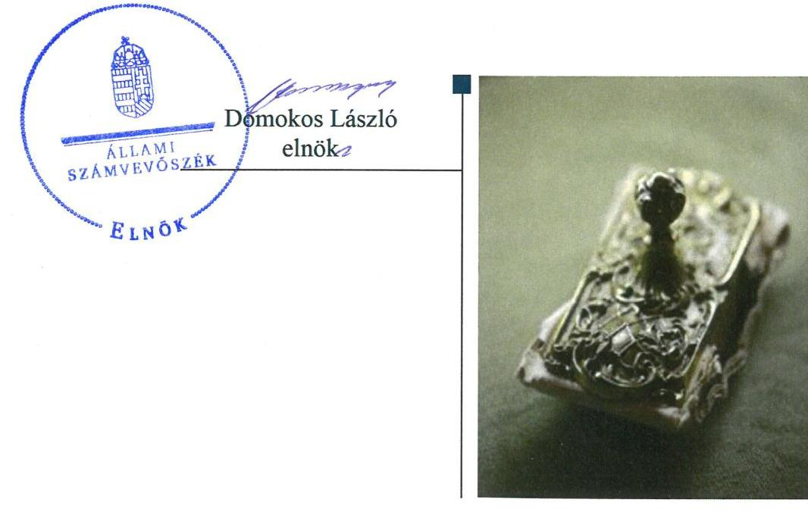
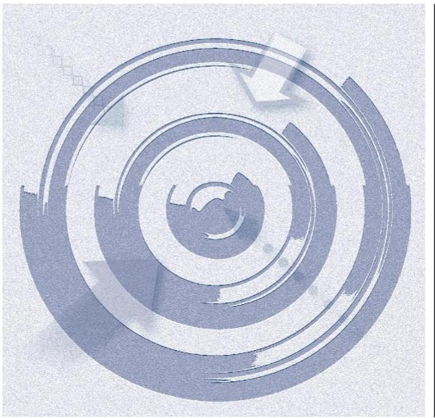
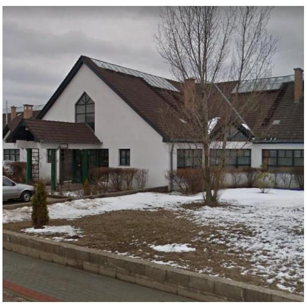

# Jelenetés 

## Nem állami humánszolgáltatók ellenőrzése

A humánszolgáltatást nyújtó államháztartáson kívüli szociális intézmények, szolgáltatók fenntartói központi költségvetésből kapott támogatásai felhasználásának ellenőrzése Egyenlő Esélyekért Alapítvány
2019.

---

# Jelentés 

## Nem állami humánszolgáltatók ellenőrzése

A humánszolgáltatást nyújtó államháztartáson kívüli szociális intézmények, szolgáltatók fenntartói központi költségvetésből kapott támogatásai felhasználásának ellenőrzése Egyenlő Esélyekért Alapítvány
2019. 06. hó 29. nap

---

# AZ ELLENŐRZÉST FELÜGYELTE:

- VARGA EDIT felügyeleti vezető

- AZ ELLENŐRZÉST VEZETTE ÉS A VÉGREHAJTÁSÁÉRT FELELŐS:
  - TERLECZKYNÉ DR. EISELE EDIT ellenőrzésvezető
  - A PROGRAM ÖSSZEÁLLÍTÁSÁÉRT FELELŐS:
    - TÓTPÁL SZABOLCS osztályvezető

- IKTATÓSZÁM: EL-1712-001/2019
- TÉMASZÁM: 2491
- ELLENŐRZÉS-AZONOSÍTÓ SZÁM: V083515

Jelentéseink az Országgyűlés számítógépes hálózatán és az Interneta a www.asz.hu címen is olvashatóak.

---

# TARTALOMJEGYZÉK 

■ ÖSSZEGZÉS ..... 5
■ AZ ELLENŐRZÉS CÉLJA ..... 6
■ AZ ELLENŐRZÉS TERÜLETE ..... 7
■ AZ ELLENŐRZÉS HÁTTERE, INDOKOLTSÁGA ..... 8
■ A JELENTÉS LÉNYEGES KÉRDÉSKÖREI ..... 9
■ AZ ELLENŐRZÉS HATÓKÖRE ÉS MÓDSZEREI ..... 10
■ MEGÁLLAPÍTÁSOK ..... 12
■ JAVASLATOK ..... 15
■ MELLÉKLETEK ..... 17
I. sz. melléklet: Értelmező szótár ..... 17
■ FÜGGELÉKEK ..... 19
I. sz. függelék a jelentéshez ..... 19
II. sz. függelék: Észrevételek ..... 20
■ RÖVIDÍTÉSEK JEGYZÉKE ..... 21

---

.

---

# ÖSSZEGZÉS 

Az Egyenlő Esélyekért Alapítvány müködési és gazdálkodási környezetét nem szabályszerűen alakította ki, nem teremtette meg a költségvetési támogatások átlátható, elszámoltatható felhasználásának feltételeit. A költségvetési támogatások felhasználásának elszámoltathatóságát nem biztosította.

## Az ellenőrzés társadalmi indokoltsága

Az Állami Számvevőszék stratégiájában hangsúlyos szerepet szán annak, hogy szilárd szakmai alapon álló, értékteremtő ellenőrzéseivel előmozdítsa a közpénzügyek átláthatóságát, rendezettségét és javaslataival a közpénzek és a közvagyon szabályos, gazdaságos, hatékony és eredményes felhasználását segítse. Az Állami Számvevőszék a stratégiájában célul tűzte ki, hogy az államháztartáson kívülre nyújtott költségvetési támogatások ellenőrzésével hozzájárul ahhoz, hogy a közpénzeket az államháztartáson kívüli szervezetek is átlátható módon használják fel a közfeladatok szerződésben vállalt ellátása érdekében. Az Állami Számvevőszék e stratégiai céljaival Összhangban - az Állami Számvevőszékről szóló 2011. évi LXVI. törvény felhatalmazása alapján - végzi a központi költségvetésből származó források, nyújtott támogatások - kedvezményezett szervezetek közfeladat ellátásához való - felhasználásának az ellenőrzését. Az Állami Számvevőszék hozzájárul ezzel ahhoz is, hogy a nyilvánosság és az igénybevevők megfelelő tájékoztatást kapjanak az államháztartáson kívüli közfeladatot ellátók működéséről.

## Főbb megállapítások, következtetések

Az Egyenlő Esélyekért Alapítvány a működési és gazdálkodási környezetét nem szabályszerűen alakította ki, mivel könyvvezetési rendszerét nem részletezte úgy, hogy a támogatások felhasználása feladatonkénti bontásban rendelkezésre álljon, ezáltal nem teremtette meg a költségvetési támogatások átlátható, elszámoltatható felhasználásának feltételeit.

A támogatások felhasználásának átláthatóságát az Egyenlő Esélyekért Alapítvány nem biztosította. A Fenntartó a részére kiutalt támogatásokat nem szabályszerűen fordította intézménye múködtetésére, mert számviteli nyilvántartásaiban nem különítette el a saját és intézménye gazdálkodásával összefüggő tételeket, valamint a támogatások felhasználását feladatonkénti bontásban nem tartotta nyilván.

Az Egyenlő Esélyekért Alapítvány az intézménye múködtetéséhez felhasznált közpénzekre vonatkozó gazdálkodásával a nyilvánosság előtt elszámolt.

Az Állami Számvevőszék a jelentésben foglalt megállapítások alapján az Egyenlő Esélyekért Alapítvány kuratóriuma elnökének négy javaslatot fogalmazott meg, amelyekre az érintettnek 30 napon belül intézkedési tervet kell készítenie.

---

# AZ ELLENŐRZÉS CÉLJA 

AZ ELLENŐRZÉS CÉLJA annak értékelése, hogy az Egyenlő Esélyekért Alapítvány, mint szociális intézmény fenntartó központi költségvetésből kapott támogatásainak felhasználása szabályszerű volt-e, a támogatások igénylése, évközi módosítása és év végi elszámolása megfelelt-e a jogszabályi előírásoknak.

---

# **AZ ELLENŐRZÉS TERÜLETE**

## **Egyenlő Esélyekért Alapítvány**

Az Egyenlő Esélyekért Alapítványt 2000. évben hozta létre az Összefogás Ipari Szövetkezet. A Fenntartó^{1} célja, hogy segítséget nyújtson a halmozottan sérült és fogyatékkal élő személyek komplex szocializációs és munka rehabilitációjában, illetve elősegítse és szervezze a társadalomba való beilleszkedésüket.

A Fenntartó az ellenőrzött években az Egyenlő Esélyekért Alapítvány Fogyatékosok Otthona és Nappali Gondozó intézményt működtette Csömörön. Az Intézmény^{2} a Fenntartó szervezetén belül működött, nem volt önálló jogi személy, nem gazdálkodott önállóan. Az Intézmény fogyatékkal élő személyek intézményi bentlakásos ápoló-gondozó célú lakóotthoni, illetve nappali ellátását végezte székhelyén és az Ibolya ház, Kistarcsai Esély Ház, és Tibor háza telephelyeken.

A szolgáltatási férőhelyek számát az 1. táblázat mutatja:

1. táblázat

|  A FENNTARTÓ INTÉZMÉNYE ÁLTAL BIZTOSÍTOTT SZOLGÁLTATÁSOK ÉS FÉRŐHELYEK SZÁMA 2015. JANUÁR 1-JÉN ÉS 2017. DECEMBER 31-ÉN |  |  |   |
| --- | --- | --- | --- |
|  Feladat ellátási helyek | Szolgáltatás megnevezése | Férőhely száma (fő) |   |
|   |  | 2015. 01. 01-én | 2017. 12. 31-én  |
|  Egyenlő Esélyekért Alapítvány Fogyatékosok Otthona és Nappali Gondozó (székhely) | fogyatékos személyek otthona | 103 | 78  |
|   | fogyatékos személyek nappali ellátása | 50 | 50  |
|  Ibolya Ház (telephely) | fogyatékos személyek ápoló-gondozó célú lakóotthona | 8 | -  |
|  Kistarcsai Esély Ház (telephely) | támogatott lakhatás fogyatékos személyek részére | - | 8  |
|  Tibor Háza (telephely) | támogatott lakhatás fogyatékos személyek részére | - | 6  |
|   | támogatott lakhatás fogyatékos személyek részére | - | 25  |

*Forrás: Fenntartó intézményének szolgáltatói nyilvántartásba vett adatai*

Az Egyenlő Esélyekért Alapítvány gazdálkodásának főbb adatait a 2. táblázat szemlélteti (millió Ft-ban):

1. táblázat

|  GAZDÁLKODÁSI ADATOK |  |  |   |
| --- | --- | --- | --- |
|  Megnevezés | 2015. év | 2016. év | 2017. év  |
|  Saját tőke | 461,7 | 462,4 | 443,2  |
|  Induló tőke | 46,3 | 46,3 | 46,3  |
|  Mérlegfőösszeg | 1 143,7 | 1 154,9 | 1 315,1  |
|  Értékesítés nettó árbevétele | 134,0 | 131,7 | 137,6  |
|  Egyéb bevételek | 179,6 | 175,0 | 205,6  |
|  ebből: központi költségvetésből támogatás | 128,1 | 133,9 | 139,7  |
|  Rendkívüli bevételek | 369,6 | - | -  |
|  Adózás előtti eredmény | 345,7 | 0,7 | -19,2  |

*Forrás: Egyenlő Esélyekért Alapítvány egyszerűsített éves beszámoló*

---

# AZ ELLENŐRZÉS HÁTTERE, INDOKOLTSÁGA 

A szociális feladatokat ellátó nem állami intézményfenntartók részére közfeladataik ellátására évente jelentős összegű pénzügyi támogatást biztosítottak a mindenkori költségvetési törvények a bennük megfogalmazott feltételek mellett. A felhasználható állami támogatások a költségvetési törvényekben (a 2014. évi C. törvény Magyarország 2015. évi központi költségvetéséről, 2015. évi C. törvény Magyarország 2016. évi központi költségvetéséről, 2016. évi XC. törvény Magyarország 2017. évi központi költségvetéséről) a 2015-2017. években a szociális ágazatra vonatkozóan 273 Mrd Ft előirányzatot határoztak meg. Módosították a szociális igazgatásról és szociális ellátásokról szóló 1993. évi III. törvényt, amely - többek között 2012. január 1-jei hatállyal megfogalmazta a finanszírozási rendszerbe történő befogadással összefüggő szabályokat.

Az Állami Számvevőszék stratégiájában célul tűzte ki, hogy az államháztartáson kívülre nyújtott költségvetési támogatások ellenőrzésével hozzájárul ahhoz, hogy a közpénzeket az államháztartáson kívüli szervezetek is átlátható módon használják fel a közfeladatok szerződésben vállalt ellátása érdekében. Az Állami Számvevőszék stratégiájában foglaltak alapján is indokolt az ellenőrzés, amely a társadalom számára jelzi, hogy a közpénz államháztartáson kívüli felhasználása sem maradhat ellenőrizetlenül. Az ellenőrzés javaslataival hozzájárulhat az államháztartáson kívüli szervezetek szabályszerű támogatás felhasználásához, javíthatja a társadalmi-gazdasági döntések megalapozottságát, amely a „jó kormányzás" feltétele.

A holisztikus megközelítés jegyében az ellenőrzés keretében egyedi kockázatelemzés alapján kiválasztott fenntartóknál és intézményeiknél értékeltük az államháztartáson kívüli szociális tevékenységhez kapcsolódó támogatások felhasználásának megfelelőségét.

---

# A JELENTÉS LÉNYEGES KÉRDÉSKÖREI 

1. A szociális humánszolgáltató közfeladatot ellátó fenntartó szabályszerű müködési - és gazdálkodási környezet kialakításával megteremtette-e a költségvetési támogatások átlátható, elszámoltatható igénybevételének, felhasználásának feltételeit?
2. Az államháztartáson kívüli fenntartó az átvállalt szociális humánszolgáltatási közfeladathoz biztositott költségvetési támogatásokat szabályszerűen fordította-e a humánszolgáltató intézménye müködtetésére?
3. Az államháztartáson kívüli fenntartó a szociális humánszolgáltató intézménye müködtetéséhez felhasznált közpénzekre vonatkozó gazdálkodásával a nyilvánosság előtt elszámolt-e, ellenőrzési, a külső ellenőrzésekkel kapcsolatos intézkedési feladatait szabályszerűen látta-e el?

---

# AZ ELLENŐRZÉS HATÓKÖRE ÉS MÓDSZEREI 

## Az ellenőrzés típusa

Megfelelőségi ellenőrzés.

## Az ellenőrzött időszak

A 2015. január 1-je és 2017. december 31-e közötti időszak.
A helyszíni szemle tekintetében 2018. január 1-től 2019. január 29-ig tartó időszak.

## Az ellenőrzés tárgya

Az ellenőrzés a szociális humánszolgáltatási közfeladatokat ellátó államháztartáson kívüli fenntartók, humánszolgáltatási közfeladatai ellátásához a költségvetési törvényekben biztosított központi költségvetési támogatások igénylése, évközi módosítása és év végi elszámolása fenntartói feladatainak ellátása, illetve e központi költségvetésből kapott támogatásaik humánszolgáltatási közfeladatokra való fenntartó általi felhasználása szabályszerűségének értékelésére terjedt ki.

## Az ellenőrzött szervezet

Egyenlő Esélyekért Alapítvány

## Az ellenőrzés jogalapja

Az ellenőrzés jogszabályi alapját az ÁSZ tv³. 1. § (3) bekezdésben, valamint az 5. § (3) bekezdésben foglalt előírások adják.

## Az ellenőrzés módszerei

Az ellenőrzést az ellenőrzési program szempontjai, kérdései, az ellenőrzött időszakban hatályos jogszabályok, a nemzetközi standardokat irányadónak tekintve, az ellenőrzés szakmai szabályok és módszertanok figyelembe vételével végeztük. A közpénzekkel való felelős gazdálkodás segítésére irányuló javaslatok kidolgozásakor a hatályos jogszabályokat tekintettük irányadónak.

Az ellenőrzés ideje alatt az ellenőrzött szervezettel történő kapcsolattartást az ÁSZ SZMSZ ${ }^{4}$-ének vonatkozó előírásai alapján biztosítottuk.

---

Az ellenőrzési kérdések megválaszolásához szükséges bizonyítékok megszerzése az ellenőrzött által rendelkezésre bocsátott dokumentumokra, adatokra alapozva megfigyelés, szemle (szemrevételezés), kérdésfeltevés (információkérés), valamint elemző eljárással történt.

Az ellenőrzési bizonyítékként felhasználható adatforrások közé tartoztak egyrészt az ellenőrzési program részletes szempontjainál felsorolt adatforrások, másrészt minden - az ellenőrzés folyamán feltárt, az ellenőrzés szempontjából információt tartalmazó - dokumentum.

Az ellenőrzés lefolytatásához az ellenőrzött szervezet a kitöltött tanúsítványok, valamint az ÁSZ ${ }^{5}$ által kért dokumentumok elektronikus úton való megküldésével szolgáltatott adatokat, információkat. Az így rendelkezésre bocsátott adatok, információk és a tanúsítványok adatai valódiságának kontrollja az ellenőrzés keretében történt.

Az ellenőrzést alapvetően a szociális humánszolgáltatások esetében a központi költségvetési támogatások igénylésével, módosításával, felhasználásával, elszámolásával kapcsolatos feladatokat ellátó államháztartáson kívüli fenntartóknál/szervezeteinél végeztük. A fenntartott intézményeknél helyszíni szemle keretében győződtünk meg a tényleges feladatellátásról (verifikáció).

A szociális humánszolgáltatások központi költségvetési támogatásai igénylésével, módosításával, elszámolásával kapcsolatos, államháztartáson kívüli fenntartó jogszabályokban előírt feladatai betartását, továbbá a központi költségvetési támogatások szabályszerű kezelését, nyilvántartását ellenőriztük a fenntartónál, az ott rendelkezésre álló határozatok, nyilvántartások, beszámolók és egyéb dokumentumok alapján. Az ellenőrzés nem terjedt ki a szociális humánszolgáltatások központi költségvetési támogatásai igénylése, módosítása, elszámolása valódiságának, megalapozottságának, helyességének - sem a fenntartónál, sem a székhely intézményeinél való - értékelésére (mivel ennek felülvizsgálata, ellenőrzése a finanszírozó jogszabályban előírt feladata, határozatai kiadása előtt). Továbbá nem terjedt ki az ellenőrzés e források intézmények általi szabályszerű felhasználásának értékelésére.

---

# MEGÁLLAPÍTÁSOK 

## 1. A szociális humánszolgáltató közfeladatot ellátó fenntartó szabályszerű múködési - és gazdálkodási környezet kialakításával megteremtette-e a költségvetési támogatások átlátható, elszámoltatható igénybevételének, felhasználásának feltételeit?

Összegző megállapítás

A Fenntartó a múködési és gazdálkodási környezetét nem szabályszerűen alakította ki, ezáltal a költségvetési támogatások átlátható, elszámoltatható felhasználásának feltételeit nem teremtette meg.

A Számv. tv. ${ }^{6}$ 161. § (1) bekezdésében foglaltakat megsértve a Fenntartó nem készítette el számlarendjét. A Fenntartó a Számv. tv. 161/A §. (2) bekezdésének előírása ellenére nem gondoskodott a közpénzek felhasználásának ellenőrizhetősége érdekében a nyilvántartási (könyvvezetési) rendszerének oly módon való továbbrészletezéséről, hogy abból a vonatkozó külön jogszabályban meghatározott adatok rendelkezésre álljanak:
$\longrightarrow$ A Civil tv. ${ }^{7}$ 20. § (4) bekezdésének előírása ellenére a Fenntartó a kapott támogatásokról nem vezetett olyan elkülönített számviteli nyilvántartást, amelynek alapján támogatásonként megállapítható és ellenőrizhető a kapott támogatás felhasználása.
$\longrightarrow$ A Fenntartó a számviteli rendjében nem biztosította az Atr. ${ }^{8}$ 16. § (1) bekezdésében foglaltak ellenére a Fenntartó és az Intézmény gazdálkodása elkülönített elszámolását, továbbá a támogatások felhasználásának feladatonkénti megbontását.
A Fenntartó rendelkezett a Számv. tv. előírásainak megfelelően számviteli politikával és az annak keretében elkészítendő szabályzatokkal.

A Fenntartó Alapító okirata a Ptk. ${ }^{9}$ előírásainak megfelelt, tartalmazta a Fenntartó cél szerinti tevékenységét és a Civil tv-ben meghatározott, a közhasznúsági nyilvántartásba vételhez szükséges tartalmi elemeket. A Fenntartó szervezeti és múködési szabályait az Alapító okirat és az SZMSZ1-4 ${ }^{10}$ határozta meg.

---

# 2. Az államháztartáson kívüli fenntartó az átvállalt szociális humánszolgáltatási közfeladathoz biztosított költségvetési támogatásokat szabályszerűen fordította-e a humánszolgáltató intézménye múködtetésére? 

Összegző megállapítás A Fenntartó az átvállalt szociális közfeladathoz biztosított költségvetési támogatásokat nem szabályszerűen fordította Intézménye múködtetésére.

A Fenntartó a könyvelésében a támogatások felhasználását, továbbá a saját és Intézménye gazdálkodását nem elkülönítetten kezelte az Atr. 16. § (1) bekezdésében előírtak ellenére.

A Fenntartó költségei, ráfordításai ellentételezésére kapott támogatásokról a Civil tv. 20. § (4) bekezdés előírása ellenére nem vezetett olyan elkülönített számviteli nyilvántartást, amely alapján támogatásonként megállapítható és ellenőrizhető annak felhasználása.

Az egyéb bevételek között a támogatásokat elkülönítetten tartották nyilván a Civilszr ${ }_{1,2}$ előírása szerint.

A Fenntartó Civilszr ${ }_{1,2}{ }^{11}$ és a Számv. tv. éves beszámoló készítésre vonatkozó előírásainak eleget tett egyszerűsített éves beszámoló valamint közhasznúsági melléklet készítésével. A számviteli beszámolók mérlegének és eredménykimutatásának tagolása megfelelt a Civilszr ${ }_{1,2}$ előírásainak.

A Fenntartó Intézményét és annak telephelyeit az SzCsM. rendeletben ${ }^{12}$ foglaltak szerint bejegyezték.

## 3. Az államháztartáson kívüli fenntartó a szociális humánszolgáltató intézménye múködtetéséhez felhasznált közpénzekre vonatkozó gazdálkodásával a nyilvánosság előtt elszámolt-e, ellenőrzési, a külső ellenőrzésekkel kapcsolatos intézkedési feladatait szabályszerűen látta-e el?

Összegző megállapítás A Fenntartó az Intézménye múködtetéséhez felhasznált közpénzekre vonatkozó gazdálkodásával a nyilvánosság előtt elszámolt. Az ellenőrzési feladatait szabályszerűen látta el, a külső ellenőrzéshez kapcsolódó intézkedési kötelezettségét nem teljesítette.

A Felügyelő Bizottság ${ }^{13}$ és a Kuratórium ${ }^{14}$ ellenőrizte a Fenntartó múködését és gazdálkodását a Civil tv. előírása szerint.

A Fenntartó egyszerűsített éves beszámolóit és közhasznúsági mellékleteit könyvvizsgáló hitelesítette és a Kuratórium határozattal fogadta el. A 2015-2017. évi beszámolókat a közhasznúsági melléklettel és a könyvvizsgálói záradékkal a Civil tv. 30. § (1) bekezdésének megfelelően letétbe helyezték és közzétették, azonban a beszámolók és a közhasznúsági mellék-

---

letek a Fenntartó honlapján ${ }^{15}$ a Civil tv. 30. § (4) bekezdésben foglaltak ellenére nem kerültek elhelyezésre. Az egyszerűsített éves beszámolók eredménykimutatása tartalmazta tájékoztató adatként a költségvetési támogatások összegét a Civil szr. ${ }_{1-2}$ előírásai szerint.

Külső ellenőrzést a Fenntartónál 2015. évre vonatkozóan a Magyar Államkincstár végzett. Az ellenőrzés felhívta a Fenntartó figyelmét az Atr. 16. § (1) bekezdésében foglaltak betartására, azonban a Fenntartó a jogszabály betartása érdekében nem intézkedett.

---

# JAVASLATOK 

Az ÁSZ tv. 33. § (1) bekezdésében foglaltak értelmében az ellenőrzött szervezet vezetője köteles a jelentésben foglalt megállapításokhoz kapcsolódó intézkedési tervet összeállítani és azt a jelentés kézhezvételétől számított 30 napon belül az ÁSZ részére megküldeni. Amennyiben az ellenőrzött szervezet vezetője nem küldi meg határidőben az intézkedési tervet, vagy továbbra sem elfogadható intézkedési tervet küld, az Állami Számvevőszék elnöke az ÁSZ tv. 33. § (3) bekezdése a) és b) pontjaiban foglaltakat érvényesítheti.

## Egyenlő Esélyekért Alapítvány kuratóriuma elnökének

1. A szabályszerű müködési és gazdálkodási környezet kialakítása, a költségvetési támogatások átlátható, elszámoltatható igénybevétele, felhasználása feltételeinek megteremtése érdekében gondoskodjon a Fenntartó:
a) számlarendjének elkészitéséről;
(1. sz. megállapítás 1. bekezdés 1. mondata alapján)
b) könyvvezetés rendszerének jogszabályi előírásoknak megfelelő módon történő részletezéséről.
(1. sz. megállapítás 1. bekezdés 2. mondata és a 2. sz. megállapítás 1. bekezdése alapján)
2. A támogatások felhasználásának átláthatósága érdekében gondoskodjon a Fenntartó könyvelésében a Fenntartó és intézménye gazdálkodásának elkülönitéséről, és a Fenntartó könyveiben a támogatások felhasználásának feladatonként elkülönitetten történő kezeléséről.
(2. sz. megállapítás 1. bekezdése alapján)
3. Közzétételi kötelezettségének teljesítése érdekében gondoskodjon a Fenntartó beszámolójának, valamint közhasznúsági mellékletének Fenntartó honlapján történő elhelyezéséről.
(3. sz. megállapítás 2. bekezdés 2. mondat 2. tagmondata alapján)

---

.

---

# MELLÉKLETEK 

- I. SZ. MELLÉKLET: ÉRTELMEZŐ SZÓTÁR
befogadás
civil szervezet
ellátási terület
feladatfinanszírozás
humánszolgáltatás
költségvetési támogatás
nem állami, nem önkormányzati (államháztartáson kívüli) intézmény fenntartó
székhely intézmény
telephely

A Szoctv. ${ }^{16}$ illetve a Gyvt ${ }^{17}$. szerinti, a szociális szolgáltatások és a gyermekjóléti szolgáltató tevékenységek területi lefedettségét figyelembe vevő finanszírozási rendszerbe történő befogadás.
A Civil tv*. 2. § 6. pontja szerint civil szervezet a civil társaság, a Magyarországon nyilvántartásba vett egyesület (a párt, a szakszervezet és a kölcsönös biztosító egyesület kivételével), a közalapítvány és a pártalapítvány kivételével az alapítvány.
Az a terület, ahonnan az engedélyes gyermekeket, illetve más ellátottakat fogad.
A közfeladat államháztartáson kívüli szervezet által történő ellátásához közvetlenül kapcsolódó, arányos müködési költségeket finanszírozó költségvetési támogatás.
Külön törvényben meghatározott szociális, gyermekjóléti, gyermekvédelmi, közoktatási, felsőoktatási, kulturális közfeladatok (2014. évi Kvtv ${ }^{18}$. 34. § (1), (4) bekezdés, 1. számú melléklet XX/20/2. alcím, 19. alcím, 2015. évi Kvtv. 43. § (1), (4) bekezdés, 1. számú melléklet XX/20/2/3. jogcím csoport, 19. alcím, 2016. évi Kvtv. 41. § (1), (4) bekezdés, 1. számú melléklet XX/20/2/3. jogcím csoport, 19. alcím).
a társadalombiztosítás pénzügyi alapjai kivételével az államháztartás központi alrendszeréből ellenérték nélkül, pénzben nyújtott támogatások (Áht. 1. § 14. pont)
A költségvetési törvényekben (2013. évi CCXXX. törvény 33-34. §, 2014. évi C. törvény 42-43. §, 2015. évi C. törvény 40-41. §) megállapított támogatás. Például a 2015. évi C. törvény 40-41. § szerint többek között: Az Országgyűlés a szociális, gyermekjóléti, gyermekvédelmi közfeladatot ellátó intézményt, szolgáltatást fenntartó egyházi jogi személy, civil szervezet, közalapítvány, országos nemzetiségi önkormányzat, települési vagy területi nemzetiségi önkormányzat, gazdasági társaság, és a humánszolgáltatást alaptevékenységként végző, az Szja tv ${ }^{19}$. hatálya alá tartozó egyéni vállalkozó (a továbbiakban együtt: nem állami szociális fenntartó) részére támogatást állapít meg a következők szerint: a támogatás a nem állami szociális fenntartót a települési önkormányzatok 2. melléklet III. pont 3. alpont c)-k) pontjában és III. pont 5. alpont a) pontjában meghatározott támogatásaival azonos jogcímeken, összegben és feltételek mellett illeti meg.
A szociális, gyermekjóléti és gyermekvédelmi közfeladatokat/humánszolgáltatásokat ellátó intézményt fenntartó egyházi jogi személy, társadalmi szervezet, alapítvány, közalapítvány, civil szervezet, országos nemzetiségi önkormányzat, nonprofit gazdasági társaság, gazdasági társaság és a humánszolgáltatást alaptevékenységként végző, Szja tv. hatálya alá tartozó egyéni vállalkozó. (2013. évi Kvtv. 35. § (1), (3) bekezdés, 2014. évi Kvtv. 33. §, 34. § (1), (4) bekezdés, 2015. évi Kvtv. 42. §, 43. § (1), (4) bekezdés, 2016. évi Kvtv. 40. §, 41. § (1), (4) bekezdés, 2017. évi Kvtv. 41. § (1), (4))
a szolgáltató székhelye, azaz a szolgáltató központi ügyintézésének helye, függetlenül attól, hogy használják-e szolgáltatás nyújtására (Sznyvhr. ${ }^{20} 1 . \S$ k) pont) (hatályos: 2013. december 1-től)
a szolgáltató székhelyétől különböző, szolgáltató/intézmény használatában álló hely, a szociális humánszolgáltatáshoz használt, bejegyzett hely. (Sznyvhr. 1.§ I) pont) (hatályos: 2015. január 1-től)

[^0]
[^0]:    * Előzmény törvények, amelyeket az ellenőrzött időszak miatt figyelembe kell venni: egyesülési jogról szóló 1989. évi II. tv, a közhasznú szervezetekről szóló 1997. évi CLVI. tv.

---

.

---

# FÜGGELÉKEK 

- I. SZ. FÜGGELÉK A JELENTÉSHEZ

Az Állami Számvevőszék az ellenőrzések során feltárt tényekhez kapcsolódó további körülmények tisztázására eszközrendszerrel nem rendelkezik. Amennyiben az ellenőrzésen túlmutatóan indokoltnak látszik az ellenőrzés során feltárt körülmények további vizsgálata, az Állami Számvevőszék törvényi felhatalmazás alapján az ellenőrzés által feltárt körülményeket továbbítja a hatáskörrel rendelkező szervnek a szükséges intézkedések megtétele, eljárások lefolytatása érdekében.

1. Az Egyenlő Esélyekért Alapítvány (továbbiakban: Fenntartó) a 2015-2017. években számviteli rendjében nem kezelte feladatonkénti bontásban elkülönítetten a támogatás felhasználását, valamint nem kezelte elkülönítetten a saját és az intézménye gazdálkodását. Ezzel megsértette az egyházi és nem állami fenntartású szociális, gyermekjóléti és gyermekvédelmi szolgáltatók, intézmények és hálózatok állami támogatásáról szóló 489/2013. (XII. 18.) Korm. rendelet 16. § (1) bekezdése előírásait.
2. A Fenntartó költségei, ráfordításai ellentételezésére kapott támogatásokról nem vezetett olyan elkülönített számviteli nyilvántartást, amely alapján támogatásonként megállapítható és ellenőrizhető a kapott támogatás felhasználása. Ezzel nem tartotta be az egyesülési jogról, a közhasznú jogállásról, valamint a civil szervezetek müködéséről és támogatásáról szóló 2011. évi CLXXV. törvény 20. § (4) bekezdésében foglaltakat.
Az elkülönített nyilvántartás hiánya miatt a költségvetési támogatások felhasználásának átláthatósága és elszámoltathatósága nem volt biztosított, nem igazolt a támogatások rendeltetésszerü felhasználása.
Az eset konkrét körülményeinek feltárására a Magyar Államkincstár rendelkezik hatáskörrel.

---

A jelentéstervezetet a Számvevőszék 15 napos észrevételezésre megküldte az ellenőrzött szervezetek vezetőinek az ÁSZ tv. 29. §̊ (1) bekezdése előirásának megfelelően.

Az ÁSZ a jelentéstervezetet észrevételezésre megküldte az Egyenlő Esélyekért Alapítvány kuratóriumának elnöke részére.
Az Egyenlő Esélyekért Alapítvány kuratóriumának elnöke az ÁSZ tv. 29. § (2) bekezdésében foglalt észrevételezési jogával nem élt, a jelentéstervezet megállapításaira a törvényes határidőn belül észrevételt nem tett.

[^0]
[^0]:    * 29. § (1) Az Állami Számvevőszék az ellenőrzési megállapításait megküldi az ellenőrzött szervezet vezetőjének vagy az általa megbízott személynek, és annak, akinek személyes felelősségét állapította meg.
    (2) Az ellenőrzött szervezet vezetője és a felelősként megjelölt személy az ellenőrzés megállapításaira tizenöt napon belül írásban észrevételt tehet.
    (3) Az Állami Számvevőszék az észrevételre a beérkezésétől számított harminc napon belül írásban válaszol. A figyelembe nem vett észrevételeket köteles a jelentésben feltüntetni, és megindokolni, hogy azokat miért nem fogadta el.

---

# RÖVIDÍTÉSEK JEGYZÉKE 

${ }^{1}$ Fenntartó
${ }^{2}$ Intézmény
${ }^{3}$ ÁSZ. tv.
${ }^{4}$ ÁSZ. SZMSZ.
${ }^{5}$ ÁSZ.
${ }^{6}$ Számv. tv.
${ }^{7}$ Civil tv.
${ }^{8}$ Atr.
${ }^{9}$ Ptk.
${ }^{10} \mathrm{SZMSZ}_{1}$

SZMSZ ${ }_{2}$
SZMSZ ${ }_{3}$
SZMSZ ${ }_{4}$
${ }^{11}$ Cvilszr. $1,2$
${ }^{12}$ SzCsM. rendelet
${ }^{13}$ Felügyelő Bizottság
${ }^{14}$ Kuratórium
${ }^{15}$ honlap
${ }^{16}$ Szoctv.
${ }^{17}$ Gyvt.
${ }^{18}$ Kvtv.
${ }^{19}$ Szja tv.
${ }^{20}$ Sznyvhr.

Egyenlő Esélyekért Alapítvány
Az Egyenlő Esélyekért alapítvány Szoctv.-ben meghatározott feladatokat ellátó intézménye: Egyenlő Esélyekért Alapítvány Fogyatékosok Otthona és Nappali Gondozó
2011. évi LXVI. törvény az Állami Számvevőszékről

Állami Számvevőszék Szervezeti és Müködési Szabályzata
Állami Számvevőszék
2000. évi C. törvény a számvitelről
2011. évi CLXXV. törvény az egyesülési jogról, a közhasznú jogállásról, valamint a civil szervezetek müködéséről és támogatásáról
489/2013. (XII. 18.) Korm. rendelet az egyházi és nem állami fenntartású szociális, gyermekjóléti és gyermekvédelmi szolgáltatók, intézmények és hálózatok állami támogatásokról (hatályos 2014. január 1-jétől)
2013. évi V. törvény a Polgári törvénykönyvről

Az Egyenlő Esélyekért Alapítvány Fogyatékosok Otthonának, Lakóotthonának és Nappali Gondozójának Szervezeti és Müködési Szabályzata (hatályos 2015. január 1-től)
Az Egyenlő Esélyekért Alapítvány Ibolya Ház Szervezeti és Müködési Szabályzata (hatályos 2016. október 12-től)
Az Egyenlő Esélyekért Alapítvány Kistarcsai Esély Ház Szervezeti és Müködési Szabályzata (hatályos 2016. október 12-től)
Az Egyenlő Esélyekért Alapítvány Tibor Háza Szervezeti és Müködési Szabályzata (hatályos 2017. május 24-től)
224/2000. (XII. 19.) Korm. rendelet a számviteli törvény szerinti egyes egyéb szervezetek beszámoló készítési és könyvvezetési kötelezettségének sajátosságairól (hatályos 2016. december 31-ig)
479/2016. (XII. 28.) Korm. rendelet a számviteli törvény szerinti egyes egyéb szervezetek beszámoló készítési és könyvvezetési kötelezettségének sajátosságairól (hatályos 2017. január 1-től)
1/2000. (I. 7.) SzCsM rendelet a személyes gondoskodást nyújtó szociális intézmények szakmai feladatairól és müködésük feltételeiről
Egyenlő Esélyekért Alapítvány Felügyelő Bizottsága
Egyenlő Esélyekért Alapítvány Kuratóriuma
www.egyenloeselyekert.hu
1993. évi III. törvény - a szociális igazgatásról és szociális ellátásokról
1997. évi XXXI. törvény a gyermekek védelméről és a gyámügyi igazgatásról
költségvetési törvény
1995. évi CXVII. törvény a személyi jövedelemadóról

369/2013. (X. 24.) Korm. rendelet a szociális, gyermekjóléti és gyermekvédelmi szolgáltatók, intézmények és hálózatok hatósági nyilvántartásáról és ellenőrzéséről

---

ÁLLAMI SZÁMVEVŐSZÉK
1052 Budapest, Apáczai Csere János utca 10.
Levélcím: 1364 Budapest 4. Pf. 54
Telefon: +36 14849100 Telefax: +36 14849200
www.asz.hu