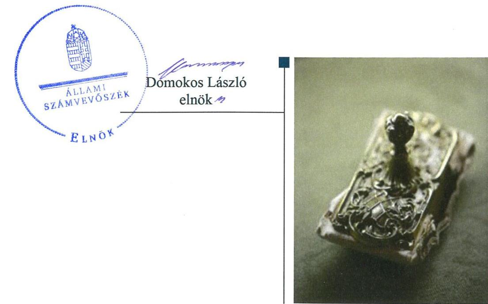
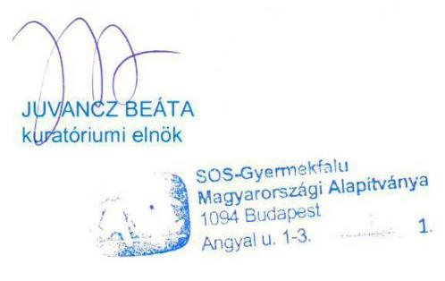
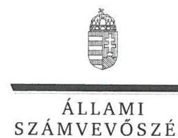
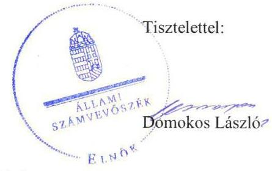

# Jelenetés 

## Nem állami humánszolgáltatók ellenőrzése

A humánszolgáltatást nyújtó államháztartáson kívüli szociális intézmények, szolgáltatók fenntartói központi költségvetésből kapott támogatásai felhasználásának ellenőrzése -SOS-Gyermekfalu Magyarországi Alapítványa 2019.

---

# Jelentés 

## Nem állami humánszolgáltatók ellenőrzése

A humánszolgáltatást nyújtó államháztartáson kívüli szociális intézmények, szolgáltatók fenntartói központi költségvetésből kapott támogatásai felhasználásának ellenőrzése -SOS-Gyermekfalu Magyarországi Alapítványa 2019.

O. hó 2. nap

---

# AZ ELLENŐRZÉST FELÜGYELTE:

- KAKAS SÁNDOR felügyeleti vezető
- AZ ELLENŐRZÉST VEZETTE ÉS A VÉGREHAJTÁSÁÉRT FELELŐS:
  - MIHÁLSZKY KÁLMÁN ellenőrzésvezető
  - A PROGRAM ÖSSZEÁLLÍTÁSÁÉRT FELELŐS:
    - TÓTPÁL SZABOLCS osztályvezető

**IKTATÓSZÁM:** EL-1791-001/2019

**TÉMASZÁM:** 2491

**ELLENŐRZÉS-AZONOSÍTÓ SZÁM:** V083502

Jelentéseink az Országgyűlés számítógépes hálózatán és az Interneten a www.asz.hu címen is olvashatóak.

---

# TARTALOMJEGYZÉK 

■ ÖSSZEGZÉS ..... 5
■ AZ ELLENŐRZÉS CÉLJA ..... 6
■ AZ ELLENŐRZÉS TERÜLETE ..... 7
■ AZ ELLENŐRZÉS HÁTTERE, INDOKOLTSÁGA ..... 8
■ A JELENTÉS LÉNYEGES KÉRDÉSKÖREI ..... 9
■ AZ ELLENŐRZÉS HATÓKÖRE ÉS MÓDSZEREI ..... 10
■ MEGÁLLAPÍTÁSOK ..... 12
■ JAVASLATOK ..... 14
■ MELLÉKLETEK ..... 15
I. sz. melléklet: Értelmező szótár ..... 15
■ FÜGGELÉKEK ..... 17
I. sz. függelék a jelentéshez ..... 17
II. sz. függelék: Észrevételek ..... 18
■ RÖVIDÍTÉSEK JEGYZÉKE ..... 27

---

.

---

# ÖSSZEGZÉS 

A budapesti székhelyű SOS - Gyermekfalu Magyarországi Alapítványa nem alakította ki a szociális humánszolgáltatási közfeladathoz biztosított költségvetési támogatások átlátható és elszámoltatható felhasználásának feltételeit, gazdálkodása nem volt elszámoltatható.

## Az ellenőrzés társadalmi indokoltsága

Az Állami Számvevőszék stratégiájában célul tűzte ki, hogy az államháztartáson kívülre nyújtott költségvetési támogatások ellenőrzésével hozzájáruljon ahhoz, hogy a közpénzeket az államháztartáson kívüli szervezetek is átlátható módon használják fel a közfeladatok szerződésben vállalt ellátása érdekében. Tekintettel az elmúlt években az elmúlt években a szociális területet érintő finanszírozási változásokra, a társadalom fokozott érdeklődéssel figyeli a szociális feladatokra fordított források felhasználását. Fontos a közvéleményt biztosítani arról, hogy a közpénz államháztartáson kívüli felhasználása ezen a területen sem marad ellenőrizetlenül. Az ellenőrzés eredményeképpen a nyilvánosság és a szolgáltatást igénybe vevők megfelelő tájékoztatást kaphatnak az államháztartáson kívüli közfeladatot ellátók működéséről. Az SOS - Gyermekfalu Magyarországi Alapítványánál végzett ellenőrzést indokolja az is, hogy humánszolgáltatási közfeladat ellátására az ellenőrzött időszakban 1157 millió Ft központi költségvetési támogatásban részesült.

## Főbb megállapítások, következtetések, javaslatok

Az SOS - Gyermekfalu Magyarországi Alapítvány működésének a gazdálkodásra vonatkozó belső szabályozása nem felelt meg az előírásoknak, mivel a 2015-2017. években nem rendelkezett a számviteli politikával, és az annak keretében elkészítendő szabályzatok egyikével sem. Így az SOS - Gyermekfalu Magyarországi Alapítvány közfeladatot ellátó intézményei működtetéséhez felhasznált közpénzekre vonatkozó gazdálkodása nem volt elszámoltatható.

Az SOS - Gyermekfalu Magyarországi Alapítvány a közfeladatok szerződésben vállalt ellátása érdekében biztosított közpénzek átlátható módon való felhasználása alapfeltételeit nem biztosította.

Az SOS - Gyermekfalu Magyarországi Alapítvány a szakmai program végrehajtására, valamint a gazdálkodás szabályszerűségére vonatkozó ellenőrzési, értékelési feladatait nem szabályszerűen látta el. A szociális humánszolgáltató intézményei működtetéséhez felhasznált közpénzekre vonatkozó gazdálkodásával a nyilvánosság előtt nem számolt el.

Az Állami Számvevőszék a jelentésben foglalt megállapítások alapján az SOS - Gyermekfalu Magyarországi Alapítvány kuratóriuma elnökének kettő javaslatot fogalmazott meg. A javaslatokat megalapozó megállapításokra az érintettnek 30 napon belül intézkedési tervet kell készítenie.

---

# AZ ELLENŐRZÉS CÉLJA

**AZ ELLENŐRZÉS CÉLJA** annak értékelése, hogy a nem állami, nem önkormányzati szociális intézmények fenntartói központi költségvetésből kapott támogatásainak felhasználása szabályszerű volt-e, a támogatások igénylése, évközi módosítása és év végi elszámolása megfelel-e a jogszabályi előírásoknak.

---

# AZ ELLENŐRZÉS TERÜLETE 

## SOS - Gyermekfalu Magyarországi Alapítványa

AZ SOS - GYERMEKFALU MAGYARORSZÁGI ALAPÍTVÁNYA országos területi ellátási kötelezettséggel rendelkezett. Az Alapító ${ }^{1}$ SOS-KINDERDORF International a 2006. szeptember 20-án készült alapító okirat megalkotásával határozatlan időre hozta létre 405 ezer Ft induló vagyonnal, mely az ellenőrzött időszakban nem változott. A Fenntartó székhelye Budapest, intézményei ${ }^{2}$ Orosházán, Kecskeméten, Helvécián, Kőszegen, Szegeden, Szombathelyen és Sé községben voltak. Intézményei nem önálló jogi személyként látták el a feladatukat.

A Fenntartó ${ }^{3}$ célja a szülők elvesztése, illetve egyéb ok miatt a vér szerinti családjuktól átmenetileg vagy tartósan kiemelt, vagy a kiemelés veszélyével fenyegetett gyermekek ellátásának biztosítása, gondozása, anyagi támogatása.

A Fenntartó közhasznú szervezet, tekintettel a Gyvt. ${ }^{4}$ 15. § (2) bekezdésének c) pontja, továbbá a (3) bekezdés a) és b) pontjai szerinti, a személyes gondoskodás keretébe tartozó gyermekjóléti alapellátások közül átmeneti gondozást, a gyermekvédelmi szakellátások közül otthont nyújtó és utógondozói ellátást végez. Továbbá a Gyvt. 15. § (3) bekezdése szerint ellátási szerződés alapján személyes gondoskodást nyújt a rászoruló gyermekek részére.

Az Alapító az Alapító okirat ${ }_{1-3}{ }^{5} 10$. pontjában felhatalmazta a Fenntartó képviseletére az ügyvezető igazgatót ${ }^{6}$, akinek személye 2015. május 13-a és 2017. december 31-e közötti időszakban nem változott.

A Fenntartó a központi költségvetéstől átvállalt feladatra 2015. évben 379 millió Ft, 2016. évben 376 millió Ft, 2017. évben 402 millió Ft támogatást kapott.

---

# AZ ELLENŐRZÉS HÁTTERE, INDOKOLTSÁGA 

A szociális feladatokat ellátó nem állami intézményfenntartók részére közfeladataik ellátására évente jelentős összegű pénzügyi támogatást biztosítottak a mindenkori költségvetési törvények a bennük megfogalmazott feltételek mellett.

Az ÁSZ a stratégiájában célul tűzte ki, hogy az államháztartáson kívülre nyújtott költségvetési támogatások ellenőrzésével hozzájárul ahhoz, hogy a közpénzeket az államháztartáson kívüli szervezetek is átlátható módon használják fel a közfeladatok szerződésben vállalt ellátása érdekében. Az ÁSZ stratégiájában foglaltak alapján is indokolt az ellenőrzés, amely a társadalom számára jelzi, hogy a közpénz államháztartáson kívüli felhasználása sem maradhat ellenőrizetlenül.

Az államháztartáson kívülre nyújtott költségvetési támogatások ellenőrzésével az ÁSZ hozzájárul ahhoz, hogy a közpénzeket a nem állami humán fenntartók átlátható módon használják fel a közfeladatok ellátására kötött szerződésekben vállalt kötelezettségek teljesítése érdekében. Az ellenőrzés javaslataival hozzájárulhat az említett rendszerek szabályszerű támogatás felhasználásához, javíthatja a társadalmi-gazdasági döntések megalapozottságát, amely a „jól irányított állam" feltétele.

---

# A JELENTÉS LÉNYEGES KÉRDÉSKÖREI 

1. A Fenntartó megteremtette-e a kapott költségvetési támogatások átlátható, elszámoltatható felhasználásának feltételeit és szabályszerűen fordította-e azokat intézményei működtetésére?
2. A Fenntartó közpénzekre vonatkozó gazdálkodásával a nyilvánosság előtt elszámolt-e, ennek megalapozása érdekében ellenőrzési, értékelési feladatait szabályszerűen látta-e el?

---

# AZ ELLENŐRZÉS HATÓKÖRE ÉS MÓDSZEREI 

## Az ellenőrzés típusa

Megfelelőségi ellenőrzés.

## Az ellenőrzött időszak

A 2015. január 1-je és 2017. december 31-e közötti időszak.

## Az ellenőrzés tárgya

Az ellenőrzés a szociális humánszolgáltatási közfeladatokat ellátó államháztartáson kívüli fenntartó, humánszolgáltatási közfeladatai ellátásához a költségvetési törvényekben biztosított központi költségvetési támogatások igénylése, évközi módosítása és év végi elszámolása fenntartói feladatainak ellátása, illetve e központi költségvetésből kapott támogatásaik humánszolgáltatási közfeladatokra való fenntartó általi felhasználása szabályszerűségének értékelésére terjedt ki.

## Az ellenőrzött szervezet

SOS - Gyermekfalu Magyarországi Alapítványa.

## Az ellenőrzés jogalapja

Az ellenőrzés jogszabályi alapját az ÁSZ tv. 1. § (3) bekezdésében és az 5. § (3) bekezdésében foglalt előírások adták.

## Az ellenőrzés módszerei

Az ellenőrzést az ellenőrzési program szempontjai, kérdései, az ellenőrzött időszakban hatályos jogszabályok, a nemzetközi standardokat irányadónak tekintve, az ellenőrzés szakmai szabályok és módszertanok figyelembe vételével végeztük. A közpénzekkel való felelős gazdálkodás segítésére irányuló javaslatok kidolgozásakor a hatályos jogszabályok voltak irányadóak.

Az ellenőrzés ideje alatt az ellenőrzött szervezettel történő kapcsolattartást az ÁSZ SZMSZ ${ }^{1}$-ének vonatkozó előírásai alapján biztosítottuk.

---

Az ellenőrzési kérdések megválaszolásához szükséges bizonyítékok megszerzése az ellenőrzött által rendelkezésre bocsátott dokumentumokra, adatokra alapozva megfigyelés, szemle (szemrevételezés), kérdésfeltevés (információkérés), valamint elemző eljárással történt.

Az ellenőrzési bizonyítékként felhasználható adatforrások közé tartoztak egyrészt az ellenőrzési program részletes szempontjainál felsorolt adatforrások, másrészt minden - az ellenőrzés folyamán feltárt, az ellenőrzés szempontjából információt tartalmazó - dokumentum.

Az ellenőrzés lefolytatásához az ellenőrzött szervezet a kitöltött tanúsítványok, valamint az ÁSZ által kért dokumentumok elektronikus úton való megküldésével szolgáltatott adatokat, információkat. Az így rendelkezésre bocsátott adatok, információk és a tanúsítványok adatai valódiságának kontrollja az ellenőrzés keretében történt.

A szociális humánszolgáltatások központi költségvetési támogatásai igénylésével, módosításával, elszámolásával kapcsolatos, államháztartáson kívüli fenntartó jogszabályokban előírt feladatai betartását, továbbá a központi költségvetési támogatások szabályszerű kezelését, nyilvántartását ellenőriztük a fenntartónál, az ott rendelkezésre álló határozatok, nyilvántartások, beszámolók és egyéb dokumentumok alapján. Az ellenőrzés nem terjedt ki a szociális humánszolgáltatások központi költségvetési támogatásai igénylése, módosítása, elszámolása valódiságának, megalapozottságának, helyességének - sem a fenntartónál, sem a székhely intézményeinél való - értékelésére (mivel ennek felülvizsgálata, ellenőrzése a finanszírozó jogszabályban előírt feladata, határozatai kiadása előtt).

---

# 1. A Fenntartó megteremtette-e a kapott költségvetési támogatások átlátható, elszámoltatható felhasználásának feltételeit és szabályszerűen fordította-e azokat intézményei működtetésére? 

Összegző megállapítás

A Fenntartó a költségvetési támogatásokhoz kapcsolódó, jogszabályok által előírt kötelezettségeinek nem tett eleget.

A szociális humánszolgáltató közfeladatot ellátó Fenntartó működésének szabályozottsága, ennek keretében a Fenntartó gazdálkodására vonatkozó belső szabályozás nem felelt meg az előírásoknak, mivel a 2015-2017. években nem rendelkezett a Számv. tv. 14. § (3) bekezdésében és az (5) bekezdés a), b) és d) pontjaiban előírt számviteli politikával, és az annak keretében elkészítendő szabályzatok - az eszközök és a források leltárkészítési és leltározási szabályzata, az eszközök és a források értékelési szabályzata és a pénzkezelési szabályzat - egyikével sem. Így a Fenntartó gazdálkodása - ezen belül a közfeladatot ellátó intézményei működtetéséhez felhasznált közpénzekre vonatkozó gazdálkodása - nem volt elszámoltatható.

Számviteli szabályozás hiányában, a Kvtv. ${ }^{8}$ 43. § (3) bekezdésben, a Kvtv. ${ }^{9} 41 . \S$ (3) bekezdésben, a Kvtv. ${ }^{10} 41 . \S$ (4) bekezdésben és a 2015. november 28. - 2017. december 31. közötti időszakban a Civil. tv. ${ }^{11} 20 . \S$ (4) bekezdésében előírtak ellenére nem volt biztosított, hogy a Fenntartó a költségvetési támogatásokat a szociális intézményei működtetésére fordította.

## 2. A Fenntartó közpénzekre vonatkozó gazdálkodásával a nyilvánosság előtt elszámolt-e, ennek megalapozása érdekében ellenőrzési, értékelési feladatait szabályszerűen látta-e el?

Összegző megállapítás

A Fenntartó ellenőrzési, értékelési feladatait nem szabályszerűen látta el, szociális humánszolgáltató intézményei működtetéséhez felhasznált közpénzekre vonatkozó gazdálkodásával a nyilvánosság előtt nem számolt el.

A Fenntartó a Gyvt. 104. § (1) bekezdés c) pontjában előírtak ellenére nem ellenőrizte az intézményei működésének törvényességét. A Fenntartó a Gyvt. 104. § (1) bekezdés e) pontjában előírtak ellenére nem ellenőrizte és évente egy alkalommal nem értékelte a szakmai munka eredményességét, a szakmai program végrehajtását, valamint a gazdálkodás szabályszerűségét és hatékonyságát. A Fenntartó a Gyvt. 104. § (3) bekezdésben előírtak

---

ellenére a törvényesség biztosítása érdekében nem ellenőrizte a házirend, valamint a belső szabályzatok jogszerűségét.

A Fenntartó a Civil. tv. 30. § (1) bekezdése előírásai ellenére a Civil. tv. 29. § (2) bekezdésében meghatározott beszámolóját az ellenőrzött időszakban nem helyezte letétbe, illetve nem tette közzé.

A Fenntartó az Info tv. ${ }^{12}$ 35. § (3) bekezdésében előírtak ellenére nem szabályozta a kötelezően közzéteendő adatok nyilvánosságra hozatalának rendjét. A Fenntartó az Info tv. 30. § (6) bekezdésében előírtak ellenére a közérdekű adatok megismerésére irányuló igények teljesítésének rendjét rögzítő szabályzatot nem készítette el.

---

# JAVASLATOK
 Az ÁSZ tv. 33. § (1) bekezdésében foglaltak értelmében az ellenőrzött szervezet vezetője köteles a jelentésben foglalt megállapításokhoz kapcsolódó intézkedési tervet összeállítani és azt a jelentés kézhezvételétől számított 30 napon belül az ÁSZ részére megküldeni. Amennyiben az ellenőrzött szervezet vezetője nem küldi meg határidőben az intézkedési tervet, vagy továbbra sem elfogadható intézkedési tervet küld, az Állami Számvevőszék elnöke az ÁSZ tv. 33. § (3) bekezdése a) és b) pontjaiban foglaltakat érvényesítheti.

## SOS - Gyermekfalu Magyarországi Alapítványa kuratóriumi elnökének

1. Gondoskodjon a számviteli politika kialakításáról és írásba foglalásáról és annak keretében
a) az eszközök és a források leltárkészítési és leltározási szabályzata;
b) az eszközök és a források értékelési szabályzata;
c) valamint a pénzkezelési szabályzat
elkészítéséről a Számv. tv. előírásai szerint.
(1. megállapítás 1. bekezdésének 1. mondata alapján)
2. Intézkedjen a Civil tv. és Kvtv. 1-3 költségvetési támogatásokra vonatkozó előírásainak betartására.
(1. megállapítás 2. bekezdése alapján)

---

# MELLÉKLETEK 

- I. SZ. MELLÉKLET: ÉRTELMEZŐ SZÓTÁR
befogadás
civil szervezet
ellátási terület
feladatfinanszírozás
humánszolgáltatás
költségvetési támogatás
nem állami, nem önkormányzati (államháztartáson kívüli) intézmény fenntartó
székhely intézmény
telephely

A Szoctv. illetve a Gyvt. szerinti, a szociális szolgáltatások és a gyermekjóléti szolgáltató tevékenységek területi lefedettségét figyelembe vevő finanszírozási rendszerbe történő befogadás.
A Civil tv. 2. § 6. pontja szerint civil szervezet a civil társaság, a Magyarországon nyilvántartásba vett egyesület (a párt, a szakszervezet és a kölcsönös biztosító egyesület kivételével), a közalapítvány és a pártalapítvány kivételével az alapítvány.
Az a terület, ahonnan az engedélyes gyermekeket, illetve más ellátottakat fogad.
A közfeladat államháztartáson kívüli szervezet által történő ellátásához közvetlenül kapcsolódó, arányos működési költségeket finanszírozó költségvetési támogatás.
Külön törvényben meghatározott szociális, gyermekjóléti, gyermekvédelmi, közoktatási, felsőoktatási, kulturális közfeladatok (2014. évi Kvtv. 34. § (1), (4) bekezdés, 1. számú melléklet XX/20/2. alcím, 19. alcím, 2015. évi Kvtv. 43. § (1), (4) bekezdés, 1. számú melléklet XX/20/2/3. jogcím csoport, 19. alcím, 2016. évi Kvtv. 41. § (1), (4) bekezdés, 1. számú melléklet XX/20/2/3. jogcím csoport, 19. alcím).
a társadalombiztosítás pénzügyi alapjai kivételével az államháztartás központi alrendszeréből ellenérték nélkül, pénzben nyújtott támogatások (Áht. ${ }^{13}$ 1. § 14. pont)
A költségvetési törvényekben (2013. évi CCXXX. törvény 33-34. §, 2014. évi C. törvény 42-43. §, 2015. évi C. törvény 40-41. §) megállapított támogatás. Például a 2015. évi C. törvény 40-41. § szerint többek között: Az Országgyűlés a szociális, gyermekjóléti, gyermekvédelmi közfeladatot ellátó intézményt, szolgáltatást fenntartó egyházi jogi személy, civil szervezet, közalapítvány, országos nemzetiségi önkormányzat, települési vagy területi nemzetiségi önkormányzat, gazdasági társaság, és a humánszolgáltatást alaptevékenységként végző, az Szja tv. hatálya alá tartozó egyéni vállalkozó (a továbbiakban együtt: nem állami szociális fenntartó) részére támogatást állapít meg a következők szerint: a támogatás a nem állami szociális fenntartót a települési önkormányzatok 2. melléklet III. pont 3. alpont c)-k) pontjában és III. pont 5. alpont a) pontjában meghatározott támogatásaival azonos jogcímeken, összegben és feltételek mellett illeti meg.
A szociális, gyermekjóléti és gyermekvédelmi közfeladatokat/humánszolgáltatásokat ellátó intézményt fenntartó egyházi jogi személy, társadalmi szervezet, alapítvány, közalapítvány, civil szervezet, országos nemzetiségi önkormányzat, nonprofit gazdasági társaság, gazdasági társaság és a humánszolgáltatást alaptevékenységként végző, Szja tv. hatálya alá tartozó egyéni vállalkozó. (2013. évi Kvtv. 35. § (1), (3) bekezdés, 2014. évi Kvtv. 33. §, 34. § (1), (4) bekezdés, 2015. évi Kvtv. 42. §, 43. § (1), (4) bekezdés, 2016. évi Kvtv. 40. §, 41. § (1), (4) bekezdés, 2017. évi Kvtv. 41. § (1), (4))
a szolgáltató székhelye, azaz a szolgáltató központi ügyintézésének helye, függetlenül attól, hogy használják-e szolgáltatás nyújtására (Sznyvhr. ${ }^{14}$ 1.§ k) pont) (hatályos: 2013. december 1-től)
a szolgáltató székhelyétől különböző, szolgáltató/intézmény használatában álló hely, a szociális humánszolgáltatáshoz használt, bejegyzett hely. (Sznyvhr. 1.§ l) pont) (hatályos: 2015. január 1-től)

---

.

---

# FÜGGELÉKEK 

- I. SZ. FÜGGELÉK A JELENTÉSHEZ

Az Állami Számvevőszék az ellenőrzések során feltárt tényekhez kapcsolódó további körülmények tisztázására eszközrendszerrel nem rendelkezik. Amennyiben az ellenőrzésen túlmutatóan indokoltnak látszik az ellenőrzés során feltárt körülmények további vizsgálata, az Állami Számvevőszék törvényi felhatalmazás alapján az ellenőrzés által feltárt körülményeket továbbítja a hatáskörrel rendelkező szervnek a szükséges intézkedések megtétele, eljárások lefolytatása érdekében.
I. A fenntartó a 2015-2017. években nem rendelkezett a Számv. tv. 14. § (3) bekezdésében és az (5) bekezdés a), b) és d) pontjaiban előírt számviteli politikával, és az annak keretében elkészítendő szabályzatok egyikével sem. Szabályzatok hiányában nem igazolt, hogy a fenntartó beszámolója megbízható valós összképet mutat vagyonáról.
Az eset konkrét körülményeinek felderítésére a Nemzeti Adó- és Vámhivatal rendelkezik hatáskörrel.
II. A szociális humánszolgáltató közfeladatot ellátó fenntartó a központi költségvetéstől átvállalt feladatra 2015. évben 379 millió Ft, 2016. évben 376 millió Ft, 2017. évben 402 millió Ft értékben kapott támogatást. Az államháztartáson kívüli fenntartó az első pontban felsorolt szabályzatok hiányában nem igazolta, hogy a szociális humánszolgáltatási közfeladathoz biztosított költségvetési támogatásokat a intézményei működtetésére fordította.
Az eset további körülményeinek felderítésére a Magyar Államkincstár rendelkezik hatáskörrel.

---

A jelentéstervezetet a Számvevőszék 15 napos észrevételezésre megküldte az ellenőrzött szervezet vezetőjének az ÁSZ tv. 29. § (1) bekezdése előírásának megfelelően.

Az SOS-Gyermekfalu Magyarországi Alapítványa kuratóriumi elnöke a jelentéstervezet megállapításaira a törvényes határidőben észrevételt tett.
Az ÁSZ tv. 29. § (3) bekezdésével összhangban az ÁSZ a Függelékben feltünteti az ellenőrzés megállapításaival kapcsolatban tett, figyelembe nem vett észrevételeket, és megindokolja, hogy azokat miért nem fogadta el.

[^0]
[^0]:    * 29. § (1) Az Állami Számvevőszék az ellenőrzési megállapításait megküldi az ellenőrzött szervezet vezetőjének vagy az általa megbízott személynek, és annak, akinek személyes felelősségét állapította meg.
    (2) Az ellenőrzött szervezet vezetője és a felelősként megjelölt személy az ellenőrzés megállapításaira tizenöt napon belül írásban észrevételt tehet.
    (3) Az Állami Számvevőszék az észrevételre a beérkezésétől számított harminc napon belül írásban válaszol. A figyelembe nem vett észrevételeket köteles a jelentésben feltüntetni, és megindokolni, hogy azokat miért nem fogadta el.

---

# Állami Számvevőszék 

## Budapest

Apáczai Csere János utca 10. 1052

2019.07.10.

Ellenőrzési azonosító: V083502
Témaszám: 2491
Iktatószám: EL-1104-037/2019

Tisztelt Elnök Úr!
2019. június 25-én vettük kézhez a fenti azonosítókkal jelölt Számvevőszéki jelentéstervezetet.
A benne foglalt megállapításokra az alábbi észrevételeket kívánjuk tenni.

1. Az összegző megállapításban (12. oldal) az Alapítványunk (Fenntartó) nem rendelkezik Számviteli politikával és annak kötelező mellékleteivel.
Az EL-1104/001/2018 iktatószámú adatbekérő levélhez kapcsolódó teljességi és hitelességi nyilatkozathoz kapcsolódva az alábbi tételesen felsorolt dokumentumokat küldtük be, töltöttük fel.
A 4-17 sorszám mellett szerepelnek a Számviteli politika (A16), a Pénzkezelés és bankszámlák szabályzata (A10), továbbá a Leltározás és tárgyi eszközök védelme szabályzatok (A13) azon verziói, amelyek a vizsgált 2015-2017 évek alatt érvényben voltak és tartalmilag a Számviteli törvény 14. (5) bekezdésében foglalt követelmények szerint. Az eszközök és források értékelésének szabályzata a vizsgálat időpontjában nem külön szabályozóban jelent meg, hanem a Számviteli politika tartalmazta annak előírt tartalmi elemeit.
A fentiek alapján úgy látjuk, hogy Alapítványunk, mint szociális humánszolgáltató közfeladatot ellátó Fenntartó gazdálkodására vonatkozó belső szabályozás megfelelt az előírásoknak, mivel a 2015-17-es években Alapítványunk rendelkezett elfogadott, a Számviteli tv. 14. § (3) bekezdésében és az (5) bekezdés a), b) és d) pontjában előírt számviteli politikával és az annak keretében elkészítendő szabályzatok mindegyikével és működése során annak megfelelően járt el. A számviteli politika meglétét a Felügyelőbizottság külön is ellenőrizte.
Munkatársunkkal történt telefonos egyeztetésünk nyomán arra a következtetésre jutottunk, hogy az aláírás hiánya lehetett az oka annak, hogy nem tekintették érvényesen létrejöttnek (írásba foglaltnak) a feltöltött Számviteli politikát és felsorolt mellékleteit. Orvosolandó ezt a problémát, az EL-1104-035/2019 levelükre

---

válaszolva postai tértivevénynyel elküldtük a jelenleg hatályos, kifogásolt dokumentumokat aláírva és pecséttel ellátva.
2. Az összegző megállapítás szerint a számviteli szabályozás hiányában nem volt biztosított a Kvtv. 43. §. 3-4. pontjaiban és a Civil tv. 20. §. 4. bekezdésében előírtak szerinti nyilvántartás, amely biztosítja, hogy az Alapítvány (mint Fenntartó) a költségvetési támogatásokat a szociális intézményei működtetésére fordította.
Az ellenőrzés időpontjában hatályos számviteli politika ebben a vonatkozásban úgy fogalmazott, hogy a havonta beérkező állami támogatást tovább utaljuk az intézményeknek még az adott hónapon belül.
Ahogy az első pontban leírtuk, a jelenleg hatályos, aláírt és pecséttel ellátott Számviteli politikát és mellékleteit eljuttattuk az Állami Számvevőszék címére. A Számviteli politika 8.2.2 pontjában szerepel, hogy a havonta beérkező normatív állami támogatást 15 napon belül tovább utaljuk az intézményeink számára. Ennek tényszerű nyomon követését segíti a normatív állami támogatás kimutatása céljából elkülönített 32110 és 88112 főkönyvi számlaszámok.
Ahogy a Számviteli politika 8. pontjának elején szerepel, Alapítványunk a közhasznú tevékenység előírt bevételeit elkülönítetten mutatja ki a nyilvántartásaiban. Az elkülönítést részben a számlakereten belül tételesen megnyitott főkönyvi számlaszámokkal, részben pedig a Navision számviteli szoftverben alkalmazott gyűjtőkódok (reason code) segítségével hajtja végre.
Következésképpen úgy ítéljük meg, hogy biztosított a Kvtv. 43. §. 3-4. pontjaiban és a Civil tv. 20. §. 4. bekezdésében előírtak szerinti nyilvántartás, amely biztosítja, hogy az Alapítvány (mint Fenntartó) a költségvetési támogatásokat a szociális intézményei működtetésére fordította.
3. Összegző megállapításaik között utalnak arra, hogy a Gyvt. 104.§ (1) bekezdés rendelkezéseinek a fenntartó nem tett eleget, különös tekintettel az intézmények szakmai munkájának és gazdálkodásának ellenőrzése és értékelése témakörében. Számos szabályozónk és szakmai protokollunk gondoskodik az intézményekben folyó munka minőségének biztosításáról.
Az intézmények gazdálkodásának ellenőrzésére vonatkozó feljegyzéseket a vizsgálat időpontjában csatoltuk. A vizsgált években a Fenntartó intézményeinek működését területi egységekbe, úgynevezett Gyermekfalu Programokba szervezte. Az intézményekben zajló szakmai munkát a Gyermekfalu Programok Éves terveinek negyedévenkénti értékelésein keresztül nagy rendszerességgel értékelte. Intézményeink szakmai munkájáról monitoring jelentés is készült. A Fenntartó intézményeinek törvényességi ellenőrzését a területileg illetékes Kormányhivatalok minden évben elvégezték. Ezeken az ellenőrzéseken a Fenntartó képviselője minden alkalommal részt vett.
Következésképpen úgy ítéljük meg, hogy a Fenntartó a Gyvt. 104.§ (1) bekezdés rendelkezéseinek eleget téve ellenőrizte az intézményei működésének törvényességét, az ott folyó szakmai munka eredményességét valamint a gazdálkodás szabályszerűségét és hatékonyságát.
Kérjük az Állami Számvevőszék szíves tájékoztatását annak tekintetében, hogy a már feltöltött dokumentumokon kívül milyen további dokumentumok rendelkezésre bocsájtásával tudjuk álláspontunkat alátámasztani. (pl.: fentiek szerint)
4. Utalnak arra, hogy a Civil tv. 29. §. (2) bekezdés szerinti beszámoló közzétételéről és annak letétbe helyezéséről nem gondoskodott szervezetünk. Itt azzal az észrevétellel szeretnénk élni, hogy az Alapítvány a szerződött könyvvizsgáló céggel (KPMG) együttműködésben elkészített éves beszámolót a vizsgált időszakban és azt követően is minden évben határidőre letétbe helyezte és nyilvánosságra hozta. Csatoljuk a letétbe helyezést igazoló OBH visszaigazolásokat 2015-2017 évekre.

---

# 4.3 SOS   GYERMEKFALVAK   MAGYARORSZÁG 

#### Abstract

Következésképpen a Fenntartó a Civil. tv. 30. §.(1) értelmében gondoskodott az említett éves beszámoló közzétételéről a vizsgált évek mindegyikében. Kérjük az Állami Számvevőszék szíves tájékoztatását annak tekintetében
 milyen további dokumentumok szükségesek a törvényi kötelezettség teljesítésének igazolására. 5. Megállapításaik között utalnak arra, hogy az Info. tv. 35. §. (3) bekezdésében előírtak ellenére a Fenntartó nem szabályozta a kötelezően közzé teendő adatok nyilvánosságra hozatalának rendjét valamint az Info. tv. 30. § (6) bekezdésében előírtak ellenére a közérdekű adatok megismerésére irányuló igények teljesítésének rendjét rögzítő szabályzatot nem készítette el. Ezen észrevételek orvoslásának módjára a későbbiekben benyújtandó intézkedési tervben kívánunk lépéseket megfogalmazni, meglévő jogszabálykövető gyakorlatunkat írásban is szabályozni. Rögzíteni kívánjuk azonban, hogy tényszerűen nem volt olyan nyilvánosságra hozandó adat, amelynek nyilvánosságra hozatala elmaradt volna.

Az SOS Gyermekfalu Magyarországi Alapítványa elkötelezett amellett, hogy az ellenőrzés kapcsán felmerült félreértéseket tisztázza és az esetlegesen fennálló hiányosságokat maradéktalanul és megnyugtató módon orvosolja. Ennek érdekében kéri az Állami Számvevőszék szíves partneri együttműködését. A hiányosságok pontosabb meghatározása, körülírása sokat segítene abban, hogy azokat rendezni tudjuk. Ennek érdekében kérjük, szíveskedjenek konzultációs lehetőséget biztosítani számunkra.

Üdvözlettel:

---

# Juvancz Beáta 

kuratóriumi elnök
SOS - Gyermekfalu Magyarországi Alapítványa

## Budapest

## Tisztelt Elnök Úrhölgy!

A „Nem állami humánszolgáltatók ellenőrzése - A humánszolgáltatást nyújtó államháztartáson kívüli szociális intézmények, szolgáltatók fenntartói központi költségvetésből kapott támogatásai felhasználásának ellenőrzése - SOS-Gyermekfalu Magyarországi Alapítványa" címmel készített számvevőszéki jelentéstervezetre tett észrevételét megkaptam.
Az Állami Számvevőszék észrevételekre vonatkozó álláspontjáról a felügyeleti vezető által készített részletes tájékoztatást csatoltan megküldöm.
Tájékoztatom Elnök úrhölgyet, hogy a számvevőszéki jelentésben - az Állami Számvevőszékről szóló 2011. évi LXVI. törvény 29. § (3) bekezdése alapján - a figyelembe nem vett észrevételeket szerepeltetjük az elutasítás indokának feltüntetésével.

Budapest, 2019. 08. hó 0. nap

Melléklet: Tájékoztatás az észrevételek kezeléséről

---

# Tájékoztatás az észrevételek kezeléséről 

A „Nem állami humánszolgáltatók ellenőrzése - A humánszolgáltatást nyújtó államháztartáson kívüli szociális intézmények, szolgáltatók fenntartói központi költségvetésből kapott támogatásai felhasználásának ellenőrzése - SOS-Gyermekfalu Magyarországi Alapítványa" címû jelentéstervezetre (továbbiakban: jelentéstervezet) a 2019. július 10-én kelt levélben megküldött észrevételeit áttekintettem. Az észrevételek kezeléséről az alábbi tájékoztatást adom.

## 1) Az 1. sz. összegző megállapítás 1. bekezdés 1. mondatához tett észrevételt nem fogadtuk el.

A számvitelről szóló 2000. évi C. törvény (Számv. tv.) 14. § (3) bekezdésében előírt számviteli politika vonatkozásában a 14. § (12) bekezdés előírja, hogy a számviteli politika elkészítéséért, módosításáért a gazdálkodó képviseletére jogosult személy felelős. Az adatszolgáltatás keretében megküldött dokumentumok között megtalálható számviteli politika, valamint a „Pénzkezelés, bankszámlák" és „Leltározás és tárgyi eszközök védelme" megnevezésû, a 2018. szeptember 18-án kelt teljességi és hitelességi nyilatkozat 4-17. pontjaiban felsorolt szabályzatok word formátumban álltak az ellenőrzés rendelkezésre, aláírást nem tartalmaztak, így ellenőrzési bizonyítékként nem értékelhetők. A szabályzatok tekintetében az aláírások hiányát észrevételében Elnök úrhölgy is elismerte. Az EL-1104035/2019. ikt. sz. levéllel rendelkezésre bocsátott számviteli politika, Eszközök és források leltárkészítési és leltározási szabályzata, valamint a Pénzkezelési szabályzat 2019. június 26-tól hatályosak, azért a jelentéstervezetben a 2015-2017 közötti ellenőrzött időszakra vonatkozó megállapítást nem módosítják.

## 2) Az 1. sz. összegző megállapítás 2. bekezdéséhez tett észrevételt nem fogadtuk el.

A Számv. tv. 14. § (3) bekezdése értelmében a törvényben rögzített alapelvek, értékelési előírások alapján ki kell alakítani és írásba kell foglalni a gazdálkodó adottságainak, körülményeinek leginkább megfelelő - a törvény végrehajtásának módszereit, eszközeit meghatározó - számviteli politikát. A 2015-2017 közötti ellenőrzött időszakban a fenntartó nem rendelkezett hiteles számviteli politikával, így a közfeladatot ellátó intézményei működtetéséhez felhasznált közpénzekre vonatkozó gazdálkodása nem volt elszámoltatható.
A 2019. július 10-én kelt, EL-1104-035/2019. ikt. sz. levéllel rendelkezésre bocsátott számviteli politika a 2019. június 26-tól hatályos szabályozást tartalmazza, ezért a jelentéstervezetben a 2015-2017 közötti ellenőrzött időszakra vonatkozó megállapítás módosítása nem indokolt.

---

# 3) A 2. sz. összegző megállapítás 1. bekezdés 1-2. mondataihoz tett észrevételt nem fogadtuk el. 

A gyermekek védelméről és gyámügyi igazgatásról szóló 1997. évi XXXI. törvény (Gyvt.) 104. § (1) bekezdés c) pontja értelmében a gyermekjóléti és gyermekvédelmi szolgáltató tevékenységet ellátó nem állami intézmény fenntartója ellenőrzi az intézmény gazdálkodását és működésének törvényességét.
Az Állami Számvevőszék (továbbiakban: ÁSZ) az ellenőrzési megállapításait az ellenőrzött szervezet közreműködési kötelezettsége keretében, az ellenőrzött szervezet által Teljességi és hitelességi nyilatkozattal alátámasztott dokumentumokra alapozva fogalmazta meg. A 2018. december 10-én kelt, a fenntartó ügyvezető igazgatója aláírt Teljességi és hitelességi nyilatkozatban foglaltak szerint az átadott dokumentumok, adatok megbízhatóak, az ÁSZ által bekért adatokra, dokumentumokra vonatkozóan teljes körű információt tartalmaznak.
Az ellenőrzési dokumentumok ismételt felülvizsgálata alapján a fenntartó a szakmai munka eredményességének, az intézmények szakmai program végrehajtásának - Gyvt. 104. § (1) bekezdés e) pontja szerinti - ellenőrzését és értékelését nem végezte el az ellenőrzött időszakban. A Gyermekfalu Programok éves terveinek - észrevételben hivatkozott negyedéves értékelésének dokumentumait az ellenőrzési dokumentumok nem tartalmazták.
Az ellenőrzési dokumentumok alapján a fenntartó a 2015. évben a Szegedi lakásotthonban és a „Kecskeméti Terület" (SOS Gyermekfalu Program Kecskemét) intézményeinél, a 2016. és 2017. évben a „Kőszegi Terület" (SOS Gyermekfalu Program Kőszeg) intézményeinél végzett ellenőrzéseket. A Szegedi lakásotthon és a kecskeméti intézmények vonatkozásában a 2016. és 2017. években, a kőszegi intézmények vonatkozásában pedig a 2015. évben a gazdálkodás szabályszerűségének és hatékonyságának - Gyvt. 104. § (1) bekezdés e) pontja szerinti - évenkénti ellenőrzését és értékelését a fenntartó nem végezte el. Az „Orosházi terület" (SOS Gyermekfalu Program Orosháza) ellenőrzését - az ahhoz tartozó Szegedi lakásotthon 2015. évi ellenőrzésének kivételével - a fenntartó csak az ellenőrzött időszakon túl, 2018. január 11-én végezte el.

## 4) A 2. sz. összegző megállapítás 2. bekezdéséhez tett észrevételt nem fogadtuk el.

Az egyesülési jogról, a közhasznú jogállásról, valamint a civil szervezetek működéséről és támogatásáról szóló 2011. évi CLXXV. törvény (Civil. tv.) 30. § (1) bekezdése előírja, hogy a civil szervezet köteles a jóváhagyásra jogosult testület által elfogadott beszámolóját, valamint közhasznúsági mellékletét közzétenni, kötelező könyvvizsgálat esetén ugyanolyan formában és tartalommal, mint amelynek alapján a könyvvizsgáló a beszámolót felülvizsgálta. A fenntartónak az Országos Bírósági Hivatalnál 2016. május 31-én érkeztetett és június 24-én közzétett 2015. évi beszámolója, a 2017. május 26-án érkeztetett és június 6-án közzétett 2016. évi beszámolója, valamint a 2018. május 31-én érkeztetett és június 11-én közzétett 2017. évi beszámolója a hivatkozott jogszabályban előírt kiegészítő mellékletet nem tartalmazták. A fenntartó a Civil. tv. 29. § (2) bekezdése szerint elkészített, mérleget, eredménykimutatást és kiegészítő mellékletet is tartalmazó, hitelesített beszámolóját a saját

---

honlapján nyilvánosságra hozta, azonban letétbe helyezési és közzétételi kötelezettségének nem a Civil. tv. 30. § (1) bekezdése szerint tett eleget, mert a kiegészítő melléklet hiánya miatt a beszámolóját nem azzal a formában és tartalommal helyezte letétbe, és tette közzé, amellyel a jóváhagyásra jogosult testület és a könyvvizsgáló jóváhagyta. A mellékletként csatolt, az adatszolgáltatáson kívül megküldött, utólag rendelkezésre bocsátott dokumentumokat az ÁSZ nem értékeli.
5) A 2. sz. összegző megállapítás 3. bekezdéséhez tett észrevételt nem fogadtuk el.

Elnök úrhölgy az észrevételében a jelentéstervezet megállapítását nem vitatta. A tervezett vagy megtett intézkedésekről - a kiadmányozott jelentés megállapításaira az Állami Számvevőszékről szóló 2011. évi LXVI. törvény (ÁSZ tv.) 33.§ (1) bekezdése alapján összeállított - intézkedési tervben indokolt számot adni.
Az ÁSZ tv. 32. § (1) bekezdés alapján a jelentés tartalmazza a feltárt tényeket, az ezeken alapuló megállapításokat, következtetéseket, konzultációs lehetőséget az ÁSZ. tv. nem tesz lehetővé.
Budapest, 2019. 08. hó 0. nap

Kakas Sándor
felügyeleti vezető

---

.

---

# RÖVIDÍTÉSEK JEGYZÉKE 

${ }^{1}$ Alapító
${ }^{2}$ intézmény
${ }^{3}$ Fenntartó
${ }^{4}$ Gyvt.
${ }^{5}$ Alapító okirat ${ }_{1-3}$
${ }^{6}$ ügyvezető igazgató
${ }^{7}$ ÁSZ SZMSZ
${ }^{8}$ Kvtv. 1
${ }^{9}$ Kvtv. 2
${ }^{10}$ Kvtv. 3
${ }^{11}$ Civil tv.
${ }^{12}$ Info tv.
${ }^{13}$ Áht.
${ }^{14}$ Sznyvhr.

SOS-KINDERDORF International
SOS - Gyermekfalu Magyarországi Alapítványa intézményei:
SOS Gyermekfalu Program Orosháza Nevelőszülői Hálózata 5900 Orosháza, Bajcsy-Zsilinszky utca 11.
SOS Gyermekfalu Program Orosháza Szegedi Utógondozó Otthon (Telephely) 6753 Szeged, Zágráb utca 11.
SOS Gyermekfalu Program Kecskemét Nevelőszülői Hálózata 6000 Kecskemét, Vízmú utca 22.
SOS Gyermekfalu Program Kecskemét Gyermekek Átmeneti Otthona 6000 Kecskemét, Vízmú utca 22.
SOS Gyermekfalu Program Helvécia Integrált Lakásotthon 6034 Helvécia, Temető sor 1/d
SOS Gyermekfalu Program Kőszeg Nevelőszülői Hálózata 9730 Kőszeg, Sigray J. utca 3.
SOS-Gyermekfalu Program Gát utcai Utógondozó Otthon és Külső Férőhelyei 6000 Kecskemét, Gát utca 31.
SOS-Gyermekfalu Program Kőszeg Utógondozó Otthon és Külső Férőhelyei 9700 Szombathely, Kőszegi utca 44.
SOS - Gyermekfalu Magyarországi Alapítványa
1997. évi XXXI. törvény a gyermekek védelméről és gyámügyi igazgatásról

SOS - Gyermekfalu Magyarországi Alapítvány Alapító Okirata
Alapító okirat (hatályos 2015. május 13. és 2016. április 7. között)
Alapító okirat2 (hatályos 2016. április 8. és 2017. március 28. között)
Alapító okirat3 (hatályos 2017. március 29-ától)
SOS - Gyermekfalu Magyarországi Alapítvány ügyvezető igazgatója
Állami Számvevőszék Szervezeti és Működési Szabályzata
2014. évi C. törvény Magyarország 2015. évi központi költségvetéséről
2015. évi C. törvény Magyarország 2016. évi központi költségvetéséről
2016. évi XC. törvény Magyarország 2017. évi központi költségvetéséről
2011. évi CLXXV. törvény az egyesülési jogról, a közhasznú jogállásról, valamint a civil szervezetek működéséről és támogatásáról (hatályos: 2011.12.22-től)
2011. évi CXII. törvény az információs önrendelkezési jogról és az információszabadságról
2011. évi CXCV. törvény az államháztartásról (hatályos: 2012. január 1-től) 369/2013. (X.24.) Korm. rendelet a szociális, gyermekjóléti és gyermekvédelmi szolgáltatók, intézmények és hálózatok hatósági nyilvántartásáról és ellenőrzéséről

---

ÁLLAMI SZÁMVEVŐSZÉK
1052 Budapest, Apáczai Csere János utca 10.
Levélcím: 1364 Budapest 4. Pf. 54
Telefon: +36 14849100 Telefax: +36 14849200
www.asz.hu
