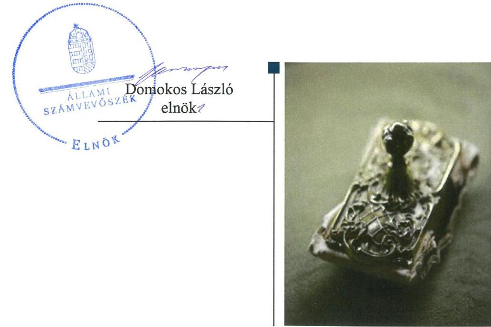
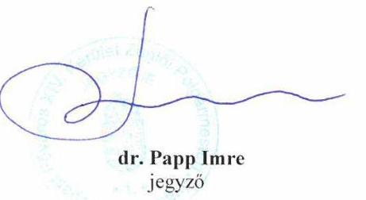
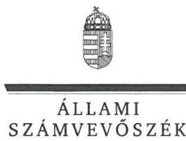
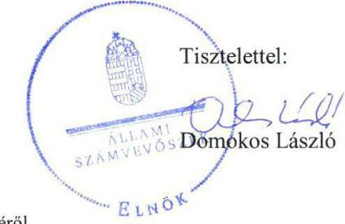

# Jelentés 

## Nemzeti tulajdonú gazdasági társaságok ellenőrzése

Zuglói Sport- és Rendezvényszervező Nonprofit Korlátolt Felelősségű Társaság
2019.

---

# Jelentés 

## Nemzeti tulajdonú gazdasági társaságok ellenőrzése

Zuglói Sport- és Rendezvényszervező Nonprofit Korlátolt Felelősségű Társaság
2019. 10. hó 24. nap

---

# AZ ELLENŐRZÉST FELÜGYELTE:

DR. HORVÁTH MARGIT felügyeleti vezető

DR. PULAY GYULA felügyeleti vezető

## AZ ELLENŐRZÉST VEZETTE ÉS A VÉGREHAJTÁSÁÉRT FELELŐS:

SIPOSNÉ DÓCZI KLÁRA ellenőrzésvezető

## A PROGRAM ÖSSZEÁLLÍTÁSÁÉRT FELELŐS:

TÓTPÁL SZABOLCS osztályvezető

IKTATÓSZÁM: EL-1792-001/2019

TÉMASZÁM: 2478

TÉMASZÁM: 2478

Jelentéseink az Országgyűlés számítógépes hálózatán és az Interneta a www.asz.hu címen is olvashatóak.

---

# TARTALOMJEGYZÉK 

■ ÖSSZEGZÉS ..... 5
■ AZ ELLENŐRZÉS CÉLJA ..... 6
■ AZ ELLENŐRZÉS TERÜLETE ..... 7
■ AZ ELLENŐRZÉS HÁTTERE, INDOKOLTSÁGA ..... 8
■ A JELENTÉS LÉNYEGES KÉRDÉSKÖREI ..... 9
■ AZ ELLENŐRZÉS HATÓKÖRE ÉS MÓDSZEREI ..... 10
■ MEGÁLLAPÍTÁSOK ..... 12
■ JAVASLATOK ..... 14
■ MELLÉKLETEK ..... 15
I. sz. melléklet: Értelmező szótár ..... 15
■ FÜGGELÉKEK ..... 17
I. sz. függelék: Észrevételek ..... 17
■ RÖVIDÍTÉSEK JEGYZÉKE ..... 23

---

.

---

# ÖSSZEGZÉS 

Budapest Főváros XIV. Kerület Zugló Önkormányzata tulajdonosi joggyakorlása szabályszerű volt. A Zuglói Sport- és Rendezvényszervező Nonprofit Korlátolt Felelősségű Társaság vagyongazdálkodása szabályszerű volt, azonban a kormányzati szektorra vonatkozóan a jogszabályban előirt adatszolgáltatásnak nem tett eleget.

## Az ellenőrzés társadalmi indokoltsága

Az Állami Számvevőszék kiemelt célja, hogy ellenőrzéseivel hozzájáruljon ahhoz, hogy a közpénzeket, illetve az ingyenesen juttatott közvagyont az államháztartáson kívül működő szervezetek is átlátható, rendezett módon használják fel.

Az állam és a helyi önkormányzatok tulajdona nemzeti vagyon, melynek megőrzése érdekében kiemelten fontos a nemzeti tulajdonú gazdasági társaságok ellenőrzése. Ellenőrzésüket további társadalmi elvárás is indokolja. Részben a gazdálkodásuk körébe tartozó vagyon nagysága, részben az általuk ellátott közszolgáltatások, sajátos feladatellátások, mivel tevékenységükön keresztül a lakosság széles köre kerül kapcsolatba a társaságokkal.

Az Állami Számvevőszék céljaival és a társadalmi igénnyel összhangban, a gazdasági társaságok kiemelt fontosságú szerepe miatt került sor a Zuglói Sport- és Rendezvényszervező Nonprofit Korlátolt Felelősségű Társaság vagyongazdálkodásának, illetve Budapest Főváros XIV. Kerület Zugló Önkormányzata tulajdonosi joggyakorlásának ellenőrzésére.

## Főbb megállapítások, következtetések, javaslatok

Budapest Főváros XIV. Kerület Zugló Önkormányzata a tulajdonosi joggyakorlás kereteit a törvényi előírásoknak megfelelően alakította ki, a tulajdonosi jogait a jogszabályi és a belső előírásoknak megfelelően gyakorolta.

A Zuglói Sport- és Rendezvényszervező Nonprofit Korlátolt Felelősségű Társaság az eszközöket és a forrásokat a jogszabályi és a belső előírások szerint leltározta, továbbá a számviteli beszámolók mérlegtételeit szabályszerű leltárakkal alátámasztotta. A Társaság a vagyonának nyilvántartásait a kapcsolódó törvénynek és saját szabályzatainak megfelelően vezette, a vagyon hasznosítása során az előírásokat betartva járt el. A Társaság vagyongazdálkodása szabályszerű volt, ugyanakkor a kormányzati szektorra tekintettel előírt adatszolgáltatási kötelezettségét nem teljesítette.

Az Állami Számvevőszék a jelentésbe foglalt megállapítások alapján a Zuglói Sport- és Rendezvényszervező Nonprofit Korlátolt Felelősségű Társaság ügyvezetőjének egy javaslatot fogalmazott meg. A javaslatot megalapozó megállapításra az érintettnek 30 napon belül intézkedési tervet kell készítenie.

---

# AZ ELLENŐRZÉS CÉLJA 

AZ ELLENŐRZÉS CÉLJA annak megállapítása volt, hogy a tulajdonosi joggyakorló a gazdasági társaságai feletti tulajdonosi joggyakorlás kereteit kialakította-e, tulajdonosi jogait megfelelően gyakorolta-e és kötelezettségeit teljesítette-e. Az ellenőrzés célja volt továbbá annak megállapítása, hogy a gazdasági társaság biztosította-e a vagyon védelmét a nyilvántartások szabályszerű vezetése és a mérleg tételeinek leltárral történő alátámasztása útján, valamint szabályszerűen gondoskodott-e a társaság használatában, kezelésében lévő nemzeti vagyon értékének megőrzéséről, gyarapításáról, hasznosításáról, továbbá gazdálkodásának a kormányzati szektor hiányára és az államadósságra befolyással bíró elemei a jogszabályi előírásoknak megfeleltek-e és az adatszolgáltatási kötelezettségének eleget tett-e.

---

# **AZ ELLENŐRZÉS TERÜLETE**

## **Zuglói Sport-és Rendezvényszervező Nonprofit Korlátolt Felelősségű Társaság és a tulajdonosi jogokat gyakorló Budapest Főváros XIV. Kerület Zugló Önkormányzata**

A Zuglói Sport- és Rendezvényszervező Nonprofit Korlátolt Felelősségű Társaság 2010. december 15-én jött létre. A Társaság^{1} jegyzett tőkéje az ellenőrzött időszakban 284,5 M Ft volt, mely 10,0 M Ft készpénzből és 274,5 M Ft nem pénzbeli hozzájárulásból állt. A Társaság 100%-os tulajdonosa Budapest Főváros XIV. Kerület Zugló Önkormányzata volt.

Az Önkormányzat^{2} az Mötv.^{3} szerinti kerületi sport és szabadidősport támogatását, ifjúsági ügyek közfeladat-ellátását részben a Társaság működése által biztosította. Az Önkormányzat az Mötv.-ben és a Sport tv.^{4} -ben nevesített közfeladat-ellátására Közszolgáltatási szerződés^{1,2} kötött a Társasággal.

Az Önkormányzat a közfeladat ellátásához Haszonkölcsön szerződés^{1,3} keretében, ingyenesen, célhoz kötött hasznosítási- és állagmegóvási kötelezettség előírásával adta át a tulajdonában álló ingatlanokat a Társaság használatába. Az Önkormányzat vagyonkezelésbe nem adott vagyont a Társaság részére. A Társaság 2017. június 15-től tartozott a kormányzati szektorba sorolt egyéb szervezetek^{7} közé. A Társaságnak nem volt az államadósságra befolyással bíró kötelezettségvállalása az ellenőrzött időszakban.

A Társaság főbb pénzügyi adatait az 1. táblázat szemlélteti. Az ellenőrzött időszakban a Társaság összes eszközének könyv szerinti értéke 81%kal, saját tőkéje 87%-kal növekedett, a bevételek^{8} megháromszorozódtak. A foglalkoztatottak átlagos statisztikai létszáma 2015-ben 16 fő, 2016-ban 21 fő, 2017-ben 24 fő volt.

Az ellenőrzött időszakban a Társaság irányítási feladatait az Ügyvezető^{9}, ellenőrzését hat fős Felügyelőbizottság^{10} végezte. A Társaság ügyvezetőjének személye az ellenőrzött időszakban nem változott. A Társaság a Számv. tv.^{11} előírása szerint nem volt könyvvizsgálatra kötelezett, azonban az ellenőrzött években az Alapító előírására végeztek könyvvizsgálatot. A Könyvvizsgáló^{12} személye az ellenőrzött időszakban nem változott.

A Polgármester^{13} 2014-től tölti be tisztségét, a Jegyző^{14} 2018 szeptemberétől vezeti a Polgármesteri Hivatalt^{15}. A Jegyző személye kétszer változott az ellenőrzött időszakban.

1. táblázat

|  A TÁRSASÁG FŐBB PÉNZÜGYI ADATAI (M FT) |  |  |   |
| --- | --- | --- | --- |
|   | 2015. | 2016. | 2017.  |
|  bevételek | 182 | 257 | 570  |
|  adózott eredmény összes eszköz | 7 | 8 | 188  |
|  saját tőke | 264 | 294 | 479  |
|  Forrás: A Társaság egyszerűsített éves beszámoló 2015-2017 |  |  |   |

---

# AZ ELLENŐRZÉS HÁTTERE, INDOKOLTSÁGA 

Az Alaptörvény 38. cikke alapján az állam és a helyi önkormányzatok tulajdona nemzeti vagyon. A nemzeti vagyon megőrzése, megóvása érdekében kiemelten fontos ezen nemzeti tulajdonú gazdasági társaságok ellenőrzése. Gazdálkodásuk jellemzően a közérdeklődés és a média figyelmének középpontjában áll, amihez hozzájárul a gazdálkodásuk körébe tartozó - a nemzeti vagyon részét képező - vagyon nagysága, illetve az általuk ellátott közszolgáltatások minősége és hatékonysága.

Ellenőrzéseink feltárhatják, hogy a tulajdonosi felügyelet hozzájárult-e a szabályszerű gazdálkodáshoz és feladatellátáshoz.

Az ellenőrzés eredményeként meghatározhatóvá válnak a szervezet vagyongazdálkodást érintő kockázatai, ezzel lehetővé téve a kockázatok csökkentését.

A megállapítások alapján megfogalmazott számvevőszéki javaslatok hasznosítása elősegítheti a meglévő hibák megszüntetését. A jó gyakorlatok bemutatásával az Állami Számvevőszék hozzájárulhat a követendő megoldások megismertetéséhez, terjesztéséhez.

---

# A JELENTÉS LÉNYEGES KÉRDÉSKÖREI 

1. A tulajdonosi jogok gyakorlása szabályszerű volt-e?
2. A gazdasági társaság vagyongazdálkodási tevékenysége szabályszerű volt-e?
3. A gazdasági társaság kormányzati szektor hiányára befolyással bíró elemei megfeleltek-e a jogszabályi előírásoknak, adatszolgáltatási kötelezettségének eleget tett-e?

---

# AZ ELLENŐRZÉS HATÓKÖRE ÉS MÓDSZEREI 

## Az ellenőrzés típusa

Megfelelőségi ellenőrzés.

## Az ellenőrzött időszak

A tulajdonosi joggyakorlás tekintetében az ellenőrzött időszak 2017. január 1-től az ellenőrzés megkezdésének napjáig - 2018. október 12. - terjedt ki az éves beszámoló elfogadása kivételével, amelynél az ellenőrzött időszak 2015. január 1-től az ellenőrzés megkezdésének napjáig tartott.

A gazdasági társaság vagyongazdálkodása vonatkozásában az ellenőrzött időszak a 2015-2017. évek, a 2017. évi beszámoló jóváhagyása tekintetében a 2018. június elsejéig tartó időszak. A vagyongazdálkodás ellenőrzése 2018. október 12-én kezdődött.

A kormányzati szektorba tartozó gazdálkodás és adatszolgáltatás tekintetében 2017. június 15 -től a 2017. év, a beszámoló jóváhagyása és közzététele tekintetében 2018. június elsejéig tartó, az adatszolgáltatás teljesítése tekintetében 2018. június 29 -ig tartó időszak. A kormányzati szektorba tartozó gazdálkodás és adatszolgáltatás ellenőrzése 2019. március 8án kezdődött.

## Az ellenőrzés tárgya

Az önkormányzat tulajdonosi joggyakorlása, a 100\%-os tulajdonában lévő gazdasági társaság feletti tulajdonosi joggyakorlás kialakítása és múködtetése. A Társaság vagyongazdálkodása keretében a társaság használatában lévő nemzeti vagyon, illetve a saját vagyon tekintetébe a vagyonnyilvántartások vezetése, leltára. Valamint a társaság gazdálkodásának a kormányzati szektor hiányára és az államadósságra befolyással bíró elemei és a jogszabályi előírásoknak megfelelő adatszolgáltatási kötelezettségének teljesítése.

## Az ellenőrzött szervezet

Zuglói Sport- és Rendezvényszervező Nonprofit Korlátolt Felelősségű Társaság és Budapest Főváros XIV. Kerület Zugló Önkormányzata

## Az ellenőrzés jogalapja

Az ellenőrzés jogalapját az ÁSZ tv. ${ }^{16}$ 1. § (3) bekezdése, 5. § (4) bekezdése képezi.

---

# Az ellenőrzés módszerei 

Az ellenőrzést az ellenőrzési program ellenőrzési kérdései, az ellenőrzött időszakban hatályos jogszabályok, az ellenőrzés szakmai szabályok és módszertanok alapján, a nemzetközi standardok figyelembe vételével végeztük.

Az ellenőrzés ideje alatt az ellenőrzött szervezettel történő kapcsolattartást az ÁSZ ${ }^{17}$ Szervezeti és Múködési Szabályzatának vonatkozó előírásai alapján biztosítottuk.

Az ellenőrzési kérdések megválaszolásához szükséges bizonyítékok megszerzése a következő ellenőrzési eljárások alkalmazásával történt: megfigyelés, információkérés, összehasonlítás, elemző eljárás. Az ellenőrzési bizonyítékként felhasználható adatforrások közé tartoztak az ellenőrzési programban felsorolt adatforrások, továbbá minden - az ellenőrzés folyamán - feltárt, az ellenőrzés szempontjából információkat tartalmazó dokumentum.

Az ellenőrzést a kérdésekre adott válaszok kiértékelésével, valamint a megjelölt adatforrások, a tanúsítványok felhasználásával, továbbá az adott időszakban hatályos jogszabályok figyelembe vételével folytattuk le.

A 2017. január 1-től az ellenőrzés megkezdésének napjáig ellenőriztük a tulajdonosi joggyakorlás kereteinek kialakítását, a tulajdonosi joggyakorló tevékenységét a felügyelőbizottság és a független könyvvizsgáló múködéséhez kapcsolódóan, valamint azt, hogy a tulajdonosi joggyakorló amennyiben a gazdasági társaság feladatellátásához kapcsolódóan határozott meg követelményeket, elvárásokat - a nemzeti vagyon értékének megőrzése érdekében monitorozta-e azok teljesülését. A 2015. január 1től az ellenőrzés megkezdésének napjáig ellenőriztük a tulajdonosi joggyakorló részvételét az éves beszámoló elfogadására vonatkozó döntéshozatalban.

A gazdasági társaság vagyonhoz kapcsolódó nyilvántartásai vezetésének megfelelősége, valamint a nemzeti vagyon értéke megőrzésének, gyarapításának, hasznosításának szabályszerűsége 2015. és 2017. évek tekintetében került ellenőrzésre. A teljes ellenőrzött időszakot érintően, 20152017 éveket érintően történt meg a lényeges dokumentumok, kiemelten a mérleg tételeinek leltárral való alátámasztottságának értékelése.

A vagyonnyilvántartások és a leltár szabályszerűségét mintavétellel ellenőriztük. Az ellenőrzés azokra a legnagyobb értékű tételekre - lényeges sokaságra - terjedt ki, melyek összértéke elérte a teljes sokaság összértékének 50\%-át. A lényeges sokaságot tételesen ellenőriztük.

A kormányzati szektorba sorolt gazdasági társaság gazdálkodásának a kormányzati szektor hiányára befolyással bíró gazdasági eseményei elszámolásának megfelelősége 2017. év tekintetében került ellenőrzésre, a kormányzati szektorba sorolt gazdasági társaság adatszolgáltatási kötelezettségére vonatkozó jogszabályi előírások betartását az e területre vonatkozó teljes ellenőrzött időszakra, 2017. június 15-től 2018. június 29-ig értékeltük.

---

# 1. A tulajdonosi jogok gyakorlása szabályszerű volt-e? 

## Összegző megállapítás

A tulajdonosi jogok gyakorlása szabályszerű volt.

A TULAJDONOSI JOGGYAKORLÁS KERETEIT az Önkormányzat Képviselő-testülete ${ }^{18}$, mint a Társaság alapítója és annak legfőbb szerve a jogszabályi és a belső előírások - az Mötv. a Ptk. ${ }^{19}$ és az Nvtv. ${ }^{20}$ vonatkozó előírásai, valamint az önkormányzati SZMSZ ${ }^{21}$ és a Vagyongazdálkodási rendelet ${ }_{1,2}{ }^{22}$ - szerint a Társaság Alapító okiratában ${ }^{23}$ határozta meg. A Társaság közfeladat-ellátásának feltételeit az önkormányzati SZMSZ és a Vagyongazdálkodási rendelet előírásai szerint a Közszolgáltatási szerződés ${ }_{1,2}$ és a Haszonkölcsön szerződés ${ }_{1-3}$ tartalmazta.

Az Alapító ${ }^{24}$ a Taktv. ${ }^{25}$-ben foglalt előírások szerint Szabályzatban ${ }^{26}$ rendelkezett a vezető tisztségviselők, a felügyelőbizottsági tagok, valamint az Mt. ${ }^{27}$ 208. § hatálya alá tartozó munkavállalók javadalmazásának, valamint jogviszonyuk megszűnése esetére biztosított juttatások módjának, mértékének elveiről, annak rendszeréről.

A Felügyelőbizottság rendelkezett az Alapító által a Ptk. előírásai szerint jóváhagyott Ügyrenddel ${ }^{28}$.

A TULAJDONOSI JOGOKAT az Alapító a Ptk., a Számv. tv., a Taktv. és a Ctv. ${ }^{29}$ vonatkozó előírásainak, és az önkormányzati SZMSZ, a Vagyonrendelet valamint az Alapító okirat szabályozásának eleget téve gyakorolta.

Az Alapító a Ptk. és a Taktv. előírásai szerint jelölte ki a Felügyelőbizottság tagjait, választotta ki a könyvvizsgálót.

Az Alapító a Felügyelőbizottság jelentését és a könyvvizsgáló írásos véleményét figyelembe véve, a Ptk., a Számv. tv., és a Ctv. valamint az Alapító okirat előírásai szerint határozatokban döntött az ellenőrzött időszakban a Társaság egyszerűsített éves beszámolóinak az elfogadásáról, az adózott eredmény eredménytartalékba helyezéséről.

Az Alapító nem élt az Áht. ${ }^{30}$-ban számára biztosított lehetőséggel, a Társaságnál az ellenőrzött időszakban nem hajtott végre ellenőrzést. A Felügyelőbizottság az Ügyrendjében meghatározottak szerint megtárgyalta és elfogadta a Társaság üzleti tervét, valamint értékelte annak időarányos teljesítését.

---

# 2. A gazdasági társaság vagyongazdálkodási tevékenysége szabályszerű volt-e? 

## Összegző megállapítás

A Társaság vagyongazdálkodása szabályszerű volt.
A Társaság rendelkezett a Számv. tv. előírásainak megfelelő Leltározási szabályzattal ${ }^{31}$. A szabályzat tartalmazta a leltározásra és leltárkészítésre vonatkozó általános szabályokat, számviteli előírásokat.

A Társaság vagyongazdálkodása a leltárak és a vagyonnyilvántartások tekintetében a Számv. tv előírásai szerint szabályszerű volt.

A Társaság a Számv. tv. előírásai szerint az ellenőrzött időszak minden évében a Leltározási szabályzata szerinti leltározást követően készített leltárakkal támasztotta alá az egyszerűsített éves beszámolójának mérlegtételeit, és biztosította az üzleti év mérleg-fordulónapjára vonatkozóan a főkönyvi könyvelés és az analitikus nyilvántartások adatai közötti egyeztetést. A 2015-2017. évi számviteli beszámolókat alátámasztó leltárak a Számv. tv. szabályozása szerint tételesen és ellenőrizhető módon tartalmazták a Társaságnak a mérleg fordulónapján fennálló eszközeit és forrásait mennyiségben és értékben.

A Társaság a saját vagyonához kapcsolódó nyilvántartásait a Számv. tv. vonatkozó előírásai és a Társaság belső szabályozásaiban - Számviteli politika ${ }_{1-3}{ }^{32}$, Eszközök és források értékelése szabályzat ${ }_{1-3}{ }^{33}$ - foglalt előírások szerint vezette. A Társaság a használatában lévő Önkormányzati vagyon továbbhasznosítása során betartotta a Haszonkölcsön szerződés1-3-ben megfogalmazott előírásokat.

## 3. A gazdasági társaság kormányzati szektor hiányára befolyással bíró elemei megfeleltek-e a jogszabályi előírásoknak, adatszolgáltatási kötelezettségének eleget tett-e?

## Összegző megállapítás

A Társaság az előírt adatszolgáltatási kötelezettségének nem tett eleget.

A Társaság az Áht. 107. § (1) bekezdésében és az Ávr. ${ }^{34}$ 5. melléklete 23. sorában előírt adatszolgáltatási kötelezettségének nem tett eleget.

---

# JAVASLATOK 

Az ÁSZ tv. 33. § (1) bekezdésében foglaltak értelmében az ellenőrzött szervezet vezetője köteles a jelentésben foglalt megállapításokhoz kapcsolódó intézkedési tervet összeállítani és azt a jelentés kézhezvételétől számított 30 napon belül az ÁSZ részére megküldeni. Amennyiben az ellenőrzött szervezet vezetője nem küldi meg határidőben az intézkedési tervet, vagy továbbra sem elfogadható intézkedési tervet küld, az Állami Számvevőszék elnöke az ÁSZ tv. 33. § (3) bekezdése a) és b) pontjaiban foglaltakat érvényesítheti.

Javaslatunk célja a Zuglói Sport- és Rendezvényszervező Nonprofit Korlátolt Felelősségű Társaság gazdálkodása szabályszerűségének és gyakorlatának javítása annak érdekében, hogy a szabályozási környezet és az alkalmazott gyakorlat megfelelően tudja támogatni az átlátható müködést.

## Zuglói Sport- és Rendezvényszervező Nonprofit Korlátolt Felelősségű Társaság ügyvezetőjének

1. Intézkedjen az Áht. és az Ávr. előírásainak megfelelően az adatszolgáltatási kötelezettség teljesítése érdekében.
(3. sz. megállapítás 1. bekezdése alapján)

---

# MELLÉKLETEK 

- I. SZ. MELLÉKLET: ÉRTELMEZŐ SZÓTÁR
gazdasági társaság
közfeladat
nemzeti vagyon
tulajdonosi jogok gyakorlója
nemzeti vagyon hasznosítása
nemzeti vagyon használója

A gazdasági társaságok üzletszerű közös gazdasági tevékenység folytatására, a tagok vagyoni hozzájárulásával létrehozott, jogi személyiséggel rendelkező vállalkozások, amelyekben a tagok a nyereségből közösen részesednek, és a veszteséget közösen viselik. Forrás: Ptk. 3:88. § (1) bekezdése
A gazdasági társaságok üzletszerű közös gazdasági tevékenység folytatására, a tagok vagyoni hozzájárulásával létrehozott, jogi személyiséggel rendelkező vállalkozások, amelyekben a tagok a nyereségből közösen részesednek, és a veszteséget közösen viselik. Forrás: Ptk. 3:88. § (1) bekezdése
Nvtv. 1. § (2) bekezdése szerint nemzeti vagyonba tartozik többek között:
„az állam vagy a helyi önkormányzat kizárólagos tulajdonában álló dolgok,
az a) pont hatálya alá nem tartozó, állam vagy a helyi önkormányzat tulajdonában lévő do$\log$,
az állam vagy a helyi önkormányzat tulajdonában lévő pénzügyi eszközök, továbbá az államot vagy a helyi önkormányzatot megillető társasági részesedések,
az államot vagy a helyi önkormányzatot megillető bármely vagyoni értékkel rendelkező jogosultság, amelyet jogszabály vagyoni értékű jogként nevesít."
Aki a nemzeti vagyon felett az államot vagy a helyi önkormányzatot megillető tulajdonosi jogok és kötelezettségek összességének gyakorlására jogosult. Forrás: Nvtv. 3. § (1) 17. pontja
A tulajdonosi joggyakorló vagy a nemzeti vagyon használója által a nemzeti vagyon birtoklásának, használatának, hasznok szedése jogának bármely - a tulajdonjog átruházását nem eredményező - jogcímen történő átengedése, ide nem értve a vagyonkezelésbe adást, valamint a haszonélvezeti jog alapítását. Forrás: Nvtv. 3. § (1) bekezdés 4. pont
Azon természetes személy, jogi személy vagy jogi személyiséggel nem rendelkező szervezet, aki vagy amely állami vagyon tekintetében törvény vagy szerződés alapján, a helyi önkormányzat vagyona tekintetében törvény, a helyi önkormányzat rendelete vagy szerződés alapján bármely jogcímen nemzeti vagyont birtokol, használ, szedi annak hasznait, kivéve a tulajdonosi joggyakorló. Forrás: Nvtv. 3. § (1) bekezdés 11. pont

---

.

---

# FÜGGELÉKEK 

I. SZ. FÜGGELÉK: ÉSZREVÉTELEK

A jelentéstervezetet a Számvevőszék 15 napos észrevételezésre megküldte az ellenőrzött szervezetek vezetőinek az ÁSZ tv. 29. §* (1) bekezdése előírásának megfelelően.

A Zuglói Sport- és Rendezvényszervező Nonprofit Korlátolt Felelősségű Társaság ügyvezetője nem kívánt észrevételt tenni. Budapest Főváros XIV. Kerület Zugló Önkormányzata jegyzője a jelentéstervezet megállapításaira írásban észrevételt tett.
Az ÁSZ tv. 29. § (3) bekezdésével összhangban az ÁSZ a Függelékben feltünteti az ellenőrzés megállapításaival kapcsolatban tett, figyelembe nem vett észrevételeket, és megindokolja, hogy azokat miért nem fogadta el.

[^0]
[^0]:    * 29. § (1) Az Állami Számvevőszék az ellenőrzési megállapításait megküldi az ellenőrzött szervezet vezetőjének vagy az általa megbízott személynek, és annak, akinek személyes felelősségét állapította meg.
    (2) Az ellenőrzött szervezet vezetője és a felelősként megjelölt személy az ellenőrzés megállapításaira tizenöt napon belül írásban észrevételt tehet.
    (3) Az Állami Számvevőszék az észrevételre a beérkezésétől számított harminc napon belül írásban válaszol. A figyelembe nem vett észrevételeket köteles a jelentésben feltüntetni, és megindokolni, hogy azokat miért nem fogadta el.

---

# Domokos László elnök úr részére 

## Állami Számvevőszék

1052 Budapest
Apáczai Csere János u. 10.

Tárgy: Észrevétel számvevőszéki jelentéstervezetre

Tisztelt Elnök Úr!

Az Állami Számvevőszék a nemzeti tulajdonú gazdasági társaságok ellenőrzése körében a Zuglói Sport- és Rendezvényszervező Nonprofit Korlátolt Felelősségű Társaság tevékenysége tekintetében ellenőrzést folytatott, és jelentéstervezetét 2019. június 17-i keltezéssel megküldte a Zuglói Önkormányzat Polgármestere részére. Polgármester úr megbízásából az alábbiakról tájékoztatom:

Polgármester úr nevében szeretném megköszönni az ellenőrzés lefolytatását és a javaslatukat, melyet a Társaság gazdálkodása szabályszerűségének és gyakorlatának a javítása érdekében tettek azzal a céllal, hogy a szabályozási környezet és az alkalmazott gyakorlat megfelelően tudja támogatni az átlátható müködést.

Az Állami Számvevőszék EL-0880-023/2018. iktatószámú 2018. október 5-én kelt és 2018. október 12-én kézhez vett levelében értesítette Zugló Önkormányzatát, hogy a 2018. II. félévi ellenőrzési terve alapján megkezdte a Társaság ellenőrzését, és egyúttal megküldte a vizsgálat (azonosító szám: V0822) ellenőrzési programját (1. számú melléklet). Az ellenőrzési program 2 fókuszkérdést tartalmazott, az első fókuszkérdéshez 5 alkérdés, a második fókuszkérdéshez 4 alkérdés tartozott.

A Társaság ügyvezetője megküldte az Önkormányzatnak tájékoztatásul az Állami Számvevőszék és a Társaság által 2019. február 28. napján felvett jegyzőkönyvet (2. számú melléklet). A jegyzőkönyv rögzíti, hogy a Társaság adatszolgáltatása a rendelkezésre álló határidőben nem történt meg, és Teljességi és hitelességi nyilatkozatot sem bocsátott rendelkezésre, ezért nemleges tartalmú Teljességi és hitelességi nyilatkozat kiállítása volt szükséges. A jegyzőkönyvben szerepel, hogy az ügyvezető az adatszolgáltatási kötelezettségének eleget kívánt tenni, de a határidő betartásában akadályba ütközött, ezért kérte az ABR felület ismételt megnyitását. A Társaságnál ügyvezetőváltás történt, és a 2018. december 13-án kinevezett új ügyvezető nem rendelkezett információval az Állami Számvevőszék ellenőrzésének a megindításáról. Arról is nyilatkozott, hogy a jegyzőkönyv felvételekor a kért adatok teljeskörűen rendelkezésre álltak, az ellenőrzésvezető azonban azokat a törvényben előírt határidőt követően már nem vette át.

A Társaság ügyvezetője tájékoztatásul megküldte az Állami Számvevőszék EL-1324-011/2019. iktatószámú, 2019. március 08-án kelt levelét, melyben közvetlenül értesítette a Társaságot, hogy a 2019. I. félévi ellenőrzési terve alapján megkezdte a Társaság ellenőrzését, és megküldte a vizsgálat (azonosító szám: V0822) ellenőrzési programját (3. számú melléklet). A program 1 fókuszkérdést tartalmazott, melyhez 3 alkérdés tartozott. Az ellenőrzés címe változatlanul „Nemzeti tulajdonú gazdasági társaságok ellenőrzése" volt. Tényszerűen megállapítható, hogy a vizsgálat a kormányzati szektorba sorolt gazdasági társaságok program alapján történt. A megküldött jelentéstervezet pedig 3 kérdéskört tartalmaz.

---

Felvetem az Állami Számvevőszékről szóló 2011. évi LXVI. törvény 25. § (5) bekezdés a) pontja alapján azt a sérelmet, hogy az ellenőrzésvezető nem tájékoztatta az Önkormányzatot az újabb vizsgálat megindításáról, a két vizsgálat összevonásáról, az ellenőrzési program kibővítéséről, mivel az álláspontunk szerint a második vizsgálat új vizsgálati szempontokat határoz meg, a célja nem az egyes (korábbi) megállapítások alátámasztása, kiegészítése.

A rendelkezésünkre álló jelentéstervezet 5. számozott oldalán az Állami Számvevőszék a következőket írja: „[a]z ellenőrzés célja volt továbbá annak megállapítása, hogy a gazdasági társaság biztosította-e a vagyon védelmét a nyilvántartások szabályszerű vezetése és a mérleg tételeinek leltárral történő alátámasztása útján, valamint szabályszerűen gondoskodott-e a társaság használatában, kezelésében lévő nemzeti vagyon értékeinek megőrzéséről, gyarapításáról, hasznosításáról (...)".
A tervezet 7. oldalán pedig ez olvasható: „a számvevőszéki javaslatok hasznosítása elősegítheti a meglévő hibák megszüntetését". Magam is így gondolom: ha az Állami Számvevőszék a törvényi kötelezettségeinek eleget téve folytatja le a vizsgálatát, a nemzeti vagyon védelméhez jelentősen képes hozzájárulni.

A Zuglói Sport- és Rendezvényszervező Nonprofit Kft. számvevőszéki vizsgálata álláspontom szerint nem mutat fel ilyen értékeket. Az Állami Számvevőszék a vizsgálatot a nemleges tartalmú Teljességi nyilatkozat alapján rendelkezésre álló adatok, tanúsítványok, információk alapján folytatta le.
Eltérő volt a vizsgálatok tárgya, hatóköre és módszere is, ugyanakkor a vizsgálatok céljukat tekintve azonosak, és megállapítható, hogy kirívóan szembetűnő a különbség a számvevőszéki és a lefolytatott belső ellenőri vizsgálat összegző megállapításai között.

A Hivatal belső ellenőrzése ugyanis vizsgálta a Társaság 2017. január 1. - 2018. augusztus 31-ig tartó időszaki gazdálkodásának a szabályszerűségét. Tekintettel arra, hogy az Állami Számvevőszék és az önkormányzati belső ellenőrzés időszakában a 2017. évet illetően átfedés van, tájékoztatni szeretnénk az Állami Számvevőszéket az ellenőrzésről. A soron kívüli vizsgálat elrendelésére a Társaság könyvvizsgálójának a tulajdonos részére írt Vezetői levelei alapján került sor. A könyvvizsgáló a tulajdonosi érdekek sérülésének és a vagyonvesztés elkerülése érdekében javasolta a tulajdonosnak, hogy vizsgáltassa ki a vagyonmozgások, valamint az árbevétel csökkenése és a költségek növekedése okait. Ezen kívül a Társaság Felügyelő Bizottsága szintén olyan tartalmú határozatokat hozott, melyben kérte a tulajdonost, hogy vizsgálja meg a Társaság 2018. január 1. - 2018. szeptember 30. időszaki működésének a szabályosságát, törvényességét, valamint kezdeményezte a Társaság ügyvezetőjének visszahívását.

A Hivatal belső ellenőrzése által lefolytatott vizsgálat megállapításai alapján a Képviselő-testület az ügyvezetőt a tisztségéből felmentette, és elrendelte a szükséges korrekciós intézkedések meghozatalát. Intézkedésiterv-készítési kötelezettsége a Társaságnak és a Hivatalnak egyaránt keletkezett. Az Intézkedési tervek végrehajtása megtörtént.

Budapest, 2019. június 28.
Tisztelettel:

Mellékletek:
1.számú: Az Állami Számvevőszék EL-0880-023/2018. iktatószámú levele
2.számú: 2019. február 28. napján felvett jegyzőkönyv
3.számú: Az Állami Számvevőszék EL-1324-011/2019. iktatószámú levele

---

ELNÖK

Ikt.szám: EL-0880-075/2019.

# Karácsony Gergely Szilveszter úr polgármester 

## Budapest Fóváros XIV. Kerület Zugló Önkormányzata

## Budapest

## Tisztelt Polgármester Úr!

Köszönettel vettem a „Nemzeti tulajdonú gazdasági társaságok ellenőrzése - Zuglói Sport- és Rendezvényszervező Nonprofit Korlátolt Felelősségü Társaság" címmel készített számvevőszéki jelentéstervezetre Polgármester úr megbízásából dr. Papp Imre jegyző úr 1/15546-2/2019. ügyiratszámú, 2019. június 28-i kelt levelét.
Az Állami Számvevőszék a levél tartalmára vonatkozó álláspontját a felügyeleti vezető által készített részletes tájékoztatás tartalmazza, amelyet levelemhez mellékeltem.
Tájékoztatom Polgármester urat, hogy a levél tartalma alapján az Állami Számvevőszék a figyelembe nem vett észrevételeket az Állami Számvevőszékről szóló 2011. évi LXVI. törvény 29. § (3) bekezdésében előírtak szerint köteles a jelentésében feltüntetni és megindokolni, hogy azokat miért nem fogadta el.

Budapest, 2019. 04. hó 31. nap

Melléklet: Tájékoztatás az észrevételek kezeléséről

---

# Tájékoztatás az észrevételek kezeléséről 

Megköszönöm a „Nemzeti tulajdonú gazdasági társaságok ellenörzése - Zuglói Sport- és Rendezvényszervező Nonprofit Korlátolt Felelősségü Társaság" címmel készített jelentéstervezettel kapcsolatos válaszlevelet. A levél tartalmának kezeléséről az alábbi tájékoztatást adom.
Budapest Főváros XIV. Kerület Zugló Önkormányzata (Önkormányzat) Polgármestere megbízásából eljárva Jegyző úr levelének első részét köszönettel tudomásul vettem. Tekintettel arra, hogy az nem érinti a jelentéstervezet megállapításait és javaslatait, arra külön válasz nem szükséges.

A levél második része a „Nemzeti tulajdonú gazdasági társaságok ellenörzése - Kormányzati szektorba sorolt gazdasági társaságok modul" címủ ellenőrzési program alapján indított ellenőrzés során arról tájékoztat, hogy a Társaság ellenőrzésének lefolytatásával kapcsolatban az ÁSZ az Önkormányzat részére nem küldte meg a vonatkozó ellenőrzési programot, továbbá Jegyző úr sérelmezte, hogy az ÁSZ az Önkormányzatot nem tájékoztatta az újabb ellenőrzés megindításáról, a korábban indult vagyongazdálkodás modul és a kormányzati szektorba sorolt gazdasági társaságok modul összevonásáról. A továbbiakban a levél a jelentéstervezetből idézi az ellenőrzés célját, valamint az ellenőrzésünk hátterének, indokoltságának egy részét, majd a jelentéstervezettel szemben kifogásolja ezen értékek felmutatását.

## A levél második részében jelzettekre az alábbi választ adom:

Jegyző úr levelében leírtak a jelentéstervezetnek az Önkormányzattal, mint ellenőrzött szervezettel kapcsolatos konkrét megállapításaihoz nem kapcsolódnak, így azok helytállósága változatlanul fennáll.
Az észrevételezési jog az Állami Számvevőszékről szóló 2011. évi LXVI. törvény (ÁSZ tv.) 29. § (2) bekezdésében foglaltak szerint az ellenőrzött szervezetet illeti meg. A jelen ellenőrzés estében az Önkormányzat a tulajdonosi joggyakorlás témakörében érintett, míg A „Nemzeti tulajdonú gazdasági társaságok ellenörzése - Vagyongazdálkodás modul" címü, EL-0552-004/2018. iktatószámú ellenőrzési program alapján végrehajtott ellenőrzés keretében a Társaság az érintett.
Az ÁSZ az ellenőrzés további részét a „Nemzeti tulajdonú gazdasági társaságok ellenörzése Kormányzati szektorba sorolt gazdasági társaságok modul" címủ, EL-0552-006/2018. iktatószámú ellenőrzési program alapján hajtotta végre. Az ÁSZ az ellenőrzés keretében a Társaságtól az ellenőrzési program végrehajtása érdekében az EL-1324-001/2018. iktatószámú adatbekérő levél alapján kérte be az adatokat. A „Nemzeti tulajdonú gazdasági társaságok ellenörzése Kormányzati szektorba sorolt gazdasági társaságok modul" című ellenőrzési program alapján indított ellenőrzés esetében az ellenőrzött szervezet a Társaság volt, az ellenőrzés e program tekintetében az Önkormányzatot nem érintette. Erre tekintettel a levél hatodik bekezdésében felvetett, ÁSZ tv. 25. § (5) bekezdés a) pontjára hivatkozással előadott sérelem sem következett be.
Természetesen az Önkormányzatnak tulajdonosként jogában áll a Társaság gazdálkodásával kapcsolatos megállapításokhoz is észrevételt tenni, mely észrevételeket a Társaságtól kapott észrevételekkel együtt fogjuk kezelni.

---

Megítélésem szerint az ellenőrzés célja teljesült, a jelentéstervezetben röviden, érthetően kerültek megfogalmazásra az Összegzésben és a Főbb megállapítások, következtetések javaslatok részben az ÁSZ ellenőrzés következtetései és megállapításai, azaz eredményei.

A levél harmadik része a számvevőszéki és a lefolytatott önkormányzati belső ellenőri vizsgálat összegző megállapításai közötti különbséget jelez, ám konkrétumokat nem említ.

# A levél harmadik részében jelzettekre az alábbi választ adom: 

A levél harmadik részében jelzettek a jelentéstervezet megállapításainak módosítását nem indokolják. Az ÁSZ az ellenőrzéseit az ellenőrzött rendelkezésére bocsátott ellenőrzési programok alapján, az ellenőrzött időszakban hatályos jogszabályok, az ellenőrzési szakmai szabályok és módszertanok figyelembe vételével végezte, megállapításait a vonatkozó jelentéstervezetben rögzítette.
Az ÁSZ a tulajdonosi joggyakorlásnál fontos tényezőnek tartja, hogy az Önkormányzat éljen az Áht. adta lehetőséggel, végezzen ellenőrzést a társaságainál, az elvégzett ellenőrzések hasznosuljanak.

Budapest, 2019. 07 hó " 31 "nap

Dr. Pulay Gyula felügyeleti vezető

---

# RÖVIDÍTÉSEK JEGYZÉKE 

${ }^{1}$ Társaság
${ }^{2}$ Önkormányzat
${ }^{3}$ Mötv.
${ }^{4}$ Sport tv.
${ }^{5}$ Közszolgáltatási szerződés ${ }_{1}$

Közszolgáltatási szerződés ${ }_{2}$
${ }^{6}$ Haszonkölcsön szerződés ${ }_{1}$

Haszonkölcsön szerződés ${ }_{2}$

Haszonkölcsön szerződés ${ }_{3}$
${ }^{7}$ kormányzati szektorba sorolt
egyéb szervezet
${ }^{8}$ bevételek
${ }^{9}$ Ügyvezető
${ }^{10}$ Felügyelőbizottság
${ }^{11}$ Számv. tv.
${ }^{12}$ Könyvvizsgáló
${ }^{13}$ Polgármester
${ }^{14}$ Jegyző

Zuglói Sport- és Rendezvényszervező Nonprofit Korlátolt Felelősségű Társaság Budapest Főváros XIV. Kerület Zugló Önkormányzata
2011. évi CLXXXIX. törvény Magyarország helyi önkormányzatairól (hatályos: 2012. január 1-től)
2004. évi I. törvény a sportról (hatályos: 2004. március 17-től)

A Budapest Főváros XIV. Kerület Zugló Önkormányzata és a Zuglói Sport- és Rendezvényszervező Nonprofit Korlátolt Felelősségű Társaság között, a 158/2015. (IV. 1.) számú képviselő-testületi határozat alapján 2015. április 14-én létrejött közszolgáltatási szerződés (hatályos: 2015. április 14-től 2017. május 31-ig) és a 290/2015. (VII. 2.) számú képviselő-testületi határozat alapján, 2015. július 24-én aláírt 1. számú, a 231/2015. (V. 28.) számú képviselő-testületi határozat alapján, 2015. november 16-án aláírt 2. számú, valamint a 18/2016. (III. 04). számú önkormányzati rendelet alapján, 2016. május 24-én aláírt 3. számú módosításai
A Budapest Főváros XIV. Kerület Zugló Önkormányzata és a Zuglói Sport- és Rendezvényszervező Nonprofit Korlátolt Felelősségű Társaság között a 489/2013. (VI. 20.) számú képviselő-testületi határozat alapján, 2017. június 26-án létrejött közszolgáltatási szerződés (hatályos: 2017. június 1-től)
A Budapest Főváros XIV. Kerület Zugló Önkormányzata és a Zuglói Sport- és Rendezvényszervező Nonprofit Korlátolt Felelősségű Társaság között, az 1046/2012. (XI. 29.) számú képviselő-testületi határozat alapján, 2012. december 17-én létrejött haszonkölcsön szerződés (hatályos: 2013. január 1-től)
A Budapest Főváros XIV. Kerület Zugló Önkormányzata és a Zuglói Sport- és Rendezvényszervező Nonprofit Korlátolt Felelősségű Társaság között, a 489/2013. (VI.20.) számú képviselő-testületi határozat alapján, 2013. július 5-én létrejött haszonkölcsön szerződés (hatályos: 2013. július 5-től és az 1. számú módosítása 2013. október 1-től)
A Budapest Főváros XIV. Kerület Zugló Önkormányzata és a Zuglói Sport- és Rendezvényszervező Nonprofit Korlátolt Felelősségű Társaság között, az 557/2015. (XI. 26.) számú képviselő-testületi határozat alapján, 2016. február 1-én létrejött haszonkölcsön szerződés.
A Nemzetgazdasági miniszteri közleménye a Hivatalos Értesítő 2017/28. (2017. június 15.) számában jelent meg
A Zuglói Sport- és Rendezvényszervező Nonprofit Korlátolt Felelősségű Társaság egyszerűsített éves beszámolóiban megjelenő bevétel kategóriák -értékesítés nettó árbevétele, egyéb bevételek, pénzügyi műveletek bevétele - értékei összegezve
Zuglói Sport- és Rendezvényszervező Nonprofit Korlátolt Felelősségű Társaság ügyvezetője
Zuglói Sport- és Rendezvényszervező Nonprofit Korlátolt Felelősségű Társaság felügyelőbizottsága
2000. évi C törvény a számvitelről (hatályos: 2001. január 1-től)

Zuglói Sport- és Rendezvényszervező Nonprofit Korlátolt Felelősségű Társaság állandó könyvvizsgálója
Budapest Főváros XIV. Kerület Zugló Önkormányzatának polgármestere
Budapest Főváros XIV. Kerület Zugló Önkormányzatának jegyzője

---

${ }^{15}$ Polgármesteri Hivatal
${ }^{16}$ ÁSZ tv.
${ }^{17}$ ÁSZ
${ }^{18}$ Képviselő-testület
${ }^{19}$ Ptk.
${ }^{20}$ Nvtv.
${ }^{21}$ SZMSZ
${ }^{22}$ Vagyonrendelet ${ }_{1,2}$
${ }^{23}$ Alapító okirat
${ }^{24}$ Alapító
${ }^{25}$ Taktv.
${ }^{26}$ Szabályzat
${ }^{27} \mathrm{Mt}$.
${ }^{28}$ Ügyrend
${ }^{29}$ Ctv.
${ }^{30}$ Áht.
${ }^{31}$ Leltározási szabályzat
${ }^{32}$ Számviteli politika $_{1-3}$
${ }^{33}$ Értékelési szabályzat ${ }_{1-3}$
${ }^{34}$ Ávr.

Budapest Főváros XIV. Kerület Zugló Önkormányzat Polgármesteri Hivatala 2011. évi LXVI. törvény az Állami Számvevőszékről (hatályos: 2011. július 1-től) Állami Számvevőszék
Budapest Főváros XIV. Kerület Zugló Önkormányzata Képviselő-testülete 2013. évi V. törvény a Polgári Törvénykönyvről szóló (hatályos: 2014. március 15 -től)
2011. évi CXCVI. törvény a nemzeti vagyonról (hatályos: 2011. december 31-től)

Budapest Főváros XIV. Kerület Zugló Önkormányzata Képviselő-testületének 27/2014. (XI. 14.) számú önkormányzati rendelete a Képviselő-testület szervezeti és múködési szabályzatáról
Budapest Főváros XIV. Kerület Zugló Önkormányzata Képviselő-testületének 14/2004. (III. 29.) számú és 18/2016. (III. 4.) számú önkormányzati rendeletei az Önkormányzat vagyonáról, a vagyontárgyak feletti tulajdonosi jogok gyakorlásáról
Zuglói Sport- és Rendezvényszervező Nonprofit Korlátolt Felelősségű Társaság Alapító okirata (módosításokkal egységes szerkezetben 2018. január 19-től, majd módosítva 2018. február 15. és 2018. április 26.)
Budapest Főváros XIV. Kerület Zugló Önkormányzata Képviselő-testülete 2009. évi CXXII. törvény a köztulajdonban álló gazdasági társaságok takarékosabb múködéséről (hatályos: 2009. december 4-től)
A Képviselő-testület 2013. február 27-étől hatályos Javadalmazási Szabályzatot a 124/2013. (II. 27.) számú határozatával hagyta jóvá.
2012. évi I. törvény a munka törvénykönyvéről (hatályos: 2012. július 1-jétől)

Zuglói Sport- és Rendezvényszervező Nonprofit Korlátolt Felelősségű Társaság felügyelőbizottságának ügyrendje, melyet a Képviselő-testület a Ptk. 3:122. § (3) bekezdésében előírtak szerint a 219/2015. (V. 28.) számú határozatával fogadott el
2006. évi V. törvény a cégnyilvánosságról, a bírósági cégeljárásról és a végelszámolásról (hatályos: 2006. július 1-től)
2011. évi CXCV. törvény az államháztartásról (hatályos: 2011. december 31-től)

Zuglói Sport- és Rendezvényszervező Nonprofit Korlátolt Felelősségű Társaság Leltározási és selejtezési szabályzata (hatályos: 2015. január 1-től)
Zuglói Sport- és Rendezvényszervező Nonprofit Korlátolt Felelősségű Társaság számviteli politikái, hatályosak: 2015.01.01-től, 2016.01.01-től és 2017.01.01-től

Zuglói Sport- és Rendezvényszervező Nonprofit Korlátolt Felelősségű Társaság értékelési szabályzatai, hatályosak: 2015.01.01-től, 2016.01.01-től és 2017.01.01-től

368/2011. (XII. 31) Korm. rendelet az államháztartásról szóló törvény végrehajtásáról

---

# ÁLLAMI SZÁMVEVŐSZÉK 

1052 Budapest, Apáczai Csere János utca 10.
Levélcím: 1364 Budapest 4. Pf. 54
Telefon: +36 14849100 Telefax: +36 14849200
www.asz.hu