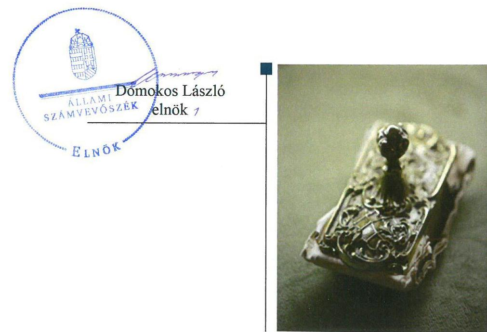
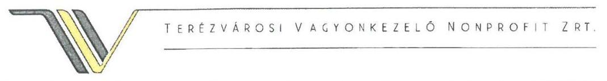
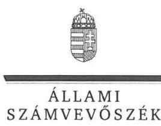
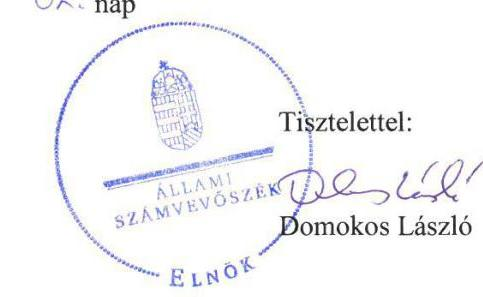

# Jelentés 

## Nemzeti tulajdonú gazdasági társaságok ellenőrzése

Terézvárosi Vagyonkezelő Nonprofit Zártkörűen Működő Részvénytársaság 2019.

---

# Jelentés 

## Nemzeti tulajdonú gazdasági társaságok ellenőrzése

Terézvárosi Vagyonkezelő Nonprofit Zártkörűen Működő Részvénytársaság 2019. 10. hó 21. nap

---

# AZ ELLENŐRZÉST FELÜGYELTE:

- **DR HORVÁTH MARGIT** felügyeleti vezető
- **DR PULAY GYULA** felügyeleti vezető

## AZ ELLENŐRZÉST VEZETTE ÉS A VÉGREHAJTÁSÁÉRT FELELŐS:

- **ÁRPÁSI TIBOR** ellenőrzésvezető
- **A PROGRAM ÖSSZEÁLLÍTÁSÁÉRT FELELŐS:**
- **TÓTPÁL SZABOLCS** osztályvezető

**IKTATÓSZÁM:** EL-1783-001/2019.

**TÉMASZÁM:** 2478

**ELLENŐRZÉS-AZONOSÍTÓ SZÁM:** V082217

Jelentéseink az Országgyűlés számítógépes hálózatán és az Interneten a www.asz.hu címen is olvashatóak.

---

# TARTALOMJEGYZÉK 

■ ÖSSZEGZÉS ..... 5
■ AZ ELLENŐRZÉS CÉLJA ..... 6
■ AZ ELLENŐRZÉS TERÜLETE ..... 7
■ AZ ELLENŐRZÉS HÁTTERE, INDOKOLTSÁGA ..... 8
■ A JELENTÉS LÉNYEGES KÉRDÉSKÖREI ..... 9
■ AZ ELLENŐRZÉS HATÓKÖRE ÉS MÓDSZEREI ..... 10
■ MEGÁLLAPÍTÁSOK ..... 13
JAVASLATOK ..... 16
MELLÉKLETEK ..... 19
I. sz. melléklet: Fogalomtár ..... 19
FÜGGELÉKEK ..... 21
I. sz. függelék a jelentéshez ..... 21
II. sz. függelék: Észrevételek ..... 22
■ RÖVIDÍTÉSEK JEGYZÉKE ..... 33

---

.

---

# ÖSSZEGZÉS 

A Terézvárosi Vagyonkezelő Nonprofit Zártkörűen Müködő Részvénytársaság vagyongazdálkodása nem volt szabályszerű. A Társaság 2015-2017. évi számviteli beszámolóit nem támasztotta alá leltárral, így a vagyonnal való gazdálkodás során a nemzeti vagyon megőrzését, elszámoltathatóságát nem biztosította. A Társaságnak a kormányzati szektor hiányára befolyással bíró eleme, adósságot keletkeztető ügylete az ellenőrzött időszakban nem volt.

## Az ellenőrzés társadalmi indokoltsága

Az Állami Számvevőszék stratégiájában megfogalmazta, hogy az államháztartáson kívül működő feladatellátó rendszerek ellenőrzéseivel hozzájárul ahhoz, hogy a közpénzeket, illetve az ingyenesen juttatott közvagyont az államháztartáson kívül működő szervezetek is átlátható, rendezett módon használják fel.

Az állam és a helyi önkormányzatok tulajdona nemzeti vagyon. A nemzeti vagyon megőrzése, megóvása érdekében kiemelten fontos a nemzeti tulajdonú gazdasági társaságok ellenőrzése.

Az Állami Számvevőszék céljaival és a társadalmi igénnyel összhangban, a gazdasági társaságok kiemelt fontosságú szerepe miatt került sor a Budapest Főváros VI. Kerület Terézváros Önkormányzata kizárólagos tulajdonában álló Terézvárosi Vagyonkezelő Nonprofit Zártkörűen Működő Részvénytársaság vagyongazdálkodásának, gazdálkodásának a kormányzati szektor hiányára, az államadósságra gyakorolt hatásának, illetve az Önkormányzat tulajdonosi joggyakorlásának ellenőrzésére.

## Főbb megállapítások, következtetések, javaslatok

A Terézvárosi Vagyonkezelő Nonprofit Zártkörűen Működő Részvénytársaság feletti tulajdonosi joggyakorlás kereteit az alapító Budapest Főváros VI. Kerület Terézváros Önkormányzata a jogszabályoknak és belső szabályzatainak megfelelően alakította ki, a tulajdonosi jogait szabályszerűen gyakorolta.
A Terézvárosi Vagyonkezelő Nonprofit Zártkörűen Működő Részvénytársaság vagyongazdálkodása nem volt szabályszerű, mert a számviteli beszámoló mérlegét - az eszközöket és forrásokat mennyiségben és értékben tartalmazó - leltárral nem támasztotta alá, illetve nem győződött meg a mérlegbe került tételek valódiságáról.

A Terézvárosi Vagyonkezelő Nonprofit Zártkörűen Működő Részvénytársaságnak a kormányzati szektor hiányára befolyással bíró eleme, adósságot keletkeztető ügylete nem volt, a Társaság adatszolgáltatási kötelezettségének nem tett eleget.

Az Állami Számvevőszék a jelentésben foglalt megállapítások alapján Budapest Főváros VI. Kerület Terézváros Önkormányzata polgármesterének egy, a Terézvárosi Vagyonkezelő Nonprofit Zártkörűen Működő Részvénytársaság vezérigazgatójának négy javaslatot fogalmazott meg. A javaslatokat megalapozó megállapításokra az érintetteknek 30 napon belül intézkedési tervet kell készíteniük.

---

# AZ ELLENŐRZÉS CÉLJA 

AZ ELLENŐRZÉS CÉLJA annak megállapítása, hogy a tulajdonosi joggyakorló a gazdasági társasága feletti tulajdonosi joggyakorlás kereteit kialakította-e, tulajdonosi jogait megfelelően gyakorolta-e és kötelezettségeit teljesítette-e. Az ellenőrzés célja annak megállapítása, hogy a gazdasági társaság biztosította-e a vagyon védelmét a nyilvántartások szabályszerű vezetése és a mérleg tételeinek leltárral történő alátámasztása útján, valamint szabályszerűen gondoskodott-e a társaság használatában lévő nemzeti vagyon értékének megőrzéséről, gyarapításáról, hasznosításáról. Az ellenőrzés célja továbbá annak megítélése, hogy a kormányzati szektorba sorolt nemzeti tulajdonban lévő gazdasági társaság gazdálkodásának a kormányzati szektor hiányára és az államadósságra befolyással bíró elemei a jogszabályi előírásoknak megfeleltek-e és a gazdasági társaság az adatszolgáltatási kötelezettségének eleget tett-e.

---

# **A2 ELLENŐRZÉS TERÜLETE**

## **Budapest Főváros VI. Kerület Terézváros Önkormányzata és a Terézvárosi Vagyonkezelő Nonprofit Zártkörűen Működő Részvénytársaság**

Budapest Főváros VI. Kerület Terézváros Önkormányzata a 100%-os tulajdonában álló Terézvárosi Vagyonkezelő Nonprofit Zártkörűen Működő Részvénytársaság jogelődjét 1996-ban alapította az Önkormányzat1 vagyonelemeinek (lakások és nem lakás céljára szolgáló épületek, utak, parkolóhelyek, vásárcsarnok és piac, gyermeküdülők) kezelési és üzemeltetési feladatainak ellátására. A Társaság2 jegyzett tőkéje 246 M Ft volt, az ellenőrzött időszakban nem változott.

Az önkormányzati tulajdonú lakások és helyiségek, kerületi kezelésű közutak üzemeltetési, karbantartási, állagmegóvási közfeladatait a Társaság az Önkormányzattal kötött Közszolgáltatási szerződés3 keretében végezte. Megbízási szerződés4 alapján az önkormányzati tulajdonú lakások és helyiségek kezelésével összefüggő feladatokat látott el. A Társaság közfeladatként Feladat-ellátási megállapodás5 keretében fővárosi tulajdonú, Haszonbérleti szerződés6 alapján kerületi tulajdonú területek parkolóit üzemeltette.

A Társaság az ellenőrzött években nyereségesen működött, a nyereség a saját vagyont gyarapította. A Társaság értékesítésből származó nettó árbevétele 2015-ben 1835,4 M Ft, 2016-ban 2302,3 M Ft, míg 2017-ben 2382,4 M Ft volt. A saját tőke 2015-ben 531,3 M Ft, 2016-ban 637,4 M Ft, 2017-ben 727,1 M Ft volt. A foglalkoztatottak létszáma alig változott, 2015. évben 126 fő, 2016. évben 125 fő, 2017. évben 128 fő volt.

A Társaság a feladatait saját eszközeivel, illetve a feladat-ellátásokhoz kapcsolódóan üzemeltetésre, haszonbérletre átvett eszközökkel látta el. A Társaság vagyonkezelésbe vett eszközzel nem rendelkezett.

A Társaság ügyvezetését 5 tagú igazgatóság7 látta el, operatív irányítását vezérigazgató1,28 végezte, akinek személye egy alkalommal változott az ellenőrzött időszakban. A polgármester9 és a jegyző10 személye az ellenőrzött időszakban nem változott. A Társaság a Számv. tv.11 155. § (2) alapján könyvvizsgálatra volt kötelezett.

A Társaság a TERIBER Terézvárosi Ingatlanfejlesztő és Beruházó Korlátolt Felelősségű Társaságban 0,17%-os tulajdoni részesedéssel rendelkezett.

A Társaság a 2015/66. és 2017/28. számú Hivatalos Értesítőben közzétett NGM12 közlemények alapján a gazdálkodásának a kormányzati szektor hiányára és az államadósságra befolyással bíró elemei tekintetében 2015. december 30-tól 2015. december 31-ig, míg az adatszolgáltatás tekintetében 2015. december 30-tól – a 2016. évi beszámoló jóváhagyása és közzétételét illetően – 2017. június elsejéig tartozott a kormányzati szektorba sorolt egyéb szervezetek közé.

---

# AZ ELLENŐRZÉS HÁTTERE, INDOKOLTSÁGA 

Az Alaptörvény ${ }^{13}$ 38. cikke alapján az állam és a helyi önkormányzatok tulajdona nemzeti vagyon. A nemzeti vagyon megőrzése, megóvása érdekében kiemelten fontos ezen nemzeti tulajdonú gazdasági társaságok ellenőrzése. Gazdálkodásuk jellemzően a közérdeklődés és a média figyelmének középpontjában áll, amihez hozzájárul a gazdálkodásuk körébe tartozó - a nemzeti vagyon részét képező - vagyon nagysága, illetve az általuk ellátott közszolgáltatások minősége és hatékonysága.

Ellenőrzéseink feltárhatják, hogy a tulajdonosi felügyelet hozzájárult-e a szabályszerű gazdálkodáshoz és feladatellátáshoz. Az ellenőrzés eredményeként meghatározhatóvá válnak a gazdasági társaság vagyongazdálkodást érintő kockázatai, ezzel lehetővé téve a kockázatok csökkentését. A megállapítások alapján megfogalmazott számvevőszéki javaslatok hasznosítása elősegítheti a meglévő hibák megszüntetését. A jó gyakorlatok bemutatásával az ÁSZ ${ }^{14}$ hozzájárulhat a követendő megoldások megismertetéséhez, terjesztéséhez.

---

# A JELENTÉS LÉNYEGES KÉRDÉSKÖREI 

1. A Terézvárosi Vagyonkezelő Nonprofit Zártkörüen Müködő Részvénytársaság feletti tulajdonosi joggyakorlás megfelelt-e az előírásoknak?
2. A Terézvárosi Vagyonkezelő Nonprofit Zártkörüen Müködő Részvénytársaság vagyongazdálkodása szabályszerű volt-e?
3. A Terézvárosi Vagyonkezelő Nonprofit Zártkörüen Müködő Részvénytársaság gazdálkodásának a kormányzati szektor hiányára és az államadósságra befolyással bíró elemei megfelel-tek-e a jogszabályi előírásoknak, az adatszolgáltatási kötelezettségének eleget tett-e?

---

# AZ ELLENŐRZÉS HATÓKÖRE ÉS MÓDSZEREI 

## Az ellenőrzés típusa

Megfelelőségi ellenőrzés.

## Az ellenőrzött időszak

A tulajdonosi joggyakorlás tekintetében az ellenőrzött időszak 2017. január 1-től 2018. szeptember 28-ig, az ellenőrzés megkezdésének napjáig terjedt ki az éves beszámolók elfogadása kivételével, amelynél az ellenőrzött időszak 2015. január 1-től az ellenőrzés megkezdésének napjáig tartott.

A társaság vagyongazdálkodási tevékenységét illetően az ellenőrzött időszak a 2015 - 2017. évek, a 2017. évi beszámoló jóváhagyása és közzététele tekintetében 2018. június elsejéig tartó időszak.

A társaság gazdálkodásának a kormányzati szektor hiányára és az államadósságra befolyással bíró elemei és a jogszabályi előírásoknak megfelelő adatszolgáltatási kötelezettsége teljesítése tekintetében az ellenőrzött időszak 2015. - 2017. évek, a 2017. évi beszámoló jóváhagyása és közzététele tekintetében 2018. június elsejéig tartó időszak.

## Az ellenőrzés tárgya

A Terézvárosi Vagyonkezelő Nonprofit Zártkörűen Működő Részvénytársaság feletti tulajdonosi joggyakorlás kialakítása és müködtetése.

A Terézvárosi Vagyonkezelő Nonprofit Zártkörűen Múködő Részvénytársaság vagyongazdálkodási tevékenysége, a társaság használatában lévő nemzeti vagyon, illetve a saját vagyona tekintetében a vagyonnyilvántartások vezetése, leltára, a nemzeti vagyon értékének megőrzése, gyarapítása, hasznosítása.

A Terézvárosi Vagyonkezelő Nonprofit Zártkörűen Múködő Részvénytársaság gazdálkodásának a kormányzati szektor hiányára és az államadósságra befolyással bíró elemei és a jogszabályi előírásoknak megfelelő adatszolgáltatási kötelezettség teljesítése.

## Az ellenőrzött szervezet

Budapest Főváros VI. Kerület Terézváros Önkormányzata
$\longrightarrow$ Terézvárosi Vagyonkezelő Nonprofit Zártkörűen Múködő Részvénytársaság

---

# Az ellenőrzés jogalapja 

Az ellenőrzés jogszabályi alapját az ÁSZ tv. ${ }^{15} 1 . \S$ (3) bekezdése és 5. § (3) - (5) bekezdései képezték.

## Az ellenőrzés módszerei

Az ellenőrzést az ellenőrzési program ellenőrzési kérdései, az ellenőrzött időszakban hatályos jogszabályok, az ellenőrzés szakmai szabályok és módszertanok alapján, a nemzetközi standardok figyelembe vételével végeztük.

Az ellenőrzés ideje alatt az ellenőrzött szervezettel történő kapcsolattartást az ÁSZ Szervezeti és Múködési Szabályzatának vonatkozó előírásai alapján biztosítottuk.
2017. január 1-től az ellenőrzés megkezdésének napjáig - 2018. szeptember 28-ig - ellenőriztük a tulajdonosi joggyakorlás kereteinek kialakítását, a tulajdonosi joggyakorló tevékenységét a felügyelő bizottság és a független könyvvizsgáló múködéséhez kapcsolódóan, valamint azt, hogy a tulajdonosi joggyakorló a nemzeti vagyon értékének megőrzése érdekében monitorozta-e a gazdasági társaság feladatellátásához kapcsolódóan meghatározott követelmények, elvárások teljesülését. A 2015. január 1-től 2018. szeptember 28-ig terjedő teljes ellenőrzött időszakra ellenőriztük a tulajdonosi joggyakorló részvételét az éves beszámoló elfogadására vonatkozó döntéshozatalban.

A gazdasági társaság vagyonhoz kapcsolódó nyilvántartásai vezetésének megfelelősége, a nemzeti vagyon értéke megőrzésének, gyarapításának, hasznosításának szabályszerűsége 2015. és 2017. évek tekintetében került ellenőrzésre. A 2015-2017. éveket érintően történt meg a lényeges dokumentumok értékelése, kiemelten a mérleg tételeinek leltárral való alátámasztottsága.

Az ellenőrzési kérdések megválaszolásához szükséges bizonyítékok megszerzése a következő ellenőrzési eljárások alkalmazásával történt: megfigyelés, információkérés, összehasonlítás, lényeges sokaságból mintavétel, valamint elemző eljárás. Az ellenőrzési bizonyítékként felhasználható adatforrások közé tartoztak az ellenőrzési programban felsorolt adatforrások, továbbá minden - az ellenőrzés folyamán - feltárt, az ellenőrzés szempontjából információkat tartalmazó dokumentum. Az ellenőrzést a kérdésekre adott válaszok kiértékelésével, valamint a megjelölt adatforrások, a csatolt tanúsítványok felhasználásával, továbbá az adott időszakban hatályos jogszabályok figyelembe vételével folytattuk le.

A vagyonnyilvántartások és a leltár szabályszerűsége esetében az ellenőrzés azokra a legnagyobb értékű tételekre - a lényeges sokaságra - terjedt ki, melyek összértéke eléri a teljes sokaság összértékének 50\%-át.

A 2015. évben lényeges sokaságból véletlen mintavételi eljárással kiválasztott tételek kerültek ellenőrzésre.

A 2017. évben a lényeges sokaságot tételesen ellenőriztük.

---

A mintavétellel érintett évben „Szabályszerűnek" értékeltük az ellenőrzött területet, amennyiben 95\%-os bizonyossággal az ellenőrzött sokaságban az átlagos hibaarány legfeljebb 10\%, "nem szabályszerűnek", amenynyiben 10\%-nál magasabb arányt képviselt.

A gazdasági társaság gazdálkodásának az államadósságra továbbá a kormányzati szektor hiányára befolyással bíró gazdasági eseményei elszámolásának megfelelősége 2015. év tekintetében került ellenőrzésre, míg a kormányzati szektorba sorolt gazdasági társaság adatszolgáltatási kötelezettségére vonatkozó jogszabályi előírások betartását a 2015. és 2016. évekre vonatkozóan értékeltük.

---

# 1. A Terézvárosi Vagyonkezelő Nonprofit Zártkörűen Müködő Részvénytársaság feletti tulajdonosi joggyakorlás megfelelt-e az előírásoknak? 

Összegző megállapítás

Az Önkormányzat Társaság feletti tulajdonosi joggyakorlása szabályszerű volt.

A TULAJDONOSI JOGGYAKORLÁS RENDJÉT az Alapító ${ }^{16}$ az Mótv. ${ }^{17}$, az Nvtv ${ }^{18}$., illetve a Ptk. ${ }^{19}$ előírásainak megfelelően a Vagyonrendeletben ${ }^{20}$, a Képviselő-testület SZMSZ-ében ${ }^{21}$, illetve a Társaság Alapszabályában ${ }_{1-4}{ }^{22}$ határozta meg.

Az Alapító megalkotta a Taktv. ${ }^{23}$ előírásaival összhangban lévő, a vezető tisztségviselők, a felügyelőbizottság ${ }^{24}$ tagjai és az Mt. ${ }^{25} 208$. § hatálya alá tartozó munkavállalók javadalmazásáról, valamint a jogviszony megszűnése esetére biztosított juttatások módjának, mértékének elveiről, annak rendszeréről szóló Javadalmazási szabályzatot ${ }^{26}$.

Az Alapító a Közszolgáltatási szerződésben előírta a Társaság negyedéves és éves beszámolási, elszámolási kötelezettségét, valamint meghatározta a müködés, a közfeladatok ellátásának hatékonysági követelményeit. A Feladat-ellátási megállapodásban, a Haszonbérleti szerződésben, illetve a Megbízási szerződésben a Társaság részére üzemeltetésre, haszonbérletbe átadott vagyonhoz kapcsolódó jogok és kötelezettségek a Vagyonrendeletben foglalt követelmények szerint kerültek megállapításra.

A TULAJDONOSI JOGOK GYAKORLÁSA SORÁN az Alapító a Ptk. és az Alapszabály előírásaival összhangban megválasztotta a Társaság vezető tisztségviselőit, kijelölte a felügyelőbizottság tagjait, elfogadta annak ügyrendjét ${ }^{27}$, kijelölte a könyvvizsgálót ${ }^{28}$. Az Alapító a Társaság 2015-2017. évi éves beszámolóit a Ptk. és a Számv. tv. előírásainak megfelelően a felügyelőbizottság és a könyvvizsgáló írásbeli jelentésének birtokában fogadta el.

Az Alapító a Társaság tevékenységének nyomon követését közvetlenül az üzleti tervek, az éves beszámolók elfogadása, közvetetten a felügyelőbizottság útján biztosította. A felügyelőbizottság az ügyrendjében foglaltaknak megfelelően rendszeresen tárgyalta és véleményezte a Képviselő-testület elé kerülő, a Társaság tevékenységéről készített negyedéves, féléves és éves beszámolókat, javasolta azokat a Képviselő-testület számára elfogadásra.

---

# 2. A Terézvárosi Vagyonkezelő Nonprofit Zártkörűen Müködő Részvénytársaság vagyongazdálkodása szabályszerű volt-e? 

Összegző megállapítás A Társaság vagyongazdálkodása nem volt szabályszerű.
A TÁRSASÁG a Számv. tv. előírásaival összhangban elkészített Számviteli politikában ${ }_{1,2}{ }^{29}$, Számlarendben ${ }_{1,2}{ }^{30}$, Leltározási szabályzatban ${ }_{1,2}{ }^{31}$, Selejtezési Szabályzatban ${ }_{1,2}{ }^{32}$ alakította ki a saját vagyon nyilvántartása, illetve az önkormányzati vagyonelemekhez kapcsolódó bevételek, kiadások elkülönített nyilvántartásának feltételeit.

A saját vagyon nyilvántartása nem volt szabályszerű 2015-ben és 2017ben. Az immateriális javak és a tárgyi eszközök egyéb növekedési tételeivel kapcsolatos ráfordítások tekintetében a Társaság a Számv. tv. 165. § (4) bekezdésében foglaltak ellenére egyeztetett nyilvántartásokkal nem rendelkezett. A Társaság 2015-ben beszerzett szoftverek felhasználási jogát a Számv. tv. 25. § (6) bekezdésében foglalt előírás ellenére szellemi termékként vette állományba. Tárgyi eszköz beszerzése esetén 2017-ben nem a Számv. tv. 47. § (2) bekezdés c) pontjában foglaltak szerint állapította meg a bekerülési értéket, mert a beszerzett gépjárművek bekerülési értékének meghatározásakor figyelmen kívül hagyta a forgalomba helyezés diját.

A VAGYONGAZDÁLKODÁS a 2015-2017. években nem volt szabályszerű. A Társaság a 2015-2017. évi éves beszámolók mérlegtételeit a Számv. tv. 69. § (1) bekezdése ellenére a - mérleg fordulónapján meglévő eszközközöket és forrásokat mennyiségben és értékben tartalmazó leltárral nem támasztotta alá. A tárgyi eszközök vonatkozásában a Társaság folyamatos mennyiségi nyilvántartást vezetett, azonban a Számv. tv. 69. § (3) bekezdésben, valamint a Leltározási szabályzatban előírtak ellenére a legalább háromévenkénti mennyiségi felvétellel történő leltározást nem végezte el.

A mérleg tételeit alátámasztó leltár hiányában a 2015-2017. évi éves beszámolókban szereplő tételek nem voltak bizonyítottak, kívülállók számára is megállapíthatóak, ezért nem érvényesült a valódiság elve, emiatt a Társaság elszámoltathatósága, a nemzeti vagyon megőrzése nem volt biztosított. A Számv. tv. szerinti leltárak hiánya ellenére a könyvvizsgáló a 2015-2017. évi éves beszámolókat korlátozás nélküli hitelesítő záradékkal látta el.

A Társaság az üzemeltetésre átvett, haszonbérbe kapott nemzeti vagyon továbbhasznosítása során az Nvtv., a Közszolgáltatási szerződés, a Megbízási szerződés, a Feladat-ellátási megállapodás és a Haszonbérleti szerződés előírásai szerint járt el.

---

# 3. A Terézvárosi Vagyonkezelő Nonprofit Zártkörűen Müködő Részvénytársaság gazdálkodásának a kormányzati szektor hiányára és az államadósságra befolyással bíró elemei megfelel-tek-e a jogszabályi előírásoknak, az adatszolgáltatási kötelezettségének eleget tett-e? 

Összegző megállapítás

A Társaságnak a kormányzati szektor hiányára befolyással bíró eleme, adósságot keletkeztető ügylete az ellenőrzött időszakban nem volt. A Társaság nem tartotta be az adatszolgáltatási kötelezettségére vonatkozó jogszabályi előírásokat.

A TÁRSASÁGNAK a kormányzati szektor hiányára befolyással bíró eleme, az államadósságra befolyással bíró gazdasági eseménye, adósságot keletkeztető ügylete az ellenőrzött időszakban nem volt.

A Társaság sem a 2015. évi, sem a 2016. évi éves számviteli beszámolóját nem küldte meg az államháztartásért felelős miniszter részére, ezzel nem tett eleget adatszolgáltatási kötelezettségének, figyelmen kívül hagyva az Áht. ${ }^{33}$ 107. § (1) bekezdésre tekintettel az Ávr. ${ }^{34} 5$. mellékletének 23. pontjában foglaltakat.

---

# JAVASLATOK 

Az ÁSZ tv. 33. § (1) bekezdésében foglaltak értelmében az ellenőrzött szervezet vezetője köteles a jelentésben foglalt megállapításokhoz kapcsolódó intézkedési tervet összeállítani és azt a jelentés kézhezvételétől számított 30 napon belül az ÁSZ részére megküldeni. Amennyiben az ellenőrzött szervezet vezetője nem küldi meg határidőben az intézkedési tervet, vagy továbbra sem elfogadható intézkedési tervet küld, az Állami Számvevőszék elnöke az ÁSZ tv. 33. § (3) bekezdése a) és b) pontjaiban foglaltakat érvényesítheti.

Javaslataink célja a Terézvárosi Vagyonkezelő Nonprofit Zártkörűen Müködő Részvénytársaság gazdálkodása szabályszerűségének és gyakorlatának javítása annak érdekében, hogy a szabályozási környezet és az alkalmazott gyakorlat megfelelően tudja támogatni az átlátható müködést.

## A Terézvárosi Vagyonkezelő Nonprofit Zártkörűen Müködő Részvénytársaság vezérigazgatójának

1. Intézkedjen a vagyoni értékü jogok Számv. tv. előirásainak megfelelő állományba vételéről.
(2. sz. megállapítás 2. bekezdés 3. mondata alapján)
2. Intézkedjen a tárgyi eszközök bekerülési értékének Számv. tv. előirásainak megfelelő meghatározásáról.
(2. sz. megállapítás 2. bekezdés 4. mondata alapján)
3. Intézkedjen az éves beszámolók mérlegtételeinek leltárral történő alátámasztásáról, ezáltal a valódiság elvének érvényesüléséről a Számv. tv. előirásainak megfelelően.
(2. sz. megállapítás 3. bekezdés 2. mondata és 4. bekezdése alapján)
4. Intézkedjen a Számv. tv. és a Leltározási szabályzat előirásainak megfelelő leltározás végrehajtásáról.
(2. sz. megállapítás 3. bekezdés 3. mondata alapján)

---

Javaslatunk célja a tulajdonosi joggyakorló Budapest Főváros VI. kerület Terézváros Önkormányzata szabályszerű müködésének elősegítése, továbbá a tulajdonosi joggyakorlás kontrolljainak erősítése.

# Budapest Főváros VI. kerület Terézváros Önkormányzata polgármesterének 

1. Kezdeményezze a Társaságnál a vagyoni értékü jogok állományba vételével, a tárgyi eszközök bekerülési értékének meghatározásával, a leltárral, leltározással kapcsolatban feltárt szabálytalanságok tekintetében a felelősség tisztázását és szükség szerint intézkedjen a felelősség érvényesitéséről.
(2. sz. megállapítás 2. bekezdés 3-4. mondata, a 3. bekezdés 2-3. mondata és 4. bekezdése alapján)

---

.

---

# MELLÉKLETEK 

- I. SZ. MELLÉKLET: FOGALOMTÁR
gazdasági társaság
hasznérleti szerződés
kormányzati szektorba sorolt egyéb szervezet
közszolgáltatás
közfeladat
nemzeti vagyon
nonprofit gazdasági társaság
tulajdonosi jogok gyakorlója
vagyonkezelői jog

A gazdasági társaságok üzletszerű közös gazdasági tevékenység folytatására, a tagok vagyoni hozzájárulásával létrehozott, jogi személyiséggel rendelkező vállalkozások, amelyekben a tagok a nyereségből közösen részesednek, és a veszteséget közösen viselik. (Forrás: Ptk. 3:88. § (1) bekezdése)
Haszonbérleti szerződés alapján a haszonbérlő hasznot hajtó dolog időleges használatára vagy hasznot hajtó jog gyakorlására és hasznainak szedésére jogosult, és ennek fejében köteles haszonbért fizetni. A haszonbérleti szerződést írásba kell foglalni. A haszonbérlő a dolog hasznainak szedésére a rendes gazdálkodás szabályainak megfelelően jogosult. A haszonbérlet tárgyát képező dolog fenntartásához szükséges felújítás és javítás, továbbá a dologgal kapcsolatos terhek viselése a haszonbérlőt terheli. A rendkívüli felújítás és javítás a haszonbérbeadót terheli. A haszonbért időszakonként utólag kell megfizetni. (Forrás: Ptk. XLV. Fejezet)
Az a szervezet, amely az Áht. alapján nem része az államháztartásnak, azonban az Európai Közösséget létrehozó szerződéshez csatolt, a túlzott hiány esetén követendő eljárásról szóló jegyzőkönyv alkalmazásáról szóló 2009. május 25-i 479/2009/EK rendelet ${ }^{35}$ szerint a kormányzati szektorba tartozik.
Az Ebktv. ${ }^{36}$ 3. § d) pontja a következőképpen határozza meg a közszolgáltatást: „szerződéskötési kötelezettség alapján a lakosság alapvető szükségleteinek ellátására irányuló szolgáltatás, így különösen a villamos energia-, gáz-, hő-, víz-, szenny-víz- és hulladékkezelési, köztisztasági, postai és távközlési szolgáltatás, továbbá a menetrend alapján közlekedő járművekkel végzett közforgalmú személyszállítás".
Az Áht. 3/A. § (1) bekezdése alapján közfeladat a jogszabályban meghatározott állami vagy önkormányzati feladat.
Nvtv. 1. § (2) bekezdése szerint nemzeti vagyonba tartozik többek között:
„az állam vagy a helyi önkormányzat kizárólagos tulajdonában álló dolgok,
az a) pont hatálya alá nem tartozó, állam vagy a helyi önkormányzat tulajdonában lévő dolog,
az állam vagy a helyi önkormányzat tulajdonában lévő pénzügyi eszközök, továbbá az államot vagy a helyi önkormányzatot megillető társasági részesedések, az államot vagy a helyi önkormányzatot megillető bármely vagyoni értékkel rendelkező jogosultság, amelyet jogszabály vagyoni értékű jogként nevesít."
Az a gazdasági társaság minősül nonprofit gazdasági társaságnak és cégnevében az a gazdasági társaság tüntetheti fel a nonprofit jelleget, amelynek létesítő okirata tartalmazza, hogy a gazdasági társaság tevékenységéből származó nyereség a tagok között nem osztható fel, hanem az a gazdasági társaság vagyonát gyarapítja
Aki a nemzeti vagyon felett az államot vagy a helyi önkormányzatot megillető tulajdonosi jogok és kötelezettségek összességének gyakorlására jogosult. (Forrás: Nvtv. 3. § (1) bekezdés 17. pontja)
A vagyonkezelő köteles a vagyontárgy állagának megóvásáról, jó karbantartásáról, működtetéséről gondoskodni, jogszabályban és szerződésben előírt más kötelezettségét teljesíteni, valamint a vagyontárgyat jogszabályban vagy szerződésben meghatározott célnak megfelelően használni. A vagyonkezelő - a központi költségvetési szervek és a kizárólag közfeladatot ellátó nem központi költségvetési szerv vagyonkezelők kivételével - köteles díjat fizetni, jogszabályban és szerződésben előírt más kötelezettségét teljesíteni, valamint a vagyontárgyat jogszabályban vagy

---

szerződésben meghatározott célnak megfelelően használni. Amennyiben a vagyonkezelő ezen kötelezettségeinek nem tesz eleget, a tulajdonosi joggyakorló jogosult a szerződést azonnali hatállyal felmondani. (Forrás: Vtv. ${ }^{27}$ 27. § (2), (2a) bekezdések)

---

# FÜGGELÉKEK 

- I. SZ. FÜGGELÉK A JELENTÉSHEZ

Az Állami Számvevőszék az ellenőrzések során feltárt tényekhez kapcsolódó további körülmények tisztázására eszközrendszerrel nem rendelkezik. Amennyiben az ellenőrzésen túlmutatóan indokoltnak látszik az ellenőrzés során feltárt körülmények további vizsgálata, az Állami Számvevőszék törvényi felhatalmazás alapján az ellenőrzés által feltárt körülményeket továbbítja a hatáskörrel rendelkező szervnek a szükséges intézkedések megtétele, eljárások lefolytatása érdekében.
I. A Terézvárosi Vagyonkezelő Nonprofit Zártkörűen Müködő Részvénytársaság a 2015., 2016., 2017. évi beszámoló mérlegét a Számv. tv. 69. § (1) bekezdése ellenére az eszközöket és forrásokat mennyiségben és értékben tartalmazó leltárral nem támasztotta alá.
A mérleg tételeit alátámasztó leltár hiányában a Társaságnál a 2015., 2016., 2017. évi éves beszámolóban a Számv. tv. 15. § (3) bekezdésében foglalt előirás ellenére nem érvényesült a valódiság elve és nem igazolt, hogy a Társaság beszámolója a valós, megbízható képet mutatta.
Az eset konkrét körülményeinek feltárására a Nemzeti Adó- és Vámhivatal rendelkezik hatáskörrel.

---

A jelentéstervezetet a Számvevőszék 15 napos észrevételezésre megküldte az ellenőrzött szervezetek vezetőinek az ÁSZ tv. 29. §* (1) bekezdése előirásának megfelelően.

Budapest Főváros VI. kerület Terézváros Önkormányzatának polgármestere az ÁSZ tv. 29.§ (2) bekezdésben foglalt észrevételezési jogával nem élt, a jelentéstervezet megállapításaira nem kívánt észrevételt tenni.
A Terézvárosi Vagyonkezelő Nonprofit Zártkörűen Müködő Részvénytársaság vezérigazgatója a jelentéstervezet megállapításaira írásban észrevételt tett.
Az ÁSZ tv. 29. § (3) bekezdésével összhangban az ÁSZ a Függelékben feltünteti az ellenőrzés megállapításaival kapcsolatban tett, figyelembe nem vett észrevételeket, és megindokolja, hogy azokat miért nem fogadta el.

[^0]
[^0]:    * 29. § (1) Az Állami Számvevőszék az ellenőrzési megállapításait megküldi az ellenőrzött szervezet vezetőjének vagy az általa megbízott személynek, és annak, akinek személyes felelősségét állapította meg.
    (2) Az ellenőrzött szervezet vezetője és a felelősként megjelölt személy az ellenőrzés megállapításaira tizenöt napon belül írásban észrevételt tehet.
    (3) Az Állami Számvevőszék az észrevételre a beérkezésétől számított harminc napon belül írásban válaszol. A figyelembe nem vett észrevételeket köteles a jelentésben feltüntetni, és megindokolni, hogy azokat miért nem fogadta el.

---

# 1010 

## TEREZVAROSI VAGYONKEZELÓ NONPROFIT ZRT

Állami Számvevőszék
Iktatószám:462/3/2019
1364. Budapest 4 .

Pf. 54.
Ikt.szám: EL-0873-090/2019

## Domokos László

## Elnök Úr részére

Tárgy: Észrevétel a Terézvárosi Vagyonkezelő Nonprofit Zártkörűen Müködő Részvénytársaság ellenőrzéséről készült számvevőszéki jelentéstervezetre [ellenőrzött időszak: 2015-2017. évek, a 2017. évi beszámoló jóváhagyása és közzététele tekintetében 2018. június elsejéig tartó időszak]

## Tisztelt Elnök Úr!

A Terézvárosi Vagyonkezelő Nonprofit Zártkörűen Müködő Részvénytársaság [továbbiakban: Vagyonkezelö] 2019. június 24. napján kapta kézhez a „Nemzeti tulajdonú gazdasági társaságok ellenőrzése " címmel készült, az EL-0873-090/2019. sz. iktatott Állami Számvevőszék [továbbiakban: ÁSZ] által összeállított számvevőszéki jelentéstervezetet.
Hivatkozással az Állami Számvevőszékről szóló 2011. évi LXVI. törvény 29.§ (2) bekezdése szerint az ellenőrzés megállapításaira, Társaságunk a részletes intézkedési terv összeállítása előtt, az alábbi észrevételeket teszi a jelentéstervezetben foglaltakkal kapcsolatban:
A jelentéstervezetben foglaltakra vonatkozó észrevételeink részletes kifejtését megelőzően, több problémára szeretnénk felhívni a figyelmet, melyek véleményünk szerint - sajnálatosan, akaratunktól függetlenül -, hátráltatták az ellenőrzés folyamatában való maradéktalan, és szándékunknak megfelelő produktív közreműködésünket, illetve a zavartalan, átlátható, zökkenőmentes részvételt a Vagyonkezelő - mint ellenőrzött szervezet -, részéről.

---

Az ellenőrzés során felmerült problémák:

- Az ellenőrzés teljes időszakában (2018.08.15-től 2018.12.17.-ig 4 alkalommal történt adatbekérés, szinte átfedéssel két ellenőrzés folyt \{ikt.sz: El-0873003/2018. sz. valamint az EL-1327-001/2018.sz.\} folyamatosan informatikai problémával kellett szembe néznünk, mert az ÁSZ által megadott rendszer nem tudta fogadni a nagyobb terjedelmű fájlokat, dokumentumokat illetve iratanyagot. Ezek részletes, ellenőrizhető, bizonyítható kifejtésére még a jelen levelünk 3. sz. pontjában visszatérünk.
- Tekintettel arra, hogy az ellenőrzésről elkészült a jelentéstervezet, feltételezzük, hogy helyszíni ellenőrzésre már nem kerül sor. Véleményünk szerint, a sajnálatosan elmaradt helyszíni ellenőrzés, lehetőséget teremtett volna a lényeges kommunikációs aszimmetria elkerülésére, melyeket a jelentéstervezetben foglalt megállapítások, valamint javaslatok tartalmaznak. Gondolunk itt arra a nem helytálló megállapításra, mely a jelentéstervezetben (5. oldal) összegzésképpen szerepel, ,,... A társaság 2015-2017. évi számviteli beszámolói nem támasztotta alá leltárral...".
Tekintettel arra, hogy a Vagyonkezelőnél a tényleges leltári események rendszerint az adott év zárását megelőzően történnek - a társaság méretéből, szervezeti felépítéséből, valamint sajátosságából adódóan -, azaz többnyire októberben, illetve novemberben, így csakis kizárólag a december 31.-i fordulónapi Leltár dokumentumainak feltöltése maradt el.
Így téves az a megállapítás, hogy a beszámoló nem lett volna leltárral alátámasztva. A nem helytálló feltételezés, abból eredhet, hogy ugyan szinte minden leltárral kapcsolatos dokumentumot csatoltunk (leltározási ütemtervet, selejtezési és leltározási jegyzőkönyvek, a leltározás összegző kiértékelését), melyek a tényleges leltározás megtörténtét igazolják, de a december 31.-i Leltár dokumentumának csatolása félreértés miatt (kommunikációs aszimmetria) nem történt meg.
A tények kiegészítéseképpen, még tájékoztatásul megjegyeznénk, hogy a közvetlen mennyiségi leltározási cselekmény, nem három évente, hanem minden évben tényleges mennyiségi leltárral, valamint analitikus és fökönyvi egyeztetéssel kibővítetten, kötelezően zajlottak le. Az ÁSZ rendszerébe feltölthető dokumentumok terjedelmére vonatkozó korlát, valamint a folyamatos informatikai problémák miatt fordulhatott elő - melyet egyébként a mostani jelentéstervezet kapcsán utólag vettünk észre -, hogy a jelzett, és szabályosan elkészített dokumentum nem került feltöltésre, de a megléte - a fentebb közölt tények tükrében -, nem vitatható.

---

A jelentértervezetben foglalt összegzésre és javaslatokra az alábbi észrevételeket tesszük:

1. „Intézkedjen a vagyoni értékủ jogok Számv. tv. előírásainak megfelelő állományba vételéről. (2. sz. megállapítás 2. bekezdés 3. mondata alapján)"

Felülvizsgáltuk a feltárt értelmezési problémát, melynek megoldásáról mielőbb gondoskodunk. Konkrétan, a Vagyoni értékủ jogok és a Szellemi termékek csoportja közötti átrendezést mielőbb elvégezzük a számviteli törvény 25.§ 6. bekezdésének megfelelően.
2. „Intézkedjen a tárgyi eszközök bekerülési értékének Számv. tv. előírásainak megfelelő meghatározásáról. (2. sz. megállapítás 2. bekezdés 4. mondata alapján)"

Felülvizsgáltuk a tárgyi eszközök (járművek) bekerülési értékének meghatározására tett javaslatot, melyből kiderült, hogy a vásárláskor a szállító részéről előzetesen adott és általunk csatolt teljes dokumentumok alapján ténylegesen félreérthető lehetett a járművek bekerülési értékének meghatározása. Sajnálatos módon, szinte mindegyik jármủ vásárlását, többszöri és olykor hosszú ideig tartó egyeztetés előzte meg a szállítóval (elektronikus levelezés), melynek eredményeképpen a járművek tényleges bekerülési értéke (mely általunk ténylegesen pénzügyileg rendezésre kerültek) és a szállító által véglegesen kiállított számlák megfelelő adattartalommal készültek el.
Tekintettel arra, hogy az adatok bekérésekor a jelzett ügyre vonatkozó dokumentumok teljes egészében (az előzmények is) feltöltésre kerültek, ennek átláthatósága esetleg félreérthető lehetett az Önök számára.
A jelen szöveges észrevétellel (kiegészítéssel), és annak dokumentumaival kívánjuk ezt tisztázni.
Az alábbi táblázatban a végleges számlák alapján meghatározott bekerülési (aktivált) értékek részletezését foglaltuk össze, melyek alapdokumentumait csatoljuk a jelen észrevételekhez $\{2$. sz. mellékletek\}.

---

Nissan Leaf elektromos autó

|  Leltárszáma | 05044  |
| --- | --- |
|  Számlaszám | 132  |
|  Aktiválás napja | 2016.03.18  |
|  Bekerülési értéke | 7 546 790  |
|  Amortizációs kulcs | 20%  |

Bekerülési érték részletezése

|  Dátum | Szállító neve | Számlaszám | Megnevezés | Összeg  |
| --- | --- | --- | --- | --- |
|  2016.03.04 | Gablini Kft | 5 160 1382 | Park. gépjármű beszerzés NISSAN LEAF | 5 858 268  |
|  2016.03.18 | Gablini Kft | 5 160 1383 | Park. gépjármű forgalombahely, vvizsgadi NISSAN LEAF | 71 408  |
|  2016.03.21 | Gablini Kft | 8 1603210030 | NGB00070 forgalmi, törzskönyv, rendszám Nissan Leaf | 20 509  |
|  2016.11.30 |  | F 11/2 | Áfa módosítás | 1 596 614  |
|   |  |  | Összesen | 7 546 790  |

Ford Courier gépjármű (1)

|  Leltárszáma | 05468  |
| --- | --- |
|  Számlaszám | 132  |
|  Aktiválás napja | 2017.03.01  |
|  Bekerülési értéke | 3 583 245  |
|  Amortizációs kulcs | 20%  |

Bekerülési érték részletezése

|  Dátum | Szállító neve | Számlaszám | Megnevezés | Összeg  |
| --- | --- | --- | --- | --- |
|  2017.02.17 | Hovány Kft | 5 170 1563 | Ford Courier 8460 N1 Van Trend gépjármű beszerzése | 3 471 351  |
|  2017.02.22 | Data Kft | 5 1701350 | GPS beszerelés | 11 500  |
|  2017.02.20 | Hovány Kft | 5 170 0997 | Park. Ford Courier gépjármű forgalomba helyezése | 100 394  |
|   |  |  | Összesen | 3 583 245  |

Ford Courier gépjármű (2)

|  Leltárszáma | 05469  |
| --- | --- |
|  Számlaszám | 132  |
|  Aktiválás napja | 2017.03.01  |
|  Bekerülési értéke | 3 583 245  |
|  Amortizációs kulcs | 20%  |

Bekerülési érték részletezése

|  Dátum | Szállító neve | Számlaszám | Megnevezés | Összeg  |
| --- | --- | --- | --- | --- |
|  2017.02.17 | Hovány Kft | 5 170 1564 | Ford Courier 8460 N1 Van Trend gépjármű beszerzése | 3 471 351  |
|  2017.02.22 | Data Kft | 5 1701350 | GPS beszerelés | 11 500  |
|  2017.02.20 | Hovány Kft | 5 170 0998 | Park. Ford Courier gépjármű forgalomba helyezése | 100 394  |
|   |  |  | Összesen | 3 583 245  |

Opel Astra K Enjoy

|  Leltárszáma | 05584  |
| --- | --- |
|  Számlaszám | 132  |
|  Aktiválás napja | 2017.06.27  |
|  Bekerülési értéke | 5 580 840  |
|  Amortizációs kulcs | 20%  |

Bekerülési érték részletezése

|  Dátum | Szállító neve | Számlaszám | Megnevezés | Összeg  |
| --- | --- | --- | --- | --- |
|  2017.06.16 | Autószalon Duna Kft | 5 170 3289 | Opel Astra K | 5 499 000  |
|  2017.06.27 | Autószalon Duna Kft | 5 170 3588 | Astra-K PFV 060 forgalombahelyezés, kresztáska | 81 840  |
|   |  |  | Összesen | 5 580 840  |

"ZKÉZVÁRODI VASYONKEZELŐ NONPROFIT 2017 1064 BUDAPEST. ROZSA UTCA 01-01

TEL 06 521 6702 | WEK www.levit.fz

---

3. „Intézkedjen az éves beszámolók mérlegtételeinek leltárral történő alátámasztásáról, ezáltal a valódiság elvének érvényesítéséről a Számv. tv. előírásainak megfelelően. (2. sz. megállapítás 3. bekezdés 2. mondata és 4. bekezdése alapján)"
A vizsgált időszak mindhárom évében a mérlegleltárak szabályszerűen elkészültek, melyeket a könyvvizsgálónk is elfogadott, és jóváhagyott.

Sajnálatos módon az elkészült mérlegleltárakat (PDF formában) csatolni nem tudtuk, csakis ennek mellékleteit Excel-ben, a folyamatos informatikai problémák miatt. A feltöltésre csak 5 MB -ig volt lehetőség és rendszerint ez nem volt elegendő. 2018.12.21.-én az ÁSZ informatikai munkatársaitól (Kökény László és Kleovics Péter) kellett közvetlenül segítséget kérnünk feltöltési probléma miatt, de volt olyan eset is, pl. 2018.12.03.-án ( 20 db e-mail) és 2019.02.15.-én ( 2 db e-mail), amikor csak pótlólagosan, e-mailben tudtuk a feltöltendő dokumentumainkat elküldeni az ÁSZ kérésére, a csatolmányok nagy terjedelme miatt.

Jelen észrevételhez mellékeljük a Számviteli Törvény idevonatkozó előírásainak megfelelően elkészített mérlegleltár dokumentumait papír alapon.
4. „Intézkedjen a Számv. tv. és a Leltározási szabályzat előírásainak megfelelő leltározás végrehajtásáról. (2. sz. megállapítás 3. bekezdés 3. mondata alapján)"

A Számviteli Törvény 69 §. (3) bekezdésében, valamint a Leltározási Szabályzatban előírt háromévenkénti mennyiségi felvétellel közvetlenül történő leltározás, az előírtaktól eltérően ÉVENTE bizonyítottan megtörtént.
Tehát a Jelentéstervezet 15. oldalán írt kijelentésük véleményünk szerint nem helytálló. Ezt igazolható a csatolt dokumentumok alapján, melyek a leltározási ütemterv, leltározási jegyzőkönyvek, selejtezési jegyzőkönyvek, szobaleltárak és fökönyvi egyeztetők.
Az észrevételünk 3. pontjában kifejtett informatikai problémák miatt, a december 31-ei összegző leltár dokumentumok feltöltése sikertelen volt, amelyről utólag, az Önök jelentéstervezete alapján lett tudomásunk.
Így a lemaradt, a tárgyhoz kapcsolódó iratanyagot mellékeljük.
Tisztelettel kérjük a fentiek szíves elfogadását!
Budapest, 2019. július 4.
Klie Ferencné Pénzügyi és Számviteli főosztályvezető.
Járási László Farkas Vezérigazgató.

---

ELNÖK

Ikt.szám: EL-0873-097/2019.

# Járási László Farkas úr 

vezérigazgató
Terézvárosi Vagyonkezelő Nonprofit Zártkörűen Müködő Részvénytársaság

## Budapest

## Tisztelt Vezérigazgató Úr!

Köszönettel vettem a „Nemzeti tulajdonú gazdasági társaságok ellenőrzése - Terézvárosi Vagyonkezelő Nonprofit Zártkörüen Müködő Részvénytársaság" címmel készített számvevőszéki jelentéstervezetre megküldött észrevételét.
Az Állami Számvevőszék észrevételre vonatkozó álláspontját a felügyeleti vezető által készített részletes tájékoztatás tartalmazza, amelyet levelemhez mellékeltem.
Tájékoztatom Vezérigazgató urat, hogy az Állami Számvevőszék a figyelembe nem vett észrevételeket az Állami Számvevőszékről szóló 2011. évi LXVI. törvény 29. § (3) bekezdésében előírtak szerint köteles a jelentésében feltüntetni és megindokolni, hogy azokat miért nem fogadta el.

Budapest, 2019. 06. hó 0 h . nap

Melléklet: Tájékoztatás az észrevételek kezeléséről

---

# Tájékoztatás az észrevételek kezeléséről 

Megköszönöm Vezérigazgató úrnak a „Nemzeti tulajdonú gazdasági társaságok ellenörzése Terézvárosi Vagyonkezelö Nonprofit Zártkörüen Müködő Részvénytársaság" címmel készített jelentéstervezetre tett észrevételét. Az észrevétel kezeléséről az alábbi tájékoztatást adom.

## Az észrevétel első, az ellenőrzés során felmerült problémák címú részéhez:

Vezérigazgató úr észrevételében jelezte az ellenőrzés teljes időszakában történt adatbekérések informatikai problémáit, melynek következtében az Állami Számvevőszék (ÁSZ) által megadott rendszer nem tudta fogadni a nagyobb terjedelmű fájlokat, dokumentumokat illetve iratanyagot. Kifogásolta a helyszíni ellenőrzés elmaradását. Kitért arra, hogy elmaradt a december 31-i fordulónapi leltár feltöltése, amely véleménye szerint félreértés miatt nem történt meg. A továbbiakban a tényleges mennyiségi leltározás gyakoriságáról adott számot Vezérigazgató úr, majd rögzítette, hogy utólag vették észre a dokumentum feltöltésének elmaradását.

## Az észrevételre az alábbi választ adom:

Az észrevételt tudomásul veszem, azonban a leírtak alapján a jelentéstervezet Összegzés rész 12. megállapítását, a Főbb megállapítások, következtetések, javaslatok rész 2. bekezdését, a 2. sz. megállapítás 3. és 4. bekezdésében foglaltakat, a Terézvárosi Vagyonkezelő Nonprofit Zártkörüen Müködő Részvénytársaság vezérigazgatójának címzett 3-4. sz. javaslatot, valamint Budapest Főváros VI. kerület Terézváros Önkormányzata polgármesterének címzett 1. sz. javaslatot nem módosítom.
Az ÁSZ az ellenőrzést az EL-0552-004/2018. iktatószámú ellenőrzési program, az ellenőrzött időszakban hatályos jogszabályok, az ellenőrzés szakmai szabályok és módszertanok figyelembe vételével végezte. Az ÁSZ ellenőrzéshez első alkalommal az EL-0873-001/2018. iktatószámú, 2018. július 17-én kelt levélben jelezte, hogy az Állami Számvevőszékről szóló 2011. évi LXVI. törvény (ÁSZ tv.) 28. § (1) bekezdésében foglaltak alapján a Társaságot az ellenőrzés során közremüködési kötelezettség terheli. E levél hívta fel továbbá a figyelmet arra, hogy amennyiben az elektronikus úton történő adatszolgáltatás lehetőségével nem kíván, vagy nem tud élni, azt soron kívül jelezze az ÁSZ által megadott e-mail címre, vagy postacímére. Arra is felhívtuk a Társaság figyelmét, hogy e jelzés adása nem mentesít az adatszolgáltatási kötelezettség alól. Mindezek alapján tehát a Társaságnak volt lehetősége az elektronikus úton történő adatszolgáltatás teljesítése helyett más módon - papír, elektronikus adathordozó - történő adatszolgáltatás teljesítésére is.
Az ÁSZ az EL-0873-003/2018. iktatószámú, 2018. augusztus 10-én kelt levélben hívta fel a figyelmet arra, hogy a kért dokumentumokat, továbbá az adatszolgáltatásról szóló teljességi és hitelességi nyilatkozatot az ÁSZ tv. 28. § (2) bekezdésben foglaltak alapján a Társaság soron kívül, de legkésőbb öt munkanapon belül bocsássa rendelkezésre az ÁSZ tv.-ben meghatározott módon, rögzítette továbbá, hogy a határidő letelte után a dokumentumok elektronikus feltöltésére nem lesz lehetőség. E dokumentum hívta fel a figyelmet továbbá arra, a rendelkezésre bo-

---

csátott dokumentumok alapján tesz az ÁSZ megállapítást, vonja le a következtetéseit. A határidőt követően a Társaság által rendelkezésére bocsátott dokumentumokat az ÁSZ az ellenőrzési megállapítások megtételénél nem veszi figyelembe.
Az ÁSZ a Társaságtól az EL-0873-003/2018. iktatószámú adatbekérő levél 2. számú melléklet 2. pontjában kérte az ellenőrzött időszak mérleg tételeit alátámasztó leltárakat, majd az EL-0873011/2018. iktatószámú adatbekérő levél 2. számú melléklet 20. pontjában a leltározáshoz kapcsolódó dokumentumokat. A rendelkezésre álló határidőben a Társaság az EL-0873-003/2018. iktatószámú adatbekérő levélben kért dokumentumok teljesítéseként a vonatkozó teljességi és hitelességi nyilatkozat 5-7. sorában szereplő (Mérlegleltár 2015., Mérlegleltár 2016. Mérlegleltár 2017. elnevezésű) dokumentumokat, az EL-0873-011/2018. iktatószámú adatbekérő levélben kért dokumentumok teljesítéseként a vonatkozó teljességi és hitelességi nyilatkozat 40-50. sorában szereplő dokumentumokat (egyes évközi leltározási ütemterveket, egyes évközi leltározás befejezéséről szóló jegyzőkönyveket, főkönyv és analitika közötti egyeztetőket) bocsátott az ellenőrzés rendelkezésére. Vezérigazgató úr a teljességi és hitelességi nyilatkozataival igazolta az átadott dokumentumok teljes körűségét és hitelességét.
Az ellenőrzési dokumentumok felülvizsgálata során megállapítható, hogy a rendelkezésre bocsátott dokumentumok nem tartalmazták a 2015-2017. évi beszámoló mérlegét alátámasztó leltári dokumentumok közül az immateriális javak, a tárgyi eszközök leltárát, valamint a mérlegek további sorainak értékét felsoroló - Mérlegleltár 2015., Mérlegleltár 2016. Mérlegleltár 2017. elnevezésű - fájlok az egyes mérlegsorok értékét alátámasztó leltári dokumentumokat. A leltár dokumentumainak hiányát Vezérigazgató úr észrevételében elismerte.
A Társaság az ellenőrzött időszak tekintetében a tárgyi eszközök mennyiségi leltározásának végrehatását nem igazolta, mivel az ellenőrzés számára nem adott át olyan dokumentumot, amely a mennyiségi leltárfelvétel tényét (mennyiségben és értékben), a tárgyi eszközök mérlegtételének értékét alátámasztotta. Erre tekintettel a jelentéstervezet leltárral kapcsolatos megállapításai, javaslatai továbbra is helytállók, azok módosítása nem indokolt.

# Az észrevétel második, a jelentéstervezetben foglalt összegzésre és javaslatokra tett észrevétellel összefüggő részéhez. 

Vezérigazgató úr a jelentéstervezet javaslatait megalapozó megállapításokhoz tett észrevételeket.

## Az észrevételre az alábbi választ adom:

Az észrevétel 1. pontjához: Vezérigazgató úr a jelentéstervezet 2. sz. megállapítás 2. bekezdés 3. mondatában a vagyoni értékủ jogok Számviteli törvény előírásainak megfelelő állományba vételéről szóló megállapítását nem vitatja, tájékoztatását tudomásul veszem, a jelentéstervezet módosítása és a vezérigazgatónak címzett 1. sz. javaslat módosítása nem indokolt.
Az észrevétel 2. pontjához: Vezérigazgató úr a jelentéstervezet 2. sz. megállapítás 2. bekezdés 4. mondatában a tárgyi eszközök bekerülési értékének Számviteli törvény előírásainak megfelelő

---

meghatározásával kapcsolatos észrevételét tudomásul veszem, azonban a jelentéstervezetet, és a vezérigazgatónak címzett 2. sz. javaslatot nem módosítom.
Az ellenőrzés számára átadott dokumentumok szerint a 2017. évben beszerzett gépjárművek bekerülési értékének meghatározásakor a Társaság figyelmen kívül hagyta azok forgalomba helyezési díját. Az ÁSZ tv. 28. § (2) bekezdése szerinti közreműködési kötelezettség törvényi határidőn belül történő teljesítése a rendelkezésre bocsátott adatok, dokumentumok befogadásának alapvető feltétele. A határidőt követően a Társaság által rendelkezésére bocsátott dokumentum - vezérigazgató úr észrevételében bemutatott bekerülési érték számítás - az ÁSZ az ellenőrzési megállapítások megtételénél nem vehető figyelembe.

Az észrevétel 3. pontjához: Az észrevételt tudomásul veszem, azonban az észrevételre adott válasz első részében leírt indokok alapján a jelentéstervezet Összegzés rész 1-2. megállapítását, a Főbb megállapítások, következtetések, javaslatok rész 2. bekezdését, a 2. sz. megállapítás 3. bekezdés 1-2. mondatában és 4. bekezdésében foglaltakat, a Terézvárosi Vagyonkezelő Nonprofit Zártkörűen Müködő Részvénytársaság vezérigazgatójának címzett 3. sz. javaslatot, valamint Budapest Főváros VI. kerület Terézváros Önkormányzata polgármesterének címzett 1. sz. javaslatot nem módosítom.

Az észrevétel 4. pontjához: Az észrevételt tudomásul veszem, azonban az észrevételre adott válasz első részében leírt indokok alapján a jelentéstervezet 2. sz. megállapítás 3. bekezdés 3. mondatában foglaltakat, a Terézvárosi Vagyonkezelő Nonprofit Zártkörűen Müködő Részvénytársaság vezérigazgatójának címzett 4. sz. javaslatot, valamint Budapest Főváros VI. kerület Terézváros Önkormányzata polgármesterének címzett 1. sz. javaslatot nem módosítom.
Tájékoztatom Vezérigazgató urat, hogy az észrevételhez 1-7. számú mellékletként csatolt dokumentumok tartalmát a jelen felügyeleti vezetői tájékoztatásban nem értékeltem.

Az ÁSZ tv. 29. § (2) bekezdése alapján az ellenőrzött szervezet vezetője az ellenőrzés megállapításaira tehet észrevételt. A feltárt hibák orvoslására tervezett intézkedésekről - a kiadmányozott jelentés megállapításaira az ÁSZ tv. 33. § (1) bekezdése alapján összeállított - intézkedési tervben indokolt számot adni.

Budapest, 2019. 08. hó 02. nap

Pulay Gyula felügyeleti vezető

---

.

---

# RÖVIDÍTÉSEK JEGYZÉKE 

${ }^{1}$ Önkormányzat ${ }^{2}$ Társaság ${ }^{3}$ Közszolgáltatási szerződés

${ }^{4}$ Megbízási szerződés

${ }^{5}$ Feladat-ellátási megállapodás

${ }^{6}$ Haszonbérleti szerződés

7 igazgatóság
8 vezérigazgató:2

9 polgármester
10 jegyző
${ }^{11}$ Számv. tv.
${ }^{12}$ NGM
${ }^{13}$ Alaptörvény
${ }^{14}$ ÁSZ
${ }^{15}$ ÁSZ tv.
${ }^{16}$ Alapító
${ }^{17}$ Mötv.
${ }^{18}$ Nvtv.
${ }^{19}$ Ptk.
${ }^{20}$ Vagyonrendelet
${ }^{21}$ SZMSZ
${ }^{22}$ Alapszabály:4

Budapest Főváros VI. Kerület Terézváros Önkormányzata
Terézvárosi Vagyonkezelő Nonprofit Zártkörűen Működő Részvénytársaság
A 256/2012. (XII. 20.) KT határozattal jóváhagyott, az Önkormányzat és a Társaság között, az Önkormányzat tulajdonában vagy kezelésében álló lakó- és vegyes rendeltetésű épületekkel kapcsolatos karbantartási, hibaelhárítási és felújítási munkálatok elvégzése, a kerületi utak karbantartása, az önkormányzati tulajdonú, vagy fenntartású intézmények karbantartása tárgyában létrejött közszolgáltatási szerződés. (Hatályos: 2013. január 1-től)
A 256/2012. (XII. 20.) KT határozattal jóváhagyott, az Önkormányzat és a Társaság között, az Önkormányzat tulajdonában vagy kezelésében álló lakások és helyiségek bérleti/használati szerződéseinek megkötése az Önkormányzat utasítása szerint az Önkormányzat javára, illetve ehhez kapcsolódó birtokbaadási és birtokbavételi, valamint a hátralékkezelési, ellenőrzési, pályáztatási, képviseleti, ingatlanhasznosítási, elidegenítési és egyéb feladatok ellátásának tárgyában létrejött megbízási szerződés. (Hatályos: 2013. január 1-től)
A 13/2013. (I. 17.) és a 17/2013. (I. 31.) KT határozattal jóváhagyott, az Önkormányzat és a Társaság között, az Önkormányzat parkolás-üzemeltetési feladatainak ellátásának tárgyában létrejött feladat-ellátási megállapodás. (hatályos: 2013. február 16-tól)
A 256/2012. (XII. 20.) KT határozattal jóváhagyott, az Önkormányzat és a Társaság között, az Önkormányzat tulajdonában álló parkolási vagyontárgyak haszonbérbe adásának tárgyában 2012. december 21-én létrejött, többször módosított haszonbérleti szerződés. (hatályos: 2013. december 1-től)
a Társaság igazgatósága
a Társaság vezérigazgatója
vezérigazgató: 2014. december 16. - 2016. szeptember 30.
vezérigazgató: 2016. október 1-től
Budapest Főváros VI. Kerület Terézváros Önkormányzata polgármestere
Budapest Főváros VI. Kerület Terézváros Önkormányzata jegyzője
2000. évi C. törvény a számvitelről (hatályos 2001. január 1-től)

Nemzetgazdasági Minisztérium
Magyarország Alaptörvénye
Állami Számvevőszék
2011. évi LXVI. törvény az Állami Számvevőszékről (hatályos 2011. július 1-től)

Budapest Főváros VI. Kerület Terézváros Önkormányzata Képviselő-testülete
2011. évi CLXXXIX. törvény Magyarország helyi önkormányzatairól (hatályos 2012. január 1-től)
2011. évi CXCVI. törvény a nemzeti vagyonról (hatályos 2011. december 31-től)
2013. évi V. törvény a Polgári Törvénykönyvről (hatályos 2014. március 15-től)
az Önkormányzat 24/2013. (VI. 27.) rendelete az Önkormányzat tulajdonában lévő vagyonnal való gazdálkodás és rendelkezés szabályairól, a módosításokkal egységes szerkezetben (hatályos: 2013. augusztus 1-től)
az Önkormányzat 20/2011. (IV. 28.) rendelete a Képviselő-testület és szervei Szervezeti és Működési Szabályzatáról, a módosításokkal egységes szerkezetben (hatályos: 2011. május 1-től)
A Társaság alapszabálya, a módosításokkal egységes szerkezetben

---

Alapszabály1 (hatályos: 2016. május 26. - 2017. április 12.)
Alapszabály2 (hatályos: 2017. április 13. - 2017. május 31.)
Alapszabály3 (hatályos: 2017. június 1. - 2018. május 30.)
Alapszabály4 (hatályos: 2018. május 31-től)
2009. évi CXXII. törvény a köztulajdonban álló gazdasági társaságok takarékosabb múködéséről (hatályos: 2009. december 4-től)
a Társaság felügyelőbizottság
2012. évi I. törvény a munka törvénykönyvéről (hatályos: 2012. július 1-től)
a Társaság 89/2011. (III. 31.) KT határozattal elfogadott Javadalmazási szabályzata (hatályos: 2011. április 1-től)
a Társaság felügyelőbizottságának a 95/2015 (III. 26.) KT határozattal jóváhagyott ügyrendje (hatályos: 2015. március 26-tól)
a Társaság könyvvizsgálója (Szatax 2008 Könyvvizsgáló Korlátolt Felelősségú Társaság)
a Társaság Számviteli politikája
Számviteli politika ${ }_{1}$ (hatályos: 2009. október 28-tól 2016. október 23-ig)
Számviteli politika2 (hatályos: 2016. október 24-től)
a Társaság Számlarendje
Számlarend1 (hatályos: 2009. január 1-től 2016. október 23-ig)
Számlarend2 (hatályos: 2016. október 24-től)
a Társaság Leltározási szabályzata
szabályzat ${ }_{1}$ (hatályos: 2001. január 1-től 2016. október 23-ig)
szabályzat2 (hatályos: 2016. október 24-től)
a Társaság Selejtezési szabályzata
szabályzat ${ }_{1}$ (hatályos: 2001. március 1-től 2016. október 23-ig)
szabályzat2 (hatályos: 2016. október 24-től)
2011. évi CXCV. törvény az államháztartásról (hatályos: 2011. december 31-től)
368/2011. (XII. 31.) Korm. rendelet az államháztartásról szóló törvény végrehajtásáról (hatályos: 2012. január 1-jétől)
a Tanács 479/2009/EK rendelete az Európai Közösséget létrehozó szerződéshez csatolt, a túlzott hiány esetén követendő eljárásról szóló jegyzőkönyv alkalmazásáról 2003. évi CXXV. törvény az egyenlő bánásmódról és az esélyegyenlőség előmozdításáról (hatályos: 2004. január 27-től)
2007. évi CVI. törvény az állami vagyonról (hatályos: 2007. szeptember 25-től)

---

# ÁLLAMI SZÁMVEVŐSZÉK 

1052 Budapest, Apáczai Csere János utca 10.
Levélcím: 1364 Budapest 4. Pf. 54
Telefon: +36 14849100 Telefax: +36 14849200
www.asz.hu