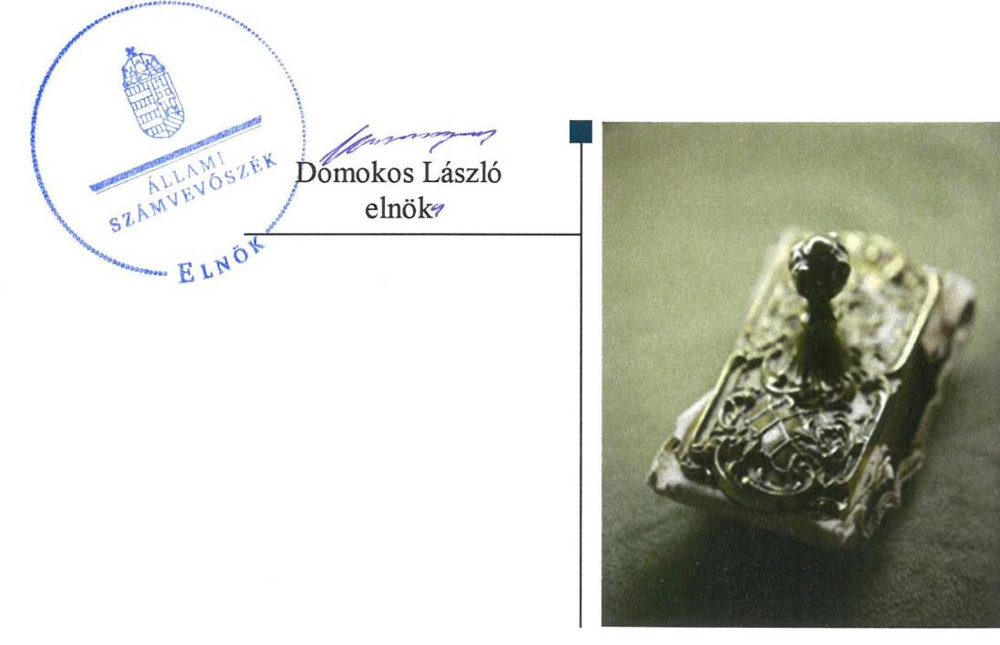
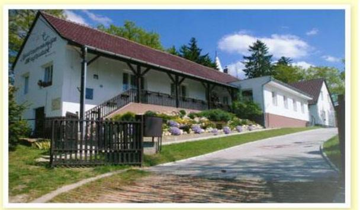
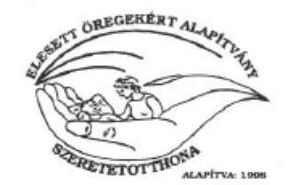
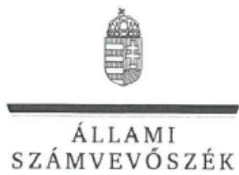
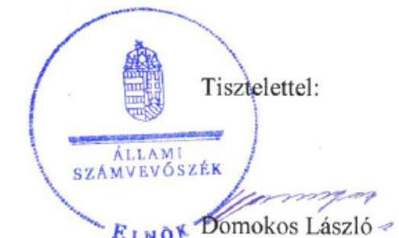

# Jelentés 

## Nem állami humánszolgáltatók ellenőrzése

A humánszolgáltatást nyújtó államháztartáson kívüli szociális intézmények, szolgáltatók fenntartói központi költségvetésből kapott támogatásai felhasználásának ellenőrzése Elesett Öregekért Alapítvány
2019.

---

# Jelentés 

## Nem állami humánszolgáltatók ellenőrzése

A humánszolgáltatást nyújtó államháztartáson kívüli szociális intézmények, szolgáltatók fenntartói központi költségvetésből kapott támogatásai felhasználásának ellenőrzése Elesett Öregekért Alapítvány
2019. Oa hó 24. nap

---

# AZ ELLENŐRZÉST FELÜGYELTE:

- KAKAS SÁNDOR felügyeleti vezető
- AZ ELLENŐRZÉST VEZETTE ÉS A VÉGREHAJTÁSÁÉRT FELELŐS:
  - DR. TÓTH VIKTÓRIA ellenőrzésvezető
  - A PROGRAM ÖSSZEÁLLÍTÁSÁÉRT FELELŐS:
    - TÓTPÁL SZABOLCS osztályvezető

**IKTATÓSZÁM:** EL-1793-001/2019.

**TÉMASZÁM:** 2491

**ELLENŐRZÉS-AZONOSÍTÓ SZÁM:** V083519

Jelentéseink az Országgyűlés számítógépes hálózatán és az Interneta a www.asz.hu címen is olvashatóak.

---

# TARTALOMJEGYZÉK 

■ ÖSSZEGZÉS ..... 5
■ AZ ELLENŐRZÉS CÉLJA ..... 6
■ AZ ELLENŐRZÉS TERÜLETE ..... 7
■ AZ ELLENŐRZÉS HÁTTERE, INDOKOLTSÁGA ..... 8
■ A JELENTÉS LÉNYEGES KÉRDÉSKÖREI ..... 9
■ AZ ELLENŐRZÉS HATÓKÖRE ÉS MÓDSZEREI ..... 10
■ MEGÁLLAPÍTÁSOK ..... 12
■ MELLÉKLETEK ..... 13
I. sz. melléklet: Értelmező szótár ..... 13
■ FÜGGELÉKEK ..... 15
I. sz. függelék a jelentéshez ..... 15
II. sz. függelék: Észrevételek ..... 16
■ RÖVIDÍTÉSEK JEGYZÉKE ..... 23

---

.

---

# ÖSSZEGZÉS 

Az Elesett Öregekért Alapítvány a szociális feladatokat ellátó intézménye müködtetéséhez igénybe vett költségvetési támogatások átlátható, elszámoltatható felhasználásának feltételeit nem teremtette meg. Egyszerúsített éves beszámolóit nem tette közzé, ezáltal az átláthatóságot nem biztositotta.

## Az ellenőrzés társadalmi indokoltsága

Az Állami Számvevőszék a stratégiájában célul tűzte ki, hogy az államháztartáson kívülre nyújtott költségvetési támogatások ellenőrzésével hozzájárul ahhoz, hogy a közpénzeket az államháztartáson kívüli szervezetek is átlátható módon használják fel a közfeladatok szerződésben vállalt ellátása érdekében. Tekintettel az elmúlt években a szociális területet érintő finanszírozási változásokra, a társadalom fokozott érdeklődéssel figyeli a szociális feladatokra fordított források felhasználását. Fontos a közvéleményt biztosítani arról, hogy a közpénz államháztartáson kívüli felhasználása ezen a területen sem marad ellenőrizetlenül. Az ellenőrzés eredményeképpen a nyilvánosság és a szolgáltatást igénybe vevők megfelelő tájékoztatást kaphatnak az államháztartáson kívüli közfeladatot ellátó müködéséről.

Az Elesett Öregekért Alapítványnál végzett ellenőrzést indokolja az is, hogy a humánszolgáltatási közfeladat ellátására az ellenőrzött időszakban több, mint 345,7 millió Ft központi költségvetési támogatásban részesült.

## Főbb megállapítások, következtetések

A szociális humánszolgáltatási közfeladatot ellátó intézményt fenntartó Elesett Öregekért Alapítvány az ellenőrzött időszakban nem rendelkezett a jogszabályban előírt számviteli politikával, és az annak keretében elkészítendő szabályzatokkal, ezáltal nem alakította ki a szabályszerű működés és gazdálkodás kereteit, nem teremtette meg a közfeladathoz biztosított költségvetési támogatások átlátható, elszámoltatható igénybevételének, felhasználásának feltételeit.

Számviteli szabályozás hiányában nem volt igazolt, hogy a költségvetési támogatásokat intézményfenntartóként az intézménye müködtetésére fordította.

Az Elesett Öregekért Alapítvány gazdálkodásáról az egyszerűsített éves számviteli beszámolókat nem tette közzé a honlapján, a felhasznált közpénzekre vonatkozó gazdálkodásával nem számolt el a nyilvánosság előtt.

---

# AZ ELLENŐRZÉS CÉLJA

**AZ ELLENŐRZÉS CÉLJA** annak értékelése, hogy a nem állami, nem önkormányzati szociális intézmények fenntartói központi költségvetésből kapott támogatásainak felhasználása szabályszerű volt-e, a támogatások igénylése, évközi módosítása és év végi elszámolása megfelel-e a jogszabályi előírásoknak.

---

# AZ ELLENŐRZÉS TERÜLETE 

## Elesett Öregekért Alapítvány, mint fenntartó

Az Alapítványt ${ }^{1}$ magánszemély alapította, 1998. május 31-én. Az Alapítvány célja az ellenőrzött időszakban szociális tevékenység keretében az önhibájukon kívül periférián kívülre szorult idősek és hátrányos helyzetűek állandó (bentlakásos) és eseti jellegű gondozása, ellátása, támogatása, részükre állandó gondozóház kialakítása és folyamatos múködtetése és gyógypedagógiai ellátás keretében rehabilitációs, habilitációs, korai fejlesztő tevékenységet, fejlesztő iskolai oktatás, fejlesztő felkészítés, közoktatási intézményi ellátás végzése volt. A Fenntartó ${ }^{2}$ 2018. január 31-ig látott el intézményfenntartói feladatot az intézmény ${ }^{3}$ felett. 2018. február 1-jétől az intézmény feletti fenntartó a Baptista Diakóniai Központ.

Közhasznú tevékenysége keretében a Fenntartó szociális ellátáshoz, az időskorúakról való gondoskodáshoz kapcsolódóan látott el feladatot az ellenőrzött időszakban. Az Alapítvány vállalkozási tevékenységet az ellenőrzött időszakban nem folytatott.

Az Alapítvány ügyvezető szerve az öt főből álló kuratórium ${ }^{4}$ volt. Az Alapítvány képviseletében a kuratórium elnöke önállóan is jogosult volt eljárni. 2015-2017. években a kuratórium elnökének személye nem változott. A kuratóriumi tagok személye kettő fő esetében egy alkalommal, 2017. március 8-án változott.

A Fenntartó a Somogy megyében található Gadány és Nemeskisfalud községekben múködtetett szociális intézményt. Az intézmény tevékenysége idősek és fogyatékos személyek ápolást, gondozást nyújtó intézményi ellátása volt. A szociális intézmény székhelye Gadány községben, telephelye Nemeskisfalud községben volt. A székhely intézményben az idősek otthonában 60 fő, a telephelyen az idősek és a fogyatékos személyek otthonában összesen 89 fő számára biztosítottak férőhelyet. Az intézmény nem volt önálló jogi személy.

A Fenntartó 2015. évben 105,7 millió Ft, 2016. évben 107,7 millió Ft, 2017. évben 132,6 millió Ft központi költségvetési támogatást vett igénybe.

---

# AZ ELLENŐRZÉS HÁTTERE, INDOKOLTSÁGA 

A szociális feladatokat ellátó nem állami intézményfenntartók részére közfeladataik ellátására évente jelentős összegű pénzügyi támogatást biztosítottak a mindenkori költségvetési törvények a bennük megfogalmazott feltételek mellett. A felhasználható állami támogatások a Kvtv.-ekben (a 2014. évi C. törvény Magyarország 2015. évi központi költségvetéséről, 2015. évi C. törvény Magyarország 2016. évi központi költségvetéséről, 2016. évi XC. törvény Magyarország 2017. évi központi költségvetéséről) a 2015-2017. években a szociális ágazatra vonatkozóan 273 Mrd Ft előirányzatot határoztak meg. Módosították a szociális igazgatásról és szociális ellátásokról szóló 1993. évi III. törvényt, amely - többek között - 2012. január 1-jei hatállyal megfogalmazta a finanszírozási rendszerbe történő befogadással összefüggő szabályokat.

Az ÁSZ ${ }^{5}$ stratégiájában foglaltak alapján is indokolt az ellenőrzés, amely a társadalom számára jelzi, hogy a közpénz államháztartáson kívüli felhasználása sem maradhat ellenőrizetlenül. Az államháztartáson kívülre nyújtott költségvetési támogatások ellenőrzésével az ÁSZ hozzájárul ahhoz, hogy a közpénzeket a nem állami humán fenntartók átlátható módon használják fel a közfeladatok ellátására kötött szerződésekben vállalt kötelezettségek teljesítése érdekében. Az ellenőrzés javaslataival hozzájárulhat az említett rendszerek szabályszerű támogatás felhasználásához, javíthatja a társa-dalmi-gazdasági döntések megalapozottságát, amely a „jól irányított állam" múködéséhez járul hozzá.

A holisztikus megközelítés jegyében az ellenőrzés keretében egyedi kockázatelemzés alapján kiválasztott fenntartóknál és intézményeiknél értékeljük az államháztartáson kívüli szociális tevékenységhez kapcsolódó támogatások felhasználásának megfelelőségét.

---

# A JELENTÉS LÉNYEGES KÉRDÉSKÖREI 

1. A szociális humánszolgáltató közfeladatot ellátó fenntartó meg-teremtette-e a költségvetési támogatások átlátható, elszámoltatható igénybevételének, felhasználásának feltételeit, a költségvetési támogatásokat szabályszerűen fordította-e intézménye müködtetésére?
2. Az államháztartáson kívüli fenntartó a szociális humánszolgáltató intézményei müködtetéséhez felhasznált közpénzekre vonatkozó gazdálkodásával a nyilvánosság előtt elszámolt-e?

---

# AZ ELLENŐRZÉS HATÓKÖRE ÉS MÓDSZEREI 

## Az ellenőrzés típusa

Megfelelőségi ellenőrzés

## Az ellenőrzött időszak

A 2015. január 1-je és 2017. december 31-e közötti időszak.

## Az ellenőrzés tárgya

Az ellenőrzés a szociális humánszolgáltatási közfeladatokat ellátó államháztartáson kívüli fenntartók, humánszolgáltatási közfeladatai ellátásához a költségvetési törvényekben biztosított központi költségvetési támogatások igénylése, évközi módosítása és év végi elszámolása fenntartói feladatainak ellátása, illetve e központi költségvetésből kapott támogatásaik humánszolgáltatási közfeladatokra való fenntartó általi felhasználása szabályszerűségének értékelésére terjed ki.

## Az ellenőrzött szervezet

Elesett Öregekért Alapítvány

## Az ellenőrzés jogalapja

Az ellenőrzés jogszabályi alapját az ÁSZ tv. ${ }^{6}$ 1. § (3) bekezdése, 5. § (3) bekezdésben foglalt előírások adják.

## Az ellenőrzés módszerei

Az ellenőrzést az ellenőrzési program szempontjai, kérdései, az ellenőrzött időszakban hatályos jogszabályok, a nemzetközi standardokat irányadónak tekintve, az ellenőrzés szakmai szabályok és módszertanok figyelembe vételével végezte az ÁSZ. A közpénzekkel való felelős gazdálkodás segítésére irányuló javaslatok kidolgozásakor a hatályos jogszabályok az irányadóak.

Az ellenőrzés ideje alatt az ellenőrzött szervezettel történő kapcsolattartást az ÁSZ SZMSZ7-ének vonatkozó előírásai alapján biztosította az ÁSZ.

---

Az ellenőrzési kérdések megválaszolásához szükséges bizonyítékok megszerzése az ellenőrzött által rendelkezésre bocsátott dokumentumokra, adatokra alapozva megfigyelés, szemle (szemrevételezés), kérdésfeltevés (információkérés), valamint elemző eljárással történt.

Az ellenőrzési bizonyítékként felhasználható adatforrások közé tartoznak egyrészt az ellenőrzési program részletes szempontjainál felsorolt adatforrások, másrészt minden - az ellenőrzés folyamán feltárt, az ellenőrzés szempontjából információt tartalmazó - dokumentum.

Az ellenőrzés lefolytatásához az ellenőrzött szervezet a kitöltött tanúsítványok, valamint az ÁSZ által kért dokumentumok elektronikus úton való megküldésével szolgáltatott adatokat, információkat. Az így rendelkezésre bocsátott adatok, információk és a tanúsítványok adatai valódiságának kontrollja az ellenőrzés keretében történt.

Az egységes értelmezést támogatja a program mellékletét képező fogalomtár és rövidítésjegyzék.

Az ellenőrzést szociális humánszolgáltatások esetében a központi költségvetési támogatások igénylésével, módosításával, felhasználásával, elszámolásával kapcsolatos feladatokat ellátó államháztartáson kívüli fenntartónál/szervezeteinél végezte az ÁSZ.

A szociális humánszolgáltatások központi költségvetési támogatásai igénylésével, módosításával, elszámolásával kapcsolatos, államháztartáson kívüli fenntartó jogszabályokban előírt feladatai betartását, továbbá a központi költségvetési támogatások szabályszerű kezelését, nyilvántartását ellenőrizte az ÁSZ a fenntartónál, az ott rendelkezésre álló határozatok, nyilvántartások, beszámolók és egyéb dokumentumok alapján. Az ellenőrzés nem terjedt ki a szociális humánszolgáltatások központi költségvetési támogatásai igénylése, módosítása, elszámolása valódiságának, megalapozottságának, helyességének - sem a fenntartónál, sem a székhely intézményeinél való - értékelésére (mivel ennek felülvizsgálata, ellenőrzése a finanszírozó jogszabályban előírt feladata, határozatai kiadása előtt). Továbbá nem terjedt ki az ellenőrzés e források, intézmények általi szabályszerű felhasználásának értékelésére.

---

# MEGÁLLAPÍTÁSOK 

## 1. A szociális humánszolgáltató közfeladatot ellátó fenntartó megteremtette-e a költségvetési támogatások átlátható, elszámoltatható igénybevételének, felhasználásának feltételeit, a költségvetési támogatásokat szabályszerűen fordította-e intézménye müködtetésére?

Összegző megállapítás

A Fenntartó a költségvetési támogatások átlátható, elszámoltatható igénybevételének, felhasználásának feltételeit szabályszerű múködési- és gazdálkodási környezet kialakításával nem teremtette meg. A Fenntartó nem igazolta, hogy a közfeladat ellátására igénybevett költségvetési támogatásokat intézménye müködtetésére fordította.

A Fenntartó múködésének szabályozottsága, ennek keretében a Fenntartó gazdálkodására vonatkozó számviteli szabályozás nem felelt meg a jogszabályi előírásoknak, mivel a Fenntartó a 2015-2017. években nem rendelkezett a Számv. tv. ${ }^{8}$ 14. § (3) bekezdésében, valamint (5) bekezdés a), b), d) pontjaiban előírt számviteli politikával, és az annak keretében elkészítendő eszközök és források leltározási és leltárkészítési szabályzatával, eszközök és források értékelési szabályzatával és pénzkezelési szabályzattal.

Számviteli szabályozás hiányában nem volt igazolt, hogy a Fenntartó a költségvetési támogatásokat a szociális intézménye müködtetésére fordította.

## 2. Az államháztartáson kívüli fenntartó a szociális humánszolgáltató intézményei müködtetéséhez felhasznált közpénzekre vonatkozó gazdálkodásával a nyilvánosság előtt elszámolt-e?

## Összegző megállapítás

A Fenntartó a felhasznált közpénzekre vonatkozó gazdálkodásával nem számolt el a nyilvánosság előtt.

A Fenntartó 2015-2017. évekre egyszerűsített éves beszámoló és közhasznúsági melléklet készítésével a Számv. tv. és a Civil. tv. ${ }^{9}$ előírásainak megfelelően eleget tett a beszámoló készítési kötelezettségének.

A Fenntartó 2015-2017. években a Civil. tv. 30. § (4) bekezdésében előírtak ellenére egyszerűsített éves beszámolóit és közhasznúsági mellékleteit saját honlapján nem tette közzé.

---

# MELLÉKLETEK 

- I. SZ. MELLÉKLET: ÉRTELMEZŐ SZÓTÁR
humánszolgáltatás
költségvetési támogatás
nem állami, nem önkormányzati (államháztartáson kívüli) intézmény fenntartó
telephely

Külön törvényben meghatározott szociális, gyermekjóléti, gyermekvédelmi, közoktatási, felsőoktatási, kulturális közfeladatok (2014. évi Kvtv. 34. § (1), (4) bekezdés, 1. számú melléklet XX/20/2. alcím, 19. alcím, 2015. évi Kvtv. 43. § (1), (4) bekezdés, 1. számú melléklet XX/20/2/3. jogcím csoport, 19. alcím, 2016. évi Kvtv. 41. § (1), (4) bekezdés, 1. számú melléklet XX/20/2/3. jogcím csoport, 19. alcím.
A társadalombiztosítás pénzügyi alapjai kivételével az államháztartás központi alrendszeréből ellenérték nélkül, pénzben nyújtott támogatások (Áht. 10 1. § 14. pont).
A költségvetési törvényekben (2013. évi CCXXX. törvény 33-34. §, 2014. évi C. törvény 42-43. §, 2015. évi C. törvény 40-41. §) megállapított támogatás. Például a 2015. évi C. törvény 40-41. § szerint többek között: Az Országgyűlés a szociális, gyermekjóléti, gyermekvédelmi közfeladatot ellátó intézményt, szolgáltatást fenntartó egyházi jogi személy, civil szervezet, közalapítvány, országos nemzetiségi önkormányzat, települési vagy területi nemzetiségi önkormányzat, gazdasági társaság, és a humánszolgáltatást alaptevékenységként végző, az Szja tv. hatálya alá tartozó egyéni vállalkozó (a továbbiakban együtt: nem állami szociális fenntartó) részére támogatást állapít meg a következők szerint: a támogatás a nem állami szociális fenntartót a települési önkormányzatok 2. melléklet III. pont 3. alpont c)-k) pontjában és III. pont 5. alpont a) pontjában meghatározott támogatásaival azonos jogcímeken, összegben és feltételek mellett illeti meg.
A szociális, gyermekjóléti és gyermekvédelmi közfeladatokat /humánszolgáltatásokat ellátó intézményt fenntartó egyházi jogi személy, társadalmi szervezet, alapítvány, közalapítvány, civil szervezet, országos nemzetiségi önkormányzat, nonprofit gazdasági társaság, gazdasági társaság és a humánszolgáltatást alaptevékenységként végző, Szja tv. hatálya alá tartozó egyéni vállalkozó. (2013. évi Kvtv. 35. § (1), (3) bekezdés, 2014. évi Kvtv. 33. §, 34. § (1), (4) bekezdés, 2015. évi Kvtv. 42. §, 43. § (1), (4) bekezdés, 2016. évi Kvtv. 40. §, 41. § (1), (4) bekezdés, 2017. évi Kvtv. 41. § (1), (4))
a szolgáltató székhelyétől különböző, szolgáltató/intézmény használatában álló hely, a szociális humánszolgáltatáshoz használt, bejegyzett hely. (Sznyvhr. 1.§ I) pont) (hatályos: 2015. január 1-től)

---

.

---

# FÜGGELÉKEK 

- I. SZ. FÜGGELÉK A JELENTÉSHEZ

Az Állami Számvevőszék az ellenőrzések során feltárt tényekhez kapcsolódó további körülmények tisztázására eszközrendszerrel nem rendelkezik. Amennyiben az ellenőrzésen túlmutatóan indokoltnak látszik az ellenőrzés során feltárt körülmények további vizsgálata, az Állami Számvevőszék törvényi felhatalmazás alapján az ellenőrzés által feltárt körülményeket továbbítja a hatáskörrel rendelkező szervnek a szükséges intézkedések megtétele, eljárások lefolytatása érdekében.
A Fenntartó a 2015-2017. években nem rendelkezett a Számv. tv. 14. § (3) bekezdésében előírt számviteli politikával, a Számv. tv. 14. § (5) bekezdés a)-b) és d) pontjaiban előírt eszközök és források leltárkészítési és leltározási szabályzatával, az eszközök és források értékelési szabályzatával, valamint pénzkezelési szabályzattal.
Számviteli szabályozás hiányában nem igazolt, hogy a Fenntartó a költségvetési támogatásokat a szociális intézménye müködtetésére fordította, vagyis nem zárható ki, hogy a költségvetésből származó pénzeszközöket a jóváhagyott céltól eltérően használta fel.
A közpénzek átlátható, elszámoltatható feltételeinek hiányában 2015-2017. években nem igazolt, hogy a Fenntartó a szociális közfeladat ellátására biztosított költségvetési támogatásokat humánszolgáltató intézménye müködtetésére fordította.
Az eset konkrét körülményeinek feltárására a Magyar Államkincstár rendelkezik hatáskörrel.

---

A jelentéstervezetet a Számvevőszék 15 napos észrevételezésre megküldte az ellenőrzött szervezet vezetőjének az ÁSZ tv. 29. §* (1) bekezdése előírásának megfelelően.

Az Elesett Öregekért Alapítvány kuratóriumi elnöke a jelentéstervezet megállapításaira írásban észrevételt tett.
Az ÁSZ tv. 29. § (3) bekezdésével összhangban az ÁSZ a Függelékben feltünteti az ellenőrzés megállapításaival kapcsolatban tett, figyelembe nem vett észrevételeket, és megindokolja, hogy azokat miért nem fogadta el.

[^0]
[^0]:    * 29. § (1) Az Állami Számvevőszék az ellenőrzési megállapításait megküldi az ellenőrzött szervezet vezetőjének vagy az általa megbízott személynek, és annak, akinek személyes felelősségét állapította meg.
    (2) Az ellenőrzött szervezet vezetője és a felelősként megjelölt személy az ellenőrzés megállapításaira tizenöt napon belül írásban észrevételt tehet.
    (3) Az Állami Számvevőszék az észrevételre a beérkezésétől számított harminc napon belül írásban válaszol. A figyelembe nem vett észrevételeket köteles a jelentésben feltüntetni, és megindokolni, hogy azokat miért nem fogadta el.

---

# ELESETT OREGEKERT ALAPITVANY KÖZHASZNÓ SZERVEZET 8715 Gadány Fö u. 46. Tel./Fax: 85/ 329-511 

Szeretetotthon
8715 Gadány, Fő u. 46.
Tel./Fax: 85/ 329-511

Szeretetotthon
8717 Nemeskisfalud, Kis u. 15.
Tel.: 85/ 322-242

Állami Számvevőszék
Budapest

## Tisztelt Állami Számvevőszék!

Az „Elesett Öregekért" Alapítványt 1998. máj 31.-én azzal a céllal alapította három nyugdijas, keresztény értékeket valló ember, hogy azoknak az idős, beteg embereknek nyújtson segítséget, akik önmaguk ellátására már képtelenek.
2017.febr. 01 -ig - amikor is az intézmények fenntartását az Alapítvány átadta a Baptista Diakóniai Központnak - mindenkor, minden ellátott felvételénél az volt a rendező elv, mennyire rászoruló, számíthat-e valahonnan segítségre, és olyan emberen segítsünk, aki az állami otthonokba hely hiányában, a magán otthonokba anyagiak hiányában esélye sem volt bekerülni.

Mi sem bizonyítja ezt jobban, mint az : felvettünk olyan lakókat is, akiknek egyáltalán nem volt jövedelme, így térítési díjat sem tudtak fizetni, sőt az Alapítvány adott részükre havi költópénzt.
Ellátottaink nagy része környékbeli kisnyugdíjas volt, így Ők is csak a töredékét tudták az intézményi térítési dijnak fizetni.
Nemeskisfaludi intézményünkben él 38 fogyatékos fiatal, akiket a családba visszahelyezni nem lehetett, más befogadó közeg nem volt, az Ö részükre is biztosítjuk az ellátást, annak ellenére, hogy Ök még kevesebb jövedelemmel rendelkeznek, mint időskorú ellátottaink.

A fentieket csupán azért vázoltam fel, hogy alátámasszam ( ez a főkönyvi adatokból is egyértelműen kiderül ) az állami támogatás nem fedezte a munkabérek és járulékok összegét, ezt az Alapítvány egyéb forrásaiból kellett pótolni.

Az Alapítvány, mint intézmény fenntartó múködött, más tevékenységet, az Alapító Okirata alapján nem folytathatott és nem is folytatott.
Gazdálkodásunkat az Állam Kincstár, a Felügyelő Bizottság és évente két alkalommal a Kuratórium is ellenőrizte.
Az Államkincstár a lefolytatott ellenőrzések során céltól eltérő közpénz felhasználást nem állapított meg.

Postacím: Elesett Öregekért Alapítvány 8715 Gadány, Fő u. 46. Tel.: 06-85/329-511, Web: http://elesettoregekert.extra.hu E-mail: eoal1998@gmail.com

---

Sajnálatos tény, hogy gazdálkodásunkról az Alapítvány honlapján keresztül nem tájékoztattuk az érdeklődőket, azonban a dokumentumokat a Bíróság Civil Szervezetek honlapjára minden évben feltöltöttük, amit a Bíróság „tájékoztatási kötelezettségének eleget tett,, mondattal záradékolt. Ennek igazolását mellékelve csatoljuk. Mulasztásunkat a honlapon pótoltuk.
"Számviteli politikával" rendelkezünk és a vizsgált időszakban is rendelkeztünk - ez az adatbekérő levél rossz értelmezése miatt - azonban nem került feltöltésre az ABR rendszerbe, az abban foglaltak azonban megvalósultak. A szabályzatot mellékelve küldjük.
A számviteli politika mellékleteit képező szabályzatok feltöltésre kerültek, és vizsgálhatók.
Saját jól felfogott érdekünk, hogy munkánk teljes átláthatóságára és hitelességére törekedjünk életünk minden területén, ezért megköszönve hasznos és megfontolásra méltó munkájukat kérem, észrevételeimet jelentésük elkészítésénél vegyék figyelembe.

Gadány, 2019.07.12.

Sustemé Tóth Rita
Suszterné Tóth Rita az Alapítvány elnöke

ELESETT OREGEXERT ALAPITVANY
8715 Gadany, Fő u. 46.
Tel.:85/329-511
8717 Némeskiafalud, Kis u. 15.
Tel.:85/322-242
Adószám: 18768570-1-14
TakasZov: 86900038 - 10000970

Postacím: Elesett Öregekért Alapítvány 8715 Gadány, Fő u. 46. Tel.: 06-85/329-511, Web: http://elesettoregekert.extra.hu E-mail: eoal1998@gmail.com

---

ELNOK

# Suszterné Tóth Rita úrhölgy 

kuratórium elnöke
Elesett Öregekért Alapítvány

## Gadány

## Tisztelt Elnök Úrhölgy!

A „Nem állami humánszolgáltatók ellenörzése - A humánszolgáltatást nyújtó államháztartáson kivüli szociális intézmények, szolgáltatók fenntartói központi költségvetésböl kapott támogatásai felhasználásának ellenörzése - Elesett Öregekért Alapitvány" címmel készített számvevöszéki jelentéstervezetre tett észrevételét megkaptam.
Az Állami Számvevőszék észrevételekre vonatkozó álláspontjáról a felügyeleti vezető által készített részletes tájékoztatást csatoltan megküldöm.
Tájékoztatom Elnök úrhölgyet, hogy a számvevőszéki jelentésben - az Állami Számvevőszékről szóló 2011. évi LXVI. törvény 29. § (3) bekezdése alapján - a figyelembe nem vett észrevételeket szerepeltetjük az elutasítás indokának feltüntetésével.

Budapest, 2019. 08 hó 07 nap

Melléklet: Tájékoztatás az észrevételek kezeléséről

---

# Tájékoztatás az észrevételek kezeléséről 

A „Nem állami humánszolgáltatók ellenörzése - A humánszolgáltatást nyújtó államháztartáson kivüli szociális intézmények, szolgáltatók fenntartói központi költségvetésböl kapott támogatásai felhasználásának ellenörzése - Elesett Öregekért Alapitvány" címủ jelentéstervezetre (továbbiakban: jelentéstervezet) a 2019. július 12-én kelt levélben megküldött észrevételeit áttekintettem. Az észrevételek kezeléséről az alábbi tájékoztatást adom.

## 1) A jelentéstervezet 2. megállapításának 2. bekezdéséhez tett észrevétel

Az észrevétel az ellenőrzési megállapítást nem kívánta vitatni, és Elnök úrhölgy észrevételében elismerte, hogy a fenntartó az egyesülési jogról, a közhasznú jogállásról, valamint a civil szervezetek müködéséről és támogatásáról szóló 2011. évi CLXXV. törvény (Civil. tv.) 29. § (2) bekezdése szerint elkészített, mérleget, eredménykimutatást és kiegészítő mellékletet is tartalmazó hitelesített beszámolóját, valamint a Civil tv. 29. § (3) bekezdése szerinti közhasznúsági mellékletét a Civil tv. 30. § (4) bekezdésében előírtak ellenére a saját honlapján nem hozta nyilvánosságra. Elnök úrhölgy tájékoztatást adott arról, hogy a fenntartó a Civil. tv. 30. § (1) bekezdése szerinti letétbe helyezési és közzétételi kötelezettségének eleget tett, melynek hiányára vonatkozóan az Állami Számvevőszék (továbbiakban: ÁSZ) megállapítást nem tett, a mellékletként csatolt, az adatszolgáltatáson kívül megküldött, utólag rendelkezésre bocsátott dokumentum az ÁSZ megállapítását nem érinti. Fentiekre tekintettel az észrevétel elfogadása és a jelentéstervezet módosítása nem indokolt.

## 2) A jelentéstervezet 1. megállapításának 1. bekezdéséhez tett észrevétel

A számvitelről szóló 2000 . évi C. törvény (Számv. tv.) 14. § (3) bekezdésében előírt számviteli politika vonatkozásában a 14. § (12) bekezdés előírja, hogy a számviteli politika elkészítéséért, módosításáért a gazdálkodó képviseletére jogosult személy felelős. Az adatszolgáltatás keretében megküldött dokumentumok között megtalálhatók a Számv. tv. 14. § (5) bekezdés a), b) és d) pontjaiban foglaltak szerint elkészített, 2016. július 1. napjától hatályba helyezett leltárkészítési és leltározási szabályzat és az értékelési szabályzat, valamint a 2016. december 3-ától hatályba léptetett pénzkezelési szabályzat. A fenti szabályzatokat a Számv. tv. 14. § (12) bekezdésének előírása ellenére nem a számviteli politika elkészítéséért, módosításáért, a gazdálkodó képviseletére jogosult felelős személy, azaz a kuratórium elnöke adta ki, írta alá, így ellenőrzési bizonyítékként a fenti dokumentumok nem voltak értékelhetők. Elnök úrhölgy észrevételében elismerte, hogy a Fennrtó ellenőrzött időszakra vonatkozó hatályos számviteli politikáját nem bocsátotta az ÁSZ rendelkezésére. Az ÁSZ az ellenőrzés végrehajtása során az adatbekérésre határidőben megküldött dokumentumokat értékeli, és az alapján teszi meg az ellenőrzési megállapításait. Az adatszolgáltatás keretében a számviteli

---

politika helyett a 2016. július 1. napjától hatályba helyezett, nem a kuratórium elnöke által aláirt számlarend került megküldésre. Az észrevételhez mellékletként csatolt, az adatszolgáltatáson kívül megküldött, utólag rendelkezésre bocsátott dokumentumot az ÁSZ nem értékeli. A fenti indokok alapján az észrevételt nem fogadjuk el, a jelentéstervezet módosítása nem indokolt.

Budapest, 2019. 08. hó 07. nap

Kakas Sándor felügyeleti vezető

---

.

---

# RÖVIDÍTÉSEK JEGYZÉKE 

${ }^{1}$ Alapítvány
${ }^{2}$ Fenntartó
${ }^{3}$ intézmény
${ }^{4}$ Kuratórium
${ }^{5}$ ÁSZ
${ }^{6}$ ÁSZ tv.
${ }^{7}$ ÁSZ SZMSZ
${ }^{8}$ Számv. tv.
${ }^{9}$ Civil. tv.
${ }^{10}$ Áht.

Elesett Öregekért Alapítvány
Elesett Öregekért Alapítvány
Szeretetotthon (Gadány székhellyel és Nemeskisfalud telephellyel)
Elesett Öregekért Alapítvány Kuratóriuma
Állami Számvevőszék
az Állami Számvevőszékről szóló 2011. évi LXVI. törvény
Állami Számvevőszék Szervezeti és Működési Szabályzata
2000. évi C. törvény a számvitelről
2011. évi CLXXV. törvény az egyesülési jogról, a közhasznú jogállásról, valamint a civil szervezetek müködéséről és támogatásáról
(hatályos: 2011. december 22-étől)
2011. évi CXCV. törvény az államháztartásról (hatályos: 2011. december 31-étől)

---

# ÁLLAMI SZÁMVEVŐSZÉK 

1052 Budapest, Apáczai Csere János utca 10.
Levélcím: 1364 Budapest 4. Pf. 54
Telefon: +36 14849100 Telefax: +36 14849200
www.asz.hu