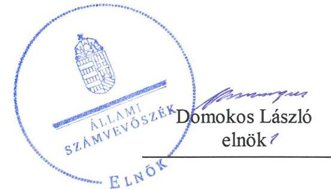
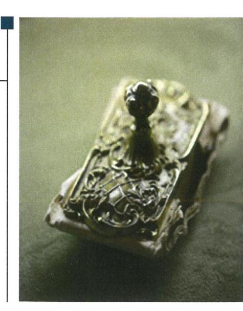
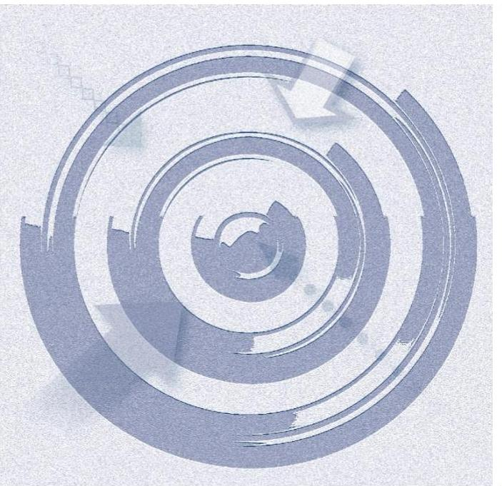
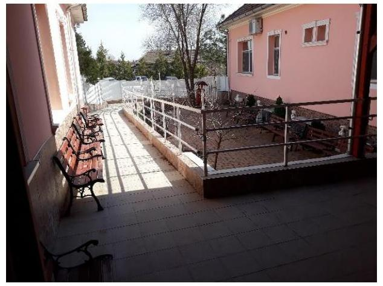
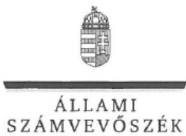
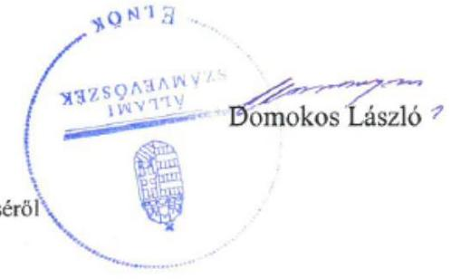

# Jelenetés 

## Nem állami humánszolgáltatók ellenőrzése

A humánszolgáltatást nyújtó államháztartáson kívüli szociális intézmények, szolgáltatók fenntartói központi költségvetésből kapott támogatásai felhasználásának ellenőrzése Estikék Idősek Otthona Alapítvány 2019.

19167
www.asz.hu

---

# Jelentés 

## Nem állami humánszolgáltatók ellenőrzése

A humánszolgáltatást nyújtó államháztartáson kívüli szociális intézmények, szolgáltatók fenntartói központi költségvetésből kapott támogatásai felhasználásának ellenőrzése Estikék Idősek Otthona Alapítvány
2019. 09. 24.

---

# AZ ELLENŐRZÉST FELÜGYELTE:

- KAKAS SÁNDOR felügyeleti vezető
- AZ ELLENŐRZÉST VEZETTE ÉS A VÉGREHAJTÁSÁÉRT FELELŐS:
  - MOLNÁR ZSUZSANNA ellenőrzésvezető
  - A PROGRAM ÖSSZEÁLLÍTÁSÁÉRT FELELŐS:
    - TÓTPÁL SZABOLCS osztályvezető

**IKTATÓSZÁM:** EL-1794-001/2019.

**TÉMASZÁM:** 2491

**ELLENŐRZÉS-AZONOSÍTÓ SZÁM:** V083540

Jelentéseink az Országgyűlés számítógépes hálózatán és az Interneten a www.asz.hu címen is olvashatóak.

---

# TARTALOMJEGYZÉK 

■ ÖSSZEGZÉS ..... 5
■ AZ ELLENŐRZÉS CÉLJA ..... 6
■ AZ ELLENŐRZÉS TERÜLETE ..... 7
■ AZ ELLENŐRZÉS HÁTTERE, INDOKOLTSÁGA ..... 8
■ A JELENTÉS LÉNYEGES KÉRDÉSKÖREI ..... 9
■ AZ ELLENŐRZÉS HATÓKÖRE ÉS MÓDSZEREI ..... 10
■ MEGÁLLAPÍTÁSOK ..... 12
■ JAVASLATOK ..... 14
■ MELLÉKLETEK ..... 15
I. sz. melléklet: Értelmező szótár ..... 15
■ FÜGGELÉKEK ..... 17
I. sz. függelék a jelentéshez ..... 17
II. sz. függelék: Észrevételek ..... 19
■ RÖVIDÍTÉSEK JEGYZÉKE ..... 25

---

.

---

# ÖSSZEGZÉS 

Az Estikék Idősek Otthona Alapítvány a szociális közfeladat ellátására igénybevett közpénzekkel nem gazdálkodott átlátható és elszámoltatható módon, ezáltal a támogatások cél szerinti felhasználását nem igazolta.

## Az ellenőrzés társadalmi indokoltsága

Az Állami Számvevőszék stratégiájában célul tűzte ki, hogy az államháztartáson kívülre nyújtott költségvetési támogatások ellenőrzésével hozzájáruljon ahhoz, hogy a közpénzeket az államháztartáson kívüli szervezetek is átlátható módon használják fel a közfeladatok szerződésben vállalt ellátása érdekében. Tekintettel az elmúlt években a szociális területet érintő finanszírozási változásokra a társadalom fokozott érdeklődéssel figyeli a szociális feladatokra fordított források felhasználását. Fontos a közvéleményt biztosítani arról, hogy a közpénz államháztartáson kívüli felhasználása ezen a területen sem marad ellenőrizetlenül. Az ellenőrzés eredményeképpen a nyilvánosság és a szolgáltatást igénybe vevők megfelelő tájékoztatást kaphatnak az államháztartáson kívüli közfeladatot ellátók működéséről.

Az Estikék Idősek Otthona Alapítványnál végzett ellenőrzést további társadalmi elvárás is indokolja tevékenységéből adódóan, mivel szociális közfeladat ellátására több mint 270 millió Ft központi költségvetési támogatásban részesült az Alapítvány az ellenőrzött időszakban.

## Főbb megállapítások, következtetések, javaslatok

Az Estikék Idősek Otthona Alapítvány a 2015-2017. években a jogszabályban előírt számviteli politika és az annak keretében elkészítendő számviteli szabályzatok hiányában nem alakította ki a szabályszerű működési és gazdálkodási környezetet. A számviteli szabályzatok hiányában a Fenntartó közpénzekkel való gazdálkodása nem volt átlátható, elszámoltatható, nem biztosította az Alaptörvényben előírt átlátható gazdálkodás követelményének érvényesülését.

A költségvetési támogatások átlátható és elszámoltatható felhasználása hiányában nem volt igazolt, hogy a kapott költségvetési támogatásokat fenntartóként intézménye működtetésére fordította.

A Fenntartó a számviteli beszámolójára vonatkozó közzétételi kötelezettségének eleget tett.
Az Állami Számvevőszék a jelentésben foglalt megállapítások alapján az Estikék Idősek Otthona Alapítvány kuratóriumi elnökének egy javaslatot fogalmazott meg. A javaslatokat megalapozó megállapításokra az érintettnek 30 napon belül intézkedési tervet kell készítenie.

---

# AZ ELLENŐRZÉS CÉLJA

**AZ ELLENŐRZÉS CÉLJA** annak értékelése, hogy az Estikék Idősek Otthona Alapítvány központi költségvetésből kapott támogatásainak felhasználása szabályszerű volt-e, a támogatások igénylése, évközi módosítása és év végi elszámolása megfelelte-e a jogszabályi előírásoknak.

---

# **AZ ELLENŐRZÉS TERÜLETE**

## **Estikék Idősek Otthona Alapítvány, mint intézményfenntartó**

Az Estikék Idősek Otthona Alapítványt egy magánszemély hozta létre 2005-ben, székhelye a Pest megyei Sülysápon van. A Fenntartó1 célja az időskorúak és mozgássérültek személyes gondozása, a kórházi ellátást nem igénylő, egyéb ellátásra szorulók, – különösen, de nem kizárólag a demensek, Alzheimer-kórban szenvedők – valamint az átmeneti ellátásra szorulók gondozása.

A Fenntartó nyílt, közhasznú jogállású szervezet volt, alaptevékenységén kívül vállalkozási tevékenységet az ellenőrzött időszakban nem folytatott.

Ügyvezető szerve a három főből álló kuratórium volt. A Fenntartó képviseletét a kuratórium elnöke látta el, akinek a személyében nem történt változás az ellenőrzött időszakban.

A Fenntartó szociális közfeladatát önálló jogi személyiséggel nem rendelkező intézménye révén látta el. Az Estikék Gondozási-Ápolási Intézmény időszakos otthonként és időszakos átmeneti gondozóházként működött, továbbá időskorúak és fogyatékos személyek nappali ellátását végezte. Az Intézmény2 az ország egész területéről fogadott ellátottakat. Az ellenőrzött időszakban a bentlakásos férőhelyszám 100 fő, a nappali ellátások férőhelyszáma 21 fő volt.

A Fenntartó összes bevétele 2015-ben 276,6 M Ft volt, amely az ellenőrzött időszak utolsó évében, 2017-ben 319,2 M Ft-ra emelkedett. A szociális közfeladatellátásra biztosított költségvetési támogatás összege a 2015. évi 84,2 M Ft-ról 2016-ban 87,8 M Ft-ra, 2017-ben pedig 103,8 M Ft-ra növekedett.

---

# AZ ELLENŐRZÉS HÁTTERE, INDOKOLTSÁGA 

A szociális feladatokat ellátó nem állami intézményfenntartók részére közfeladataik ellátására évente jelentős összegű pénzügyi támogatást biztosítottak a mindenkori költségvetési törvények a bennük megfogalmazott feltételek mellett. A felhasználható állami támogatások a Kvtv.-ekben (a 2014. évi C. törvény Magyarország 2015. évi központi költségvetéséről, 2015. évi C. törvény Magyarország 2016. évi központi költségvetéséről, 2016. évi XC. törvény Magyarország 2017. évi központi költségvetéséről) a 2015-2017. években a szociális ágazatra vonatkozóan 273 Mrd Ft előirányzatot határoztak meg. Módosították a szociális igazgatásról és szociális ellátásokról szóló 1993. évi III. törvényt, amely - többek között - 2012. január 1-jei hatállyal megfogalmazta a finanszírozási rendszerbe történő befogadással összefüggő szabályokat.

Az ÁSZ ${ }^{3}$ stratégiájában foglaltak alapján is indokolt az ellenőrzés, amely a társadalom számára jelzi, hogy a közpénz államháztartáson kívüli felhasználása sem maradhat ellenőrizetlenül. Az államháztartáson kívülre nyújtott költségvetési támogatások ellenőrzésével az ÁSZ hozzájárul ahhoz, hogy a közpénzeket a nem állami humán fenntartók átlátható módon használják fel a közfeladatok ellátására kötött szerződésekben vállalt kötelezettségek teljesítése érdekében. Az ellenőrzés javaslataival hozzájárulhat az említett rendszerek szabályszerű támogatás felhasználásához, javíthatja a társadalmi-gazdasági döntések megalapozottságát, amely a „jól irányított állam" működéséhez járul hozzá.

A holisztikus megközelítés jegyében az ellenőrzés keretében egyedi kockázatelemzés alapján kiválasztott fenntartóknál és intézményeiknél értékeljük az államháztartáson kívüli szociális tevékenységhez kapcsolódó támogatások felhasználásának megfelelőségét.

---

# A JELENTÉS LÉNYEGES KÉRDÉSKÖREI 

1. A Fenntartó szabályszerű működési - és gazdálkodási környezet kialakításával megteremtette-e a költségvetési támogatások átlátható, elszámoltatható igénybevételének, felhasználásának feltételeit, a költségvetési támogatásokat szabályszerűen használta-e fel?
2. A Fenntartó a szociális humánszolgáltató intézménye működtetéséhez felhasznált közpénzekre vonatkozó gazdálkodásával a nyilvánosság előtt elszámolt-e, ennek megalapozása érdekében ellenőrzési, értékelési és a külső ellenőrzésekkel kapcsolatos intézkedési feladatait szabályszerűen látta-e el?

---

# AZ ELLENŐRZÉS HATÓKÖRE ÉS MÓDSZEREI 

## Az ellenőrzés típusa

Megfelelőségi ellenőrzés.

## Az ellenőrzött időszak

A 2015. január 1-je és 2017. december 31-e közötti időszak.

## Az ellenőrzés tárgya

Az ellenőrzés a szociális humánszolgáltatási közfeladatokat ellátó államháztartáson kívüli fenntartók, humánszolgáltatási közfeladatai ellátásához a költségvetési törvényekben biztosított központi költségvetési támogatások igénylése, évközi módosítása és év végi elszámolása fenntartói feladatainak ellátása, illetve e központi költségvetésből kapott támogatásaik humánszolgáltatási közfeladatokra való fenntartó általi felhasználása szabályszerűségének értékelésére terjedt ki.

## Az ellenőrzött szervezet

Az Estikék Idősek Otthona Alapítvány, mint intézményfenntartó.

## Az ellenőrzés jogalapja

Az ellenőrzés jogszabályi alapját az ÁSZ tv. ${ }^{4} 1 . \S$ (3) bekezdésében, az 5. § (3) bekezdésében foglalt előírások adták.

## Az ellenőrzés módszerei

Az ellenőrzést az ellenőrzési program szempontjai, kérdései, az ellenőrzött időszakban hatályos jogszabályok alapján, a nemzetközi standardokat irányadónak tekintve, az ellenőrzés szakmai szabályok és módszertanok figyelembe vételével végezte az ÁSZ. A közpénzekkel való felelős gazdálkodás segítésére irányuló javaslatok kidolgozásakor a hatályos jogszabályok voltak az irányadóak.

Az ellenőrzés ideje alatt az ellenőrzött szervezettel történő kapcsolattartást az ÁSZ SZMSZ5-ének vonatkozó előírásai alapján biztosította az ÁSZ.

---

Az ellenőrzési kérdések megválaszolásához szükséges bizonyítékok megszerzése az ellenőrzött által rendelkezésre bocsátott dokumentumokra, adatokra alapozva megfigyelés, szemle (szemrevételezés), kérdésfeltevés (információkérés), valamint elemző eljárással történt. Az ellenőrzési bizonyítékként felhasználható adatforrások közé tartoznak egyrészt az ellenőrzési program részletes szempontjainál felsorolt adatforrások, másrészt minden - az ellenőrzés folyamán feltárt, az ellenőrzés szempontjából információt tartalmazó - dokumentum.

Amennyiben a Fenntartó működését és gazdálkodását alapvetően meghatározó dokumentum hiánya miatt, valamely lényeges kérdéskörre vonatkozóan az ÁSZ megállapítást tett, további ellenőrzési tevékenységek az adott kérdéskörrel és az azzal szoros logikai kapcsolatban lévő kérdéskörökkel - ráépülő jelleggel - nem kerültek végrehajtásra.

---

# MEGÁLLAPÍTÁSOK 

## 1. A Fenntartó szabályszerű működési - és gazdálkodási környezet kialakításával megteremtette-e a költségvetési támogatások átlátható, elszámoltatható igénybevételének, felhasználásának feltételeit, a költségvetési támogatásokat szabályszerűen használta-e fel?

Összegző megállapítás

A Fenntartó nem alakította ki a szabályszerű működési- és gazdálkodási környezetet, a költségvetési támogatások átlátható, elszámoltatható igénybevételének, felhasználásának feltételeit. A költségvetési támogatások cél szerinti felhasználása nem volt igazolt.

A Fenntartó működésének szabályozottsága, ennek keretében a Fenntartó gazdálkodására vonatkozó belső szabályozás az ellenőrzött időszakban nem felelt meg a jogszabályban előírtaknak, mivel a Fenntartó nem rendelkezett a Számv. tv. ${ }^{6} 14 . \S$ (3) bekezdésében előírt számviteli politikával és a Számv. tv. 14. § (5) bekezdés a), b) és d) pontjában előírt, a számviteli politika keretében elkészítendő eszközök és a források leltárkészítési és leltározási szabályzatával, az eszközök és a források értékelési szabályzatával és pénzkezelési szabályzattal.

A Fenntartó nem biztosította a szociális közfeladat ellátására igénybevett közpénzek átlátható felhasználásának feltételeit, melynek hiányában nem volt igazolt, hogy a Fenntartó a közfeladat ellátására kapott költségvetési támogatásokat humánszolgáltató intézménye működtetésére fordította.

---

# 2. A Fenntartó a szociális humánszolgáltató intézménye működtetéséhez felhasznált közpénzekre vonatkozó gazdálkodásával a nyilvánosság előtt elszámolt-e, ennek megalapozása érdekében ellenőrzési, értékelési és a külső ellenőrzésekkel kapcsolatos intézkedési feladatait szabályszerűen látta-e el? 

Összegző megállapítás

A Fenntartó eleget tett beszámolójára vonatkozó közzétételi kötelezettségének. Intézménye szabályzatait ellenőrizte, 2016-2017. években értékelte az intézmény feladatellátását és gazdálkodását. A külső ellenőrzéssel kapcsolatos intézkedési kötelezettségének eleget tett.

A Fenntartó eleget tett az éves beszámolóra vonatkozó, - a Civil tv. ${ }^{7}$ és a Cnytv. ${ }^{8}$ előírása szerinti - letétbe helyezési és közzétételi kötelezettségének.

A Fenntartó az Intézmény feladatellátását és gazdálkodását a 2016-2017. évek egyszerűsített éves beszámolóinak közhasznúsági mellékleteihez készített írásos beszámolóiban értékelte.

A Fenntartó 2015-ben ellenőrizte az Intézmény házirendjét, szakmai programját és az intézmény számára - az 1/2000. (I. 7.) SzCsM rendelet ${ }^{9} 1$. számú mellékletének I., II. és III/3. pontjában - előírt szabályzatokat.

A Fenntartó eleget tett a Kormányhivatal ${ }^{10}$ által a 2015. évben lefolytatott törvényességi ellenőrzés eredményeként keletkezett intézkedési kötelezettségének.

---

# JAVASLATOK 

Az ÁSZ tv. 33. § (1) bekezdésében foglaltak értelmében az ellenőrzött szervezet vezetője köteles a jelentésben foglalt megállapításokhoz kapcsolódó intézkedési tervet összeállítani és azt a jelentés kézhezvételétől számított 30 napon belül az ÁSZ részére megküldeni. Amennyiben az ellenőrzött szervezet vezetője nem küldi meg határidőben az intézkedési tervet, vagy továbbra sem elfogadható intézkedési tervet küld, az Állami Számvevőszék elnöke az ÁSZ tv. 33. § (3) bekezdése a) és b) pontjaiban foglaltakat érvényesítheti.

## az Estikék Idősek Otthona Alapítvány kuratóriumi elnökének

1. Gondoskodjon a számviteli politika kialakításáról és írásba foglalásáról és annak keretében
a) az eszközök és a források leltárkészítési és leltározási szabályzata;
b) az eszközök és
 a források értékelési szabályzata;
c) valamint a pénzkezelési szabályzat
elkészítéséről a Számv. tv. előírásai szerint.
(1. megállapítás 1. bekezdése alapján)

---

# MELLÉKLETEK 

- I. SZ. MELLÉKLET: ÉRTELMEZŐ SZÓTÁR
költségvetési támogatás
nem állami, nem önkormányzati (államháztartáson kívüli) intézmény fenntartó
a társadalombiztosítás pénzügyi alapjai kivételével az államháztartás központi alrendszeréből ellenérték nélkül, pénzben nyújtott támogatások (Áht. 1. § 14. pont)
A költségvetési törvényekben (2013. évi CCXXX. törvény 33-34. §, 2014. évi C. törvény 42-43. §, 2015. évi C. törvény 40-41. §) megállapított támogatás. Például a 2015. évi C. törvény 40-41. § szerint többek között: Az Országgyűlés a szociális, gyermekjóléti, gyermekvédelmi közfeladatot ellátó intézményt, szolgáltatást fenntartó egyházi jogi személy, civil szervezet, közalapítvány, országos nemzetiségi önkormányzat, települési vagy területi nemzetiségi önkormányzat, gazdasági társaság, és a humánszolgáltatást alaptevékenységként végző, az Szja tv. hatálya alá tartozó egyéni vállalkozó (a továbbiakban együtt: nem állami szociális fenntartó) részére támogatást állapít meg a következők szerint: a támogatás a nem állami szociális fenntartót a települési önkormányzatok 2. melléklet III. pont 3. alpont c)-k) pontjában és III. pont 5. alpont a) pontjában meghatározott támogatásaival azonos jogcímeken, összegben és feltételek mellett illeti meg.
A szociális, gyermekjóléti és gyermekvédelmi közfeladatokat /humánszolgáltatásokat ellátó intézményt fenntartó egyházi jogi személy, társadalmi szervezet, alapítvány, közalapítvány, civil szervezet, országos nemzetiségi önkormányzat, nonprofit gazdasági társaság, gazdasági társaság és a humánszolgáltatást alaptevékenységként végző, Szja tv. hatálya alá tartozó egyéni vállalkozó. (2013. évi Kvtv. 35. § (1), (3) bekezdés, 2014. évi Kvtv. 33. §, 34. § (1), (4) bekezdés, 2015. évi Kvtv. 42. §, 43. § (1), (4) bekezdés, 2016. évi Kvtv. 40. §, 41. § (1), (4) bekezdés, 2017. évi Kvtv. 41. § (1), (4))

---

.

---

# FÜGGELÉKEK 

- I. SZ. FÜGGELÉK A JELENTÉSHEZ

Az Állami Számvevőszék az ellenőrzés során feltárt tényekhez kapcsolódó további körülmények tisztázására eszközrendszerrel nem rendelkezik. Amennyiben az ellenőrzésen túlmutatóan indokoltnak látszik az ellenőrzés során feltárt körülmények további vizsgálata, az Állami Számvevőszék törvényi felhatalmazás alapján az ellenőrzés által feltárt körülményeket továbbítja a hatáskörrel rendelkező szervnek a szükséges intézkedések megtétele, eljárások lefolytatása érdekében.

I.

1. A Fenntartó a Számv. tv. 14. § (4) bekezdésében foglalt kötelezettsége teljesítésének bizonyítására olyan számviteli politikát használt fel, amelynek a 2014. évre vonatkozó szabályozása rendelkezést tartalmazott a kivételes nagyságú vagy előfordulású bevételek, költségek, ráfordítások meghatározásának kötelezettségére vonatkozóan annak ellenére, hogy ez szabályozási elvárás a Számv. tv. 2015. július 4-i hatályú változatában jelent meg először.
2. A Fenntartó a Számv. tv. 161. § (1) bekezdésében foglalt kötelezettsége teljesítésének bizonyítására olyan számlarendet használt fel, amelyet 2015. január 1-től adott ki, és amely tartalmazta a Számv. tv. 86. §-ra vonatkozó rendkívüli eredmény kategória 2016-tól történő megszünésére vonatkozó - 2015. július 4-től hatályos - hatályon kívül helyező rendelkezését.
3. A Fenntartó az 1/2000. SzCsM rendelet (2) bekezdés a) pontjában foglalt kötelezettsége teljesítésének bizonyítására olyan SZMSZ-t használt fel, amelyet 2015. január 1-től adott ki és amelyben olyan személyt nevezett meg az intézmény igazgatójának, aki a 2015. évi Közhasznú jelentés írásos beszámolója szerint 2016. szeptember 1-től vezette az intézményt.

Az eset konkrét körülményeinek felderítésére az ügyészség rendelkezik hatáskörrel.

---

# II. 

A Fenntartó 2015-2017. évekre vonatkozóan nem rendelkezett a Számv. tv. 14. § (3) bekezdés és 14.§ (5) bekezdés a), b) és d) pontjában előírt, érvényes számviteli politikával és az annak keretében elkészítendő, az eszközök és a források leltárkészítési és leltározási szabályzatával, az eszközök és a források értékelési szabályzatával, valamint pénzkezelési szabályzattal.
A számviteli szabályzatok hiánya miatt nem volt igazolt, hogy a Fenntartó éves beszámolója - a Számv. tv. 4. § (1) és (2) bekezdésében foglaltak szerint - a Számv. tv.-ben meghatározott könyvvezetéssel alátámasztott, megbízható és valós összképet biztosító tájékoztatást nyújt a Fenntartó vagyonáról, annak összetételéről, pénzügyi helyzetéről és tevékenysége eredményéről.
Az eset konkrét körülményeinek felderítésére a NAV rendelkezik hatáskörrel.

## III.

A Fenntartó által szociális közfeladat ellátásra igénybevett költségvetési támogatások összege 2015-ben 84,2 M Ft, 2016-ban 87,8 M Ft, 2017-ben pedig 103,8 M Ft volt. A közpénzek átlátható, elszámoltatható feltételeinek hiányában 2015-2017. években nem volt igazolt, hogy a Fenntartó a szociális közfeladat ellátására biztosított költségvetési támogatásokat humánszolgáltató intézménye működtetésére fordította. Ezáltal nem zárható ki, hogy az igénybe vett támogatások nem a célnak megfelelően kerültek felhasználásra.
Az eset konkrét körülményeinek felderítésére a Magyar Államkincstár rendelkezik hatáskörrel.

---

A jelentéstervezetet a Számvevőszék 15 napos észrevételezésre megküldte az ellenőrzött szervezet vezetőjének az ÁSZ tv. 29. § (1) bekezdése előírásának megfelelően.

Az Estikék Idősek Otthona Alapítvány kuratóriumi elnöke a jelentéstervezet megállapításaira írásban észrevételt tett.
Az ÁSZ tv. 29. § (3) bekezdésével összhangban az ÁSZ a Függelékben feltünteti az ellenőrzés megállapításaival kapcsolatban tett, figyelembe nem vett észrevételeket, és megindokolja, hogy azokat miért nem fogadta el.

[^0]
[^0]:    * 29. § (1) Az Állami Számvevőszék az ellenőrzési megállapításait megküldi az ellenőrzött szervezet vezetőjének vagy az általa megbízott személynek, és annak, akinek személyes felelősségét állapította meg.
    (2) Az ellenőrzött szervezet vezetője és a felelősként megjelölt személy az ellenőrzés megállapításaira tizenöt napon belül írásban észrevételt tehet.
    (3) Az Állami Számvevőszék az észrevételre a beérkezésétől számított harminc napon belül írásban válaszol. A figyelembe nem vett észrevételeket köteles a jelentésben feltüntetni, és megindokolni, hogy azokat miért nem fogadta el.

---

# Állami Számvevőszék 

1364 Budapest 4., Pf 54.
tárgy:
A humán szolgáltatást nyújtó államháztartáson kívüli szociális intézmények, szolgáltatók fenntartói központi költségvetésből kapott támogatásai felhasználásának központi ellenőrzése - Estikék Idősek Otthona Alapítvány

## Jelentéstervezet EL1180 -031/2019 észrevételezés

Tisztelt Állami Számvevőszék, Tisztelt Kakas Sándor úr felügyeleti vezető!

2019.07.02.-án vettük át tértivevényes levélben küldött Határozattervezetüket.
Köszönjük az elvégzett munkát, és hibafeltárást, ami rávilágít tevékenységünk hiányosságaira, mely problémákat később az intézkedési tervben, és napi gyakorlatunkban orvosolnunk kell.

1. Észrevételezés az „összegző megállapítás 1. pontjához" illetve a Függelék 1.-3. pontjaihoz:

Az Estikék Idősek Otthona Alapítványt és az általa fenntartott Estikék Gondozási Ápolási Intézményt a 2015-2017. közötti időszakban két olyan ellenőrzés érintette, melynek során az SZMSZ-t valamint a Számviteli Politikát ellenőrizték:

- Pest Megyei Kormányhivatal Gyámügyi és Igazságügyi Főosztály Szociális Osztály 2015.11.25.
- Magyar Államkincstár 2017.12.20.

Mindkét vizsgálat során a vizsgálat időpontjában érvényes SZMSZ, Számviteli Politika és egyéb szabályzatok meglétét, szükség esetén tartalmát vizsgálták.

2006 évben történt Intézmény nyitásunkat követően, minden hatósági ellenőrzés során az aktuális, a vizsgálat időpontjában érvényes SZMSZ-t és Szabályzatokat vizsgálták, nem volt követelmény soha visszamenőlegesen adott évre ezen dokumentumok bemutatása.

Ezért alakulhatott ki, ezek szerint helytelenül, olyan gyakorlatunk, hogy az SZMSZ-t, Számviteli Politikát, és egyéb Szabályzatokat csak elektronikusan tároltuk, az adott évi felülvizsgálatkor, azokat felülírtuk, és adott ellenőrzéskor kinyomtattuk. A dokumentumok

---

érvényessége az SZMSZ, Számviteli Politika vagy egyéb Szabályzatok nagyobb átalakításától szerepelnek, azonban tartalmazzák a kisebb változásokat egységes szerkezetben.

Így az ellenőrzésre átadott Számviteli Politika 2014.01.01.-től volt érvényes, a 2014 és 2015 évi változásokkal egységes szerkezetben, és a 2015.09.01.-intézményvezető váltáskori állapotban. 2015.09.01.-én voltak mentve az összes Szabályzatok vezetőváltáskor (lásd következő bekezdés).

Az SZMSZ vonatkozásában, ami 2015.01.01.-től volt érvényes:
Dr. Bori Andrea 2015.09.01.-ig volt az Estikék Idősek Otthona Alapítvány munkavállalója és vezette az Estikék Gondozási Ápolási Intézményt.

Tábori Péter, aki 2006.-tól volt az Estikék Idősek Otthona Alapítvány dolgozója, és rendelkezett a megfelelő szakképesítésekkel, 2015.09.01.-től Intézményvezető.

Sajnálatos módon a 2015. évi Közhasznú Jelentés Írásos Beszámolójában dátumelírás történt és 2016.09.01.-ként szerepel az időpont. (A 2016. évi Közhasznú Jelentés Írásos Beszámolójában már helyesen 2015. szeptemberi vezetőváltásként van az eseményre visszautalás.)

Az ellenőrzésre az SZMSZ 2015.09.01.-től érvényes változata lett benyújtva egységes szerkezetben (Tábori Péter intézményvezető lett megnevezve Dr. Bori Andrea helyett).

Véleményünk szerint, amit a Kormányhivatali és Magyar Államkincstári ellenőrzések is alátámasztanak, meg volt a Törvények által előírt működési és gazdálkodási környezet, de iratkezelési problémák miatt nem tudtuk a megfelelő Dokumentumokat átadni az ÁSZ ellenőrzésre.

Fentiekből is látszik, hogy iratkezelésünk gyakorlatán változtatnunk kell, illetve a Számviteli Politika elkészítését és éves felülvizsgálatát ki kell adnunk professzionális szervezetnek, amit az Intézkedési Tervben majd részletezünk.

Mellékletek: Dr. Bori Andrea Munkaszerződés megszüntetése és 2015.évi TB nyilvántartó lapja, és Tábori Péter Munkaszerződés Módosítása 2015.09.01.-től

Sülysáp, 2019.07.11.

Tisztelettel
Estikék Idősek Otthona
Alapítvány
Bor. 15. 42. 42. 42. 42. 42. 42. 42. 42.
kuratóriumi elnöke

---

# Bori Pál úr 

kuratóriumi elnök
Estikék Idősek Otthona Alapítvány

## Sülysáp

## Tisztelt Elnök Úr!

A ,,Nem állami humánszolgáltatók ellenőrzése - A humánszolgáltatást nyújtó államháztartáson kívüli szociális intézmények, szolgáltatók fenntartói központi költségvetésből kapott támogatásai felhasználásának ellenőrzése - Estikék Idősek Otthona Alapítvány" címmel készített számvevőszéki jelentéstervezetre tett észrevételeit megkaptam.
Az Állami Számvevőszék észrevételekre vonatkozó álláspontjáról a felügyeleti vezető által készített részletes tájékoztatást csatoltan megküldöm.
Tájékoztatom Elnök urat, hogy a számvevőszéki jelentésben - az Állami Számvevőszékről szóló 2011. évi LXVI. törvény 29. § (3) bekezdése alapján - a figyelembe nem vett észrevételeket szerepeltetjük az elutasítás indokának feltüntetésével.

Budapest, 2019. 07. 25.

Tisztelettel:

---

# Tájékoztatás az észrevételek kezeléséről 

A ,,Nem állami humánszolgáltatók ellenőrzése - A humánszolgáltatást nyújtó államháztartáson kívüli szociális intézmények, szolgáltatók fenntartói központi költségvetésből kapott támogatásai felhasználásának ellenőrzése - Estikék Idősek Otthona Alapítvány" című jelentéstervezetre (továbbiakban: jelentéstervezet) a 2019. július 11-én kelt levelében megküldött észrevételeit áttekintettem. Az észrevételek kezeléséről az alábbi tájékoztatást adom.

## 1. A jelentéstervezet 1. számú megállapítására, valamint az I. számú Függelék I. 1.3. pontjaira vonatkozó észrevétel:

A kuratórium elnökének észrevétele szerint az Alapítványt és az általa fenntartott intézményt a 2015-2017 közötti időszakban a Pest Megyei Kormányhivatal és a Magyar Államkincstár is ellenőrizte. Az ellenőrzések során az aktuális, érvényes szervezeti és működési szabályzat (SZMSZ) és számviteli politika meglétét, tartalmát vizsgálták, visszamenőleges hatályú szabályzatok bemutatását nem kérték. Az Alapítványnál ezért alakulhatott ki a helytelen gyakorlat, mely szerint a szabályzatokat csak elektronikusan tárolták, azokat az adott évi felülvizsgálatkor felülírták, és csak az adott ellenőrzéshez nyomtatták ki az egységes szerkezetben. Az ÁSZ ellenőrzésnek a 2014. január 1-étől érvényes, a 2015. szeptember 1-jei intézményvezető-váltáskori állapotú számviteli politikát, illetve a 2015. szeptember 1-jétől érvényes SZMSZ-t adták át. A jelentéstervezet Függelékében hivatkozott 2015. évi közhasznú jelentésben dátumelírás miatt szerepel tévesen, hogy az intézményvezető-váltás 2016. szeptember 1-jén történt, ennek igazolására mellékelten megküldték az korábbi intézményvezető munkaviszonyának közös megegyezéssel történő megszüntetésének, valamint az új vezető munkaszerződés-módosításának dokumentumait. Az észrevételben már hivatkozott ellenőrzések szerint az Alapítványnál a jogszabályok által előírt működési és gazdálkodási környezet megvolt, iratkezelési problémák miatt nem tudták az ÁSZ részére a megfelelő dokumentumokat átadni. Az Alapítvány a jövőben változtat az iratkezelés, valamint a szabályzatok elkészítésének, felülvizsgálatának gyakorlatán.
Az észrevételt nem fogadjuk el. A kuratórium elnöke észrevételében elismerte a jelentéstervezetben feltárt hiányosságokat. Az észrevételében hivatkozott, egyéb szervezetek által lefolytatott ellenőrzések során tett megállapítások az ÁSZ jelentéstervezetének megállapításai szempontjából nem relevánsak. Az ÁSZ a megállapításait
 az adatszolgáltatásra rendelkezésre álló időszak alatt az ellenőrzött szervezet által megküldött dokumentumok alapján tette meg. Az Állami Számvevőszékről szóló 2011. évi LXVI. törvény (ÁSZ tv.) 28. § (1) bekezdése alapján az ÁSZ ellenőrzéseinek lefolytatása érdekében az ellenőrzött szervezet közreműködésre köteles. Az ellenőrzött szervezet közreműködési kötelezettsége magában foglalja a (2) bekezdés szerinti kötelezettséget, amely szerint a közreműködésre felhívott szervezet az ÁSZ részére - annak kérésére soron kívül, de legkésőbb öt munkanapon belül - az ellenőrzés lefolytatása érdekében szükséges

---

adatokat és dokumentumokat rendelkezésre bocsátja. Az ÁSZ tv. 28. § (2) bekezdése szerinti közreműködési kötelezettség törvényi határidőben történő teljesítése a rendelkezésre bocsátott adatok, dokumentumok ÁSZ általi befogadásának alapvető feltétele. Az kuratóriumi elnök teljességi és hitelességi nyilatkozatával igazolta az ellenőrzésnek határidőben átadott dokumentumok teljes körűségét és hitelességét, hogy azokat az objektív ellenőrzés bizonyítékként tudja értékelni és figyelembe venni a megbízható és szakszerű megállapítások megtételéhez. Az Alapítvány észrevételéhez mellékelt dokumentumok a fenti feltételeknek nem felelnek meg, ellenőrzési bizonyítékként nem vehetők figyelembe.
Fentiekre tekintettel a jelentéstervezet megállapításának módosítása nem indokolt.
Budapest, 2019. 03. hó 25. nap

Kakas Sándor
felügyeleti vezető

---

# RÖVIDÍTÉSEK JEGYZÉKE 

${ }^{1}$ Fenntartó
${ }^{2}$ Intézmény
${ }^{3}$ ÁSZ
${ }^{4}$ ÁSZ tv.
${ }^{5}$ ÁSZ SZMSZ
${ }^{6}$ Számv. tv.
${ }^{7}$ Civil tv.
${ }^{8}$ Cnytv.
${ }^{9} 1 / 2000$. (I.7.) SzCsM rendelet
${ }^{10}$ Kormányhivatal

Estikék Idősek Otthona Alapítvány
Estikék Gondozási- Ápolási Intézmény
Állami Számvevőszék
2011. évi LXVI. törvény az Állami Számvevőszékről (hatályos: 2011. július 1-jétől)

Állami Számvevőszék Szervezeti és Működési Szabályzata
2000. évi C. törvény - a számvitelről (hatályos: 2001. január 1-től)
2011. évi CLXXV. törvény az egyesülési jogról, a közhasznú jogállásról, valamint a civil szervezetek működéséről és támogatásáról
2011. évi CLXXXI. törvény a civil szervezetek bírósági nyilvántartásáról és az ezzel összefüggő eljárási szabályokról
1/2000. (I. 7.) SzCsM rendelet a személyes gondoskodást nyújtó szociális intézmények szakmai feladatairól és működésük feltételeiről
Pest Megyei Kormányhivatal

---

# ÁLLAMI SZÁMVEVŐSZÉK 

1052 Budapest, Apáczai Csere János utca 10.
Levélcím: 1364 Budapest 4. Pf. 54
Telefon: +36 14849100 Telefax: +36 14849200
www.asz.hu
