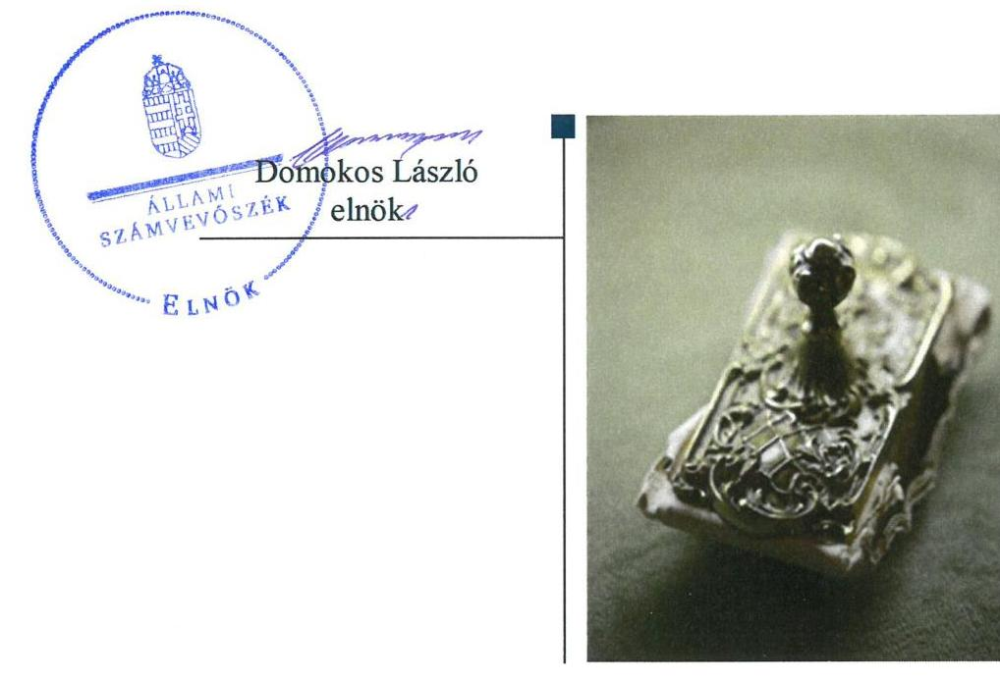
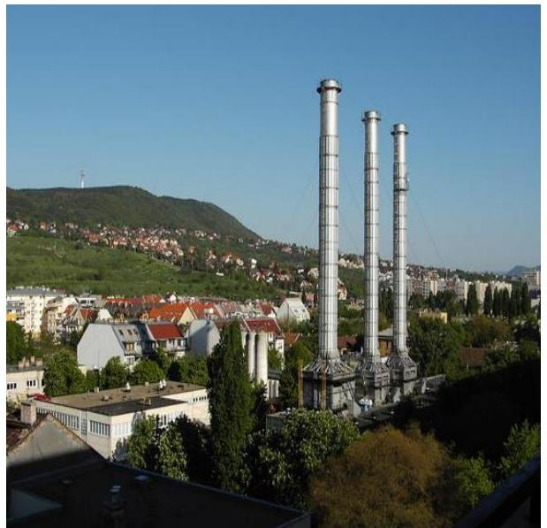
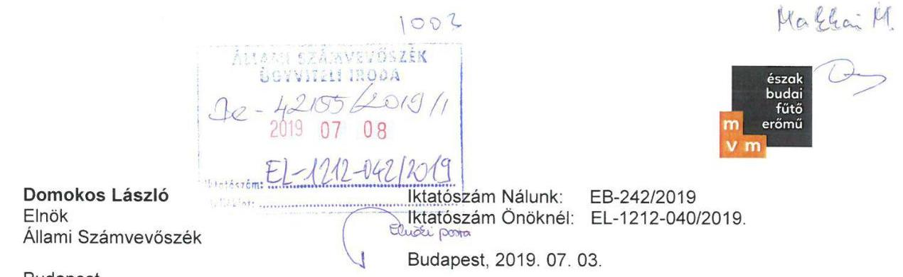
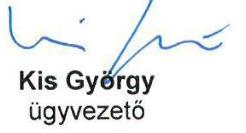
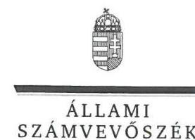
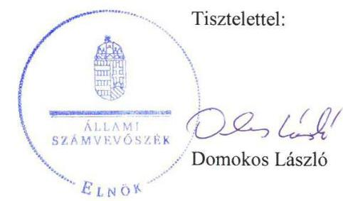

# Jellentés 

## Az állami tulajdonú gazdasági társaságok ellenőrzése

MVM Észak-Budai Kogenerációs Fűtőerőmú Korlátolt Felelősségű Társaság
2019.

---

# Jelentés 

## Az állami tulajdonú gazdasági társaságok ellenőrzése

MVM Észak-Budai Kogenerációs Fűtőerőmú Korlátolt Felelősségú Társaság
2019. 08. hó 27. nap

---

# AZ ELLENŐRZÉST FELÜGYELTE:

## MAKKAI MÁRIA felügyeleti vezető

## AZ ELLENŐRZÉST VEZETTE ÉS A VÉGREHAJTÁSÁÉRT FELELŐS:

### SALI SÁNDORNÉ ellenőrzésvezető

## A PROGRAM ÖSSZEÁLLÍTÁSÁÉRT FELELŐS:

### TÓTPÁL SZABOLCS osztályvezető

IKTATÓSZÁM: EL-1797-001/2019.

TÉMASZÁM: 2480

ELLENŐRZÉS-AZONOSÍTÓ SZÁM: V082414

Jelentéseink az Országgyűlés számítógépes hálózatán és az Interneta a www.asz.hu címen is olvashatóak.

---

# TARTALOMJEGYZÉK 

■ ÖSSZEGZÉS ..... 5
■ AZ ELLENŐRZÉS CÉLJA ..... 6
■ AZ ELLENŐRZÉS TERÜLETE ..... 7
■ AZ ELLENŐRZÉS HÁTTERE, INDOKOLTSÁGA ..... 8
■ A JELENTÉS LÉNYEGES KÉRDÉSKÖREI ..... 9
■ AZ ELLENŐRZÉS HATÓKÖRE ÉS MÓDSZEREI ..... 10
■ MEGÁLLAPÍTÁSOK ..... 12
■ JAVASLATOK ..... 14
■ MELLÉKLETEK ..... 15
I. sz. melléklet: Fogalomtár ..... 15
■ FÜGGELÉKEK ..... 17
I. sz. függelék a jelentéshez ..... 17
II. sz. függelék: Észrevételek ..... 18
■ RÖVIDÍTÉSEK JEGYZÉKE ..... 25

---

.

---

# ÖSSZEGZÉS 

Az MVM Észak-Budai Kogenerációs Fűtőerőmú Korlátolt Felelősségű Társaság müködésének szabályozottsága a jogszabályi előírásokkal nem volt összhangban. A Társaság gazdálkodása, vagyongazdálkodása nem volt szabályszerű. Az elszámoltathatóság és a vagyon védelme nem volt biztositott.

## Az ellenőrzés társadalmi indokoltsága

Az állami tulajdonú gazdálkodó szervezetek a nemzeti vagyon részét képezik. Gazdálkodásuk a közérdeklődés és a média figyelmének középpontjában áll. A közpénzt, közvagyont felhasználó állami tulajdonú gazdálkodó szervezetekkel szemben alapvető társadalmi igény, hogy múködésük, gazdálkodásuk szabályszerű, az általuk szolgáltatott adatok minél megbízhatóbbak legyenek. Az Állami Számvevőszék a közvagyon, a közpénzek szabályos, átlátható és elszámoltatható felhasználásának elősegítése érdekében, stratégiájával összhangban végzi az államháztartáson kívül múködő szervezetek ellenőrzését.

Az MVM Észak-Budai Kogenerációs Fűtőerőmű Korlátolt Felelősségű Társaság megfelelő múködése fontos az állami vagyon védelme szempontjából, emiatt került sor a Társaság ellenőrzésére.

## Főbb megállapítások, következtetések, javaslatok

Az MVM Észak-Budai Kogenerációs Fűtőerőmű Korlátolt Felelősségű Társaság szabályozottsága a számlarend hiánya miatt nem támogatta a jogszabály előírásoknak megfelelő múködést. A gazdálkodás keretében a bevételek és ráfordítások elszámolása nem volt szabályszerű a szabályozás hiányosságával összefüggésben. Ennek következtében a Társaságnál a könyvvezetés nem alapozta meg a számviteli törvényben előírt beszámoló készítését.

A vagyongazdálkodás nem volt szabályszerű. A Társaság a 2015-2017. években az éves beszámoló mérlegtételeit a számviteli törvényben foglaltak ellenére - az eszközöket és forrásokat mennyiségben és értékben tartalmazó leltárral nem támasztotta alá, ezért a valódiság elve az ellenőrzött időszakban nem érvényesült.

Az Állami Számvevőszék a jelentésben foglalt megállapítások alapján az MVM Észak-Budai Kogenerációs Fűtőerőmű Korlátolt Felelősségű Társaság úgyvezetőjének kettő javaslatot fogalmazott meg.

---

# AZ ELLENŐRZÉS CÉLJA 

Az ellenőrzés célja annak értékelése volt, hogy a gazdasági társaság szabályozottsága, gazdálkodása és vagyongazdálkodási tevékenysége megfelelt-e a jogszabályi és a tulajdonosi előírásoknak; biztosítva volt-e az ellátott feladatok átláthatósága és elszámoltathatósága érdekében a tevékenység díjának megalapozottsága szabályszerű önköltségszámítással. A vagyonváltozást eredményező döntések esetében a gazdasági társaság szabályszerűen járt-e el.

---

# **AZ ELLENŐRZÉS TERÜLETE**

## **MVM Észak-Budai Kogenerációs Fűtőerőmű Korlátolt Felelősségű Társaság**

### **AZ MVM ÉSZAK-BUDAI KOGENERÁCIÓS FŰTŐERŐMŰ**

Korlátolt Felelősségű Társaságot 2006-ban az MVM Zrt.1 alapította. A Társaság2 az MVM Csoport3 tagja, 100%-os tulajdonosa az MVM Zrt., jegyzett tőkéje 2183,7 M Ft, saját tőkéje 3000,7 M Ft volt a 2017. év végén.

A Társaság fő tevékenysége a villamosenergia-termelés, amely mellett hőenergia termelési feladatot is ellátott. A Társaság tevékenységével összefüggésben ágazati jogszabályként a Vet.4 vonatkozott.

A Társaság nem tartozott a kormányzati szektorba sorolt egyéb szervezetek közé, saját vagyonát használta, vagyonkezelésbe nem vett vagyont, közfeladatot nem látott el. Részesedéssel más gazdasági társaságban nem rendelkezett, továbbá a Számv. tv.5 155. § (2) bekezdése alapján könyvvizsgálatra kötelezett volt.

A Társaság a 2015-2017. években nyereségesen gazdálkodott. Az általa foglalkoztatottak létszáma 2017-ben 10 fő volt.

Az ügyvezető6 személye 2018. január 1-jétől változott. A Társaságnál a 2017. év végén háromtagú felügyelő bizottság működött.

---

# AZ ELLENŐRZÉS HÁTTERE, INDOKOLTSÁGA 

Az Alaptörvény 38. cikke alapján az állam tulajdona a nemzeti vagyon része. A nemzeti vagyon megőrzésének, védelmének és a nemzeti vagyonnal való felelős gazdálkodásnak a követelményeit sarkalatos törvény határozza meg. Az állami tulajdonú gazdasági társaságokra vonatkozó előírások betartásának ellenőrzése kiemelten fontos a vagyon megőrzése, megóvása érdekében. Gazdálkodásuk jellemzően a közérdeklődés és a média figyelmének középpontjában áll, amihez hozzájárul a gazdálkodásuk körébe tartozó - közvetlen vagy közvetett állami tulajdonú, tehát végső soron a nemzeti vagyon részét képező - vagyon nagysága.

Az ellenőrzés rámutathat az állami tulajdonú gazdasági társaságok gazdálkodási tevékenységével kapcsolatos jó gyakorlatokra és szabálytalanságokra. Felhívhatja a figyelmet a jogszabályi követelmények teljesítéséhez szükséges feltételek hiányosságaira, hozzájárulhat az államháztartáson kívüli, de (közvetlenül vagy közvetve) állami vagyont használó gazdasági társaságok tevékenységének átláthatóságához. Az ellenőrzés javaslatainak, megállapításainak hasznosítása hozzájárulhat a nemzeti vagyonnal való gazdálkodás átláthatóságának, elszámoltathatóságának javításához.

---

# A JELENTÉS LÉNYEGES KÉRDÉSKÖREI 

1. A társaság müködésének szabályozottsága megfelelt-e az előírásoknak?
2. A társaság gazdálkodása, vagyongazdálkodása, valamint adatszolgáltatási feladatainak ellátása szabályszerü volt-e?

---

# AZ ELLENŐRZÉS HATÓKÖRE ÉS MÓDSZEREI 

## Az ellenőrzés típusa

Megfelelőségi ellenőrzés.

## Az ellenőrzött időszak

Az ellenőrzött időszak a 2015-2017. évek, valamint a 2017. évi beszámoló jóváhagyása és közzététele tekintetében a 2018. június elsejéig tartó időszak.

## Az ellenőrzés tárgya

Az állami tulajdonban (résztulajdonban) lévő gazdasági társaság gazdálkodása, kiemelten vagyongazdálkodási tevékenysége.

## Az ellenőrzött szervezet

MVM Észak-Budai Kogenerációs Fűtőerőmű Korlátolt Felelősségű Társaság

## Az ellenőrzés jogalapja

Az ellenőrzés jogalapját az ÁSZ tv. ${ }^{7}$ 1. § (3) bekezdése és 5. § (3)-(5) bekezdései képezték.

## Az ellenőrzés módszerei

Az ellenőrzést a nemzetközi standardokat irányadónak tekintve az ellenőrzési program ellenőrzési kérdései, az ellenőrzött időszakban hatályos jogszabályok, az ellenőrzés szakmai szabályok és módszertanok figyelembe vételével végezte el az ÁSZ ${ }^{8}$.

Az ellenőrzés ideje alatt az ellenőrzött szervezettel történő kapcsolattartást az ÁSZ Szervezeti és Múködési Szabályzatának vonatkozó előírásai alapján biztosította az ÁSZ.

Az ellenőrzési kérdések megválaszolásához szükséges bizonyítékok megszerzése a következő ellenőrzési eljárások alkalmazásával történt: megfigyelés, kérdésfeltevés (információkérés), összehasonlítás, valamint elemző eljárás. Az ellenőrzési bizonyítékként felhasználható adatforrások közé tartoznak egyrészt az ellenőrzési programban felsorolt adatforrások,

---

másrészt adatforrás lehet még minden - az ellenőrzés folyamán - feltárt, az ellenőrzés szempontjából információkat tartalmazó dokumentum.

Az ellenőrzést a kérdésekre adott válaszok kiértékelésével, valamint a megjelölt adatforrások felhasználásával, továbbá az adott időszakban hatályos jogszabályok figyelembe vételével folytattuk le.

A 2015. és 2017. évi bevételek és a ráfordítások elszámolásának szabályszerűsége, valamint az értékcsökkenési leírás és a vagyonnyilvántartás szabályszerűsége esetében az ellenőrzés azokra a legnagyobb értékű tételekre - a lényeges sokaságra - terjedt ki, melyek összértéke eléri a teljes sokaság összértékének 50\%-át. A lényeges sokaságokat tételesen ellenőriztük. A 2015. és 2017. évi személyi jellegű kifizetések esetében a vezető tisztségviselők részére teljesített kifizetések tételes ellenőrzésére került sor.

---

# 1. A társaság múködésének szabályozottsága megfelelt-e az előírásoknak? 

Összegző megállapítás

A Társaság szabályozottsága nem támogatta a jogszabályi előírásoknak megfelelő múködést.

A SZABÁLYOZÁS keretében a Társaság a Számv. tv. előírásai szerint számviteli politikával ${ }^{9}$, leltározási szabályzattal ${ }^{10}$, értékelési szabályzattal ${ }^{11}$, pénzkezelési szabályzattal ${ }^{12}$, valamint önköltségszámítás rendjére vonatkozó szabályzattal rendelkezett, azok tartalma a Számv. tv. előírásaival összhangban volt. A Társaság a Vet. 105. § (2) bekezdésében foglaltak szerinti szétválasztási szabályokról a számviteli politikában, a költség- és eredményszámítási szabályzatban ${ }^{13}$, valamint a számviteli és szétválasztási szabályzatban ${ }^{14}$ rendelkezett.

A Társaság a 2015-2017. évek tekintetében a Számv. tv. 161. § (1) bekezdésében előírtak ellenére számlarenddel nem rendelkezett.

Az Alapító ${ }^{15}$ a Taktv. ${ }^{16}$ 5. § (3) bekezdésének előírása szerint a vezető tisztségviselők, felügyelőbizottsági tagok, valamint az Mt. ${ }^{17} 208$. § hatálya alá eső munkavállalók javadalmazásának, a jogviszony megszűnése esetére biztosított juttatások módjának, mértéke elveinek, annak rendszerének kereteit a Társaságra vonatkozóan megalkotta. A javadalmazási szabályzatot ${ }^{18}$ a Taktv. 5. § (3) bekezdése előírása szerint letétbe helyezték.

## 2. A társaság gazdálkodása, vagyongazdálkodása, valamint adatszolgáltatási feladatainak ellátása szabályszerű volt-e?

## Összegző megállapítás

A Társaság gazdálkodása, vagyongazdálkodása nem volt szabályszerű. Az adatszolgáltatási feladatok ellátása szabályszerű volt.

A Társaság gazdálkodásához, vagyongazdálkodásához kapcsolódó feladatés hatásköröket az SZMSZ ${ }^{19}$ és az Alapító okirat ${ }^{20}$ tartalmazta.

A GAZDÁLKODÁS keretében a bevételek és ráfordítások elszámolása nem volt szabályszerű. A Társaságnál a Számv. tv. 161. § (1) bekezdésében foglaltak ellenére a könyvvezetés - a számlarend hiányában - nem alapozta meg a Számv. tv.-ben előírt beszámoló készítését.

A Társaság a Vet., a számviteli politika, valamint a költség- és eredményszámítási szabályzat előírása szerinti szétválasztási szabályoknak eleget

---

tett. Továbbá a Számv. tv. 14. § (7) bekezdésében foglaltak szerint az előállított termékek, ellátott egyéb tevékenységek önköltségének megállapítására utókalkulációt végzett.

A VAGYONGAZDÁLKODÁS nem volt szabályszerű. A Társaság a 2015-2017. években az éves beszámoló mérlegtételeit - a Számv. tv. 69. § (1) bekezdésében és a leltározási szabályzat 5.2. pontjában foglaltak ellenére - az eszközöket és forrásokat mennyiségben és értékben tartalmazó leltárral nem támasztotta alá. Mindezek miatt a Számv. tv. 15. § (3) bekezdésében foglalt valódiság elve az ellenőrzött időszakban nem érvényesült.

AZ ADATSZOLGÁLTATÁSI FELADATOK ellátása szabályszerű volt. A Társaság az Alapító okiratban és az SZMSZ-ben előírt beszámolási, adatszolgáltatási feladatainak, üzleti tervkészítési kötelezettségének eleget tett. A Taktv.-ben előírt közérdekből nyilvános adatokat a Társaság közzétette.

---

# JAVASLATOK 

Az ÁSZ tv. 33. § (1) bekezdésében foglaltak értelmében az ellenőrzött szervezet vezetője köteles a jelentésben foglalt megállapításokhoz kapcsolódó intézkedési tervet összeállítani és azt a jelentés kézhezvételétől számított 30 napon belül az ÁSZ részére megküldeni. Amennyiben az ellenőrzött szervezet vezetője nem küldi meg határidőben az intézkedési tervet, vagy továbbra sem elfogadható intézkedési tervet küld, az Állami Számvevőszék elnöke az ÁSZ tv. 33. § (3) bekezdése a) és b) pontjaiban foglaltakat érvényesítheti.

## az MVM Észak-Budai Kogenerációs Fútőerőmú Korlátolt Felelősségú Társaság ügyvezetőjének

1. Intézkedjen a Számv. tv. előírásának megfelelő számlarend elkészítéséről.
(1. sz. megállapítás 2. bekezdése alapján)
2. Intézkedjen az éves beszámoló mérlegtételeit alátámasztó leltár jogszabályi előírásnak megfelelő elkészítéséről.
(2. sz. megállapítás 4. bekezdés második mondata alapján)

---

# MELLÉKLETEK 

- I. SZ. MELLÉKLET: FOGALOMTÁR
állami vagyon
gazdasági társaság
nemzeti vagyon
a) Az állam tulajdonában lévő dolog, valamint a dolog módjára hasznosítható természeti erő,
b) az a) pont hatálya alá nem tartozó mindazon vagyon, amely vonatkozásában törvény az állam kizárólagos tulajdonjogát nevesíti,
c) az állam tulajdonában lévő tagsági jogviszonyt megtestesítő értékpapír, illetve az államot megillető egyéb társasági részesedés,
d) az államot megillető olyan immateriális, vagyoni értékkel rendelkező jogosultság, amelyet jogszabály vagyoni értékű jogként nevesít.
e) az állam tulajdonában lévő pénzügyi eszközök.

Forrás: Vtv. ${ }^{21}$ 1. § (2) bekezdése
A gazdasági társaságok üzletszerű közös gazdasági tevékenység folytatására, a tagok vagyoni hozzájárulásával létrehozott, jogi személyiséggel rendelkező vállalkozások, amelyekben a tagok a nyereségből közösen részesednek, és a veszteséget közösen viselik.
Forrás: Ptk. ${ }^{22}$ 3:88. § (1) bekezdése
a) az állam vagy a helyi önkormányzat kizárólagos tulajdonában álló dolgok,
b) az a) pont hatálya alá nem tartozó, állam vagy a helyi önkormányzat tulajdonában lévő dolog,
c) az állam vagy a helyi önkormányzatot tulajdonában lévő pénzügyi eszközök, továbbá az államot vagy a helyi önkormányzatot megillető társasági részesedések,
d) az államot vagy a helyi önkormányzatot megillető bármely vagyoni értékkel rendelkező jogosultság, amelyet jogszabály vagyoni értékű jogként nevesít,
e) Magyarország határa által körbezárt terület feletti légtér,
f) az üvegházhatású gázok kibocsátási egységeinek kereskedelméről szóló törvény szerint kibocsátási egység és légiközlekedési kibocsátási egység, valamint az ENSZ Éghajlat változási Keretegyezménye és annak Kiotói Jegyzőkönyve végrehajtási keretrendszeréről szóló törvény szerinti kiotói egység,
g) állami vagy helyi önkormányzati fenntartású közgyűjtemény (muzeális intézmény, levéltár, közgyűjteményként működő kép- és hangarchívum, valamint könyvtár) saját gyűjteményében nyilvántartott kulturális javak körébe tartozó dolog, kivéve, ha az állami vagy önkormányzati tulajdon jogszerű létrejötte kétséget kizáró módon nem bizonyítható és a dologra nézve más a tulajdonjogát bizonyítja vagy a kulturális javakra vonatkozó jogszabályokban meghatározott eljárás keretében valószínűsíti (g. pont módosult 2013. december 7-től),
h) a régészeti lelet,
i) a nemzeti adatvagyon körébe tartozó állami nyilvántartások fokozottabb védelméről szóló törvény szerinti nemzeti adatvagyon.
Forrás: Nvtv. ${ }^{23}$ 1. § (2)

---

.

---

# FÜGGELÉKEK 

- I. SZ. FÜGGELÉK A JELENTÉSHEZ

Az Állami Számvevőszék az ellenőrzések során feltárt tényekhez kapcsolódó további körülmények tisztázására eszközrendszerrel nem rendelkezik. Amennyiben az ellenőrzésen túlmutatóan indokoltnak látszik az ellenőrzés során feltárt körülmények további vizsgálata, az Állami Számvevőszék törvényi felhatalmazás alapján az ellenőrzés által feltárt körülményeket továbbítja a hatáskörrel rendelkező szervnek a szükséges intézkedések megtétele, eljárások lefolytatása érdekében.
Az MVM Észak-Budai Kogenerációs Fütőerőmü Korlátolt Felelősségü Társaság az ellenőrzött időszakban a Számv. tv. 69. § (1) bekezdésében és a leltározási szabályzat 5.2. pontjában foglaltak ellenére az éves beszámoló mérlegtételeit leltárral nem támasztotta alá.
Az esetek konkrét körülményeinek feltárására a Nemzeti Adó- és Vámhivatal rendelkezik hatáskörrel.

---

A jelentéstervezetet a Számvevőszék 15 napos észrevételezésre megküldte az ellenőrzött szervezet vezetőjének az ÁSZ tv. 29. §* (1) bekezdése előírásának megfelelően.

Az MVM Észak-Budai Kogenerációs Fütőerőmú Korlátolt Felelősségü Társaság ügyvezetője élt az ÁSZ törvény 29.§ (2) bekezdésében foglalt észrevételezési lehetőséggel, a törvényes határidőn belül észrevételt tett. Az észrevételeket és az arra adott válaszokat a függelék tartalmazza.

[^0]
[^0]:    * 29. § (1) Az Állami Számvevőszék az ellenőrzési megállapításait megküldi az ellenőrzött szervezet vezetőjének vagy az általa megbízott személynek, és annak, akinek személyes felelősségét állapította meg.
    (2) Az ellenőrzött szervezet vezetője és a felelősként megjelölt személy az ellenőrzés megállapításaira tizenöt napon belül írásban észrevételt tehet.
    (3) Az Állami Számvevőszék az észrevételre a beérkezésétől számított harminc napon belül írásban válaszol. A figyelembe nem vett észrevételeket köteles a jelentésben feltüntetni, és megindokolni, hogy azokat miért nem fogadta el.

---

Budapest
Apáczai Csere János utca 10.
1052

# Tárgy: MVM Észak-Budai Fütöerömü Kft. számvevőszéki jelentéstervezet észrevételek 

Tisztelt Elnök Úr!
2019. június 21-én kaptuk kézhez az MVM Észak-Budai Fütöerömü Kft.-nél folytatott, „Az állami tulajdonú gazdasági társaságok ellenörzése - MVM Észak-Budai Kogenerációs Fütöerömü Korlátolt Felelősségü Társaság" témában készített számvevőszéki jelentéstervezetet. Élve a jogszabály adta lehetőséggel, a megállapításokkal, javaslatokkal kapcsolatos észrevételeinket az alábbiakban adjuk meg.
Az MVM Észak-Budai Fütöerömü Kft. az MVM Csoport tagjaként, a jogszabályok által meghatározott keretek között, a Társaság Alapszabályában szereplő Uralmi Klauzulában foglaltaknak megfelelően, a csoportszintü irányítási rendszer és a szabályzatok alapul vételével müködik és gazdálkodik. Az MVM Csoport csoportszintü szabályzatai az Elismert Vállalatcsoportba tartozó társaságok számára kötelezően alkalmazandóak.
A jelentéstervezetben tett megállapításokkal és javaslatokkal kapcsolatos észrevételek:

1. számú összegző megállapítás: A Társaság szabályozottsága nem támogatta a jogszabályi előírásoknak megfelelő müködést.
A megállapítást a T. Állami Számvevőszék a számlarend hiányára alapozza, amellyel nem értünk egyet. A Társaság a 2015-2017. évi beszámolóinak összeállításához, az ezt megalapozó könyvelések, kontírozások elvégzéséhez a CsSz-32 számú Az MVM Csoport számlarendjéről szóló csoportszintü szabályzatot alkalmazta, melynek alkalmazását a szabályzat tárgyi és személyi hatályában foglaltak írják elő kötelező érvénnyel azon társaságokra, amelyek ügyviteli feladataikat az Ügyviteli Szolgáltató Központon (a vizsgált időszakban MVM KONTÓ Zrt., jogutódja a Nemzeti Üzleti Szolgáltató Zrt.) keresztül látják el. A vonatkozó csoportszintü szabályzatokat az Állami Számvevőszék részére megküldött dokumentáció tartalmazta.
A szabályzat 2.2 Személyi hatály alapján a „szabályzat hatálya kiterjed az MVM Zrt.re mint uralkodó tagra, és az MVM Csoport elismert vállalatcsoportba tartozó ellenörzött társaságaira."
Tekintettel arra, hogy az MVM Észak-Budai Fütöerömü Kft. ügyviteli feladatait az Ügyviteli Szolgáltató Központ látta el a vizsgált időszakban és látja el a mai napig is, ezért a Társaság a csoportszintü szabályzatban rögzített számlarendet köteles alkalmazni.

---

Fenti indokok alapján kérjük a csoportszintü számlarend alkalmazásának elfogadását, az 1. számú megállapítás 2. bekezdésének módosítását, valamint az összegző megállapítás felülvizsgálatát és az 1. sz. javaslat törlését.
2. számú összegző megállapítás: A Társaság gazdálkodása, vagyongazdálkodása nem volt szabályszerű.

A megállapítás 2. bekezdése kapcsán a számlarend hiányára vonatkozó megállapítás felülvizsgálatát és módosítását kérjük az előző pontban tett észrevételeink, indokaink alapján.

A 2. számú megállapítás 4. bekezdésében szerepel a mérlegtételek alátámasztására vonatkozó megállapítás. A megállapítások vagyongazdálkodásra vonatkozó második mondatával, azaz azzal, hogy „A Társaság a 2015-2017. években az éves beszámoló mérlegtételeit - a Számv. tv. 69. § (1) bekezdésében és a leltározási szabályzat 5.2 pontjában foglaltak ellenére - az eszközöket és forrásokat mennyiségben és értékben tartalmazó leltárral nem támasztotta alá", nem értünk egyet.

A Társaság 2015. évre nem készített mérlegleltárt, azonban a 2016-2017. évi mérlegleltár elkészült és az Állami Számvevőszék részére átadásra került.
A leltározás mennyiségi adatainak rögzítése nem szükséges, mivel az SAP rendszerben vezetett nyilvántartásainkban egy-egy eszközsor egy-egy eszközt jelent, tehát a leltár egyedi tételeket tartalmaz. Az átadott mérlegleltárakban az értékek minden tételre vonatkozóan fel vannak tüntetve.

Tekintettel a Társaság gazdálkodására, és a vagyongazdálkodásra vonatkozó fenti észrevételekre, a beszámoló mérlegtételei (2016-2017. évek vonatkozásában) leltárral alátámasztottak, kérjük a vonatkozó megállapítások módosítását és 2. sz. javaslat törlését.

Amennyiben a fenti indoklással kapcsolatosan kérdés merül fel, azok megválaszolásában állunk szíves rendelkezésre.

Tisztelettel:

Rák Aida
müszaki vezető

---

# Kís György 

ügyvezető
MVM Észak-Budai Kogenerációs Fütőerőmű Korlátolt Felelősségű Társaság

## Budapest

## Tisztelt Ügyvezető Úr!

„Az állami tulajdonú gazdasági társaságok ellenőrzése - MVM Észak-Budai Kogenerációs Fütőerőmü Korlátolt Felelősségü Társaság"címmel készített számvevőszéki jelentéstervezetre tett észrevételét köszönettel megkaptam.

Az Állami Számvevőszék észrevételre vonatkozó álláspontjáról a felügyeleti vezető által készített részletes tájékoztatást mellékelten megküldőm.

Tájékoztatom Ügyvezető urat, hogy a számvevőszéki jelentésben - az Állami Számvevőszékről szóló 2011. évi LXVI. törvény 29. § (3) bekezdése alapján - a figyelembe nem vett észrevételt szerepeltetjük, annak indoklásával, hogy azt az Állami Számvevőszék miért nem fogadta el.

Budapest, 2019. 08 hó 02. nap

Melléklet: Tájékoztatás az észrevétel kezeléséről

---

# Tájékoztatás   az észrevétel kezeléséről 

„Az állami tulajdonú gazdasági társaságok ellenőrzése - MVM Észak-Budai Kogenerációs Fütőerőmü Korlátolt Felelősségü Társaság"címủ jelentéstervezetre 2019. július 8 -án érkezett észrevételt áttekintettük, annak kezelésével kapcsolatban a következő tájékoztatást adom.

1. A jelentéstervezet 1. összegző megállapításával és az azt alátámasztó, a számlarend hiányára vonatkozó megállapítással kapcsolatban tett észrevételre adott válasz
Az észrevételben tájékoztatás szerepel arról, hogy az MVM Észak-Budai Kogenerációs Fütőerőmű Korlátolt Felelősségủ Társaságra (továbbiakban: Társaság) kötelezően vonatkoznak a CsSz-32 számú, „Az MVM Csoport számlarendjéről szóló szabályzata" című számlarendek. Ez alapján a számlarend hiányára vonatkozó megállapítás (1. számú megállapítás 2. bekezdés), valamint a szabályozottság jogszabályi előírásokkal való összhangjának hiányára vonatkozó összegző megállapítás felülvizsgálatát és a kapcsolódó 1. számú javaslat törlését kéri a Társaság.
A számvitelről szóló 2000. évi C. törvény (továbbiakban: Számv. tv.) 161. § (4) bekezdése szerint a számlarend összeállításáért, annak folyamatos karbantartásáért, a naprakész könyvvezetés helyességéért a gazdálkodó képviseletére jogosult személy a felelős. Az észrevételben hivatkozott csoportszintủ számlarendek nem tartalmazzák a Társaság képviseletére jogosult személy kiadmányozását.
A csoportszintủ szabályzatok 2.2. pontja előírja, hogy a szabályzat hatálya alá tartozó társaságok a rájuk vonatkozó esetekben és mértékben kötelesek betartani a szabályzat előírásait, amennyiben azok nem ütköznek a társaság müködési engedélyében vagy a vonatkozó jogszabályokban foglaltakkal. Tartalmazza továbbá, hogy a társaságok által kialakított belső szabályzatok, eljárásrendek, belső utasítások nem állhatnak ellentétben a csoport szintủ szabályzat előírásaival, annak tartalmát, hatályát, hatáskörét nem szükíthetik, illetve csorbíthatják.
A fentiek alapján a Társaságnak a képviseletére jogosult kiadmányozását tartalmazó számlarenddel rendelkeznie kell, amelyet a csoportszintủ számlarendek előírásainak betartásával szükséges elkészíteni. Mindezek alapján az észrevételt nem fogadjuk el, a jelentéstervezet módosítása nem indokolt.

## 2. A jelentéstervezet 2. pontja összegző megállapításával és az azt alátámasztó megállapításokkal kapcsolatban tett észrevételekre adott válasz

A) Az észrevételben a számlarend hiányára vonatkozó megállapítás felülvizsgálata alapján a bevételek és ráfordítások nem szabályszerű elszámolására tett megállapítás (2. számú megállapítás 2 . bekezdés) felülvizsgálatát és módosítását kérte a Társaság.
A számlarend hiányával összefüggésben tett észrevételre az 1. pontban adott válasz alapján a jelentéstervezet 2 . pontja 2 . bekezdésének módosítása nem indokolt.

---

B) Az észrevétel a mérleg leltárral való alátámasztásának hiányára vonatkozó megállapítást kifogásolja, kéri a megállapítás módosítását és a 2. javaslat törlését.
A Számv. tv. 69. § (1) bekezdése szerint a könyvek üzleti év végi zárásához, a beszámoló elkészítéséhez, a mérleg tételeinek alátámasztásához olyan leltárt kell összeállítani, amely tételesen, ellenőrizhető módon tartalmazza a vállalkozónak a mérleg fordulónapján meglévő eszközeit és forrásait mennyiségben és értékben. A Társaság megerősíti a jelentéstervezetnek azt a megállapítását, hogy 2015-ben nem készített a mérleget alátámasztó leltárt, továbbá azt, hogy a 2016-2017. évi leltárak a mennyiségi adatokat nem tartalmazták. Mindezek alapján a jelentéstervezet módosítása nem indokolt.

Budapest, 2019. 08. hó 02. nap

Makkai Mária
felügyeleti vezető

---

.

---

# RÖVIDÍTÉSEK JEGYZÉKE 

${ }^{1}$ MVM Zrt.
${ }^{2}$ Társaság
${ }^{3}$ MVM csoport
${ }^{4}$ Vet.
${ }^{5}$ Számv. tv.
${ }^{6}$ ügyvezető
${ }^{7}$ ÁSZ tv.
${ }^{8}$ ÁSZ
${ }^{9}$ számviteli politika
${ }^{10}$ leltározási szabályzat
${ }^{11}$ értékelési szabályzat
${ }^{12}$ pénzkezelési szabályzat
${ }^{13}$ költség- és eredményszámítási szabályzat
${ }^{14}$ számviteli és szétválasztási szabályzat
${ }^{15}$ Alapító
${ }^{16}$ Taktv.
${ }^{17} \mathrm{Mt}$.
${ }^{18}$ javadalmazási szabályzat
${ }^{19}$ SZMSZ
${ }^{20}$ Alapító okirat
${ }^{21}$ Vtv.
${ }^{22}$ Ptk.
${ }^{23} \mathrm{Nvtv}$.

Magyar Villamos Művek Zártkörűen Működő Részvénytársaság
MVM Észak-Budai Kogenerációs Fűtőerőmú Korlátolt Felelősségű Társaság
az MVM Zrt. tulajdonában álló, alapvetően energiaszolgáltatáshoz kapcsolódó társaságok együttműködő csoportja, Magyarország nemzeti villamos társaságcsoportja. A Ptk. 3:49. § szerinti elismert vállalatcsoport, melynek uralkodó tagja, azaz a csoporttagok felett az irányítói jogokat gyakorló szervezet az MVM Zrt.
a villamos energiáról szóló 2007. évi LXXXVI. törvény (hatályos: 2007. október 15-től)
2000 évi C törvény a számvitelről (hatályos: 2001. január 1-jétől)
az MVM Észak-Budai Kogenerációs Fűtőerőmú Korlátolt Felelősségű Társaság ügyvezetője
2011. évi LXVI. törvény az Állami Számvevőszékről (hatályos: 2011. július 1-jétől)

Állami Számvevőszék
az MVM Észak-Budai Kogenerációs Fűtőerőmű Korlátolt Felelősségű Társaság számviteli politikája (hatályos: 2013. január 1-jétől)
az MVM Észak-Budai Kogenerációs Fűtőerőmű Korlátolt Felelősségű Társaság leltározási szabályzata és módosítása (hatályos: 2009. október 31-étől, módosítása 2017. március 14-étől)
az MVM Észak-Budai Kogenerációs Fűtőerőmű Korlátolt Felelősségű Társaság értékelési szabályzata (hatályos: 2009. október 31-étől)
az MVM Észak-Budai Kogenerációs Fűtőerőmű Korlátolt Felelősségű Társaság pénzkezelési szabályzata és módosítása (hatályos: 2011. január 1-jétől, módosítása 2017. január 19-étől)
az MVM Észak-Budai Kogenerációs Fűtőerőmű Korlátolt Felelősségű Társaság költség- és eredményszámítási szabályzata és módosításai (hatályos: 2013. augusztus 1-jétől, módosításai 2015. december 19-étől és 2016. július 22-étől)
az MVM Észak-Budai Kogenerációs Fűtőerőmű Korlátolt Felelősségű Társaság számviteli szétválasztási szabályzata (hatályos: 2017. január 1-jétől)
Magyar Villamos Múvek Zártkörűen Múködő Részvénytársaság
a köztulajdonban álló gazdasági társaságok takarékosabb müködéséről szóló 2009. évi CXXII. törvény (hatályos: 2009. december 4-étől)
a Munka Törvénykönyvéről szóló 2012. I. törvény (hatályos: 2012. július 1-jétől)
az MVM Észak-Budai Kogenerációs Fűtőerőmű Korlátolt Felelősségű Társaság javadalmazási szabályzata és módosítása (hatályos 2013. május 15-étől, módosítása 2016. április 1-jétől)
az MVM Észak-Budai Kogenerációs Fűtőerőmű Korlátolt Felelősségű Társaság Szervezeti és Müködési Szabályzata, hatályos: 2012.október 11-étől)
az MVM Észak-Budai Kogenerációs Fűtőerőmű Korlátolt Felelősségű Társaság Alapító okirata és módosításai
az állami vagyonról szóló 2007. évi CVI. törvény (hatályos: 2007. szeptember 25-étől)
a Polgári Törvénykönyvről szóló 2013. évi V. törvény (hatályos: 2013. február 26-ától)
a nemzeti vagyonról szóló 2011. évi CXCVI. törvény (hatályos: 2012. január 1-jétől)

---

# ÁLLAMI SZÁMVEVŐSZÉK 

1052 Budapest, Apáczai Csere János utca 10.
Levélcím: 1364 Budapest 4. Pf. 54
Telefon: +36 14849100 Telefax: +36 14849200
www.asz.hu