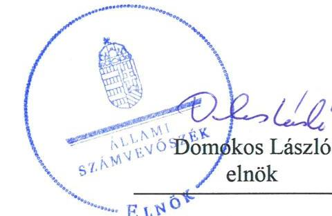
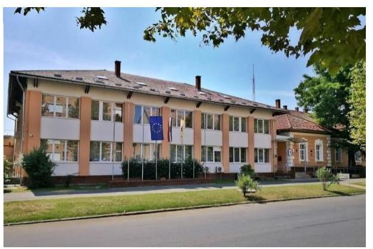
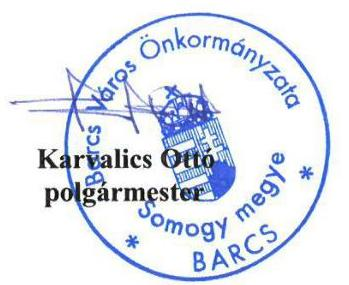
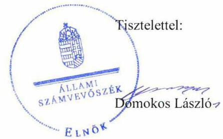

# Jelentés 

## Önkormányzatok ellenőrzése Integritás- és belső kontrollrendszer

Barcs Város Önkormányzata 2019.

---

# Jelențtés 

## Önkormányzatok ellenőrzése Integritás- és belsó kontrollrendszer

Barcs Város Önkormányzata
2019. 10. hó 25. nap

---

# AZ ELLENŐRZÉST FELÜGYELTE:

DR. NAGY IMRE felügyeleti vezető

# AZ ELLENŐRZÉST VEZETTE ÉS A VÉGREHAJTÁSÁÉRT FELELŐS:

DR. DOMOKOS MAGDOLNA ellenőrzésvezető

# A PROGRAM ÖSSZEÁLLÍTÁSÁÉRT FELELŐS:

TÓTPÁL SZABOLCS osztályvezető

---

**IKTATÓSZÁM:** EL-1798-001/2019.

**TÉMASZÁM:** 2485

**ELLENŐRZÉS-AZONOSÍTÓ SZÁM:** V082955

---

Jelentéseink az Országgyűlés számítógépes hálózatán és az Interneta a www.asz.hu címen is olvashatóak.

---

# TARTALOMJEGYZÉK 

■ ÖSSZEGZÉS ..... 5
■ AZ ELLENŐRZÉS CÉLJA ..... 6
■ AZ ELLENŐRZÉS TERÜLETE ..... 7
■ AZ ELLENŐRZÉS HÁTTERE, INDOKOLTSÁGA ..... 8
■ A JELENTÉS LÉNYEGES KÉRDÉSKÖREI ..... 9
■ AZ ELLENŐRZÉS HATÓKÖRE ÉS MÓDSZEREI ..... 10
■ MEGÁLLAPÍTÁSOK ..... 12
■ JAVASLATOK ..... 14
■ MELLÉKLETEK ..... 17
I. sz. melléklet: Értelmező szótár ..... 17
■ FÜGGELÉK: ÉSZREVÉTELEK ..... 19
■ RÖVIDÍTÉSEK JEGYZÉKE ..... 31

---

.

---

# ÖSSZEGZÉS 

Barcs Város Önkormányzatánál a belső kontrollrendszerben feltárt szabálytalanságok miatt nem volt biztositott az átláthatóság, elszámoltathatóság, a közpénzfelhasználás szabályossága és a nemzeti vagyonnal történő felelős gazdálkodás. A korrupció megelőzését támogató integritási kontrollok kiépitése nem történt meg, ezáltal nem voltak biztositottak a korrupcióval szembeni védelem feltételei.

## Az ellenőrzés társadalmi indokoltsága

Az Állami Számvevőszék alapvető feladata a közpénzekkel, az állami és önkormányzati vagyonnal való gazdálkodás ellenőrzése. Az Alaptörvény szerint az önkormányzatok kötelezettsége a kiegyensúlyozott, átlátható és fenntartható költségvetési gazdálkodás elvének érvényesítése, a nemzeti vagyonnal való rendeltetésszerű és felelős módon való gazdálkodás biztosítása. Az Állami Számvevőszék stratégiájában megfogalmazott célkitűzése az integritás alapú, átlátható és elszámoltatható közpénzfelhasználás elősegítése. Ennek megvalósítása érdekében az Állami Számvevőszék prioritásként kezeli a közpénzzel gazdálkodó szervezetek esetében a belső kontrollrendszer múködésének ellenőrzését.

## Főbb megállapítások, következtetések, javaslatok

Barcs Város Önkormányzata nem szabályszerű kontrollkörnyezetben múködött, mert a Polgármesteri Hivatal nem rendelkezett számviteli politikával, számlarenddel, valamint gazdasági szervezetének ügyrendjével, továbbá az Önkormányzat nem rendelkezett számlarenddel.

Barcs Város Önkormányzatánál az integrált kockázatkezelési rendszer kialakítása nem volt szabályszerű, mert a Polgármesteri Hivatalnál az alapvető, jogszabály által előírt integrált kockázatkezelés eljárásrendjét nem készítették el, ezáltal nem voltak biztosítottak a kockázatok azonosításának és kezelésének szabályai.

Barcs Város Önkormányzatánál a kontrolltevékenységeket szabályszerűen végezték. Az információs és kommunikációs rendszer kialakítása nem volt szabályszerű, tekintettel arra, hogy az Önkormányzat nem rendelkezett iratkezelési szabályzattal, és adatvédelmi és adatbiztonsági szabályzattal.

Barcs Város Önkormányzatánál a korrupció megelőzését támogató integritási kontrollok kiépítése nem történt meg, ezáltal nem voltak biztosítottak a korrupcióval szembeni védelem feltételei.

Barcs Város Önkormányzatánál a teljesítménymérésre alkalmas követelmények kialakításának hiányában nem volt biztosított az államháztartás pénzeszközeivel és a nemzeti vagyonnal történő gazdaságos, hatékony és eredményes gazdálkodás mérésének lehetősége.

Az Állami Számvevőszék Barcs Város Önkormányzat Polgármestere részére az Önkormányzat számlarendjének összeállítása és a vagyonnyilatkozatok részletszabályainak kialakítása vonatkozásában fogalmazott meg javaslatot. Az Állami Számvevőszék a Barcsi Polgármesteri Hivatal jegyzője részére a jogszabályok szerinti gazdasági szervezet ügyrendjének, a Polgármesteri Hivatal számviteli politikájának, számviteli rendjének, integrált kockázatkezelési eljárásrendjének elkészítése, az Önkormányzat iratkezelési szabályzatának kiadása, a belső ellenőrzésekhez kapcsolódó intézkedési terv elkészítése, a jogszabály szerinti nyilvántartás vezetése, valamint a vagyonnyilatkozatok részletszabályainak kialakítása kapcsán fogalmazott meg javaslatot. Az érintettnek a javaslatokra 30 napon belül intézkedési tervet kell készítenie.

---

# AZ ELLENŐRZÉS CÉLJA 

Az ellenőrzés célja annak megállapítása volt, hogy Barcs Város Önkormányzatának belső kontrollrendszere biztosí-totta-e a közpénzekkel és a nemzeti vagyonnal történő elszámoltatható, átlátható, szabályszerű, gazdaságos, hatékony és eredményes gazdálkodás feltételeit. Az ellenőrzés keretében értékeljük továbbá, hogy az önkormányzatnál kiépítették és erősítették-e a korrupciós kockázatok kezelését szolgáló integritás kontrollokat és azt, hogy megte-remtették-e a teljesítményellenőrzés feltételeit.

---

# **AZ ELLENŐRZÉS TERÜLETE**

## **Barcs Város Önkormányzata**

A Somogy megyei Barcs város lakosainak száma a Központi Statisztikai Hivatal közigazgatási helynévkönyve alapján 2017. január 1-jén 10667 fő volt.

Az Önkormányzat¹ tizenkét tagú képviselő-testületének munkáját három állandó bizottság segítette. A településen Német-, Roma- és Horvát nemzetiségi önkormányzat működött.

A polgármester² 2014. október 12. napjától tölti be tisztségét, a jegyző³ 2000. július 1-jei kinevezése óta látja látta el feladatait a Polgármesteri Hivatal⁴ vezetőjeként.

Az Önkormányzat tulajdonosi joggyakorlója három gazdasági társaságnak, a BARCS VÁROS Befektető-beruházó Kft-nek, a BARCSTEX Szociális Foglalkoztató Nonprofit Kft-nek és a Drávamenti Kistérségi Orvosi Ügyelet Nonprofit Kft-nek.

Az Önkormányzat 2017. évi költségvetési beszámolója⁵ szerint 2,6 milliárd forint költségvetési bevételt ért el, valamint 522 millió Ft költségvetési kiadást teljesített, vagyonának értéke 2017. december 31-én 10,3 milliárd forint volt.

---

# AZ ELLENŐRZÉS HÁTTERE, INDOKOLTSÁGA 

A demokratikus társadalmakban alapvető igény, hogy a közpénzeket, a közvagyont használók tevékenységükről elszámoljanak, ahhoz egyértelmű és érvényesíthető felelősségi szabályok társuljanak. Ennek a jogos igénynek az érvényesítéséhez meg kell teremteni azokat a folyamatokat, rendszereket, amelyek nélkülözhetetlenek az elszámoltatáshoz. Az elszámoltatás eredményes működtetéséhez szükség van a megfelelő információs, kontroll-, értékelési és beszámolási rendszerek kialakítására. A belső kontrollok kiépítettsége hozzájárul az integritási szemlélet kialakításához és érvényesüléséhez. A belső kontrollrendszer kialakítása és működtetése nélkül nem valósítható meg a közpénzek, a közvagyon szabályos, gazdaságos, hatékony és eredményes felhasználása.

A BELSŐ KONTROLLRENDSZER azt a célt szolgálja, hogy az államháztartás szervei működésük és gazdálkodásuk során a tevékenységeket szabályszerűen, gazdaságosan, hatékonyan, eredményesen hajtsák végre, teljesítsék elszámolási kötelezettségeiket, és megvédjék az erőforrásokat a veszteségektől, a károktól, a nem rendeltetésszerű használattól. A belső kontrollrendszer magában foglalja mindazon szabályokat, eljárásokat, gyakorlati módszereket és szervezeti struktúrákat, kockázatkezelési technikákat, kontrolltevékenységeket, amelyek segítséget nyújtanak a szervezetnek céljai eléréséhez.

A megfelelő belső kontrollrendszer jelentősen csökkenti a hibák és szabálytalanságok kockázatát. Az ÁSZ célja, hogy javuljon az ellenőrzött önkormányzatok belső kontrollrendszerének szabályozottsága, működésének megfelelősége, szabályszerűsége, hozzájárulva ezzel az egyensúlyi helyzet fenntarthatóságának biztosításához, biztosítva az önkormányzatnál a közpénzfelhasználás szabályosságát, a közpénzekkel és a nemzeti vagyonnal történő szabályszerű, gazdaságos, hatékony és eredményes gazdálkodást.

AZ ELLENŐRZÉS VÁRHATÓ HASZNOSULÁSA négy szinten valósul meg. A törvényalkotás számára összegzett tapasztalatok állnak rendelkezésre a belső kontrollrendszer önkormányzati területen való kialakításáról, működtetéséről és hatásairól. Az ellenőrzés az ellenőrzött számára visszajelzést ad a belső kontrollrendszer kialakításában és működésében lévő hiányosságokról, javaslataival hozzájárul azok kiküszöböléséhez. Az ellenőrzés megállapításait és javaslatait más szervezetek is hasznosíthatják a rendezett gazdálkodási keretek kialakításához, a ,,jó gyakorlat" elterjesztésével azok az önkormányzatok is átvehetik a pozitív példákat, ahol nem végez ellenőrzést az ÁSZ.

Az ÁSZ ellenőrzései jelzik a társadalom számára, hogy közpénz nem maradhat ellenőrizetlenül, tevékenysége hozzájárul az értékteremtő rend kialakításához és megőrzéséhez.

---

# A JELENTÉS LÉNYEGES KÉRDÉSKÖREI 

1. Az önkormányzat belső kontrollrendszerének kialakítása és müködtetése szabályszerű volt-e, az biztositotta-e az önkormányzatnál a közpénzfelhasználás szabályosságát, a nemzeti vagyonnal történő felelős gazdálkodást?
2. Az önkormányzat alakitott-e ki teljesitmény mérésére alkalmas követelményeket?

---

# AZ ELLENŐRZÉS HATÓKÖRE ÉS MÓDSZEREI 

## Az ellenőrzés típusa

Megfelelőségi ellenőrzés.

## Az ellenőrzött időszak

2017. év, illetve az éves költségvetési beszámoló Áht. ${ }^{6}$ által megállapított jóváhagyásáig (2018. május 31-éig) tartó időszak.

## Az ellenőrzés tárgya

Barcs Város Önkormányzata és a gazdálkodási feladatokat ellátó Barcsi Polgármesteri Hivatal belső kontrollrendszerének kialakítása és múködtetése, valamint az integritás kontrollok kiépítettsége, a teljesítményellenőrzés feltételei.

## Az ellenőrzött szervezet

Barcs Város Önkormányzata és a Barcsi Polgármesteri Hivatal.

## Az ellenőrzés jogalapja

Az ellenőrzés jogszabályi alapját az ÁSZ tv7. 1. § (3) bekezdés, 5. § (2) és (6) bekezdései, valamint az Áht. 61. § (2) bekezdésének előírásai képezik.

## Az ellenőrzés módszerei

Az ÁSZ az ellenőrzést az ellenőrzési program szempontjai, az ellenőrzött időszakban hatályos jogszabályok, az ellenőrzés szakmai szabályai, a jelen ellenőrzésre irányadó ÁSZ módszertanok figyelembevételével hajtotta végre.

Az ellenőrzés ideje alatt az ellenőrzött szervezettel történő kapcsolattartást az ÁSZ SZMSZ ${ }^{8}$-ének vonatkozó előírásai alapján biztosította az ÁSZ.

Az ellenőrzési kérdések megválaszolásához szükséges bizonyítékok megszerzése az ellenőrzött által rendelkezésre bocsátott dokumentumokra, adatokra alapozva megfigyelés, szemle (szemrevételezés), valamint elemző eljárás útján történt.

Az ellenőrzési bizonyítékként felhasználható adatforrások közé tartoznak az ellenőrzési program részletes szempontjainál felsorolt adatforrások,

---

valamint minden egyéb - az ellenőrzés folyamán feltárt, az ellenőrzés szempontjából információt tartalmazó - dokumentum.

A 2017. évi kiadások teljesítéséhez kapcsolódó pénzgazdálkodási belső kontrollok múködésének szabályszerűsége esetében az ellenőrzés azokra a legnagyobb értékű tételekre - a lényeges sokaságra - terjedt ki, melyek összértéke eléri a teljes sokaság összértékének 50\%-át. A 2017. évi kiadások esetében a lényeges sokaságot tételesen ellenőriztük.

Az önkormányzat belső kontrollrendszerének összesített értékelése az egyes részterületek esetében kapott megfelelőségi arányok számtani átlaga alapján történik és megegyezik a pillérenként (kontroll-területenként) alkalmazott százalékos értékelésekkel, a következő eltérésekkel: a kontrollrendszer egésze esetében a „szabályszerű" értékelésnek a százalékos értéken felül további feltétele, hogy egyik kontrollterület sem kaphat „nem szabályszerű" értékelést.

Amennyiben az önkormányzat múködését és gazdálkodását alapvetően meghatározó dokumentum hiánya miatt, valamely lényeges kérdéskörre vonatkozóan az ÁSZ megállapítást tett, további ellenőrzési tevékenységek az adott kérdéskörrel és az azzal szoros logikai kapcsolatban lévő kérdéskörökkel - ráépülő jelleggel - nem kerültek végrehajtásra.

---

# MEGÁLLAPÍTÁSOK 

## 1. Az önkormányzat belső kontrollrendszerének kialakítása és múködtetése szabályszerű volt-e, az biztosította-e az önkormányzatnál a közpénzfelhasználás szabályosságát, a nemzeti vagyonnal történő felelős gazdálkodást?

Összegző megállapítás

Az Önkormányzatnál a belső kontrollrendszer kialakítása és múködtetése nem volt szabályszerű, az nem biztosította a közpénzfelhasználás szabályosságát, a nemzeti vagyonnal történő felelős gazdálkodást.

## AZ ÖNKORMÁNYZAT NEM SZABÁLYSZERŰ KONTROLLKÖRNYEZETBEN múködött.

A jegyző nem gondoskodott
$\longrightarrow$ a Polgármesteri Hivatalnál az Ávr. ${ }^{9}$ 10/A. §-ban foglaltak ellenére a Polgármesteri Hivatal gazdasági szervezete ügyrendjének elkészítéséről;
$\longrightarrow$ a Polgármesteri Hivatalnál az Áhsz. ${ }^{10}$ 50. § (1) bekezdése ellenére a számviteli politika elkészítéséről;
$\longrightarrow$ a Polgármesteri Hivatalnál az Áhsz. 51. § (2) bekezdése előírása ellenére a számlarend elkészítéséről;
$\longrightarrow$ az Polgármesteri Hivatalnál a Vnytv. ${ }^{11}$ 11. § (6) bekezdése ellenére a vagyonnyilatkozatok átadásra, nyilvántartására és a vagyonnyilatkozatban foglalt személyes adatok védelmére vonatkozó szabályok megállapításáról;
A polgármester nem gondoskodott a Számv. tv. ${ }^{12}$ 161. § (1) és (4) bekezdése ellenére az Önkormányzat számlarendjének összeállításáról.

Az Önkormányzat nem gondoskodott a Vnytv. 11. § (6) bekezdése ellenére a vagyonnyilatkozatok átadásra, nyilvántartására és a vagyonnyilatkozatban foglalt személyes adatok védelmére vonatkozó szabályok megállapításáról.

## AZ INTEGRÁLT KOCKÁZATKEZELÉSI RENDSZER KIALAKÍTÁSA NEM VOLT SZABÁLYSZERŰ, mert a

jegyző a Bkr. ${ }^{13}$ 3. § b) pontja ellenére nem alakította ki az integrált kockázatkezelési rendszert a Bkr. 6. § (4) bekezdésében előírtak ellenére nem szabályozta a Polgármesteri Hivatal integrált kockázatkezelés eljárásrendjét.

## A KONTROLLTEVÉKENYSÉGEK MÚKÖDTETÉSE

SZABÁLYSZERŰ VOLT. Az Önkormányzat az Ávr. által előírt gazdálkodási jogkörgyakorlásra jogosult személyek aláírás-mintáit tartalmazó nyilvántartást vezette.

---

# AZ INFORMÁCIÓS ÉS KOMMUNIKÁCIÓS RENDSZER KIALAKÍTÁSA NEM VOLT SZABÁLYSZERŰ, 

mert a jegyző az Önkormányzat vonatkozásában nem gondoskodott az Ltv. ${ }^{14} 9 . \S$ (4) bekezdésének és $10 . \S$ (1) bekezdésének a) pontjának előírása ellenére iratkezelési szabályzat kiadásáról, továbbá az Info tv. ${ }^{15}$ 24. § (3) bekezdése ellenére adatvédelmi és adatbiztonsági szabályzat elkészítéséről.

## A MONITORING RENDSZER MŰKÖDTETÉSE NEM VOLT SZABÁLYSZERŰ, mert a Polgármesteri Hivatalnál a belső ellenőrzést nem szabályszerűen működtették. A jegyző nem gondoskodott a Bkr. 45. § (1)-(3) bekezdések előírásától eltérően a 2017-ben lefolytatott belső ellenőrzésekhez kapcsolódó javaslatok végrehajtása érdekében intézkedési terv elkészítéséről.

A jegyző nem intézkedett a Bkr. 47. § előírásai ellenére olyan nyilvántartás vezetéséről, amellyel a belső ellenőrzési jelentésekben tett megállapításokat, javaslatokat, a vonatkozó intézkedési terveket és azok végrehajtását éves bontásban nyomon követték.

A jegyző a Bkr. 11. § (1) bekezdésében előírtak alapján a Bkr. 1. számú melléklete szerinti nyilatkozatban értékelte a belső kontrollrendszer minőségét, mely nincs összhangban az ellenőrzés megállapításaival.

## AZ ÖNKORMÁNYZATNÁL A JOGSZABÁLYOK ÁLTAL KÖTELEZŐEN ELŐÍRT INTEGRITÁST TÁMOGATÓ KONTROLLOK KIÉPÍTÉSE NEM TÖRTÉNT

MEG. Az Önkormányzatnál nem végeztek kockázatelemzést, ezáltal nem azonosították az integritást veszélyeztető kockázatokat, továbbá nem határozták meg az integritás erősítésére és a korrupció megelőzésére szolgáló értékeket.

## 2. Az önkormányzat alakított-e ki teljesítmény mérésére alkalmas követelményeket?

## Összegző megállapítás

Az Önkormányzatnál nem alakítottak ki a teljesítmény mérésére alkalmas követelményeket.

A szervezeti célok elérését szolgáló feladatok, folyamatok, tevékenységek mérését szolgáló indikátorokat, mérőszámokat, feladat- és teljesítménymutatókat nem képeztek, ezáltal az Önkormányzat a teljesítmény mérésének feltételeit, az államháztartás pénzeszközeivel és a nemzeti vagyonnal történő gazdaságos, hatékony és eredményes gazdálkodás mérésének lehetőségét nem biztosította.

---

# JAVASLATOK 

Az ÁSZ tv. 33. § (1) bekezdésében foglaltak értelmében az ellenőrzött szervezet vezetője köteles a jelentésben foglalt megállapításokhoz kapcsolódó intézkedési tervet összeállítani és azt a jelentés kézhezvételétől számított 30 napon belül az ÁSZ részére megküldeni. Amennyiben az ellenőrzött szervezet vezetője nem küldi meg határidőben az intézkedési tervet, vagy továbbra sem elfogadható intézkedési tervet küld, az Állami Számvevőszék elnöke az ÁSZ tv. 33. § (3) bekezdése a) és b) pontjaiban foglaltakat érvényesítheti.

## Barcsi Polgármesteri Hivatal jegyzőjének

1. Intézkedjen a Polgármesteri Hivatal gazdasági szervezete ügyrendjének elkészitéséről a jogszabályi előírásnak megfelelően.
(1. sz. megállapítás 2. bekezdés 1. francia bekezdése alapján)
2. Intézkedjen a Polgármesteri Hivatal számviteli politikájának elkészitéséről a jogszabályi előírásnak megfelelően.
(1. sz. megállapítás 2. bekezdés 2. francia bekezdése alapján)
3. Intézkedjen a Polgármesteri Hivatal számlarendjének elkészitéséről a jogszabályi előírásnak megfelelően.
(1. sz. megállapítás 2. bekezdés 3. francia bekezdése alapján)
4. Intézkedjen a Hivatalnál a vagyonnyilatkozatok átadásra, nyilvántartására és a vagyonnyilatkozatban foglalt személyes adatok védelmére vonatkozó szabályok megállapításáról a jogszabályi előírásnak megfelelően.
(1. sz. megállapítás 2. bekezdés 4. francia bekezdése alapján)
5. Intézkedjen a Polgármesteri Hivatalnál az integrált kockázatkezelés eljárásrendjének szabályozásáról a jogszabályi előírásnak megfelelően.
(1. sz. megállapítás 5. bekezdése alapján)
6. Intézkedjen az Önkormányzat iratkezelési szabályzatának kiadásáról a jogszabályi előírásnak megfelelően.
(1. sz. megállapítás 7. bekezdés 1. mondat 2. mondatrésze alapján)

---

7. Intézkedjen az adatvédelmi és adatbiztonsági szabályzat kiadásáról a jogszabályi előírásnak megfelelően.
(1. sz. megállapítás 7. bekezdés 1. mondat 3. mondatrésze alapján)
8. Intézkedjen a jövőben a belső ellenőrzésekhez kapcsolódó javaslatok végrehajtása érdekében intézkedési terv elkészítéséről a jogszabályi előírásnak megfelelően.
(1. sz. megállapítás 8. bekezdés 2. mondata alapján)
9. Intézkedjen a jogszabályi előírásnak megfelelően éves bontásban olyan nyilvántartás vezetéséről, amellyel a belső ellenőrzési jelentésekben tett megállapításokat, javaslatokat, a vonatkozó intézkedési terveket és azok végrehajtását nyomon követi.
(1. sz. megállapítás 9. bekezdése alapján)

# Barcs Város Önkormányzata polgármesterének 

1. Intézkedjen az Önkormányzat számlarendjének elkészítéséről a jogszabályi előírásnak megfelelően.
(1. sz. megállapítás 3. bekezdése alapján)
2. Kezdeményezze az Önkormányzat tekintetében a vagyonnyilatkozatok átadásra, nyilvántartására és a vagyonnyilatkozatban foglalt személyes adatok védelmére vonatkozó szabályok megállapítását a jogszabályi előírásnak megfelelően.
(1. sz. megállapítás 4. bekezdése alapján)

---

.

---

# MELLÉKLETEK 

- I. SZ. MELLÉKLET: ÉRTELMEZŐ SZÓTÁR
belső ellenőrzés
belső kontrollrendszer
belső kontrollrendszer területei
információs és kommunikációs rendszer
integrált kockázatkezelési rendszer
integritás
irányító szerv/felügyeleti szerv
kockázat
kontrollkörnyezet
kontrolltevékenységek

Független, tárgyilagos bizonyosságot adó és tanácsadó tevékenység, amelynek célja, hogy az ellenőrzött szervezet működését fejlessze és eredményességét növelje, az ellenőrzött szervezet céljai elérése érdekében rendszerszemléletű megközelítéssel és módszeresen értékeli, illetve fejleszti az ellenőrzött szervezet irányítási és belső kontrollrendszerének hatékonyságát (Forrás: Bkr. 2. § b) pontja)
A belső kontrollrendszer a kockázatok kezelése és tárgyilagos bizonyosság megszerzése érdekében kialakított folyamatrendszer, amely azt a célt szolgálja, hogy a müködés és gazdálkodás során a tevékenységeket szabályszerűen, gazdaságosan, hatékonyan, eredményesen hajtsák végre, az elszámolási kötelezettségeket teljesítsék, megvédjék az erőforrásokat a veszteségektől, károktól és nem rendeltetésszerű használattól (Forrás: Áht. 69. § (1) bekezdése)
A kontrollkörnyezet, az integrált kockázatkezelési rendszer, a kontrolltevékenységek, az információs és kommunikációs rendszer, valamint a nyomon követési (monitoring) rendszer. (Forrás: Bkr. 3. §-a)
A költségvetési szerv vezetője által kialakított és müködtetett olyan rendszer, mely biztosítja, hogy a megfelelő információk a megfelelő időben eljutnak az illetékes szervezethez, szervezeti egységhez, illetve személyhez. (Forrás: Bkr. 9. § (1) bekezdés)

Olyan folyamatalapú kockázatkezelési rendszer, amely a szervezet minden tevékenységére kiterjed, egységes módszertan és eljárások alkalmazásával, a szervezet célkitűzéseinek és értékeinek figyelembevételével biztosítja a szervezet kockázatainak teljes körű azonosítását, azok meghatározott kritériumok szerinti értékelését, valamint a kockázatok kezelésére vonatkozó intézkedési terv elkészítését és az abban foglaltak nyomon követését. (Forrás: Bkr. 2. § m) pontja, 2016. október 1-jétől)

Az integritás az elvek, értékek, cselekvések, módszerek, intézkedések konzisztenciáját jelenti, vagyis olyan magatartásmódot, amely meghatározott értékeknek megfelel. (Forrás: Nemzetgazdasági Minisztérium: Magyarországi államháztartási belső kontroll standardok Útmutató 1.6.1. pontja, 2012. december)
A költségvetési szerv tekintetében az Áht-ban meghatározott irányítási hatáskört gyakorló szerv. (Forrás: Áht. 1. § 9. pontja)
A kockázat annak a valószínűségét jelenti, hogy egy vagy több esemény vagy intézkedés nem kívánt módon befolyásolja a rendszer müködését, céljainak megvalósulását. (Forrás: Javaslatok a korrupciós kockázatok kezelésére Kockázatkezelési és ellenőrzési módszertan 35. oldal, ÁSZ)
A költségvetési szerv vezetője által kialakított olyan elvek, eljárások, belső szabályzatok összessége, amelyben világos a szervezeti struktúra, egyértelműek a felelősségi, hatásköri viszonyok és feladatok, meghatározottak az etikai elvárások a szervezet minden szintjén, átlátható a humánerőforrás-kezelés (Forrás: Bkr. 6. § (1) bekezdés)
A költségvetési szerv vezetője által a szervezeten belül kialakított (kontroll) tevékenységek, melyek biztosítják a kockázatok kezelését, hozzájárulnak a szervezet céljainak eléréséhez (Forrás: Bkr. 8. § (1) bekezdés)

---

| kommunikáció | Az a tevékenység, melynek során információ továbbítása valósul meg. A kommunikációs folyamat résztvevői között tájékoztatás történik, mely során tényeket, ezek magyarázatát közlik. |
| :--: | :--: |
| monitoring | A monitoring általánosságban a különböző szintű szervezeti célok megvalósításának folyamatát kíséri figyelemmel, melynek során a releváns eseményekről és tevékenységekről (együtt: folyamatokról) rendszeres jelleggel, strukturált, döntéstámogató információkhoz jutnak a szervezet vezetői. (Forrás: NGM Útmutató a költségvetési szervek monitoring rendszeréhez 2011. november) |
| monitoring rendszer | A költségvetési szerv vezetője köteles kialakítani a szervezet tevékenységének a célok megvalósításának nyomon követését biztosító rendszert, amely az operatív tevékenységek keretében megvalósuló folyamatos és eseti nyomon követésből, valamint az operatív tevékenységektől függetlenül múködő belső ellenőrzésből állhat. (Forrás: Bkr. 10. §) |
| önkormányzati hivatal | A polgármesteri hivatal, a főpolgármesteri hivatal, a megyei önkormányzati hivatal és a közös önkormányzati hivatal. (Forrás: Áht. 1. § 18. pont) |

---

# FÜGGELÉK: ÉSZREVÉTELEK 

A jelentéstervezetet a Számvevőszék 15 napos észrevételezésre megküldte az ellenőrzött szervezetek vezetőinek az ÁSZ tv. 29. §* (1) bekezdése előírásának megfelelően.

Barcs Város Önkormányzatának polgármestere és a Barcsi Polgármesteri Hivatal jegyzője a jelentéstervezet megállapításaira közös észrevételt tett.
Az ÁSZ tv. 29. § (3) bekezdésével összhangban az ÁSZ a Függelékben feltünteti az ellenőrzés megállapításaival kapcsolatban tett, figyelembe nem vett észrevételeket, és megindokolja, hogy azokat miért nem fogadta el.

[^0]
[^0]:    * 29. § (1) Az Állami Számvevőszék az ellenőrzési megállapításait megküldi az ellenőrzött szervezet vezetőjének vagy az általa megbízott személynek, és annak, akinek személyes felelősségét állapította meg.
    (2) Az ellenőrzött szervezet vezetője és a felelősként megjelölt személy az ellenőrzés megállapításaira tizenöt napon belül írásban észrevételt tehet.
    (3) Az Állami Számvevőszék az észrevételre a beérkezésétől számított harminc napon belül írásban válaszol. A figyelembe nem vett észrevételeket köteles a jelentésben feltüntetni, és megindokolni, hogy azokat miért nem fogadta el.

---

Barcs Város Önkormányzata
7570 Barcs, Bajcsy-Zs. u. 46.
Tel.: 82/ 565-960
e-mail: polgarmester@barcs.hu, jegyzo@barcs.hu

ÁLLAMI SZÁMVEVÓSZÉK

P. 46-356 / 2019
2015 JÓL 26

Állami Számvevőszék
Domokos László
Elnök Úrnak

1052 Budapest
Apáczai Csere János u. 10.
1364 Budapest 4. Pf.: 54.

Ikt.sz: 425-5/2019.
Tárgy: Észrevételek
Hiv.szám:EL-1366-033/2019.

Tisztelt Elnök Úr!

Hivatkozva EL-1366-033/2019. iktatószámú levelére, melynek kíséretében megküldte az „Önkormányzatok ellenőrzése- Integritás- és belső kontrollrendszer – Barcs Város Önkormányzata” című jelentéstervezetét, az abban foglaltakra törvényes határidőn belül az alábbi észrevételeket kívánjuk tenni:

„Az Önkormányzat nem szabályszerű kontrollkörnyezetben működött. A jegyző nem gondoskodott a Polgármesteri Hivatalnál az Ávr. 10/A. §-ban foglaltak ellenére a Polgármesteri Hivatal gazdasági szervezete ügyrendjének elkészítéséről.”

Észrevétel (Polgármesteri Hivatal gazdasági szervezetének ügyrendje)

A jelentéstervezet ezen részével nem értünk egyet a következő indoklással:
Az Ávr. 13. § (5) bekezdése alapján „a költségvetési szerv szervezeti egységei által ellátott feladatok munkafolyamatainak leírását, a szervezeti egység vezetőinek és alkalmazottainak feladat- és hatáskörét, a helyettesítés rendjét, továbbá a szervezeti egység költségvetési szerven belüli belső és az azon kívüli külső kapcsolattartásának módját, szabályait – ha azokról a szervezeti és működési szabályzat vagy a költségvetési szerv más szabályzata nem rendelkezik – a szervezeti egységek ügyrendje tartalmazza.”
Megítélésünk szerint a Polgármesteri Hivatal SZMSZ-e kellő részletezettséggel tartalmazza a gazdasági szervezetként működő Közgazdasági Iroda által ellátott feladatok munkafolyamatainak leírását, a szervezeti egység vezetőinek és alkalmazottainak feladat- és hatáskörét, a helyettesítés rendjét, továbbá a szervezeti egység költségvetési szerven belüli belső és azon kívüli külső kapcsolattartásának módját., ezért az Ávr. 13.§ (5) bekezdése alapján a Barcs Város Önkormányzata Képviselő-tesülete által elfogadott Szervezeti és Működési Szabályzat tartalmazza az ügyrend tartalmi elemeit a Közgazdasági Iroda, mint gazdasági szervezet tekintetében.

A Hivatal SzMSz-e feltöltésre került az Állami Számvevőszék Elektronikus Adatbekérési Rendszerébe (A bekért adatokra vonatkozóan EL-1366-001/2018. számon kiállított teljességi és hitelességi nyilatkozat 6. pontja 2018. december 27.-én.) Álláspontunk szerint ez a szabályozási forma megfelel a törvényi előírásoknak.

---

# „A jegyző nem gondoskodott a Polgármesteri Hivatalnál az Áhsz. 50. § (1). bekezdése ellenére a számviteli politika elkészitéséről." 

## Észrevétel (a Polgármesteri Hivatal számviteli politikája)

A jelentéstervezet ezen részét elfogadjuk a következő kiegészítéssel: a Polgármesteri Hivatal rendelkezett számviteli politikával, melynek feltöltése az Állami Számvevőszék Elektronikus Adatbekérési Rendszerébe (a rendelkezésre álló idő szűkössége, az év végi ünnepek miatti szabadságolások) tévedés, adminisztratív hiba miatt nem történt meg. A hivatal 2015. január 1-től hatályos számviteli politika szerint végezte tevékenységét. (Az ASP rendszerre való áttérés miatt 2018. január 2.-i hatállyal minden gazdálkodási szabályzat (Áht. és Ávr. által előírt szabályzatok) felülvizsgálatra került és elkészült, mind a hivatalnál, mind az Önkormányzatnál.

A jegyző nem gondoskodott a Polgármesteri Hivatalnál az Áhsz. 51. § (2). bekezdése elöírása ellenére a számlarend elkészitéséről."
„A polgármester nem gondoskodott a Számv. tv. 161. § ((1 és (4 bekezdése ellenére az Önkormányzat számlarendjének összeállításáról.

## Észrevétel (a Polgármesteri Hivatal és az Önkormányzat számlarendje)

A jelentéstervezet ezen részével csak részben értünk egyet, mivel a számlarend fő részét képező számlatükör (számlák számlajele, megnevezése) a Polgármesteri Hivatalnál és az Önkormányzatnál is elkészítésre került.
A Polgármesteri Hivatal és az Önkormányzat számlatükre feltöltésre került az Állami Számvevőszék Elektronikus Adatbekérési Rendszerébe. (Teljességi és hitelességi nyilatkozat a bekért adatokra vonatkozóan EL-1366-006/2018. számon 19.1.és 19.2 pontjaiban 2019. január 16.-án)

Az ASP program bevezetésével 2018. januártól a Polgármesteri Hivatal és az Önkormányzat is rendelkezik Számlarenddel.
„A jegyző nem gondoskodott a Polgármesteri Hivatalnál a Vnytv. 11. § (6). bekezdése ellenére a vagyonnyilatkozatok átadásra, nyilvántartására és a vagyonnyilatkozatban foglalt személyes adatok védelmére vonatkozó szabályok megállapításáról."

## Észrevétel (a vagyonnyilatkozatok átadására, nyilvántartására és a vagyonnyilatkozatban foglalt személyes adatok védelmére vonatkozó szabályok megállapításáról):

A megállapítással nem értünk egyet a következő indoklással:
A Polgármesteri Hivatalnál a vagyonnyilatkozatok átadására, nyilvántartására és a vagyonnyilatkozatban foglalt személyes adatok védelmére vonatkozó szabályok a Közszolgálati Szabályzatban kerültek megállapításra. A hivatal Közszolgálati Szabályzata feltöltésre került az Állami Számvevőszék Elektronikus Adatbekérési Rendszerébe (A bekért adatokra vonatkozóan EL-1366-006/2018. számon kiállított teljességi és hitelességi nyilatkozat 50.1 pontja 2019.január 16-án) Véleményünk szerint ez a szabályozási forma megfelel a törvényi előírásoknak.
„Az Önkormányzat nem gondoskodott a Vnytv. 11. § 6 bekezdése ellenére a vagyonnyilatkozatok átadásra, nyilvántartásra és a vagyonnyilatkozatban foglalt személyes adatok védelmére vonatkozó szabályok megállapításáról."

---

# Észrevétel (a vagyonnyilatkozatok átadásra, nyilvántartására és a vagyonnyilatkozatban foglalt személyes adatok védelmére vonatkozó szabályok megállapításáról): 

A jelentéstervezet ezen részével nem értünk egyet a következő indoklással:
A Vnytv. 1.§.(2) bekezdése szerint:
„ (2) Nem köteles e törvény rendelkezései szerint vagyonnyilatkozatot tenni az, aki külön jogszabály alapján vagyonnyilatkozat tételére egyébként kötelezett."

Az önkormányzat tekintetében a Magyarország helyi önkormányzatairól szóló 2011. évi LXXXIX. törvény 39.§-a szabályozza a vagyonnyilatkozat-tételi eljárást, amely nem tartalmaz szabályzat készítési kötelezettséget.
„Az integrált kockázatkezelési rendszer kialakítása nem volt szabályszerű, mert a jegyző a Bkr. 3. § (4). b) pontja ellenére nem alakította ki az integrált kockázatkezelési rendszert a Bkr. 6. § (4). bekezdésében elöírtak ellenére nem szabályozta a Polgármesteri Hivatal integrált kockázatkezelés eljárásrendjét."

## Észrevétel (az integrált kockázatkezelési rendszerről):

A jelentéstervezet ezen részét elfogadjuk a következő kiegészítéssel: Az ASP rendszerre való áttérés miatt 2018. január 1.-i hatállyal a Polgármesteri Hivatal rendelkezik a működésével összefüggő visszaélésekre és az integritási, korrupciós kockázatokra vonatkozó bejelentések fogadásáról és kivizsgálásáról, a szervezeti integritást sértő események kezelésének eljárásrendjéről szóló szabályzattal.
„Az információs és kommunikációs rendszer kialakítása nem volt szabályszerű, mert a jegyző az Önkormányzat vonatkozásában nem gondoskodott az Ltv. 9. § (4) bekezdésének és a 10. § (1) bekezdésének a) pontjának elöirása ellenére iratkezelési szabályzat kiadásáról, továbbá az Info. tv. 24. § (1)-(3). bekezdése ellenére adatvédelmi és adatbiztonsági szabályzat elkészitéséről."

## Észrevétel (iratkezelési szabályzat és az adatvédelmi és adatbiztonsági szabályzatról):

A jelentéstervezet ezen részét elfogadjuk a következő kiegészítéssel: Az elmúlt évtizedek gyakorlatának megfelelően, valamint a Kormányhivatal és a Levéltár szakmai egyetértésével a Polgármesteri Hivatal rendelkezik Iratkezelési szabályzattal. A Magyar Nemzeti Levéltár, mint az iratkezelés felett egyetértési jogot gyakorló által közzétett iratkezelési szabályzat minta is az önkormányzati hivatalokra vonatkozóan fogalmazta meg ajánlását.

Ugyanezen gyakorlatot folytattuk az adatvédelmi és adatbiztonsági szabályzattal kapcsolatban is, mivel maga az Önkormányzat nem folytat sem iratkezelést, sem adatkezelést a Polgármesteri Hivatal adatkezelési szabályzata alapján jártunk el.
„A monitoring rendszer müködtetése nem volt szabályszerű, mert a Polgármesteri Hivatalnál a belsö ellenörzést nem szabályszerűen müködtették. A jegyző nem gondoskodott a Bkr. 45. § (1)-(3) bekezdések elöírásától eltérően a 2017-ben lefolytatott belső ellenörzésekhez kapcsolódó javaslatok végrehajtása érdekében intézkedési terv elkészitéséről."

## Észrevétel (a monitoring rendszer müködtetéséről):

A jelentéstervezet ezen részével nem értünk egyet a következő indoklással:
A 2017-ben lefolytatott belső ellenőrzésekhez kapcsolódó javaslatok végrehajtása érdekében készült intézkedési tervek feltöltésre kerültek az Állami Számvevőszék Elektronikus Adatbekérési Rendszerébe a bekért adatokra vonatkozóan EL-1366-006/2018. számon kiállított teljességi és hitelességi nyilatkozat 7.2 és 7.3 pontjai 2019.január 16-án, az ellenőrzési jelentésekhez csatolva.

---

„A jegyző nem intézkedett a Bkr. 47. § elöírása ellenére olyan nyilvántartás vezetéséről, amellyel a belső ellenőrzési jelentésekben tett megállapításokat, javaslatokat, a vonatkozó intézkedési terveket és azok végrehajtását éves bontásban nyomon követték."

# Észrevétel (a belső ellenőrzésre vonatkozó nyilvántartásról) 

A jelentéstervezet ezen részével nem értünk egyet a következő indoklással:
A 2017-ben lefolytatott belső ellenőrzésekről vezetett nyilvántartás feltöltésre került az Állami Számvevőszék Elektronikus Adatbekérési Rendszerébe a bekért adatokra vonatkozóan EL-1366-006/2018. számon kiállított teljességi és hitelességi nyilatkozat 8. pontja 2019.január 16-án.
„A jegyző a Bkr. 11. § (1) bekezdésében elöírtak alapján a Bkr. 1. számú melléklete szerinti nyilatkozatban értékelte a belső kontrollrendszer minöségét, mely nincs összhangban az ellenőrzés megállapításaival."

## Észrevétel (a belső kontrollrendszer minőségéről):

A jelentéstervezet ezen részével nem értünk egyet a következő indoklással:
A jelentéstervezetben szereplő megállapítások alapján hiányzó szabályzatok is pótlásra kerültek az ASPhez csatlakozást megelőzően végzett felülvizsgálatok eredményeként, tehát a 2017. évi zárszámadás tervezetéhez 2018.május 8-án tett jegyzői nyilatkozat kiállításának időpontjában már hatályban voltak.
„Az önkormányzatnál a jogszabályok által kötelezően elöirt integritást támogató kontrollok kiépitése nem történt meg. Az Önkormányzatnál nem végeztek kockázatelemzést, ezáltal nem azonosították az integritást veszélyeztető kockázatokat, továbbá nem határozták meg az integritás erősitésére és a korrupció megelözésére szolgáló értékeket.

## Észrevétel (az Önkormányzatnál kötelezően elöirt integritást támogató kontrollok kiépitéséről, kockázatelemzésröl):

A jelentéstervezet ezen részét elfogadjuk a következő kiegészítéssel:
A belső ellenőrzés tervezése kockázatelemzés alapján történik. 2017.évben az önkormányzati és hivatali szintű integrált kockázatkezelési rendszerének kialakítása folyamatban volt.

Kérjük észrevételeink értékelését és elfogadását!

B a r c s, 2019. július 22.

Tisztelettel:

Balázsné dr. Vástyán Krisztina jegyző

---

ELNÖK

Ikt.szám: EL-1366-039/2019.

# Karvalics Ottó 

polgármester
Barcs Város Önkormányzata

## Bares

## Tisztelt Polgármester Úr!

Az „Önkormányzatok ellenőrzése - Integritás- és belső kontrollrendszer - Barcs Város Önkormányzata" címmel készített számvevőszéki jelentéstervezetre a Barcsi Polgármesteri Hivatal jegyzőjével közösen tett észrevételeit megkaptam.
Az Állami Számvevőszék észrevételekre vonatkozó álláspontjáról a felügyeleti vezető által készített részletes tájékoztatást csatoltan megküldöm.
Tájékoztatom Polgármester urat, hogy a számvevőszéki jelentésben - az Állami Számvevőszékről szóló 2011. évi LXVI. törvény 29. § (3) bekezdése alapján - a figyelembe nem vett észrevételeket szerepeltetjük az elutasítás indokának feltüntetésével.

Budapest, 2019. 08 hó 29 nap

Melléklet: Tájékoztatás az észrevételek kezeléséről

---

ELNÖK

Ikt.szám: EL-1366-040/2019.

# Balázsné dr. Vástyán Krisztina 

jegyzó
Barcsi Polgármesteri Hivatal

## Bares

## Tisztelt Jegyző Úrhölgy!

Az „Önkormányzatok ellenőrzése - Integritás- és belső kontrollrendszer - Barcs Város Önkormányzata" címmel készített számvevőszéki jelentéstervezetre a Barcs Város Önkormányzatának polgármesterével közösen tett észrevételeit megkaptam.
Az Állami Számvevőszék észrevételekre vonatkozó álláspontjáról a felügyeleti vezető által készített részletes tájékoztatást csatoltan megküldöm.
Tájékoztatom Jegyző úrhölgyet, hogy a számvevőszéki jelentésben - az Állami Számvevőszékról szóló 2011. évi LXVI. törvény 29. § (3) bekezdése alapján - a figyelembe nem vett észrevételeket szerepeltetjük az elutasítás indokának feltüntetésével.

Budapest, 2019. 88 hó 27 nap

Melléklet: Tájékoztatás az észrevételek kezeléséről

---

# Tájékoztatás az észrevételek kezeléséről 

Az „Önkormányzatok ellenörzése - Integritás- és belső kontrollrendszer - Barcs Város Önkormányzata" címủ jelentéstervezetre (továbbiakban: jelentéstervezet) a 2019. július 22-én kelt, 425-5/2019. iktatószámú levelében megküldött észrevételeiket áttekintettem. Az észrevételek kezeléséről az alábbi tájékoztatást adom.

## 1) Észrevétel a Polgármesteri Hivatal gazdasági szervezetének ügyrendjével kapcsolatos megállapításra (Jelentéstervezet 1. sz. megállapítás 2. bekezdés 1. francia bekezdése)

Észrevételükben jelezték, hogy nem értenek egyet a jelentéstervezet azon megállapításával, amely szerint a Polgármesteri Hivatalnál nem gondoskodtak a gazdasági szervezet ügyrendjének elkészítéséről. Indoklásuk szerint az államháztartásról szóló törvény végrehajtásáról szóló 368/2011. (XII. 31.) Korm. rendelet (továbbiakban: Ávr.) 13. § (5) bekezdése lehetőséget biztosít arra, hogy a gazdasági feladatokat ellátó Közgazdasági Iroda tekintetében a Polgármesteri Hivatal Szervezeti és Müködési Szabályzata (továbbiakban: SZMSZ) tartalmazza az ügyrend előírt tartalmi elemeit. A Polgármesteri Hivatal SZMSZ-e az adatszolgáltatás során benyújtásra került.
Az észrevételére tájékoztatom, hogy az Ávr. 10/A. §-a egyértelműen kimondja, hogy a gazdasági szervezetnek ügyrenddel kell rendelkeznie, az Ávr. 13. § (5) bekezdése csak általánosságban tartalmazza a költségvetési szervek szervezeti egységeinek ügyrendjével kapcsolatos alapvető tartalmi előírásokat. Emellett az észrevételében hivatkozott Polgármesteri Hivatalra készített SZMSZ a gazdasági szervezetként müködő Közgazdasági Irodával csak érintőlegesen foglalkozik, az Ávr. 13. § (5) bekezdésben az ügyrendekkel szemben támasztott kötelező tartalmi elemeket részletesen nem tartalmazza, így az előírt szabályozási környezet kialakítására nem alkalmas. Az előbbiekre tekintettel az észrevételt nem fogadjuk el, a jelentéstervezet módosítása nem indokolt.

## 2) Észrevétel a Polgármesteri Hivatal számviteli politikájával kapcsolatos megállapításra (Jelentéstervezet 1. sz. megállapítás 2. bekezdés 2. francia bekezdése)

Észrevételükben jelezték, hogy a jelentéstervezet ezen részét elfogadják azzal a kiegészítéssel, hogy a Polgármesteri Hivatal rendelkezett számviteli politikával, de adminisztratív hiba miatt nem történt meg annak az adatszolgáltatási rendszerbe történő feltöltése.
Az észrevételére tájékoztatom, hogy észrevételükben megerősítették az ÁSZ megállapítását: a kapcsolódó adatbekérés ellenére a Polgármesteri Hivatal számviteli politikáját nem bocsátották rendelkezésre. Az ÁSZ az ellenőrzési megállapításait az adatszolgáltatás során a részére törvényi határidőben rendelkezésre bocsátott dokumentumokra alapozva fogalmazza meg. A teljességi és hitelességi nyilatkozat szerint az ÁSZ részére átadott dokumentumok, adatok megbízhatóak, és

---

a bekért adatokra, dokumentumokra vonatkozóan teljes körű információt tartalmaznak. Az előbbiekre tekintettel az észrevételt nem fogadjuk el, az alapján a jelentéstervezet módosítása nem indokolt.
3) Észrevétel a Polgármesteri Hivatal és az Önkormányzat számlarendjével kapcsolatos megállapításra (Jelentéstervezet 1. sz. megállapítás 2. bekezdés 3. francia bekezdése és 1. sz. megállapítás 3. bekezdése)

Észrevételükben jelezték, hogy a jelentéstervezet ezen részével csak részben értenek egyet, mivel a számlarend fő részét képező számlatükör (számlák számlajele, megnevezése) a Polgármesteri Hivatalnál és az Önkormányzatnál is elkészült, továbbá az adatszolgáltatás során beküldésre került.

Az észrevételére tájékoztatom, hogy az adatszolgáltatás eredményeképpen beküldött dokumentumok (számlatükrök) számlarendként nem fogadhatóak el, mivel a számvitelről szóló 2000. évi C. törvény (továbbiakban: Számv. tv.) 161. § (2) bekezdés b-d) pontjaiban megfogalmazott tartalmi elvárásoknak nem tesznek eleget. A fentiekre tekintettel az észrevételt nem fogadjuk el, a jelentéstervezet módosítása nem indokolt.
4) Észrevétel a Polgármesteri Hivatal vagyonnyilatkozatokhoz kapcsolódó szabályozásának hiányosságával kapcsolatban tett megállapításra (Jelentéstervezet 1. sz. megállapítás 2. bekezdés 4. francia bekezdése)

Észrevételükben jelezték, hogy a Polgármesteri Hivatalnál a vagyonnyilatkozat-tétellel kapcsolatos szabályok - az adatszolgáltatás során átadott - Közszolgálati Szabályzatban kerültek megállapításra. Véleményük szerint ez a szabályozási forma megfelel a törvényi előírásoknak.
Az észrevételére tájékoztatom, hogy az adatszolgáltatás során átadott Közszolgálati szabályzat és a Polgármesteri Hivatal SZMSZ-e a vagyonnyilatkozat-tétellel kapcsolatban kizárólag a vagyonnyilatkozat-tételi kötelezettséggel járó munkaköröket határozták meg (SZMSZ 2. melléklete), ugyanakkor az egyes vagyonnyilatkozat-tételi kötelezettségekről szóló 2007. évi CLII. törvény (továbbiakban: Vnytv.) 11. § (6) bekezdésében foglalt előírások ellenére nem fektették le a vagyonnyilatkozat átadására, nyilvántartására, a vagyonnyilatkozatban foglalt személyes adatok védelmére vonatkozó további szabályokat. A fentiekre tekintettel az észrevételt nem fogadjuk el, a jelentéstervezet módosítása nem indokolt.
5) Észrevétel az Önkormányzat vagyonnyilatkozatokhoz kapcsolódó szabályozásának hiányosságával kapcsolatban tett megállapításra (Jelentéstervezet 1. sz. megállapítás 4. bekezdése)

Észrevételükben jelezték, hogy a Vnytv. 1. § (2) bekezdése szerint nem köteles e törvény szerint vagyonnyilatkozatot tenni az, aki külön jogszabály alapján vagyonnyilatkozat tételére egyébként kötelezett. Továbbá elmondták, hogy az Önkormányzat tekintetében a Magyarország helyi önkormányzatairól szóló 2011. évi CLXXXIX. törvény (továbbiakban: Mötv.) 39. §-a szabályozza

---

a vagyonnyilatkozat-tételi eljárást, amely nem tartalmaz szabályzat készítési kötelezettséget.
Az észrevételére tájékoztatom, hogy az ÁSZ adatbekérő levélében kérte az Önkormányzat 2017. évben hatályos vagyonnyilatkozat-tételi kötelezettség szabályozásának átadását, amelyre a 2019. január 16-án kelt Teljességi és hitelességi nyilatkozattal alátámasztott módon az Önkormányzat 2016. december 15-től hatályos SZMSZ-e került átadásra. Az Önkormányzat SZMSZ-ének 53. $\S$-a, illetve 5. melléklete kizárólag a vagyonnyilatkozat-tételre kötelezett munkakörök meghatározását tartalmazza.
A Vnytv. 1. § (2) bekezdés azt rögzíti, hogy olyan személyeknek, akik más jogszabály alapján kötelezettek vagyonnyilatkozat tételre, nem kell a Vnytv. alapján is nyilatkozniuk, viszont az nem vezethető le belőle, hogy önkormányzat számára a Vnytv. nem tartalmaz szabályozási kötelezettséget. Az Önkormányzatnak is rögzítenie kell a Vnytv. 11. § (6) bekezdésével összhangban a vagyonnyilatkozatok átadásra, nyilvántartására és a vagyonnyilatkozatban foglalt személyes adatok védelmére vonatkozó szabályokat a Vnytv. 3 § (3) bekezdés e) pontjában foglaltakra tekintettel, amelynek megfelelően a közszolgálatban nem álló személy, aki - önállóan vagy testület tagjaként - javaslattételre, döntésre, illetve ellenőrzésre jogosult. A fentiekre tekintettel az észrevételüket nem fogadjuk el, a jelentéstervezet módosítása nem indokolt.

# 6) Észrevétel a Polgármesteri Hivatal integrált kockázatkezelési rendszerével kapcsolatos megállapításra (Jelentéstervezet 1. sz. megállapítás 5. bekezdés) 

Észrevételükben jelezték, hogy a jelentéstervezet ezen részét elfogadják azzal a kiegészítéssel, hogy a Polgármesteri Hivatal 2018. január 1-től rendelkezik a müködésével összefüggő visszaélésekre és az integritási, korrupciós kockázatokra vonatkozó bejelentések fogadásáról és kivizsgálásáról, a szervezeti integritást sértő események kezelésének eljárásrendjéről szóló szabályzattal.

Az észrevételére tájékoztatom, hogy az észrevételben hivatkozott 2018. január 1-jétől hatályos szabályzat az ÁSZ által ellenőrzött időszakban nem volt hatályos. A tervezett és megtett intézkedéseik a jelentéstervezet ellenőrzött időszakra - 2017. év - megfogalmazott megállapításait nem befolyásolják. Az észrevételt nem fogadjuk el, a jelentéstervezet módosítása nem indokolt.

## 7) Észrevétel az Önkormányzat információs és kommunikációs rendszerével kapcsolatos megállapításokra (Jelentéstervezet 1. sz. megállapítás 7. bekezdés)

Észrevételükben jelezték, hogy a jelentéstervezet ezen részét elfogadják azzal a kiegészítéssel, hogy a Polgármesteri Hivatal rendelkezett Iratkezelési szabályzattal, valamint Adatvédelmi és adatbiztonsági szabályzattal, amelyek figyelembe vételével az Önkormányzatnál is eljártak. Álláspontjuk szerint a Magyar Nemzeti Levéltár, mint az iratkezelés felett egyetértési jogot gyakorló által közzétett iratkezelési szabályzat minta is az önkormányzati hivatalokra vonatkozóan fogalmazta meg ajánlását.
Az észrevételére tájékoztatom, hogy a Polgármester úr és a Jegyző úrhölgy észrevételükben megerősítették az ÁSZ megállapítását, hogy az Önkormányzat nem rendelkezett önálló Iratkezelési

---

szabályzattal, valamint Adatvédelmi és adatbiztonsági szabályzattal. Az információs önrendelkezési jogról és az információszabadságról szóló 2011. évi CXII. törvény (továbbiakban: Info tv.) 24. § (3) bekezdésének megfelelően a települési önkormányzatoknak, mint adatkezelőknek adatvédelmi és adatbiztonsági szabályzat készítési kötelezettsége van, ezért az Önkormányzatnak az Info tv. 24. § (3) bekezdésével összhangban azt el kellett volna készítenie. A köziratokról, a közlevéltárakról és a magánlevéltári anyag védelméről szóló 1995. évi LXVI. törvény (Ltv.) 10. § (1) bekezdés a) pontjának megfelelően a települési önkormányzatoknak, mint közfeladatot ellátó szerveknek iratkezelési szabályzat készítési kötelezettsége van, így az Önkormányzatnak azzal rendelkeznie kellett volna az Ltv. 9. § (4) bekezdésével összhangban. A fentiekre tekintettel az észrevételt nem fogadjuk el, a jelentéstervezet módosítása nem indokolt.

# 8) Észrevétel a monitoring rendszer múködtetésével kapcsolatos megállapításra (Jelentéstervezet 1. sz. megállapítás 8. bekezdés) 

Észrevételükben jelezték, hogy a jelentéstervezet ezen részével nem értenek egyet, mivel a 2017ben lefolytatott belső ellenőrzésekhez kapcsolódó javaslatok végrehajtása érdekében készült intézkedési tervek átadásra kerültek az adatszolgáltatás során.

Az észrevételére tájékoztatom, hogy a beérkezett dokumentumok kiértékelése alapján megállapítható, hogy a 2017. évben végzett 5 belső ellenőrzés közül 3 esetében fogalmaztak meg javaslatokat az ellenőrzés eredményeképpen, de a 3 javaslatot tartalmazó ellenőrzési jelentés közül csak 2-höz készült intézkedési terv. Azon 2 jelentésnél, ahol intézkedési terv rendelkezésre áll, az intézkedési terven nem tüntettek fel dátumot, így nem ítélhető meg, hogy az intézkedési tervek a Bkr. 45. § (3) bekezdésében előírt határidőn belül készültek-e el. A fentiekre tekintettel az észrevételt nem fogadjuk el, a jelentéstervezet módosítása nem indokolt.

## 9) Észrevétel a belső ellenőrzési nyilvántartással kapcsolatos megállapításra (Jelentéster-

vezet 1. sz. megállapítás 9. bekezdés)
Észrevételükben jelezték, hogy a jelentéstervezet ezen részével nem értenek egyet, mivel a 2017ben lefolytatott belső ellenőrzésekről vezetett nyilvántartás átadásra került az adatszolgáltatás során.

Az észrevételére tájékoztatom, hogy a 2019. január 16-án kelt Teljességi és hitelességi nyilatkozattal átadott, 2017. évi belső ellenőrzéseket tartalmazó nyilvántartás nem felelt meg a Bkr. 47. § (2) bekezdésében előírt tartalmi követelményeknek, mivel nem tartalmazta a belső ellenőrzések során tett javaslatokat, valamint az intézkedési terv alapján végrehajtott intézkedések rövid leírását. A fentiekre tekintettel az észrevételt nem fogadjuk el, a jelentéstervezet módosítása nem indokolt.
10) Észrevétel a belső kontrollrendszer minőségét értékelő nyilatkozattal kapcsolatos megállapításra (Jelentéstervezet 1. sz. megállapítás 10. bekezdés)

---

Észrevételükben jelezték, hogy a jelentéstervezet ezen részével nem értenek egyet, mivel a jelentéstervezetben szereplő megállapítások alapján hiányzó szabályzatok is pótlásra kerültek az ASP-hez csatlakozást megelőzően végzett felülvizsgálatok eredményeként, tehát a 2017. évi zárszámadás tervezetéhez 2018. május 8 -án tett jegyzői nyilatkozat kiállításának időpontjában már hatályban voltak.

Az észrevételére tájékoztatom, hogy az adatszolgáltatás folyamán átadásra került a jegyző által tett Bkr. 11. § (1) bekezdése szerinti vezetői nyilatkozat, amelyben a jegyző a Polgármesteri Hivatal belső kontrollrendszerének múködését értékeli a 2017. viszonylatában. Tekintettel arra, hogy a jegyző nyilatkozata a belső kontrollrendszer 2017. évi múködését értékeli, ezért a nyilatkozat megalapozottsága szempontjából nem irányadó, hogy 2018. évben a belső szabályozási rendszer felülvizsgálatára került sor. A fentiekre tekintettel az észrevételt nem fogadjuk el, a jelentéstervezet módosítása nem indokolt.

# 11) Észrevétel az integritást támogató kontrollokkal kapcsolatos megállapításra (Jelentéstervezet 1. sz. megállapítás 11. bekezdés) 

Észrevételükben jelezték, hogy a jelentéstervezet ezen részét elfogadják azzal a kiegészítéssel, hogy 2017. évben az önkormányzati és hivatali szintű integrált kockázatkezelési rendszer kialakítása folyamatban volt. A belső ellenőrzés kockázatelemzés alapján történik.
Az észrevételére tájékoztatom, hogy Polgármester úr és Jegyző úrhölgy észrevételükben nem vitatták a jelentéstervezet integritást támogató kontrollok témakörében tett megállapítását. Kapcsolódó tájékoztatásukat köszönjük, a jelentéstervezet módosítása nem indokolt.

Budapest, 2019. 08. hó 21. nap

Dr. Nagy Imre felügyeleti vezető

---

# RÖVIDÍTÉSEK JEGYZÉKE 

${ }^{1}$ Önkormányzat
${ }^{2}$ polgármester
${ }^{3}$ jegyző
${ }^{4}$ Polgármesteri Hivatal
${ }^{5}$ 2017. évi költségvetési beszámoló
${ }^{6}$ Áht.
${ }^{7}$ ÁSZ tv.
${ }^{8}$ ÁSZ SZMSZ
${ }^{9}$ Ávr.
${ }^{10}$ Áhsz.
${ }^{11}$ Vnytv.
${ }^{12}$ Számv. tv.
${ }^{13}$ Bkr.
${ }^{14}$ Ltv.
${ }^{15}$ Info tv.

Barcs Város Önkormányzata
Barcs Város Önkormányzat Polgármestere
Barcs Város Polgármesteri Hivatalának Jegyzője
Barcs Város Polgármesteri Hivatala
Barcs Város Önkormányzata 2017. évi költségvetési beszámolója
2011. évi CXCV. törvény az államháztartásról
2011. évi LXV. törvény az Állami Számvevőszékről

Az Állami Számvevőszék elnökének 2/2018. (XII.28.) ÁSZ utasítása az Állami
Számvevőszék Szervezeti és Működési Szabályzatáról
368/2011. (XII. 31.) Korm. rendelet az államháztartásról szóló törvény végrehajtásáról
4/2013. (I. 11.) Korm. rendelet az államháztartás számviteléről
2007. évi CLII. törvény egyes vagyonnyilatkozat-tételi kötelezettségekről
2000. évi C. törvény a számvitelről

370/2011. (XII. 31.) Korm. rendelet a költségvetési szervek belső
kontrollrendszeréről és belső ellenőrzéséről
1995. évi LXVI. törvény a köziratokról, a közlevéltárakról és a magánlevéltári anyag védelméről
2011. évi CXII. törvény az információs önrendelkezési jogról és az információszabadságról

---

# ÁLLAMI SZÁMVEVŐSZÉK 

1052 Budapest, Apáczai Csere János utca 10.
Levélcím: 1364 Budapest 4. Pf. 54
Telefon: +36 14849100 Telefax: +36 14849200
www.asz.hu