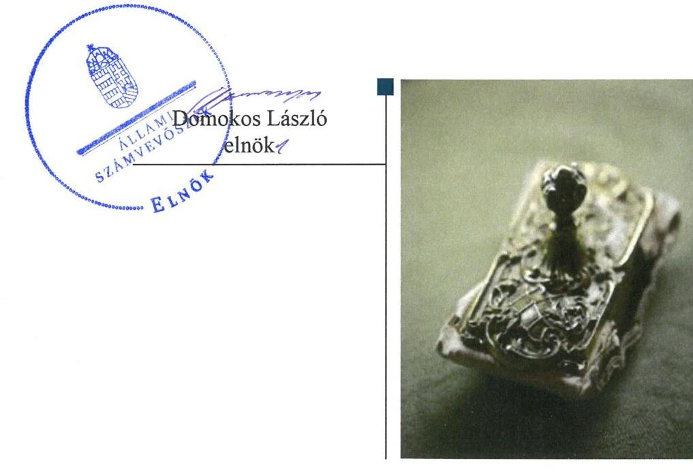
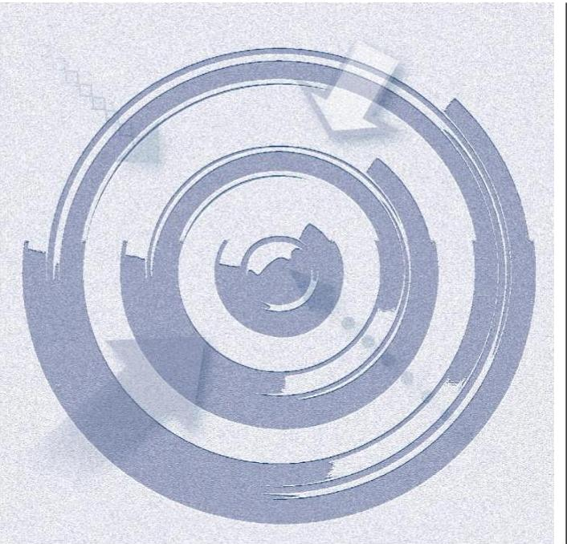
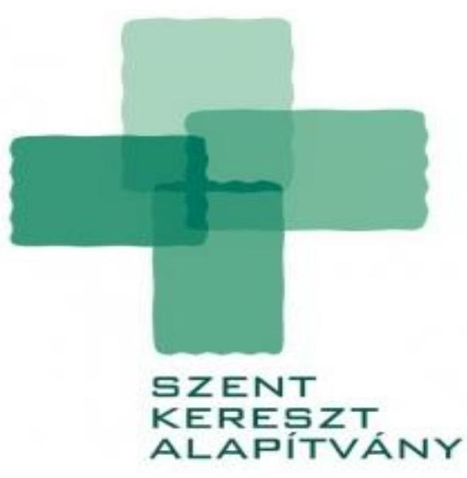
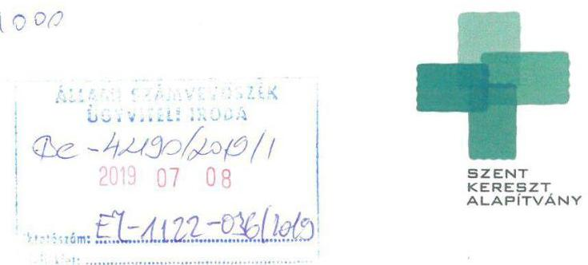
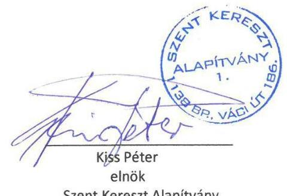
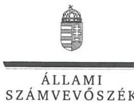
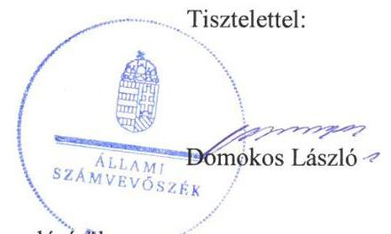

# Jelenetés 

## Nem állami humánszolgáltatók ellenőrzése

A humánszolgáltatást nyújtó államháztartáson kívüli szociális intézmények, szolgáltatók fenntartói központi költségvetésből kapott támogatásai felhasználásának ellenőrzése Szent Kereszt Alapítvány
2019.

---

# Jelentés 

## Nem állami humánszolgáltatók ellenőrzése

A humánszolgáltatást nyújtó államháztartáson kívüli szociális intézmények, szolgáltatók fenntartói központi költségvetésből kapott támogatásai felhasználásának ellenőrzése Szent Kereszt Alapítvány
2019. 08. hó 29. nap

---

# AZ ELLENŐRZÉST FELÜGYELTE: 

KAKAS SÁNDOR felügyeleti vezető

## AZ ELLENŐRZÉST VEZETTE ÉS A VÉGREHAJTÁSÁÉRT FELELŐS:

DR. TÓTH VIKTÓRIA ellenőrzésvezető

## A PROGRAM ÖSSZEÁLLÍTÁSÁÉRT FELELŐS:

TÓTPÁL SZABOLCS osztályvezető

IKTATÓSZÁM: EL-1848-001/2019.
TÉMASZÁM: 2491
ELLENŐRZÉS-AZONOSÍTÓ SZÁM: V083520

Jelentéseink az Országgyúlés számítógépes hálózatán és az Interneten a www.asz.hu címen is olvashatóak.

---

# TARTALOMJEGYZÉK 

■ ÖSSZEGZÉS ..... 5
■ AZ ELLENŐRZÉS CÉLJA ..... 6
■ AZ ELLENŐRZÉS TERÜLETE ..... 7
■ AZ ELLENŐRZÉS HÁTTERE, INDOKOLTSÁGA ..... 8
■ A JELENTÉS LÉNYEGES KÉRDÉSKÖREI ..... 9
■ AZ ELLENŐRZÉS HATÓKÖRE ÉS MÓDSZEREI ..... 10
■ MEGÁLLAPÍTÁSOK ..... 12
■ JAVASLATOK ..... 14
■ MELLÉKLETEK ..... 15
I. sz. melléklet: Értelmező szótár ..... 15
■ FÜGGELÉKEK ..... 17
I. sz. függelék a jelentéshez ..... 17
II. sz. függelék: Észrevételek ..... 18
■ RÖVIDÍTÉSEK JEGYZÉKE ..... 23

---

.

---

# ÖSSZEGZÉS 

A Szent Kereszt Alapítvány a müködési és gazdálkodási környezetét nem szabályszerűen alakította ki, a költségvetési támogatások átlátható, elszámoltatható igénybevételének, felhasználásának feltételeit nem teremtette meg. A szociális ellátás közfeladathoz biztositott központi költségvetési támogatásokat nem szabályszerűen tartotta nyilván, ezáltal nem biztositotta az elszámoltathatóságot.

## Az ellenőrzés társadalmi indokoltsága

Az Állami Számvevőszék stratégiájában hangsúlyos szerepet szán annak, hogy szilárd szakmai alapon álló, értékteremtő ellenőrzéseivel előmozdítsa a közpénzügyek átláthatóságát, rendezettségét és javaslataival a közpénzek és a közvagyon szabályos, gazdaságos, hatékony és eredményes felhasználását segítse. Az ÁSZ a stratégiájában célul tűzte ki, hogy az államháztartáson kívülre nyújtott költségvetési támogatások ellenőrzésével hozzájárul ahhoz, hogy a közpénzeket az államháztartáson kívüli szervezetek is átlátható módon használják fel a közfeladatok szerződésben vállalt ellátása érdekében. Tekintettel az elmúlt években a szociális területet érintő finanszírozási változásokra, a társadalom fokozott érdeklődéssel figyeli a szociális feladatokra fordított források felhasználását. Fontos a közvéleményt biztosítani arról, hogy a közpénz államháztartáson kívüli felhasználása ezen a területen sem marad ellenőrizetlenül.

A Szent Kereszt Alapítványnál végzett ellenőrzést indokolja az is, hogy a humánszolgáltatási közfeladat ellátására az ellenőrzött időszakban több, mint 361,4 millió Ft központi költségvetési támogatásban részesült.

## Főbb megállapítások, következtetések, javaslatok

A Szent Kereszt Alapítvány a működési és gazdálkodási környezetét nem szabályszerűen alakította ki, számlarenddel nem rendelkezett, ezáltal nem biztosította a költségvetési támogatások átlátható felhasználását.

A Szent Kereszt Alapítvány a saját és az egyes szolgáltatói gazdálkodását számviteli rendjében feladatonkénti bontásban, elkülönítetten nem kezelte, ezáltal nem volt igazolt, hogy a költségvetési támogatásokat intézményei müködtetésére fordította.

Egyszerűsített éves beszámolóját és közhasznúsági mellékletét honlapján 2017. évben nem tette közzé, ezzel a nyilvánosság felé fennálló elszámolási kötelezettségének nem tett eleget.

Az Állami Számvevőszék a jelentésben foglalt megállapítások alapján a Szent Kereszt Alapítvány kuratóriumi elnökének három javaslatot fogalmazott meg. A javaslatokat megalapozó megállapításokra az érintettnek 30 napon belül intézkedési tervet kell készítenie.

---

# AZ ELLENŐRZÉS CÉLJA

**AZ ELLENŐRZÉS CÉLJA** annak értékelése, hogy a nem állami, nem önkormányzati szociális intézmények fenntartói központi költségvetésből kapott támogatásainak felhasználása szabályszerű volt-e, a támogatások igénylése, évközi módosítása és év végi elszámolása megfelel-e a jogszabályi előírásoknak.

---

# **AZ ELLENŐRZÉS TERÜLETE**

## **Szent Kereszt Alapítvány**

A budapesti székhelyű Alapítvány1 2002-ben jött létre 5 M Ft alapítási vagyonnal, azzal a céllal, hogy megvalósítsa időskorúak és mozgássérültek személyes gondozását. Az Alapítvány alapítója egy magánszemély, kezelő szerve az alapító által létrehozott 3 tagú kuratórium volt. Az Alapítványon belül Felügyelőbizottság működött.

A Fenntartó2 az ellenőrzött időszakban3 szociális közfeladatát megvalósítva egy intézményt tartott fenn, a Kék Duna Idősek Otthonát. A Kék Duna Idősek Otthona jogi személyiséggel nem rendelkezett, alaptevékenysége időskorúak ápoló-gondozó bentlakásos ellátása volt, 150 fő engedélyezett férőhelylyel.

2015-2016. években két szociális szolgáltatónak, a Dunaparti Manókuckó Munkahelyi Családi Napközi I.-nek, és Dunaparti Manókuckó Munkahelyi Családi Napközi II.-nek volt a Fenntartója, amelyek szolgáltatási forma váltás következtében 2017. évben bölcsődeként, Duna-parti Manókuckó Munkahelyi Családi Bölcsőde I. valamint Duna-parti Manókuckó Munkahelyi Családi Bölcsőde II. néven működtek, 5-5 fő engedélyezett férőhellyel. A Fenntartó fenntartásában működő szociális intézmény és a két szociális szolgáltató önálló gazdálkodással nem rendelkezett.

A Fenntartó 2015-2017. években közhasznú szervezetként működött. A szervezet képviselőjének személyében nem történt változás az ellenőrzött időszakban.

A Fenntartó kettős könyvvitelt vezetett, a Cilvilszr.1,42 előírásai szerint egyszerűsített éves beszámolót készített. A Fenntartó összes bevétele a 2015. évi 402,4 millió Ft-ról 2017. évre 16,7%-kal nőtt. A Fenntartó által igénybevett központi költségvetési támogatás összege 2015. évben 109,5 millió Ft, 2016. évben 117,9 millió Ft, 2017. évben 134,1 millió Ft volt.

---

# AZ ELLENŐRZÉS HÁTTERE, INDOKOLTSÁGA 

A szociális feladatokat ellátó nem állami intézményfenntartók részére közfeladataik ellátására évente jelentős összegű pénzügyi támogatást biztosítottak a mindenkori költségvetési törvények a bennük megfogalmazott feltételek mellett. A felhasználható állami támogatások a Kvtv.-ekben (a 2014. évi C. törvény Magyarország 2015. évi központi költségvetéséről, 2015. évi C. törvény Magyarország 2016. évi központi költségvetéséről, 2016. évi XC. törvény Magyarország 2017. évi központi költségvetéséről) a 2015-2017. években a szociális ágazatra vonatkozóan 273 Mrd Ft előirányzatot határoztak meg. Módosították a szociális igazgatásról és szociális ellátásokról szóló 1993. évi III. törvényt, amely - többek között - 2012. január 1-jei hatállyal megfogalmazta a finanszírozási rendszerbe történő befogadással összefüggő szabályokat.

Az ÁSZ ${ }^{6}$ stratégiájában foglaltak alapján is indokolt az ellenőrzés, amely a társadalom számára jelzi, hogy a közpénz államháztartáson kívüli felhasználása sem maradhat ellenőrizetlenül. Az államháztartáson kívülre nyújtott költségvetési támogatások ellenőrzésével az ÁSZ hozzájárul ahhoz, hogy a közpénzeket a nem állami humán fenntartók átlátható módon használják fel a közfeladatok ellátására kötött szerződésekben vállalt kötelezettségek teljesítése érdekében. Az ellenőrzés javaslataival hozzájárulhat az említett rendszerek szabályszerű támogatás felhasználásához, javíthatja a társa-dalmi-gazdasági döntések megalapozottságát, amely a „jól irányított állam" múködéséhez járul hozzá.

A holisztikus megközelítés jegyében az ellenőrzés keretében egyedi kockázatelemzés alapján kiválasztott fenntartóknál és intézményeiknél értékeljük az államháztartáson kívüli szociális tevékenységhez kapcsolódó támogatások felhasználásának megfelelőségét.

---

# A JELENTÉS LÉNYEGES KÉRDÉSKÖREI 

1. A szociális humánszolgáltató közfeladatot ellátó fenntartó szabályszerű müködési- és gazdálkodási környezet kialakításával megteremtette-e a költségvetési támogatások átlátható, elszámoltatható igénybevételének, felhasználásának feltételeit?
2. Az államháztartáson kívüli fenntartó az átvállalt szociális humánszolgáltatási közfeladathoz biztositott költségvetési támogatásokat szabályszerűen fordította-e a humánszolgáltató intézményei müködtetésére?
3. Az államháztartáson kívüli fenntartó a szociális humánszolgáltató intézményei müködtetéséhez felhasznált közpénzekre vonatkozó gazdálkodásával a nyilvánosság előtt elszámolt-e?

---

# AZ ELLENŐRZÉS HATÓKÖRE ÉS MÓDSZEREI 

## Az ellenőrzés típusa

Megfelelőségi ellenőrzés

## Az ellenőrzött időszak

A 2015. január 1-je és 2017. december 31-e közötti időszak. A helyszíni szemle tekintetében 2018. január 1-jétől az utolsó helyszíni szemle időpontjáig (2019. január 29-éig) tartó időszak.

## Az ellenőrzés tárgya

Az ellenőrzés a szociális humánszolgáltatási közfeladatokat ellátó államháztartáson kívüli fenntartók, humánszolgáltatási közfeladatai ellátásához a költségvetési törvényekben biztosított központi költségvetési támogatások igénylése, évközi módosítása és év végi elszámolása fenntartói feladatainak ellátása, illetve e központi költségvetésből kapott támogatásaik humánszolgáltatási közfeladatokra való fenntartó általi felhasználása szabályszerűségének értékelésére terjed ki.

## Az ellenőrzött szervezet

- Szent Kereszt Alapítvány

## Az ellenőrzés jogalapja

Az ellenőrzés jogszabályi alapját az ÁSZ tv. ${ }^{7}$ 1. § (3) bekezdésében, az 5. § (3) bekezdésében foglalt előírások adták.

## Az ellenőrzés módszerei

Az ellenőrzést az ellenőrzési program szempontjai, kérdései, az ellenőrzött időszakban hatályos jogszabályok, a nemzetközi standardokat irányadónak tekintve, az ellenőrzés szakmai szabályok és módszertanok figyelembe vételével végezte az ÁSZ. A közpénzekkel való felelős gazdálkodás segítésére irányuló javaslatok kidolgozásakor a hatályos jogszabályok az irányadóak.

Az ellenőrzés ideje alatt az ellenőrzött szervezettel történő kapcsolattartást az ÁSZ SZMSZ ${ }^{8}$-ének vonatkozó előírásai alapján biztosította az ÁSZ.

---

Az ellenőrzési kérdések megválaszolásához szükséges bizonyítékok megszerzése az ellenőrzött által rendelkezésre bocsátott dokumentumokra, adatokra alapozva megfigyelés, szemle (szemrevételezés), kérdésfeltevés (információkérés), valamint elemző eljárással történt.

Az ellenőrzési bizonyítékként felhasználható adatforrások közé tartoznak egyrészt az ellenőrzési program részletes szempontjainál felsorolt adatforrások, másrészt minden - az ellenőrzés folyamán feltárt, az ellenőrzés szempontjából információt tartalmazó - dokumentum.

Az ellenőrzés lefolytatásához az ellenőrzött szervezet az ÁSZ által kért dokumentumok elektronikus úton való megküldésével szolgáltatott adatokat, információkat.

Az egységes értelmezést támogatja a program mellékletét képező fogalomtár és rövidítésjegyzék.

Az ellenőrzést a szociális humánszolgáltatások esetében a központi költségvetési támogatások igénylésével, módosításával, felhasználásával, elszámolásával kapcsolatos feladatokat ellátó államháztartáson kívüli fenntartónál/szervezeteinél végeztük. A fenntartott intézményeknél helyszíni szemle keretében győződtünk meg a tényleges feladatellátásról (verifikáció).

A szociális humánszolgáltatások központi költségvetési támogatásai igénylésével, módosításával, elszámolásával kapcsolatos, államháztartáson kívüli fenntartó jogszabályokban előírt feladatai betartását, továbbá a központi költségvetési támogatások szabályszerű kezelését, nyilvántartását ellenőrizte az ÁSZ a fenntartónál, az ott rendelkezésre álló határozatok, nyilvántartások, beszámolók és egyéb dokumentumok alapján. Az ellenőrzés nem terjedt ki a szociális humánszolgáltatások központi költségvetési támogatásai igénylése, módosítása, elszámolása valódiságának, megalapozottságának, helyességének - sem a fenntartónál, sem a székhely intézményeinél való - értékelésére (mivel ennek felülvizsgálata, ellenőrzése a finanszírozó jogszabályban előírt feladata, határozatai kiadása előtt). Továbbá nem terjedt ki az ellenőrzés e források, intézmények általi szabályszerű felhasználásának értékelésére.

---

# MEGÁLLAPÍTÁSOK 

## 1. A szociális humánszolgáltató közfeladatot ellátó fenntartó szabályszerű múködési- és gazdálkodási környezet kialakításával megteremtette-e a költségvetési támogatások átlátható, elszámoltatható igénybevételének, felhasználásának feltételeit?

Összegző megállapítás

A Fenntartó a múködési- és gazdálkodási környezetét nem szabályszerűen alakította ki, a költségvetési támogatások átlátható, elszámoltatható igénybevételének, felhasználásának feltételeit nem teremtette meg.

ALAPÍTÓ OKIRATTAL a Fenntartó rendelkezett, amely megfelelt a Ptk. ${ }^{9}$ előírásainak. A szervezeti és múködési szabályait az Alapító okiratban és az SZMSZ ${ }^{10}$-ben határozta meg.

A Fenntartó a Számv. tv. ${ }^{11}$ 161. § (1) bekezdésében foglaltak ellenére számlarendet nem készített. A Számv. tv. által előírt számviteli politikával és annak részeként elkészítendő szabályzatokkal a Fenntartó rendelkezett.

A Fenntartó rendelkezett a költségvetési támogatásokat megállapító és a támogatások elszámolásának elfogadásáról szóló kincstári határozatokkal.

## 2. Az államháztartáson kívüli fenntartó az átvállalt szociális humánszolgáltatási közfeladathoz biztosított költségvetési támogatásokat szabályszerűen fordította-e a humánszolgáltató intézményei múködtetésére?

Összegző megállapítás

A szociális humánszolgáltatási közfeladathoz biztosított költségvetési támogatások humánszolgáltató intézményeinek múködtetésére történő szabályszerű felhasználását nem igazolta.

A TÁMOGATÁSOK FELHASZNÁLÁSÁNAK átláthatóságát a Fenntartó nem biztosította, mivel a Fenntartó a saját és egyes szolgáltatói gazdálkodását az Atr. ${ }^{12} 16 . \S$ (1) bekezdésében foglaltak ellenére számviteli rendjében feladatonkénti bontásban, elkülönítetten nem kezelte.

Ebből következően nem igazolt, hogy a 2014. évi Kvtv. ${ }^{13}$ 43. § (3), a 2015. évi Kvtv. ${ }^{14} 41 . \S$ (3) és a 2016. évi Kvtv. ${ }^{15} 41 . \S$ (4) bekezdésében foglaltaknak megfelelően a folyósítást követő 15 napon belül a támogatás öszszegét az intézménye részére átadta.

---

A Fenntartó a Civil tv. ${ }^{16} 20 . \S$ (4) bekezdésben foglaltak ellenére az alapcél szerinti (közhasznú) tevékenysége költségei, ráfordításai ellentételezésére kapott támogatásokról elkülönített számviteli nyilvántartást nem vezetett, ezáltal nem volt megállapítható és ellenőrizhető a kapott támogatás felhasználása.

Fenntartó a szociális intézménye vonatkozásában rendelkezett a szociális humánszolgáltatási közfeladat ellátására vonatkozó ellátási és együttműködési keretszerződéssel.

# 3. Az államháztartáson kívüli fenntartó a szociális humánszolgáltató intézményei múködtetéséhez felhasznált közpénzekre vonatkozó gazdálkodásával a nyilvánosság előtt elszámolt-e? 

Összegző megállapítás

A Fenntartó a felhasznált közpénzekre vonatkozó gazdálkodásával nem számolt el a nyilvánosság előtt. A külső ellenőrzésekkel kapcsolatos intézkedési feladatait nem szabályszerűen látta el.

EGYSZERÚSÍTETT ÉVES BESZÁMOLÓJÁT és közhasznúsági mellékletét a Fenntartó a 2015-2017. években határidőben elkészítette és letétbe helyezte, azonban a Civil tv. 30. § (4) bekezdésében foglaltak ellenére a 2017. évre vonatkozó beszámolóját és a közhasznúsági mellékletet saját honlapján nem tette közzé.

KÜLSŐ HATÓSÁGI ELLENŐRZÉST a Fenntartónál a kormányhivatal és a NÉBIH ${ }^{17}$ folytatott az ellenőrzött időszakban összesen öt alkalommal. A Fenntartó a 2017. évi kormányhivatali ellenőrzéssel kapcsolatos intézkedési kötelezettségének nem tett eleget.

---

# JAVASLATOK 

Az ÁSZ tv. 33. § (1) bekezdésében foglaltak értelmében az ellenőrzött szervezet vezetője köteles a jelentésben foglalt megállapításokhoz kapcsolódó intézkedési tervet összeállítani és azt a jelentés kézhezvételétől számított 30 napon belül az ÁSZ részére megküldeni. Amennyiben az ellenőrzött szervezet vezetője nem küldi meg határidőben az intézkedési tervet, vagy továbbra sem elfogadható intézkedési tervet küld, az Állami Számvevőszék elnöke az ÁSZ tv. 33. § (3) bekezdése a) és b) pontjaiban foglaltakat érvényesítheti.

## a Szent Kereszt Alapítvány kuratóriumi elnökének

1. Intézkedjen a számlarend elkészítéséről a Számv. tv. előírásai szerint.
(1. megállapítás 2. bekezdésének 1. mondata alapján)
2. Gondoskodjon az egyes szolgáltatók gazdálkodásának a számviteli rendben történő feladatonkénti elkülönített kezeléséről, valamint a kapott támogatások felhasználására vonatkozóan a jogszabályi előirás szerinti elkülönített számviteli nyilvántartás vezetéséről.
(2. megállapítás 1. és 3. bekezdése alapján)
3. Tegyen eleget a közzétételi kötelezettségének a jogszabályi előirás szerint.
(3. megállapítás 1. bekezdés 1. mondatának 2. tagmondata alapján)

---

# MELLÉKLETEK 

- I. SZ. MELLÉKLET: ÉRTELMEZŐ SZÓTÁR
humánszolgáltatás
költségvetési támogatás
nem állami, nem önkormányzati (államháztartáson kívüli) intézmény fenntartó
szociális szolgáltató
telephely

Külön törvényben meghatározott szociális, gyermekjóléti, gyermekvédelmi, közoktatási, felsőoktatási, kulturális közfeladatok (2014. évi Kvtv. 34. § (1), (4) bekezdés, 1. számú melléklet XX/20/2. alcím, 19. alcím, 2015. évi Kvtv. 43. § (1), (4) bekezdés, 1. számú melléklet XX/20/2/3. jogcím csoport, 19. alcím, 2016. évi Kvtv. 41. § (1), (4) bekezdés, 1. számú melléklet XX/20/2/3. jogcím csoport, 19. alcím.
A társadalombiztosítás pénzügyi alapjai kivételével az államháztartás központi alrendszeréből ellenérték nélkül, pénzben nyújtott támogatások (Áht. 18 1. § 14. pont).
A költségvetési törvényekben (2013. évi CCXXX. törvény 33-34. §, 2014. évi C. törvény 42-43. §, 2015. évi C. törvény 40-41. §) megállapított támogatás. Például a 2015. évi C. törvény 40-41. § szerint többek között: Az Országgyűlés a szociális, gyermekjóléti, gyermekvédelmi közfeladatot ellátó intézményt, szolgáltatást fenntartó egyházi jogi személy, civil szervezet, közalapítvány, országos nemzetiségi önkormányzat, települési vagy területi nemzetiségi önkormányzat, gazdasági társaság, és a humánszolgáltatást alaptevékenységként végző, az Szja tv. hatálya alá tartozó egyéni vállalkozó (a továbbiakban együtt: nem állami szociális fenntartó) részére támogatást állapít meg a következők szerint: a támogatás a nem állami szociális fenntartót a települési önkormányzatok 2. melléklet III. pont 3. alpont c)-k) pontjában és III. pont 5. alpont a) pontjában meghatározott támogatásaival azonos jogcímeken, összegben és feltételek mellett illeti meg. A szociális, gyermekjóléti és gyermekvédelmi közfeladatokat /humánszolgáltatásokat ellátó intézményt fenntartó egyházi jogi személy, társadalmi szervezet, alapítvány, közalapítvány, civil szervezet, országos nemzetiségi önkormányzat, nonprofit gazdasági társaság, gazdasági társaság és a humánszolgáltatást alaptevékenységként végző, Szja tv. hatálya alá tartozó egyéni vállalkozó. (2013. évi Kvtv. 35. § (1), (3) bekezdés, 2014. évi Kvtv. 33. §, 34. § (1), (4) bekezdés, 2015. évi Kvtv. 42. §, 43. § (1), (4) bekezdés, 2016. évi Kvtv. 40. §, 41. § (1), (4) bekezdés, 2017. évi Kvtv. 41. § (1), (4))
a szociális igazgatásról és szociális ellátásokról szóló 1993. évi III. törvény 4. §. (1) bekezdésének g) pontjában meghatározottak szerint: „g) szociális szolgáltató: az a személy vagy szervezet, amely kizárólag a 60-65/E. §-ban meghatározott szociális alapszolgáltatásokat nyújtja. Ha jogszabály másként nem rendelkezik, a szociális szolgáltatókra a szociális intézményekre vonatkozó szabályokat kell megfelelően alkalmazni;
a szolgáltató székhelyétől különböző, szolgáltató/intézmény használatában álló hely, a szociális humánszolgáltatáshoz használt, bejegyzett hely. (Sznyvhr. 1. § I) pont) (hatályos: 2015. január 1-től)

---

.

---

# FÜGGELÉKEK 

- I. SZ. FÜGGELÉK A JELENTÉSHEZ

Az Állami Számvevőszék az ellenőrzések során feltárt tényekhez kapcsolódó további körülmények tisztázására eszközrendszerrel nem rendelkezik. Amennyiben az ellenőrzésen túlmutatóan indokoltnak látszik az ellenőrzés során feltárt körülmények további vizsgálata, az Állami Számvevőszék törvényi felhatalmazás alapján az ellenőrzés által feltárt körülményeket továbbítja a hatáskörrel rendelkező szervnek a szükséges intézkedések megtétele, eljárások lefolytatása érdekében.
A támogatások felhasználásának átláthatóságát a Fenntartó nem biztosította, mivel a Fenntartó a saját és az egyes szolgáltatói gazdálkodását az Atr. 16. § (1) bekezdésében foglaltak ellenére számviteli rendjében feladatonkénti bontásban, elkülönítetten nem kezelte. A Fenntartó a Civil tv. 20. § (4) bekezdésben foglaltak ellenére az alapcél szerinti (közhasznú) tevékenysége költségei, ráfordításai ellentételezésére kapott támogatásokról elkülönített számviteli nyilvántartást nem vezetett, így a nem volt megállapítható és ellenőrizhető a kapott támogatás felhasználása. Ezáltal nem zárható ki, hogy a költségvetésből származó pénzeszközöket a jóváhagyott céltól eltérően használta fel.
Az eset további körülményeinek felderítésére a Magyar Államkincstár rendelkezik hatáskörrel.

---

A jelentéstervezetet a Számvevőszék 15 napos észrevételezésre megküldte az ellenőrzött szervezet vezetőjének az ÁSZ tv. 29. §* (1) bekezdése előírásának megfelelően.

A Szent Kereszt Alapítvány kuratóriumi elnöke a jelentéstervezet megállapításaira írásban észrevételt tett.
Az ÁSZ tv. 29. § (3) bekezdésével összhangban az ÁSZ a Függelékben feltünteti az ellenőrzés megállapításaival kapcsolatban tett, figyelembe nem vett észrevételeket, és megindokolja, hogy azokat miért nem fogadta el.

[^0]
[^0]:    * 29. § (1) Az Állami Számvevőszék az ellenőrzési megállapításait megküldi az ellenőrzött szervezet vezetőjének vagy az általa megbízott személynek, és annak, akinek személyes felelősségét állapította meg.
    (2) Az ellenőrzött szervezet vezetője és a felelősként megjelölt személy az ellenőrzés megállapításaira tizenöt napon belül írásban észrevételt tehet.
    (3) Az Állami Számvevőszék az észrevételre a beérkezésétől számított harminc napon belül írásban válaszol. A figyelembe nem vett észrevételeket köteles a jelentésben feltüntetni, és megindokolni, hogy azokat miért nem fogadta el.

---

Állami Számvevőszék
1364 Budapest 4 Pf: 54.

Tisztelt Számvevószék!
A részünkre 2019.05.25-én kézbesített „Nem állami humánszolgáltatók ellenőrzése - A humánszolgáltatást nyújtó államháztartáson kívüli szociális intézmények, szolgáltatók fenntartói központi költségvetésből kapott támogatásai felhasználásának ellenőrzése - Szent Kereszt Alapítvány" címmel készült számvevőszéki jelentéstervezetükhöz az alábbi észrevételeket teszem:

A vizsgálat során külön nyilatkozatban összefoglaltam, hogy „a Fenntartónak van adószáma és bankszámla száma. A Kék Duna Otthon, a Duna Parti Manókuckó I-II családi bölcsődék önálló adószámmal nem rendelkeznek, nem önállóan gazdálkodó szervezetek. A Fenntartó a normatív és egyéb állami támogatást teljes mértékben bérköltségre fordítja"

A vizsgált időszakban a Szent Kereszt Alapítvány három intézménynek volt a fenntartója egy épületen belül. Az Alapítványnak nem volt önálló gazdálkodási tevékenysége kizárólag az intézmények fenntartása. Vezető tisztségviselői javadalmazásban nem részesültek, minden költsége és ráfordításai az intézményekben keletkeztek. Így a számviteli rendjében saját költséget elkülöníteni nem tud.

A Szent Kereszt Alapítvány fenntartásában működő három intézmény a Kék Duna Otthon (idősek otthona), Duna-parti Manókuckó Családi Bölcsőde I. és Duna-parti Manókuckó Családi Bölcsőde II. (munkahelyi gyermekmegőrzők) - mindhárom címe: 2133 Sződliget Duna part 2. - önálló gazdálkodást nem végeztek, nem volt adószámuk, sem külön bankszámlájuk. Ezért a Szent kereszt Alapítványnak nem állt módjában a normatív támogatást átutalni az intézményeknek.

Az Alapítvány a számviteli politikájának 5. számú mellékletében rendelkezik a normatív támogatás felhasználásáról is a következők szerint: „Az Alapítvány a normatív támogatást, a cél szerinti közhasznú tevékenysége ellátása érdekében létrehozott Intézmény részére teljes mértékben átadja, és a cél szerinti közhasznú tevékenységének végzése érdekében alkalmazott munkavállalóinak személyi ráfordításaira fordítja."

A vizsgált időszakban, mindhárom intézményben a személyi ráfordítások jelentősen meghaladták a normatív támogatás összegét.

A vizsgált időszakot követően, 2018.12.31-én az Alapítvány a munkahelyi gyermekmegőrzőket megszüntette, és kizárólag a Kék Duna Otthon fenntartója.

Budapest, 2019. július 2.
Tisztelettel:

Szent Kereszt Alapítvány

---

ELNÖK

Ikt.szám: EL-1122-037/2019.

# Kiss Péter úr 

kuratóriumi elnök
Szent Kereszt Alapítvány

## Budapest

## Tisztelt Elnök Úr!

A „Nem állami humánszolgáltatók ellenőrzése - A humánszolgáltatást nyújtó államháztartáson kivüli szociális intézmények, szolgáltatók fenntartói központi költségvetéshöl kapott támogatásai felhasználásának ellenőrzése - Szent Kereszt Alapítvány" címmel készített számvevőszéki jelentéstervezetre tett észrevételeit megkaptam.
Az Állami Számvevőszék észrevételekre vonatkozó álláspontjáról a felügyeleti vezető által készített részletes tájékoztatást csatoltan megküldöm.
Tájékoztatom Elnök urat, hogy a számvevőszéki jelentésben - az Állami Számvevőszékről szóló 2011. évi LXVI. törvény 29. § (3) bekezdése alapján - a figyelembe nem vett észrevételeket szerepeltetjük az elutasítás indokának feltüntetésével.

Budapest, 2019. 07 hó 24 nap

Melléklet: Tájékoztatás az észrevételek kezeléséről

---

# Tájékoztatás az észrevételek kezeléséről 

A „Nem állami humánszolgáltatók ellenőrzése - A humánszolgáltatást nyújtó államháztartáson kivüli szociális intézmények, szolgáltatók fenntartói központi költségvetésböl kapott támogatásai felhasználásának ellenőrzése - Szent Kereszt Alapítvány" címü jelentéstervezetre (továbbiakban: jelentéstervezet) a 2019. július 2-án kelt levelében megküldött észrevételeit áttekintettem. Az észrevételek kezeléséről az alábbi tájékoztatást adom.

## 1. A jelentéstervezet 2. számú megállapítására, valamint a 2. számú javaslatra vonatkozó észrevétel:

A kuratórium elnökének észrevétele szerint az Alapítvány az ellenőrzés során nyilatkozatot adott, amely szerint az általa fenntartott három intézmény önálló gazdálkodást nem folytat, önálló adószámuk nincs, továbbá az Alapítvány (Fenntartó) a normatív és egyéb állami támogatást teljes mértékben bérköltségre fordítja. Az észrevételben leírta, hogy az Alapítvány gazdálkodási tevékenysége kizárólag az intézmények fenntartása volt, minden elszámolt költség és ráfordítás azoknál keletkezett, így az Alapítvány a számviteli rendjében saját költséget elkülöníteni nem tud. Az intézmények külön bankszámlával nem rendelkeztek, ezért az Alapítványnak nem állt módjában a normatív támogatás átutalása az intézmények részére. Az Alapítvány számviteli politikája rendelkezik a normatív támogatás teljes mértékủ átadásáról az intézmények részére, a személyi ráfordítások céljára. A kuratórium elnöke megjegyezte továbbá, hogy az intézmények személyi ráfordításai jelentősen meghaladták a normatív támogatás összegét.
Az észrevételt nem fogadjuk el. A jelentéstervezet megállapításában hivatkozott, az egyházi és nem állami fenntartású szociális, gyermekjóléti és gyermekvédelmi szolgáltatók, intézmények és hálózatok állami támogatásáról szóló 489/2013. (XII. 18.) Korm. rendelet 16. § (1) bekezdése szerint ,, a fenntartó a támogatás felhasználását, nem önállóan gazdálkodó szolgáltatók esetén a fenntartó és az egyes szolgáltatók gazdálkodását, továbbá a szolgáltató a támogatás és a térítési dij felhasználását a számviteli rendjében feladatonkénti bontásban, elkülönitetten köteles kezelni. "Továbbá az egyesülési jogról, a közhasznú jogállásról, valamint a civil szervezetek müködéséről és támogatásáról szóló 2011. évi CLXXV. törvény 20. § (4) bekezdése szerint „a civil szervezet az alapcél szerinti (közhasznú) tevékenysége költségei, ráforditásai ellentételezésére kapott támogatásokról olyan elkülönitett számviteli nyilvántartást vezet, amelynek alapján támogatásonként megállapítható és ellenőrizhető a kapott támogatás felhasználása.". Az Alapítvány a fenti jogszabályi előírásoknak nem tett eleget.
A kuratórium elnöke észrevételében elismerte, hogy nem rendelkezett elkülönített nyilvántartással. Az észrevételében leírtak ellentmondást tartalmaznak. Az észrevétel 2. bekezdésében leírtak szerint az intézmények nem gazdálkodtak önállóan, a 3. bekezdésben foglaltak szerint minden

---

költség, ráfordítás őket terheli. Ugyanakkor az észrevétel 3. bekezdésében leírtak szerint az Alapítványnál, mint fenntartónál nem merültek fel költségek, ezért saját költséget nem is tud elkülöníteni. A fenntartónak az alapítvány egésze, mint szervezet, gazdálkodásával kapcsolatban szükségszerűen keletkeznek költségei, ráfordításai (pl. a könyvelés, a bankszámla-vezetés díja), amelyek nem tekinthetők az intézményei alapfeladatához kizárólagosan kapcsolódónak.
A jelentéstervezetben található következtetést, mely szerint a Fenntartó nem igazolta az intézmények részére - a Magyarország éves központi költségvetéséről szóló törvényekben előírt - a támogatás folyósítást követő 15 napon belüli átadását, a kuratórium elnökének hivatkozása az elkülönített nyilvántartás hiányára megerősíti.
Fentiekre tekintettel a jelentéstervezet megállapításának módosítása nem indokolt.

# 2. Egyéb, nem a jelentéstervezet megállapításaira vonatkozó észrevétel: 

A kuratórium elnöke észrevételében jelezte, hogy 2019. december 31-én az Alapítvány a munkahelyi gyermekmegőrzőket megszüntette, kizárólag egy intézményt tart fenn.
Az észrevétel az ellenőrzött időszakot, illetve a jelentéstervezetben tett megállapításokat nem érinti, a jelentéstervezet módosítása nem indokolt.

Budapest, 2019. 03 hó 24 nap

Kakas Sándor
felügyeleti vezető

---

# RÖVIDÍTÉSEK JEGYZÉKE 

${ }^{1}$ Alapítvány
${ }^{2}$ Fenntartó
${ }^{3}$ ellenőrzött időszak
${ }^{4}$ Civilszr. 1
${ }^{5}$ Civilszr. 2
${ }^{6}$ ÁSZ
${ }^{7}$ ÁSZ. tv.
${ }^{8}$ ÁSZ SZMSZ
${ }^{9}$ Ptk.
${ }^{10}$ SZMSZ
${ }^{11}$ Számv.tv.
${ }^{12}$ Atr.
${ }^{13}$ 2014. évi Kvtv1
${ }^{14}$ 2015. évi Kvtv2
${ }^{15}$ 2016. évi Kvtv3
${ }^{16}$ Civil tv.
${ }^{17}$ NÉBIH
${ }^{18}$ Áht.

Szent Kereszt Alapítvány
Szent Kereszt Alapítvány
2015-2017. évek
224/2000. (XII. 19.) Korm. rendelet a számviteli törvény szerinti egyes egyéb szervezetek beszámoló készítési és könyvvezetési kötelezettségének sajátosságairól (hatályos: 2016. december 31-éig)
479/2016. (XII. 28.) Korm. rendelet a számviteli törvény szerinti egyes egyéb szervezetek beszámoló készítési és könyvvezetési kötelezettségének sajátosságairól (hatályos: 2017. január 1-jétől)
Állami Számvevőszék
2011. évi LXVI. törvény az Állami Számvevőszékről

Állami Számvevőszék Szervezeti és Müködési Szabályzata
2013. évi V. törvény a Polgári Törvénykönyvről (hatályos: 2014. március 15-étől)

Szent Kereszt Alapítvány Szervezeti és Müködési Szabályzata
(hatályos: 2014. július 1-jétől)
a számvitelről szóló 2000. évi C. törvény
489/2013. (XII. 18.) Korm. rendelet az egyházi és nem állami fenntartású szociális, gyermekjóléti és gyermekvédelmi szolgáltatók, intézmények és hálózatok állami támogatásáról (hatályos: 2014. január 1-jétől)
2014. évi C. törvény Magyarország 2015. évi központi költségvetéséről
2015. évi C. törvény Magyarország 2016. évi központi költségvetéséről
2016. évi XC. törvény Magyarország 2017. évi központi költségvetéséről
2011. évi CLXXV. törvény az egyesülési jogról, a közhasznú jogállásról, valamint a civil szervezetek müködéséről és támogatásáról
(hatályos: 2011. december 22-étől)
Nemzeti Élelmiszerlánc Biztonsági Hivatal
2011. évi CXCV. törvény az államháztartásról (hatályos: 2011. december 31-étől)

---

ÁLLAMI SZÁMVEVŐSZÉK
1052 Budapest, Apáczai Csere János utca 10.
Levélcím: 1364 Budapest 4. Pf. 54
Telefon: +36 14849100 Telefax: +36 14849200
www.asz.hu