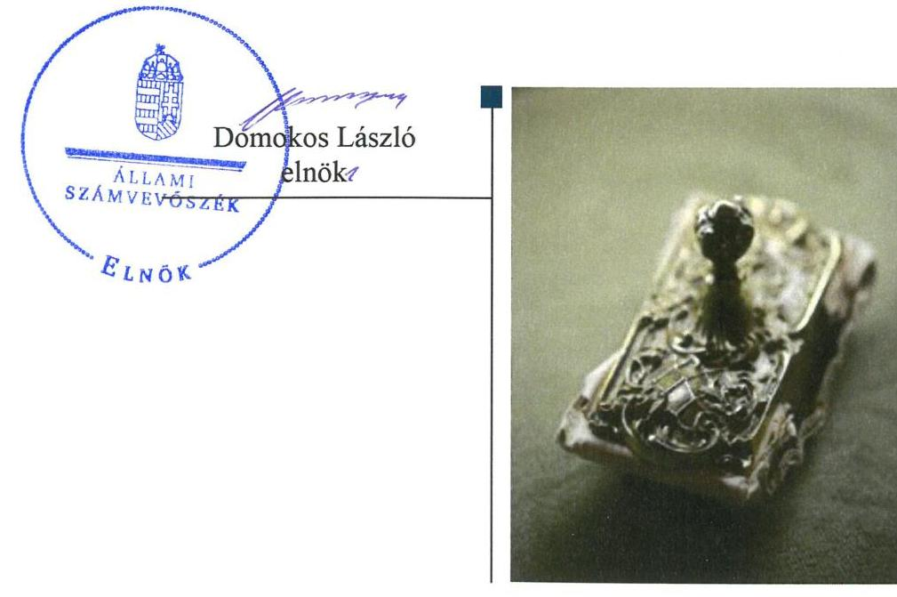
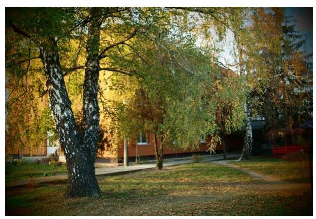
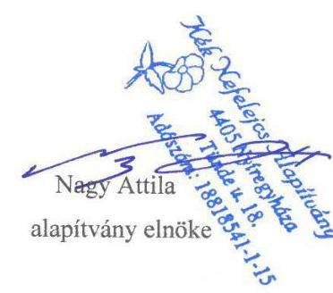
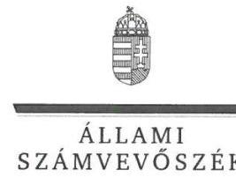
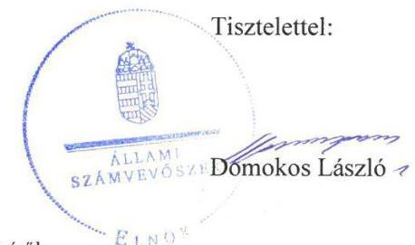

# Jelenetés 

## Nem állami humánszolgáltatók ellenőrzése

A humánszolgáltatást nyújtó államháztartáson kívüli szociális intézmények, szolgáltatók fenntartói központi költségvetésből kapott támogatásai felhasználásának ellenőrzése Kék Nefelejcs Alapítvány
2019.

---

# Jelentés 

## Nem állami humánszolgáltatók ellenőrzése

A humánszolgáltatást nyújtó államháztartáson kívüli szociális intézmények, szolgáltatók fenntartói központi költségvetésből kapott támogatásai felhasználásának ellenőrzése Kék Nefelejcs Alapítvány
2019. 08. hó 21. nap

---

# AZ ELLENŐRZÉST FELÜGYELTE:

- KAKAS SÁNDOR felügyeleti vezető
- AZ ELLENŐRZÉST VEZETTE ÉS A VÉGREHAJTÁSÁÉRT FELELŐS:
  - KUSZINGER ANDREA ellenőrzésvezető
  - KLINGER ZOLTÁN ellenőrzésvezető
- A PROGRAM ÖSSZEÁLLÍTÁSÁÉRT FELELŐS:
  - TÓTPÁL SZABOLCS osztályvezető

**IKTATÓSZÁM:** EL-1814-001/2019

**TÉMASZÁM:** 2491

**ELLENŐRZÉS-AZONOSÍTÓ SZÁM:** V083525

Jelentéseink az Országgyűlés számítógépes hálózatán és az Interneten a www.asz.hu címen is olvashatóak.

---

# TARTALOMJEGYZÉK 

■ ÖSSZEGZÉS ..... 5
■ AZ ELLENŐRZÉS CÉLJA ..... 6
■ AZ ELLENŐRZÉS TERÜLETE ..... 7
■ AZ ELLENŐRZÉS HÁTTERE, INDOKOLTSÁGA ..... 8
■ A JELENTÉS LÉNYEGES KÉRDÉSKÖREI ..... 9
■ AZ ELLENŐRZÉS HATÓKÖRE ÉS MÓDSZEREI ..... 10
■ MEGÁLLAPÍTÁSOK ..... 12
■ JAVASLATOK ..... 14
■ MELLÉKLETEK ..... 15
I. sz. melléklet: Értelmező szótár ..... 15
■ FÜGGELÉKEK ..... 17
I. sz. függelék a jelentéshez ..... 17
II. sz. függelék: Észrevételek ..... 18
■ RÖVIDÍTÉSEK JEGYZÉKE ..... 25

---

.

---

# ÖSSZEGZÉS 

A Kék Nefelejcs Alapítvány kialakította a szociális közfeladat ellátásának feltételeit és megteremtette a költségvetési támogatások átlátható, elszámoltatható igénybevételének, felhasználásának feltételeit. A szociális intézményei működtetésére felhasznált közpénzekre vonatkozó gazdálkodásával a nyilvánosság előtt nem számolt el, beszámoló készítési kötelezettségének nem tett eleget, ezáltal nem biztosította az elszámoltathatóságot és az átláthatóságot.

## Az ellenőrzés társadalmi indokoltsága

Az Állami Számvevőszék stratégiájában hangsúlyos szerepet szán annak, hogy szilárd szakmai alapon álló, értékteremtő ellenőrzéseivel előmozdítsa a közpénzügyek átláthatóságát, rendezettségét, és javaslataival a közpénzek és a közvagyon szabályos, gazdaságos, hatékony és eredményes felhasználását segítse. Az Állami Számvevőszék a stratégiájában célul tűzte ki, hogy az államháztartáson kívülre nyújtott költségvetési támogatások ellenőrzésével hozzájárul ahhoz, hogy a közpénzeket az államháztartáson kívüli szervezetek is átlátható módon használják fel a közfeladatok szerződésben vállalt ellátása érdekében. Az Állami Számvevőszék e stratégiai céljaival összhangban - az Állami Számvevőszékről szóló 2011. évi LXVI. törvény felhatalmazása alapján - végzi a központi költségvetésből származó források, nyújtott támogatások - kedvezményezett szervezetek közfeladat ellátásához való - felhasználásának az ellenőrzését.

## Főbb megállapítások, következtetések, javaslatok

A Kék Nefelejcs Alapítvány belső szabályozottságának kialakítása szabályszerű volt, rendelkezett alapító okirattal, számviteli politikával és az annak keretében elkészítendő szabályzatokkal, így biztosította a szabályszerű gazdálkodás feltételeit.

A központi költségvetési támogatásokat szabályszerűen fordította szociális intézményei működtetésére.
A Kék Nefelejcs Alapítvány a szociális közfeladatot ellátó intézményei működtetéséhez felhasznált közpénzekre vonatkozó gazdálkodásával a nyilvánosság előtt nem számolt el, mivel a 2015-2017. években beszámoló készítési kötelezettségének nem tett eleget, ezáltal nem biztosította az elszámoltathatóság és az átláthatóság elvének érvényesülését.

Az Állami Számvevőszék a jelentésben foglalt megállapítások alapján a Kék Nefelejcs Alapítvány kuratóriumi elnökének egy javaslatot fogalmazott meg. A javaslatot megalapozó megállapításra az érintettnek 30 napon belül intézkedési tervet kell készítenie.

---

# AZ ELLENŐRZÉS CÉLJA

**AZ ELLENŐRZÉS CÉLJA** annak értékelése, hogy a Kék Nefelejcs Alapítvány, mint Fenntartó¹ központi költségvetésből kapott támogatásainak felhasználása szabályszerű volt-e, a támogatások igénylése, évközi módosítása és év végi elszámolása megfelelte-e a jogszabályi előírásoknak.

---

# AZ ELLENŐRZÉS TERÜLETE 

## Kék Nefelejcs Alapítvány

A nyíregyházi székhelyű Kék Nefelejcs Alapítványt 2008-ban magánszemély alapította. A Kék Nefelejcs Alapítvány célja a pszichiátriai és szenvedélybetegek ápolása, támogatása, társadalmi beilleszkedésének elősegítése, a fogyatékos személyek társadalmi esélyegyenlőségének megteremtése, támogatása, fejlesztése, az időskorúak és fiatalkorúak támogatása, segítése, illetve gyermek- és ifjúságvédelem. A Kék Nefelejcs Alapítvány közhasznú jogállású szervezet, amely vállalkozási tevékenységet a 2015-2017. években nem folytatott.

A Kék Nefelejcs Alapítvány Kuratóriuma ${ }^{2} 3$ főből áll, képviseletét a Kuratórium elnöke önállóan gyakorolja. A 2015-2017. években a Kuratórium elnökének és tagjainak személyében változás nem volt.

A 2015-2017. években a Kék Nefelejcs Alapítvány két Nyíregyházán működő szociális humánszolgáltató intézmény fenntartásával és működtetésével vett részt az állami közfeladat-ellátásban, a „Reménység" Szenvedélybetegek Átmeneti Otthonában 33 férőhelyen, a Szent Katalin Szeretetotthonban 99 férőhelyen biztosított szociális ellátást. A Kék Nefelejcs Alapítvány a szociális közfeladat ellátása érdekében Nyíregyháza Megyei Jogú Város Önkormányzatával ellátási szerződést kötött.

A Kék Nefelejcs Alapítványt a 2015-2017. években ágazati pótlék, a szociális ellátáshoz kapcsolódó támogatás, valamint kiegészítő pótlék illette meg. A Kék Nefelejcs Alapítvány, mint intézményfenntartó által a szociális feladatellátáshoz kapott költségvetési támogatások összege a 2015. évben 100,8 millió Ft, a 2016. évben 105,2 millió Ft, a 2017. évben 123,9 millió Ft volt.

---

# AZ ELLENŐRZÉS HÁTTERE, INDOKOLTSÁGA 

A szociális feladatokat ellátó nem állami intézményfenntartók részére közfeladataik ellátására a 2015-2017. években jelentős összegű pénzügyi támogatást biztosítottak a mindenkori költségvetési törvények a bennük megfogalmazott feltételek mellett.

Az ÁSZ ${ }^{3}$ stratégiájában célul tűzte ki, hogy az államháztartáson kívülre nyújtott költségvetési támogatások ellenőrzésével hozzájárul ahhoz, hogy a közpénzeket az államháztartáson kívüli szervezetek is átlátható módon használják fel közfeladatok ellátására kötött szerződésekben vállalt ellátása érdekében. Az ÁSZ stratégiájában foglaltak alapján is indokolt az ellenőrzés, amely a társadalom számára jelzi, hogy a közpénz államháztartáson kívüli felhasználása sem maradhat ellenőrizetlenül. Az államháztartáson kívülre nyújtott költségvetési támogatások ellenőrzésével az ÁSZ hozzájárul ahhoz, hogy a közpénzeket a nem állami humán fenntartók átlátható módon használják fel a közfeladatok ellátására kötött szerződésekben vállalt kötelezettségek teljesítése érdekében. Az ellenőrzés javaslataival hozzájárulhat az említett rendszerek szabályszerű támogatás felhasználásához, javíthatja a társadalmi-gazdasági döntések megalapozottságát, amely a „jól irányított állam" feltétele.

---

# A JELENTÉS LÉNYEGES KÉRDÉSKÖREI 

1. A szociális humánszolgáltató közfeladatot ellátó Fenntartó szabályszerű működési- és gazdálkodási környezet kialakításával megteremtette-e a költségvetési támogatások átlátható, elszámoltatható igénybevételének, felhasználásának feltételeit?
2. A Fenntartó az átvállalt szociális humánszolgáltatási közfeladathoz biztosított költségvetési támogatásokat szabályszerűen fordította-e a humánszolgáltató intézményei működtetésére?
3. A Fenntartó a szociális humánszolgáltató intézményei működtetéséhez felhasznált közpénzekre vonatkozó gazdálkodásával a nyilvánosság előtt elszámolt-e?

---

# AZ ELLENŐRZÉS HATÓKÖRE ÉS MÓDSZEREI 

## Az ellenőrzés típusa

Megfelelőségi ellenőrzés.

## Az ellenőrzött időszak

A 2015. január 1-je és 2017. december 31-e közötti időszak. A helyszíni szemle tekintetében 2018. január 1-jétől 2019. február 6-ig tartó időszak.

## Az ellenőrzés tárgya

Az ellenőrzés a szociális humánszolgáltatási közfeladatokat ellátó államháztartáson kívüli Fenntartó humánszolgáltatási közfeladatai ellátásához a költségvetési törvényekben biztosított központi költségvetési támogatások igénylése, évközi módosítása és év végi elszámolása fenntartói feladatainak ellátása, illetve e központi költségvetésből kapott támogatásaik humánszolgáltatási közfeladatokra való fenntartó általi felhasználása szabályszerűségének értékelésére terjedt ki.

Az ellenőrzés kiterjedt minden olyan körülményre és adatra, amely az ÁSZ jogszabályban meghatározott feladatainak teljesítéséhez, valamint a program végrehajtása folyamán felmerült újabb összefüggések feltárásához szükséges volt.

## Az ellenőrzött szervezet

Kék Nefelejcs Alapítvány

## Az ellenőrzés jogalapja

Az ellenőrzés jogszabályi alapját az ÁSZ tv. 4. § (3) bekezdése és 5. § (3) bekezdésben foglalt előírások adták.

## Az ellenőrzés módszerei

Az ellenőrzést az ellenőrzési program szempontjai, kérdései, az ellenőrzött időszakban hatályos jogszabályok, a nemzetközi standardokat irányadónak tekintve, az ellenőrzés szakmai szabályok és módszertanok figyelembe vételével végezte az ÁSZ. A közpénzekkel való felelős gazdálkodás segítésére

---

irányuló javaslatok kidolgozásakor a hatályos jogszabályok voltak az irányadóak.

Az ellenőrzés ideje alatt az ellenőrzött szervezettel történő kapcsolattartást az ÁSZ SZMSZ²-ének vonatkozó előírásai alapján biztosította az ÁSZ.

Az ellenőrzési kérdések megválaszolásához szükséges bizonyítékok megszerzése az ellenőrzött által rendelkezésre bocsátott dokumentumokra, adatokra alapozva megfigyelés, szemle (szemrevételezés), kérdésfeltevés (információkérés), valamint elemző eljárással történt.

Az ellenőrzési bizonyítékként felhasználható adatforrások közé tartoztak egyrészt a szakmai program részletes szempontjainál felsorolt adatforrások, másrészt minden - az ellenőrzés folyamán feltárt, az ellenőrzés szempontjából információt tartalmazó - dokumentum.

Az ellenőrzés lefolytatásához az ellenőrzött szervezet a kitöltött tanúsítványok, valamint az ÁSZ által kért dokumentumok elektronikus úton való megküldésével szolgáltatott adatokat, információkat. Az így rendelkezésre bocsátott adatok, információk és a tanúsítványok adatai valódiságának kontrollja az ellenőrzés keretében történt.

A fenntartott szociális intézményeknél helyszíni szemle keretében győződött meg az ÁSZ a tényleges feladatellátásról (verifikáció).

A szociális humánszolgáltatások központi költségvetési támogatásai igénylésével, módosításával, elszámolásával kapcsolatos, államháztartáson kívüli fenntartó jogszabályokban előírt feladatai betartását, továbbá a központi költségvetési támogatások szabályszerű kezelését, nyilvántartását ellenőrizte az ÁSZ a Fenntartónál határozatok, nyilvántartások és egyéb dokumentumok alapján. Az ellenőrzés nem terjedt ki a szociális humánszolgáltatások központi költségvetési támogatásai igénylése, módosítása, elszámolása valódiságának, megalapozottságának, helyességének - sem a Fenntartónál, sem a székhely intézményeinél való - értékelésére. Továbbá nem terjedt ki az ellenőrzés e források, intézmények általi szabályszerű felhasználásának értékelésére.

---

# MEGÁLLAPÍTÁSOK 

## 1. A szociális humánszolgáltató közfeladatot ellátó Fenntartó szabályszerű működési- és gazdálkodási környezet kialakításával megteremtette-e a költségvetési támogatások átlátható, elszámoltatható igénybevételének, felhasználásának feltételeit?

Összegző megállapítás A Fenntartó szociális humánszolgáltatási közfeladat ellátásának megszervezése és belső szabályozottságának kialakítása szabályszerű volt. A Fenntartó a költségvetési támogatások igénylési, módosítási és elszámolási feladatait szabályszerűen látta el.

A FENNTARTÓ ALAPÍTÓ OKIRATTAL ${ }_{1,2}{ }^{6}$ a $\mathrm{Ptk}^{7}$. előírásai szerint rendelkezett és a Fenntartó kiadta a Kuratórium által jóváhagyott SZMSZ-t. ${ }^{8}$ A Fenntartót a Törvényszék ${ }^{9}$ nyilvántartásba vette.

SZÁMVITELI POLITIKÁVAL ${ }_{1,2}{ }^{10}$, valamint a számviteli politika keretében elkészítendő szabályzatokkal a Fenntartó a Számv. tv. ${ }^{11}$ szerint rendelkezett.

A KÖLTSÉGVETÉSI TÁMOGATÁSOK igénylése, módosítása és a Kincstár ${ }^{12}$ felé történő elszámolása szabályszerű volt.

## 2. A Fenntartó az átvállalt szociális humánszolgáltatási közfeladathoz biztosított költségvetési támogatásokat szabályszerűen fordította-e a humánszolgáltató intézményei működtetésére?

Összegző megállapítás A Fenntartó a szociális humánszolgáltatási közfeladathoz biztosított költségvetési támogatásokat szabályszerűen fordította a humánszolgáltató intézményei működtetésére.

A Fenntartó gondoskodott róla, hogy intézményei az SzCsM rendelet ${ }^{13}$ előírásai szerint szervezeti és működési szabályzattal rendelkezzenek, meghatározta az intézmények költségvetését, az intézmények által kérhető térítési díj összegét.

A Fenntartó a központi költségvetési támogatásokat átadta a szociális intézményei részére.

AZ ÁTADOTT KÖZPONTI KÖLTSÉGVETÉSI TÁMOGATÁSOKAT a Fenntartó az Atr. ${ }^{14}$ előírásai szerint feladatonkénti bontásban, elkülönítetten kezelte.

---

# 3. A Fenntartó a szociális humánszolgáltató intézményei működtetéséhez felhasznált közpénzekre vonatkozó gazdálkodásával a nyilvánosság előtt elszámolt-e? 

Összegző megállapítás A Fenntartó a szociális humánszolgáltató intézményei működtetéséhez felhasznált közpénzekre vonatkozó gazdálkodásával a nyilvánosság előtt nem számolt el.

A NYILVÁNOSSÁG ELŐTT a Fenntartó a közfeladatot ellátó szociális intézményei működtetéséhez felhasznált közpénzekre vonatkozó gazdálkodásával nem számolt el, mivel a Fenntartó a Civil tv. 28. § (1) bekezdésében foglaltak ellenére a 2015-2017. években beszámoló készítési kötelezettségének nem tett eleget.

---

# JAVASLATOK 

Az ÁSZ tv. 33. § (1) bekezdésében foglaltak értelmében az ellenőrzött szervezet vezetője köteles a jelentésben foglalt megállapításokhoz kapcsolódó intézkedési tervet összeállítani és azt a jelentés kézhezvételétől számított 30 napon belül az ÁSZ részére megküldeni. Amennyiben az ellenőrzött szervezet vezetője nem küldi meg határidőben az intézkedési tervet, vagy továbbra sem elfogadható intézkedési tervet küld, az Állami Számvevőszék elnöke az ÁSZ tv. 33. § (3) bekezdése a) és b) pontjaiban foglaltakat érvényesítheti.

## Kék Nefelejcs Alapítvány kuratóriumi elnökének

1. $\quad$ Tegyen eleget a beszámoló készítési kötelezettségének a jogszabályi előírások szerint.
(3. megállapítás 1. bekezdése alapján)

---

#
 MELLÉKLETEK 

- I. SZ. MELLÉKLET: ÉRTELMEZŐ SZÓTÁR
civil szervezet
ellátási terület
humánszolgáltatás
költségvetési támogatás
nem állami, nem önkormányzati (államháztartáson kívüli) intézmény fenntartó
székhely intézmény
telephely

A Civil tv. 2. § 6. pontja szerint civil szervezet a civil társaság, a Magyarországon nyilvántartásba vett egyesület (a párt, a szakszervezet és a kölcsönös biztosító egyesület kivételével), a közalapítvány és a pártalapítvány kivételével az alapítvány.
Az a terület, ahonnan az engedélyes gyermekeket, illetve más ellátottakat fogad.
Külön törvényben meghatározott szociális, gyermekjóléti, gyermekvédelmi, közoktatási, felsőoktatási, kulturális közfeladatok (2014. évi Kvtv. 34. § (1), (4) bekezdés, 1. számú melléklet XX/20/2. alcím, 19. alcím, 2015. évi Kvtv. 43. § (1), (4) bekezdés, 1. számú melléklet XX/20/2/3. jogcím csoport, 19. alcím, 2016. évi Kvtv. 41. § (1), (4) bekezdés, 1. számú melléklet XX/20/2/3. jogcím csoport, 19. alcím).
a társadalombiztosítás pénzügyi alapjai kivételével az államháztartás központi alrendszeréből ellenérték nélkül, pénzben nyújtott támogatások (Áht. 1. § 14. pont)
A költségvetési törvényekben (2013. évi CCXXX. törvény 33-34. §, 2014. évi C. törvény 42-43. §, 2015. évi C. törvény 40-41. §) megállapított támogatás. Például a 2015. évi C. törvény 40-41. § szerint többek között: Az Országgyűlés a szociális, gyermekjóléti, gyermekvédelmi közfeladatot ellátó intézményt, szolgáltatást fenntartó egyházi jogi személy, civil szervezet, közalapítvány, országos nemzetiségi önkormányzat, települési vagy területi nemzetiségi önkormányzat, gazdasági társaság, és a humánszolgáltatást alaptevékenységként végző, az Szja tv. hatálya alá tartozó egyéni vállalkozó (a továbbiakban együtt: nem állami szociális fenntartó) részére támogatást állapít meg a következők szerint: a támogatás a nem állami szociális fenntartót a települési önkormányzatok 2. melléklet III. pont 3. alpont c)-k) pontjában és III. pont 5. alpont a) pontjában meghatározott támogatásaival azonos jogcímeken, összegben és feltételek mellett illeti meg.
A szociális, gyermekjóléti és gyermekvédelmi közfeladatokat/humánszolgáltatásokat ellátó intézményt fenntartó egyházi jogi személy, társadalmi szervezet, alapítvány, közalapítvány, civil szervezet, országos nemzetiségi önkormányzat, nonprofit gazdasági társaság, gazdasági társaság és a humánszolgáltatást alaptevékenységként végző, Szja tv. hatálya alá tartozó egyéni vállalkozó. (2013. évi Kvtv. 35. § (1), (3) bekezdés, 2014. évi Kvtv. 33. §, 34. § (1), (4) bekezdés, 2015. évi Kvtv. 42. §, 43. § (1), (4) bekezdés, 2016. évi Kvtv. 40. §, 41. § (1), (4) bekezdés)
a szolgáltató székhelye, azaz a szolgáltató központi ügyintézésének helye, függetlenül attól, hogy használják-e szolgáltatás nyújtására (Sznyvhr. 1.§ k) pont) (hatályos: 2013. december 1-től)
a szolgáltató székhelyétől különböző, szolgáltató/intézmény használatában álló hely, a szociális humánszolgáltatáshoz használt, bejegyzett hely. (Sznyvhr. 1.§ l) pont) (hatályos: 2015. január 1-től)

---

.

---

# FÜGGELÉKEK 

- I. SZ. FÜGGELÉK A JELENTÉSHEZ

Az Állami Számvevőszék az ellenőrzések során feltárt tényekhez kapcsolódó további körülmények tisztázására eszközrendszerrel nem rendelkezik. Amennyiben az ellenőrzésen túlmutatóan indokoltnak látszik az ellenőrzés során feltárt körülmények további vizsgálata, az Állami Számvevőszék törvényi felhatalmazás alapján az ellenőrzés által feltárt körülményeket továbbítja a hatáskörrel rendelkező szervnek a szükséges intézkedések megtétele, eljárások lefolytatása érdekében.
A Fenntartó a Civil tv. 28. § (1) bekezdésében foglaltak ellenére a 2015-2017. években beszámoló készítési kötelezettségének nem tett eleget. A beszámolók hiányában nem igazolt, hogy a közhiteles nyilvántartásba érvényes, hiteles adatok kerültek, ezért a közzétett adatok megtévesztőek.
Az eset konkrét körülményeinek felderítésére a Törvényszék rendelkezik hatáskörrel.

---

A jelentéstervezetet a Számvevőszék 15 napos észrevételezésre megküldte az ellenőrzött szervezetek vezetőinek az ÁSZ tv. 29. § (1) bekezdése előírásának megfelelően.

A Kék Nefelejcs Alapítvány kuratóriumi elnöke a jelentéstervezet megállapításaira írásban észrevételt tett.
Az ÁSZ tv. 29. § (3) bekezdésével összhangban az ÁSZ a Függelékben feltünteti az ellenőrzés megállapításaival kapcsolatban tett, figyelembe nem vett észrevételeket, és megindokolja, hogy azokat miért nem fogadta el.

[^0]
[^0]:    * 29. § (1) Az Állami Számvevőszék az ellenőrzési megállapításait megküldi az ellenőrzött szervezet vezetőjének vagy az általa megbízott személynek, és annak, akinek személyes felelősségét állapította meg.
    (2) Az ellenőrzött szervezet vezetője és a felelősként megjelölt személy az ellenőrzés megállapításaira tizenöt napon belül írásban észrevételt tehet.
    (3) Az Állami Számvevőszék az észrevételre a beérkezésétől számított harminc napon belül írásban válaszol. A figyelembe nem vett észrevételeket köteles a jelentésben feltüntetni, és megindokolni, hogy azokat miért nem fogadta el.

---

# 312 

## Kék Nefelejcs Alapítvány

4405 Nyíregyháza, Tünde u. 18.
Tel: +3642/595-090
Mobil: +3670/601-22-68
E-mail: keknefelejcs.alapítvany@gmail.com

Állami Számvevőszék
Budapest, Apáczai Csere János utca 10.
1052
Iktatószám: EL-1127-034/2019.

Tárgy: Észrevételezés

## Tisztelt Elnök Úr!

Alulírott Nagy Attila, mint a Kék Nefelejcs Alapítvány elnöke a 2019.06.21. napján kézhez kapott „Nem állami humánszolgáltatók ellenőrzése - A humánszolgáltatást nyújtó államháztartáson kívüli szociális intézmények, szolgáltatók fenntartói központi költségvetésből kapott támogatásai felhasználásának ellenőrzése - Kék Nefelejcs Alapítvány" címmel készület számvevőszéki jelentéstervezetre az alábbi észrevételt kívánom tenni.

A jelentéstervezet 7. oldalán az ellenőrzési terület leírásánál, a harmadik bekezdésben leírják, hogy alapítványunk ,, a Szent Katalin Szeretetotthonban 71 férőhelyen biztosított szociális ellátást." Alapítványunk 3 darab érvényes működési engedéllyel rendelkezik szociális ellátásra, az alábbiak szerint: „Reménység" Szenvedélybetegek Átmeneti Otthona - 33 férőhely, Szent Katalin Szeretetotthon - 71 férőhely, Szent Katalin Szeretetotthon telephely 28 férőhely. A jelentéstervezetben kérném javítani a leírást.

A jelentéstervezet 13. oldalán összegző megállapításként szerepel, hogy a fenntartó (Kék Nefelejcs Alapítvány) 2015-2017. években beszámoló készítési kötelezettségének nem tett eleget. A vizsgált időszak beszámolóit 2015. évi beszámolót 2016.06.23. napján; a 2016. évi beszámolót 2017.05.30. napján; a 2017. évi beszámolót 2018.05.31. napján küldte meg alapítványunk az OBH felé, amely időpontos, dátumos hitelesítéssel megtalálható az online névjegyzékben. Ennek alapján kérném a jelentéstervezet módosítását, mivel alapítványunk

---

#  

## 4405 Nyíregyháza, Tünde u. 18.

Tel.: +3642/595-090
Mobil: +3670/601-22-68
E-mail: keknefelejcs.alapítvany@gmail.com
eleget tett a törvényi kötelezettségének és megküldte az OBH felé beszámolóit, valamint saját honlapunkon is nyilvánosságra hoztuk.

Kérem a fenti észrevételek szíves figyelembe vételét.

Nyíregyháza, 2019. június 24.

Tisztelettel:

---

# KÉK Nefelejcs Alapítvány

Ikt.szám: EL-1127-037/2019.

## Nagy Attila úr

kuratóriumi elnök

Kék Nefelejcs Alapítvány

Nyíregyháza

## Tisztelt Elnök Úr!

A „Nem állami humánszolgáltatók ellenőrzése – A humánszolgáltatást nyújtó államháztartáson kívüli szociális intézmények, szolgáltatók fenntartói központi költségvetésből kapott támogatásai felhasználásának ellenőrzése – Kék Nefelejcs Alapítvány” címmel készített számvevőszéki jelentéstervezetre tett észrevételeit megkaptam.

Az Állami Számvevőszék észrevételekre vonatkozó álláspontjáról a felügyeleti vezető által készített részletes tájékoztatást csatoltan megküldöm.

Tájékoztatom Elnök urat, hogy a számvevőszéki jelentésben – az Állami Számvevőszékről szóló 2011. évi LXVI. törvény 29. § (3) bekezdése alapján – a figyelembe nem vett észrevételeket szerepeltetjük az elutasítás indokának feltüntetésével.

Budapest, 2019. 07. hó 18. nap

Melléklet: Tájékoztatás az észrevételek kezeléséről

1052 BUDAPEST, APÁCZAI CSERE JÁNOS UTCA 10. 1364 Budapest 4. Pf. 54 telefon: 484 9101 fax: 484 9201

---

# Tájékoztatás az észrevételek kezeléséről 

A „Nem állami humánszolgáltatók ellenőrzése - A humánszolgáltatást nyújtó államháztartáson kívüli szociális intézmények, szolgáltatók fenntartói központi költségvetésből kapott támogatásai felhasználásának ellenőrzése - Kék Nefelejcs Alapítvány" címü jelentéstervezetre (továbbiakban: jelentéstervezet) a 2019. június 24 -én kelt levelében megküldött észrevételeit áttekintettem. Az észrevételek kezeléséről az alábbi tájékoztatást adom.

## 1) A jelentéstervezet 7. oldal 3. bekezdésére adott tájékoztatás

Elnök úr levelében tájékoztatott, hogy a Kék Nefelejcs Alapítvány (továbbiakban: Alapítvány) három db érvényes működési engedéllyel rendelkezik szociális ellátásra a következők szerint: „Reménység" Szenvedélybetegek Átmeneti Otthona - 33 férőhely, Szent Katalin Szeretetotthon - 71 férőhely, Szent Katalin Szeretetotthon telephely - 28 férőhely.

A levelében adott tájékoztatása alapján ismételten felülvizsgáltuk az adatszolgáltatás során az ÁSZ rendelkezésre bocsátott dokumentumokat és ennek eredményeként a jelentéstervezet 7. oldal 3. bekezdésének 1. mondatát pontosítjuk.

## 2) A jelentéstervezet 13. oldal 1. bekezdésére tett észrevétel

Elnök úr észrevételében jelezte, hogy az Alapítvány az ellenőrzött időszakra vonatkozó, 2015-2017. évi beszámolóit megküldte az Országos Bírósági Hivatal (továbbiakban: OBH) felé, amely időpontos, dátumos hitelesítéssel megtalálható az online névjegyzékben. Az Alapítvány az előbbiek alapján eleget tett a törvényi kötelezettségének és megküldte az OBH felé beszámolóit, valamint saját honlapján is nyilvánosságra hozta azokat.
Az ellenőrzés megállapítása arra vonatkozott, hogy az Alapítvány a 2015-2017. években a beszámoló készítési kötelezettségének nem tett eleget, amely kötelezettséget az egyesülési jogról, a közhasznú jogállásról, valamint a civil szervezetek működéséről és támogatásáról szóló 2011. évi CLXXV. törvény (továbbiakban: Civil tv.) 28. § (1) bekezdése írja elő. Az ÁSZ az ellenőrzési megállapításait az adatszolgáltatás során a részére törvényi határidőben rendelkezésre bocsátott dokumentumokra alapozva fogalmazza meg. A teljességi és hitelességi nyilatkozatuk szerint az ÁSZ részére átadott dokumentumok, adatok megbízhatóak, és a bekért adatokra, dokumentumokra vonatkozóan teljes körű információt tartalmaznak. A teljességi és hitelességi nyilatkozat alapján az Alapítvány nem bocsátott az ellenőrzés rendelkezésére olyan aláírt, hiteles dokumentumot, amely azt igazolja, hogy a Civil tv. 28. § (1) bekezdésében előírt beszámoló készítési

---

kötelezettségnek eleget tettek volna. Az aláírt, hiteles beszámoló jogszabályok szerinti elkészítését az észrevételben hivatkozott, az online névjegyzékben megtalálható és a saját honlapjukon nyilvánosságra hozott beszámoló nem igazolja.

A fentiekre tekintettel az észrevételt nem fogadjuk el, a jelentéstervezet módosítása nem indokolt.

Budapest, 2019. 07. hó 25. nap

Kakas Sándor
felügyeleti vezető

---

.

---

# RÖVIDÍTÉSEK JEGYZÉKE 

${ }^{1}$ Fenntartó
${ }^{2}$ Kuratórium
${ }^{3}$ ÁSZ
${ }^{4}$ ÁSZ tv.
${ }^{5}$ ÁSZ SZMSZ
${ }^{6}$ Alapító Okirat ${ }_{1,2}$
${ }^{7}$ Ptk.
${ }^{8}$ SZMSZ
${ }^{9}$ Törvényszék
${ }^{10}$ Számviteli politika ${ }_{1,2}$
${ }^{11}$ Számv. tv.
${ }^{12}$ Kincstár
${ }^{13}$ SzCsM rendelet
${ }^{14}$ Atr.
${ }^{15}$ Civil tv.

Kék Nefelejcs Alapítvány
Kék Nefelejcs Alapítvány kuratóriuma
Állami Számvevőszék
az Állami Számvevőszékről szóló 2011. évi LXVI. törvény (hatályos: 2011. július 1-jétől)
az Állami Számvevőszék Szervezeti és Működési Szabályzata
alapító okirat: Kék Nefelejcs Alapítvány alapító okirata (hatályos: 2013. szeptember 13-tól)
alapító okirat: Kék Nefelejcs Alapítvány alapító okirata (hatályos: 2016. január 12-től)
a Polgári Törvénykönyvről szóló 2013 évi V. törvény (hatályos: 2014. március 15-től)
Kék Nefelejcs Alapítvány Szervezeti és Működési Szabályzata (hatályos: 2013. november 15-től)
Nyíregyházi Törvényszék
számviteli politika: Kék Nefelejcs Alapítvány Számviteli politika (hatályos: 2015. január 1-jétől)
számviteli politika: Kék Nefelejcs Alapítvány Számviteli politika (hatályos: 2016. január 1-jétől)
a számvitelről szóló 2000. évi C. törvény (hatályos: 2001. január 1-jétől)
Magyar Államkincstár
a személyes gondoskodást nyújtó szociális intézmények szakmai feladatairól és működésük feltételeiről szóló 1/2000. (I. 7.) SzCsM rendelet (hatályos: 2000. január 22-től)
az egyházi és a nem állami fenntartású szociális, gyermekjóléti és gyermekvédelmi szolgáltatók, intézmények és hálózatok állami támogatásáról szóló 489/2013. (XII. 18.) Korm. rendelet
az egyesülési jogról, a közhasznú jogállásról, valamint a civil szervezetek működéséről és támogatásáról szóló 2011. évi CLXXV. törvény (hatályos: 2011. december 22-től)

---

# ÁLLAMI SZÁMVEVŐSZÉK 

1052 Budapest, Apáczai Csere János utca 10.
Levélcím: 1364 Budapest 4. Pf. 54
Telefon: +36 1 4849100 Telefax: +36 1 4849200
www.asz.hu

