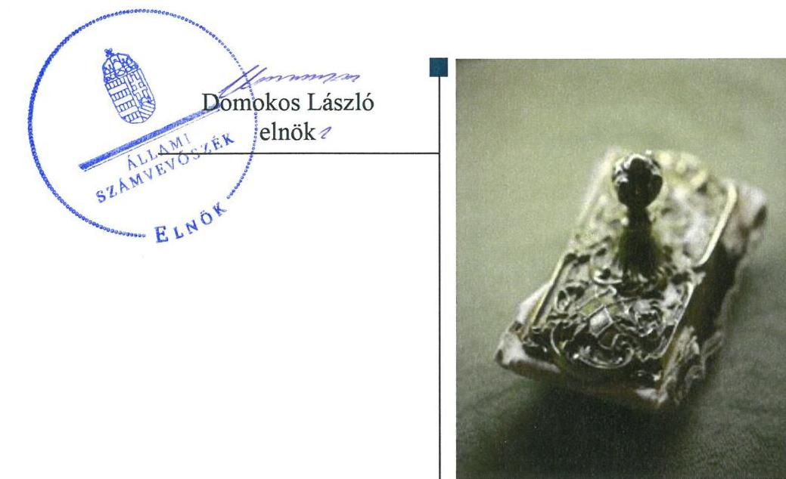
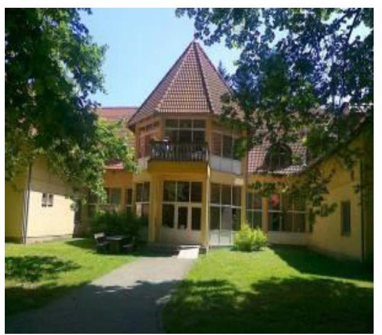

# Jelentés 

## Nem állami humánszolgáltatók ellenőrzése

A humánszolgáltatást nyújtó államháztartáson kívüli szociális intézmények, szolgáltatók fenntartói központi költségvetésből kapott támogatásai felhasználásának ellenőrzése - Hotel Béda Idősek Lakóotthona Közhasznú Nonprofit Korlátolt Felelősségű Társaság
2019.

---

# Jelentés 

## Nem állami humánszolgáltatók ellenőrzése

A humánszolgáltatást nyújtó államháztartáson kívüli szociális intézmények, szolgáltatók fenntartói központi költségvetésből kapott támogatásai felhasználásának ellenőrzése - Hotel Béda Idősek Lakóotthona Közhasznú Nonprofit Korlátolt Felelősségű Társaság
2019. 08. hó 29. nap

---

# AZ ELLENŐRZÉST FELÜGYELTE:

## TÓTH MARIANNA felügyeleti vezető

## AZ ELLENŐRZÉST VEZETTE ÉS A VÉGREHAJTÁSÁÉRT FELELŐS:

### DR. PELLEI TAMÁS ellenőrzésvezető

### A PROGRAM ÖSSZEÁLLÍTÁSÁÉRT FELELŐS:

### TÓTPÁL SZABOLCS osztályvezető

IKTATÓSZÁM: EL-1815-001/2019.

TÉMASZÁM: 2491

ELLENŐRZÉS-AZONOSÍTÓ SZÁM: V0835101

Jelentéseink az Országgyűlés számítógépes hálózatán és az Interneta a www.asz.hu címen is olvashatóak.

---

# TARTALOMJEGYZÉK 

■ ÖSSZEGZÉS ..... 5
■ AZ ELLENŐRZÉS CÉLJA ..... 6
■ AZ ELLENŐRZÉS TERÜLETE ..... 7
■ AZ ELLENŐRZÉS HÁTTERE, INDOKOLTSÁGA ..... 8
■ A JELENTÉS LÉNYEGES KÉRDÉSKÖRE ..... 9
■ AZ ELLENŐRZÉS HATÓKÖRE ÉS MÓDSZEREI ..... 10
■ MEGÁLLAPÍTÁSOK ..... 12
■ MELLÉKLETEK ..... 13
I. sz. melléklet: Értelmező szótár ..... 13
■ FÜGGELÉKEK ..... 15
I. sz. függelék a jelentéshez ..... 15
II. sz. függelék: Észrevételek ..... 16
■ RÖVIDÍTÉSEK JEGYZÉKE ..... 17

---

.

---

# ÖSSZEGZÉS 

A Hotel Béda Idősek Lakóotthona Közhasznú Nonprofit Korlátolt Felelősségű Társaság az idősek és fogyatékosok bentlakásos ellátásához igénybe vett közpénzekkel való gazdálkodása nem volt ellenőrizhető, elszámoltatható.

## Az ellenőrzés társadalmi indokoltsága

Az Állami Számvevőszék stratégiájában célul tűzte ki, hogy az államháztartáson kívülre nyújtott költségvetési támogatások ellenőrzésével hozzájáruljon ahhoz, hogy a közpénzeket az államháztartáson kívüli szervezetek is átlátható módon használják fel a közfeladatok szerződésben vállalt ellátása érdekében. Tekintettel az elmúlt években a szociális területet érintő finanszírozási változásokra, a társadalom fokozott érdeklődéssel figyeli a szociális feladatokra fordított források felhasználását. Fontos a közvélemény biztosítása arról, hogy a közpénz államháztartáson kívüli felhasználása ezen a területen sem marad ellenőrizetlenül.

A Hotel Béda Idősek Lakóotthona Nonprofit Korlátolt Felelősségű Társaságnál végzett ellenőrzést indokolta az is, hogy a szociális feladatok ellátásához az ellenőrzött időszakban 152,7 millió Ft központi költségvetési támogatásban részesült. Az ellenőrzés eredményeképpen a nyilvánosság és a szolgáltatást igénybe vevők megfelelő tájékoztatást kaphatnak az államháztartáson kívüli közfeladatot ellátó működéséről, a szociális területen történő közpénzfelhasználásról.

## Főbb megállapítások, következtetések

A Hotel Béda Idősek Lakóotthona Közhasznú Nonprofit Korlátolt Felelősségű Társaság a 2015-2017. években nem rendelkezett a jogszabályban előírt számviteli politikával és az annak keretében elkészítendő számviteli szabályzatokkal, ezáltal nem alakította ki a szabályszerű működés és gazdálkodás kereteit. A szabályzatok hiánya miatt a pénzgazdálkodás felelős végrehajtása, a számviteli elszámolások szabályszerűsége, illetve a közpénzekkel való rendeltetésszerű és felelős gazdálkodás nem volt biztosított. A jogszabályokban előírt beszámoló készítési kötelezettségének nem tett eleget.

Mindezek alapján a Hotel Béda Idősek Lakóotthona Közhasznú Nonprofit Korlátolt Felelősségű Társaságnál a költségvetési támogatások nem voltak ellenőrizhetőek, így a gazdálkodása nem volt elszámoltatható.

---

# AZ ELLENŐRZÉS CÉLJA 

AZ ELLENŐRZÉS CÉLJA annak értékelése, hogy a nem állami, nem önkormányzati szociális intézmények fenntartói központi költségvetésből kapott támogatásainak felhasználása szabályszerű volt-e, a támogatások igénylése, évközi módosítása és év végi elszámolása megfelelt-e a jogszabályi előírásoknak.

---

# AZ ELLENŐRZÉS TERÜLETE 

## Hotel Béda Idősek Lakóotthona Közhasznú Nonprofit Korlátolt Felelősségú Társaság

A Hotel Béda Idősek Lakóotthona Közhasznú Nonprofit Korlátolt Felelősségű Társaság, mint fenntartó közhasznú tevékenysége keretében az idősek, fogyatékosok bentlakásos ellátását végzi.

A Fenntartó ${ }^{1}$ tevékenysége ellátására a 2015. évben 46,0 millió Ft, a 2016. évben 47,9 millió Ft és a 2017. évben 58,8 millió Ft támogatást kapott a költségvetésből.

---

# AZ ELLENŐRZÉS HÁTTERE, INDOKOLTSÁGA 

A szociális feladatokat ellátó nem állami intézményfenntartók részére közfeladataik ellátására évente jelentős összegű pénzügyi támogatást biztosítottak a mindenkori költségvetési törvények² a bennük megfogalmazott feltételek mellett. A költségvetési törvények a szociális ágazat feladatai ellátására 273 Mrd Ft állami támogatás előirányzatot biztosítottak a 2015-2017. években. Módosították a szociális igazgatásról és szociális ellátásokról szóló 1993. évi III. törvényt, amely - többek között - 2012. január 1-jei hatállyal megfogalmazta a finanszírozási rendszerbe történő befogadással összefüggő szabályokat.

Az ÁSZ ${ }^{1}$ stratégiájában hangsúlyos szerepet szánt annak, hogy szilárd szakmai alapokon álló, értékteremtő ellenőrzéseivel előmozdítsa a közpénzügyek átláthatóságát, rendezettségét, és javaslataival a közpénzek és a közvagyon szabályos, gazdaságos, hatékony és eredményes felhasználását segítse. Az államháztartáson kívülre nyújtott költségvetési támogatások ellenőrzésével az ÁSZ hozzájárul ahhoz, hogy a közpénzeket a nem állami humán fenntartók átlátható módon használják fel a közfeladatok ellátására kötött szerződésekben vállalt kötelezettségek teljesítése érdekében. Az ellenőrzés javaslataival hozzájárulhat az említett rendszerek szabályszerű támogatás felhasználásához, javíthatja a társadalmi-gazdasági döntések megalapozottságát, amely a „jól irányított állam" múködéséhez járul hozzá.

Az ellenőrzés keretében egyedi kockázatelemzés alapján kiválasztott fenntartóknál és intézményeiknél értékeltük az államháztartáson kívüli szociális tevékenységhez kapcsolódó támogatások felhasználásának megfelelőségét.

---

# A JELENTÉS LÉNYEGES KÉRDÉSKÖRE 

- A Fenntartó szabályszerű müködési és gazdálkodási környezet kialakításával megteremtette-e a költségvetési támogatások átlátható, elszámoltatható igénybevételének, felhasználásának feltételeit?

---

# AZ ELLENŐRZÉS HATÓKÖRE ÉS MÓDSZEREI 

## Az ellenőrzés típusa

Megfelelőségi ellenőrzés.

## Az ellenőrzött időszak

A 2015. január 1-je és 2017. december 31-e közötti időszak.

## Az ellenőrzés tárgya

Az ellenőrzés a szociális humánszolgáltatási közfeladatokat ellátó államháztartáson kívüli fenntartó, humánszolgáltatási közfeladatai ellátásához a költségvetési törvényekben biztosított központi költségvetési támogatások igénylése, évközi módosítása és év végi elszámolása fenntartói feladatainak ellátása, illetve e központi költségvetésből kapott támogatásaik humánszolgáltatási közfeladatokra való fenntartó általi felhasználása szabályszerűségének értékelésére terjed ki.

## Az ellenőrzött szervezet

Hotel Béda Idősek Lakóotthona Közhasznú Nonprofit Korlátolt Felelősségű Társaság

## Az ellenőrzés jogalapja

Az ellenőrzés jogszabályi alapját az ÁSZ tv. ${ }^{2}$ 1. § (3) bekezdése, 5. § (3) bekezdésében foglalt előírások adják.

## Az ellenőrzés módszerei

Az ellenőrzést az ellenőrzési program szempontjai, kérdései, az ellenőrzött időszakban hatályos jogszabályok alapján, a nemzetközi standardokat irányadónak tekintve, az ellenőrzés szakmai szabályok és módszertanok figyelembe vételével végezte az ÁSZ.

Az ellenőrzés ideje alatt az ellenőrzött szervezettel történő kapcsolattartást az ÁSZ SZMSZ²-ének vonatkozó előírásai alapján biztosította az ÁSZ.

Az ellenőrzési kérdések megválaszolásához szükséges bizonyítékok megszerzése az ellenőrzött által rendelkezésre bocsátott

---

dokumentumokra, adatokra alapozva megfigyelés, szemle (szemrevételezés), kérdésfeltevés (információkérés), valamint elemző eljárással történt. Az ellenőrzési bizonyítékként felhasználható adatforrások közé tartoznak egyrészt az ellenőrzési program részletes szempontjainál felsorolt adatforrások, másrészt minden - az ellenőrzés folyamán feltárt, az ellenőrzés szempontjából információt tartalmazó dokumentum.

Amennyiben a Fenntartó múködését és gazdálkodását alapvetően meghatározó dokumentum hiánya miatt, valamely lényeges kérdéskörre vonatkozóan az ÁSZ megállapítást tett, további ellenőrzési tevékenységek az adott kérdéskörrel és az azzal szoros logikai kapcsolatban lévő kérdéskörökkel - ráépülő jelleggel - nem kerültek végrehajtásra.

---

# MEGÁLLAPÍTÁSOK 

## 1. A Fenntartó szabályszerű múködési és gazdálkodási környezet kialakításával megteremtette-e a költségvetési támogatások átlátható, elszámoltatható igénybevételének, felhasználásának feltételeit?

Összegző megállapítás

A Fenntartó nem teremtette meg a költségvetési támogatások elszámoltatható, átlátható igénybevételének és felhasználásának feltételeit.

A Fenntartó múködésének szabályozottsága, ennek keretében a gazdálkodásra vonatkozó belső szabályozás nem felelt meg a jogszabályi előírásoknak, mivel a 2015-2017. években nem rendelkezett a Számv. tv. ${ }^{4}$ 14. § (3) bekezdésében előírt számviteli politikával, a Számv. tv. 14. § (5) bekezdés a)-b) és d) pontjaiban előírt eszközök és források leltárkészítési és leltározási szabályzatával, az eszközök és források értékelési szabályzatával, valamint pénzkezelési szabályzattal.

A Fenntartó a beszámolási kötelezettségének a 2015-2017. években a Számv. tv. 4. § (1) bekezdésében foglaltak ellenére nem tett eleget, továbbá a közhasznúsági melléklet készítési kötelezettségét az Ectv. ${ }^{7} 46 . \S$ (1) bekezdésében foglaltak ellenére nem teljesítette.

---

# MELLÉKLETEK 

- I. SZ. MELLÉKLET: ÉRTELMEZŐ SZÓTÁR
költségvetési támogatás
közfeladat
szociális intézmény
nem állami, nem
önkormányzati
(államháztartáson kívüli)
intézmény fenntartó
a társadalombiztosítás pénzügyi alapjai kivételével az államháztartás központi alrendszeréből ellenérték nélkül, pénzben nyújtott támogatások (Áht. 1. § 14. pont)
A költségvetési törvényekben (2014. évi C. törvény 42-43. §, 2015. évi C. törvény 4041. §, 2016. évi XC. törvény 41. §) megállapított támogatás. Például a 2016. évi XC. törvény 41. § szerint többek között: Az Országgyűlés a szociális, gyermekjóléti, gyermekvédelmi közfeladatot ellátó intézményt, szolgáltatást fenntartó egyházi jogi személy, civil szervezet, közalapítvány, országos nemzetiségi önkormányzat, települési vagy területi nemzetiségi önkormányzat, gazdasági társaság, és a humánszolgáltatást alaptevékenységként végző, az Szja tv. hatálya alá tartozó egyéni vállalkozó (a továbbiakban együtt: nem állami szociális fenntartó) részére támogatást állapít meg a következők szerint: a támogatás a nem állami szociális fenntartót a települési önkormányzatok 2. melléklet III. pont 3. alpont c)-m) pontjában és III. pont 5. alpont a) pontjában meghatározott támogatásaival azonos jogcímeken, összegben és feltételek mellett illeti meg.
„Közfeladat a jogszabályokban meghatározott állami vagy önkormányzati feladat. ... A közfeladatok ellátásában államháztartáson kívüli szervezet jogszabályban meghatározott rendben közremüködhet." A közfeladatok meghatározó jogszabályban meg kell határozni a közfeladat ellátásának módját és egyidejűleg rendezni kell annak az ellátásához szükséges pénzügyi fedezet biztosításáról. (Az államháztartásról szóló 2011. évi CXCV. törvény 3/A. § (1)-(3) bekezdés)
A szociális igazgatásról szóló 1993. évi III. törvényben meghatározott nappali, illetve bentlakásos ellátást, vagy támogatott lakhatást nyújtó szervezet. (Szoc.tv. 4. § (1) bekezdés (h) pont)
A szociális, gyermekjóléti és gyermekvédelmi közfeladatokat /humánszolgáltatásokat ellátó intézményt fenntartó egyházi jogi személy, társadalmi szervezet, alapítvány, közalapítvány, civil szervezet, országos nemzetiségi önkormányzat, nonprofit gazdasági társaság, gazdasági társaság és a humánszolgáltatást alaptevékenységként végző, Szja tv. hatálya alá tartozó egyéni vállalkozó. (2013. évi Kvtv. 35. § (1), (3) bekezdés, 2014. évi Kvtv. 33. §, 34. § (1), (4) bekezdés, 2015. évi Kvtv. 42. §, 43. § (1), (4) bekezdés, 2016. évi Kvtv. 40. §, 41. § (1), (4) bekezdés, 2017. évi Kvtv. 41. § (1), (4))

---

.

---

# FÜGGELÉKEK 

- I. SZ. FÜGGELÉK A JELENTÉSHEZ

Az Állami Számvevőszék az ellenőrzések során feltárt tényekhez kapcsolódó további körülmények tisztázására eszközrendszerrel nem rendelkezik. Amennyiben az ellenőrzésen túlmutatóan indokoltnak látszik az ellenőrzés során feltárt körülmények további vizsgálata, az Állami Számvevőszék törvényi felhatalmazás alapján az ellenőrzés által feltárt körülményeket továbbítja a hatáskörrel rendelkező szervnek a szükséges intézkedések megtétele, eljárások lefolytatása érdekében.
I. A Fenntartó 2015-2017. évekre vonatkozóan nem rendelkezett a Számv. tv. 14. § (3) és 14. § (5) bekezdés a)-b) és d) pontjaiban elöirt számviteli politikával és az annak keretében elkészítendő, az eszközök és a források leltárkészittési és leltározási szabályzatával, az eszközök és a források értékelési szabályzatával, valamint pénzkezelési szabályzattal. A Számv. tv. 4. § (1) bekezdésében elöirt, a 96. §-ban meghatározott tartalmú beszámolási kötelezettségének nem tett eleget, az Ectv. 46. § (1) bekezdésében elöirt közhasznúsági mellékletet nem készített. Ezáltal a Fenntartó a Számv. tv. 169. § (2) bekezdésében foglalt bizonylat-megőrzési kötelezettségének sem tett eleget.
A számviteli szabályzatok hiányában nem volt igazolt, hogy a Fenntartó a költségvetési támogatásokat a szociális intézménye müködtetésére fordította, vagyis nem zárható ki, hogy a költségvetésből származó pénzeszközöket a jóváhagyott céltól eltérően használta fel. Az éves számviteli beszámolók hiánya miatt a Fenntartó a költségvetésből származó pénzeszközökkel kapcsolatban sem teljesítette az elöirt számadási, elszámolási kötelezettségét. A szociális közfeladat ellátásához a Fenntartó 2015. évben 46,0 millió Ft, a 2016. évben 47,9 millió Ft és a 2017. évben 58,8 millió Ft támogatást kapott a költségvetésből.
Az eset összes körülményének felderítésére az ügyészség rendelkezik hatáskörrel.
II. A számviteli szabályzatok hiánya miatt felvetődik a költségvetési támogatások felhasználásának szabálytalansága.
Az eset összes körülményének feltárására a Magyar Államkincstár rendelkezik hatáskörrel.

---

A jelentéstervezetet a Számvevőszék 15 napos észrevételezésre megküldte az ellenőrzött szervezet vezetőjének az ÁSZ tv. 29. §* (1) bekezdése előírásának megfelelően.

A Hotel Béda Idősek Lakóotthona Közhasznú Nonprofit Korlátolt Felelősségű Társaság ügyvezetője az ÁSZ tv. 29.§ (2) bekezdésben foglalt észrevételezési jogával nem élt, a jelentéstervezetre észrevételt nem tett.

[^0]
[^0]:    * 29. § (1) Az Állami Számvevőszék az ellenőrzési megállapításait megküldi az ellenőrzött szervezet vezetőjének vagy az általa megbízott személynek, és annak, akinek személyes felelősségét állapította meg.
    (2) Az ellenőrzött szervezet vezetője és a felelősként megjelölt személy az ellenőrzés megállapításaira tizenöt napon belül írásban észrevételt tehet.
    (3) Az Állami Számvevőszék az észrevételre a beérkezésétől számított harminc napon belül írásban válaszol. A figyelembe nem vett észrevételeket köteles a jelentésben feltüntetni, és megindokolni, hogy azokat miért nem fogadta el.

---

# RÖVIDÍTÉSEK JEGYZÉKE 

${ }^{1}$ Fenntartó
${ }^{2}$ költségvetési törvények
${ }^{1}$ ÁSZ
${ }^{2}$ ÁSZ tv.
${ }^{3}$ ÁSZ SZMSZ
${ }^{4}$ Számv. tv.
${ }^{7}$ Ectv.

Hotel Béda Idősek Lakóotthona Közhasznú Nonprofit Korlátolt Felelősségű Társaság
Magyarország 2015. évi központi költségvetéséről szóló 2014. évi C. törvény (hatályos: 2015. január 1-jétől 2018. december 31-éig)
Magyarország 2016. évi központi költségvetéséről szóló 2015. évi C. törvény (hatályos: 2015. július 4-étől)
Magyarország 2017. évi központi költségvetéséről szóló 2016. évi XC. törvény (hatályos: 2016. november 1-jétől)
Állami Számvevőszék
Az Állami Számvevőszékről szóló 2011. évi LXVI. törvény (hatályos: 2011. július 1-jétől)
Állami Számvevőszék Szervezeti és Működési Szabályzata
A számvitelről szóló 2000. évi C. törvény (hatályos: 2001. január 1-jétől)
Az egyesülési jogról, a közhasznú jogállásról, valamint a civil szervezetek müködéséről és támogatásáról szóló 2011. évi CLXXV. törvény (hatályos: 2011. december 22-étől)

---

ÁLLAMI SZÁMVEVŐSZÉK
1052 Budapest, Apáczai Csere János utca 10.
Levélcím: 1364 Budapest 4. Pf. 54
Telefon: +36 14849100 Telefax: +36 14849200
www.asz.hu