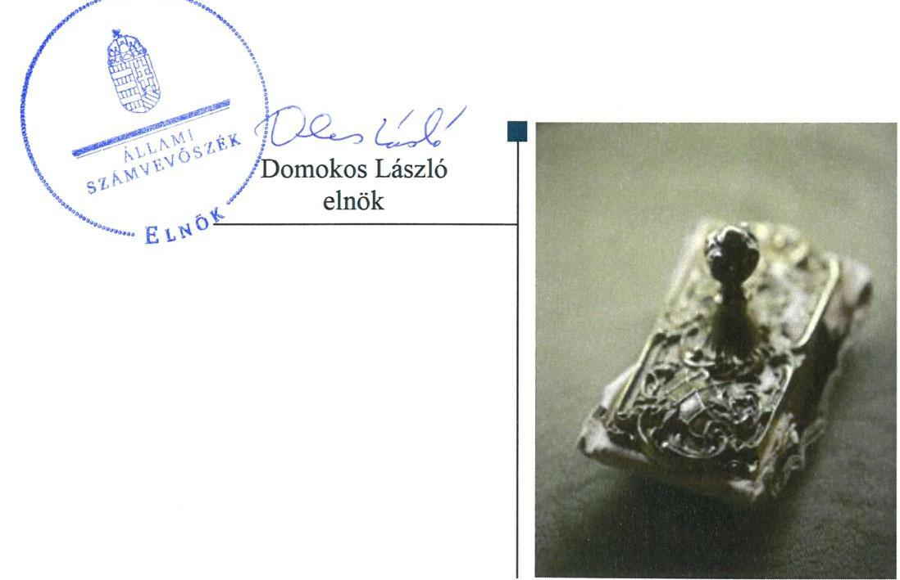
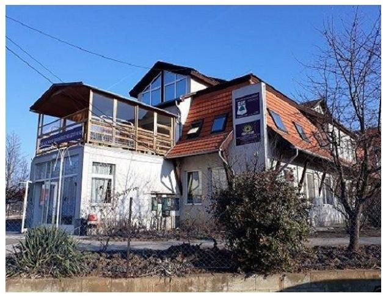
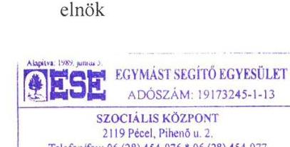
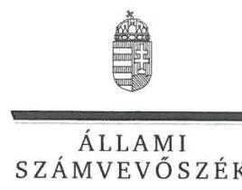
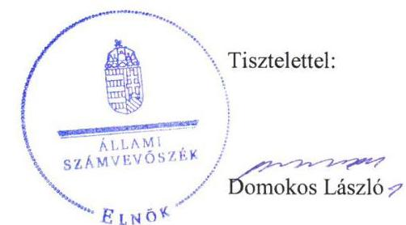

# Jelentés 

## Nem állami humánszolgáltatók ellenőrzése

A humánszolgáltatást nyújtó államháztartáson kívüli szociális intézmények, szolgáltatók fenntartói központi költségvetésből kapott támogatásai felhasználásának ellenőrzése Egymást Segítő Egyesület 2019.

---

# Jelentés 

## Nem állami humánszolgáltatók ellenőrzése

A humánszolgáltatást nyújtó államháztartáson kívüli szociális intézmények, szolgáltatók fenntartói központi költségvetésből kapott támogatásai felhasználásának ellenőrzése Egymást Segítő Egyesület
2019. 09. hó 24. nap

---

# AZ ELLENŐRZÉST FELÜGYELTE: 

KAKAS SÁNDOR felügyeleti vezető

## AZ ELLENŐRZÉST VEZETTE ÉS A VÉGREHAJTÁSÁÉRT FELELŐS:

KEREKES PÉTER ÉS MOLNÁR ZSUZSANNA ellenőrzésvezetők

## A PROGRAM ÖSSZEÁLLÍTÁSÁÉRT FELELŐS:

TÓTPÁL SZABOLCS osztályvezető

IKTATÓSZÁM: EL-1937-001/2019.
TÉMASZÁM: 2448

## ELLENŐRZÉS-AZONOSÍTÓ SZÁM: V083521

Jelentéseink az Országgyúlés számítógépes hálózatán és az Interneten a www.asz.hu címen is olvashatóak.

---

# TARTALOMJEGYZÉK 

■ ÖSSZEGZÉS ..... 5
■ AZ ELLENŐRZÉS CÉLJA ..... 6
■ AZ ELLENŐRZÉS TERÜLETE ..... 7
■ AZ ELLENŐRZÉS HÁTTERE, INDOKOLTSÁGA ..... 8
■ A JELENTÉS LÉNYEGES KÉRDÉSKÖREI ..... 9
■ AZ ELLENŐRZÉS HATÓKÖRE ÉS MÓDSZEREI ..... 10
■ MEGÁLLAPÍTÁSOK ..... 12
■ JAVASLATOK ..... 14
■ MELLÉKLETEK ..... 15
I. sz. melléklet: Értelmező szótár ..... 15
■ FÜGGELÉKEK ..... 17
I. sz. függelék a jelentéshez ..... 17
II. sz. függelék: Észrevételek ..... 18
■ RÖVIDÍTÉSEK JEGYZÉKE ..... 31

---

.

---

# ÖSSZEGZÉS 

Az Egymást Segítő Egyesület kialakította a szociális közfeladat ellátására szolgáló költségvetési támogatások igénybevételének és felhasználásának feltételeit, azonban nem biztosította az igénybe vett támogatások felhasználásának átláthatóságát. Intézményei közfeladatellátási kereteit és müködési feltételeit megteremtette.

## Az ellenőrzés társadalmi indokoltsága

Az Állami Számvevőszék stratégiájában célul tűzte ki, hogy az államháztartáson kívülre nyújtott költségvetési támogatások ellenőrzésével hozzájáruljon ahhoz, hogy a közpénzeket az államháztartáson kívüli szervezetek is átlátható módon használják fel a közfeladatok szerződésben vállalt ellátása érdekében. Tekintettel az elmúlt években a szociális területet érintő finanszírozási változásokra, a társadalom fokozott érdeklődéssel figyeli a szociális feladatokra fordított források felhasználását. Fontos a közvéleményt biztosítani arról, hogy a közpénz államháztartáson kívüli felhasználása ezen a területen sem marad ellenőrizetlenül. Az ellenőrzés eredményeképpen a nyilvánosság és a szolgáltatást igénybe vevők megfelelő tájékoztatást kaphatnak az államháztartáson kívüli közfeladatot ellátók működéséről.

Az Egymást Segítő Egyesületnél végzett ellenőrzést további társadalmi elvárás is indokolta tevékenységéből adódóan, mivel szociális közfeladat ellátására több mint 380 millió Ft központi költségvetési támogatásban részesült az Egyesület az ellenőrzött időszakban.

## Főbb megállapítások, következtetések, javaslatok

Az Egymást Segítő Egyesület működési és gazdálkodási környezetét a jogszabályi előírások szerint alakította ki, ezáltal megteremtette a költségvetési támogatások igénybevételének és felhasználásának feltételeit.

Kialakította humánszolgáltatást végző intézményei működési kereteit. Az intézményi térítési díjak meghatározásával biztosította a közszolgáltatás igénybevétele feltételeinek átláthatóságát.

A közfeladat ellátására igénybevett támogatások számviteli rendben történő kezelése, valamint 2015. november 28. és 2017. december 31. között a támogatások felhasználásának nyilvántartása nem a jogszabályi előírások szerint történt, ezáltal a támogatások cél szerinti felhasználása nem volt átlátható.

Szociális humánszolgáltató intézményei működtetéséhez felhasznált közpénzekkel való gazdálkodásáról - beszámolási és közzétételi kötelezettségének teljesítésével - elszámolt a nyilvánosság előtt.

Az Állami Számvevőszék a jelentésben foglalt megállapítások alapján az Egymást Segítő Egyesület elnökének egy javaslatot fogalmazott meg. A javaslatokat megalapozó megállapításokra az érintettnek 30 napon belül intézkedési tervet kell készítenie.

---

# AZ ELLENŐRZÉS CÉLJA 

AZ ELLENŐRZÉS CÉLJA annak értékelése, hogy az Egymást Segítő Egyesület központi költségvetésből kapott támogatásainak felhasználása szabályszerű volt-e, a támogatások igénylése, évközi módosítása és év végi elszámolása megfelelt-e a jogszabályi előírásoknak.

---

# **AZ ELLENŐRZÉS TERÜLETE**

## **Egymást Segítő Egyesület, mint intézményfenntartó**

Az Egymást Segítő Egyesület 1989-ben jött létre Pécelen. Célja, a rászorult emberek, közösségek felderítése, a velük való kapcsolat megteremtése segítségnyújtás céljából. További célja, hogy együttműködésével támogassa a már működő kreatív csoportokat, elősegítse új szervezetek alakulását, keretet adjon minden humán célú egyéni és társas kezdeményezésnek, társadalomsegítő közösségnek.

A Fenntartó1 közhasznú jogállású szervezet volt, vállalkozási tevékenységet 2015-2016. években folytatott.

Úgyvezető szerve az Elnökség2 volt, a Fenntartó képviseletét az Elnökség tagjaiból választott Elnök3 gyakorolta, akinek személyében nem történt változás az ellenőrzött időszakban.

A Fenntartó szociális közfeladatait önálló jogi személyiséggel nem rendelkező intézményei1,24 révén látta el.

A péceli székhelyű Baczoni István Rehabilitációs és Ápoló Otthonban 82 férőhelyes idősek otthona, az Isaszegen működő Alemany Erzsébet Segítő Ház, Rehabilitációs és Ápoló Otthonban 112 férőhelyes idősotthon, 10 férőhelyes fogyatékos személyek rehabilitációs célú lakóotthona, és Támogató Szolgálat működött.

A Fenntartó összes bevétele 2015-ben 407,4 M Ft, 2016-ban 472,0 M Ft volt, amely 2017-ben 538,7 M Ft-ra emelkedett. A költségvetési támogatás (109,6 M Ft) összes bevételhez viszonyított aránya 2015-ben 26,9%, 2016-ban (125 M Ft) 26,5% volt, ami 2017-re – a 154,9 M Ft-os támogatási öszszeggel – 28,7%-ra emelkedett.

---

# AZ ELLENŐRZÉS HÁTTERE, INDOKOLTSÁGA 

A szociális feladatokat ellátó nem állami intézményfenntartók részére közfeladataik ellátására évente jelentős összegű pénzügyi támogatást biztosítottak a mindenkori költségvetési törvények a bennük megfogalmazott feltételek mellett. A felhasználható állami támogatások a Kvtv.-ekben (a 2014. évi C. törvény Magyarország 2015. évi központi költségvetéséről, 2015. évi C. törvény Magyarország 2016. évi központi költségvetéséről, 2016. évi XC. törvény Magyarország 2017. évi központi költségvetéséről) a 2015-2017. években a szociális ágazatra vonatkozóan 273 Mrd Ft előirányzatot határoztak meg. Módosították a szociális igazgatásról és szociális ellátásokról szóló 1993. évi III. törvényt, amely - többek között - 2012. január 1-jei hatállyal megfogalmazta a finanszírozási rendszerbe történő befogadással összefüggő szabályokat.

Az ÁSZ ${ }^{5}$ stratégiájában foglaltak alapján is indokolt az ellenőrzés, amely a társadalom számára jelzi, hogy a közpénz államháztartáson kívüli felhasználása sem maradhat ellenőrizetlenül. Az államháztartáson kívülre nyújtott költségvetési támogatások ellenőrzésével az ÁSZ hozzájárul ahhoz, hogy a közpénzeket a nem állami humán fenntartók átlátható módon használják fel a közfeladatok ellátására kötött szerződésekben vállalt kötelezettségek teljesítése érdekében. Az ellenőrzés javaslataival hozzájárulhat az említett rendszerek szabályszerű támogatás felhasználásához, javíthatja a társa-dalmi-gazdasági döntések megalapozottságát, amely a „jól irányított állam" működéséhez járul hozzá.

A holisztikus megközelítés jegyében az ellenőrzés keretében egyedi kockázatelemzés alapján kiválasztott fenntartóknál és intézményeiknél értékeljük az államháztartáson kívüli szociális tevékenységhez kapcsolódó támogatások felhasználásának megfelelőségét.

---

# A JELENTÉS LÉNYEGES KÉRDÉSKÖREI 

1. A Fenntartó szabályszerű müködési - és gazdálkodási környezet kialakításával megteremtette-e a költségvetési támogatások átlátható, elszámoltatható igénybevételének, felhasználásának feltételeit?
2. A Fenntartó az átvállalt szociális humánszolgáltatási közfeladathoz biztositott költségvetési támogatásokat szabályszerüen fordította-e a humánszolgáltató intézményei müködtetésére?
3. A Fenntartó a szociális humánszolgáltató intézményei müködtetéséhez felhasznált közpénzekre vonatkozó gazdálkodásával a nyilvánosság előtt elszámolt-e, ennek megalapozása érdekében ellenőrzési, értékelési és a külső ellenőrzésekkel kapcsolatos intézkedési feladatait szabályszerüen látta-e el?

---

# AZ ELLENŐRZÉS HATÓKÖRE ÉS MÓDSZEREI 

## Az ellenőrzés típusa

Megfelelőségi ellenőrzés.

## Az ellenőrzött időszak

A 2015. január 1-je és 2017. december 31-e közötti időszak. A helyszíni szemle tekintetében 2018. január 1-jétől az utolsó helyszíni szemle időpontjáig (2019. február 20-ig) tartó időszak.

## Az ellenőrzés tárgya

Az ellenőrzés a szociális humánszolgáltatási közfeladatokat ellátó államháztartáson kívüli fenntartók, humánszolgáltatási közfeladatai ellátásához a költségvetési törvényekben biztosított központi költségvetési támogatások igénylése, évközi módosítása és év végi elszámolása fenntartói feladatainak ellátása, illetve e központi költségvetésből kapott támogatásaik humánszolgáltatási közfeladatokra való fenntartó általi felhasználása szabályszerűségének értékelésére terjedt ki.

## Az ellenőrzött szervezet

Az Egymást Segítő Egyesület, mint intézményfenntartó.

## Az ellenőrzés jogalapja

Az ellenőrzés jogszabályi alapját az ÁSZ tv. ${ }^{6} 1 . \S$ (3) bekezdésében, az 5. § (3) bekezdésében foglalt előírások adták.

## Az ellenőrzés módszerei

Az ellenőrzést az ellenőrzési program szempontjai, kérdései, az ellenőrzött időszakban hatályos jogszabályok alapján, a nemzetközi standardokat irányadónak tekintve, az ellenőrzés szakmai szabályok és módszertanok figyelembe vételével végezte az ÁSZ. A közpénzekkel való felelős gazdálkodás segítésére irányuló javaslatok kidolgozásakor a hatályos jogszabályok voltak az irányadóak.

Az ellenőrzés ideje alatt az ellenőrzött szervezettel történő kapcsolattartást az ÁSZ SZMSZ7-ének vonatkozó előírásai alapján biztosította az ÁSZ.

---

Az ellenőrzési kérdések megválaszolásához szükséges bizonyítékok megszerzése az ellenőrzött által rendelkezésre bocsátott dokumentumokra, adatokra alapozva megfigyelés, szemle (szemrevételezés), kérdésfeltevés (információkérés), valamint elemző eljárással történt. Az ellenőrzési bizonyítékként felhasználható adatforrások közé tartoznak egyrészt az ellenőrzési program részletes szempontjainál felsorolt adatforrások, másrészt minden - az ellenőrzés folyamán feltárt, az ellenőrzés szempontjából információt tartalmazó - dokumentum.

Az ellenőrzés lefolytatásához az ellenőrzött szervezet a kitöltött tanúsítványok, valamint az ÁSZ által kért dokumentumok elektronikus úton való megküldésével szolgáltatott adatokat, információkat. Az így rendelkezésre bocsátott adatok, információk és a tanúsítványok adatai valódiságának kontrollja az ellenőrzés keretében történt.

Az ellenőrzést a szociális humánszolgáltatások esetében a központi költségvetési támogatások igénylésével, módosításával, felhasználásával, elszámolásával kapcsolatos feladatokat ellátó államháztartáson kívüli fenntartóknál/szervezeteinél végezte az ÁSZ. A fenntartott intézményeknél helyszíni szemle keretében győződött meg a tényleges feladatellátásról (verifikáció).

A szociális humánszolgáltatások központi költségvetési támogatásai igénylésével, módosításával, elszámolásával kapcsolatos, államháztartáson kívüli fenntartó jogszabályokban előírt feladatai betartását, továbbá a központi költségvetési támogatások szabályszerű kezelését, nyilvántartását ellenőrizte az ÁSZ a fenntartónál, az ott rendelkezésre álló határozatok, nyilvántartások, beszámolók és egyéb dokumentumok alapján. Az ellenőrzés nem terjedt ki a szociális humánszolgáltatások központi költségvetési támogatásai igénylése, módosítása, elszámolása valódiságának, megalapozottságának, helyességének - sem a fenntartónál, sem a székhely intézményeinél való - értékelésére (mivel ennek felülvizsgálata, ellenőrzése a finanszírozó jogszabályban előírt feladata, határozatai kiadása előtt). Továbbá nem terjedt ki az ellenőrzés e források, intézmények általi szabályszerű felhasználásának értékelésére.

---

# 1. A Fenntartó szabályszerű múködési - és gazdálkodási környezet kialakításával megteremtette-e a költségvetési támogatások átlátható, elszámoltatható igénybevételének, felhasználásának feltételeit? 

Összegző megállapítás

A Fenntartó kialakította a szabályszerű múködési és gazdálkodási környezetet.

A Fenntartó a Ptk. ${ }^{8}$ előírása szerinti Alapszabályában ${ }_{1,2}{ }^{9}$ határozta meg múködési rendjét, tevékenységét, illetve az ahhoz kapcsolódó felelősségi és hatásköröket, azok gyakorlásának módját. Szervezeti felépítését és a helyettesítés rendjét SZMSZ ${ }^{10}$-ében szabályozta. Rendelkezett a Számv. tv. ${ }^{11}$ ben előírtak szerinti számviteli politikával ${ }_{1,2}{ }^{12}$, és az annak keretében elkészítendő leltározási szabályzattal ${ }_{1,2}{ }^{13}$, értékelési szabályzattal ${ }_{1,2}{ }^{14}$ és pénzkezelési szabályzattal ${ }_{1,2}{ }^{15}$. Elkészítette a Számv. tv. előírása szerinti számlarendjét ${ }^{16}$.

A költségvetési támogatások iránti igényét és elszámolását a Fenntartó az Atr. ${ }^{17}$-ben előírtak szerint nyújtotta be a Kincstárhoz ${ }^{18}$, a támogatásokat megállapító és az elszámoló kincstári határozatokkal rendelkezett.

## 2. A Fenntartó az átvállalt szociális humánszolgáltatási közfeladathoz biztosított költségvetési támogatásokat szabályszerűen fordította-e a humánszolgáltató intézményei múködtetésére?

Összegző megállapítás

A Fenntartó a szociális humánszolgáltatási közfeladat ellátására biztosított költségvetési támogatásokat nem szabályszerűen fordította humánszolgáltató intézményei múködtetésére. Intézményei múködési kereteit a jogszabályi előírások szerint kialakította.

A Fenntartó 2015. november 28. és 2017. december 31. között - a Civil tv. ${ }^{19} 20 . \S$ (4) bekezdésében foglaltak ellenére - nem vezetett az alapcél szerinti tevékenysége költségei, ráfordításai ellentételezésére kapott támogatásokról olyan elkülönített számviteli nyilvántartást, melynek alapján támogatásonként megállapítható és ellenőrizhető lett volna a kapott támogatás felhasználása. A fenntartó és az egyes szolgáltatók gazdálkodását számviteli rendjében - az Atr. 16. § (1) bekezdésében foglaltak ellenére nem kezelte feladatonként elkülönítve.

A Fenntartó a Szoctv. ${ }^{20}$ és az 1/2000. SzCsM rendelet ${ }^{21}$ előírása szerint gondoskodott az intézmények ${ }_{1,2}$ SZMSZ ${ }^{22}{ }_{1,2}$-ének, szakmai programjának ${ }_{1-4}{ }^{23}$ és házirendjének ${ }_{1-4}{ }^{24}$ az elkészítéséről. Az intézményi SZMSZ-ek ${ }_{1,2}$

---

tartalmazták az intézmények alapfeladatait, valamint az 1/2000. SzCsM rendelet előírása szerinti tartalmi elemeket. Meghatározta a Szoc. tv. előírása szerint az intézményi térítési díjakat. Intézményei a múködéséhez szükséges személyi és tárgyi feltételek teljesítését igazoló - a Szoc. tv és az 1/2000. SzCsM rendelet előírása szerinti - szolgáltatói nyilvántartásba bejegyzésre kerültek, az intézmények múködtetése pénzügyi feltételeinek biztosításáról gondoskodott a Fenntartó.

# 3. A Fenntartó a szociális humánszolgáltató intézményei múködtetéséhez felhasznált közpénzekre vonatkozó gazdálkodásával a nyilvánosság előtt elszámolt-e, ennek megalapozása érdekében ellenőrzési, értékelési és a külső ellenőrzésekkel kapcsolatos intézkedési feladatait szabályszerűen látta-e el? 

Összegző megállapítás A Fenntartó eleget tett beszámolójára vonatkozó közzétételi kötelezettségének. Külső ellenőrzésekkel kapcsolatos intézkedési feladatait végrehajtotta.

A Fenntartó a 2015-2017. évek egyszerűsített éves beszámolójára és közhasznúsági mellékletére vonatkozó Civil tv. előírása szerinti letétbe helyezési és közzétételi kötelezettségének eleget tett.

A Fenntartó eleget tett a kormányhivatal ${ }^{25}$ által intézményeinél végzett ellenőrzésekhez kapcsolódó intézkedési kötelezettségének.

---

# JAVASLATOK 

Az ÁSZ tv. 33. § (1) bekezdésében foglaltak értelmében az ellenőrzött szervezet vezetője köteles a jelentésben foglalt megállapításokhoz kapcsolódó intézkedési tervet összeállítani és azt a jelentés kézhezvételétől számított 30 napon belül az ÁSZ részére megküldeni. Amennyiben az ellenőrzött szervezet vezetője nem küldi meg határidőben az intézkedési tervet, vagy továbbra sem elfogadható intézkedési tervet küld, az Állami Számvevőszék elnöke az ÁSZ tv. 33. § (3) bekezdése a) és b) pontjaiban foglaltakat érvényesítheti.

## az Egymást Segítő Egyesület elnökének

1. Gondoskodjon a kapott támogatások felhasználására vonatkozóan a jogszabályi előirás szerinti elkülönített számviteli nyilvántartás vezetéséről, valamint az egyes szolgáltatók gazdálkodásának a számviteli rendben történő feladatonkénti elkülönített kezeléséről.
(2. megállapítás 1. bekezdése alapján)

---

# MELLÉKLETEK 

- I. SZ. MELLÉKLET: ÉRTELMEZŐ SZÓTÁR
befogadás
költségvetési támogatás
nem állami, nem önkormányzati (államháztartáson kívüli) intézmény fenntartó
székhely intézmény
telephely

A Szoctv. illetve a Gyvt. szerinti, a szociális szolgáltatások és a gyermekjóléti szolgáltató tevékenységek területi lefedettségét figyelembe vevő finanszírozási rendszerbe történő befogadás.
a társadalombiztosítás pénzügyi alapjai kivételével az államháztartás központi alrendszeréből ellenérték nélkül, pénzben nyújtott támogatások (Áht. 1. § 14. pont)
A költségvetési törvényekben (2014. évi C. törvény 42-43. §, 2015. évi C. törvény 4041. §, 2016. évi XC. törvény 41. §) megállapított támogatás. Például a 2015. évi C. törvény 40-41. § szerint többek között: Az Országgyűlés a szociális, gyermekjóléti, gyermekvédelmi közfeladatot ellátó intézményt, szolgáltatást fenntartó egyházi jogi személy, civil szervezet, közalapítvány, országos nemzetiségi önkormányzat, települési vagy területi nemzetiségi önkormányzat, gazdasági társaság, és a humánszolgáltatást alaptevékenységként végző, az Szja tv. hatálya alá tartozó egyéni vállalkozó (a továbbiakban együtt: nem állami szociális fenntartó) részére támogatást állapít meg a következők szerint: a támogatás a nem állami szociális fenntartót a települési önkormányzatok 2. melléklet III. pont 3. alpont c)-k) pontjában és III. pont 5. alpont a) pontjában meghatározott támogatásaival azonos jogcímeken, összegben és feltételek mellett illeti meg.
A szociális, gyermekjóléti és gyermekvédelmi közfeladatokat /humánszolgáltatásokat ellátó intézményt fenntartó egyházi jogi személy, társadalmi szervezet, alapítvány, közalapítvány, civil szervezet, országos nemzetiségi önkormányzat, nonprofit gazdasági társaság, gazdasági társaság és a humánszolgáltatást alaptevékenységként végző, Szja tv. hatálya alá tartozó egyéni vállalkozó. (2013. évi Kvtv. 35. § (1), (3) bekezdés, 2014. évi Kvtv. 33. §, 34. § (1), (4) bekezdés, 2015. évi Kvtv. 42. §, 43. § (1), (4) bekezdés, 2016. évi Kvtv. 40. §, 41. § (1), (4) bekezdés, 2017. évi Kvtv. 41. § (1), (4))
A szolgáltató székhelye, azaz a szolgáltató központi ügyintézésének helye, függetlenül attól, hogy használják-e szolgáltatás nyújtására (Sznyvhr. ${ }^{26} 1 . \S$ k) pont) (hatályos: 2013. december 1-től)

A szolgáltató székhelyétől különböző, szolgáltató/intézmény használatában álló hely, a szociális humánszolgáltatáshoz használt, bejegyzett hely. (Sznyvhr. 1.§ I) pont) (hatályos: 2015. január 1-től)

---

.

---

# FÜGGELÉKEK 

- I. SZ. FÜGGELÉK A JELENTÉSHEZ

Az Állami Számvevőszék az ellenőrzések során feltárt tényekhez kapcsolódó további körülmények tisztázására eszközrendszerrel nem rendelkezik. Amennyiben az ellenőrzésen túlmutatóan indokoltnak látszik az ellenőrzés során feltárt körülmények további vizsgálata, az Állami Számvevőszék törvényi felhatalmazás alapján az ellenőrzés által feltárt körülményeket továbbítja a hatáskörrel rendelkező szervnek a szükséges intézkedések megtétele, eljárások lefolytatása érdekében.

A Fenntartó 2015. november 28. és 2017. december 31. között - a Civil.tv. 20. § (4) bekezdésében foglaltak ellenére - nem vezetett a kapott támogatásokról olyan elkülönített számviteli nyilvántartást, melynek alapján támogatásonként megállapítható és ellenőrizhető lett volna a kapott támogatás felhasználása.
Továbbá, a fenntartó és az egyes szolgáltatók gazdálkodását számviteli rendjében - az Atr. 16. § (1) bekezdésében foglaltak ellenére - nem kezelte feladatonként elkülönítve.

A Fenntartó által szociális közfeladat ellátásra igénybevett költségvetési támogatások összege 2015-ben 109,6 M Ft, 2016-ban 125,0 M Ft, 2017-ben pedig 154,9 M Ft volt.
A közfeladat ellátására biztosított támogatások számviteli rendben történő nem szabályszerű kezelése és a felhasználás nem szabályszerű nyilvántartása miatt nem volt igazolt, hogy a támogatásokat a Fenntartó annak a közfeladatnak az ellátására fordította-e amire kapta.
Az eset konkrét körülményeinek felderítésére a Magyar Államkincstár rendelkezik hatáskörrel.

---

A jelentéstervezetet a Számvevőszék 15 napos észrevételezésre megküldte az ellenőrzött szervezet vezetőjének az ÁSZ tv. 29. §* (1) bekezdése előírásának megfelelően.

Az Egymást Segítő Egyesület elnöke a jelentéstervezet megállapításaira írásban észrevételt tett.
Az ÁSZ tv. 29. § (3) bekezdésével összhangban az ÁSZ a Függelékben feltünteti az ellenőrzés megállapításaival kapcsolatban tett, figyelembe nem vett észrevételeket, és megindokolja, hogy azokat miért nem fogadta el. Az Egymást Segítő Egyesület elnöke észrevételét a jelentésben képek nélkül szerepeltetjük.

[^0]
[^0]:    * 29. § (1) Az Állami Számvevőszék az ellenőrzési megállapításait megküldi az ellenőrzött szervezet vezetőjének vagy az általa megbízott személynek, és annak, akinek személyes felelősségét állapította meg.
    (2) Az ellenőrzött szervezet vezetője és a felelősként megjelölt személy az ellenőrzés megállapításaira tizenöt napon belül írásban észrevételt tehet.
    (3) Az Állami Számvevőszék az észrevételre a beérkezésétől számított harminc napon belül írásban válaszol. A figyelembe nem vett észrevételeket köteles a jelentésben feltüntetni, és megindokolni, hogy azokat miért nem fogadta el.

---

# EGYMÁST SEGÍTÓ EGYESÜLET 

Péceli Szociális Ellátó Központja
2119 Pécel, Pélusév 2.1
Te. Jax.: 06 (28) 454076 . 454077 E-mail: ese@unet.hu Honcap: www.egymast-segito.hu Adószom: 19173245-1-13
Állami Számvevőszék
1052 Budapest, Apáczai Csere János u. 10.
Domonkos László elnök

Ikt.sz: El-1123-036/2019
Témaszám: 2448
Ellenőrzés-azonosító szám: VO83521
JKt. 1nás: 2015 24.16 K/145/E

## Mélyen tisztelt Elnök Úr!

Az Egymást Segító Egyesület az alábbiakban nyújtja be az Állami Számvevőszék fenti számú „nem nyilvános" jelentéstervezetére - nyilvános - észrevételeit, az elöirt 15 napos határidő betartásával.

## I. 1. Összegzés a központi költségvetési támogatás értelmezéséről

Mielőtt a nem nyilvános jelentéstervezet tematikáját követő, részletes észrevételt tennénk, szükségesnek tartjuk leszögezni, hogy Egyesületünk nem központi költségvetési támogatásban, hanem „feladatfinanszirozást szolgáló költségvetési támogatásban" részesül. 2011. évi CLXXV. Tv. 2.§. 8. és 15. pontjaira tekintettel. Az említett törvény 4. §. (4) bekezdése egyértelműen szabályozza:
.(4) Ha az egyesület olyan tevékenységet végez, amelyet jogszabály engedélyhez (feltételhez) köt, vagy egyébként szabályoz, e tevékenység felett a tevékenység szerinti hatáskörrel rendelkező állami szerv a hatósági ellenörzésre irányadó szabályok alkalmazásával felügyeletet gyakorol."

Egyesületünk 30 éves létében, 1996. május 6. azaz 23 éve végez olyan állami átvállalt és hatósági engedélyekhez kötött szociális szakellátási, és szociális alapellátási tevékenységet, amely felett az állami szervek hatósági, szakhatósági ellenőrzései folyamatosan és szakmailag felkészülten történtek anélkül, hogy Egyesületünk szakmai és pénzügyi átláthatóságát megkérdőjelezték volna.

Mind a környezet, mint pedig a nemzetközi közvélemény teljes elfogadásával és nagyra értékelésével találkozott Egyesületünk mind a saját erőből létesített, mind pedig a müködtetett intézményeink tekintetében, amelyekhez részleges feladatfinanszirozásban részesült.

Megértjük az Állami Számvevőszék ellenőrzési küldetését az állami támogatások átláthatósága miatti társadalmi elvárásainak teljesítésében, hisz tényleg hatalmas összeg lenne az ellenőrzési 3 éves időszakban az Egyesület részére adott 380 millió Ft közpénz. Érdemes ezt a „központi költségvetési támogatást" elemezni.

Egyesületünk feladat-finanszirozású költségvetési támogatása e Ft-ban

|  | 2015 | 2016 | 2017 |
| :-- | --: | --: | --: |
| Normatív támogatás | 100280 | 99830 | 100106 |
| Támogató szolgálat   támogatás | 9282 | 9437 | 9437 |
| Bértámogatás | - | - | 22098 |
| Szoc. ágazati pótlék | - | 15550 | 23646 |
| Éves összesen | 109562 | 124817 | 155287 |

---

Egyesületünk bevételei és ráfordításai 2015-2017 e Ft

| Jogcímek | 2015 | 2016 | 2017 |
| :--: | :--: | :--: | :--: |
| Bevételek összesen, ebböl | 407384 | 471973 | 538670 |
| - közfeladatfinanszírozás bevétele (támogatás) | 109562 | 124817 | 155287 |
| - engedélyes szociális ellátás saját bevétele | 292426 | 342948 | 377819 |
| - pályázat (FSzK) | 0 | 712 | 1292 |
| - adomány (magán személyek) | 259 | 92 | 293 |
| - SZJA 1\% | 649 | 581 | 433 |
| Egyéb közhasznú bevétel | 2947 | 2555 | 2546 |
| Pénzügyi műveletek bevételei | 1541 | 268 | 1000 |
| Rendkívüli bevételek (váll. tev. szám. bevételek) | 549 | 1778 | 0 |
| Ráfordítások összesen, ebböl | 420555 | 451700 | 498175 |
| - anyagköltség átvállalt feladat | 46506 | 43027 | 44186 |
| - anyag ktg. karitatív feladat | 378 | 348 | 432 |
| - szolgáltatás átvállalt feladat | 173716 | 166519 | 186616 |
| - szolgáltatás karitatív feladat | 0 | 0 | 0 |
| - egyéb szolgáltatás átvállalt feladat | 1690 | 0 | 0 |
| - egyéb szolgáltatás karitatív feladat | 0 | 0 | 0 |
| Személyi jellegű ráfordítások, ebből | 192424 | 234676 | 259564 |
| - bérköltség átvállalt feladat | 137191 | 168650 | 199097 |
| - bérköltség karitatív | 0 | 0 | 0 |
| - személyi jellegű egyéb ktg. átvállalt f. | 14514 | 16792 | 10821 |
| - személyi jellegű egyéb kifiz. karitatív | 8362 | 7971 | 9540 |
| - bérjárulék átvállalt feladat | 32357 | 41263 | 40106 |
| - bérjárulék karitatív | 0 | 0 | 0 |
| Értékcsökkenési leírás | 4461 | 4898 | 5258 |
| Egyéb ráfordítások | 1380 | 2232 | 2119 |
| Pénzügyi eredmény | $-13171$ | 20273 | 40495 |
| Feladatfinanszírozási ráfordítás | 411815 | 443381 | 488203 |
| - százalékban kifejezve | $98 \%$ | $98,2 \%$ | $98 \%$ |
| Karitatív ráfordítás (közhasznú tev.) | 8740 | 8319 | 9972 |
| - százalékban kifejezve | $2 \%$ | $1,8 \%$ | $2 \%$ |

---

Egyesületünk állami költségvetési kötelező befizetései e Ft-ban

|   | 2015 | 2016 | 2017  |
| --- | --- | --- | --- |
|  Szoc. hozzájárulási adó | 32280 | 41190 | 40041  |
|  Kifizetőt terhelő SZJA | 58 | 41 | 44  |
|  Kifizetőt terhelő EHO | 78 | 74 | 65  |
|  Táppénz 1/3 | 893 | 1242 | 610  |
|  Levont SZJA | 15871 | 20342 | 24858  |
|  Levont nyugdíjárulék | 12981 | 16548 | 19561  |
|  Levont eú jár. | 10679 | 13730 | 16046  |
|  Összesen | 72840 | 93167 | 101225  |

Egyesületünk költségvetési kapcsolatának egyenlege eFt

|   | 2015 | 2016 | 2017  |
| --- | --- | --- | --- |
|  A feladat
finanszírozási
támogatás és a
költségvetési
befizetés egyenlege | +36722 | +31149 | +52421  |

Az előző táblázatokból egyértelmű, hogy Egyesületünk feladatfinanszírozási költségvetési támogatás felhasználása 66-74 \%-os mértékủ költségvetési befizetés mellett történt. Ezt mindig teljesítettük.

Ezért - álláspontunk szerint - nem értelmezhető miért lett Egyesületünk - egyedi kockázat elemzéssel - kiválasztott intézmény-fenntartó szervezet.

Csak a teljesség kedvéért említjük meg, hogy az EMMI Civil Kapcsolatok Főosztálya Egyesületünk elnökét 2017-ben vagyonnyilatkozattételi felhívásra szólította fel. A felszólításra ugyanaz a „feladatfinanszírozás - jelentős költségvetési támogatás" félreérthetősége okozta, mint az Állami Számvevőszék jelenlegi fogalom értelmezése az ellenőrzési jelentésben.

Idéznénk a tárgyban az EMMI Civil Kapcsolatok Főosztályának az ügyet befejező tájékoztatását: ,,Tisztelt Némethy Mária! Köszönjük a megkeresését. Tájékoztatom, hogy az Egymást Segitő Egyesület támogatásainak részletes vizsgálata a 2016. költségvetési év vonatkozásában megtörtént. Az Egymás Segitő Egyesület az alábbi támogatási konstrukciók keretén belül került finanszírozásra:

|   | Konstrukció neve | Azonosító  |
| --- | --- | --- |
|  1. | 2015. Egyházi és nem állami szociális intézményfenntartók 2015. évi költségvetési támogatása | 01DC/789312/01/2016  |
|  2. | 2016 CH2016 Fogyatékossággal élő személyek számára
bentlakásos, vagy lakóotthoni ellátást nyújtó nem állami, nem
egyházi szervezetek egyszeri kiegészitő támogatása | 01D8/800561/01/2016  |

---

A támogatási konstrukciók vizsgálata következtében megállapítható, hogy az Egymást Segitő Egyesület az egyesülési jogról, a közhasznú jogállásról, valamint a civil szervezetek müködéséről és támogatásáról szóló 2011. évi CLXXV. törvény (a továbbiakban: Civil törvény) 54.§ b) pontjában foglaltak alapján, az 53/A. § (1) bekezdésének értelmében nem minősithető jelentős költségvetési támogatásban részesülő civil szervezetnek, ennélfogva a képviseletre jogosult vezető tisztségviselő vagyonnyilatkozat-tételre nem kötelezett.

Szives megértését ezúton is köszönjük.
Üdvözlettel,"
Az Emmi előző megállapítása nemcsak a vagyonnyilatkozat-tételre vonatkozik, hiszen a Civil Tv 2.§. értelmező rendelkezéseinek 8. és 15. pontjai értelmezik a két támogatás közötti alapvető különbséget:
8. feladatfinanszírozást szolgáló költségvetési támogatás: valamely közfeladat államháztartáson kivüli szervezet által történő ellátását, valamint e feladat ellátásához közvetlenül kapcsolódó, arányos müködési költségeket finanszírozó költségvetési támogatás;
15. költségvetési támogatás: az államháztartás alrendszerei terhére nyújtott pénzbeli vagy nem pénzbeli juttatás, amelyet a támogató nem elsősorban ellenszolgáltatás ellenében, de konkrét program megvalósitása vagy meghatározott időszakban a támogatott szervezet müködtetése érdekében nyújt. Költségvetési támogatás különösen:
a) a pályázat útján, valamint egyedi döntéssel kapott költségvetési támogatás,
b) az Európai Unió strukturális alapjaiból, illetve a Kohéziós Alapból származó, a költségvetésből juttatott támogatás,
c) az Európai Unió költségvetéséből vagy más államtól, nemzetközi szervezettől származó támogatás,
d) a személyi jövedelemadó meghatározott részének az adózó rendelkezése szerint felajánlott összege;

Az előzőekben összesített észrevételünk - álláspontunk szerint - az ellenőrzés alapkérdését, azaz, hogy Egyesületünk „költségvetési támogatása" jelentős, nem támasztja alá. Egyszerüen nem igaz.
Nyilvános észrevételünket mégis szeretnénk a teljességre törekvés céljából - holisztikus megközelítésre törekedve - megvédeni Egyesületünk társadalmi szerepvállalását, és becsületét.

# 2. Összegzés a szociális szakellátásaink állami befogadásáról: 

Intézményeink, Ápolóotthonaink feladatfinanszírozása, azaz a befogadott, támogatott ágyszám meghatározása az EMMI Államtitkárság döntése szerinti. A SzT (1993. III. tv) évente két alkalommal ad lehetőséget a befogadási ágyszám bővítését szolgáló kérelem beadására. Szakápolási engedélyeink ellenére eddigi kérelmeink nem voltak sikeresek.

A befogadott ágyszám szakmai feladatonként, nem intézményenként értendő a MÁK finanszírozási határozata szerint.

---

A feladatfinanszirozás a MÁK határozatai alapján (ellátotti létszám, szolgálat, feladatmutató)

| MÁK határozata szerint | 2015 | 2016 | 2017 |
| :-- | :--: | :--: | :--: |
| Idősek otthona   átlagos szintű ellátás | 72 | 70 | 70 |
| Idősek otthona   demens betegek ellátása | 60 | 62 | 62 |
| Idősotthoni ellátás   összesen (befogadott) | 132 | 132 | 132 |
| Rehabilitációs lakóotthon | 10 | 10 | 10 |
| Támogató szolgálat   (feladatmutató) | pályázati finansz. | 3561 | 3591 |

Múködési engedélyben szereplő ágyszám

|   | 2015 | 2016 | 2017  |
| --- | --- | --- | --- |
| Idősotthoni ellátás Pécel | 82 | 82 | 82  |
|  Idősotthoni ellátás   Isaszeg | 112 | 112 | 112  |
|  Idősotthoni ellátás   összesen | 194 | 194 | 194  |

Tényleges idősotthoni ellátás teljesítése (éves átlag)

|  | 2015 | 2016 | 2017 |
| :-- | :--: | :--: | :--: |
| Idősotthoni ellátott | 104,5 | 121,5 | 120,6 |
| Demens beteg ellátott | 66,5 | 62,5 | 65 |
| Idősotthoni ellátottak   összesen | 171 | 184,0 | 185,6 |
| Az évben nem   támogatott   ellátottak száma   (fő) | 29 | 52 | 53,6 |

Ápolóotthonainkban ellátott idős lakóink közül egyre többen nem részesülnek költségvetési feladatfinanszirozásban. Ennek oka az EMMI szakhatósági állásfoglalásai szerint a központi költségvetési források szűkössége.

# 3. Összegzés Egyesületünk támogatás-felhasználási gyakorlatának szabályszerűségéről, számviteli nyilvántartás rendszeréről: 

Egyesületünk számviteli rendjét a Civil tv 19 §, és 20 §. szerint alakította ki. Az 1. Összegzés táblázataiból (az ellenőrzésre biztosított dokumentumokból) egyértelmű, hogy vállalkozási tevékenysége 2015-2016-ben is $1 \%$ alatti, (2017-ben vállalkozási tevékenysége megszűnt) és a közhasznú (karitativ) önkéntes feladatainak ráfordításai 2\%. Ezek a költség, ráfordítás arányok egyértelműsítik, hogy az Egyesület éves bevételének - a feladatfinanszírozott költségvetési támogatás és a saját bevételei $98 \%$-t - a müködési engedélyes szociális

---

szakellátásokra (Ápolóotthonok, Lakóotthon) szociális alapellátásra (Támogató Szolgálat) fordítja.
A számviteli, könyvvezetési rendszere részletes, a bevételei jogcím szerinti, illetve felmerülés szerint (intézmények, szolgálat) van részletezve. Éves közhasznúsági beszámolói könyvvizsgálói véleménnyel alátámasztottak.
Az éves közhasznúsági beszámolók nyilvánosságra hozatalát minden évben teljesítettük. A közhasznúsági éves beszámolóink, az SzJA 1\% felhasználásai honlapunkon hozzáférhetőek. A Bírósági közzétételi kötelezettséget teljesítettük. A ráfordítások, költségek rovatszám beosztása átláthatóan értelmezhető. A 489/2013. (XII.18) Korm rendelet $16 \S$. mely szerint:
„16. § (1) A fenntartó a támogatás felhasználását, nem önállóan gazdálkodó szolgáltatók esetén a fenntartó és az egyes szolgáltatók gazdálkodását, továbbá a szolgáltató a támogatás és a térítési dij felhasználását a számviteli rendjében feladatonkénti bontásban, elkülönítetten köteles kezelni. Az egyházi kiegészitő támogatást a számviteli rendben a többi támogatástól elkülönítetten kell kezelni."

Ezek a feltételek is teljesülnek, mivel Egyesületünk a - Magyar Államkincstár előírásai szerint - évente kötelezett az intézményi térítési dij számítására, ami az intézmények önköltségszámításán, saját költségvetésein alapul. Az intézmények, és a Szolgálat éves költségvetései az Egyesület elfogadott Önköltségszámítási Szabályzata szerint készülnek. A MÁK ellenőrzései szabálytalansági, tartalmi kifogást soha nem emeltek.

# II. Összesített - nyilvános - észrevétel az Állami Számvevőszék nem nyilvános jelentés tervezetére. 

1. Az Állami Számvevőszék ellenőrzése 2018.09.14. átvett „"Adatbekérési Projekt 1." indult. 5 munkanap állt rendelkezésre a bekért dokumentumok feltöltésére. 34 db dokumentum került feltöltésre.
2. Az „Adatbekérési projekt 2. átvételére 2018.10.08.-án került sor, 5 munkanapot kapunk a kért dokumentumok feltöltésére. 168 db dokumentum került feltöltésre.
3. Előzetesen nem értesített helyszíni ellenőrzésre 2019. február 20-án került sor Isaszegen és Pécelen.
4. 2019. július 4-én vettük át az Állami Számvevőszék nem nyilvános ellenőrzési jelentéstervezetét. Az írásbeli észrevételünk megtételének határideje 15 napban lett meghatározva.
Nehéz megfogalmazni az Állami Számvevőszék - nem nyilvános jelentéstervezetére a részletes és a jelentéstervezet tematikáját követő - észrevételünket, mert úgy érezzük, megsérthetjük felsorolt idézetekkel, citálásokkal az előírt „Nem nyilvános" jelzést.
A legfontosabb észrevételünk a figyelmesen értelmezett jelentéstervezethez, hogy abban leírtakból nem ismertünk Egyesületünkre. Egyesületünk nem részesült költségvetési támogatásban, hanem átvállalt az államtól 1996-tól kezdődően -müködési engedély alapú - szociális közfeladat ellátást, folyamatos állami ellenőrzések mellett.

Pécel (1991) és Isaszeg (2001) Önkormányzatainak ingyenes ingatlan terület átadásai lehetőséget adtak arra, hogy Egyesületünk Pécelen és Isaszegen létesíthessen olyan szociális intézményeket, amelyek müködtetése és müködése nemzetközileg is példaértékủ.
Az Állami Számvevőszék - nem nyilvános - jelentéstervezete nem tesz említést a felépített péceli és isaszegi szociális intézményekről, ezért szükségesnek tartjuk bemutatni Egyesületünk péceli központjának és isaszegi telephelyének fejlődését is.

---

Tisztelettel kérjük, hogy az előző észrevételeinket a végleges jelentésükben szíveskedjenek figyelembe venni.

Pécel, 2019. július 15.

---

# Kémethy Mária 

elnők
Egymást Segítő Egyesület

## Pécel

## Tisztelt Elnök Úrhölgy!

A ,,Nem állami humánszolgáltatók ellenőrzése - A humánszolgáltatást nyújtó államháztartáson kivüli szociális intézmények, szolgáltatók fenntartói központi költségvetésböl kapott támogatásai felhasználásának ellenőrzése - Egymást Segitő Egyesület" címmel készített számvevőszéki jelentéstervezetre tett észrevételeit megkaptam.
Az Állami Számvevőszék észrevételekre vonatkozó álláspontjáról a felügyeleti vezető által készített részletes tájékoztatást csatoltan megküldőm.
Tájékoztatom Elnök úrhölgyet, hogy a számvevőszéki jelentésben - az Állami Számvevőszékről szóló 2011. évi LXVI. törvény 29. § (3) bekezdése alapján - a figyelembe nem vett észrevételeket szerepeltetjük az elutasítás indokának feltüntetésével.

Budapest, 2019. 00 hó 10 nap

Melléklet: Tájékoztatás az észrevételek kezeléséről

---

# Tájékoztatás az észrevételek kezeléséről 

A „Nem állami humánszolgáltatók ellenörzése - A humánszolgáltatást nyújtó államháztartáson kivüli szociális intézmények, szolgáltatók fenntartói központi költségvetésböl kapott támogatásai felhasználásának ellenörzése - Egymást Segitő Egyesület" címủ jelentéstervezetre (továbbiakban: jelentéstervezet) a 2019. július 15 -én kelt, 2016.07.16.K/145/E iktatószámú levelében megküldött észrevételeit áttekintettem. Az észrevételek kezeléséről az alábbi tájékoztatást adom.

## 1) Az észrevétel I. 1. pontja („Összegzés a központi költségvetési támogatás értelmezéséről"):

Elnök úrhölgy észrevétele szerint az Egymást Segítő Egyesület (továbbiakban: ESE) nem központi költségvetési támogatásban, hanem az egyesülési jogról, a közhasznú jogállásról, valamint a civil szervezetek müködéséről és támogatásáról szóló 2011. évi CLXXV. törvény (továbbiakban: Civil tv.) alapján feladatfinanszírozást szolgáló költségvetési támogatásban részesül. Az ESE 23 éve végez állami átvállalt, hatósági engedélyhez kötött szociális szakellátási, alapellátási tevékenységet. A folyamatos szakhatósági ellenőrzések az ESE szakmai és pénzügyi átláthatóságát nem kérdőjelezték meg. Az ESE-nek az ellenőrzött időszak alatt folyósított feladatfinanszírozási támogatással ( 380 millió Ft) szembeni költségvetési befizetési kötelezettségei annak $66-74 \%$-át tették ki, amelyet mindig teljesítettek, ezért nem értik az ellenőrzésre egyedi kockázatelemzéssel történő kiválasztásukat. Az Emberi Eröforrások Minisztériuma (továbbiakban: EMMI) Civil Kapcsolatok Főosztálya 2017-ben az ESE elnökét vagyonnyilatkozat-tételre szólította fel, mivel - az Állami Számvevőszék (továbbiakban: ÁSZ) jelenlegi fogalomértelmezéséhez hasonlóan - félreértette a feladatfinanszírozás - jelentős költségvetési támogatás fogalmakat. Az EMMI ügyet befejező tájékoztatása szerint az elnök nem kötelezett vagyonnyilatkozattételre, mivel a 2016-ban kapott támogatásainak - egyházi és nem állami szociális intézményfenntartók 2015. évi költségvetési támogatása, valamint fogyatékossággal élő személyek számára bentlakásos, vagy lakóotthoni ellátást nyújtó nem állami, nem egyházi szervezetek egyszeri kiegészítő támogatása - összege alapján a Civil tv. 54. § b) pontja szerint az ESE nem minősíthető jelentős költségvetési támogatásban részesülő civil szervezetnek. Az észrevételben előzőekben leírtak összesítése szerint nem igaz, hogy az ESE költségvetési támogatása jelentős lenne.
Az észrevételt nem fogadjuk el. Az ÁSZ ellenőrzése az adott évek központi költségvetéséről szóló törvényekben meghatározott támogatásokra irányult, amelyeket a jelentéstervezet „Az ellenőrzés háttere, indokoltsága", valamint az I. sz. melléklet Értelmező szótár magyarázata egyértelműen meghatároz. Az ÁSZ ellenőrzéseinek témáit féléves ellenőrzési tervekben határozza meg. Az egyes ellenőrzési témákhoz kapcsolódóan az ellenőrzés alá vont szervezetek kiválasz-

---

tása kockázatelemzéssel történik, az ÁSZ módszertanában meghatározott módon, a jelentéstervezet „Az ellenőrzés háttere, indokoltsága" részében leírtak megfelelően. Az ÁSZ a kockázatelemzésnél az államháztartáson kívüli szociális tevékenységhez a nem állami humán fenntartók részére folyósított támogatások összegét vette figyelembe. Az EMMI hivatkozott vagyonnyilat-kozat-tételi felhívásáról adott tájékoztatás nem kapcsolódik az ÁSZ jelentéstervezetében tett megállapításokhoz.
Az észrevétel konkrét, a jelentéstervezetben szereplő megállapítást nem érint, a jelentéstervezet módosítása nem indokolt.

# 2) Az észrevétel I. 2. pontja („Összegzés a szociális szakellátásaink állami befogadásáról"): 

Elnök úrhölgy észrevétele szerint az ESE intézményei finanszírozásához sikertelenül kérte az EMMI-től a támogatott ágyszám bővítését. Az ESE által ellátottak létszáma emelkedett, így közülük egyre többen nem részesülnek költségvetési feladatfinanszírozásban a központi költségvetési források szűkössége miatt.
Az észrevétel konkrét, a jelentéstervezetben szereplő megállapítást nem érint, a jelentéstervezet módosítása nem indokolt.

## 3) Az észrevétel I. 3. pontja („Összegzés Egyesületünk támogatás-felhasználási gyakorlatának szabályszerűségéről, számviteli nyilvántartási rendszeréről"):

Elnök úrhölgy észrevétele szerint az ESE a számviteli rendjét a Civil tv. 19-20. §-a szerint alakította ki. Vállalkozási tevékenysége 2017-től már nem volt, előtt is $1 \%$-os nagyságrendű, közhasznú feladatainak ráfordításai $2 \%$-ot tettek ki. Ezek a költség, ráfordítás arányok egyértelműsítik, hogy az ESE éves bevételeinek (saját bevétel és költségvetési támogatás) $98 \%$-át a szociális ellátásokra fordítja. A számviteli, könyvvezetési rendszere részletes, bevételeit jogcímek, illetve felmerülés szerint részletezi. Éves beszámolói könyvvizsgálattal alátámasztottak, azokat minden évben nyilvánosságra hozzák, közhasznú beszámolóik honlapon elérhetők. Az ESE a Magyar Államkincstár (továbbiakban: Kincstár) előírása szerint évente kötelezett önköltségszámításra, amely az intézmények és a szolgálat éves költségvetéseinek alapja. A Kincstár ellenőrzései szabálytalansági, tartalmi kifogást soha nem emeltek.
Az észrevételt nem fogadjuk el. Az észrevétel a jelentéstervezet 2. számú megállapítás 1. bekezdését érinti. Az ESE észrevételében hivatkozott számviteli, könyvvezetési rendszerben történő bevételi jogcímek, illetve felmerülés szerint részletezés nem felel meg a Civil tv. 20. § (4) bekezdésében előírt olyan elkülönített számviteli nyilvántartásnak, amelyből támogatásonként megállapítható és ellenőrizhető lenne az egyes kapott támogatások felhasználása. Az ellenőrzés rendelkezése bocsátott főkönyvi kivonatok szerint az ESE a 911 Cél szerinti működésre kapott támogatás főkönyvi számla alábontásával a részére folyósított különböző támogatásokat elkülönítette, továbbá egyes költségnemek elkülönítése Pécel és Isaszeg telephelyekre is megtörtént. Ez a főkönyvi elkülönítés azonban nem felel meg a jelentéstervezetben hivatkozott jogszabály által előírt, támogatásonkénti elkülönített számviteli nyilvántartásnak, amelyből az egyes támogatásokra kapott összegek és azok feladatonkénti felhasználása ellenőrizhető lenne. Előzőek miatt a jelentéstervezetben tett megállapítás módosítása az észrevétel alapján nem indokolt.

---

A beszámoló közzétételére, az önköltségszámításra vonatkozó észrevételek a jelentéstervezet megállapításait nem érintik, a jelentéstervezet módosítása nem indokolt.

# 4) Az észrevétel II. pontja („Összesített - nyilvános - észrevétel az Állami Számvevőszék nem nyilvános jelentéstervezetére"): 

Elnök úrhölgy észrevételében leírta az adatszolgáltatások, a helyszíni ellenőrzés, illetve a jelentéstervezet kézhezvételéhez kapcsolódó határidőket. Nehézségként említi, hogy a jelentéstervezet „Nem nyilvános" jelzése miatt részletes, idézetekkel alátámasztott észrevétele sértené ezt a jelzést. Észrevétele szerint a jelentéstervezetben leírtakból nem ismert rá az ESE-re, amely nem részesült költségvetési támogatásban, hanem 1996-tól kezdve az államtól átvállalt szociális közfeladatot látott el, müködési engedély alapján, folyamatos állami ellenőrzések mellett. Szükségesnek tartotta képekkel bemutatni a péceli és isaszegi szociális intézmények fejlődését, amelyekről a jelentéstervezet nem tesz említést.
Az észrevételt nem fogadjuk el. Az észrevétel, mely szerint az ESE nem részesült költségvetési támogatásban, nem felel meg a valóságnak. Az ESE az adatszolgáltatásra rendelkezésre álló idő alatt megküldte a 2015-2017. évekre vonatkozóan a Kincstár Budapesti és Pest Megyei Igazgatósága felé benyújtott szociális normatíva igényléseit, a támogatásokat megállapító kincstári határozatokat, a támogatások elszámolási dokumentumait, az azokat megalapozó fenntartói nyilatkozatokat, az elszámolásokat elfogadó kincstári határozatokat, valamint a Kincstár által lefolytatott, a költségvetési támogatások elszámolása szabályszerűségének helyszíni ellenőrzéseiről készült jegyzőkönyveket. A jelentéstervezet 1. számú megállapítás 2. bekezdése a költségvetési támogatások igénylését és elszámolását a jogszabályi előírásoknak megfelelőnek találta.
Az észrevétel többi része konkrét, a jelentéstervezetben szereplő megállapítást nem érint, a jelentéstervezet módosítása nem indokolt.

Budapest, 2019. 05. hó 10. nap

Kakas Sándor
felügyeleti vezető

---

.

---

# RÖVIDÍTÉSEK JEGYZÉKE 

${ }^{1}$ Fenntartó
${ }^{2}$ Elnökség
${ }^{3}$ Elnök
${ }^{4}$ intézmények
${ }^{5}$ ÁSZ
${ }^{6}$ ÁSZ tv.
${ }^{7}$ ÁSZ SZMSZ
${ }^{8}$ Ptk.
${ }^{9}$ Alapszabály ${ }_{1,2}$
${ }^{10}$ SZMSZ
${ }^{11}$ Számv.tv.
${ }^{12}$ számviteli politika $_{1,2}$
${ }^{13}$ leltározási szabályzat ${ }_{1,2}$
${ }^{14}$ értékelési szabályzat ${ }_{1,2}$
${ }^{15}$ pénzkezelési szabályzat ${ }_{1,2}$
${ }^{16}$ számlarend
${ }^{17}$ Atr.
${ }^{18}$ Kincstár
${ }^{19}$ Civil tv.
${ }^{20}$ Szoc.tv.
${ }^{21}$ 1/2000. SzCsM rendelet

Egymást Segítő Egyesület
Egymást Segítő Egyesület Elnöksége
Egymást segítő Egyesület Elnöke
Baczoni István Rehabilitációs és Ápoló Otthon, Pécel
Alemany Erzsébet Segítő Ház, Rehabilitációs és Ápoló Otthon, Lakóotthon, Támogató Szolgálat, Isaszeg
Állami Számvevőszék
2011. évi LXVI. törvény az Állami Számvevőszékről (hatályos: 2011. július 1-jétől)

Állami Számvevőszék Szervezeti és Működési Szabályzata
2013. évi V. törvény a Polgári Törvénykönyvről (hatályos: 2014. március 15-től)
1: Az Egymást Segítő Egyesület Alapszabálya (hatályos: 2015.május 26-tól)
2: Az Egymást Segítő Egyesület Alapszabálya (hatályos: 2017.május 24-től)
Egymást Segítő Egyesület Szervezeti és Működési Szabályzata
(hatályos: 2011. évtől)
2000. évi C. törvény a számvitelről (hatályos: 2000. január 1-jétől)
1: Egymást Segítő Egyesület Számviteli Szabályzata (hatályos: 2012. január 9-től)
2: Egymást Segítő Egyesület Számviteli Szabályzata (aktualizálva: 2017. január)
1: Egymást Segítő Egyesület Anyaggazdálkodási, leltár és selejtezési szabályzata
(hatályos: 2001. január 1-jétől, a módosítás hatályos: 2014. január)
2: Egymást Segítő Egyesület Anyaggazdálkodási, leltár és selejtezési szabályzata
(hatályos: 2001. január 1-jétől, a módosítás hatályos: 2014. január)
1: Egymást Segítő Egyesület Eszközök és források értékelési szabályzata
(hatályos: 2010. január 1-jétől, a módosítás hatályos: 2013. január)
2: Egymást Segítő Egyesület Eszközök és források értékelési szabályzata
(hatályos: 2013. január, a módosítás hatályos: 2017. január)
1: Egymást Segítő Egyesület Pénzkezelési szabályzat (Módosítás) 2015.
(hatályos: 2015. január 5-től)
2: Egymást Segítő Egyesület Pénzkezelési szabályzat (Módosítás) 2017.
(hatályos: 2017. szeptember 1-jétől)
Egymást Segítő Egyesület számlarendje (hatályos: 2012. október 11-től, módosítva: 2017. október 11-én)
489/2013. (XII. 18.) Korm. rendelet az egyházi és nem állami fenntartású szociális, gyermekjóléti és gyermekvédelmi szolgáltatók, intézmények és hálózatok állami támogatásáról (hatályos: 2014. január 1-től)
Magyar Államkincstár
2011. évi CLXXV. törvény az egyesülési jogról, a közhasznú jogállásról, valamint a civil szervezetek müködéséről és támogatásáról
(hatályos: 2011. december 22-től)
1993. évi III. törvény a szociális igazgatásról és szociális ellátásokról
(hatályos: 1993. február 26-tól)
1/2000. (I. 7.) SzCsM rendelet a személyes gondoskodást nyújtó szociális intézmények szakmai feladatairól és müködésük feltételeiről
(hatályos: 2000. január 22-től)

---

${ }^{22}$ SZMSZ $_{1,2}$

23 szakmai program $_{1-4}$

24 házirend $_{1-4}$

25 Kormányhivatal
${ }^{26}$ Sznyvhr.

1: ESE Baczoni István Rehabilitációs és Ápoló Otthon Szervezeti és Múködési Szabályzata és módosításai (hatályos: 2015. január 6-tól)
2: ESE Alemany Erzsébet Segítő Ház Rehabilitációs és Ápoló Otthon Szervezeti és Múködési Szabályzata és módosításai (hatályos: 2015. január 6-tól)
1: ESE Alemany Erzsébet Segítő Ház Rehabilitációs és Ápoló Otthon Szakmai programja (2001. szeptembertől többször módosított Szakmai Program egységes szerkezetben hatályos: 2014. január 6-tól)
2: ESE Baczoni István Rehabilitációs és Ápoló Otthon Szakmai programja (2001. szeptembertől érvényes módosított szakmai program egységes szerkezetben hatályos: 2015. februárról)
3: ESE Alemany Erzsébet Segítő Ház Értelmi Fogyatékosok rehabilitációs célú lakóotthona szakmai programja és módosítása (2002. szeptembertől többször módosított szakmai program egységes szerkezetben hatályos: 2017. januártól)
4: Az Egymást Segítő Egyesület támogató szolgálatának szakmai programja és módosítása (2012. januártól érvényes és módosított szakmai program egységes szerkezetben hatályos: 2017. január 5-től)
1: ESE Alemany Erzsébet Segítő Ház Rehabilitációs és Ápoló Otthon házirendje (2007. június 1-től többször módosított házirend egységes szerkezetben hatályos: 2014. január 6-tól)
2: ESE Baczoni István Rehabilitációs és Ápoló Házirendje (2001. december 3-tól érvényes módosított házirend egységes szerkezetben 2017. január)
3: ESE Alemany Erzsébet Segítő Ház Isaszegi lakóotthon házirendje (2002. novembertől többször módosított házirend egységes szerkezetben hatályos: 2015. július 1-től)
4: Az Egymást Segítő Egyesület támogató szolgálatának házirendje és módosítása (2012. júniustól érvényes és módosított házirendje egységes szerkezetben hatályos: 2017. január 5-től)
Pest Megyei Kormányhivatal
369/2013. (X. 24.) Korm. rendelet a szociális, gyermekjóléti és gyermekvédelmi szolgáltatók, intézmények és hálózatok hatósági nyilvántartásáról és ellenőrzéséről (hatályos: 2013. december 1-jétől)

---

# ÁLLAMI SZÁMVEVŐSZÉK 

1052 Budapest, Apáczai Csere János utca 10.
Levélcím: 1364 Budapest 4. Pf. 54
Telefon: +36 14849100 Telefax: +36 14849200
www.asz.hu