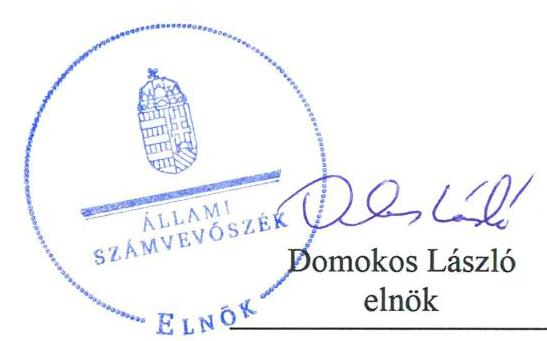

# Jelenetés 

## Központi költségvetési szervek ellenőrzése

Kinizsi Pál Élelmiszeripari Szakgimnázium és Szakközépiskola
2019.

---

# Jelenetés 

## Központi költségvetési szervek ellenőrzése

Kinizsi Pál Élelmiszeripari Szakgimnázium és Szakközépiskola
2019. 10. hó 30. nap

---

# AZ ELLENŐRZÉST FELÜGYELTE:

## MAROZSÁN LÁSZLÓNÉ felügyeleti vezető

## AZ ELLENŐRZÉST VEZETTE ÉS A VÉGREHAJTÁSÁÉRT FELELŐS:

### KEREKES PÉTER ellenőrzésvezető

### A PROGRAM ÖSSZEÁLLÍTÁSÁÉRT FELELŐS:

### TÓTPÁL SZABOLCS osztályvezető

---

**IKTATÓSZÁM:** EL-2069-001/2019.

**TÉMASZÁM:** 2450

**ELLENŐRZÉS-AZONOSÍTÓ SZÁM:** V079160

---

Jelentéseink az Országgyűlés számítógépes hálózatán és az Interneta a www.asz.hu címen is olvashatóak.

---

# TARTALOMJEGYZÉK 

■ ÖSSZEGZÉS ..... 5
■ AZ ELLENŐRZÉS CÉLJA ..... 6
■ AZ ELLENŐRZÉS TERÜLETE ..... 7
■ AZ ELLENŐRZÉS HÁTTERE, INDOKOLTSÁGA ..... 8
■ A JELENTÉS LÉNYEGES KÉRDÉSKÖREI ..... 10
■ AZ ELLENŐRZÉS HATÓKÖRE ÉS MÓDSZEREI ..... 11
■ MEGÁLLAPÍTÁSOK ..... 14
■ JAVASLATOK ..... 18
■ MELLÉKLETEK ..... 21
I. sz. melléklet: Értelmező szótár ..... 21
■ FÜGGELÉKEK ..... 23
I. sz. függelék a Jelentéshez ..... 23
II. sz. függelék: Észrevételek ..... 24
■ RÖVIDÍTÉSEK JEGYZÉKE ..... 27

---

.

---

# ÖSSZEGZÉS 

A Kinizsi Pál Élelmiszeripari Szakgimnázium és Szakközépiskola belső kontrollrendszere, pénzügyi és vagyongazdálkodása nem volt szabályszerű. Nem volt biztositott a nemzeti vagyonnal és az általa használt közpénzzel való átlátható, felelős gazdálkodás. Müködése során nem volt védett a korrupcióval szemben.

## Az ellenőrzés társadalmi indokoltsága

Magyarország versenyképességének és a magyar gazdaság fejlődésének alapvető feltétele a magyar munkavállalók megfelelő szakmai képzettsége és felkészültsége, amelyben a szakképzési rendszernek döntő szerepe van. A mezőgazdaság vonatkozásában is kiemelten fontos ez, hiszen a magyar mezőgazdaság piaci versenyképességét és eredményességét nagymértékben befolyásolja az agrárszférában dolgozók képzettsége, felkészültsége. A szakképzés legjelentősebb színterei a szakképző iskolák. Az eredményes és célszerű szakképzés alapja és alapvető feltétele a szakképző intézmények közpénzekkel és a közvagyonnal való törvényes, átlátható és a korrupcióval szembeni védelmet biztosító múködése és gazdálkodása. Ezért ezen szervezetekkel szemben is alapvető társadalmi igény, hogy a rájuk bízott közpénzekkel, közvagyonnal szabályosan gazdálkodjanak. Emellett a szakképzésben részt vevő pedagógusok, tanulók és a szülők jogos elvárása, hogy a szakképző iskolák múködése átlátható és elszámoltatható legyen. Mindezen igényekkel összhangban, a közpénzügyek átláthatóságának előmozdítása, a közvagyon védelme érdekében került sor az agrárszakképző iskolák belső kontrollrendszerének és gazdálkodásának ellenőrzésére.

## Főbb megállapítások, következtetések, javaslatok

A Kinizsi Pál Élelmiszeripari Szakgimnázium és Szakközépiskola a belső kontrollrendszer részeként a kontrollkörnyezetet nem szabályszerűen alakította ki. A kockázatkezelési rendszert, az integrált kockázatkezelési rendszert, az információs és kommunikációs rendszert, valamint a nyomon követési rendszert nem múködtette szabályszerűen. A kontrolltevékenységek gyakorlása nem volt szabályszerű. A feltárt szabálytalanságok miatt a Kinizsi Pál Élelmiszeripari Szakgimnázium és Szakközépiskola belső kontrollrendszere a szabályszerű múködés és gazdálkodás feltételeit nem biztosította.

A Kinizsi Pál Élelmiszeripari Szakgimnázium és Szakközépiskola pénzügyi gazdálkodása és vagyongazdálkodása a 2016. évben nem volt szabályszerű mivel a kapcsolódó feladatköröket, felelősségi viszonyokat nem alakították ki, valamint a kötelezettségvállalások nyilvántartásának tartalma nem felelt meg a jogszabályi előírásoknak. A 2017. évben vagyongazdálkodása nem volt szabályszerű, mert a költségvetési beszámoló mérleg tételei leltárral nem voltak alátámasztottak, így költségvetési beszámolója nem mutatott valós képet vagyoni helyzetéről.

A Kinizsi Pál Élelmiszeripari Szakgimnázium és Szakközépiskola a korrupciós kockázatok elleni védelmet, az integritási kontrollokat nem építette ki, kockázatelemzést nem végzett. A teljesítmény mérés feltételei nem voltak biztosítottak.

A megállapítások alapján az Állami Számvevőszék a Kinizsi Pál Élelmiszeripari Szakgimnázium és Szakközépiskola vezetője részére 13 javaslatot fogalmazott meg.

---

# AZ ELLENŐRZÉS CÉLJA 

AZ ELLENŐRZÉS CÉLJA annak megítélése volt, hogy az ellenőrzött intézményre vonatkozó irányító szervi feladatellátás a jogszabályi előírások betartásával történt-e; az intézménynél a belső kontrollrendszer kialakítása és múködtetése szabályszerű volt-e, biztosította-e az átlátható, szabályszerű, gazdaságos, hatékony és eredményes gazdálkodás feltételeit; az intézmény pénzügyi és vagyongazdálkodása megfelelt-e a jogszabályi előírásoknak és belső szabályzatainak. Az ellenőrzés keretében az Állami Számvevőszék értékelte az intézmény korrupciós kockázatainak kezelését szolgáló integritás kontrollok kiépítettségét és az integritás szemlélet érvényesülését, a teljesítményellenőrzés feltételeinek kialakítását. Értékelte továbbá, hogy az ellenőrzött megfelel-e annak az Alaptörvényben meghatározott alapvetésnek, hogy Magyarország a kiegyensúlyozott, átlátható és fenntartható költségvetési gazdálkodás elvét érvényesíti. Érvényesült-e a nemzeti vagyon kezelésének és védelmének célja, azaz a szervezet vagyona a közérdeket szolgálta-e a közös szükségletek kielégítése és a természeti erőforrások megóvása, valamint a jövő nemzedékek szükségleteinek figyelembevétele mellett.

---

# **Az Ellenőrzés Területe**

## **Kinizsi Pál Élelmiszeripari Szakgimnázium és Szakközépiskola**

A kaposvári székhelyű Intézményt1 1950-ben alapították, illetékessége és működési területe országos. A fenntartói és irányítói jogokat és hatásköröket a Minisztérium2 2013. augusztus 1-től gyakorolja.

Alapító okirata szerint köznevelési intézmény (szakgimnáziumi, szakközépiskola, valamint a 2016. szeptember 1. napja előtt megkezdett tanulmányok tekintetében szakközépiskola, szakiskola), amelyben élelmiszeripar, környezetvédelem és környezetvédelem-vízgazdálkodás szakmacsoportokban folytattak oktatást. Az Intézmény tanulói létszáma a 2016/2017-es tanévben 387 fő, a 2017/2018. tanévben 333 fő volt.

Az ellenőrzött időszakban az Intézménynél szervezeti, szerkezeti átalakításra nem került sor, az igazgató személye nem változott.

Az Intézmény önálló gazdasági szervezettel nem rendelkezik. A gazdálkodással kapcsolatos feladatait 2015. augusztus 31-től 2017. december 31-ig a Széchenyi Zsigmond Mezőgazdasági Szakképző Iskola és Kollégium látta el, majd 2018. január 1. óta az AM Dunántúli Agrárszakképző Központ, Csapó Dániel Mezőgazdasági Szakgimnázium, Szakközépiskola és Kollégium látja el.

Az Intézmény összes bevétele 2016. évben 338,3 millió Ft, a 2017. évben 388,3 millió Ft volt.

Az Intézmény a feladata ellátása során a Kaposvár Megyei Jogú Város Önkormányzatával és a Magyar Nemzeti Vagyonkezelő Zrt.-vel kötött vagyonkezelési szerződések alapján nemzeti vagyon kezel.

---

# AZ ELLENŐRZÉS HÁTTERE, INDOKOLTSÁGA 

Az államháztartás központi alrendszerének közpénz felhasználása, az intézmények által ellátott közfeladatok sokrétúsége, valamint a feladatellátásához rendelt vagyon nagyságrendje indokolja, hogy az ÁSZ ${ }^{3}$ ellenőrzéseket folytasson a pénzügyi és vagyongazdálkodás területén. Az ÁSZ az ellenőrzései során feltárja a gazdálkodást, a központi alrendszer intézményei átalakulását, átszervezését érintő szabályozások esetleges hiányosságait, a szabályozással nem érintett gazdálkodási területeket, rámutathat a vagyongazdálkodási tevékenység - ezen belül a tulajdonosi joggyakorlás és vagyonkezelés - esetleges szabálytalanságaira, értékeli az állami vagyon nyilvántartására és elszámolására vonatkozó eljárásokat.

Az ellenőrzés várhatóan hozzájárul a központi intézmények pénzügyi helyzetének pontosabb megítéléséhez, és a jó gyakorlat kialakításán és terjesztésén keresztül az ellenőrzések elősegíthetik a gazdálkodás szabályszerűségének javítását.

Az ellenőrzések megállapításai támogathatják az ellenőrzött szervezetek szabályszerű gazdálkodását, javaslataival elősegítheti az Alaptörvényben megfogalmazott alapvetések érvényesülését a mindennapi életben a szervezetek szintjén. A központi költségvetés rendszerében zajló folyamatok holisztikus elemzései, a kockázatok folyamatos figyelemmel kísérésének módszerével, az így kiválasztott szervezetek célzott, hatékony ellenőrzéseivel az ÁSZ betölti a legfőbb gazdasági ellenőrző szerv küldetését.

Az ellenőrzés a szervezet kockázatértékelése alapján, az egyedi és lényeges jellemzők figyelembevételével, az ellenőrzésre kiválasztott modullal történt. Az integritás- és belső kontroll modul a központi költségvetési szerv működésének irányítottságát, korrupció elleni védettségét értékelte.

A belső kontrollrendszer kialakítása és működtetése nélkül nem valósítható meg a közpénzek, a közvagyon átlátható, szabályos, gazdaságos, hatékony és eredményes felhasználása. A belső kontrollrendszer azt a célt szolgálja, hogy a költségvetési szervek működésük és gazdálkodásuk során a tevékenységeket szabályszerűen hajtsák végre, teljesítsék elszámolási kötelezettségeiket és megvédjék az erőforrásokat a veszteségektől, a károktól és a nem rendeltetésszerű használattól. A belső kontrollrendszer magában foglalja mindazon elveket, eljárásokat és belső szabályzatokat, melyek biztosítják, hogy a költségvetési szerv valamennyi tevékenysége és célja összhangban legyen a szabályszerűséggel, szabályozottsággal, valamint a gazdaságosság, hatékonyság és eredményesség követelményeivel, az eszközökkel és forrásokkal való gazdálkodásban ne kerüljön sor pazarlásra, visszaélésre, rendeltetésellenes felhasználásra. Megfelelő, pontos és naprakész információk álljanak rendelkezésre a költségvetési szerv múködésével kapcsolatosan, és a belső kontrollrendszer harmonizációjára, öszszehangolására vonatkozó jogszabályok végrehajtásra kerüljenek. Az integritás kontrollok kiépítése, erősítése a szervezet korrupciós kockázatainak kezelését szolgálja. A teljesítménykövetelmények meghatározása és múködtetése megalapozhatja a központi költségvetési szervnél a teljesítményellenőrzés lefolytatását.

---

Az egyes ellenőrzések megállapításaival és egy időszak ellenőrzési eredményeinek elemzésével az ÁSZ ráirányíthatja a jogalkotók figyelmét a központi alrendszerben vagy annak egy ágazatában esetlegesen felmerülő pénzügyi, szabályozási feszültségekre. Az elvégzett ellenőrzések során az ÁSZ „jó gyakorlatokat" is azonosíthat, melyeket tanácsadó funkciója keretében szélesebb körben is megismertethet az érintettekkel, ezáltal is hozzájárulva a költségvetési rendszer szabályozott, átlátható, kiegyensúlyozott és fenntartható múködéséhez.

---

# A JELENTÉS LÉNYEGES KÉRDÉSKÖREI 

1.     - Az irányító szerv ellenőrzött költségvetési szervre vonatkozó feladatellátása szabályszerű volt-e?
2.     - A belső kontrollrendszer kialakítása és müködtetése biztosi-totta-e a közpénzekkel és a nemzeti vagyonnal történő átlátható, szabályszerű gazdálkodást?
3.     - A költségvetési szerv pénzügyi gazdálkodása szabályszerű volt-e?
4.     - A költségvetési szerv vagyongazdálkodása szabályszerű volt-e?
5.     - A központi költségvetési szervnél alakítottak-e ki a teljesítmény mérésére alkalmas követelményeket?

---

# AZ ELLENŐRZÉS HATÓKÖRE ÉS MÓDSZEREI 

## Az ellenőrzés típusa

Megfelelőségi ellenőrzés.

## Az ellenőrzött időszak

A szervezet vagyongazdálkodása, integritás és belső kontrollrendszerének értékelése tekintetében a 2016-2017. évek.

Az irányító szervi feladatellátás és a szervezet pénzügyi gazdálkodása tekintetében a 2016. év.

## Az ellenőrzés tárgya

Az Intézmény belső kontrollrendszerének kialakítása és múködtetése, pénzügyi és vagyongazdálkodása, az integritáskontrollok kiépítettsége, az integritás szemlélet érvényesülése, a teljesítményellenőrzés feltételeinek fennállása, valamint az irányító szervi feladatellátás.

## Az ellenőrzött szervezet

- Kinizsi Pál Élelmiszeripari Szakgimnázium és Szakközépiskola
- Agrárminisztérium, mint irányító szerv
- Széchenyi Zsigmond Mezőgazdasági Szakképző Iskola és Kollégium, mint gazdálkodási feladatokat ellátó szervezet, 2017-re vonatkozóan (2018. január 1-től az AM Dunántúli Agrárszakképző Központ, Csapó Dániel Mezőgazdasági Szakgimnázium, Szakközépiskola és Kollégium)

## Az ellenőrzés jogalapja

Az ellenőrzés jogszabályi alapját az ÁSZ tv. ${ }^{4}$ 1. § (3) bekezdés, 5. § (2)-(3) bekezdései, 5. § (4) bekezdés a) pontja, valamint az Áht. ${ }^{5}$ 61. § (2) bekezdésének előírásai képezték.

## Az ellenőrzés módszerei

Az ellenőrzésre a szakmai program szempontjai, az ellenőrzött időszakban hatályos jogszabályok, az ellenőrzés szakmai szabályai, a jelen ellenőrzésre irányadó ÁSZ módszertanok figyelembevételével került sor.

---

Az ÁSZ az ellenőrzés ideje alatt az ellenőrzött szervezetekkel a kapcsolattartást az ÁSZ SZMSZ ${ }^{\circledR}$-ének vonatkozó előírásai alapján biztosította.

Az ellenőrzési kérdések megválaszolásához szükséges bizonyítékok megszerzése az ellenőrzött szervezetek által rendelkezésre bocsátott dokumentumokra, adatokra alapozva megfigyelés, szemle (szemrevételezés), kérdésfeltevés (információkérés), mintavételezés, valamint elemző eljárás útján történt.

Az ellenőrzési bizonyítékként felhasználható adatforrások közé tartoztak egyrészt a szakmai program részletes szempontjainál felsorolt adatforrások, másrészt minden egyéb - az ellenőrzés folyamán feltárt, az ellenőrzés szempontjából információt tartalmazó - dokumentum.

Az ellenőrzés lefolytatásához az ellenőrzött szervezetek a tanúsítványok kitöltésével, valamint az ÁSZ által kért dokumentumok megküldésével szolgáltattak adatokat, amelyek valódiságát és teljes körűségét az ellenőrzött szervezet vezetője által tett teljességi és hitelességi nyilatkozat igazolta. Az így rendelkezésre bocsátott adatok, információk kontrollja az ellenőrzés keretében történt.

Az Intézmény belső kontrollrendszere egyes pilléreinek kialakítására és működtetésére vonatkozó értékelés a következő volt:
$\longrightarrow$ „szabályszerü", amennyiben az értékelt területen az elért „igen" válaszok százalékban kifejezett, egész számra kerekített aránya legalább $85 \%$ volt,
$\longrightarrow$ „nem szabályszerű", ha nem érte el a $85 \%$-ot.
Az Intézmény belső kontrollrendszerének összesített értékelése az egyes részterületek esetében kapott megfelelőségi arányok számtani átlaga alapján történt és megegyezett a pillérenként (kontrollterületenként) alkalmazott százalékos értékelésekkel, a következő eltérésekkel: a kontrollrendszer egésze esetében a „szabályszerű" értékelésnek a százalékos értéken felül további feltétele volt, hogy egyik kontrollterület sem kaphat „nem szabályszerű" értékelést.

Az ÁSZ statisztikai módszereken alapuló mintavételt alkalmazott.
A kiadások ellenőrzésére a 2017. év vonatkozásában került sor. A kiadások (külső személyi juttatások, felhalmozási kiadások, dologi kiadások) esetében az ellenőrzés azokra a legnagyobb értékű tételekre - a lényeges sokaságra - terjedt ki, melyek összértéke elérte a teljes sokaság összértékének 50\%-át.

A lényeges sokaságból véletlen mintavételi eljárással kiválasztott tételek lettek ellenőrizve.

A 2017. évi beruházások, felújítások végrehajtásának, valamint a feladatellátást szolgáló állami vagyontárgyak év végi értékelésének szabályszerűsége esetében tételes ellenőrzésre került sor.

A 2017. évi feladatellátást szolgáló állami vagyontárgyak felhasználásának szabályszerűsége a teljes sokaságból véletlen mintavétellel kiválasztott tételek alapján került ellenőrizésre.

A mintavétellel ellenőrzött területek esetében minden egyes tétel vonatkozásában a felhasználás, elszámolás és értékelés szabályszerűségére vonatkozó kérdések lettek meghatározva. Szabályszerűnek lett értékelve

---

egy ellenőrzött területet, amennyiben 95\%-os bizonyossággal az ellenőrzött sokaságban az átlagos hibaarány legfeljebb 10\%, nem szabályszerűnek, amennyiben 10\%-nál magasabb arányt képviselt.

---

# 1. Az irányító szerv ellenőrzött költségvetési szervre vonatkozó feladatellátása szabályszerű volt-e? 

Összegző megállapítás A Minisztériumnak az Intézményre vonatkozó feladatellátása szabályszerű volt.

A Minisztérium az Nkt. ${ }^{7}$-ban és Áht.-ban előírtak szerint kiadta, és szükség szerint módosította az Intézmény alapító okiratát, megbízta az Intézmény igazgatóját.

A Minisztérium egyéb irányítási hatáskörében eljárva a jogszabályi előírásoknak megfelelően jóváhagyta az Intézmény elemi költségvetését és az éves költségvetési beszámolóját.

## 2. A belső kontrollrendszer kialakítása és múködtetése biztosí-totta-e a közpénzekkel és a nemzeti vagyonnal történő átlátható, szabályszerű gazdálkodást?

## Összegző megállapítás

Az Intézménynél a belső kontrollrendszer kialakítása és működtetése nem biztosította a közpénzekkel és a nemzeti vagyonnal történő átlátható, szabályszerű gazdálkodást a 2016. és 2017. években.

Az Intézmény belső kontrollrendszere a 2016. évben nem volt szabályszerű, mivel 2017. június 7-ig a Minisztérium által az Intézmény gazdálkodási feladatainak ellátására kijelölt Széchenyi Zsigmond Mezőgazdasági Szakképző Iskola és Kollégiummal az Ávr. ${ }^{8}$ 9. § (5) bekezdés a) pontjában előírt, a gazdálkodási feladatok ellátásával kapcsolatos munkamegosztás és felelősségvállalás rendjét tartalmazó megállapodást nem kötötték meg. A 2017. június 8-tól hatályos Együttműködési megállapodás ${ }^{9}$ megfelelt az Ávr. előírásainak.

AZ INTÉZMÉNY A 2017. ÉVBEN NEM SZABÁLYSZERŰ KONTROLLKÖRNYEZETBEN működött. Az Intézmény rendelkezett a Számv.tv. ${ }^{10}$-ben előírt Számviteli politikával ${ }^{11}$, Leltározási szabályzattal ${ }^{12}$, Értékelési szabályzattal ${ }^{13}$, Pénzkezelési szabályzattal ${ }^{14}$, valamint Önköltségszámítási szabályzattal ${ }^{15}$. Azonban a Gazdálkodási feladatokat ellátó szervezet ${ }^{16}$ az Áhsz. ${ }^{17}$ 50. § (1) bekezdésben meghatározott felelőssége ellenére 2017. június 8. után nem módosította a Számviteli politikát és az annak keretében készített szabályzatokat oly módon, hogy azok összhangban legyenek az Együttműködési megállapodásban rögzítettek-

---

kel. Ebből következőleg a Számviteli politika a Számv.tv. 14. § (3) bekezdésben előírtak ellenére nem felelt meg az Intézmény adottságainak, körülményeinek.

Az Intézmény a Vnytv. ${ }^{18}$ 14. § (3) bekezdésében előírtak ellenére a vagyongyarapodási vizsgálattal kapcsolatos meghallgatásra vonatkozó további szabályokat nem állapította meg szabályzatban.

Az Intézmény számlatükre az Áhsz. 51. § (1) bekezdésében előírtak ellenére nem felelt meg az Áhsz. 16. mellékletében meghatározott egységes számlatükörnek, mert olyan számlaszámokat is tartalmazott, amelyek a jogszabályi változások miatt 2016. január 1. óta nem hatályosak.

Az Intézmény rendelkezett a Kbt. ${ }^{19}$ előírásainak megfelelő Közbeszerzési szabályzattal ${ }^{20}$, azonban az Ávr. 13. § (2) bekezdés b) pontjában előírtak ellenére az Intézmény vezetője belső szabályzatban nem rendezte a közbeszerzési értékhatár alatti beszerzések lebonyolításával kapcsolatos eljárásrendet.

Az Intézmény vezetője 2016. október 1-jét követően a Bkr. ${ }^{21}$ 6. § (4) bekezdésében előírtak ellenére nem szabályozta a szervezeti integritást sértő események kezelésének eljárásrendjét, valamint az integrált kockázatkezelés eljárásrendjét.

INTEGRÁLT KOCKÁZATKEZELÉSI RENDSZERT az Intézmény vezetője a Bkr. 7. § (1) bekezdésben előírtak ellenére nem működtetett a 2017. évben. A Bkr. 7. § (2) bekezdésében előírtak ellenére nem mérte fel és nem állapította meg az Intézmény tevékenységében rejlő és a szervezeti célokkal összefüggő kockázatokat, valamint nem határozta meg az egyes kockázatokkal kapcsolatban szükséges intézkedéseket, valamint azok teljesítésének folyamatos nyomon követésének módját.

# A KONTROLLTEVÉKENYSÉGEK GYAKORLÁSA a 

2017. évben nem szabályszerűen történt az Intézménynél.

Az Ávr. 52. § (1) bekezdésében előírtak ellenére olyan személy is vállalt kötelezettséget, aki nem rendelkezett az Intézmény vezetőjétől erre vonatkozó felhatalmazással.

A teljesítések szabályszerű igazolása nem történt meg az Intézménynél, mert az Ávr. 57. § (3) bekezdésében előírtak ellenére az igazolás dátuma és a teljesítés tényére történő utalás nem került megjelölésre.

## A SZERVEZET INFORMÁCIÓS ÉS KOMMUNIKÁ-

CIÓS RENDSZERÉT az Intézmény vezetője 2017. június 7-ig nem szabályszerűen működtette, mivel a gazdasági feladatellátáshoz kapcsolódóan a Bkr. 9. § (2) bekezdésében előírtak ellenére nem határozta meg a beszámolási szinteket, határidőket és módokat.

Az Intézmény eleget tett a jogszabályokban előírt közzétételi és adatszolgáltatási kötelezettségének.

## A SZERVEZET NYOMONKÖVETÉSI RENDSZERÉT

az Intézmény vezetője nem működtette szabályszerűen, mivel a Bkr. 10. §-ában előírtak ellenére nem gondoskodott az operatív tevékenységek keretében megvalósuló folyamatos és eseti nyomon követésről.

---

Az Intézmény belső ellenőrzését 2017. január 1-től a Bkr. 15. § (4) bekezdésben előírtak ellenére nem a Gazdálkodási feladatokat ellátó szervezet vagy a Minisztérium által kijelölt más szervezet látta el, hanem Kaposvár Megyei Jogú Város Polgármesteri Hivatala. A jogszabály előírásaitól való eltérésre nem rendelkeztek a fejezetet irányító szerv vezetőjének írásos jóváhagyásával.

Az Intézmény vezetője a 2016-2017. években a Bkr. 1. mellékletében foglalt előírás alapján nyilatkozatban értékelte az Intézmény belső kontrollrendszerének minőségét. Nyilatkozott arról, hogy gondoskodott az Intézmény belső kontrollrendszere kialakításáról, valamint szabályszerű, eredményes és hatékony működésről. Azonban a vezetői nyilatkozatot az ÁSZ jelen ellenőrzésének megállapításai nem támasztották alá.

AZ INTEGRITÁS ELVŰ MŰKÖDÉST a jogszabályok által előírt kontrollok kiépítettségi szintje nem támogatta az Intézménynél. Az Intézmény nem végzett kockázatelemzéseket. Az Intézmény nem működtetett az integritást erősítő, nem kötelezően előírt kontrollokat.

# 3. A költségvetési szerv pénzügyi gazdálkodása szabályszerű volt-e? 

## Összegző megállapítás Az intézmény pénzügyi gazdálkodása nem volt szabályszerű.

Az Intézmény pénzügyi-számviteli gazdálkodása nem volt szabályszerű a 2016. évben, mert
$\longrightarrow$ a Gazdálkodási feladatokat ellátó szervezettel az Ávr. 9. § (5) bekezdés a) pontjában előírt, a gazdálkodási feladatok ellátásával kapcsolatos munkamegosztás és felelősségvállalás rendjét tartalmazó megállapodást nem kötötték meg.
$\longrightarrow$ a kötelezettségvállalásokról és más fizetési kötelezettségekről vezetett részletező nyilvántartása az Áhsz. 39. § (3) bekezdésben előírtak ellenére nem rendelkezett az Áhsz. 14. mellékletének II. 4. a), c) és d) pontjaiban meghatározott kötelező minimum tartalommal.

## 4. A költségvetési szerv vagyongazdálkodása szabályszerű volt-e?

## Összegző megállapítás Az Intézmény vagyongazdálkodása 2016-ban és 2017-ben nem volt szabályszerű.

Az Intézmény 2016. évi vagyongazdálkodása az Intézmény és a Gazdálkodási feladatokat ellátó szervezet közötti munkamegosztási megállapodás hiánya miatt nem volt szabályszerű.

A 2017. évi mérleg tételeit az Intézmény a Számv.tv. 69. § (1) bekezdésben előírtak ellenére nem támasztotta alá olyan leltárral, amely tételesen, ellenőrizhető módon tartalmazta a mérleg fordulónapján meglévő eszközeit és forrásait mennyiségben és értékben, ezért az Intézmény 2017. évi költségvetési beszámolója nem felelt meg a Számv.tv. 15. § (3) bekezdésben előírt valódiság elvének, a megbízhatósága nem volt biztosított.

---

Az Intézmény rendelkezett vagyonkezelési szerződéssel Kaposvár Megyei Jogú Város Önkormányzatával az általa kezelt önkormányzati vagyonra. A kezelésbe vett ingatlanok földhivatali bejegyzése megtörtént.

Az Intézmény által kezelt tárgyi eszközökről vezetett részletező nyilvántartás az Áhsz. 39. § (3) bekezdésben előírtak ellenére nem tartalmazta az Áhsz. 14. mellékletének VII. 1. e) pontjában meghatározott kötelező minimum tartalmi elemet (a kezelt vagyon tulajdonosát).

A beruházások esetében az Intézmény részéről megkötött visszterhes szerződések az érintett szervezetek nyilatkozatát az Ávr. 50. § (1a) bekezdésében előírtak ellenére nem tartalmazták.

Az Intézmény által kezelt állami vagyon év végi értékelése nem szabályszerűen történt, mert a Számv. tv. 52. § (1) bekezdésében előírtak ellenére a mérlegben szereplő eszközök értékcsökkenése nem a maradványértékkel csökkentett bekerülési érték alapján került megállapításra.

# 5. A központi költségvetési szervnél alakítottak-e ki a teljesítmény mérésére alkalmas követelményeket? 

## Összegző megállapítás

Az Intézménynél nem alakítottak ki a teljesítmény mérésére alkalmas követelményeket.

TELJESÍTMÉNY MÉRÉSÉRE alkalmas követelményeket az Intézmény vezetője nem alakított ki. A szervezeti célok elérését szolgáló feladatok, folyamatok, tevékenységek mérését szolgáló indikátorokat, mérőszámokat, feladat- és teljesítménymutatókat nem képzett, így nem biztosította a teljesítménymérés lehetőségét.

---

# JAVASLATOK 

Az ÁSZ tv. 33. § (1) bekezdésében foglaltak értelmében az ellenőrzött szervezet vezetője köteles a jelentésben foglalt megállapításokhoz kapcsolódó intézkedési tervet összeállítani és azt a jelentés kézhezvételétől számított 30 napon belül az ÁSZ részére megküldeni. Amennyiben az ellenőrzött szervezet vezetője nem küldi meg határidőben az intézkedési tervet, vagy továbbra sem elfogadható intézkedési tervet küld, az Állami Számvevőszék elnöke az ÁSZ tv. 33. § (3) bekezdése a) és b) pontjaiban foglaltakat érvényesítheti.

## Kinizsi Pál Élelmiszeripari Szakgimnázium és Szakközépiskola igazgatója részére

1. Gondoskodjon a számviteli politika és annak keretében elkészített szabályzatok felülvizsgálatáról annak érdekében, hogy azok biztosítsák az összhangot a gazdálkodási feladatot ellátó szervezet és az Intézmény közötti feladatok megosztásáról rendelkező hatályos munkamegosztási megállapodásban foglaltakkal és így feleljenek meg a Számv. tv. előírásának.
(2. sz. megállapítás 2. bekezdés 3-4. mondata alapján)
2. Intézkedjen a vagyongyarapodási vizsgálattal kapcsolatos meghallgatásra vonatkozó további szabályok jogszabályi előírásnak megfelelő megállapításáról.
(2. sz. megállapítás 3. bekezdése alapján)
3. Intézkedjen az Áhsz. előírásainak megfelelő tartalmú számlatükör elkészítéséről.
(2. sz. megállapítás 4. bekezdése alapján)
4. Intézkedjen az Ávr. előírásának megfelelően a - közbeszerzési értékhatárt el nem érő - beszerzések lebonyolításával kapcsolatos eljárásrend belső szabályzatban való rendezéséről.
(2. sz. megállapítás 5. bekezdése alapján)
5. Intézkedjen a Bkr. előírásának megfelelően
a) a szervezeti integritást sértő események kezelésének eljárásrendje és
b) az integrált kockázatkezelés eljárásrendje szabályozásáról.
(2. sz. megállapítás 6. bekezdése alapján)

---

6. Intézkedjen az integrált kockázatkezelési rendszer Bkr. előírásának megfelelő müködtetéséről.
(2. sz. megállapítás 7. bekezdése alapján)
7. Intézkedjen, hogy a kötelezettségvállalásra és a teljesítésigazolásra az Ávr. előírásainak megfelelően kerüljön sor
(2. sz. megállapítás 9-10. bekezdése alapján)
8. Intézkedjen a Bkr. előírásainak megfelelően az operatív tevékenységek keretében megvalósuló folyamatos és eseti nyomon követésről.
(2. sz. megállapítás 13. bekezdése alapján)
9. Gondoskodjon az Intézmény belső ellenőrzésének a Bkr. előírásai szerinti kialakításáról és müködtetéséről.
(2. sz. megállapítás 14. bekezdése alapján)
10. Gondoskodjon az Áhsz. előírásainak megfelelő részletező nyilvántartás vezetéséről a kötelezettségvállalásokról, más fizetési kötelezettségekről.
(3. sz. megállapítás 1. bekezdés 2. francia bekezdése alapján)
11. Intézkedjen az éves költségvetési beszámoló elkészítéséhez, a mérlegtételeinek alátámasztásához a jogszabályi előírásnak megfelelő leltár összeállításáról.
(4. sz. megállapítás 2. bekezdése alapján)
12. Gondoskodjon az Intézmény vagyonkezelésében lévő tárgyi eszközök Áhsz. előírásainak megfelelő tartalmú részletező nyilvántartásáról.
(4. sz. megállapítás 4. bekezdése alapján)
13. Gondoskodjon arról, hogy jogi személlyel, jogi személyiséggel nem rendelkező szervezettel kötött visszterhes szerződések esetén a szerződés az Ávr. előírásának megfelelően tartalmazza a szervezet képviselőjének nyilatkozatát arra vonatkozóan, hogy átlátható szervezetnek minősül, érvényt szerezve ezzel az Ávr.-ben meghatározott előírásoknak és a szerződéstől való elállás vagy felmondás lehetőségének.
(4. sz. megállapítás 5. bekezdése alapján)

---

.

---

# MELLÉKLETEK 

- I. SZ. MELLÉKLET: ÉRTELMEZŐ SZÓTÁR
állami vagyon
állami vagyonnak minősül:
a) az állam tulajdonában lévő dolog, valamint a dolog módjára hasznosítható természeti erő,
b) az a) pont hatálya alá nem tartozó mindazon vagyon, amely vonatkozásában törvény az állam kizárólagos tulajdonjogát nevesíti,
c) az állam tulajdonában lévő tagsági jogviszonyt megtestesítő értékpapír, illetve az államot megillető egyéb társasági részesedés,
d) az államot megillető olyan immateriális, vagyoni értékkel rendelkező jogosultság, amelyet jogszabály vagyoni értékű jogként nevesít. (Forrás: Vtv. ${ }^{22}$ 1. § (2) bekezdése)
állami vagyon kezelője /vagyonkezelő
ázalakítás
belső ellenőrzés
belső kontrollrendszer
belső kontrollrendszer területei
ellenőrzési nyomvonal
információs és kommunikációs rendszer
integritás

Az állami vagyont az MNV Zrt. maga kezeli, vagy szerződés - így különösen bérlet, haszonbérlet, megbízás - alapján központi költségvetési szervnek, természetes vagy jogi személynek, vagy jogi személyiséggel nem rendelkező gazdálkodó szervezetnek hasznosításra átengedi." Az állami vagyonra vonatkozóan az MNV Zrt. kizárólag az Nvtv.-ben meghatározott személyekkel köthet vagyonkezelési szerződést. (Forrás: Vtv. 27. § (1) bekezdése, hatályos 2012. január 1-jétől)
A költségvetési szerv általános jogutódlással történő megszüntetése átalakítással történhet. Az átalakítás lehet egyesítés vagy különválás. Az egyesítés lehet beolvadás vagy összeolvadás. (2015. január 1-jétől Áht. 11. § (2) bekezdés)
Független, tárgyilagos bizonyosságot adó és tanácsadó tevékenység, amelynek célja, hogy az ellenőrzött szervezet múködését fejlessze és eredményességét növelje, az ellenőrzött szervezet céljai elérése érdekében rendszerszemléletű megközelítéssel és módszeresen értékeli, illetve fejleszti az ellenőrzött szervezet irányítási és belső kontrollrendszerének hatékonyságát. (Forrás: Bkr. 2. § b) pontja)
A belső kontrollrendszer a kockázatok kezelése és tárgyilagos bizonyosság megszerzése érdekében kialakított folyamatrendszer, amely azt a célt szolgálja, hogy a múködés és gazdálkodás során a tevékenységeket szabályszerűen, gazdaságosan, hatékonyan, eredményesen hajtsák végre, az elszámolási kötelezettségeket teljesítsék, megvédjék az erőforrásokat a veszteségektől, károktól és nem rendeltetésszerű használattól. (Forrás: Áht. 69. § (1) bekezdése)
A kontrollkörnyezet, az integrált kockázatkezelési rendszer, a kontrolltevékenységek, az információs és kommunikációs rendszer, valamint a nyomon követési (monitoring) rendszer. (Forrás: Bkr. 3. §-a)
Az ellenőrzési nyomvonal a költségvetési szerv működési folyamatainak szöveges, táblázatokkal vagy folyamatábrákkal szemléltetett leírása, amely tartalmazza különösen a felelősségi és információs szinteket és kapcsolatokat, irányítási és ellenőrzési folyamatokat, lehetővé téve azok nyomon követését és utólagos ellenőrzését. (Forrás: Bkr. 6. § (3) bekezdés)
A költségvetési szerv vezetője által kialakított és múködtetett olyan rendszer, mely biztosítja, hogy a megfelelő információk a megfelelő időben eljutnak az illetékes szervezethez, szervezeti egységhez, illetve személyhez. (Forrás: Bkr. 9. § (1) bekezdés)
Az integritás - egyik gyakran használt jelentése szerint - az elvek, értékek, cselekvések, módszerek, intézkedések konzisztenciáját jelenti, vagyis olyan magatartásmódot, amely meghatározott értékeknek megfelel. Integritás-irányítási rendszer bevezetése a szervezetben a szervezethez rendelt közfeladatok integritás szempontú ellátását, az

---

integrált kockázatkezelési rendszer
irányító szerv/felügyeleti szerv
kockázat
kockázatkezelési rendszer
kontrollkörnyezet
kontrolltevékenységek
nyomon követési rendszer (monitoring)
vagyongazdálkodás
érték alapú múködéssel (integritással) összefüggő szervezeti követelmények következetes érvényesítését jelenti. (Forrás: Nemzetgazdasági Minisztérium: Államháztartási Belső Kontroll Standardok és Gyakorlati Útmutató 1.6. Etikai értékek és integritás 46. oldal, 2017. szeptember)

Olyan folyamatalapú kockázatkezelési rendszer, amely a szervezet minden tevékenységére kiterjed, egységes módszertan és eljárások alkalmazásával, a szervezet célkitűzéseinek és értékeinek figyelembevételével biztosítja a szervezet kockázatainak teljes körű azonosítását, azok meghatározott kritériumok szerinti értékelését, valamint a kockázatok kezelésére vonatkozó intézkedési terv elkészítését és az abban foglaltak nyomon követését. (Forrás: Bkr. 2. § m) pontja, 2016. október 1-jétől)
A költségvetési szerv tekintetében az Áht.-ban meghatározott irányítási hatáskört gyakorló szerv. (Forrás: Áht. 1. § 9. pontja)
A kockázat annak a valószínűségét jelenti, hogy egy vagy több esemény vagy intézkedés nem kívánt módon befolyásolja a rendszer múködését, céljainak megvalósulását. (Forrás: Javaslatok a korrupciós kockázatok kezelésére - Kockázatkezelési és ellenőrzési módszertan 35. oldal, ÁSZ)
Olyan irányítási eszközök és módszerek összessége, melynek elemei a szervezeti célok elérését veszélyeztető tényezők (kockázatok) azonosítása, elemzése, csoportosítása, nyomon követése, valamint szükség esetén a kockázati kitettség mérséklése.(Forrás: Bkr. 2. § m) pontja, 2016. szeptember 30-ig)
A költségvetési szerv vezetője által kialakított olyan elvek, eljárások, belső szabályzatok összessége, amelyben világos a szervezeti struktúra, a folyamatok átláthatók, egyértelmúek a felelősségi, hatásköri viszonyok és feladatok, meghatározottak, ismertek és elfogadottak az etikai elvárások a szervezet minden szintjén, átlátható a humán-erőforrás-kezelés. (Forrás: Bkr. 6. § (1) bekezdés)
A költségvetési szerv vezetője által a szervezeten belül kialakított (kontroll) tevékenységek, melyek biztosítják a kockázatok kezelését, hozzájárulnak a szervezet céljainak eléréséhez és erősítik a szervezet integritását. (Forrás: Bkr. 8. § (1) bekezdés)
A költségvetési szerv vezetője köteles kialakítani a szervezet tevékenységének a célok megvalósításának nyomon követését biztosító rendszert, amely az operatív tevékenységek keretében megvalósuló folyamatos és eseti nyomon követésből, valamint az operatív tevékenységektől függetlenül múködő belső ellenőrzésből áll. 2016. október 1-jétől: A költségvetési szerv vezetője köteles kialakítani a szervezet tevékenységének, a célok megvalósításának nyomon követését biztosító rendszert, mely az operatív tevékenységek keretében megvalósuló folyamatos és eseti nyomon követésből, valamint az operatív tevékenységektől függetlenül múködő belső ellenőrzésből állhat. (Forrás: Bkr. 10. §)
A nemzeti vagyongazdálkodás feladata a nemzeti vagyon rendeltetésének megfelelő, az állam, az önkormányzat mindenkori teherbíró képességéhez igazodó, elsődlegesen a közfeladatok ellátásához és a mindenkori társadalmi szükségletek kielégítéséhez szükséges, egységes elveken alapuló, átlátható, hatékony és költségtakarékos múködtetése, értékének megőrzése, állagának védelme, értéknövelő használata, hasznosítása, gyarapítása, továbbá az állam vagy a helyi önkormányzat feladatának ellátása szempontjából feleslegessé váló vagyontárgyak elidegenítése. (Forrás: Nvtv. 7. § (2) bekezdése)

---

# FÜGGELÉKEK 

- I. SZ. FÜGGELÉK A JELENTÉSHEZ

Az Állami Számvevőszék az ellenőrzések során feltárt tényekhez kapcsolódó további körülmények tisztázására eszközrendszerrel nem rendelkezik. Amennyiben az ellenőrzésen túlmutatóan indokoltnak látszik az ellenőrzés során feltárt körülmények további vizsgálata, az Állami Számvevőszék törvényi felhatalmazás alapján az ellenőrzés által feltárt körülményeket továbbítja a hatáskörrel rendelkező szervnek a szükséges intézkedések megtétele, eljárások lefolytatása érdekében.

Az Intézmény 2017. évi beszámolójának alátámasztásához nem készült leltár, ezzel megsértették a Számv.tv. 69. § (1) bekezdésben foglaltakat. Leltár hiányában nem igazolt, hogy a beszámolóban szereplő tételek a valóságban is megtalálhatóak.
A mérlegben szereplő eszközök értékelése nem a Számv. tv. 52. § (1) bekezdésében előírtaknak megfelelően történt, ezért a beszámoló nem a valóságnak megfelelő értékben mutatja be az eszközöket.
A mérleg föösszege 1331265206 Ft volt.
Az Intézménynél a 2017. évben az Ávr. 57. § (1) bekezdésében foglaltak ellenére 22865107 Ft értékủ kiadás vonatkozásában szabályszerű teljesítésigazolás nélkül történt a kifizetés.
Szabályszerü teljesítésigazolás hiányában nem igazolt, hogy a kiadások az Intézmény feladatellátását szolgálták, valamint hogy a kifizetésekhez valós teljesitések kapcsolódtak. Nem zárható ki, hogy a szabálytalan kifizetések az ellenőrzött szervezetnél vagyoni hátrányt okoztak.
Az esetek konkrét körülményeinek felderítésére az ügyészség rendelkezik hatáskörrel.

---

A jelentéstervezetet a Számvevőszék 15 napos észrevételezésre megküldte az ellenőrzött szervezetek vezetőinek az ÁSZ tv. 29. §* (1) bekezdése előírásának megfelelően.

A Kinizsi Pál Élelmiszeripari Szakgimnázium és Szakközépiskola igazgatója a jelentéstervezet megállapításaira írásban észrevételt tett. Az Agrárminisztériumot vezető miniszter és az AM Dunántúli Agrárszakképző Központ, Csapó Dániel Mezőgazdasági Szakgimnázium, Szakközépiskola és Kollégium föigazgatója a jelentéstervezet megállapításaira nem tettek észrevételt.
Az ÁSZ tv. 29. § (3) bekezdésével összhangban az ÁSZ a Függelékben feltünteti az ellenőrzés megállapításaival kapcsolatban tett, figyelembe nem vett észrevételeket, és megindokolja, hogy azokat miért nem fogadta el.

A „Központi költségvetési szervek ellenőrzése - Kinizsi Pál Élelmi-szeripari Szakgimnázium és Szakközépiskola" címmel készített számvevőszéki jelentéstervezet megállapításaival kapcsolatban a Kinizsi Pál Élelmiszeripari Szakgimnázium és Szakközépiskola igazgatója által 2019. július 5-én kelt levélben tett (az Állami Számvevőszékhez 2019. július 10-én érkezett) észrevételek és azok kezelésének indokolása.

1) A jelentéstervezet 2. sz. összegző megállapítás 1. bekezdés 1. mondatához, a 3. sz. összegző megállapítás 1. bekezdéséhez és 1. francia bekezdéséhez, valamint a 4. sz. összegző megállapítás 1. bekezdéséhez tett észrevételét nem fogadtuk el.
A Kinizsi Pál Élelmiszeripari Szakgimnázium és Szakközépiskola (továbbiakban: Intézmény) igazgatója észrevételében tájékoztatást adott a pénzügyi, gazdasági feladatok ellátásáról szóló együttműködési megállapodásnak a Széchenyi Zsigmond Mezőgazdasági Szakképző Iskola és Kollégiummal történő megkötésének körülményeiről. Továbbá arról is tájékoztatást adott, hogy 2017. június 7-i keltezéssel született meg az a verzió, ami végül a fenntartó által jóváhagyásra került.
Az államháztartásról szóló törvény végrehajtásáról szóló 368/2011. (XII. 31.) Korm. rendelet (Ávr.) 9. § (5) bekezdésében foglaltak szerint a gazdasági szervezettel nem rendelkező költségvetési szerv a 9. § (1) bekezdésében meghatározott feladatokat az irányító szerv vagy az irányító szerv irányítása alá tartozó más költségvetési szerv az állományába tartozó alkalmazottakkal, a munkamegosztás és felelősségvállalás rendjét tartalmazó megállapodásban (a továbbiakban: munkamegosztási megállapodás) meghatározott helyen és módon kell ellátni. Az ellenőrzés megállapította, hogy a Kinizsi Pál Élelmiszeripari Szakgimnázium és Szakközépiskola gazdálkodási feladatainak ellátására a Minisztérium által kijelölt Széchenyi Zsigmond Mezőgazdasági Szakképző
[^0]
[^0]:    * 29. § (1) Az Állami Számvevőszék az ellenőrzési megállapításait megküldi az ellenőrzött szervezet vezetőjének vagy az általa megbízott személynek, és annak, akinek személyes felelősségét állapította meg.
    (2) Az ellenőrzött szervezet vezetője és a felelősként megjelölt személy az ellenőrzés megállapításaira tizenöt napon belül írásban észrevételt tehet.
    (3) Az Állami Számvevőszék az észrevételre a beérkezésétől számított harminc napon belül írásban válaszol. A figyelembe nem vett észrevételeket köteles a jelentésben feltüntetni, és megindokolni, hogy azokat miért nem fogadta el.

---

Iskola és Kollégiummal a gazdálkodási feladatok ellátásával kapcsolatos munkamegosztás és felelősségvállalás rendjét tartalmazó - az Ávr. 9. § (5) bekezdésében előírt - megállapodást 2017. június 7-ig nem kötötték meg. Az Intézmény igazgatója az észrevételében megerősítette, hogy az együttműködési megállapodást 2017. június 7-én (az ellenőrzési dokumentumok alapján 2017. június 8-án) kötötték meg. Fentiekre tekintettel a jelentéstervezet módosítása nem indokolt.
2) A jelentéstervezet 2. sz. összegző megállapítás 2. bekezdés 3-4. mondataihoz tett észrevételét nem fogadtuk el.

Az Intézmény igazgatójának észrevétele szerint a szabályzatokat a 2017. évre vonatkozóan nem módosították, mert arról rendelkeztek információval, hogy 2018. január 1-től a gazdálkodási feladatokat más intézmény fogja ellátni.
Az államháztartás számviteléről szóló 4/2013. (I. 11.) Korm. rendelet (Áhsz.) 50. § (1) bekezdésében foglaltak alapján a költségvetési és a pénzügyi számvitel alkalmazásával kapcsolatos sajátos szabályokat, előírásokat, módszereket a számviteli politikában kell rögzíteni. A megállapítás szerint a gazdálkodási feladatokat ellátó szervezet az Áhsz. 50. § (1) bekezdésben meghatározott felelőssége ellenére 2017. június 8. után nem módosította a számviteli politikát és az annak keretében készített szabályzatokat oly módon, hogy azok összhangban legyenek az Együttműködési megállapodásban rögzítettekkel. A megállapítást az Intézmény igazgatója észrevételében megerősítette azzal, hogy a szabályzatokat a 2017. éve vonatkozóan nem módosították arra tekintettel, hogy a tudomásuk szerint 2018. január 1-től a gazdálkodási feladatokat másik költségvetési szerv, az AM Dunántúli Agrárszakképző Központ, Csapó Dániel Mezőgazdasági Szakgimnázium, Szakközépiskola és Kollégium fogja ellátni.
3) A jelentéstervezet 2. sz. összegző megállapítás 14. bekezdéséhez tett észrevételét nem fogadtuk el.

Az Intézmény igazgatója észrevételében foglaltak szerint a 2017. évben Kaposvár Megyei Jogú Város Önkormányzatának belső ellenőrzési osztályával a belső ellenőrzésre vonatkozó szerződés megszüntetését nem kezdeményezték, mivel arról rendelkeztek információval, hogy 2018. január 1-től a gazdálkodási feladatokat más intézmény fogja ellátni.
Az ellenőrzés megállapította, hogy az Intézmény belső ellenőrzését 2017. január 1-től nem a költségvetési szervek belső kontrollrendszeréről és belső ellenőrzéséről szóló 370/2011. (XII. 31.) Korm. rendelet (Bkr.) - 2017. január 1-től hatályos - 15. § (4) bekezdése szerint látták el, mert a belső ellenőrzést az Intézmény gazdasági szervezetének feladatait ellátó költségvetési szerv, vagy az irányító szerv által kijelölt szerv helyett Kaposvár Megyei Jogú Város Polgármesteri Hivatala végezte. Az Intézmény igazgatója észrevételében is megerősítette, hogy Kaposvár Megyei Jogú Város Önkormányzatának belső ellenőrzési osztályával a belső ellenőrzésre vonatkozó szerződés megszüntetését a 2017. évben nem kezdeményezték. Fentiekre tekintettel a jelentéstervezet módosítása nem indokolt.

---

.

---

# RÖVIDÍTÉSEK JEGYZÉKE 

${ }^{1}$ Intézmény
${ }^{2}$ Minisztérium
${ }^{3}$ ÁSZ
${ }^{4}$ ÁSZ tv.
${ }^{5}$ Áht.
${ }^{6}$ ÁSZ SZMSZ
${ }^{7}$ Nkt.
${ }^{8}$ Ávr.
${ }^{9}$ Együttműködési megállapodás
${ }^{10}$ Számv.tv.
${ }^{11}$ Számviteli politika
${ }^{12}$ Leltározási szabályzat
${ }^{13}$ Értékelési szabályzat
${ }^{14}$ Pénzkezelési szabályzat
${ }^{15}$ Önköltségszámítási szabályzat
${ }^{16}$ Gazdálkodási feladatokat ellátó szervezet
${ }^{17}$ Áhsz.
${ }^{18}$ Vnytv
${ }^{19} \mathrm{Kbt}$.
${ }^{20}$ Közbeszerzési szabályzat
${ }^{21}$ Bkr.
${ }^{22} \mathrm{Vtv}$.

Kinizsi Pál Élelmiszeripari Szakgimnázium és Szakközépiskola Agrárminisztérum, 2018. május 17-ig Földművelésügyi Minisztérium Állami Számvevőszék
2011. évi LXVI. törvény az Állami Számvevőszékről (hatályos 2011. július 1-től) Az államháztartásról szóló 2011. évi CXCV. törvény (hatályos 2011. december 31-től)
Állami Számvevőszék Szervezeti és Múködési Szabályzata
2011. évi CXC. törvény a nemzeti köznevelésről (hatályos 2012. szeptember 1-től)
368/2011. (XII. 31.) Korm. rendelet az államháztartásról szóló törvény végrehajtásáról (hatályos 2012. január 1-től)
Együttműködési (munkamegosztási) megállapodás a pénzügyi-gazdasági feladatok ellátásáról, amely létrejött a Kinizsi Pál Élelmiszeripari Szakgimnázium és Szakközépiskola és a Széchenyi Zsigmond Mezőgazdasági Szakképző Iskola és Kollégium között 2017. június 8-án.
2000. évi C. törvény a számvitelről (hatályos 2001. január 1-től)

Kinizsi Pál Élelmiszeripari Szakgimnázium és Szakközépiskola számviteli politikája (hatályos 2015. év szeptember 1-től)
Kinizsi Pál Élelmiszeripari Szakgimnázium és Szakközépiskola leltározási szabályzata (hatályos 2014. október 1-től)
Kinizsi Pál Élelmiszeripari Szakgimnázium és Szakközépiskola szabályzata az eszközök és források értékeléséről (hatályos a 2014. október 1-től)
Kinizsi Pál Élelmiszeripari Szakgimnázium és Szakközépiskola pénz- és értékkezelési szabályzata (hatályos a 2014. október 1-től)
Kinizsi Pál Élelmiszeripari Szakgimnázium és Szakközépiskola szabályzata az önköltségszámításról (hatályos 2013. augusztus 1-től)
2015. augusztus 31-től 2017. december 31-ig a Széchenyi Zsigmond Mezőgazdasági Szakképző Iskola és Kollégium
4/2013. (I. 11.) Korm. rendelet az államháztartás számviteléről (hatályos 2014. január 1-től)
2007. évi CLII. törvény egyes vagyonnyilatkozat-tételi kötelezettségekről (hatályos 2007. december 8-tól)
2015. évi CXLIII. törvény a közbeszerzésekről (hatályos 2015. november 1-től)

Kinizsi Pál Élelmiszeripari Szakgimnázium és Szakközépiskola közbeszerzési szabályzata (hatályos 2013. augusztus 1-től)
370/2011. (XII. 31.) Korm. rendelet a költségvetési szervek belső kontrollrendszeréről és belső ellenőrzéséről (hatályos 2012. január 1-től) 2007. évi CVI. törvény az állami vagyonról (hatályos: 2007. szeptember 25-től)

---

# ÁLLAMI SZÁMVEVŐSZÉK 

1052 Budapest, Apáczai Csere János utca 10.
Levélcím: 1364 Budapest 4. Pf. 54
Telefon: +36 14849100 Telefax: +36 14849200
www.asz.hu