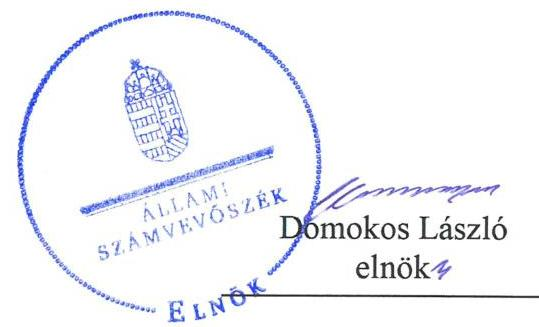
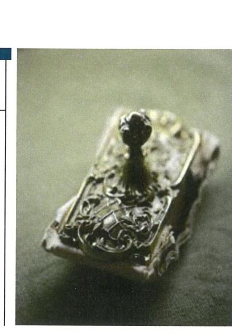
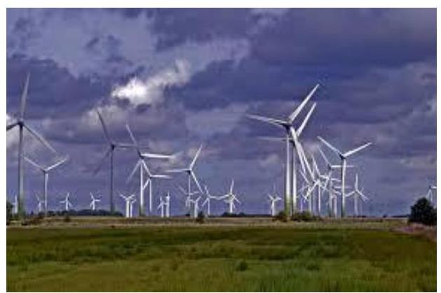
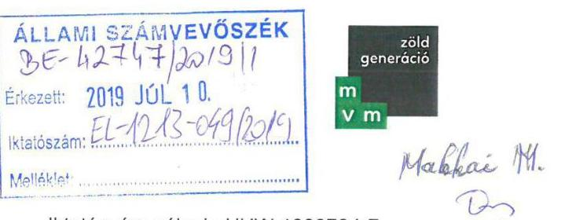
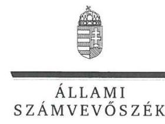
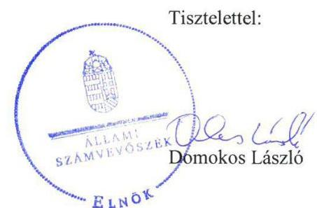

# Jelenetés 

## Az állami tulajdonú gazdasági társaságok ellenőrzése

MVM Hungarowind Szélerőmú Üzemeltető Korlátolt Felelősségú Társaság 2019.

---

# Jelentés 

## Az állami tulajdonú gazdasági társaságok ellenőrzése

MVM Hungarowind Szélerőmú Üzemeltető Korlátolt Felelősségú Társaság
2019. 08. hó 27. nap

---

# AZ ELLENŐRZÉST FELÜGYELTE:

## MAKKAI MÁRIA felügyeleti vezető

## AZ ELLENŐRZÉST VEZETTE ÉS A VÉGREHAJTÁSÁÉRT FELELŐS:

### SALI SÁNDORNÉ ellenőrzésvezető

## A PROGRAM ÖSSZEÁLLÍTÁSÁÉRT FELELŐS:

### TÓTPÁL SZABOLCS osztályvezető

IKTATÓSZÁM: EL-1883-001/2019.

TÉMASZÁM: 2480

ELLENŐRZÉS-AZONOSÍTÓ SZÁM: V082415

Jelentéseink az Országgyűlés számítógépes hálózatán és az Interneta a www.asz.hu címen is olvashatóak.

---

# TARTALOMJEGYZÉK 

■ ÖSSZEGZÉS ..... 5
■ AZ ELLENŐRZÉS CÉLJA ..... 6
■ AZ ELLENŐRZÉS TERÜLETE ..... 7
■ AZ ELLENŐRZÉS HÁTTERE, INDOKOLTSÁGA ..... 8
■ A JELENTÉS LÉNYEGES KÉRDÉSKÖREI ..... 9
■ AZ ELLENŐRZÉS HATÓKÖRE ÉS MÓDSZEREI ..... 10
■ MEGÁLLAPÍTÁSOK ..... 12
■ JAVASLATOK ..... 14
■ MELLÉKLETEK ..... 15
I. sz. melléklet: Fogalomtár ..... 15
■ FÜGGELÉKEK ..... 17
I. sz. függelék a jelentéshez ..... 17
II. sz. függelék: Észrevételek ..... 18
■ RÖVIDÍTÉSEK JEGYZÉKE ..... 27

---

.

---

# ÖSSZEGZÉS 

Az MVM Hungarowind Szélerőmú Üzemeltető Korlátolt Felelősségú Társaság müködésének szabályozottsága a jogszabályi elöírásokkal nem volt összhangban. A Társaság vagyongazdálkodása nem volt szabályszerú, ezáltal az elszámoltathatóság és a vagyon védelme nem volt biztositott.

## Az ellenőrzés társadalmi indokoltsága

Az állami tulajdonú gazdálkodó szervezetek a nemzeti vagyon részét képezik. Gazdálkodásuk a közérdeklődés és a média figyelmének középpontjában áll. A közpénzt, közvagyont felhasználó állami tulajdonú gazdálkodó szervezetekkel szemben alapvető társadalmi igény, hogy müködésük, gazdálkodásuk szabályszerű, az általuk szolgáltatott adatok minél megbízhatóóbbak legyenek. Az Állami Számvevőszék a közvagyon, a közpénzek szabályos, átlátható és elszámoltatható felhasználásának elősegítése érdekében, stratégiájával összhangban végzi az államháztartáson kívül múködő szervezetek ellenőrzését.

Az MVM Hungarowind Szélerőmú Üzemeltető Korlátolt Felelősségú Társaság megfelelő múködése fontos az állami vagyon védelme szempontjából, emiatt került sor a Társaság ellenőrzésére.

## Főbb megállapítások, következtetések, javaslatok

Az MVM Hungarowind Szélerőmú Üzemeltető Korlátolt Felelősségú Társaság múködésének szabályozottsága nem volt összhangban a jogszabályi előírásokkal. A Társaság az önköltségszámítás rendjére vonatkozó belső szabályzatkészítési kötelezettségének nem tett eleget, valamint a számlarend nem tartalmazta a bizonylati rendet. A Társaság a 2016-2017. évek tekintetében - a közfeladat ellátással összefüggésben - iratkezelési szabályzat készítésére kötelezett volt, melynek az előírás ellenére nem tett eleget. A Társaság biztosította az előírásnak megfelelően a közérdekből nyilvános adatok közzétételét.

A gazdálkodás keretében a bevételek elszámolása megfelelt az előírásoknak.
A vagyongazdálkodás nem volt szabályszerű. A Társaság a 2015-2017. években az éves beszámoló mérlegtételeit a jogszabály és a belső szabályozás előírása szerinti leltárral nem támasztotta alá, így az ellenőrzött időszakban a valódiság elve nem érvényesült.

Az Állami Számvevőszék a jelentésben foglalt megállapítások alapján az MVM Zöld Generáció Korlátolt Felelősségú Társaság ügyvezetőjének öt javaslatot fogalmazott meg.

---

# AZ ELLENŐRZÉS CÉLJA 

Az ellenőrzés célja annak értékelése volt, hogy a gazdasági társaság szabályozottsága, gazdálkodása és vagyongazdálkodási tevékenysége megfelelt-e a jogszabályi és a tulajdonosi előírásoknak; biztosítva volt-e az ellátott közfeladat átláthatósága és elszámoltathatósága érdekében a tevékenység díjának megalapozottsága szabályszerű önköltségszámítással. A vagyonváltozást eredményező döntések esetében a gazdasági társaság szabályszerűen járt-e el.

---

# AZ ELLENŐRZÉS TERÜLETE 

## MVM Hungarowind Szélerőmú Üzemeltető Korlátolt Felelősségú Társaság

AZ MVM HUNGAROWIND SZÉLERŐMÚ ÜZEMELTETŐ Korlátolt Felelősségú Társaság 2001-ben alakult, 2009-től 100\%-os tulajdonosa az MVM Zrt. ${ }^{1}$. A Társaság ${ }^{2}$ 2012-től az MVM Csoport ${ }^{3}$ tagja.

A Társaság fő tevékenysége a szél- és napenergia felhasználásával villamosenergia-termelés, amely mellett villamosenergia-kereskedelmi feladatokat is ellátott. Tevékenységére ágazati jogszabályként elsősorban a VET ${ }^{4}$ vonatkozott. Jegyzett tőkéje 2017. december 31-én 3203,0 M Ft, saját tőkéje 4267,4 M Ft volt.

A Társaság a kezdetektől a szélenergiát hasznosította. A Sopronkövesd-Nagylózs szélerőmú parkban termelt villamos energia kötelező átvételi bázisárait a 389/2007. (XII. 23.) Korm. rendelet ${ }^{5}$ határozta meg az ellenőrzött időszakban.

A Társaság közfeladatot a 2016. évtől látott el. A 232/2015. (VIII.20.) Korm. rendelet ${ }^{6}$ 3. § (1) bekezdése a Társaságot jelölte meg közfeladatban közremúködő termelői engedélyesként a költségvetési intézmények által felhasznált fosszilis ${ }^{7}$ energiahordozók csökkentése érdekében. A közfeladat ellátásához szükséges, európai uniós támogatással létrehozott fotovoltaikus ${ }^{8}$ villamosenergia-termelő erőmű Pécs-Tüskésréten való kiépítésével 2016-tól vált lehetővé a költségvetési intézmények számára a kedvezményes tarifájú villamos energia igénybevétele.

A Társaság az ellenőrzött időszakban nem tartozott a kormányzati szektorba sorolt egyéb szervezetek közé, részesedése más gazdasági társaságban nem volt. Vagyonkezelésbe vett vagyonnal nem rendelkezett, a saját vagyonát használta, továbbá a Számv. tv. ${ }^{9}$ 155. § (2) bekezdése alapján könyvvizsgálatra kötelezett volt. A Társaság a 2015-2017. években nyereségesen gazdálkodott, 2017-ben 15 főt foglalkoztatott.

A Társaságnál kettős ügyvezetés volt, személyükben az ellenőrzött időszakban két alkalommal, 2015-ben és 2016-ban történt változás. A Társaságnál 2017. év végén öttagú felügyelő bizottság múködött.

A Társaság neve 2019. február 15-étől MVM Zöld Generáció Korlátolt Felelősségú Társaságra változott.

---

# AZ ELLENŐRZÉS HÁTTERE, INDOKOLTSÁGA 

Az Alaptörvény 38. cikke alapján az állam tulajdona a nemzeti vagyon része. A nemzeti vagyon megőrzésének, védelmének és a nemzeti vagyonnal való felelős gazdálkodásnak a követelményeit sarkalatos törvény határozza meg. Az állami tulajdonú gazdasági társaságokra vonatkozó előírások betartásának ellenőrzése kiemelten fontos a vagyon megőrzése, megóvása érdekében. Gazdálkodásuk jellemzően a közérdeklődés és a média figyelmének középpontjában áll, amihez hozzájárul a gazdálkodásuk körébe tartozó - közvetlen vagy közvetett állami tulajdonú, tehát végső soron a nemzeti vagyon részét képező - vagyon nagysága, illetve az általuk ellátott közfeladatok minősége és hatékonysága. A közfeladat árképzésének megalapozottsága és a rendszeres elszámoltatás feltételeinek kialakítása az ellenőrzés során nagy hangsúlyt kap.

Az ellenőrzés rámutathat az állami tulajdonú gazdasági társaságok gazdálkodási tevékenységével kapcsolatos jó gyakorlatokra és szabálytalanságokra. Felhívhatja a figyelmet a jogszabályi követelmények teljesítéséhez szükséges feltételek hiányosságaira, hozzájárulhat az államháztartáson kívüli, de (közvetlenül vagy közvetve) állami vagyont használó gazdasági társaságok tevékenységének átláthatóságához. Az ellenőrzés javaslatainak, megállapításainak hasznosítása hozzájárulhat a nemzeti vagyonnal való gazdálkodás átláthatóságának, elszámoltathatóságának javításához.

---

# A JELENTÉS LÉNYEGES KÉRDÉSKÖREI 

1. A társaság müködésének szabályozottsága megfelelt-e az előírásoknak?
2. A társaság gazdálkodása, vagyongazdálkodása, valamint adatszolgáltatási feladatainak ellátása szabályszerü volt-e?

---

# AZ ELLENŐRZÉS HATÓKÖRE ÉS MÓDSZEREI 

## Az ellenőrzés típusa

Megfelelőségi ellenőrzés.

## Az ellenőrzött időszak

Az ellenőrzött időszak a 2015-2017. évek, valamint a 2017. évi beszámoló jóváhagyása és közzététele tekintetében a 2018. június elsejéig tartó időszak.

## Az ellenőrzés tárgya

Az állami tulajdonban (résztulajdonban) lévő gazdasági társaság gazdálkodása, kiemelten vagyongazdálkodási tevékenysége.

## Az ellenőrzött szervezet

MVM Hungarowind Szélerőmű Üzemeltető Korlátolt Felelősségű Társaság

## Az ellenőrzés jogalapja

Az ellenőrzés jogalapját az ÁSZ tv. ${ }^{10} 1 . \S$ (3) bekezdése és 5. § (3)-(5) bekezdései képezték.

## Az ellenőrzés módszerei

Az ellenőrzést a nemzetközi standardokat irányadónak tekintve az ellenőrzési program ellenőrzési kérdései, az ellenőrzött időszakban hatályos jogszabályok, az ellenőrzés szakmai szabályok és módszertanok figyelembe vételével végezte el az ÁSZ ${ }^{11}$.

Az ellenőrzés ideje alatt az ellenőrzött szervezettel történő kapcsolattartást az ÁSZ Szervezeti és Múködési Szabályzatának vonatkozó előírásai alapján biztosította az ÁSZ.

Az ellenőrzési kérdések megválaszolásához szükséges bizonyítékok megszerzése a következő ellenőrzési eljárások alkalmazásával történt: megfigyelés, kérdésfeltevés (információkérés), összehasonlítás, valamint elemző eljárás. Az ellenőrzési bizonyítékként felhasználható adatforrások közé tartoznak egyrészt az ellenőrzési programban felsorolt adatforrások,

---

másrészt adatforrás lehet még minden - az ellenőrzés folyamán - feltárt, az ellenőrzés szempontjából információkat tartalmazó dokumentum.

Az ellenőrzést a kérdésekre adott válaszok kiértékelésével, valamint a megjelölt adatforrások felhasználásával, továbbá az adott időszakban hatályos jogszabályok figyelembe vételével folytattuk le.

A 2015. és 2017. évi bevételek és a ráfordítások elszámolásának szabályszerűsége, valamint az értékcsökkenési leírás és a vagyonnyilvántartás szabályszerűsége esetében az ellenőrzés azokra a legnagyobb értékű tételekre - a lényeges sokaságra - terjedt ki, melyek összértéke eléri a teljes sokaság összértékének 50\%-át. A lényeges sokaságot tételesen ellenőriztük. A 2015. és 2017. évi személyi jellegű kifizetések esetében a vezető tisztségviselők részére teljesített kifizetések tételes ellenőrzésére került sor.

---

# 1. A társaság múködésének szabályozottsága megfelelt-e az előírásoknak? 

Összegző megállapítás

A Társaság múködésének szabályozottsága nem volt összhangban a jogszabályi előírásokkal.

A SZABÁLYOZÁS keretében a Társaság a Számv. tv. előírásai szerint számviteli politikával ${ }^{12}$, leltározási szabályzattal ${ }^{13}$, értékelési szabályzattal ${ }^{14}$ rendelkezett. A VET előírása szerint a szétválasztási szabályokat a számviteli politikában, valamint a számviteli szétválasztási szabályzatban ${ }^{15}$ rögzítette.

A Társaság a Számv. tv. 14. § (5) bekezdés c) pontjának előírása ellenére önköltségszámítási szabályzatot nem készített.

A Társaság az ellenőrzött időszakban rendelkezett számlarenddel ${ }^{16}$, azonban az a Számv. tv. 161. § (2) bekezdés d) pont előírása ellenére a számlarendben foglaltakat alátámasztó bizonylati rendet nem tartalmazta.

Az Alapító ${ }^{17}$ a Taktv. ${ }^{18}$ 5. § (3) bekezdésének előírása szerint a vezető tisztségviselők, felügyelőbizottsági tagok, valamint az Mt. ${ }^{19}$ 208. § hatálya alá eső munkavállalók javadalmazásának, a jogviszony megszűnése esetére biztosított juttatások módjának, mértéke elveinek, annak rendszerének kereteit a Társaságra vonatkozóan megalkotta. A javadalmazási szabályzatot ${ }^{20}$ a Taktv. 5. § (3) bekezdésének előírása ellenére nem helyezték letétbe.

A Társaság - mint közfeladatot ellátó szervezet - az Ltv. ${ }^{21}$ 10. § (1) bekezdés a) pontja értelmében iratkezelési szabályzat készítésére kötelezett volt, melynek a 2016-2017. évek tekintetében nem tett eleget.

A Társaság adatvédelmi szabályzattal ${ }^{22}$ és információbiztonsági szabályzattal ${ }^{23}$ rendelkezett. A Társaság a Taktv.-ben előírt közérdekből nyilvános adatok közzétételének eleget tett.

A Társaság az Info tv. ${ }^{24}$ 35. § (3) bekezdésében foglaltak ellenére a közérdekű adatok közzététele teljesítésének rendjéről szabályzatot nem alkotott. Továbbá az Info tv. 37. § (1) bekezdésében előírt, az 1. sz. melléklet III/I. pontja szerinti számviteli éves beszámolóit honlapján nem tette közzé.

---

# 2. A társaság gazdálkodása, vagyongazdálkodása, valamint adatszolgáltatási feladatainak ellátása szabályszerű volt-e? 

Összegző megállapítás

A Társaság vagyongazdálkodási feladatainak ellátása nem volt szabályszerű. Az adatszolgáltatási feladatok ellátása szabályszerű volt.

A Társaság gazdálkodásához, vagyongazdálkodásához kapcsolódó feladatás hatásköröket, felelősségi viszonyokat az SZMSZ ${ }^{25}$ és az Alapító okirat ${ }^{26}$ tartalmazta. A Társaság a jogszabály előírása szerinti szétválasztási kötelezettségének eleget tett.

A GAZDÁLKODÁS keretében a bevételek elszámolása szabályszerű volt.

A VAGYONGAZDÁLKODÁS nem volt szabályszerű. A Társaság a 2015-2017. években az éves beszámoló mérlegtételeit a Számv. tv. 69. § (1) bekezdésének, valamint a leltározási szabályzat 5.4. pontja előírása ellenére leltárral nem támasztotta alá. Mindezek miatt a Számv. tv. 15. § (3) bekezdésében foglalt valódiság elve az ellenőrzött időszakban nem érvényesült.

AZ ADATSZOLGÁLTATÁSI FELADATOK ellátása szabályszerű volt. A Társaság az Alapító okiratban és az SZMSZ-ben előírt beszámolási, adatszolgáltatási feladatokat, továbbá üzleti tervkészítési kötelezettségét teljesítette.

---

# JAVASLATOK 

Az ÁSZ tv. 33. § (1) bekezdésében foglaltak értelmében az ellenőrzött szervezet vezetője köteles a jelentésben foglalt megállapításokhoz kapcsolódó intézkedési tervet összeállítani és azt a jelentés kézhezvételétől számított 30 napon belül az ÁSZ részére megküldeni. Amennyiben az ellenőrzött szervezet vezetője nem küldi meg határidőben az intézkedési tervet, vagy továbbra sem elfogadható intézkedési tervet küld, az Állami Számvevőszék elnöke az ÁSZ tv. 33. § (3) bekezdése a) és b) pontjaiban foglaltakat érvényesítheti.

## az MVM Zöld Generáció Korlátolt Felelősségű Társaság ügyvezetőjének

1. Intézkedjen a Számv. tv. előírásának megfelelő önköltségszámítási szabályzat elkészitéséről.
(1. sz. megállapítás 2. bekezdése alapján)
2. Intézkedjen arról, hogy a számlarend megfeleljen a Számv. tv. előírásainak.
(1. sz. megállapítás 3. bekezdése alapján)
3. Intézkedjen a vezető tisztségviselők, felügyelőbizottsági tagok, valamint az Mt. 208. §-ának hatálya alá eső munkavállalók javadalmazása, valamint a jogviszony megszünése esetére biztosított juttatások módjának, mértékének elveiről, annak rendszeréről megalkotott szabályzat letétbe helyezéséről
(1. sz. megállapítás 4. bekezdés második mondata alapján)
4. Intézkedjen a jogszabályi előírásoknak megfelelő iratkezelési szabályzat elkészitéséről.
(1. sz. megállapítás 5. bekezdése alapján)
5. Intézkedjen az éves beszámoló mérlegtételeit alátámasztó leltár jogszabályi előírásnak megfelelő elkészítéséről.
(2. sz. megállapítás 3. bekezdés második mondata alapján)

---

# MELLÉKLETEK 

- I. SZ. MELLÉKLET: FOGALOMTÁR
állami vagyon
a) Az állam tulajdonában lévő dolog, valamint a dolog módjára hasznosítható természeti erő,
b) az a) pont hatálya alá nem tartozó mindazon vagyon, amely vonatkozásában törvény az állam kizárólagos tulajdonjogát nevesíti,
c) az állam tulajdonában lévő tagsági jogviszonyt megtestesítő értékpapír, illetve az államot megillető egyéb társasági részesedés,
d) az államot megillető olyan immateriális, vagyoni értékkel rendelkező jogosultság, amelyet jogszabály vagyoni értékű jogként nevesít.
e) az állam tulajdonában lévő pénzügyi eszközök.

Forrás: Vtv. ${ }^{27}$ 1. § (2) bekezdése
gazdasági társaság
nemzeti vagyon
A gazdasági társaságok üzletszerű közös gazdasági tevékenység folytatására, a tagok vagyoni hozzájárulásával létrehozott, jogi személyiséggel rendelkező vállalkozások, amelyekben a tagok a nyereségből közösen részesednek, és a veszteséget közösen viselik.
Forrás: Ptk. ${ }^{28}$ 3:88. § (1) bekezdése
a) az állam vagy a helyi önkormányzat kizárólagos tulajdonában álló dolgok,
b) az a) pont hatálya alá nem tartozó, állam vagy a helyi önkormányzat tulajdonában lévő dolog,
c) az állam vagy a helyi önkormányzatot tulajdonában lévő pénzügyi eszközök, továbbá az államot vagy a helyi önkormányzatot megillető társasági részesedések,
d) az államot vagy a helyi önkormányzatot megillető bármely vagyoni értékkel rendelkező jogosultság, amelyet jogszabály vagyoni értékű jogként nevesít,
e) Magyarország határa által körbezárt terület feletti légtér,
f) az üvegházhatású gázok kibocsátási egységeinek kereskedelméről szóló törvény szerint kibocsátási egység és légiközlekedési kibocsátási egység, valamint az ENSZ Éghajlat változási Keretegyezménye és annak Kiotói Jegyzőkönyve végrehajtási keretrendszeréről szóló törvény szerinti kiotói egység,
g) állami vagy helyi önkormányzati fenntartású közgyűjtemény (muzeális intézmény, levéltár, közgyűjteményként működő kép- és hangarchívum, valamint könyvtár) saját gyűjteményében nyilvántartott kulturális javak körébe tartozó dolog, kivéve, ha az állami vagy önkormányzati tulajdon jogszerű létrejötte kétséget kizáró módon nem bizonyítható és a dologra nézve más a tulajdonjogát bizonyítja vagy a kulturális javakra vonatkozó jogszabályokban meghatározott eljárás keretében valószínűsíti (g. pont módosult 2013. december 7-től),
h) a régészeti lelet,
i) a nemzeti adatvagyon körébe tartozó állami nyilvántartások fokozottabb védelméről szóló törvény szerinti nemzeti adatvagyon.
Forrás: Nvtv. ${ }^{29}$ 1. § (2)

---

.

---

# FÜGGELÉKEK 

- I. SZ. FÜGGELÉK A JELENTÉSHEZ

Az Állami Számvevőszék az ellenőrzések során feltárt tényekhez kapcsolódó további körülmények tisztázására eszközrendszerrel nem rendelkezik. Amennyiben az ellenőrzésen túlmutatóan indokoltnak látszik az ellenőrzés során feltárt körülmények további vizsgálata, az Állami Számvevőszék törvényi felhatalmazás alapján az ellenőrzés által feltárt körülményeket továbbítja a hatáskörrel rendelkező szervnek a szükséges intézkedések megtétele, eljárások lefolytatása érdekében.
I. Az MVM Hungarowind Szélerőmü Üzemeltető Korlátolt Felelősségü Társaság az ellenőrzött időszakban a Számv. tv. 69. § (1) bekezdésének, valamint a leltározási szabályzat 5.4. pontja előirása ellenére az éves beszámoló mérlegtételeit leltárral nem támasztotta alá.
Az esetek konkrét körülményeinek feltárására a Nemzeti Adó- és Vámhivatal rendelkezik hatáskörrel.

---

A jelentéstervezetet a Számvevőszék 15 napos észrevételezésre megküldte az ellenőrzött szervezet vezetőjének az ÁSZ tv. 29. §* (1) bekezdése előírásának megfelelően.

Az MVM Zöld Generáció Korlátolt Felelősségű Társaság ügyvezetője élt az ÁSZ törvény 29.§ (2) bekezdésében foglalt észrevételezési lehetőséggel, a törvényes határidőn belül észrevételt tett. Az észrevételeket és az arra adott válaszokat a függelék tartalmazza.

[^0]
[^0]:    * 29. § (1) Az Állami Számvevőszék az ellenőrzési megállapításait megküldi az ellenőrzött szervezet vezetőjének vagy az általa megbízott személynek, és annak, akinek személyes felelősségét állapította meg.
    (2) Az ellenőrzött szervezet vezetője és a felelősként megjelölt személy az ellenőrzés megállapításaira tizenöt napon belül írásban észrevételt tehet.
    (3) Az Állami Számvevőszék az észrevételre a beérkezésétől számított harminc napon belül írásban válaszol. A figyelembe nem vett észrevételeket köteles a jelentésben feltüntetni, és megindokolni, hogy azokat miért nem fogadta el.

---

Domokos László
Elnök
Állami Számvevőszék
Budapest
Apáczai Csere János utca 10. 1052

Iktatószám nálunk: HUW-1980704-7
Iktatószám Önöknél: EL-1213-047/2019

Budapest, 2019. 07. 05.

Tárgy: MVM Zöld Generáció Kft. számvevőszéki jelentéstervezet - észrevételek

Tisztelt Elnök Úr!
2019. június 27-én kaptuk kézhez az MVM Hungarowind Szélerőmú Üzemeltető Korlátolt Felelősségű Társaságnál (névváltozást követően: MVM Zöld Generáció Korlátolt Felelősségű Társaság, illetve MVM Zöld Generáció Kft.) folytatott, „Az állami tulajdonú gazdasági társaságok ellenőrzése - MVM Hungarowind Szélerőmú Üzemeltető Korlátolt Felelősségű Társaság" témában készített számvevőszéki jelentéstervezetet. Élve a jogszabály adta lehetőséggel, a megállapításokkal, javaslatokkal kapcsolatos észrevételeinket az alábbiakban adjuk meg.
Az MVM Zöld Generáció Kft. az MVM Csoport tagjaként, a jogszabályok által meghatározott keretek között, a Társaság Alapszabályában szereplő Uralmi Klauzulában foglaltaknak megfelelően, a csoportszintű irányítási rendszer és a szabályzatok alapul vételével müködik és gazdálkodik. Az MVM Csoport csoportszintű szabályzatai az Elismert Vállalatcsoportba tartozó társaságok számára kötelezően alkalmazandóak.

A jelentéstervezetben tett megállapításokkal és javaslatokkal kapcsolatos észrevételek:

1. számú összegző megállapítás: A Társaság müködésének szabályozottsága a jogszabályi előírásokkal nem volt összhangban.

A megállapítást a T. Állami Számvevőszék az alábbi pontokban felsorolt hiányosságok alapján állapította meg, melyekre az adott pontnál igyekszünk megfelelő választ adni.
(a) Megállapítás: „A Társaság a Számv. tv. 14. § (5) bekezdés c) pontjának elöírása ellenére önköltségszámítási szabályzatot nem készített"

A Társaság az „MVM Csoport költség és eredményszámítási szabályzatát" alkalmazza. A szabályzat 2.2 Személyi hatálya alapján a „szabályzat hatálya kiterjed az MVM Zrt.-re mint uralkodó tagra, és az MVM Csoport elismert vállalatcsoportba tartozó ellenőrzött társaságaira."

---

A szabályzatot 2018. november 15-én T. Állami Számvevőszék részére átadtuk. Fenti indokok alapján kérjük a csoportszintű szabályzat alkalmazásának elfogadását.

Kérjük, hogy ez alapján a T. Állami Számvevőszék a fenti megállapítást mellőzni szíveskedjen.

(b) Megállapítás: „A Társaság a Számv. tv. 14. § (5) bekezdés d) pontja alapján az ellenőrzött időszakban rendelkezett számlarenddel, azonban az a Számv. tv. 161. § (2) bekezdés d) pont előírása ellenére a számlarendben foglaltakat alátámasztó bizonylati rendet nem tartalmazta.”

A megállapítást a T. Állami Számvevőszék a bizonylati rend hiányára alapozza, amellyel nem értünk egyet. A számlarendben foglaltakat alátámasztó bizonylati rendet MVM Csoport következő csoportszintű szabályozásai tartalmazzák, melyek hatálya csak az ezekben a szabályzatokban foglalt társaságokra terjed ki:
- CsSz-06 – Az MVM Csoport beszerzési szabályzata;
- CsSz-07 – Az MVM Csoport raktár-és készletgazdálkodási szabályzata;
- CsSz-08 – Az MVM Csoport számviteli és adózási szabályzata;
- CsSz-19 – Az MVM Csoport vevői, szállítói folyószámla kezelési, pénzforgalmi és bankkártya-használati szabályzata és
- CsSz-29 – Az MVM Társaságcsoport egységes számviteli-politikái.

A fenti szabályzatokat 2018. november 14-én átadtuk.

A szabályzatok személyi hatálya alapján a „szabályzat hatálya kiterjed az MVM Zrt.-re mint uralkodó tagra, és az MVM Csoport elismert vállalatcsoportba tartozó ellenőrzött társaságaira.”

Tekintettel arra, hogy az MVM Zöld Generáció Kft. ügyviteli feladatait az Ügyviteli Szolgáltató Központ látta el a vizsgált időszakban és látja el a mai napig is, ezért a Társaság a csoportszintű szabályzatban rögzített számlarendet és bizonylati rendet köteles alkalmazni.

Kérjük, hogy ez alapján a T. Állami Számvevőszék a fenti megállapítást mellőzni szíveskedjen.

(c) Megállapítás: „A javadalmazási szabályzatot a Tak. tv. 5. § (39 bekezdésének előírása ellenére nem helyezték letétbe.”

A javadalmazási szabályzat letétbe helyezése adminisztrációs hibából adódóan valóban nem történt meg. Időközben a pótlólagos letétbe helyezésről Társaságunk gondoskodott.

---

Kérjük, hogy ez alapján a T. Állami Számvevőszék a fenti megállapítását mellőzni szíveskedjen.
(d) Megállapítás: „A társaság, mint közfeladatot ellátó szervezet - az Ltv. 10. § (1) bekezdés a) pontja értelmében iratkezelési szabályzat készítésére kötelezett volt, melynek 2016-2017. évek tekintetben nem tett eleget."

Társaságunk a 2017. évre vonatkozó iratkezelési szabályzatát 2018. november 14én átadta.

Álláspontunk szerint Társaságunk nem minősül az Ltv. 10. § (1) bekezdésében meghatározott „közfeladatot ellátó szervezetnek", tekintettel arra, hogy a jogszabály az alábbiakban határozza meg a közfeladatot ellátó szervezet fogalmát: „az állami vagy helyi önkormányzati feladatot, valamint jogszabályban meghatározott egyéb közfeladatot ellátó szerv és személy". Társaságunk nem lát el ilyen tevékenységet. (Megjegyezzük, hogy Társaságunk nem tartozik a nemzeti vagyonról szóló 2011. évi CXCVI. törvény 2. melléklet I. pontjában meghatározott gazdasági társaságok körébe sem. Ott az MVM Zrt. szerepel, annak leányvállalatai nem, így az Ltv. 32. § (3) bekezdése értelmében sem köteles hasonló szabályzatot alkotni.)

Kérjük, hogy a fentiek alapján a T. Állami Számvevőszék megállapítását mellőzni szíveskedjen.
(e) Megállapítás: „A Társaság, az Info tv. 35. § (3) bekezdésében foglaltak ellenére a közérdekü adatok közzététele teljesitésnek rendjéröl szabályzatot nem alkotott."

Álláspontunk szerint, az Info tv. személy hatálya szélesebb, mint a Tak. tv. személyi hatálya. Az elektronikus közzétételre kötelezett adatfelelős szervek közül a Tak. tv. a személyi hatálya alá tartozó szervek részére - amilyen társaságunk is - részletes szabályokat tartalmaz a közzététel tekintetében, melyet követve álláspontunk szerint nincs szükség külön szabályzat alkotására.

Kérjük, hogy a fenti érv alapján a T. Állami Számvevőszék megállapítását mellőzni szíveskedjen.
(f) Megállapítás: „Az Info tv. 37. § (1) bekezdésében elöirt, az 1. sz. Melléklet III/1 pontja szerinti számviteli éves beszámolót honlapján nem tette közzé."

A számviteli éves beszámoló közzététele adminisztrációs hibából adódóan valóban nem történt meg. Időközben annak honlapon történő közzétételéről Társaságunk gondoskodott.

Kérjük, hogy ez alapján a T. Állami Számvevőszék a fenti megállapítást mellőzni szíveskedjen.

---

Fentiekre tekintettel az 1. számú összegző megállapítást aránytalanul súlyos megfogalmazásnak tartjuk és kérjük ennek felülvizsgálatát.
2. számú összegző megállapítás: A Társaság vagyongazdálkodási feladatainak ellátása nem volt szabályszerű (...).
(g) Megállapítás: „A Társaság a 2015-2017. években az éves beszámoló mérlegtételeit a Számv. tv. 69. § (1) bekezdésének, valamint a leltározási szabályzat 5.4 pontja elöirása ellenére leltárral nem támasztotta alá. Mindezek miatt a Számv. tv. 15. § (3) bekezdésében foglalt valódiság elve az ellenőrzött időszakban nem érvényesült."

Társaságunk a 2016. évre vonatkozó leltárt 2018. november 14-én átadta.
A leltározás mennyiségi adatainak rögzítése álláspontunk szerint külön nem szükséges, mivel az SAP rendszerben vezetett nyilvántartásainkban egy-egy eszközsor egy-egy eszközt jelent, tehát a leltár egyedi tételeket tartalmaz. Az átadott leltárban az értékek minden tételre vonatkozóan fel vannak tüntetve.

Fentiekre tekintettel az 2. számú összegző megállapítást aránytalanul súlyos megfogalmazásnak tartjuk és kérjük ennek felülvizsgálatát.

Amennyiben a fenti indoklással kapcsolatosan kérdés merül fel, azok megválaszolásában állunk szíves rendelkezésre.

# MVM Zöld Generáció Kft. 

Varga László
ügyvezető

Szentpéteri Zsuzsanna
gazdasági igazgató

---

ELNÖK

Ikt.szám: EL-1213-050/2019.

# Varga László 

ügyvezető
MVM Zöld Generáció Korlátolt Felelősségű Társaság

## Budapest

## Tisztelt Ügyvezető Úr!

„Az állami tulajdonú gazdasági társaságok ellenőrzése - MVM Hungarowind Szélerőmü Üzemeltető Korlátolt Felelősségü Társaság "címmel készített számvevőszéki jelentéstervezetre tett észrevételét köszönettel megkaptam.

Az Állami Számvevőszék észrevételre vonatkozó álláspontjáról a felügyeleti vezető által készített részletes tájékoztatást mellékelten megküldőm.

Tájékoztatom Ügyvezető urat, hogy a számvevőszéki jelentésben - az Állami Számvevőszékről szóló 2011. évi LXVI. törvény 29. § (3) bekezdése alapján - a figyelembe nem vett észrevételt szerepeltetjük, annak indoklásával, hogy azt az Állami Számvevőszék miért nem fogadta el.

Budapest, 2019. 08. hó 01. nap

Melléklet: Tájékoztatás az észrevétel kezeléséről

---

# Tájékoztatás   az észrevétel kezeléséről 

„Az állami tulajdonú gazdasági társaságok ellenőrzése - MVM Hungarowind Szélerőmü Üzemeltető Korlátolt Felelősségü Társaság "címú jelentéstervezetre 2019. július 10-én érkezett észrevételét áttekintettük, annak kezelésével kapcsolatban a következő tájékoztatást adom.

## 1. A jelentéstervezet 1. számú összegző megállapításával és az azt alátámasztó megállapításokkal kapcsolatban tett észrevételekre adott válasz

A) Az észrevétel az önköltségszámítás rendje hiányára vonatkozó megállapításra vonatkozik. Az észrevételben tájékoztatás szerepel arról, hogy az MVM Hungarowind Szélerőmü Üzemeltető Korlátolt Felelősségű Társaság (továbbiakban: Társaság) az MVM Csoport költség és eredményszámítási szabályzatát alkalmazza. Ennek alapján kérik a jelentéstervezet megállapításának módosítását, a szabályzat elfogadását.
A számvitelről szóló 2000. évi C. törvény (Számv. tv.) 14. § (5) bekezdés c) pontja alapján a számviteli politika keretében el kell készíteni az önköltségszámítás rendjére vonatkozó belső szabályzatot. A Számv. tv. 14. § (12) bekezdése szerint a számviteli politika elkészítéséért a gazdálkodó képviseletére jogosult személy felelős. Az észrevételben hivatkozott csoportszintú szabályozás nem tartalmazza a Társaság képviseletére jogosult személy kiadmányozását.
A szabályzat (2.2. Személyi hatálya) tartalmazza, hogy a szabályzat hatálya alá tartozó társaságok a rájuk vonatkozó esetekben és mértékben kötelesek betartani a szabályzat előírásait, amennyiben azok nem ütköznek a társaság müködési engedélyében vagy a vonatkozó jogszabályokban foglaltakkal.
A fentiek alapján a Társaságnak a Számv. tv. 14. § (5) bekezdés c) pontjában előírt önköltségszámítás rendjére vonatkozó szabályzattal szükséges rendelkeznie, és azt a csoportszintű szabályozás előírásainak betartásával kell elkészítenie. Mindezek alapján az észrevételt nem fogadjuk el, a jelentéstervezet módosítása nem indokolt.
B) Az észrevételben tájékoztatás szerepel arról, hogy a Társaság bizonylati rendjét a csoportszintủ szabályozások tartalmazzák, ezért a Társaság nem ért egyet a jelentéstervezetnek a bizonylati rend hiányára vonatkozó megállapításával.
A Számv. tv. 161. § (4) bekezdése szerint a számlarend összeállításáért, annak folyamatos karbantartásáért, a naprakész könyvvezetés helyességéért a gazdálkodó képviseletére jogosult személy a felelős, a (2) bekezdés d) pontja szerint a számlarend tartalmazza a számlarendben foglaltakat alátámasztó bizonylati rendet. A Társaság által az adatbekérés során az ellenőrzésnek átadott számlarend nem tartalmazza a bizonylati rendet. Az észrevételben hivatkozott csoportszintủ szabályzatok nem tartalmazzák a Társaság képviseletére jogosult személy kiadmányozását. Mindezek alapján az észrevételt nem fogadjuk el, a jelentéstervezet módosítása nem indokolt.

---

C) Az észrevételben a Társaság megerősíti, hogy a jelentéstervezetnek a javadalmazási szabályzat letétbe helyezésének elmulasztására vonatkozó megállapítása helytálló. Az észrevétel alapján a jelentéstervezet módosítása nem szükséges.
D) Az észrevételben a Társaság tájékoztatást ad arról, hogy iratkezelési szabályzatot az adatbekérés során átadott az Állami Számvevőszék részére, valamint arról, hogy nem minősül közfeladatot ellátó szervnek, ezért iratkezelési szabályzat készítésére nem kötelezett.
A Társaság közfeladatot a 2016. évtől ellátott, mivel a költségvetési intézmények fosszilis energia felhasználásának csökkentése érdekében napelemes villamosenergia-termelő erőmủ müködtetéséről szóló 232/2015. (VIII. 20.) Korm. rendelet 3. § (1) bekezdése a Társaságot jelölte meg közfeladatban közremüködő termelői engedélyesként a költségvetési intézmények által felhasznált fosszilis energiahordozók csökkentése érdekében. A közfeladat ellátásához szükséges, európai uniós támogatással létrehozott fotovoltaikus villamosenergia-termelő erőmủ Pécs-Tüskésréten való kiépítésével 2016-tól vált lehetővé a költségvetési intézmények számára a kedvezményes tarifájú villamos energia igénybevétele.
A Társaság 2016. és a 2017. évi üzleti tervei 6. oldalán, a jogszabályi környezet bemutatása keretében rögzítette, hogy „A Kormány 232/2015. (VIII. 20.) Korm. rendelete szerint a Társaság közfeladat ellátására kötelezett".
A Társaság - mint közfeladatot ellátó szervezet - az Ltv. 9. § (4) bekezdése értelmében iratkezelési szabályzat megalkotására volt kötelezett. A Társaság által az ellenőrzés rendelkezésére bocsátott, az MVM Megújuló Programjának keretein belül keletkező iratok, dokumentumok egységes kezelését szabályozó „iratkezelési szabályzat" nem volt hatályos és érvényes, mivel nem tartalmazta a hatályba helyezés dátumát és a kiadmányozásra jogosult aláírását. Mindezek alapján a Társaság iratkezelési szabályzattal nem rendelkezett, a jelentéstervezet megállapítása helytálló, annak módosítása nem indokolt.
E) Az észrevétel a közérdekủ adatok közzététele elmulasztására vonatkozó megállapítás mellőzését kéri. Az észrevétel szerint a köztulajdonban álló gazdasági társaságok takarékosabb müködéséről szóló 2009. évi CXXII. törvény (Tak. tv.) részletes szabályokat tartalmaz a közzététel tekintetében, melyet követve nincs szükség külön szabályzat megalkotására.
A D) pontban leírtak alapján a Társaság közfeladatot ellátó szervezetnek minősült, így az információs önrendelkezési jogról és az információszabadságról szóló 2011. évi CXII. törvény (Info tv.) 35. § (3) bekezdésben előírtak szerint a közérdekủ adatok közzététele teljesítésének részletes szabályait tartalmazó belső szabályzat készítésére volt kötelezett. A Társaság a kötelezettségének nem tett eleget, ezt az észrevételben leírtak is megerősítik. Mindezek alapján a jelentéstervezet módosítása nem indokolt.
F) Az észrevételben leírtak megerősítik a jelenéstervezet megállapítását, miszerint a Társaság az Info tv. 37. § (1) bekezdésében előírt, az 1. sz. melléklet III/I. pontja szerinti számviteli éves beszámolóit honlapján nem tette közzé. Az észrevétel szerint a Társaság számviteli éves beszámolóinak közzététele időközben megtörtént, ezért kérik a megállapítás mellőzését.
Az Állami Számvevőszék ellenőrzési megállapításai az Állami Számvevőszékről szóló 2011. évi LXVI. törvénynek (továbbiakban: ÁSZ törvény) megfelelően minden esetben az ellenőrzés során bekért és az arra nyitva álló határidőn belül rendelkezésre bocsátott

---

dokumentumokon alapulnak. Az ellenőrzés során beküldött dokumentumok alapján a jelentéstervezet megállapítása helytálló, annak módosítása nem indokolt.
Az A)-F) pontokban adott válaszok alapján a jelentéstervezet 1. összegző megállapításának módosítása nem indokolt.

# 2. A jelentéstervezet 2. számú összegző megállapításával és az azt alátámasztó megállapításokkal kapcsolatban tett észrevételekre adott válasz 

G) Az észrevétel a mérleg leltárral való alátámasztásának hiányára vonatkozik, tájékoztatást ad arról, hogy a 2016. évi leltárt az ellenőrzés részére korábban megküldték, mindezek alapján kérik a jelentéstervezet módosítását.
A Számv. tv. 69. § (1) bekezdése szerint a könyvek üzleti év végi zárásához, a beszámoló elkészítéséhez, a mérleg tételeinek alátámasztásához olyan leltárt kell összeállítani, amely tételesen, ellenőrizhető módon tartalmazza a vállalkozónak a mérleg fordulónapján meglévő eszközeit és forrásait mennyiségben és értékben. A Társaság által megküldött, az immateriális javak, tárgyi eszközök, készletek leltározásáról készített, 2016. szeptember 30 -án kelt jegyzőkönyv szerint a leltárkiértékelést az eszközök egy részére készítették el. A mérleg fordulónapján meglévő eszközöket és forrásokat mennyiségben és értékben, ellenőrizhető módon tartalmazó leltárt a Társaság a 2015-2017. évre nem bocsátott az ellenőrzés rendelkezésére. Mindezek alapján a jelentéstervezet megállapítása helytálló, annak módosítása nem indokolt.

Budapest, 2019. 06. hó 01. nap

Makkai Mária
felügyeleti vezető

---

# RÖVIDÍTÉSEK JEGYZÉKE 

${ }^{1}$ MVM Zrt.
${ }^{2}$ Társaság
${ }^{3}$ MVM csoport
${ }^{4}$ VET
${ }^{5}$ 389/2007. (XII. 23.) Korm. rendelet
${ }^{6}$ 232/2015. (VIII.20.) Korm. rendelet
${ }^{7}$ fosszilis
${ }^{8}$ fotovoltaikus
${ }^{9}$ Számv. tv.
${ }^{10}$ ÁSZ tv.
${ }^{11}$ ÁSZ
${ }^{12}$ számviteli politika
${ }^{13}$ leltározási szabályzat
${ }^{14}$ értékelési szabályzat
${ }^{15}$ számviteli szétválasztási szabályzat
${ }^{16}$ számlarend
${ }^{17}$ Alapító
${ }^{18}$ Taktv.
${ }^{19} \mathrm{Mt}$.
${ }^{20}$ javadalmazási szabályzat
${ }^{21}$ Ltv.
${ }^{22}$ adatvédelmi szabályzat
${ }^{23}$ információbiztonsági szabályzat

Magyar Villamos Művek Zártkörűen Működő Részvénytársaság
MVM Hungarowind Szélerőmű Üzemeltető Korlátolt Felelősségű Társaság az MVM Zrt. tulajdonában álló, alapvetően energiaszolgáltatáshoz kapcsolódó társaságok együttműködő csoportja, Magyarország nemzeti villamos társaságcsoportja. A Ptk. 3:49. § szerinti elismert vállalatcsoport, melynek uralkodó tagja, azaz a csoporttagok felett az irányítói jogokat gyakorló szervezet az MVM Zrt.
a villamos energiáról szóló 2007. évi LXXXVI. törvény (hatályos: 2007. október 15-től)
389/2007. (XII. 23.) Korm. rendelet a megújuló energiaforrásból vagy hulladékból nyert energiával termelt villamos energia, valamint a kapcsoltan termelt villamos energia kötelező átvételéről és átvételi áráról (hatályos: 2008. január 1-jétől) 232/2015. (VIII. 20.) Korm. rendelet a költségvetési intézmények fosszilis energia felhasználásának csökkentése érdekében napelemes villamosenergia-termelő erőmű működtetéséről (hatályos: 2015. augusztus 23-ától)
szén, kőolaj, olajtermékek, földgáz
napelem vagy fotovillamos elem, olyan szilárdtest eszköz, amely az elektromágneses sugárzást (fotonbefogást) közvetlenül villamos energiává alakítja.
2000. évi C. törvény a számvitelről (hatályos: 2001. január 1-jétől)
2011. évi LXVI. törvény az Állami Számvevőszékről (hatályos: 2011. július 1-jétől)

Állami Számvevőszék
az MVM Hungarowind Kft. számviteli politikája és módosításai
(hatályos: 2011. július 1-jétől, módosításai 2014. január 9-étől,
2016. február 1-jétől és 2017. február 1-jétől)
az MVM Hungarowind Kft. leltározási szabályzata
(hatályos: 2013. október 15-étől)
az MVM Hungarowind Kft. értékelési szabályzata és módosítása
(hatályos: 2013. október 15-étől, módosítása 2016. február 1-jétől)
az MVM Hungarowind Kft. számviteli szétválasztási szabályzata
(hatályos: 2017. január 1-jétől)
az MVM Hungarowind Kft. számlarendje (hatályos: 2010. január 1-jétől)
Magyar Villamos Múvek Zártkörűen Működő Részvénytársaság
a köztulajdonban álló gazdasági társaságok takarékosabb múködéséről szóló
2009. évi CXXII. törvény (hatályos: 2009. december 4-étől)
a Munka Törvénykönyvéről szóló 2012. I. törvény (hatályos: 2012. július 1-jétől)
az MVM Hungarowind Kft. javadalmazási szabályzata
(hatályos: 2015. január 1-jétől)
a köziratokról, a közlevéltárakról és a magánlevéltári anyag védelméről szóló
1995. évi LXVI. törvény (hatályos: 1996. január 1-jétől)
az MVM Hungarowind Kft. adatvédelmi szabályzata
(hatályos: 2016. június 1-jétől)
az MVM Hungarowind Kft. információbiztonsági szabályzata
(hatályos: 2015. június 1-jétől)

---

${ }^{24}$ Info tv.
${ }^{25}$ SZMSZ
${ }^{26}$ Alapító okirat
${ }^{27}$ Vtv.
${ }^{28}$ Ptk.
${ }^{29} \mathrm{Nvtv}$.
az információs önrendelkezési jogról és az információszabadságról szóló 2011. évi CXII. törvény (hatályos: 2011. július 27-étől)
az MVM Hungarowind Kft. Szervezeti és Múködési Szabályzata és módosítása (hatályos: 2015. január 2-ától, módosítása 2017. január 2-ától)
az MVM Hungarowind Kft. Alapító okirata és módosításai
az állami vagyonról szóló 2007. évi CVI. törvény
(hatályos: 2007. szeptember 25-étől)
a Polgári Törvénykönyvről szóló 2013. évi V. törvény
(hatályos: 2013. február 26-ától)
a nemzeti vagyonról szóló 2011. évi CXCVI. törvény
(hatályos: 2012. január 1-jétől)

---

# ÁLLAMI SZÁMVEVŐSZÉK 

1052 Budapest, Apáczai Csere János utca 10.
Levélcím: 1364 Budapest 4. Pf. 54
Telefon: +36 14849100 Telefax: +36 14849200
www.asz.hu