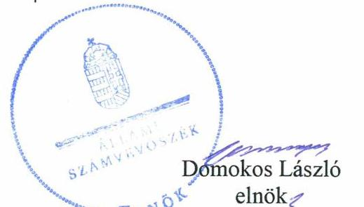
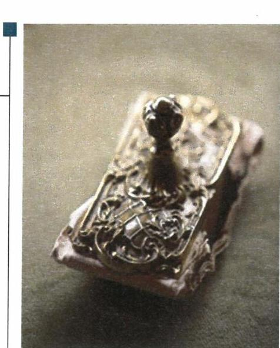

# Jelentés 

## Nemzeti tulajdonú gazdasági társaságok ellenőrzése

Jászberényi Vagyonkezelő és Városüzemeltető Nonprofit Zártkörűen Müködő Részvénytársaság
2019.

---

# Jelenetés 

## Nemzeti tulajdonú gazdasági társaságok ellenőrzése

Jászberényi Vagyonkezelő és Városüzemeltető Nonprofit Zártkörűen Múködő Részvénytársaság
2019. 10 . hó 28 . nap

---

# AZ ELLENŐRZÉST FELÜGYELTE:

DR. HORVÁTH MARGIT felügyeleti vezető

DR. NAGY IMRE felügyeleti vezető

## AZ ELLENŐRZÉST VEZETTE ÉS A VÉGREHAJTÁSÁÉRT FELELŐS:

SALI SÁNDORNÉ ellenőrzésvezető

A PROGRAM ÖSSZEÁLLÍTÁSÁÉRT FELELŐS:

TÓTPÁL SZABOLCS osztályvezető

IKTATÓSZÁM: EL-1884-001/2019.

TÉMASZÁM: 2478

TÉMASZÁM: 2478

Jelentéseink az Országgyűlés számítógépes hálózatán és az Interneten a www.asz.hu címen is olvashatóak.

---

# TARTALOMJEGYZÉK 

■ ÖSSZEGZÉS ..... 5
■ AZ ELLENŐRZÉS CÉLJA ..... 6
■ AZ ELLENŐRZÉS TERÜLETE ..... 7
■ AZ ELLENŐRZÉS HÁTTERE, INDOKOLTSÁGA ..... 8
■ A JELENTÉS LÉNYEGES KÉRDÉSKÖREI ..... 9
■ AZ ELLENŐRZÉS HATÓKÖRE ÉS MÓDSZEREI ..... 10
■ MEGÁLLAPÍTÁSOK ..... 12
■ JAVASLATOK ..... 14
■ MELLÉKLETEK ..... 15
I. sz. melléklet: Értelmező szótár ..... 15
■ FÜGGELÉKEK ..... 17
I. sz. függelék jelentésthez ..... 17
II. sz. függelék: Észrevételek ..... 18
■ RÖVIDÍTÉSEK JEGYZÉKE ..... 21

---

.

---

# ÖSSZEGZÉS 

Jászberény Városi Önkormányzat Jászberényi Vagyonkezelő és Városüzemeltető Nonprofit Zártkörüen Müködő Részvénytársaság feletti tulajdonosi joggyakorlása nem volt szabályszerű, mivel a Társaság számviteli törvény szerinti beszámolóinak jóváhagyása, valamint a javadalmazási szabályzat megalkotása nem jogszerü felhatalmazáson alapult. A Társaság vagyongazdálkodása az éves beszámolók mérlegtételeinek leltárral való alátámasztása hiányában nem volt szabályszerü. Ezáltal a Társaságnál az elszámoltathatóság nem volt biztositott, valamint a valódiság elve nem érvényesült.

## Az ellenőrzés társadalmi indokoltsága

Az Állami Számvevőszék stratégiájában megfogalmazta, hogy az államháztartáson kívül működő feladatellátó rendszerek ellenőrzéseivel hozzájárul ahhoz, hogy a közpénzeket, illetve az ingyenesen juttatott közvagyont az államháztartáson kívül működő szervezetek is átlátható, rendezett módon használják fel.

Az állam és a helyi önkormányzatok tulajdona nemzeti vagyon. A nemzeti vagyon megőrzése, megóvása érdekében kiemelten fontos a nemzeti tulajdonú gazdasági társaságok ellenőrzése.

A nemzeti tulajdonú gazdasági társaságok gazdálkodása jellemzően a közérdeklődés és a média figyelmének középpontjában áll, amihez hozzájárul a gazdálkodásuk körébe tartozó vagyon nagysága illetve az általuk ellátott közszolgáltatások minősége és hatékonysága is.

Az Állami Számvevőszék céljaival és a társadalmi igénnyel összhangban került sor a Jászberény Városi Önkormányzat kizárólagos tulajdonában álló Jászberényi Vagyonkezelő és Városüzemeltető Nonprofit Zártkörűen Működő Részvénytársaság vagyongazdálkodásának, illetve az Önkormányzat tulajdonosi joggyakorlásának ellenőrzésére.

## Főbb megállapítások, következtetések, javaslatok

A Jászberényi Vagyonkezelő és Városüzemeltető Nonprofit Zártkörűen Múködő Részvénytársaság felett tulajdonosi jogokat gyakorló Jászberény Városi Önkormányzat tulajdonosi joggyakorlása nem volt szabályszerű. Az Alapító a hatáskör átruházása és a hatáskör gyakorlása során a jogszabályi előírásoknak nem tett eleget a számviteli törvény szerinti beszámoló jóváhagyása, az adózott eredmény elfogadása, valamint a javadalmazási szabályzat megalkotásához kapcsolódóan.

A Társaság vagyongazdálkodása nem volt szabályszerű. Az éves beszámolók mérlegtételeit a Társaság a számviteli törvény, valamint a leltárkészítési és leltározási szabályzat előírásai ellenére leltárral nem támasztotta alá.

Az Állami Számvevőszék a jelentésben foglalt megállapítások alapján a Jászberényi Vagyonkezelő és Városüzemeltető Nonprofit Zártkörűen Múködő Részvénytársaság vezérigazgatójának két javaslatot, a Jászberény Városi Önkormányzat polgármesterének egy javaslatot fogalmazott meg. A javaslatokat megalapozó megállapításokra az érintettnek 30 napon belül intézkedési tervet kell készítenie.

---

# AZ ELLENŐRZÉS CÉLJA 

AZ ELLENŐRZÉS CÉLJA annak megállapítása volt, hogy a tulajdonosi joggyakorló a gazdasági társasága feletti tulajdonosi joggyakorlás kereteit kialakította-e, tulajdonosi jogait megfelelően gyakorolta-e és kötelezettségeit teljesítette-e. Az ellenőrzés célja továbbá annak megállapítása volt, hogy a gazdasági társaság biztosította-e a vagyon védelmét a nyilvántartások szabályszerű vezetése, és a mérleg tételeinek leltárral történő alátámasztása útján.

---

# AZ ELLENŐRZÉS TERÜLETE 

## A Jászberényi Vagyonkezelő és Városüzemeltető Nonprofit Zártkörűen Müködő Részvénytársaság és a tulajdonosi jogokat gyakorló Jászberény Városi Önkormányzat

A Jászberényi Vagyonkezelő és Városüzemeltető Nonprofit Zártkörűen Működő Részvénytársaság 1994-ben jött létre a Jászberényi Városgazdálkodási Vállalat átalakulásával. Alapítója a Jászberény Városi Önkormányzat volt, mely a Társaság ${ }^{1}$ 100\%-os tulajdonosa. A tulajdonosi jogokat az Önkormányzat ${ }^{2}$ Képviselő-testülete által átruházott hatáskörben a Gazdasági és Tulajdonosi Bizottság gyakorolta.

A Társaság alapításkori jegyzett tőkéje 266,4 M Ft volt, amely többszöri tőkeemelést követően 1065,0 M Ft-ra, majd 2017. év végére - tőkeleszállítás miatt - 840,0 M Ft-ra változott. A Társaság saját tőkéje 2017. december 31-én 973,7 M Ft volt.

A Társaság közfeladatot, illetve közszolgáltatást látott el. Tevékenységi körébe ingatlankezelés, hulladékgazdálkodási, iskola- és városüzemeltetési és városgazdálkodási feladatok tartoztak. Továbbá az Önkormányzat tulajdonát képező állat-
kert, sportlétesítmények, lakás- és nem lakás céljára szolgáló ingatlanok, strandok, termálfürdő, uszoda, egyéb ingatlanok működtetését végezte.

A Társaság Hulladékgazdálkodási közszolgáltatási szerződés ${ }^{3}$ keretében Jászberény és a környékbeli települések területén végzett kommunális és szelektív hulladékgyűjtést, hulladékszállítást, hulladékkezelést, mely tevékenységre ágazati jogszabályként a hulladékról szóló 2012. évi CLXXX. törvény vonatkozott.

A Társaság Közszolgáltatási szerződés ${ }^{4}$ keretében köznevelési intézmények feladatait szolgáló ingó- és ingatlanvagyon működtetését látta el.

A Társaság a Számv. tv. ${ }^{5}$ 155. § (2) bekezdés előírása alapján az ellenőrzött időszakban könyvvizsgálatra kötelezett volt.

A Társaság vagyonkezelési szerződéssel kezelésbe vett nemzeti vagyonnal nem rendelkezett, feladatait saját eszközeivel, valamint az Önkormányzat által rendelkezésére bocsátott eszközökkel látta el. A Társaság 2017. december 31-én 194 főt foglalkoztatott.

A Társaság két gazdasági társaságban - a Szelektív Hulladékhasznosító és Környezetvédő Nonprofit Korlátolt Felelősségű Társaságban, illetve a Köztisztasági Egyesülésben rendelkezett tulajdoni részesedéssel. A Társaság nem minősült kormányzati szektorba sorolt egyéb szervezetnek.

A vezérigazgató ${ }^{6}$ személye az ellenőrzött időszakban nem változott. Az $\mathrm{FB}^{7}$ létszáma 2016. évben változott, négy főről három főre csökkent. A polgármester ${ }^{8}$ és a jegyző ${ }^{9}$ személyében változás nem történt.

---

# AZ ELLENŐRZÉS HÁTTERE, INDOKOLTSÁGA 

AZ ÁLLAM ÉS A HELYI ÖNKORMÁNYZATOK TULAJDONA NEMZETI VAGYON, az Alaptörvény 38. cikke alapján. A nemzeti vagyon megőrzése, megóvása érdekében kiemelten fontos ezen nemzeti tulajdonú gazdasági társaságok ellenőrzése. Gazdálkodásuk jellemzően a közérdeklődés és a média figyelmének középpontjában áll, amihez hozzájárul a gazdálkodásuk körébe tartozó vagyon nagysága, illetve az általuk ellátott, közfeladatok, közszolgáltatások minősége és hatékonysága is.

Ellenőrzéseink feltárhatják, hogy a tulajdonosi felügyelet hozzájárult-e a szabályszerű gazdálkodáshoz és feladatellátáshoz. Az ellenőrzés eredményeként meghatározhatóvá válnak a gazdasági társaság vagyongazdálkodást érintő kockázatai, ezzel lehetővé téve a kockázatok csökkentését. A megállapítások alapján megfogalmazott számvevőszéki javaslatok hasznosítása elősegítheti a meglévő hibák megszüntetését. A jó gyakorlatok bemutatásával az ÁSZ ${ }^{31}$ hozzájárulhat a követendő megoldások megismertetéséhez, terjesztéséhez.

---

# A JELENTÉS LÉNYEGES KÉRDÉSKÖREI 

1. A tulajdonosi jogok gyakorlása szabályszerű volt-e?
2. A társaság vagyongazdálkodása megfelelt-e az előírásoknak?

---

# AZ ELLENŐRZÉS HATÓKÖRE ÉS MÓDSZEREI 

## Az ellenőrzés típusa

Megfelelőségi ellenőrzés.

## Az ellenőrzött időszak

A Társaság feletti tulajdonosi joggyakorlás vonatkozásában az ellenőrzött időszak 2017. január 1-jétől 2018. október 10-éig, az ellenőrzés megkezdésének napjáig terjedt ki az éves beszámolók elfogadása és a tulajdonosi ellenőrzése kivételével, amelyeknél az ellenőrzött időszak 2015. január 1jétől az ellenőrzés megkezdésének napjáig - 2018. október 10-éig - tartott. A Társaság vagyongazdálkodása vonatkozásában az ellenőrzött időszak a 2015-2017. évek, a 2017. évi beszámoló jóváhagyása tekintetében a 2018. június 1-jéig tartó időszak.

## Az ellenőrzés tárgya

A Jászberényi Vagyonkezelő és Városüzemeltető Nonprofit Zártkörűen Müködő Részvénytársaság feletti tulajdonosi joggyakorlás kialakítása és müködtetése. A Jászberényi Vagyonkezelő és Városüzemeltető Nonprofit Zártkörűen Müködő Részvénytársaság vagyongazdálkodása keretében a társaság használatában, kezelésében lévő nemzeti vagyon, illetve a saját vagyona tekintetében a vagyonnyilvántartások vezetése, leltára.

## Az ellenőrzött szervezet

A Jászberényi Vagyonkezelő és Városüzemeltető Nonprofit Zártkörűen Müködő Részvénytársaság, valamint a Jászberény Városi Önkormányzat, mint a Társaság feletti tulajdonosi joggyakorló.

## Az ellenőrzés jogalapja

Az ellenőrzés jogalapját az ÁSZ tv. ${ }^{11} 1 . \S$ (3) bekezdése és 5. § (3)-(5) bekezdése képezte.

---

# Az ellenőrzés módszerei 

Az ellenőrzést az ellenőrzési program ellenőrzési kérdései, az ellenőrzött időszakban hatályos jogszabályok, az ellenőrzés szakmai szabályok és módszertanok alapján, a nemzetközi standardok figyelembe vételével végeztük.

Az ellenőrzés ideje alatt az ellenőrzött szervezettel történő kapcsolattartást az ÁSZ Szervezeti és Múködési Szabályzatának vonatkozó előírásai alapján biztosítottuk.
2017. január 1-jétől 2018. október 10-éig, az ellenőrzés megkezdésének napjáig tartó időszakra ellenőriztük a tulajdonosi joggyakorlás kereteinek kialakítását, a tulajdonosi joggyakorló tevékenységét a felügyelő bizottság és a független könyvvizsgáló múködéséhez kapcsolódóan, valamint azt, hogy a tulajdonosi joggyakorló - amennyiben a gazdasági társaság feladatellátásához kapcsolódóan határozott meg követelményeket, elvárásokat - a nemzeti vagyon értékének megőrzése érdekében monitorozta-e azok teljesülését. A teljes ellenőrzött időszakra,-2015. január 1-jétől 2018. október 10-éig - ellenőriztük a tulajdonosi joggyakorló részvételét az éves beszámoló elfogadására vonatkozó döntéshozatalban.

A vagyongazdálkodás ellenőrzése keretében a gazdasági társaság vagyonhoz kapcsolódó nyilvántartásai vezetésének megfelelőségét, a mérleg tételeinek leltárral való alátámasztottságát, valamint a nemzeti vagyon értéke megőrzésének, gyarapításának, hasznosításának szabályszerűségét a 2015-2017. évek tekintetében ellenőriztük. Továbbá a 2015-2017. évekre, a 2017. évi beszámoló jóváhagyása tekintetében a 2018. június 1-jéig tartó időszakra történt meg a lényeges dokumentumok értékelése.

A vagyonnyilvántartások és a leltár szabályszerűsége esetében az ellenőrzés azokra a legnagyobb értékű tételekre - a lényeges sokaságra - terjedt ki, melyek összértéke eléri a teljes sokaság összértékének 50\%-át. A lényeges sokaságot tételesen ellenőriztük.

---

# 1. A tulajdonosi jogok gyakorlása szabályszerű volt-e? 

Összegző megállapítás

Az Önkormányzat Társaság feletti tulajdonosi joggyakorlása nem volt szabályszerű.

A TULAJDONOSI JOGGYAKORLÁS KERETEIT az Önkormányzat, mint a Társaság alapítója a vagyongazdálkodási rendeletben ${ }^{12}$, az SZMSZ ${ }^{13}$-ben, valamint az Alapító okiratban ${ }^{14}$ az Mötv. ${ }^{15}$, az Nvtv. ${ }^{16}$ és a Ptk. ${ }^{17}$ előírásai szerint alakította ki. Az Alapító ${ }^{18}$ az Alapító okiratban a Ptk., valamint a Taktv. ${ }^{19}$ előírásaival összhangban lévő FB létrehozásáról és a Számv. tv. előírásai szerinti könyvvizsgálatról rendelkezett. Továbbá Hulladékgazdálkodási közszolgáltatási szerződésben, Közszolgáltatási szerződésben, valamint üzemeltetési szerződésekben, megállapodásokban a Htv. ${ }^{20}$, az Nktv. ${ }^{21}$, illetve a Ptk. előírásai szerint határozta meg elvárásait a Társaság tevékenységére vonatkozóan.

Az Alapító a vagyongazdálkodási rendeletben rögzítette, hogy a Társaságra vonatkozóan a tulajdonosi jogok gyakorlásának rendjét az SZMSZben szabályozza. Az SZMSZ 2. melléklet 4. pontjának előírása szerint az ellenőrzött időszakban - átruházott hatáskörben - a GTB ${ }^{22}$ kapott felhatalmazást a Társaság tekintetében az Önkormányzatot megillető tulajdonosi jogok gyakorlására. Az Alapító okirat 6.1.e) pontja szerint az ellenőrzött időszakban a Társaság számviteli törvény szerinti beszámolójának elfogadása - ideértve az adózott eredmény elfogadására vonatkozó döntést is az Alapító hatáskörébe tartozott. Az Alapító a Társaság számviteli törvény szerinti beszámolójának elfogadását a Ptk. 3:109. § (2) bekezdésével összhangban szabályozta, azonban az attól eltérő gyakorlatot az Alapító okirat a Ptk. 3:4. § (2) bekezdésében foglaltak ellenére nem rögzítette.

Az Alapító a Társaság vezető tisztségviselői, FB tagjai, valamint az Mt. ${ }^{23} 208$. § hatálya alá eső munkavállalók javadalmazása, jogviszonyuk megszűnése esetére biztosított juttatások módjának, mértékének elveiről, annak rendszeréről szóló javadalmazási szabályzat megalkotását a GTB hatáskörébe utalta, ezzel megsértette a Taktv. 5. § (3) bekezdésében foglaltakat. A Taktv. előírása szerint a javadalmazási szabályzat megalkotása a legfőbb szerv - jelen esetben az Alapító - hatáskörébe tartozott.

A TULAJDONOSI JOGOK GYAKORLÁSA nem volt szabályszerű. A GTB az FB és a könyvvizsgáló írásbeli jelentéseinek birtokában, azonban a Ptk. 3:109. § (2) bekezdésében és az Alapító okirat 6.1.e) pontjában foglaltakkal ellentétesen, jogosultság hiánya ellenére döntött a Társaság éves számviteli beszámolóinak és adózott eredményének elfogadásáról. A javadalmazási szabályzat ${ }^{24}$ GTB általi elfogadásával az Alapító megsértette a Takt. 5. § (3) bekezdésében foglalt előírást.

Az Alapító a Társaság tevékenységének nyomon követését - a tulajdonosi előírásokkal összhangban lévő - üzleti tervek elfogadása, valamint az

---

FB ellenőrzései útján biztosította. Továbbá élt az Áht. ${ }^{25}$-ban foglalt lehetőséggel, 2015-ben és 2017-ben végzett belső ellenőrzést a Társaságnál, a javaslatok hasznosultak.

# 2. A társaság vagyongazdálkodása megfelelt-e az előírásoknak? 

## Összegző megállapítás

A Társaság vagyongazdálkodása nem volt szabályszerű. Az éves beszámolókat az előírás szerinti leltárral a Társaság nem támasztotta alá.

A Társaság rendelkezett leltárkészítési és leltározási szabályzattal ${ }^{26}$, amely a Számv. tv. 69. § (3) bekezdésének előírása ellenére az ingatlanok esetében ötévenkénti mennyiségi felvétellel történő leltározási kötelezettséget határozott meg az előírt legalább három évenkénti helyett.

A Társaság közszolgáltatási, üzemeltetési szerződések, illetve megállapodások alapján használta az önkormányzati tulajdonú eszközöket feladatai ellátása érdekében, melyeket - bérbeadás útján - tovább hasznosított, betartva az Nvtv.-ben, az önkormányzati rendeletekben ${ }^{27}$, illetve a 16/2012. sz. Vezig. utasításban ${ }^{28}$ foglaltakat.

A VAGYONGAZDÁLKODÁS az ellenőrzött időszakban nem volt szabályszerű. A Társaság az éves beszámolók mérlegtételeit - a fordulónapon meglévő eszközöket és forrásokat mennyiségben és értékben tartalmazó -, a Számv. tv. 69. § (1) bekezdése, valamint a leltárkészítési és leltározási szabályzat III. pontjában foglaltak ellenére leltárral nem támasztotta alá.

A mérleg tételeit alátámasztó leltár hiányában a 2015-2017. évi éves beszámolókban a Számv. tv. 15. § (3) bekezdésében foglalt előírás ellenére nem érvényesült a valódiság elve, emiatt a Társaság elszámoltathatósága, a nemzeti vagyon megőrzése nem volt biztosított.

A leltárak hiánya ellenére a könyvvizsgáló a 2015-2017. évi beszámolókat korlátozás nélküli hitelesítő záradékkal látta el.

---

# JAVASLATOK 

Az ÁSZ tv. 33. § (1) bekezdésében foglaltak értelmében az ellenőrzött szervezet vezetője köteles a jelentésben foglalt megállapításokhoz kapcsolódó intézkedési tervet összeállítani és azt a jelentés kézhezvételétől számított 30 napon belül az ÁSZ részére megküldeni. Amennyiben az ellenőrzött szervezet vezetője nem küldi meg határidőben az intézkedési tervet, vagy továbbra sem elfogadható intézkedési tervet küld, az Állami Számvevőszék elnöke az ÁSZ tv. 33. § (3) bekezdése a) és b) pontjaiban foglaltakat érvényesítheti.
Javaslatunk célja a Jászberényi Vagyonkezelő és Városüzemeltető Nonprofit Zártkörűen Müködő Részvénytársaság gazdálkodása szabályszerűségének és gyakorlatának javítása annak érdekében, hogy a szabályozási környezet és az alkalmazott gyakorlat megfelelően tudja támogatni az átlátható müködést.

## A Jászberényi Vagyonkezelő és Városüzemeltető Nonprofit Zártkörűen Müködő Részvénytársaság vezérigazgatójának

1. Intézkedjen a leltárkészítési és leltározási szabályzat Számv. tv. előírásainak megfelelő módosításról az ingatlanok mennyiségi felvétellel történő leltározási gyakoriságára vonatkozóan.
(2. sz. megállapítás 1. bekezdése alapján)
2. Intézkedjen az éves beszámoló mérlegtételeinek a Számv. tv.-ben és a leltárkészítési és leltározási szabályzatban elöírtaknak megfelelő leltárral történő alátámasztásáról, egyúttal a Számv. tv.-ben elöírt valódiság számviteli alapelv éves beszámolóban történő érvényesítéséről.
(2. sz. megállapítás 3-4. bekezdései alapján)

Javaslataink célja a tulajdonosi joggyakorló Jászberény Városi Önkormányzat szabályszerű müködésének elősegítése, továbbá a tulajdonosi joggyakorlás kontrolljainak erősítése.

## Jászberény Városi Önkormányzat polgármesterének

1. Gondoskodjon arról, hogy a Társaság számviteli beszámolójának jóváhagyásával kapcsolatos hatáskör átruházásának szabályozása és annak gyakorlása feleljen meg a jogszabályi előirásoknak.
(1. sz. megállapítás 2. bekezdés 4. mondata, 4. bekezdés 2. mondata alapján)

---

# MELLÉKLETEK 

- I. SZ. MELLÉKLET: ÉRTELMEZŐ SZÓTÁR
gazdasági társaság
közszolgáltatás
közfeladat
nemzeti vagyon
nonprofit gazdasági társaság
tulajdonosi jogok gyakor-
lója

A Ptk. 3:88. § (1) bekezdése szerint „a gazdasági társaságok üzletszerű közös gazdasági tevékenység folytatására, a tagok vagyoni hozzájárulásával létrehozott, jogi személyiséggel rendelkező vállalkozások, amelyekben a tagok a nyereségből közösen részesednek, és a veszteséget közösen viselik".
Az Ebktv. ${ }^{29}$ 3. § d) pontja a következőképpen határozza meg a közszolgáltatást: „szerződéskötési kötelezettség alapján a lakosság alapvető szükségleteinek ellátására irányuló szolgáltatás, így különösen a villamos energia-, gáz-, hő-, víz-, szennyvíz- és hulladékkezelési, köztisztasági, postai és távközlési szolgáltatás, továbbá a menetrend alapján közlekedő járművekkel végzett közforgalmú személyszállítás".
Az Áht. 3/A. § (1) bekezdése alapján közfeladat a jogszabályban meghatározott állami vagy önkormányzati feladat.
Nvtv. 1. § (2) bekezdése szerint nemzeti vagyonba tartozik többek között:
„az állam vagy a helyi önkormányzat kizárólagos tulajdonában álló dolgok,
az a) pont hatálya alá nem tartozó, állam vagy a helyi önkormányzat tulajdonában lévő dolog,
az állam vagy a helyi önkormányzat tulajdonában lévő pénzügyi eszközök, továbbá az államot vagy a helyi önkormányzatot megillető társasági részesedések,
az államot vagy a helyi önkormányzatot megillető bármely vagyoni értékkel rendelkező jogosultság, amelyet jogszabály vagyoni értékű jogként nevesít."
Civil tv. ${ }^{30}$ 9/F. § (2) bekezdése szerint „az a gazdasági társaság minősül nonprofit gazdasági társaságnak és cégnevében az a gazdasági társaság tüntetheti fel a nonprofit jelleget, amelynek létesítő okirata tartalmazza, hogy a gazdasági társaság tevékenységéből származó nyereség a tagok között nem osztható fel, hanem az a gazdasági társaság vagyonát gyarapítja." (hatályos 2014. március 15-étől)
Aki a nemzeti vagyon felett az államot vagy a helyi önkormányzatot megillető tulajdonosi jogok és kötelezettségek összességének gyakorlására jogosult.
Forrás: Nvtv. 3. § (1) 17. pontja

---

.

---

# FÜGGELÉKEK 

- I. SZ. FÜGGELÉK JELENTÉSTHEZ

Az Állami Számvevőszék az ellenőrzések során feltárt tényekhez kapcsolódó további körülmények tisztázására eszközrendszerrel nem rendelkezik. Amennyiben az ellenőrzésen túlmutatóan indokoltnak látszik az ellenőrzés során feltárt körülmények további vizsgálata, az Állami Számvevőszék törvényi felhatalmazás alapján az ellenőrzés által feltárt körülményeket továbbítja a hatáskörrel rendelkező szervnek a szükséges intézkedések megtétele, eljárások lefolytatása érdekében.
A Jászberényi Vagyonkezelő és Városüzemeltető Nonprofit Zártkörüen Müködő Részvénytársaság a Számv. tv. 69. § (1) bekezdésében előirtak ellenére a 2015., 2016., 2017. évi éves beszámoló mérlegtételeit - az eszközöket és forrásokat mennyiségben és értékben tartalmazó - leltárral nem támasztotta alá.
A mérleg tételeit alátámasztó leltár hiányában az éves beszámolókban a Számv. tv. 15. § (3) bekezdésében foglalt előirás ellenére nem érvényesült a valódiság elve és nem igazolt, hogy a Jászberényi Vagyonkezelő és Városüzemeltető Nonprofit Zártkörüen Müködő Részvénytársaság éves beszámolói megbízható, valós összképet mutatnak.
A konkrét körülmények feltárására a Nemzeti Adó- és Vámhivatal rendelkezik hatáskörrel.

---

A jelentéstervezetet a Számvevőszék 15 napos észrevételezésre megküldte az ellenőrzött szervezetek vezetőinek az ÁSZ tv. 29. §̊ (1) bekezdése előirásának megfelelően.

A jelentéstervezet megállapításaira a Jászberényi Vagyonkezelő és Városüzemeltető Nonprofit Zártkörüen Müködő Részvénytársaság vezérigazgatója írásban észrevételt tett, Jászberény Város Önkormányzatának polgármestere nem tett észrevételt.

[^0]
[^0]:    * 29. § (1) Az Állami Számvevőszék az ellenőrzési megállapításait megküldi az ellenőrzött szervezet vezetőjének vagy az általa megbízott személynek, és annak, akinek személyes felelősségét állapította meg.
    (2) Az ellenőrzött szervezet vezetője és a felelősként megjelölt személy az ellenőrzés megállapításaira tizenöt napon belül írásban észrevételt tehet.
    (3) Az Állami Számvevőszék az észrevételre a beérkezésétől számított harminc napon belül írásban válaszol. A figyelembe nem vett észrevételeket köteles a jelentésben feltüntetni, és megindokolni, hogy azokat miért nem fogadta el.

---

A „Nemzeti tulajdonú gazdasági társaságok ellenőrzése - Jászberényi Vagyonkezelő és Városüzemeltető Nonprofit Zártkörűen Müködő Részvénytársaság" címmel készített számvevőszéki jelentéstervezet megállapításaival kapcsolatban a Vezérigazgató által tett, figyelembe nem vett észrevételei és azok indokolása.

A jelentéstervezet 2. sz. megállapítás 1. bekezdését és a Vezérigazgatónak címzett 1. számú javaslatot érintő észrevétel:
Vezérigazgató úr észrevételében jelezte, hogy Leltározási szabályzatuk valóban nem került módosításra 2012. január 1. napját követően a hatályos Számv. tv. 69. § (3) bekezdésben megfogalmazottaknak megfelelően, de a Leltározási szabályzat helytelen előírásaival szemben a Számv. tv. előírásainak megfelelően történt a leltározás 2016. december 31. forduló nappal, amelynek dokumentumait szintén megküldték az Állami Számvevőszék részére. Elmondta, hogy Leltározási szabályzatukat 2019. augusztus 1. napjával a Számv. tv. 69. § (3) bekezdésének megfelelően módosították.

A Vezérigazgató úr észrevételében nem vitatta az Állami Számvevőszék Leltározási szabályzattal kapcsolatban tett megállapítását. A Leltározási szabályzat vonatkozó pontjának gyakorlati alkalmazásával, valamint az ellenőrzött időszakon kívül megtett intézkedésekkel kapcsolatos tájékoztatását köszönjük.

A jelentéstervezet módosítása a vonatkozó megállapítás tekintetében nem indokolt.
A jelentéstervezet 2. sz. megállapítás 3-4. bekezdését és a Vezérigazgatónak címzett 2. számú javaslatot érintő észrevétel:

Vezérigazgató úr észrevételében jelezte, hogy a Társaságuk minden évben - a jogszabályi előírásoknak megfelelően - elvégezte a leltározást az év végi záráshoz kapcsolódóan, a könyvvizsgálók felügyelete mellett és elvárásainak megfelelően. Elmondása szerint a 2015-2017. évekre vonatkozó leltárakat, amelyek a mérleg főkönyvi számláihoz kapcsolódnak, 2018. augusztus 22. napján elektronikusan átadták összesen 178 db fájlban. Elmondta továbbá, hogy a számvitelről szóló 2000. évi C. törvény (továbbiakban: Számv. tv.) nem fogalmaz meg konkrét előírásokat a leltárnak tekinthető dokumentum formátumára vonatkozóan. Álláspontja szerint az ÁSZ ellenőrzéshez rendelkezésre bocsátott dokumentumok tételesen, ellenőrizhető módon tartalmazzák a Társaság eszközeit és forrásait mennyiségben és értékben a Számv. tv. 69. § (1) bekezdés előírásainak megfelelően.

Az ellenőrzéshez történő adatszolgáltatás során átadott leltározási dokumentumok nem feleltek meg a Számv. tv. 69. § (1) bekezdésében foglalt előírásoknak, mivel a mérleg fordulónapján meglévő eszközöket és forrásokat nem támasztották alá teljeskörűen tételesen és ellenőrizhető módon.

A 2015. évi mérleg tekintetében beküldött leltárak nem tartalmazták tételesen a vagyoni értékű jogok, a - földterületek, telkek kivételével - az ingatlanok és kapcsolódó vagyoni értékű jogok, a jövőbeni költségekre képzett céltartalékok állományát. Ezen túlmenően a műszaki berendezések, gépek, járművek és egyéb berendezések, felszerelések járművek mérlegsorok értékének csak egy része került tételes leltárral alátámasztásra. A 2017. évi mérleg tekintetében beküldött leltárak nem támasztották alá tételesen a 2017. évi beszámoló mérlegében kimutatott készletek és követelések mérlegsorok értékének egészét.

A jelentéstervezet módosítása a vonatkozó megállapítás tekintetében nem indokolt.

---

.

---

# RÖVIDÍTÉSEK JEGYZÉKE 

${ }^{1}$ Társaság
${ }^{2}$ Önkormányzat
${ }^{3}$ Hulladékgazdálkodási közszolgáltatási szerződés
${ }^{4}$ Közszolgáltatási szerződés
${ }^{5}$ Számv. tv.
${ }^{6}$ vezérigazgató
${ }^{7} \mathrm{FB}$
${ }^{8}$ polgármester
${ }^{9}$ jegyző
${ }^{10}$ ÁSZ
${ }^{11}$ ÁSZ tv.
${ }^{12}$ vagyongazdálkodási rendelet
${ }^{13}$ SZMSZ
${ }^{14}$ Alapító okirat
${ }^{15}$ Mötv.
${ }^{16} \mathrm{Nvtv}$.
${ }^{17}$ Ptk.
${ }^{18}$ Alapító
${ }^{19}$ Taktv.
${ }^{20} \mathrm{Htv}$.
${ }^{21} \mathrm{Nktv}$.
${ }^{22}$ GTB
${ }^{23} \mathrm{Mt}$.

Jászberényi Vagyonkezelő és Városüzemeltető Nonprofit Zártkörűen Működő Részvénytársaság/Jászberényi V.V. Nonprofit Zrt.
Jászberény Városi Önkormányzat

Jászberény Városi Önkormányzat és a Jászberényi V. V. Nonprofit Zrt. között létrejött Hulladékgazdálkodási közszolgáltatási szerződés (hatályos: 2014. január 1-jétől 2018. június 30-áig)
Jászberény Városi Önkormányzat és a Jászberényi V. V. Nonprofit Zrt. között létrejött Közszolgáltatási szerződés egyes állami fenntartású köznevelési intézmények működtetési feladatai egy részének átadására (hatályos: 2014. január 1-jétől 2018. december 31-éig)
a számvitelről szóló 2000. évi C. törvény (hatályos: 2001. január 1-jétől)
a Jászberényi Vagyonkezelő és Városüzemeltető Nonprofit Zártkörűen Múködő Részvénytársaság vezérigazgatója
a Jászberényi Vagyonkezelő és Városüzemeltető Nonprofit Zártkörűen Múködő Részvénytársaság felügyelőbizottsága
Jászberény Városi Önkormányzat polgármestere
Jászberény Városi Önkormányzat jegyzője
Állami Számvevőszék
az Állami Számvevőszékről szóló 2011. évi LXVI. törvény (hatályos: 2011. július 1-jétől)
Jászberény Városi Önkormányzat 13/2012. (III. 19.) önkormányzati rendelete Jászberény Városi Önkormányzat vagyonáról és a vagyongazdálkodás szabályairól (a módosításokkal egységes szerkezetű, 2012. március 19-étől hatályos rendelet)
Jászberény Városi Önkormányzat Képviselő-testületének 7/2013. (II.14.) önkormányzati rendelete Jászberény Városi Önkormányzat Képviselő-testületének Szervezeti és Múködési Szabályzatáról (hatályos: 2013. február 14-étől)
a Jászberényi Vagyonkezelő és Városüzemeltető Nonprofit Zártkörűen Múködő Részvénytársaság módosításokkal egységes szerkezetbe foglalt Alapító okirata (hatályos: 2017. április 12-étől)
Magyarország helyi önkormányzatairól szóló 2011. évi CLXXXIX. törvény (hatályos: 2012. január 1-jétől)
a nemzeti vagyonról szóló 2011. évi CXCVI. törvény (hatályos: 2012. január 1-jétől)
a Polgári Törvénykönyvről szóló 2013. évi V. törvény (hatályos: 2013. február 26-ától)
Jászberény Városi Önkormányzat Képviselő-testülete
a köztulajdonban álló gazdasági társaságok takarékosabb múködéséről szóló 2009. évi CXXII. törvény (hatályos: 2009. december 4-étől)
a hulladékról szóló 2012. évi CLXXXV. törvény (hatályos: 2013. január 1-jétől)
a nemzeti köznevelésről szóló 2011. évi CXC. törvény (hatályos: 2012. november 1-jétől)
Jászberény Városi Önkormányzat Képviselő-testületének Gazdasági és Tulajdonosi Bizottsága
a munka törvénykönyvéről szóló 2012. évi I. törvény (hatályos: 2012. július 1-jétől)

---

${ }^{24}$ javadalmazási szabályzat
${ }^{25}$ Áht.
${ }^{26}$ leltárkészítési és leltározási szabályzat
${ }^{27}$ önkormányzati rendeletek
${ }^{28} 16 / 2012$. sz. Vezig. utasítás
${ }^{29}$ Ebktv.
${ }^{30}$ Civil tv.
az 54/2012. (X. 5.) számú, a Képviselő-testület Pénzügyi, Gazdasági és Tulajdonosi Bizottságának határozatával elfogadott, a Jászberényi Vagyonkezelő és Városüzemeltető Nonprofit Zártkörűen Müködő Részvénytársaság javadalmazási szabályzata (hatályos: 2012. október 15-étől)
az államháztartásról szóló 2011. évi CXCV. törvény (hatályos: 2011. december 31-étől)
a Jászberényi Vagyonkezelő és Városüzemeltető Nonprofit Zártkörűen Müködő Részvénytársaság Leltárkészítési és leltározási szabályzata (hatályos: 2009. január 1-jétől)
a 22/2011. (VI. 9.) számú rendelet az önkormányzat tulajdonában lévő lakások és nem lakás céljára szolgáló helyiségek bérletének szabályairól, a lakbérek mértékének megállapításáról (a módosításokkal egységes szerkezetű, 2012. január 1-jétől hatályos rendelet), valamint a 13/2012. (III. 9.) számú rendelet Jászberény Város Önkormányzatának vagyonáról és a vagyongazdálkodás szabályairól (a módosításokkal egységes szerkezetű, 2012. március 19-étől hatályos rendelet)
a saját tulajdonú ingatlanok, tárgyi eszközök értékesítéséről, hasznosításáról, valamint az önkormányzati tulajdonú, Társaság által üzemeltetett létesítmények hasznosításáról (hatályos: 2012. december 31-étől)
az egyenlő bánásmódról és az esélyegyenlőség előmozdításáról szóló 2003. CXXV. törvény (hatályos: 2004. január 27-étől)
az egyesülési jogról, a közhasznú jogállásról, valamint a civil szervezetek müködéséről és támogatásáról szóló 2011. évi CLXXV. törvény (hatályos: 2011. december 22-től)

---

# ÁLLAMI SZÁMVEVŐSZÉK 

1052 Budapest, Apáczai Csere János utca 10.
Levélcím: 1364 Budapest 4. Pf. 54
Telefon: +36 14849100 Telefax: +36 14849200
www.asz.hu