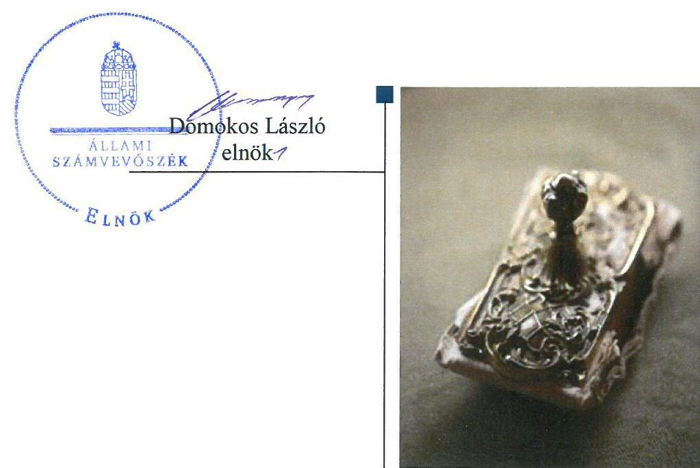
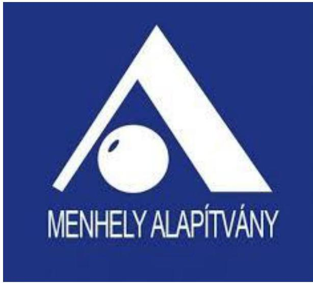
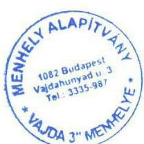
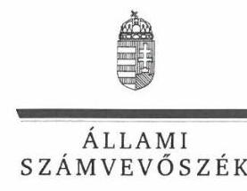

# Jelenetés 

## Nem állami humánszolgáltatók ellenőrzése

A humánszolgáltatást nyújtó államháztartáson kívüli szociális intézmények, szolgáltatók fenntartói központi költségvetésből kapott támogatásai felhasználásának ellenőrzése Menhely Alapítvány
2019.

---

# Jelentés 

## Nem állami humánszolgáltatók ellenőrzése

A humánszolgáltatást nyújtó államháztartáson kívüli szociális intézmények, szolgáltatók fenntartói központi költségvetésből kapott támogatásai felhasználásának ellenőrzése Menhely Alapítvány
2019. 10. hó 17. nap

---

# AZ ELLENŐRZÉST FELÜGYELTE:

- VARGA EDIT felügyeleti vezető
- AZ ELLENŐRZÉST VEZETTE ÉS A VÉGREHAJTÁSÁÉRT FELELŐS:
  - LACZI HEDVIG ANNA ellenőrzésvezető
  - A PROGRAM ÖSSZEÁLLÍTÁSÁÉRT FELELŐS:
    - TÓTPÁL SZABOLCS osztályvezető

**IKTATÓSZÁM:** EL-2017-001/2019.

**TÉMASZÁM:** 2491

**ELLENŐRZÉS-AZONOSÍTÓ SZÁM:** V083510

Jelentéseink az Országgyűlés számítógépes hálózatán és az Interneten a www.asz.hu címen is olvashatóak.

---

# TARTALOMJEGYZÉK 

■ ÖSSZEGZÉS ..... 5
■ AZ ELLENŐRZÉS CÉLJA ..... 6
■ AZ ELLENŐRZÉS TERÜLETE ..... 7
■ AZ ELLENŐRZÉS HÁTTERE, INDOKOLTSÁGA ..... 8
■ A JELENTÉS LÉNYEGES KÉRDÉSKÖREI ..... 9
■ AZ ELLENŐRZÉS HATÓKÖRE ÉS MÓDSZEREI ..... 10
■ MEGÁLLAPÍTÁSOK ..... 12
■ JAVASLATOK ..... 14
■ MELLÉKLETEK ..... 15
I. sz. melléklet: Értelmező szótár ..... 15
■ FÜGGELÉKEK ..... 17
I. sz. függelék a jelentéshez ..... 17
II. sz. függelék: Észrevételek ..... 18
■ RÖVIDÍTÉSEK JEGYZÉKE ..... 29

---

.

---

# ÖSSZEGZÉS 

A Menhely Alapítvány működési és gazdálkodási környezetét szabályszerűen kialakította. A szociális közfeladat ellátáshoz rendelt költségvetési támogatásokat nem tartotta nyilván, ezáltal nem teremtette meg a költségvetési támogatások felhasználásának átláthatóságát, elszámoltathatóságát.

## Az ellenőrzés társadalmi indokoltsága

Az Állami Számvevőszék stratégiájában hangsúlyos szerepet szán annak, hogy szilárd szakmai alapon álló, értékteremtő ellenőrzéseivel előmozdítsa a közpénzügyek átláthatóságát, rendezettségét és javaslataival a közpénzek és a közvagyon szabályos, gazdaságos, hatékony és eredményes felhasználását segítse. Az Állami Számvevőszék a stratégiájában célul tűzte ki, hogy az államháztartáson kívülre nyújtott költségvetési támogatások ellenőrzésével hozzájárul ahhoz, hogy a közpénzeket az államháztartáson kívüli szervezetek is átlátható módon használják fel a közfeladatok szerződésben vállalt ellátása érdekében.

Az Állami Számvevőszék e stratégiai céljaival összhangban - az Állami Számvevőszékről szóló 2011. évi LXVI. törvény felhatalmazása alapján - végzi a központi költségvetésből származó források, nyújtott támogatások - kedvezményezett szervezetek közfeladat ellátásához való - felhasználásának az ellenőrzését. Az Állami Számvevőszék hozzájárul ezzel ahhoz is, hogy a nyilvánosság és az igénybevevők megfelelő tájékoztatást kapjanak az államháztartáson kívüli közfeladatot ellátók működéséről.

## Főbb megállapítások, következtetések

A Menhely Alapítvány a jogszabályi előírásoknak megfelelően alakította ki a működési és gazdálkodási környezetét.
A Menhely Alapítvány a gazdálkodásával nem számolt el, mivel számviteli nyilvántartásaiban nem különítette el a saját és intézményei gazdálkodásával összefüggő tételeket, továbbá a költségvetési támogatások felhasználását nem feladatonkénti bontásban, elkülönítetten kezelte, így a költségvetési támogatások felhasználásának átláthatósága és elszámoltathatósága nem volt biztosított.

---

# AZ ELLENŐRZÉS CÉLJA 

AZ ELLENŐRZÉS CÉLJA annak értékelése, hogy a Menhely Alapítvány, mint szociális intézmények fenntartója központi költségvetésből kapott támogatásainak felhasználása szabályszerű volt-e, a támogatások igénylése, évközi módosítása és év végi elszámolása megfelelt-e a jogszabályi előírásoknak.

---

# **AZ ELLENŐRZÉS TERÜLETE**

## **Menhely Alapítvány**

A budapesti székhelyű Menhely Alapítványt 1989-ben alapította öt szervezet. Az Alapító okiratban$^{1}$ foglaltak szerint az alapítók; Budapest Főváros Önkormányzata, a "Hajléktalanokért" Társadalmi Bizottság, az "Oltalom" Karitatív Egyesület, a SZETA Alapítvány és Újpest Önkormányzatának Szociális Intézménye. A Fenntartó$^{2}$ bejegyzéséről a Fővárosi Bíróság 1990. január 25-én adta ki a végzést. A Fenntartó ügyvezető szerve és legfőbb döntéshozó testülete a Kuratórium$^{3}$. A Fenntartó 2012. január 1. óta közhasznú jogállású.

A Fenntartó szervezeti egységeiként, öt helyszínen működő, önálló jogi személyiséggel nem rendelkező humánszolgáltatást végző intézményei$^{4}$ látták el, az otthontalan emberek krízishelyzetének enyhítésére irányuló éjjeli menedékhely és utcai szociális munka alapszolgáltatásokat, a hajléktalan személyek a nappali ellátást, a szakosított ellátásokat valamint a diszpécser szolgálatot.

A Fenntartót a Törvényszék$^{5}$ nyilvántartásba vette. Fenntartó intézményeit az SzCsM.$^{6}$ rendeletben foglaltak szerint a Kormányhivatal$^{7}$ nyilvántartásba vette, valamint az Sznyvhr.$^{8}$-ben meghatározott tanúsítvánnyal rendelkeztek.

A Fenntartó Magyarország éves költségvetéséből, és három önkormányzattól kapott támogatást feladatainak ellátásához, további bevételét képezték az adományokból befolyt bevételek és a térítési díjakból származó árbevétel is.

A Fenntartó bevételeinek alakulását az 1. táblázat mutatja be:

1. táblázat

|  A FENNTARTÓ BEVÉTELEINEK ALAKULÁSA 2015-2017. KÖZÖTTI IDŐSZAKBAN (MFT) |  |  |   |
| --- | --- | --- | --- |
|  Megnevezés | 2015. | 2016. | 2017.  |
|  Összes bevétel | 532,7 | 561,4 | 556,8  |
|  Ebből: nettó árbevétel | 19,0 | 19,7 | 20,8  |
|  összes támogatás | 512,3 | 541,1 | 535,8  |
|  központi költségvetési támogatás | 210,7 | 272,2 | 228,4  |
|  önkormányzati támogatás | 200,2 | 192,0 | 200,6  |
|  pénzügyi, és rendkívüli bevétel | 1,4 | 0,6 | 0,2  |
|  (központi költségvetési támogatás+önkormányzati támogatás)/ összes bevétel aránya | 77,1 % | 82,7 % | 77,0 %  |

*Forrás: Menhely Alapítvány egyszerűsített éves beszámolói*

---

# AZ ELLENŐRZÉS HÁTTERE, INDOKOLTSÁGA 

A szociális feladatokat ellátó nem állami intézményfenntartók részére közfeladataik ellátására 2015-2017. években jelentős összegű pénzügyi támogatást biztosítottak a mindenkori költségvetési törvények a bennük megfogalmazott feltételek mellett.

Az ÁSZ$^{8}$ a stratégiájában célul tűzte ki, hogy az államháztartáson kívülre nyújtott költségvetési támogatások ellenőrzésével hozzájárul ahhoz, hogy a közpénzeket az államháztartáson kívüli szervezetek is átlátható módon használják fel a közfeladatok szerződésben vállalt ellátása érdekében. Az ÁSZ a stratégiájában foglaltak alapján is indokolt az ellenőrzés, amely a társadalom számára jelzi, hogy a közpénz államháztartáson kívüli felhasználása sem maradhat ellenőrizetlenül. Az államháztartáson kívülre nyújtott költségvetési támogatások ellenőrzésével az ÁSZ hozzájárul ahhoz, hogy a közpénzeket a nem állami fenntartók átlátható módon használják fel a közfeladatok ellátására kötött szerződésekben vállalt kötelezettségek teljesítése érdekében. Az ÁSZ az ellenőrzés javaslataival hozzájárulhat az említett rendszerek szabályszerű támogatás-felhasználásához, javíthatja a társadalmi-gazdasági döntések megalapozottságát, amely a „jó kormányzás" feltétele.

---

# A JELENTÉS LÉNYEGES KÉRDÉSKÖREI 

1. A szociális humánszolgáltató közfeladatot ellátó fenntartó szabályszerű működési - és gazdálkodási környezet kialakításával megteremtette-e a költségvetési támogatások átlátható, elszámoltatható igénybevételének, felhasználásának feltételeit?
2. Az államháztartáson kívüli fenntartó az átvállalt szociális humánszolgáltatási közfeladathoz biztosított költségvetési támogatásokat szabályszerűen fordította-e a humánszolgáltató intézményei működtetésére. Az intézményei működtetéséhez felhasznált közpénzekre vonatkozó gazdálkodásával elszámolt-e?

---

# AZ ELLENŐRZÉS HATÓKÖRE ÉS MÓDSZEREI 

## Az ellenőrzés típusa

Megfelelőségi ellenőrzés

## Az ellenőrzött időszak

A 2015. január 1-je és 2017. december 31-e közötti időszak. A helyszíni szemle tekintetében 2018. január 1-jétől az utolsó helyszíni szemle időpontjáig 2019. január 22.-ig tartó időszak.

## Az ellenőrzés tárgya

Az ellenőrzés a szociális humánszolgáltatási közfeladatokat ellátó államháztartáson kívüli fenntartók, humánszolgáltatási közfeladatai ellátásához a költségvetési törvényekben biztosított központi költségvetési támogatások igénylése, évközi módosítása és év végi elszámolása fenntartói feladatainak ellátása, illetve e központi költségvetésből kapott támogatásaik humánszolgáltatási közfeladatokra való fenntartó általi felhasználása szabályszerűségének értékelésére terjed ki.

## Az ellenőrzött szervezet

Menhely Alapítvány

## Az ellenőrzés jogalapja

Az ellenőrzés jogszabályi alapját az ÁSZ tv$^{10}$. 1. § (3) bekezdése, 5. § (3) bekezdésben foglalt előírások adták.

## Az ellenőrzés módszerei

Az ellenőrzést az ellenőrzési program szempontjai, kérdései, az ellenőrzött időszakban hatályos jogszabályok, a nemzetközi standardokat irányadónak tekintve, az ellenőrzés szakmai szabályok és módszertanok figyelembe vételével végeztük. A közpénzekkel való felelős gazdálkodás segítésére irányuló javaslatok kidolgozásakor a hatályos jogszabályok voltak az irányadóak.

Az ellenőrzés ideje alatt az ellenőrzött szervezettel történő kapcsolattartást az ÁSZ SZMSZ$^{11}$-ének vonatkozó előírásai alapján biztosítottuk.

---

Az ellenőrzési kérdések megválaszolásához szükséges bizonyítékok megszerzése az ellenőrzött által rendelkezésre bocsátott dokumentumokra, adatokra alapozva megfigyelés, szemle (szemrevételezés), kérdésfeltevés (információkérés), valamint elemző eljárással történt.

Az ellenőrzési bizonyítékként felhasználható adatforrások közé tartoztak egyrészt az ellenőrzési program részletes szempontjainál felsorolt adatforrások, másrészt minden - az ellenőrzés folyamán feltárt, az ellenőrzés szempontjából információt tartalmazó - dokumentum.

Az ellenőrzés lefolytatásához az ellenőrzött szervezet a kitöltött tanúsítványok, valamint az ÁSZ által kért dokumentumok elektronikus úton való megküldésével szolgáltatott adatokat, információkat. Az így rendelkezésre bocsátott adatok, információk és a tanúsítványok adatai valódiságának kontrollja az ellenőrzés keretében történt.

Az egységes értelmezést támogatta a jelentés mellékletét képező fogalomtár és rövidítésjegyzék.

Az ellenőrzést alapvetően a szociális humánszolgáltatások esetében a központi költségvetési támogatások igénylésével, módosításával, felhasználásával, elszámolásával kapcsolatos feladatokat ellátó államháztartáson kívüli fenntartóknál végeztük. A fenntartott intézményeknél helyszíni szemle keretében győződtünk meg a tényleges feladatellátásról (verifikáció).

A szociális humánszolgáltatások központi költségvetési támogatásai igénylésével, módosításával, elszámolásával kapcsolatos, államháztartáson kívüli fenntartó jogszabályokban előírt feladatai betartását, továbbá a központi költségvetési támogatások szabályszerű kezelését, nyilvántartását ellenőriztük a fenntartónál, az ott rendelkezésre álló határozatok, nyilvántartások, beszámolók és egyéb dokumentumok alapján. Az ellenőrzés nem terjedt ki a szociális humánszolgáltatások központi költségvetési támogatásai igénylése, módosítása, elszámolása valódiságának, megalapozottságának, helyességének - sem a fenntartónál, sem a székhely intézményeinél való - értékelésére (mivel ennek felülvizsgálata, ellenőrzése a finanszírozó jogszabályban előírt feladata, határozatai kiadása előtt). Továbbá nem terjedt ki az ellenőrzés e források, intézmények általi szabályszerű felhasználásának értékelésére.

---

# MEGÁLLAPÍTÁSOK 

## 1. A szociális humánszolgáltató közfeladatot ellátó fenntartó szabályszerű működési - és gazdálkodási környezet kialakításával megteremtette-e a költségvetési támogatások átlátható, elszámoltatható igénybevételének, felhasználásának feltételeit?

Összegző megállapítás A Fenntartó a szabályszerű működési és gazdálkodási környezet kialakításával megteremtette a költségvetési támogatások átlátható, elszámoltatható felhasználásának feltételeit.

A Fenntartó a Ptk.-ban$^{12}$ előírtaknak megfelelően rendelkezett alapító okirattal, amely tartalmazta a tevékenységét és a Civil tv.-ben$^{13}$ meghatározott, a közhasznú jogálláshoz szükséges rendelkezéseket.

A Fenntartó az SZMSZ-ben$_{1,2}$$^{14}$ a Szoc. tv.$^{15}$ előírásaival összhangban gondoskodott a humánszolgáltatást végző intézményei feladatainak és működési kereteinek meghatározásáról.

A Fenntartó rendelkezett a Számv. tv.$^{16}$ előírásai szerinti számviteli politikával és az annak keretében elkészítendő szabályzatokkal. A számviteli politikában rendelkezett a támogatások felhasználásának - az Atr$^{17}$ előírásainak megfelelő - feladatonkénti bontásának módszeréről.

A költségvetési támogatások igénylése, módosítása és a Kincstár$^{18}$ felé történő elszámolása az Atr.-ben meghatározottak alapján szabályszerűen történt.
2. Az államháztartáson kívüli fenntartó az átvállalt szociális humánszolgáltatási közfeladathoz biztosított költségvetési támogatásokat szabályszerűen fordította-e a humánszolgáltató intézményei működtetésére. Az intézményei működtetéséhez felhasznált közpénzekre vonatkozó gazdálkodásával elszámolt-e?

Összegző megállapítás A Fenntartó nem igazolta, hogy a szociális közfeladathoz biztosított költségvetési támogatásokat az intézményei működtetésére fordította, a közpénzekre vonatkozó gazdálkodásával nem számolt el.

A Fenntartó az Atr. 16. § (1) bekezdésében előírtak ellenére számviteli rendjében nem különítette el a saját és humánszolgáltatást végző intézményei gazdálkodására vonatkozó tételeket, valamint könyvvezetésében a költségvetési támogatások felhasználását feladatonkénti bontásban, elkülönítetten nem mutatta ki.

---

A Fenntartó költségei, ráfordításai ellentételezésére kapott támogatásokról a Civil tv. 20. § (4) bekezdés előírása ellenére nem vezetett olyan elkülönített számviteli nyilvántartást, amely alapján támogatásonként megállapítható és ellenőrizhető a kapott támogatás felhasználása.

A Fenntartó a Számv. tv. 4. § (1) bekezdésében meghatározattak ellenére a 2015-2017. évi beszámolóit a Számv. tv. 161/A §. (2) bekezdésében foglaltaknak megfelelő könyvvezetéssel nem támasztotta alá.

---

# JAVASLATOK 

Az ÁSZ tv. 33. §

 (1) bekezdésében foglaltak értelmében az ellenőrzött szervezet vezetője köteles a jelentésben foglalt megállapításokhoz kapcsolódó intézkedési tervet összeállítani és azt a jelentés kézhezvételétől számított 30 napon belül az ÁSZ részére megküldeni. Amennyiben az ellenőrzött szervezet vezetője nem küldi meg határidőben az intézkedési tervet, vagy továbbra sem elfogadható intézkedési tervet küld, az Állami Számvevőszék elnöke az ÁSZ tv. 33. § (3) bekezdése a) és b) pontjaiban foglaltakat érvényesítheti.

## Menhely Alapítvány kuratóriuma elnökének

1. A költségvetési támogatások szabályszerű felhasználása, a beszámoló jogszabályi előírásoknak megfelelő alátámasztása érdekében gondoskodjon a Fenntartó számviteli rendjében a Fenntartó és intézményei gazdálkodásának elkülönítéséről, és a támogatások felhasználásának feladatonként elkülönítve történő kimutatásáról.
(2. sz. megállapítás 1., 2. és 3. bekezdései alapján)

---

# MELLÉKLETEK 

- I. SZ. MELLÉKLET: ÉRTELMEZŐ SZÓTÁR
befogadás
civil szervezet
ellátási terület
feladatfinanszírozás
humánszolgáltatás
költségvetési támogatás
nem állami, nem önkormányzati (államháztartáson kívüli) intézmény fenntartó
székhely intézmény
telephely

A Szoctv. illetve a Gyvt. ${ }^{19}$ szerinti, a szociális szolgáltatások és a gyermekjóléti szolgáltató tevékenységek területi lefedettségét figyelembe vevő finanszírozási rendszerbe történő befogadás.
A Civil tv*. 2. § 6. pontja szerint civil szervezet a civil társaság, a Magyarországon nyilvántartásba vett egyesület (a párt, a szakszervezet és a kölcsönös biztosító egyesület kivételével), a közalapítvány és a pártalapítvány kivételével az alapítvány.
Az a terület, ahonnan az engedélyes gyermekeket, illetve más ellátottakat fogad.
A közfeladat államháztartáson kívüli szervezet által történő ellátásához közvetlenül kapcsolódó, arányos működési költségeket finanszírozó költségvetési támogatás.
Külön törvényben meghatározott szociális, gyermekjóléti, gyermekvédelmi, közoktatási, felsőoktatási, kulturális közfeladatok (2014. évi Kvtv. ${ }^{20}$ 34. § (1), (4) bekezdés, 1. számú melléklet XX/20/2. alcím, 19. alcím, 2015. évi Kvtv. ${ }^{21}$ 43. § (1), (4) bekezdés, 1. számú melléklet XX/20/2/3. jogcím csoport, 19. alcím, 2016. évi Kvtv. ${ }^{22}$ 41. § (1), (4) bekezdés, 1. számú melléklet XX/20/2/3. jogcím csoport, 19. alcím).
a társadalombiztosítás pénzügyi alapjai kivételével az államháztartás központi alrendszeréből ellenérték nélkül, pénzben nyújtott támogatások (Áht. ${ }^{23}$ 1. § 14. pont)
A költségvetési törvényekben (2013. évi CCXXX. törvény 33-34. §, 2014. évi C. törvény 42-43. §, 2015. évi C. törvény 40-41. §) megállapított támogatás. Például a 2015. évi C. törvény 40-41. § szerint többek között: Az Országgyűlés a szociális, gyermekjóléti, gyermekvédelmi közfeladatot ellátó intézményt, szolgáltatást fenntartó egyházi jogi személy, civil szervezet, közalapítvány, országos nemzetiségi önkormányzat, települési vagy területi nemzetiségi önkormányzat, gazdasági társaság, és a humánszolgáltatást alaptevékenységként végző, az Szja tv. hatálya alá tartozó egyéni vállalkozó (a továbbiakban együtt: nem állami szociális fenntartó) részére támogatást állapít meg a következők szerint: a támogatás a nem állami szociális fenntartót a települési önkormányzatok 2. melléklet III. pont 3. alpont c)-k) pontjában és III. pont 5. alpont a) pontjában meghatározott támogatásaival azonos jogcímeken, összegben és feltételek mellett illeti meg.
A szociális, gyermekjóléti és gyermekvédelmi közfeladatokat/humánszolgáltatásokat ellátó intézményt fenntartó
egyházi jogi személy, társadalmi szervezet, alapítvány, közalapítvány, civil szervezet, országos nemzetiségi önkormányzat, nonprofit gazdasági társaság, gazdasági társaság és a humánszolgáltatást alaptevékenységként végző, Szja tv. hatálya alá tartozó egyéni vállalkozó. (2013. évi Kvtv. ${ }^{24}$ 35. § (1), (3) bekezdés, 2014. évi Kvtv. 33. §, 34. § (1), (4) bekezdés, 2015. évi Kvtv. 42. §, 43. § (1), (4) bekezdés, 2016. évi Kvtv. 40. §, 41. § (1), (4) bekezdés, 2017. évi Kvtv. ${ }^{25}$ 41. § (1), (4))
a szolgáltató székhelye, azaz a szolgáltató központi ügyintézésének helye, függetlenül attól, hogy használják-e szolgáltatás nyújtására (Sznyvhr. 1.§ k) pont) (hatályos: 2013. december 1-től)
a szolgáltató székhelyétől különböző, szolgáltató/intézmény használatában álló hely, a szociális humánszolgáltatáshoz használt, bejegyzett hely. (Sznyvhr. 1.§ l) pont) (hatályos: 2015. január 1-től)

[^0]
[^0]:    * Előzmény törvények, amelyeket az ellenőrzött időszak miatt figyelembe kell venni: egyesülési jogról szóló 1989. évi II. tv., a közhasznú szervezetekről szóló 1997. évi CLVI. tv.

---

.

---

# FÜGGELÉKEK 

- I. SZ. FÜGGELÉK A JELENTÉSHEZ

Az Állami Számvevőszék az ellenőrzések során feltárt tényekhez kapcsolódó további körülmények tisztázásra eszközrendszerrel nem rendelkezik. Amennyiben az ellenőrzésen túlmutatóan indokoltnak látszik az ellenőrzés során feltárt körülmények további vizsgálata, az Állami Számvevőszék törvényi felhatalmazás alapján az ellenőrzés által feltárt körülményeket továbbítja a hatáskörrel rendelkező szervnek a szükséges intézkedések megtétele, eljárások lefolytatása érdekében.

1. A Fenntartó a 2015-2017. évek vonatkozásában a számviteli rendjében nem biztosította az Atr. 16. § (1) bekezdésében foglaltak ellenére a saját és az intézményei gazdálkodásának elkülönített elszámolását, továbbá a támogatások felhasználásának feladatonkénti bontását. A Fenntartó költségei, ráfordításai ellentételezésére kapott támogatásokról nem vezetett olyan elkülönített számviteli nyilvántartást, amely alapján támogatásonként megállapítható és ellenőrizhető a kapott támogatás felhasználása. Ezzel nem tartotta be Civil tv. 20. § (4) bekezdésében foglaltakat.
A Fenntartónál a költségvetési támogatások elkülönített könyvvezetési rendszerének hiányossága és a nyilvántartás vezetésének elmaradása miatt felmerült a támogatások nem rendeltetésszerű felhasználásának gyanúja.
Az 1. pontban részletezett eset konkrét körülményeinek feltárására a Magyar Államkincstár rendelkezik hatáskörrel.

---

A jelentéstervezetet a Számvevőszék 15 napos észrevételezésre megküldte az ellenőrzött szervezet vezetőjének az ÁSZ tv. 29. § ${ }^{\dagger}$ (1) bekezdése előírásának megfelelően.

Az ÁSZ a jelentéstervezetet észrevételezésre megküldte a Menhely Alapítvány kuratóriumának elnöke részére.
A Menhely Alapítvány kuratóriumának elnöke az ÁSZ tv. 29. § (2) bekezdésében foglalt észrevételezési jogával élt, a jelentéstervezet megállapításaira a törvényes határidőn belül észrevételt tett.
A Menhely Alapítvány kuratóriumának elnöke észrevételét és az arra adott választ a függelék tartalmazza.

[^0]
[^0]:    * 29. § (1) Az Állami Számvevőszék az ellenőrzési megállapításait megküldi az ellenőrzött szervezet vezetőjének vagy az általa megbízott személynek, és annak, akinek személyes felelősségét állapította meg.
    (2) Az ellenőrzött szervezet vezetője és a felelősként megjelölt személy az ellenőrzés megállapításaira tizenöt napon belül írásban észrevételt tehet.
    (3) Az Állami Számvevőszék az észrevételre a beérkezésétől számított harminc napon belül írásban válaszol. A figyelembe nem vett észrevételeket köteles a jelentésben feltüntetni, és megindokolni, hogy azokat miért nem fogadta el.

---

# HAJLÉKTALAN GONDOZÁSI KÖZPONT 

MENHELY ALAPÍTVÁNY

Címzett: Állami Számvevőszék
1052 Budapest, Apáczai Csere János u. 10
1364 Budapest, 4. Pf. 54.
Tárgy:
a könyvvizsgálónk szakmai észrevételeivel kiegészített végleges változat

Mindenkinek legyen otthona!
ÁLLAMI SZÁMVEVŐSZÉK
ÜGYVITELI IRODA
$3e-5207$ (espo/1
20190830
$EL-1112-063/2019$

Hivatkozási szám: EL-1112-064/2019

## Tisztelt Számvevőszék!

A Menhely Alapítványnál az Állami Számvevőszék által lefolytatott ellenőrzésről a fenti hivatkozási számon megküldött jelentéstervezetet köszönettel megkaptuk, melyhez a törvényes határidőn belül az alábbi észrevételeket a könyvvizsgálónk szakmai észrevételeivel kiegészített, pontosított változatot, mint végleges változatot tesszük.
Megállapítások
Nem értünk egyet, mert nem felel meg a tényleges helyzetnek az „Összegzés" cím következő megállapításával:
„A Menhely Alapítvány ... a szociális közfeladat ellátáshoz rendelt költségvetési támogatásokat nem tartotta nyilván, az intézményei működtetéséhez felhasznált közpénzekre vonatkozó gazdálkodásával nem számolt el, ezáltal nem teremtette meg a költségvetési támogatások felhasználásának átláthatóságát, elszámoltathatóságát."
Nem értünk egyet, mert nem felel meg a tényleges helyzetnek a „Főbb megállapítások, következtetések" cím alatti következő megállapításával sem:
„A Menhely Alapítvány a költségvetési támogatásokat nem fordította intézményei működtetésére, gazdálkodásával nem számolt el, mivel számviteli nyilvántartásaiban nem különítette le a saját és intézményei gazdálkodásával összefüggő tételeket, továbbá a költségvetési támogatások felhasználását nem feladatonkénti bontásban, elkülönítetten kezelte, így a költségvetési támogatások felhasználásának átláthatósága és elszámoltathatósága nem volt biztosított."
Továbbá nem értünk egyet, mert nem felel meg a tényleges helyzetnek a „Megállapítások" cím alatti 2. pont összegző megállapítása:
„A Fenntartó a szociális közfeladathoz biztosított költségvetési támogatásokat nem fordította az intézményei működtetésére, a közpénzekre vonatkozó gazdálkodásával nem számolt el."
Szintén nem értünk egyet, mert nem felel meg a tényleges helyzetnek a „Függelék" cím alatt a jelentéstervezet 1. sz. függelékében megfogalmazott állítás:
„A Fenntartó a 2015-2017. évek vonatkozásában a számviteli rendjében nem biztosította az Atr. 16. § (1) bekezdésében foglaltak ellenére a saját és az intézményei gazdálkodásának elkülönített elszámolását, továbbá a támogatások felhasználásának feladatonkénti bontását. A Fenntartó költségei, ráfordításai ellentételezésére kapott támogatásokról nem vezetett olyan elkülönített számviteli nyilvántartást, amely alapján támogatásonként megállapítható és ellenőrizhető a kapott támogatás felhasználása. Ezzel nem tartotta be a Civil tv. 20. § (4) bekezdésében foglaltakat."

Tel.: +361 266 1901 * Levelezés: 1082 Budapest, Baross utca 41. * kek.ibelyaqimenhely.hu * www.menhely.hu Székhely: 1082 Budapest, Vajdahunyad utca 3. * Nyilvántartási szám: 01-01-0000966, sorsz. (Főv. Törvényszék) Bankszámlaszám: ING 13700016-01950016 * Adószám: 19013213-1-42 * www.forebook.com/menhely.hu

---

# HAJLÉKTALAN GONDOZÁSI KÖZPONT 

MENHELY ALAPÍTVÁNY
Mindenkinek legyen otthona!

Álláspontunk következőkben részletezett kifejtése alapján nem megalapozott a „Függelék" cím alatt a jelentéstervezet 1. sz. függelékében megfogalmazott gyanúsítás:
„A Fenntartónál a költségvetési támogatások elkülönített könyvvezetési rendszerének hiányossága és a nyilvántartás vezetésének elmaradása miatt felmerült a támogatások nem rendeltetésszerű felhasználásának gyanúja."
A tényleges helyzet:
A valós helyzet az, hogy a kapott állami támogatást teljes egészében a Menhely Alapítvány Hajléktalan Gondozási Központ által működtetett intézmények működtetésére, fenntartására fordítjuk, és a közpénzekre vonatkozó gazdálkodásunkkal maradéktalanul el tudtunk számolni. Alapítványunk maradéktalanul betartja, és a vizsgált időszakban is betartott minden vonatkozó jogszabályi előírást, valamennyi elkülönített nyilvántartási kötelezettségünket teljesítettük.
A jogszabályi előírások betartásával megvalósítottuk saját és az intézményeink gazdálkodásának elkülönített elszámolását, továbbá a támogatások felhasználásának feladatonkénti bontását, továbbá a költségek, ráfordítások ellentételezésére kapott támogatásokról elkülönített számviteli nyilvántartást vezettünk - részben a főkönyvi könyvelésben, részben analitikus számviteli nyilvántartások vezetésével -, amely alapján megállapítható és ellenőrizhető a kapott támogatások felhasználása.
Mindezeket bizonyító dokumentációt, iratot, számviteli nyilvántartást - beleértve mind a főkönyvi, mind az analitikus számviteli nyilvántartásokat - az ellenőrzés rendelkezésére bocsátottunk.

Álláspontunkat alátámasztó részletes indokolás a következő.

1.     - „A Fenntartó az Atr. 16. § (1) bekezdésében előírtak ellenére számviteli rendjében nem különítette el a saját és humánszolgáltatást végző intézményei gazdálkodására vonatkozó tételeket, valamint könyvvezetésében a költségvetési támogatások felhasználását feladatonkénti bontásban, elkülönítetten nem mutatta ki."
Fenti állítással nem értünk egyet, mert nem felel meg a tényleges helyzetnek a következők miatt. A Menhely Alapítvány szervezeti felépítését, a Szervezeti és Működési Szabályzat szabályozza, melyet a vizsgálati anyagok között megküldtünk a Számvevőszék részére. Az SZMSZ tartalmazza, hogy a Fenntartó, az Alapítvány Kuratóriuma. A Kuratórium nem használ fel semmilyen támogatást, tevékenységét ellenszolgáltatások nélkül végzi. A kapott állami támogatást közvetlenül, és kizárólag a Menhely Alapítvány Hajléktalan Gondozási Központ által működtetett intézmények működtetésére, fenntartására fordítjuk. A támogatások felhasználását az Alapítvány a könyvelésében intézményei, valamint szolgáltatásai szerinti bontásban a jogszabályi előírásoknak megfelelően elkülönítve vezeti (részletesebben ld. a következő pontban). Az intézmények felsorolása a feltöltött tanúsítványok között szerepel. Mindezek alapján kérjük a megállapítás korrekcióját, hiszen a „fenntartó" saját gazdálkodására vonatkozásában az Alapítvány nem használ fel semmilyen közpénzből származó forrást, így állami támogatást sem.
2. „A fenntartó költségei, ráfordításai ellentételezésére kapott támogatásokról a Civil tv. 20. § (4) bekezdése előírása ellenére nem vezetett olyan elkülönített nyilvántartást, amely alapján támogatásonként megállapítható és ellenőrizhető a kapott támogatás felhasználása."

[^0]
[^0]:
 Tel.: +36 12661901 * Levelezés: 1082 Budapest, Baross utca 41. * kek.ibolya@menhely.hu * www.menhely.hu Székhely: 1082 Budapest, Vajdahunyad utca 3. * Nyilvántartási szám: 01-01-0000966, sorsz. (Főv. Törvényszék) Bankszámlaszám: ING 13700016-01950018 * Adószám: 19013213-1-42 * www.facebook.com/menhely.hu

---

# HAJLÉKTALAN GONDOZÁSI KÖZPONT 

Fenti állítással szintén nem értünk egyet, mert nem felel meg a tényleges helyzetnek a következők miatt.
A Menhely Alapítvány Intézményei, és feladatai elkülöníthetősége, átláthatósága érdekében elsődleges költségnem (5-ös számlaosztály), valamint másodlagos költséghely, költségviselő (6-os számlaosztály) könyvelést vezet, amelyet részletes analitikus nyilvántartás vezetésével is alátámasztunk. Mindezeket rendszeresen az ellenőrző szervek, hatóságok rendelkezésére bocsájtjuk, melyekről az elkészült jegyzőkönyveket a vizsgálat során megküldtük a Számvevőszék számára. A vizsgált időszakra vonatkozó korábbi ellenőrzések az Alapítvány által felhasznált állami támogatások elszámolásait elfogadhatónak találták, kifogást nem emeltek azokkal kapcsolatban.
Bevételeinkről, támogatásainkról a 9-es számlaosztály mellett szintén részletes, folyamatos analitikus nyilvántartást vezetünk. Ezek alapján kérjük a hivatkozott megállapítás fentiek szerinti korrekcióját.
Részletes indokolás:
A jelentéstervezetben foglalt megállapításokkal a következők alapján nem értünk egyet. A jogszabályi előírásoknak az alábbiak szerint felelünk meg.
Egyrészt a főkönyvi könyvelésben a költségnem szerinti elszámolás mellett 6-os számlaosztály folyamatos vezetésével illetve a 9-es számlaosztály részletező alábontásával elkülönítetten tartjuk nyilván a szükséges adatokat:

611 HGK (Hajléktalan Gondozási Központ)
612 "8303" (Támogatott lakhatás, monitoring
613 Incorpora
616 Diszpécser Szolgálat
617 KA (Krizisautó)
618 Bon
619 KHEK - utcás pályázat
622 Vajda3
631 MAMO (Módszertani Egység)
632 Kulcstartó
641 Mádi, VAU program
652 Práter
662 Kürt
671 FN (Fedél Nélkül)
687 Kreatív Csoport
691 Utcai Gondozó Szolgálat

91 TÁMOGATÁSOK
911 MÁK Állami Támogatás
9111 MÁK Szoc.Otthon
9112 MÁK Éjjeli Menedékhely
9113 MÁK Nappali Kürt
9114 MÁK Nappali Práter
9115 MÁK Nappali Vajda3
912 MÁK UGSZ
913 MÁK ágazati pótlék
92 BEVÉTELEK
921 Szállás térítés
923 Lakáshasználati díjak
924 Teremhasználati díj
926 Szekrényhasználati díj
928 NCTA támogatás
929 Egyéb bevétel
9291 FN értékesítés

Másrészt a főkönyvi könyvelést kiegészítő analitikus nyilvántartások folyamatos vezetésével teljesítjük jogszabályi kötelezettségünket:
A könyvelés szerves részét képező, hivatkozott analitikák - mint elkülönített számviteli nyilvántartások - tartalmazzák a főkönyvi könyvelés adatait részletező adatokat, amelyeket szintén rendelkezésre bocsátottunk az ellenőrzéshez, és amely alapján mind feladatonként, mind támogatásonként megállapítható és ellenőrizhető a kapott támogatás felhasználása.

[^0]
[^0]:    Tel.: +36 1 266 1901 * Levelezés: 1082 Budapest, Baross utca 41. * kek.ibolya@menhely.hu * www.menhely.hu Székhely: 1082 Budapest, Vajdahunyad utca 3. * Nyilvántartási szám: 01-01-0000966, sorsz. (Főv. Törvényszék) Bankszámlaszám: ING 13700016-01950018 * Adószám: 19013213-1-42 * www.facebook.com/menhely.hu

---

3. „A Fenntartó a Számv. tv. 4. § (1) bekezdésében meghatározottak ellenére a 2015-2017. évi beszámolóit a Számv. tv. 161/A § (2) bekezdésében foglaltaknak megfelelő könyvvezetéssel nem támasztotta alá."

A Menhely Alapítvány jogszabályi kötelezettségeinek eleget téve minden évben elkészíti az egyszerűsített éves beszámolóját, és közhasznúsági jelentését, melyben részletezésre kerülnek a kapott támogatások, és azok felhasználása. Ezzel teljesíti a rá irányadó elszámolási kötelezettségét. A beszámoló nyilvánosan hozzáférhető mind az Alapítvány honlapján (http://menhely.hu/index.php/dokumentumok/beszamolok); mind az Országos Bírói Hivatal civil szervezeteket nyilvántartó oldalán (https://birosag.hu/civil-szervezetek-nevjegyzeke).
Az egyszerűsített éves beszámoló a könyvelés - azaz mind a főkönyvi, mind az analitikus számviteli nyilvántartások - alapján készül, melyet minden évben könyvvizsgálat előz meg. A könyvelés részeként vezetünk, olyan analitikus számviteli nyilvántartásokat, mely a támogatások felhasználásának átláthatóságát szolgálják. Ezen dokumentumokat, az ellenőrzés során megküldtük a Számvevőszék részére.
Sem az Atr., sem a Civil törvény, sem a Számviteli törvény nem ír elő olyan kötelezettséget, hogy a jogszabályokban előírt elkülönített nyilvántartásokat a főkönyvi könyvelés keretein belül kell elvégezni. Az előírásoknak megfelelően a könyvelés részét képező elkülönített számviteli nyilvántartásokat, részletező analitikákat vezetünk folyamatosan, amelyeket az ellenőrzés számára rendelkezésre bocsátottunk.

Ezért kérjük a hivatkozott megállapítás fentiek szerinti korrekcióját.
Fentiek alapján teljes mértékben megfelelünk mind az Atr, mind a Civil törvény, mind a Számviteli törvény előírásainak, vagyis az a tényszerű helyzet, hogy az Atr. 16. § (1) bekezdés és a Civil törvény 20. § (4) bekezdés, illetve a Számviteli törvény 4. § (1) bekezdése és 161/A. § (2) bekezdése szerinti kötelezettségek teljes mértékű betartásával valósul meg a támogatás felhasználásának feladatonkénti és támogatásonkénti bontásban történő elkülönített kezelése, és annak ellenőrzés részére való rendelkezésre bocsátása. Továbbá mindezekkel megvalósul a saját és intézményeink gazdálkodására vonatkozó tételek elkülönítése is.

Kérjük észrevételeinket figyelembe venni szíveskedjenek!

Budapest, 2019. augusztus 28.

Tisztelettel

Győri Péter
kuratóriumi elnök

[^0]
[^0]:    Tel.: +36 12661901 * Levelezés: 1082 Budapest, Baross utca 41. * kek.ibolya@menhely.hu * www.menhely.hu Székhely: 1082 Budapest, Vajdahunyad utca 3. * Nyilvántartási szám: 01-01-0000966. sorsz. (Főv. Törvényszék) Bankszámlaszám: ING 13700016-01950018 * Adószám: 19013213-1-42 * www.facebook.com/menhely.hu

---

ELNÖK

Ikt.szám: EL-1112-070/2019.

# Győri Péter úr 

kuratórium elnöke
Menhely Alapítvány

## Budapest

## Tisztelt Elnök Úr!

A „Nem állami humánszolgáltatók ellenőrzése - A humánszolgáltatást nyújtó államháztartáson kivüli szociális intézmények, szolgáltatók fenntartói központi költségvetésből kapott támogatásai felhasználásának ellenőrzése - Menhely Alapítvány" címmel készített számvevőszéki jelentéstervezetre tett észrevételét köszönettel megkaptam.
Az Állami Számvevőszék észrevételre vonatkozó álláspontjáról a felügyeleti vezető által készített részletes tájékoztatást csatoltan megküldöm.
Tájékoztatom Elnök urat, hogy a számvevőszéki jelentésben - az Állami Számvevőszékről szóló 2011. évi LXVI. törvény 29. § (3) bekezdése alapján - a figyelembe nem vett észrevételeket szerepeltetjük, annak indoklásával, hogy azokat az Állami Számvevőszék miért nem fogadta el.

Budapest, 2019. 05. 27.

Tisztelettel:

Melléklet: Tájékoztatás az észrevételek kezeléséről

Dömokos László

[^0]
[^0]:    1052 BUDAPEST, APÁCZAI CSERE JÁNOS UTCA 10. 1364 Budapest 4. Pf. 54 telefon: 4849101 fax: 4849201

---

# Tájékoztatás az észrevételek kezeléséről 

A „Nem állami humánszolgáltatók ellenőrzése - A humánszolgáltatást nyújtó államháztartáson kivüli szociális intézmények, szolgáltatók fenntartói központi költségvetésből kapott támogatásai felhasználásának ellenőrzése - Menhely Alapítvány"című jelentéstervezetre a 2019. augusztus 28 -án kelt levelében tett, a könyvvizsgálójuk szakmai észrevételeivel kiegészített észrevételének végleges változatát áttekintettük, annak kezeléséről az alábbi tájékoztatást adom.

## I. Általános észrevételeikre vonatkozóan

Észrevételében jelezte, hogy nem felelnek meg a tényleges helyzetnek a jelentéstervezet következő részei:

- a jelentéstervezet „Összegzés" részében szereplő, a támogatások nyilvántartására, az intézményei működtetéséhez felhasznált közpénzekre vonatkozó gazdálkodással való elszámolására, a költségvetési támogatások felhasználásának átláthatóságára, elszámoltathatóságára vonatkozó megállapításai;
- a „Főbb megállapítások, következtetések" rész 2. bekezdése;
- a 2. számú összegző megállapítása;
- az 1. számú függelék 1. pontjának megállapítása; valamint
- az 1. számú függelékben megfogalmazott gyanú.

A jelentéstervezet megállapításaival ellentétben, észrevétele szerint a valós helyzet az, hogy a kapott állami támogatást teljes egészében a Menhely Alapítvány Hajléktalan Gondozási Központ által működtetett intézmények működtetésére, fenntartására fordították, és a közpénzekre vonatkozó gazdálkodásukkal maradéktalanul el tudtak számolni, maradéktalanul betartja, és a vizsgált időszakban is betartottak minden vonatkozó jogszabályi előírást, valamennyi elkülönített nyilvántartási kötelezettségüket teljesítették. A jogszabályi előírások betartásával megvalósították saját és az intézményeik gazdálkodásának elkülönített elszámolását, a támogatások felhasználásának feladatonkénti bontását, továbbá a költségek, ráfordítások ellentételezésére kapott támogatásokról elkülönített számviteli nyilvántartást vezettek - részben a főkönyvi könyvelésben, részben analitikus számviteli nyilvántartások vezetésével -, amely alapján megállapítható és ellenőrizhető a kapott támogatások felhasználása. Mindezeket bizonyító dokumentációt, iratot, számviteli nyilvántartást - beleértve mind a főkönyvi, mind az analitikus számviteli nyilvántartásokat - az ellenőrzés rendelkezésére bocsátottak.
Az Állami Számvevőszék (a továbbiakban: ÁSZ) a jelentéstervezet fenti megállapításait a „Megállapítások" 2. fejezetének 1-3. bekezdéseiben szereplő megállapítások szintetizálásával alakította ki. Észrevételének részletes indoklásában ezekre a megállapításokra is tesz észrevételt, amelyekre vonatkozó tájékoztatásomat a II. pontban fogalmaztam meg.
Az EL-1112-011/2018. iktatószámú adatbekérő levelünk 2. számú mellékletének 34. pontjában kértük a költségvetési támogatások elkülönített nyilvántartását igazoló dokumentumok, főkönyvi és analitikus nyilvántartások megküldését. A 2018. december 13 -ai keltezésű teljességi

---

és hitelességi nyilatkozat dokumentumjegyzéke alapján nem bocsátottak az ellenőrzés rendelkezésére analitikus nyilvántartásokat. Az ÁSZ megállapításait az ÁSZ felhívására - az Állami Számvevőszékről szóló 2011. évi LXVI. törvény (továbbiakban: ÁSZ tv.) 28. § (2) bekezdésben meghatározott adatszolgáltatási időszakon belül megküldött és a teljességi és hitelességi nyilatkozatban szereplő dokumentumokra alapozta.
Az ellenőrzés rendelkezésre bocsátott főkönyvi kivonataik tartalma tájékoztatásom II.1. pontjában foglaltak miatt nem tartalmaznak olyan információkat, amelyek alátámasztanák a Fenntartó nem szociális alapfeladataihoz köthető és a szociális alapfeladatait ellátó - a Fenntartó belső szervezeti egységeiként működő - intézményei gazdálkodásának elkülönítését, valamint amelyekből megállapítható lenne a költségvetési támogatások felhasználása feladatonkénti bontásban.
Tájékoztatásom II.1-3. pontjaiban rögzítettekre figyelemmel a jelentéstervezet 2. sz. összegző megállapítását és az összegző megállapításhoz kapcsolódó „Főbb megállapítások, következtetések" 2. bekezdését pontosítottuk.

# II. Részletes észrevételeire vonatkozóan 

## 1. A 2. sz. összegző megállapítás 1. bekezdésének megállapítására

Észrevételében jelezte, hogy a jelentéstervezet tárgyi megállapításával nem értenek egyet, mert a Menhely Alapítvány Szervezeti és Működési Szabályzata szerint a fenntartó, a Menhely Alapítvány kuratóriuma, és a kuratórium nem használ fel semmilyen támogatást, tevékenységét ellenszolgáltatások nélkül végzi. A kapott állami támogatást közvetlenül, és kizárólag a Menhely Alapítvány Hajléktalan Gondozási Központ által működtetett intézmények működtetésére, fenntartására fordítják. A támogatások felhasználását az Alapítvány a könyvelésében intézményei, valamint szolgáltatásai szerinti bontásban a jogszabályi előírásoknak megfelelően elkülönítve vezeti. A „fenntartó" saját gazdálkodására vonatkozásában az Alapítvány nem használ fel semmilyen közpénzből származó forrást, így állami támogatást sem.
Észrevétele nem helytálló, mert a Polgári Törvénykönyvről szóló 2013. évi V. törvény (a továbbiakban: Ptk.) 3:378. §-a szerint az alapítvány az alapító által az alapító okiratban meghatározott tartós cél folyamatos megvalósítására létrehozott jogi személy. A szociális igazgatásról és szociális ellátásokról szóló 1993. évi III. törvény 4. § (1) bekezdés m) pont md) alpontja szerint fenntartó magyarországi székhelyű jogi személy lehet, míg a Ptk. 3:397. § (1) bekezdése szerint a kuratórium az alapítvány ügyvezető szerve. A jelentéstervezet Fenntartóként a Menhely Alapítványt (a továbbiakban: Fenntartó) nevesíti. A Fenntartó ellenőrzés rendelkezésre bocsátott szervezeti és működési szabályzatai szerinti szervezeti egységei az egyes szociális szolgáltatást nyújtó helyek, úgy mint a Hajléktalan Gondozási Központ (a továbbiakban: HGK), valamint a többi szolgáltatási hely, mint a Diszpécser Szolgálat, Krizis Autó stb. Az észrevételben hivatkozott, a Fenntartó 2015-2017. években hatályos szervezeti és működési szabályzatai szerint a HGK „Az igazgató által közvetlenül irányított egység, az alapítvány gazdasági, pénzügyi, munkaügyi központja, az Alapítvány iratőrzési helye. Feladatai: Az Alapítvány pénzügyi, gazdasági, szakmai irányítása, adományszervezés, logisztika." A Fenntartó a saját szervezetén belül tehát nemcsak a szociális feladatok ellátására tartott fenn szolgáltatási helyeket, hanem a központi szervezeti egysége által a szociális feladatokon kívül, azokhoz közvetlenül nem köthető; adminisztratív, illetve az alapítványi cél megvalósításával közvetlenül összefüggő gazdasági tevékenységet is végzett. Az ellenőrzés rendelkezésre bocsátott főkönyvi kivonatok, valamint az

---

előbb leírtak alapján megállapítható, hogy a 2015-2017. évi főkönyvi kivonatokban a „611 HGK (Hajléktalan Gondozási Központ)" főkönyvi számon elszámolt költségek között szerepelnek a szervezeti egység nem szociális feladatellátásához, hanem a Fenntartó gazdálkodására vonatkozó tételek is. A főkönyvi kivonatok nem tartalmaznak olyan információkat, amelyek alátámasztanák a Fenntartó nem szociális alapfeladataihoz köthető és a szociális alapfeladatait ellátó - a Fenntartó belső szervezeti egységeiként működő - intézményei gazdálkodásának elkülönítését, valamint amelyekből megállapítható lenne a költségvetési támogatások felhasználása feladatonkénti bontásban. Továbbá a
 2018. december 13-ai keltezésű teljességi és hitelességi nyilatkozat dokumentumjegyzéke alapján nem bocsátottak az ellenőrzés rendelkezésére olyan analitikus (részletező) nyilvántartásokat. Az előbbi oknál fogva a jelentéstervezet észrevétellel érintett megállapítását cáfoló, olyan analitikus (részletező) nyilvántartás nem állt az ellenőrzés rendelkezésére, amely szerint a Fenntartó számviteli rendjében elkülönítette volna a saját és humánszolgáltatást végző intézményei gazdálkodására vonatkozó tételeket, valamint könyvvezetésében a költségvetési támogatások felhasználását feladatonkénti bontásban, elkülönítetten mutatta volna ki.
Mindezekből következik, hogy a Fenntartó az Atr. 16. § (1) bekezdésében előírtak ellenére számviteli rendjében nem különítette el a saját és humánszolgáltatást végző intézményei gazdálkodására vonatkozó tételeket, valamint könyvvezetésében a költségvetési támogatások felhasználását feladatonkénti bontásban, elkülönítetten nem mutatta ki.
Fentiekre tekintettel az észrevételt nem fogadjuk el, az ÁSZ megállapítása helytálló, a jelentéstervezet módosítása nem indokolt.

# 2. A 2. sz. összegző megállapítás 2. bekezdésének megállapítására 

Észrevételében kijelenti, hogy a tárgyi megállapítással nem értenek egyet, mert az nem felel meg a tényleges helyzetnek. A Fenntartó intézményei, és feladatai elkülöníthetősége, átláthatósága érdekében elsődleges költségnem (5-ös számlaosztály), valamint másodlagos költséghely, költségviselő (6-os számlaosztály) könyvelést vezet, amelyet részletes analitikus nyilvántartás vezetésével is alátámasztanak. Ezeket rendszeresen az ellenőrző szervek, hatóságok rendelkezésére bocsátják, melyekről az elkészült jegyzőkönyveket a vizsgálat során megküldték részünkre. Az ellenőrzött időszakra vonatkozó korábbi ellenőrzések a Fenntartó által felhasznált állami támogatások elszámolásait elfogadhatónak találták, kifogást nem emeltek azokkal kapcsolatban. Bevételeikről, támogatásaikról a 9-es számlaosztály mellett szintén részletes, folyamatos analitikus nyilvántartást vezetnek.
A jelentéstervezet észrevétellel érintett részében megállapításra került, hogy a Fenntartó költségei, ráfordításai ellentételezésére kapott támogatásokról a Civil tv. 20. § (4) bekezdés előírása ellenére nem vezetett olyan elkülönített számviteli nyilvántartást, amely alapján támogatásonként megállapítható és ellenőrizhető a kapott támogatás felhasználása.
Tájékoztatásom II.1. pontjában leírtak szerint a Fenntartó ellenőrzés rendelkezésére bocsátott 2015-2017. évi főkönyvi kivonatai alapján támogatásonként nem állapítható meg és nem ellenőrizhető a kapott támogatások felhasználása. A főkönyvi kivonatokban és az észrevétel részletes indoklásában szereplő „611 HGK (Hajléktalan Gondozási Központ)" főkönyvi számon elszámolt költségek között szerepelnek a szervezeti egység nem szociális feladatellátásához, hanem a Fenntartónak, az alapítványi cél megvalósításával közvetlenül összefüggő gazdálkodására vonatkozó tételek is.

---

A 2018. december 13-ai keltezésű teljességi és hitelességi nyilatkozat dokumentumjegyzéke alapján nem bocsátottak az ellenőrzés rendelkezésére olyan analitikus (részletező) nyilvántartásokat, amelyek az észrevételt alátámasztották, a jelentéstervezet megállapítását pedig cáfolták volna. Az észrevételben hivatkozott ellenőrzésekről készült jegyzőkönyvek, beleértve a támogatások elszámolásáról készült jegyzőkönyveket is, nem tartalmaznak utalást arra vonatkozóan, hogy az észrevételben hivatkozott, támogatások elkülönített felhasználására vonatkozó analitikák vizsgálatára sor került volna.
Mindezek alapján az észrevételt nem fogadjuk el, az ÁSZ megállapítása helytálló, a jelentéstervezet módosítása nem indokolt.

# 3. A 2. sz. összegző megállapítás 3. bekezdésének megállapítására 

Észrevétele szerint minden évben elkészítik az egyszerűsített éves beszámolójukat, és a közhasznúsági jelentését, melyben részletezésre kerülnek a kapott támogatások, és azok felhasználása. Ezzel teljesítik elszámolási kötelezettségüket. Beszámolóik közzétételre kerülnek. Az egyszerűsített éves beszámolóik a könyvelés - azaz mind a főkönyvi, mind az analitikus számviteli nyilvántartások - alapján készülnek, melyet minden évben könyvvizsgálat előz meg. A könyvelés részeként vezetnek olyan analitikus számviteli nyilvántartásokat, mely a támogatások felhasználásának átláthatóságát szolgálják. Észrevétele szerint ezen dokumentumokat az ellenőrzés során megküldték az ÁSZ részére.
A jelentéstervezet észrevétellel érintett megállapítása szerint a Fenntartó a Számv. tv. 4. § (1) bekezdésében meghatározattak ellenére a 2015-2017. évi beszámolóit a Számv. tv. 161/A §. (2) bekezdésében foglaltaknak megfelelő könyvvezetéssel nem támasztotta alá. A Számv. tv. 4. § (1) bekezdése szerint a Fenntartó működéséről, vagyoni, pénzügyi és jövedelmi helyzetéről az üzleti év könyveinek zárását követően, a Számv. tv.-ben meghatározott könyvvezetéssel alátámasztott beszámolót köteles készíteni. A Számv. tv. 161/A §. (2) bekezdése szerint a közpénzek felhasználásának és a köztulajdon használatának nyilvánossága és ellenőrizhetősége érdekében a gazdálkodó nyilvántartási (könyvvezetési) rendszerét köteles oly módon továbrészletezni, hogy abból a vonatkozó külön jogszabályban meghatározott adatok rendelkezésre álljanak. A Fenntartó számviteli rendjének, számviteli nyilvántartásainak vezetésére vonatkozóan a Civil tv. 20. § (4) bekezdése és az Atr. 16. § (1) bekezdése egymással összefüggésben is tartalmaznak előírást, amelyeknek a jelentéstervezet észrevétellel érintett és tájékoztatásom II.1. és II.2. pontjaiban szereplő megállapításai szerint a Fenntartó nem felelt meg, ezáltal a Fenntartó könyvvezetési rendszerét nem részletezte a Számv. tv. 161/A §. (2) bekezdése előírásának megfelelően.
A 2018. december 13-ai keltezésű teljességi és hitelességi nyilatkozat dokumentumjegyzéke alapján nem bocsátottak az ellenőrzés rendelkezésére olyan analitikus (részletező) nyilvántartásokat, amelyekkel az észrevételt alátámasztották volna.
Mindezek alapján az észrevételt nem fogadjuk el, az ÁSZ megállapítása helytálló, a jelentéstervezet módosítása nem indokolt.

Budapest, 2019. 03. hó 27. nap

Varga Edit
felügyeleti vezető 1

---

.

---

# RÖVIDÍTÉSEK JEGYZÉKE 

${ }^{1}$ Alapító okirat
${ }^{2}$ Fenntartó
${ }^{3}$ Kuratórium
${ }^{4}$ intézmények
${ }^{5}$ Törvényszék
${ }^{6}$ SzCsM. rendelet
${ }^{7}$ Kormányhivatal
${ }^{8}$ Sznyvhr.
${ }^{9}$ ÁSZ
${ }^{10}$ Ász tv.
${ }^{11}$ Ász SZMSZ
${ }^{12}$ Ptk.
${ }^{13}$ Civil tv.
${ }^{14}$ SZMSZ1
SZMSZ2
${ }^{15}$ Szoc. tv.
${ }^{16}$ Számv.tv.
${ }^{17}$ Atr.
${ }^{18}$ Kincstár
${ }^{19}$ Gyvt.
${ }^{20}$ 2014. évi Kvtv.
${ }^{21}$ 2015. évi Kvtv.
${ }^{22}$ 2016. évi Kvtv.
${ }^{23}$ Áht.
${ }^{24}$ 2013. évi Kvtv.
${ }^{25}$ 2017. évi Kvtv.
a Menhely Alapítvány Alapító Okirata (hatályos: 2014. június 30-tól)
Menhely Alapítvány
a Menhely Alapítvány Kuratóriuma
a Menhely Alapítvány Központi szervezeti egysége (1082 Bp. Baross u. 41.) a Zuglói Utcai Gondozó szolgálat (1082 Bp. Baross u. 41.), a Vajda 3 Menhelye Éjjeli Menedékhely, Nappali Melegedő, Józsefvárosi Utcai Gondozó Szolgálat (1082 Bp. Vajdahunyad u. 3.), a Menhely Alapítvány Nappali Melegedő (1073 Bp. Kürt 4.), a Práter utcai Nappali Melegedő (1083 Bp. Práter u. 29/b.),
A Fővárosi Törvényszék (2013. év), Fővárosi Bíróság (1999)
1/2000. (I. 7.) SzCsM rendelet a személyes gondoskodást nyújtó szociális intézmények szakmai feladatairól és működésük feltételeiről
Budapest Főváros Kormányhivatala
369/2013. (X. 24.) Korm. rendelet a szociális, gyermekjóléti és gyermekvédelmi szolgáltatók, intézmények és hálózatok hatósági nyilvántartásáról és ellenőrzéséről
Állami Számvevőszék
2011. évi LXVI. törvény az Állami Számvevőszékről

Az Állami Számvevőszék elnökének 2/2018. (XII. 28.) ÁSZ utasítása az Állami Számvevőszék Szervezeti és Működési Szabályzatáról (hatályos: 2019. január 1-jétől),
2013. évi V. törvény a Polgári törvénykönyvről
2011. évi CLXXV. törvény az egyesülési jogról, a közhasznú jogállásról, valamint a civil szervezetek működéséről és támogatásáról
A Menhely Alapítvány többször Szervezeti és Működési Szabályzata (hatályos: 2010. december 8-tól)
Menhely Alapítvány Szervezeti és Működési Szabályzata (hatályos: 2016. május 25-től)
1993. évi III. törvény a szociális igazgatásról és szociális ellátásokról, 2000. évi C. törvény a számvitelről

489/2013. (XII.18.) Korm. rendelet az egyházi és nem állami fenntartású szociális gyermekjóléti és gyermekvédelmi szolgáltatók, intézmények és hálózatok állami támogatásáról
Magyar Államkincstár
1997. évi XXXI. törvény a gyermekek védelméről és a gyámügyi igazgatásról
2013. évi CCXXX. törvény Magyarország 2014. évi központi költségvetéséről
2014. évi C. törvény Magyarország 2015. évi központi költségvetéséről
2015. évi C. törvény Magyarország 2016. évi központi költségvetéséről
2011. évi CXCV. törvény az államháztartásról
2012. évi CCIV. törvény Magyarország 2013. évi központi költségvetéséről
2016. évi XC. törvény Magyarország 2017. évi központi költségvetéséről

---

# ÁLLAMI SZÁMVEVŐSZÉK 

1052 Budapest, Apáczai Csere János utca 10.
Levélcím: 1364 Budapest 4. Pf. 54
Telefon: +36 14849100 Telefax: +36 14849200
www.asz.hu
