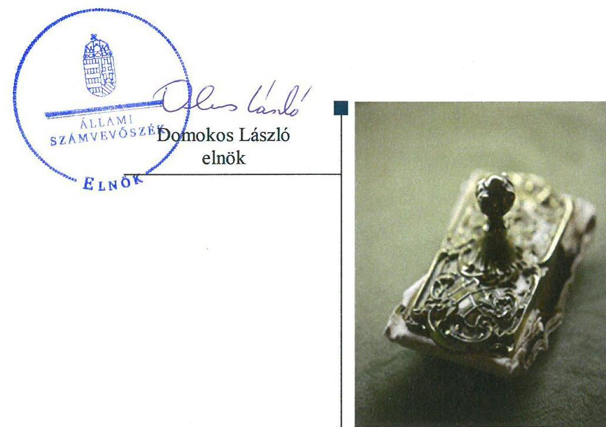
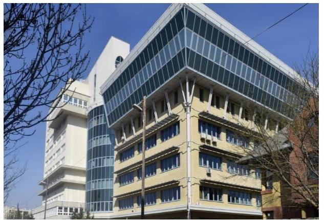
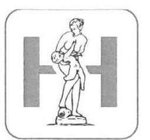
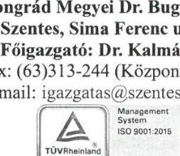
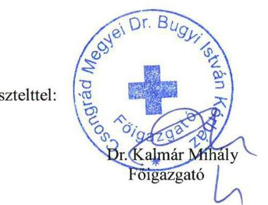
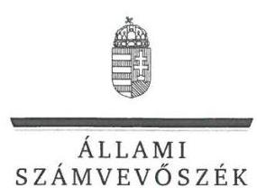
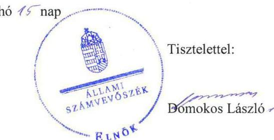
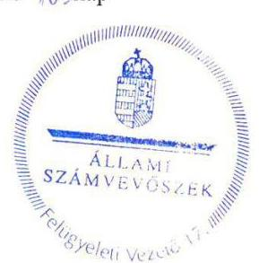

# Jelenetés 

## Központi költségvetési szervek ellenőrzése

Csongrád Megyei Dr. Bugyi István Kórház
2019.

---

# Jelenetés 

## Központi költségvetési szervek ellenőrzése

Csongrád Megyei Dr. Bugyi István Kórház
2019. 09. hó 10. nap

---

# AZ ELLENŐRZÉST FELÜGYELTE:

DR. BENEDEK MÁRIA felügyeleti vezető

## AZ ELLENŐRZÉST VEZETTE ÉS A VÉGREHAJTÁSÁÉRT FELELŐS:

VERTKOVCZI MÁRIA ellenőrzésvezető

DR. KOVÁCS DIÁNA ellenőrzésvezető

## A PROGRAM ÖSSZEÁLLÍTÁSÁÉRT FELELŐS:

TÓTPÁL SZABOLCS osztályvezető

IKTATÓSZÁM: EL-0710-144/2019

TÉMASZÁM: 2450

TÉMASZÁM: 2450

Jelentéseink az Országgyűlés számítógépes hálózatán és az Interneta a www.asz.hu címen is olvashatóak.

---

# TARTALOMJEGYZÉK 

■ ÖSSZEGZÉS ..... 5
■ AZ ELLENŐRZÉS CÉLJA ..... 7
■ AZ ELLENŐRZÉS TERÜLETE ..... 8
■ AZ ELLENŐRZÉS HÁTTERE, INDOKOLTSÁGA ..... 9
■ A JELENTÉS LÉNYEGES KÉRDÉSKÖREI ..... 10
■ AZ ELLENŐRZÉS HATÓKÖRE ÉS MÓDSZEREI ..... 11
■ MEGÁLLAPÍTÁSOK ..... 14
■ JAVASLATOK ..... 19
■ MELLÉKLETEK ..... 23
I. sz. melléklet: Értelmező szótár ..... 23
■ FÜGGELÉKEK ..... 27
I. sz. függelék a jelentéshez ..... 27
II. sz. függelék: Észrevételek ..... 29
■ RÖVIDÍTÉSEK JEGYZÉKE ..... 37

---

.

---

# ÖSSZEGZÉS 

A Csongrád Megyei Dr. Bugyi István Kórház belső kontrollrendszerének kialakítása és müködtetése, valamint a pénzügyi- és vagyongazdálkodása nem volt szabályszerű, ezáltal nem biztosította a közpénzekkel, nemzeti vagyonnal való átlátható, elszámoltatható és felelős gazdálkodást. Az integritás alapú müködés és a korrupció elleni védettség nem volt biztosított.

## Az ellenőrzés társadalmi indokoltsága

Az Állami Számvevőszék ellenőrzi a költségvetési szervek gazdálkodását, működését, hogy megállapításaival támogassa az ellenőrzött szervezetek szabályszerű gazdálkodását, javaslataival elősegítse az Alaptörvényben ${ }^{1}$ megfogalmazott alapvetések érvényesülését a mindennapi életben a szervezetek szintjén. A központi költségvetés rendszerében zajló folyamatok holisztikus elemzései, a kockázatok folyamatos figyelemmel kísérésének módszerével, az így kiválasztott szervezetek célzott, hatékony ellenőrzéseivel az Állami Számvevőszék betölti a legfőbb gazdasági ellenőrző szerv küldetését. Az ellenőrzések megállapításaival és egy adott időszak ellenőrzési eredményeinek elemzésével az Állami Számvevőszék ráirányíthatja a jogalkotók figyelmét a központi alrendszerben vagy annak egy ágazatában esetlegesen felmerülő pénzügyi, szabályozási feszültségekre. Az elvégzett ellenőrzések során az Állami Számvevőszék „jó gyakorlatokat" is azonosíthat, melyeket tanácsadó funkciója keretében szélesebb körben is megismertethet az érintettekkel, ezáltal is hozzájárulva a költségvetési rendszer szabályozott, átlátható, kiegyensúlyozott és fenntartható működéséhez.

## Főbb megállapítások, következtetések, javaslatok

A Csongrád Megyei Dr. Bugyi István Kórház belső kontrollrendszerének kialakítása és működtetése a 2015-2016. években nem volt szabályszerű, nem biztosította a közpénz felhasználás szabályszerűségét és a nemzeti vagyonnal történő felelős gazdálkodást. A Főigazgató a 2017. évben a belső kontrollrendszer részeként szabályszerűen kialakította a kontrollkörnyezetet, az integrált kockázatkezelési rendszert és az információs és kommunikációs folyamatokat. Az integrált kockázatkezelési rendszer működtetése nem volt szabályszerű. A monitoring rendszer működtetése, a kontrolltevékenységek gyakorlása nem volt szabályszerű, így a Kórház belső kontrollrendszere a 2017. évben sem biztosította a közpénzekkel és a nemzeti vagyonnal történő szabályszerű gazdálkodást, a beszámolási és adatszolgáltatási kötelezettségek szabályszerű teljesítését.

A Csongrád Megyei Dr. Bugyi István Kórház pénzügyi gazdálkodása nem volt szabályszerű. A bevételek beszedése és elszámolása, valamint a kiadási előirányzat felhasználása során a gazdálkodási jogkörgyakorlás nem volt szabályszerű, aminek következtében nem volt biztosított, hogy a közpénz felhasználására a közfeladat ellátása érdekében került sor. A Kórház a vagyonhasznosításból származó bevételek beszedésekor, valamint a kiadási előirányzatok felhasználása során nem tartotta be a jogszabályi előírásokat az átlátható szervezetekkel való szerződéskötésre vonatkozóan, ezzel a szabályszerű közpénzfelhasználást nem biztosította.

A Csongrád Megyei Dr. Bugyi István Kórház maradvány megállapítása nem volt szabályszerű, a kötelezettségvállalási és a gazdálkodási jogkörgyakorlásra jogosultak aláírás-mintáiról vezetett nyilvántartások tartalmi hiányosságai miatt.

A Csongrád Megyei Dr. Bugyi István Kórház vagyongazdálkodása nem volt szabályszerű, mivel a költségvetési beszámoló mérleg tételei leltárral nem voltak alátámasztottak, így a mérlegben szereplő eszközök és források értékének valódisága nem volt igazolt.

A Csongrád Megyei Dr. Bugyi István Kórház teljesítmény mérésére alkalmas követelményeket nem alakított ki, a szervezeti célok elérését szolgáló feladatokat nem határozott meg.

---

A Csongrád Megyei Dr. Bugyi István Kórház a 2017. évben a kötelezően elő nem írt, integritást támogató kontrollokat nem alakította ki, amelynek hiányában nem érvényesült a múködésében az integritás szemlélet.

Az Állami Számvevőszék az intézkedések megtétele céljából az irányítószerv vezetőjeként az ÁEEK főigazgatója részére egy, a Csongrád Megyei Dr. Bugyi István Kórház főigazgatója részére 17 javaslatot fogalmazott meg.

---

# AZ ELLENŐRZÉS CÉLJA 

AZ ELLENŐRZÉS CÉLJA annak megállapítása volt, hogy a Csongrád Megyei Dr. Bugyi István Kórház vonatkozó irányító szervi feladatellátás a jogszabályi előírások betartásával történt-e, a Csongrád Megyei Dr. Bugyi István Kórház belső kontrollrendszere biztosította-e az átlátható, szabályszerű, gazdaságos, hatékony és eredményes gazdálkodás feltételeit, szabályszerű volt-e a beszámolási és adatszolgáltatási kötelezettségek teljesítése, valamint az, hogy a Csongrád Megyei Dr. Bugyi István Kórház pénzügyi és vagyongazdálkodása megfelelt-e a jogszabályi előírásoknak és belső szabályzatainak, a költségvetési maradvány megállapítása szabályszerűen történt-e. Az ellenőrzés keretében értékelte az Állami Számvevőszék, hogy a Csongrád Megyei Dr. Bugyi István Kórháznál kiépítették és erősítették-e a korrupciós kockázatok kezelését szolgáló integritási kontrollokat, továbbá megteremtették-e a teljesítményellenőrzés feltételeit.

Az ellenőrzés célja volt továbbá annak értékelése, hogy az államháztartás központi alrendszerébe tartozó Kórház gazdálkodása elszámoltatható-e és megfelelt-e annak az Alaptörvényben meghatározott alapvetésnek, hogy Magyarország a kiegyensúlyozott, átlátható és fenntartható költségvetési gazdálkodás elvét érvényesíti. Érvényesült-e a nemzeti vagyon kezelésének és védelmének célja, azaz a Csongrád Megyei Dr. Bugyi István Kórház vagyona a közérdeket szolgálja, a közös szükségletek kielégítése és a természeti erőforrások megóvása, valamint a jövő nemzedékek szükségleteinek figyelembevétele mellett.

---

# **AZ ELLENŐRZÉS TERÜLETE**

## **Csongrád Megyei Dr. Bugyi István Kórház**

A szentesi székhelyű Csongrád Megyei Dr. Bugyi István Kórház 1979. április 1-jétől működik költségvetési szervként. Működési és ellátási területét, valamint alaptevékenységét az egészségügyi ágazati jogszabályok2 határozták meg. Alapfeladata a járó- és fekvőbetegek diagnosztikus és terápiás szakorvosi ellátása, rehabilitációja és követéses gondozása volt.

Az ellenőrzött időszakban a Csongrád Megyei Dr. Bugyi István Kórház irányító szerve az Emberi Erőforrások Minisztériuma volt, a középirányítói jogokat a Gyógyszerészeti és Egészségügyi Minőség- és Szervezetfejlesztési Intézet, majd 2015. március 1-jétől jogutódja, az Állami Egészségügyi Ellátó Központ gyakorolta. Az Állami Egészségügyi Ellátó Központ feladata az emberi erőforrások minisztere hatáskörébe nem tartozó fenntartói, valamint a 27/2015. (II.25.) Korm. rendeletben3 meghatározott irányítói jogok gyakorlása volt.

A Csongrád Megyei Dr. Bugyi István Kórház gazdasági szervezettel, valamint az előirányzatok felett teljes jogkörrel rendelkező központi költségvetési szerv.

A Csongrád Megyei Dr. Bugyi István Kórház az ellenőrzött időszakban több mint 3 200 millió Ft mérleg szerinti vagyonnal gazdálkodott, az összes bevétele minden évben meghaladta a 6 000 millió Ft-ot.

A Csongrád Megyei Dr. Bugyi István Kórházat a 2015-2017. években a Főigazgató4 vezette, a gazdálkodással kapcsolatos feladatokat a Gazdasági igazgató5 közvetlen irányítása alatt működő gazdasági osztályok látták el. A Főigazgató és a Gazdasági igazgató személyében az ellenőrzött időszakban nem történt változás.

A foglalkoztatottak átlagos statisztikai állományi létszáma a 2015. évi 728 főről 2017. évre 710 főre, 2,5%-kal csökkent.

A Csongrád Megyei Dr. Bugyi István Kórházban az ellenőrzött időszakban szervezeti, szerkezeti átalakítás nem történt.

---

# AZ ELLENŐRZÉS HÁTTERE, INDOKOLTSÁGA 

Az államháztartás központi alrendszerébe tartozó szervezet vagyona a nemzeti vagyon része, és az Alaptörvény is rögzíti, hogy a vagyonnal való gazdálkodás célja a közérdek szolgálata. Az ÁSZ ${ }^{\circledR}$ ellenőrzi az éves költségvetési törvény végrehajtását, az ellenőrzés során feltárt kockázatok és a terület folyamatos kockázatelemzésével beazonosított kockázatok kezelése érdekében ráépülő ellenőrzésekkel ellenőrzi a költségvetési szervek gazdálkodását, múködését, hogy az ellenőrzések megállapításaival támogassa az ellenőrzött szervezetek szabályszerű gazdálkodását, javaslataival elősegítse az Alaptörvényben megfogalmazott alapvetések érvényesülését a mindennapi életben a szervezetek szintjén.

A belső kontrollrendszer kialakítása és múködtetése nélkül nem valósítható meg a közpénzek, a közvagyon átlátható, szabályos, gazdaságos, hatékony és eredményes felhasználása. A belső kontrollrendszer azt a célt szolgálja, hogy a költségvetési szervek múködésük és gazdálkodásuk során a tevékenységeket szabályszerűen hajtsák végre, teljesítsék elszámolási kötelezettségeiket és megvédjék az erőforrásokat a veszteségektől, a károktól és a nem rendeltetésszerű használattól. A belső kontrollrendszer magában foglalja mindazon elveket, eljárásokat és belső szabályzatokat, melyek biztosítják, hogy a költségvetési szerv valamennyi tevékenysége és célja összhangban legyen a szabályszerűséggel, szabályozottsággal, valamint a gazdaságosság, hatékonyság és eredményesség követelményeivel, az eszközökkel és forrásokkal való gazdálkodásban ne kerüljön sor pazarlásra, visszaélésre, rendeltetésellenes felhasználásra. Megfelelő, pontos és naprakész információk álljanak rendelkezésre a költségvetési szerv múködésével kapcsolatosan, és a belső kontrollrendszer harmonizációjára, öszszehangolására vonatkozó jogszabályok végrehajtásra kerüljenek. Az integritás kontrollok kiépítése, erősítése a szervezet korrupciós kockázatainak kezelését szolgálja. A teljesítménykövetelmények meghatározása és múködtetése megalapozhatja a központi költségvetési szervnél a teljesítményellenőrzés lefolytatását.

---

# A JELENTÉS LÉNYEGES KÉRDÉSKÖREI 

1.     - Az irányító szerv Kórházra vonatkozó feladatellátása szabályszerű volt-e?
2.     - A Kórház belső kontrollrendszerének kialakítása és müködtetése szabályszerű volt-e, az biztosította-e a közpénzfelhasználás és az állami vagyonnal való gazdálkodás szabályosságát?
3.     - A Kórház pénzügyi gazdálkodása szabályszerű volt-e?
4.     - A költségvetési maradvány megállapítása szabályszerűen tör-tént-e?
5.     - A Kórház vagyongazdálkodása szabályszerű volt-e?
6.     - A Kórháznál alakítottak-e ki a teljesítmény mérésére alkalmas követelményeket?

---

# AZ ELLENŐRZÉS HATÓKÖRE ÉS MÓDSZEREI 

## Az ellenőrzés típusa

Megfelelőségi ellenőrzés.

## Az ellenőrzött időszak

2015. január 1. és 2018. június 30. közötti időszak.

## Az ellenőrzés tárgya

A Kórházra vonatkozó irányító szervi feladatok ellátása a 2015-2016. években. A Kórház belső kontrollrendszerének kialakítása és működtetése 2015-2017. években, valamint az integritás kontrollok kiépítettsége és a teljesítményellenőrzés feltételei a 2017. évben.

A Kórház pénzügyi és vagyongazdálkodása a 2015-2016. években.
A 2017. évre vonatkozóan a Kórház vagyongazdálkodási feltételeinek kialakítása, annak szabályszerűsége, az elszámoltathatóság biztosítása a szabályozás szintjén. A Kórháznál hozott vagyonváltozást eredményező döntések, a vagyonban bekövetkezett változások végrehajtásának, nyilvántartásba vételének, elszámolásának szabályszerűsége. Az állami vagyon kimutatásának szabályszerűsége, ennek keretében az állami vagyonnal történő rendelkezés, a vagyonmozgások, a vagyonnyilvántartásba vétele, értékelése és a mérleg alátámasztás szabályszerűsége. A költségvetési maradvány megállapításának szabályszerűsége 2017. év vonatkozásában.

## Az ellenőrzött szervezet

Csongrád Megyei Dr. Bugyi István Kórház, Emberi Erőforrások Minisztériuma mint irányító szerv, Állami Egészségügyi Ellátó Központ mint középirányító szerv.

## Az ellenőrzés jogalapja

Az ellenőrzés jogszabályi alapját az ÁSZ tv. ${ }^{7}$ 1. § (3) bekezdése, 5. § (2)-(3) bekezdései, (4) bekezdés a) pontja és (6) bekezdése, valamint az Áht. ${ }^{8} 61$. § (2) bekezdésében foglalt előírások adták.

---

# Az ellenőrzés módszerei 

Az ÁSZ az ellenőrzést az ellenőrzési program szempontjai, az ellenőrzött időszakban hatályos jogszabályok, az ellenőrzés szakmai szabályai, a jelen ellenőrzésre irányadó ÁSZ módszertanok figyelembevételével hajtotta végre.

Az ellenőrzési kérdések megválaszolásához szükséges bizonyítékok megszerzése az ellenőrzött által rendelkezésre bocsátott dokumentumokra, adatokra alapozva megfigyelés, szemle (szemrevételezés), kérdésfeltevés (információkérés), mintavételezés, valamint elemző eljárás útján történt. Az ellenőrzési bizonyítékként felhasználható adatforrások közé tartoztak az ellenőrzési program részletes szempontjainál felsorolt adatforrások, valamint minden egyéb - az ellenőrzés folyamán feltárt, az ellenőrzés szempontjából információt tartalmazó - dokumentum.

Az ellenőrzés lefolytatásához az ellenőrzött szervezet tanúsítványok kitöltésével, valamint az ÁSZ által kért dokumentumok megküldésével szolgáltatott adatokat, amelyek valódiságát és teljes körűségét az ellenőrzött szervezet vezetője által tett teljességi és hitelességi nyilatkozat igazolta. A rendelkezésre bocsátott adatok, információk kontrollja az ellenőrzés keretében történt.

A Kórház belső kontrollrendszere egyes pilléreinek kialakítására és működtetésére vonatkozó értékelés:
$\longrightarrow$ „szabályszerü", amennyiben az értékelt területen az elért „igen" válaszok százalékban kifejezett, egész számra kerekített aránya legalább $85 \%$,
$\longrightarrow$ „nem szabályszerű", ha nem éri el a $85 \%$-ot.
A Kórház belső kontrollrendszerének összesített értékelése az egyes részterületek esetében kapott megfelelőségi arányok számtani átlaga alapján történt és megegyezik a pillérenként (kontrollterületenként) alkalmazott százalékos értékelésekkel, a következő eltérésekkel: a kontrollrendszer egésze esetében a „szabályszerű" értékelésnek a százalékos értéken felül további feltétele, hogy egyik kontrollterület sem kaphat „nem szabályszerű" értékelést.

A kiadások és a bevételek ellenőrzésére a 2015-2017. év vonatkozásában került sor. A felhalmozási kiadások, dologi kiadások és az értékesítésből és bérbeadásból származó bevételek esetében az ellenőrzés azokra a legnagyobb értékű tételekre - a lényeges sokaságra - terjedt ki, melyek összértéke elérte a teljes sokaság összértékének 50\%-át.

A bevételek és a 2015-2016. évi felhalmozási kiadások esetében a lényeges sokaságot tételesen ellenőrizte az ÁSZ.

A bevételek, kiadások elszámolásának szabályszerűséget a lényeges sokaságból véletlen mintavételi eljárással kiválasztott tételek alapján ellenőrizte az ÁSZ.

A 2017. évi beruházások, felújítások végrehajtásának, a feladatellátást szolgáló állami vagyontárgyak felhasználásának és év végi értékelésének, valamint a pénzmozgáshoz nem kapcsolódó vagyonváltozásoknak a szabályszerűségét a teljes sokaságból véletlen mintavétellel kiválasztott tételek alapján ellenőrizte az ÁSZ.

---

A mintavétellel ellenőrzött területek esetében minden egyes tétel vonatkozásában a felhasználás, elszámolás és értékelés szabályszerűségére vonatkozó kérdéseket tettünk fel. Szabályszerű értékelést kapott az ellenőrzött területet, amennyiben 95\%-os bizonyossággal az ellenőrzött sokaságban az átlagos hibaarány legfeljebb 10\%, nem szabályszerű értékelést, amennyiben 10\%-nál magasabb arányt képviselt. Abban az esetben, ha az ellenőrzött sokaság tekintetében a 10\%-os hibaarányhoz való viszony megítélésnek megbízhatósága nem érte el a 95\%-ot, annak elérése érdekében az értékelés további szempontokkal került kiegészítésre, és figyelembe vételre került a feltárt hibák értéke.

Az ellenőrzés ideje alatt az ellenőrzött szervezettel történő kapcsolattartás az ÁSZ SZMSZ-ének vonatkozó előírásai alapján volt biztosított.

---

# 1. Az irányító szerv Kórházra vonatkozó feladatellátása szabályszerű volt-e? 

Összegző megállapítás

Az EMMI ${ }^{9}$ mint irányító szerv, az ÁEEK ${ }^{10}$ mint középirányító szerv feladatellátása a Kórház ${ }^{11}$ vonatkozásában szabályszerű volt.

AZ EMMI az elemi költségvetés bevételek és kiadások megállapításához a tervezési követelményeket az Ávr. ${ }^{12}$ alapján meghatározta. Az Áht. és Áhsz. ${ }^{13}$ előírásaival összhangban jóváhagyta a költségvetési beszámolókat, elemi költségvetéseket. Az Ávr. előírásainak eleget téve gondoskodott a költségvetési maradvány megállapításáról. Az EMMI a Kórházat ${ }^{14}$ beszámoltatta az éves gazdálkodásáról és az éves szakmai feladatellátásáról.

AZ ÁEEK a 27/2015. (II.25.) Korm. rendeletben előírtak szerint 2016ban jóváhagyta a Kórház szervezeti és müködési szabályzatát.

## 2. A Kórház belső kontrollrendszerének kialakítása és múködtetése szabályszerű volt-e, az biztosította-e a közpénzfelhasználás és az állami vagyonnal való gazdálkodás szabályosságát?

Összegző megállapítás

A Kórház belső kontrollrendszerének kialakítása és múködtetése nem volt szabályszerű, az nem biztosította a közpénzfelhasználás és az állami vagyonnal való gazdálkodás szabályosságát a 2015-2017. években.

A KONTROLLKÖRNYEZET kialakítása nem volt szabályszerű 2015-2016. években, szabályszerű volt 2017-ben.

A Főigazgató mint őrzésért felelős a Vnytv. ${ }^{15}$ 11. § (6) bekezdésében foglaltak ellenére a 2015-2016. években a vagyonnyilatkozat átadására, nyilvántartására, vagyonnyilatkozatban foglalt személyes adatok védelmére vonatkozó további szabályokat szabályzatban nem állapította meg.

A Kórház Ávr. előírásaival összhangban rendelkezett Alapító Okirattal ${ }^{16}$. A Kórház a 2017. évben az Ávr., az Áht., és a Bkr. ${ }^{17}$ előírásai alapján a kialakította a működési és szervezeti kereteit, a humánerőforrás-kezelés kontrollkörnyezetét és a szervezet minden szintjén az etikai elvárásokat. A Kórház rendelkezett 2017-ben Vagyonnyilatkozat-tételi szabályzattal ${ }^{18}$.

A Kórház a 2017. évben a Számv.tv. ${ }^{19}$, valamint az Áhsz. előírásai alapján rendelkezett a számviteli politikával, ezen belül Leltározási Szabályzattal ${ }^{20}$,

---

Értékelési Szabályzattal ${ }^{21}$, Pénz- és értékkezelési Szabályzattal ${ }^{22}$ és Önköltség számítási szabályzattal ${ }^{23}$, valamint az egységes számlakeret alapján elkészített Számlarenddel ${ }^{24}$ és az azt alátámasztó bizonylati renddel ${ }^{25}$.

A Kórház az ellenőrzött időszakban az Ltv. ${ }^{26}$ 10. § (1) bekezdés a) pontjában foglaltakat megsértve nem rendelkezett iratkezelési szabályzattal.

# AZ INTEGRÁLT KOCKÁZATKEZELÉSI RENDSZER 

működtetése a 2017. évben nem volt szabályszerű. A Főigazgató a 2017. évben a Bkr. 7. § (1) bekezdésében foglaltak ellenére nem működtette az integrált kockázatkezelési rendszert. A Főigazgató a Bkr. 7. § (4) bekezdésében foglaltak ellenére 2016. október 1-jétől az integrált kockázatkezelési rendszer koordinálására szervezeti felelőst nem jelölte ki. A Kórház a 2017. évben az Bkr.-ben előírtakkal összhangban a Kontrollrendszer szabályzatában ${ }^{27}$ szabályozta az integrált kockázatkezelési rendszert.

## A KONTROLLTEVÉKENYSÉGEK GYAKORLÁSÁ-

HOZ a Kórház az ellenőrzött időszakban az Ávr. 60. § (3) bekezdése előírása ellenére a gazdálkodási jogkörgyakorlásra jogosult személyekről és aláírás-mintájukról a belső szabályzatban foglaltak szerint nem vezetett naprakész nyilvántartást, mivel a nyilvántartás a kötelezettségvállalásra és teljesítésigazolásra jogosultak aláírás mintáit nem tartalmazta. A 2017. évben a kontrolltevékenységek gyakorlása nem volt szabályszerű. A kontrolltevékenységek 2015-2016. évi gyakorlásának minősítését a 3.1 pont tartalmazza.

AZ INFORMÁCIÓS ÉS KOMMUNIKÁCIÓS folyamatok kialakítása és működtetése a 2017. évben szabályszerű volt.

A Kórház a 2017. évben kialakította a Bkr.-ben előírt információs és kommunikációs rendszerét. Rendelkezett az Info tv. ${ }^{28}$ és az lkr. ${ }^{29}$ alapján adatvédelmi és adatbiztonsági szabályzattal ${ }^{30}$.

A MONITORING RENDSZER működtetése a 2017. évben nem volt szabályszerű. A Főigazgató a Bkr. 3. § e) pontjában foglaltak ellenére nem működtette a nyomon követési (monitoring) rendszert.

A Főigazgató a Bkr. 11. § (2) bekezdésben foglaltak ellenére a Kórház belső kontrollrendszerének minőségéről szóló, 2017. évre vonatkozó, Bkr. 1. melléklet szerinti nyilatkozatát nem küldte meg az EMMI részére.

A Főigazgató a 2015-2017. években a Bkr. 1. mellékletében foglalt előírás alapján nyilatkozatban értékelte a Kórház belső kontrollrendszerének minőségét. A Főigazgató a nyilatkozatában azt rögzítette, hogy az ellenőrzött években a Kórház belső kontrollrendszerét kiépítette és működtette. Az ÁSZ ellenőrzés megállapításai nem igazolták a nyilatkozatban foglaltakat.

Az integritást erősítő kontrollokat alacsony szinten működtette a Kórház, az integritás szemlélet nem érvényesült.

---

# 3. A Kórház pénzügyi gazdálkodása szabályszerű volt-e? 

## Összegző megállapítás

### 3.1. számú megállapítás

## A Kórház pénzügyi gazdálkodása nem volt szabályszerű.

A bevételek beszedése, a kiadási előirányzatok felhasználása során nem tartották be a jogszabályi előírásokat.

A bevételek beszedése és elszámolása nem volt szabályszerű a 2015-2016. években.
—_ A Kórháznál a bevételek beszedése során az Ávr. 57. § (2) bekezdésében és a Gazdálkodási szabályzat ${ }^{31}$ előírásai ellenére egy esetben sem került sor teljesítésigazolásra.
—_ A Kórház a bevételek beszedése során nem rendelkezett az Nvtv. ${ }^{32}$ 11. § (10) bekezdésében, illetve a 3. § (2) bekezdésében foglaltak ellenére a szerződő fél nyilatkozatával arról, hogy az átlátható szervezetnek minősül.
A kiadási előirányzatok felhasználása 2015. évben szabályszerű volt a számviteli elszámolás tekintetében, 2016. évben nem volt szabályszerű. A kiadási előirányzatokhoz kapcsolódó gazdálkodási jogkörök gyakorlása nem volt szabályszerű 2015-2016. években:
—_ A Kórház megsértette az Áht. 37. § (1) bekezdésében és az Ávr. 52. § (1) bekezdés a) pontban foglaltakat, mert az arra jogosulttól származó írásbeli felhatalmazás hiányában nem történt kötelezettségvállalás és megsértette az Ávr. 57. § (1) és (4) bekezdésében foglaltakat, mert nem került sor az arra jogosulttól származó írásbeli felhatalmazás hiányában teljesítésigazolásra.
—_ A Főigazgató az Ávr. 56. § (1) bekezdésében foglalt előírások ellenére a 2015-2016. években nem gondoskodott a Főigazgató általi kötelezettségvállalást követően annak az államháztartási számviteli kormányrendelet szerinti nyilvántartásba vételéről.
—_ Az Ávr. 50. § (1a) bekezdés előírásait megsértve a kiadási előirányzatok terhére jogi személlyel, jogi személyiséggel nem rendelkező szervezettel kötött visszterhes szerződések (megrendelések) nem tartalmazták a szervezet képviselőjének nyilatkozatát arra vonatkozóan, hogy átlátható szervezetnek minősül.
3.2. számú megállapítás

A 2015-2016. évi előirányzat-maradvány megállapítása az azt alátámasztó nyilvántartás hiányosságai miatt nem volt szabályszerű.

A Kórház kötelezettségvállalással terhelt maradvány kimutatása alátámasztásához vezetett részletező nyilvántartása a 2015-2016. években nem felelt meg az Áhsz. 39. § (3) bekezdésében foglaltak ellenére az Áhsz 14. melléklet II. 4. a)-g) pontokban meghatározott minimum tartalomnak, ezért nem volt alátámasztott a Kórház kötelezettségekkel terhelt tárgyévi maradvány kimutatása.

---

# 4. A költségvetési maradvány megállapítása szabályszerűen tör-tént-e? 

## Összegző megállapítás

A Kórház költségvetési maradvány megállapítása nem volt szabályszerű a 2017. évben.

A 2017. évi előirányzat-maradvány megállapítás szabályszerűsége nem volt biztosított, mivel a kötelezettségvállalásra, teljesítés igazolására jogosult személyekről és aláírás-mintájukról a Kórház nem vezetett naprakész nyilvántartást az Ávr. 60. § (3) bekezdésében foglaltak ellenére.

## 5. A Kórháznál alakítottak-e ki a teljesítmény mérésére alkalmas követelményeket?

Összegző megállapítás
5.1. számú megállapítás
5.2. számú megállapítás

A Kórház vagyongazdálkodása nem volt szabályszerű.
A vagyongazdálkodás feltételeinek kialakítása szabályszerű volt.
A VAGYONKEZELÉSI SZERZŐDÉSSEL ${ }^{33}$ a vagyonkezelt eszközök tekintetében az Nvtv. és Vtvr ${ }^{34}$. előírásaival összhangban a Kórház rendelkezett. A Kórház vagyongazdálkodásra vonatkozó szabályozása a 2017. évben szabályszerű volt.

Az állami vagyon kimutatását nem szabályszerűen végezték, ezért annak átlátható, valóságnak megfelelő nyilvántartása nem volt biztosított.

A Főigazgató a 2015-2017. években az Áhsz. 53. § (8) bekezdés b) pontjában előírtak ellenére az éves könyvviteli zárlat keretében nem végezte el a befektetett eszközök és a készletek mennyiségi felvétellel történt leltározásának kiértékelése során a leltári különbözetek elszámolását, eltérések okainak kivizsgálását. A 2015-2017. években a Kórház a Számv. tv. 69. § (1) és az Áhsz. 22. § (1) bekezdésében előírtak ellenére az éves költségvetési beszámoló elkészítéséhez, a mérleg tételeinek alátámasztásához nem állított össze olyan leltárt, amely tételesen, ellenőrizhető módon tartalmazza a mérleg fordulónapján meglévő eszközeit és forrásait mennyiségben és értékben. A Kórház 2015-2017. évi mérlege és beszámolója nem volt megalapozott.

## 5.3. számú megállapítás

A vagyonkezelésbe vétel és a beruházások, felújítások végrehajtása nem volt szabályszerű.

AZ ÁLLAMI VAGYON létrejöttét eredményező beszerzésről a Kórház a tulajdonosi jogkörgyakorló felé teljesítendő adatszolgáltatás során tájékoztatási kötelezettségének nem tett eleget, megsértve a Vtvr. 2. § (3) bekezdésének előírásait.

A Kórház nem gondoskodott a vagyonkezelői jog ingatlan-nyilvántartásba történő bejegyzéséről, a Vtvr. 7. § (1)-(2) bekezdésében foglaltak ellenére.

---

A Kórház a Számv. tv. 165. § (1)-(2) bekezdésében foglaltak ellenére a számviteli, könyvviteli nyilvántartásába szabályosan kiállított bizonylat alapján nem jegyzett be adatokat. Az Áhsz. 47. § (1)-(2) bekezdésében előírtak ellenére az ingyenesen használatba vett eszközök számviteli nyilvántartásba vételéről nem gondoskodott.

# 6. A Kórháznál alakítottak-e ki a teljesítmény mérésére alkalmas követelményeket? 

## Összegző megállapítás

A Kórháznál a 2017. évben nem alakították ki teljesítmény mérésére szolgáló követelményeket.

A szervezeti célok elérését szolgáló feladatok, folyamatokat szolgáló indikátorokat, mérőszámokat, feladat- és teljesítménymutatókat a Kórház nem képzett, így nem biztosította a teljesítménymérés lehetőségét.

---

# JAVASLATOK 

Az ÁSZ tv. 33. § (1) bekezdésében foglaltak értelmében az ellenőrzött szervezet vezetője köteles a jelentésben foglalt megállapításokhoz kapcsolódó intézkedési tervet összeállítani és azt a jelentés kézhezvételétől számított 30 napon belül az ÁSZ részére megküldeni. Amennyiben az ellenőrzött szervezet vezetője nem küldi meg határidőben az intézkedési tervet, vagy továbbra sem elfogadható intézkedési tervet küld, az Állami Számvevőszék elnöke az ÁSZ tv. 33. § (3) bekezdése a) és b) pontjaiban foglaltakat érvényesítheti.

## az ÁEEK föigazgatójának

1. Tegyen intézkedéseket a feltárt hiányosságok és/vagy szabálytalanságok tekintetében a felelősség tisztázása érdekében, és szükség szerint intézkedjen a felelősség érvényesitéséről.
(2. számú megállapítás 5. bekezdése, 6. bekezdés 2-3. mondata, 7. bekezdés 1. mondata, 10-11. bekezdése alapján; 3.1. számú megállapítás 1. bekezdés 1-2. franciabekezdése, 2. bekezdés 1-3 franciabekezdései; 3.2. számú megállapítása; 4. számú megállapítás 1. bekezdés; 5.2. számú megállapítás 1-2. mondatai, 5.3. számú megállapítás 1-3. bekezdései alapján)

## a Kórház föigazgatójának

1. Intézkedjen az Ltv. előírásának megfelelően az egyedi iratkezelési szabályzat illetékes közlevéltárral egyetértésben történő kiadásáról.
(2. számú megállapítás 5. bekezdése alapján)
2. Müködtessen a Bkr. előírásának megfelelően integrált kockázatkezelési rendszert.
(2. számú megállapítás 6. bekezdés 2. mondata alapján)
3. Intézkedjen a Bkr. előírásának megfelelően az integrált kockázatkezelési rendszer koordinálására szervezeti felelős kijelöléséről.
(2. számú megállapítás 6. bekezdés 3. mondata alapján)
4. Intézkedjen az Ávr. előírásának és a belső szabályzatban foglaltaknak megfelelően a gazdálkodási jogkörgyakorlásra jogosult személyekről és aláírás mintájukról a naprakész nyilvántartás vezetéséről.
(2. számú megállapítás 7. bekezdés 1. mondata és 4. számú megállapítás 1. bekezdés alapján)

---

5. Intézkedjen a Bkr. előírása alapján megfelelő nyomon követési rendszer (monitoring) müködtetéséről.
(2. számú megállapítás 10. bekezdés alapján)
6. Intézkedjen a Bkr. előírásának megfelelően a Kórház belső kontrollrendszerének minőségét értékelő nyilatkozat irányító szerv részére történő megküldéséről az éves költségvetési beszámolóval együtt.
(2. számú megállapítás 11. bekezdése alapján)
7. Intézkedjen a bevételek beszedése során a teljesítésigazolás Ávr.-ben és a Gazdálkodási szabályzatban foglalt előírásoknak megfelelő gyakorlásáról.
(3.1. számú megállapítás 1. bekezdés 1. franciabekezdése alapján)
8. Intézkedjen az Nvtv. előírásának megfelelően a nemzeti vagyon hasznosítására vonatkozó szerződés esetében - bevételek beszedése - a szerződő fél arról szóló nyilatkozata meglétéről, hogy átlátható szervezetnek minősül.
(3.1. megállapítás 1. bekezdés 2. francia bekezdése alapján)
9. Intézkedjen arról, hogy a kötelezettségvállalásra az Áht. és az Ávr. előírásának megfelelően kerüljön sor, továbbá teljesítésigazolást a kötelezettségvállaló, vagy az általa írásban kijelölt személy végezzen.
(3.1. számú megállapítás 2. bekezdés 1. franciabekezdése alapján)
10. Intézkedjen az Ávr. előírásának megfelelően a kötelezettségvállalást követően annak haladéktalan nyilvántartásba vételéről az államháztartási számviteli kormányrendelet szerint.
(3.1. számú megállapítás 2. bekezdés 2. franciabekezdése alapján)
11. Intézkedjen az Ávr. előírásának megfelelően arról, hogy a kiadási előirányzatok terhére jogi személlyel, jogi személyességgel nem rendelkező szervezettel kötött visszterhes szerződések tartalmazzák a szervezet képviselőjének nyilatkozatát arra vonatkozóan, hogy átlátható szervezetnek minösül.
(3.1. számú megállapítás 2. bekezdés 3. franciabekezdése alapján)
12. Intézkedjen a kötelezettségvállalással terhelt maradvány kimutatás alátámasztásához az Áhsz. 14. melléklet II/4. pontjában elöirt kötelező minimum tartalmú részletező nyilvántartás vezetéséről.
(3.2 számú megállapítása alapján)

---

13. Intézkedjen az Áhsz. előírásának megfelelően az éves könyvviteli zárlat keretében - a befektetett eszközök és a készletek vonatkozásában - a leltári különbözetek elszámolása, az eltérések okainak kivizsgálása elvégzéséről.
(5.2. számú megállapítás 1. mondata alapján)
14. Intézkedjen a Számv tv. és az Áhsz. előírásának megfelelően a beszámoló elkészitéséhez, a mérleg tételeinek alátámasztásához olyan leltár összeállításáról, amely tételesen, ellenőrizhető módon tartalmazza a Kórház mérleg fordulónapján meglévő eszközeit és forrásait mennyiségben és értékben.
(5.2. számú megállapítás 2. mondata alapján)
15. Intézkedjen a Vtvr. előírásának megfelelően
a) az állami vagyon létrejöttét eredményező beszerzésről a tulajdonosi joggyakorló felé az adatszolgáltatás során történő tájékoztatási kötelezettség teljesitéséről,
b) a vagyonkezelői jog ingatlan-nyilvántartásba történő bejegyzéséről.
(5.3. számú megállapítás 1-2. bekezdései alapján)
16. Intézkedjen a Számv. tv. előírásának megfelelően arról, hogy a számviteli (könyvviteli) nyilvántartásokba szabályszerűen kiállított bizonylat alapján jegyezzenek be adatokat.
(5.3. sz. megállapítás 3. bekezdés első mondata alapján)
17. Intézkedjen az Áhsz. tv. előírásának megfelelően az ingyenesen használatba vett eszközök számviteli nyilvántartásba vételéről.
(5.3. sz. megállapítás 3. bekezdés második mondata alapján)

---

.

---

# MELLÉKLETEK 

- I. SZ. MELLÉKLET: ÉRTELMEZŐ SZÓTÁR
állami vagyon
állami vagyonnak minősül:
a) az állam tulajdonában lévő dolog, valamint a dolog módjára hasznosítható természeti erő,
b) az a) pont hatálya alá nem tartozó mindazon vagyon, amely vonatkozásában törvény az állam kizárólagos tulajdonjogát nevesíti,
c) az állam tulajdonában lévő tagsági jogviszonyt megtestesítő értékpapír, illetve az államot megillető egyéb társasági részesedés,
d) az államot megillető olyan immateriális, vagyoni értékkel rendelkező jogosultság, amelyet jogszabály vagyoni értékű jogként nevesít. (Forrás: Vtv. 1. § (2) bekezdése)
állami vagyon értékesítése
állami vagyon használója
állami vagyon hasznosítása
állami vagyon hasznosítása kötött szerződés
állami vagyon kezelője /vagyonkezelő

ÁSZ Integritás Projekt

Állami vagyonnak minősül:
a) az állam tulajdonában lévő dolog, valamint a dolog módjára hasznosítható természeti erő,
b) az a) pont hatálya alá nem tartozó mindazon vagyon, amely vonatkozásában törvény az állam kizárólagos tulajdonjogát nevesíti,
c) az állam tulajdonában lévő tagsági jogviszonyt megtestesítő értékpapír, illetve az államot megillető egyéb társasági részesedés,
d) az államot megillető olyan immateriális, vagyoni értékkel rendelkező jogosultság, amelyet jogszabály vagyoni értékű jogként nevesít. (Forrás: Vtv. 1. § (2) bekezdése)
Állami vagyon tulajdonjogának bármely jogcímen történő, visszterhes átruházása. (Forrás: Vtvr. 1. § (7) bekezdés d) pontja)
Az a természetes vagy jogi személy, jogi személyiséggel nem rendelkező szervezet, aki, vagy amely törvény vagy szerződés alapján, bármely jogcímen (bérlet, haszonbérlet, használat stb.) állami vagyont birtokol, használ, szedi annak használt, hasznosít, ide nem értve a haszonélvezőt, a vagyonkezelőt és a tulajdonosi jogok gyakorlóját". (Forrás: Vtvr. 1. § (7) bekezdés a) pontja)
Az állami vagyont az MNV Zrt. maga kezeli, vagy szerződés - így különösen bérlet, haszonbérlet, megbízás - alapján központi költségvetési szervnek, természetes vagy jogi személynek, vagy jogi személyiséggel nem rendelkező gazdálkodó szervezetnek hasznosításra átengedi.
(Forrás: Vtv. 23. § (1) bekezdése, hatályos 2012. január 1-jétől)
Az állami vagyonnal a tulajdonosi joggyakorló maga gazdálkodik, vagy szerződés - így különösen bérlet, haszonbérlet, megbízás - alapján hasznosításra átengedi, illetőleg vagyonkezelésbe, haszonélvezetbe adja. (Forrás: Vtv. 23. § (1) bekezdése, hatályos 2013. június 28 -ától)
Az állami vagyon hasznosítására kötött szerződések elsődleges célja az állami vagyon hatékony működtetése, állagának védelme, értékének megőrzése, illetve gyarapítása, az állami és közfeladatok ellátásának elősegítése. (Forrás: Vtv. 23. § (2) bekezdése)
Az állami vagyont az MNV Zrt. maga kezeli, vagy szerződés - így különösen bérlet, haszonbérlet, megbízás - alapján központi költségvetési szervnek, természetes vagy jogi személynek, vagy jogi személyiséggel nem rendelkező gazdálkodó szervezetnek hasznosításra átengedi." Az állami vagyonra vonatkozóan az MNV Zrt. kizárólag az Nvtv-ben meghatározott személyekkel köthet vagyonkezelési szerződést. (Forrás: Vtv. 27. § (1) bekezdése, hatályos 2012. január 1-jétől)
Az Állami Számvevőszék 2009-ben indította el a „Korrupciós kockázatok feltérképezése - Integritás alapú közigazgatási kultúra terjesztése" című, európai uniós forrásból megvalósított kiemelt projektjét (Integritás Projekt). Az Integritás Projekt célja, hogy felmérje a közszféra intézményei korrupciós kockázatoknak való kitettségét, illetőleg az azok mérséklésére hivatott kontrollok szintjét. Az Állami Számvevőszék a projekt révén az integritás szemlélet minél szélesebb körrel történő megismertetését, gyakorlatba ültetését kívánja elérni. Az integritás követelményeinek megfelelő szervezeti múködést előnyben részesítő közigazgatási kultúra elterjesztését és a korrupció elleni fellépést az ÁSZ önmagára nézve is stratégiai jelentőségű célként fogalmazta meg. A projekt a felmérésben résztvevő intézmények számára helyzetükről

---

|  | egyfajta „tükörképet" mutat be, ami alapot teremt a jövőbeni pozitív irányú elmozduláshoz. (Forrás: a http://integritas.asz.hu honlapon közzétett, a 2013. évi Integritás felmérés eredményeiről készült összefoglaló tanulmány) |
| :--: | :--: |
| belső ellenőrzés | Független, tárgyilagos bizonyosságot adó és tanácsadó tevékenység, amelynek célja, hogy az ellenőrzött szervezet múködését fejlessze és eredményességét növelje, az ellenőrzött szervezet céljai elérése érdekében rendszerszemléletű megközelítéssel és módszeresen értékeli, illetve fejleszti az ellenőrzött szervezet irányítási és belső kontrollrendszerének hatékonyságát. (Forrás: Bkr. 2. § b) pontja) |
| belső kontrollrendszer | A belső kontrollrendszer a kockázatok kezelése és tárgyilagos bizonyosság megszerzése érdekében kialakított folyamatrendszer, amely azt a célt szolgálja, hogy a múködés és gazdálkodás során a tevékenységeket szabályszerűen, gazdaságosan, hatékonyan, eredményesen hajtsák végre, az elszámolási kötelezettségeket teljesítsék, megvédjék az erőforrásokat a veszteségektől, károktól és nem rendeltetésszerű használattól. (Forrás: Áht. 69. § (1) bekezdése) |
| belső kontrollrendszer területei | A kontrollkörnyezet, a kockázatkezelési rendszer, a kontrolltevékenységek, az információs és kommunikációs rendszer, valamint a nyomon követési (monitoring) rendszer. (Forrás: Bkr. 3. §-a) |
| felújítás | Az elhasználódott tárgyi eszköz eredeti állaga (kapacitása, pontossága) helyreállítását szolgáló időszakonként visszatérő olyan tevékenység, melynek során az eszköz élettartama megnövekszik, minősége, használata jelentősen javul, így a pótlólagos ráfordításból a jövőben gazdasági előnyök származnak. (Forrás: Számv. tv. 3. § (4) bekezdés 8. pontja) |
| hasznosítás | A nemzeti vagyon birtoklásának, használatának, hasznok szedése jogának bármely a tulajdonjog átruházását nem eredményező - jogcímen történő átengedése, ide nem értve a vagyonkezelésbe adást, valamint a haszonélvezeti jog alapítását. (Forrás: Nvtv. 3. § (1) bekezdés 4. pontja) |
| információs és kommunikációs rendszer | A költségvetési szerv vezetője által kialakított és múködtetett olyan rendszer, mely biztosítja, hogy a megfelelő információk a megfelelő időben eljutnak az illetékes szervezethez, szervezeti egységhez, illetve személyhez. (Forrás: Bkr. 9. § (1) bekezdés) |
| integritás | Az integritás - egyik gyakran használt jelentése szerint - az elvek, értékek, cselekvések, módszerek, intézkedések konzisztenciáját jelenti, vagyis olyan magatartásmódot, amely meghatározott értékeknek megfelel. Integritás-irányítási rendszer bevezetése a szervezetben a szervezethez rendelt közfeladatok integritás szempontú ellátását, az érték alapú múködéssel (integritással) összefüggő szervezeti követelmények következetes érvényesítését jelenti. (Forrás: Nemzetgazdasági Minisztérium: Államháztartási Belső Kontroll Standardok és Gyakorlati Útmutató 1.6. Etikai értékek és integritás 46. oldal, 2017. szeptember) |
| irányító szerv | A költségvetési szerv tekintetében az Áht-ban meghatározott irányítási hatáskört gyakorló szerv. (Forrás: Áht. 1. § 9. pontja) |
| kincstári költségvetés | A központi költségvetésről szóló törvény elfogadását követően a fejezetet irányító szerv az államháztartás központi alrendszerébe tartozó költségvetési szerv és a fejezeti kezelésű előirányzat kiemelt előirányzatait, valamint az elkülönített állami pénzalapok és a társadalombiztosítás pénzügyi alapjai jogszabályi előírás szerinti bevételeit és kiadásait kincstári költségvetés kiadásával állapítja meg. (Forrás: Áht. 28. § (2) bekezdés) |
| kockázat | A kockázat annak a valószínűségét jelenti, hogy egy vagy több esemény vagy intézkedés nem kívánt módon befolyásolja a rendszer múködését, céljainak megvalósulását. (Forrás: Javaslatok a korrupciós kockázatok kezelésére - Kockázatkezelési és ellenőrzési módszertan 35. oldal, ÁSZ) |
| kockázatkezelési rendszer | Olyan irányítási eszközök és módszerek összessége, melynek elemei a szervezeti cé- |

---

integrált kockázatkezelési rendszer
kontrollkörnyezet
kontrolltevékenységek
kommunikáció
középirányító szerv
közfeladat
monitoring
monitoring-rendszer
tulajdonosi joggyakorló
vagyongazdálkodás
lok elérését veszélyeztető tényezők (kockázatok) azonosítása, elemzése, csoportosítása, nyomon követése, valamint szükség esetén a kockázati kitettség mérséklése.(Forrás: Bkr. 2. § m) pontja)
Olyan folyamatalapú kockázatkezelési rendszer, amely a szervezet minden tevékenységére kiterjed, egységes módszertan és eljárások alkalmazásával, a szervezet célkitűzéseinek és értékeinek figyelembevételével biztosítja a szervezet kockázatainak teljes körű azonosítását, azok meghatározott kritériumok szerinti értékelését, valamint a kockázatok kezelésére vonatkozó intézkedési terv elkészítését és az abban foglaltak nyomon követését. (Forrás: Bkr. 2. § m) pontja, 2016. október 1-jétől)
A költségvetési szerv vezetője által kialakított olyan elvek, eljárások, belső szabályzatok összessége, amelyben világos a szervezeti struktúra, a folyamatok átláthatók, egyértelműek a felelősségi, hatásköri viszonyok és feladatok, meghatározottak, ismertek és elfogadottak az etikai elvárások a szervezet minden szintjén, átlátható a humán-erőforrás-kezelés. (Forrás: Bkr. 6. § (1) bekezdés)
A költségvetési szerv vezetője által a szervezeten belül kialakított (kontroll) tevékenységek, melyek biztosítják a kockázatok kezelését, hozzájárulnak a szervezet céljainak eléréséhez és erősítik a szervezet integritását. (Forrás: Bkr. 8. § (1) bekezdés)
Az a tevékenység, melynek során információ továbbítása valósul meg. A kommunikációs folyamat résztvevői között tájékoztatás történik, mely során tényeket, ezek magyarázatát közlik.
A költségvetési szerv tekintetében törvény vagy kormányrendelet alapján meghatározott, átruházott irányítási hatásköröket gyakorló szerv. (Forrás: Áht. 9. § (4) bekezdés)
Jogszabályban meghatározott állami vagy önkormányzati feladat, amit az arra kötelezett közérdekből, a jogszabályban meghatározott követelményeknek és feltételeknek megfelelve végez, ideértve a lakosság közszolgáltatásokkal való ellátását, továbbá az állam nemzetközi szerződésekben vállalt kötelezettségeiből adódó közérdekű feladatokat, valamint e feladatok ellátásakor szükséges infrastruktúra biztosítását is. (Forrás: Nvtv. 3. § (1) bekezdés 7. pontja)
A monitoring általánosságban a különböző szintű szervezeti célok megvalósításának folyamatát kíséri figyelemmel, melynek során a releváns eseményekről és tevékenységekről (együtt: folyamatokról) rendszeres jelleggel, strukturált, döntéstámogató információkhoz jutnak a szervezet vezetői. (Forrás: NGM Útmutató a költségvetési szervek monitoring rendszeréhez 2011. november)
A költségvetési szerv vezetője köteles kialakítani a szervezet tevékenységének a célok megvalósításának nyomon követését biztosító rendszert, amely az operatív tevékenységek keretében megvalósuló folyamatos és eseti nyomon követésből, valamint az operatív tevékenységektől függetlenül múködő belső ellenőrzésből áll. (Forrás: Bkr. 10. §)
Aki a nemzeti vagyon felett az államot vagy a helyi önkormányzatot megillető tulajdonosi jogok és kötelezettségek összességének gyakorlására jogosult. (Forrás: Nvtv. 3. § (1) bekezdés 17. pontja)

A nemzeti vagyongazdálkodás feladata a nemzeti vagyon rendeltetésének megfelelő, az állam, az önkormányzat mindenkori teherbíró képességéhez igazodó, elsődlegesen a közfeladatok ellátásához és a mindenkori társadalmi szükségletek kielégítéséhez szükséges, egységes elveken alapuló, átlátható, hatékony és költségtakarékos müködtetése, értékének megőrzése, állagának védelme, értéknövelő használata, hasznosítása, gyarapítása, továbbá az állam vagy a helyi önkormányzat feladatának ellátása szempontjából feleslegessé váló vagyontárgyak elidegenítése. (Forrás: Nvtv. 7. § (2) bekezdése)

---

.

---

# FÜGGELÉKEK

## I. SZ. FÜGGELÉK A JELENTÉSHEZ

Az Állami Számvevőszék az ellenőrzések során feltárt tényekhez kapcsolódó további körülmények tisztázására eszközrendszerrel nem rendelkezik. Amennyiben az ellenőrzésen túlmutatóan indokoltnak látszik az ellenőrzés során feltárt körülmények további vizsgálata, az Állami Számvevőszék törvényi felhatalmazás alapján az ellenőrzés által feltárt körülményeket továbbítja a hatáskörrel rendelkező szervnek a szükséges intézkedések megtétele, eljárások lefolytatása érdekében.

## 1.

A 2015-2017. évi éves beszámoló mérleg tételeit a Kórház nem támasztotta alá olyan leltárral, amely tételesen, ellenőrizhető módon tartalmazza a mérleg fordulónapján meglévő eszközöket és forrásokat mennyiségben és értékben és ezzel megsértette a Számv. tv. 69. § (1) bekezdésében foglalt előírásokat.

A Kórház mérlegének záró adatai 2015-2017. években (ezer Ft-ban)

|  Megnevezés | 2015. | 2016. | 2017.  |
| --- | --- | --- | --- |
|  Leltárral alátámasztott eszközök: | 2513358 | 2266808 | 2413052  |
|  Befektetett eszközök | 2417078 | 2160469 | 2317507  |
|  Készletek | 96280 | 106339 | 95545  |
|  Leltárral alá nem támasztott eszközök: | 751178 | 1008954 | 1209370  |
|  Pénzeszközök | 155914 | 299449 | 425585  |
|  Követelések | 592776 | 707628 | 770991  |
|  Egyéb sajátos eszközoldali elszámolások. | 0 | 1817 | 4301  |
|  Aktív időbeli elhatárolások | 2488 | 60 | 8493  |
|  Eszközök összesen | 3264536 | 3275762 | 3622422  |
|  Leltárral alá nem támasztott források: | 3264536 | 3275762 | 3622422  |
|  Saját tőke | 938887 | 2089410 | 1878646  |
|  Kötelezettségek | 1392757 | 232338 | 776878  |
|  Passzív időbeli elhatárolások | 932892 | 954014 | 966898  |
|  Források összesen | 3264536 | 3275762 | 3622422  |

Ezzel a Kórház nem igazolta, hogy a beszámolóban szereplő tételek a valóságban is megtalálhatóak.

## 2.

A Kórháznál a 2015-2017. években az éves könyvviteli zárlat keretében a befektetett eszközök és a készletek menynyiségi felvétellel történt leltározásának kiértékelése során nem végezték el a feltárt leltári különbözetek elszámolását, az eltérések okainak kivizsgálását, ezzel megsértették az Áhsz. 53. § (8) bekezdés b) pontjában előírtakat. A 2017. évben a hiányzó eszközök nyilvántartási értéke meghaladta az 5 millió Ft-ot, a 2015-2016. években a hiányzó eszközök nyilvántartási értéke nem került kimutatásra.

A különbözetek kivizsgálásának hiányában nem igazolt a leltárhiány valódisága és szabályszerű elszámolása, amelynek következtében a Kórházat vagyoni hátrány érhette.

## 3.

A Kórháznál a kötelezettségvállalásra és teljesítésigazolásra jogosult személyekről és aláírás mintájukról a belső szabályzatban foglaltak szerint nem vezettek naprakész nyilvántartást, mivel a nyilvántartás a kötelezettségvállalásra és teljesítésigazolásra jogosultak aláírás mintáit nem tartalmazta. A Főigazgató a Gazdálkodási szabályzat 4. fejezete

---

alapján teljesítés igazolás végzésére keretgazdákat jelölt ki, azonban a keretgazdák aláírás mintáiról nem vezettek nyilvántartást. Ezzel megsértették az Ávr. 60. § (3) bekezdésében foglalt előírást.

Az aláírás minták hiánya miatt az előirányzat-maradvány megállapítást alátámasztó kötelezettségvállalás nyilvántartás nem volt szabályos, emiatt az előirányzat szabályszerű felhasználása nem volt igazolt. A teljesítés igazolások hiányában nem volt igazolt, hogy a kifizetéshez valós teljesítés kapcsolódott, ezért felmerül, hogy a Kórházat vagyoni hátrány érte.

Az 1., 2. és 3. pontban felsorolt esetek konkrét körülményeinek feltárására az ügyészség rendelkezik hatáskörrel.

---

A jelentéstervezetet a Számvevőszék 15 napos észrevételezésre megküldte az ellenőrzött szervezetek vezetőinek az ÁSZ tv. 29. §* (1) bekezdése előírásának megfelelően.

A Csongrád Megyei dr. Bugyi István Kórház föigazgatója a jelentéstervezet megállapításaira írásban észrevételt tett.

Az ÁSZ tv. 29. § (3) bekezdésével összhangban az ÁSZ a Függelékben feltünteti az ellenőrzés megállapításaival kapcsolatban tett, figyelembe nem vett észrevételeket, és megindokolja, hogy azokat miért nem fogadta el.

[^0]
[^0]:    * 29. § (1) Az Állami Számvevőszék az ellenőrzési megállapításait megküldi az ellenőrzött szervezet vezetőjének vagy az általa megbízott személynek, és annak, akinek személyes felelősségét állapította meg.
    (2) Az ellenőrzött szervezet vezetője és a felelősként megjelölt személy az ellenőrzés megállapításaira tizenöt napon belül írásban észrevételt tehet.
    (3) Az Állami Számvevőszék az észrevételre a beérkezésétől számított harminc napon belül írásban válaszol. A figyelembe nem vett észrevételeket köteles a jelentésben feltüntetni, és megindokolni, hogy azokat miért nem fogadta el.

---

Csongrád Megyei Dr. Bugyi István Kórház 6600 Szentes, Sima Ferenc u. 44-58. Pf.:60
Föigazgató: Dr. Kalmár Mihály
Telefon, fax: (63)313-244 (Központ) (63)313-972 (Fax)
e-mail: igazgatasslisszentesi-korhaz.hu

# 514122 

Domokos László elnök
Állami Számvevőszék
részére
Budapest 4.
Pf. 54.
1364

Hivatkozási szám: EL-710-128/2018
Tárgy: Észrevétel jelentés tervezethez

## ÁLLAMI SZÁMVEVŐSZÉK

DE- 44RU/2019/1
Erkezet: 2019 AUG 01
Intelészén: E- 0710-139/2019
Melléklet:

Köszönettel megkaptuk az Állami Számvevőszékről szóló 2011. évi LXVI. törvény 29. § (1) bekezdése alapján észrevételezés céljából a Csongrád Megyei Dr. Bugyi István Kórház részére 2019. július 15-én megküldött „Központi költségvetési szervek - Csongrád Megyei Dr. Bugyi István Kórház" című ellenőrzési jelentés tervezetet, amelyre a hivatkozott jogszabályi felhatalmazás alapján a Kórház észrevételeket kíván tenni.
Szükségesnek tartom kiemelni, hogy az ellenőrzött időszakban intézményünknél a gazdasági igazgatói pozícióra nem volt kinevezve - az Egészségügyért Felelős Miniszter által - gazdasági végzettségű szakember. A megfelelő képzettségű szaktudással rendelkező személy kinevezésére és a menedzsment végleges felállására 2017. szeptember 1-től került sor. Azóta a menedzsment tagjaival közösen, folyamatosan korrigáljuk az általunk, ill. az irányító szerv és az egyéb külső ellenőrző szervek által feltárt hibákat és pótoljuk a hiányosságokat. Az ellenőrzött időszakra vonatkozó - a számvevőszéki megállapításokban részletezett - megállapítások részben ismertek voltak számomra, melyek megszüntetésére, a szabályos működésre vonatkozóan már 2018. évben számos intézkedést tettem.

A 2. számú pontban az integrált kockázatkezelési rendszerhez tett megállapításukhoz kapcsolódóan megjegyezzük, hogy 2018. április 5-én kijelölésre került az integrált kockázatkezelési rendszer koordinálásáért felelős személy és 2018. szeptember 30-ig megtörtént az intézmény teljes müködési területére vonatkozó kockázatainak a feltérképezése.
A 2. számú pontban a kontroll tevékenység gyakorlásának megítéléséhez tájékoztatjuk Önöket,

---

hogy 2018. évtől az operatív gazdálkodási feladatokat ellátó személyekről és aláírás-mintájukról naprakész nyilvántartást vezetünk.

A 2. számú pontban a monitoring rendszerröl kialakított véleményükhöz megjegyezzük, hogy a Kórház belső kontrollrendszerének működtetéséről szóló, 2017. évre vonatkozó Bkr. 1. melléklet szerinti nyilatkozatát intézményük az AEEK tájékoztatójában kértek szerint, 2018.02.28-án megküldte az ktf-adatszolgaltatas-egeszsegugy@emmi.gov.hu; és az ÁEEK-hez a khkoltvet@aeek.hu; e-mail címre , továbbá postai úton, a beszámoló KGR-ben történt jóváhagyását követően 2018.05.09-én az AEEK részére, amelyről az igazolást mellékelten küldjük.

A 3.1. pontban a Kórház pénzügyi gazdálkodásának szabályszerűségével kapcsolatban írt megállapításukat az alábbiakkal kívánjuk kiegészíteni:
Gyakorlatban 2018. évtől az Ávr. 50.§-a (1a) bekezdés előírásait figyelembe véve, és a Nvtv. 11.§. (10) bek. a) pontjában foglaltakra való tekintettel a visszterhes szerződések már tartalmazzák a szerződő fél képviselőjének nyilatkozatát arra vonatkozóan, hogy átlátható szervezetnek minősül.

A kötelezettségvállalás szabályszerűsége érdekében 2018. január 1-én megtörtént a gazdálkodási jogkörök gyakorlására jogosult személyek kijelölése, amelyről azóta is naprakész nyilvántartást vezetünk.

Az aláírás mintákat és szignókat is nyilvántartjuk, amelyeket 2018. szeptemberében felülvizsgáltunk az AEEK-es iránymutatásnak megfelelően. Ugyanekkor a gazdálkodási jogkör gyakorlók feladataihoz kapcsolódó oktatás is megtörtént.

Az 5. pontban a Kórház pénzügyi gazdálkodásának szabályszerűségével kapcsolatban írt megállapításukat az alábbiakkal kívánjuk kiegészíteni:
Az ingyenesen használatba vett eszközök bevételezését felülvizsgáltuk 2018-ban, és a nem megfelelő mozgás nemeket, főkönyvi számokat helyesbítettük.

Tisztelettel kérjük, hogy intézményünk megítélésénél, valamint a végleges jelentésnél észrevételeinket szíveskedjen figyelembe venni.

Szentes, 2019. július 29.

---

ELNÖK

Ikt.szám: EL-0710-138/2019.

# Dr. Kalmár Mihály úr   föigazgató 

## Csongrád Megyei Dr. Bugyi István Kórház

## Szentes

## Tisztelt Föigazgató Úr!

A „Központi költségvetési szervek ellenőrzése - Csongrád Megyei Dr. Bugyi István Kórház" címmel készített számvevőszéki jelentéstervezetre tett, 5/1-8/2019. számú észrevételeit köszönettel megkaptam.

Az Állami Számvevőszék észrevételekre vonatkozó álláspontjáról a felügyeleti vezető által készített részletes tájékoztatást csatoltan megküldöm.

Tájékoztatom Főigazgató urat, hogy a számvevőszéki jelentésben - az Állami Számvevőszékről szóló 2011. évi LXVI. törvény 29. § (3) bekezdése alapján - a figyelembe nem vett észrevételeket szerepeltetjük annak indoklásával, hogy azokat miért nem fogadtuk el.

Budapest, 2019.

Melléklet: Tájékoztatás az észrevételek kezeléséről

---

# Tájékoztatás az észrevételek kezeléséről 

A „Központi költségvetési szervek ellenőrzése - Csongrád Megyei Dr. Bugyi István Kórház" címủ jelentéstervezetre az 5/1-8/2019. iktatószámú levélben megküldött észrevételeit áttekintettem. Az észrevételek kezeléséről az alábbi tájékoztatást adom.

1. A kockázatkezelési rendszerrel és a kontrolltevékenységekkel kapcsolatos, a jelentéstervezet 2. megállapítás 6-7. bekezdéseire vonatkozó észrevételek:
Főigazgató úr észrevételében megjegyezte, hogy: „2018. április 5-én kijelölésre került az integrált kockázatkezelési rendszer koordinálásáért felelős személy és 2018. szeptember 30-ig megtörtént az intézmény teljes müködési területére vonatkozó kockázatainak a feltérképezése. "Egyidejűleg tájékoztatott arról is, hogy: „A 2018. évtől az operatív gazdálkodási feladatokat ellátó személyekről és aláírás-mintájukról naprakész nyilvántartást vezetnek."

A leírtakat az Állami Számvevőszék (továbbiakban: ÁSZ) nem tekinti észrevételnek. Köszönettel vettem tájékoztatását az integrált kockázatkezelési rendszer koordinálásáért felelős személy kijelöléséről, az intézmény teljes müködési területére vonatkozó kockázatok feltérképezéséről, valamint az operatív gazdálkodási feladatokat ellátó személyekről és aláírás-mintájukról naprakész nyilvántartás 2018. évtől történő vezetéséről.
2. A monitoring rendszerről, a jelentéstervezet 2. megállapítás 9. bekezdésére vonatkozó észrevétel:
Főigazgató úr észrevételében jelezte, hogy „a Kórház belső kontrollrendszerének müködtetéséről szóló, 2017. évre vonatkozó Bkr. 1. melléklet szerinti nyilatkozatát intézményük az AEEK tájékoztatójában kértek szerint, 2018. 02.28-án megküldte az ktf-adatszolgaltatas-egeszsegugyücemmi.gov.hu; és az ÁEEK-hez a khkoltvetükaeek.hu; email címre, továbbá postai úton, a beszámoló KGR-ben történt jóváhagyását követően 2018. 05.09-én az AEEK részére, amelyről az igazolást mellékelten küldjük"

Az észrevételhez kapcsolódó értékelés:

Az ÁSZ az adatszolgáltatásra biztosított határidőben rendelkezésére bocsátott dokumentumok felülvizsgálata során megállapította, hogy az EL-0710-016/2018 és EL-0710037/2019 iktatószámú adatbekérő levelek 2.6.12. valamint 5.15. pontjai alapján bekért és

---

a Kórház által az ÁSZ adatszolgáltatási rendszerébe - a 2018.07.17-i keltezésű Teljességi és Hitelességi nyilatkozat (továbbiakban: THNY) 2.6.12. pontjai alapján megküldött „2015. beszámoló, mellékletei - postakönyv." pdf és „2016.beszámoló, mellékletek kisérő+postai feladóvevény" pdf, valamint a 2018. 08. 17-i keltezésű THNY 5.15. pontja alapján megküldött „5.15. Vezetői nyilatkozat belső kontrollrendszerről." pdf - dokumentumokban foglaltak alapján a Főigazgató az ÁSZ felé nem igazolta, hogy a Bkr. 11. § (2) bekezdésben foglaltak alapján a Kórház belső kontrollrendszerének minőségéről szóló, 2017. évre vonatkozó, Bkr. 1. melléklet szerinti nyilatkozatát megküldte az EMMI részére.
A teljességi és hitelességi nyilatkozat szerint az ÁSZ részére átadott dokumentumok, adatok megbízhatóak, és a bekért adatokra, dokumentumokra vonatkozóan teljes körű információt tartalmaznak. Az észrevételéhez mellékletként csatolt, az adatszolgáltatáson kívül megküldött, utólag rendelkezésre bocsátott dokumentumokat az ÁSZ nem értékeli.
A fent leírtakra tekintettel észrevételét az ÁSZ nem fogadja el, a számvevőszéki jelentéstervezetben szereplő megállapítás módosítása nem indokolt. Az ÁSZ fenntartja a jelentéstervezet 2. megállapítás 9 . bekezdés részmegállapítását.
3. A pénzügyi gazdálkodáshoz kapcsolódó, a jelentéstervezet 3.1. pont 1 bekezdés 2. francia bekezdésére, valamint a 2. bekezdés 1-2. francia bekezdésére vonatkozó észrevétel:
Főigazgató úr az észrevételében kiegészítésként jelezte, hogy ,,Gyakorlatban 2018. évtől az Avr. 50.§-a (1a) bekezdés elöirásait figyelembe véve, és a Nvtv. 11.§. (10) bek. a) pontjában foglaltakra való tekintettel a visszterhes szerzödések már tartalmazzák a szerzödő fél képviselöjének nyilatkozatát arra vonatkozóan, hogy átlátható szervezetnek minösül.
A kötelezettségvállalás szabályszerüsége érdekében 2018. január 1-én megtörtént a gazdálkodási jogkörök gyakorlására jogosult személyek kijelölése, amelyről azóta is naprakész nyilvántartást vezetünk.
Az aláírás mintákat és szignókat is nyilvántartjuk, amelyeket 2018. szeptemberében felülvizsgáltunk az AEEK-es iránymutatásnak megfelelően. Ugyanekkor a gazdálkodási jogkör gyakorlók feladataihoz kapcsolódó oktatás is megtörtént."

A leírtakat az ÁSZ nem tekinti észrevételnek. Köszönettel vettem tájékoztatását arról, hogy a visszterhes szerződések már tartalmazzák a szerződő fél képviselőjének nyilatkozatát arra vonatkozóan, hogy átlátható szervezetnek minősül, továbbá a gazdálkodási jogkörök gyakorlására jogosult személyek 2018. január 1-jén történt kijelöléséről és naprakész nyilvántartás vezetéséről, valamint az aláírás minták és szignók 2018. szeptemberében történt felülvizsgálatáról.
4. A vagyongazdálkodással kapcsolatos, a jelentéstervezet 5.3 megállapítás 3. bekezdésére vonatkozó észrevétel:

---

Főigazgató úr észrevételében jelezte, hogy ,,Az ingyenesen használatba vett eszközök bevételezését felülvizsgáltuk 2018-ban, és a nem megfelelő mozgás nemeket, fökönyvi számokat helyesbítettük. "

A leírtakat az ÁSZ nem tekinti észrevételnek. Köszönettel vettem tájékoztatását arról, hogy az ingyenesen használatba vett eszközök bevételezését felülvizsgálták a 2018. évben és a nem megfelelő mozgás nemeket, fökönyvi számokat helyesbítették.

Budapest, 2019. 01 hó 15 nap

Tisztelettel:

Dr. Benedek Mária 4 .

---

.

---

# RÖVIDÍTÉSEK JEGYZÉKE 

${ }^{1}$ Alaptörvény
${ }^{2}$ egészségügyi ágazati jogszabályok
${ }^{3}$ 27/2015. (II. 25.) Korm. rendelet
${ }^{4}$ Főigazgató
${ }^{5}$ Gazdasági igazgató
${ }^{6}$ ÁSZ
${ }^{7}$ ÁSZ tv.
${ }^{8}$ Áht.
${ }^{9}$ EMMI
${ }^{10}$ ÁEEK
${ }^{11}$ Kórház
${ }^{12}$ Ávr.
${ }^{13}$ Áhsz.
${ }^{14}$ Kórház
${ }^{15}$ Vnytv.
${ }^{16}$ Alapító okirat
${ }^{17}$ Bkr.
${ }^{18}$ Vagyonnyilatkozat-tételi szabályzat
${ }^{19}$ Számv.tv.
${ }^{20}$ Leltározási Szabályzat
${ }^{21}$ Értékelési Szabályzat
${ }^{22}$ Pénz- és értékkezelési Szabályzat
${ }^{23}$ Önköltség számítási Szabályzat
${ }^{24}$ Számlarend
${ }^{25}$ Bizonylati rend

Magyarország Alaptörvénye (2011. április 25.)
Az egészségügyi ellátó rendszer fejlesztéséről szóló 2006. évi CXXXII. törvény (hatályos: 2007. január 1-jétől), az egészségügyről szóló 1997. évi CLIV. törvény (hatályos: 1998. július 1-jétől)
az Állami Egészségügyi Ellátó Központról szóló 27/2015. (II. 25.) Korm. rendelet (hatályos: 2015. március 1-jétől)
a Csongrád Megyei Dr. Bugyi István Kórház főigazgatója
a Csongrád Megyei Dr. Bugyi István Kórház gazdasági igazgatója
Állami Számvevőszék
az Állami Számvevőszékről szóló 2011. évi LXVI. törvény
(hatályos: 2011. július 1-jétől)
az államháztartásról szóló 2011. évi CXCV. törvény
(hatályos: 2012. január 1-jétől)
Emberi Erőforrások Minisztériuma
Állami Egészségügyi Ellátó Központ
Csongrád Megyei Dr. Bugyi István Kórház
Az államháztartásról szóló törvény végrehajtásáról szóló 368/2011. (XII. 31.)
Korm. rendelet (hatályos: 2012. január 1-jétől)
Az államháztartás számviteléről szóló 4/2013. (I. 11.) Korm. rendelet
(hatályos: 2014. január 1-jétől)
Csongrád Megyei Dr. Bugyi István Kórház
az egyes vagyonnyilatkozat-tételi kötelezettségekről szóló 2007. évi CLII. törvény (hatályos: 2007. december 7-étől)
A Csongrád Megyei Dr. Bugyi István Kórház Alapító okirata
(hatályos: 2012. január 1-jétől; a 12537-13/2014/JOGI iktatószámú Alapító okirat kiegészítés hatályos: 2014. január 1-jétől)
370/2011. (XII. 31.) Korm. rendelet a költségvetési szervek belső
kontrollrendszeréről és belső ellenőrzéséről (hatályos: 2012. január 1-jétől)
A Csongrád Megyei Dr. Bugyi István Kórház Vagyonnyilatkozat-tételi szabályzata (hatályos: 2017. január 1-től)
2000. évi C. törvény a számvitelről (hatályos: 2001. január 1-jétől)

A Csongrád Megyei Dr. Bugyi István Kórház Eszközök és források leltározási és leltárkészítési Szabályzata (hatályos: 2015. április 30-ától)
A Csongrád Megyei Dr. Bugyi István Kórház Eszközök és források értékelésének szabályzata, (hatályos: 2015. április 30-ától)
A Csongrád Megyei Dr. Bugyi István Kórház Pénz- és értékkezelési Szabályzata (hatályos: 2015. április 30-ától)
A Csongrád Megyei Dr. Bugyi István Kórház Önköltség számítási szabályzata (hatályos: 2015. április 30-ától)
A Csongrád Megyei Dr. Bugyi István Kórház Számlarendje (14/17/1/2015 ügyiratszámú dokumentum, hatályos: 2015. április 30-ától; 14/15/1/2017 ügyiratszámú dokumentum, hatályos: 2017. július 31-étől)
A Csongrád Megyei Dr. Bugyi István Kórház Bizonylati rendje (hatályos: 2015. április 30-ától)

---

${ }^{26}$ Ltv.
${ }^{27}$ Kontrollrendszer szabályzat
${ }^{28}$ Info tv.
${ }^{29} \mathrm{Ikr}$.
${ }^{30}$ Adatvédelmi szabályzat
${ }^{31}$ Gazdálkodási szabályzat
${ }^{32}$ Nvtv.
${ }^{33}$ Vagyonkezelési szerződés
${ }^{34}$ Vtvr.
1995. évi LXVI. törvény a köziratokról, a közlevéltárakról és a magánlevéltári anyag védelméről (hatályos: 1996. január 1-jétől)
A Csongrád Megyei Dr. Bugyi István Kórház „Az intézményi belső kontrollrendszer múködésének szabályzata, a folyamatba épített, előzetes és utólagos vezetői ellenőrzés rendje" c. szabályzata (14/12/1/2107. úgyiratszám, hatályos: 2017. március 31-étől)
2011. évi CXII. törvény az információs önrendelkezési jogról és az információszabadságról (hatályos: 2011. július 27-étől)
335/2005. (XII. 29.) Korm. rendelet a közfeladatot ellátó szervek iratkezelésének általános követelményeiről (hatályos: 2006. január 1-jétől)
Adatvédelmi, adatkezelési és közérdekú adat megismerési, közzétételi Szabályzat (hatályos: 2013.október 30-ától)
a 14/20/1/2013. úgyiratszámú, a kötelezettségvállalás, keretgazdálkodás, az érvényesítés és az utalványozás rendjét megállapító szabályzat (hatályos: 2013. október 30-ától)
a nemzeti vagyonról szóló 2011. évi CXCVI. törvény (hatályos: 2011. december 31-től)
A Csongrád Megyei Dr. Bugyi István Kórház vagyonkezelői szerződése (GYEMSZI költségvetési intézményeivel kötendő szerződés), vagyonkezelői szerződés száma: GYEMSZI/009787/2013. (hatályos: 2013. április 2-ától)
254/2007. (X. 4.) Korm. rendelet az állami vagyonnal való gazdálkodásról (hatályos: 2007. október 4-étől)

---

ÁLLAMI SZÁMVEVŐSZÉK
1052 Budapest, Apáczai Csere János utca 10.
Levélcím: 1364 Budapest 4. Pf. 54
Telefon: +36 14849100 Telefax: +36 14849200
www.asz.hu