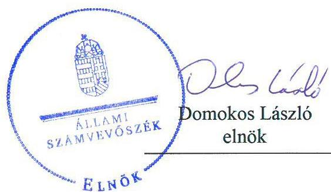
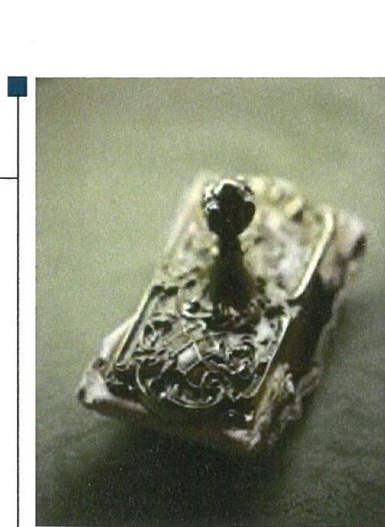
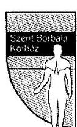
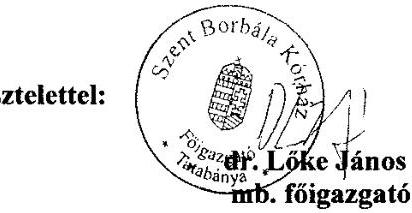
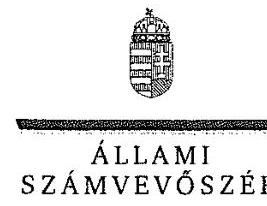
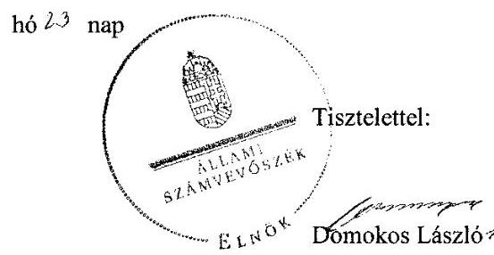
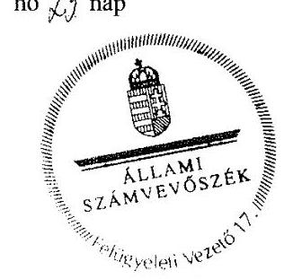
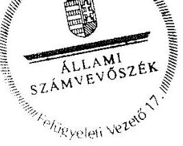

# Jelenetés 

## Központi költségvetési szervek ellenőrzése

Szent Borbála Kórház
2019.

---

# Jelentés 

## Központi költségvetési szervek ellenőrzése

Szent Borbála Kórház
2019. 03. hó 10. nap

---

# AZ ELLENŐRZÉST FELÜGYELTE:

DR. BENEDEK MÁRIA felügyeleti vezető

## AZ ELLENŐRZÉST VEZETTE ÉS A VÉGREHAJTÁSÁÉRT FELELŐS:

VERTKOVCZI MÁRIA ellenőrzésvezető

DR. KOVÁCS DIÁNA ellenőrzésvezető

## A PROGRAM ÖSSZEÁLLÍTÁSÁÉRT FELELŐS:

TÓTPÁL SZABOLCS osztályvezető

IKTATÓSZÁM: EL-0709-141/2019

TÉMASZÁM: 2450

TÉMASZÁM: 2450

Jelentéseink az Országgyűlés számítógépes hálózatán és az Interneten a www.asz.hu címen is olvashatóak.

---

# TARTALOMJEGYZÉK 

■ ÖSSZEGZÉS ..... 5
■ AZ ELLENŐRZÉS CÉLJA ..... 7
■ AZ ELLENŐRZÉS TERÜLETE ..... 8
■ AZ ELLENŐRZÉS HÁTTERE, INDOKOLTSÁGA ..... 9
■ A JELENTÉS LÉNYEGES KÉRDÉSKÖREI ..... 10
■ AZ ELLENŐRZÉS HATÓKÖRE ÉS MÓDSZEREI ..... 11
■ MEGÁLLAPÍTÁSOK ..... 14
■ JAVASLATOK ..... 18
■ MELLÉKLETEK ..... 21
I. sz. melléklet: Értelmező szótár ..... 21
■ FÜGGELÉKEK ..... 25
I. sz. függelék a jelentéshez ..... 25
II. sz. függelék: Észrevételek ..... 26
■ RÖVIDÍTÉSEK JEGYZÉKE ..... 47

---

.

---

# ÖSSZEGZÉS 

A Szent Borbála Kórház a költségvetési fegyelemre vonatkozó törvényi előírásokat nem tartotta be. Belső kontrollrendszere nem biztosította a közpénzekkel való átlátható, és elszámoltatható gazdálkodás feltételeit. A pénzügyi- és vagyongazdálkodása nem volt szabályszerű, a mérleg tételeit leltárral nem támasztotta alá. A Kórháznál a korrupció elleni védettség nem volt biztosított.

## Az ellenőrzés társadalmi indokoltsága

Az Állami Számvevőszék ellenőrzi a költségvetési szervek gazdálkodását, működését, hogy megállapításaival támogassa az ellenőrzött szervezetek szabályszerű gazdálkodását, javaslataival elősegítse az Alaptörvényben ${ }^{1}$ megfogalmazott alapvetések érvényesülését a mindennapi életben a szervezetek szintjén. A központi költségvetés rendszerében zajló folyamatok holisztikus elemzései, a kockázatok folyamatos figyelemmel kísérésének módszerével, az így kiválasztott szervezetek célzott, hatékony ellenőrzéseivel az Állami Számvevőszék betölti a legfőbb gazdasági ellenőrző szerv küldetését. Az ellenőrzések megállapításaival és egy adott időszak ellenőrzési eredményeinek elemzésével az Állami Számvevőszék ráirányíthatja a jogalkotók figyelmét a központi alrendszerben vagy annak egy ágazatában esetlegesen felmerülő pénzügyi, szabályozási feszültségekre. Az elvégzett ellenőrzések során az Állami Számvevőszék „jó gyakorlatokat" is azonosíthat, melyeket tanácsadó funkciója keretében szélesebb körben is megismertethet az érintettekkel, ezáltal is hozzájárulva a költségvetési rendszer szabályozott, átlátható, kiegyensúlyozott és fenntartható működéséhez.

## Főbb megállapítások, következtetések, javaslatok

A Szent Borbála Kórház belső kontrollrendszere nem biztosította a közpénzekkel való átlátható, szabályszerű, gazdaságos, felelős gazdálkodást. A Szent Borbála Kórház a kockázatkezelési, és az integrált kockázatkezelési rendszert nem működtette. A kontroltevékenységek gyakorlása az ellenőrzött időszakban nem volt szabályszerű. A monitoring rendszer kialakítása és működtetése a 2015-2016. években nem volt szabályszerű. A Kórház Főigazgatója az ellenőrzött időszak minden évében nyilatkozatban értékelte a belső kontrollrendszer minőségét, azonban az ÁSZ ellenőrzés megállapításai nem igazolták a nyilatkozatban foglaltakat. A Kórház a 2016. és 2017. évben az integritás elvű működést támogató kontrollokat nem alakította ki.

A Szent Borbála Kórház pénzügyi gazdálkodása nem volt szabályszerű. A kiadási előirányzatokat a Szent Borbála Kórház nem szabályszerűen használta fel, továbbá az előirányzat-maradvány megállapítása az alátámasztó nyilvántartás hiányosságai miatt nem volt szabályszerű a 2015-2016. években. A Kórház a 2015-2016. években a jogi személlyel történő visszterhes szerződéskötések során nem tartotta be a jogszabályi előírásokat az átlátható szervezetekkel való szerződéskötésre vonatkozóan, ezzel a szabályszerű közpénzfelhasználást nem biztosította.

A Szent Borbála Kórház az éves költségvetési maradvány megállapítása és az azt befolyásoló év végi kifizetetlen szállítói állomány tekintetében a 2017. évben nem tartotta be a jogszabályi előírásokat. A Kórház gazdálkodása nem felelt meg a jogszabályi előírásoknak, mivel a szabad előirányzat mértékét meghaladóan vállalt kötelezettséget.

A vagyongazdálkodás a 2015-2017. években nem volt szabályszerű, mivel a költségvetési beszámoló mérleg tételei leltárral nem voltak alátámasztottak, így a mérlegben szereplő eszközök és források értékének valódisága nem volt igazolt. A kötelezettségvállalás-nyilvántartás, a maradvány megállapítás és a vagyongazdálkodás területén feltárt szabálytalanságok miatt a Szent Borbála Kórház beszámolója nem mutatott valós és megbízható képet a Kórház pénzügyi és vagyoni helyzetéről.

A Szent Borbála Kórháznál alakítottak ki a teljesítmény mérésére szolgáló követelményeket, de a belső kontrollrendszer, a pénzügyi- és a vagyongazdálkodás működése során feltárt hiányosságok miatt a teljesítménymérés feltételei nem álltak fenn.

---

Az Állami Számvevőszék az intézkedések megtétele céljából az ÁEEK főigazgatója részére egy, a Szent Borbála Kórház főigazgatója részére 11 javaslatot fogalmazott meg.

---

# AZ ELLENŐRZÉS CÉLJA 

AZ ELLENŐRZÉS CÉLJA annak megítélése volt, hogy a Szent Borbála Kórházra vonatkozó irányító szervi feladatellátás a jogszabályi előírások betartásával történt-e; a Kórháznál a belső kontrollrendszer kialakítása és működtetése szabályszerű volt-e, biztosította-e az átlátható, szabályszerű, gazdaságos, hatékony és eredményes gazdálkodás feltételeit; a Kórház pénzügyi és vagyongazdálkodása megfelelt-e a jogszabályi előírásoknak és belső szabályzatainak; a költségvetési maradvány megállapítása szabályszerűen történt-e.

Az ellenőrzés keretében értékelte az ÁSZ², hogy a Kórháznál kiépítették és erősítették-e a korrupciós kockázatok kezelését szolgáló integritási kontrollokat, továbbá megteremtették-e a teljesítményellenőrzés feltételeit.

Az ellenőrzés célja volt továbbá annak értékelése, hogy az államháztartás központi alrendszerébe tartozó Kórház gazdálkodása elszámoltatható-e és megfelelt-e annak az Alaptörvényben meghatározott alapvetésnek, hogy Magyarország a kiegyensúlyozott, átlátható és fenntartható költségvetési gazdálkodás elvét érvényesíti. Érvényesült-e a nemzeti vagyon kezelésének és védelmének célja, azaz az Kórház vagyona a közérdeket szolgálja, a közös szükségletek kielégítése és a természeti erőforrások megóvása, valamint a jövő nemzedékek szükségleteinek figyelembevétele mellett.

---

# AZ ELLENŐRZÉS TERÜLETE 

## Szent Borbála Kórház

A tatabányai székhelyű Szent Borbála Kórház 1900. december 31-én kezdte meg működését. Működési és ellátási területét, valamint alaptevékenységét az egészségügyi ágazati jogszabályok ${ }^{3}$ határozták meg. Alapfeladata a járó- és fekvőbetegek diagnosztikus és terápiás szakorvosi ellátása, rehabilitációja és követéses gondozása volt.

Az ellenőrzött időszakban a Szent Borbála Kórház irányító szerve az Emberi Erőforrások Minisztériuma volt, a középirányítói jogokat a Gyógyszerészeti és Egészségügyi Minőség- és Szervezetfejlesztési Intézet, majd 2015. március 1-jétől jogutódja, az Állami Egészségügyi Ellátó Központ gyakorolta. Az Állami Egészségügyi Ellátó Központ feladata az emberi erőforrások minisztere hatáskörébe nem tartozó fenntartói, valamint a 27/2015. (II.25.) Korm. rendeletben ${ }^{4}$ meghatározott irányítói jogok gyakorlása volt.

A Szent Borbála Kórház gazdasági szervezettel, az előirányzatok felett teljes jogkörrel rendelkező központi költségvetési szerv volt.

A Kórház mérleg szerinti vagyona a 2015. január 1-jei 9593 millió Ft-ról 2017. december 31-ig 40,8 %-kal, 13512 millió Ft-ra növekedett.

A Főigazgató ${ }^{5}$ 2013. június 15-étől látta el feladatait, személyében 2015-2017. években nem történt változás. A gazdasági igazgató 2012. szeptember 1-jén került kinevezésre.

A munkavállalók átlagos statisztikai állományi létszáma a 2015. évi 1098 főről 2017. évre 1233 főre, 12,3 %-kal nőtt.

A Szent Borbála Kórházban az ellenőrzött időszakban szervezeti, szerkezeti átalakítás nem történt.

---

# AZ ELLENŐRZÉS HÁTTERE, INDOKOLTSÁGA 

Az államháztartás központi alrendszerébe tartozó szervezet vagyona a nemzeti vagyon része, és az Alaptörvény is rögzíti, hogy a vagyonnal való gazdálkodás célja a közérdek szolgálata. Az ÁSZ ellenőrzi az éves költségvetési törvény végrehajtását, az ellenőrzés során feltárt kockázatok és a terület folyamatos kockázatelemzésével beazonosított kockázatok kezelése érdekében ráépülő ellenőrzésekkel ellenőrzi a költségvetési szervek gazdálkodását, működését, hogy az ellenőrzések megállapításaival támogassa az ellenőrzött szervezetek szabályszerű gazdálkodását, javaslataival elősegítse az Alaptörvényben megfogalmazott alapvetések érvényesülését a mindennapi életben a szervezetek szintjén.

A belső kontrollrendszer kialakítása és működtetése nélkül nem valósítható meg a közpénzek, a közvagyon átlátható, szabályos, gazdaságos, hatékony és eredményes felhasználása. A belső kontrollrendszer azt a célt szolgálja, hogy a költségvetési szervek működésük és gazdálkodásuk során a tevékenységeket szabályszerűen hajtsák végre, teljesítsék elszámolási kötelezettségeiket és megvédjék az erőforrásokat a veszteségektől, a károktól és a nem rendeltetésszerű használattól. A belső kontrollrendszer magában foglalja mindazon elveket, eljárásokat és belső szabályzatokat, melyek biztosítják, hogy a költségvetési szerv valamennyi tevékenysége és célja összhangban legyen a szabályszerűséggel, szabályozottsággal, valamint a gazdaságosság, hatékonyság és eredményesség követelményeivel, az eszközökkel és forrásokkal való gazdálkodásban ne kerüljön sor pazarlásra, visszaélésre, rendeltetésellenes felhasználásra. Megfelelő, pontos és naprakész információk álljanak rendelkezésre a költségvetési szerv működésével kapcsolatosan, és a belső kontrollrendszer harmonizációjára, összehangolására vonatkozó jogszabályok végrehajtásra kerüljenek. Az integritás kontrollok kiépítése, erősítése a szervezet korrupciós kockázatainak kezelését szolgálja. A teljesítménykövetelmények meghatározása és működtetése megalapozhatja a központi költségvetési szervnél a teljesítményellenőrzés lefolytatását.

A központi költségvetési szerveknél az Ávr. 150. §-a meghatározza azokat az eseteket, amelyeket kötelezettségvállalással terhelt maradványnak kell tekinteni. Az Áhsz. 14. § (8) bekezdése értelmében, a mérlegben a kötelezettségek között az egységes rovatrend szerinti rovatokhoz kapcsolódóan vezetett nyilvántartási számlákon nyilvántartott végleges kötelezettségvállalásokat, más fizetési kötelezettségeket kell kimutatni mindaddig, amíg azokat pénzügyileg ki nem egyenlítették, el nem engedték vagy egyéb módon nem rendezték. Amennyiben a költségvetési szerv gazdálkodása során a vonatkozó jogszabályokat betartja, év végén a kötelezettségvállalással terhelt maradványon felül nem rendelkezhet ki nem fizetett szállítói kötelezettséggel. Mindezekre tekintettel az ÁSZ kiemelten ellenőrzi a maradvány modul keretében a kötelezettségvállalással terhelt maradvány dokumentumokkal történő alátámasztottságát.

---

# A JELENTÉS LÉNYEGES KÉRDÉSKÖREI 

1.  - Az irányító szerv Kórházra vonatkozó feladatellátása szabályszerű volt-e?
2.  - A Kórház belső kontrollrendszerének kialakítása és működtetése szabályszerű volt-e, az biztosította-e a közpénzfelhasználás és az állami vagyonnal való gazdálkodás szabályosságát?
3.  - A Kórház pénzügyi gazdálkodása szabályszerű volt-e?
4.  - A költségvetési maradvány megállapítása szabályszerűen történt-e?
5.  - A Kórház vagyongazdálkodása szabályszerű volt-e?
6.  - A Kórháznál alakítottak-e ki a teljesítmény mérésére alkalmas követelményeket?

---

# AZ ELLENŐRZÉS HATÓKÖRE ÉS MÓDSZEREI 

## Az ellenőrzés típusa

Megfelelőségi ellenőrzés.

## Az ellenőrzött időszak

2015. január 1. és 2018. június 30. közötti időszak.

## Az ellenőrzés tárgya

A Szent Borbála Kórházra vonatkozó irányító szervi feladatok ellátása a 2015-2016. években. A Szent Borbála Kórház belső kontrollrendszerének kialakítása és működtetése 2015-2017. években, valamint az integritás kontrollok kiépítettsége 2016-2017. években és a teljesítményellenőrzés feltételei a 2017. évben.

A Szent Borbála Kórház pénzügyi és vagyongazdálkodása a 2015-2016. években.

A 2017. évre vonatkozóan a Szent Borbála Kórház vagyongazdálkodási feltételeinek kialakítása, annak szabályszerűsége, az elszámoltathatóság biztosítása a szabályozás szintjén. A Szent Borbála Kórháznál hozott vagyonváltozást eredményező döntések, a vagyonban bekövetkezett változások végrehajtásának, nyilvántartásba vételének, elszámolásának szabályszerűsége. Az állami vagyon kimutatásának szabályszerűsége, ennek keretében az állami vagyonnal történő rendelkezés, a vagyonmozgások, a vagyonnyilvántartásba vétele, értékelése és a mérleg alátámasztás szabályszerűsége. A költségvetési maradvány megállapításának szabályszerűsége 2017. év vonatkozásában.

## Az ellenőrzött szervezet

- Szent Borbála Kórház
- Emberi Erőforrások Minisztériuma mint irányító szerv
- Állami Egészségügyi Ellátó Központ mint középirányító szerv.

## Az ellenőrzés jogalapja

Az ellenőrzés jogszabályi alapját az ÁSZ tv. ${ }^{6}$ 1. § (3) bekezdés, 5. § (2)-(3) bekezdései, (4) bekezdés a) pontja és (6) bekezdése, valamint az Áht. ${ }^{7} 61 . \S$ (2) bekezdésének előírásai képezték.

---

# Az ellenőrzés módszerei 

Az ellenőrzésre a szakmai program szempontjai, az ellenőrzött időszakban hatályos jogszabályok, az ellenőrzés szakmai szabályai, a jelen ellenőrzésre irányadó ÁSZ módszertanok figyelembevételével került sor.

Az ÁSZ a kapcsolattartást az ellenőrzés ideje alatt a Szent Borbála Kórházzal, az Emberi Erőforrások Minisztériumával és az Állami Egészségügyi Ellátó Központtal az ÁSZ SZMSZ-ének vonatkozó előírásai alapján biztosította.

Az ellenőrzési kérdések megválaszolásához szükséges bizonyítékok megszerzése a Szent Borbála Kórház, az Emberi Erőforrások Minisztériuma és az Állami Egészségügyi Ellátó Központ által rendelkezésre bocsátott dokumentumokra, adatokra alapozva megfigyelés, szemle (szemrevételezés), kérdésfeltevés (információkérés), mintavételezés, valamint elemző eljárás útján történt.

Az ellenőrzési bizonyítékként felhasználható adatforrások közé tartoztak egyrészt a szakmai program részletes szempontjainál felsorolt adatforrások, másrészt minden egyéb - az ellenőrzés folyamán feltárt, az ellenőrzés szempontjából információt tartalmazó - dokumentum.

Az ellenőrzés lefolytatásához az ellenőrzött szervezet a tanúsítványok kitöltésével, valamint az ÁSZ által kért dokumentumok megküldésével szolgáltatott adatokat, amelyek valódiságát és teljes körűségét az ellenőrzött szervezet vezetője által tett teljességi és hitelességi nyilatkozat igazolta. Az így rendelkezésre bocsátott adatok, információk kontrollja az ellenőrzés keretében történt.

A központi költségvetési szerv belső kontrollrendszere egyes pilléreinek kialakítására és működtetésére vonatkozó értékelés:
$\longrightarrow$ „szabályszerű", amennyiben az értékelt területen az elért „igen" válaszok százalékban kifejezett, egész számra kerekített aránya legalább $85 \%$,
$\longrightarrow$ „nem szabályszerű", ha nem éri el a 85\%-ot.
A központi költségvetési szerv belső kontrollrendszerének összesített értékelése az egyes részterületek esetében kapott megfelelőségi arányok számtani átlaga alapján történik és megegyezik a pillérenként (kontrollterületenként) alkalmazott százalékos értékelésekkel, a következő eltérésekkel: a kontrollrendszer egésze esetében a „szabályszerű" értékelésnek a százalékos értéken felül további feltétele, hogy egyik kontrollterület sem kaphat „nem szabályszerű" értékelést.

Az ÁSZ statisztikai módszereken alapuló mintavételt alkalmazott.
A kiadások ellenőrzésére a 2015-2017. évek vonatkozásában került sor. A külső személyi juttatások, felhalmozási kiadások, dologi kiadások esetében az ellenőrzés azokra a legnagyobb értékű tételekre - a lényeges sokaságra - terjedt ki, melyek összértéke elérte a teljes sokaság összértékének $50 \%$-át.

A 2015. évi kiadások és bevételek esetében az ÁSZ a lényeges sokaságot tételesen ellenőrizte. A 2016-2017. évi kiadások elszámolásának szabályszerűségét az ÁSZ a lényeges sokaságból véletlen mintavételi eljárással kiválasztott tételek alapján ellenőrizte.

---

Az ÁSZ a 2017. évi év végi kifizetetlen szállítói tartozások tekintetében a kötelezettségvállalás, valamint annak nyilvántartásba vételének szabályszerűségét véletlen mintavétellel kiválasztott tételek alapján ellenőrizte.

A mintavétellel ellenőrzött területek esetében az ÁSZ minden egyes tétel vonatkozásában a felhasználás, elszámolás és értékelés szabályszerűségére vonatkozó kérdéseket tett fel. Szabályszerű értékelést kapott egy ellenőrzött területet, amennyiben 95\%-os bizonyossággal az ellenőrzött sokaságban az átlagos hibaarány legfeljebb 10\%, nem szabályszerű, amennyiben 10\%-nál magasabb arányt képviselt.

---

# 1. Az irányító szerv Kórházra vonatkozó feladatellátása szabályszerű volt-e? 

Összegző megállapítás

Az EMMI ${ }^{9}$ mint irányító szerv, valamint az ÁEEK ${ }^{10}$ mint középirányító szerv Kórházra ${ }^{11}$ vonatkozó feladatellátása szabályszerű volt.

Az EMMI az Áht.-ben és az Ávr. ${ }^{12}$-ben előírtakkal összhangban gyakorolta az alapítással kapcsolatos jogosultságait, szabályszerűen járt el a tervezési követelmények meghatározásakor, az elemi költségvetés és a beszámoló összeállításához készült tájékoztató kiadásakor, a Kórház költségvetésének, valamint az éves beszámolójának jóváhagyásakor.

Az ÁEEK az Áht.-ban foglaltakkal összhangban végezte a Kórház költségvetése teljesítésének nyomon követését.

## 2. A Kórház belső kontrollrendszerének kialakítása és működtetése szabályszerű volt-e, az biztosította-e a közpénzfelhasználás és az állami vagyonnal való gazdálkodás szabályosságát?

Összegző megállapítás

A Kórház belső kontrollrendszerének kialakítása és működtetése nem volt szabályszerű, az nem biztosította a közpénzfelhasználás és az állami vagyonnal való gazdálkodás szabályosságát 2015-2017. években.

A KONTROLLKÖRNYEZET KIALAKÍTÁSA szabályszerű volt. A Kórház az Áht. és az Ávr. előírásaival összhangban rendelkezett Alapító Okirattal és SZMSZ ${ }^{13}$-szel.

A Főigazgató a 2015-2017. években az Áhsz. ${ }^{14}$ 51. § (3) bekezdésében foglaltak ellenére nem szabályozta a számlarendben a részletező nyilvántartások vezetésének módját, azoknak a kapcsolódó könyvviteli és nyilvántartási számlákkal való egyeztetését, annak dokumentálását, valamint a részletező nyilvántartások és az egységes rovatrend rovataihoz kapcsolódóan vezetett nyilvántartási számlák adataiból a pénzügyi könyvvezetéshez készült összesítő bizonylatok (feladások) elkészítésének rendjét, az összesítő bizonylat tartalmi és formai követelményeit.

A KOCKÁZATKEZELÉSI RENDSZERT a Főigazgató a Bkr. ${ }^{15}$ 7. § (1) bekezdésében előírtak ellenére 2015. január 1. és 2016. szeptember 30. között, az integrált kockázatkezelési rendszert 2016. október 1-jétől 2017. december 31-éig nem működtetette.

---

A Főigazgató a Bkr. 2016. október 1-jétől hatályos 7. § (4) bekezdésében foglalt előírás ellenére nem jelölt ki az integrált kockázatkezelési rendszer koordinálására szervezeti felelőst.

A KONTROLLTEVÉKENYSÉG GYAKORLÁSA nem volt szabályszerű a 2015-2017. években.

A 2017. évben a Kórháznál az Ávr. 57. § (1) bekezdésében foglaltak ellenére teljesítés igazolás nélkül történt a kiadások kifizetése.

A Kórház az Ávr. 60. § (3) bekezdésében foglaltak ellenére a 2017. évben nem vezetett naprakész nyilvántartást a gazdálkodási jogkörgyakorlásra jogosult személyek aláírás-mintáiról.

# AZ INFORMÁCIÓS ÉS KOMMUNIKÁCIÓS RENDSZER kialakítása, működtetése szabályszerű volt. A Kórház rendelkezett az Info tv. ${ }^{16}$ és az Ikr. ${ }^{17}$ szerinti adatvédelmi és adatbiztonsági szabályzattal, valamint 2016-ban az Ltv. ${ }^{18}$ szerint készítette el iratkezelési szabályzatát. 

A MONITORING RENDSZER kialakítása és működtetése a 2015-2016. években nem volt szabályszerű, a 2017. évben szabályszerű volt.

A Főigazgató a Bkr. 10. §-ban foglaltak ellenére a 2015-2016. években nem alakított ki a szervezeten belül olyan folyamatokat, nem határozott meg konkrét követelményeket, amelyek biztosították a rendelkezésre álló források gazdaságos, hatékony és eredményes felhasználását és folyamatos nyomon követését.

A 2015. évben az Áht. 70. § (1) bekezdésében, valamint a Bkr. 10. §-ban foglaltak ellenére a belső ellenőrzés kialakítása és működtetése nem volt szabályszerű. A Főigazgató a 2015. január 1-jétől 2016. november 30-áig a Bkr. 15. § (5) bekezdésében foglaltak ellenére nem alkalmazott foglalkoztatásra irányuló jogviszonyban belső ellenőrt. 2016. december 1-jétől foglalkoztatott a Bkr. szerint belső ellenőrt a Kórház.

A Főigazgató 2015-2017. években nyilatkozatban értékelte a Kórház belső kontrollrendszerének minőségét. A Főigazgató a nyilatkozatában azt rögzítette, hogy az ellenőrzött években a Kórház belső kontrollrendszerét kiépítette és működtette. Az ÁSZ ellenőrzés megállapításai nem igazolták a nyilatkozatban foglaltakat.

A Főigazgató a Bkr. 11. § (2) bekezdésében foglaltak ellenére a Bkr. 1. melléklet szerinti nyilatkozatot az éves költségvetési beszámolóval együtt nem küldte meg az EMMI részére.

Az integritásirányítási rendszer kiépítése során a korrupciós kockázatokat mérséklő integritási kontrollokat a Kórház nem alakította ki.

---

# 3. A Kórház pénzügyi gazdálkodása szabályszerű volt-e? 

## Összegző megállapítás

### 3.1. számú megállapítás

### 3.2. számú megállapítás

A Kórház pénzügyi gazdálkodása nem volt szabályszerű.
A kiadási előirányzatok felhasználása 2015-2016-ban nem volt szabályszerű.

A kiadások elszámolása nem volt szabályszerű a 2015-2016. évben.
A 2015-2016. években a Kórháznál az Ávr. 57. § (1) bekezdésében foglaltak ellenére teljesítés igazolás nélkül történt a kiadások kifizetése.

A Kórház az Ávr. 60. § (3) bekezdésében foglaltak ellenére a 2016. évben nem vezetett naprakész nyilvántartást a gazdálkodási jogkörgyakorlásra jogosult személyek aláírás-mintáiról.

A kötelezettségvállalás alapját jelentő, jogi személlyel megkötött visszterhes szerződések a 2015-2016. években az Ávr. 50. § (1a) bekezdésében foglaltak ellenére nem tartalmazták a szervezet képviselőjének nyilatkozatát arra vonatkozóan, hogy átlátható szervezetnek minősül.

A 2015-2016. évi előirányzat-maradvány megállapítása az azt alátámasztó nyilvántartás hiányosságai miatt nem volt szabályszerű.

A Kórház nem rendelkezett a 2015. és a 2016. években az Áhsz. 39. § (3) bekezdésében foglaltak ellenére az Áhsz. 14. melléklet II. 4. a)-g) pontokban meghatározott tartalomnak megfelelő, az előirányzat-maradvány szabályszerű megállapításához szükséges kötelezettségvállalások, más fizetési kötelezettségek részletező nyilvántartásával.

## 4. A költségvetési maradvány megállapítása szabályszerűen történt-e?

## Összegző megállapítás

### 4.1. számú megállapítás

A költségvetési maradvány megállapítása nem volt szabályszerű a 2017. évben.

A Kórház maradvány-kimutatása nem volt szabályszerű, a szabad előirányzat mértékét meghaladóan vállalt kötelezettséget.

A Kórház az Áhsz. 53. § (4) bekezdésében foglaltak ellenére az Áhsz. 17. mellékletében meghatározott kötelező egyezőségek vizsgálatát nem végezte el. A Kórház a 2017. évben nem biztosította az Áhsz. 17. melléklete 1. a) pontjában előírt azon kötelezettségét, hogy a költségvetési számvitelen belül a gazdálkodási szabályokból adódóan a 05. számlacsoportban vezetett nyilvántartási számlákon az előirányzatok nyilvántartására vezetett számlák egyenlegét ne haladja meg a költségvetési évben esedékes kötelezettségek nyilvántartására szolgáló számlák egyenlege. Így a Kórház az Áht. 36. § (1) bekezdését megsértve a szabad előirányzat mértékét meghaladóan vállalt kötelezettséget, emiatt a maradvány kimutatása nem volt szabályszerű.

---

### 4.2. számú megállapítás 

A költségvetési maradvány összegét befolyásoló év végi kifizetetlen szállítói állomány keletkezése során az eljárásra vonatkozó jogszabályi előírásokat nem tartották be.

A szállítói tartozások tekintetében a teljesítésigazolás, valamint a nyilvántartásba vétel nem volt szabályszerű 2017-ben:
$\longrightarrow$ Az Ávr. 57. § (1) bekezdése ellenére nem került sor teljesítésigazolásra.
$\longrightarrow$ A kötelezettségvállalás nyilvántartásba vétele során az Áhsz. 39. § (3) bekezdésében foglaltak ellenére nem tartották be az Áhsz. 14. melléklet II. 4. f)-g) pontjában foglalt, nyilvántartásra vonatkozó előírásokat.

## 5. A Kórház vagyongazdálkodása szabályszerű volt-e?

## Összegző megállapítás

### 5.1. számú megállapítás

A Kórház vagyongazdálkodása nem volt szabályszerű.
Az állami vagyon kimutatását nem szabályszerűen végezték, ezért annak átlátható, valóságnak megfelelő nyilvántartása nem volt biztosított.

A 2015-2017. években a Kórház a Számv. tv. ${ }^{19}$ 69. § (1) és az Áhsz. 22. § (1) bekezdésében előírtak ellenére az éves költségvetési beszámoló elkészítéséhez, a mérleg tételeinek alátámasztásához nem állított össze olyan leltárt, amely tételesen, ellenőrizhető módon tartalmazza a mérleg fordulónapján meglévő eszközeit és forrásait mennyiségben és értékben. A Kórház 2015-2017. évi mérlege és beszámolója nem volt megalapozott.

## 6. A Kórháznál alakítottak-e ki a teljesítmény mérésére alkalmas követelményeket?

Összegző megállapítás

A Kórháznál a 2017. évben alakítottak ki teljesítmény mérésére szolgáló követelményeket.

A teljesítmény mérésére alkalmas követelményeket a Főigazgató a 2017. évben kialakította, a szervezeti célok elérését szolgáló feladatokat meghatározta, azonban a pénzügyi- és vagyongazdálkodásra vonatkozó adatok megbízhatóságának a hiánya miatt a valós teljesítmény mérésének feltételei nem állnak fenn.

---

# JAVASLATOK 

Az ÁSZ tv. 33. § (1) bekezdésében foglaltak értelmében az ellenőrzött szervezet vezetője köteles a jelentésben foglalt megállapításokhoz kapcsolódó intézkedési tervet összeállítani és azt a jelentés kézhezvételétől számított 30 napon belül az ÁSZ részére megküldeni. Amennyiben az ellenőrzött szervezet vezetője nem küldi meg határidőben az intézkedési tervet, vagy továbbra sem elfogadható intézkedési tervet küld, az Állami Számvevőszék elnöke az ÁSZ tv. 33. § (3) bekezdése a) és b) pontjaiban foglaltakat érvényesítheti.

## az ÁEEK főigazgatójának

1.  Tegyen intézkedéseket a feltárt hiányosságok és/vagy szabálytalanságok tekintetében a felelősség tisztázása érdekében, és szükség szerint intézkedjen a felelősség érvényesítéséről.
(2. számú megállapítás 2-4. bekezdés, 6-7., 13. bekezdése, 3.1. megállapítás 4. bekezdés alapján 4.1. számú megállapítás 1-3. mondatai, 4.2. számú megállapítás 1-2. francia bekezdései, 5.1. számú megállapítás 1. mondata alapján)

## a Szent Borbála Kórház főigazgatójának

1.  Intézkedjen arról, hogy az Áhsz. előírásának megfelelően a részletező nyilvántartások vezetésének módja, azoknak a kapcsolódó könyvviteli és nyilvántartási számlákkal való egyeztetése, annak dokumentálása, valamint a részletező nyilvántartások és az egységes rovatrend rovataihoz kapcsolódóan vezetett nyilvántartási számlák adataiból a pénzügyi könyvvezetéshez készült összesítő bizonylatok (feladások) elkészítésének rendje, az összesítő bizonylat tartalmi és formai követelményei a számlarendben szabályzásra kerüljenek.
(2. számú megállapítás 2. bekezdés alapján)
2. Intézkedjen a Bkr. előírásának megfelelően integrált kockázatkezelési rendszer működtetéséről.
(2. számú megállapítás 3. bekezdés alapján)
3. Intézkedjen a Bkr. előírásának megfelelően az integrált kockázatkezelési rendszer koordinálására szervezeti felelős kijelöléséről.
(2. számú megállapítás 4. bekezdés alapján)

---

4. Intézkedjen arról, hogy az Ávr. előírásának megfelelően a teljesítés igazolása során ellenőrizhető okmányok alapján ellenőrizzék és igazolják a kiadások teljesítésének jogosságát, összegszerűségét.
(2. számú megállapítás 6. bekezdés, 4.2. számú megállapítás 1. francia bekezdése alapján)
5. Gondoskodjon az Ávr. előírásának megfelelően a gazdálkodási jogkörgyakorlásra jogosult személyek aláírás-mintáiról való naprakész nyilvántartás vezetéséről.
(2. számú megállapítás 7. bekezdés alapján)
6. Intézkedjen a Bkr. előírásának megfelelően a nyilatkozatnak az irányító szerv részére az éves költségvetési beszámolóval együtt történő megküldéséről.
(2. sz. megállapítás 13. bekezdés alapján)
7. Gondoskodjon az Ávr. előírásának megfelelően arról, hogy a megkötött visszterhes szerződések tartalmazzák a szervezet képviselőjének nyilatkozatát arra vonatkozóan, hogy átlátható szervezetnek minősül.
(3.1. megállapítás 4. bekezdés alapján)
8. Gondoskodjon az Áhsz.-ben foglalt előírásnak megfelelően a kötelező egyezőségek vizsgálatával a költségvetési és a pénzügyi könyvvezetés helyességének ellenőrzéséről.
(4.1. számú megállapítás 1. mondat alapján)
9. Intézkedjen
a) a költségvetési számvitelen belül a gazdálkodási szabályokból adódóan az Áhsz. 17. melléklet 1. a) pontjában előírt kötelezettség betartásáról, továbbá arról, hogy
b) az Áht. előírásainak megfelelően kötelezettségvállalásra csak szabad előirányzat mértékéig kerüljön sor.
(4.1. sz. megállapítás 2-3. mondat alapján)
10. Gondoskodjon a kötelezettségvállalások Áhsz. szerinti tartalmú nyilvántartásáról.
(4.2. sz. megállapítás 2. francia bekezdés alapján)

---

11. Intézkedjen a Számv. tv. és az Áhsz. előírásának megfelelően a beszámoló elkészítéséhez, a mérleg tételeinek alátámasztásához olyan leltár összeállításáról, amely tételesen, ellenőrizhető módon tartalmazza a mérleg fordulónapján meglévő eszközeit és forrásait mennyiségben és értékben.
(5.1. számú megállapítás 1. mondata alapján)

---

# MELLÉKLETEK 

- I. SZ. MELLÉKLET: ÉRTELMEZŐ SZÓTÁR
állami vagyon
állami vagyonnak minősül:
a) az állam tulajdonában lévő dolog, valamint a dolog módjára hasznosítható természeti erő,
b) az a) pont hatálya alá nem tartozó mindazon vagyon, amely vonatkozásában törvény az állam kizárólagos tulajdonjogát nevesíti,
c) az állam tulajdonában lévő tagsági jogviszonyt megtestesítő értékpapír, illetve az államot megillető egyéb társasági részesedés,
d) az államot megillető olyan immateriális, vagyoni értékkel rendelkező jogosultság, amelyet jogszabály vagyoni értékű jogként nevesít. (Forrás: Vtv. ${ }^{20}$ 1. § (2) bekezdése)
állami vagyon használója Az a természetes vagy jogi személy, jogi személyiséggel nem rendelkező szervezet, aki, vagy amely törvény vagy szerződés alapján, bármely jogcímen (bérlet, haszonbérlet, használat stb.) állami vagyont birtokol, használ, szedi annak hasznait, hasznosít, ide nem értve a haszonélvezőt, a vagyonkezelőt és a tulajdonosi jogok gyakorlóját. (Forrás: Vtvr. 1. § (7) bekezdés a) pontja)
állami vagyon hasznosítása Az állami vagyont az MNV Zrt. maga kezeli, vagy szerződés - így különösen bérlet, haszonbérlet, megbízás - alapján központi költségvetési szervnek, természetes vagy jogi személynek, vagy jogi személyiséggel nem rendelkező gazdálkodó szervezetnek hasznosításra átengedi.
(Forrás: Vtv. 23. § (1) bekezdése, hatályos 2012. január 1-jétől)
Az állami vagyonnal a tulajdonosi joggyakorló maga gazdálkodik, vagy szerződés - így különösen bérlet, haszonbérlet, megbízás - alapján hasznosításra átengedi, illetőleg vagyonkezelésbe, haszonélvezetbe adja. (Forrás: Vtv. 23. § (1) bekezdése, hatályos 2013. június 28 -ától)
állami vagyon kezelője /vagyonkezelő
átalakítás
belső ellenőrzés
belső kontrollrendszer

Az állami vagyont az MNV Zrt. maga kezeli, vagy szerződés - így különösen bérlet, haszonbérlet, megbízás - alapján központi költségvetési szervnek, természetes vagy jogi személynek, vagy jogi személyiséggel nem rendelkező gazdálkodó szervezetnek hasznosításra átengedi." Az állami vagyonra vonatkozóan az MNV Zrt. kizárólag az Nvtv. ${ }^{21}$-ben meghatározott személyekkel köthet vagyonkezelési szerződést. (Forrás: Vtv. 27. § (1) bekezdése, hatályos 2012. január 1-jétől)
A költségvetési szerv általános jogutódlással történő megszüntetése átalakítással történhet. Az átalakítás lehet egyesítés vagy különválás. Az egyesítés lehet beolvadás vagy összeolvadás. (2015. január 1-jétől Áht. 11. § (2) bekezdés)
Független, tárgyilagos bizonyosságot adó és tanácsadó tevékenység, amelynek célja, hogy az ellenőrzött szervezet működését fejlessze és eredményességét növelje, az ellenőrzött szervezet céljai elérése érdekében rendszerszemléletű megközelítéssel és módszeresen értékeli, illetve fejleszti az ellenőrzött szervezet irányítási és belső kontrollrendszerének hatékonyságát. (Forrás: Bkr. 2. § b) pontja)
A belső kontrollrendszer a kockázatok kezelése és tárgyilagos bizonyosság megszerzése érdekében kialakított folyamatrendszer, amely azt a célt szolgálja, hogy a működés és gazdálkodás során a tevékenységeket szabályszerűen, gazdaságosan, hatékonyan, eredményesen hajtsák végre, az elszámolási kötelezettségeket teljesítsék, megvédjék az erőforrásokat a veszteségektől, károktól és nem rendeltetésszerű használattól. (Forrás: Áht. 69. § (1) bekezdése)

---

belső kontrollrendszer területei
ellenőrzési nyomvonal
hasznosítás
információs és kommunikációs rendszer
integritás
integrált kockázatkezelési rendszer
irányító szerv/felügyeleti szerv
kockázat
kockázatkezelési rendszer
kontrollkörnyezet
kontrolltevékenységek
középirányító szerv

A kontrollkörnyezet, a kockázatkezelési rendszer, a kontrolltevékenységek, az információs és kommunikációs rendszer, valamint a nyomon követési (monitoring) rendszer. (Forrás: Bkr. 3. §-a)
Az ellenőrzési nyomvonal a költségvetési szerv működési folyamatainak szöveges, táblázatokkal vagy folyamatábrákkal szemléltetett leírása, amely tartalmazza különösen a felelősségi és információs szinteket és kapcsolatokat, irányítási és ellenőrzési folyamatokat, lehetővé téve azok nyomon követését és utólagos ellenőrzését. (Forrás: Bkr. 6. § (3) bekezdés)
A nemzeti vagyon birtoklásának, használatának, hasznok szedése jogának bármely a tulajdonjog átruházását nem eredményező - jogcímen történő átengedése, ide nem értve a vagyonkezelésbe adást, valamint a haszonélvezeti jog alapítását. (Forrás: Nvtv. 3. § (1) bekezdés 4. pontja)
A költségvetési szerv vezetője által kialakított és működtetett olyan rendszer, mely biztosítja, hogy a megfelelő információk a megfelelő időben eljutnak az illetékes szervezethez, szervezeti egységhez, illetve személyhez. (Forrás: Bkr. 9. § (1) bekezdés)
Az integritás - egyik gyakran használt jelentése szerint - az elvek, értékek, cselekvések, módszerek, intézkedések konzisztenciáját jelenti, vagyis olyan magatartásmódot, amely meghatározott értékeknek megfelel. Integritás-irányítási rendszer bevezetése a szervezetben a szervezethez rendelt közfeladatok integritás szempontú ellátását, az érték alapú működéssel (integritással) összefüggő szervezeti követelmények következetes érvényesítését jelenti. (Forrás: Nemzetgazdasági Minisztérium: Államháztartási Belső Kontroll Standardok és Gyakorlati Útmutató 1.6. Etikai értékek és integritás 46. oldal, 2017. szeptember)
Olyan folyamatalapú kockázatkezelési rendszer, amely a szervezet minden tevékenységére kiterjed, egységes módszertan és eljárások alkalmazásával, a szervezet célkitűzéseinek és értékeinek figyelembevételével biztosítja a szervezet kockázatainak teljes körű azonosítását, azok meghatározott kritériumok szerinti értékelését, valamint a kockázatok kezelésére vonatkozó intézkedési terv elkészítését és az abban foglaltak nyomon követését. (Forrás: Bkr. 2. § m) pontja, 2016. október 1-jétől)
A költségvetési szerv tekintetében az Áht.-ban meghatározott irányítási hatáskört gyakorló szerv. (Forrás: Áht. 1. § 9. pontja)
A kockázat annak a valószínűségét jelenti, hogy egy vagy több esemény vagy intézkedés nem kívánt módon befolyásolja a rendszer működését, céljainak megvalósulását. (Forrás: Javaslatok a korrupciós kockázatok kezelésére - Kockázatkezelési és ellenőrzési módszertan 35. oldal, ÁSZ)
Olyan irányítási eszközök és módszerek összessége, melynek elemei a szervezeti célok elérését veszélyeztető tényezők (kockázatok) azonosítása, elemzése, csoportosítása, nyomon követése, valamint szükség esetén a kockázati kitettség mérséklése.(Forrás: Bkr. 2. § m) pontja)
A költségvetési szerv vezetője által kialakított olyan elvek, eljárások, belső szabályzatok összessége, amelyben világos a szervezeti struktúra, a folyamatok átláthatók, egyértelműek a felelősségi, hatásköri viszonyok és feladatok, meghatározottak, ismertek és elfogadottak az etikai elvárások a szervezet minden szintjén, átlátható a humánerőforrás-kezelés. (Forrás: Bkr. 6. § (1) bekezdés)
A költségvetési szerv vezetője által a szervezeten belül kialakított (kontroll) tevékenységek, melyek biztosítják a kockázatok kezelését, hozzájárulnak a szervezet céljainak eléréséhez és erősítik a szervezet integritását. (Forrás: Bkr. 8. § (1) bekezdés)
A költségvetési szerv tekintetében törvény vagy kormányrendelet alapján meghatározott, átruházott irányítási hatásköröket gyakorló szerv. (Forrás: Áht. 9. § (4) bekezdés 2014. december 31-ig, Áht. 9/A. § (3) és (4) bekezdés 2015. január 1-jétől)

---

maradvány

A költségvetési év során a bevételek és kiadások különbözete, amely az alaptevékenység bevételei és kiadásai tekintetében a költségvetési maradvány, a vállalkozási tevékenység bevételei és kiadásai tekintetében a vállalkozási maradvány. (Forrás: Áht. 1. § 17. pont)
nyomon követési rendszer (monitoring)
tulajdonosi joggyakorló
vagyongazdálkodás

A költségvetési szerv vezetője köteles kialakítani a szervezet tevékenységének a célok megvalósításának nyomon követését biztosító rendszert, amely az operatív tevékenységek keretében megvalósuló folyamatos és eseti nyomon követésből, valamint az operatív tevékenységektől függetlenül működő belső ellenőrzésből áll. (Forrás: Bkr. 10. §)

Aki a nemzeti vagyon felett az államot vagy a helyi önkormányzatot megillető tulajdonosi jogok és kötelezettségek összességének gyakorlására jogosult. (Forrás: Nvtv. 3. § (1) bekezdés 17. pontja)

A nemzeti vagyongazdálkodás feladata a nemzeti vagyon rendeltetésének megfelelő, az állam, az önkormányzat mindenkori teherbíró képességéhez igazodó, elsődlegesen a közfeladatok ellátásához és a mindenkori társadalmi szükségletek kielégítéséhez szükséges, egységes elveken alapuló, átlátható, hatékony és költségtakarékos működtetése, értékének megőrzése, állagának védelme, értéknövelő használata, hasznosítása, gyarapítása, továbbá az állam vagy a helyi önkormányzat feladatának ellátása szempontjából feleslegessé váló vagyontárgyak elidegenítése. (Forrás: Nvtv. 7. § (2) bekezdése)

---

.

---

# FÜGGELÉKEK 

- I. SZ. FÜGGELÉK A JELENTÉSHEZ

Az Állami Számvevőszék az ellenőrzések során feltárt tényekhez kapcsolódó további körülmények tisztázására eszközrendszerrel nem rendelkezik. Amennyiben az ellenőrzésen túlmutatóan indokoltnak látszik az ellenőrzés során feltárt körülmények további vizsgálata, az Állami Számvevőszék törvényi felhatalmazás alapján az ellenőrzés által feltárt körülményeket továbbítja a hatáskörrel rendelkező szervnek a szükséges intézkedések megtétele, eljárások lefolytatása érdekében.
I.

A Kórház a 2015-2017. évi éves beszámoló mérleg tételeit nem támasztotta alá olyan leltárral, amely tételesen, ellenőrizhető módon tartalmazza a mérleg fordulónapján meglévő eszközöket és forrásokat mennyiségben és értékben. Ezzel megsértette a Számv. tv. 69. § (1) bekezdésében foglaltakat.

A Kórház mérlegének záró adatai 2015-2017. években (millió Ft-ban)

| Megnevezés | 2015. év | 2016. év | 2017.év |
| :-- | :--: | :--: | :--: |
| Leltárral alá nem támasztott eszközök: | 12327 | 12353 | 13512 |
| Eszközök összesen | 12327 | 12353 | 13512 |
| Leltárral alá nem támasztott források: | 12327 | 12353 | 13512 |
| Források összesen | 12327 | 12353 | 13512 |

Ezzel a Kórház nem igazolta, hogy a beszámolóban szereplő tételek a valóságban is megtalálhatóak.

Az eset konkrét körülményeinek feltárására a Nemzeti Adó- és Vámhivatal rendelkezik hatáskörrel.
II.

A Kórház teljesítés igazolás nélkül teljesített összesen 993056 ezer Ft értékben kifizetést. Ezzel megsértette az Áht. 38. § (1) bekezdésében és az Ávr. 57. § (1) bekezdésében foglaltakat.

Teljesítésigazolás hiányában nem igazolt, hogy a kifizetéshez valós teljesítés kapcsolódott, ezért felmerül, hogy a Kórházat vagyoni hátrány érhette.
Az eset konkrét körülményeinek felderítésére az ügyészség rendelkezik hatáskörrel.

---

A jelentéstervezetet a Számvevőszék 15 napos észrevételezésre megküldte az ellenőrzött szervezetek vezetőinek az ÁSZ tv. 29. §* (1) bekezdése előírásának megfelelően.

A Szent Borbála Kórház főigazgatója a jelentéstervezet megállapításaira írásban észrevételt tett.
Az ÁSZ tv. 29. § (3) bekezdésével összhangban az ÁSZ a Függelékben feltünteti az ellenőrzés megállapításaival kapcsolatban tett, figyelembe nem vett észrevételeket, és megindokolja, hogy azokat miért nem fogadta el.

[^0]
[^0]:    * 29. § (1) Az Állami Számvevőszék az ellenőrzési megállapításait megküldi az ellenőrzött szervezet vezetőjének vagy az általa megbízott személynek, és annak, akinek személyes felelősségét állapította meg.
    (2) Az ellenőrzött szervezet vezetője és a felelősként megjelölt személy az ellenőrzés megállapításaira tizenöt napon belül írásban észrevételt tehet.
    (3) Az Állami Számvevőszék az észrevételre a beérkezésétől számított harminc napon belül írásban válaszol. A figyelembe nem vett észrevételeket köteles a jelentésben feltüntetni, és megindokolni, hogy azokat miért nem fogadta el.

---

# SZENT BORBÁLA KÓRHÁZ FŐIGAZGATÓ
2800 Tatabánya, Dózsa Gy. u. 77. * Pf.: 1313
Telefon: 06-34/515-444, fax: 06-34/317-025
E-mail: sttitkar@tatabanyakorhaz.hu
Honlap: www.tatabanyakorhaz.hu

Tárgy: Észrevétel
Iktatószám: 31-, 1.1., 2019.
Ügyintéző: Hoffmann Zoltánné

Állami Számvevőszék

Domokos László
elnök

Budapest
Apáczai Csere János u. 10.
1052

ÁLLAMI SZÁMVEVŐSZÉK
3E-46904/2019/1
Érkezett: 2019 JÚL 31
Iktatószám: 61-670-135/2210
Melléklet: ..................................................................................................................................................................................................................................................................................................................................................................................................................................................................................................................................................................................................................................................................................................................................................................................................................................................................................................................................................................................................................................................................................................................................................................................................................................................................................................................................................................................................................................................................................................................................................................................................................................................................................................................................................................................................................................................................................................................................................................................................................................................................................................................................................................................................................................................................................................................................................................................................................................................................................................................................................................................................................................................................................................................................................................................................................................................................................................................................................................................................................................................................................................................................................................................................................................................................................................................................

---

kapcsolódó könyvviteli és nyilvántartási számlákkal való egyeztetését, annak dokumentálását, valamint a részletező nyilvántartások és az egységes rovatrend rovataihoz kapcsolódóan vezetett nyilvántartási számlák adataiból a pénzügyi könyvvezetéshez készült összesítő bizonylatok (feladások) elkészítésének rendjét, az összesítő bizonylat tartalmi és formai követelményeit."

# Észrevétel: 

A folyamatba épített előzetes, utólagos és vezetői ellenőrzése (FEUVE) ezen feladatok elvégzését, valamint a munkaköri leírások részben tartalmazták.
Az intézkedési tervben a számlarendet kiegészítjük, hogy az Áhsz. 51. § (3) bekezdésében foglaltaknak megfeleljünk.
„A kockázatkezelési rendszert a Főigazgató a Bkr. 7. § (1) bekezdésében előírtak ellenére 2015. január 1. és 2016. szeptember 30. között, az integrált kockázatkezelési rendszert 2016. október 1-jétől 2017. december 31-éig nem működtette.
A Főigazgató a Bkr. 2016. október 1-jétől hatályos 7. § (4) bekezdésében foglalt előírás ellenére nem jelölt ki az integrált kockázatkezelési rendszer koordinálására szervezeti felelőst."

## Észrevétel:

Intézményünk kockázat kezelési szabályzattal, és ellenőrzési nyomvonallal rendelkezett 2015. január 05-től. Kockázat felmérést évente végeztek az osztályok és a részlegek.
2019. április 15 -től elkészítésre került az integrált kockázatkezelési szabályzat. Minden egységünkben elindítottam és működtetem a kockázati felméréseket, különös tekintettel a gazdasági és pénzügyi folyamatra.
Intézményünkben két alkalommal került módosításra a kockázat kezelési szabályzat 2017.február 26-án jogszabályváltozás miatt, valamint 2018. szeptember 04-én az ÁSZ figyelemfelhívása alapján. Határidőre, 2018. szeptember 21-re ennek eleget tettünk.
„A kontrolltevékenység gyakorlása nem volt szabályszerű a 2015-2017. években.
A 2017. évben a Kórháznál az Ávr. 57. § (1) bekezdésében foglaltak ellenére teljesítés igazolás nélkül történt a kiadások kifizetése.
A Kórház az Ávr. 60. § (3) bekezdésében foglaltak ellenére a 2017. évben nem vezetett naprakész nyilvántartást a gazdálkodási jogkörgyakorlásra jogosult személyek aláírásmintáiról."

## Észrevétel:

A 368/2011. (XII. 31.) Korm. rendelet (továbbiakban Ávr.) szerint:
Az Intézményünk teljesítésigazolásának szabályait megállapító szabályzata alapján a teljesítésigazolás részletesen szabályozott folyamat. Ennek során a feljogosított személy tételes és mindenre kiterjedő részletességgel ellenőrzi

- hogy a kötelezettség vállalás alapján megtörtént a hiánytalan, minőségben megfelelő szállítás, illetve a munka elvégzése,
- kötelezettségvállalásban foglalt összeg egyezik a számlaösszeggel.

---

A fent említett ellenőrzés befejezése után dátummal és aláírásával igazolja a teljesítést az arra jogosult, hiszen teljes körű, az Ávr. által szabályozott ellenőrzés megtörtént. Véleményem szerint a teljesítésigazolás törvényi tartalma arra irányul, hogy teljes körű ellenőrzés nélkül nem lehet pénzügyi teljesítést eszközölni, mely nálunk minden esetben megvalósult.

A teljesítésigazolás az CT EcoSTAT gazdasági rendszerben történik és minden esetben csatoltuk a teljesítést alátámasztó dokumentumokat is.

A bizonylatok az ABR rendszerbe feltöltésre kerültek.
Az ellenőrzött időszakban a teljesítést igazoló "a teljesítés igazolására jogosult személy aláírása" formula fölé írt alá. Ezt a formulát az utalvány rendeleten "a teljesítést igazolom" formulával váltottuk fel 2019.07.19-től.

1.  sz. melléklet: módosított utalvány rendelet

Intézményünk naprakészen vezeti a gazdálkodási jogkörgyakorlásra jogosult személyek aláírás-mintáit. A vizsgált időszakban nem történt személyi változás, amely indokolttá tette volna a nyilvántartás módosítását.

Az aláírás minta beküldésre került az ABR rendszerbe.
Mivel többször tapasztaltuk, hogy a teljesítésre, kötelezettségvállalásra jogosult személy nem minden esetben írja le a teljes nevét, ezért szükségesnek tartottuk 2018.09.01. dátummal a kötelezettségvállalási szabályzat 7. sz. melléklete (nyilvántartás a teljesítésigazolásra jogosult személyekről) kiegészítését a szignóval.
2. sz. melléklet: nyilvántartás
„A monitoring rendszer kialakítása és működtetése a 2015-2016.években nem volt szabályszerű, a 2017. évben szabályszerű volt."
„A 2015. évben az Áht. 70. § (1) bekezdésében, valamint a Bkr. 10. §-ban foglaltak ellenére a belső ellenőrzés kialakítása és működtetése nem volt szabályszerű. A Főigazgató a 2015. január 1-jétől 2016. november 30 -áig a Bkr. 15. § (5) bekezdésében foglaltak ellenére nem alkalmazott foglalkoztatásra irányuló jogviszonyban belső ellenőrt. 2016. december 1-jétől foglalkoztatott a Bkr. szerint belső ellenőrt a Kórház."

# Észrevétel: 

Közalkalmazottként foglalkoztatott belső ellenőr munkaviszonya 2015. május 19 -én szűnt meg intézményünkben.

Az NKI honlapján 2015. május 28 -tól fennlévő és a 2015.06.12-én helyi napilapban is megjelent álláshirdetésre 3 jelentkező volt:

- 2 fő külső vállalkozó,
- 1 fő jelentkezett közalkalmazotti jogviszonyba, akinek az öregségi nyugdíjkorhatár eléréséig 2,5 éve volt vissza.
A meghallgatást követően az egyik vállalkozót találtuk alkalmasnak a feladat elvégzésére és szerződést kötöttünk vele 2015. augusztus 1-tól.

---

2016. március 30-án kaptuk meg az ÁEEK főigazgatójától a levelet, hogy nem kapunk felmentést a 370/2011. (XII.31.) kormányrendelet 15. § (5) bekezdése alól és közalkalmazotti jogviszony keretében kell foglalkoztatnunk belső ellenőrt.

Erről 2016. április 1-én tájékoztattam a vállalkozót és kezdeményeztem a szerződés megszüntetését az álláshely betöltésétől.

Ezt követően a korábbi jelentkezők közül a közalkalmazotti jogviszonyra jelentkező pályázóval felvettem a kapcsolatot és közalkalmazotti jogviszony létesült vele 2016. május 3-tól.
Még a próbaidő alatt kiderült, hogy a feladat ellátására alkalmatlan, ezért 2016. július 13-án jogviszonyát megszüntettem.

Az álláshelyet megyei napilapban hirdettük 2016. július 18-án, majd július 29-én is, NKI honlapján 2016. július 18-án. Ezek a hirdetések eredménytelenek voltak, nem volt jelentkező.
Ezt követően a Profession.hu internetes portálon hirdettünk 2016. szeptember 1-től 2016. szeptember 30-ig, valamint NKI honlapon 2016. szeptember 10-től.
Erre már volt jelentkező és a meghallgatást követően 2016. december 1-től tudtunk közalkalmazotti jogviszonyt létesíteni belső ellenőri munkakörre, mely a mai napig fennáll.
3. sz. melléklet: Hirdetések , felmentési kérelemről,elutasításról levél
„A Főigazgató 2015-2017. években nyilatkozatban értékelte a Kórház belső kontrollrendszerének minőségét. A Főigazgató a nyilatkozatában azt rögzítette, hogy az ellenőrzött években a Kórház belső kontrollrendszerét kiépített és működtette. Az ÁSZ ellenőrzés megállapításai nem igazolták a nyilatkozatban foglaltakat."

# Észrevétel: 

2016. és 2017. évi nyilatkozataimban azt rögzítettem, hogy a belső kontrollrendszer kiépítése és működtetése folyamatban van.
„A Főigazgató a Bkr. 11. § (2) bekezdésében foglaltak ellenére a Bkr. 1. melléklet szerinti nyilatkozatot az éves költségvetési beszámolóval együtt nem küldte meg az EMMI részére."

## Észrevétel:

Intézményünk a beszámolót és a beszámoló mellékleteit (pl. nyilatkozat) az ÁEEK részére a 27/2015. korm. rend. ÁEEK-ról szóló 5 § (1) bekezdés j pontja alapján megküldte.

---

# 3. A Kórház pénzügyi gazdálkodása nem volt szabályszerű. 

### 3.1. számú megállapítás: A kiadási előirányzatok felhasználása 2015-2016-ban nem volt szabályszerű.   „A kiadások elszámolása nem volt szabályszerű a 2015-2016. évben.   A 2015-2016. években a Kórháznál az Ávr. 57. § (1) bekezdésében foglaltak ellenére teljesítés igazolás nélkül történt a kiadások kifizetése"

## Észrevétel:

Az ide vonatkozó észrevétel azonos a „2. A Kórház belső kontrollrendszerének kialakítása és működtetése nem volt szabályszerű, az nem biztosította a közpénzfelhasználás és az állami vagyonnal való gazdálkodás szabályosságát 2015-2017. években. A kontrolltevékenység gyakorlása nem volt szabályszerű a 2015-2017. években" pontban írtakkal.

A bizonylat az ABR rendszerbe feltöltésre kerültek.
„A Kórház az Ávr. 60. § (3) bekezdésében foglaltak ellenére a 2016. évben nem vezetett naprakész nyilvántartást a gazdálkodási jogkörgyakorlásra jogosult személyek aláírásmintáiról."

## Észrevétel:

Intézményünk naprakészen vezeti a gazdálkodási jogkörgyakorlásra jogosult személyek aláírás-mintáit. A vizsgált időszakban nem történt személyi változás, amely indokolttá tette volna a nyilvántartás módosítását.

Az aláírás minta beküldésre került az ABR rendszerbe.
Mivel többször tapasztaltuk, hogy a teljesítésre, kötelezettségvállalásra jogosult személy nem minden esetben írja le a teljes nevét, ezért szükségesnek tartottuk 2018.09.01 dátummal a kötelezettségvállalási szabályzat 7.sz. melléklete (nyilvántartás a teljesítésigazolásra jogosult személyekről) kiegészítését a szignóval.
„A kötelezettségvállalás alapját jelentő, jogi személlyel megkötött visszterhes szerződések a 2015-2016. években az Ávr. 50. § (1a) bekezdésében foglaltak ellenére nem tartalmazták a szervezet képviselőjének nyilatkozatát arra vonatkozóan, hogy átlátható szervezetnek minősül."

## Észrevétel:

2015. előtti, de még a vizsgált évben hatályos szerződéseinkben nem szerepel az átláthatóságra vonatkozó nyilatkozat.
2015. évben már a szerződések többsége tartalmazta az átláthatóságra vonatkozó nyilatkozatot, azonban ezek tartalmukban nem voltak egészen pontosak, a jogszabályi helyek csak általánosan szerepeltek benne.

---

2016. év közepén javításra, pontosításra került a nyilatkozat szövege a szerződéseinkben, mely már teljesen megfelel a törvényi követelményeknek.

Az eredményes közbeszerzési eljárás alapján kötött szerződéseinkben nem szerepel az átláthatóságra vonatkozó nyilatkozat, mert a közbeszerzési eljárásban csak átlátható szervezet vehet részt, melyet az ajánlattevő, eljárásban tett nyilatkozatával is megerősít. Mivel a szerződések elválaszthatatlan részét képezik a közbeszerzés dokumentumai, ezért nem szükséges a szerződésben külön nyilatkozattal megerősíteni.

A jövőben különösen figyelünk arra, hogy a nyilatkozatok a jogszabályoknak megfelelően készüljenek, és ennek részleteit az intézkedési tervünkben kidolgozzuk.

# 3.2. számú megállapítás: A 2015-2016. évi előirányzat-maradvány megállapítása az azt alátámasztó nyilvántartás hiányosságai miatt nem volt szabályszerű. 

„A Kórház nem rendelkezett a 2015. és a 2016. években az Áhsz. 39. § (3) bekezdésében foglaltak ellenére az Áhsz. 14. melléklet II. 4. a)-g) pontokban meghatározott tartalomnak megfelelő, az előirányzat-maradvány szabályszerű megállapításához szükséges kötelezettségvállalások, más fizetési kötelezettségek részletező nyilvántartásával."

## Észrevétel:

Intézményünk a Ct-Ecostat gazdasági rendszert használja, melynek részét képezi a kötelezettségvállalási és megrendelés modul. Minden megrendelést és szerződést ebben a rendszerben kell rögzíteni. A rendszer zárt, és csak azok a kötelezettségvállalások kerülhetnek kiegyenlítésre, amelyek ebben a rendszerben szerepelnek. A szerződésekhez és megrendelésekhez a számlát fel kell dolgozni, és az egységes rovatrend szerinti besorolását is meg kell adni. A rendszer megfelel az Áhsz. 39. § (3) bekezdésében foglaltaknak és az Áhsz. 14. melléklet II. 4. a)-g) pontokban meghatározott tartalomnak. Listázási lehetőségre jelenleg a rendszer nem alkalmas, melyet jeleztünk a Computrend felé 2019.07.17-én e-mailben. Elküldött levelünket és az arra kapott választ lásd mellékletben.
4. sz. melléklet: e-mail jelzés és válasz
4. A költségvetési maradvány megállapítása nem volt szabályszerű a 2017. évben.

## 4.1. számú megállapítás: A Kórház maradvány-kimutatása nem volt szabályszerű, a szabad előirányzat mértékét meghaladóan vállalt kötelezettséget.

„A Kórház az Áhsz. 53. § (4) bekezdésében foglaltak ellenére az Áhsz. 17. mellékletében meghatározott kötelező egyezőségek vizsgálatát nem végezte el. A Kórház a 2017. évben nem biztosította az Áhsz. 17. melléklete 1. a) pontjában előírt azon kötelezettségét, hogy a költségvetési számvitelen belül a gazdálkodási szabályokból adódóan a 05. számlacsoportban vezetett nyilvántartási számlákon az előirányzatok nyilvántartására vezetett számlák egyenlegét ne haladja meg a költségvetési évben esedékes kötelezettségek nyilvántartására szolgáló számlák egyenlege. Így a Kórház a Áht. 36. § (1) bekezdését megsértve a szabad előirányzat mértékét meghaladóan vállalt kötelezettséget, emiatt a maradvány kimutatása nem volt szabályszerű."

---

# Észrevétel: 

Intézményünk gazdálkodását nagyban befolyásolja a betegek ellátásához szükséges szakmai anyag és gyógyszer biztosítása. A 2017.évi szöveges beszámolónk is tartalmazza, hogy a bér és járulék költségére nem ad fedezetet a költségvetés, ezért azt a dologi kiadások átcsoportosításából tudjuk finanszírozni. A költségvetési évben esedékes kötelezettségek ezért meghaladják a szabad előirányzat mértékét. A betegek biztonságos ellátása érdekében szükséges volt a többlet kötelezettség vállalása.
4.2. számú megállapítás: A költségvetési maradvány összegét befolyásoló év végi kifizetetlen szállítói állomány keletkezése során az eljárásra vonatkozó jogszabályi előírásokat nem tartották be.
„A szállítói tartozások tekintetében a teljesítésigazolás, valamint a nyilvántartásba vétel nem volt szabályszerű 2017-ben:

- Az Ávr. 57. § (1) bekezdése ellenére nem került sor teljesítésigazolásra.
- A kötelezettségvállalás nyilvántartásba vétele során az Áhsz. 39. § (3) bekezdésében foglaltak ellenére nem tartották be az Áhsz. 14. melléklet II. 4. f)-g) pontjában foglalt, nyilvántartásra vonatkozó előírásokat.

## Észrevétel:

A szállítói tartozások tekintetében a teljesítésigazolások nem kerültek feltöltésre az ABR rendszerbe, de a dokumentumok rendelkezésre állnak, melyet mellékelten küldök.
Az ide vonatkozó észrevétel megegyezik a „2. A Kórház belső kontrollrendszerének kialakítása és működtetése nem volt szabályszerű, az nem biztosította a közpénzfelhasználás és az állami vagyonnal való gazdálkodás szabályosságát 2015-2017. években. A kontrolltevékenység gyakorlása nem volt szabályszerű a 2015-2017. években" pontban írtakkal.

## 5. A Kórház vagyongazdálkodása nem volt szabályszerű.

5.1. számú megállapítás: Az állami vagyon kimutatását nem szabályszerűen végezték, ezért annak átlátható, valóságnak megfelelő nyilvántartása nem volt biztosított.
„A 2015-2017. években a Kórház a Számv. tv. 69. § (1) és az Áhsz. 22. § (1) bekezdésében előírtak ellenére az éves költségvetési beszámoló elkészítéséhez, a mérleg tételeinek alátámasztásához nem állított össze olyan leltárt, amely tételesen, ellenőrizhető módon tartalmazza a mérleg fordulónapján meglévő eszközeit és forrásait mennyiségben és értékben. a Kórház 2015-2017. évi mérlege és beszámolója nem volt megalapozott."

## Észrevétel

Mind a három vizsgálati évben teljes körű tételes leltárt készítettünk a mérleg tételek alátámasztása érdekében, mely a jogszabályi előírásoknak megfelel.
Az ABR rendszerbe nem került teljes körűen feltöltésre a vagyon kimutatására szolgáló tételes leltár, de rendelkezésünkre állnak a bizonylatok, melyeket mellékelten csatolok.

---

5. sz. melléklet: leltárak 2015-2017 év
6. A Kórháznál a 2017. évben alakítottak ki teljesítmény mérésére szolgáló követelményeket.
„A teljesítmény mérésére alkalmas követelményeket a Főigazgató a 2017. évben kialakította, a szervezeti célok elérését szolgáló feladatokat meghatározta, azonban a pénzügyi- és vagyongazdálkodásra vonatkozó adatok megbízhatóságának a hiánya miatt a valós teljesítmény mérésének feltételei nem állnak fenn. "

# Észrevétel: 

Az előző megállapításokhoz fűzött észrevételek alapján véleményem szerint a valós teljesítményünk mérésének feltételei fennállnak.

Kérem észrevételeim figyelembe vételét és elfogadását.

Tatabánya, 2019. július 24.

Tisztelettel:

---

ELNÖK

# Dr. Lőke János úr 

főigazgató
Szent Borbála Kórház

## Tatabánya

## Tisztelt Főigazgató Úr!

A „Központi költségvetési szervek ellenőrzése - Szent Borbála Kórház" címmel készített számvevőszéki jelentéstervezetben foglalt megállapításokra tett 31-17/2019. iktatószámú észrevételeit köszönettel megkaptam.
Az Állami Számvevőszék észrevételekre vonatkozó álláspontjáról a felügyeleti vezető által készített részletes tájékoztatást csatoltan megküldöm.
Tájékoztatom Főigazgató urat, hogy a figyelembe nem vett észrevételeket - az Állami Számvevőszékről szóló 2011. évi LXVI. törvény 29. § (3) bekezdése alapján - az Állami Számvevőszék a számvevőszéki jelentésben szerepelteti azok elutasítása indoklásának feltüntetésével.

Budapest, 2019.

Melléklet: Tájékoztatás az észrevételek kezeléséről

---

# Tájékoztatás az észrevételek kezeléséről 

A „Központi költségvetési szervek ellenőrzése - Szent Borbála Kórház" című számvevőszéki jelentéstervezetben foglalt megállapításokra a 31-17/2019. iktatószámú levélben megküldött észrevételeit áttekintettem. Az észrevételek kezeléséről az alábbi tájékoztatást adom.

## 1. A jelentéstervezet 8. oldal „Ellenőrzés területe" fejezet utolsó bekezdésében foglaltak kapcsán:

Főigazgató úr észrevételében megjegyezte, hogy ,,2017. július 01-vel a Tatai Árpád-házi Szent Erzsébet kórház beolvadással integrálódott a tatabányai Szent Borbála Kórházzal."

Az ÁSZ a Szent Borbála Kórház (továbbiakban: Kórház) ellenőrzése során az EL-0053001/2017 iktatószámú programban foglaltak alapján az irányítószervi feladatok ellátását - azon belül a Kórház szervezeti szerkezeti átalakulásával összefüggő feladatellátását a 2015-2016. évekre vonatkozóan értékelte. A Kórháznál 2015-2016. években szervezeti, szerkezeti átalakítás nem történt.
A fent leírtak alapján észrevételét az ÁSZ nem veszi figyelembe, a számvevőszéki jelentéstervezetben szereplő „Ellenőrzés területe" fejezet utolsó bekezdésének módosítása nem indokolt.
2. A jelentéstervezet 14. oldal 2. pont 2. bekezdésében foglalt megállapításhoz tett észrevétele kapcsán:
Főigazgató úr észrevételében jelezte, hogy ,,A folyamatba épített előzetes, utólagos és vezetői ellenőrzése (FEUVE) ezen feladatok elvégzését, valamint a munkaköri leírások részben tartalmazták. Az intézkedési tervben a számlarendet kiegészítjük, hogy az Áhsz. 51. § (3) bekezdésében foglaltaknak megfeleljünk"

Az észrevételhez kapcsolódó értékelés:
A Kórház által az adatszolgáltatásra biztosított határidőben az ÁSZ rendelkezésére bocsátott dokumentumok felülvizsgálata során az ÁSZ megállapította, hogy az EL-0709016/2018. és EL-0709-035/2018 iktatószámú adatbekérő levelek 2.1.23. valamint 1.33 pontjai alapján bekért és a Kórház által az ÁSZ adatszolgáltatási rendszerébe megküldött

---

számlarend nem tartalmazta a részletező nyilvántartások vezetésének módját, azoknak a kapcsolódó könyvviteli és nyilvántartási számlákkal való egyeztetését, annak dokumentálását, valamint a részletező nyilvántartások és az egységes rovatrend rovataihoz kapcsolódóan vezetett nyilvántartási számlák adataiból a pénzügyi könyvvezetéshez készült összesítő bizonylatok (feladások) elkészítésének rendjét, az összesítő bizonylat tartalmi és formai követelményeit, melyet a Főigazgató úr észrevételében nem vitatott.
Főigazgató úr észrevételének azon része, hogy a tárgyhoz kapcsolódó feladatokat a FEUVE, valamint a munkaköri leírások részben tartalmazzák a megállapítás vonatkozásában nem releváns.
Főigazgató úr a megállapítást nem vitatja, így annak módosítása nem indokolt. Az ÁSZ fenntartja a jelentéstervezet 2 . pont 2 . bekezdésben foglalt megállapítását.
3. A jelentéstervezet 14. oldal 2. pont 3. bekezdésében és 15. oldal 2. pont 4. bekezdésében foglalt megállapításhoz tett észrevétele kapcsán:
Főigazgató úr észrevételében jelezte, hogy „Intézményünk kockázat kezelési szabályzattal, és ellenőrzési nyomvonallal rendelkezett 2015. január 05-től. Kockázat felmérést évente végeztek az osztályok és a részlegek.
2019. április 15-től elkészítésre került az integrált kockázatkezelési szabályzat. Minden egységünkben elindítottam és működtetem a kockázati felméréseket, különös tekintettel a gazdasági és pénzügyi folyamatra.
Intézményünkben két alkalommal került módosításra a kockázat kezelési szabályzat 2017.február 26-án jogszabályváltozás miatt, valamint 2018. szeptember 04-én az ÁSZ figyelemfelhívása alapján. Határidőre, 2018. szeptember 21-re ennek eleget tettünk."

# Az észrevételhez kapcsolódó értékelés: 

A Kórház által az adatszolgáltatásra biztosított határidőben az ÁSZ rendelkezésére bocsátott dokumentumok felülvizsgálata során az ÁSZ megállapította, hogy az EL-0709016/2018. és EL-0709-035/2018 iktatószámú adatbekérő levelek 2.2. valamint 2.1 pontjai alapján bekért és a Kórház által az ÁSZ adatszolgáltatási rendszerébe - az EL-0709023/2018. iktatószámú Teljességi és Hitelességi nyilatkozat (THNY) 2.2-2.4. pontjai alapján - megküldött „Kockázatkezelési szabályzat 2015.01.05.1.vált.", valamint az EL-0709-038/2018. iktatószámú THNY 34-38. és 40-41. sorszám alatt megküldött „2.1.1. Kockázatértékelés 1. vált.; Kockázatértékelés 3.vált.; 1.28. Kockázatkezelési Szabályzat 1.,2. vált. pdf - dokumentumokban foglaltak alapján a Kórház főigazgatója 2015. január 1-jétől 2016. szeptember 30-ig nem működtette a kockázatkezelési, 2016. október 1jétől az integrált kockázatkezelési rendszerét.
A 2015-2016. évekre vonatkozóan a kockázatkezelési rendszer működtetését igazoló dokumentumot nem adott át a Kórház az ÁSZ részére. A 2017. évre vonatkozóan az EL-0709-035/2018. iktatószámú adatbekérő levél 2. számú melléklet 2.1 pontja alapján kül-

---

dött intézményi kockázatértékelések a munkavédelemről szóló 1993. évi XCIII. tv. előírásai alapján készült, az a Kórház működtetése során felmerülő biztonságtechnikai veszélyforrások (egészségügyi, műszaki, szervezési stb....) feltérképezését tartalmazza, ami nem képezi az ÁSZ ellenőrzés tárgyát. Egyéb, az integrált kockázatkezelési rendszer működtetését igazoló dokumentumokat nem adott át a Kórház az ÁSZ ellenőrzés részére. Így az ÁSZ megállapította, hogy a Kórház főigazgatója a 2017. évben sem működtetett integrált kockázatkezelési rendszert.
Észrevételének szabályozásra vonatkozó része az ÁSZ ellenőrzési megállapításának helytállósága tekintetében nem releváns, mivel a megállapítás nem a kialakításra, hanem a kockázatkezelési/integrált kockázatkezelési rendszer működtetésre vonatkozik.
A fent leírtak alapján észrevételét az ÁSZ nem veszi figyelembe, a számvevőszéki jelentéstervezetben szereplő megállapítás módosítása nem indokolt. Az ÁSZ fenntartja a jelentéstervezet 2 . pont 3 . bekezdésében tett megállapítását.
4. A jelentéstervezet 15. oldal 2. pont 5-7. és 16. oldal 3.1. pont 1-3. bekezdéseiben foglalt megállapításokhoz tett észrevétele kapcsán:
„A 368/2011. (XII. 31.) Korm. rendelet (továbbiakban Ávr.) szerint:
Az Intézményünk teljesítésigazolásának szabályait megállapító szabályzata alapján a teljesítésigazolás részletesen szabályozott folyamat. Ennek során a feljogosított személy tételes és mindenre kiterjedő részletességgel ellenőrzi.

- hogy a kötelezettség vállalás alapján megtörtént a hiánytalan, minőségben megfelelő szállítás, illetve a munka elvégzése,
- kötelezettségvállalásban foglalt összeg egyezik a számlaösszeggel.

A fent említett ellenőrzés befejezése után dátummal és aláírásával igazolja a teljesítést az arra jogosult, hiszen teljes körű, az Ávr. által szabályozott ellenőrzés megtörtént. Véleményem szerint a teljesítésigazolás törvényi tartalma arra irányul, hogy teljes körű ellenőrzés nélkül nem lehet pénzügyi teljesítést eszközölni, mely nálunk minden esetben megvalósult.
A teljesítésigazolás az CT EcoSTAT gazdasági rendszerben történik és minden esetben csatoltuk a teljesítést alátámasztó dokumentumokat is.
A bizonylatok az ABR rendszerbe feltöltésre kerültek.
Az ellenőrzött időszakban a teljesítést igazoló "a teljesítés igazolására jogosult személy aláírása" formula fölé írt alá. Ezt a formulát az utalvány rendeletén "a teljesítést igazolom" formulával váltottuk fel 2019.07.19-től. 1.sz. melléklet: módosított utalvány rendelet Intézményünk naprakészen vezeti a gazdálkodási jogkörgyakorlásra jogosult személyek aláírás-mintáit. A vizsgált időszakban nem történt személyi változás, amely indokolttá tette volna a nyilvántartás módosítását.
Az aláírás minta beküldésre került az ABR rendszerbe."
Mivel többször tapasztaltuk, hogy a teljesítésre, kötelezettségvállalásra jogosult személy nem minden esetben írja le a teljes nevét, ezért szükségesnek tartottuk 2018.09.01. dátummal a kötelezettségvállalási szabályzat 7. sz. melléklete (nyilvántartás a teljesítésigazolásra jogosult személyekről) kiegészítését a szignóval.

---

„Az ide vonatkozó észrevétel azonos a „2. A Kórház belső kontrollrendszerének kialakítása és működtetése nem volt szabályszerű, az nem biztosította a közpénzfelhasználás és az állami vagyonnal való gazdálkodás szabályosságát 2015-2017. években. A kontrolltevékenység gyakorlása nem volt szabályszerű a 2015-2017. években" pontban írtakkal. A bizonylat az ABR rendszerbe feltöltésre kerültek
Az aláírás minta beküldésre került az ABR rendszerbe.
Mivel többször tapasztaltuk, hogy a teljesítésre, kötelezettségvállalásra jogosult személy nem minden esetben írja le a teljes nevét, ezért szükségesnek tartottuk 2018.09.01 dátummal a kötelezettségvállalási szabályzat 7.sz. melléklete (nyilvántartás a teljesítésigazolásra jogosult személyekről) kiegészítését a szignóval."

# Az észrevételhez kapcsolódó értékelés: 

A Kórház által az adatszolgáltatásra biztosított határidőben az ÁSZ rendelkezésére bocsátott dokumentumok felülvizsgálata során az ÁSZ megállapította, hogy a teljesítésigazolásra jogosultak kijelölése és a teljesítésigazolói jogkör gyakorlása nem volt szabályszerű, mivel az Ávr. 57. § (4) bekezdésében foglaltak ellenére a teljesítésigazolására jogosult személyeket - adott kötelezettségvállaláshoz, vagy a kötelezettségvállalások előre meghatározott csoportjaihoz kapcsolódóan, amelyeknél a főigazgató volt a kötelezettségvállaló - nem a kötelezettségvállaló főigazgató jelölte ki. Így a Kórháznál az Ávr. 57. § (1) bekezdésében foglaltak ellenére teljesítés igazolás nélkül történt a kiadások kifizetése.

Továbbá az adatszolgáltatásra biztosított határidőben az ÁSZ rendelkezésére bocsátott dokumentumok felülvizsgálata során az ÁSZ megállapította, hogy az EL-0709-004/2018. és EL-0709-014/2018 iktatószámú adatbekérő levél 1.1.4 pontjában bekért a gazdálkodási jogkörgyakorló személyek aláírás-mintáiról vezetett nyilvántartást a Kórház az Ávr. 60. § (3) bekezdésben előírtaknak ellenére nem vezette naprakészen. Az adatszolgáltató rendszerbe feltöltött, az EL-0709-012/2018. és EL-0709-021/2018. iktatószámú THNY 1.4. és 2.8. sorszáma alatt rögzített „Köt.váll. szab. - nyilvántartás 5.sz. mell." fájl elnevezésű nyilvántartásban - a felhatalmazásra jogosító ügyirat vonatkozásában - minden ügyiratszám „../2015." évre végződik, míg a megbízások/meghatalmazások között vannak 2016. évi keltezésűek is. A nyilvántartás a vonatkozó belső szabályzatban foglaltak ellenére nem tartalmazza az ügyirat keltét, így abból nem állapítható meg mikortól jogosult az adott személy a hozzá rendelt jogkör gyakorlására. A nyilvántartásban rögzített ügyirat száma nem szerepel a megbízásokon/meghatalmazásokon, így azok nem azonosíthatók be a nyilvántartásban.
A teljességi és hitelességi nyilatkozat szerint az ÁSZ részére átadott dokumentumok, adatok megbízhatóak, és a bekért adatokra, dokumentumokra vonatkozóan teljes körű információt tartalmaznak. A Főigazgató észrevételéhez mellékletként csatolt, az ÁSZ részére az adatszolgáltatásra biztosított határidőn kívül megküldött, utólag rendelkezésre bocsátott dokumentumokat az ÁSZ nem értékeli.

---

A fent leírtak alapján észrevételét az ÁSZ nem veszi figyelembe, a számvevőszéki jelentéstervezetben szereplő megállapítás módosítása nem indokolt. Az ÁSZ fenntartja a jelentéstervezet 2. pont 5-7. és 3.1. pont 1-3. bekezdéseiben tett megállapításait.
5. A jelentéstervezet 15. oldal 2. pont 9. és 11. bekezdésében foglalt megállapításhoz tett észrevétele kapcsán:
Főigazgató úr észrevételében jelezte, hogy „Közalkalmazottként foglalkoztatott belső ellenőr munkaviszonya 2015. május 19-én szűnt meg intézményünkben.
Az NKI honlapján 2015. május 28-tól fennlévő és a 2015.06.12-én helyi napilapban is megjelent álláshirdetésre 3 jelentkező volt:

- 2 fő külső vállalkozó,
- 1 fő jelentkezett közalkalmazotti jogviszonyba, akinek az öregségi nyugdíjkorhatár eléréséig 2,5 éve volt vissza.
A meghallgatást követően az egyik vállalkozót találtuk alkalmasnak a feladat elvégzésére és szerződést kötöttünk vele 2015. augusztus 1-től. Március 30-án kaptuk meg az ÁEEK főigazgatójától a levelet, hogy nem kapunk felmentést a 370/2011. (XII.31.) kormányrendelet 15. § (5) bekezdése alól és közalkalmazotti jogviszony keretében kell foglalkoztatnunk belső ellenőrt.
Erről 2016. április 1-én tájékoztattam a vállalkozót és kezdeményeztem a szerződés megszüntetését az álláshely betöltésétől.
Ezt követően a korábbi jelentkezők közül a közalkalmazotti jogviszonyra jelentkező pályázóval felvettem a kapcsolatot és közalkalmazotti jogviszony létesült vele 2016. május 3-tól. Még a próbaidő alatt kiderült, hogy a feladat ellátására alkalmatlan, ezért 2016. július 13-án jogviszonyát megszüntettem.
Az álláshelyet megyei napilapban hirdettük 2016. július 18-án, majd július 29-én is, NKI honlapján 2016. július 18-án. Ezek a hirdetések eredménytelenek voltak, nem volt jelentkező. Ezt követően a Profession.hu internetes portálon hirdettünk 2016. szeptember 1-től 2016. szeptember 30-ig, valamint NKI honlapon 2016. szeptember 10-től.

Erre már volt jelentkező és a meghallgatást követően 2016. december 1-től tudtunk közalkalmazotti jogviszonyt létesíteni belső ellenőri munkakörre, mely a mai napig fennáll."

Az észrevételhez kapcsolódó értékelés:
A Kórház által az adatszolgáltatásra biztosított határidőben az ÁSZ rendelkezésére bocsátott dokumentumok felülvizsgálata során az ÁSZ megállapította, hogy az EL-0709-016/2018. iktatószámú adatbekérő levél 2. számú melléklet 2.6.5. pontjában foglaltak ellenére 2015-2016. évekre vonatkozóan (2016. november 30-ig) a belső ellenőrzési feladatok ellátására, belső ellenőr foglalkoztatására irányuló dokumentumot (szerződést, kinevezést) a Kórház nem bocsátott az ÁSZ rendelkezésére. Az EL-0709-023/2018. iktatószámú THNY 5.1 és 6.4 sorszámok alatt az ÁSZ részére megküldött dokumentumok (kinevezés, végzettséget igazoló dokumentumok stb...) a 2016. december 1-jétől kinevezett belső ellenőr foglalkoztatásához kapcsolódnak.

---

Észrevételében Főigazgató úr is megerősítette, hogy 2016. december 1-étől foglalkoztat közalkalmazotti jogviszonyban belső ellenőrt a Kórház.
A teljességi és hitelességi nyilatkozat szerint az ÁSZ részére átadott dokumentumok, adatok megbízhatóak, és a bekért adatokra, dokumentumokra vonatkozóan teljes körű információt tartalmaznak. A Főigazgató észrevételéhez mellékletként csatolt, az ÁSZ részére az adatszolgáltatásra biztosított határidőn kívül megküldött, utólag rendelkezésre bocsátott dokumentumokat az ÁSZ nem értékeli.
Tájékoztatásának azon részét, melyben, a belső ellenőr álláshirdetésére, foglalkoztatására irányuló folyamat lépéseit részletezi Főigazgató úr, az ÁSZ nem tekinti észrevételnek.
A fent leírtak alapján észrevételét az ÁSZ nem veszi figyelembe, a számvevőszéki jelentéstervezetben szereplő megállapítás módosítása nem indokolt. Az ÁSZ fenntartja a jelentéstervezet 15. oldal 2. pont 11. bekezdésében foglalt megállapítását.
6. A jelentéstervezet 15. oldal 2. pont 12. bekezdésében foglalt megállapításhoz tett észrevétele kapcsán:
Főigazgató úr észrevételében jelezte, hogy „2016. és 2017. évi nyilatkozataimban azt rögzítettem, hogy a belső kontrollrendszer kiépítése és működtetése folyamatban van."

Az észrevételhez kapcsolódó értékelés:
A Kórház által az adatszolgáltatásra biztosított határidőben az ÁSZ rendelkezésére bocsátott dokumentumok felülvizsgálata során az ÁSZ megállapította, hogy az EL-0709-004/2018. és EL-0709-014/2018. iktatószámú adatbekérő levelek 2. számú melléklet 1.1.2. pontja, valamint az EL-0709-035/2018. iktatószámú adatbekérő levél 2. számú melléklet 5.15. pontja alapján a Kórház által az adatszolgáltatásra biztosított határidőben megküldött az észrevétellel érintett 2016-2017. évi - a belső kontrollrendszer értékelését tartalmazó - „vezetői nyilatkozat"-okban a Főigazgató többek között arról tett nyilatkozatot, hogy gondoskodott az általa vezetett költségvetési szervnél a „belső kontrollrendszer kialakításáról, valamint szabályszerű, eredményes, gazdaságos és hatékony működéséről."
Az ÁSZ ellenőrzés megállapította, hogy belső kontrollrendszer öt eleme közül a kontrolltevékenységek gyakorlása és a kockázatkezelési/integrált kockázatkezelési rendszer működtetése a 2015-2017- években, a monitoring rendszer kialakítása és működtetése a 2015-2016. években nem volt szabályszerű. Így a fent leírtak alapján a főigazgatói nyilatkozatban foglaltakat az ÁSZ ellenőrzés megállapításai nem igazolták.
A fent leírtak alapján észrevételét az ÁSZ nem veszi figyelembe, a számvevőszéki jelentéstervezetben szereplő megállapítás módosítása nem indokolt. Az ÁSZ fenntartja a jelentéstervezet 2. pont 12. bekezdésében foglalt megállapítását.

---

7. A jelentéstervezet 15. oldal 2. pont 13. bekezdésében foglalt megállapításhoz tett észrevétele kapcsán:
Főigazgató úr észrevételében jelezte, hogy „Intézményünk a beszámolót és a beszámoló mellékleteit (pl. nyilatkozat) az ÁEEK részére a 27/2015. korm. rend. ÁEEK-ról szóló 5 § (1) bekezdés j pontja alapján megküldte"

Az észrevételhez kapcsolódó értékelés:
A Kórház által az adatszolgáltatásra biztosított határidőben az ÁSZ rendelkezésére bocsátott dokumentumok felülvizsgálata során az ÁSZ megállapította, hogy az EL-0709-016/2018. iktatószámú adatbekérő levél 2. számú melléklet 2.6.12. pontja, valamint az EL-0709-035/2018. iktatószámú adatbekérő levél 2. számú melléklet 5.15. pontja alapján megküldött vezetői nyilatkozatok irányító szerv felé történő megküldését a Kórház dokumentummal nem támasztotta alá. Az EL-0709-012/2018 iktatószámú THNY 1.2. az EL-0709-021/2019 iktatószámú THNY 2.24. valamint az EL-0709-038/2018. iktatószámú THNY 83. sorszám alatt beküldött. „Nyilatkozat belső kontrollrendszerről" fájl nevű dokumentumok nem tartalmazták az irányító szerv részére történő megküldést igazoló dokumentumot. Észrevételében jelzett az ÁSZ adatszolgáltató rendszerébe feltöltött éves beszámolók mellékletei között nem szerepelt a „Nyilatkozat" valamint nem került feltöltésre a megküldését igazoló dokumentum.
A fent leírtak alapján észrevételét az ÁSZ nem veszi figyelembe, a számvevőszéki jelentéstervezetben szereplő megállapítás módosítása nem indokolt. Az ÁSZ fenntartja a jelentéstervezet 2. pont 13. bekezdésében foglalt megállapítását.
8. A jelentéstervezet 16. oldal 3.1. pont 4. bekezdésben foglalt megállapításhoz tett észrevétele kapcsán:
Főigazgató úr észrevételében jelzi, hogy „2015. előtti, de még a vizsgált évben hatályos szerződéseinkben nem szerepel az átláthatóságra vonatkozó nyilatkozat. 2016. év közepén javításra, pontosításra került a nyilatkozat szövege a szerződéseinkben, mely már teljesen megfelel a törvényi követelményeknek. 2015. évben már a szerződések többsége tartalmazta az átláthatóságra vonatkozó nyilatkozatot, azonban ezek tartalmukban nem voltak egészen pontosak, a jogszabályi helyek csak általánosan szerepeltek benne
Az eredményes közbeszerzési eljárás alapján kötött szerződéseinkben nem szerepel az átláthatóságra vonatkozó nyilatkozat, mert a közbeszerzési eljárásban csak átlátható szervezet vehet részt, melyet az ajánlattevő, eljárásban tett nyilatkozatával is megerősít. Mivel a szerződések elválaszthatatlan részét képezik a közbeszerzés dokumentumai, ezért nem szükséges a szerződésben külön nyilatkozattal megerősíteni.
A jövőben különösen figyelünk arra, hogy a nyilatkozatok a jogszabályoknak megfelelően készüljenek, és ennek részleteit az intézkedési tervünkben kidolgozzuk."

Az észrevételhez kapcsolódó értékelés:

---

A Kórház által az adatszolgáltatásra biztosított határidőben az ÁSZ rendelkezésére bocsátott dokumentumok felülvizsgálata során az ÁSZ megállapította, hogy az EL-0709-043/2018. iktatószámú adatbekérő levél 2. számú melléklete alapján bekért mintatételekhez kapcsolódó - az adatszolgáltatásra nyitva álló határidőben megküldött - a kiadások teljesítésével összefüggő kötelezettségvállalás alapját jelentő visszterhes szerződések jellemzően 2015. évi, illetve 2015. évnél korábbi keltezésűek. A 2018. október 1-ején kelt THNY 1-67. sorszámmal megküldött mintatétel dokumentumok felülvizsgálata során megállapításra került, hogy az ÁSZ adatszolgáltató rendszerébe feltöltött szerződések, azok módosításai, kapcsolódó mellékletei nem tartalmazták az Ávr. 50. § (1a) bekezdés előírása alapján a szervezet képviselőjének nyilatkozatát arra vonatkozóan, hogy átlátható szervezetnek minősül. A Főigazgató észrevételében hivatkozott, a közbeszerzési eljárás alapján megkötött, ÁSZ részére megküldött szerződések és mellékletei szintén nem tartalmaztak átláthatósági nyilatkozatot, a nyilatkozatok a közbeszerzés dokumentumai (ajánlattételi dokumentumok) között nem kerültek megküldésre az ÁSZ részére.
A fent leírtak alapján észrevételét az ÁSZ nem veszi figyelembe, a számvevőszéki jelentéstervezetben szereplő megállapítás módosítása nem indokolt. Az ÁSZ fenntartja a jelentéstervezet 3.1. pont 4. bekezdésében foglalt megállapítását.

# 9. A jelentéstervezet 16. oldal 3.2. pontjában foglalt megállapításhoz tett észrevétele kapcsán:

Főigazgató úr észrevételében jelzi, hogy Intézményünk a Ct-Ecostat gazdasági rendszert használja, melynek részét képezi a kötelezettségvállalási és megrendelés modul. Minden megrendelést és szerződést ebben a rendszerben kell rögzíteni. A rendszer zárt, és csak azok a kötelezettségvállalások kerülhetnek kiegyenlítésre, amelyek ebben a rendszerben szerepelnek. A szerződésekhez és megrendelésekhez a számlát fel kell dolgozni, és az egységes rovatrend szerinti besorolását is meg kell adni. A rendszer megfelel az Áhsz. 39. § (3) bekezdésében foglaltaknak és az Áhsz. 14. melléklet II. 4. a)-g) pontokban meghatározott tartalomnak. Listázási lehetőségre jelenleg a rendszer nem alkalmas, melyet jeleztünk a Computrend felé 2019.07.17-én e-mailben. Elküldött levelünket és az arra kapott választ lásd mellékletben."

## Az észrevételhez kapcsolódó értékelés:

A Kórház által az adatszolgáltatásra biztosított határidőben az ÁSZ rendelkezésére bocsátott dokumentumok felülvizsgálata során az ÁSZ megállapította, hogy az EL-0709-004/2018. és EL-0709-014/2018 iktatószámú adatbekérő levelek 2. számú mellékletei 1.7. pontjában bekért kötelezettségvállalás nyilvántartás dokumentum az Áhsz. 14. számú mellékletében előírt minimum tartalmi követelményeknek nem felelnek meg. Többek között nem tartalmazza az Áhsz. 14. számú melléklet II.4. pontjában előírt f) a kötelezettségvállalás, más fizetési kötelezettségek módosulásait, az azokat tanúsító do-

---

kumentum megnevezését, iktatószámát, keltét, a pénzügyi ellenjegyzésre vonatkozó adatokat, g) a pénzügyi teljesítések dátumát, az utalványozás Ávr. 59. § (2) bekezdése szerinti dokumentumának azonosításához szükséges adatokat.
Főigazgató úr a megállapításban foglaltakat nem vitatja, arról ad tájékoztatást észrevételében, hogy az Intézmény által használt kötelezettségvállalás nyilvántartó rendszer zárt, a vezetett nyilvántartás megfelel a vonatkozó jogszabályi előírásnak, de a rendszer listázási lehetőségre nem alkalmas.
A teljességi és hitelességi nyilatkozat szerint az ÁSZ részére átadott dokumentumok, adatok megbízhatóak, és a bekért adatokra, dokumentumokra vonatkozóan teljes körű információt tartalmaznak. Az észrevételéhez mellékletként csatolt, az adatszolgáltatáson kívül megküldött, utólag rendelkezésre bocsátott dokumentumokat az ÁSZ nem értékeli.
A fent leírtak alapján észrevételét az ÁSZ nem veszi figyelembe, a számvevőszéki jelentéstervezetben szereplő megállapítás módosítása nem indokolt. Az ÁSZ fenntartja a jelentéstervezet 3.2. pontjában foglalt megállapítását.

# 10. A jelentéstervezet 16.
 oldal 4.1. pontjában foglalt megállapításhoz tett észrevétele kapcsán:

Főigazgató úr jelzi, hogy ,,Intézményünk gazdálkodását nagyban befolyásolja a betegek ellátásához szükséges szakmai anyag és gyógyszer biztosítása. A 2017. évi szöveges beszámolónk is tartalmazza, hogy a bér és járulék költségére nem ad fedezetet a költségvetés, ezért azt a dologi kiadások átcsoportosításából tudjuk finanszírozni. A költségvetési évben esedékes kötelezettségek ezért haladják meg a szabad előirányzat mértékét. A betegek biztonságos ellátása érdekében szükséges volt a többlet kötelezettség vállalása."

Az észrevételhez kapcsolódó értékelés:
Főigazgató úr nem vitatja a jelentéstervezet 4.1. pontjában foglalt ÁSZ megállapításokat. Az észrevételében arról ad tájékoztatást, hogy a költségvetési évben esedékes kötelezettségek összege milyen okok miatt haladta meg a szabad előirányzat mértékét.
A fent leírtak alapján észrevételét az ÁSZ nem veszi figyelembe, a számvevőszéki jelentéstervezetben szereplő megállapítás módosítása nem indokolt. Az ÁSZ fenntartja a jelentéstervezet 4.1. pontjában foglalt megállapítását.
11. A jelentéstervezet 16. oldal 4.2. pontjában foglalt megállapításhoz tett észrevétele kapcsán:
Főigazgató úr jelzi, hogy ,,A szállítói tartozások tekintetében a teljesítésigazolások nem kerültek feltöltésre az ABR rendszerbe, de a dokumentumok rendelkezésre állnak, melyet mellékelten küldök. Az ide vonatkozó észrevétel megegyezik a „2. A Kórház belső kontrollrendszerének kialakítása és működtetése nem volt szabályszerű, az nem biztosította a közpénzfelhasználás és az állami vagyonnal való gazdálkodás szabályosságát 2015-

---

2017. években. A kontrolltevékenység gyakorlása nem volt szabályszerű a 2015-2017. években " pontban írtakkal."

Az észrevételhez kapcsolódó értékelés:
Az ÁSZ a Kórház által az adatszolgáltatásra biztosított határidőben az EL-0709068/2018. iktatószámú adatbekérő levél 2. számú melléklet I-IV. pontjaiban foglaltak alapján megküldött dokumentumok tartalma alapján végezte az év végi kifizetetlen szállítói állomány ellenőrzését és tette meg megállapításait.
Főigazgató úr észrevételében elismerte, hogy a nem bocsátotta az ÁSZ rendelkezésére szállítói tartozások tekintetében a teljesítésigazolás dokumentumait. Nem vitatja a jelentéstervezet azon megállapítását, hogy „A szállítói tartozások tekintetében a teljesítésigazolás, valamint a nyilvántartásba vétel nem volt szabályszerű 2017-ben:
Az Avr. 57. § (1) bekezdése ellenére nem került sor teljesítésigazolásra.
A teljességi és hitelességi nyilatkozat szerint az ÁSZ részére átadott dokumentumok, adatok megbízhatóak, és a bekért adatokra, dokumentumokra vonatkozóan teljes körű információt tartalmaznak. A Főigazgató észrevételéhez mellékletként csatolt, az adatszolgáltatásra biztosított határidőn túl megküldött, utólag rendelkezésre bocsátott dokumentumokat az ÁSZ nem értékeli
A fent leírtak alapján észrevételét az ÁSZ nem veszi figyelembe, a számvevőszéki jelentéstervezetben szereplő megállapítás módosítása nem indokolt. Az ÁSZ fenntartja a jelentéstervezet a 4.2. pontjában foglalt megállapítását.
12. A jelentéstervezet 17. oldal 5.1. pontjában foglalt megállapításhoz tett észrevétele kapcsán:
Főigazgató úr jelzi, hogy ,,Mind a három vizsgálati évben teljes körű tételes leltárt készítettünk a mérleg tételek alátámasztása érdekében, mely a jogszabályi előírásoknak megfelel. Az ABR rendszerbe nem került teljes körűen feltöltésre a vagyon kimutatására szolgáló tételes leltár, de rendelkezésünkre állnak a bizonylatok, melyeket mellékelten csatolok."

Az észrevételhez kapcsolódó értékelés:
Az ÁSZ Kórház által az adatszolgáltatásra biztosított határidőben az EL-0709-035/2018. iktatószámú adatbekérő levél 2. számú melléklet 9. és az EL-0709-035/2018. iktatószámú adatbekérő levél 2. számú melléklet 2.8. pontjában foglaltak alapján az ÁSZ rendelkezésére bocsátott dokumentumok tartalma alapján végezte az éves költségvetési beszámoló elkészítéséhez kapcsolódó, a mérleg tételeit alátámasztó leltárak ellenőrzését és tette meg megállapításait.
Főigazgató úr észrevételében megerősítette, hogy az ÁSZ adatszolgáltató rendszerébe nem teljes körűen került feltöltésre a vagyon kimutatására szolgáló tételes leltár. Így a 2015-2017. években a Kórház az Áhsz. 22. § (1) és a Számv. tv. 69. § (1) bekezdésében

---

előírtak ellenére az éves költségvetési beszámoló elkészítéséhez, a mérleg tételeinek alátámasztásához nem állított össze olyan leltárt, amely tételesen, ellenőrizhető módon tartalmazza a mérleg fordulónapján meglévő eszközeit és forrásait mennyiségben és értékben. Így a Kórház 2015-2017. évi mérlege és beszámolója nem volt megalapozott.
A teljességi és hitelességi nyilatkozat szerint az ÁSZ részére átadott dokumentumok, adatok megbízhatóak, és a bekért adatokra, dokumentumokra vonatkozóan teljes körű információt tartalmaznak. A Főigazgató észrevételéhez mellékletként csatolt, az adatszolgáltatásra biztosított határidőn túl megküldött, utólag rendelkezésre bocsátott dokumentumokat az ÁSZ nem értékeli.
A fent leírtak alapján észrevételét az ÁSZ nem veszi figyelembe, a számvevőszéki jelentéstervezetben szereplő megállapítás módosítása nem indokolt. Az ÁSZ fenntartja a jelentéstervezet 5.1. pontjában foglalt megállapítását.

# 13. A jelentéstervezet 17. oldal 6. pontjában foglalt megállapításhoz tett észrevétele kapcsán:

Főigazgató úr jelzi, hogy „Az előző megállapításokhoz fűzött észrevételek alapján véleményem szerint a valós teljesítményünk mérésének feltételei fennállnak"

Az észrevételhez kapcsolódó értékelés:
Az ÁSZ a Kórház ellenőrzését az EL-0053-001/2017., EL-0658-001/2018., EL-0659001/2018. iktatószámú ellenőrzési programokban foglalt szempontok szerint a jogszabályi előírásokban foglaltak alapján végezte, a Kórház által az adatszolgáltatásra biztosított határidőben az ÁSZ rendelkezésére bocsátott dokumentumok alapján. A számvevőszéki jelentéstervezet 6. pontjában foglalt megállapítás alapján a Főigazgató a Kórház működése vonatkozásában a teljesítmény mérésére alkalmas követelményeket a 2017. évben kialakította, a szervezeti célok elérését szolgáló feladatokat meghatározta (szakmai feladatellátáshoz kapcsolódó feladatok, folyamatok, tevékenységének mérése, indikátorok nyomon követése, értékelése), azonban jelentéstervezetben részletezett jogszabálysértő gyakorlatot rögzítő ellenőrzési megállapítások alapján - a pénzügyi- és vagyongazdálkodásra vonatkozó adatok megbízhatóságának a hiánya miatt - a valós teljesítmény mérésének feltételei nem állnak fenn.
A fent leírtak alapján észrevételét az ÁSZ nem veszi figyelembe, a számvevőszéki jelentéstervezetben szereplő megállapítás módosítása nem indokolt. Az ÁSZ fenntartja a jelentéstervezet 6 . pontjában foglalt megállapítását.

Budapest, 2019.

Tisztelettel:

Dr. Benedek Mária L.

---

# RÖVIDÍTÉSEK JEGYZÉKE

${ }^{1}$ Alaptörvény
${ }^{2}$ ÁSZ
${ }^{3}$ egészségügyi ágazati jogszabályok
${ }^{4}$ 27/2015. (II. 25.) Korm. rendelet
${ }^{5}$ Főigazgató
${ }^{6}$ ÁSZ tv.
${ }^{7}$ Áht.
${ }^{8}$ ÁSZ SZMSZ
${ }^{9}$ EMMI
${ }^{10}$ ÁEEK
${ }^{11}$ Kórház
${ }^{12}$ Ávr.
${ }^{13}$ SZMSZ
${ }^{14}$ Áhsz.
${ }^{15}$ Bkr.
${ }^{16}$ Info tv.
${ }^{17}$ Ikr.
${ }^{18}$ Ltv.
${ }^{19}$ Számv. tv.
${ }^{20} \mathrm{Vtv}$.
${ }^{21} \mathrm{Nvtv}$.

Magyarország Alaptörvénye (2011. április 25.)
Állami Számvevőszék
Az egészségügyi ellátó rendszer fejlesztéséről szóló 2006. évi CXXXII. törvény (hatályos: 2007. január 1-jétől), az egészségügyről szóló 1997. évi CLIV. törvény (hatályos: 1998. július 1-jétől)
az Állami Egészségügyi Ellátó Központról szóló 27/2015. (II. 25.) Korm. rendelet (hatályos: 2015. március 1-jétől)
a Szent Borbála Kórház főigazgatója
az Állami Számvevőszékről szóló 2011. évi LXVI. törvény (hatályos: 2011. július 1-jétől)
az államháztartásról szóló 2011. évi CXCV. törvény (hatályos: 2011. december 31-étől)
Állami Számvevőszék Szervezeti és Működési Szabályzata
Emberi Erőforrások Minisztériuma
Állami Egészségügyi Ellátó Központ
Szent Borbála Kórház
az államháztartásról szóló törvény végrehajtásáról szóló 368/2011. (XII. 31.) Korm. rendelet (hatályos: 2012. január 1-jétől)
Szent Borbála Kórház Szervezeti és Működési Szabályzata (hatályos: 2009. december 18-tól)
az államháztartás számviteléről szóló 4/2013. (I. 11.) Korm. rendelet (hatályos: 2014. január 1-jétől)
370/2011. (XII. 31.) Korm. rendelet a költségvetési szervek belső
kontrollrendszeréről és belső ellenőrzéséről (hatályos: 2012. január 1-jétől)
2011. évi CXII. törvény az információs önrendelkezési jogról és az információszabadságról (hatályos: 2011. július 27-étől)
335/2005. (XII. 29.) Korm. rendelet a közfeladatot ellátó szervek iratkezelésének általános követelményeiről (hatályos: 2006. január 1-jétől)
1995. évi LXVI törvény a köziratokról, a közlevéltárakról és a magánlevéltári anyagok védelméről (hatályos: 1996. január 1-jétől)
a számvitelről szóló 2000. évi C. törvény (hatályos: 2001. január 1-jétől)
2007. évi CVI. törvény az állami vagyonról (hatályos: 2007. szeptember 25-től)
2011. évi CXCVI. törvény a nemzeti vagyonról (hatályos: 2011. december 31-étől)

---

ÁLLAMI SZÁMVEVŐSZÉK
1052 Budapest, Apáczai Csere János utca 10.
Levélcím: 1364 Budapest 4. Pf. 54
Telefon: +36 14849100 Telefax: +36 14849200
www.asz.hu
