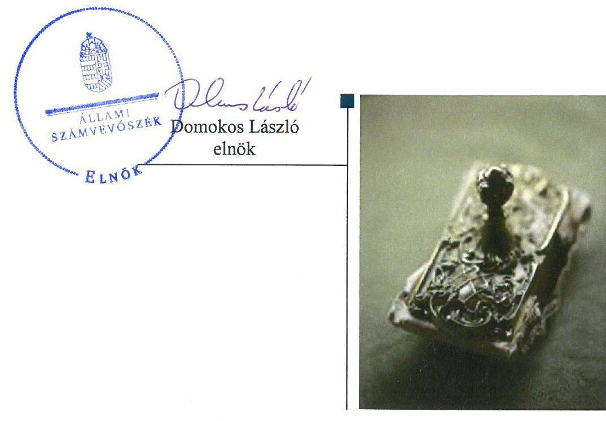
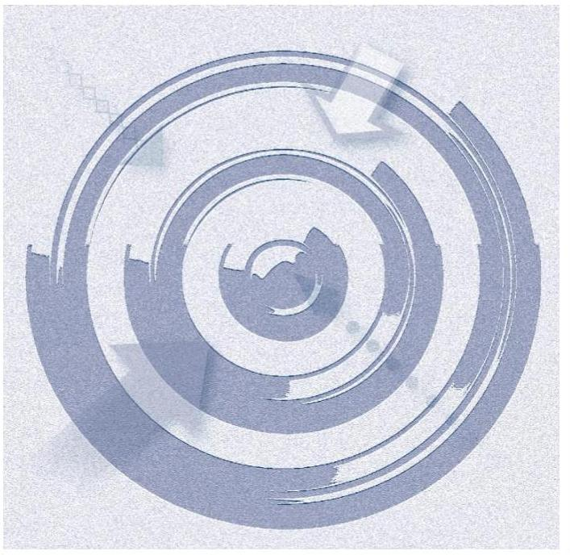
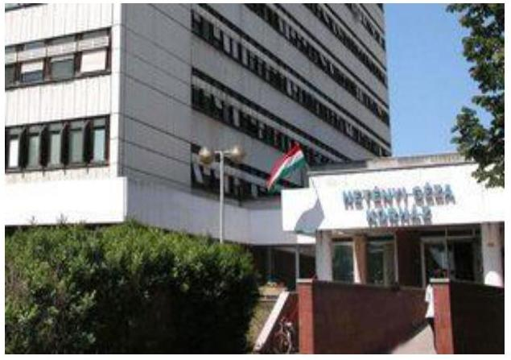
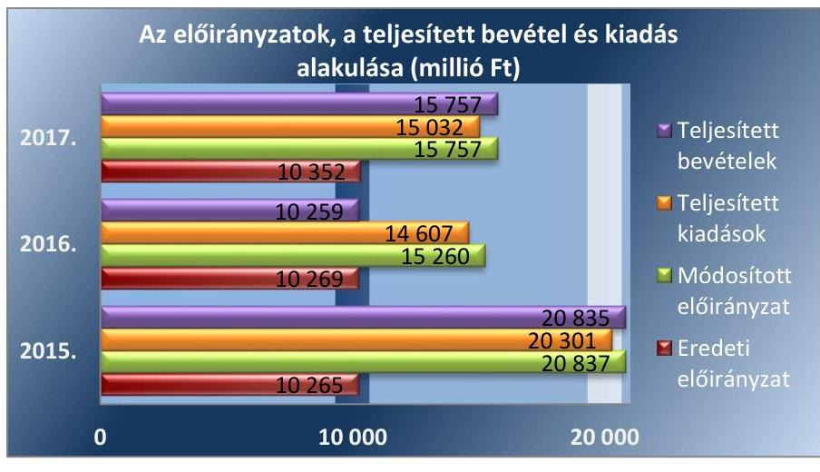
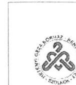
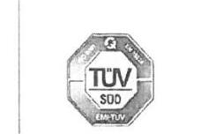
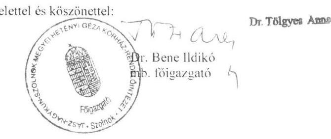
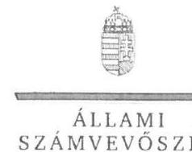
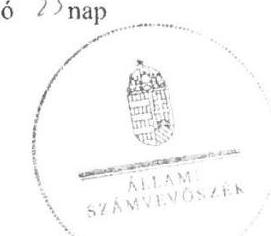
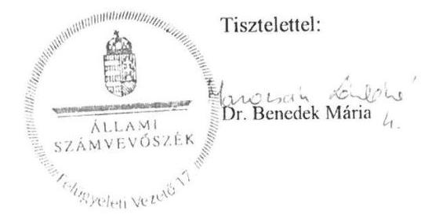

# Jelentés 

## Központi költségvetési szervek ellenőrzése

Jász-Nagykun-Szolnok Megyei Hetényi Géza Kórház - Rendelőintézet 2019.

19180
www.asz.hu

---

# Jelentés 

## Központi költségvetési szervek ellenőrzése

Jász-Nagykun-Szolnok Megyei Hetényi Géza Kórház - Rendelőintézet
2019. 23. hó 10. nap

---

# AZ ELLENŐRZÉST FELÜGYELTE: 

DR. BENEDEK MÁRIA felügyeleti vezető

## AZ ELLENŐRZÉST VEZETTE ÉS A VÉGREHAJTÁSÁÉRT FELELŐS:

VERTKOVCZI MÁRIA ellenőrzésvezető

## A PROGRAM ÖSSZEÁLLÍTÁSÁÉRT FELELŐS:

TÓTPÁL SZABOLCS osztályvezető

IKTATÓSZÁM: EL-0706-139/2019.
TÉMASZÁM: 16
ELLENŐRZÉS-AZONOSÍTÓ SZÁM: V079125

Jelentéseink az Országgyűlés számítógépes hálózatán és az Interneten a www.asz.hu címen is olvashatóak.

---

# TARTALOMJEGYZÉK 

■ ÖSSZEGZÉS ..... 5
■ AZ ELLENŐRZÉS CÉLJA ..... 6
■ AZ ELLENŐRZÉS TERÜLETE ..... 7
■ AZ ELLENŐRZÉS HÁTTERE, INDOKOLTSÁGA ..... 9
■ A JELENTÉS LÉNYEGES KÉRDÉSKÖREI ..... 11
■ AZ ELLENŐRZÉS HATÓKÖRE ÉS MÓDSZEREI ..... 12
■ MEGÁLLAPÍTÁSOK ..... 15
■ JAVASLATOK ..... 21
■ MELLÉKLETEK ..... 25
I. sz. melléklet: Értelmező szótár ..... 25
■ FÜGGELÉKEK ..... 29
I. sz. függelék a jelentéshez ..... 29
II. sz. függelék: Észrevételek ..... 30
■ RÖVIDÍTÉSEK JEGYZÉKE ..... 45

---

.

---

# ÖSSZEGZÉS 

A Jász-Nagykun-Szolnok Megyei Hetényi Géza Kórház - Rendelőintézet belső kontrollrendszerének kialakítása és működtetése, a pénzügyi és vagyongazdálkodása nem volt szabályszerű, ezáltal nem volt biztosított az átlátható és elszámoltatható közpénzfelhasználás, a nemzeti vagyonnal való felelős gazdálkodás. A működés során az integritás szemlélet nem érvényesült.

## Az ellenőrzés társadalmi indokoltsága

A központi alrendszer részét képező intézmények alapvető rendeltetése a közfeladatok ellátásának biztosítása. A közpénzek felhasználásában meghatározó, központi alrendszerbe tartozó intézmények pénzügyi és vagyongazdálkodási tevékenységük és/vagy feladatellátásuk súlya miatt jelentős hatást gyakorolhatnak a költségvetés egyensúlyának fenntartására. Hatással vannak továbbá az állami vagyonnal való gazdálkodás minőségére, a kormányzati (szak)politikák végrehajtására, illetve közfeladat ellátásuk vonatkozásában az állampolgárok életminőségére, jogaik és kötelezettségeik gyakorlására. Indokolt ezért, hogy az Állami Számvevőszék ezen intézmények pénzügyi és vagyongazdálkodását, az esetleges átalakulások szabályszerűségét rendszeresen ellenőrizze.

A Jász-Nagykun-Szolnok Megyei Hetényi Géza Kórház - Rendelőintézet közfeladatot lát el és jelentős mértékű állami vagyont kezel. Az egészségügyi ellátások közfeladat teljesítése folyamatosan a társadalmi érdeklődés középpontjában áll. A központi költségvetésből az egyik legjelentősebb kiadást az egészségügyi ellátásokra fordított kiadások jelentik, amelyekből a kórházak kapják a legtöbb támogatást.

## Főbb megállapítások, következtetések, javaslatok

A Jász-Nagykun-Szolnok Megyei Hetényi Géza Kórház - Rendelőintézet a belső kontrollrendszer részeként az információs és kommunikációs rendszert szabályszerűen kialakította és működtette. A kontrollkörnyezet kialakítása, az integrált kockázatkezelési rendszer működtetése, a kontrolltevékenységek gyakorlása és a monitoring rendszer működtetése nem volt szabályszerű, így a Kórház belső kontrollrendszere a közpénzekkel és a nemzeti vagyonnal történő szabályszerű gazdálkodást, a beszámolási és adatszolgáltatási kötelezettségek szabályszerű teljesítését nem biztosította.

A Jász-Nagykun-Szolnok Megyei Hetényi Géza Kórház - Rendelőintézet pénzügyi gazdálkodása nem volt szabályszerű, a gazdálkodással kapcsolatos jogkörök gyakorlásának, a kötelezettségvállalás nyilvántartásának, a költségvetési maradvány megállapítás szabálytalanságai miatt, ezáltal a pénzügyi gazdálkodás során sérült az elszámoltathatóság elve. A vagyongazdálkodás nem volt szabályszerű, a beruházások végrehajtása és a vagyon hasznosítása nem a jogszabályi előírások szerint történt, a költségvetési beszámoló mérleg tételeit alátámasztó leltár adatai nem voltak megbízhatóak. A nemzeti vagyon kezelése tekintetében nem érvényesült az átláthatóság Alaptörvényben foglalt elve.

Az integritás kontrollok kiépítettségének alacsony szintje, valamint a kockázatelemzés hiányossága miatt az integritás szemlélet a Jász-Nagykun-Szolnok Megyei Hetényi Géza Kórház - Rendelőintézet működése során nem érvényesült.

Az Állami Számvevőszék az intézkedések megtétele céljából az Állami Egészségügyi Ellátó Központ főigazgatója részére egy, a Jász-Nagykun-Szolnok Megyei Hetényi Géza Kórház - Rendelőintézet főigazgatója részére 18 javaslatot fogalmazott meg.

---

# AZ ELLENŐRZÉS CÉLJA 

AZ ELLENŐRZÉS CÉLJA annak megítélése volt, hogy az ellenőrzött intézményre vonatkozó irányító szervi feladatellátás a jogszabályi előírások betartásával történt-e; az intézménynél a belső kontrollrendszer kialakítása és működtetése szabályszerű volt-e, biztosította-e az átlátható, szabályszerű, gazdaságos, hatékony és eredményes gazdálkodás feltételeit; az intézmény pénzügyi és vagyongazdálkodása megfelelt-e a jogszabályi előírásoknak és belső szabályzatainak; a költségvetési maradvány megállapítása szabályszerűen történt-e. Az ellenőrzés keretében az ÁSZ ${ }^{1}$ értékelte az intézmény korrupciós kockázatainak kezelését szolgáló integritás kontrollok kiépítettségét és az integritás szemlélet érvényesülését, illetve, hogy az ellenőrzött megfelelt-e annak az Alaptörvényben meghatározott alapvetésnek, hogy Magyarország a kiegyensúlyozott, átlátható és fenntartható költségvetési gazdálkodás elvét érvényesíti. Érvényesült-e a nemzeti vagyon kezelésének és védelmének célja, azaz a szervezet vagyona a közérdeket szolgálta, a közös szükségletek kielégítése és a természeti erőforrások megóvása, valamint a jövő nemzedékek szükségleteinek figyelembevétele mellett.

---

# **AZ ELLENŐRZÉS TERÜLETE**

## **Jász-Nagykun-Szolnok Megyei Hetényi Géza Kórház - Rendelőintézet**

A szolnoki székhelyű Jász-Nagykun-Szolnok Megyei Hetényi Géza Kórház – Rendelőintézet a 2015-2017. években gazdasági szervezettel, az előirányzatok felett teljes jogkörrel rendelkező költségvetési szerv volt. Működési és ellátási területét, valamint alaptevékenységét az egészségügyről szóló jogszabályok2 határozták meg. Alapfeladata a járó- és fekvőbetegek diagnosztikus és terápiás szakorvosi ellátása, rehabilitációja és követéses gondozása volt.

Az irányító szervi hatásköröket a Jász-Nagykun-Szolnok Megyei Hetényi Géza Kórház – Rendelőintézet felett az Emberi Erőforrások Minisztériuma gyakorolta az emberi erőforrások minisztere útján. Az egyes fenntartói, valamint az irányítási, középirányítói jogokat 2015. február 28-áig a Gyógyszerészeti és Egészségügyi Minőség- és Szervezetfejlesztési Intézet, 2015. március 1-jétől jogutódja az Állami Egészségügyi Ellátó Központ gyakorolta.

A Jász-Nagykun-Szolnok Megyei Hetényi Géza Kórház önálló jogi személy, előirányzatai fölött teljes jogkörrel rendelkező költségvetési szerv. Áht. szerinti átalakításra a 2015-2017. években nem került sor.

A 2015-2017. években végrehajtott beruházások következtében a Jász-Nagykun-Szolnok Megyei Hetényi Géza Kórház – Rendelőintézet könyvviteli mérleg szerinti vagyona a 2015. január 1-jei 12 709 millió Ft-ról 2017. december 31-ére 16 469 millió Ft-ra, 30%-kal nőtt. A Kórház teljesített költségvetési és finanszírozási bevétele a 2015. évi 20 835 millió Ft-ról a 2017-re 15 757 millió Ft-ra, a teljesített költségvetési és finanszírozási kiadása a 2015. évi 20 301 millió Ft-ról a 2017. évre 15 032 millió Ft-ra csökkent.

A 2015-2017. évekre vonatkozóan az előirányzatok, a teljesített bevétel és kiadás alakulását az 1. ábra mutatja be.

1. ábra

*Forrás: A Jász-Nagykun-Szolnok Megyei Hetényi Géza Kórház – Rendelőintézet éves költségvetési beszámolói*

---

A Jász-Nagykun-Szolnok Megyei Hetényi Géza Kórház - Rendelőintézetet az ellenőrzéssel érintett időszakban főigazgató vezette, a gazdálkodással kapcsolatos feladatokat a gazdasági igazgató közvetlen irányítása alatt működő gazdasági igazgatóság látta el. A Főigazgató személyében 2017. június 1-jével történt változás, a gazdasági igazgató személyében 2015-2017. években nem történt változás. A munkavállalók átlagos statisztikai állományi létszáma a 2015. évben 1604 fő, a 2017. évben 1609 fő volt.

---

# AZ ELLENŐRZÉS HÁTTERE, INDOKOLTSÁGA 

Az államháztartás központi alrendszerének közpénz felhasználása, az intézmények által ellátott közfeladatok sokrétűsége, valamint a feladatellátásához rendelt vagyon nagyságrendje indokolja, hogy az ÁSZ ellenőrzéseket folytasson a pénzügyi és vagyongazdálkodás területén. Az ÁSZ az ellenőrzései során feltárja a gazdálkodást érintő szabályozások esetleges hiányosságait, a szabályozással nem érintett gazdálkodási területeket, rámutathat a vagyongazdálkodási tevékenység - ezen belül a tulajdonosi joggyakorlás és vagyonkezelés - esetleges szabálytalanságaira, értékeli az állami vagyon nyilvántartására és elszámolására vonatkozó eljárásokat.

Az ellenőrzés várhatóan hozzájárul a központi intézmények pénzügyi helyzetének pontosabb megítéléséhez, és a jó gyakorlat kialakításán és terjesztésén keresztül az ellenőrzések elősegíthetik a gazdálkodás szabályszerűségének javítását.

Az ellenőrzések megállapításai támogathatják az ellenőrzött szervezetek szabályszerű gazdálkodását, javaslataival elősegítheti az Alaptörvényben megfogalmazott alapvetések érvényesülését a mindennapi életben a szervezetek szintjén. A központi költségvetés rendszerében zajló folyamatok holisztikus elemzései, a kockázatok folyamatos figyelemmel kísérésének módszerével, az így kiválasztott szervezetek célzott, hatékony ellenőrzéseivel az ÁSZ betölti a legfőbb gazdasági ellenőrző szerv küldetését.

Az ellenőrzés a szervezet kockázatértékelése alapján, az egyedi és lényeges jellemzők figyelembevételével, az ellenőrzésre kiválasztott modullal történt. Az integritás- és belső kontroll modul a központi költségvetési szerv működésének irányítottságát, korrupció elleni védettségét értékeli.

A belső kontrollrendszer kialakítása és működtetése nélkül nem valósítható meg a közpénzek, a közvagyon átlátható, szabályos, gazdaságos, hatékony és eredményes felhasználása. A belső kontrollrendszer azt a célt szolgálja, hogy a költségvetési szervek működésük és gazdálkodásuk során a tevékenységeket szabályszerűen hajtsák végre, teljesítsék elszámolási kötelezettségeiket és megvédjék az erőforrásokat a veszteségektől, a károktól és a nem rendeltetésszerű használattól. A belső kontrollrendszer magában foglalja mindazon elveket, eljárásokat és belső szabályzatokat, melyek biztosítják, hogy a költségvetési szerv valamennyi tevékenysége és célja összhangban legyen a szabályszerűséggel, szabályozottsággal, valamint a gazdaságosság, hatékonyság és eredményesség követelményeivel, az eszközökkel és forrásokkal való gazdálkodásban ne kerüljön sor pazarlásra, visszaélésre, rendeltetésellenes felhasználásra. Megfelelő, pontos és naprakész információk álljanak rendelkezésre a költségvetési szerv működésével kapcsolatosan, és a belső kontrollrendszer harmonizációjára, összehangolására vonatkozó jogszabályok végrehajtásra kerüljenek. Az integritás kontrollok kiépítése, erősítése a szervezet korrupciós kockázatainak kezelését szolgálja. A teljesítménykövetelmények meghatározása és működtetése megalapozhatja a központi költségvetési szervnél a teljesítményellenőrzés lefolytatását.

A központi költségvetési szerveknél az Ávr. ${ }^{3}$ 150. §-a meghatározza azokat az eseteket, amelyeket kötelezettségvállalással terhelt maradványnak

---

kell tekinteni. Az Áhsz. ${ }^{4}$ 14. § (8) bekezdése értelmében, a mérlegben a kötelezettségek között az egységes rovatrend szerinti rovatokhoz kapcsolódóan vezetett nyilvántartási számlákon nyilvántartott végleges kötelezettségvállalásokat, más fizetési kötelezettségeket kell kimutatni mindaddig, amíg azokat pénzügyileg ki nem egyenlítették, el nem engedték vagy egyéb módon nem rendezték. Amennyiben a költségvetési szerv gazdálkodása során a vonatkozó jogszabályokat betartja, év végén a kötelezettségvállalással terhelt maradványon felül nem rendelkezhet ki nem fizetett szállítói kötelezettséggel. Mindezekre tekintettel az ÁSZ kiemelten ellenőrzi a maradvány modul keretében a kötelezettségvállalással terhelt maradvány dokumentumokkal történő alátámasztottságát.

Az egyes ellenőrzések megállapításaival és egy időszak ellenőrzési eredményeinek elemzésével az ÁSZ ráirányíthatja a jogalkotók figyelmét a központi alrendszerben vagy annak egy ágazatában esetlegesen felmerülő pénzügyi, szabályozási feszültségekre. Az elvégzett ellenőrzések során az ÁSZ „jó gyakorlatokat" is azonosíthat, melyeket tanácsadó funkciója keretében szélesebb körben is megismertethet az érintettekkel, ezáltal is hozzájárulva a költségvetési rendszer szabályozott, átlátható, kiegyensúlyozott és fenntartható működéséhez.

---

# A JELENTÉS LÉNYEGES KÉRDÉSKÖREI 

1. Az irányító szerv ellenőrzött költségvetési szervre vonatkozó feladatellátása szabályszerű volt-e?
2. A belső kontrollrendszer kialakítása és működtetése biztosította-e a közpénzekkel és a nemzeti vagyonnal történő szabályszerű gazdálkodást, illetve a beszámolási és adatszolgáltatási kötelezettségek szabályszerű teljesítését?
3. A költségvetési szerv pénzügyi gazdálkodása, a költségvetési maradvány megállapítása szabályszerűen történt-e?
4. A költségvetési szerv vagyongazdálkodása szabályszerű volt-e?
5. A központi költségvetési szervnél alakítottak-e ki a teljesítmény mérésére alkalmas követelményeket?

---

# AZ ELLENŐRZÉS HATÓKÖRE ÉS MÓDSZEREI 

## Az ellenőrzés típusa

Megfelelőségi ellenőrzés.

## Az ellenőrzött időszak

2015-2016. évek, valamint a 2017. év tekintetében a szervezet vagyongazdálkodása, költségvetési maradvány megállapításának, illetve integritás és belső kontroll rendszer ellenőrzése.

## Az ellenőrzés tárgya

A Jász-Nagykun-Szolnok Megyei Hetényi Géza Kórház - Rendelőintézetre vonatkozó irányító szervi feladatok ellátása, a belső kontrollrendszerének kialakítása és működtetése, pénzügyi és vagyongazdálkodása, a költségvetési maradvány megállapításának, elszámolásának jogszabályi előírásoknak való megfelelősége, illetve az integritáskontrollok kiépítettsége, az integritás szemlélet érvényesülése volt.

Az ellenőrzés kiterjedt minden olyan körülményre és adatra, amely az ÁSZ jogszabályban meghatározott feladatainak teljesítéséhez, valamint a program végrehajtása folyamán felmerült újabb összefüggések feltárásához szükséges.

## Az ellenőrzött szervezet

- Jász-Nagykun-Szolnok Megyei
 Hetényi Géza Kórház-Rendelőintézet
- Emberi Erőforrások Minisztériuma, mint irányító szerv
- Állami Egészségügyi Ellátó Központ (2015. február 28-áig Gyógyszerészeti és Egészségügyi Minőség- és Szervezetfejlesztési Intézet), mint középirányító szerv

## Az ellenőrzés jogalapja

Az ellenőrzés jogszabályi alapját az ÁSZ tv. ${ }^{5}$ 1. § (3) bekezdés, 5. § (2)-(3) bekezdései, (4) bekezdés a) pontja és (6) bekezdése, valamint az Áht. 61. § (2) bekezdésének előírásai képezték.

---

# Az ellenőrzés módszerei 

Az ellenőrzésre a szakmai program szempontjai, az ellenőrzött időszakban hatályos jogszabályok, az ellenőrzés szakmai szabályai, a jelen ellenőrzésre irányadó ÁSZ módszertanok figyelembevételével került sor.

Az ÁSZ ellenőrzés ideje alatt az ÁSZ SZMSZ-ének vonatkozó előírásai alapján biztosította Jász-Nagykun-Szolnok Megyei Hetényi Géza Kórház Rendelőintézettel, az Emberi Erőforrások Minisztériumával és az Állami Egészségügyi Ellátó Központtal a kapcsolattartást.

Az ellenőrzési kérdések megválaszolásához szükséges bizonyítékok megszerzése a Jász-Nagykun-Szolnok Megyei Hetényi Géza Kórház - Rendelőintézet, az Emberi Erőforrások Minisztériuma és az Állami Egészségügyi Ellátó Központ által rendelkezésre bocsátott dokumentumokra, adatokra alapozva megfigyelés, szemle (szemrevételezés), kérdésfeltevés (információkérés), mintavételezés, valamint elemző eljárás útján történt.

Az ellenőrzési bizonyítékként felhasználható adatforrások közé tartoztak egyrészt a szakmai program részletes szempontjainál felsorolt adatforrások, másrészt minden egyéb - az ellenőrzés folyamán feltárt, az ellenőrzés szempontjából információt tartalmazó - dokumentum.

Az ellenőrzés lefolytatásához az ellenőrzött szervezet a tanúsítványok kitöltésével, valamint az ÁSZ által kért dokumentumok megküldésével szolgáltatott adatokat, amelyek valódiságát és teljes körűségét az ellenőrzött szervezet vezetője által tett teljességi és hitelességi nyilatkozat igazolta. Az így rendelkezésre bocsátott adatok, információk kontrollja az ellenőrzés keretében történt.

A központi költségvetési szerv belső kontrollrendszere egyes pilléreinek kialakítására és működtetésére vonatkozó értékelés:
$\longrightarrow$ „szabályszerű", amennyiben az értékelt területen az elért „igen" válaszok százalékban kifejezett, egész számra kerekített aránya legalább $85 \%$,
$\longrightarrow$ „nem szabályszerű", ha nem éri el a 85\%-ot,
A központi költségvetési szerv belső kontrollrendszerének összesített értékelése az egyes részterületek esetében kapott megfelelőségi arányok számtani átlaga alapján történik és megegyezik a pillérenként (kontrollterületenként) alkalmazott százalékos értékelésekkel, a következő eltérésekkel: a kontrollrendszer egésze esetében a „szabályszerű" értékelésnek a százalékos értéken felül további feltétele, hogy egyik kontrollterület sem kaphat „nem szabályszerű" értékelést.

Az ÁSZ statisztikai módszereken alapuló mintavételt alkalmaz.
A kiadások és a bevételek ellenőrzésére a 2015-2017. év vonatkozásában került sor. A kiadások (felhalmozási kiadások, dologi kiadások) és bevételek (értékesítésből és bérbeadásból származó bevételek) esetében az ellenőrzés azokra a legnagyobb értékű tételekre - a lényeges sokaságra terjedt ki, melyek összértéke eléri a teljes sokaság összértékének 50\%-át.

A 2015-2017. évi bevételek esetében az ÁSZ a lényeges sokaságot tételesen ellenőrizte. A 2015-2017. évi kiadások elszámolásának szabályszerűségét az ÁSZ a lényeges sokaságból véletlen mintavételi eljárással kiválasztott tételek alapján ellenőrizte.

---

Az ÁSZ a 2017. évi beruházások, felújítások végrehajtásának szabályszerűségének ellenőrzését a felhalmozási kiadások esetében, valamint a feladatellátást szolgáló állami vagyontárgyak felhasználásának szabályszerűségét véletlen mintavétellel kiválasztott tételek alapján ellenőrizte.

Az ÁSZ a 2017. évi év végi kifizetetlen szállítói tartozások tekintetében a kötelezettségvállalás, valamint annak nyilvántartásba vételének szabályszerűségét véletlen mintavétellel kiválasztott tételek alapján ellenőrizte.

Az ÁSZ mintavétellel ellenőrzött területek esetében minden egyes tétel vonatkozásában a használat, az elszámolás és értékelés szabályszerűségére vonatkozó kérdéseket tett fel. Szabályszerűnek értékelt egy ellenőrzött területet, amennyiben 95\%-os bizonyossággal az ellenőrzött sokaságban az átlagos hibaarány legfeljebb 10\%, nem szabályszerűnek, amennyiben 10\%-nál magasabb arányt képviselt.

---

# 1. Az irányító szerv ellenőrzött költségvetési szervre vonatkozó feladatellátása szabályszerű volt-e? 

Összegző megállapítás

Az Irányító szerv ${ }^{7}$ és a Középirányító szerv ${ }^{8}$ a Kórházra ${ }^{9}$ vonatkozó feladatellátása a 2015-2016. években szabályszerű volt.

Az Alapító okiratról ${ }^{10}$ az Irányító szerv az Ávr.-ben előírtakkal összhangban gondoskodott. Az Alapító Okirat az Ávr. előírásai szerint tartalmazta a Kórház közfeladatát, alaptevékenységét, annak kormányzati funkció szerinti megjelölését, fő tevékenységének államháztartási szakágazati besorolását. A Kórház SZMSZ ${ }^{11}$-ét a középirányító szerv jóváhagyta.

Az elemi költségvetés bevételei és kiadásai megállapításához a tervezési követelményeket az Ávr. alapján az Irányító szerv meghatározta. Az Áht. és az Áhsz. ${ }^{12}$ előírásai alapján jóváhagyta a Kórház éves költségvetési beszámolóit, elemi költségvetéseit. Az Ávr. előírásainak eleget téve gondoskodott a költségvetési maradvány megállapításáról.

A munkáltatói jogkörgyakorlás az Irányító szerv részéről a 2015-2016. években szabályszerű volt. A főigazgató és a gazdasági vezető a jogszabályi előírások szerinti kinevezéssel rendelkezett a 2015-2016. években.

## 2. A belső kontrollrendszer kialakítása és működtetése biztosította-e a közpénzekkel és a nemzeti vagyonnal történő szabályszerű gazdálkodást, illetve a beszámolási és adatszolgáltatási kötelezettségek szabályszerű teljesítését?

Összegző megállapítás

A Kórház belső kontrollrendszerének kialakítása és működtetése nem biztosította a közpénzekkel és a nemzeti vagyonnal történő szabályszerű gazdálkodást, illetve a beszámolás és adatszolgáltatási kötelezettségek szabályszerű teljesítését a 2015-2017. években.

A KONTROLLKÖRNYEZET KIALAKÍTÁSA nem volt szabályszerű a 2015-2017. években. A kontrollkörnyezet kialakításával kapcsolatban feltárt hiányosságokat az 1. táblázat tartalmazza.

---

# A KONTROLLKÖRNYEZET KIALAKÍTÁSÁVAL KAPCSOLATBAN FELTÁRT HIÁNYOSSÁGOK 

| Sorszám | Részmegállapítás | Megjegyzés |
| :--: | :--: | :--: |
| 1. | A Főigazgató a Bkr. 6. § (1) bekezdés c) pontjának előírásai ellenére nem alakított ki olyan kontrollkörnyezetet 2015. január 1-jétől 2017. március 31-éig, amelyben meghatározottak az etikai elvárások a szervezet minden szintjén. | A Főigazgató 2017. április 1-jétől az Etikai kódexben ${ }^{13}$ meghatározta Bkr.-ben előírt etikai elvárásokat. |
| 2. | A Főigazgató 2016. október 1-jétől 2017. április 30-áig a Bkr. 6. § (4) bekezdésben foglaltak ellenére nem szabályozta az integritást sértő események kezelésének eljárásrendjét. | A Főigazgató 2017. május 1-jétől a Bkr.-ben előírtak szerint szabályozta a szervezeti integritást sértő események kezelésének eljárásrendjét ${ }^{14}$. |
| 3. | A Főigazgató a 2015-2017. években az Áhsz. 22. § 2) bekezdés b) pontjában foglaltak ellenére a leltározási és leltárkészítési szabályzatban nem rögzítette a használt, de a mérlegben értékkel nem szereplő immateriális javak, tárgyi eszközök, készletek leltározási módját. | A Főigazgató a 2015-2017. években elkészítette a Leltározási szabályzatát ${ }^{15}$, de az nem tartalmazta az Áhsz.-ben előírtakat. |
| 4. | A Főigazgató a Számv. tv. ${ }^{16}$ 14. § (8) bekezdésben foglaltak ellenére a pénzkezelési szabályzatban ${ }^{17}$ nem rendelkezett a készpénzállomány ellenőrzésekor követendő eljárásról. |  |
| 5. | A Főigazgató a Számv. tv. 14. § (5) bekezdés c) pontja előírásai ellenére a 2015-2016. években számviteli politika ${ }^{18}$ keretében nem készítette el az önköltségszámítás rendjére vonatkozó belső szabályzatot. | A Főigazgató a Számv. tv. előírásai szerinti Önköltségszámítási szabályzatot 2017. január 1-jén léptette hatályba. |
| 6. | A Főigazgató által hatályba léptetett Számlarend ${ }^{19}$ a 2015-2016. években a Számv. tv. 161. § (2) bekezdés d) pontjában foglaltak ellenére nem tartalmazta a számlarendben foglaltakat alátámasztó bizonylati rendet. | A Főigazgató a Számv. tv.-ben előírtak alapján a Bizonylati rendeletet ${ }^{20}$ 2017. január 1-jétől léptette hatályba. |
| 7. | A Főigazgató a 2015-2017. években az Áhsz. 51. § (3) bekezdésében foglaltak ellenére nem szabályozta a számlarendben a részletező nyilvántartások és a kapcsolódó könyvviteli és nyilvántartási számlákkal való egyeztetést, annak dokumentálását, valamint a részletező nyilvántartások és az egységes rovatrend rovataihoz kapcsolódóan vezetett nyilvántartási számlák adataiból a pénzügyi könyvvezetéshez készült összesítő bizonylatok (feladások) elkészítésének rendjét, az összesítő bizonylat tartalmi és formai követelményeit. |  |
| 8. | A Főigazgató, mint az őrzésért felelős, a 2015-2017. években a Vnytv. 11. § (6) bekezdésében foglalt előírás ellenére szabályzatban nem állapította meg a vagyonnyilatkozatban foglalt személyes adatok védelmére vonatkozó további szabályokat. |  |

A Kórház a Bkr. előírása szerint 2016. szeptember 30-áig szabályozta a Kórház szabálytalanság kezelésének eljárásrendjét. A Kórház a Számv. tv. előírásai szerint elkészítette a 2015-2017. években hatályos Értékelési szabályzatát ${ }^{21}$.

A KOCKÁZATKEZELÉSI RENDSZER működtetése a 2015-2017. években nem volt szabályszerű. A Kockázatkezelési, illetve integrált kockázatkezelési rendszer működtetésével kapcsolatban feltárt hiányosságokat a 2. táblázat tartalmazza.
2. táblázat

## A KOCKÁZATKEZELÉSI RENDSZER MŰKÖDTETÉSÉVEL KAPCSOLATBAN FELTÁRT HIÁNYOSSÁGOK

Sorszám Részmegállapítás
Megjegyzés

1. A Főigazgató a Bkr. 7. § (1) bekezdésében foglaltak ellenére nem működtetett 2016. szeptember 30-áig kockázatkezelési rendszert, 2016. október 1-jétől 2017. december 31-éig integrált kockázatkezelési rendszert.
2. A Főigazgató a Bkr. 7. § (4) bekezdésében foglaltak ellenére az integrált kockázatkezelési rendszer koordinálására 2016. október 1-jétől nem jelölt ki szervezeti felelőst.

---

# A KONTROLLTEVÉKENYSÉGEK GYAKORLÁSA nem 

volt szabályszerű a 2015-2017. években. A kiadások elszámolása nem felelt meg a jogszabályi előírásoknak, nem volt igazolt, hogy a Kórház szabad előirányzat terhére vállalt kötelezettséget. A kontrolltevékenységek szabályozásával, gyakorlásával kapcsolatban feltárt hiányosságokat az 3. táblázat tartalmazza.
3. táblázat

## A KONTROLLTEVÉKENYSÉGEK SZABÁLYOZÁSÁVAL, GYAKORLÁSÁVAL KAPCSOLATBAN FELTÁRT HIÁNYOSSÁGOK

Sorszám | Részmegállapítás | Megjegyzés

1. A Főigazgató 2015. január 1-je és 2016. január 27-e között az Ávr. 13. § (2) bekezdés a) pontjában rögzített előírások ellenére nem rendezte belső szabályzatban a kötelezettségvállalás, ellenjegyzés, teljesítés igazolása, érvényesítés, utalványozás gyakorlásának módjával, eljárási és dokumentációs részletszabályaival, valamint az ezeket végző személyek kijelölésének rendjével kapcsolatos belső előírásokat, feltételeket.
2. A Kórháznál a 2016-2017. években az Áht. 38. § (1) bekezdésében foglaltak ellenére a teljesítést nem a kötelezettségvállaló, vagy az általa írásban kijelölt személy igazolta, illetve a 2016. évben teljesítés igazolás hiányában történt a kiadás elszámolása, kifizetése.
3. A Kórház által a kötelezettségvállalásra, pénzügyi ellenjegyzésre, teljesítésigazolásra, érvényesítésre és utalványozásra jogosult személyek aláírás mintáiról vezetett nyilvántartás a 2016-2017. években az Ávr. 60. § (3) bekezdésében foglaltak ellenére nem volt naprakész.
4. A Főigazgató az Ávr. 56. § (1) bekezdésében előírtak ellenére a 2015-2017. években nem gondoskodott a kötelezettségvállalást követően annak az államháztartási számviteli kormányrendelet szerinti nyilvántartásba vételéről.
5. A Kórház a 2016. évben a Számv. tv. 165. § (1)-(2) bekezdéseiben foglaltak ellenére a számviteli (könyvviteli) nyilvántartásokba szabályszerűen kiállított bizonylat hiányában jegyzett be adatokat.

Bizonylat hiányában az elszámolt könyvelési tétel valódisága, a feladatellátás finanszírozása nem igazolt, a vagyon felhasználása nem elszámoltatható. Teljesítés igazolás hiányában az elszámolt könyvelési tételek értékének valódisága nem bizonyított, a feladatellátás finanszírozása nem igazolt, nyilvántartása nem megalapozott.

AZ INFORMÁCIÓS ÉS KOMMUNIKÁCIÓS rendszer működtetése a 2015-2017. években szabályszerű volt. A Kórház Főigazgatója a Bkr. szerint kialakította a szervezeten belüli és kívüli információs rendszert, meghatározta a beszámolási szinteket, határidőket, módokat, és a gyakorlatban működtette azt. A Kórház főigazgatója a kötelezően közzéteendő adatok nyilvánosságra hozatalának, és a közérdekű adatok megismerésére irányuló igények teljesítésének rendjét, továbbá az adatvédelmi és adatbiztonsági szabályzatot az Info tv. ${ }^{23}$ és lkr. ${ }^{24}$ előírásai szerint szabályozta.

A MONITORING RENDSZER MŰKÖDTETÉSE nem volt szabályszerű a 2015-2017. években.

A Főigazgató a 2015-2017. években a Bkr.-ben előírtak alapján kialakította a Kórház tevékenységének, céljainak nyomon követési rendszerét,

---

belső ellenőrzés útján gondoskodott a monitoring rendszer működtetéséről. A monitoring rendszerrel kapcsolatban feltárt hiányosságokat a 4. táblázat
 mutatja.
4. táblázat

# A MONITORING RENDSZER MŰKÖDTETÉSÉVEL KAPCSOLATBAN FELTÁRT HIÁNYOSSÁGOK 

Sorszám Részmegállapítás
Megjegyzés

1. A Kórház belső ellenőrzési vezetője a 2015. évben a Bkr. 22. § (1) bekezdés b) pontjában foglaltak ellenére a Főigazgató által jóváhagyott éves ellenőrzési tervekben meghatározott ellenőrzéseket nem hajtotta végre, valamint a 2016-2017. évekre vonatkozóan a Főigazgató által jóváhagyott, kockázatelemzéssel alátámasztott stratégiai és éves ellenőrzési tervet nem állított össze.
2. A Főigazgató 2017. évre vonatkozóan a Bkr. 11. § (2) bekezdésében előírtak ellenére a belső kontrollrendszer minőségének értékeléséről szóló nyilatkozatát nem küldte meg az irányító szerv részére.

Forrás: ÁSZ

A Főigazgató 2015-2017. években a Bkr. 1. mellékletében foglaltak alapján nyilatkozott arról, hogy gondoskodott a Kórház belső kontrollrendszere kialakításáról, valamint szabályszerű, eredményes és hatékony működésről. Az ÁSZ ellenőrzése azonban nem igazolta a Kórház belső kontroll rendszerének szabályszerű, eredményes és hatékony működését, mivel a kontrollkörnyezet kialakítása, a kockázatkezelési és integrált kockázatkezelési rendszer működtetése, a kontroltevékenységek gyakorlása és a monitoring rendszer működtetése a 2015-2017. években nem volt szabályszerű, így a belső kontrollrendszer nem biztosította a közpénzekkel és a nemzeti vagyonnal történő szabályszerű gazdálkodást, illetve a beszámolási és adatszolgáltatási kötelezettségek szabályszerű teljesítését.

A Kórháznál a szabályozási hiányosságok következtében a jogszabályokban előírt kontrollok kiépítettségének szintje nem támogatta az integritás elvű működést. A kockázatelemzés hiányosságai miatt az integritás kontrollok fejlesztése és működtetése nem volt támogatott. A Kórház csak a leglényegesebb integritást erősítő, de kötelezően nem előírt kontrollokat működtette.

## 3. A költségvetési szerv pénzügyi gazdálkodása, a költségvetési maradvány megállapítása szabályszerűen történt-e?

## Összegző megállapítás

A Kórház pénzügyi gazdálkodása, a költségvetési maradvány megállapítása nem szabályszerűen történt a 2015-2017. években.

A Kórház pénzügyi elszámolása, gazdálkodása, a költségvetési maradvány megállapítása nem volt szabályszerű.

A 2015-2016. évi előirányzat-maradvány megállapítása a kötelezettségek nyilvántartásának hiányossága miatt nem felelt meg a jogszabályi előírásoknak, a nyilvántartás hiányosságai miatt nem volt alátámasztott a Kórház kötelezettségekkel terhelt tárgyévi előirányzat-maradvány kimutatása.

A 2017. évi költségvetési maradványt a költségvetési beszámolóban a Kórház nem az Áhsz.-ben előírtak alapján mutatta ki, mivel a módosított

---

# A KÖLTSÉGVETÉSI MARADVÁNY MEGÁLLAPÍTÁSÁVAL KAPCSOLATBAN FELTÁRT HIÁNYOSSÁGOK 

| Sorszám | Részmegállapítás | Megjegyzés |
| :--: | :--: | :--: |
| 1. | A Kórház kötelezettségvállalással terhelt maradvány kimutatása alátámasztásához vezetett részletező nyilvántartása a 2015-2017. években nem felelt meg az Áhsz. 39. § (3) bekezdésében foglaltak ellenére az Áhsz. 14. melléklet II/4 a), c), g) pontjaiban meghatározott tartalmi követelményeknek. |  |
| 2. | A Kórház 2017. évben az előirányzatokról vezetett nyilvántartása nem felelt meg az Áhsz 39. § (3) bekezdésben foglaltak ellenére az Áhsz. 14. melléklet I/2. c) pontjában meghatározott tartalmi előírásoknak. |  |
| 3. | A 2017. évben a Kórház az Áht. 36. § (1) bekezdésében foglaltakat megsértve a szabad előirányzat mértékét meghaladóan vállalt kötelezettséget, mivel az Áhsz. 53. § (4) bekezdésében foglaltak ellenére az Áhsz. 17. melléklet 1. a) pontban előírt azon kötelezettségét nem biztosította, hogy a költségvetési számvitelen belül a gazdálkodási szabályokból adódóan a 05. számlacsoportban vezetett nyilvántartási számlákon belül, az előirányzatok nyilvántartására vezetett számlák egyenlegét ne haladja meg a költségvetési évben esedékes kötelezettségek nyilvántartására szolgáló számlák egyenlege. | A 2017. évben a Kórház költségvetési kiadásainak éves költségvetési beszámolóban rögzített módosított költségvetési kiadási előirányzata 15406 millió Ft, míg a költségvetési évben esedékes és végleges kötelezettségvállalások együttes összegének egyenlege 16571 millió Ft volt, amely a módosított költségvetési kiadási előirányzatot 1164 millió Ft-tal meghaladta. |

## 4. A költségvetési szerv vagyongazdálkodása szabályszerű volt-e?

## Összegző megállapítás

A Kórház vagyongazdálkodása a 2015-2017. években nem volt szabályszerű.

A 2015-2017. években a beruházások végrehajtása, a 2017. évben a vagyonelemek hasznosítása nem volt szabályszerű. A vagyongazdálkodással kapcsolatban feltárt hiányosságokat a 6. táblázat mutatja.
6. táblázat

## A VAGYONGAZDÁLKODÁSSAL KAPCSOLATBAN FELTÁRT HIÁNYOSSÁGOK

| Sorszám | Részmegállapítás | Megjegyzés |
| :--: | :--: | :--: |
| 1. | A Kórház a 2017. évben a Vtvr. 2. § (3) bekezdésében előírtak ellenére állami vagyon létrejöttét eredményező tárgyi eszköz beszerzésekről (állami vagyon keletkezéséről), a Vtvr. mellékletének II.3. pontjában meghatározott tételes adatszolgáltatást nem teljesítette. | A Kórház a 2015-2016. években eleget tett a Vtvr.-ben foglalt adatszolgáltatási kötelezettségének. |
| 2. | A Kórház 2015-2017. években jogi személlyel kötött visszterhes szerződései az Ávr. 50. § (1a) bekezdésében előírtak ellenére nem tartalmazták a szervezet képviselőjének nyilatkozatát arra vonatkozóan, hogy átlátható szervezetnek minősül. |  |
| 3. | A Kórház a Számv. tv. 165. § (2) bekezdésében foglaltak ellenére a 2015-2017. években a vagyonelemekben bekövetkezett változást a számviteli nyilvántartásban nem szabályszerűen kiállított bizonylat alapján rögzítette. |  |

Forrás: ÁSZ

---

A MÉRLEG TÉTELEINEK ALÁTÁMASZTÁSÁHOZ a Számv. tv.-ben foglaltakkal összhangban elkészített leltár a mérleg fordulónapján meglévő eszközöket és forrásokat tartalmazta mennyiségben és értékben, azonban a kontrolltevékenységek gyakorlása és a költségvetési maradvány megállapítása során feltárt szabálytalanságok miatt a leltár adatai nem voltak megbízhatóak.

A Kórház vagyonkezelési szerződése ${ }^{25}$ a vagyonkezelt eszközök tekintetében az Nvtv. ${ }^{26}$ és Vtvr ${ }^{27}$. előírásaival összhangban állt. A Kórház Vtvr.-ben előírtak alapján rendelkezett vagyonnyilvántartással. A 2015-2017. években a mérlegben szereplő eszközök év végi értékelése, a 2015., 2016. években a vagyonhasznosítás szabályszerű volt.

# 5. A központi költségvetési szervnél alakítottak-e ki a teljesítmény mérésére alkalmas követelményeket? 

## Összegző megállapítás

A Kórháznál a valós teljesítmény mérésének feltételei nem álltak fenn.

A teljesítmény mérésre alkalmas követelményeket a Főigazgató kialakította, a szervezeti célok elérését szolgáló feladatokat meghatározta, azonban a belső kontrollrendszer szabálytalan működése következtében az adatok megbízhatóságának hiánya miatt, a valós teljesítmény mérésének feltételei nem álltak fenn.

---

# JAVASLATOK 

Az ÁSZ tv. 33. § (1) bekezdésében foglaltak értelmében az ellenőrzött szervezet vezetője köteles a jelentésben foglalt megállapításokhoz kapcsolódó intézkedési tervet összeállítani és azt a jelentés kézhezvételétől számított 30 napon belül az ÁSZ részére megküldeni. Amennyiben az ellenőrzött szervezet vezetője nem küldi meg határidőben az intézkedési tervet, vagy továbbra sem elfogadható intézkedési tervet küld, az Állami Számvevőszék elnöke az ÁSZ tv. 33. § (3) bekezdése a) és b) pontjaiban foglaltakat érvényesítheti.

## az ÁEEK főigazgatójának

1. Tegyen intézkedéseket a feltárt hiányosságok és/vagy szabálytalanságok tekintetében a felelősség tisztázása érdekében, és szükség szerint intézkedjen a felelősség érvényesítéséről.
(1. táblázat 3-4. és 7-8.; 2. táblázat 1-2.; 3. táblázat 2-5.; 4. táblázat 1-2.; 5. táblázat 1-3.; 6. táblázat 1-3. számú megállapítások alapján)

## a Kórház főigazgatójának

1. Intézkedjen az Áhsz. előírásának megfelelően a használt, de a mérlegben értékkel nem szereplő immateriális javak, tárgyi eszközök, készletek leltározási módja írásban történő rögzítéséről a leltározási és leltárkészítési szabályzatban.
(1. táblázat 3. sz. megállapítás alapján)
2. Rendelkezzen pénzkezelési szabályzatban a Számv. tv. előírásának megfelelően a készpénzállomány ellenőrzésekor követendő eljárásról.
(1. táblázat 4. sz. megállapítás alapján)
3. Intézkedjen az Áhsz. előírásának megfelelően a részletező nyilvántartások és a kapcsolódó könyvviteli és nyilvántartási számlákkal való egyeztetés, annak dokumentálása, valamint a részletező nyilvántartások és az egységes rovatrend rovataihoz kapcsolódóan vezetett nyilvántartási számlák adataiból a pénzügyi könyvvezetéshez készült összesítő bizonylatok (feladások) elkészítésének rendje, az összesítő bizonylat tartalmi és formai követelményei számlarendben történő szabályozásáról.
(1. táblázat 7. sz. megállapítás alapján)

---

4. Intézkedjen a Vnytv. előírásának megfelelően a vagyonnyilatkozatban foglalt személyes adatok védelmére vonatkozó további szabályok szabályzatban történő megállapításáról.
(1. táblázat 8. sz. megállapítás alapján)
5. Intézkedjen a Bkr. előírásának megfelelő integrált kockázatkezelési rendszer működtetéséről.
(2. táblázat 1. sz. megállapítás alapján)
6. Intézkedjen a Bkr. előírásának megfelelően az integrált kockázatkezelési rendszer koordinálására szervezeti felelős kijelöléséről.
(2. táblázat 2. sz. megállapítás alapján)
7. Intézkedjen, hogy a gazdálkodási jogkörök gyakorlása során teljesítésigazolásra az Ávr. előírásának megfelelően kerüljön sor.
(3. táblázat 2. sz. megállapítás alapján)
8. Intézkedjen az Ávr. előírásának megfelelően a gazdálkodási jogkörök gyakorlására jogosult személyek aláírás-mintáiról naprakész nyilvántartás vezetéséről.
(3. táblázat 3. sz. megállapítás alapján)
9. Gondoskodjon az Ávr. előírásának megfelelően a kötelezettségvállalást követően haladéktalanul annak az államháztartási számviteli kormányrendelet szerint nyilvántartásba vételéről.
(3. táblázat 4. sz. megállapítás alapján)
10. Intézkedjen arról, hogy a Számv. tv. előírásainak megfelelően az adatokat a számviteli (könyvviteli) nyilvántartásokba csak szabályszerűen kiállított bizonylat alapján jegyezzék be.
(3. táblázat 5. sz. megállapítás alapján)
11. Gondoskodjon az Bkr. előírásának megfelelően a kockázatelemzéssel alátámasztott stratégiai és éves ellenőrzési tervek belső ellenőrzési vezető általi összeállításáról, valamint a tervek végrehajtásáról.
(4. táblázat 1. sz. megállapítás alapján)

---

12. Intézkedjen a Bkr. előírásának megfelelően a Kórház belső kontrollrendszerének minőségét értékelő nyilatkozat irányító szerv részére történő megküldéséről az éves költségvetési beszámolóval együtt.
(4. táblázat 2. sz. megállapítás alapján)
13. Intézkedjen a kötelezettségvállalással terhelt maradvány kimutatás alátámasztásához az Áhsz. által előírt kötelező minimum tartalmú részletező nyilvántartás vezetéséről.
(5. táblázat 1. sz. megállapítás alapján)
14. Intézkedjen az előirányzatokról vezetett nyilvántartásnak az Áhsz. előírásainak megfelelő tartalmú vezetéséről.
(5. táblázat 2. sz. megállapítás alapján)
15. Intézkedjen
a) a költségvetési számvitelen belül a gazdálkodási szabályokból adódóan az Áhsz. 17. melléklet 1. a) pontjában előírt kötelezettség betartásáról, továbbá arról, hogy
b) az Áht. előírásainak megfelelően kötelezettségvállalásra csak szabad előirányzat mértékéig kerüljön sor.
(5. táblázat 3. sz. megállapítás alapján)
16. Intézkedjen az állami vagyon létrejöttét eredményező tárgyi eszköz beszerzésekről a Vtvr.-ben foglaltaknak megfelelő adatszolgáltatás teljesítéséről.
(6. táblázat 1. sz. megállapítás alapján)
17. Gondoskodjon az Ávr. előírásának megfelelően arról, hogy a megkötött visszterhes szerződések tartalmazzák a szervezet képviselőjének nyilatkozatát arra vonatkozóan, hogy átlátható szervezetnek minősül.
(6. táblázat 2. sz. megállapítás alapján)
18. Gondoskodjon a Számv. tv-ben foglaltak alapján a vagyonelemekben bekövetkezett változások szabályszerűen kiállított bizonylat alapján történő rögzítéséről a számviteli nyilvántartásban.
(6. táblázat 3. sz. megállapítás alapján)

---

.

---

# MELLÉKLETEK 

- I. SZ. MELLÉKLET: ÉRTELMEZŐ SZÓTÁR
állami vagyon
állami vagyonnak minősül:
a) az állam tulajdonában lévő dolog, valamint a dolog módjára hasznosítható természeti erő,
b) az a) pont hatálya alá nem tartozó mindazon vagyon, amely vonatkozásában törvény az állam kizárólagos tulajdonjogát nevesíti,
c) az állam tulajdonában lévő tagsági jogviszonyt megtestesítő értékpapír, illetve az államot megillető egyéb társasági részesedés,
d) az államot megillető olyan immateriális, vagyoni értékkel rendelkező jogosultság, amelyet jogszabály vagyoni értékű jogként nevesít. (Forrás: Vtv. 1. § (2) bekezdése)
állami vagyon használója Az a természetes vagy jogi személy, jogi személyiséggel nem rendelkező szervezet, aki, vagy amely törvény vagy szerződés alapján, bármely jogcímen (bérlet, haszonbérlet, használat stb.) állami vagyont birtokol, használ, szedi annak hasznait, hasznosít, ide nem értve a haszonélvezőt, a vagyonkezelőt és a tulajdonosi jogok gyakorlóját. (Forrás: Vtvr. 1. § (7) bekezdés a) pontja)
állami vagyon hasznosítása Az állami vagyont az MNV Zrt. maga kezeli, vagy szerződés - így különösen bérlet, haszonbérlet, megbízás - alapján központi költségvetési szervnek, természetes vagy jogi személynek, vagy jogi személyiséggel nem rendelkező gazdálkodó szervezetnek hasznosításra átengedi.
(Forrás: Vtv. 23. § (1) bekezdése, hatályos 2012. január 1-jétől)
Az állami vagyonnal a tulajdonosi joggyakorló maga gazdálkodik, vagy szerződés - így különösen bérlet, haszonbérlet, megbízás - alapján hasznosításra
 átengedi, illetőleg vagyonkezelésbe, haszonélvezetbe adja. (Forrás: Vtv. 23. § (1) bekezdése, hatályos 2013. június 28-ától)
Az állami vagyont az MNV Zrt. maga kezeli, vagy szerződés – így különösen bérlet, haszonbérlet, megbízás – alapján központi költségvetési szervnek, természetes vagy jogi személynek, vagy jogi személyiséggel nem rendelkező gazdálkodó szervezetnek hasznosításra átengedi. Az állami vagyonra vonatkozóan az MNV Zrt. kizárólag az Nvtv.-ben meghatározott személyekkel köthet vagyonkezelési szerződést. (Forrás: Vtv. 27. § (1) bekezdése, hatályos 2012. január 1-jétől)
ÁSZ Integritás Projekt Az ÁSZ 2011-ben indította el a közintézmények integritását vizsgáló és fejlesztő kérdőíves kutatását, melynek hétéves felmérési időszaka 2017. évben zárult le. Az ÁSZ az Integritás felmérés keretében 2017. évben hetedik alkalommal értékelte a közszféra intézményeinek korrupciós kockázatait, illetve a korrupció ellen védelmet biztosító kontrollok kiépítettségét. (Forrás: https://asz.hu/tanulmanyok-2017-ev Elemzés a közszféra integritás helyzetéről 2017. Vezetői összefoglaló 4. oldal)
átalakítás
belső ellenőrzés

A költségvetési szerv általános jogutódlással történő megszüntetése átalakítással történhet. Az átalakítás lehet egyesítés vagy különválás. Az egyesítés lehet beolvadás vagy összeolvadás. (2014. december 31-ig, Áht. 9/A. § (3) és (4) bekezdés, 2015. január 1-jétől Áht. 11. § (2) bekezdés)
Független, tárgyilagos bizonyosságot adó és tanácsadó tevékenység, amelynek célja, hogy az ellenőrzött szervezet működését fejlessze és eredményességét növelje, az ellenőrzött szervezet céljai elérése érdekében rendszerszemléletű megközelítéssel és módszeresen értékeli, illetve fejleszti az ellenőrzött szervezet irányítási és belső kontrollrendszerének hatékonyságát. (Forrás: Bkr. 2. § b) pontja)

---

belső kontrollrendszer

Belső kontrollrendszer területei
ellenőrzési nyomvonal
hasznosítás
információs és kommunikációs rendszer
integritás
irányító szerv/felügyeleti szerv
kockázat
kockázatkezelési rendszer
kontrollkörnyezet

A belső kontrollrendszer a kockázatok kezelése és tárgyilagos bizonyosság megszerzése érdekében kialakított folyamatrendszer, amely azt a célt szolgálja, hogy a működés és gazdálkodás során a tevékenységeket szabályszerűen, gazdaságosan, hatékonyan, eredményesen hajtsák végre, az elszámolási kötelezettségeket teljesítsék, megvédjék az erőforrásokat a veszteségektől, károktól és nem rendeltetésszerű használattól. (Forrás: Áht. 69. § (1) bekezdése)
A kontrollkörnyezet, a kockázatkezelési rendszer, a kontrolltevékenységek, az információs és kommunikációs rendszer, valamint a nyomon követési (monitoring) rendszer. (Forrás: Bkr. 3. §-a)
Az ellenőrzési nyomvonal a költségvetési szerv működési folyamatainak szöveges, táblázatokkal vagy folyamatábrákkal szemléltetett leírása, amely tartalmazza különösen a felelősségi és információs szinteket és kapcsolatokat, irányítási és ellenőrzési folyamatokat, lehetővé téve azok nyomon követését és utólagos ellenőrzését. (Forrás: Bkr. 6. § (3) bekezdés)
A nemzeti vagyon birtoklásának, használatának, hasznok szedése jogának bármely a tulajdonjog átruházását nem eredményező jogcímen történő átengedése, ide nem értve a vagyonkezelésbe adást, valamint a haszonélvezeti jog alapítását. (Forrás: Nvtv. 3. § (1) bekezdés 4. pontja)
A költségvetési szerv vezetője által kialakított és működtetett olyan rendszer, mely biztosítja, hogy a megfelelő információk a megfelelő időben eljutnak az illetékes szervezethez, szervezeti egységhez, illetve személyhez. (Forrás: Bkr. 9. § (1) bekezdés)
Az integritás – egyik gyakran használt jelentése szerint – az elvek, értékek, cselekvések, módszerek, intézkedések konzisztenciáját jelenti, vagyis olyan magatartásmódot, amely meghatározott értékeknek megfelel. Integritás-irányítási rendszer bevezetése a szervezetben a szervezethez rendelt közfeladatok integritás szempontú ellátását, az érték alapú működéssel (integritással) összefüggő szervezeti követelmények következetes érvényesítését jelenti. (Forrás: Nemzetgazdasági Minisztérium: Államháztartási Belső Kontroll Standardok és Gyakorlati Útmutató 1.6. Etikai értékek és integritás 46. oldal, 2017. szeptember)
Olyan folyamatalapú kockázatkezelési rendszer, amely a szervezet minden tevékenységére kiterjed, egységes módszertan és eljárások alkalmazásával, a szervezet célkitűzéseinek és értékeinek figyelembevételével biztosítja a szervezet kockázatainak teljes körű azonosítását, azok meghatározott kritériumok szerinti értékelését, valamint a kockázatok kezelésére vonatkozó intézkedési terv elkészítését és az abban foglaltak nyomon követését. (Forrás: Bkr. 2. § m) pontja, 2016. október 1-jétől)
A költségvetési szerv tekintetében az Áht.-ban meghatározott irányítási hatáskört gyakorló szerv. (Forrás: Áht. 1. § 9. pontja)
A kockázat annak a valószínűségét jelenti, hogy egy vagy több esemény vagy intézkedés nem kívánt módon befolyásolja a rendszer működését, céljainak megvalósulását. (Forrás: Javaslatok a korrupciós kockázatok kezelésére - Kockázatkezelési és ellenőrzési módszertan 35. oldal, ÁSZ)
Olyan irányítási eszközök és módszerek összessége, melynek elemei a szervezeti célok elérését veszélyeztető tényezők (kockázatok) azonosítása, elemzése, csoportosítása, nyomon követése, valamint szükség esetén a kockázati kitettség mérséklése. (Forrás: Bkr. 2. § m) pontja)
A költségvetési szerv vezetője által kialakított olyan elvek, eljárások, belső szabályzatok összessége, amelyben világos a szervezeti struktúra, a folyamatok átláthatók, egyértelműek a felelősségi, hatásköri viszonyok és feladatok, meghatározottak, ismertek és elfogadottak az etikai elvárások a szervezet minden szintjén, átlátható a humán-erőforrás-kezelés. (Forrás: Bkr. 6. § (1) bekezdés)

---

kontrolltevékenységek

közfeladat
maradvány
nyomon követési rendszer (monitoring)
tulajdonosi joggyakorló
vagyongazdálkodás

A költségvetési szerv vezetője által a szervezeten belül kialakított (kontroll) tevékenységek, melyek biztosítják a kockázatok kezelését, hozzájárulnak a szervezet céljainak eléréséhez és erősítik a szervezet integritását. (Forrás: Bkr. 8. § (1) bekezdés)
Jogszabályban meghatározott állami vagy önkormányzati feladat, amit az arra kötelezett közérdekből, a jogszabályban meghatározott követelményeknek és feltételeknek megfelelve végez, ideértve a lakosság közszolgáltatásokkal való ellátását, továbbá az állam nemzetközi szerződésekben vállalt kötelezettségeiből adódó közérdekű feladatokat, valamint e feladatok ellátásakor szükséges infrastruktúra biztosítását is. (Forrás: Nvtv. 3. § (1) bekezdés 7. pontja)
A költségvetési év során a bevételek és kiadások különbözete, amely az alaptevékenység bevételei és kiadásai tekintetében a költségvetési maradvány, a vállalkozási tevékenység bevételei és kiadásai tekintetében a vállalkozási maradvány. (Forrás: Áht. 1. § 17. pont)
A költségvetési szerv vezetője köteles kialakítani a szervezet tevékenységének a célok megvalósításának nyomon követését biztosító rendszert, amely az operatív tevékenységek keretében megvalósuló folyamatos és eseti nyomon követésből, valamint az operatív tevékenységektől függetlenül működő belső ellenőrzésből áll. (Forrás: Bkr. 10. §)

Aki a nemzeti vagyon felett az államot vagy a helyi önkormányzatot megillető tulajdonosi jogok és kötelezettségek összességének gyakorlására jogosult. (Forrás: Nvtv. 3. § (1) bekezdés 17. pontja)

A nemzeti vagyongazdálkodás feladata a nemzeti vagyon rendeltetésének megfelelő, az állam, az önkormányzat mindenkori teherbíró képességéhez igazodó, elsődlegesen a közfeladatok ellátásához és a mindenkori társadalmi szükségletek kielégítéséhez szükséges, egységes elveken alapuló, átlátható, hatékony és költségtakarékos működtetése, értékének megőrzése, állagának védelme, értéknövelő használata, hasznosítása, gyarapítása, továbbá az állam vagy a helyi önkormányzat feladatának ellátása szempontjából feleslegessé váló vagyontárgyak elidegenítése. (Forrás: Nvtv. 7. § (2) bekezdése)

---

.

---

# FÜGGELÉKEK 

- I. SZ. FÜGGELÉK A JELENTÉSHEZ

Az Állami Számvevőszék az ellenőrzések során feltárt tényekhez kapcsolódó további körülmények tisztázására eszközrendszerrel nem rendelkezik. Amennyiben az ellenőrzésen túlmutatóan indokoltnak látszik az ellenőrzés során feltárt körülmények további vizsgálata, az Állami Számvevőszék törvényi felhatalmazás alapján az ellenőrzés által feltárt körülményeket továbbítja a hatáskörrel rendelkező szervnek a szükséges intézkedések megtétele, eljárások lefolytatása érdekében.

1. Az ellenőrzés feltárta, hogy a Kórház 2016. évben a Számv. tv. 165. § (1)-(2) bekezdéseiben foglaltakat megsértve könyvelési rendszerében bizonylat nélkül számolt el 5741 ezer Ft összegű szakmai tevékenységet segítő szolgáltatást.
A kiadáshoz tartozó bizonylat hiányában nem igazolt, hogy a kifizetés a Kórház feladatellátását szolgálta, illetve hogy a kifizetéshez valós teljesítés kapcsolódott, ezért felmerül, hogy a Kórházat vagyoni hátrány érte.
2. Az ellenőrzés feltárta, hogy a Kórház 2016. évben az Áht. 38. § (1) bekezdésben foglaltakat megsértve a könyvelési nyilvántartásában teljesítésigazolás nélkül számolt el 1901 ezer Ft gyógyszerbeszerzést.
Teljesítés igazolás hiányában nem igazolt, hogy az elszámolás és kifizetés a Kórház feladatellátását szolgálta, illetve a kifizetéshez valós teljesítés kapcsolódott, ezért felmerül, hogy a Kórházat vagyoni hátrány érhette.

Az 1-2. eset konkrét körülményeinek felderítésére az ügyészség rendelkezik hatáskörrel.

---

A jelentéstervezetet a Számvevőszék 15 napos észrevételezésre megküldte az ellenőrzött szervezetek vezetőinek az ÁSZ tv. 29. § (1) bekezdése előírásának megfelelően.

A Jász-Nagykun-Szolnok Megyei Hetényi Géza Kórház főigazgatója a jelentéstervezet megállapításaira írásban észrevételt tett.
Az ÁSZ tv. 29. § (3) bekezdésével összhangban az ÁSZ a Függelékben feltünteti az ellenőrzés megállapításaival kapcsolatban tett, figyelembe nem vett észrevételeket, és megindokolja, hogy azokat miért nem fogadta el.

[^0]
[^0]:    * 29. § (1) Az Állami Számvevőszék az ellenőrzési megállapításait megküldi az ellenőrzött szervezet vezetőjének vagy az általa megbízott személynek, és annak, akinek személyes felelősségét állapította meg.
    (2) Az ellenőrzött szervezet vezetője és a felelősként megjelölt személy az ellenőrzés megállapításaira tizenöt napon belül írásban észrevételt tehet.
    (3) Az Állami Számvevőszék az észrevételre a beérkezésétől számított harminc napon belül írásban válaszol. A figyelembe nem vett észrevételeket köteles a jelentésben feltüntetni, és megindokolni, hogy azokat miért nem fogadta el.

---

Jász-Nagykun-Szolnok Megyei
Hetényi Géza Kórház Rendelőintézet
Mb. főigazgató: Dr. Bene Ildikó
5000 Szolnok, Tőszegi u. 21. Tel: 56/503-710. Fax: 56/503-722
email cím: foigazgato@hetenyikorhaz.hu

Iktatószám: 1/2019.
Tárgy: észrevételek az ÁSZ ellenőrzés
jelentés tervezetre
Mellékletek: 10 db

Állami Számvevőszék

Domokos László
Elnök Úr részére

1052 Budapest
Apáczai Csere János utca 10.
1052

ÁLLAMI SZÁMVEVŐSZÉK
BE-47603/2019
Érszert: 2019. AUG 01
iktatószám: EL-076-131/2019
Melléklet:

Tisztelt Elnök Úr!

Az EL-076-131/2019. iktatószámú, 2019. június 11-én keltezett "Központi költségvetési
szervek ellenőrzése - Jász-Nagykun-Szolnok Megyei Hetényi Géza Kórház-Rendelőintézet"
című ellenőrzési jelentés tervezetét 2019. június 16-án köszönettel kézhez vettem.
Az ellenőrzési jelentés tervezetben foglaltakkal kapcsolatosan az Állami Számvevőszékről
szóló 2011. évi LXVI. törvény 29.§ (2) bekezdése alapján az alábbi észrevételeket tesszük:

Az ellenőrzés területe fejezet utolsó előtti mondatát pontosítanánk azzal, hogy a gazdasági
igazgató személyében 2017. október 01-től történt változás.

1. A kontrollkörnyezet kialakításával kapcsolatban feltárt hiányosságok (1. táblázat):

3. sorszámhoz:
- Megállapítás: „A Főigazgató a 2015-2017. években az Áhsz. 22.§. (2) bekezdés b.) pontjában foglaltak ellenére a leltározási és leltárkészítési szabályzatban nem rögzítette a használt, de a mérlegben értékkel nem szereplő immateriális javak, tárgyeszközök, készletek leltározási módját.”
- Észrevétel: a Jász-Nagykun-Szolnok Megyei Hetényi Géza Kórház-Rendelőintézet E010111 Leltárkészítési és leltározási Szabályzatának 7.2. Folyamatos leltározást tartalmazó pontja szabályozza a mérlegben értékkel nem szereplő, használt és használatban lévő készletek, kísértékű immateriális javak, tárgyi eszközök, készletek leltározását, amely szerint, „A leltározást 3 évenként hajtjuk végre. A köztes időben az analitikus nyilvántartás helyettesíti a jelen szabályzatban meghatározottak alapján.”

8. sorszámhoz:
- Megállapítás: „A Főigazgató, mint az őrzésért felelős, a 2015-2017. években a Vnytv. 11. § (6) bekezdésében foglalt előírás ellenére szabályzatban nem állapította meg a

---

- Észrevétel: álláspontunk szerint a Jász-Nagykun-Szolnok Megyei Hetényi Géza Kórház-Rendelőintézet E010115 Vagyonnyilatkozat kezelésére vonatkozó szabályzatának a vagyonnyilatkozat átadásáról szóló 4. pontja részletesen tartalmazza a személyes adatok védelme érdekében szükséges eljárási és szigorú őrzési szabályokat.

3. A kontrolltevékenységek szabályozásával, gyakorlásával kapcsolatban feltárt hiányosságok (3. táblázat):

# 1. sorszámhoz: 

- Megállapítás: „A Főigazgató 2015. január 1-je és 2016. január 27-e között az Ávr. 13. § (2) bekezdés a) pontjában rögzített előírások ellenére nem rendezte belső szabályzatban a kötelezettségvállalás, ellenjegyzés, teljesítés igazolása, érvényesítés, utalványozás gyakorlásának módjával, eljárási és dokumentációs részletszabályaival, valamint az ezeket végző személyek kijelölésének rendjével kapcsolatos belső előírásokat, feltételeket.”
- Észrevétel: A kötelezettségvállalás, érvényesítés, és utalványozás rendjéről szóló E010114 számú, 2016.01.28-án hatályba léptetett szabályzat változatszáma 10-es sorszámon szerepel, amely sorszám a módosítások, aktualizálások számát jelenti. A 2015.01.01. és 2016.01.27. közötti időszakban a 9-es számú változat volt hatályban, amely változat hatályba lépésének dátuma 2014.10.15. volt. A szabályzatot mellékelten
 másolatban csatoljuk /1. sz. melléklet/

## 2. sorszámhoz:

- Megállapítás: „A Kórháznál a 2016-2017. években az Ábt. 38. §. (1) bekezdésében foglaltak ellenére a teljesítést nem a kötelezettségvállaló, vagy az általa írásban kijelölt személy igazolta, illetve a 2016. évben teljesítésigazolás hiányában történt a kiadás elszámolása, kifizetése.”
- Észrevétel: a „2016. évben teljesítés igazolás hiányában történt kiadás elszámolása, kifizetése” megállapításhoz kérjük szíveskedjenek figyelembe venni a Függelék 2. pontjában foglalt megállapításhoz leírtakat.

## 4. sorszámhoz:

- Megállapítás: „A Főigazgató az Ávr. 56.§. (1) bekezdésében előírtak ellenére a 2015-2017. években nem gondoskodott a kötelezettségvállalást követően annak az államháztartási számviteli kormányrendelet szerinti nyilvántartásba vételéről.”
- Észrevétel: az intézmény a Computrend Kft. által fejlesztett EcoStat gazdálkodási rendszer kötelezettségvállalási modulját is használja, amelyben a kötelezettségvállalások nyilvántartásra kerültek.

## 5. sorszámhoz:

- Megállapítás: „A Kórház a 2016. évben a Számv.tv. 165.§ (1)-(2) bekezdéseiben foglaltak ellenére a számviteli (könyvviteli) nyilvántartásokban szabályszerűen kiállított bizonylat hiányában jegyzett be adatokat.”
- Észrevétel: a megállapításhoz kérjük szíveskedjenek figyelembe venni a Függelék 1. pontjában foglalt megállapításhoz leírtakat.

---

# 4. A monitoring rendszer működtetésével kapcsolatban feltárt hiányosságok (4.táblázat): 

1. sorszámhoz:

- Megállapítás: „A Kórház belső ellenőrzési vezetője a 2015. évben a Bkr. 22.§. (1) bekezdés b.) pontjában foglaltak ellenére a Főigazgató által jóváhagyott éves ellenőrzési tervekben meghatározott ellenőrzéseket nem hajtotta végre, valamint a 2016-2017. évekre vonatkozóan a Főigazgató által jóváhagyott kockázatelemzéssel alátámasztott stratégiai és éves ellenőrzési tervet nem állított össze.”
- Észrevétel: A Kórház belső ellenőrzési vezetője elkészítette a kockázatelemzéssel alátámasztott stratégiai és a 2016-2017. évekre vonatkozó éves ellenőrzési tervét, melyet a Főigazgató jóváhagyott és továbbításra került a középirányító szerv részére is.
/Mellékelten másolatban csatoljuk:

2. sz. melléklet: 2016. évi belső ellenőrzési terv
3. sz. melléklet: 2017. évi belső ellenőrzési terv
4. sz. melléklet: stratégiai ellenőrzési terv/
5. sorszámhoz:

- Megállapítás: „A Főigazgató 2017. évre vonatkozóan a Bkr. 11. §. (2) bekezdésében előírtak ellenére a belső kontroll rendszer minőségének értékeléséről szóló nyilatkozatot nem küldte meg az irányító szerv részére.”
- Észrevétel: A Főigazgató 2017. évre vonatkozóan a belső kontrollrendszer minőségének értékeléséről szóló nyilatkozatot a GH 50-109/2018 iktatószámú iratanyaggal megküldte a szolgálati út betartásával az irányító szerv részére. Mellékelten másolatban csatoljuk /5. sz. melléklet/

5. A költségvetési maradvány megállapításával kapcsolatban feltárt hiányosságok (5. táblázat):
6. sorszámhoz:

- Megállapítás: „A Kórház 2017. évben az előirányzatokról vezetett nyilvántartása nem felelt meg az Áhsz. 39.§. (3) bekezdése ellenére az Áhsz. 14. melléklet 1/2. c.) pontjában meghatározott tartalmi előírásoknak.”
- Észrevétel: Az Intézmény a Computrend Kft. által fejlesztett EcoStat költségvetés tervező modulját is alkalmazza, mely az előirányzatok analitikus nyilvántartásának adatait tartalmazza. A módosítást elrendelő dokumentumhoz a Kincstárhoz benyújtott Intézményi előirányzatok módosítás EG-03I nyomtatvány bizonylat sorszáma kerül rögzítésre, amelynek alapján - álláspontunk szerint - az előirányzat módosítások beazonosíthatóak.

3. sorszámhoz:

- Megállapítás: „A 2017. évben a Kórház az Áht. 36.§. (1) bekezdésében foglaltakat megsértve a szabad előirányzat mértékét meghaladóan vállalt kötelezettséget, mivel az Áhsz. 53.§. (4) bekezdésében foglaltak ellenére az Áhsz. 17. melléklet 1.a.) pontban előírt azon kötelezettségét nem biztosította, hogy a költségvetési számvitelen belül a gazdálkodási szabályokból adódóan a 05. számlacsoportban vezetett nyilvántartási számlákon belül, az előirányzatok nyilvántartására vezetett számlák egyenlegét ne

---

haladja meg a költségvetési évben esedékes kötelezettségek nyilvántartására szolgáló számlák egyenlege.”

- Észrevétel: Intézményünk évek óta fennálló - jelenlegi ellátási és szervezeti struktúrában alulfinanszírozott - pénzügyi helyzete miatt sajnos a kötelezettségvállalások szabad előirányzatok mértékéig történő megfelelésének nem tud eleget tenni az alapító okiratában rögzített alapfeladata - a folyamatos, biztonságos betegellátás - biztosításának prioritása miatt.

# 6. A vagyongazdálkodással kapcsolatban feltárt hiányosságok (6. táblázat): 

## 3. sorszámhoz:

- Megállapítás: „A Kórház a Számv.tv. 165.§. (2) bekezdésében foglaltak ellenére a 2015-2017. években a vagyonelemekben bekövetkezett változást a számviteli nyilvántartásba nem szabályszerűen kiállított bizonylat alapján rögzítette.”
- Észrevétel: A megállapításban foglalt általános megfogalmazás alapján nem megállapítható az intézmény részéről, hogy milyen konkrét dokumentáció alapján került a megállapítás mindhárom vizsgálati év tekintetében megfogalmazásra, ugyanis a vagyonelemekben bekövetkezett változások az EcoStat rendszerben, az analitikus és főkönyvi nyilvántartásban szerződés, számla, üzembehelyezési okmány, bevételezési bizonylat, leltáreltérési jegyzőkönyv, stb. alapján történik.

## I.sz. Függelék a jelentéstervezethez:

## 1. ponthoz:

- Megállapítás: „Az ellenőrzés feltárta, hogy a Kórház 2016. évben a Számv.tv. 165. §. 1-2 bekezdéseiben foglaltakat megsértve könyvelési rendszerében bizonylat nélkül számolt el 5741 ezer Ft összegű szakmai tevékenységet segítő szolgáltatást.
A kiadáshoz tartozó bizonylat hiányában nem igazolt, hogy a kifizetés a Kórház feladat ellátását szolgálta, illetve, hogy a kifizetéshez valós teljesítés kapcsolódott, ezért felmerül, hogy a Kórházat vagyoni hátrány érte.”
- Észrevétel: A Közbeszerzési Döntőbizottság a D.475/4/2017 iktatószámú 2017. augusztus 29-én kelt Végzésében arról értesítette Intézményünket, hogy az Állami Számvevőszék 2017. augusztus 16. napján hivatalból indított jogorvoslati eljárást kezdeményezett a Jász-Nagykun-Szolnok Megyei Hetényi Géza Kórház-Rendelőintézet „Járóbeteg ellátás szolgáltatás beszerzése 2016. évben (ENDO-BAR Egészségügyi Kft.)” tárgyú beszerzési eljárása ellen, melynek következtében a Döntőbizottság a jogorvoslati eljárást megindította.
A Végzés értelmében a rendelkezésre álló összes eredeti iratot öt napon belül meg kellett küldeni a Döntőbizottság részére, melyek között szerepeltek az ENDO-BAR Kft. részére 2016. évben az Intézmény által kiegyenlítésre került számlák is. /6. sz. melléklet/
Mivel ezen bizonylatokat 2019. július 17-én küldte vissza a Döntőbizottság az Intézmény részére, ezért 2018. szeptemberében feltöltendő mintatételek időpontjában a K_2016_22 sz. mintatételhez tartozó, az ENDO-BAR Egészségügyi Kft. által kiállított számla és annak mellékletei nem álltak az Intézmény rendelkezésére. /7. sz. melléklet/
Mellékeljük a leírtak dokumentálására a Döntőbizottság leveleinek másolatát, valamint az 5741 ezer Ft összegű szakmai tevékenységet segítő szolgáltatás

---

elszámolását alátámasztó bizonylatokat, amelyeket dokumentáltan 2019. július 17-én kaptunk vissza. /8. sz. melléklet/
2. ponthoz:

- Megállapítás: „Az ellenőrzés feltárta, hogy a Kórház 2016. évben az Áht. 38.§. (1) bekezdésben foglaltakat megsértve a könyvelési nyilvántartásában teljesítési igazolás nélkül számolt el 1901 ezer Ft gyógyszerbeszerzést.
Teljesítés igazolás hiányában nem igazolt, hogy az elszámolás és kifizetés a kórház feladat ellátását szolgálta, illetve a kifizetéshez valós kifizetés kapcsolódott ezért felmerült hogy a Kórházat vagyoni hátrány érhette.”
- Észrevétel: A Közbeszerzési Döntőbizottság a D.465/4/2017 iktatószámú 2017. augusztus 29-én kelt Végzésében arról értesítette Intézményünket, hogy az Állami Számvevőszék 2017. augusztus 16. napján hivatalból indított jogorvoslati eljárást kezdeményezett a Jász-Nagykun-Szolnok Megyei Hetényi Géza Kórház-Rendelőintézet „Gyógyszertári anyagok és gyógyszerek beszerzése 2016. évben (Euromedic-Pharma Zrt) - Kbt. mellőzése” tárgyú beszerzési eljárása ellen, melynek következtében a Döntőbizottság a jogorvoslati eljárást megindította. /9. sz. melléklet/ A végzés értelmében a rendelkezésre álló összes eredeti iratot öt napon belül meg kellett küldeni a Döntőbizottság részére, melyek között szerepeltek az Euromedic-Pharma Zrt. részére 2016. évben az Intézmény által kiegyenlítésre került számlák is. A K_2016_05 sz. mintatételhez a felületre az Euromedic-Pharma Zrt. által kiállított számla került feltöltésre. Az Intézménynél az ellenőrzésre vonatkozó időszakban a teljesítés igazolása az Utalvány lapon történt, mely ezen mintatétel esetében a dokumentum nem került teljes egészében becsatolásra.
Mellékeljük az 1901 ezer Ft gyógyszerbeszerzés könyvelési nyilvántartás alátámasztását szolgáló dokumentáció másolatát. /10. sz. melléklet/

Kérjük, hogy észrevételeinket a végleges jelentésnél szíveskedjenek figyelembe venni.
Ezúton tájékoztatom Tisztelt Elnök Urat, hogy a Jász-Nagykun-Szolnok Megyei Hetényi Géza Kórház-Rendelőintézet vezetésében (főigazgató, gazdasági igazgató) 2018. október 1-től szintén változás történt.
Intézményünk vezetőinek határozott szándéka, hogy az Állami Számvevőszék jelentésében foglalt javaslatokra készített intézkedési terv alapján a hiányosságok és hibák kijavítása, megszüntetése minél előbb megtörténjen.
Ennek érdekében a megfelelő intézkedéseket meg fogom tenni, annak végrehajtását kiemelten ellenőrizni fogom.

Szolnok, 2019. július 29.

---

ELKÖK

# Dr. Bene Ildikó úrhölgy

mb. főigazgató

Jász-Nagykun-Szolnok Megyei Hetényi Géza Kórház - Rendelőintézet

Szolnok

## Tisztelt Főigazgató Úrhölgy!

A "Központi költségvetési szervek ellenőrzése - Jász-Nagykun-Szolnok Megyei Hetényi Géza Kórház-Rendelőintézet" címmel készített számvevőszéki jelentéstervezetre tett, IG 224-3/2019. iktatószámú észrevételeit köszönettel megkaptam.

Az Állami Számvevőszék észrevételekre vonatkozó álláspontjáról a felügyeleti vezető által készített részletes tájékoztatást csatoltan megküldöm.

Tájékoztatom Főigazgató úrhölgyet, hogy a számvevőszéki jelentésben - az Állami Számvevőszékről szóló 2011. évi LXVI. törvény 29. § (3) bekezdése alapján - a figyelembe nem vett észrevételeket szerepeltetjük annak indoklásával, hogy azokat miért nem fogadtuk el.

Budapest, 2019.

Tisztelettel:

Domokos László

Melléklet: Tájékoztatás az észrevételek kezeléséről

---

**SZÁMVEVŐSZÉK**

**KÖZPONTI KÖLTE**

**KÖZPONTI KÖLTE**

**KÖZPONTI KÖLTE**

**KÖZPONTI KÖLTE**

**KÖZPONTI KÖLTE**

**KÖZPONTI KÖLTE**

**KÖZPONTI KÖLTE**

**KÖZPONTI KÖLTE**

**KÖZPONTI KÖLTE**

**KÖZPONTI KÖLTE**

**KÖZPONTI KÖLTE**

**KÖZPONTI KÖLTE**

**KÖZPONTI KÖLTE**

**KÖZPONTI KÖLTE**

**KÖZPONTI KÖLTE**

**KÖZPONTI KÖLTE**

**KÖZPONTI KÖLTE**

**KÖZPONTI KÖLTE**

**KÖZPONTI KÖLTE**

**KÖZPONTI KÖLTE**

**KÖZPONTI KÖLTE**

**KÖZPONTI KÖLTE**

**KÖZPONTI KÖLTE**

**KÖZPONTI KÖLTE**

**KÖZPONTI KÖLTE**

**KÖZPONTI KÖLTE**

**KÖZPONTI KÖLTE**

**KÖZPONTI KÖLTE**

**KÖZPONTI KÖLTE**

**KÖZPONTI KÖLTE**

**KÖZPONTI KÖLTE**

---

# Tájékoztatás az észrevételek kezeléséről 

A „Központi költségvetési szervek ellenőrzése - Jász-Nagykun-Szolnok Megyei Hetényi Géza Kórház-Rendelőintézet” című jelentéstervezetre az IG 224-3/2019. iktatószámú levélben megküldött észrevételeit áttekintettem. Az észrevételek kezeléséről az alábbi tájékoztatást adom.

1. A gazdasági igazgató személyében történt változásra az ellenőrzés területe fejezet utolsó előtti mondatára vonatkozó észrevétel:
A főigazgatót helyettesítő orvosigazgató helyettesítési jogkörében eljárva észrevételében pontosította, hogy: „a gazdasági igazgató személyében 2017. október 1-től történt változás.”

Az észrevételhez kapcsolódó értékelés:

Az ÁSZ az adatszolgáltatásra biztosított határidőben rendelkezésére bocsátott dokumentumok felülvizsgálata során megállapította, hogy az EL-0706-006/2018 iktatószámú ÁEEK részére küldött adatbekérő levél 2. sz. melléklet 8. pontja alapján bekért és az ÁSZ adatszolgáltatási rendszerébe - a 2018.07.16-i keltezésű Teljességi és Hitelességi nyilatkozat (továbbiakban: THNY) 170. sorszámú pontja alapján - megküldött, a Kórház gazdasági igazgatója 2012. szeptember 1. napjától 2017. augusztus 31. napjáig terjedő munkaszerződése mellett az ÁEEK és a Kórház sem küldött az ÁSZ felé olyan dokumentumot, amely igazolja, hogy a gazdasági igazgató személyében 2017. október 1-től változás történt.

A fent leírtak alapján észrevételét az ÁSZ nem veszi figyelembe, a számvevőszéki jelentéstervezetben szereplő megállapítás módosítása nem indokolt. Az ÁSZ fenntartja a jelentéstervezetben az ellenőrzés területe fejezet utolsó előtti mondatára vonatkozó megállapítását.
2. A kontrollkörnyezet kialakításával kapcsolatban feltárt hiányosságok (1. táblázat) 3. sorszámú részmegállapítására vonatkozó észrevétel:

A főigazgatót helyettesítő orvosigazgató helyettesítési jogkörében eljárva észrevételében jelezte, hogy „a Jász-Nagykun-Szolnok Megyei Hetényi Géza Kórház-Rendelőintézet E010111 Leltárkészítési és leltározási Szabályzatának 7.2. Folyamatos leltározási tartalmazó pontja szabályozza a mérlegben értékkel nem szereplő, használt és használatban lévő készletek, kisértékű immateriális javak, tárgyi eszközök, készletek leltározását, amely

---

szerint... A leltározást 3 évenként hajtjuk végre. A köztes időben az analitikus nyilvántartás helyettesíti a jelen szabályzatban meghatározottak alapján.”

Az észrevételhez kapcsolódó értékelés:
Az ÁSZ az adatszolgáltatásra biztosított határidőben rendelkezésére bocsátott dokumentumok felülvizsgálata során megállapította, hogy az EL-0706-04/2018 iktatószámú adatbekérő levél 2. sz. melléklet 1.3. pontja alapján bekért és a Kórház által az ÁSZ adatszolgáltatási rendszerébe - a 2018.04.09-i keltezésű THNY 1.3. pontjai alapján megküldött „2.10JNSZMHGKR_1elt_sz2.” pdf valamint a „2.10JNSZMHGKR_1elt_szab3.” pdf dokumentumok 6. pontjai tartalmazzák a leltárfelvétel módját és módszereit a Számv. tv. 69. § (3) bekezdése előírásai szerinti mennyiségi felvétellel, vagy egyeztetéssel történő leltározási módszerként. Az orvosigazgatói észrevételben hivatkozott dokumentumok 7. pontja a leltározás időpontja, fajtái cím alatt a 7.2.
 pontjaiban a Folyamatos leltározásra vonatkozó szabályokat tartalmazzák. A 7.2. pont utolsó bekezdései meghatározzák, hogy „A mérlegben értékkel nem szereplő, használt és használatban lévő készleteket, kisértékű immateriális javakat, tárgyi eszközöket az Intézet saját döntése alapján, a leltározási és leltárkészítési szabályzatban meghatározott módon leltározza." A hivatkozott és a fent leírtak szerint megküldött leltározási és leltárkészítési szabályzatok azonban arra nem tartalmaznak előírást, rendelkezést, hogy a 6. pontban meghatározott leltárfelvételi módok, módszerek közül melyik alapján kell elvégezni a mérlegben értékkel nem szereplő, használt és használatban lévő készleteket, kisértékű immateriális javakat, tárgyi eszközöket.

A fent leírtak alapján észrevételét az ÁSZ nem veszi figyelembe, a számvevőszéki jelentéstervezetben szereplő megállapítás módosítása nem indokolt. Az ÁSZ fenntartja a jelentéstervezet 1. táblázat 3. sorszámú 9. bekezdés részmegállapítását.
3. A kontrollkörnyezet kialakításával kapcsolatban feltárt hiányosságok (1. táblázat) 8. sorszámú részmegállapítására vonatkozó észrevétel:

A főigazgatót helyettesítő orvosigazgató helyettesítési jogkörében eljárva észrevételében jelezte, hogy "álláspontunk szerint a Jász-Nagykun-Szolnok Megyei Hetényi Géza Kórház-Rendelőintézet E010115 Vagyonnyilatkozat kezelésére vonatkozó szabályzatának a vagyonnyilatkozat átadásáról szóló 4. pontja részletesen tartalmazza a személyes adatok védelme érdekében szükséges eljárási és szigorú őrzési szabályokat."

Az észrevételhez kapcsolódó értékelés:
Az ÁSZ az adatszolgáltatásra biztosított határidőben rendelkezésére bocsátott dokumentumok felülvizsgálata során megállapította, hogy az EL-0706-004/2018 iktatószámú adatbekérő levél 2. sz. melléklet 1.6. pontja alapján bekért és a Kórház által az ÁSZ adatszolgáltatási rendszerébe - a 2018.04.09-i keltezésű THNY 1.6. pontja alapján megküldött „E 010115 Vagyonnyilatkozat kezelésére vonatkozó szabályzat.doc" file dokumentum nem tartalmaz aláírást, nem igazolt, hogy azt a gazdálkodó képviseletére jogosultszemély a felelősségi körében készítette el, ezért azt az ÁSZ nem tekinti ellenőrzési bizonyítéknak.
A fent leírtak alapján észrevételét az ÁSZ nem veszi figyelembe, a számvevőszéki jelentéstervezetben szereplő megállapítás módosítása nem indokolt. Az ÁSZ fenntartja a jelentéstervezet 1. táblázat 8. sorszámú részmegállapítását.
4. A kontrolltevékenységek szabályozásával, gyakorlásával kapcsolatban feltárt hiányosságok (3. táblázat) 1. sorszámú részmegállapítására vonatkozó észrevétel:
A főigazgatót helyettesítő orvosigazgató helyettesítési jogkörében eljárva észrevételében jelezte, hogy ,,A kötelezettségvállalás, érvényesítés, és utalványozás rendjéről szóló E010114 számú, 2016.01.28-án hatályba léptetett szabályzat változatszáma 10-es sorszámon szerepel, amely sorszám a módosítások, aktualizálások számát jelenti. A 2015.01.01. és 2016.01.27. közötti időszakban a 9-es számú változat volt hatályban, amely változat hatályba lépésének dátuma 2014.10.15. volt. A szabályzatot mellékelten másolatban csatoljuk."

# Az észrevételhez kapcsolódó értékelés: 

Az ÁSZ az adatszolgáltatásra biztosított határidőben rendelkezésére bocsátott dokumentumok felülvizsgálata során megállapította, hogy az EL-0706-014/2018 iktatószámú adatbekérő levél 2. sz. melléklet 2.1.2. pontja alapján bekért és a Kórház által az ÁSZ adatszolgáltatási rendszerébe - a 2018.07.17-i keltezésű THNY 2.1.2. pontja alapján megküldött ,,2.1.2JNSZMHGKR_kotvall_szab3.pdf" dokumentum 2016. január 28-án hatályba léptetett szabályzat. A 2015. január 1-je és 2016. január 27-e közötti időszakra hatályos a gazdálkodás részletes rendjét meghatározó kötelezettségvállalási szabályzatot az adatszolgáltatásra biztosított határidőben a Kórház az ÁSZ részére nem küldött be. Az észrevételéhez mellékletként csatolt, az adatszolgáltatáson kívül megküldött, utólag rendelkezésre bocsátott dokumentumokat az ÁSZ nem értékeli.
A fent leírtak alapján észrevételét az ÁSZ nem veszi figyelembe, a számvevőszéki jelentéstervezetben szereplő megállapítás módosítása nem indokolt. Az ÁSZ fenntartja a jelentéstervezet 3. táblázat 1. sorszámú részmegállapítását.
5. A kontrolltevékenységek szabályozásával, gyakorlásával kapcsolatban feltárt hiányosságok (3. táblázat) 2. sorszámú részmegállapítására vonatkozó észrevétel:
A főigazgatót helyettesítő orvosigazgató helyettesítési jogkörében eljárva észrevételében jelezte, hogy ,,2016. évben teljesítés igazolás hiányában történt kiadás elszámolása, kifizetése" megállapításhoz kérjük szíveskedjenek figyelembe venni a Függelék 2. pontjában foglalt megállapításhoz leírtakat".
Tájékoztatás: Az észrevételhez kapcsolódó értékelését az ÁSZ a Függelék 1. és 2. pontjához kapcsolódó észrevételeknél fejti ki.
6. A kontrolltevékenységek szabályozásával, gyakorlásával kapcsolatban feltárt hiányosságok (3. táblázat) 4. sorszámú részmegállapítására vonatkozó észrevétel:

A főigazgatót helyettesítő orvosigazgató helyettesítési jogkörében eljárva észrevételében jelezte, hogy ,,az intézmény a Computrend Kft. által fejlesztett EcoStat gazdálkodási rendszer kötelezettségvállalási modulját is használja, amelyben a kötelezettségvállalások nyilvántartásra kerültek."

Az észrevételhez kapcsolódó értékelés:
Az ÁSZ az adatszolgáltatásra biztosított határidőben rendelkezésére bocsátott dokumentumok felülvizsgálata során megállapította, hogy az EL-0706-004/2018 és EL-0706012/2018 iktatószámú adatbekérő levelek 2. sz. mellékletei 1.7. pontja alapján bekért és a Kórház által az ÁSZ adatszolgáltatási rendszerébe - a 2018.04.09-i keltezésű és a 2018. 07. 11-i keltezésű THNY-ek 1.7. pontja alapján megküldött „10.12 Éves tételes kötváll lista 2016.pdf", „10.12 Éves tételes kötváll lista 2016 Aláirás.pdf", továbbá a „10.12.Éves tételes kötváll lista 2015.pdf" és a „10.12.Éves tételes kötváll lista 2015_Aláirás.pdf" file-k az EcoStat gazdálkodási rendszer kötelezettségvállalás modulja programból kinyomtatott listák gazdálkodónként és keretenként.
Az észrevételben hivatkozott EcoStat gazdálkodási rendszer kötelezettségvállalási modul szerinti - ÁSZ részére megküldött - nyilvántartás nem felel meg az Áhsz. 14. melléklet II. Kötelezettségvállalás nyilvántartás 4. pont a) szerinti előírásoknak, mivel az nem tartalmazza a kötelezettségvállalás sorszámát, keltét, valamint a pénzügyi ellenjegyzésre vonatkozó adatokat. A nyilvántartás nem tartalmazza továbbá az előírás d) pontja szerint a kötelezettségvállalás egységes rovatrend szerinti összegét, az e) pontja szerint a kötelezettségvállalás évek szerinti megosztását, valamint g) pontja szerinti pénzügyi teljesítés dátumát.
7. A kontrolltevékenységek szabályozásával, gyakorlásával kapcsolatban feltárt hiányosságok (3. táblázat) 5. sorszámú részmegállapítására vonatkozó észrevétel:
A főigazgatót helyettesítő orvosigazgató helyettesítési jogkörében eljárva észrevételében jelezte, hogy ,, a megállapításhoz kérjük szíveskedjenek figyelembe venni a Függelék 1. pontjában foglalt megállapításhoz leírtakat."

Tájékoztatás: Az észrevételhez kapcsolódó értékelését az ÁSZ a Függelék 1. és 2. pontjához kapcsolódó észrevételeknél fejti ki.
8. A monitoring rendszer működtetésével kapcsolatban feltárt hiányosságok (4. táblázat) 1. sorszámú részmegállapítására vonatkozó észrevétel:
A főigazgatót helyettesítő orvosigazgató helyettesítési jogkörében eljárva észrevételében jelezte, hogy "A Kórház belső ellenőrzést vezetője elkészítette a kockázatelemzéssel alátámasztott stratégiai és a 2016-2017. évekre vonatkozó éves ellenőrzési tervét, melyet a Főigazgató jóváhagyott és továbbításra került a középirányító szerv részére is."

Az észrevételhez kapcsolódó értékelés:

Az ÁSZ az adatszolgáltatásra biztosított határidőben rendelkezésére bocsátott dokumentumok felülvizsgálata során megállapította, hogy az EL-0706-014/2018 és EL-0706042/2018 iktatószámú adatbekérő levelek 2. sz. melléklet 2.6.3 és 5.6 pontjai alapján bekért és a Kórház által az ÁSZ adatszolgáltatási rendszerébe - a 2018.07.17-i és a 2018.08.17-i keltezésű THNY 2.6.3 és 5.6. pontjai alapján megküldött ,,Éves terv 2016.pdf" és ,,Belső ellenőrzési terv.pdf" dokumentumok nem tartalmaznak aláírást, nem igazolt, hogy azt a gazdálkodó képviseletére jogosultszemély a felelősségi körében készítette el, ezért azt az ÁSZ nem tekinti ellenőrzési bizonyítéknak. Az észrevételéhez mellékletként csatolt, az adatszolgáltatáson kívül megküldött, utólag rendelkezésre bocsátott dokumentumokat az ÁSZ nem értékeli.

A fent leírtak alapján észrevételét az ÁSZ nem veszi figyelembe, a számvevőszéki jelentéstervezetben szereplő megállapítás módosítása nem indokolt. Az ÁSZ fenntartja a jelentéstervezet 4. táblázat 1. sorszámú részmegállapítását.
9. A monitoring rendszer működtetésével kapcsolatban feltárt hiányosságok (4. táblázat) 2. sorszámú részmegállapítására vonatkozó észrevétel:

A főigazgatót helyettesítő orvosigazgató helyettesítési jogkörében eljárva észrevételében jelezte, hogy ,,A Főigazgató 2017. évre vonatkozóan a belső kontrollrendszer minőségének értékeléséről szóló nyilatkozatot a GH 50-109/2018 iktatószámú iratanyaggal megküldte a szolgálati út betartásával az irányító szerv részére. Mellékelten másolatban csatoljuk 15. sz. melléklet/"

# Az észrevételhez kapcsolódó értékelés: 

Az ÁSZ az adatszolgáltatásra biztosított határidőben rendelkezésére bocsátott dokumentumok felülvizsgálata során megállapította, hogy az EL-0706-042/2018 iktatószámú adatbekérő levél 2. sz. melléklet 5.15. pontja alapján bekért, a költségvetési szerv belső kontrollrendszerének 2017. évi értékelését tartalmazó dokumentum irányító szerv részére történő megküldését alátámasztó dokumentumot a Kórház az ÁSZ adatszolgáltatási rendszerébe nem küldött. Az észrevételéhez mellékletként csatolt, az adatszolgáltatáson kívül megküldött, utólag rendelkezésre bocsátott dokumentumokat az ÁSZ nem értékeli.

A fent leírtak alapján észrevételét az ÁSZ nem veszi figyelembe, a számvevőszéki jelentéstervezetben szereplő megállapítás módosítása nem indokolt. Az ÁSZ fenntartja a jelentéstervezet 4. táblázat 2. sorszámú részmegállapítását.
10. A költségvetési maradvány megállapításával kapcsolatban feltárt hiányosságok (5. táblázat) 2. sorszámú részmegállapítására vonatkozó észrevétel:

A főigazgatót helyettesítő orvosigazgató helyettesítési jogkörében eljárva észrevételében jelezte, hogy ,,Az Intézmény a Computrend Kft. által fejlesztett EcoStat költségvetés tervező modulját is alkalmazza, mely az előirányzatok analitikus nyilvántartásának ada-

tait tartalmazza. A módosítást elrendelő dokumentumhoz a Kincstárhoz benyújtott Intézményi előirányzatok módosítás EG-03I nyomtatvány bizonylat sorszáma kerül rögzítésre, amelynek alapján - álláspontunk szerint - az előirányzat módosítások beazonosíthatóak."

Az észrevételhez kapcsolódó értékelés:
Az ÁSZ az adatszolgáltatásra biztosított határidőben rendelkezésére bocsátott dokumentumok felülvizsgálata során megállapította, hogy az EL-0706-077/2018 iktatószámú adatbekérő levél 2. sz. melléklet II./7. pontja alapján bekért és a Kórház által az ÁSZ adatszolgáltatási rendszerébe - a 2018.10.10-i keltezésű THNY 8., 8.1., 8.2. pontjai alapján megküldött „II_07._2017. évi előirányzat analitikus nyilvántartása.pdf" tartalma nem felelt meg az Áhsz. 14. melléklet 2. c) pontban foglaltaknak, mert nem tartalmazta az előirányzat módosítása, átcsoportosítása Kincstárhoz történő bejelentésének azonosításához szükséges adatokat.

A fent leírtak alapján észrevételét az ÁSZ nem veszi figyelembe, a számvevőszéki jelentéstervezetben szereplő megállapítás módosítása nem indokolt. Az ÁSZ fenntartja a jelentéstervezet 5. táblázat 2. sorszámú részmegállapítását.
11. A költségvetési maradvány megállapításával kapcsolatban feltárt hiányosságok (5. táblázat) 3. sorszámú részmegállapítására vonatkozó észrevétel:
A főigazgatót helyettesítő orvosigazgató helyettesítési jogkörében eljárva észrevételében jelezte, hogy „Intézményünk évek óta fennálló - jelenlegi ellátási és szervezeti struktúrában túlfinanszírozott - pénzügyi helyzete miatt sajnos a kötelezettségvállalások szabad előirányzatok mértékéig történő megfelelésének nem tud eleget tenni az alapító okiratában rögzített alapfeladata - a folyamatos, biztonságos betegellátás - biztosításának prioritása miatt."
Az észrevételhez kapcsolódó értékelés:
Orvosigazgató úr/böly nem vitatja a jelentéstervezet 5. táblázat 3. sorszámú részmegállapításában foglalt ÁSZ megállapításokat. Az észrevételében arról ad tájékoztatást, hogy a költségvetési évben esedékes kötelezettségek összege milyen okok miatt haladta meg a szabad előirányzat mértékét.

A fent leírtak alapján észrevételét az ÁSZ nem veszi figyelembe, a számvevőszéki jelentéstervezetben szereplő megállapítás módosítása nem indokolt. Az ÁSZ fenntartja a jelentéstervezet 5. táblázat 3. sorszámú részmegállapításában foglalt megállapítását.
12. A vagyongazdálkodással kapcsolatban feltárt hiányosságok (6. táblázat) 3. sorszámú részmegállapítására vonatkozó észrevétel:
A főigazgatót helyettesítő orvosigazgató helyettesítési jogkörében eljárva észrevételében jelezte, hogy ,, A megállapításban foglalt általános megfogalmazás alapján nem megállapítható az intézmény részéről, hogy milyen konkrét dokumentáció alapján került a

megállapítás mindhárom vizsgálati év tekintetében megfogalmazásra, ugyanis a vagyonelemekben bekövetkezett változások az EcoStat rendszerben, az analitikus és főkönyvi nyilvántartásban szerződés, számla, üzembehelyezési okmány, bevételezési bizonylat, leltáreltérési jegyzőkönyv, stb. alapján történik."

Az észrevételhez kapcsolódó értékelés:
Az ÁSZ az adatszolgáltatásra biztosított határidőben rendelkezésére bocsátott dokumentumok felülvizsgálata során megállapította, az EL-0706-056/2018 iktatószámú adatbekérő levél 2. sz. mellékletében alapján bekért és a Kórház által az ÁSZ adatszolgáltatási rendszerébe - a 2018.10.12-i keltezésű THNY szerint megküldött mintatételek dokumentumai alapján a vagyon elemekben bekövetkezett változások számviteli nyilvántartásban való rögzítése nem szabályszerűen kiállított bizonylatok alapján történt, az állományba vételi, üzembehelyezési okmányok nem feleltek meg a Számv. tv. 165. § (2) bekezdése előírásainak.

A fent leírtak alapján észrevételét az ÁSZ nem veszi figyelembe, a számvevőszéki jelentéstervezetben szereplő megállapítás módosítása nem indokolt. Az ÁSZ fenntartja a jelentéstervezet
 6 . táblázat 3 . sorszámú részmegállapításában foglalt megállapítását.

# 13. Az 1. sz. függelék 1. és 2. pontjára vonatkozó észrevételek: 

A főigazgatót helyettesítő orvosigazgató helyettesítési jogkörében eljárva észrevételében a függelék 1. pontjához jelezte, hogy ,,A Közbeszerzési Döntőbizottság a D.475/4/2017 iktatószámú 2017. augusztus 29-én kelt Végzésében arról értesítette Intézményünket, hogy az Állami Számvevőszék 2017. augusztus 16. napján hivatalból indított jogorvoslati eljárást kezdeményezett a Jász-Nagykun-Szolnok Megyei Hetényi Géza Kórház-Rendelőintézet „Járóbeteg ellátás szolgáltatás beszerzése 2016. évben (ENDOBAR Egészségügyi Kft.)" tárgyú beszerzési eljárása ellen, melynek következtében a Döntőbizottság a jogorvoslati eljárást megindította.
A Végzés értelmében a rendelkezésre álló összes eredeti iratot öt napon belül meg kellett küldeni a Döntőbizottság részére, melyek között szerepeltek az ENDO-BAR Kft. részére 2016. évben az Intézmény által kiegyenlítésre került számlák is. /6. sz.melléklet/

Mivel ezen bizonylatokat 2019. július 17-én küldte vissza a Döntőbizottság az Intézmény részére, ezért 2018. szeptemberében feltöltendő mintatételek időpontjában a K_2016_22 sz. mintatételhez tartozó, az ENDO-BAR Egészségügyi Kft. által kiállított számla és annak mellékletei nem álltak az Intézmény rendelkezésére. /7. melléklet/
Mellékeljük a leírtak dokumentálására a Döntőbizottság leveleinek másolatát, valamint az 5741 ezer Ft összegű szakmai tevékenységet segítő szolgáltatás elszámolását alátámasztó bizonylatokat, amelyeket dokumentáltan 2019. július 17-én kaptunk vissza. /8. sz. melléklet/"

A 2. ponthoz: ,,A Közbeszerzési Döntőbizottság a D.463/4/2017 iktatószámú 2017. augusztus 29-én kelt Végzésében arról értesítette Intézményünket, hogy az Állami Számvevőszék 2017. augusztus 16. napján hivatalból indított jogorvoslati eljárást kezdeményezett a Jász-Nagykun-Szolnok Megyei Hetényi Géza Kórház-Rendelőintézet „Gyógyszertári anyagok és gyógyszerek beszerzése 2016. évben (Euromedic-Pharma Zrt) - Kbt. mellőzése" tárgyú beszerzési eljárása ellen, melynek következtében a Döntőbizottság a jogorvoslati eljárást megindította. /9. sz. melléklet/
A végzés értelmében a rendelkezésre álló összes eredeti iratot öt napon belül meg kellett küldeni a Döntőbizottság részére, melyek között szerepeltek az Euromedic-Pharma Zrt. részére 2016. évben az Intézmény által kiegyenlítésre került számlák is.
A K 201605 sz. mintatételhez a felületre az Euromedic Pharma Zrt. által kiállított számla került feltöltésre. Az Intézménynél az ellenőrzésre vonatkozó időszakban a teljesítés igazolása az Utalvány lapon történt, mely ezen mintatétel esetében a dokumentum nem került teljes egészében becsatolásra. Mellékeljük az 1901 ezer Ft gyógyszerbeszerzés könyvelési nyilvántartás alátámasztását szolgáló dokumentáció másolatát. /10. sz. melléklet/"

Az észrevételhez kapcsolódó értékelés:
Az adatszolgáltatásra biztosított határidőben a Kórház nem jelezte fenti dokumentumok Közbeszerzési Döntőbizottság részére történő átadását. Az észrevételéhez mellékletként csatolt, az adatszolgáltatáson kívül megküldött, utólag rendelkezésre bocsátott dokumentumokat az ÁSZ nem értékeli.
A fent leírtak alapján észrevételeit az ÁSZ nem veszi figyelembe, a számvevőszéki jelentéstervezetben szereplő megállapítás módosítása nem indokolt. Az ÁSZ fenntartja a jelentéstervezet I. sz. Függelék 1-2. sorszámú megállapításaiban foglaltakat.

Budapest, 2019. 0.4 hó 14 nap

---

# RÖVIDÍTÉSEK JEGYZÉKE 

${ }^{1}$ ÁSZ
${ }^{2}$ egészségügyről szóló jogszabályok
${ }^{3}$ Ávr.
${ }^{4}$ Áht.
${ }^{5}$ ÁSZ tv.
${ }^{6}$ ÁSZ SZMSZ
${ }^{7}$ Irányító szerv
${ }^{8}$ középirányító szerv
${ }^{9}$ Kórház
${ }^{10}$ Alapító Okirat
${ }^{11}$ SZMSZ
${ }^{12}$ Áhsz.
${ }^{13}$ Etikai kódex
${ }^{14}$ Integritást sértő események eljárásrendje
${ }^{15}$ Leltározási szabályzat
${ }^{16}$ Számv. tv.
${ }^{17}$ Pénzkezelési szabályzat
${ }^{18}$ Számviteli politika
${ }^{19}$ Számlarend
${ }^{20}$ Bizonylati rend

Állami Számvevőszék
Az egészségügyről szóló 1997. évi CLIV. törvény(hatályos: 2007. január 1-jétől) Az egészségügyi ellátó rendszer fejlesztéséről szóló 2006. évi CXXXII. törvény (hatályos: 1998. július 1-jétől)
az államháztartásról szóló törvény végrehajtásáról szóló 368/2011. (XII. 31.) Korm. rendelet (hatályos: 2012. január 1-jétől)
Az államháztartásról szóló 2011. évi CXCV. törvény (hatályos: 2011. december 31-étől)
2011. évi LXVI. törvény az Állami Számvevőszékről (hatályos: 2011. július 1-jétől) Állami Számvevőszék Szervezeti és Működési Szabályzata
Emberi Erőforrások Minisztériuma
Állami Egészségügyi Ellátó Központ
Jász-Nagykun-Szolnok Megyei Hetényi Géza Kórház - Rendelőintézet
A Jász-Nagykun-Szolnok Megyei Hetényi Géza Kórház - Rendelőintézet Alapító Okirata (6725-2/2013/JOGI azonosító, hatályos: 2013. március 26-ától 2018. szeptember 30-áig, 6725-2/2013/JOGI.+12574-3/2014/JOGI.kieg. azonosító számú kiegészítés, hatályos: 2014. január 1-jétől 2018. szeptember 30-áig.)
A Jász-Nagykun-Szolnok Megyei Hetényi Géza Kórház - Rendelőintézet szervezeti és működési szabályzata (hatályos: 2013.július 1-jétől)
az államháztartás számviteléről szóló 4/2013. (I. 11.) Korm. rendelet (hatályos: 2014. január 1-jétől)
A Jász-Nagykun-Szolnok Megyei Hetényi Géza Kórház - Rendelőintézet Etikai Kódexe (hatályos: 2017. április 1-jétől)
A Jász-Nagykun-Szolnok Megyei Hetényi Géza Kórház - Rendelőintézet szabálytalanságok, illetve Integritást sértő események eljárásrendjének szabályzata (hatályos: 2017. május 1-jétől)
A Jász-Nagykun-Szolnok Megyei Hetényi Géza Kórház - Rendelőintézet Leltározási és leltárkészítési szabályzata (E010111, Változat 12: hatályos: 2014. október 15-étől 2015. január 272-éig, Változat 13: hatályos: 2016. január 28-ától 2017. január 24-éig, Változat 14: 2017. január 25-étől)
2000. évi C. törvény a számvitelről (hatályos: 2001. január 1-jétől)
A Jász-Nagykun-Szolnok Megyei Hetényi Géza Kórház - Rendelőintézet Pénzkezelési szabályzata (E010112 hatályos: Változat 13: 2014. október 15-étől 2016. január 27-éig, Változat 14: 2016. január 28-ától 2017. január 24-éig, Változat 15: 2017. január 25-étől)
A Jász-Nagykun-Szolnok Megyei Hetényi Géza Kórház - Rendelőintézet Számviteli Politikája (hatályos: 2015. január 1-jétől 2016. január 24-éig; E010134 hatályos: 2016. január 25-étől)
A Jász-Nagykun-Szolnok Megyei Hetényi Géza Kórház - Rendelőintézet Számviteli politikájának 1. sz. melléklete (hatályos: 2015. január 1-jétől 2016. január 24-éig; E010134 hatályos: 2016. január 25-étől)
A Jász-Nagykun-Szolnok Megyei Hetényi Géza Kórház - Rendelőintézet Bizonylati rendje (hatályos: 2017. január 1-jétől)

---

${ }^{21}$ Értékelési szabályzat
${ }^{22}$ Kötelezettségvállalási szabályzat
${ }^{23}$ Info tv.
${ }^{24}$ lkr.
${ }^{25}$ Vagyonkezelési szerződés
${ }^{26}$ Nvtv.
${ }^{27}$ Vtvr.

A Jász-Nagykun-Szolnok Megyei Hetényi Géza Kórház - Rendelőintézet Eszközök és források értékelési szabályzata (hatályos: 2015 január 1-jétől 2015. december 31-éig; E010130, Változat 7: hatályos: 2016. január 1-jétől)
A Jász-Nagykun-Szolnok Megyei Hetényi Géza Kórház - Rendelőintézet szabályzata a Kötelezettségvállalás, érvényesítés és utalványozás rendjéről (hatályos: 2016. január 28-ától)
2011. évi CXII. törvény az információs önrendelkezési jogról és az információszabadságról (hatályos: 2011. július 27-étől)
335/2005. (XII. 29.) Korm. rendelet a közfeladatot ellátó szervek iratkezelésének általános követelményeiről
Vagyonkezelői szerződés (vagyonkezelői szerződés száma: GYEMSZI/006794/2013., hatályos: 2013. május 30-ától; és vagyonkezelési szerződés száma: ÁEEK/007142-022/2016, hatályos: 2017. február 6-ától)
A nemzeti vagyonról szóló 2011. évi CXCVI. törvény (hatályos: 2011. december 31-étől)
254/2007. (X. 4.) Korm. rendelet az állami vagyonnal való gazdálkodásról (hatályos: 2007. október 4-étől)

---

# ÁLLAMI SZÁMVEVŐSZÉK 

1052 Budapest, Apáczai Csere János utca 10.
Levélcím: 1364 Budapest 4. Pf. 54
Telefon: +36 14849100 Telefax: +36 14849200
www.asz.hu

