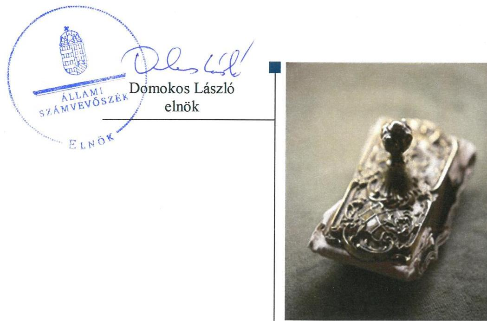
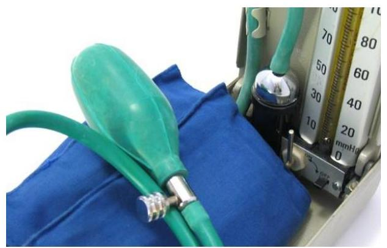
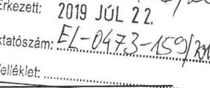
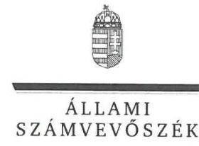
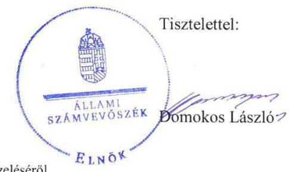
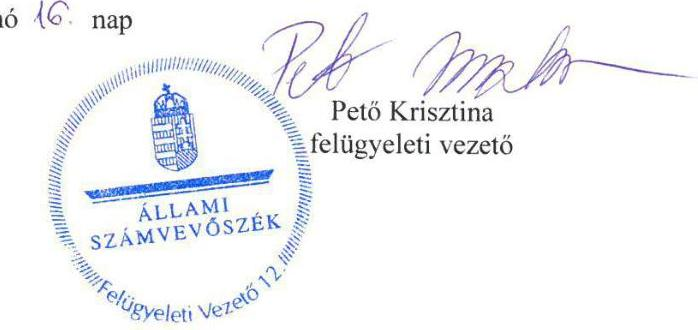

# Jelenetés 

## Köztestületek ellenőrzése

Magyar Egészségügyi Szakdolgozói Kamara
2019.

---

# Jelenetés 

## Köztestületek ellenőrzése

Magyar Egészségügyi Szakdolgozói Kamara
2019. 03. hó 4. nap

---

# AZ ELLENŐRZÉST FELÜGYELTE:

- **PETŐ KRISZTINA** felügyeleti vezető
- **AZ ELLENŐRZÉST VEZETTE ÉS A VÉGREHAJTÁSÁÉRT FELELŐS:**
  - **DR. NAGY JUDIT** ellenőrzésvezető 2018. november 20-ig
  - **NEMESVÁRI-HORTHY ESZTER** ellenőrzésvezető 2018. november 21-től
- **A PROGRAM ÖSSZEÁLLÍTÁSÁÉRT FELELŐS:**
  - **TÓTPÁL SZABOLCS** osztályvezető

**IKTATÓSZÁM:** EL-1947-001/2019.

**Jelentéseink az Országgyűlés számítógépes hálózatán és az Interneten a www.asz.hu címen is olvashatóak.**

**TÉMASZÁM:** 2455

**ELLENŐRZÉS-AZONOSÍTÓ SZÁM:** V079901

---

# TARTALOMJEGYZÉK 

■ ÖSSZEGZÉS ..... 5
■ AZ ELLENŐRZÉS CÉLJA ..... 6
■ AZ ELLENŐRZÉS TERÜLETE ..... 7
■ AZ ELLENŐRZÉS HÁTTERE, INDOKOLTSÁGA ..... 8
■ A JELENTÉS LÉNYEGES KÉRDÉSKÖREI ..... 9
■ AZ ELLENŐRZÉS HATÓKÖRE ÉS MÓDSZEREI ..... 10
■ MEGÁLLAPÍTÁSOK ..... 12
■ JAVASLATOK ..... 15
■ MELLÉKLETEK ..... 17
I. sz. melléklet: Értelmező szótár ..... 17
■ FÜGGELÉKEK ..... 19
I. sz. függelék a jelentéshez ..... 19
II. sz. függelék: Észrevételek ..... 20
■ RÖVIDÍTÉSEK JEGYZÉKE ..... 33

---

.

---

# ÖSSZEGZÉS 

A Magyar Egészségügyi Szakdolgozói Kamara gazdálkodása nem volt elszámoltatható és átlátható. A kamara a tagdíjkövetelések beszedésére nem intézkedett, a törvényben ezzel kapcsolatban előírt feladatát az ellenőrzött időszakban nem látta el. Számviteli beszámolói nem mutattak megbízható és valós összképet. A nem valós adatokat tartalmazó beszámoló közzétételével a kamara a közvéleményt és a tagságát megtévesztette.

## Az ellenőrzés társadalmi indokoltsága

A Magyar Egészségügyi Szakdolgozói Kamara az egészségügyi szakdolgozók érdekképviseleti szerve, amely szakmai érdekképviseleti feladatai körében tagságához kapcsolódóan hozzájárul az egészségpolitika alakításához, döntések meghozatalához, a lakosság egészségügyi ellátásainak javításához. A Magyar Egészségügyi Szakdolgozói Kamara vezeti a tagok nyilvántartását, közigazgatási feladatai körében hatóságként jár el a felvétellel, tagság megszüntetéssel, szüneteltetéssel, valamint a szüneteltetett tagsági viszony helyreállításával kapcsolatos kamarai hatósági ügyekben. Hatósági eljárásokban felkérésre szakértőként véleményezi az egészségügyi tevékenységre irányuló kérelmeket, a külföldi bizonyítvány, oklevél Magyarországon történő elismerésére irányuló kérelmeket.

A Magyar Egészségügyi Szakdolgozói Kamara gazdálkodását az Állami Számvevőszék eddig még nem ellenőrizte.

## Főbb megállapítások, következtetések, javaslatok

A Magyar Egészségügyi Szakdolgozói Kamara Országos Szervezete belső szabályozási rendszerének kialakítása nem volt szabályszerű, mivel a gazdálkodás belső szabályozása nem volt összhangban a jogszabályi előírásokkal, továbbá számlarendet nem készített.

A tagdíjkövetelések nyilvántartása és beszedése nem volt szabályszerű. A tagdíjköveteléseket az egyszerűsített éves beszámoló mérlegében nem mutatták ki. Ennek következtében a Magyar Egészségügyi Szakdolgozói Kamara Országos Szervezete egyszerűsített éves beszámolója nem valós adatokat tartalmazott. A nem valós adatokat tartalmazó beszámoló közzétételével a kamara a közvéleményt és a tagságát megtévesztette. A tagdíjkövetelések beszedésére a Magyar Egészségügyi Szakdolgozói Kamara Országos Szervezete nem intézkedett. A törvényi kötelezettségének a kamara nem tett eleget, mert a tagdíjjal tartozók előzetes felszólításáról, ezt követően a 6 hónapot meghaladóan lejárt tagdíjhátralék beszedése iránti eljárás megindításáról nem gondoskodott és így a kamarai tagság megszüntetésére nem intézkedett.

A költségvetési támogatások felhasználásának nyilvántartása nem volt szabályszerű, mivel a törvényi előírás ellenére a közpénzek felhasználásának nyilvánossága és ellenőrizhetősége érdekében nyilvántartási rendszerét a Magyar Egészségügyi Szakdolgozói Kamara Országos Szervezete nem részletezte tovább.

Az Állami Számvevőszék a Magyar Egészségügyi Szakdolgozói Kamara elnökének kettő, az Országos Hivatal vezetőjének hét javaslatot fogalmazott meg.

---

# AZ ELLENŐRZÉS CÉLJA 

ködtek-e.

Az ellenőrzés célja annak megállapítása volt, hogy a Magyar Egészségügyi Szakdolgozói Kamara gazdálkodása során betartotta-e a vonatkozó jogszabályi előírásokat, ennek keretében betartotta-e az előírásokat a belső szabályozási keretek kialakítása, a tagdíjbeszedés, a közzétételi és adatszolgáltatási tevékenysége során. Szabályszerűen számolta-e el, illetve tartotta-e nyilván a törvényben rögzített közfeladat ellátására államháztartásból kapott támogatásokat. Az ellenőrzés kiterjedt arra is, hogy a Magyar Egészségügyi Szakdolgozói Kamara szabályszerű működését biztosító ellenőrzési rendszerek megfelelően mű-

---

# **AZ ELLENŐRZÉS TERÜLETE**

## **Magyar Egészségügyi Szakdolgozói Kamara**

A MESZK$^{1}$ a Magyar Egészségügyi Szakdolgozói Kamaráról szóló 2003. évi LXXXIII. tv. felhatalmazása alapján alakult, és az Ekt.$^{2}$ szerint önkormányzattal rendelkező, köztestületi formában működő szakmai szervezet, amely feladatait az országos és területi szervezetei útján látja el. A MESZK Országos Szervezete$^{3}$ és területi szervezetei$^{4}$ önálló jogi személyek.

Az Ekt.-ban meghatározott feladataként a MESZK az egészségügyi hivatás gyakorlásával és az egészségügyi tevékenységgel összefüggő kérdésekben képviseli és védi tagjainak érdekeit és jogait, tagjairól nyilvántartást vezet. Megalkotja az egészségügyi szakma gyakorlására vonatkozó általános szakmai magatartási-etikai szabályokat. Hatósági eljárásokban felkérésre a Ket.$^{5}$ szerint szakértőként véleményezi az egészségügyi tevékenységre irányuló kérelmeket, a külföldi bizonyítvány, oklevél Magyarországon történő elismerésére irányuló kérelmeket. Közigazgatási hatóságként jár el a felvétellel, tagság megszüntetéssel, szüneteltetéssel, valamint a szüneteltetett tagsági viszony helyreállításával kapcsolatos kamarai hatósági ügyekben.

Az egészségügyi tevékenységet végzőknek a kamarai tagság az Ekt. alapján kötelező. A MESZK tagok száma a 2015. évi 102 761 főről a 2017 évre 116 558 főre nőtt. A taglétszám 2015-2017. év végi adatait az 1. táblázat mutatja be.

A MESZK működésének költségeit döntően a tagjai által befizetett, a MESZK Országos Hivatal$^{6}$ által beszedett tagdíjakból, valamint vállalkozási tevékenységből származó bevételekből fedezte.

Költségvetési támogatásban a MESZK – a három, az EMMI$^{7}$-vel kötött támogatási szerződés$^{1-3}$-ban foglalt feltételekkel – oktatással, képzéssel, szakképzéssel, etikai eljárásokkal kapcsolatos feladatai ellátásához a 2015-2017. közötti időszakban összesen 90,8 M Ft-ban, 2015-ben 29,6 M Ft-ban, 2016-ban 30,6 M Ft-ban, míg 2017-ben 30,6 M Ft-ban részesült. A költségvetési támogatást a MESZK Országos Szervezete használta fel.

A törvényességi felügyeletet a MESZK fölött– az Ekt. 27. § (1) bekezdésében foglaltak szerint – az EMMI gyakorolta. A MESZK-nél törvényességi felügyeleti ellenőrzés az ellenőrzött időszakban nem volt.

1. táblázat

|  A TAGLÉTSZÁM ALAKULÁSA (FŐ) |  |  |   |
| --- | --- | --- | --- |
|   | 2015. | 2016. | 2017.  |
|  létszám | 102 761 | 103 502 | 116 558  |

*Forrás: MESZK adatszolgáltatás*

---

# AZ ELLENŐRZÉS HÁTTERE, INDOKOLTSÁGA 

A köztestületek közfeladatot látnak el, amelyre fokozott közérdeklődés irányul.

Társadalmi elvárás a közpénzek értékelvű, rendeltetésszerű felhasználása, a közpénzekből nyújtott támogatások átláthatóságának megteremtése, amelyhez az ÁSZ$^{9}$ az államháztartásból nyújtott támogatások ellenőrzésével kíván hozzájárulni.

Az ellenőrzés eredményeképp a törvényalkotás számára tapasztalatok állnak rendelkezésre a köztestületek szabályozásához. Az ellenőrzöttek számára visszajelzést adhat az ellenőrzés a közfeladataik ellátására államháztartásból kapott támogatások felhasználásának nyilvántartásával, beszámolásával kapcsolatos esetleges hiányosságról, míg a társadalom számára információt szolgáltat a köztestület gazdálkodásáról, a közpénz-felhasználás elszámoltathatóságáról. Az ÁSZ szervezetén belül lehetőség nyílik arra, hogy az intézmény erősítse hozzáadott értéket teremtő tevékenységét és tanácsadó szerepét.

---

# A JELENTÉS LÉNYEGES KÉRDÉSKÖREI 

1. Szabályszerűen történt-e a MESZK Országos Szervezete belső szabályozási rendszerének kialakítása?
2. Szabályszerűen gondoskodott-e a MESZK Országos Szervezete a tagdíj-követelések nyilvántartásáról, valamint beszedéséről?
3. Szabályszerűen teljesítette-e a MESZK Országos Szervezete a közzétételi, adatszolgáltatási kötelezettségét?
4. A központi költségvetési támogatások felhasználásának nyilvántartása, elszámolása szabályszerű volt-e?

---

# AZ ELLENŐRZÉS HATÓKÖRE ÉS MÓDSZEREI 

## Az ellenőrzés típusa

Megfelelőségi ellenőrzés.

## Az ellenőrzött időszak

2015-2017. évek

## Az ellenőrzés tárgya

Az ellenőrzés tárgya kiterjedt a MESZK-nél a belső szabályozási rendszer kialakítására, tagdíjbeszedésre, közzétételi, adatszolgáltatási tevékenységére, a felhasznált költségvetési támogatások nyilvántartásának, beszámolásának (elszámolásának) szabályszerűségére, valamint a törvényességi felügyeleti ellenőrzések hasznosulására.

## Az ellenőrzött szervezet

Magyar Egészségügyi Szakdolgozói Kamara

## Az ellenőrzés jogalapja

Az ellenőrzés jogalapját az ÁSZ tv.$^{10}$ 1. § (3) és 5. § (3) bekezdésében foglalt előírások képezték.

## Az ellenőrzés módszerei

Az ellenőrzésre az ellenőrzési program szempontjai, az ellenőrzött időszakban hatályos jogszabályok, az ellenőrzés szakmai szabályai, a jelen ellenőrzésre irányadó ÁSZ módszertanok figyelembevételével került sor. A gazdálkodás hibáinak kijavítására irányuló javaslatok kidolgozásakor a hatályos jogszabályok voltak az irányadóak.

Az ellenőrzés ideje alatt az ellenőrzött szervezettel történő kapcsolattartást az ÁSZ az ÁSZ SZMSZ$^{11}$-ének vonatkozó előírásai alapján biztosította.

Az ellenőrzési kérdések megválaszolásához szükséges bizonyítékok megszerzése az ellenőrzött által rendelkezésre bocsátott dokumentu-

---

mokra, adatokra alapozva megfigyelés, szemle (szemrevételezés), kérdésfeltevés (információkérés), mintavételezés, valamint elemző eljárás útján történt.

Az ellenőrzési bizonyítékként felhasználható adatforrások közé tartoztak egyrészt az ellenőrzési program részletes szempontjainál felsorolt adatforrások, másrészt minden egyéb - az ellenőrzés folyamán feltárt, az ellenőrzés szempontjából információt tartalmazó - dokumentum.

Az ellenőrzés lefolytatásához az ellenőrzött a tanúsítványok kitöltésével, hitelesítésével és azok, valamint az ÁSZ által kért dokumentumok megküldésével szolgáltatott adatokat.

A tagdíjkövetelések nyilvántartása és behajtása szabályszerűségének az ellenőrzésére a MESZK Országos Szervezeténél került sor. A minta alapján a sokaságban előforduló átlagos hibaarányt becsülte az ÁSZ. „Szabályszerű" volt az értékelés az ellenőrzött területen, amennyiben 95%-os bizonyossággal a teljes sokaságban az átlagos hibaarány legfeljebb 10%, „nem szabályszerű" volt az értékelés, amennyiben 10%-nál magasabb volt az átlagos hibaarány.

A MESZK részére a központi költségvetésből nyújtott támogatások felhasználásának és elszámolásának szabályszerűségét a már lejárt elszámolási határidejű szerződésekhez kapcsolódóan elkészített elszámolások kifizetési bizonylatai alapján értékelte az ÁSZ a MESZK Országos Szervezeténél.

---

# 1. Szabályszerűen történt-e a MESZK Országos Szervezete belső szabályozási rendszerének kialakítása? 

Összegző megállapítás

A MESZK Országos Szervezete belső szabályozási rendszerének kialakítása nem volt szabályszerű.

A MESZK Országos Szervezet a Számv. tv.$^{12}$ előírásainak eleget téve rendelkezett Számviteli politikával$^{13}$, valamint Leltározási szabályzattal$^{14}$, Értékelési szabályzattal$^{15}$, valamint Pénzkezelési szabályzattal$^{16}$. A Számviteli politikában - a Számv. tv. 14. § (4) bekezdése ellenére - nem rögzítették írásban azokat a gazdálkodóra jellemző szabályokat, előírásokat, módszereket, amelyekkel meghatározza, hogy mit tekint a számviteli elszámolás, az értékelés szempontjából kivételes nagyságú vagy előfordulású bevételnek, költségnek, ráfordításnak. A Számviteli politika „5.1. Könyvvizsgálat" és „6.1. Letétbe helyezés és közzététel" pontja - a 224/2000. (XII. 19.) Korm. rendelet$^{17}$ 20. § (1) bekezdése és a 479/2016. (XII. 28.) Korm. rendelet$^{18}$ 17. § (1) bekezdése előírásaival ellentétesen - azt tartalmazta, hogy a MESZK Országos Szervezetének nyilvánosságra hozatali (letétbe helyezési és közzétételi) kötelezettsége nincsen. A MESZK Országos Szervezete a Számv. tv. 161. § (1) bekezdése ellenére nem készített számlarendet.

A MESZK Országos Szervezetére és területi szervezeteire kiterjedő Alapszabály$^{19}$-ot - az Ekt. előírásaival összhangban - kizárólagos hatáskörében az Országos Küldöttközgyűlés$^{20}$ hagyta jóvá és módosította. Az Alapszabály az Ekt. előírásaival összhangban meghatározta a MESZK feladatait, szervezeti felépítését, a MESZK gazdálkodásával kapcsolatos alapvető előírásokat.

## 2. Szabályszerűen gondoskodott-e a MESZK Országos Szervezete a tagdíj-követelések nyilvántartásáról, valamint beszedéséről?

## Összegző megállapítás

A MESZK Országos Szervezeténél a tagdíj-követelések nyilvántartása és beszedése nem volt szabályszerű.

A MESZK Országos Szervezete a Számv. tv. 165. § (4) bekezdése ellenére a főkönyvi könyvelés, a tagdíj-követelések analitikus nyilvántartása és a bizonylatok adatai közötti egyeztetés és ellenőrzés lehetőségét, logikailag zárt rendszerrel nem biztosította. A MESZK Országos Szervezete egyszerűsített éves beszámolója mérlegében nem mutatta ki - a Számv. tv. 65. § (6) bekezdése ellenére - a tagdíjköveteléseket - 2015-ben 357,0 millió Ft-, 2016-ban 337,4 millió Ft, 2017-ben 351,5 millió Ft összegben.

---

A MESZK Országos Szervezete a tagdíjkövetelésekről - a Számv. tv. 69.
 § (1) bekezdése ellenére - a mérleg tételeinek alátámasztására nem állított össze leltárt. A MESZK a tagdíjköveteléseket - a Számv. tv. 57. § (1) és 55. § (1) bekezdése ellenére - nem értékelte és a minősítés alapján nem számolt el értékvesztést.

A tagdíjhátralékok beszedéséről az Országos Hivatal - az Alapszabály 1-6 146. pont b) alpontjában a tagdíjak beszedéséért és kezeléséért felelős szervezeti egység - nem intézkedett. A MESZK Országos Hivatala - az Ekt. 19/B. § (1) bekezdés b) pontja és a (2) bekezdése, valamint az Alapszabály 1-6 44. f) pontjában foglaltak ellenére - a tagdíjjal tarozók előzetes felszólításáról, ezt követően a 6 hónapot meghaladóan lejárt tagdíjhátralék beszedése iránti eljárás megindításáról nem gondoskodott, és a kamarai tagság megszüntetése iránt nem intézkedett.

# 3. Szabályszerűen teljesítette-e a MESZK Országos Szervezete a közzétételi, adatszolgáltatási kötelezettségét? 

## Összegző megállapítás

A MESZK Országos Szervezete közzétételi kötelezettségét nem szabályszerűen, adatszolgáltatási kötelezettségét szabályszerűen teljesítette.

A MESZK Országos Szervezete az Info tv. ${ }^{21}$ előírásai alapján a közzétételi szabályzat ${ }_{1,2}$ - $t^{22}$ és adatvédelmi szabályzat ${ }_{1,2}$ - $t^{23}$ elkészítette. A MESZK Országos Szervezete az Országos Küldöttközgyűlés által jóváhagyott 2015-2017. évi egyszerűsített éves beszámolóit az $\mathrm{OBH}^{24}$ részére megküldte, a 224/2000. (XII. 19.) Korm. rendeletben és a 479/2016. (XII. 28.) Korm. rendeletben foglalt közzétételi kötelezettségének eleget tett. A valótlan adatokat tartalmazó egyszerűsített éves beszámolói közzétételével azonban nem érvényesült a Számv. tv. 15. § (3) bekezdésében foglalt valódiság elve. Az Info tv. 37. § (1) bekezdésében hivatkozott 1. számú mellékletében előírt gazdálkodási adatait, illetve az Ekt. előírásai szerint a beszámoló szöveges részét a honlapján közzétette. A MESZK Országos Szervezete a Stat. tv. ${ }^{25}$ és a Stat. tv. ${ }^{26}$ szerinti adatszolgáltatási kötelezettségének eleget tett.

## 4. A központi költségvetési támogatások felhasználásának nyilvántartása, elszámolása szabályszerű volt-e?

## Összegző megállapítás

A központi költségvetési támogatások felhasználásának nyilvántartása nem volt szabályszerű, azonban az elszámolás szabályszerű volt.

A MESZK Országos Szervezete a központi költségvetési támogatást a Számv. tv. előírásaival összhangban az egyéb bevételei között számolta el, azonban a költségvetési támogatások felhasználásának nyilvántartása során - a Számv. tv. 161/A. § (2) bekezdése és a támogatási szerződés ${ }_{1-3}$ 6.3. pontja ellenére - a közpénzek felhasználásának és a köztulajdon használatának nyilvánossága és ellenőrizhetősége érdekében nyilvántartási

---

(könyvvezetési) rendszerét nem részletezte tovább. A támogatási szerződés ${ }_{1-3}$-ban foglaltakkal összhangban a támogatás felhasználásáról elkészítette a szakmai beszámolót és a pénzügyi elszámolást, amelyet benyújtott az EMMI-nek.

---

# JAVASLATOK 

Az ÁSZ tv. 33. § (1) bekezdésében foglaltak értelmében az ellenőrzött szervezet vezetője köteles a jelentésben foglalt megállapításokhoz kapcsolódó intézkedési tervet összeállítani és azt a jelentés kézhezvételétől számított 30 napon belül az ÁSZ részére megküldeni. Amennyiben az ellenőrzött szervezet vezetője nem küldi meg határidőben az intézkedési tervet, vagy továbbra sem elfogadható intézkedési tervet küld, az Állami Számvevőszék elnöke az ÁSZ tv. 33. § (3) bekezdés a) és b) pontjaiban foglaltakat érvényesítheti.

## a Magyar Egészségügyi Szakdolgozói Kamara elnökének

1. Intézkedjen a számviteli politika kiegészítéséről és módosításáról a jogszabályi előírásokkal összhangban.
(1. összegző megállapítás 1. bekezdésének 2-3. mondata alapján)
2. Intézkedjen a jogszabályi előírás szerinti számlarend elkészítéséről.
(1. összegző megállapítás 1. bekezdésének 4. mondata alapján)

## a Magyar Egészségügyi Szakdolgozói Kamara Országos Hivatala vezetőjének

1. Intézkedjen a főkönyvi könyvelés, a tagdíjkövetelések analitikus nyilvántartása és a bizonylatok adatai közötti egyeztetés és ellenőrzés lehetőségének logikailag zárt rendszerrel történő biztosításáról.
(2. összegző megállapítás 1. bekezdés 1. mondatának 2. tagmondata alapján)
2. Intézkedjen a tagdíjkövetelések mérlegben történő kimutatásáról a jogszabályi előírással összhangban.
(2. összegző megállapítás 1. bekezdésének 2. mondata alapján)
3. Intézkedjen a tagdíjkövetelések mérleg tételeinek alátámasztására jogszabály szerinti leltár összeállításáról.
(2. összegző megállapítás 2. bekezdésének 1. mondata alapján)

---

4. Intézkedjen a tagdíjkövetelések jogszabály szerinti értékeléséről és a minősítés alapján értékvesztés elszámolásáról.
(2. összegző megállapítás 2. bekezdésének 2. mondata alapján)
5. Intézkedjen a tagdíjhátralék beszedéséről.
(2. összegző megállapítás 3. bekezdésének 1. mondata alapján)
6. Kezdeményezze a jogszabályban és az Alapszabályban meghatározott feltételek együttes fennállása esetén a kamarai tagság megszüntetése iránti eljárást.
(2. összegző megállapítás 3. bekezdésének 2. mondata alapján)
7. Intézkedjen a költségvetési támogatások felhasználása nyilvántartásának továbbrészletezéséről a közpénzek felhasználásának és a köztulajdon használatának nyilvánossága és ellenőrizhetősége érdekében.
(4. összegző megállapítás 1. bekezdés 1. mondatának 2. tagmondata alapján)

---

# MELLÉKLETEK 

- I. SZ. MELLÉKLET: ÉRTELMEZŐ SZÓTÁR
államháztartás
költségvetési támogatás
közfeladat
köztestület
küldöttközgyűlés
országos hivatal
országos ügyintéző szervek

Az államháztartás a közfeladatok ellátásának egységes szervezeti, tervezési, gazdálkodási, ellenőrzési, finanszírozási, adatszolgáltatási és beszámolási szabályok szerint működő rendszere, amely központi és önkormányzati alrendszerből áll. (Forrás: Áht. 2. §, 3. § (1) bekezdés 2015. január 1-jétől)

Az államháztartás alrendszerei terhére nyújtott pénzbeli vagy nem pénzbeli juttatás, amelyet a támogató nem elsősorban ellenszolgáltatás ellenében, de konkrét program megvalósítása vagy meghatározott időszakban a támogatott szervezet működtetése érdekében nyújt. Költségvetési támogatás különösen: a pályázat útján, valamint egyedi döntéssel kapott költségvetési támogatás; az Európai Unió strukturális alapjaiból, illetve a Kohéziós Alapból származó, a költségvetésből juttatott támogatás; az Európai Unió költségvetéséből vagy más államtól, nemzetközi szervezettől származó támogatás és a személyi jövedelemadó meghatározott részének az adózó rendelkezése szerint felajánlott összege. (Forrás: Ectv. ${ }^{27}$ 2. § 15. pont)
Jogszabályban meghatározott állami vagy önkormányzati feladat, amit az arra kötelezett közérdekből, jogszabályban meghatározott követelményeknek és feltételeknek megfelelve végez, ideértve a lakosság közszolgáltatásokkal való ellátását, továbbá az állam nemzetközi szerződésekben vállalt kötelezettségeiből adódó közérdekű feladatokat, valamint e feladatok ellátásához szükséges infrastruktúra biztosítását is. (Nvtv. ${ }^{28}$ 3. § (1) bekezdés 7. pontja)
A köztestület önkormányzattal és nyilvántartott tagsággal rendelkező szervezet, amelynek létrehozását törvény rendeli el. A köztestület a tagságához, illetőleg a tagsága által végzett tevékenységhez kapcsolódó közfeladatot lát el. A köztestület jogi személy. A szakmai kamarák köztestületként folytatják tevékenységüket (Ptk.: 65. § (1) és (2) bekezdés és az Áhtm. ${ }^{29}$ 8/A. § (1) bekezdése alapján).
A szakmai kamara legfőbb képviseleti szerve, amely a területi szervezetek választott küldötteiből áll. Kizárólagos hatáskörébe tartozik a szakmai kamara alapszabályának, valamint etikai kódexének megalkotása és módosítása, valamint országos tisztviselőinek, az országos etikai bizottság, valamint az országos felügyelő bizottság tagjainak megválasztása, a szakmai kamara számviteli törvény szerinti éves beszámolójának, továbbá az országos felügyelő bizottság éves beszámolójának elfogadása. AZ alapszabály a küldöttközgyűlés részére más kizárólagos hatásköröket is megállapíthat. (Forrás: Ekt. 4. § (1) bekezdés.)
Az országos képviseleti, illetőleg ügyintéző kamarai szervek vagy azok valamely tisztségviselőjének kizárólagos hatáskörébe nem tartozó országos kamarai feladatok irányítására, illetve összehangolására létrehozott országos ügyviteli feladatokat ellátó szerv. (Forrás: Ekt. 10. § (1) bekezdés)
A küldöttközgyűlés kizárólagos hatáskörébe nem tartozó, törvényben, valamint az alapszabályban meghatározott feladatok ellátására a küldöttközgyűlés országos ügyintéző szerveket és tisztségviselőket választ. Az országos ügyintéző szervek: az elnökség, az etikai bizottság, a felügyelőbizottság, az etikai kollégium, az alapszabályban meghatározott más állandó bizottságok. (Forrás: Ekt. 5. § és 6. § (1) bekezdés.)

---

országos szervezet

A szakmai kamara legfőbb képviseleti szerveként az országos küldöttközgyűlés, az országos ügyintéző szervek, a szakmai kamara országos tisztségviselői (az országos ügyintéző szervek, közte az országos elnökség tagjai, elnökei, alelnökei, szakmai tagozatvezetők), valamint a szakmai kamara országos hivatala. A MESZK Országos Szervezete az országos képviseleti és ügyintéző testületekből és az Országos Hivatalból áll. A MESZK Országos Szervezete jogi személy. (Forrás: Ekt. 4. §-10. §, Alapszabály IV. fejezet 64.), 65.))

---

# FÜGGELÉKEK 

- I. SZ. FÜGGELÉK A JELENTÉSHEZ

Az Állami Számvevőszék az ellenőrzések során feltárt tényekhez kapcsolódó további körülmények tisztázására eszközrendszerrel nem rendelkezik. Amennyiben az ellenőrzésen túlmutatóan indokoltnak látszik az ellenőrzés során feltárt körülmények további vizsgálata, az Állami Számvevőszék törvényi felhatalmazás alapján az ellenőrzés által feltárt körülményeket továbbítja a hatáskörrel rendelkező szervnek a szükséges intézkedések megtétele, eljárások lefolytatása érdekében.
A MESZK törvénnyel létrehozott, közfeladatokat ellátó, önkormányzattal és nyilvántartott tagsággal rendelkező köztestület, amely jogi személy. Működési költségeit elsősorban a tagságtól beszedett tagdíjakból fedezi. A MESZK közfeladatai ellátása során a tagságával kapcsolatos ügyekben (felvétel a szakmai kamarába, tagság megszüntetése, szüneteltetése, szüneteltetett tagsági jogviszony helyreállítása) közigazgatási hatóságként jár el.

1. A MESZK Országos Szervezete a 2015-2017. évi egyszerűsített éves beszámolóinak mérlegeiben nem mutatta ki a tagdíjköveteléseket, 2015-ben 357,0 millió Ft-ot, 2016-ban 337,4 millió Ft-ot, 2017-ben 351,5 millió Ft-ot, ezzel a Számv. tv. 65. § (6) bekezdésében foglalt előírásokat megsértette. A MESZK Országos Szervezete 2015-2017. években elkészített egyszerűsített éves beszámolói nem mutattak megbízható és valós összképet. Ezzel megtévesztették a részére költségvetési támogatást támogatási szerződéssel nyújtó EMMI-t.
2. A MESZK Országos Hivatala a 2015-2017. években a tagdíj hátralékok beszedésére - az Alapszabály ${ }_{1-6}$-ban a tagdíjak beszedéséért és kezeléséért felelős szervezeti egység - nem intézkedett. A MESZK Országos Hivatala - az Ekt. 19/B. § (1) bekezdés b) pontja és (2) bekezdése, valamint az Alapszabály ${ }_{1-6}$ 44. f) pontjában foglaltak ellenére - a tagdíjjal tartozók előzetes felszólításáról és ezt követően a 6 hónapot meghaladóan lejárt tagdíjhátralék beszedése iránti eljárás megindításáról nem gondoskodott, és így a kamarai tagság megszüntetése iránt nem intézkedett. A tagnyilvántartásban valótlanul szerepelhettek olyan kamarai tagok, akiknek a kamarai tagsági jogviszonya - az Ekt. 14. § (1) bekezdés d) pontjában foglalt feltétel, a kamarai tagdíj fizetés elmaradása miatt - valójában nem állt fenn. A MESZK a tagdíjat nem fizető, így tagsági jogviszonnyal nem rendelkező tagok jogviszonyát valótlanul szerepeltetette közokiratban.

Az 1. és 2. eset konkrét körülményeinek felderítésére az Ügyészség rendelkezik hatáskörrel.

---

A jelentéstervezetet a Számvevőszék 15 napos észrevételezésre megküldte az ellenőrzött szervezet vezetőjének az ÁSZ tv. 29. § (1) bekezdése előírásának megfelelően.

A jelentéstervezet megállapításaira a Magyar Egészségügyi Szakdolgozói Kamara elnöke a törvényes határidőben írásban észrevételt tett.
Az ÁSZ tv. 29. § (3) bekezdésével összhangban az ÁSZ a Függelékben feltünteti az ellenőrzés megállapításaival kapcsolatban tett, figyelembe nem vett észrevételeket, és megindokolja, hogy azokat miért nem fogadta el.

[^0]
[^0]:    * 29. § (1) Az Állami Számvevőszék az ellenőrzési megállapításait megküldi az ellenőrzött szervezet vezetőjének vagy az általa megbízott személynek, és annak, akinek személyes felelősségét állapította meg.
    (2) Az ellenőrzött szervezet vezetője és a felelősként megjelölt személy az ellenőrzés megállapításaira tizenöt napon belül írásban észrevételt tehet.
    (3) Az Állami Számvevőszék az észrevételre a beérkezésétől számított harminc napon belül írásban válaszol. A figyelembe nem vett észrevételeket köteles a jelentésben feltüntetni, és megindokolni, hogy azokat miért nem fogadta el.

---

# MAGYAR EGÉSZSÉGÜGYI SZAKDOLGOZÓI KAMARA 

## Országos Szervezet

1450 Budapest, Pf.: 214.
Telefon: 1-323-2070 Fax: 1-323-2079
e-mail: meszk@meszk.hu, www.meszk.hu

Domokos László
elnök
Állami Számvevőszék

Budapest, Apáczai Csere János utca 10.
Tárgy: Észrevételek az EL-0473-155/2019 számú jelentés tervezethez

## Tisztelt Elnök Úr!

A Magyar Egészségügyi Szakdolgozói Kamara (továbbiakban: Kamara) az Állami Számvevőszék (továbbiakban: ÁSZ) által Kamaránál lefolytatott

 megfelelőségi vizsgálatról szóló számvevőszéki jelentéstervezetét megkapta. Köszönettel élve a lehetőséggel, észrevételezésünket az alábbiakban terjesztem elő.

Észrevételeinket a jelentéstervezet tematikájához igazodva, döntően a jelentéstervezet 12-16. oldalain megfogalmazottakhoz kapcsolódóan tesszük meg. Az észrevételek megtételekor a Kamarával szerződéses kapcsolatban álló könyvelő és szakértő könyvvizsgáló céggel is konzultáltunk. A jelentéstervezettel kapcsolatban az alábbi konkrét észrevételekkel szeretnék élni:

## Az ellenőrzés társadalmi indokoltsága (5. oldal)

Megemlítem, hogy az egészségügyi szakdolgozók regisztrálását 2007. április 1. napjától az Egészségügyi Engedélyezési és Közigazgatási Hivatal végezte, 2017. január 1-től pedig az Állami Egészségügyi Ellátási Központ végzi. (8/2007. (IV. 17.) EüM rendelet az egészségügyi szakképesítéssel rendelkező személyek alap- és működési nyilvántartásáról, valamint a működési nyilvántartásban nem szereplő személyek tevékenységének engedélyezéséről).

Megállapítások (12-14. oldal)

1. Szabályszerűen történt-e a MESZK Országos Szervezete belső szabályozási rendszerének kialakítása? (12. oldal)

Tájékoztatom arról, hogy 2017. december 8. napján elfogadásra került az új, módosított Számviteli Politika, melyben a jelentéstervezetben ismertetett hiányosságok már kijavításra kerültek. Így meghatározásra került, hogy a számviteli elszámolás szempontjából mit tekint a Kamara kivételes nagyságú vagy előfordulású bevételnek, költségnek, ráfordításnak, és a nyilvánosságra hozatali szabályok is a jogszabályi előírásoknak megfelelően kerültek előírásra. Elkészült a számviteli törvény előírásainak megfelelő Számlarend is. Fenti szabályzatokat az Országos Elnökség a 60/2017.(12.08.) számú határozatával hagyta jóvá, mindkét szabályzat 2018.01.01-től hatályos.

---

Megemlítem továbbá, hogy az országos elnök és az Országos Elnökség 2015-ben észlelt olyan könyveléssel kapcsolatos problémákat, amely alapján a kamara pénzügyi és gazdálkodási tevékenysége átvilágításra került, és ennek eredményeképpen a szükséges személyi és helyi eljárásrendekre vonatkozó intézkedéseket megtettük.

# 2. Szabályszerűen gondoskodott-e a MESZK Országos Szervezete a tagdíjkövetelések nyilvántartásáról, valamint beszedéséről? (12-13. oldal)

A Kamara Országos Szervezete a kamarai törvényből eredeztetett mindenkori Alapszabályában rögzített módon rendelkezik a tagdíjkövetelések nyilvántartásáról, valamint annak beszedéséről.

A tagok számára a Kamara honlapján belépve a zárt tagi felületre érheti el mindenki személyes profiljában a "Pénzügyekkel kapcsolatos információk, dokumentumok" részt, melyben megtalálható a havi befizetések előírása és ezek teljesülése. Ezt a zárt rendszerű részt éppen azért fejlesztette ki köztestületünk, hogy minden kamarai tagtársunk tagsági díjjal kapcsolatos pénzügyi nyilvántartása (a havi/az időszakos befizetések és ezek teljesülése) átlátható és követhető legyen. A rendszer 2013 óta folyamatosan elérhető tagjaink számára.

A MESZK Országos Hivatalának vezetője a Szervezeti és Működési Szabályzat 2.2. pontja szerint végzi a tagdíjhátralékkal rendelkezők fizetésre történő felszólítását, valamint a 2.4. pont és az Alapszabály 44. pontja szerint végzi a tagdíj tartozással kapcsolatos ügyintézést.

A MESZK Országos Hivatala felszólította a 6 hónapot meghaladó tagdíjtartozással rendelkező tagokat hátralékuk rendezésére, és amennyiben ez a felszólításban megadott határidőre nem történt meg, a területi szervezeteket erről a tényről hivatalos úton értesítette. Az értesítés alapján az Ekt. 19/B. (4) bekezdése alapján a területi szervezetek, mint elsőfokú közigazgatási hatóságok kötelesek megindítani és lefolytatni a tagsági viszony megszüntetésére irányuló közigazgatási eljárást. Tehát a kamarai tagsági viszony megszüntetésével és szüneteltetésével kapcsolatban első fokon eljáró hatóság a MESZK területi szervezetei.

## A MESZK Területi Szervezeteinek értesítése a közigazgatási hatósági eljárás megindításának szükségességéről

|  vizsgált év | a kezdeményezett eljárásban
résztvevők száma (fő)  |
| --- | --- |
|  2015 | 6.237  |
|  2016 | 7.000  |
|  2017 | 6.050  |

## Az Országos Hivatal az alábbi intézkedéseket valósította meg a vizsgált időszakban:

MESZK Országos Hivatala a 2015-ös évben egy alkalommal, 2016-ban három alkalommal, míg 2017. évben ismét egy alkalommal küldött ki a hat hónapot meghaladó tagdíjhátralékkal rendelkező tagok részére tagdíjfizetési elsődleges felszólítást.

MESZK Országos Hivatalából kimenő levelek száma a hat hónapon túli tagdíjtartozások ügyében

|  vizsgált év | felszólított tagok
száma (fő) | az adott évi tagsághoz
viszonyított arányuk (\%)  |
| --- | --- | --- |
|  2015 | 9.713 | 9,45  |
|  2016 | 14.279 | 13,79  |
|  2017 | 14.482 | 12,42  |

---

# A "felszólító levelek" hatására a tagok általi tartozásrendezési hajlandóság a vizsgálati időszakban 

| vizsgált év | felszólított   tagok   száma (fő) | azon tagok száma, akik   valamilyen összeget   befizettek adott év   december 31-ig (fő) | a felszólított   tagok számához   viszonyított   arányuk (\%) |
| :--: | :--: | :--: | :--: |
| 2015 | 9.713 | 3.752 | 38,62 |
| 2016 | 14.279 | 9.397 | 65,80 |
| 2017 | 14.482 | 8.429 | 58,20 |

A "felszólító levelek" / kampányok hatására befolyt összegek a vizsgálati időszakban

| vizsgált év | a felszólított tagok   befizetési elmaradása (mFt) | a felszólított tagok általi   befizetés nagysága adott   év december 31-ig (mFt) |
| :--: | :--: | :--: |
| 2015 | 119,5 | 33,7 |
| 2016 | 125,0 | 92,2 |
| 2017 | 134,0 | 72,6 |

Az OH által megtett intézkedési folyamat hatására a MESZK Területi Szervezetei - hat hónapot meghaladó tagdíjhátralék okán - a kamarai tagságát 2015. évben 881 főnek, 2016. évben 6900 főnek, 2017. évben 1020 főnek, illetve áthúzódva 2018-ra további 5.185 főnek szüntették meg.

Fentiek tükrében a vizsgálat azon megállapítása mely szerint „a tagdíjhátralékok beszedéséről az Országos Hivatal nem intézkedett" nem tűnik megalapozottnak.

Kérem, hogy az Összegző megállapítások (13. oldal) ezen pontjának utolsó mondatát, miszerint "A MESZK Országos Hivatala - az Ekt. 19/B. (1) bekezdés b) pontja és a (2) bekezdése, valamint az Alapszabály 44. f) pontjában foglaltak ellenére - a tagdíjjal tartozók előzetes felszólításáról, ezt követően a 6 hónapot meghaladóan lejárt tagdíjhátralék beszedése iránti eljárás megindításáról nem gondoskodott, és a kamarai tagság megszüntetése iránt nem intézkedett" szíveskedjék törölni.

## Indokolás:

Az Országos Hivatal úgy tett és tesz eleget a Kamara Alapszabályában és a Hivatal működést szabályzó egyéb belső rendekben rögzített módon a tagdíjkövetelések beszedésére vonatkozó kötelezettségének, hogy a hivatalvezető igazolható módon fizetési felszólítást küld a 6 hónapot meghaladó tagdíjtartozással rendelkező tagnak. Amennyiben a tag a megadott határidőre nem rendezi tartozását, a hivatalvezető írásos tájékoztatóban értesíti a területi szervezet elnökét arról, hogy - mint elsőfokú hatóságnak -, mely tagok esetében szükséges a tagság megszüntetése iránti közigazgatási hatósági eljárást megindítania, majd a Területi Szervezetek feladata az elsőfokú eljárás megindítása és lefolytatása (1. sz. melléklet: Területi Szervezetek értesítése közigazgatási hatósági eljárás megindításáról 2017. évben).

A munkáltatókon keresztül történő kamarai tagdíjlevonás és ennek MESZK-hez történő rendszeres havi utalása a vizsgált időszakban közel 300 egészségügyi szolgáltatóval történt előzetesen kötött szerződések, valamint a tagok nyilatkozata alapján került kialakításra.

---

A tagdíjhátralékok beszedése kapcsán szeretném Önöket tájékoztatni arról, hogy a tagok közel 60%-a munkabérből történő levonással rendezte tagdíjfizetési kötelezettségét, mely a Magyar Államkincstáron (MÁK) keresztül valósult meg a vizsgálati időszakban.

| vizsgált év | munkabérből munkáltatói | az adott évi tagsághoz |
| :--: | :--: | :--: |
|  | levonással fizető tag száma (fő) | viszonyított arányuk (\%) |
| 2015 | 69.924 | 59,28 |
| 2016 | 67.464 | 58,03 |
| 2017 | 71.375 | 59,16 |

A MÁK 2015 novemberében új illetmény-számfejtési rendszert (KIRA) vezetett be, amelynek eredményeképpen a munkavállalói bérkifizetésekben problémák jelentkeztek. Voltak olyan intézményeink, amelyek a kamarai tagdíjlevonásról szóló listákat 2016. márciusában küldték meg részünkre, a vonatkozó időszak 2015. novembere, decembere, 2016. január és február. Mindezek alapján a 2015-ös év határidőre történő pénzügyi zárása is nehézségekbe ütközött, hiszen a tagdíjakat nem tudtuk csak folyamatos 3-4 hónapos csúszással rögzíteni.
2016. júniusában értesültünk arról, hogy az Állami Egészségügyi Ellátó Központ (ÁEEK) - mint az állami intézmények fenntartója - átvállalja több mint 42 ezer egészségügyi szakdolgozó kamarai tagdíj fizetését 2016. július 1-től. Az ÁEEK a MÁK-kal felvette a kapcsolatot, annak érdekében, hogy a tagdíjak munkabérből történő MÁK általi levonás július 1-től ne történjen meg. A tagdíj átvállalásra vonatkozó megállapodás 2016. október 18-án került megkötésre. Az átvállalások kialakítása során olyan intézményi tagi listák készültek, melyet csak többkörös egyeztetés után lehetett véglegesnek, tagsági szempontból megbízhatónak tekinteni. A kialakult helyzet 2017 első félévében sem rendeződött még megfelelő módon, csak több hónapos csúszással került megkötésre a tagdíjak átvállalására vonatkozó további megállapodás.

A Kamara a mai napig közel 200 olyan egészségügyi szolgáltatóval áll kapcsolatban, ahol az egészségügyi szakdolgozók kamarai tagdíjukat szintén a havi munkabérből történő levonás után egyenlítik ki. E folyamatban megmaradtak az intézményi bér- és munkaügyi osztályok által összeállított havi listák, melyek megérkezésében - erőfeszítéseink ellenére - mind a mai napig problémák vannak.

Általánosságban megállapítható, hogy a tagdijelmaradási probléma a közellátásban - döntő többségben közalkalmazotti jogviszonyban - foglalkoztatott munkavállalóknál mutatkozott, akik önhibájukon kívül kerülhettek olyan helyzetbe a 2015-2017 közötti időszakban, hogy hat havi tagdíjhátralék mutatkozhatott a tagdíjszámlájukon. Ezért a Magyar Egészségügyi Szakdolgozói Kamara Országos Elnöksége elhivatott annak érdekében, hogy egyetlen tagtársunk se kerüljön olyan helyzetbe, hogy a munkavállalás alapfeltételeként szolgáló kamarai tagsága megszüntetésre önhibáján kívüli okból kerüljön sor.

Ennek megelőzése érdekében az MESZK Országos Szervezet azt az utat választotta, hogy többkörös egyeztetést folytatott és folytat az intézmények tagdíjlevonási listáit készítő szakembereivel, valamint a kamarai tagsági rendszerben bevezettük az adóazonosító jellel történő kiegészítést. Tagságunk nyilvántartási rendszere 2018-ra már 98,5%-ban rendelkezett a tagok adóazonosító jelével, így sokkal megbízhatóbban tudjuk mind elektronikusan, mind pedig a papír alapon beérkező tagdíj adatokat rendszerünkbe konvertálni.

Ugyancsak jelentős problémát jelent a szakdolgozó köztestület nyilvántartásának vezetésében, hogy azon nyugdíjas tagtársaink, akik már nem kívánnak az egészségügyben tovább tevékenykedni, 3000.- Ft közigazgatási hatósági eljárási illeték megfizetése ellenében mondhatnak csak le tagsági viszonyukról. A kötelező kamarai tagságról történő lemondásra számosan nem kívánnak anyagi erőforrásokat áldozni, így a létszámban továbbra is szerepelnek, de a gyakorlatban már nem aktív tagok. Kamaránk kiemelt kérdésnek tartja, hogy e kérdéssel foglalkozzon, ezáltal a tagdíjnyilvántartási rendszer megbízhatósága, valamint a számviteli politikai vonatkozásokban is további kedvező hatások érhetők el. A további két táblázat a kialakult helyzet jelentőségét bizonyítandó mutatjuk be.

---

Hat hónapon túli tagdíjtartozók száma és mértéke (összeg nagysága) a betöltött 58-61 év közötti tagságunk körében a vizsgált években (A „Nők 40 program" keretében nyugdíjba vonult kollégák)

| vizsgált év | 58-61 év közöttiek tartozása |  |
| :--: | :--: | :--: |
|  | létszám (fő) | összeg (Ft) |
| 2015 | 1385 | 15162219 |
| 2016 | 1615 | 13308053 |
| 2017 | 1490 | 14123367 |

Hat hónapon túli tagdíjtartozók száma és mértéke (összeg nagysága) a betöltött 62 és e feletti életkorú tagságunk körében a vizsgált években (Öregségi nyugdíj korhatárt elért és nyugdíjba vonult kollégák)

| vizsgált év | 62 év felettiek tartozása |  |
 :--: | :--: |
|  | létszám (fő) | összeg (Ft) |
| 2015 | 634 | 9031319 |
| 2016 | 1133 | 10801620 |
| 2017 | 943 | 8711304 |

# 3. Szabályszerűen teljesítette-e a MESZK Országos Szervezete a közzétételi, adatszolgáltatási kötelezettségét? (13. oldal) 

Annak érdekében, hogy közzétételi kötelezettségünk során szabályszerűen járjunk el, és az adatszolgáltatási kötelezettség szabályszerűen valósuljon meg, 2017 decemberében módosításra került a Számviteli Politika, melynek eredményeképpen a 2018. január 1-től induló pénzügyi évünkről szóló pénzügyi beszámolókban már érvényesült a számviteli törvény 15.§ 3) bekezdésben foglalt valódiság elve, hiszen már éves szinten kimutatásra került az Országos Szervezetet terhelt behajthatatlan tagdíjkövetelés nagysága.

## 4. A központi költségvetési támogatások felhasználásának nyilvántartása, elszámolása szabályszerű volt-e? (13-14. oldal)

2017. évtől a költségvetési támogatások felhasználásának nyilvántartása módosításra került. 2017. évtől a költségvetési támogatás terhére teljesített költségek, ráfordítások munkaszámon kerülnek könyvelésre, így ettől az időponttól megoldott az elkülönített nyilvántartás. Mindezek alapján kérjük, hogy az összegző megállapításban a részletezésre vonatkozó megállapításnál az érintett évek kerüljenek kiemelésre (a 2015. és a 2016. év), hiszen a vizsgált utolsó évben már elkülönítve történt a nyilvántartás.

A 2015. évi állami támogatás felhasználásáról a szerződés 6.4 pontja szerint legkésőbb 2016. február 28-ig kellett az Emberi Erőforrások Minisztériuma (EMMI) felé elszámolni. Az elszámolást minden évben az EMMI-vel történő előzetes egyeztetést követően személyesen szoktuk benyújtani az anyag nagy terjedelmére való tekintettel (4-5 ezer oldal). 2016-ban a leadás dátuma az EMMI-vel előzetesen egyeztetésre került, az elszámolás február 28. helyett március 1-én munkakezdéskor egy napos csúszással került leadásra.

---

# A Javaslatok a Magyar Egészségügyi Szakdolgozói Kamara elnökének megfogalmazott rész 1. és 2. pontjához (15. oldal) 

A MESZK Országos Elnöksége az ÁSZ számára készítendő intézkedési tervébe beveszi az utoljára 2017. december 07-én módosított Számviteli Politika és a Számlarend soron kívüli felülvizsgálatát és szükséges módosítást.

A Javaslatok a Magyar Egészségügyi Szakdolgozói Kamara Országos Hivatala Vezetőjének megfogalmazott javaslatok rész 2., 5., 6. pontjaihoz (15-16. oldal)

Az ÁSZ javaslat 2. pontjában megfogalmazott intézkedések már megtörténtek, hiszen még 2017 decemberében módosításra került a Számviteli Politika, melynek eredményeképpen a 2018. január 1-től induló pénzügyi évünkről szóló pénzügyi beszámolókban már érvényesült a számviteli törvény 15.§ 3) bekezdésben foglalt valódiság elve, mivel már éves szinten kimutatásra került az Országos Szervezetet terhelő behajthatatlan tagdíjkövetelés mértéke.

A MESZK Országos Küldöttközgyűlése 62/2018.K. (12.07.) Határozatával elfogadta a Magyar Egészségügyi Szakdolgozói Kamara 2015., 2016., és 2017. évben inaktív taggá váló volt kamarai tagjai behajthatatlanná vált tagdíjtartozásának leírását 30.000.- Forint mértékig. (2. sz. melléklet: 62/2018.K. (12.07) Országos Küldöttközgyűlés).

Az ÁSZ javaslat 5. pontjában a tagdíjhátralékok beszedésével kapcsolatban megfogalmazott észrevételeink jelen levelünk 2-5. oldalán kifejtett indokolása alapján kérjük megállapításuk módosítását.

Az ÁSZ javaslat 6. pontját, miszerint a hivatalvezető a jogszabályban és az Alapszabályban meghatározott feltételek együttes fennállása esetén kezdeményezze a kamarai tagság megszüntetése iránti eljárást, akként kérjük fenntartani, hogy megerősítik a jelenlegi eljárást, miután jelenleg az Országos Hivatal nem kap jogszabályi megerősítést ahhoz, hogy hatóságként tudjon eljárni. Ez a lehetőség a MESZK területi szervezeteinek, mint önálló jogi személynek van biztosítva.

Az ÁSZ javaslat 7. pontjában a költségvetési támogatások felhasználása nyilvántartásának tovább részletezéséről a közpénzek felhasználásának és a köztulajdon használatának nyilvánossága és ellenőrizhetősége tárgyában megfogalmazott észrevételeink és megtett intézkedéseink figyelembevételével jelen levelünk 5. oldalán kifejtett indokolása alapján kérjük megállapításuk módosítását.

Kérem, hogy a fentiekben foglaltakat a jelentés összegző és részletes megállapításainak a véglegesítése, valamint a javaslatok megfogalmazása során szíveskedjenek figyelembe venni, és egyetértésük esetén módosítsák a jelentéstervezetet.

A Magyar Egészségügyi Szakdolgozói Kamara az Állami Számvevőszék által Kamaránknál lefolytatott megfelelőségi vizsgálatról szóló számvevőszéki jelentéstervezetére kialakított választ a 45/2019. (07.18.) számú Országos Elnökség határozatával 8/8 arányban egyhangúan elfogadta.

Budapest, 2019. július 18.
Megkülönböztetett tisztelettel:

Mellékletek:

1. sz. melléklet: Területi Szervezetek értesítése közigazgatási hatósági eljárás megindításáról 2017. évben
2. sz. melléklet: 62/2018.K. (12.07) Országos Küldöttközgyűlés

---

# Dr. Balogh Zoltán 

elnök
Magyar Egészségügyi Szakdolgozói Kamara

## Budapest

## Tisztelt Elnök Úr!

A „Köztestületek ellenőrzése - Magyar Egészségügyi Szakdolgozói Kamara" címmel készített számvevőszéki jelentéstervezetre tett észrevételeit megkaptam.
Az Állami Számvevőszék észrevételekre vonatkozó álláspontjáról a felügyeleti vezető által készített részletes tájékoztatást csatoltan megküldöm.
Tájékoztatom Elnök urat, hogy a számvevőszéki jelentésben - az Állami Számvevőszékről szóló 2011. évi LXVI. törvény 29. § (3) bekezdése alapján - a figyelembe nem vett észrevételeket szerepeltetjük az elutasítás indokának feltüntetésével.

Budapest, 2019. 08. 16.

Melléklet: Tájékoztatás az észrevételek kezeléséről

---

# Tájékoztatás az észrevételek kezeléséről 

A „Köztestületek ellenőrzése - Magyar Egészségügyi Szakdolgozói Kamara" címü jelentéstervezetre (továbbiakban: jelentéstervezet) a 2019. július 18 -án kelt levelében megküldött észrevételeit áttekintettem. Az észrevételek kezeléséről az alábbi tájékoztatást adom.

## 1) „Az ellenőrzés társadalmi indokoltsága" részének 1. bekezdés 2. mondatával kapcsolatban adott tájékoztatás

Elnök úr tájékoztatott, hogy az egészségügyi szakdolgozók regisztrálását 2007. április 1-jétől az Egészségügyi Engedélyezési és Közigazgatási Hivatal végezte, 2017. január 1-jétől pedig az Állami Egészségügyi Ellátási Központ végzi.
Az egészségügyi szakdolgozók regisztrálásával kapcsolatban megfogalmazott tájékoztatását figyelembe véve a jelentéstervezet „Az ellenőrzés társadalmi indokoltsága" részének kapcsolódó mondatát pontosítjuk.
2) A jelentéstervezet 1. számú megállapítás 1. bekezdésével, valamint a Magyar Egészségügyi Szakdolgozói Kamara elnökének címzett 1. és 2. számú javaslatával kapcsolatos észrevétel

Elnök úr észrevételében jelezte, hogy 2017. december 8. napján elfogadásra került a módosított, 2018. január 1-jétől hatályos számviteli politika, amelyben a jelentéstervezetben ismertetett hiányosságok kijavításra kerültek. A 2000. évi C. törvény (továbbiakban: Számv. tv.) előírásainak megfelelő számlarendet is elkészítették, amely szintén 2018. január 1-jétől hatályos. Tájékoztatott továbbá, hogy az Országos Elnökség részéről észlelt könyveléssel kapcsolatos problémák kijavítása érdekében megtették a szükséges személyi és helyi eljárásrendekre vonatkozó intézkedéseket. Elnök úr a megállapításhoz kapcsolódó javaslatokat érintően tájékoztatott továbbá, hogy a MESZK Országos Elnöksége az Állami Számvevőszék (továbbiakban: ÁSZ) számára készítendő intézkedési tervbe beveszi az utoljára 2017. december 7-én módosított számviteli politika és a számlarend soron kívüli felülvizsgálatát és szükséges módosítását.
Az ÁSZ ellenőrzés során feltárt hiányosságok megszüntetésére vonatkozó tájékoztatását köszönjük. Az ÁSZ az ellenőrzési megállapításait az adatszolgáltatás során a részére törvényi határidőben rendelkezésre bocsátott dokumentumokra alapozva fogalmazza meg az ellenőrzött időszakra vonatkozóan. Az észrevételben hivatkozott 2018. január 1-jétől hatályos számviteli politika és számlarend az ÁSZ által ellenőrzött időszakban nem volt hatályos, és azt nem is bocsátották az

---

ellenőrzés rendelkezésére. Az előbbiek alapján a tervezett és megtett intézkedéseik a jelentéstervezet ellenőrzött időszakra - 2015-2017. évek - megfogalmazott megállapításait nem befolyásolják, így azok módosítása nem indokolt.

# 3) A jelentéstervezet 2. számú megállapítás 1. bekezdés 1. mondatával kapcsolatos észrevétel 

Elnök úr észrevételében jelezte, hogy a MESZK Országos Szervezete az alapszabályában rögzített módon rendelkezik a tagdíjkövetelések nyilvántartásáról, valamint annak beszedéséről. Tájékoztatott továbbá, hogy a tagok számára a Kamara honlapjának elektronikus felületén elérhetőek a havi befizetéseik előírásai és ezek teljesülései. Ezzel a zárt rendszerrel biztosítják, hogy minden kamarai tag tagsági díjjal kapcsolatos pénzügyi nyilvántartása átlátható és követhető legyen.
Az ÁSZ az ellenőrzési megállapításait az adatszolgáltatás során a részére törvényi határidőben rendelkezésre bocsátott dokumentumokra alapozva fogalmazza meg. A teljességi és hitelességi nyilatkozatuk szerint az ÁSZ részére átadott dokumentumok, adatok megbízhatóak, és a bekért adatokra, dokumentumokra vonatkozóan teljes körű információt tartalmaznak. A teljességi és hitelességi nyilatkozatuk alapján nem bocsátottak az ellenőrzés rendelkezésére az ellenőrzött időszakra vonatkozóan követelések mérlegsort alátámasztó tagdíjak analitikus számviteli nyilvántartását. A hivatkozott analitikus nyilvántartás hiányában a Számv. tv. 165. § (4) bekezdése ellenére a főkönyvi könyvelés, az analitikus nyilvántartások és a bizonylatok adatai közötti egyeztetés és ellenőrzés lehetősége logikailag zárt rendszerrel nem volt biztosított. Az előbbiekre tekintettel az észrevételt nem fogadjuk el, a jelentéstervezet módosítása nem indokolt.

## 4) A jelentéstervezet 2. számú megállapítás 3. bekezdésével és a Magyar Egészségügyi Szakdolgozói Kamara Országos Hivatala vezetőjének címzett 5-6. számú javaslatával kapcsolatos észrevétel

Elnök úr észrevételében jelezte, hogy a tagdíjhátralékkal rendelkezők fizetésre történő felszólítását a Szervezeti és Működési Szabályzat, valamint a tagdíj tartozással kapcsolatos ügyintézést az Alapszabály szerint végzik. Elnök úr észrevételében rögzítette továbbá, hogy a MESZK Országos Hivatala felszólította a 6 hónapot meghaladó tagdíjtartozással rendelkező tagokat hátralékuk rendezésére, és amennyiben a rendezés nem történt meg a területi szerveket erről hivatalos úton értesítette. Az értesítés alapján az Ekt. 19/B. (4) bekezdése alapján a területi szervezetek, minden elsőfokú közigazgatási hatóságok kötelesek megindítani és lefolytatni a tagsági viszony megszüntetésére irányuló közigazgatási eljárást. Elnök úr észrevételében kimutatást készített a MESZK Területi Szervezeteinek értesítéséről a közigazgatási hatósági eljárások megindításának ügyében és a MESZK Országos Hivatala tagdíjhátralékkal rendelkező tagok részére történő fizetési felszólításairól. Álláspontja szerint a kimutatásban szereplő adatok alapján az Országos Hivatal intézkedéseket tett a tagdíjhátralékok beszedése érdekében.

---

Elnök úr továbbá részletesen bemutatta a MESZK Országos Hivatala által a tagdíjkövetelések beszedése esetén alkalmazott eljárást, illetve, hogy milyen intézkedéseket tesznek a tagdíjak beszedése érdekében.

Elnök úr a megállapításhoz kapcsolódó javaslatot érintően észrevételében jelezte, hogy a Magyar Egészségügyi Szakdolgozói Kamara Országos Hivatala vezetőjének címzett 6. számú javaslatát azzal a - jelenlegi eljárást is meghatározó - feltétellel kívánja fenntartani, hogy jelenleg az Országos Hivatal nem kap jogszabályi megerősítést ahhoz, hogy hatóságként tudjon eljárni. Ez a lehetőség a MESZK területi szervezeteinek, mint önálló jogi személynek van biztosítva.
Az ÁSZ az ellenőrzési megállapításait az Állami Számvevőszékről szóló 2011. évi LXVI. törvény (továbbiakban: ÁSZ tv.) 28. § (2) bekezdésnek megfelelően, az adatszolgáltatás során a részére törvényi határidőben rendelkezésre bocsátott dokumentumokra (ellenőrzési bizonyítékokra) alapozva fogalmazza meg. Az adatbekérés és a helyszíni adatbetekintés során ellenőrzött időszakra vonatkozóan nem bocsátottak az ellenőrzés rendelkezésére - az ÁSZ részéről bekért -a tagdíjhátralékok beszedése érdekében megtett intézkedéseket, valamint a tagdíjjal tartozók előzetes felszólítását, a 6 hónapot meghaladóan lejárt tagdíjhátralék beszedésével kapcsolatos eljárás megindítását és a kamarai tagság megszüntetését igazoló hiteles dokumentumokat. Az észrevétel mellékleteként, utólagosan becsatolt dokumentumok az ellenőrzés során az ÁSZ részére átadott dokumentumokhoz (bizonyítékokhoz) kapcsolódó, 2018. július 19-ei keltezésű teljességi és hitelességi nyilatkozatban nem szerepeltek, azokat az ÁSZ tv. 28. § (2) bekezdésében foglaltaknak megfelelően, az adatszolgáltatás során, határidőben nem bocsátották az ellenőrzés rendelkezésére. Az adatszolgáltatáson kívül utólagosan megküldött dokumentumokat az ÁSZ nem értékeli.

Az Ekt. 19/B. (4) bekezdése szerint a kamarai hatósági ügyben első fokon a területi szervezet elnöksége, másodfokon az országos elnökség jár el. A hivatkozott jogszabályi előírás alapján az Országos Elnökség jogosult eljárni a kamarai hatósági ügyekben másodfokon. A MESZK Alapszabályában foglaltak szerint a MESZK országos szervezetén belül az Országos Elnökség irányításával működik az Országos Hivatal. Az ÁSZ javaslata nem a kamarai tagság megszüntetése iránti eljárás lefolytatására irányul, hanem arra, hogy az Országos Hivatal elnöke - az Alapszabály 146. § b)
 pontjában meghatározott feladatával összefüggésben - kezdeményezze a kamarai tagság megszüntetése iránti eljárást. Fentiekre tekintettel a megállapítás módosítása nem indokolt.

# 5) A jelentéstervezet 3. számú megállapítás 1. bekezdésének 3. mondatával kapcsolatos észrevétel 

Elnök úr észrevételében jelezte, hogy a szabályszerű közzétételi és adatszolgáltatási kötelezettségük teljesítése érdekében 2017. decemberében módosították a számviteli politikát, amelynek eredményeként a 2018. január 1-jétől induló pénzügyi évben már érvényesül a Számv. tv. 15. § (3) bekezdésében foglalt valódiság elve.

---

Az ÁSZ ellenőrzés során feltárt hiányosságok megszüntetésére vonatkozó tájékoztatását köszönjük. A tervezett intézkedéseik a jelentéstervezet ellenőrzött időszakra - 2015-2017. évek - megfogalmazott megállapításait nem befolyásolják, így azok módosítása nem indokolt.
6) A jelentéstervezet 4. számú megállapítás 1. bekezdésének 1. mondatával, valamint a Magyar Egészségügyi Szakdolgozói Kamara Országos Hivatala vezetőjének címzett 7. számú javaslatával kapcsolatos észrevétel
Elnök úr észrevételében jelezte, hogy a 2017. évtől a költségvetési támogatások felhasználásának nyilvántartása módosításra került. A 2017. évtől a költségvetési támogatás terhére teljesített költségek, ráfordítások munkaszámon kerülnek könyvelésre, így ettől az időponttól megoldott az elkülönített nyilvántartás.
Az ÁSZ az ellenőrzési megállapításait az adatszolgáltatás során a részére törvényi határidőben rendelkezésre bocsátott dokumentumokra alapozva fogalmazza meg. A teljességi és hitelességi nyilatkozatuk szerint az ÁSZ részére átadott dokumentumok, adatok megbízhatóak, és a bekért adatokra, dokumentumokra vonatkozóan teljes körű információt tartalmaznak. A teljességi és hitelességi nyilatkozatuk alapján nem bocsátottak az ellenőrzés rendelkezésére az ellenőrzött időszakra vonatkozóan a támogatással kapcsolatos bevételek és kiadások elkülönített nyilvántartására vonatkozó dokumentumokat. Az adatszolgáltatás során az ellenőrzés részére ebben a témában kizárólag egy nyilatkozatot küldtek meg, amely szerint a támogatással kapcsolatos bevételek és kiadások nem kerültek elkülönítetten nyilvántartásra, a 2018. január 1-jétől hatályos Számviteli politika értelmében ezen elkülönített könyvelés szabályozásra kerül. Az előbbiekre tekintettel az észrevételt nem fogadjuk el, a jelentéstervezet módosítása nem indokolt.

# 7) A jelentéstervezet 4. számú megállapítás 1. bekezdésének utolsó mondatával kapcsolatos észrevétel 

A jelentéstervezet 4. számú megállapítás 1. bekezdésének utolsó mondatával kapcsolatos észrevételét elfogadtuk, azt a számvevőszéki jelentés összeállításakor figyelembe vesszük.

## 8) A jelentéstervezet Magyar Egészségügyi Szakdolgozói Kamara Országos Hivatala vezetőjének címzett 2. számú javaslatával kapcsolatos észrevétel

Elnök úr észrevételében jelezte, hogy időközben intézkedtek a tagdíjkövetelések mérlegben történő jogszabályi előírások szerinti kimutatásáról. 2017. decemberében módosították a számviteli politikát, amelynek eredményképpen a 2018. január 1-jétől induló pénzügyi évtől a pénzügyi beszámolóban már érvényesült a Számv. tv. 15. § (3) bekezdésében foglalt valódiság elve, mivel már éves szinten kimutatásra került az Országos Szervezetet terhelő behajthatatlan tagdíjkövetelés mértéke. A MESZK Országos Küldöttközgyűlése határozatával elfogadta a volt kamarai tagok behajthatatlanná vált tagdíjtartozásának leírását 30000 Ft mértékig.

---

Az ÁSZ ellenőrzés során feltárt hiányosságok megszüntetésére vonatkozó tájékoztatását köszönjük. A tervezett intézkedéseik a jelentéstervezet ellenőrzött időszakra - 2015-2017. évek - megfogalmazott megállapításait nem befolyásolják, így azok módosítása nem indokolt.

Budapest, 2019. 08. hó (G. nap

---

# RÖVIDÍTÉSEK JEGYZÉKE 

${ }^{1}$ MESZK
${ }^{2}$ Ekt.
${ }^{3}$ Országos Szervezet
${ }^{4}$ MESZK területei szervezetei
${ }^{5}$ Ket.
${ }^{6}$ Országos Hivatal
${ }^{7}$ EMMI
${ }^{8}$ támogatási szerződés ${ }_{1-3}$

## ${ }^{9}$ ÁSZ

${ }^{10}$ ÁSZ tv.
${ }^{11}$ SZMSZ
${ }^{12}$ Számv. tv.
${ }^{13}$ Számviteli politika
${ }^{14}$ Leltározási szabályzat ${ }_{1}$
Leltározási Szabályzat ${ }_{2}$
${ }^{15}$ Értékelési szabályzat
${ }^{16}$ Pénzkezelési szabályzat ${ }_{3}$
Pénzkezelési szabályzat ${ }_{2}$
${ }^{17}$ 224/2000. (XII. 19. Korm. rendelet
${ }^{18}$ 479/2016. (XII. 28.) Korm. rendelet
${ }^{19}$ Alapszabály ${ }_{1}$
Alapszabály ${ }_{2}$
Alapszabály ${ }_{3}$
Alapszabály ${ }_{4}$
Alapszabály ${ }_{5}$
Alapszabály

Magyar Egészségügyi Szakdolgozói Kamara, amely feladatait az Országos Szervezete és a területi szervezetei útján látja el.
2006. évi XCVII. törvény az egészségügyben működő szakmai kamarákról (hatályos: 2007. április 1-től)
A MESZK országos szervei, az országos küldöttközgyűlés és az országos ügyintéző szervek, az országos tisztségviselők, valamint az országos hivatal. A MESZK Országos Szervezete az országos képviseleti és ügyintéző testületekből és az Országos Hivatalból áll. A MESZK Országos Szervezete jogi személy. (Forrás: Ekt. 4. §-10. §, Alapszabály IV. fejezet 64.), 65.))

A MESZK valamennyi megyében és a fővárosban működő területi szervezetei.
2004. évi CXL. törvény a közigazgatási hatósági eljárás általános szabályairól (hatályos: 2005. november 1-jétől 2017. december 31-ig)
MESZK Országos Hivatala
Emberi Erőforrások Minisztériuma
Emberi Erőforrások Minisztériumával aláírt támogatási szerződések:
2015. évi támogatási szerződés ${ }_{1}$ : a 41236-6/2015/EIFF számú, 2015. november 20-án,
2016. évi támogatási szerződés ${ }_{2}$ : a 29608-10/2016/EIFF számú, 2016. november 15-én,
2017. évi támogatási szerződés ${ }_{3}$ : a 31166-4/2017/EKIF számú, 2017. július 11-én aláírt szerződések.
Állami Számvevőszék
2011. évi LXVI. törvény az Állami Számvevőszékről (hatályos: 2011. július 1-től) Szervezeti és Működési Szabályzat
2000. évi C. törvény a számvitelről (hatályos: 2001. január 1-től)
MESZK Számviteli politika (hatályos: 2014. január 1-től)
MESZK Leltározási Szabályzat ${ }_{1}$ (hatályos: 2014. január 1-től-2016. március 16-ig)
MESZK Leltározási Szabályzat ${ }_{2}$ (hatályos: 2016. március 17-től)
MESZK Értékelési Szabályzat (hatályos: 2014. január 1-jétől)
MESZK Pénzkezelési szabályzat ${ }_{1}$ (hatályos: 2014. január 1-jétől)
MESZK Pénzkezelési szabályzat ${ }_{2}$ (hatályos: 2016. március 17-től)
224/2000. (XII. 19.) Korm. rendelet a számviteli törvény szerinti egyes egyéb szervezetek beszámoló készítési és könyvvezetési kötelezettségének sajátosságairól (hatályos: 2016. december 31-ig)
479/2016. (XII. 28.) Korm. rendelet a számviteli törvény szerinti egyes egyéb szervezetek beszámoló készítési és könyvvezetési kötelezettségének sajátosságairól, (hatályos: 2017. január 1-től)
MESZK Alapszabály ${ }_{1}$ (hatályos: 2014.december 11-től 2015. április 15-ig)
MESZK Alapszabály ${ }_{2}$ (hatályos: 2015. április 16-tól 2015. december 10-ig)
MESZK Alapszabály ${ }_{3}$ (hatályos: 2015. december 11-től 2016. március 17-ig)
MESZK Alapszabály ${ }_{4}$ (hatályos: 2016. március 18-tól 2016. december 8-ig)
MESZK Alapszabály ${ }_{5}$ (hatályos: 2016. december 9-től 2017. március 30-ig)
MESZK Alapszabály (hatályos: 2017. március 31-től)

---

${ }^{20}$ Országos Küldöttközgyűlés
${ }^{21}$ Info tv.
${ }^{22}$ közzétételi szabályzat ${ }_{1,2}$
${ }^{23}$ adatvédelmi szabályzat ${ }_{1,2}$
${ }^{24}$ OBH
${ }^{25}$ Stat. tv. 1
${ }^{26}$ Stat. tv. 2
${ }^{27}$ Ectv.
${ }^{28}$ Nvtv.
${ }^{29}$ Áhtm.

MESZK Országos Küldöttközgyűlése
2011. évi CXII. törvény az információs önrendelkezési jogról és az információszabadságról (hatályos: 2011. július 27-től)
MESZK közzétételi szabályzat ${ }_{1}$ (hatályos: 2011. november 1-től 2017. június 14-ig) MESZK közzétételi szabályzat ${ }_{2}$ (hatályos: 2017. június 15-től)
MESZK adatvédelmi szabályzat ${ }_{1}$ (hatályos: 2011. december 1-től 2017. június 14-ig) MESZK adatvédelmi szabályzat ${ }_{2}$ (hatályos: 2017. június 15-től)
Országos Bírósági Hivatal
1993. évi XLVI. törvény a statisztikáról (hatályos: 2016. december 31-ig)
2016. évi CLV. törvény a hivatalos statisztikáról (hatályos: 2017. január 1-jétől)
2011. évi CLXXV. törvény az egyesülési jogról, a közhasznú jogállásról, valamint a civil szervezetek működéséről és támogatásáról (hatályos: 2012. december 22-étől)
2011. évi CXCVI. törvény a nemzeti vagyonról (hatályos: 2011. december 31-től)
2006. évi LXV. törvény az államháztartásról szóló 1992. évi XXXVIII. törvény és egyes kapcsolódó törvények módosításáról (hatályos: 2006. augusztus 24-től)

---

# ÁLLAMI SZÁMVEVŐSZÉK 

1052 Budapest, Apáczai Csere János utca 10.
Levélcím: 1364 Budapest 4. Pf. 54
Telefon: +36 14849100 Telefax: +36 14849200
www.asz.hu
