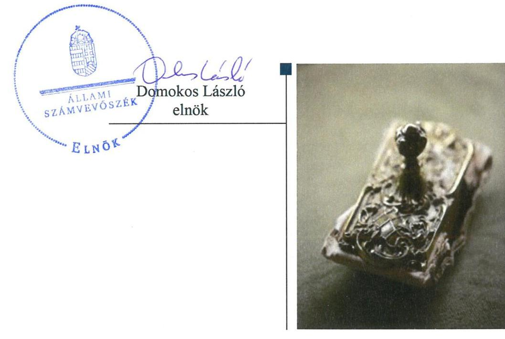

# Jelentés 

## Önkormányzatok ellenőrzése

Integritás- és belső kontrollrendszer, Befektetési tevékenységek ellenőrzése - Tótvázsony Község Önkormányzata
2019.

---

# Jelentés 

## Önkormányzatok ellenőrzése

Integritás- és belső kontrollrendszer, Befektetési tevékenységek ellenőrzése - Tótvázsony Község Önkormányzata
2019. 10. hó 13. nap

---

# AZ ELLENŐRZÉST FELÜGYELTE:

- VARGA EDIT felügyeleti vezető
- AZ ELLENŐRZÉST VEZETTE ÉS A VÉGREHAJTÁSÁÉRT FELELŐS:
  - RÁCZKEVI KATALIN ellenőrzésvezető
  - A PROGRAM ÖSSZEÁLLÍTÁSÁÉRT FELELŐS:
    - TÓTPÁL SZABOLCS osztályvezető

**IKTATÓSZÁM:** EL-1956-001/2019.

**TÉMASZÁM:** 2485

**ELLENŐRZÉS-AZONOSÍTÓ SZÁM:** V082908

Jelentéseink az Országgyűlés számítógépes hálózatán és az Interneta a www.asz.hu címen is olvashatóak.

---

# TARTALOMJEGYZÉK 

■ ÖSSZEGZÉS ..... 5
■ AZ ELLENŐRZÉS CÉLJA ..... 6
■ AZ ELLENŐRZÉS TERÜLETE ..... 7
■ AZ ELLENŐRZÉS HÁTTERE, INDOKOLTSÁGA ..... 8
■ A JELENTÉS LÉNYEGES KÉRDÉSKÖREI ..... 9
■ AZ ELLENŐRZÉS HATÓKÖRE ÉS MÓDSZEREI ..... 10
■ MEGÁLLAPÍTÁSOK ..... 12
■ JAVASLATOK ..... 14
■ MELLÉKLETEK ..... 17
I. sz. melléklet: Értelmező szótár ..... 17
■ FÜGGELÉK: ÉSZREVÉTELEK ..... 19
■ RÖVIDÍTÉSEK JEGYZÉKE ..... 21

---

.

---

# ÖSSZEGZÉS 

Tótvázsony Község Önkormányzata belső kontrollrendszerének kialakítása és müködtetése nem volt szabályszerű, ezáltal nem volt biztosított a közpénzekkel, a nemzeti vagyonnal való gazdaságos, átlátható és felelős gazdálkodás és nem biztosította a befektetési tevékenységek szabályszerű végzését. Az integritási kontrollokat nem építették ki, így a korrupciós veszélyekkel szemben nem volt védett Tótvázsony Község Önkormányzata.

## Az ellenőrzés társadalmi indokoltsága

Az Állami Számvevőszék alapvető feladata a közpénzekkel, az állami és önkormányzati vagyonnal való gazdálkodás ellenőrzése. Az Alaptörvény szerint az önkormányzatok kötelezettsége a kiegyensúlyozott, átlátható és fenntartható költségvetési gazdálkodás elvének érvényesítése, a nemzeti vagyonnal való rendeltetésszerű és felelős módon való gazdálkodás biztosítása. Az Állami Számvevőszék stratégiájában megfogalmazott célkitűzése az integritás alapú, átlátható és elszámoltatható közpénzfelhasználás elősegítése. Ennek megvalósítása érdekében az Állami Számvevőszék prioritásként kezeli a közpénzzel gazdálkodó szervezetek esetében a belső kontrollrendszer múködésének ellenőrzését.

Tótvázsony Község Önkormányzatát az Állami Számvevőszék korábban nem ellenőrizte.

## Főbb megállapítások, következtetések

Tótvázsony Község Önkormányzata belső kontrollrendszerének kialakítása és múködtetése a 2017. évben nem volt szabályszerű, a befektetési tevékenység szabályszerű végzése nem volt biztosított a 2013 - 2017. években.

A kontrollkörnyezet kialakítása nem volt szabályszerű, mert a jegyző a szabályszerű gazdálkodás feltételeit nem alakította ki. A kockázatkezelési rendszer nem volt szabályszerű, a jegyző az előírásoknak megfelelő integrált kockázatkezelési rendszert nem alakította ki, a szervezet tevékenységében rejlő és a szervezeti célokkal összefüggő kockázatokat nem mérte fel. Az információs és kommunikációs folyamatokat a jegyző nem alakította ki, ezáltal az adatok védelme, az adatok szabályszerű kezelése nem volt biztosított. A monitoring rendszert a jegyző nem alakította ki, a Közös Önkormányzati Hivatal belső ellenőrzési feladatainak ellátására szerződést nem kötöttek.

A szervezet integritását támogató kontrollok kialakítása nem történt meg, így a korrupciós kockázatokat nem kezelték.

Tótvázsony Község Önkormányzatánál nem alakították ki a teljesítmény mérésére alkalmas követelményeket.
Az Állami Számvevőszék a jelentésben foglalt megállapítások alapján Tótvázsony Község Önkormányzata polgármesterének kettő, a Tótvázsonyi Közös Önkormányzati Hivatal jegyzője részére pedig 7 javaslatot fogalmazott meg. A javaslatokat megalapozó megállapításokra az érintetteknek 30 napon belül intézkedési tervet kell készíteniük.

---

# AZ ELLENŐRZÉS CÉLJA 

Az ellenőrzés célja annak megállapítása volt, hogy az önkormányzat belső kontrollrendszere biztosította-e a közpénzekkel és a nemzeti vagyonnal történő elszámoltatható, átlátható, szabályszerű, gazdaságos, hatékony és eredményes gazdálkodás feltételeit, a kontrollkörnyezet biztosította-e a befektetési tevékenységek szabályszerű végzését. Az ellenőrzés keretében értékeltük, hogy az önkormányzatnál kiépítették és erősítették-e a korrupciós kockázatok kezelését szolgáló integritás kontrollokat, megteremtették-e a teljesítményellenőrzés feltételeit, továbbá az egyes befektetési tevékenységekkel kapcsolatos döntéshozatal és a döntések végrehajtása, valamint az egyes befektetések számviteli elszámolása, nyilvántartása szabályszerű volt-e, és a belső és külső ellenőrzések támogatták-e az egyes befektetési tevékenységek szabályszerű végzését.

---

# AZ ELLENŐRZÉS TERÜLETE 

## Tótvázsony Község Önkormányzata

Tótvázsony település Veszprém megyében található, állandó lakosainak száma 2017. január 1-jén 1332 fő volt a Központi Statisztikai Hivatal Magyarország közigazgatási helynévkönyve adatai alapján.

Az Önkormányzat ${ }^{1}$ gazdasági feladatait a Közös Önkormányzati Hivatal ${ }_{1,2}{ }^{2}$ látta el.

Az Önkormányzat hét tagú képviselő-testületének ${ }^{3}$ munkáját egy állandó bizottság segítette. A polgármester ${ }^{4}$ a 2014. évi önkormányzati választások óta töltötte be tisztségét, az ellenőrzött időszakban a jegyző ${ }_{1}{ }^{5}$ személyében változás következett be, az új jegyző ${ }_{6}{ }^{6}$ 2017. június 1-jétől látta el feladatát.

A Közös Önkormányzati Hivatalban ${ }_{2}$ foglalkoztatott köztisztviselők, kormánytisztviselők száma 2017. év végén 8 fő-, a munka törvénykönyve szerint foglalkoztatottak száma 1 fő volt.

Az Önkormányzat a 2017. évi éves költségvetési beszámoló szerint 349,6 millió Ft költségvetési bevételt ért el, valamint 211,8 millió Ft költségvetési kiadást teljesített, vagyonának értéke 2017. december 31-én 1690,7 millió Ft volt.

Az Önkormányzat 2017. december 31-én 80,0 millió Ft forgatási célú értékpapírral (kincstárjegy) és 3,2 millió Ft könyv szerinti értékű üzleti célú ingatlannal rendelkezett.

---

# AZ ELLENŐRZÉS HÁTTERE, INDOKOLTSÁGA 

A BELSŐ KONTROLLRENDSZER kialakítása és múködtetése nélkül nem valósítható meg a közpénzek, a közvagyon átlátható, szabályos, gazdaságos, hatékony és eredményes felhasználása. A belső kontrollrendszer azt a célt szolgálja, hogy a költségvetési szervek múködésük és gazdálkodásuk során a tevékenységeket szabályszerűen hajtsák végre, teljesítsék elszámolási kötelezettségeiket és megvédjék az erőforrásokat a veszteségektől, a károktól és a nem rendeltetésszerű használattól.

A belső kontrollrendszer magában foglalja mindazon elveket, eljárásokat és belső szabályzatokat, melyek biztosítják, hogy a költségvetési szerv valamennyi tevékenysége és célja összhangban legyen a szabályszerűséggel, szabályozottsággal, valamint a gazdaságosság, hatékonyság és eredményesség követelményeivel, az eszközökkel és forrásokkal való gazdálkodásban ne kerüljön sor pazarlásra, visszaélésre, rendeltetésellenes felhasználásra. Megfelelő, pontos és naprakész információk álljanak rendelkezésre a költségvetési szerv múködésével kapcsolatosan, és a belső kontrollrendszer harmonizációjára, össze-hangolására vonatkozó jogszabályok végrehajtásra kerüljenek. Az integritás kontrollok kiépítése, erősítése a szervezet korrupciós kockázatainak kezelését szolgálja. A teljesítménykövetelmények meghatározása és múködtetése megalapozhatja az önkormányzatoknál a teljesítményellenőrzés lefolytatását.

## AZ ÖNKORMÁNYZATI VAGYONGAZDÁLKODÁS ker

etében az önkormányzatok átmenetileg szabad pénzeszközeinek befektetését jogszabály nem tiltja, a befektetések jellege nem korlátozott, a pénzpiaci szolgáltatók közül az önkormányzatok a kínált szolgáltatás és annak költségei alapján, szabadon választhatnak, azonban a veszteséges gazdálkodás kockázatai és következményei az önkormányzatokat terhelik. A szabad pénzeszközök felhasználása során kiemelten fontos a felelős gazdálkodás érvényesülése, amely összhangban kell, hogy legyen, az önkormányzati gazdálkodás alapelveivel.

Az ellenőrzéssel feltárásra kerülhetnek azok a kockázatok, amelyek az önkormányzatok gazdálkodásával, ezen belül befektetési tevékenységeivel, kontrollkörnyezetével kapcsolatosak és a befektetési tevékenységek szabályszerű végrehajtását befolyásolják. Az ellenőrzéssel az önkormányzatok befektetési/vagyongazdálkodási döntései értékelhetővé válnak, és megalapozott megállapítás tehető arra vonatkozóan, hogy milyen hatást gyakoroltak az önkormányzat vagyonára a képviselő-testület döntései.

---

# A JELENTÉS LÉNYEGES KÉRDÉSKÖREI 

1. Az Önkormányzat belső kontrollrendszerének kialakítása és müködtetése szabályszerű volt-e a 2017. évben?
2. Az Önkormányzatnál alakítottak-e ki a szervezeti teljesítmény mérésére alkalmas követelményeket?
3. A jogszabályi előírásoknak megfelelően alakították-e ki az Önkormányzatnál a belső kontrollrendszert, a befektetési tevékenységek szabályszerű végzését a kiépített belső kontrollrendszer biztositotta-e 2013-2017. években?

---

# AZ ELLENŐRZÉS HATÓKÖRE ÉS MÓDSZEREI 

## Az ellenőrzés típusa

Megfelelőségi ellenőrzés.

## Az ellenőrzött időszak

A belső kontrollrendszer ellenőrzésére vonatkozóan az ellenőrzött időszak 2017. év, ill. az éves költségvetési beszámoló Áht. ${ }^{7}$ által megállapított jóváhagyásáig (2018. május 31-ig) tartó időszak volt, a befektetési tevékenység vonatkozásában 2013. január 1. - 2017. december 31. közötti időszak, továbbá a 2013. január 1. előtti időszak is, amennyiben a 2017. december 31-én meglévő befektetésekkel kapcsolatos döntéshozatalra a 2013. január 1. előtti időszakban került sor.

## Az ellenőrzés tárgya

Tótvázsony Község Önkormányzata, és a gazdálkodási feladatokat ellátó Tótvázsony Közös Önkormányzati Hivatal belső kontrollrendszerének kialakítása és múködtetése, valamint az integritási kontrollok kiépítettsége, a teljesítményellenőrzés feltételei.

Tótvázsony Község Önkormányzata 2017. december 31-én meglévő, a Számv. tv8. 3. § (6) bekezdés 2. és 3. pontja szerint az értékpapírokban megtestesülő befektetései, lekötött betétei. Továbbá a 2017. december 31-én meglévő, az önkormányzat szabad pénzeszközei terhére, adásvételi szerződés keretében megszerzett, a kötelező feladatok ellátását nem szolgáló, az Önkormányzat üzleti vagyonába tartozó ingatlanok; az üzleti vagyon körébe tartozó, befektetési céllal megszerzett, de még használatba nem vett ingatlan beruházások, továbbá az - időkorlátozás nélkül megszerzett - kulturális javak (műtárgyak, műalkotások, stb.), illetve egyéb értéktárgyak (pl. ékszerek, befektetési nemesfém.

## Az ellenőrzött szervezet

Tótvázsony Község Önkormányzata, valamint Tótvázsonyi Közös Önkormányzati Hivatal.

## Az ellenőrzés jogalapja

Az ellenőrzés jogszabályi alapját az ÁSZ tv ${ }^{9}$. 1. § (3) bekezdés, 5. § (2) és (6) bekezdései, valamint az Áht. 61. § (2) bekezdésének előírásai képezik.

---

# Az ellenőrzés módszerei 

Az ÁSZ ${ }^{10}$ az ellenőrzést az ellenőrzési program szempontjai, az ellenőrzött időszakban hatályos jogszabályok, az ellenőrzés szakmai szabályai, a jelen ellenőrzésre irányadó ÁSZ módszertanok figyelembevételével hajtotta végre.

Az ellenőrzési kérdések megválaszolásához szükséges bizonyítékok megszerzése az ellenőrzött által rendelkezésre bocsátott dokumentumokra, adatokra alapozva megfigyelés, szemle (szemrevételezés), kérdésfeltevés (információkérés), mintavételezés, valamint elemző eljárás útján történt. Az ellenőrzési bizonyítékként felhasználható adatforrások közé tartoztak az ellenőrzési program részletes szempontjainál felsorolt adatforrások, valamint minden egyéb - az ellenőrzés folyamán feltárt, az ellenőrzés szempontjából információt tartalmazó - dokumentum.

Az ellenőrzés lefolytatásához az ellenőrzött szervezet tanúsítványok kitöltésével, valamint az ÁSZ által kért dokumentumok megküldésével szolgáltatott adatokat, amelyek valódiságát és teljes körűségét az ellenőrzött szervezet vezetője által tett teljességi és hitelességi nyilatkozat igazolta. A rendelkezésre bocsátott adatok, információk kontrollja az ellenőrzés keretében történt.

Az Önkormányzat belső kontrollrendszere egyes pilléreinek kialakítására és működtetésére vonatkozó értékelés:
$\longrightarrow$ „szabályszerú", amennyiben az értékelt területen az elért „igen" válaszok százalékban kifejezett, egész számra kerekített aránya legalább $85 \%$,
$\longrightarrow$ „nem szabályszerű", ha nem éri el a 85\%-ot.
Az Önkormányzat belső kontrollrendszerének összesített értékelése az egyes részterületek esetében kapott megfelelőségi arányok számtani átlaga alapján történt és megegyezett a pillérenként (kontroll-területenként) alkalmazott százalékos értékelésekkel, a következő eltérésekkel: a kontrollrendszer egésze esetében a „szabályszerű" értékelésnek a százalékos értéken felül további feltétele volt, hogy egyik kontrollterület sem kaphatott „nem szabályszerű" értékelést.

A kiadások teljesítéséhez kapcsolódó pénzgazdálkodási belső kontrollok működésének szabályszerűsége esetében az ellenőrzés azokra a legnagyobb értékű tételekre - a lényeges sokaságra - terjedt ki, melyek összértéke elérte a teljes sokaság összértékének 50\%-át.

A lényeges sokaságból véletlen mintavételi eljárással kiválasztott tételek kerültek ellenőrzésre.
„Szabályszerűnek" értékeltünk egy ellenőrzött területet, amennyiben 95\%-os bizonyossággal az ellenőrzött sokaságban az átlagos hibaarány legfeljebb 10\%, "nem szabályszerűnek", amennyiben 10\%-nál magasabb arányt képviselt.

Az ellenőrzés ideje alatt az ellenőrzött szervezettel történő kapcsolattartást az ÁSZ SZMSZ ${ }^{11}$-ének vonatkozó előírásai alapján biztosította az ÁSZ.

---

# 1. Az Önkormányzat belső kontrollrendszerének kialakítása és múködtetése szabályszerű volt-e a 2017. évben? 

Összegző megállapítás

Az Önkormányzat belső kontrollrendszerének kialakítása és múködtetése nem volt szabályszerű.

A KONTROLLKÖRNYEZET KIALAKÍTÁSA nem volt szabályszerű, mert a jegyző ${ }_{1,2}$ nem biztosította a szabályszerű gazdálkodás feltételeit. A Számv. tv ${ }^{12}$. 14. § (5) bekezdés b) pontjának előírása ellenére nem készítette el az Önkormányzat és a Közös Önkormányzati Hivatal2 eszközök és források értékelési szabályzatát.

Az Önkormányzat a Számv. tv. 161. § (1) bekezdésében és az Áhsz. 51. § (2) bekezdésében előírtak ellenére nem rendelkezett számlarenddel, valamint a Számv tv. 161. § (2) bekezdésének d) pontjában előírt bizonylati renddel.

A jegyző ${ }_{1,2}$ nem készítette el a $\mathrm{Bkr}^{13}$. 6. § (3) bekezdésében foglalt előírások ellenére a Közös Önkormányzati Hivatal ${ }_{2}$ ellenőrzési nyomvonalát.

A KOCKÁZATKEZELÉSI RENDSZER kialakítása és múködtetése nem volt szabályszerű, mert a jegyző ${ }_{1-2}$ :
nem szabályozta szervezeti integritást sértő események kezelésének eljárásrendjét, valamint az integrált kockázatkezelés eljárásrendjét a Bkr. 6. § (4) bekezdésében előírtak ellenére;
nem működtette az integrált kockázatkezelési rendszert a Bkr. 7. § (1) bekezdésében előírtak ellenére, mert nem mérte fel és állapította meg a Közös Önkormányzati Hivatal ${ }_{2}$ tevékenységében rejlő és szervezeti célokkal összefüggő kockázatokat, valamint nem határozta meg az egyes kockázatokkal kapcsolatban szükséges intézkedéseket, valamint azok teljesítésének folyamatos nyomon követésének módját a Bkr. 7. § (2) bekezdése előírásainak ellenére.

## AZ INFORMÁCIÓS ÉS KOMMUNIKÁCIÓS RENDSZER kialakítása nem volt szabályszerű, mert a jegyző ${ }_{1-2}$ nem adta ki a Közös Önkormányzati Hivatal ${ }_{2}$ iratkezelési szabályzatát az Ltv. ${ }^{14} 10 . \S$ (1) bekezdés c) pontjában foglaltak ellenére. A polgármester nem készítette el az Önkormányzat, a jegyző ${ }_{1-2}$ a Közös Önkormányzati Hivatal ${ }_{2}$ adatvédelmi és adatbiztonsági szabályzatát az Info tv. ${ }^{15}$ 24. § (3) bekezdésének előírása ellenére.

A MONITORING-RENDSZERT a jegyző ${ }_{1-2}$ nem alakította ki, mert az Áht. 70. § (1) bekezdés előírása ellenére nem gondoskodott a belső ellenőrzés kialakításáról a Közös Önkormányzati Hivatal ${ }_{2}$ vonatkozásában.

A jegyző ${ }_{1}$ a Bkr. 11. § (1) bekezdés előírása ellenére, figyelemmel a Bkr. 11.§ (4) bekezdés előírására a belső kontrollrendszer minőségét 2017. január 1. és 2017. május 31. közötti időszak vonatkozásában nem értékelte.

---

AZ INTEGRITÁST erősítő kontrollokat az Önkormányzat nem építette ki.

# 2. Az Önkormányzatnál alakítottak-e ki a szervezeti teljesítmény mérésére alkalmas követelményeket? 

## Összegző megállapítás

Az Önkormányzatnál a szervezeti teljesítmény mérésére alkalmas követelményeket nem alakítottak ki.

A szervezeti célok elérését szolgáló feladatok, folyamatok, tevékenységek mérését szolgáló indikátorokat, mérőszámokat, feladat- és teljesítménymutatókat a jegyző nem alakított ki, ezért az Önkormányzatnál a teljesítmény mérésének lehetősége nem volt biztosított.

## 3. A jogszabályi előírásoknak megfelelően alakították-e ki az Önkormányzatnál a belső kontrollrendszert, a befektetési tevékenységek szabályszerű végzését a kiépített belső kontrollrendszer biztosította-e 2013-2017. években?

Összegző megállapítás

Az Önkormányzatnál nem a jogszabályi előírásoknak megfelelően alakították ki a belső kontrollrendszert, a befektetési tevékenységek szabályszerű végzését a belső kontrollrendszer nem biztosította a 2013-2017. években.

Az Önkormányzat 2013-2014. éveket érintően nem rendelkezett dokumentumokkal a Közös Önkormányzati Hivatal ${ }_{1}$ - befektetési tevékenységek szabályszerű végzését támogató belső kontrollrendszer kiépítésével kapcsolatos - feladatellátása vonatkozásában.

A belső kontrollrendszer kialakítása során nem tartották be a jogszabályi előírásokat, a belső kontrollrendszer nem biztosította a befektetési tevékenységek szabályszerű végzését, mert:
$\longrightarrow$ az Önkormányzat nem rendelkezett szervezeti és müködési szabályzattal 2013. január 1. és 2013. november 29. közötti időszakban a Mötv. ${ }^{16}$ 43. § (3) bekezdés előírása ellenére;
$\longrightarrow$ az Önkormányzat és a Közös Önkormányzati Hivatal ${ }_{2}$ nem rendelkezett a Számv. tv. 14. § (5) bekezdés a) pontja előírása ellenére eszközök és a források értékelési szabályzatával a 2015. január 1. és 2017. december 31. közötti időszakban.

---

# JAVASLATOK 

Az ÁSZ tv. 33. § (1) bekezdésében foglaltak értelmében az ellenőrzött szervezet vezetője köteles a jelentésben foglalt megállapításokhoz kapcsolódó intézkedési tervet összeállítani és azt a jelentés kézhezvételétől számított 30 napon belül az ÁSZ részére megküldeni. Amennyiben az ellenőrzött szervezet vezetője nem küldi meg határidőben az intézkedési tervet, vagy továbbra sem elfogadható intézkedési tervet küld, az Állami Számvevőszék elnöke az ÁSZ tv. 33. § (3) bekezdése a) és b) pontjaiban foglaltakat érvényesítheti.

## Tótvázsonyi Közös Önkormányzati Hivatal jegyzőjének

1. A szabályszerű kontrollkörnyezet kialakítása érdekében gondoskodjon:
a) az Önkormányzat és a Közös Önkormányzati Hivatal2 vonatkozásában az eszközök és a források értékelési szabályzatának elkészitéséről;
(1. sz. megállapítás 1. bekezdése alapján)
b) a Közös Önkormányzati Hivatal2 vonatkozásában az ellenőrzési nyomvonal elkészitéséről.
(1. sz. megállapítás 3. bekezdése alapján)
2. A szabályszerű kockázatkezelési rendszer kialakítása és müködtetése érdekében gondoskodjon:
a) a szervezeti integritást sértő események kezelése eljárásrendjének, valamint az integrált kockázatkezelés eljárásrendjének szabályozásáról;
(1. sz. megállapítás 4. bekezdés 1. francia bekezdése alapján)
b) a Közös Önkormányzati Hivatal2 tevékenységében rejlő és szervezeti célokkal összefüggő kockázatok felméréséről és megállapításáról, az egyes kockázatokkal kapcsolatban szükséges intézkedések, valamint azok teljesítésének folyamatos nyomon követése módjának meghatározásáról.
(1. sz. megállapítás 4. bekezdés 2. francia bekezdése alapján)
3. Az információs és kommunikációs rendszer szabályszerű kialakítása érdekében gondoskodjon a Közös Önkormányzati Hivatal2:
a) iratkezelési szabályzatának kiadásáról;
(1. sz. megállapítás 5. bekezdés 1. mondata alapján)

---

b) adatvédelmi és adatbiztonsági szabályzatának elkészitéséről.
(1. sz. megállapítás 5. bekezdés 2. mondata alapján)
4. A szabályszerű monitoring rendszer kialakítása érdekében gondoskodjon a Közös Önkormányzati Hivatalı, belső ellenőrzésének kialakításáról.
(1. sz. megállapítás 6. bekezdése alapján)

# Tótvázsony Község Önkormányzata polgármesterének 

1. Gondoskodjon az Önkormányzat számlarendjének és bizonylati rendjének elkészitéséről.
(1. sz. megállapítás 2. bekezdése alapján)
2. Gondoskodjon az Önkormányzat adatvédelmi és adatbiztonsági szabályzatának elkészitéséről.
(1. sz. megállapítás 5. bekezdés 2. mondata alapján)

---

.

---

# MELLÉKLETEK 

- I. SZ. MELLÉKLET: ÉRTELMEZŐ SZÓTÁR
belső ellenőrzés
belső kontrollrendszer
belső kontrollrendszer pillérei, kontrollterületei
helyi önkormányzat
információs és kommunikációs rendszer
integritás

Független, tárgyilagos bizonyosságot adó és tanácsadó tevékenység, amelynek célja, hogy az ellenőrzött szervezet működését fejlessze és eredményességét növelje, az ellenőrzött szervezet céljai elérése érdekében rendszerszemléletű megközelítéssel és módszeresen értékeli, illetve fejleszti az ellenőrzött szervezet irányítási és belső kontrollrendszerének hatékonyságát. (Forrás: Bkr. 2. § b) pontja)
A belső kontrollrendszer a kockázatok kezelése és tárgyilagos bizonyosság megszerzése érdekében kialakított folyamatrendszer, amely azt a célt szolgálja, hogy a müködés és gazdálkodás során a tevékenységeket szabályszerűen, gazdaságosan, hatékonyan, eredményesen hajtsák végre, az elszámolási kötelezettségeket teljesítsék, megvédjék az erőforrásokat a veszteségektől, károktól és nem rendeltetésszerű használattól. (Forrás: Áht. 69. § (1) bekezdése)
A kontrollkörnyezet, az (integrált) kockázatkezelési rendszer, a kontrolltevékenységek, az információs és kommunikációs rendszer, valamint a nyomon követési (monitoring) rendszer. (Forrás: Bkr. 3. §-a)
A helyi önkormányzat jogi személy. Az önkormányzati feladatok ellátását a képviselő-testület és szervei biztosítják. A képviselő-testület szervei: a polgármester, a főpolgármester, a megyei közgyűlés elnöke, a képviselő-testület bizottságai, a részönkormányzat testülete, az önkormányzati hivatal, a megyei önkormányzati hivatal, a közös önkormányzati hivatal, a jegyző, továbbá a társulás. A képviselő-testület a feladatkörébe tartozó közszolgáltatások ellátására - jogszabályban meghatározottak szerint - költségvetési szervet, a polgári perrendtartásról szóló törvény szerinti gazdálkodó szervezetet (a továbbiakban: gazdálkodó szervezet), nonprofit szervezetet és egyéb szervezetet (a továbbiakban együtt: intézmény) alapíthat, továbbá szerződést köthet természetes és jogi személlyel vagy jogi személyiséggel nem rendelkező szervezettel. A helyi önkormányzat éves költségvetési beszámolója magában foglalja a helyi önkormányzat - nem költségvetési szerveihez tartozó - feladataihoz kapcsolódó bevételeket és kiadásokat. A helyi önkormányzat összevont (konszolidált) költségvetési beszámolóját a helyi önkormányzatra és költségvetési szerveire vonatkozóan külön-külön beérkezett éves költségvetési beszámolók alapján a Kincstár készíti el és küldi meg az önkormányzatnak. (Forrás: Mötv. 41. § (1), (2), (6) bekezdései; Áhsz. 2. § (1) bekezdése, 6. § (1) bekezdés a) és f) pontja, 30. §-a, 37. § (1) és (6) bekezdése)
A költségvetési szerv vezetője által kialakított és működtetett olyan rendszer, mely biztosítja, hogy a megfelelő információk a megfelelő időben eljutnak az illetékes szervezethez, szervezeti egységhez, illetve személyhez. (Forrás: Bkr. 9. § (1) bekezdés)

Az integritás elvek, értékek, cselekvések, módszerek, intézkedések konzisztenciáját jelenti: olyan magatartásmódot, amely meghatározott értékeknek felel meg. Az integritás a közszféra esetében a társadalom által elvárt nyilvánossági, átláthatósági, illetve jogi/etikai normáknak történő megfelelést jelenti.

---

kockázatkezelési rendszer
kontrollkörnyezet
kontrolltevékenységek
költségvetési szerv vezetője (Bkr. alkalmazásában)
közös önkormányzati hivatal
(Forrás: a http://integritas.asz.hu honlapon közzétett „A 2012. évi integritás felmérés eredményeinek összefoglalója" című dokumentum 3. oldal 1. bekezdése)
Olyan irányítási eszközök és módszerek összessége, melynek elemei a szervezeti célok elérését veszélyeztető tényezők (kockázatok) azonosítása, elemzése, csoportosítása, nyomon követése, valamint szükség esetén a kockázati kitettség mérséklése. (Forrás: Bkr. 2. § m) pontja)
A költségvetési szerv vezetője által kialakított olyan elvek, eljárások, belső szabályzatok összessége, amelyben világos a szervezeti struktúra, egyértelműek a felelősségi, hatásköri viszonyok és feladatok, meghatározottak az etikai elvárások a szervezet minden szintjén, átlátható a humánerőforrás-kezelés. (Forrás: Bkr. 6. § (1) bekezdés)
A költségvetési szerv vezetője által a szervezeten belül kialakított (kontroll) tevékenységek, melyek biztosítják a kockázatok kezelését, hozzájárulnak a szervezet céljainak eléréséhez. (Forrás: Bkr. 8. § (1) bekezdés)
Helyi önkormányzat esetén a jegyző, főjegyző, társulás esetén a társulási megállapodásban meghatározott önkormányzat jegyzője. (Forrás: Bkr. 2. § n) pont nb) alpont)
települési képviselő-testület más települési képviselő-testülettel társult kép-viselő-testületet alakíthat, amely esetén a képviselő-testületek részben vagy egészben egyesítik a költségvetésüket, közös önkormányzati hivatalt tartanak fenn, és intézményeiket közösen működtetik. (Forrás: Mötv. 56. § (1)-(2) bekezdései)

---

# FÜGGELÉK: ÉSZREVÉTELEK 

A jelentéstervezetet a Számvevőszék 15 napos észrevételezésre megküldte az ellenőrzött szervezetek vezetőinek az ÁSZ tv. 29. §* (1) bekezdése előírásának megfelelően.

Az ÁSZ a jelentéstervezetet észrevételezésre megküldte Tótvázsony Község Önkormányzatának polgármestere és a Tótvázsonyi Közös Önkormányzati Hivatal jegyzője részére.
Tótvázsony Község Önkormányzatának polgármestere és a Tótvázsonyi Közös Önkormányzati Hivatal jegyzője az ÁSZ tv. 29. § (2) bekezdésében foglalt észrevételezési jogukkal nem éltek, a jelentéstervezet megállapításaira a törvényes határidőn belül észrevételt nem tettek.

[^0]
[^0]:    * 29. § (1) Az Állami Számvevőszék az ellenőrzési megállapításait megküldi az ellenőrzött szervezet vezetőjének vagy az általa megbízott személynek, és annak, akinek személyes felelősségét állapította meg.
    (2) Az ellenőrzött szervezet vezetője és a felelősként megjelölt személy az ellenőrzés megállapításaira tizenöt napon belül írásban észrevételt tehet.
    (3) Az Állami Számvevőszék az észrevételre a beérkezésétől számított harminc napon belül írásban válaszol. A figyelembe nem vett észrevételeket köteles a jelentésben feltüntetni, és megindokolni, hogy azokat miért nem fogadta el.

---

.

---

# RÖVIDÍTÉSEK JEGYZÉKE 

${ }^{1}$ Önkormányzat
${ }^{2}$ Közös Önkormányzati Hivatal ${ }_{1,2}$

Tótvázsony Község Önkormányzata
Közös Önkormányzati Hivatal: Veszprém Megyei Jogú Város Polgármesteri Hivatala 2013. március 1. - 2014. december 31. (Fenntartói: Veszprém Megyei Jogú Város Önkormányzata, Eplény Község Önkormányzata, Hidegkút Község Önkormányzata, Tótvázsony Község Önkormányzata)
Közös Önkormányzati Hivatal: Tótvázsony Közös Önkormányzati Hivatal 2015. január 1-től. (Fenntartói: Barnag Község Önkormányzata, Hidegkút Község Önkormányzata, Tótvázsony Község Önkormányzata, Vöröskút Község Önkormányzata)
Tótvázsony Község Önkormányzata képviselő-testülete
Tótvázsony Község Önkormányzatának polgármestere
Tótvázsony Közös Önkormányzati Hivatal jegyzője 2017. május 31-ig
Tótvázsony Közös Önkormányzati Hivatal jegyzője 2017. június 1-jétől
2011. évi CXCV. törvény az államháztartásról
2000. évi C. törvény a számvitelről (hatályos: 2001. január 1-jétől)
2011. évi LXV. törvény az Állami Számvevőszékről

Állami Számvevőszék
Állami Számvevőszék Szervezeti és Működési Szabályzata
2000. évi C. törvény a számvitelről

370/2011. (XII. 31.) Korm. rendelet a költségvetési szervek belső
kontrollrendszeréről és belső ellenőrzéséről
1995. évi LXVI. törvény a köziratokról, a közlevéltárakról és a magánlevéltári anyag védelméről (hatályos: 1996. január 1-től)
2011. évi CXII. törvény az az információs önrendelkezési jogról és az információszabadságról (hatályos: 2011. július 27-től)
2011. évi CLXXXIX. törvény Magyarország helyi önkormányzatairól

---

# ÁLLAMI SZÁMVEVŐSZÉK 

1052 Budapest, Apáczai Csere János utca 10.
Levélcím: 1364 Budapest 4. Pf. 54
Telefon: +36 14849100 Telefax: +36 14849200
www.asz.hu