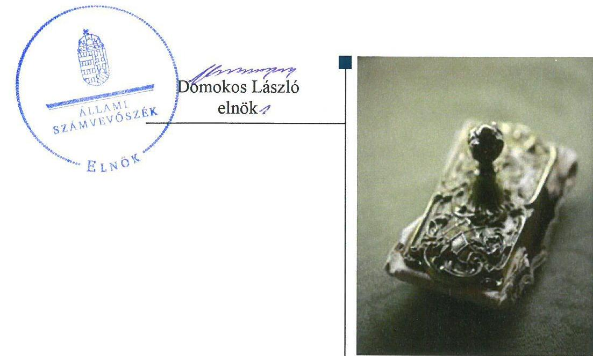
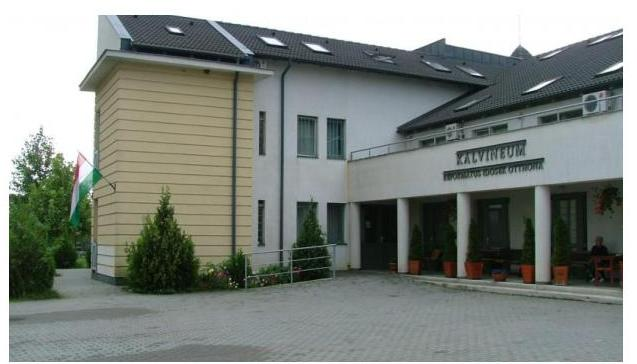

# Jelentés 

## Nem állami humánszolgáltatók ellenőrzése

A humánszolgáltatást nyújtó államháztartáson kívüli szociális intézmények, szolgáltatók fenntartói központi költségvetésből kapott támogatásai felhasználásának ellenőrzése Nyíregyháza-Városi Református Egyházközség 2019. 09. hó 24. nap

---

# AZ ELLENŐRZÉST FELÜGYELTE:

- VARGA EDIT felügyeleti vezető
- AZ ELLENŐRZÉST VEZETTE ÉS A VÉGREHAJTÁSÁÉRT FELELŐS:
  - DR. PELLEI TAMÁS ellenőrzésvezető
  - A PROGRAM ÖSSZEÁLLÍTÁSÁÉRT FELELŐS:
    - TÓTPÁL SZABOLCS osztályvezető

**IKTATÓSZÁM:** EL-1957-001/2019.

**TÉMASZÁM:** 2491

**ELLENŐRZÉS-AZONOSÍTÓ SZÁM:** V083561

Jelentéseink az Országgyűlés számítógépes hálózatán és az Interneten a www.asz.hu címen is olvashatóak.

---

# TARTALOMJEGYZÉK 

- ÖSSZEGZÉS ..... 5
- AZ ELLENŐRZÉS CÉLJA ..... 6
- AZ ELLENŐRZÉS TERÜLETE ..... 7
- AZ ELLENŐRZÉS HÁTTERE, INDOKOLTSÁGA ..... 8
- A JELENTÉS LÉNYEGES KÉRDÉSKÖREI ..... 9
- AZ ELLENŐRZÉS HATÓKÖRE ÉS MÓDSZEREI ..... 10
- MEGÁLLAPÍTÁSOK ..... 12
- MELLÉKLETEK ..... 15
I. sz. melléklet: Értelmező szótár ..... 15
- FÜGGELÉK: ÉSZREVÉTELEK ..... 17
- RÖVIDÍTÉSEK JEGYZÉKE ..... 19

---

.

---

# ÖSSZEGZÉS 

A Nyíregyháza-Városi Református Egyházközség a szociális humánszolgáltatási közfeladatok ellátásához kialakította a központi költségvetési támogatások átlátható, elszámoltatható igénybevételének és felhasználásának feltételeit. A központi költségvetési támogatásokat a jogszabályi előírásokat betartva, szabályszerűen továbbadta az intézményei részére.

## Az ellenőrzés társadalmi indokoltsága

Az Állami Számvevőszék a stratégiájában célul tűzte ki, hogy az államháztartáson kívülre nyújtott költségvetési támogatások ellenőrzésével hozzájárul ahhoz, hogy a közpénzeket az államháztartáson kívüli szervezetek is átlátható módon használják fel a közfeladatok szerződésben vállalt ellátása érdekében. Az Állami Számvevőszék stratégiájában foglaltak alapján is indokolt az ellenőrzés, amely a társadalom számára jelzi, hogy a közpénz államháztartáson kívüli felhasználása sem maradhat ellenőrizetlenül.

A fentieket figyelembe véve, valamint a kapott költségvetési támogatások nagyságára tekintettel egyedi kockázatelemzés alapján kiválasztott Nyíregyháza-Városi Református Egyházközségnél, mint fenntartónál értékeltük az államháztartáson kívüli szociális tevékenységhez kapcsolódó támogatások felhasználásának megfelelőségét a 2015-2017. évek vonatkozásában.

## Főbb megállapítások, következtetések

A Nyíregyháza-Városi Református Egyházközség megteremtette a szociális humánszolgáltatási közfeladatok ellátásának szervezeti feltételeit, a szakmai feladatellátás és a gazdálkodási kereteit kialakította, biztosította a költségvetési támogatások igénybevételének, felhasználásának átláthatóságát és elszámoltathatóságát.

A szociális humánszolgáltatási közfeladataihoz rendelt költségvetési támogatást szabályszerűen kezelte, elkülönítetten tartotta nyilván és a jogszabályi előírásoknak megfelelően az intézményei működtetésére fordította.

A Nyíregyháza-Városi Református Egyházközség ellenőrzési, és a külső ellenőrzésekkel kapcsolatos intézkedési kötelezettségeinek szabályszerűen eleget tett.

Az Állami Számvevőszék a jelentésben foglalt megállapítások alapján a Nyíregyháza-Városi Református Egyházközség lelkipásztora és presbiter-gondnoka részére nem fogalmazott meg javaslatot.

---

# AZ ELLENŐRZÉS CÉLJA 

AZ ELLENŐRZÉS CÉLJA annak értékelése volt, hogy a Nyíregyháza-Városi Református Egyházközség, mint szociális intézmények egyházi fenntartója a központi költségvetésből kapott támogatásainak felhasználása szabályszerű volt-e, a támogatások igénylése, évközi módosítása és év végi elszámolása megfelelt-e a jogszabályi előírásoknak.

---

# AZ ELLENŐRZÉS TERÜLETE 

## Nyíregyháza-Városi Református Egyházközség

A Nyíregyháza-Városi Református Egyházközség az Ehtv. ${ }^{1}$ és a belső egyházi alkotmány ${ }^{2}$ alapján a Magyarországi Református Egyházon belül működő önálló jogi személy, képviseletét a vezető lelkész és a gondnok látja el.

A Fenntartó ${ }^{3}$ a Magyar Köztársaság Kormánya és a Magyar Református Egyház között 1998. december 08-án kötött - a 1057/1999. (V. 26) Korm. határozatban ${ }^{4}$ közzétett - megállapodás alapján látott el szociális humánszolgáltatási közfeladatot. A megállapodás 2017. október 04-én megújításra került, annak közzététele az 1821/2017. (XI.9.) Korm. határozatban ${ }^{5}$
történt meg.
A Fenntartó az ellenőrzött időszakban Nyíregyházán négy - önálló jogi személyiséggel rendelkező és önállóan gazdálkodó - szociális humánszolgáltató Intézmény ${ }^{6}$ fenntartásával és működtetésével vett részt az önkormányzati és az állami közfeladat ellátásban. A szociális intézményei közül kettő vegyes profilú intézményként az időskorúak, a pszichiátriai betegek, valamint a fogyatékos személyek bentlakásos otthona mellett végzett nappali szociális alapszolgáltatási feladatokat. Egy intézménye nappali ellátás keretében szociális alapszolgáltatást, étkeztetést és házi segítségnyújtást, továbbá egy intézménye bölcsődei ellátást biztosított a rászoruló gyermekek részére.

A Fenntartó által a szociális humánszolgáltatási feladatok ellátásához igényelt és a Kincstár ${ }^{7}$ által elszámolásként elfogadott költségvetési támogatás összege a 2015. évben 940,4 millió Ft, a 2016. évben 989,7 millió Ft, a 2017. évben 1046,7 millió Ft volt.

A közfeladat ellátásával kapcsolatos szakmai irányítószervi feladatokat az ellenőrzött időszakban az EMMI ${ }^{8}$ látta el, a törvényességi ellenőrzési feladatokat pedig a Szabolcs-Szatmár-Bereg Megyei Kormányhivatal végezte.

---

# AZ ELLENŐRZÉS HÁTTERE, INDOKOLTSÁGA 

A szociális feladatokat ellátó nem állami intézményfenntartók részére közfeladataik ellátására évente jelentős összegű pénzügyi támogatást biztosítottak a mindenkori Kvtv. ${ }^{9}$ a bennük megfogalmazott feltételek mellett.

A költségvetési törvények a szociális ágazat feladatai ellátására 273 Mrd Ft állami támogatás előirányzatot biztosítottak a 2015-2017. években. Módosították a szociális igazgatásról és szociális ellátásokról szóló 1993. évi III. törvényt, amely - többek között - 2012. január 1-jei hatállyal megfogalmazta a finanszírozási rendszerbe történő befogadással összefüggő szabályokat.

Az ÁSZ ${ }^{10}$ stratégiájában hangsúlyos szerepet szánt annak, hogy szilárd szakmai alapokon álló, értékteremtő ellenőrzéseivel előmozdítsa a közpénzügyek átláthatóságát, rendezettségét, és javaslataival a közpénzek és a közvagyon szabályos, gazdaságos, hatékony és eredményes felhasználását segítse. Az államháztartáson kívülre nyújtott költségvetési támogatások ellenőrzésével az ÁSZ hozzájárul ahhoz, hogy a közpénzeket a nem állami humán fenntartók átlátható módon használják fel a közfeladatok ellátására kötött szerződésekben vállalt kötelezettségek teljesítése érdekében. Az ellenőrzés javaslataival hozzájárulhat az említett rendszerek szabályszerű támogatás felhasználásához, javíthatja a társadalmi-gazdasági döntések megalapozottságát, amely a „jól irányított állam" működéséhez járul hozzá.

---

# A JELENTÉS LÉNYEGES KÉRDÉSKÖREI 

1.     - A szociális humánszolgáltatási közfeladatot ellátó Fenntartó szabályszerű működési- és gazdálkodási környezet kialakításával megteremtette-e a költségvetési támogatások átlátható, elszámoltatható igénybevételének, felhasználásának feltételeit?
2.     - A Fenntartó az átvállalt szociális humánszolgáltatási közfeladathoz biztosított költségvetési támogatásokat szabályszerűen fordította-e a humánszolgáltató intézményei működtetésére?
3.     - A Fenntartó a szociális humánszolgáltató intézményei működtetéséhez felhasznált közpénzekre vonatkozó gazdálkodásával a nyilvánosság előtt elszámolt-e, ennek megalapozása érdekében ellenőrzési, és a külső ellenőrzésekkel kapcsolatos intézkedési feladatait szabályszerűen látta-e el?

---

# AZ ELLENŐRZÉS HATÓKÖRE ÉS MÓDSZEREI 

## Az ellenőrzés típusa

Megfelelőségi ellenőrzés.

## Az ellenőrzött időszak

2015. január 1-je és 2017. december 31-e közötti időszak. A helyszíni szemle tekintetében 2018. január 1-jétől 2019. március 13-áig tartó időszak.

## Az ellenőrzés tárgya

Az ellenőrzés a szociális humánszolgáltatási közfeladatokat ellátó államháztartáson kívüli fenntartó, humánszolgáltatási közfeladatai ellátásához a költségvetési törvényekben biztosított központi költségvetési támogatások igénylése, évközi módosítása és év végi elszámolása fenntartói feladatainak ellátása, illetve e központi költségvetésből kapott támogatásaik humánszolgáltatási közfeladatokra való fenntartó általi felhasználása szabályszerűségének értékelésére terjed ki.

Az ellenőrzés kiterjed minden olyan körülményre és adatra, amely az ÁSZ jogszabályban meghatározott feladatainak teljesítéséhez, valamint a program végrehajtása folyamán felmerült újabb összefüggések feltárásához szükséges.

## Az ellenőrzött szervezet

Nyíregyháza-Városi Református Egyházközség

## Az ellenőrzés jogalapja

Az ellenőrzés jogszabályi alapját az ÁSZ tv. 1. § (3) bekezdése, 5. § (3) bekezdés, valamint az 5. § (11) c) pontjában foglalt előírások adták.

## Az ellenőrzés módszerei

Az ellenőrzést az ellenőrzési program kérdései, az adott időszakban hatályos jogszabályok, az ellenőrzés szakmai szabályok és módszertanok, valamint a nemzetközi standardok figyelembevételével végezte az ÁSZ.

---

Az ellenőrzés ideje alatt az ÁSZ a Fenntartóval történő kapcsolattartást az ÁSZ SZMSZ ${ }^{11}$-ének vonatkozó előírásai alapján biztosította.

Az ellenőrzési kérdések megválaszolásához szükséges bizonyítékok megszerzése az ellenőrzött által rendelkezésre bocsátott dokumentumokra, adatokra alapozva megfigyelés, szemle (szemrevételezés), kérdésfeltevés (információkérés), valamint elemző eljárással történt.

Az ellenőrzési bizonyítékként felhasznált adatforrások közé tartoztak egyrészt a szakmai program részletes szempontjainál felsorolt adatforrások, másrészt minden - az ellenőrzés folyamán feltárt, az ellenőrzés szempontjából információt tartalmazó - dokumentum.

Az ellenőrzés lefolytatásához a Fenntartó a kitöltött tanúsítványok, valamint az ÁSZ által kért dokumentumok elektronikus úton való megküldésével szolgáltatott adatokat, információkat. Az így rendelkezésre bocsátott adatok, információk és a tanúsítványok adatai valódiságának kontrollja az ellenőrzés keretében történt.

Az ellenőrzést alapvetően a szociális humánszolgáltatások esetében a központi költségvetési támogatások igénylésével, módosításával, felhasználásával, elszámolásával kapcsolatos feladatokat ellátó Fenntartónál végeztük. A fenntartott intézményeknél helyszíni szemle keretében győződtünk meg a tényleges feladatellátásról (verifikáció).

A szociális humánszolgáltatások központi költségvetési támogatásai igénylésével, módosításával, elszámolásával kapcsolatos, államháztartáson kívüli fenntartó jogszabályokban előírt feladatai betartását, továbbá a központi költségvetési támogatások szabályszerű kezelését, nyilvántartását ellenőriztük a Fenntartónál, az ott rendelkezésre álló határozatok, nyilvántartások, beszámolók és egyéb dokumentumok alapján.

Az ellenőrzés nem terjedt ki a szociális humánszolgáltatások központi költségvetési támogatásai igénylése, módosítása, elszámolása valódiságának, megalapozottságának, helyességének - sem a fenntartónál, sem a székhely intézményeinél való - értékelésére. Továbbá nem terjedt ki az ellenőrzés e források, intézmények általi szabályszerű felhasználásának értékelésére.

---

# MEGÁLLAPÍTÁSOK 

## 1. A szociális humánszolgáltatási közfeladatot ellátó Fenntartó szabályszerű működési- és gazdálkodási környezet kialakításával megteremtette-e a költségvetési támogatások átlátható, elszámoltatható igénybevételének, felhasználásának feltételeit?

Összegző megállapítás

A Fenntartó a szabályszerű működési- és gazdálkodási környezet kialakításával megteremtette a költségvetési támogatások átlátható, elszámoltatható igénybevételének, felhasználásának feltételeit.

A Fenntartó szociális humánszolgáltatási közfeladat ellátásának szervezeti keretei, irányítási rendszere, illetve annak működése a belső egyházi alkotmányban kerültek meghatározásra, amelyek megfeleltek a Szoc. tv. ${ }^{12}$ és a Gyvt. ${ }^{13}$ előírásainak.

A Fenntartó rendelkezett a Számv.tv. ${ }^{14}$ előírása szerint számviteli politikával ${ }^{15}$ és az annak keretében kötelezően elkészítendő szabályzatokkal. A Fenntartó elkészítette és évente aktualizálta számlarendjét.

A Fenntartó a számviteli politikája keretében elkészített pénzkezelési szabályzatában rögzítette a pénzforgalom lebonyolításának rendjét, a pénzkezelés felelősségi szabályait, valamint belső szabályozásaiban definiálta a központi támogatások Intézményeknek való átadásának rendjét, illetve a felelősségi körök meghatározásával az engedélyezési, jóváhagyási és kontroll eljárásokat.

Az Atr. ${ }^{16}$ előírásai alapján a Fenntartó a számlarendjében rögzítettek szerint rendelkezett a közfeladatokhoz rendelt központi költségvetési támogatások kezelésére vonatkozóan feladatonként elkülönített és naprakész nyilvántartással.

## 2. A Fenntartó az átvállalt szociális humánszolgáltatási közfeladathoz biztosított költségvetési támogatásokat szabályszerűen fordította-e a humánszolgáltató intézményei működtetésére?

Összegző megállapítás

A Fenntartó a költségvetési támogatásokat szabályszerűen használta fel az Intézményei működtetésére.

A Fenntartó a közfeladatot ellátó Intézményei alapítói okiratait az SzCsM. rendelet ${ }^{17}$ és a Szoc.tv. előírásaival összhangban kiadta.

A Fenntartó a Szoc. tv. és a Gyvt. előírása szerint gondoskodott a közfeladatot ellátó Intézményei szervezeti és működési szabályzatainak, szakmai programjainak, valamint házirendjeinek elkészítéséről és jóváhagyásáról, azok nyilvántartásba vételéről és rendelkezett az Intézményei alapfeladat ellátásához szükséges személyi és tárgyi feltételek meglétét igazoló működési engedélyekkel.

A Fenntartó az Eszámv. ${ }^{18}$ előírásaival összhangban a számviteli politikában meghatározta a szociális humánszolgáltató feladatot ellátó Intézményei beszámoló készítési kötelezettségét.

A Fenntartó a szociális humánszolgáltatási közfeladathoz rendelt költségvetési támogatások felhasználását - Intézményeknek történő átadását - feladatonként elkülönített és naprakész nyilvántartással támasztotta alá. A költségvetési támogatásokat - a Kvtv. előírásainak megfelelően - az Intézmények részére átadta.

# 3. A Fenntartó a szociális humánszolgáltató intézményei működtetéséhez felhasznált közpénzekre vonatkozó gazdálkodásával a nyilvánosság előtt elszámolt-e, ennek megalapozása érdekében ellenőrzési, és a külső

 ellenőrzésekkel kapcsolatos intézkedési feladatait szabályszerűen látta-e el? 

Összegző megállapítás

A Fenntartó az Intézményei működtetéséhez felhasznált közpénzekre vonatkozó gazdálkodásával a nyilvánosság előtt elszámolt, ennek megalapozása érdekében ellenőrzési és a külső ellenőrzésekkel kapcsolatos intézkedési kötelezettségeinek eleget tett.

A Fenntartó az Intézményei gazdálkodásának törvényesség feletti kontrollt biztosította, a működésük törvényességét vizsgáló ellenőrzési feladatait a Felügyelő Bizottság ${ }^{19}$ és a Számvizsgáló Bizottság ${ }^{20}$ közreműködésével ellátta.

A Fenntartó a 2015-2017. évekre vonatkozóan az Intézmények törvényességi, valamint szakmai ellenőrzéseivel kapcsolatban megállapított intézkedési kötelezettségének eleget tett.

---

.

---

# MELLÉKLETEK 

- I. SZ. MELLÉKLET: ÉRTELMEZŐ SZÓTÁR
költségvetési támogatás
nem állami, nem önkormányzati (államháztartáson kívüli) intézmény fenntartó
a társadalombiztosítás pénzügyi alapjai kivételével az államháztartás központi alrendszeréből ellenérték nélkül, pénzben nyújtott támogatások (Áht. 1. § 14. pont)
A költségvetési törvényben (2016. évi XC. törvény 40. §) megállapított támogatás többek között: Átlagbéralapú támogatást állapít meg a nevelési-oktatási, valamint pedagógiai szakszolgálati intézményt fenntartó nemzetiségi önkormányzat, az egyházi és magán köznevelési intézmény fenntartója részére az általuk fenntartott nevelési-oktatási intézményben, továbbá pedagógiai szakszolgálati intézményben pedagógus és - a (3) bekezdés kivételével - a nevelő-oktató munkát közvetlenül segítő munkakörben foglalkoztatottak után a 7. melléklet I. pontjában meghatározott jogosultak után, az őket ott megillető mértékek szerint. Működési támogatást állapít meg a nemzetiségi önkormányzat vagy az egyházi jogi személy által fenntartott nevelési-oktatási intézményekben ellátott, továbbá a pedagógiai szakszolgálati intézményekben gyógypedagógiai tanácsadásban, korai fejlesztésben, oktatásban és gondozásban, valamint a fejlesztő nevelésben részt vevő gyermekekre, tanulókra tekintettel a nemzetiségi önkormányzat és a bevett egyház részére a 7. melléklet II. pontja szerint.
A köznevelési közfeladatokat/humánszolgáltatásokat ellátó intézményt fenntartó egyházi jogi személy, társadalmi szervezet, alapítvány, közalapítvány, civil szervezet, országos nemzetiségi önkormányzat, nonprofit gazdasági társaság, gazdasági társaság és a humánszolgáltatást alaptevékenységként végző, Szja tv. hatálya alá tartozó egyéni vállalkozó. (2017. évi Kvtv. 40. § bekezdés).

---

.

---

# FÜGGELÉK: ÉSZREVÉTELEK 

A jelentéstervezetet a Számvevőszék 15 napos észrevételezésre megküldte az ellenőrzött szervezet vezetőinek az ÁSZ tv. 29. §*(1) bekezdése előírásának megfelelően.

Az ÁSZ a jelentéstervezetet észrevételezésre megküldte a Nyíregyháza-Városi Református Egyházközség lelkipásztorának és presbiter-gondnokának részére.
A Nyíregyháza-Városi Református Egyházközség vezető lelkésze és presbiter-gondnoka az ÁSZ tv. 29. § (2) bekezdésében foglalt észrevételezési jogukkal nem éltek, a jelentéstervezet megállapításaira a törvényes határidőn belül észrevételt nem tettek.

[^0]
[^0]:    * 29. § (1) Az Állami Számvevőszék az ellenőrzési megállapításait megküldi az ellenőrzött szervezet vezetőjének vagy az általa megbízott személynek, és annak, akinek személyes felelősségét állapította meg.
    (2) Az ellenőrzött szervezet vezetője és a felelősként megjelölt személy az ellenőrzés megállapításaira tizenöt napon belül írásban észrevételt tehet.
    (3) Az Állami Számvevőszék az észrevételre a beérkezésétől számított harminc napon belül írásban válaszol. A figyelembe nem vett észrevételeket köteles a jelentésben feltüntetni, és megindokolni, hogy azokat miért nem fogadta el.

---

.

---

# RÖVIDÍTÉSEK JEGYZÉKE 

${ }^{1}$ Ehtv.
${ }^{2}$ belső egyházi alkotmány
${ }^{3}$ Fenntartó
${ }^{4}$ 1057/1999. (V. 26.) Korm. határozat
${ }^{5}$ 1821/2017. (XI. 9.) Korm. határozat
${ }^{6}$ Intézmény
${ }^{7}$ Kincstár
${ }^{8}$ EMMI
${ }^{9}$ Kvtv.
${ }^{10}$ ÁSZ
${ }^{11}$ ÁSZ SZMSZ
${ }^{12}$ Szoc. tv.
${ }^{13}$ Gyvt.
${ }^{14}$ Számv.tv.
${ }^{15}$ számviteli politika
${ }^{16} \mathrm{Atr}$.
${ }^{17}$ SzCsM. rendelet
${ }^{18}$ Eszámv.
${ }^{19}$ Felügyelő Bizottság
${ }^{20}$ Számvizsgáló Bizottság

A lelkiismereti és vallásszabadság jogáról, valamint az egyházak, vallásfelekezetek és vallási közösségek jogállásáról szóló 2011. évi CCVI. törvény (hatályos: 2012. január 1-jétől)
Magyarországi Református Egyház Alkotmányáról és Kormányzatáról szóló 1994. évi II. törvény (A Magyarországi Református Egyház belső törvénye, hatályos: 1995. január 01-jétől)
Nyíregyháza-Városi Református Egyházközség
A Magyar Köztársaság Kormánya és a Magyarországi Református Egyház között 1998. december 08-án létrejött Megállapodás közzétételéről szóló 1057/1999. (V.26.) Korm. határozat (hatálytalan: 2017. november 09-től)

Magyarország Kormánya és a Magyarországi Református Egyház közötti Megállapodás megújításáról és az azzal összefüggő feladatokról szóló 1821/2017. (XI. 9.) Korm. határozat (hatályos: 2017. november 09-től)
Nyíregyháza- Városi Református Egyházközség „Kálvineum" Idősek Otthona, Sóstói Szivárvány Idősek Otthona, Nyíregyháza- Városi Református Egyházközség Jókai Idősek Klubja, Mustármag Bölcsőde
Magyar Államkincstár
Emberi Erőforrások Minisztériuma
Magyarország 2015. évi központi költségvetéséről szóló 2014. évi C. törvény (hatályos: 2015. január 1-jétől 2018. december 31-éig)
Magyarország 2016. évi központi költségvetéséről szóló 2015. évi C. törvény (hatályos: 2015. július 4-étől)
Magyarország 2017. évi központi költségvetéséről szóló 2016. évi XC. törvény (hatályos: 2016. november 1-jétől)
Állami Számvevőszék
Az Állami Számvevőszék szervezeti és működési szabályzata
A szociális igazgatásról és szociális ellátásokról szóló 1993. évi III. törvény (hatályos: 1993. február 26-tól)
A gyermekek védelméről és a gyámügyi igazgatásról szóló 1997. évi XXXI. törvény (hatályos: 1997. november 1-jétől)
A számvitelről szóló 2000. évi C. törvény (hatályos: 2001. január 1-jétől)
Nyíregyháza- Városi Református Egyházközség Számviteli politikája (hatályos: 2015. január 1-jétől, módosítva 2017. január 1-jén)
Az egyházi és nem állami fenntartású szociális, gyermekjóléti és gyermekvédelmi szolgáltatók, intézmények és hálózatok állami támogatásáról szóló 489/2013. (XII.18.) Korm. rendelet (hatályos: 2014. január 1-jétől)

A személyes gondoskodást nyújtó szociális intézmények szakmai feladatairól és működésük feltételeiről szóló 1/2000. (I. 7.) SzCsM rendelet (hatályos: 2000. január 7-étől)
az egyházi jogi személyek beszámolókészítési és könyvvezetési kötelezettségének sajátosságairól szóló 296/2013. (VII. 29.) számú Kormányrendelet (hatályos: 2013. július 29-től)
Nyíregyháza - Városi Református Egyházközség Intézményi Felügyelő Bizottsága
Nyíregyháza - Városi Református Egyházközség Számvizsgáló Bizottsága

---

# ÁLLAMI SZÁMVEVŐSZÉK 

1052 Budapest, Apáczai Csere János utca 10.
Levélcím: 1364 Budapest 4. Pf. 54
Telefon: +36 14849100 Telefax: +36 14849200
www.asz.hu
