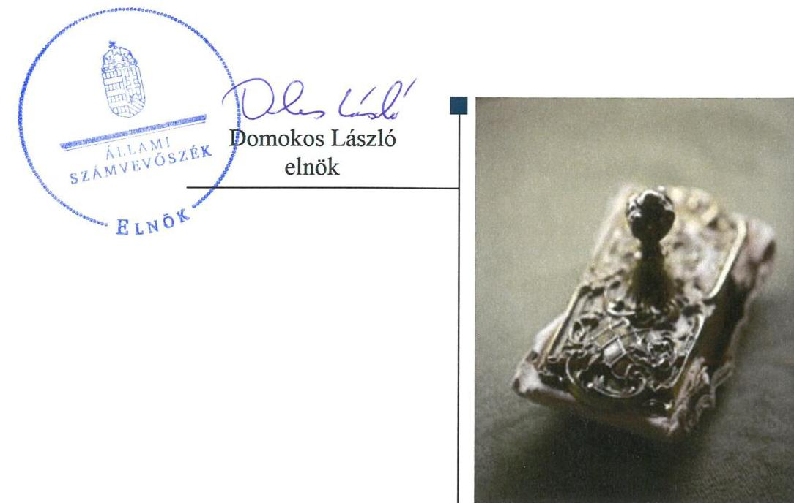
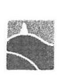
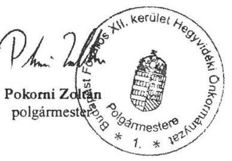
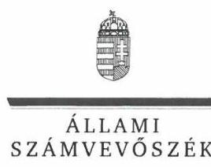
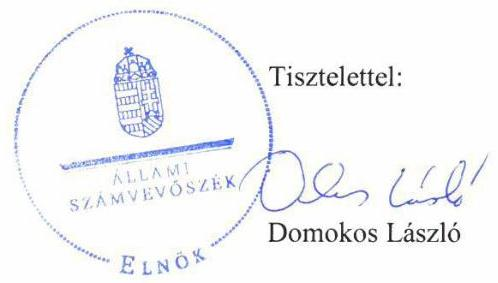
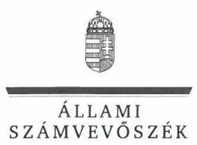
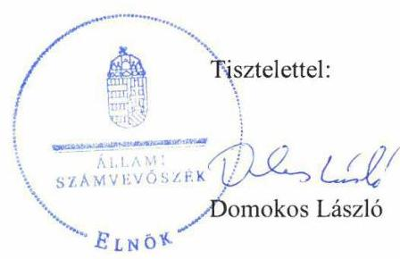

# Jelenetés 

## Nemzeti tulajdonú gazdasági társaságok ellenőrzése

Hegyvidéki Sportcsarnok és
Sportközpont Korlátolt Felelősségű
Társaság
2019.

---

# Jelentés 

## Nemzeti tulajdonú gazdasági társaságok ellenőrzése

Hegyvidéki Sportcsarnok és
Sportközpont Korlátolt Felelősségű
Társaság
2019. 10. hó 24. nap

---

# AZ ELLENŐRZÉST FELÜGYELTE:

- KAKAS SÁNDOR felügyeleti vezető
- AZ ELLENŐRZÉST VEZETTE ÉS A VÉGREHAJTÁSÁÉRT FELELŐS:
  - PETRÓ KATALIN ellenőrzésvezető
  - ÁRPÁSI TIBOR ellenőrzésvezető
- A PROGRAM ÖSSZEÁLLÍTÁSÁÉRT FELELŐS:
  - TÓTPÁL SZABOLCS osztályvezető

**IKTATÓSZÁM:** EL-1960-001/2019.

**Jelentéseink az Országgyűlés számítógépes hálózatán és az Interneten a www.asz.hu címen is olvashatóak.**

**TÉMASZÁM:** 2478

**ELLENŐRZÉS-AZONOSÍTÓ SZÁM:** V082222

---

# TARTALOMJEGYZÉK 

■ ÖSSZEGZÉS ..... 5
■ AZ ELLENŐRZÉS CÉLJA ..... 6
■ AZ ELLENŐRZÉS TERÜLETE ..... 7
■ AZ ELLENŐRZÉS HÁTTERE, INDOKOLTSÁGA ..... 8
■ A JELENTÉS LÉNYEGES KÉRDÉSKÖREI ..... 9
■ AZ ELLENŐRZÉS HATÓKÖRE ÉS MÓDSZEREI ..... 10
■ MEGÁLLAPÍTÁSOK ..... 12
■ JAVASLATOK ..... 14
■ MELLÉKLETEK ..... 15
I. sz. melléklet: Értelmező szótár ..... 15
■ FÜGGELÉK: ÉSZREVÉTELEK ..... 17
■ RÖVIDÍTÉSEK JEGYZÉKE ..... 33

---

.

---

# ÖSSZEGZÉS 

A Budapest Főváros XII. kerület Hegyvidéki Önkormányzat a Hegyvidéki Sportcsarnok és Sportközpont Korlátolt Felelősségü Társaság felett tulajdonosi jogait nem szabályszerűen gyakorolta. A Társaság vagyongazdálkodása 2017-ben nem volt szabályszerű, a számviteli beszámoló mérlegének tételeit nem támasztotta alá leltárral, beszámolója nem volt megalapozott, ezért gazdálkodásának átláthatósága és elszámoltathatósága nem volt biztositott.

## Az ellenőrzés társadalmi indokoltsága

Az Állami Számvevőszék stratégiájában megfogalmazta, hogy az államháztartáson kívül működő feladatellátó rendszerek ellenőrzéseivel hozzájárul ahhoz, hogy a közpénzeket, illetve az ingyenesen juttatott közvagyont az államháztartáson kívül működő szervezetek is átlátható, rendezett módon használják fel.

Az állam és a helyi önkormányzatok tulajdona nemzeti vagyon. A nemzeti vagyon megőrzése, megóvása érdekében kiemelten fontos a nemzeti tulajdonú gazdasági társaságok ellenőrzése.

Az Állami Számvevőszék céljaival és a társadalmi igénnyel összhangban, a gazdasági társaságok kiemelt fontosságú szerepe miatt került sor a Budapest Főváros XII. kerület Hegyvidéki Önkormányzat többségi tulajdonában álló Hegyvidéki Sportcsarnok és Sportközpont Korlátolt Felelősségű Társaság vagyongazdálkodásának, illetve az Önkormányzat tulajdonosi joggyakorlásának ellenőrzésére.

## Főbb megállapítások, következtetések, javaslatok

A Budapest Főváros XII. kerület Hegyvidéki Önkormányzat a tulajdonosi joggyakorlás kereteit 2017-től alakította ki szabályszerűen, az alapítót megillető jogok átruházását 2017-ben jelenítette meg a Társaság Alapító okiratában. A tulajdonosi jogainak gyakorlása nem volt szabályszerű, mert a felügyelőbizottság csak 2017-től rendelkezett jóváhagyott ügyrenddel, továbbá 2015-ben és 2017-ben a Társaság számviteli beszámolóinak elfogadása nem szabályszerűen történt.

A Hegyvidéki Sportcsarnok és Sportközpont Kft. vagyongazdálkodása nem volt szabályszerű, mert 2017-ben a számviteli beszámoló mérlegét nem támasztotta alá leltárral, illetve nem győződött meg a mérlegbe került tételek valódiságáról.

Az Állami Számvevőszék a jelentésben foglalt megállapítások alapján Budapest Főváros XII. kerület Hegyvidéki Önkormányzat polgármesterének kettő javaslatot, a Hegyvidéki Sportcsarnok és Sportközpont Kft. ügyvezetőjének pedig egy javaslatot fogalmazott meg. A javaslatokat megalapozó megállapításokra az érintetteknek 30 napon belül intézkedési tervet kell készíteniük.

---

# AZ ELLENŐRZÉS CÉLJA 

AZ ELLENŐRZÉS CÉLJA annak megítélése volt, hogy a tulajdonosi joggyakorló a gazdasági társasága feletti tulajdonosi joggyakorlás kereteit kialakította-e, tulajdonosi jogait megfelelően gyakorolta-e és kötelezettségeit teljesítette-e. Továbbá annak megállapítása, hogy a gazdasági társaság biztosította-e a vagyon védelmét a nyilvántartások szabályszerű vezetése és a mérleg tételeinek leltárral történő alátámasztása útján, valamint szabályszerűen gondoskodott-e a társaság használatában lévő nemzeti vagyon értékének megőrzéséről, gyarapításáról, hasznosításáról.

---

# **A2 ELLENŐRZÉS TERÜLETE**

## **Budapest Főváros XII. kerület Hegyvidéki Önkormányzat és a Hegyvidéki Sportcsarnok és Sportközpont Korlátolt Felelősségű Társaság**

Budapest Főváros XII. kerület Hegyvidéki Önkormányzat 5 millió Ft jegyzett tőkével 2013-ban alapította a kizárólagos tulajdonában álló Hegyvidéki Sportcsarnok és Sportközpont Korlátolt Felelősségű Társaságot az Önkormányzat1 Csörsz utcai ingatlanán épült sportcentrum piaci igényekhez igazodó, jövedelmező üzemeltetésére. A Társaság jegyzett tőkéje négy alkalommal változott az ellenőrzött időszakban, értéke 2017. október 16-tól 4,1 millió Ft volt.

A Társaság2 fő tevékenysége a sportlétesítmény működtetése volt, amit az Önkormányzattal kötött Bérleti szerződés1,23 alapján végzett.

A Társaság értékesítésből származó nettó árbevétele 2015-ben 689,2 millió Ft, 2016-ban 866,9 millió Ft, 2017-ben 925,7 millió Ft volt. A Társaság 2015-ben 7,1 millió Ft, 2016-ban 20,3 millió Ft, míg 2017-ben 59,7 millió Ft adózott eredményt ért el. Saját tőkéje folyamatosan csökkent, 2015-ben 272,2 millió Ft, 2016-ban 226,2 millió Ft, 2017-ben 215,3 millió Ft volt. A foglalkoztatottak létszáma 2015-ben 29 fő, 2016-ban 30 fő, 2017-ben 32 fő volt.

A Társaság a feladatait saját eszközeivel, illetve a feladat-ellátásokhoz kapcsolódóan haszonbérletre átvett eszközökkel látta el, vagyonkezelésbe vett eszközzel nem rendelkezett. A Társaság más gazdasági társaságban részesedéssel nem rendelkezett.

A Társaság ügyvezetője4, továbbá a polgármester5 és a jegyző6 személye az ellenőrzött időszakban nem változott. A Társaságnál három tagú felügyelőbizottság7 és állandó könyvvizsgáló8 működött. A Társaság a 2015-2017. években egyszerűsített éves beszámolót készített, a Számv. tv.9 alapján könyvvizsgálatra kötelezett volt.

A Társaság az ellenőrzött időszakban közfeladatot nem látott el, közszolgáltatást nem végzett, nem minősült kormányzati szektorba sorolt egyéb szervezetnek.

---

# AZ ELLENŐRZÉS HÁTTERE, INDOKOLTSÁGA 

Az Alaptörvény 38. cikke alapján az állam és a helyi önkormányzatok tulajdona nemzeti vagyon. A nemzeti vagyon megőrzése, megóvása érdekében kiemelten fontos ezen nemzeti tulajdonú gazdasági társaságok ellenőrzése. Gazdálkodásuk jellemzően a közérdeklődés és a médiafigyelmének középpontjában áll, amihez hozzájárul a gazdálkodásuk körébe tartozó - a nemzeti vagyon részét képező - vagyon nagysága is.

Ellenőrzéseink feltárhatják, hogy a tulajdonosi felügyelet hozzájárult-e a szabályszerű gazdálkodáshoz és feladatellátáshoz. Az ellenőrzés eredményeként meghatározhatóvá válnak a gazdasági társaság vagyongazdálkodást érintő kockázatai, ezzel lehetővé téve a kockázatok csökkentését. A megállapítások alapján megfogalmazott számvevőszéki javaslatok hasznosítása elősegítheti a meglévő hibák megszüntetését. A jó gyakorlatok bemutatásával az ÁSZ ${ }^{10}$ hozzájárulhat a követendő megoldások megismertetéséhez, terjesztéséhez.

---

# A JELENTÉS LÉNYEGES KÉRDÉSKÖREI 

1. A Társaság feletti tulajdonosi joggyakorlás megfelelt-e az elöírásoknak?
2. A Társaság vagyongazdálkodása szabályszerü volt-e?

---

# AZ ELLENŐRZÉS HATÓKÖRE ÉS MÓDSZEREI 

## Az ellenőrzés típusa

Megfelelőségi ellenőrzés.

## Az ellenőrzött időszak

A tulajdonosi joggyakorlás tekintetében az ellenőrzött időszak 2017. január 1-től 2018. október 8-ig, az ellenőrzés megkezdésének napjáig terjedt ki az éves beszámolók elfogadása kivételével, amelynél az ellenőrzött időszak 2015. január 1-től az ellenőrzés megkezdésének napjáig tartott.

A Társaság vagyongazdálkodási tevékenységét illetően az ellenőrzött időszak a 2015 - 2017. évek, a 2017. évi beszámoló jóváhagyása és közzététele tekintetében 2018. június elsejéig tartó időszak volt.

## Az ellenőrzés tárgya

A Hegyvidéki Sportcsarnok és Sportközpont Korlátolt Felelősségű Társaság feletti tulajdonosi joggyakorlás kialakítása és múködtetése.

A Hegyvidéki Sportcsarnok és Sportközpont Korlátolt Felelősségű Társaság vagyongazdálkodási tevékenysége, a Társaság használatában lévő nemzeti vagyon, illetve a saját vagyona tekintetében a vagyonnyilvántartások vezetése, leltára, a nemzeti vagyon értékének megőrzése, gyarapítása, hasznosítása.

## Az ellenőrzött szervezet

Budapest Főváros XII. kerület Hegyvidéki Önkormányzat, Hegyvidéki Sportcsarnok és Sportközpont Korlátolt Felelősségű Társaság

## Az ellenőrzés jogalapja

Az ellenőrzés jogalapját az ÁSZ tv. 1. § (3) bekezdése és 5. § (3)-(5) bekezdései képezték.

## Az ellenőrzés módszerei

Az ÁSZ az ellenőrzést az ellenőrzési program ellenőrzési kérdései, az ellenőrzött időszakban hatályos jogszabályok, az ellenőrzés szakmai szabályok

---

és módszertanok alapján, a nemzetközi standardok figyelembe vételével végezte.

Az ÁSZ az ellenőrzés ideje alatt az ellenőrzött szervezettel történő kapcsolattartást az ÁSZ Szervezeti és Múködési Szabályzatának vonatkozó előírásai alapján biztosította.

Az ÁSZ 2017. január 1-től az ellenőrzés megkezdésének napjáig - 2018. október 8-ig - ellenőrizte a tulajdonosi joggyakorlás kereteinek kialakítását, a tulajdonosi joggyakorló tevékenységét a felügyelő bizottság és a független könyvvizsgáló múködéséhez kapcsolódóan, valamint azt, hogy a tulajdonosi joggyakorló - amennyiben a gazdasági társaság feladatellátásához és vagyonkezeléséhez kapcsolódóan határozott meg követelményeket, elvárásokat - a nemzeti vagyon értékének megőrzése érdekében mo-nitorozta-e azok teljesülését. Az ÁSZ a 2015. január 1-től 2018. október 8ig terjedő teljes ellenőrzött időszakra ellenőrizte a tulajdonosi joggyakorló részvételét az éves beszámoló elfogadására vonatkozó döntéshozatalban.

A gazdasági társaság vagyonhoz kapcsolódó nyilvántartásai vezetésének megfelelősége, valamint a nemzeti vagyon értéke megőrzésének, gyarapításának, hasznosításának szabályszerűsége 2015. és 2017. évek tekintetében került ellenőrzésre. A 2015-2017. éveket érintően történt meg a lényeges dokumentumok értékelése, kiemelten a mérleg tételeinek leltárral való alátámasztottsága.

Az ellenőrzési kérdések megválaszolásához szükséges bizonyítékok megszerzése a következő ellenőrzési eljárások alkalmazásával történt: megfigyelés, információkérés, összehasonlítás, lényeges sokaságból mintavétel, valamint elemző eljárás. Az ellenőrzési bizonyítékként felhasználható adatforrások közé tartoztak az ellenőrzési programban felsorolt adatforrások, továbbá minden - az ellenőrzés folyamán - feltárt, az ellenőrzés szempontjából információkat tartalmazó dokumentum. Az ellenőrzést a kérdésekre adott válaszok kiértékelésével, valamint a megjelölt adatforrások, a csatolt tanúsítványok felhasználásával, továbbá az adott időszakban hatályos jogszabályok figyelembe vételével folytatta le az ÁSZ.

A vagyonnyilvántartások és a leltár szabályszerűsége esetében az ellenőrzés azokra a legnagyobb értékű tételekre - a lényeges sokaságra - terjedt ki, melyek összértéke elérte a teljes sokaság összértékének 50\%-át. Az ÁSZ a 2015. és a 2017. években a lényeges sokaságot tételesen ellenőrizte.

---

# 1. A Társaság feletti tulajdonosi joggyakorlás megfelelt-e az előírásoknak? 

Összegző megállapítás

Az Önkormányzat tulajdonosi joggyakorlása nem volt szabályszerű.

A TULAJDONOSI JOGGYAKORLÁS KERETEIT az Önkormányzat mint alapító a Társaság Alapító okiratában ${ }_{1-4}{ }^{11}$ az Mötv. ${ }^{12}$, az Nvtv. ${ }^{13}$ és a Ptk. ${ }^{14}$ előírásaival összhangban alakította ki. A tulajdonosi joggyakorlás részletes rendjét az Önkormányzat a képviselő-testület SZMSZében ${ }^{15}$, valamint a Vagyongazdálkodási rendeletben ${ }^{16}$ határozta meg. A Vagyongazdálkodási rendelet 12. § (2) b) pontja alapján a Társaságban meglévő üzletrész feletti tagsági jogokat a polgármester gyakorolta. Az Alapítót ${ }^{17}$ megillető jogok átruházását a Ptk. 3:4. § (2) bekezdésében foglaltak ellenére az Alapító nem vezette át Társaság Alapító okiratán ${ }_{1}$. A tulajdonosi joggyakorlás polgármesterre történő átruházását az Alapító okirat ${ }_{2-4}$ 2017. május 15 -től tartalmazta.

Az Alapító az Alapító okiratban ${ }_{1}$ a Ptk., valamint a Taktv. ${ }^{18}$ előírásaival összhangban három tagból álló felügyelőbizottság létrehozásáról határozott, kijelölte a könyvvizsgálót. A Társaság Taktv. szerinti javadalmazási szabályzatát ${ }^{19}$ átruházott hatáskörében a polgármester hagyta jóvá.

A TULAJDONOSI JOGOK GYAKORLÁSA nem volt szabályszerű az ellenőrzött időszakban.

A felügyelőbizottság működése az ellenőrzött időszakban nem volt szabályszerű, a felügyelőbizottság a Ptk. 3:122. § (3) bekezdésében foglaltak ellenére csak 2017. június 1-től rendelkezett ügyrenddel ${ }^{20}$. A felügyelőbizottság ügyrendje a Ptk. 3:122. § (2) bekezdésében foglaltak ellenére üléseinek határozatképességét két főben határozta meg. A felügyelőbizottság a Ptk. 3:120. § (2) bekezdésében és az Alapító okirat4 6.13. pontjában foglaltak ellenére nem készített írásbeli jelentést az Alapító részére a Társaság 2017. évre összeállított számviteli beszámolójáról.

A könyvvizsgáló a Ptk. és az Alapító okirat ${ }_{1-4}$ előírásainak megfelelően elkészítette a 2015-2017. évek számviteli beszámolóiról készített jelentéseit.

A Társaság 2015. évi számviteli beszámolójának jóváhagyásáról és az adózott eredmény felhasználásáról a Ptk. 3:109. § (2) és (4) bekezdésében és az Alapító okirat 10.1. pontjában foglaltak ellenére az Alapító nem hozott határozatot.

A Társaság 2016. évi számviteli beszámolójának jóváhagyásáról a Számv. tv., a Ptk. és az Alapító okirat2 előírásainak megfelelően döntött a polgármester. A Társaság 2016. évi adózott eredményének felhasználásáról a Ptk. 3:109. § (2) és (4) bekezdésében és az Alapító okirat 10.1. pontjában foglaltak ellenére a polgármester nem hozott határozatot.

---

A Társaság 2017. évi számviteli beszámolójának jóváhagyása nem volt szabályszerű, mert a Ptk. 3:120. § (2) bekezdése és az Alapító okirat4 6.13. pontjának előírásaival ellentétben nem állt rendelkezésre a felügyelőbizottság írásbeli jelentése. A polgármester döntése ${ }^{21}$ a Társaság 2017. évi adózott eredményének felhasználásáról nem volt szabályszerű, mert arról a 2017. évi számviteli beszámoló, könyvvizsgálói jelentés Számv. tv. 153. § (1) és 154. § (1) bekezdéseiben foglaltak szerinti letétbe helyezését és közzétételét követően, nem a beszámoló elfogadásával egyidejűleg határozott a Ptk. 3:185. § (2) bekezdésében foglaltak ellenére.

# 2. A Társaság vagyongazdálkodása szabályszerű volt-e? 

Összegző megállapítás

A Társaság vagyongazdálkodása a 2015-2016. évben szabályszerű volt, a 2017. évben nem volt szabályszerű.

## LELTÁRKÉSZÍTÉSI ÉS LELTÁROZÁSI SZABÁLY-

ZATÁT ${ }_{1,2}{ }^{22}$ a Társaság a Számv. tv. szerint elkészítette.

A Társaság a 2015-2016. évek egyszerűsített éves beszámolóinak elkészítéséhez, a mérleg tételeinek alátámasztásához a Számv. tv. és a Leltárkészítési és leltározási szabályzata ${ }_{1,2}$ szerinti leltárt állított össze.

A Társaság a 2017. évi egyszerűsített éves beszámoló mérlegének tételeit a Számv. tv. 69. § (1) bekezdés előírásai ellenére a - mérleg fordulónapján meglévő eszközközöket és forrásokat mennyiségben és értékben tartalmazó - leltárral nem támasztotta alá. A Társaság 2017-ben a Számv. tv. 69. § (4) bekezdése előírásai ellenére nem győződött meg mennyiségi felvétellel a készletek vonatkozásában a mérlegbe került adatok valódiságáról. A mérleg tételeit alátámasztó leltár hiányában a 2017. évi egyszerűsített éves beszámolóban szereplő tételek nem voltak bizonyítottak, kívülállók számára is megállapíthatóak, ezért nem érvényesült a valódiság elve, emiatt a Társaság elszámoltathatósága, a nemzeti vagyon megőrzése nem volt biztosított. A Számv. tv. szerinti leltár hiánya ellenére a könyvvizsgáló a 2017. évi egyszerűsített éves beszámolót korlátozás nélküli hitelesítő záradékkal látta el.

A SAJÁT VAGYONHOZ kapcsolódó nyilvántartásait a Társaság a jogszabályi előírások, továbbá a Számviteli Politika ${ }_{1,2}{ }^{23}$. az Értékelési szabályzat ${ }_{1,2}{ }^{24}$ és a Számlarend ${ }_{1,2}{ }^{25}$ előírásai szerint vezette.

A Társaság a Bérleti szerződés ${ }_{1,2}$ 9.5. pontjában foglaltak ellenére a 2015., 2017. években bérelt ingatlanon végzett értéknövelő beruházásokhoz nem kérte be az Önkormányzat előzetes írásbeli jóváhagyását.

A Társaság a haszonbérbe vett nemzeti vagyon továbbhasznosítása során az Nvtv., a Bérleti szerződés ${ }_{1,2}$ előírásai szerint járt el.

---

# JAVASLATOK 

Az ÁSZ tv. 33. § (1) bekezdésében foglaltak értelmében az ellenőrzött szervezet vezetője köteles a jelentésben foglalt megállapításokhoz kapcsolódó intézkedési tervet összeállítani és azt a jelentés kézhezvételétől számított 30 napon belül az ÁSZ részére megküldeni. Amennyiben az ellenőrzött szervezet vezetője nem küldi meg határidőben az intézkedési tervet, vagy továbbra sem elfogadható intézkedési tervet küld, az Állami Számvevőszék elnöke az ÁSZ tv. 33. § (3) bekezdése a) és b) pontjaiban foglaltakat érvényesítheti.

## Hegyvidéki Sportcsarnok és Sportközpont Kft. ügyvezetőjének

1. Gondoskodjon a mérlegben kimutatott eszközök és források jogszabályban elöirtaknak megfelelő, teljes körü leltárral történő alátámasztásáról.
(2. megállapítás 3. bekezdése alapján)

## Budapest Főváros XII. kerület Hegyvidéki Önkormányzat polgármesterének

1. Kezdeményezze a Felügyelőbizottság ügyrendjének módosítását annak érdekében, hogy az megfeleljen a jogszabályi elöírásoknak.
(1. megállapítás 4. bekezdésének 2. mondata alapján)
2. Gondoskodjon a jövőben a Társaság beszámolójának jogszabályi előírás szerinti jóváhagyásáról.
(1. megállapítás 8. bekezdésének 1. mondata alapján)

---

# MELLÉKLETEK 

- I. SZ. MELLÉKLET: ÉRTELMEZŐ SZÓTÁR
gazdasági társaság
közszolgáltatás
közfeladat
nemzeti vagyon
nemzeti vagyon hasznosítása
nemzeti vagyon használója
vagyongazdálkodás
vagyonkezelő

A Ptk. 3:88. § (1) bekezdése szerint „a gazdasági társaságok üzletszerű közös gazdasági tevékenység folytatására, a tagok vagyoni hozzájárulásával létrehozott, jogi személyiséggel rendelkező vállalkozások, amelyekben a tagok a nyereségből közösen részesednek, és a veszteséget közösen viselik".
Az Ebktv. ${ }^{26}$ 3. § d) pontja a következőképpen határozza meg a közszolgáltatást: „szerződéskötési kötelezettség alapján a lakosság alapvető szükségleteinek ellátására irányuló szolgáltatás, így különösen a villamos energia-, gáz-, hő-, víz-, szennyvíz- és hulladékkezelési, köztisztasági, postai és távközlési szolgáltatás, továbbá a menetrend alapján közlekedő járművekkel végzett közforgalmú személyszállítás".
Az Áht. 3/A. § (1) bekezdése alapján közfeladat a jogszabályban meghatározott állami vagy önkormányzati feladat.
Nvtv. 1. § (2) bekezdése szerint nemzeti vagyonba tartozik többek között:
„az állam vagy a helyi önkormányzat kizárólagos tulajdonában álló dolgok,
az a) pont hatálya alá nem tartozó, állam vagy a helyi önkormányzat tulajdonában lévő dolog,
az állam vagy a helyi önkormányzat tulajdonában lévő pénzügyi eszközök, továbbá az államot vagy a helyi önkormányzatot megillető társasági részesedések,
az államot vagy a helyi önkormányzatot megillető bármely vagyoni értékkel rendelkező jogosultság, amelyet jogszabály vagyoni értékű jogként nevesít."
A tulajdonosi joggyakorló vagy a nemzeti vagyon használója által a nemzeti vagyon birtoklásának, használatának, hasznok szedése jogának bármely - a tulajdonjog átruházását nem eredményező - jogcímen történő átengedése, ide nem értve a vagyonkezelésbe adást, valamint a haszonélvezeti jog alapítását.
Forrás: Nvtv. 3. § (1) bekezdés 4. pont
Azon természetes személy, jogi személy vagy jogi személyiséggel nem rendelkező szervezet, aki vagy amely állami vagyon tekintetében törvény vagy szerződés alapján, a helyi önkormányzat vagyona tekintetében törvény, a helyi önkormányzat rendelete vagy szerződés alapján bármely jogcímen nemzeti vagyont birtokol, használ, szedi annak használt, kivéve a tulajdonosi joggyakorló.
Forrás: Nvtv. 3. § (1) bekezdés 11. pont
Aki a nemzeti vagyon felett az államot vagy a helyi önkormányzatot megillető tulajdonosi jogok és kötelezettségek összességének gyakorlására jogosult.
Forrás: Nvtv. 3. § (1) 17. pontja
A nemzeti vagyongazdálkodás feladata a nemzeti vagyon rendeltetésének megfelelő, az állam, az önkormányzat mindenkori teherbíró képességéhez igazodó, elsődlegesen a közfeladatok ellátásához és a mindenkori társadalmi szükségletek kielégítéséhez szükséges, egységes elveken alapuló, átlátható, hatékony és költségtakarékos működtetése, értékének megőrzése, állagának védelme, értéknövelő használata, hasznosítása, gyarapítása, továbbá az állam vagy a helyi önkormányzat feladatának ellátása szempontjából feleslegessé váló vagyontárgyak elidegenítése. (Forrás: Nvtv. 7. § (2) bekezdése).
az állam tulajdonában álló nemzeti vagyon tekintetében:
aa) költségvetési szerv,
ab) helyi önkormányzat, nemzetiségi önkormányzat, valamint ezek társulásai,

---

ac) az ab) alpontban felsoroltak fenntartása vagy irányítása alá tartozó intézmény, ad) köztestület,
ae) az állam, az aa)-ac) alpontban meghatározott személyek együtt vagy külön-külön 100\%-os tulajdonában álló gazdálkodó szervezet,
af) az ae) alpont szerinti gazdálkodó szervezet 100\%-os tulajdonában álló gazdálkodó szervezet,
ag) a törvény által kijelölt egyedileg meghatározott jogi személy.
b) a helyi önkormányzat tulajdonában álló nemzeti vagyon tekintetében:
ba) nemzetiségi önkormányzat, helyi vagy nemzetiségi önkormányzati társulás, valamint ezek fenntartása vagy irányítása alá tartozó intézmény,
bb) költségvetési szerv,
bc) köztestület,
bd) az állam, a helyi önkormányzat, a ba) alpontban meghatározott személyek együtt vagy külön-külön 100\%-os tulajdonában álló gazdálkodó szervezet,
be) a bd) alpont szerinti gazdálkodó szervezet 100\%-os tulajdonában álló gazdálkodó szervezet.
Forrás: Nvtv. 3. § (1) bekezdés 19. pont

---

# FÜGGELÉK: ÉSZREVÉTELEK 

A jelentéstervezetet a Számvevőszék 15 napos észrevételezésre megküldte az ellenőrzött szervezetek vezetőinek az ÁSZ tv. 29. §* (1) bekezdése előírásának megfelelően.

Az ÁSZ a jelentéstervezetet észrevételezésre megküldte Budapest Főváros XII. kerület Hegyvidéki Önkormányzat polgármestere és a Hegyvidéki Sportcsarnok és Sportközpont Korlátolt Felelősségü Társaság ügyvezetője részére.
Budapest Főváros XII. kerület Hegyvidéki Önkormányzat polgármestere és a Hegyvidéki Sportcsarnok és Sportközpont Korlátolt Felelősségü Társaság ügyvezetője az ÁSZ tv. 29. § (2) bekezdésében foglalt észrevételezési jogukkal éltek, a jelentéstervezet megállapításaira a törvényes határidőn belül észrevételt tettek.
Budapest Főváros XII. kerület Hegyvidéki Önkormányzat polgármesterének és a Hegyvidéki Sportcsarnok és Sportközpont Korlátolt Felelősségü Társaság ügyvezetőjének észrevételeit és az azokra adott választ a függelék tartalmazza.

[^0]
[^0]:    * 29. § (1) Az Állami Számvevőszék az ellenőrzési megállapításait megküldi az ellenőrzött szervezet vezetőjének vagy az általa megbízott személynek, és annak, akinek személyes felelősségét állapította meg.
    (2) Az ellenőrzött szervezet vezetője és a felelősként megjelölt személy az ellenőrzés megállapításaira tizenöt napon belül írásban észrevételt tehet.
    (3) Az Állami Számvevőszék az észrevételre a beérkezésétől számított harminc napon belül írásban válaszol. A figyelembe nem vett észrevételeket köteles a jelentésben feltüntetni, és megindokolni, hogy azokat miért nem fogadta el.

---

# 1212 

Állami Számvevôszék
Domokos László
elnök
1052 Budapest
Aplecsa: Csere János utca 10.
Tárgy észrevétel a MOM Sport
allamőrzésének jelentéstervezetére

## Tisztelt Elnök Úr!

A Hegyvidéki Sportcsarnok és Sportközpont Korlátolt Felelősségủ Társaság (székbő) 1123 Budapest, Csórsz utca 14.; cégjegyzékszám: 01-09-997890; képviseli: Buranits İldikó Edit ügyvezető, a továbbiakban: Társaság; szabályszertủ, valamint átlátható gazdálkodásának vizsgálata keretében az Állami Számvevőszék ellenőrzést folytatott le, amelyre tekintettel 2019. július 15. napján Nemzeti tulajdonú gazdasági társaságok ellenőrzése - Hegyvidéki Sportcsarnok és Sportközpont Korlátolt Felelősségủ Társaság című számvevőszéki jelentéstervezetet küldött meg az Állami Számvevőszék mind a Társaság, mind a XII. kerületi Hegyvidéki Önkormányzat részére.
Az Állami Számvevőszékről szóló 2011. évi LXVI. törvény 29. § (2) bekezdése alapján a jelentéstervezetre az alábbi írásbeli észrevételt kívánom előterjeszteni.

## Tulajdonosi joggyakorlás

A jelentéstervezet alapján az alapítót megillető jogok átruházását a Ptk. 3:4 § (2) bekezdésében foglaltak ellenére a Társaság nem vezette át az alapító okiratán. A fent hivatkozott bekezdés lehetőséget biztosít a társaságok számára, hogy eltérjenek a jogi személyekre vonatkozó általános szabályoktól. A Magyarország helyi önkormányzatairól szóló 2011. évi CLXXXIX. törvény (a továbbiakban: Mórv.) alapján a Társaság alapítója a Budapest Főváros XII. kerület Hegyvidéki Önkormányzat (a továbbiakban: Önkormányzat). A taggyűlési hatáskörbe tartozó döntéseket az alapító, azaz az Önkormányzat jogosult meghozni, amelynek döntéshozatali eljárásrendjét az Mórv., továbbá a Társaság esetében a Budapest Főváros XII. kerületi Önkormányzat vagyona feletti tulajdonosi jogok gyakorlásáról szóló 4/1994.(III.2.) Budapest Főváros XII. kerületi Önkormányzat rendelete szabályozza.
Fentiekre tekintettel álláspontom szerint a döntéshozatali eljárás nem tér el a jogi személyekre vonatkozó általános szabályoktól, ugyanis a döntéseket az Önkormányzat hozza meg, amely hasonlóan a jogi személy társaságokhoz, belső eljárásrendben - jelen esetben mindenki számára nyilvános jogszabályban - határozza meg a döntéshozatali eljárást, így az alapítót megillető jogok átruházása nem valósult meg, annak feltüntetése nem szükséges, továbbá ilyen kötelezettséget jogszabály nem ír elő.

## Felügyelőbizottság

A felügyelőbizottság ügyrendjével kapcsolatos megállapítások vonatkozásában tájékoztatom a Tisztelt Elnök Úrat, hogy a teljességi és hitelességi nyilatkozat 21. pontja alapján a vizsgált időszakra vonatkozó felügyelőbizottsági ügyrendek, így a 2013. évi, továbbá a 2017. évi ügyrend is csatolásra került, amely alapján megállapítható, hogy a felügyelőbizottság a vizsgált időszak egészében rendelkezett ügyrenddel.

---

A jelentéstervezet megállapítása alapján a 2017. évi számviteli beszámoló elfogadása a szükséges felügyelőbizottsági jelentés hiányában történt meg. A felügyelőbizottság a teljességi és hitelességi nyilatkozat 22. pontjában hivatkozott dokumentum alapján, jegyzőkönyvben rögzítette a javaslatát a könyvvizsgáló által jóváhagyott beszámoló elfogadásáról, így az alapító számára, döntésének meghozatalához rendelkezésre állt a könyvvizsgálói jelentés, a felügyelőbizottság jegyzőkönyve, a beszámoló, továbbá az üzleti terv teljes anyaga, amelyet a felügyelőbizottsági döntést követően a felügyelőbizottság továbbított elfogadásra az alapítónak. Fentiek alapján a felügyelőbizottsági jelentés álláspontom szerint rendelkezésre állt az alapító számára, annak ellenére, hogy nem írásbeli jelentés megnevezésű dokumentum tartalmazta azt.

# Beszámoló elfogadása 

A jelentéstervezetben foglaltak szerint a 2015. évi számviteli beszámoló jóváhagyásáról az alapító nem hozott határozatot. A teljességi és hitelességi nyilatkozat 29. pontjában hivatkozott dokumentum alapján megállapítható, hogy a 2015. évtől - a vizsgált időszaktól - minden évre vonatkozóan az éves beszámoló elfogadására irányuló alapítói határozat csatolásra került, így a tervezetben hiányolt 2015. évi beszámolót elfogadó, 1,2,3/2016 (V.30.) sz. alapítói határozat csatolásra került.

## Egyéb megállapítások, észrevételek

A felügyelőbizottság ügyrendjében foglalt határozatképesség a jövőben - a készítendő intézkedési tervben - a Ptk. 3:122. § (2) bekezdésével összhangban kerül kialakításra
Az osztalékfizetésről történő döntéshozatal, - ugyan 2017. évben adminisztrációs hiányosság történt, amint azt a 2018. évi beszámoló elfogadásáról szóló alapítói határozat is tanúsítja - a jogszabályoknak megfelelően történik.
Fentieken túl a jelentéstervezet megállapította, hogy a Társaság az alapító okiratát az Nvtv. és a Ptk. előírásaival összhangban alakította ki, a beszámolók elfogadása - a fentiekben hivatkozott és csatolt alapító okiratok figyelembevételével - szabályszerűen történtek.
Tájékoztatom a Tisztelt Elnök Urat, hogy a könyveléssel, különös tekintettel a leltárral összefüggő, továbbá a beruházásokkal kapcsolatos kérdések vonatkozásában a Társaság által megküldött észrevételben kerül sor nyilatkozattételre.
A fentiekben összefoglalt észrevételeket figyelembevéve kérem a Tisztelt Elnök Urat, hogy a jelentéstervezet összegzésében foglalt sarkalatos megállapítást, amely szerint az Önkormányzat a tulajdonosi jogokat nem szabályszerűen gyakorolta, szíveskedjen felülvizsgálni tekintettel arra, hogy az összegzés azt sugallja, hogy a Társaság és az Önkormányzat eljárása teljes egészében nem volt szabályszerű, az nem felelt meg a jogszabályoknak.

Budapest Hegyvidék, 2019. augusztus 1.

Tisztelettel:

---

ELNÖK

Ikt. szám: EL-0878-079/2019.

# Pokorni Zoltán úr 

polgármester
Budapest Főváros XII. kerület Hegyvidéki Önkormányzat

## Budapest

## Tisztelt Polgármester Úr!

A „Nemzeti tulajdonú gazdasági társaságok ellenőrzése - Hegyvidéki Sportcsarnok és Sportközpont Korlátolt Felelősségü Társaság" címmel készített számvevőszéki jelentéstervezetre tett észrevételét köszönettel megkaptam.
Az Állami Számvevőszék észrevételekre vonatkozó álláspontjáról a felügyeleti vezető által készített részletes tájékoztatást csatoltan megküldőm.
Tájékoztatom Polgármester urat, hogy a számvevőszéki jelentésben - az Állami Számvevőszékről szóló 2011. évi LXVI. törvény 29. § (3) bekezdése alapján - a figyelembe nem vett észrevételeket szerepeltetjük az elutasítás indokának feltüntetésével.

Budapest, 2019. 03 hó 04. nap

Melléklet: Tájékoztatás az észrevételek kezeléséről

---

# Tájékoztatás az észrevételek kezeléséről 

Az „Nemzeti tulajdonú gazdasági társaságok ellenőrzése - Hegyvidéki Sportcsarnok és Sportközpont Korlátolt Felelősségü Társaság" címủ jelentéstervezetre (továbbiakban: jelentéstervezet) a Budapest Főváros XII. kerület Hegyvidéki Önkormányzat (a továbbiakban: Önkormányzat) polgármesterének I/510/02/2019. iktatószámú, 2019. augusztus 1-én kelt levélben megküldött észrevételeit áttekintettem. Az észrevételek kezeléséről az alábbi tájékoztatást adom.

## I. A tulajdonosi joggyakorlással kapcsolatban tett észrevételre vonatkozóan

Észrevételében jelezte, hogy álláspontja szerint a döntéshozatali eljárás nem tér el a jogi személyekre vonatkozó általános szabályoktól.
A Polgári Törvénykönyvről szóló 2013. évi V. törvény (a továbbiakban: Ptk.) 3:4. § (2) bekezdésében foglaltak szerint „A jogi személy tagjai, illetve alapítói az egymás közötti és a jogi személyhez füződő viszonyuk, valamint a jogi személy szervezetének és müködésének szabályozása során a létesítő okiratban - a (3) bekezdésben foglaltak kivételével eltérhetnek e törvénynek a jogi személyekre vonatkozó szabályaitól."
A Ptk. 3:109. § (1) bekezdése szerint gazdasági társaság tagjainak döntéshozó szerve a legfőbb szerv. A Ptk. 3:109. § (4) bekezdése szerint az egyszemélyes társaságnál a legfőbb szerv hatáskörét az alapító vagy az egyedüli tag gyakorolja. A legfőbb szerv hatáskörébe tartozó kérdésekben az alapító vagy az egyedüli tag írásban határoz és a döntés az ügyvezetéssel való közléssel válik hatályossá. A Magyarország helyi önkormányzatairól szóló 2011. évi CLXXXIX. törvény (a továbbiakban: Mötv.) 107. §-a szerint a helyi önkormányzatot - törvényben meghatározott eltérésekkel - megilletik mindazok a jogok és terhelik mindazok a kötelezettségek, amelyek a tulajdonost megilletik, terhelik. A tulajdonost megillető jogok gyakorlásáról a képviselő-testület rendelkezik.
A Budapest Főváros XII. kerületi Önkormányzat vagyona feletti tulajdonosi jogok gyakorlásáról szóló 4/1994 (III.2.) Budapest Főváros XII. kerületi Önkormányzat rendelete (a továbbiakban: vagyongazdálkodási rendelet) 12. § (2) bekezdése szerint:
„(2) A polgármester
a) a Tulajdonosi és Városfejlezstési Bizottság egyetértésével dönt az üzleti vagyon körébe tartozó 150 millió forint egyedi értékhatárt meg nem haladó önkormányzati vagyontárgy szerzéséről, elidegenítéséről, megterheléséről, bérbeadásáról, használatba adásáról és gazdasági társaságba való beviteléről
b) gyakorolja az (1) bekezdésében nem szabályozott esetekben a rendelkezési jogot, valamint a gazdasági társaságokban meglévő önkormányzati tulajdonú tőkerészesedéshez kapcsolódó tagsági jogokat, továbbá dönt az önkormányzati vagyon alkalmi célú (30 napot

---

meg nem haladó) hasznosításáról. A polgármester döntéseiről köteles a Kékpviselőtestületet tájékoztatni. "
A fent leírtak alapján a Társaság müködését alapvetően befolyásolja, hogy legfőbb szervnek kit, vagy milyen szervezetet kell tekintetni. A Társaság Alapítója az Önkormányzat, az Önkormányzat feladat- és hatásköreit a képviselő testület gyakorolja. Ennek megfelelően a Vagyongazdálkodási rendeletében meghatározott önkormányzati tulajdonosi joggyakorlás módjának meg kell jelennie a Társaság irataiban, müködésében, mert azokat a jogokat az Önkormányzat részéről a Vagyongazdálkodási rendeletben átruházott hatáskörben a polgármester gyakorolja.
A Ptk. 3:4. § (2) bekezdése alapján, a Ptk. szabályától való eltérés - itt különösen a Ptk. 3:109. § (1)-(2) és (4) bekezdéseire figyelemmel - megkötésekkel, csak a társaság létesítő okiratában foglaltak szerint lehetséges. Az eltérést az Önkormányzat a Társaság vonatkozásában 2017. május 15 -ig nem foglalta bele az alapító okiratba, így a társaság müködése addig az időpontig nem felelt meg a Ptk. 3:4. § (2) bekezdésében foglaltaknak és ez alapján a Ptk. 3:109. § (1)-(2) és (4) bekezdéseinek.
Mindezek alapján az észrevételt nem fogadjuk el, az Állami Számvevőszék megállapítása helytálló, a jelentéstervezet módosítása nem indokolt.

# II. A felügyelőbizottsággal kapcsolatban tett észrevételre vonatkozóan 

## 1. A felügyelőbizottság ügyrendje kapcsán tett észrevételre vonatkozóan

Észrevételében jelezte, hogy ,, a teljességi és hitelességi nyilatkozat 21. pontja alapján a vizsgált időszakra vonatkozó felügyelőbizottsági ügyrendek, igy a 2013. évi, továbbá a 2017. évi ügyrend is csatolásra került, amely alapján megállapítható, hogy a felügyelőbizottság a vizsgált időszak egészében rendelkezett ügyrenddel. "
Az EL-0878-011/2018. iktatószámú, 2018. szeptember 12-én kelt adatbekérő levél 2. számú melléklete 15. a) pontja alapján, 2 db „felügyelőbizottsági ügyrend"-ként megjelölt dokumentum került megküldésre az Állami Számvevőszék részére, amelynek tényéről az Önkormányzat 2018. szeptember 21-én kelt teljességi és hitelességi nyilatkozatot állított ki. A fenti adatbekérő levél 2. számú melléklete rögzíti, hogy a ,,dokumentumjegyzékben felsorolt - aláirt és hiteles - dokumentumokat [...] kell az ÁSZ rendelkezésére bocsátani." A Ptk. 3:122. § (3) bekezdése szerint „A felügyelőbizottság ügyrendjét maga állapítja meg, és azt a gazdasági társaság legfőbb szerve hagyja jóvá."
Az ellenőrzés során megállapításra került, hogy a „2013. évi felügyelőbizottsági ügyrend"ként megjelölt dokumentum az abban megjelölt helyen nem tartalmazta a Társaság legfőbb szervének az ügyrend jóváhagyásáról szóló döntésének számát, illetve nem csatoltak olyan dokumentumot, ami igazolta volna a Társaság legfőbb szervének az ügyrendre vonatkozó jóváhagyását.
Mindezek alapján az észrevételt nem fogadjuk el, az Állami Számvevőszék megállapítása helytálló, a jelentéstervezet módosítása nem indokolt.

---

# 2. A beszámoló felügyelőbizottsági jelentés hiányában való elfogadása kapcsán tett észrevételre vonatkozóan 

Észrevételében jelezte, hogy ,,A jelentéstervezet megállapítása alapján a 2017. évi számviteli beszámoló elfogadása szükséges felügyelőbizottsági jelentés hiányában történt meg. ... a felügyelőbizottsági jelentés álláspontom szerint rendelkezésre állt az alapító számára, annak ellenére, hogy nem írásbeli jelentés megnevezésủ dokumentum tartalmazta azt. "
A Ptk. 3:122. § (2) bekezdése szerint: „A felügyelőbizottság ülése akkor határozatképes, ha tagjai legalább kétharmada, de legalább három fő az ülésen jelen van.". A Társaság felügyelőbizottsága a Társaság 2017. évi számviteli törvény szerinti éves beszámolóját a 2018. május 18 -án tárgyalta meg és fogadta el az ellenőrzés rendelkezésére bocsátott felügyelőbizottsági jegyzőkönyv tanúsága szerint. A 2018. május 18 -ai üléséről készült jegyzőkönyv szerint a felügyelőbizottság három tagjából mindössze kettő volt jelen, ezért a Ptk. 3:122. § (2) bekezdése szerint - figyelemmel a Ptk. 3:27. § (3) bekezdésére is - a felügyelőbizottság ülése nem volt határozatképes. Erre tekintettel a beszámoló elfogadásáról határozatképesség hiányában hozott $1 / 2018$. sz. FEB határozatot az ÁSZ nem vette figyelembe.
Mindezek alapján az észrevételt nem fogadjuk el, az Állami Számvevőszék megállapítása helytálló, a jelentéstervezet módosítása nem indokolt.

## III. A beszámoló elfogadásával kapcsolatban tett észrevételre vonatkozóan

Észrevételében jelezte, hogy ,,A jelentéstervezetben foglaltak szerint a 2015. évi számviteli beszámoló jóváhagyásáról az alapító nem hozott határozatot ... a tervezetben hiányolt 2015. évi beszámolót elfogadó, 1,2,3/2016 (V.30.) sz. alapítói határozat csatolásra került. "
A Ptk. 3:109. § (1) bekezdése szerint gazdasági társaság tagjainak döntéshozó szerve a legfőbb szerv. A Ptk. 3:109. § (4) bekezdése szerint az egyszemélyes társaságnál a legfőbb szerv hatáskörét az alapító vagy az egyedüli tag gyakorolja. A legfőbb szerv hatáskörébe tartozó kérdésekben az alapító vagy az egyedüli tag írásban határoz és a döntés az ügyvezetéssel való közléssel válik hatályossá. Az Mötv. 107. §-a szerint a helyi önkormányzatot - törvényben meghatározott eltérésekkel - megilletik mindazok a jogok és terhelik mindazok a kötelezettségek, amelyek a tulajdonost megilletik, terhelik. A tulajdonost megillető jogok gyakorlásáról a képviselő-testület rendelkezik. Az Önkormányzat vagyongazdálkodási rendeletének 12. § (2) bekezdése szerint a polgármester gyakorolja a gazdasági társaságokban meglévő önkormányzati tulajdonú tőkerészesedéshez kapcsolódó tagsági jogokat, így a Társaság beszámolója jóváhagyását is. Tájékoztatásom I. pontjában leírtak szerint a Ptk. 3:4. § (2) bekezdése alapján, a Ptk. szabályától való eltérés - itt különösen a Ptk. 3:109. § (2) bekezdéseire figyelemmel - megkötésekkel, csak a társaság létesítő okiratában foglaltak szerint lehetséges. Az eltérést az Önkormányzat a Társaság vonatkozásában 2017. május 15 -ig nem foglalta bele az alapító okiratba, így a társaság 2015. és 2016. évi a számviteli törvény szerinti beszámolója nem felelt meg a Ptk. 3:109. § (2) bekezdésében foglaltaknak.

---

Mindezek alapján az észrevételt nem fogadjuk el, az Állami Számvevőszék megállapítása helytálló, a jelentéstervezet módosítása nem indokolt.

# IV. Egyéb megállapításokkal, észrevételekkel kapcsolatban 

1. A felügyelőbizottság ügyrendjében foglalt határozatképesség kapcsán tett észrevételre vonatkozóan
Észrevétele a jelentéstervezet megállapításait nem cáfolta, így az észrevételében foglaltak alapján a jelentéstervezet módosítása nem indokolt.

## 2. Az osztalékfizetésről történő döntéshozatal kapcsán tett észrevételre vonatkozóan

Észrevételében jelezte, hogy „Az osztalékfizetésről történő döntéshozatal, - ugyan 2017. évben adminisztrációs hiányosság történt, amint azt a 2018. évi beszámoló elfogadásáról szóló alapítói határozat is tanúsítja - a jogszabályoknak megfelelően történik."
Az EL-0878-002/2018. iktatószámú 2018. július 17-én kelt értesítő levélben megjelölésre került a tárgyi ellenőrzés ellenőrzési időszaka, amely 2015-2017. évek, a 2017. évi beszámoló jóváhagyása és közzététele tekintetében a 2018. június elsejéig tartó időszak.
A jelentéstervezet a 2016. és 2017. évi adózott eredmény felhasználására vonatkozóan állapít meg szabálytalanságot, a 2018. évi beszámoló, annak elfogadása és a 2018. évi adózott eredmény felhasználására vonatkozó döntéshozatal nem volt tárgya az ellenőrzésnek, az ellenőrzési időszakon kívüli időszak.
Észrevétele a jelentéstervezet megállapításait nem cáfolta, így az észrevételében foglaltak alapján a jelentéstervezet módosítása nem indokolt.

## 3. Az alapító okirat kiadása és a beszámolók elfogadása kapcsán tett észrevételre vonatkozóan

Észrevétele a jelentéstervezet megállapításait nem cáfolta, így az észrevételében foglaltak alapján a jelentéstervezet módosítása nem indokolt.

## 4. Az jelentéstervezet összegzése kapcsán tett észrevételre vonatkozóan

A jelentéstervezet összegzésére vonatkozó általános észrevételét köszönettel megkaptuk. A jelentéstervezet „Összegzés" részében található megállapításokat a lényegi kérdésekre adott válaszok alapozzák meg. A jelentéstervezet ezen megállapításaival kapcsolatos álláspontunkról a fentiekben adtunk tájékoztatást, amelynek során észrevételei elfogadására nem került sor.
Mindezek alapján az észrevételt nem fogadjuk el, az Állami Számvevőszék megállapítása helytálló, a jelentéstervezet módosítása nem indokolt.

Budapest, 2019. 03 hó 04 . nap

Kakas Sándor felügyéleti vezető

---

# ÁLLAMI SZÁMVEVŐSZÉK 

Domokos László Elnök Úr részére

1364 Budapest 4.
Pf.: 54

Tárgy: Számvevőszéki jelentéstervezet észrevételezése

## Tisztelt Elnök Úr!

Kelt: Budapest, 2019.07.31.
Iktatószám: 2019/133
Úgyintéző: Talabér Tibor

Úgyszám: EL-0878-073/2019.

## ÁLLAMI SZÁMVEVÖSZÉK   BE- $4 \times 189 / 20 / 3 / 1$   Érkszatt: 2019. AUS 05.   Btutószám:EL-0878-073/2019.

Köszönettel megkaptuk és tanulmányoztuk „A Nemzeti tulajdonú gazdasági társaságok ellenőrzése Hegyvidéki Sportcsarnok és Sportközpont Korlátolt Felelősségű Társaság 2019." címmel készült számvevőszéki jelentéstervezetet.

A jelentéstervezetre észrevételeket szeretnénk tenni az Önök által biztosított határidőn belül.

## Észrevételeinket az alábbiakban fogalmazzuk meg:

- Társaságunk a 2017. évi egyszerűsitett éves beszámoló mérlegtételeit alátámasztó leltárt - az előző évekhez hasonlóan - a törvényi előírásoknak megfelelően elkészítette és az Önök által elektronikusan küldött értesítés alapján 2018. augusztus 22 -én sikeresen feltöltötte az ÁSZ ABR rendszerébe. A visszaigazoló emailt csatoltan megküldjük és ismételten mellékeljük a mérleg sorait alátámasztó leltárt.
- A 2017. évi beszámoló mérlegtételei közül a Készletek mérlegsorában kimutatott „Áruk elszámoló áron" részletező melléklete - mennyiségi leltára - tévedésből nem került feltöltésre az elektronikus rendszerbe, ezért hiánypótlásként azt jelen levelünkhöz csatoljuk. A könyvvizsgáló rendelkezett ezen dokumentummal is, mely alapján adta ki a könyvvizsgálói jelentést.
- A Társaság által bérelt ingatlanon értéknövelő beruházást kizárólag a tulajdonos Önkormányzat végezhet.
A Társaság az ingatlan üzemeltetéséhez kapcsolódóan önálló eszközöket szerzett be, melyek nem képezik az ingatlan részét, nem kerültek ráaktiválásra az ingatlanra, mivel az az Önkormányzat, mint tulajdonos számviteli nyilvántartásában szerepel. Mivel eszközbeszerzés valósult meg, ezért ehhez nem kellett az Önkormányzat, mint tulajdonos előzetes írásbeli jóváhagyása.

---

- Kérjük, hogy a 2017. évi beszámoló leltárral történő alátámasztására vonatkozó, továbbá a beruházások engedélyezésével kapcsolatos megállapításaikat szíveskedjenek a végleges jelentésben az általunk megküldött dokumentumok alapján módosítani.

# Az alábbiakban foglaltakat fenti észrevételeink alapján kérjük szíveskedjenek törölni, illetve pontosítani: 

- A jelentéstervezet 5. oldalán az „ÖSSZEGZÉS" címszó alatti bekezdésben az olvasható, hogy „A Társaság vagyongazdálkodása 2017-ben nem volt szabályszerü, a számviteli beszámoló mérlegének tetteleit nem támasztotta alá leltárral, beszámolòja nem volt megalapozott, ezért gazdálkodásának átlátbatósága és elszámoltathatósága nem volt biztositott."
- A jelentéstervezet 5. oldalán, a „Főbb megállapítások, következtetések, javaslatok" fejezet második bekezdésében az "ÖSSZEGZÉS" szerinti tartalmú megállapítás olvasható, miszerint a társaság „... vagyongazdálkodása nem volt szabályszerü, mert 2017-ben a számviteli beszámoló mérlegét nem támasztotta alá leltárral, illetve nem gyözödött meg a mérlegbe került tételek valódiságáról."
- A jelentéstervezet 13-án oldalán, a „2. A Társaság vagyongazdálkodása szabályszerű volt-e?" fejezet „Összegző megállapítás" bekezdésében is megjelenik, hogy „A Társaság vagyongazdálkodása ........, a 2017. évben nem volt szabályszerü". Ezt követően a fejezet következő bekezdései részletezik a 2017. évi beszámoló hiányosságait, mely alapján olyan negatív következtetéseket von le a jelentéstervezet, miszerint „.... nem érvényesült a valódiság elve, emiatt a Társaság elszámoltathatósága, a nemzeti vagyon megörzése nem volt biztositott.", továbbá „... leltár biánya ellenére a könyveéggáló a 2017. évi egyszerüsitett éves beszámolót korlátozás nélküli bitelesitő záradékkal látta el."
- Szintén a jelentéstervezet 13-án oldalán, az utolsó előtti bekezdés szerint „A Társaság a Bérleti szerzödés 9.5. pontjában foglaltak ellenére a 2015., 2017. években bérelt ingatlanon végzett értéknövelö beruházásokhoz nem kérte be az Önkormányzat elözetes írásbeli jöváhagyását."
- A jelentéstervezet 17. oldalán a „FÜGGELÉKEK", I.SZ. FÜGGELÉK A JELENTÉSTERVEZETHEZ" második és negyedik bekezdése szintén a 2017. évi egyszerűsített éves beszámoló mérlegtételeit megalapozó „leltár hiány"-ról tesz említést, megfogalmazva egy olyan súlyos megállapítást, minthogy „Az értékadatok valódisága nem igazolt, ezért nem zárható ki a vagyonvesztés lehetősége." A harmadik bekezdésben észrevételezi a jelentéstervezet, hogy a készletek vonatkozásában a társaság „.... az üzleti év mérlegfordulónapjára mennyisigi felvétellel nem gyözödött meg a leltárba került adatok valódiságáról."

---

Tájékoztatom a Tisztelt Elnök Urat, hogy a jelentéstervezetben a tulajdonosi joggyakorlásra, a felügyelőbizottság müködésére, továbbá a beszámoló elfogadására vonatkozó kérdések tekintetében a Hegyvidéki Önkormányzat, mint alapító által megküldött észrevételben kerül sor nyilatkozattételre. A nyilatkozatban foglaltakkal Társaságunk egyetért.

Tisztelettel:

Mellékletek:

- visszaigazoló e-mail sikeres fájlfeltöltésről
- 2017. évi mérlegleltár
- 2017. évi árukészlet leltára

---

ELNÖK

Ikt. szám: EL-0878-078/2019.

# Buranits Ildikó Edit úrhölgy 

ügyvezető
Hegyvidéki Sportcsarnok és Sportközpont Kft.

## Budapest

## Tisztelt Ügyvezető Úrhölgy!

A „Nemzeti tulajdonú gazdasági társaságok ellenőrzése - Hegyvidéki Sportcsarnok és Sportközpont Korlátolt Felelősségü Társaság" címmel készített számvevőszéki jelentéstervezetre tett észrevételét megkaptam.
Az Állami Számvevőszék észrevételekre vonatkozó álláspontjáról a felügyeleti vezető által készített részletes tájékoztatást csatoltan megküldőm.
Tájékoztatom Ügyvezető úrhölgyet, hogy a számvevőszéki jelentésben - az Állami Számvevőszékről szóló 2011. évi LXVI. törvény 29. § (3) bekezdése alapján - a figyelembe nem vett észrevételeket szerepeltetjük az elutasítás indokának feltüntetésével.

Budapest, 2019. 03. hó 04. nap

Melléklet: Tájékoztatás az észrevételek kezeléséről

---

# Tájékoztatás az észrevételek kezeléséről 

Az „Nemzeti tulajdonú gazdasági társaságok ellenőrzése - Hegyvidéki Sportcsarnok és Sportközpont Korlátolt Felelősségü Társaság" címủ jelentéstervezetre (továbbiakban: jelentéstervezet) a Hegyvidéki Sportcsarnok és Sportközpont Korlátolt Felelősségủ Társaság (továbbiakban: Társaság) ügyvezetőjének 2019. július 31-én kelt levélben megküldött észrevételeit áttekintettem. Az észrevételek kezeléséről az alábbi tájékoztatást adom.

## I. Észrevétel a Társaság 2017. évi egyszerűsített éves beszámolója mérleg tételeinek leltárral való alátámasztottságára vonatkozóan

A Társaság ügyvezetője észrevételében jelezte, hogy a Társaság 2017. évi egyszerűsített éves beszámolójának mérlegtételeit alátámasztó leltárt - az előző évekhez hasonlóan - a törvényi előírásoknak megfelelően elkészítették és 2018. augusztus 22 -én feltöltötték az ÁSZ ABR rendszerébe. A 2017. évi beszámoló mérlegtételei közül a Készletek mérlegsorában kimutatott „Áruk elszámoló áron" részletező melléklete - mennyiségi leltára - tévedésből nem került feltöltésre. A Társaság könyvvizsgálója rendelkezett ezen dokumentummal is, mely alapján adta ki a könyvvizsgálói jelentést.
Észrevételéhez a Társaság ügyvezetője 2017. évre vonatkozóan csatolta a korábban az ellenőrzés rendelkezésére bocsátott dokumentumokat és az „Áruk elszámoló áron" részletező melléklete - mennyiségi leltárát.
A Társaság ügyvezetőjének címzett, 2018. szeptember 12-én kelt, EL-0878-010/2018. iktatószámú adatbekérő levél 2. sz. melléklet 20. a-d.) pontjai szerint bekérésre kerültek a leltárak és az azokat alátámasztó leltározás dokumentumai.
A Társaság az Állami Számvevőszék (továbbiakban: ÁSZ) részére megküldött teljességi és hitelességi nyilatkozatok alapján 2017. évre vonatkozóan az elkészített leltár összesítőket bocsátotta az ellenőrzés rendelkezésére.
Az ellenőrzés rendelkezésére bocsátott 2016. január 1-től hatályos számlarendjében a Társaság rögzíti, hogy értékben és mennyiségben a készletekről nyilvántartást nem vezetnek. A Számv. tv. 69. § (4) bekezdése szerint, ha a vállalkozó a számviteli alapelveknek megfelelő mennyiségi nyilvántartást nem vezet, vagy e nyilvántartást nem folyamatosan vezeti, akkor a leltárba bekerülő adatok valódiságáról - a leltár összeállítását megelőzően leltározással köteles meggyőződni, és az üzleti év mérlegfordulónapjára vonatkozó leltározást a készletek vonatkozásában mennyiségi felvétellel kell elvégeznie. A Társaság az ÁSZ részére megküldött teljességi és hitelességi nyilatkozatok alapján nem bocsátott az ellenőrzés rendelkezésére olyan dokumentumot, ami alátámasztotta volna, hogy a készletek

---

2017. évi leltárába bekerülő adatok valódiságáról a Számv. tv. 69. § (4) bekezdése szerint meggyőződött volna.
Fentiek alapján a Társaság a 2017. évi mérlegtételeit a Számv. tv. 69. § (1) bekezdés előírásai ellenére a - mérleg fordulónapján meglévő eszközközöket és forrásokat mennyiségben és értékben tartalmazó - leltárral nem támasztotta alá, mert a készletek esetében a Számv. tv. 69. § (4) bekezdése szerinti mennyiségi felvételt nem végezte el.

Ellenőrzési dokumentumként csak az ÁSZ felhívására az ÁSZ által - az ÁSZ tv. 28. § (2) bekezdésben - meghatározott adatszolgáltatási időszakon belül megküldött és a teljességi és hitelességi nyilatkozattal alátámasztott dokumentumokat vettük figyelembe.
A Társaság ügyvezetőjének a 2017. évi egyszerüsített éves beszámoló mérleg tételeinek leltárral való alátámasztottságára vonatkozó észrevételét nem fogadjuk el, a jelentéstervezet észrevétellel érintett részei helytállóak, azok módosítása nem indokolt.

# II. Észrevétel a Társaság bérelt ingatlanon végzett 2015. és 2017. évi értéknöveló beruházásaira vonatkozó megállapításra 

A Társaság ügyvezetője észrevételében jelezte, hogy a Társaság által bérelt ingatlanon értéknövelő beruházást kizárólag a tulajdonos Önkormányzat végezhet. A Társaság az ingatlan üzemeltetéséhez kapcsolódóan önálló eszközöket szerzett be, melyek nem képezik az ingatlan részét, nem kerültek ráaktiválásra az ingatlanra, mivel az az Önkormányzat, mint tulajdonos számviteli nyilvántartásában szerepel. Mivel eszközbeszerzés valósult meg, ezért ehhez nem kellett az Önkormányzat, mint tulajdonos előzetes írásbeli jóváhagyása.
A Társaság vagyongazdálkodásának szabályszerűségét az ÁSZ a mintavétel során kiválasztott tételek vizsgálatán keresztül ellenőrizte. Az ÁSZ a Társaság vagyonkezelt vagyon gyarapodásának szabályszerűségét 2015. év vonatkozásában négy 2017. év vonatkozásában öt mintatétel ellenőrzésén keresztül vizsgálta. A 2015. évre vonatkozó mintában müfüves pálya kialakítása, kertépítés, tervezés és klíma szerelés, a 2017. évre vonatkozó mintában pedig tüzjelző rendszer bővítés, világítás vezérlés átalakítás, kültéri csatlakozó szekrény kiépítése, sávelválasztó sziget telepítése és öntöző rendszer szerepelt. A mintába kerülő valamennyi tétel, a mintához kapcsolódóan az ellenőrzés rendelkezésére bocsátott dokumentumok alapján nem önálló eszközként került a Társaságnál nyilvántartásba vételre, hanem a Számv. tv. 48. § (1)-(2) bekezdéseinek megfelelően ingatlan értékét növelő beruházásként.
Az ÁSZ az észrevétellel érintett megállapítását a mintatételekhez bekért dokumentumok értékelése alapján tette meg. Fentiek alapján valamennyi mintába került tétel önkormányzati tulajdonú, a Társaság által bérelt ingatlan értékét növelő beruházás, amelyekhez a bérleti szerződés szerint az Önkormányzat előzetes írásbeli jóváhagyását kellett volna kérnie a Társaságnak.
A Társaság ügyvezetőjének a Társaság bérelt ingatlanon végzett 2015. és 2017. évi értéknövelő beruházásaira vonatkozó megállapításra vonatkozó észrevételét nem

---

# fogadjuk el, a jelentéstervezet észrevétellel érintett részei helytállóak, azok módosítása nem indokolt. 

A Társaság ügyvezetője észrevételében kérte a 2017. évi beszámoló leltárral történő alátámasztására vonatkozó, továbbá a beruházások engedélyezésével kapcsolatos megállapításokat a végleges jelentésben az észrevételében megküldött dokumentumok alapján módosítani. Észrevételében felsorolta a jelentéstervezet törlésre illetve pontosítani kért részeit.
Ellenőrzési dokumentumként csak az ÁSZ felhívására az ÁSZ által - az ÁSZ tv. 28. § (2) bekezdésben - meghatározott adatszolgáltatási időszakon belül megküldött és a teljességi és hitelességi nyilatkozattal alátámasztott dokumentumokat vettük figyelembe. Tájékoztatásom I. és II. pontjában foglaltak alapján a jelentéstervezet észrevétellel érintett részei helytállóak módosításuk nem indokolt.
Az ÁSZ tv. 29. § (2) bekezdése alapján az ellenőrzött szervezet vezetője az ellenőrzés megállapításaira tehet észrevételt. A feltárt hibák orvoslására tervezett intézkedésekről - a kiadmányozott jelentés megállapításaira az ÁSZ tv. 33.§ (1) bekezdése alapján összeállított - intézkedési tervben indokolt számot adni.

Budapest, 2019. 09. hó 04. nap

Kakas Sándor
felügyeleti vezető

---

.

---

# RÖVIDÍTÉSEK JEGYZÉKE 

${ }^{1}$ Önkormányzat ${ }^{2}$ Társaság ${ }^{3}$ Bérleti szerződés ${ }_{1,2}$

Budapest Főváros XII. kerület Hegyvidéki Önkormányzat
Hegyvidéki Sportcsarnok és Sportközpont Korlátolt Felelősségű Társaság.
az Önkormányzat és a Társaság között létrejött bérleti szerződés az
Önkormányzat kizárólagos tulajdonában lévő Budapest, XII. Csörsz utca 14. szám
alatti ingatlan bérletéről
szerződés: hatályos: 2013. március 1-től 2018. február 28-ig
szerződés: hatályos: 2016. december 1-től 2018. február 28-ig
a Társaság ügyvezetője
Budapest Főváros XII. kerület Hegyvidéki Önkormányzat polgármestere
Budapest Főváros XII. kerület Hegyvidéki Önkormányzat Polgármesteri Hivatal
jegyzője
a Társaság felügyelőbizottsága
a Társaság könyvvizsgálója („GM-AUDIT" Könyvvizsgáló és Tanácsadó Korlátolt
Felelősségű Társaság)
2000. évi C. törvény a számvitelről (hatályos: 2001. január 1-től)
Állami Számvevőszék
a Társaság változásokkal egységes szerkezetbe foglalt alapító okirata
Alapító okirat1: hatályos: 2016. december 12-től 2017. május 14-ig
Alapító okirat2: hatályos: 2017. május 15-től 2017. május 31-ig
Alapító okirat3: hatályos: 2017. június 1-től 2017. október 11-ig
Alapító okirat4: hatályos: 2017. október 10-től
2011. évi CLXXXIX. törvény Magyarország helyi önkormányzatairól
(hatályos: 2011. december 28-tól)
2011. évi CXCVI. törvény a nemzeti vagyonról (hatályos: 2011. december 31-től)
2013. évi V. törvény a Polgári Törvénykönyvről (hatályos: 2014. március 15-étől)

Budapest XII. kerület Hegyvidéki Önkormányzat Képviselő-testületének többször módosított 13/2013. (IV.30.) önkormányzati rendelete a Budapest XII. kerület Hegyvidéki Önkormányzat Képviselő-testületének Szervezeti és Müködési Szabályzatáról (hatályos: 2013. május 1-től)
4/1994.(III.2.) Budapest Főváros XII. kerületi Önkormányzat rendelete a Budapest Főváros XII. kerületi Önkormányzat vagyona feletti tulajdonosi jogok gyakorlásáról
Budapest Főváros XII. kerület Hegyvidéki Önkormányzat Képviselő-testülete 2009. évi CXXII. törvény a köztulajdonban álló gazdasági társaságok takarékosabb müködéséről (hatályos: 2009. december 4-től)
Javadalmazási szabályzat a Hegyvidéki Sportcsarnok és Sportközpont Korlátolt Felelősségű Társaság vezető tisztségviselőjének, felügyelőbizottsági tagjainak, valamint könyvvizsgálójának javadalmazási rendszeréről
szabályzat1: hatályos: 2013. július 9-től 2015. november 30-ig
szabályzat2: hatályos: 2015. december 1-től
a Társaság felügyelőbizottságának a 6/2017. (VI.01.) sz. Alapítói Határozattal elfogadott ügyrendje (hatályos: 2017. június 1-től)
4/2018. (VI. 27.) sz. Alapítói Határozat a Társaság 2017. évi adózott eredményének felhasználásáról

---

${ }^{22}$ Leltárkészítési és leltározási szabályzat ${ }_{1,2}$ a Társaság Leltározási és selejtezési szabályzata
szabályzat ${ }_{1}$ : hatályos: 2013. április 1-től 2015. december 31-ig
szabályzat ${ }_{2}$ : hatályos: 2016. január 1-től
${ }^{23}$ Számviteli politika $_{1,2} \quad$ a Társaság számviteli politikája
számviteli politika ${ }_{1}$ : hatályos: 2013. március 1-től 2015. december 31-ig
számviteli politika $_{2}$ : hatályos: 2016. január 1-től
${ }^{24}$ Értékelési szabályzat ${ }_{1,2} \quad$ a Társaság eszközök és források értékelési szabályzata
szabályzat ${ }_{1}$ : hatályos: 2013. április 1-től 2015. december 31-ig
szabályzat ${ }_{2}$ : hatályos: 2016. január 1-től
${ }^{25}$ Számlarend $_{1,2} \quad$ a Társaság számlarendje
számlarend $_{1}$ : hatályos: 2013. március 1-től 2015. december 31-ig
számlarend $_{2}$ : hatályos: 2016. január 1-től
${ }^{26}$ Ebktv.
2003. évi CXXV. törvény az egyenlő bánásmódról és az esélyegyenlőség előmozdításáról (hatályos: 2004. január 27-től)

---

# ÁLLAMI SZÁMVEVŐSZÉK 

1052 Budapest, Apáczai Csere János utca 10.
Levélcím: 1364 Budapest 4. Pf. 54
Telefon: +36 14849100 Telefax: +36 14849200
www.asz.hu