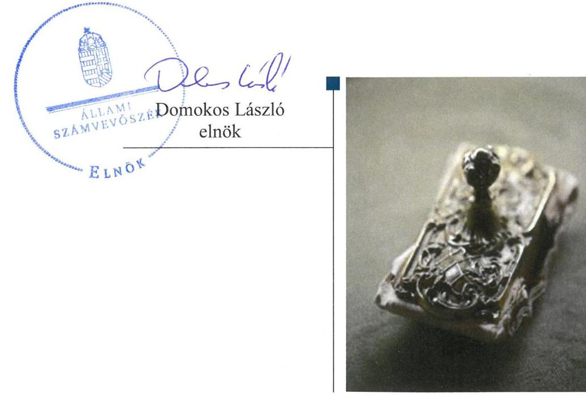
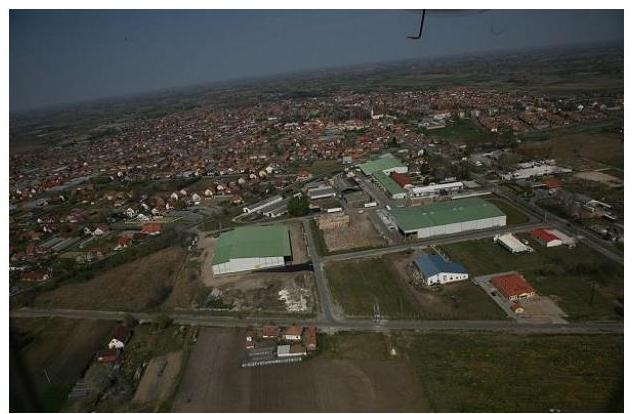
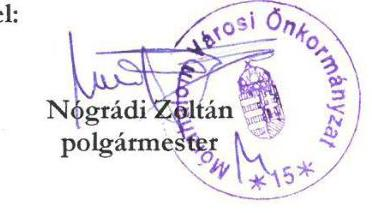
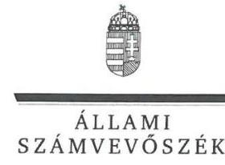
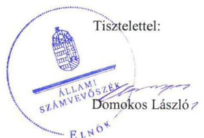
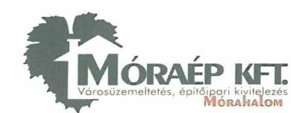
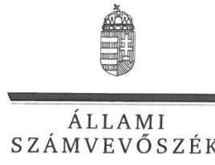
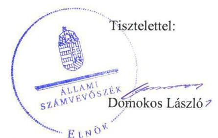

# Jelenetés 

## Nemzeti tulajdonú gazdasági társaságok ellenőrzése

MÓRAÉP Városüzemeltetési, Szolgáltató és Kereskedelmi Nonprofit Közhasznú Korlátolt Felelősségű Társaság
2019.

---

# J elentés 

## Nemzeti tulajdonú gazdasági társaságok ellenőrzése

MÓRAÉP Városüzemeltetési, Szolgáltató és Kereskedelmi Nonprofit Közhasznú Korlátolt Felelősségű Társaság
2019. 10. hó 28. nap

---

# AZ ELLENŐRZÉST FELÜGYELTE:

- KAKAS SÁNDOR felügyeleti vezető
- AZ ELLENŐRZÉST VEZETTE ÉS A VÉGREHAJTÁSÁÉRT FELELŐS:
  - JOÓ ERIKA ellenőrzésvezető
  - RÁCZKEVI KATALIN ellenőrzésvezető
- A PROGRAM ÖSSZEÁLLÍTÁSÁÉRT FELELŐS:
  - TÓTPÁL SZABOLCS osztályvezető

**IKTATÓSZÁM:** EL-1994-001/2019

**TÉMASZÁM:** 2478

**ELLENŐRZÉS-AZONOSÍTÓ SZÁM:** V-082205

Jelentéseink az Országgyűlés számítógépes hálózatán és az Interneten a www.asz.hu címen is olvashatóak.

---

# TARTALOMJEGYZÉK 

■ ÖSSZEGZÉS ..... 5
■ AZ ELLENŐRZÉS CÉLJA ..... 6
■ AZ ELLENŐRZÉS TERÜLETE ..... 7
■ AZ ELLENŐRZÉS HÁTTERE, INDOKOLTSÁGA ..... 8
■ A JELENTÉS LÉNYEGES KÉRDÉSKÖREI ..... 9
■ AZ ELLENŐRZÉS HATÓKÖRE ÉS MÓDSZEREI ..... 10
■ MEGÁLLAPÍTÁSOK ..... 12
■ JAVASLATOK ..... 14
■ MELLÉKLETEK ..... 17
I. sz. melléklet: Értelmező szótár ..... 17
■ FÜGGELÉKEK ..... 19
I. sz. függelék a jelentéshez ..... 19
II. sz. függelék: Észrevételek ..... 20
■ RÖVIDÍTÉSEK JEGYZÉKE ..... 31

---

.

---

# ÖSSZEGZÉS 

A MÓRAÉP Városüzemeltetési, Szolgáltató és Kereskedelmi Nonprofit Közhasznú Korlátolt Felelősségű Társaság felett tulajdonosi jogokat gyakorló Mórahalom Városi Önkormányzat a tulajdonosi joggyakorlás kereteit nem a jogszabályi előirásoknak megfelelően alakította ki, a tulajdonosi jogok gyakorlása nem volt szabályszerű. A Társaság vagyongazdálkodása nem volt szabályszerű. A Társaság a vagyonkezelt vagyont nem tartotta nyilván, számviteli beszámolóit nem támasztotta alá leltárral, ezzel nem volt biztositott az átláthatóság és elszámoltathatóság.

## Az ellenőrzés társadalmi indokoltsága

Az Állami Számvevőszék kiemelt célja, hogy a helyi önkormányzatok gazdálkodásában rejlő pénzügyi kockázatok feltárásával, az államháztartáson kívülre nyújtott költségvetési támogatások és ingyenes vagyonjuttatások, valamint az államháztartáson kívül múködő feladat-ellátó rendszerek ellenőrzéseivel hozzájáruljon ahhoz, hogy a közpénzeket az államháztartáson kívül múködő szervezetek is átlátható, rendezett módon használják fel.

Magyarországon az önkormányzatok kötelező és önként vállalt feladataik vonatkozásában is egyre szélesebb körben alkalmazzák a költségvetésen kívüli feladatellátást, ezáltal - a nonprofit szervezetek mellett - az önkormányzati tulajdonú gazdasági társaságok is kiemelt fontosságú szerephez jutottak.

## Főbb megállapítások, következtetések, javaslatok

Mórahalom Városi Önkormányzat tulajdonosi joggyakorlása nem volt szabályszerű, mert a jogszabályi előírás ellenére nem alkotta meg a Társaság javadalmazással összefüggő szabályzatát, a felügyelőbizottság tagjai számát nem a jogszabályi előírásnak megfelelően határozta meg. Az Önkormányzat a jogszabályi előírások ellenére nem ellenőrizte a Társaságnál a vagyonkezelésbe adott nemzeti vagyonnal való gazdálkodást.

A MÓRAÉP Városüzemeltetési, Szolgáltató és Kereskedelmi Nonprofit Közhasznú Korlátolt Felelősségű Társaságnál a vagyonkezelt vagyon vonatkozásában nem volt biztosított a nemzeti vagyon megőrzése, védelme, rendeltetésének megfelelő, átlátható, hatékony és költségtakarékos múködtetése, értéknövelő használata, hasznosítása, gyarapítása. Vagyonkezelési szerződés, nyilvántartás, illetve leltár hiányában nem volt biztosított a vagyonnal való felelős gazdálkodás.

Az Állami Számvevőszék a jelentésben foglalt megállapítások alapján Mórahalom Városi Önkormányzat polgármesterének három javaslatot, a MÓRAÉP Városüzemeltetési, Szolgáltató és Kereskedelmi Nonprofit Közhasznú Korlátolt Felelősségű Társaság ügyvezetőjének pedig három javaslatot fogalmazott meg. A javaslatokat megalapozó megállapításokra az érintetteknek 30 napon belül intézkedési tervet kell készíteniük.

---

# AZ ELLENŐRZÉS CÉLJA 

AZ ELLENŐRZÉS CÉLJA annak megállapítása, hogy a tulajdonosi joggyakorló a gazdasági társaságai feletti tulajdonosi joggyakorlás kereteit kialakította-e, tulajdonosi jogait megfelelően gyakorolta-e és kötelezettségeit teljesítette-e, továbbá a gazdasági társaság biztosí-totta-e a vagyon védelmét a nyilvántartások szabályszerű vezetése és a mérleg tételeinek leltárral történő alátámasztása útján, valamint szabályszerűen gondoskodott-e a társaság használatában, kezelésében lévő nemzeti vagyon értékének megőrzéséről, gyarapításáról, hasznosításáról.

---

# AZ ELLENŐRZÉS TERÜLETE 

## Mórahalom Városi Önkormányzat; MÓRAÉP Városüzemeltetési, Szolgáltató és Kereskedelmi Nonprofit Közhasznú Korlátolt Felelősségú Társaság

A Társaság 100\% önkormányzati tulajdonban álló gazdasági társaság, tulajdonosa Mórahalom Városi Önkormányzat. A Társaságot ${ }^{1}$ a Mórahalom Városi Önkormányzat alapította 2009. április 16-án.

A Társaság fő tevékenysége az ellenőrzött időszakban a nem veszélyes hulladék gyüjtése és szállítása volt, amelyet az Önkormányzattal ${ }^{2}$ kötött hulladékgazdálkodási közszolgáltatási szerződés ${ }_{1-2}{ }^{3}$ alapján közfeladatként látott el. A fő tevékenysége mellett közfeladatként közterület-fenntartási, tele-pülés-üzemeltetési, köztisztasági, lakás- és helyiséggazdálkodási, valamint vízgazdálkodási feladatokat látott el. A Társaság közfeladatai ellátása mellett építőipari vállalkozási tevékenységet is végzett. A Társaság az ellenőrzött időszakban nem tartozott a kormányzati szektorba sorolt gazdasági társaságok közé.

A Társaság jegyzett tőkéje az ellenőrzött időszakban változott. A jegyzett tőke 2015. január 1. és 2016. december 14. között 120 M Ft, 2016. december 15-től 180 M Ft volt.

A Társaság az ellenőrzött időszakban rendelkezett vagyonkezelésbe kapott vagyonnal, amelynek tulajdonosa a Mórahalmi Járási Hivatal Földhivatali Osztály nyilvántartása alapján Mórahalom Városi Önkormányzat volt. A Társaság a jogszabályi előírások alapján könyvvizsgálatra kötelezett volt az ellenőrzött időszakban, a könyvvizsgáló személyéről az Önkormányzat döntött.

A Társaság ügyvezetőjének személye az ellenőrzött időszakban nem változott, a Polgármester ${ }^{4}$ és a Jegyzó ${ }^{5}$ személyében nem történt változás.

Az Önkormányzat az ellenőrzött időszakban további tíz gazdasági társaságban rendelkezett többségi tulajdoni részesedéssel.

---

# AZ ELLENŐRZÉS HÁTTERE, INDOKOLTSÁGA 

Az Alaptörvény 38. cikke alapján az állam és a helyi önkormányzatok tulajdona nemzeti vagyon. A nemzeti vagyon megőrzése, megóvása érdekében kiemelten fontos ezen nemzeti tulajdonú gazdasági társaságok ellenőrzése. Gazdálkodásuk jellemzően a közérdeklődés és a média figyelmének középpontjában áll, amihez hozzájárul a gazdálkodásuk körébe tartozó - a nemzeti vagyon részét képező - vagyon nagysága, illetve az általuk ellátott közszolgáltatások minősége és hatékonysága. Ellenőrzéseink feltárhatják, hogy a tulajdonosi felügyelet hozzájárult-e a szabályszerű gazdálkodáshoz és feladatellátáshoz.

Az ellenőrzés eredményeként meghatározhatóvá válnak a szervezet vagyongazdálkodást érintő kockázatai, ezzel lehetővé téve a kockázatok csökkentését. A megállapítások alapján megfogalmazott számvevőszéki javaslatok hasznosítása elősegítheti a meglévő hibák megszüntetését. A jó gyakorlatok bemutatásával az ÁSZ hozzájárulhat a követendő megoldások megismertetéséhez, terjesztéséhez.

---

# A JELENTÉS LÉNYEGES KÉRDÉSKÖREI 

1. A gazdasági társaság feletti tulajdonosi joggyakorlás megfelel-t-e a jogszabályi és belső előírásoknak?
2. A Társaság vagyongazdálkodási tevékenysége szabályszerüvol-e?

---

# AZ ELLENŐRZÉS HATÓKÖRE ÉS MÓDSZEREI 

## Az ellenőrzés típusa

Megfelelőségi ellenőrzés.

## Az ellenőrzött időszak

A tulajdonosi joggyakorlás vonatkozásában az ellenőrzött időszak 2017. január 1-től az ellenőrzés megkezdésének napjáig terjedt ki az éves beszámolók elfogadása és a vagyonkezelésbe adott vagyonnal való gazdálkodás tulajdonosi ellenőrzése kivételével, amelyeknél az ellenőrzött időszak 2015. január 1-től az ellenőrzés megkezdésének napjáig - 2018. szeptember 21-ig - tartott.

A Társaság vagyongazdálkodása vonatkozásában az ellenőrzött időszak 2015. - 2017. évek, a 2017. évi beszámoló jóváhagyása tekintetében 2018. június elsejéig tartó időszak.

## Az ellenőrzés tárgya

Az önkormányzati tulajdonban lévő gazdasági társaság feletti tulajdonosi joggyakorlás kialakítása és működtetése.

Önkormányzati tulajdonban lévő gazdasági társaság vagyongazdálkodása keretében a társaság használatában, kezelésében lévő nemzeti vagyon, illetve a saját vagyon tekintetébe a vagyonnyilvántartások vezetése, leltára. A társaság használatában, vagyonkezelésében lévő nemzeti vagyon tekintetében a vagyon értékének megőrzése, gyarapítása, hasznosítása.

## Az ellenőrzött szervezet

Mórahalom Városi Önkormányzat;
MÓRAÉP Városüzemeltetési, Szolgáltató és Kereskedelmi Nonprofit Közhasznú Korlátolt Felelősségű Társaság

## Az ellenőrzés jogalapja

Az ellenőrzés jogalapját az ÁSZ tv. ${ }^{6} 1 . \S$ (3) bekezdése és 5. § (3)-(5) bekezdései képezték.

---

# Az ellenőrzés módszerei 

Az ellenőrzést az ellenőrzési program ellenőrzési kérdései, az ellenőrzött időszakban hatályos jogszabályok, az ellenőrzés szakmai szabályok és módszertanok alapján, a nemzetközi standardok figyelembe vételével végeztük.

Az ellenőrzés ideje alatt az ellenőrzött szervezettel történő kapcsolattartást az ÁSZ Szervezeti és Múködési Szabályzatának vonatkozó előírásai alapján biztosítottuk.

Az ellenőrzést a kérdésekre adott válaszok kiértékelésével, valamint a megjelölt adatforrások, a csatolt tanúsítványok felhasználásával, továbbá az adott időszakban hatályos jogszabályok figyelembe vételével folytattuk le.
2017. január 1-től az ellenőrzés megkezdésének napjáig ellenőriztük a tulajdonosi joggyakorlás kereteinek kialakítását, a tulajdonosi joggyakorló tevékenységét a felügyelő bizottság és a független könyvvizsgáló múködéséhez kapcsolódóan, valamint azt, hogy a tulajdonosi joggyakorló - amenynyiben a gazdasági társaság feladatellátásához és vagyonkezeléséhez kapcsolódóan határozott meg követelményeket, elvárásokat - a nemzeti vagyon értékének megőrzése érdekében monitorozta-e azok teljesülését. 2015. január 1-től az ellenőrzés megkezdésének napjáig ellenőriztük a tulajdonosi joggyakorló részvételét az éves beszámoló elfogadására vonatkozó döntéshozatalban, valamint amennyiben adott a társaságainak vagyonkezelésbe nemzeti vagyont, akkor azt, hogy az azzal történő gazdálkodást a tulajdonosi joggyakorló ellenőrizte-e.

A gazdasági társaság vagyongazdálkodása vonatkozásában az ellenőrzött időszak 2015. - 2017. évek, a 2017. évi beszámoló jóváhagyása és közzététele tekintetében 2018. június elsejéig tartó időszak.

A vagyonnyilvántartások és a leltár szabályszerűsége esetében az ellenőrzés azokra a legnagyobb értékű tételekre - a lényeges sokaságra - terjedt ki, melyek összértéke eléri a teljes sokaság összértékének 50\%-át.

A 2015. és a 2017. évben a lényeges sokaságot tételesen ellenőriztük.
Az ellenőrzési kérdések megválaszolásához szükséges bizonyítékok megszerzése a Társaság vagyongazdálkodása vonatkozásában a következő ellenőrzési eljárások alkalmazásával történt: megfigyelés, információkérés, összehasonlítás, elemző eljárás. Az ellenőrzési bizonyítékként felhasználható adat-források közé tartoznak az ellenőrzési programban felsorolt adatforrások, továbbá minden - az ellenőrzés folyamán - feltárt, az ellenőrzés szempontjából információkat tartalmazó dokumentum.

---

# 1. A gazdasági társaság feletti tulajdonosi joggyakorlás megfelel-e a jogszabályi és belső előírásoknak? 

## Összegző megállapítás

1.1. számú megállapítás
1.2. számú megállapítás

Az Önkormányzat tulajdonosi joggyakorlása nem volt szabályszerű.

Az Önkormányzat a tulajdonosi joggyakorlás kereteit nem szabályszerűen alakította ki.

Az Önkormányzat Képviselő-testülete ${ }^{7}$ a Taktv. ${ }^{8}$ 5. § (3) bekezdés előírása ellenére nem alkotta meg a vezető tisztségviselők, Felügyelőbizottsági tagok, az Mt. ${ }^{9}$ 208. §-ának hatálya alá eső munkavállalók javadalmazása, valamint a jogviszony megszűnése esetére biztosított juttatások módjának, mértékének elveiről, annak rendszeréről szóló szabályzatot.

## A Társaság feletti tulajdonosi joggyakorlás nem volt szabályszerű.

A Taktv. 4 § (2) bekezdésben foglalt előírás ellenére a 2017-2018-ban hatályos Alapító okirat ${ }_{2-4}{ }^{10}$ a felügyelő bizottság tagjainak számát öt főben határozta meg.

A Társaság 2016-2017. évekre vonatkozó egyszerűsített éves beszámolóit a Képviselő-testület a jogszabályi előírásoknak megfelelően fogadta el, a könyvvizsgálói jelentések a beszámoló elfogadásakor rendelkezésére álltak.

Az Önkormányzat az Nvtv. ${ }^{11}$ 10. § (2) bekezdésében foglalt előírások ellenére nem ellenőrizte a Társaságnál a vagyonkezelésbe adott nemzeti vagyonnal való gazdálkodást.

## 2. A Társaság vagyongazdálkodási tevékenysége szabályszerű volt-e?

## Összegző megállapítás

2.1. számú megállapítás

A Társaság vagyongazdálkodási tevékenysége nem volt szabályszerű.

A Társaság a vagyonkezelt vagyonhoz kapcsolódó nyilvántartásait a jogszabályi előírásokkal ellentétben nem vezette.

A Társaság a - földhivatali nyilvántartás szerint - kezelésében lévő vagyont a Számv. tv. ${ }^{12}$ 23. § (2) és a 42. § (5) bekezdés előírásai ellenére az egyszerűsített éves beszámolók mérlegeiben az eszközök és a források között nem mutatta ki. A Társaság vagyonkezeléssel érintett vagyonára vonatkozó adatokat a beszámolók nem tartalmaztak.

---

| 2.2. számú megállapítás | A Társaság az egyszerúsített éves beszámolók mérlegeit nem támasztotta alá leltárral. |
| :--: | :--: |
|  | A Társaság az ellenőrzött időszakban rendelkezett az előírásoknak megfelelő leltárkészítésre és leltározásra vonatkozó Leltározási szabályzattal.   A Társaság a 2015., 2016. és 2017. évben a Számv. tv. 69. § (1) bekezdésében foglalt előírás ellenére leltárral nem támasztotta alá a mérlegtételeit. |
| 2.3. számú megállapítás | A Társaság nem gondoskodott a nemzeti vagyon értékének megörzéséről, gyarapításáról. A vagyonkezelt vagyon vonatkozásában a Társaság a jogszabályi előírásokat nem tartotta be. |
|  | A Társaság a vagyonkezelésében lévő vagyonelemek után az ellenőrzött években a Számv tv. 52. § (1) előírásai ellenére nem határozta meg az évenként elszámolandó értékcsökkenés összegét, és nem tett eleget az Mótv. ${ }^{13}$ 109. § (6) bekezdés előírásainak a vagyonkezelésbe vett vagyon értékének megőrzésére vonatkozóan. |

---

# JAVASLATOK 

Az ÁSZ tv. 33. § (1) bekezdésében foglaltak értelmében az ellenőrzött szervezet vezetője köteles a jelentésben foglalt megállapításokhoz kapcsolódó intézkedési tervet összeállítani és azt a jelentés kézhezvételétől számított 30 napon belül az ÁSZ részére megküldeni. Amennyiben az ellenőrzött szervezet vezetője nem küldi meg határidőben az intézkedési tervet, vagy továbbra sem elfogadható intézkedési tervet küld, az Állami Számvevőszék elnöke az ÁSZ tv. 33. § (3) bekezdése a) és b) pontjaiban foglaltakat érvényesítheti.

## MÓRAÉP Városüzemeltetési, Szolgáltató és Kereskedelmi Nonprofit Korlátolt Felelősségű Társaság ügyvezetőjének

1. Intézkedjen arra, hogy a vagyonkezelésbe vett eszköz az éves beszámoló mérlegében kimutatásra kerüljön a Számv. tv. előírásai szerint.
(2.1. megállapítás 1. bekezdésének 1. mondata alapján)
2. Gondoskodjon a mérlegben kimutatott eszközök és források jogszabályban elöirtaknak megfelelő, teljes körü leltárral történő alátámasztásáról.
(2.2. sz. megállapítás 2. bekezdése alapján)
3. Gondoskodjon a vagyonkezelésbe vett eszköz után az évente elszámolandó értékcsökkenés meghatározásáról a jogszabályi előírás szerint.
(2.3. sz. megállapítás 1. bekezdés 1. mondat 1. tagmondata alapján)

## Mórahalom Városi Önkormányzat polgármesterének

1. Kezdeményezze a Képviselő-testületnél a vezető tisztségviselők, a felügyelő bizottsági tagok, az Mt. 208. §-ának hatálya alá eső munkavállalók javadalmazása, valamint a jogviszony megszünése esetére biztosított juttatások módjának, mértékének elveire, annak rendszerére vonatkozó szabályzat megalkotását a Taktv.-ben elöirtaknak megfelelően.
(1.1. sz. megállapítás 1. bekezdése alapján)
2. Kezdeményezze a Társaság alapító okiratának módosítását annak érdekében, hogy a felügyelő bizottság létszáma megfeleljen a jogszabályi előírásnak.
(1.2. sz. megállapítás 1. bekezdése alapján)

---

3. Gondoskodjon a Társaság nemzeti vagyonnal való gazdálkodásának rendszeres ellenőrzéséről a jogszabályi előírás szerint.
(1.2. sz. megállapítás 3. bekezdése alapján)

---

.

---

# MELLÉKLETEK 

- I. SZ. MELLÉKLET: ÉRTELMEZŐ SZÓTÁR
gazdasági társaság
közszolgáltatás
közfeladat
nemzeti vagyon
nemzeti vagyon hasznosítása
nemzeti vagyon használója
vagyonkezelő

Ptk. 3:88. § (1) bekezdése szerint „a gazdasági társaságok üzletszerű közös gazdasági tevékenység folytatására, a tagok vagyoni hozzájárulásával létrehozott, jogi személyiséggel rendelkező vállalkozások, amelyekben a tagok a nyereségből közösen részesednek, és a veszteséget közösen viselik".
Az Ebktv. ${ }^{14}$ 3. § d) pontja a következőképpen határozza meg a közszolgáltatást: „szerződéskötési kötelezettség alapján a lakosság alapvető szükségleteinek ellátására irányuló szolgáltatás, így különösen a villamos energia-, gáz-, hő-, víz-, szenny-víz- és hulladékkezelési, köztisztasági, postai és táv-közlési szolgáltatás, továbbá a menetrend alapján közlekedő járművekkel végzett közforgalmú személyszállítás".
Az Áht. 3/A. § (1) bekezdése alapján közfeladat a jogszabályban meghatározott állami vagy önkormányzati feladat
Nvtv. 1. § (2) bekezdése szerint nemzeti vagyonba tartozik többek között:
„az állam vagy a helyi önkormányzat kizárólagos tulajdonában álló dolgok,
az a) pont hatálya alá nem tartozó, állam vagy a helyi önkormányzat tulajdonában lévő dolog,
az állam vagy a helyi önkormányzat tulajdonában lévő pénzügyi eszközök, továbbá az államot vagy a helyi önkormányzatot megillető társasági részesedések,
az államot vagy a helyi önkormányzatot megillető bármely vagyoni érték-kel rendelkező jogosultság, amelyet jogszabály vagyoni értékű jogként nevesít
A tulajdonosi joggyakorló vagy a nemzeti vagyon használója által a nemzeti vagyon birtoklásának, használatának, hasznok szedése jogának bármely - a tulajdonjog átruházását nem eredményező - jogcímen történő átengedése, ide nem értve a vagyonkezelésbe adást, valamint a haszonélvezeti jog alapítását.
Forrás: Nvtv. 3. § (1) bekezdés 4. pont
Azon természetes személy, jogi személy vagy jogi személyiséggel nem rendelkező szervezet, aki vagy amely állami vagyon tekintetében törvény vagy szerződés alapján, a helyi önkormányzat vagyona tekintetében törvény, a helyi önkormányzat rendelete vagy szerződés alapján bármely jogcímen nemzeti vagyont birtokol, használ, szedi annak használt, kivéve a tulajdonosi joggyakorló.
Forrás: Nvtv. 3. § (1) bekezdés 11. pont
Aki a nemzeti vagyon felett az államot vagy a helyi önkormányzatot megillető tulajdonosi jogok és kötelezettségek összességének gyakorlására jogosult. (Forrás: Nvtv. 3. § (1) bekezdés 17. pontja)
az állam tulajdonában álló nemzeti vagyon tekintetében:
aa) költségvetési szerv,
ab) helyi önkormányzat, nemzetiségi önkormányzat, valamint ezek társulásai,
ac) az ab) alpontban felsoroltak fenntartása vagy irányítása alá tartozó intézmény, ad) köztestület,
ae) az állam, az aa)-ac) alpontban meghatározott személyek együtt vagy külön-külön 100\%-os tulajdonában álló gazdálkodó szervezet,
af) az ae) alpont szerinti gazdálkodó szervezet 100\%-os tulajdonában álló gazdálkodó szervezet,
ag) a törvény által kijelölt egyedileg meghatározott jogi személy.
b) a helyi önkormányzat tulajdonában álló nemzeti vagyon tekintetében:

---

ba) nemzetiségi önkormányzat, helyi vagy nemzetiségi önkormányzati társulás, valamint ezek fenntartása vagy irányítása alá tartozó intézmény,
bb) költségvetési szerv,
bc) köztestület,
bd) az állam, a helyi önkormányzat, a ba) alpontban meghatározott személyek együtt vagy külön-külön 100\%-os tulajdonában álló gazdálkodó szervezet,
be) a bd) alpont szerinti gazdálkodó szervezet 100\%-os tulajdonában álló gazdálkodó szervezet.
Forrás: Nvtv. 3. § (1) bekezdés 19. pont
vagyonkezelői jog
vagyongazdálkodás

A vagyonkezelő köteles a vagyontárgy állagának megóvásáról, jó karban-tartásáról, működtetéséről gondoskodni, jogszabályban és szerződésben előírt más kötelezettségét teljesíteni, valamint a vagyontárgyat jogszabályban vagy szerződésben meghatározott célnak megfelelően használni. A vagyonkezelő - a központi költségvetési szervek és a kizárólag közfeladatot ellátó nem központi költségvetési szerv vagyonkezelők kivételével - köteles díjat fizetni, jogszabályban és szerződésben előírt más kötelezettségét teljesíteni, valamint a vagyontárgyat jogszabályban vagy szerződésben meghatározott célnak megfelelően használni. Amennyiben a vagyonkezelő ezen kötelezettségeinek nem tesz eleget, a tulajdonosi joggyakorló jogosult a szerződést azonnali hatállyal felmondani.
Forrás: Vtv. 27. § (2), (2a
A nemzeti vagyongazdálkodás feladata a nemzeti vagyon rendeltetésének megfelelő, az állam, az önkormányzat mindenkori teherbíró képességéhez igazodó, elsődlegesen a közfeladatok ellátásához és a mindenkori társadalmi szükségletek kielégítéséhez szükséges, egységes elveken alapuló, átlátható, hatékony és költségtakarékos működtetése, értékének megőrzése, állagának védelme, értéknövelő használata, hasznosítása, gyarapítása, továbbá az állam vagy a helyi önkormányzat feladatának ellátása szempontjából feleslegessé váló vagyontárgyak elidegenítése. (Forrás: Nvtv. 7. § (2) bekezdése).

---

# FÜGGELÉKEK 

- I. SZ. FÜGGELÉK A JELENTÉSHEZ

Az Állami Számvevőszék az ellenőrzések során feltárt tényekhez kapcsolódó további körülmények tisztázására eszközrendszerrel nem rendelkezik. Amennyiben az ellenőrzésen túlmutatóan indokoltnak látszik az ellenőrzés során feltárt körülmények további vizsgálata, az Állami Számvevőszék törvényi felhatalmazás alapján az ellenőrzés által feltárt körülményeket továbbítja a hatáskörrel rendelkező szervnek a szükséges intézkedések megtétele, eljárások lefolytatása érdekében.
A Mórahalmi Járási Hivatal Földhivatali Osztály nyilvántartása alapján a Társaság az ellenőrzött időszakban rendelkezett vagyonkezelésbe kapott eszközzel, amelynek tulajdonosa Mórahalom Városi Önkormányzat volt. A vagyonkezelés tárgya a 0319/38 helyrajzi számú, Mórahalom külterület „kivett bányatelek" volt, a vagyonkezelési jog bejegyzésének ${ }^{15}$ dátuma 2012. december 20.
A Társaság az ellenőrzött időszakban a vagyonkezelt eszközt a Számv. tv. 23. § (2) bekezdés előírásaival ellentétben a mérlegében és számviteli nyilvántartásaiban nem szerepeltette és az egyszerüsített éves beszámolók kiegészítő mellékletében nem mutatta be azt legalább mérlegtételek szerinti megbontásban.
A 2015-2017. évi beszámolók a Számv. tv. 4. § (2) bekezdés előírása ellenére a Társaság vagyoni helyzetéről, a saját és kezelt vagyon összetétele tekintetében nem a valós helyzetet tükrözték, mivel a vagyonkezelt eszközállományt mérlegében nem mutatta ki. A 2015-2017. évi beszámolókat a Számv. tv. 69. § (1) bekezdésében foglaltak ellenére leltárral nem támasztotta alá.
A Társaság a vagyonkezelésében lévő ingatlan hasznosításával a tulajdonosi joggyakorló felé nem számolt el, így nem zárható ki, hogy az Önkormányzatot megillető bevételek átadása nem történt meg a tulajdonos Önkormányzat részére, ezáltal nem zárható ki, hogy az Önkormányzatot vagyoni hátrány érte.
Az eset konkrét körülményeinek felderítésére az ügyészség rendelkezik hatáskörrel.

---

A jelentéstervezetet a Számvevőszék 15 napos észrevételezésre megküldte az ellenőrzött szervezetek vezetőinek az ÁSZ tv. 29. §̊ (1) bekezdése előirásának megfelelően.

Mórahalom Városi Önkormányzat polgármestere és a MÓRAÉP Városüzemeltetési, Szolgáltató és Kereskedelmi Nonprofit Közhasznú Korlátolt Felelősségű Társaság ügyvezetője a jelentéstervezet megállapításaira írásban észrevételt tett.
Az ÁSZ tv. 29. §̊ (3) bekezdésével összhangban az ÁSZ a Függelékben feltünteti az ellenőrzés megállapításaival kapcsolatban tett, figyelembe nem vett észrevételeket, és megindokolja, hogy azokat miért nem fogadta el.

A „Nemzeti tulajdonú gazdasági társaságok - Nemzeti tulajdonú gazdasági társaságok ellenőrzése - MÓRAÉP Városüzemeltetési, Szolgáltató és Kereskedelmi Nonprofit Közhasznú Korlátolt Felelősségű Társaság " címmel készített számvevőszéki jelentéstervezet megállapításaival kapcsolatban Mórahalom Város Önkormányzatának polgármestere által 2019. augusztus 1-jén tett (az Állami Számvevőszékhez 2019. augusztus 7-én érkezett) észrevételek - mellékletek nélkül - és azok kezelésének indokolása, továbbá a MÓRAÉP Városüzemeltetési, Szolgáltató és Kereskedelmi Nonprofit Közhasznú Korlátolt Felelősségű Társaság ügyvezetője által 2019. augusztus 1-jén tett (az Állami Számvevőszékhez 2019. augusztus 6-án érkezett) észrevételek - mellékletek nélkül - és azok kezelésének indokolása.

[^0]
[^0]:    * 29. § (1) Az Állami Számvevőszék az ellenőrzési megállapításait megküldi az ellenőrzött szervezet vezetőjének vagy az általa megbízott személynek, és annak, akinek személyes felelősségét állapította meg.
    (2) Az ellenőrzött szervezet vezetője és a felelősként megjelölt személy az ellenőrzés megállapításaira tizenöt napon belül írásban észrevételt tehet.
    (3) Az Állami Számvevőszék az észrevételre a beérkezésétől számított harminc napon belül írásban válaszol. A figyelembe nem vett észrevételeket köteles a jelentésben feltüntetni, és megindokolni, hogy azokat miért nem fogadta el.

---

# MÓRAHALOM VÁROSI ÖNKORMÁNYZAT 

6782 MORAHALOM, SZENTHAROMSÁG TÉR 1 TELÉFON: 06-62 281-079, FAX: 06-62 281-244 E-MAIL: INFO@MORAHALOM.HU

## MÓRAHALOM VÁROS POLGÁRMESTERÉTÓL

Iktató szám: MH/6372-2/2019.
Úgyintéző: Dr. Tóth Krisztián

Tárgy: Móraép Nonprofit Kft. (6782 Mórahalom, Röszkei út 34.) nemzeti tulajdonú gazdasági társaság ellenőrzése tárgyában elkészült jegyzőkönyv észre vételezése

Melléklet: 3 darab
-vagyonkezelési szerződés
-156/2019. (IV.25.) Képviselő testületi-
határozat
-226/2019. (VI.27.) Képviselő-testületi határozat

Állami Számvevőszék
Domokos László Elnök Úr részére

Budapest
Apáczai Csere János u. 10. 1052

Állami Számvevőszék
BE-48-18/2019/1
Érészett: 2019 AUG 07.
Iktatószám: EL-0856-080/2019
Melléklet:

Tisztelt Elnök Úr!
A „Nemzeti tulajdonú gazdasági társaságok ellenőrzése -Móraép Városüzemeltetési, Szolgáltató és Kereskedelmi Nonprofit Közhasznú Korlátolt Felelősségű Társaság" című EL-0856084/2019. iktatószámú számvevőszéki jelentéstervezetük vonatkozásában az Állami Számvevőszékről szóló 2011. évi LXVI. törvény 29. § (2) bekezdésében biztosított jogommal élve, mint a tulajdonosi joggyakorló az alábbi észrevételt teszem.

Az Állami Számvevőszék a hivatkozott jelentéstervezetben megállapította, hogy Mórahalom Város Önkormányzata a tulajdonosi joggyakorlás kereteit a Móraép Városüzemeltetési, Szolgáltató és Kereskedelmi Nonprofit Közhasznú Korlátolt Felelősségű Társaság (a továbbiakban: Társaság) vonatkozásában nem a jogszabályi előírásoknak megfelelően alakította ki, a tulajdonosi joggyakorlás nem volt szabályszerű.

---

Mórahalom Város Önkormányzata és a Társaság között 2012. december 20-án megkötött vagyonkezelési szerződés, amely a Mórahalmi Közzeti Földhivatalhoz benyújtásra került a teljességi nyilatkozat ellenére sajnálatos módon adminisztrációs okból nem került csatolásra az ellenőrzés során, amit jelen észrevételünkkel szeretnénk pótolni.

Az Állami Számvevőszék Mórahalom Város Polgármesterének javaslatot tett miszerint gondoskodjon a Társaság nemzeti vagyonnal való gazdálkodásának rendszeres ellenőrzéséről a jogszabályi előírás szerint.

Az Állami Számvevőszék javaslatával kapcsolatban a következőket kívánom előadni. A tulajdonosi joggyakorlás szabályozása érdekében Mórahalom Város Képviselő-testülete a 156/2019. (IV.25.) számú Képviselő-testületi határozatával elfogadta a tulajdonosi ellenőrzés rendjéről szóló szabályzatot, amit a 226/2019. (VI.27.) számú Képviselő-testületi határozat módosított. A hivatkozott képviselő-testületi határozatokat, jelen levelemhez mellékleteként csatolom.

A Társaság részére vagyonkezelésbe adott vagyonrészt Mórahalom Város Önkormányzata a 18-as számlacsoportban elkülönítetten tartja nyilván. A vagyonkezelő a vagyon hasznosítás vonatkozásában folyamatos tájékoztatást adott, illetve évente üzleti jelentést nyújtott be a hasznosítás eredményéről.

A szabályzatnak megfelelően a gazdasági társaságok ügyvezetői és felügyelő bizottság tagjai a 2019. szeptemberi soros Képviselői-testületi kötelezettségeik teljesítése mellett, kezdeményezem, hogy Mórahalom Város Önkormányzat Képviselő-testülete a vezető tisztségviselők, felügyelő bizottsági tagok, valamint a Munka Törvénykönyve 208.§-ának hatálya alá tartozó munkavállalók javadalmazására, jogviszonyuk megszűnése esetére biztosított juttatások módjának, mértékének elveire, annak rendszerére vonatkozó szabályzatot (együttesen: Javadalmazási Szabályzatot) megalkossa.

A Társaság felügyelő bizottságának 5 fővel történő működését a cég széleskörű tevékenysége indokolta. A társaság felügyelő bizottság tagjai közül, csak az elnök részesül díjazásban a többi tag díjazás nélkül végzi feladatát. A Társaság jegyzett tőkéje 180 millió forint 2016 decembere óta.

Kérem Tisztelt Elnök Urat, hogy jelen észrevételemben, valamint annak alátámasztásaként csatolt dokumentációkban foglaltakat a végleges jelentés elkészítésekor szíveskedjen figyelembe venni.

Mórahalom, 2019. augusztus 1.

Tisztelettel:

---

ELNÖK

Ikt.szám: EL-0856-091/2019.

# Nógrádi Zoltán 

polgármester
Mórahalom Városi Önkormányzat

## Mórahalom

## Tisztelt Polgármester Úr!

A „Nemzeti tulajdonú gazdasági társaságok ellenőrzése - MÓRAÉP Városüzemeltetési, Szolgáltató és Kereskedelmi Nonprofit Közhasznú Korlátolt Felelősségü Társaság" címmel készített számvevőszéki jelentéstervezetre tett észrevételeit megkaptam.
Az Állami Számvevőszék észrevételekre vonatkozó álláspontjáról a felügyeleti vezető által készített részletes tájékoztatást csatoltan megküldöm.
Tájékoztatom Polgármester urat, hogy a számvevőszéki jelentésben - az Állami Számvevőszékről szóló 2011. évi LXVI. törvény 29. § (3) bekezdése alapján - a figyelembe nem vett észrevételeket szerepeltetjük az elutasítás indokának feltüntetésével.

Budapest, 2019. OG hó 2 nap

Melléklet: Tájékoztatás az észrevételek kezeléséről

---

# Tájékoztatás az észrevételek kezeléséről 

A „Nemzeti tulajdonú gazdasági társaságok ellenörzése - MÓRAÉP Városüzemeltetési, Szolgáltató és Kereskedelmi Nonprofit Közhasznú Korlátolt Felelősségü Társaság" címü jelentéstervezetre (továbbiakban: jelentéstervezet) a 2019. augusztus 1-én kelt, MH/6372-2/2019. iktatószámú levelében megküldött, észrevételeit áttekintettem. Az észrevételek kezeléséről az alábbi tájékoztatást adom.

## 1) Észrevétel az Önkormányzat nemzeti vagyonnal való gazdálkodást érintő ellenőrzési tevékenységével kapcsolatban (Jelentéstervezet 1.2. sz. megállapítás 3. bekezdése)

Polgármester úr észrevételében jelezte, hogy a tulajdonosi joggyakorlás szabályozása érdekében Mórahalom Város Képviselő-testülete a 156/2019. (IV.25.) számú Képviselő-testületi határozatával elfogadta a tulajdonosi ellenőrzés rendjéről szóló szabályzatot, valamint az azt módosító 226/2019. (VI.27.) számú Képviselő-testületi határozatot. A hivatkozott képviselő testületi határozatokat észrevételéhez mellékletként csatolta.
Az észrevételére válaszolva tájékoztatom, hogy köszönettel vettük a megtett intézkedésekről adott tájékoztatását, de az az ellenőrzött időszak viszonylatában tett megállapításainkat nem befolyásolja. Fentiekre tekintettel az észrevételt nem fogadjuk el, ezért a jelentéstervezet módosítása nem indokolt.

## 2) Észrevétel az Önkormányzat által vagyonkezelésbe adott vagyontárggyal kapcsolatban (Jelentéstervezet 1.2. sz. megállapítás 3. bekezdése)

Polgármester úr észrevételében kifejtette, hogy Mórahalom Város Önkormányzata és MÓRAÉP Városüzemeltetési, Szolgáltató és Kereskedelmi Nonprofit Közhasznú Kft. (továbbiakban: Társaság) között 2012. december 20-án megkötött vagyonkezelési szerződés, amely a Mórahalmi Körzeti Földhivatalhoz benyújtásra került a teljességi nyilatkozat ellenére sajnálatos módon adminisztrációs okból nem került csatolásra az ellenőrzés során. A Társaság részére vagyonkezelésbe adott vagyonrészt Mórahalom Város Önkormányzata a 18-as számlacsoportban elkülönítetten tartja nyilván. A vagyonkezelő a vagyon hasznosítás vonatkozásában folyamatos tájékoztatást adott, illetve üzleti jelentést nyújtott be a hasznosítás eredményéről.
Az észrevételére válaszolva tájékoztatom, hogy a számvitelről szóló 2000. évi C. törvény (továbbiakban: Számv. tv.) 23. § (2) bekezdése értelmében a vagyonkezelőnél a mérlegben eszközként kell kimutatni a - törvényi rendelkezés, illetve felhatalmazás alapján - kezelésbe vett, az állami vagy önkormányzati vagyon részét képező eszközöket. A jelentéstervezetben erre való tekintettel került megállapítása, hogy „a Társaság vagyonkezeléssel érintett vagyonára vonatkozó adatokat a beszámolók nem tartalmaztak". Köszönjük tájékoztatását a vagyonkezelésbe

---

vett ingatlan hasznosítása tárgyában a Társaság által az Önkormányzat részére nyújtott adatszolgáltatásokról, de az a vagyonkezelt vagyon nyilvántartását érintően tett megállapításainkat nem befolyásolja. Fentiekre tekintettel az észrevétel alapján a jelentéstervezet módosítása nem indokolt.

# 3) Észrevétel a Társaság vezető tisztségviselőinek, Felügyelőbizottsági tagjainak dijazásával kapcsolatban (Jelentéstervezet 1.1. sz. megállapítás) 

Polgármester úr észrevételében jelezte, hogy a gazdasági társaságok ügyvezetőinek és felügyelőbizottsági tagjainak 2019. szeptemberi soros Képviselő-testületi kötelezettségei teljesítése mellett kezdeményezi, hogy Mórahalom Város Önkormányzat Képviselő-testülete a vezető tisztségviselők, a felügyelő bizottsági tagok, valamint a Munka törvénykönyve 208. §-ának hatálya alá tartozó munkavállalók javadalmazására, jogviszonyuk megszüntetése esetén biztosított juttatások módjának, mértékének elveire, annak rendszerére vonatkozó szabályzatot megalkossa.
Az észrevételére válaszolva tájékoztatom, hogy köszönettel vettük az ellenőrzött időszakon kívül megtenni szándékozott intézkedésről adott tájékoztatását, de az az ellenőrzött időszak viszonylatában tett megállapításainkat nem befolyásolja. Fentiekre tekintettel az észrevételt nem fogadjuk el, ezért a jelentéstervezet módosítása nem indokolt.

## 4) Észrevétel a felügyelő bizottsági tagok számával kapcsolatban (Jelentéstervezet 1.2. sz. megállapítás 1. bekezdés)

Polgármester úr észrevételében kifejtette, hogy a Társaság felügyelő bizottságának 5 fővel történő működését a cég széles körű tevékenysége indokolta. Elmondta továbbá, hogy a felügyeleti bizottság tagjai közül csak az elnök részesül díjazásban, a többi tag díjazás nélkül végzi feladatát. Hozzátette, hogy a Társaság jegyzett tőkéje 180 millió Ft 2016. decembere óta.
Az észrevételére válaszolva tájékoztatom, hogy a köztulajdonban álló gazdasági társaságok takarékosabb müködéséről szóló 2009. évi CXXII. törvény 4. § (2) bekezdése értelmében a köztulajdonban álló gazdasági társaság felügyelőbizottsága - ha törvény eltérően nem rendelkezik három természetes személy tagból áll. Ugyanezen jogszabályhely akkor engedélyez 3-6 fő közötti létszámot, ha a Társaság jegyzett tőkéje a 200 millió Ft-ot meghaladja, amely jogszabályi feltétel a jelen esetben nem teljesül. Fentiekre tekintettel az észrevételt nem fogadjuk el, a jelentéstervezet módosítása nem indokolt.

Budapest, 2019. 98 hó 29 nap

Kakas Sándor
felügyeleti vezető

---

Móraép Nonprofit Közhasznú Kft.
6782 Mórahalom, Röszkei út 34. Tel./fax: (62) 281-055
Mobil.: +36-70-312-3097 E-mail: moraep@morahalom.hu

Állami Számvevőszék
Budapest
Apáczai Csere János utca 10.
1052

Domokos László Elnök Úr
részére

Tisztelt Elnök Úr!

A 2019 július 16-án kelt EL-0856-083/2019. iktatószámú „Nemzeti tulajdonú gazdasági társaságok ellenőrzése – Móraép Városüzemeltetési, Szolgáltató és Kereskedelmi Nonprofit Közhasznú Korlátolt Felelősségű Társaság” című számvevőszéki jelentéstervezetük vonatkozásában az Állami Számvevőszékről szóló 2011. évi LXVI. törvény 29. § (2) bekezdésében biztosított jogommal élve, mint a Móraép Nonprofit Közhasznú Kft. ügyvezetője az alábbi észrevételt teszem.

Az Állami Számvevőszék a hivatkozott jelentéstervezetben megállapította, hogy a Móraép Városüzemeltetési, Szolgáltató és Kereskedelmi Nonprofit Közhasznú Korlátolt Felelősségű Társaság (a továbbiakban: Társaság) vagyongazdálkodása nem volt szabályszerű. A Társaság a vagyonkezelt vagyont nem tartotta nyilván, számviteli beszámolóit nem támasztotta alá leltárral.

Társaságunk 2012. 12.20-án vagyonkezelési szerződés kötött Mórahalom Város Önkormányzatával a 0319/38 helyrajzi számú ingatlan vonatkozásában (1. számú melléklet). Ezen ingatlanon a tulajdonos döntése szerint homokbánya került kialakításra. A vagyonkezelési szerződésünk V. pontjának megfelelően évente az üzleti jelentést készítettünk, melyben részletesen beszámoltunk a szakmai feladatokról és a gazdálkodás eredményeiről (2.1-2.7 számú melléklet).

A vagyonkezelési szerződésünk értelmében a kezelt vagyon vonatkozásában pénzeszköz átadás nem történt.

A vagyonkezelési szerződés szerinti feladatot elvégezte és végzi társaságunk a mai napig, de sajnálatos módon ezen szerződés szerinti vagyonátadás nem került számviteli rögzítésre adminisztrációs tévedés miatt. Ezen hiányosságot pótoljuk a 2019. 06.30-i évközi mérlegünkben (melynek mérlegkészítési időszakában vagyunk) a vagyonátadás és az értékcsökkenés meghatározás megtörténik. Mivel a vagyonkezelési feladat ellátása megtörtént, ezért kár nem érte Mórahalom Város Önkormányzatát.

---

Társaságunk összvagyonának 0,6\%-t teszi ki a vagyonkezelt vagyon nyilvántartási értéke (az átadás évében), mely érték nem jelentős (számviteli politikánkban meghatározott jelentős összegű hiba értéke alatt van - jelentős összegű hiba a mérleg főösszeg $2 \%$-át meghaladó érték). A vagyon többi eleme tekintetében a leltározás megtörtént és a számviteli beszámoló hiteles, ezért kérjük tévedésünk méltányos értékelését.

Kérem Tisztelt Elnök Urat, hogy jelen észrevételemben, valamint annak alátámasztásaként csatolt dokumentációkban foglaltakat a végleges jelentés elkészítésekor szíveskedjen figyelembe venni.

Mellékletek:

- 1. számú melléklet: Vagyonkezelési szerződés
- 2.1-2.7 számú melléklet: Üzleti jelentés 2012-2018.évre

Mórahalom, 2019. augusztus 01.

Tisztelettel:

Németh Attila
ügyvezető

HÜRAÉP NÜNPROFIT KÖZHASZNÜ KFT.
6782 Mórahalom, Hőszkél út 34.
Tel.: (62) 281-055

---

ELNÖK

# Németh Attila 

ügyvezető
MÓRAÉP Városüzemeltetési, Szolgáltató és Kereskedelmi Nonprofit Közhasznú Kft.

## Mórahalom

## Tisztelt Ügyvezető Úr!

A ,,Nemzeti tulajdonú gazdasági társaságok ellenőrzése - MÓRAÉP Városüzemeltetési, Szolgáltató és Kereskedelmi Nonprofit Közhasznú Korlátolt Felelösségü Társaság" címmel készített számvevőszéki jelentéstervezetre tett észrevételeit megkaptam.
Az Állami Számvevőszék észrevételekre vonatkozó álláspontjáról a felügyeleti vezető által készített részletes tájékoztatást csatoltan megküldöm.
Tájékoztatom Ügyvezető urat, hogy a számvevőszéki jelentésben - az Állami Számvevőszékről szóló 2011. évi LXVI. törvény 29. § (3) bekezdése alapján - a figyelembe nem vett észrevételeket szerepeltetjük az elutasítás indokának feltüntetésével.

Budapest, 2019. 06 hó 29 nap

Melléklet: Tájékoztatás az észrevételek kezeléséről

---

# Tájékoztatás az észrevételek kezeléséről 

A „Nemzeti tulajdonú gazdasági társaságok ellenőrzése - MÓRAÉP Városüzemeltetési, Szolgáltató és Kereskedelmi Nonprofit Közhasznú Korlátolt Felelősségü Társaság" címú jelentéstervezetre (továbbiakban: jelentéstervezet) a 2019. augusztus 1-én kelt levelében megküldött észrevételeit áttekintettem. Az észrevételek kezeléséről az alábbi tájékoztatást adom.

## 1) Észrevétel a vagyonkezelt vagyonhoz kapcsolódó nyilvántartások vezetése, számviteli elszámolásuk és leltárazásuk vonatkozásában (Jelentéstervezet 2.1.-2.3 sz. megállapítás)

Ügyvezető úr észrevételében kifejtette, hogy Társaságuk 2012. december 20-án vagyonkezelési szerződést kötött Mórahalom Város Önkormányzatával a 0319/38. helyrajzi számú ingatlan vonatkozásában. Ezen ingatlanon a tulajdonos döntése szerint homokbánya került kialakításra. A vagyonkezelési szerződés V. pontjának megfelelően évente üzleti jelentést készítettek, melyben részletesen beszámoltak a szakmai feladatokról és a gazdálkodás eredményeiről. A kezelt vagyon vonatkozásában pénzeszköz átadás nem történt. Alátámasztásként csatolta a vagyonkezelési szerződést és a 2012-2018. évekre összeállított kapcsolódó üzleti jelentéseket.
Észrevételében jelezte, hogy a vagyonkezelési szerződés szerinti feladatot a Társaság elvégezte és végzi a mai napig, de sajnálatos módon az ezen szerződés szerinti vagyonátadás nem került számviteli rögzítésre adminisztrációs tévedés miatt. Ezen hiányosságot pótolni szándékoznak, így jelenleg folyamatban lévő mérlegkészítési időszakukban a vagyonátadás és értékcsökkenés elszámolása megtörténik. Hangsúlyozta, hogy a vagyonkezelési feladat ellátása megtörtént, ezért kár nem érte Mórahalom Város Önkormányzatát. Elmondta továbbá, hogy Társaságuk összvagyonának $0,6 \%$-át teszi ki a vagyonkezelt vagyon nyilvántartási értéke (az átadás évében), mely érték nem jelentős (számviteli politikában meghatározott határérték alatti). A vagyon többi eleme tekintetében a leltározás megtörtént és a számviteli beszámoló hiteles, ezért kérte tévedésük méltányos értékelését.
Az észrevételére válaszolva tájékoztatom, hogy észrevételét az alábbiakra tekintettel nem fogadjuk el. Az ellenőrzési adatszolgáltatás során az Állami Számvevőszék rendelkezésére bocsájtott - az egyszerűsített éves beszámolók részét képező - 2015-2017. évi mérlegek és a mérlegsorokat alátámasztó leltárak a Társaság vagyonkezelésébe adott vagyont a Számv. tv. 23. § (2) és a 42. § (5) bekezdés előírásai ellenére nem tartalmazták. Észrevételében a Társaság ügyvezetőjeként Ön is elismerte, hogy a vagyonkezelésbe vett ingatlan (homokbánya) tekintetében a vagyonátvétel számviteli rögzítése, évenkénti értékelése és leltározása nem történt meg, amely alátámasztja a számvevőszéki jelentéstervezetben foglalt megállapításokat.
A vagyonkezelésbe kapott ingatlan hasznosításának körülményeire és a számvevőszéki jelentés-

---

tervezetben feltárt hiányosságok kezelésének tervezett módjára vonatkozó tájékoztatását köszönjük. Fentiekre tekintettel a jelentéstervezet módosítása nem indokolt.

Budapest, 2019. 08 hó 29 nap

Kakas Sándor
felügyeleti vezető

---

# RÖVIDÍTÉSEK JEGYZÉKE 

${ }^{1}$ Társaság
${ }^{2}$ Önkormányzat
${ }^{3}$ Közszolgáltatási szerződés ${ }_{1}$

Közszolgáltatási szerződés ${ }_{2}$
${ }^{4}$ Polgármester
${ }^{5}$ Jegyző
${ }^{6}$ ÁSZ tv.
${ }^{7}$ Képviselő-testület
${ }^{8}$ Taktv.
${ }^{9}$ Mt.
${ }^{10}$ Alapító okirat ${ }_{1-4}$
${ }^{11}$ Nvtv.
${ }^{12}$ Számv. tv.
${ }^{13}$ Mötv.
${ }^{14}$ Ebktv.
${ }^{15}$ vagyonkezelési jog bejegyzése

MÓRAÉP Városüzemeltetési, Szolgáltató és Kereskedelmi Nonprofit Közhasznú Korlátolt Felelősségű Társaság
Mórahalom Városi Önkormányzat
MÓRAÉP Nonprofit Közhasznú Kft. és a Mórahalom Városi Önkormányzat között létrejött, 2013. március 28-án kelt Hulladékgazdálkodási közszolgáltatási szerződés (hatályos: 2013. március 28-2017. augusztus 14. között)
MÓRAÉP Nonprofit Közhasznú Kft., az FBH-NP Közszolgáltató Nonprofit Kft. és a Mórahalom Városi Önkormányzat között létrejött, 2017. augusztus 15-én kelt Hulladékgazdálkodási közszolgáltatási szerződés (hatályos: 2017. augusztus 15-től)
Mórahalom Városi Önkormányzat polgármestere
Mórahalmi Polgármesteri Hivatal jegyzője
az Állami Számvevőszékről szóló 2011. évi LXVI. törvény
Mórahalom Városi Önkormányzat Képviselő-testülete
2009. évi CXXII. törvény a köztulajdonban álló gazdasági társaságok takarékosabb müködéséről
2012. évi I. törvény a munka törvénykönyvéről

MÓRAÉP Nonprofit Közhasznú Kft. alapító okirata, módosítva: 2015. augusztus 17., 2016. december 15., 2017. július 27., 2018. augusztus 18.
2011. évi CXCVI. törvény a nemzeti vagyonról
a számvitelről szóló 2000. évi C. törvény
Magyarország helyi önkormányzatairól szóló 2011. évi CLXXXIX. tv. egyenlő bánásmódról és az esélyegyenlőség előmozdításáról szóló 2003. évi CXXV. törvény
a Mórahalom külterület 0319/38 hrsz. kivett bányatelek vonatkozásában a Mórahalom Járási Hivatal Földhivatali Osztálya 36241. számú határozat alapján tett bejegyzése, amelyben vagyonkezelő jogállást jegyzett be a MÓRAÉP Városüzemeltetési, Szolgáltató és Kereskedelmi Nonprofit Közhasznú Korlátolt Felelősségű Társaság javára 2012. december 20-án

---

# ÁLLAMI SZÁMVEVŐSZÉK 

1052 Budapest, Apáczai Csere János utca 10.
Levélcím: 1364 Budapest 4. Pf. 54
Telefon: +36 14849100 Telefax: +36 14849200
www.asz.hu