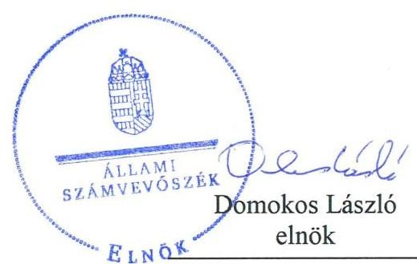
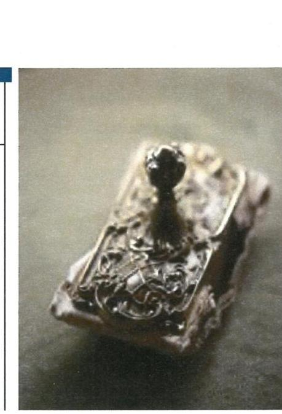

# Jelentés 

## Az állami tulajdonú gazdasági társaságok ellenőrzése

Egészségügyi Szolgáltató Zártkörűen Működő Részvénytársaság
2019. 03. hó 26. nap

---

# Jelentés 

## Az állami tulajdonú gazdasági társaságok ellenőrzése

Egészségügyi Szolgáltató Zártkörűen Működő Részvénytársaság
2019. 03. hó 26. nap

---

# AZ ELLENŐRZÉST FELÜGYELTE:

DR. HORVÁTH MARGIT felügyeleti vezető

DR. NAGY IMRE felügyeleti vezető

## AZ ELLENŐRZÉST VEZETTE ÉS A VÉGREHAJTÁSÁÉRT FELELŐS:

- ÁRPÁSI TIBOR ellenőrzésvezető
- A PROGRAM ÖSSZEÁLLÍTÁSÁÉRT FELELŐS:
  - TÓTPÁL SZABOLCS osztályvezető

IKTATÓSZÁM: EL-1996-001/2019.

TÉMASZÁM: 2480

ELLENŐRZÉS-AZONOSÍTÓ SZÁM: V082403

Jelentéseink az Országgyűlés számítógépes hálózatán és az Interneten a www.asz.hu címen is olvashatóak.

---

# TARTALOMJEGYZÉK 

■ ÖSSZEGZÉS ..... 5
■ AZ ELLENŐRZÉS CÉLJA ..... 6
■ AZ ELLENŐRZÉS TERÜLETE ..... 7
■ AZ ELLENŐRZÉS HÁTTERE, INDOKOLTSÁGA ..... 8
■ A JELENTÉS LÉNYEGES KÉRDÉSKÖREI ..... 9
■ AZ ELLENŐRZÉS HATÓKÖRE ÉS MÓDSZEREI ..... 10
■ MEGÁLLAPÍTÁSOK ..... 12
■ JAVASLATOK ..... 14
■ MELLÉKLETEK ..... 15
I. sz. melléklet: Fogalomtár ..... 15
■ FÜGGELÉKEK ..... 17
I. sz. függelék a jelentéshez ..... 17
II. sz. függelék: Észrevételek ..... 18
■ RÖVIDÍTÉSEK JEGYZÉKE ..... 21

---

.

---

# ÖSSZEGZÉS 

Az Egészségügyi Szolgáltató Zártkörűen Működő Részvénytársaság működésének szabályozottsága az ellenőrzött években nem volt összhangban a jogszabályi előírásokkal. Az Egészségügyi Szolgáltató Zártkörűen Működő Részvénytársaság gazdálkodása és vagyongazdálkodása 2015-ben és 2017-ben nem felelt meg a jogszabályi előírásoknak, nem biztosította az elszámoltathatóságot, a vagyon megóvását. Beszámolási kötelezettségének a Társaság 2015-2017-ben nem szabályszerűen tett eleget, mérlegeit nem támasztotta alá leltárral, ezáltal nem volt biztosított a mérleg valódisága. Közzétételi kötelezettségének hiányos teljesítése révén nem biztosította tevékenységének átláthatóságát.

## Az ellenőrzés társadalmi indokoltsága

Az Állami Számvevőszék a stratégiáját megvalósítva ellenőrzéseivel segíti az átláthatóságot és az elszámoltathatóságot a közpénzekkel, a közvagyonnal való gazdálkodásban. Ellenőrzési témaválasztása során kiemelt figyelmet fordít a korábban ellenőrizetlen területekre.

Ellenőrzési tervének megfelelően a 2015-2017 közötti ellenőrzött időszakra az Állami Számvevőszék folytatja az állami tulajdonban (résztulajdonban) lévő gazdálkodó szervezetek vagyonmegőrzési és gazdálkodási tevékenységének ellenőrzését.

Az állami tulajdonú gazdasági társaságok a nemzeti vagyon részei. Az állami tulajdonú gazdasági társaságokra vonatkozó előírások betartásának ellenőrzése kiemelten fontos a vagyon megőrzése, megóvása érdekében, alapvető követelmény, hogy gazdálkodásuk, működésük szabályszerű legyen. Ennek a társadalmi igénynek megfelelve került sor az Egészségügyi Szolgáltató Zártkörűen Működő Részvénytársaság ellenőrzésére. Az Állami Számvevőszék az ellenőrzése során arra kereste a választ, hogy 2015-2017 között a Társaság működésének szabályozottsága megfelelt-e az előírásoknak, szabályszerű volt-e gazdálkodása, vagyongazdálkodása.

## Főbb megállapítások, következtetések, javaslatok

Az Egészségügyi Szolgáltató Zártkörűen Működő Részvénytársaság működésének szabályozottsága nem javult az ellenőrzött évek során, nem állt összhangban a jogszabályi előírásokkal. A bizonylati rend hiánya miatt a számviteli szabályozottság nem felelt meg a jogszabályi előírásoknak, az elszámoltathatóság feltételei nem voltak biztosítottak.

Az Egészségügyi Szolgáltató Zártkörűen Működő Részvénytársaság gazdálkodása, vagyongazdálkodása 2015-ben és 2017-ben nem volt szabályszerű, mivel a ráfordítások elszámolása, a vagyon nyilvántartásba vétele nem felelt meg a jogszabályi előírásoknak. Beszámolási kötelezettségét a Társaság 2015-2017-ben nem szabályszerűen teljesítette, az éves beszámolók mérlegét nem támasztotta alá leltárral, ezzel megsértette a valódiság elvét. A Taktv. szerinti közzétételi kötelezettségét a Társaság nem teljesítette.

Az Állami Számvevőszék a jelentésben foglalt megállapítások alapján az Egészségügyi Szolgáltató Zártkörűen Működő Részvénytársaság vezérigazgatójának 5 javaslatot fogalmazott meg. A javaslatokat megalapozó megállapításokra az érintettnek 30 napon belül intézkedési tervet kell készítenie.

---

# AZ ELLENŐRZÉS CÉLJA 

Az ellenőrzés célja annak értékelése, hogy a gazdasági társaság szabályozottsága, gazdálkodása és vagyongazdálkodási tevékenysége megfelelt-e a jogszabályi és a tulajdonosi előírásoknak. A vagyonváltozást eredményező döntések esetében a gazdasági társaság szabályszerűen járt el.

---

# **AZ ELLENŐRZÉS TERÜLETE**

## **Egészségügyi Szolgáltató Zártkörűen Működő Részvénytársaság**

Az Egészségügyi Szolgáltató Zártkörűen Működő Részvénytársaság a Fővárosi Központi Egészségügyi Beszerző és Szervező Kft. jogutódaként jött létre 2011. augusztus 9-én, 434 millió Ft jegyzett tőkével. A Társaság1 kizárólagos tulajdonosa a Magyar Állam volt. Az alapítói és tulajdonosi jogokat 2015. február 28-ig a GYEMSZI2, majd annak jogutódaként 2015. március 1-től az ÁEEK3 gyakorolta.

A Társaság a Tulajdonosi joggyakorlóval4 kötött szolgáltatási szerződések1-65 alapján az ÁEEK által fenntartott egészségügyi intézmények közbeszerzési eljárásainak lebonyolításában közreműködött. Ellátta továbbá a kórházak központosított beszerzéseivel kapcsolatos, jogszabályban előírt adatszolgáltatási rendszerének és az adatfeldolgozás megszervezését.

A Társaság közfeladatot nem látott el, közszolgáltatást nem végzett. A tevékenységek végzésének jogszabályi alapjait a Közbeszerzési törvény1,26, az egészségügyi szolgáltatások Egészségbiztosítási Alapból történő finanszírozásának részletes szabályairól szóló 43/1999 (III. 3.) kormányrendelet7, a fekvőbeteg szakellátást nyújtó intézmények részére történő gyógy-szer-, orvostechnikai eszköz és fertőtlenítőszer beszerzések országos központosított rendszeréről szóló 46/2012 (III.28.) kormányrendelet8, a közbeszerzések központi ellenőrzéséről és engedélyezéséről szóló 320/2015. (X.30.) kormányrendelet9 képezte.

A Társaság irányítását az ellenőrzött időszakban három tagú Igazgatóság10 látta el. Az Igazgatóság feladata volt az éves beszámoló Tulajdonosi joggyakorló elé terjesztése, a Társaság üzleti tervének elkészítése, az üzleti könyvek vezetése, jelentés készítése a Társaság vagyoni helyzetéről és üzletpolitikájáról a Tulajdonosi joggyakorló és a Felügyelőbizottság11 részére. A Társaság operatív vezetését Vezérigazgató12 végezte, személye két alkalommal változott. A három tagú Felügyelőbizottság13 összetétele három alkalommal változott. A választott Könyvvizsgáló14 személye nem változott.

A Társaság árbevétele a 2015-2017. években döntően a Tulajdonosi joggyakorlóval kötött szolgáltatási szerződések1-6 teljesítéséből származott. A foglalkoztatottak létszáma 2017-ben 18 fő volt. 2015-2017-ben a saját tőke összege (2015: 346,5 M Ft, 2016: 370,0 M Ft, 2017: 379,8 M Ft) nem érte el a jegyzett tőke összegét (434,0 M Ft). 2015-ben a Társaság veszteséget realizált, 2016-2017-ben a Tulajdonosi joggyakorló az adózott nyereség eredménytartalékba történő helyezéséről határozott.

A Társaság kapcsolt vállalkozásban nem vett részt, leányvállalata nem volt. A Társaság nem rendelkezett vagyonkezelési szerződés alapján átvett állami vagyonnal.

A Társaság nem tartozott kormányzati szektorba sorolt egyéb szervezetek közé a 2015-2017. években. A Társaság nem volt kötelezett belső ellenőrzés működtetésére.

---

# AZ ELLENŐRZÉS HÁTTERE, INDOKOLTSÁGA 

A nemzeti vagyon megőrzésének, védelmének és a nemzeti vagyonnal való felelős gazdálkodásnak a követelményeit sarkalatos törvény határozza meg. Az állami tulajdonú gazdasági társaságokra vonatkozó előírások betartásának ellenőrzése kiemelten fontos a vagyon megőrzése, megóvása érdekében, valamint a kormányzati szektor elszámolásaiban megjelenő állami tulajdonú gazdasági társaságok esetében, amelyekkel szemben alapvető követelmény, hogy gazdálkodásuk, működésük szabályszerű, az általuk szolgáltatott adatok minél megbízhatóbbak legyenek. Gazdálkodásuk jellemzően a közérdeklődés és a média figyelmének középpontjában áll, amihez hozzájárul a gazdálkodásuk körébe tartozó - közvetlen vagy közvetett állami tulajdonú, tehát végső soron a nemzeti vagyon részét képező vagyon nagysága.

Az ellenőrzés rámutathat az állami tulajdonú gazdasági társaságok gazdálkodási tevékenységével jó gyakorlatokra és szabálytalanságokra. Felhívhatja a figyelmet a jogszabályi követelmények teljesítéséhez szükséges feltételek hiányosságaira, hozzájárulhat az államháztartáson kívüli, de (közvetlenül vagy közvetve) állami vagyont használó gazdasági társaságok tevékenységének átláthatóságához. Ellenőrzésünk eredményeképpen javaslatainkkal, megállapításainkkal hozzájárulhatunk a nemzeti vagyonnal való gazdálkodás átláthatóságának, elszámoltathatóságának javításához.

---

# A JELENTÉS LÉNYEGES KÉRDÉSKÖREI 

1. Az Egészségügyi Szolgáltató Zártkörűen Működő Részvénytársaság működésének szabályozottsága megfelelt-e az előírásoknak?
2. Az Egészségügyi Szolgáltató Zártkörűen Működő Részvénytársaságnál a pénzügyi-számviteli, adatszolgáltatási feladatok ellátása, vagyongazdálkodása szabályszerű volt-e?

---

# AZ ELLENŐRZÉS HATÓKÖRE ÉS MÓDSZEREI 

## Az ellenőrzés típusa

Megfelelőségi ellenőrzés.

## Az ellenőrzött időszak

Az ellenőrzött időszak 2015-2017. évek, valamint a 2017. évi beszámoló jóváhagyása és közzététele tekintetében a 2018. június elsejéig tartó időszak.

## Az ellenőrzés tárgya

Állami tulajdonban lévő gazdasági társaság gazdálkodása, kiemelten vagyongazdálkodási tevékenysége.

## Az ellenőrzött szervezet

- Egészségügyi Szolgáltató Zártkörűen Működő Részvénytársaság

## Az ellenőrzés jogalapja

Az ellenőrzés jogszabályi alapját az ÁSZ tv. ${ }^{15}$ 1. § (3) bekezdése és 5. § (3) - (5) bekezdései képezték.

## Az ellenőrzés módszerei

Az ellenőrzést a nemzetközi standardokat irányadónak tekintve az ellenőrzési program ellenőrzési kérdései, az ellenőrzött időszakban hatályos jogszabályok, az ellenőrzés szakmai szabályok és módszertanok figyelembe vételével végeztük.

Az ellenőrzés ideje alatt az ellenőrzött szervezettel történő kapcsolattartást az ÁSZ Szervezeti és Működési Szabályzatának vonatkozó előírásai alapján biztosítottuk.

A Társaság szabályozottsága, gazdálkodása, vagyongazdálkodása, vagyonnyilvántartása értékelése során a 2015., illetve a 2017. éveket vizsgáltuk a tendenciák feltárása érdekében. A tervezési, beszámolási, közzétételi és adatszolgáltatási kötelezettség teljesítését a 2015-2017. évekre vonatkozóan ellenőriztük.

---

A 2015. és 2017. évi bevételek és a ráfordítások elszámolásának szabályszerűsége, valamint az értékcsökkenési leírás és a vagyonnyilvántartás szabályszerűsége esetében az ellenőrzés a legnagyobb értékű tételekre a lényeges sokaságra - terjedt ki, melyek összértéke elérte a teljes sokaság összértékének 50\%-át. A fenti területek esetében a lényeges sokaságot tételesen ellenőriztük.

A 2015. és 2017. évi személyi jellegű kifizetések esetében a vezető tisztségviselő(k) részére történő kifizetések elszámolásának szabályszerűségét véletlen mintavétellel kiválasztott tételek alapján ellenőriztük. A mintavétellel ellenőrzött személyi jellegű ráfordítások esetében minden egyes tétel vonatkozásában a szabályszerűségre vonatkozó kérdéseket tettünk fel. „Szabályszerűnek" értékeltünk egy ellenőrzött területet, amennyiben 95\%os bizonyossággal az ellenőrzött sokaságban az átlagos hibaarány legfeljebb 10\%, "nem szabályszerűnek", amennyiben 10\%-nál magasabb arányt képviselt.

Az ellenőrzési kérdések megválaszolásához szükséges bizonyítékok megszerzése a következő ellenőrzési eljárások alkalmazásával történt: megfigyelés, kérdésfeltevés (információkérés), összehasonlítás, valamint elemző eljárás. Az ellenőrzési bizonyítékként felhasznált adatforrások közé tartoztak egyrészt az ellenőrzési programban felsorolt adatforrások, másrészt adatforrás volt még az Igazságügyi Minisztérium Céginformációs Szolgálat által üzemeltett, beszámolók közzétételét szolgáló nyilvántartása.

Az ellenőrzés a kérdésekre adott válaszok kiértékelésével, valamint a megjelölt adatforrások, a csatolt tanúsítványok felhasználásával, továbbá az adott időszakban hatályos jogszabályok figyelembe vételével folyt le.

---

# 1. Az Egészségügyi Szolgáltató Zártkörűen Működő Részvénytársaság működésének szabályozottsága megfelelt-e az előírásoknak? 

Összegző megállapítás

A Társaság működésének szabályozottsága az ellenőrzött évek során a jogszabályi előírásokkal nem volt összhangban.

A TÁRSASÁG ellenőrzött években hatályos SZMSZ-e ${ }^{16}$ az Alapszabály ${ }_{1-9}{ }^{17}$ előírásaival összhangban szabályozta a működés és gazdálkodás felelősségi viszonyait, a szervezeti felépítést. Az SZMSZ-ben a Társaság nem vezette át a Tulajdonosi joggyakorló személyében történt változást.

A Társaság az SZMSZ mellékletét képező Kötelezettségvállalási szabályzata ${ }^{18}$ az Alapszabály ${ }_{1-9}$ előírásaival összhangban rendelkezett a gazdálkodási és vagyongazdálkodási döntési jogkörök gyakorlásáról.

A Társaság az ellenőrzött években a Közbeszerzési törvény ${ }_{1,2}$ előírásainak megfelelve rendelkezett Közbeszerzési szabályzattal ${ }_{1-4}{ }^{19}$.

A Társaság 2015-ben és 2017-ben rendelkezett a Taktv. ${ }^{20}$ előírásaival összhangban elkészített, a vezető tisztségviselő, a felügyelőbizottsági tagok és az Mt. ${ }^{21} 208$. § hatálya alá tartozó munkavállalók javadalmazására, valamint a jogviszony megszűnése esetére biztosított juttatások módjának, mértékének elveiről, annak rendszeréről szóló szabályzattal (Javadalmazási szabályzat ${ }_{1,2}{ }^{22}$ ). A Társaság a 2015. évben hatályos Javadalmazási szabályzatot ${ }_{1}$ a Taktv. 5. § (3) bekezdése második mondatában foglalt előírást megsértve nem helyezte letétbe.

A TÁRSASÁG SZÁMVITELI tevékenységének szabályozottsága 2015-ben és 2017-ben nem felelt meg a jogszabályi követelményeknek. A Társaság Számviteli politikával ${ }_{1-3}{ }^{23}$ rendelkezett az ellenőrzött években. A Társaság a Számv. tv. ${ }^{24} 14$ § (11) bekezdésében foglaltak ellenére nem vezette keresztül a Számviteli politikán ${ }_{2,3}$ a Számv. tv. 14. § (4) bekezdésének 2015. július 4-én hatályba lépett módosítását, azaz, hogy a Társaság mit tekint kivételes nagyságú vagy előfordulású bevételnek, költségnek, ráfordításnak.

A Társaság 2015-ben és 2017-ben rendelkezett a Számv. tv. előírásainak megfelelő Eszközök és források
 értékelési szabályzattal ${ }_{1,2}{ }^{25}$, Pénzkezelési szabályzattal ${ }_{1,2}{ }^{26}$, valamint Leltározási és leltárkészítési szabályzattal ${ }_{1,2}{ }^{27}$.

A Társaság 2015-ben és 2017-ben rendelkezett Számlarenddel ${ }_{1-2}{ }^{28}$. A Számlarend ${ }_{1-3}$ nem felelt meg a Számv. tv. 161. § (2) bekezdésének d) pontja előírásának, mert nem tartalmazta az abban foglaltakat alátámasztó bizonylati rendet.

A Társaság az ellenőrzött időszakban a Számv. tv. előírásai alapján mentesült az önköltségszámítás rendjére vonatkozó szabályzat elkészítési kötelezettsége alól.

---

# 2. Az Egészségügyi Szolgáltató Zártkörűen Működő Részvénytársaságnál a pénzügyi-számviteli, adatszolgáltatási feladatok ellátása, vagyongazdálkodása szabályszerű volt-e? 

Összegző megállapítás

A Társaság gazdálkodása, vagyongazdálkodása 2015-ben és 2017-ben nem felelt meg a jogszabályi előírásoknak. Beszámolási kötelezettségét a Társaság 2015-2017-ben nem szabályszerűen teljesítette, az éves beszámolók mérlegét nem támasztotta alá leltárral. A Taktv.-ben foglalt közzétételi kötelezettségét a Társaság nem teljesítette.

A bevételek 2015. és 2017. évi elszámolása szabályszerű volt.
A ráfordítások 2015. évi elszámolása - a személyi jellegű ráfordítások kivételével - nem volt szabályszerű, mert azokat nem támasztották alá a Számv. tv. 166. § (1) bekezdésében meghatározott számviteli bizonylattal. A ráfordítások 2017. évi elszámolása - a személyi jellegű ráfordítások kivételével - szabályszerű volt. 2017-ben a személyi jellegű ráfordítások elszámolását nem támasztották alá a Számv. tv. 166. § (1) bekezdésében meghatározott számviteli bizonylattal.

A vagyon nyilvántartása nem volt szabályszerű 2015-ben, mert a Számv. tv. 52. § (2) bekezdésében foglaltakat megsértve a tárgyi eszközök üzembe helyezését - az üzembe helyezési jegyzőkönyvek hiánya miatt - nem dokumentálták hitelt érdemlő módon.

A Társaság 2015-2017-ben nem végezte el a követelések, kötelezettségek egyeztetéssel történő leltározását, megsértve a Számv. tv. 69. § (3) bekezdésében foglaltakat.

Üzleti terv készítési kötelezettségét a Társaság 2015-ben nem, 2016-2017-ben az Alapszabályban ${ }_{1-9}$ foglaltaknak megfelelően teljesítette. A Társaság a gazdálkodására vonatkozó adatszolgáltatási kötelezettségének a Tulajdonosi joggyakorló Vagyonkezelési Szabályzatában ${ }^{29}$ meghatározott követelményeknek megfelelően eleget tett.

Egyszerűsített éves beszámolóit az ellenőrzött időszakban a Társaság elkészítette, azokat a Tulajdonosi joggyakorló a Felügyelőbizottság, a Könyvvizsgáló - korlátozásmentes hitelesítő záradékot tartalmazó - írásbeli jelentésének birtokában hagyta jóvá. A Társaság 2015-2017. évi éves egyszerűsített beszámolói nem voltak szabályszerűek, mivel a Számv. tv. 69 § (1) bekezdésében foglaltakat megsértve a mérlegtételeket nem támasztották alá leltárral, így a Számv. tv. 15. § (3) bekezdésében foglalt előírás ellenére nem érvényesült a valódiság elve.

Az éves beszámolók közzétételéről és letétbe helyezéséről a Társaság a Számv. tv.-ben előírt határidőig gondoskodott. A Taktv. 2. § (1)-(2) bekezdéseiben foglalt közzétételi kötelezettségének a Társaság nem tett eleget.

---

# JAVASLATOK 

Az ÁSZ tv. 33. § (1) bekezdésében foglaltak értelmében az ellenőrzött szervezet vezetője köteles a jelentésben foglalt megállapításokhoz kapcsolódó intézkedési tervet összeállítani és azt a jelentés kézhezvételétől számított 30 napon belül az ÁSZ részére megküldeni. Amennyiben az ellenőrzött szervezet vezetője nem küldi meg határidőben az intézkedési tervet, vagy továbbra sem elfogadható intézkedési tervet küld, az Állami Számvevőszék elnöke az ÁSZ tv. 33. § (3) bekezdése a) és b) pontjaiban foglaltakat érvényesítheti.

Javaslataink célja az Egészségügyi Szolgáltató Zártkörűen Működő Részvénytársaság gazdálkodása szabályszerűségének és gyakorlatának javítása annak érdekében, hogy a szabályozási környezet és az alkalmazott gyakorlat megfelelően tudja támogatni az átlátható működést.

## Az Egészségügyi Szolgáltató Zártkörűen Működő Részvénytársaság vezérigazgatójának

1. Intézkedjen annak érdekében, hogy a számviteli szabályzatok megfeleljenek a hatályos Számv. tv. előírásainak.
(1. sz. megállapítás 5. bekezdés 3. mondata, 7. bekezdése alapján)
2. Intézkedjen a ráfordítások Számv. tv. előírásainak megfelelő elszámolása érdekében.
(2. sz. megállapítás 2. bekezdése alapján)
3. Intézkedjen a Számv. tv. és a Leltározási szabályzat előírásainak megfelelő leltározás végrehajtásáról.
(2. sz. megállapítás 4. bekezdése alapján)
4. Intézkedjen az éves beszámoló mérlegtételeinek leltárral történő alátámasztásáról a hatályos Számv. tv. előírásainak megfelelően.
(2. sz. megállapítás 6. bekezdés 2. mondata alapján)
5. Intézkedjen a Társaság adatainak közzétételéről a Taktv. tv. előírásainak megfelelően.
(2. sz. megállapítás 7. bekezdés 2. mondata alapján)

---

# MELLÉKLETEK 

- I. SZ. MELLÉKLET: FOGALOMTÁR
állami vagyon
állami vagyon hasznosítása
állami vagyon használója
állami vagyon kezelője/vagyonkezelő
állami vagyon értékesítése
gazdasági társaság
kapcsolt vállalkozás
kormányzati szektorba sorolt egyéb szervezet
a) Az állam tulajdonában lévő dolog, valamint a dolog módjára hasznosítható természeti erő,
b) az a) pont hatálya alá nem tartozó mindazon vagyon, amely vonatkozásában törvény az állam kizárólagos tulajdonjogát nevesíti,
c) az állam tulajdonában lévő tagsági jogviszonyt megtestesítő értékpapír, illetve az államot megillető egyéb társasági részesedés,
d) az államot megillető olyan immateriális, vagyoni értékkel rendelkező jogosultság, amelyet jogszabály vagyoni értékű jogként nevesít.
Forrás: Vtv. ${ }^{30}$ 1. § (2) bekezdése
e) az állam tulajdonában lévő pénzügyi eszközök
Forrás: Vtv. 1. § (2) bekezdése
Az állami vagyonnal a tulajdonosi joggyakorló maga gazdálkodik, vagy szerződés - így különösen bérlet, haszonbérlet, megbízás - alapján hasznosításra átengedi, illetőleg vagyonkezelésbe, haszonélvezetbe adja.
Forrás: Vtv. 23. § (1) bekezdése
Az a természetes vagy jogi személy, jogi személyiséggel nem rendelkező szervezet, aki, vagy amely törvény vagy szerződés alapján, bármely jogcímen (bérlet, haszonbérlet, használat stb.) állami vagyont birtokol, használ, szedi annak hasznait, hasznosít, ide nem értve a haszonélvezőt, a vagyonkezelőt és a tulajdonosi jogok gyakorlóját.
Forrás: Vtv.vhr. 1. § (7) a) pont
Az Nvtv.-ben vagyonkezelőként meghatározott azon személy, amellyel az állami vagyon vagyonkezelésére az MNV Zrt., valamint annak jogelődje, vagy az állami vagyon tulajdonosi joggyakorlója vagyonkezelési szerződést kötött, továbbá akit törvény vagyonkezelőnek kijelöl.
Forrás: Vtv.vhr. 1. § (7) d) pont
Állami vagyon tulajdonjogának bármely jogcímen történő, visszterhes átruházása. Forrás: Vtv.vhr. 1. § (7) d) pont
A Ptk. 3:88. § (1) bekezdése szerint „a gazdasági társaságok üzletszerű közös gazdasági tevékenység folytatására, a tagok vagyoni hozzájárulásával létrehozott, jogi személyiséggel rendelkező vállalkozások, amelyekben a tagok a nyereségből közösen részesednek, és a veszteséget közösen viselik".
Az anyavállalat és a leányvállalat és a közös vezetésű vállalkozások (fölérendelt anyavállalat esetében a minősítést a fölérendelt anyavállalat szempontjából kell elvégezni)
Forrás: Számv. tv. 3. § (2) 7. pont
Az a szervezet, amely az Áht. alapján nem része az államháztartásnak, azonban az Európai Közösséget létrehozó szerződéshez csatolt, a túlzott hiány esetén követendő eljárásról szóló jegyzőkönyv alkalmazásáról szóló 2009. május 25-i 479/2009/EK rendelet szerint a kormányzati szektorba tartozik.

---

közszolgáltatás
„szerződéskötési kötelezettség alapján a lakosság alapvető szükségleteinek ellátására irányuló szolgáltatás, így különösen a villamos energia-, gáz-, hő-, víz-, szenny-víz- és hulladékkezelési, köztisztasági, postai és távközlési szolgáltatás, továbbá a menetrend alapján közlekedő járművekkel végzett közforgalmú személyszállítás".
leányvállalat
nemzeti vagyon
nemzeti vagyon hasznosítása

Az Ebktv. ${ }^{31}$ 3. § d) pontja a következőképpen határozza meg a közszolgáltatást: „szerződéskötési kötelezettség alapján a lakosság alapvető szükségleteinek ellátására irányuló szolgáltatás, így különösen a villamos energia-, gáz-, hő-, víz-, szenny-víz- és hulladékkezelési, köztisztasági, postai és távközlési szolgáltatás, továbbá a menetrend alapján közlekedő járművekkel végzett közforgalmú személyszállítás".
Az a gazdasági társaság, amelyre az anyavállalat meghatározó befolyást képes gyakorolni
Forrás: Számv. tv. 3. § (2) 2. pont
a) az állam vagy a helyi önkormányzat kizárólagos tulajdonában álló dolgok,
b) az a) pont hatálya alá nem tartozó, állam vagy a helyi önkormányzat tulajdonában lévő dolog,
c) az állam vagy a helyi önkormányzat tulajdonában lévő pénzügyi eszközök, továbbá az államot vagy a helyi önkormányzatot megillető társasági részesedések,
d) az államot vagy a helyi önkormányzatot megillető bármely vagyoni értékkel rendelkező jogosultság, amelyet jogszabály vagyoni értékű jogként nevesít,
e) Magyarország határa által körbezárt terület feletti légtér,
f) az üvegházhatású gázok kibocsátási egységeinek kereskedelméről szóló törvény szerint kibocsátási egység és légiközlekedési kibocsátási egység, valamint az ENSZ Éghajlatváltozási Keretegyezménye és annak Kiotói Jegyzőkönyv végrehajtási keretrendszeréről szóló törvény szerinti kiotói egység,
g) állami vagy helyi önkormányzati fenntartású közgyűjtemény (muzeális intézmény, levéltár, közgyűjteményként működő kép- és hangarchívum, valamint könyvtár) saját gyűjteményében nyilvántartott kulturális javak körébe tartozó dolog, kivéve, ha az állami vagy önkormányzati tulajdon jogszerű létrejötte kétséget kizáró módon nem bizonyítható és a dologra nézve más a tulajdonjogát bizonyítja vagy a kulturális javakra vonatkozó jogszabályokban meghatározott eljárás keretében valószínűsíti (g. pont módosult 2013. december 7-től),
h) a régészeti lelet,
i) a nemzeti adatvagyon körébe tartozó állami nyilvántartások fokozottabb védelméről szóló törvény szerinti nemzeti adatvagyon.
Forrás: Nvtv. ${ }^{32}$ 1. § (2)
A tulajdonosi joggyakorló vagy a nemzeti vagyon használója által a nemzeti vagyon birtoklásának, használatának, hasznok szedése jogának bármely - a tulajdonjog átruházását nem eredményező - jogcímen történő átengedése, ide nem értve a vagyonkezelésbe adást, valamint a haszonélvezeti jog alapítását.
Forrás: Nvtv. 3. § (1) 4. pont

---

# FÜGGELÉKEK 

- I. SZ. FÜGGELÉK A JELENTÉSHEZ

Az Állami Számvevőszék az ellenőrzések során feltárt tényekhez kapcsolódó további körülmények tisztázására eszközrendszerrel nem rendelkezik. Amennyiben az ellenőrzésen túlmutatóan indokoltnak látszik az ellenőrzés során feltárt körülmények további vizsgálata, az Állami Számvevőszék törvényi felhatalmazás alapján az ellenőrzés által feltárt körülményeket továbbítja a hatáskörrel rendelkező szervnek a szükséges intézkedések megtétele, eljárások lefolytatása érdekében.

1. Az Egészségügyi Szolgáltató Zártkörűen Működő Részvénytársaság a 2015., 2016., 2017. évi egyszerűsített éves beszámoló mérlegét a Számv. tv. 69. § (1) bekezdése ellenére az eszközöket és forrásokat mennyiségben és értékben tartalmazó leltárral nem támasztotta alá.
A mérleg tételeit alátámasztó leltár hiányában a Társaságnál a 2015., 2016., 2017. évi egyszerűsített éves beszámolóban a Számv. tv. 15. § (3) bekezdésében foglalt előírás ellenére nem érvényesült a valódiság elve és nem igazolt, hogy a Társaság beszámolója a valós, megbízható képet mutatta.
Az eset konkrét körülményeinek felderítésére a Nemzeti Adó- és Vámhivatal rendelkezik hatáskörrel.

---

A jelentéstervezetet a Számvevőszék 15 napos észrevételezésre megküldte az ellenőrzött szervezet vezetőjének az ÁSZ tv. 29. §* (1) bekezdése előírásának megfelelően.

Az Egészségügyi Szolgáltató Zártkörűen Működő Részvénytársaság vezérigazgatója a jelentéstervezet megállapításaira írásban észrevételt tett.
Az ÁSZ tv. 29. § (3) bekezdésével összhangban az ÁSZ a Függelékben feltünteti az ellenőrzés megállapításaival kapcsolatban tett, figyelembe nem vett észrevételeket, és megindokolja, hogy azokat miért nem fogadta el.

[^0]
[^0]:    * 29. § (1) Az Állami Számvevőszék az ellenőrzési megállapításait megküldi az ellenőrzött szervezet vezetőjének vagy az általa megbízott személynek, és annak, akinek személyes felelősségét állapította meg.
    (2) Az ellenőrzött szervezet vezetője és a felelősként megjelölt személy az ellenőrzés megállapításaira tizenöt napon belül írásban észrevételt tehet.
    (3) Az Állami Számvevőszék az észrevételre a beérkezésétől számított harminc napon belül írásban válaszol. A figyelembe nem vett észrevételeket köteles a jelentésben feltüntetni, és megindokolni, hogy azokat miért nem fogadta el.

---

„Az állami tulajdonú gazdasági társaságok - Egészségügyi Szolgáltató Zártkörűen Működő Részvénytársaság" címmel készített számvevőszéki jelentéstervezet megállapításaival kapcsolatban az Egészségügyi Szolgáltató Zártkörűen Működő Részvénytársaság vezérigazgatója által 2019. augusztus 6-án tett (az Állami Számvevőszékhez 2019. augusztus 6-án érkezett), ESZ/60-5/2019 iktatószámú, figyelembe nem vett észrevételei és azok indokolása.

# 1) A jelentéstervezet 1. számú összegző megállapítás 1. bekezdés 2. mondatához tett észrevétel: 

Az észrevétel szerint a Társaság 2018. október 1. naptól hatályos Szervezeti és Működési Szabályzatában a tulajdonosi joggyakorló (Alapító) átvezette
 a Tulajdonos joggyakorló személyében történt változást.

Az észrevételt nem fogadtuk el. Köszönettel vettük a vezérigazgató tájékoztatását az ellenőrzés javaslatokat megalapozó megállapítással összefüggésben megtett intézkedéséről. A Szervezeti és Működési Szabályzat 2018. október 1. naptól hatályos módosítása az ellenőrzéssel érintett időszakon (2015-2017 évek) túli, ezért a jelentéstervezetben szereplő, ellenőrzött időszakra vonatkozó megállapítást nem módosítja.
A megtett intézkedésekről - a kiadmányozott jelentés megállapításaira az ÁSZ tv. 33.§ (1) bekezdése alapján összeállított - intézkedési tervben indokolt számot adni.

## 2) A jelentéstervezet 2. sz. összegző megállapítás 2. bekezdés 1. mondatához tett észrevétel:

Az észrevételben foglaltak szerint a 2015. évi nem személyi jellegű ráfordítások elszámolása a számvitelről szóló 2000. évi C. törvény előírásainak megfelelően történt.

Az észrevételt nem fogadtuk el. Az ÁSZ által az adatszolgáltatásra megküldött EL-0820-033/2018. iktatószámú levél 2. számú melléklet Dokumentumok jegyzéke kérte az 1. számú melléklet Ellenőrzésre kiválasztott mintatételek listája 1. lapja szerinti, a 2015. évet érintő anyagjellegű ráfordítások, valamint az egyéb és a pénzügyi műveletek ráfordításai mintatételek tételes ellenőrzését alátámasztó dokumentumokat. A Társaság az adatszolgáltatásra rendelkezésre álló időben dokumentumokat küldött, illetve teljességi és hitelességi nyilatkozatot bocsátott az ÁSZ rendelkezésére. Az ÁSZ az ÁSZ tv. 28. § (1)-(2) bekezdései alapján az adatszolgáltatás során megküldött dokumentumokra és a teljességi és hitelességi nyilatkozat adataira alapozva teszi meg ellenőrzési megállapításait. A dokumentumok felülvizsgálata során megállapítást nyert, hogy több mintatételhez ugyanaz a számla kapcsolódik. Azonban az ÁSZ rendelkezésre bocsátott dokumentumok alapján az egyes ráfordítás mintatételekre elszámolt költségek költségfelosztása, így az adott ráfordításra elszámolt összeg indokoltsága nem volt alátámasztott és dokumentált. Ezzel a Társaság megsértette a Számv. tv. 165. § (1) és 166. § (1) bekezdéseiben foglaltakat, mivel gazdasági eseményeinek számviteli elszámolásait bizonylattal nem támasztotta alá.
3) A jelentéstervezet 2. sz. összegző megállapítás 4. bekezdés 1. mondatához és a jelentéstervezet 2. sz. összegző megállapítás 6. bekezdés 2. mondatához tett észrevétel:
Az észrevételben foglaltak szerint a 2017. évi személyi jellegű ráfordítások elszámolása a Számv. tv. előírásainak megfelelően történt.

Az észrevételt nem fogadtuk el. Az ÁSZ által az adatszolgáltatásra megküldött EL-0820-033/2018. iktatószámú levél 2. számú melléklet Dokumentumok jegyzéke kérte az 1. számú melléklet Ellenőrzésre kiválasztott mintatételek listája 5. lapja szerinti, a 2017. évet érintő havi személyi jellegű kifizetések mintatételek tételes ellenőrzését alátámasztó dokumentumokat. A Társaság az adatszolgáltatásra rendelkezésre álló időben dokumentumokat küldött, illetve teljességi és hitelességi nyilatkozatot bocsátott az ÁSZ rendelkezésére. Az ÁSZ az ÁSZ tv. 28. § (1)-(2) bekezdései alapján az adatszolgáltatás során megküldött dokumentumokra és a teljességi és hitelességi nyilatkozat adataira alapozva teszi meg ellenőrzési megállapításait. Az adatbekérés dokumentumai között az ÁSZ kérte „a foglalkoztatott jogviszonyára vonatkozó (a foglalkoztatás időszakát lefedő) munkaszerződés, megállapodás, illetve jogviszony megszűnésének dokumentumát", mint a bérszámfejtés alapját képező dokumentumot. Ez a dokumentum a Társaság vezető tiszt-

---

ségviselői, és a felügyelőbizottság tagjai esetében a munkaszerződés, megbízási vagy egyéb szerződés, amely tartalmazza a díjazás összegét és ütemezését (havi vagy éves). A bérszámfejtés alapját képező dokumentum nem került az ÁSZ részére átadásra. Ennek hiányában a személyi jellegű ráfordítások elszámolásának értékelése nem szabályszerű, mivel az adott hónapban bérszámfejtett és kifizetett összeg vagy a bérszámfejtés, kifizetés elmaradásának megalapozottsága nem alátámasztott. Ezzel a Társaság megsértette a Számv. tv. 165. § (1) és 166. § (1) bekezdéseiben foglaltakat, mivel gazdasági eseményeinek számviteli elszámolásait bizonylattal nem támasztotta alá.

---

# RÖVIDÍTÉSEK JEGYZÉKE 

${ }^{1}$ Társaság
${ }^{2}$ GYEMSZI
${ }^{3}$ ÁEEK
${ }^{4}$ Tulajdonosi joggyakorló
${ }^{5}$ Szolgáltatási szerződések1-6
${ }^{6}$ Közbeszerzési törvény1
Közbeszerzési törvény2
${ }^{7}$ 43/1999. (III. 3.) Korm. rendelet
${ }^{8}$ 46/2012. (III. 28.) Korm. rendelet
${ }^{9}$ 320/2015. (X. 30.) Korm. rendelet
${ }^{10}$ Igazgatóság
${ }^{11}$ Felügyelőbizottság
${ }^{12}$ Vezérigazgató
${ }^{13}$ Felügyelőbizottság
${ }^{14}$ Könyvvizsgáló
${ }^{15}$ ÁSZ tv.
${ }^{16}$ SZMSZ
${ }^{17}$ Alapszabály1-9

Egészségügyi Szolgáltató Zártkörűen Működő Részvénytársaság Gyógyszerészeti és Egészségügyi Minőség- és Szervezetfejlesztési Intézet Állami Egészségügyi Ellátó Központ
Gyógyszerészeti és Egészségügyi Minőség- és Szervezetfejlesztési Intézet 2015. február 28-ig, Állami Egészségügyi Ellátó Központ 2015. március 1-től az ÁEEK és a Társaság által kötött in-house szolgáltatási szerződések Szolgáltatási szerződés1: hatályos: 2015. április 1-től december 31-ig Szolgáltatási szerződés2: hatályos: 2015. október 14-től december 14-ig Szolgáltatási szerződés3: hatályos: 2016. január 1-től március 31-ig Szolgáltatási szerződés4: hatályos: 2016. április 1-től december 31-ig Szolgáltatási szerződés5: hatályos: 2017. január 1-től február 28-ig Szolgáltatási szerződés6: hatályos: 2017. március 17-től december 31-ig 2011. évi CVIII. törvény a közbeszerzésekről (hatálytalan: 2011. augusztus 21-től) 2015. évi CXLIII. törvény a közbeszerzésekről (hatályos: 2015. november 1-től) 43/1999. (III. 3.) Korm. rendelet az egészségügyi szolgáltatások Egészségbiztosítási Alapból történő finanszírozásának részletes szabályairól (hatályos: 1999. március 8-tól)
46/2012. (III. 28.) Korm. rendelet a fekvőbeteg szakellátást nyújtó intézmények részére történő gyógyszer-, orvostechnikai eszköz és fertőtlenítőszer beszerzések országos központosított rendszeréről (hatályos: 2012. március 29-től) 320/2015. (X. 30.) Korm. rendelet a közbeszerzések központi ellenőrzéséről és engedélyezéséről (hatályos: 2015. november 1-től)
a Társaság igazgatósága
a Társaság felügyelőbizottsága
a Társaság vezérigazgatója
a Társaság felügyelőbizottsága
a Társaság könyvvizsgálója (Nagy Ildikó)
2011. évi LXVI. törvény az Állami Számvevőszékről (hatályos: 2011. július 1-től)
a Társaság Szervezeti és Működési Szabályzata, jóváhagyva a Tulajdonosi
joggyakorló 5/2014. (VIII. 11.) számú határozatával
(hatályos: 2014. augusztus 12-től)
a Társaság egységes szerkezetbe foglalt Alapszabálya
Alapszabály1: a Társaság Alapító Okirata, hatályos: 2014. szeptember 30-tól
Alapszabály2: a Társaság Alapító Okirata, hatályos: 2015. április 30-tól
Alapszabály3: a Társaság Alapító Okirata, hatályos: 2015. június 1-től
Alapszabály4: a Társaság Alapító Okirata, hatályos: 2016. március 31-től
Alapszabály5: a Társaság Alapító Okirata, hatályos: 2016. szeptember 14-től
Alapszabály6: a Társaság Alapszabálya, hatályos: 2017. február 15-től
Alapszabály7: a Társaság Alapszabálya, hatályos: 2017. április 24-től
Alapszabály8: a Társaság Alapszabálya, hatályos: 2017. május 18-tól
Alapszabály9: a Társaság Alapszabálya, hatályos: 2017. június 14-től

---

${ }^{18}$ Kötelezettségvállalási szabályzat
${ }^{19}$ Közbeszerzési szabályzat ${ }_{1-4}$
${ }^{20}$ Taktv.
${ }^{21} \mathrm{Mt}$.
${ }^{22}$ Javadalmazási szabályzat ${ }_{1,2}$
${ }^{23}$ Számviteli politika $_{1-3}$
${ }^{24}$ Számv. tv.
${ }^{25}$ Értékelési szabályzat ${ }_{1,2}$
${ }^{26}$ Pénzkezelési szabályzat ${ }_{1,2}$
${ }^{27}$ Leltározási és leltárkészítési szabályzat ${ }_{1,2}$
${ }^{28}$ Számlarend $_{1-3}$
${ }^{29}$ ÁEEK Vagyonkezelési Szabályzat
${ }^{30} \mathrm{Vtv}$.
${ }^{31}$ Ebktv.
${ }^{32} \mathrm{Nvtv}$.
a Társaság Kötelezettségvállalási szabályzata, jóváhagyva az Igazgatóság 1/2013. (VIII. 07.) számú határozatával (hatályos: 2013. augusztus 8-tól)
a Társaság közbeszerzési és beszerzési szabályzata
Beszerzési szabályzat ${ }_{1}$ : hatályos: 2013. május 22-től
Beszerzési szabályzat2: hatályos: 2015. augusztus 10-től
Közbeszerzési és Beszerzési Szabályzat3: hatályos: 2017. február 6-től
Közbeszerzési és Beszerzési Szabályzat4: hatályos: 2017. október 17-től
2009. évi CXXII. törvény a köztulajdonban álló gazdasági társaságok takarékosabb működéséről (hatályos: 2009. december 4-től)
2012. évi I. törvény a munka törvénykönyvéről (hatályos: 2012. július 1-től)
a Társaság Javadalmazási szabályzata
szabályzat1: jóváhagyva a Tulajdonosi joggyakorló 5/2013. (X. 28.) számú határozatával (hatályos: 2013. október 28-tól)
szabályzat2: jóváhagyva a Tulajdonosi joggyakorló 4/2017. (II. 15.) számú határozatával (hatályos: 2017. február 15-től)
a Társaság Számviteli politikája és számlarendje
Számviteli politika1: hatályos: 2013. január 1-től
Számviteli politika2: hatályos: 2015. május 15-től
Számviteli politika3: hatályos: 2016. július 1-től
2000. évi. C. törvény a számvitelről (hatályos: 2001. január 1-től)
a Társaság Eszközök és források értékelési szabályzata
szabályzat1: hatályos: 2013. március 1-től
szabályzat2: hatályos: 2016. július 1-től
a Társaság Pénzkezelési szabályzata
szabályzat1: hatályos: 2013. április 2-től
szabályzat2: hatályos: 2015. október 1-től
a Társaság Eszközök és források leltározási és leltárkészítési szabályzata
szabályzat1: hatályos: 2013. március 1-től
szabályzat2: hatályos: 2016. július 1-től
a Társaság Számviteli politikája és számlarendje
Számlarend1: hatályos: 2013. január 1-től
Számlarend2: hatályos: 2015. május 15-től
Számlarend3: hatályos: 2016. július 1-től
14/2015 számú Főigazgatói utasítás az ÁEEK Vagyonkezelési Szabályzatáról (hatályos: 2015. július 1-től)
2007. évi CVI. törvény az állami vagyonról (hatályos: 2007. szeptember 25-től)
2003. évi CXXV. törvény az egyenlő bánásmódról és az esélyegyenlőség előmozdításáról (hatályos: 2004. január 27-től)
2011. évi CXCVI. törvény a nemzeti vagyonról (hatályos: 2011. december 31-től)

---

# ÁLLAMI SZÁMVEVŐSZÉK 

1052 Budapest, Apáczai Csere János utca 10.
Levélcím: 1364 Budapest 4. Pf. 54
Telefon: +36 1 4849100 Telefax: +36 1 4849200
www.asz.hu

