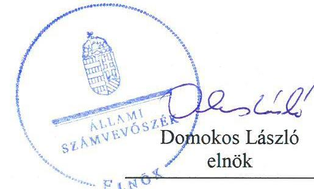

# Jelentés 

## Önkormányzatok ellenőrzése - Integritás- és belső kontrollrendszer

Tokaj Város Önkormányzata 2019. No. hó 29. nap

---

# AZ ELLENŐRZÉST FELÜGYELTE:

DR. NAGY IMRE felügyeleti vezető

# AZ ELLENŐRZÉST VEZETTE ÉS A VÉGREHAJTÁSÁÉRT FELELŐS:

GÁL MAGDOLNA ellenőrzésvezető

# A PROGRAM ÖSSZEÁLLÍTÁSÁÉRT FELELŐS:

TÓTPÁL SZABOLCS osztályvezető

---

IKTATÓSZÁM: EL-1997-001/2019

TÉMASZÁM: 2485

---

Jelentéseink az Országgyűlés számítógépes hálózatán és az Interneten a www.asz.hu címen is olvashatóak.

---

ELLENŐRZÉS-AZONOSÍTÓ SZÁM: V082960

---

# TARTALOMJEGYZÉK 

■ ÖSSZEGZÉS ..... 5
■ AZ ELLENŐRZÉS CÉLJA ..... 6
■ AZ ELLENŐRZÉS TERÜLETE ..... 7
■ AZ ELLENŐRZÉS HÁTTERE, INDOKOLTSÁGA ..... 8
■ A JELENTÉS LÉNYEGES KÉRDÉSKÖREI ..... 9
■ AZ ELLENŐRZÉS HATÓKÖRE ÉS MÓDSZEREI ..... 10
■ MEGÁLLAPÍTÁSOK ..... 12
■ JAVASLATOK ..... 14
■ MELLÉKLETEK ..... 17
I. sz. melléklet: Értelmező szótár ..... 17
■ FÜGGELÉK: ÉSZREVÉTELEK ..... 19
■ RÖVIDÍTÉSEK JEGYZÉKE ..... 21

---

.

---

# ÖSSZEGZÉS 

Tokaj Város Önkormányzata belső kontrollrendszerének kialakítása és működtetése nem volt szabályszerű, így az nem biztosította a közpénzekkel történő átlátható, elszámoltatható, szabályszerű és a nemzeti vagyonnal történő felelős gazdálkodást. A korrupciós kockázatok kezelésére alkalmas integritás kontrollokat nem építette ki, az integritás alapú működést nem biztosította.

## Az ellenőrzés társadalmi indokoltsága

Az Állami Számvevőszék alapvető feladata a közpénzekkel, az állami és önkormányzati vagyonnal való gazdálkodás ellenőrzése. Az Alaptörvény szerint az önkormányzatok kötelezettsége a kiegyensúlyozott, átlátható és fenntartható költségvetési gazdálkodás elvének érvényesítése, a nemzeti vagyonnal való rendeltetésszerű és felelős módon való gazdálkodás biztosítása. Az Állami Számvevőszék stratégiájában megfogalmazott célkitűzése az integritás alapú, átlátható és elszámoltatható közpénzfelhasználás elősegítése. Ennek megvalósítása érdekében az Állami Számvevőszék prioritásként kezeli a közpénzzel gazdálkodó szervezetek esetében a belső kontrollrendszer működésének ellenőrzését.

## Főbb megállapítások, következtetések, javaslatok

Tokaj Város Önkormányzata belső kontrollrendszerének kialakítása és működtetése nem volt szabályszerű.
Tokaj Város Önkormányzata a kontrolltevékenységeket nem szabályszerűen gyakorolta, mert a kötelezettségvállalásokat nem vették nyilvántartásba. Az információs és kommunikációs rendszer működtetése nem volt szabályszerű, mivel nem biztosították a megfelelő információk megfelelő időben történő eljutását az illetékes szervezethez, szervezeti egységhez, illetve személyhez. A monitoring rendszer kialakítása és működtetése - a belső ellenőrzési feladatellátás tekintetében feltárt hiányosságok miatt - nem volt szabályszerű.

A Tokaji Közös Önkormányzati Hivatal jegyzője a kontrollkörnyezetet szabályszerűen alakította ki, a szervezeti keretek a szervezeti és működési szabályzatokban meghatározásra kerültek. Az integrált kockázatkezelési rendszert szabályszerűen működtették.

A szervezet integritását támogató kontrollok kiépítése nem történt meg. Tokaj Város Önkormányzata a szervezeti teljesítmény mérésére alkalmas követelményeket nem alakította ki, így a teljesítmény mérésének lehetősége nem volt biztosított.

---

# AZ ELLENŐRZÉS CÉLJA 

AZ ELLENŐRZÉS CÉLJA annak megállapítása volt, hogy az önkormányzat belső kontrollrendszere biztosította-e a közpénzekkel és a nemzeti vagyonnal történő elszámoltatható, átlátható, szabályszerű, gazdaságos, hatékony és eredményes gazdálkodás feltételeit. Az ellenőrzés keretében értékeltük továbbá, hogy az önkormányzatnál kiépítették és erősítették-e a korrupciós kockázatok kezelését szolgáló integritás kontrollokat és azt, hogy megteremtették-e a teljesítményellenőrzés feltételeit.

---

# AZ ELLENŐRZÉS TERÜLETE 

## Tokaj Város Önkormányzata

Tokaj város az Észak-Magyarországi régióban, Borsod-Abaúj-Zemplén megyében fekszik. Lakossága a 2018. január 1. napján - a Központi Statisztikai Hivatal által kiadott, Magyarország közigazgatási helynévkönyve alapján - 4069 fő volt. Tokaj Város Önkormányzata Képviselő-testülete - a polgármesterrel együtt - hét tagból állt, munkáját három bizottság segítette. Az Önkormányzat 15 gazdasági társaságban rendelkezett részesedéssel, hat költségvetési szerv felett gyakorolta az irányítói jogokat.

Az Önkormányzat gazdálkodási feladatait ellátó Hivatal működése kiterjedt Csobaj, Tiszaladány települések, valamint a Tokaji Roma Nemzetiségi Önkormányzat gazdálkodási feladatainak ellátására is.

A Hivatalban foglalkoztatottak száma a 2017. március 3. napján jóváhagyott létszám szerint 27 fő volt. A Hivatal elkülönített gazdasági szervezettel rendelkezett.

A polgármester a 2014. évi önkormányzati választások óta töltötte be tisztségét, a Hivatal jegyzője 2013. április 1. napjától látta el feladatait. Az Önkormányzat a 2017. évben 1 569,0 millió Ft költségvetési bevételt ért el, valamint 571,0 millió Ft költségvetési kiadást teljesített. 2017. december 31-én a befektetett eszközvagyon értéke 3 849,4 millió Ft, a mérlegfőösszege 4 456,0 millió Ft volt, a követelésállománya 136,0 millió Ft, a kötelezettségeinek állománya 424,6 millió Ft volt.

---

# AZ ELLENŐRZÉS HÁTTERE, INDOKOLTSÁGA 

Az ÁSZ az ÁSZ törvényben kapott felhatalmazással élve ellenőrzi az önkormányzatok gazdálkodását, működését, hogy az ellenőrzések megállapításaival támogassa az ellenőrzött önkormányzatok szabályszerű gazdálkodását, javaslataival elősegítse az Alaptörvényben megfogalmazott alapvetések érvényesülését a mindennapi életben az önkormányzatok szintjén. Az önkormányzati rendszerben zajló folyamatok holisztikus elemzései, a kockázatok folyamatos figyelemmel kísérésének módszerével, az így kiválasztott önkormányzatok célzott, hatékony ellenőrzéseivel az ÁSZ betölti a legfőbb gazdasági ellenőrző szerv küldetését. Az egyes ellenőrzések megállapításaival és egy időszak ellenőrzési eredményeinek elemzésével az ÁSZ ráirányíthatja a jogalkotók figyelmét az önkormányzati alrendszerben esetlegesen felmerülő pénzügyi, szabályozási feszültségekre. Az elvégzett nagyszámú ellenőrzés során az ÁSZ „jó gyakorlatokat" is azonosíthat, melyeket tanácsadó funkciója keretében szélesebb körben is megismertethet az érintettekkel, ezáltal is hozzájárulva az önkormányzati alrendszer szabályozott, átlátható, kiegyensúlyozott és fenntartható működéséhez.

A belső kontrollrendszer kialakítása és működtetése nélkül nem valósítható meg a közpénzek, a közvagyon átlátható, szabályos, gazdaságos, hatékony és eredményes felhasználása. A belső kontrollrendszer azt a célt szolgálja, hogy a költségvetési szervek működésük és gazdálkodásuk során a tevékenységeket szabályszerűen hajtsák végre, teljesítsék elszámolási kötelezettségeiket és megvédjék az erőforrásokat a veszteségektől, a károktól és a nem rendeltetésszerű használattól. A belső kontrollrendszer magában foglalja mindazon elveket, eljárásokat és belső szabályzatokat, melyek biztosítják, hogy a költségvetési szerv valamennyi tevékenysége és célja összhangban legyen a szabályszerűséggel, szabályozottsággal, valamint a gazdaságosság, hatékonyság és eredményesség követelményeivel, az eszközökkel és forrásokkal való gazdálkodásban ne kerüljön sor pazarlásra, visszaélésre, rendeltetésellenes felhasználásra. Megfelelő, pontos és naprakész információk álljanak rendelkezésre a költségvetési szerv működésével kapcsolatosan, és a belső kontrollrendszer harmonizációjára, összehangolására vonatkozó jogszabályok végrehajtásra kerüljenek. Az integritás kontrollok kiépítése, erősítése a szervezet korrupciós kockázatainak kezelését szolgálja. A teljesítménykövetelmények meghatározása és működtetése megalapozhatja az önkormányzatoknál a teljesítményellenőrzés lefolytatását.

---

# A JELENTÉS LÉNYEGES KÉRDÉSKÖREI 

1. Az önkormányzat belső kontrollrendszerének kialakítása és működtetése szabályszerű volt-e?
2. Az önkormányzatnál alakítottak-e ki a teljesítmény mérésére alkalmas követelményeket?

---

# AZ ELLENŐRZÉS HATÓKÖRE ÉS MÓDSZEREI 

## Az ellenőrzés típusa

Megfelelőségi ellenőrzés

## Az ellenőrzött időszak

Az ellenőrzött időszak a 2017. év, illetve az éves költségvetési beszámoló Áht. által megállapított jóváhagyásáig (2018. május 31-éig) tartó időszak.

## Az ellenőrzés tárgya

Tokaj Város Önkormányzata és a gazdálkodási feladatokat ellátó Tokaji Közös Önkormányzati Hivatal belső kontrollrendszerének kialakítása és működtetése, valamint az integritás kontrollok kiépítettsége, a teljesítményellenőrzés feltételei.

## Az ellenőrzött szervezet

Tokaj Város Önkormányzata

## Az ellenőrzés jogalapja

Az ellenőrzés jogszabályi alapját az ÁSZ tv. 1. § (3) bekezdés, 5. § (2) és (6) bekezdései, valamint az Áht. 61.§ (2) bekezdésének előírásai képezik.

## Az ellenőrzés módszerei

Az ÁSZ az ellenőrzést az ellenőrzési program szempontjai, az ellenőrzött időszakban hatályos jogszabályok, az ellenőrzés szakmai szabályai, a jelen ellenőrzésre irányadó ÁSZ módszertanok figyelembevételével hajtotta végre.

Az ellenőrzés ideje alatt az ellenőrzött szervezettel történő kapcsolattartást az ÁSZ SZMSZ-ének vonatkozó előírásai alapján biztosította az ÁSZ.

Az ellenőrzési kérdések megválaszolásához szükséges bizonyítékok megszerzése az ellenőrzött által rendelkezésre bocsátott dokumentumokra, adatokra alapozva megfigyelés, mintavételezés, valamint elemző eljárás útján történt. Az ellenőrzési bizonyítékként felhasználható adatfor-

---

rások közé tartoztak az ellenőrzési program részletes szempontjainál felsorolt adatforrások, valamint minden egyéb - az ellenőrzés folyamán feltárt, az ellenőrzés szempontjából információt tartalmazó - dokumentum.

Az ellenőrzés lefolytatásához az ellenőrzött szervezet tanúsítványok kitöltésével, valamint az ÁSZ által kért dokumentumok megküldésével szolgáltatott adatokat, amelyek valódiságát és teljes körűségét az ellenőrzött szervezet vezetője által tett teljességi és hitelességi nyilatkozat igazolta. A rendelkezésre bocsátott adatok, információk kontrollja az ellenőrzés keretében történt.

Az önkormányzat belső kontrollrendszere egyes pilléreinek kialakítására és működtetésére vonatkozó értékelés:
$\longrightarrow$ „szabályszerű", amennyiben az értékelt területen az elért „igen" válaszok százalékban kifejezett, egész számra kerekített aránya legalább 85 %,
$\longrightarrow$ „nem szabályszerű", ha nem éri el a 85%-ot.
Az önkormányzat belső kontrollrendszerének összesített értékelése az egyes részterületek esetében kapott megfelelőségi arányok számtani átlaga alapján történt és megegyezik a pillérenként (kontrollterületenként) alkalmazott százalékos értékelésekkel, a következő eltérésekkel: a kontrollrendszer egésze esetében a „szabályszerű" értékelésnek a százalékos értéken felül további feltétele volt, hogy egyik kontroll terület sem kaphat „nem szabályszerű" értékelést.

A 2017. évi kiadások teljesítéséhez kapcsolódó pénzgazdálkodási belső kontrollok működésének szabályszerűsége esetében az ellenőrzés azokra a legnagyobb értékű tételekre - a lényeges sokaságra - terjedt ki, melyek összértéke eléri a teljes sokaság összértékének 50%-át.

A 2017. évi kiadások esetében a lényeges sokaságot tételesen ellenőriztük.

---

# 1. Az önkormányzat belső kontrollrendszerének kialakítása és működtetése szabályszerű volt-e? 

Összegző megállapítás

Az Önkormányzat belső kontrollrendszerének kialakítása és működtetése nem volt szabályszerű.

A KONTROLLKÖRNYEZET kialakítása szabályszerű volt. Az Önkormányzat rendelkezett a képviselő-testület által rendeletben meghatározott Önkormányzati SZMSZ-szel, a Hivatal Hivatali SZMSZ-szel, készült Gazdasági program, a Hivatal rendelkezett Alapító Okirattal.

A jegyző meghatározta a Hivatal gazdasági szervezetének Ügyrendjét, kialakította az Önkormányzat és a Hivatal számviteli politikáját, és az annak keretében elkészítendő szabályzatokat.

A Hivatal rendelkezett Számlarenddel, azonban a polgármester a Számv. tv. 161. § (1) bekezdésében foglaltak ellenére az Önkormányzat számlarendjét nem készítette el.

A jegyző az Önkormányzat és a Hivatal vonatkozásában nem gondoskodott az Ltv. 9. § (4) bekezdése és a 10. § (1) bekezdés a) és c) pontjának előírása szerint iratkezelési szabályzat elkészítéséről.

## AZ INTEGRÁLT KOCKÁZATKEZELÉSI RENDSZERRE vonatkozó szabályozást az Önkormányzat megalkotta, az integrált kockázatkezelési rendszer felelősének kijelölése megtörtént, a kockázatkezelési rendszer működtetése szabályszerű volt.

A KONTROLLTEVÉKENYSÉGEK gyakorlása nem volt szabályszerű, mert a kötelezettségvállalásokat az Ávr. 56. § (1) bekezdésében foglaltak ellenére nem vették nyilvántartásba.

## AZ INFORMÁCIÓS ÉS KOMMUNIKÁCIÓS RENDSZER működtetése nem volt szabályszerű, mivel a jegyző a Bkr. 9. § (1) bekezdésében előírtak ellenére nem működtetett olyan rendszereket, amelyek biztosították, hogy a megfelelő információk a megfelelő időben eljussanak az illetékes szervezethez, szervezeti egységhez, illetve személyhez.

A MONITORING RENDSZER kialakítása és működtetése nem volt szabályszerű, mivel:
$\longrightarrow$ a jegyző a Bkr. 10. § -ban foglaltak ellenére az operatív tevékenységek keretében megvalósuló folyamatos és eseti nyomon követés rendszerét nem alakította ki;
$\longrightarrow$ a jegyző a Bkr. 15. § (2) bekezdésében foglaltak ellenére a belső ellenőrzést végző szerv feladatait a Hivatali SZMSZ-ben nem írta elő;

---

- a belső ellenőrzési vezető a Bkr. 39. § (1) bekezdésében előírtak ellenére a 2017. évben elvégzett különböző témájú belső ellenőrzésekről a megállapításait, következtetéseit és javaslatait tartalmazó ellenőrzési jelentéseket nem készített.
A jegyző a Bkr. 1. melléklete szerinti nyilatkozatban értékelte a 2017. évre vonatkozóan a belső kontrollrendszer minőségét. A jegyző nyilatkozata nincs összhangban

 az ellenőrzés megállapításaival.

Az Önkormányzat a korrupciós kockázatok kezelésére alkalmas integritáskontrollokat nem építette ki. Az Önkormányzat hosszú távú céljai között az integritás erősítése nem került rögzítésre, az integritás alapú működést nem biztosították.

# 2. Az önkormányzatnál alakítottak-e ki a teljesítmény mérésére alkalmas követelményeket? 

## Összegző megállapítás

Az Önkormányzatnál nem alakítottak ki a teljesítmény mérésére alkalmas követelményeket.

A szervezet célok elérését szolgáló feladatok, folyamatok, tevékenységek mérését szolgáló indikátorokat, mérőszámokat, feladat- és teljesítménymutatókat az Önkormányzat nem képezett, így nem biztosította a teljesítménymérés lehetőségét.

---

# JAVASLATOK 

Az ÁSZ tv. 33. § (1) bekezdésében foglaltak értelmében az ellenőrzött szervezet vezetője köteles a jelentésben foglalt megállapításokhoz kapcsolódó intézkedési tervet összeállítani és azt a jelentés kézhezvételétől számított 30 napon belül az ÁSZ részére megküldeni. Amennyiben az ellenőrzött szervezet vezetője nem küldi meg határidőben az intézkedési tervet, vagy továbbra sem elfogadható intézkedési tervet küld, az Állami Számvevőszék elnöke az ÁSZ tv. 33. § (3) bekezdése a) és b) pontjaiban foglaltakat érvényesítheti.

## Tokaji Közös Önkormányzati Hivatal jegyzőjének

1. Intézkedjen az Önkormányzat és a Hivatal iratkezelési szabályzatának kiadásáról a jogszabályi előírásnak megfelelően.
(1. sz. megállapítás 4. bekezdése alapján)
2. Gondoskodjon a jövőben a kötelezettségvállalások jogszabályi előírásnak megfelelő nyilvántartásba vételéről.
(1. sz. megállapítás 6. bekezdése alapján)
3. Intézkedjen a jogszabályi előírásnak megfelelően olyan rendszerek működtetéséről, melyek biztosítják, hogy a megfelelő információk a megfelelő időben eljutnak az illetékes szervezethez, szervezeti egységhez, illetve személyhez.
(1. sz. megállapítás 7. bekezdése alapján)
4. Intézkedjen a belső ellenőrzést végző szerv feladatainak a Hivatal szervezeti és működési szabályzatában történő előírásáról a jogszabályi előírásnak megfelelően.
(1. sz. megállapítás 8. bekezdés 2. francia bekezdése alapján)
5. Gondoskodjon, hogy a belső ellenőrzési vezető a jövőben a megállapításait, következtetéseit és javaslatait tartalmazó ellenőrzési jelentéseket készítsen a jogszabályi előírásnak megfelelően.
(1. sz. megállapítás 8. bekezdés 3. francia bekezdése alapján)

---

# Tokaj Város Önkormányzata polgármesterének 

1. Intézkedjen az Önkormányzat számlarendjének elkészítéséről a jogszabályi előírásnak megfelelően.
(1. sz. megállapítás 3. bekezdés 1. mondat 2. tagmondata alapján)

---

.

---

# MELLÉKLETEK 

- I. SZ. MELLÉKLET: ÉRTELMEZŐ SZÓTÁR
belső ellenőrzés
belső kontrollrendszer
belső kontrollrendszer területei
információs és kommunikációs rendszer
integrált kockázatkezelési rendszer
integritás
irányító szerv/felügyeleti szerv
kockázat
kontrollkörnyezet
kontrolltevékenységek
kommunikáció

Független, tárgyilagos bizonyosságot adó és tanácsadó tevékenység, amelynek célja, hogy az ellenőrzött szervezet működését fejlessze és eredményességét növelje, az ellenőrzött szervezet céljai elérése érdekében rendszerszemléletű megközelítéssel és módszeresen értékeli, illetve fejleszti az ellenőrzött szervezet irányítási és belső kontrollrendszerének hatékonyságát. (Forrás: Bkr. 2. § b) pontja)
A belső kontrollrendszer a kockázatok kezelése és tárgyilagos bizonyosság megszerzése érdekében kialakított folyamatrendszer, amely azt a célt szolgálja, hogy a működés és gazdálkodás során a tevékenységeket szabályszerűen, gazdaságosan, hatékonyan, eredményesen hajtsák végre, az elszámolási kötelezettségeket teljesítsék, megvédjék az erőforrásokat a veszteségektől, károktól és nem rendeltetésszerű használattól. (Forrás: Áht. 69. § (1) bekezdése)
A kontrollkörnyezet, az integrált kockázatkezelési rendszer, a kontrolltevékenységek, az információs és kommunikációs rendszer, valamint a nyomon követési (monitoring) rendszer. (Forrás: Bkr. 3. §-a)
A költségvetési szerv vezetője által kialakított és működtetett olyan rendszer, mely biztosítja, hogy a megfelelő információk a megfelelő időben eljutnak az illetékes szervezethez, szervezeti egységhez, illetve személyhez. (Forrás: Bkr. 9. § (1) bekezdés)
Olyan folyamatalapú kockázatkezelési rendszer, amely a szervezet minden tevékenységére kiterjed, egységes módszertan és eljárások alkalmazásával, a szervezet célkitűzéseinek és értékeinek figyelembevételével biztosítja a szervezet kockázatainak teljes körű azonosítását, azok meghatározott kritériumok szerinti értékelését, valamint a kockázatok kezelésére vonatkozó intézkedési terv elkészítését és az abban foglaltak nyomon követését. (Forrás: Bkr. 2. § m) pontja, 2016. október 1-jétől)
Az integritás az elvek, értékek, cselekvések, módszerek, intézkedések konzisztenciáját jelenti, vagyis olyan magatartásmódot, amely meghatározott értékeknek megfelel. (Forrás: Nemzetgazdasági Minisztérium: Magyarországi államháztartási belső kontroll standardok Útmutató 1.6.1. pontja, 2012. december)
A költségvetési szerv tekintetében az Áht-ban meghatározott irányítási hatáskört gyakorló szerv. (Forrás: Áht. 1. § 9. pontja)
A kockázat annak a valószínűségét jelenti, hogy egy vagy több esemény vagy intézkedés nem kívánt módon befolyásolja a rendszer működését, céljainak megvalósulását. (Forrás: Javaslatok a korrupciós kockázatok kezelésére - Kockázatkezelési és ellenőrzési módszertan 35. oldal, ÁSZ)
A költségvetési szerv vezetője által kialakított olyan elvek, eljárások, belső szabályzatok összessége, amelyben világos a szervezeti struktúra, a folyamatok átláthatók, egyértelműek a felelősségi, hatásköri viszonyok és feladatok, meghatározottak, ismertek és elfogadottak az etikai elvárások a szervezet minden szintjén, átlátható a humánerőforrás-kezelés, biztosított a szervezeti célok és értékek irányában való elkötelezettség fejlesztése és elősegítése. (Forrás: Bkr. 6. § (1) bekezdés)
A költségvetési szerv vezetője által a szervezeten belül kialakított (kontroll) tevékenységek, melyek biztosítják a kockázatok kezelését, hozzájárulnak a szervezet céljainak eléréséhez és erősítik a szervezet integritását. (Forrás: Bkr. 8. § (1) bekezdés) Az a tevékenység, melynek során információ továbbítása valósul meg. A kommunikációs folyamat résztvevői között tájékoztatás történik, mely során tényeket, ezek magyarázatát közlik.

---

| közös önkormányzati hivatal | A települési képviselő-testület más települési képviselő-testülettel társult képviselőtestületet alakíthat, amely esetén a képviselő-testületek részben vagy egészben egyesítik a költségvetésüket, közös önkormányzati hivatalt tartanak fenn és intézményeiket közösen működtetik. (Forrás: Mötv. ${ }^{21}$ 56. § (1)-(2) bekezdései) |
| :--: | :--: |
| monitoring | A monitoring általánosságban a különböző szintű szervezeti célok megvalósításának folyamatát kíséri figyelemmel, melynek során a releváns eseményekről és tevékenységekről (együtt: folyamatokról) rendszeres jelleggel, strukturált, döntéstámogató információkhoz jutnak a szervezet vezetői. (Forrás: NGM Útmutató a költségvetési szervek monitoring rendszeréhez 2011. november) |
| monitoring-rendszer | A költségvetési szerv vezetője köteles kialakítani a szervezet tevékenységének a célok megvalósításának nyomon követését biztosító rendszert, amely az operatív tevékenységek keretében megvalósuló folyamatos és eseti nyomon követésből, valamint az operatív tevékenységektől függetlenül működő belső ellenőrzésből állhat. (Forrás: Bkr. 10. §) |
| önkormányzati hivatal | A polgármesteri hivatal, a főpolgármesteri hivatal, a megyei önkormányzati hivatal és a közös önkormányzati hivatal. (Forrás: Áht. 1. § 18. pont) |
| társulás | A helyi önkormányzatok képviselő-testületei megállapodhatnak abban, hogy egy vagy több önkormányzati feladat- és hatáskör, valamint a polgármester és a jegyző államigazgatási feladat- és hatáskörének hatékonyabb, célszerűbb ellátására jogi személyiséggel rendelkező társulást hoznak létre. (Forrás: Mötv. 87. §) |

---

# FÜGGELÉK: ÉSZREVÉTELEK 

A jelentéstervezetet a Számvevőszék 15 napos észrevételezésre megküldte az ellenőrzött szervezet vezetőinek az ÁSZ tv. 29. §* (1) bekezdése előírásának megfelelően.

Tokaj Város Önkormányzatának polgármestere és a Tokaji Közös Önkormányzati Hivatal jegyzője nem tett észrevételt a jelentéstervzet megállapításaira.

[^0]
[^0]:    * 29. § (1) Az Állami Számvevőszék az ellenőrzési megállapításait megküldi az ellenőrzött szervezet vezetőjének vagy az általa megbízott személynek, és annak, akinek személyes felelősségét állapította meg.
    (2) Az ellenőrzött szervezet vezetője és a felelősként megjelölt személy az ellenőrzés megállapításaira tizenöt napon belül írásban észrevételt tehet.
    (3) Az Állami Számvevőszék az észrevételre a beérkezésétől számított harminc napon belül írásban válaszol. A figyelembe nem vett észrevételeket köteles a jelentésben feltüntetni, és megindokolni, hogy azokat miért nem fogadta el.

---

.

---

# RÖVIDÍTÉSEK JEGYZÉKE 

${ }^{1}$ polgármester
${ }^{2}$ Önkormányzat
${ }^{3}$ Hivatal
${ }^{4}$ jegyző
${ }^{5}$ ÁSZ
${ }^{6}$ Alaptörvény
${ }^{7}$ Áht.
${ }^{8}$ ÁSZ tv.
${ }^{9}$ ÁSZ SZMSZ
${ }^{10}$ képviselő-testület
${ }^{11}$ Önkormányzati SZMSZ
${ }^{12}$ Hivatali SZMSZ
${ }^{13}$ Gazdasági program
${ }^{14}$ Alapító Okirat
${ }^{15}$ Ügyrend ${ }_{1,2}$

[^0]Tokaj Város Önkormányzata Polgármestere
Tokaj Város Önkormányzata
Tokaji Közös Önkormányzati Hivatal
Tokaji Közös Önkormányzati Hivatal Jegyzője
Állami Számvevőszék
Magyarország Alaptörvénye
2011. évi CXCV. törvény az államháztartásról
2011. évi LXVI. törvény az Állami Számvevőszékről

Az Állami Számvevőszék elnökének 2/2018. (XII.28.) ÁSZ utasítása az Állami Számvevőszék Szervezeti és Működési Szabályzatáról
Tokaj Város Önkormányzata Képviselő-testülete
Tokaj Város Önkormányzata Képviselő-testületének 5/2015. (II. 13.) önkormányzati rendelete a Képviselő-testület Szervezeti és Működési Szabályzatáról (hatályos: 2015. február 14-től)
Tokaji Közös Önkormányzati Hivatal Szervezeti és Működési Szabályzata (hatályos 2016. február 12-től) A képviselő-testület 20/2016. (II. 11.) sz. határozata.

Tokaj Város Önkormányzata 2014-2019. évekre szóló gazdasági programja (A képviselő-testület 96/2015. (IV. 30.) sz. határozata)
A Tokaji Közös Önkormányzati Hivatal alapító okirata (hatályos: 2013. április 1-től)
Ügyrend; Tokaji Közös Önkormányzati Hivatal Ügyrendje (hatályos: 2015. április 1-től 2017. november 30-ig)
Ügyrend; Tokaji Közös Önkormányzati Hivatal Ügyrendje (hatályos: 2017. december 1-től)
Tokaj Város Önkormányzata Számviteli politika (hatályos: 2015. április 1-től)
Tokaji Közös Önkormányzati Hivatal Számviteli politika (hatályos: 2015. április 1-től 2017. november 30-ig)
Tokaji Közös Önkormányzati Hivatal Számviteli politika (hatályos: 2017. december 1-től)
Tokaji Közös Önkormányzati Hivatal Számlarendje (hatályos: 2015. április 1-jétől 2017. november 30-ig)
Tokaji Közös Önkormányzati Hivatal Számlarendje (hatályos: 2017. december 1-jétől)
a köziratokról, a közlevéltárakról és a magánlevéltári anyag védelméről szóló 1995.évi LXVI. törvény

Tokaji Közös Önkormányzati Hivatal Integrált kockázatkezelési szabályzata (hatályos: 2017. január 1-től)
368/2011. (XII. 31.) Korm. rendelet az államháztartásról szóló törvény végrehajtásáról
2011. évi CLXXXIX. törvény Magyarország helyi önkormányzatairól

[^0]:    ${ }^{1}$ polgármester
    ${ }^{2}$ Önkormányzat
    ${ }^{3}$ Hivatal
    ${ }^{4}$ jegyző
    ${ }^{5}$ ÁSZ
    ${ }^{6}$ Alaptörvény
    ${ }^{7}$ Áht.
    ${ }^{8}$ ÁSZ tv.
    ${ }^{9}$ ÁSZ SZMSZ
    ${ }^{10}$ képviselő-testület
    ${ }^{11}$ Önkormányzati SZMSZ

---

# ÁLLAMI SZÁMVEVŐSZÉK 

1052 Budapest, Apáczai Csere János utca 10.
Levélcím: 1364 Budapest 4. Pf. 54
Telefon: +36 14849100 Telefax: +36 14849200
www.asz.hu
