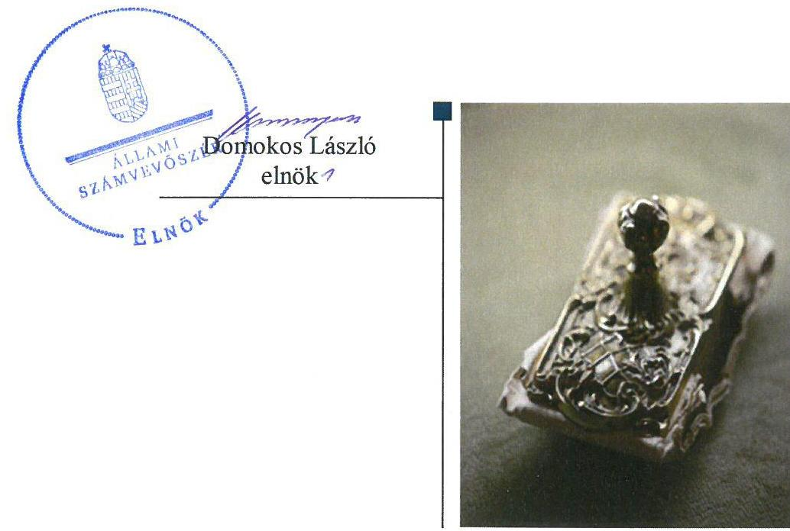
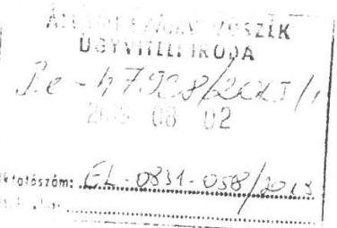
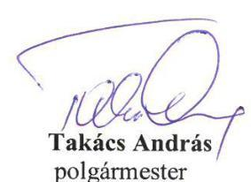
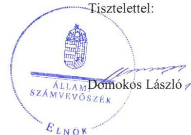
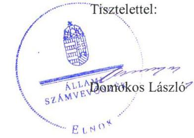
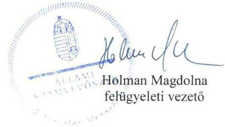

# Jelentés 

## Önkormányzatok ellenőrzése

Integritás- és belső kontrollrendszer, Befektetési tevékenységek ellenőrzése - Szigetbecse Község Önkormányzat 2019. 10. hó 18. nap

---

# AZ ELLENŐRZÉST FELÜGYELTE:

- HOLMAN MAGDOLNA felügyeleti vezető
- AZ ELLENŐRZÉST VEZETTE ÉS A VÉGREHAJTÁSÁÉRT FELELŐS:
  - DR. BENEDEK MÁRIA ellenőrzésvezető
  - A PROGRAM ÖSSZEÁLLÍTÁSÁÉRT FELELŐS:
    - TÓTPÁL SZABOLCS osztályvezető

**IKTATÓSZÁM:** EL-1998-001/2019.

**TÉMASZÁM:** 2485

**ELLENŐRZÉS-AZONOSÍTÓ SZÁM:** V082935

Jelentéseink az Országgyűlés számítógépes hálózatán és az Interneten a www.asz.hu címen is olvashatóak.

---

# TARTALOMJEGYZÉK 

■ ÖSSZEGZÉS ..... 5
■ AZ ELLENŐRZÉS CÉLJA ..... 7
■ AZ ELLENŐRZÉS TERÜLETE ..... 8
■ AZ ELLENŐRZÉS HÁTTERE, INDOKOLTSÁGA ..... 9
■ A JELENTÉS LÉNYEGES KÉRDÉSKÖREI ..... 10
■ AZ ELLENŐRZÉS HATÓKÖRE ÉS MÓDSZEREI ..... 11
■ MEGÁLLAPÍTÁSOK ..... 13
■ JAVASLATOK ..... 18
■ MELLÉKLETEK ..... 21
I. sz. melléklet: Értelmező szótár ..... 21
■ FÜGGELÉKEK ..... 23
I. sz. függelék a jelentéshez ..... 23
II. sz. függelék: Észrevételek ..... 25
■ RÖVIDÍTÉSEK JEGYZÉKE ..... 37

---

.

---

# ÖSSZEGZÉS 

Szigetbecse Község Önkormányzat belső kontrollrendszerének kialakítása és működtetése a 2017. évben nem volt szabályszerű, ezáltal nem biztosította a közpénzekkel való átlátható, elszámoltatható gazdálkodást és a nemzeti vagyonnal történő felelős gazdálkodást. A belső kontrollrendszer a 2013-2017. években a befektetési tevékenység szabályszerű végzését, a befektetett eszközökkel való elszámoltathatóságot nem biztosította. Az integritás kontrollok nem kerültek kiépítésre, az integritás alapú működés nem volt biztosított.

## Az ellenőrzés társadalmi indokoltsága

Az önkormányzatok vagyona a nemzeti vagyon része, és az Alaptörvény is rögzíti, hogy a vagyonnal való gazdálkodás célja a közérdek szolgálata, ezért az önkormányzatok felé elvárás a kiegyensúlyozott, átlátható és fenntartható költségvetési gazdálkodás elvének érvényesítése, továbbá a nemzeti vagyonnal való rendeltetésszerű és felelős módon való gazdálkodás. Az Állami Számvevőszék törvényben kapott felhatalmazással élve ellenőrzi az önkormányzatok gazdálkodását, működését, hogy az ellenőrzések megállapításaival támogassa az ellenőrzött önkormányzatok szabályszerű gazdálkodását, javaslataival elősegítse az Alaptörvényben megfogalmazott alapvetések érvényesülését a mindennapi életben az önkormányzatok szintjén. Az Állami Számvevőszék stratégiájában megfogalmazottak szerint támogatja az integritás alapú, átlátható és elszámoltatható közpénzfelhasználás megteremtését. Mindezekre tekintettel, a közpénzzel gazdálkodó szervezetek esetében a belső kontrollrendszer megfelelő kialakítása és működtetése ellenőrzését prioritásként kezeli az Állami Számvevőszék.

Az Állami Számvevőszék Szigetbecse Község Önkormányzatot korábban nem ellenőrizte.

## Főbb megállapítások, következtetések, javaslatok

Szigetbecse Község Önkormányzat belső kontrollrendszerének működtetése a 2017. évben nem volt szabályszerű, mert nem rendelkezett adatvédelmi és adatbiztonsági szabályzattal, nem szabályozta az integrált kockázatkezelés eljárásrendjét és a szervezeti integritást sértő események kezelésének eljárásrendjét, így nem biztosította a szabályszerű működés és gazdálkodás követelményeinek érvényesülését. Szigetbecse Község Önkormányzat a gazdálkodás részletes rendjét szabályozta.

A jegyző nem működtetett integrált kockázatkezelési rendszert, a belső szabályzatokban a felelősségi körök meghatározása során nem szabályozta a dokumentumokhoz és információkhoz való hozzáférést, így nem biztosította az átlátható működést. A könyvvitelben rögzített és a beszámolóban szereplő tételek a valóságban való megtalálhatósága, bizonyíthatósága nem volt biztosított, így nem érvényesült a Számv. tv.-ben foglalt valódiság elve.

A Képviselő-testület a 2017. évi éves ellenőrzési tervet a tárgyévet megelőző év december 31-éig nem hagyta jóvá, a belső ellenőrzési vezető nem vezetett nyilvántartást az elvégzett belső ellenőrzésekről, valamint a jegyző nem vezetett éves bontásban nyilvántartást a külső ellenőrzések javaslatai alapján készült intézkedési tervek végrehajtásáról, így nem volt biztosított a szabályszerű közpénzfelhasználás.

A 2013-2017. években a befektetési tevékenység szabályszerű végzése nem volt biztosított, mert a belső kontrollrendszer kialakítása során nem tartották be a jogszabályi előírásokat. Az egyes befektetésekkel kapcsolatos számviteli elszámolás, nyilvántartás nem volt szabályszerű, a mérleget leltárral nem támasztották alá.

Szigetbecse Község Önkormányzat a teljesítmény mérésére alkalmas követelményeket nem alakította ki, a szervezeti célok elérését szolgáló feladatokat nem határozta meg, így nem volt biztosított a közpénzekkel való elszámoltatható, felelős gazdálkodás.

A jegyző az integritás kontrollokat nem építette ki, a működés során az integritás szemlélet nem érvényesült.

---

Az ÁSZ az ellenőrzés megállapításai alapján Szigetbecse Község Önkormányzat polgármesterének 2 javaslatot, jegyzőjének 16 javaslatot fogalmazott meg.

---

# AZ ELLENŐRZÉS CÉLJA 

AZ ELLENŐRZÉS CÉLJA annak megállapítása volt, hogy az önkormányzat belső kontrollrendszere biztosította-e a közpénzekkel és a nemzeti vagyonnal történő elszámoltatható, átlátható, szabályszerű, gazdaságos, hatékony és eredményes gazdálkodás feltételeit. Az ÁSZ ${ }^{1}$ értékelte továbbá, hogy az önkormányzatnál kiépítették és erősítették-e a korrupciós kockázatok kezelését szolgáló integritás kontrollokat és azt, hogy megteremtették-e a teljesítményellenőrzés feltételeit.

Az ellenőrzés célja annak értékelése, hogy a jogszabályi előírásoknak megfelelően alakították-e ki a belső kontrollrendszert, a kontrollkörnyezet biztosította-e a befektetési tevékenységek szabályszerű végzését, továbbá, hogy az egyes befektetési tevékenységekkel kapcsolatos döntéshozatal és azok a döntések végrehajtása, valamint az egyes befektetések számviteli elszámolása, nyilvántartása szabályszerű volt-e, és a belső és külső ellenőrzések támogatták-e az egyes befektetési tevékenységek szabályszerű végzését.

---

# AZ ELLENŐRZÉS TERÜLETE

## Szigetbecse Község Önkormányzat

A Pest megyei Szigetbecse község a ráckevei járásban található. Lakossága 2017. január 1-jén – a Központi Statisztikai Hivatal által kiadott, Magyarország közigazgatási helynévkönyve alapján – 1278 fő volt.

A hét tagú Képviselő-testület munkáját négy állandó bizottság segítette. A polgármester³ a 2014. évi önkormányzati választások óta - 2014. október 12-től - töltötte be tisztségét. A jegyző⁴ 2013. január 5-étől látta el feladatait.

Szigetbecse Község Önkormányzat 2012. december 12-ei hatállyal alapította a Szigetbecse Közös Önkormányzati Hivatalt, amely ellátta az Mötv.⁵-ben és a vonatkozó egyéb jogszabályokban a számára meghatározott feladatokat három település vonatkozásában. Szigetbecse Közös Önkormányzati Hivatala nem rendelkezett gazdasági szervezettel.

Szigetbecse Község Önkormányzat a 2017. évi beszámolója szerint 211,0 millió Ft költségvetési és 52,1 millió Ft finanszírozási bevételt ért el, 134,8 millió Ft költségvetési és 91,8 millió Ft finanszírozási kiadást teljesített.

Szigetbecse Község Önkormányzata 2017. december 31-én 49 421,3 ezer Ft értékben rendelkezett OTP tőkegarantált pénzpiaci befektetési jeggyel, amely az értékpapírok között került kimutatásra.

A könyvviteli mérleg szerinti eszközvagyon értéke 2017. december 31-én 1605,3 millió Ft volt, melyből a tárgyi eszközök 1494,0 millió Ft-ot, a pénzeszközök 56,4 millió Ft-ot, a követelések 3,6 millió Ft-ot tettek ki. A költségvetési évben esedékes kötelezettségek állománya 1,7 millió Ft volt, a költségvetési évet követően esedékes kötelezettségek állománya 4,8 millió Ft-ot tett ki.

---

# AZ ELLENŐRZÉS HÁTTERE, INDOKOLTSÁGA 

Az ÁSZ - az ÁSZ tv. ${ }^{5}$ felhatalmazásával élve - ellenőrzi az önkormányzatok gazdálkodását, működését, hogy az ellenőrzések megállapításaival támogassa az ellenőrzött önkormányzatok szabályszerű gazdálkodását, javaslataival elősegítse az Alaptörvényben megfogalmazott alapvetések érvényesülését a mindennapi életben az önkormányzatok szintjén.

Az elvégzett nagyszámú ellenőrzés során az ÁSZ „jó gyakorlatokat" is azonosíthat, melyeket tanácsadó funkciója keretében szélesebb körben is megismertethet az érintettekkel, ezáltal is hozzájárulva az önkormányzati alrendszer szabályozott, átlátható, kiegyensúlyozott és fenntartható működéséhez.

A belső kontrollrendszer kialakítása és működtetése nélkül nem valósítható meg a közpénzek, a közvagyon átlátható, szabályos, gazdaságos, hatékony és eredményes felhasználása.

A belső kontrollrendszer azt a célt szolgálja, hogy a költségvetési szervek működésük és gazdálkodásuk során a tevékenységeket szabályszerűen hajtsák végre, teljesítsék elszámolási kötelezettségeiket és megvédjék az erőforrásokat a veszteségektől, a károktól és a nem rendeltetésszerű használattól. A belső kontrollrendszer magában foglalja mindazon elveket, eljárásokat és belső szabályzatokat, melyek biztosítják, hogy a költségvetési szerv valamennyi tevékenysége és célja összhangban legyen a szabályszerűséggel, szabályozottsággal, valamint a gazdaságosság, hatékonyság és eredményesség követelményeivel, az eszközökkel és forrásokkal való gazdálkodásban ne kerüljön sor pazarlásra, visszaélésre, rendeltetésellenes felhasználásra.

Az önkormányzati vagyongazdálkodás keretében az önkormányzatok átmenetileg szabad pénzeszközeinek befektetését jogszabály nem tiltja, a befektetések jellege nem korlátozott, a pénzpiaci szolgáltatók közül az önkormányzatok a kínált szolgáltatás és annak költségei alapján, szabadon választhatnak, azonban a veszteséges gazdálkodás kockázatai és következményei az önkormányzatokat terhelik. A szabad pénzeszközök felhasználása során kiemelten fontos a felelős gazdálkodás érvényesülése, amely összhangban kell, hogy legyen, az önkormányzati gazdálkodás alapelveivel. Az ellenőrzéssel feltárásra kerülhetnek azok a kockázatok, amelyek az önkormányzatok gazdálkodásával, ezen belül befektetési tevékenységeivel, kontrollkörnyezetével kapcsolatosak és a befektetési tevékenységek szabályszerű végrehajtását befolyásolják. Az ellenőrzéssel az önkormányzatok befektetési/vagyongazdálkodási döntései értékelhetővé válnak, és megalapozott megállapítás tehető arra vonatkozóan, hogy milyen hatást gyakoroltak az önkormányzat vagyonára a képviselő-testület döntései.

---

# A JELENTÉS LÉNYEGES KÉRDÉSKÖREI 

1.- Szabályszerű volt-e az önkormányzat belső kontrollrendszerének működtetése a 2017. évben?
2.- Az önkormányzatnál alakítottak-e ki a szervezeti teljesítmény mérésére alkalmas követelményeket?
3.- Az önkormányzatnál a befektetési tevékenységek szabályszerű végzését a belső kontrollrendszer biztosította-e a 2013-2017. években? Az önkormányzatnál 2017. december 31-én meglévő egyes befektetéseivel kapcsolatos döntéshozatala és az egyes befektetések számviteli elszámolása, nyilvántartása szabályszerű volt-e?

---

# AZ ELLENŐRZÉS HATÓKÖRE ÉS MÓDSZEREI 

## Az ellenőrzés típusa

Megfelelőségi és szabályszerűségi ellenőrzés.

## Az ellenőrzött időszak

Az ellenőrzött időszak a 2017. év, illetve az éves költségvetési beszámoló Áht. ${ }^{6}$ által megállapított jóváhagyásáig, 2018. május 31-éig tartó időszak volt.

Az egyes befektetési tevékenységek ellenőrzése tekintetében a 2013. január 1. -2017. december 31. közötti időszak, továbbá a döntéshozatal tekintetében a 2013. január 1. előtti időszak is, mivel a 2017. december 31-én meglévő befektetésekkel kapcsolatos döntéshozatalra a 2013. január 1. előtti időszakban került sor.

## Az ellenőrzés tárgya

Az önkormányzat és a gazdálkodási feladatokat ellátó hivatala belső kontrollrendszerének kialakítása és működtetése, valamint az integritás kontrollok kiépítettsége, a teljesítményellenőrzés feltételeinek rendelkezésre állása volt.

Az egyes befektetési tevékenységek esetében az önkormányzat 2017. december 31-én meglévő, a Számv. tv7. 3. § (6) bekezdés 2. és 3. pontja szerint az értékpapírokban megtestesülő befektetései, lekötött betétei.

## Az ellenőrzött szervezet

Szigetbecse Község Önkormányzat

## Az ellenőrzés jogalapja

Az ellenőrzés jogszabályi alapját az ÁSZ tv. 1. § (3) bekezdés, 5. § (2) és (6) bekezdései, valamint az Áht. 61. § (2) bekezdésének előírásai képezték.

## Az ellenőrzés módszerei

Az ÁSZ az ellenőrzést az ellenőrzési program szempontjai, az ellenőrzött időszakban hatályos jogszabályok, az ellenőrzés szakmai szabályai, a jelen

---

ellenőrzésre irányadó ÁSZ módszertanok figyelembevételével hajtotta végre.

Az ÁSZ az ellenőrzés ideje alatt az ellenőrzött szervezettel történő kapcsolattartást az ÁSZ SZMSZ ${ }^{\circledR}$-ének vonatkozó előírásai alapján biztosította.

Az ellenőrzési kérdések megválaszolásához szükséges bizonyítékok megszerzése az ellenőrzött által rendelkezésre bocsátott dokumentumokra, adatokra alapozva megfigyelés, szemle (szemrevételezés), kérdésfeltevés (információkérés), valamint elemző eljárás útján történt. Az ellenőrzési bizonyítékként felhasználható adatforrások közé tartoztak az ellenőrzési program részletes szempontjainál felsorolt adatforrások, valamint minden egyéb - az ellenőrzés folyamán feltárt, az ellenőrzés szempontjából információt tartalmazó - dokumentum.

Az ellenőrzés lefolytatásához az ellenőrzött szervezet tanúsítványok kitöltésével, valamint az ÁSZ által kért dokumentumok megküldésével szolgáltatott adatokat, amelyek valódiságát és teljes körűségét az ellenőrzött szervezet vezetője által tett teljességi és hitelességi nyilatkozat igazolta. A rendelkezésre bocsátott adatok, információk kontrollja az ellenőrzés keretében történt.

Az önkormányzat belső kontrollrendszere egyes pilléreinek kialakítására és működtetésére vonatkozó értékelés:
$\longrightarrow$ „szabályszerű", amennyiben az értékelt területen az elért „igen" válaszok százalékban kifejezett, egész számra kerekített aránya legalább $85 \%$,
$\longrightarrow$ „nem szabályszerű", ha nem
 érte el a 85%-ot.
Az önkormányzat belső kontrollrendszerének összesített értékelése az egyes részterületek esetében kapott megfelelőségi arányok számtani átlaga alapján történt és megegyezett a pillérenként (kontrollterületenként) alkalmazott százalékos értékelésekkel, a következő eltérésekkel: a kontrollrendszer egésze esetében a „szabályszerű" értékelésnek a százalékos értéken felül további feltétele, hogy egyik kontrollterület sem kaphatott „nem szabályszerű" értékelést.

Az önkormányzatok befektetési tevékenységét a szerződéskötés (és a kapcsolódó döntés-előkészítés, döntéshozatal) kivételével a 2013. január 1. és 2017. december 31. közötti időszak vonatkozásában értékelte az ÁSZ. A szerződéskötést az önkormányzat 2017. december 31-én meglévő értékpapírjai és egyéb befektetései vonatkozásában értékelte az ellenőrzés. A befektetési döntés előkészítése és döntéshozatala 2013. január 1. előtt történt, ezért ennek értékelését a döntés-előkészítés és a döntéshozatal időpontjában hatályos jogszabályok előírásai alapján végezte az ÁSZ.

---

# 1. Szabályszerű volt-e az önkormányzat belső kontrollrendszerének működtetése a 2017. évben? 

Összegző megállapítás

Az Önkormányzat ${ }^{9}$ belső kontrollrendszerének kialakítása és működtetése nem volt szabályszerű a 2017. évben.

A KONTROLLKÖRNYEZET kialakítása és működtetése nem volt szabályszerű, mert

- a Képviselő-testület az Mötv. 116. § (5) bekezdésében foglaltak ellenére, nem fogadta el az Önkormányzat 2014-2019. évekre szóló Gazdasági Programját ${ }^{10}$;
- a jegyző, mint az őrzésért felelős, a Vnytv. ${ }^{11}$ 11. § (6) bekezdésében előírtak ellenére nem állapította meg szabályzatban a vagyonnyilatkozat átadására, nyilvántartására, a vagyonnyilatkozatban foglalt személyes adatok védelmére vonatkozó további szabályokat;
- A jegyző a Bkr. ${ }^{12}$ 6. § (4) bekezdésében foglaltak ellenére a 2017. évben nem szabályozta az integrált kockázatkezelés eljárásrendjét, valamint a szervezeti integritást sértő események kezelésének eljárásrendjét;
- a jegyző a Bkr. 8. § (4) bekezdés b) pontjában foglalt előírások ellenére belső szabályzatokban nem szabályozta a felelősségi körök meghatározásával a dokumentumokhoz és információkhoz való hozzáférést,
- az Önkormányzat az Info. tv. ${ }^{13}$ 24. § (3) bekezdésében foglalt előírás ellenére nem készített adatvédelmi és adatbiztonsági szabályzatot;
- a jegyző a Hivatal ${ }^{14}$ számára az Ltv. ${ }^{15}$ 10. § (1) bekezdés c) pontjában foglalt előírások ellenére egyedi iratkezelési szabályzatát nem adta ki;
- a jegyző a Hivatal vonatkozásában 2017. december 31-ig nem készített a Számv. tv. 161.§ (1) bekezdésben foglalt előírás ellenére számlarendet.
A Hivatal rendelkezett alapító okirattal ${ }^{16}$, illetve Hivatali SZMSZ ${ }^{17}$-el. A képviselő-testület elfogadta az Önkormányzati SZMSZ ${ }^{18}$-t. A Hivatal 2017. február 20-ától rendelkezett a gazdálkodás részletes rendjét tartalmazó gazdálkodási szabályzattal ${ }^{19}$. A belső szabályzatok tartalmazták a gazdálkodási jogkörökre való felhatalmazásokat és a kijelölések dokumentumait. A gazdálkodási jogkört gyakorlók aláírás-mintáit naprakészen vezették. A jegyző 2017.03.31-ei keltezéssel elkészítette a Számv. tv.-ben előírt számviteli politikát ${ }^{20}$, és annak keretében az értékelési szabályzatot ${ }^{21}$, leltárkészítési és leltározási szabályzatot ${ }^{22}$.

---

A polgármester az Önkormányzatra vonatkozóan 2017. december 14-ig nem gondoskodott a Számv. tv.-ben foglalt előírás ellenére számlarend készítéséről. Az Önkormányzatra vonatkozó számlarendet ${ }^{23}$ a polgármester 2017. december 15-én készítette el.

A jegyző a Bkr. 3. § b) pontjában foglalt előírás ellenére nem gondoskodott az integrált kockázatkezelési rendszer kialakításáról és működtetéséről.

A KONTROLLTEVÉKENYSÉGEK működtetése nem volt szabályszerű. Az Önkormányzat az Áhsz. 5. § (1) bekezdésében foglaltak ellenére a 2017. évről a költségvetési beszámolóját szabályszerű könyvvezetéssel nem támasztotta alá.

# AZ INFORMÁCIÓS ÉS KOMMUNIKÁCIÓS RENDSZER kialakítása és működtetése nem volt szabályszerű: 

a jegyző a Bkr. 9. § (1) bekezdésében előírtak ellenére nem alakított ki olyan rendszereket, amelyek biztosítják, hogy a megfelelő információk a megfelelő időben eljutnak az illetékes szervezethez, szervezeti egységhez, illetve személyhez;
a jegyző az Ávr. ${ }^{24}$ 13. § (2) bekezdés h) pontjában foglalt előírás ellenére belső szabályzatban nem rendezte a közérdekű adatok megismerésére irányuló kérelmek intézésének, továbbá a kötelezően közzéteendő adatok nyilvánosságra hozatalának rendjét;
a jegyző az Info. tv. 37. § (1) bekezdésében hivatkozott, 1. melléklet szerinti általános közzétételi lista III/1. pontjában meghatározott adatok közül nem tette közzé az Önkormányzat 2016. évi költségvetési beszámolóját;
a jegyző az Áht. 108. § (1) bekezdés a) pontjában foglalt előírás ellenére a 2017. évi elemi költségvetésről az államháztartás információs rendszere keretében adatszolgáltatást nem teljesített, valamint az Ávr. 169. § (3) bekezdésében foglalt előírás ellenére az időközi költségvetési jelentést nem töltötte fel a Kincstár ${ }^{25}$ által működtetett elektronikus adatszolgáltató rendszerbe.

A MONITORING RENDSZER működtetését az Önkormányzat a belső ellenőrzés útján valósította meg. A belső ellenőrzés működtetése nem volt szabályszerű, mert:
a Képviselő-testület a Bkr. 32. § (4) bekezdés előírásának ellenére a 2017. évi ellenőrzési tervet a tárgyévet megelőző év december 31-ig nem hagyta jóvá;
a jegyző a Hivatal, mint ellenőrzött belső ellenőrzése vonatkozásában a Bkr. 45. § (1) bekezdésében foglalt előírás ellenére intézkedési tervet nem készített;
a belső ellenőrzési vezető a Bkr. 50. § (1) bekezdésében foglaltak ellenére nem vezetett nyilvántartást az elvégzett belső ellenőrzésekről;
a jegyző a Bkr. 14. § (1) bekezdésben foglalt előírás ellenére nem vezetett éves bontásban nyilvántartást a külső ellenőrzések javaslatai alapján készült intézkedési tervek végrehajtásáról;

---

- a polgármester a Bkr. 11. § (2a) bekezdésében foglalt előírás ellenére a jegyző által tett nyilatkozatot nem terjesztette a Képviselőtestület elé a zárszámadási rendelet-tervezettel együtt.
A belső ellenőrzés működtetéséhez a Hivatal rendelkezett belső ellenőrzési kézikönyvvel ${ }^{26}$, azt a Bkr. előírása alapján a jegyző jóváhagyta.

A jegyző a Bkr. 1. melléklet szerinti nyilatkozatban értékelte a Hivatal belső kontrollrendszerének 2017. évi minőségét. Az ÁSZ ellenőrzés megállapításai nem igazolták a nyilatkozatban foglaltakat.

Az Önkormányzatnál a jogszabályok által előírt kontrollok kiépítettségének szintje alacsony, az nem támogatta a szervezet integritás elvű működését. A jegyző nem határozta meg a követendő értékeket, ezek között az integritás erősítését, nem végzett kockázatelemzést, a kockázatelemzés hiányában az integritás elvű működést támogató kontrollok nem kerültek kialakításra. Nem működtetett az integritást erősítő kontrollokat.

# 2. Az önkormányzatnál alakítottak-e ki a szervezeti teljesítmény mérésére alkalmas követelményeket? 

## Összegző megállapítás

Az Önkormányzatnál nem alakítottak ki teljesítmény mérésére alkalmas követelményeket.

A szervezeti célok elérését szolgáló feladatok, folyamatok, tevékenységek mérését szolgáló indikátorokat, mérőszámokat, feladat- és teljesítménymutatókat az Önkormányzat nem képzett, így nem biztosította a teljesítménymérés lehetőségét.

## 3. Az önkormányzatnál a befektetési tevékenységek szabályszerű végzését a belső kontrollrendszer biztosította-e a 2013-2017. években? Az önkormányzatnál 2017. december 31-én meglévő egyes befektetéseivel kapcsolatos döntéshozatala és az egyes befektetések számviteli elszámolása, nyilvántartása szabályszerű volt-e?

### 3.1. Összegző megállapítás Az önkormányzatnál a befektetési tevékenységek szabályszerű végzését a belső kontrollrendszere nem biztosította a 2013-2017. években.

A befektetési tevékenységek szabályszerű végzését a belső kontrollrendszer a 2013-2017. években nem biztosította, mert:

A Képviselő-testület a Mötv.-ben foglalt előírás ellenére a 2013. január 1. - 2014. november 12. közötti időszakban nem határozta meg az Önkormányzat működésének részletes szabályait SZMSZ-ben. Az Önkormányzati SZMSZ 2014. november 13-ától hatályos.

---

A jegyző az Áht.-ben foglalt előírás ellenére a Hivatal szervezetét, feladatai ellátásának részletes rendjét és módját szervezeti és működési szabályzatban nem állapította meg 2013. január 1. - 2014. június 30. között. A Hivatali SZMSZ 2014. július 1-jétől hatályos.

A jegyző a Hivatalra és az Önkormányzatra a Számv. tv. előírása alapján 2013. január 1-jétől elkészítette számviteli politikát, annak keretében az eszközök és források leltárkészítési és leltározási szabályzatát, pénzkezelési szabályzatát.

A jegyző a Hivatalra és az Önkormányzatra vonatkozóan a Számv. tv.-ben előírtak ellenére 2014. november 30-ig nem készítette el az eszközök és források értékelési szabályzatát. Az eszközök és források értékelési szabályzata 2014. december 1-jétől hatályos.

A jegyző az Ávr. 60. § (3) bekezdésben foglaltak ellenére a 2013. január 1-je és 2013. február 28. közötti időszakban kötelezettségvállalásra, 2013. január 1-je és 2014. február 28. közötti időszakban a teljesítésigazolásra, utalványozásra, a 2013. január 1-je és 2014. január 30. közötti időszakban az érvényesítésre és ellenjegyzésre jogosult személyek megnevezését és aláírás mintáját tartalmazó naprakész nyilvántartást nem vezetett.

A jegyző a Bkr. 6. § (4) bekezdésében foglaltak ellenére a 2016. október 1-től nem szabályozta az integrált kockázatkezelés eljárásrendjét, valamint a szervezeti integritást sértő események kezelésének eljárásrendjét.

A jegyző a Bkr. 3. § b) pontjában foglaltak ellenére 2016. október 1-jétől nem alakított ki - a szervezet minden szintjén érvényesülő integrált kockázatkezelési rendszert.
3.2. Összegző megállapítás Az Önkormányzatnál a 2017. december 31-én meglévő befektetéseivel kapcsolatos döntéshozatal szabályszerű volt, az egyes befektetések számviteli elszámolása, nyilvántartása nem volt szabályszerű a 2013-2017. években.

# AZ EGYES BEFEKTETÉSEKKEL KAPCSOLATOS 

DÖNTÉSHOZATAL szabályszerű volt. Az Önkormányzat a forgatási célú hitelviszonyt megtestesítő értékpapírokkal (tőkegarantált befektetési jegyekkel) kapcsolatos döntéseket az önkormányzati rendeletek, Képviselő-testületi határozatok előírásai szerint hozta meg.

## A SZÁMVITELI ELSZÁMOLÁS ÉS NYILVÁNTARTÁS a 2013-2017. években nem volt szabályszerű.

A jegyző a 2013-2017. években az Áhsz. ${ }^{27}$ 49. § (1) bekezdésében és az Áhsz. ${ }^{28}$ 45. § (3) bekezdésben foglaltak ellenére a forgatási célú hitelviszonyt megtestesítő értékpapírokra (tőkegarantált befektetési jegy) vonatkozóan az elemi költségvetési beszámoló adatai valóságnak megfelelő, áttekinthető alátámasztásáról és adatszolgáltatási kötelezettségének alátámasztásáról a könyvviteli számlák alábontásával vagy a könyvviteli számlákhoz kapcsolódó részletező nyilvántartások vezetésével nem gondoskodott;
A jegyző a Számv. tv. 69.§ (1) bekezdésében foglaltak ellenére a 2013-2017. években a forgatási célú hitelviszonyt megtestesítő értékpapírok (tőkegarantált befektetési jegyek) mérleg tételeinek alátámasztásához nem állított össze olyan leltárt, amely tételesen, ellenőrizhető módon tartalmazza a mérleg fordulónapján meglévő eszközöket mennyiségben és értékben.

---

# JAVASLATOK 

Az ÁSZ tv. 33. § (1) bekezdésében foglaltak értelmében az ellenőrzött szervezet vezetője köteles a jelentésben foglalt megállapításokhoz kapcsolódó intézkedési tervet összeállítani és azt a jelentés kézhezvételétől számított 30 napon belül az ÁSZ részére megküldeni. Amennyiben az ellenőrzött szervezet vezetője nem küldi meg határidőben az intézkedési tervet, vagy továbbra sem elfogadható intézkedési tervet küld, az Állami Számvevőszék elnöke az ÁSZ tv. 33. § (3) bekezdése a) és b) pontjaiban foglaltakat érvényesítheti.

## Szigetbecse Község Önkormányzat polgármesterének

1. Intézkedjen a Bkr. előírása szerint az éves ellenőrzési terv Képviselőtestület általi jóváhagyására a tárgyévet megelőző év december 31-ig.
(1. számú megállapítás 7. bekezdés 1. francia bekezdés megállapítása alapján)
2. A jövőben terjessze a Bkr. előírásai szerint a vezetői nyilatkozatot a zárszámadási rendelet tervezetével együtt a képviselő-testület elé.
(1. számú megállapítás 7. bekezdés 5. francia bekezdés megállapítása alapján)

## Szigetbecse Közös Önkormányzati Hivatal jegyzőjének

1. Állapítsa meg a Vnytv. előírásának megfelelően a vagyonnyilatkozat átadására, nyilvántartására, a vagyonnyilatkozatban foglalt személyes adatok védelmére vonatkozó további szabályokat szabályzatban.
(1. számú megállapítás 1. bekezdés 2. francia bekezdés megállapítása alapján)
2. Intézkedjen a Bkr. előírásának megfelelően a szervezeti integritást sértő események kezelésének eljárásrendje, valamint az integrált kockázatkezelés eljárásrendje szabályozásáról.
(1. számú megállapítás 1. bekezdés 3. francia bekezdés megállapítása alapján)
3. Intézkedjen a Bkr. előírásának megfelelően a felelősségi körök meghatározásával a dokumentumokhoz és információkhoz való hozzáférés szabályozásáról.
(1. számú megállapítás 1. bekezdés

 4. Intézkedjen az Info tv. előírásának megfelelően az Önkormányzat belső adatvédelmi és adatbiztonsági szabályzatának megalkotásáról.
(1. számú megállapítás 1. bekezdés 5. francia bekezdés megállapítása alapján)
5. Intézkedjen egyedi iratkezelési szabályzat Ltv. előírásának megfelelő kiadásáról.
(1. számú megállapítás 1. bekezdés 6. francia bekezdés megállapítása alapján)
6. Intézkedjen a Hivatal tekintetében a Számv. tv. előírásainak megfelelő számlarend elkészítésére.
(1. számú megállapítás 1. bekezdés 7. francia bekezdés megállapítása alapján)
7. Intézkedjen a Bkr. előírásának megfelelő integrált kockázatkezelési rendszer kialakítására és működtetésére.
(1. számú megállapítás 4. bekezdés és a 3.1 számú megállapítás 7-8 bekezdés megállapítása alapján)
8. Intézkedjen az Áhsz. előírásainak megfelelően a költségvetési beszámoló szabályszerű könyvvezetéssel történő alátámasztására.
(1. számú megállapítás 5. bekezdés 2. mondta alapján)
9. Intézkedjen a Bkr. előírásának megfelelően olyan rendszerek kialakításáról, amelyek biztosítják, hogy a megfelelő információk a megfelelő időben eljutnak az illetékes szervezethez, szervezeti egységhez, illetve személyhez.
(1. számú megállapítás 6. bekezdés 1. francia bekezdés megállapítása alapján)
10. Rendezze az Ávr. előírásának megfelelően belső szabályzatban a közérdekű adatok megismerésére irányuló kérelmek intézésének, továbbá a kötelezően közzéteendő adatok nyilvánosságra hozatalának rendjét.
(1. számú megállapítás 6. bekezdés 2. francia bekezdés megállapítása alapján)
11. Intézkedjen az Áht. előírásának megfelelően az elemi költségvetésről az államháztartás információs rendszere keretében történő adatszolgáltatás teljesítéséről.
(1. számú megállapítás 6. bekezdés 4. francia bekezdés megállapítása alapján)

---

12. Készítsen a Bkr. előírásának megfelelően intézkedési tervet.
(1. számú megállapítás 7. bekezdés 2. francia bekezdés megállapítása alapján)
13. Gondoskodjon arról, hogy a belső ellenőrzési vezető a Bkr. előírása szerint nyilvántartást vezessen az elvégzett belső ellenőrzésekről.
(1. számú megállapítás 7. bekezdés 3. francia bekezdés megállapítása alapján)
14. Gondoskodjon a Bkr. előírásának megfelelően a külső ellenőrzések javaslatai alapján készült intézkedési tervek végrehajtását éves bontásban tartalmazó nyilvántartás vezetéséről.
(1. számú megállapítás 7. bekezdés 4. francia bekezdés megállapítása)
15. Gondoskodjon az Áhsz. előírásainak megfelelően a könyvviteli számlák alábontásáról vagy részletező nyilvántartás vezetéséről a forgatási célú hitelviszonyt megtestesítő értékpapírok tekintetében.
(3.2. számú megállapítás 2. bekezdéséhez tartozó 1. francia bekezdés megállapítása alapján)
16. Intézkedjen a Számv. tv. előírásának megfelelő leltár összeállításáról. (3.2. számú megállapítás 2. bekezdéséhez tartozó 2. francia bekezdés megállapítása alapján)

---

# MELLÉKLETEK 

- I. SZ. MELLÉKLET: ÉRTELMEZŐ SZÓTÁR
belső ellenőrzés
belső kontrollrendszer
belső kontrollrendszer területei
információs és kommunikációs rendszer
integrált kockázatkezelési rendszer
integritás
kockázat
kontrollkörnyezet
kontrolltevékenységek
kommunikáció
önkormányzati hivatal

Független, tárgyilagos bizonyosságot adó és tanácsadó tevékenység, amelynek célja, hogy az ellenőrzött szervezet működését fejlessze és eredményességét növelje, az ellenőrzött szervezet céljai elérése érdekében rendszerszemléletű megközelítéssel és módszeresen értékeli, illetve fejleszti az ellenőrzött szervezet irányítási és belső kontrollrendszerének hatékonyságát. (Forrás: Bkr. 2. § b) pontja)
A belső kontrollrendszer a kockázatok kezelése és tárgyilagos bizonyosság megszerzése érdekében kialakított folyamatrendszer, amely azt a célt szolgálja, hogy a működés és gazdálkodás során a tevékenységeket szabályszerűen, gazdaságosan, hatékonyan, eredményesen hajtsák végre, az elszámolási kötelezettségeket teljesítsék, megvédjék az erőforrásokat a veszteségektől, károktól és nem rendeltetésszerű használattól. (Forrás: Áht. 69. § (1) bekezdése)
A kontrollkörnyezet, az integrált kockázatkezelési rendszer, a kontrolltevékenységek, az információs és kommunikációs rendszer, valamint a nyomon követési (monitoring) rendszer. (Forrás: Bkr. 3. §-a)
A költségvetési szerv vezetője által kialakított és működtetett olyan rendszer, mely biztosítja, hogy a megfelelő információk a megfelelő időben eljutnak az illetékes szervezethez, szervezeti egységhez, illetve személyhez. (Forrás: Bkr. 9. § (1) bekezdés)
Olyan folyamatalapú kockázatkezelési rendszer, amely a szervezet minden tevékenységére kiterjed, egységes módszertan és eljárások alkalmazásával, a szervezet célkitűzéseinek és értékeinek figyelembevételével biztosítja a szervezet kockázatainak teljes körű azonosítását, azok meghatározott kritériumok szerinti értékelését, valamint a kockázatok kezelésére vonatkozó intézkedési terv elkészítését és az abban foglaltak nyomon követését. (Forrás: Bkr. 2. § m) pontja, 2016. október 1-jétől)
Az integritás az elvek, értékek, cselekvések, módszerek, intézkedések konzisztenciáját jelenti, vagyis olyan magatartásmódot, amely meghatározott értékeknek megfelel. (Forrás: Nemzetgazdasági Minisztérium: Magyarországi államháztartási belső kontroll standardok Útmutató 1.6.1. pontja, 2012. december)
A kockázat annak a valószínűségét jelenti, hogy egy vagy több esemény vagy intézkedés nem kívánt módon befolyásolja a rendszer működését, céljainak megvalósulását. (Forrás: Javaslatok a korrupciós kockázatok kezelésére - Kockázatkezelési és ellenőrzési módszertan 35. oldal, ÁSZ)
A költségvetési szerv vezetője által kialakított olyan elvek, eljárások, belső szabályzatok összessége, amelyben világos a szervezeti struktúra, a folyamatok átláthatók, egyértelműek a felelősségi, hatásköri viszonyok és feladatok, meghatározottak, ismertek és elfogadottak az etikai elvárások a szervezet minden szintjén, átlátható a humánerőforrás-kezelés, biztosított a szervezeti célok és értékek irányában való elkötelezettség fejlesztése és elősegítése. (Forrás: Bkr. 6. § (1) bekezdés)
A költségvetési szerv vezetője által a szervezeten belül kialakított (kontroll) tevékenységek, melyek biztosítják a kockázatok kezelését, hozzájárulnak a szervezet céljainak eléréséhez és erősítik a szervezet integritását. (Forrás: Bkr. 8. § (1) bekezdés)
Az a tevékenység, melynek során információ továbbítása valósul meg. A kommunikációs folyamat résztvevői között tájékoztatás történik, mely során tényeket, ezek magyarázatát közlik.
A polgármesteri hivatal, a főpolgármesteri hivatal, a megyei önkormányzati hivatal és a közös önkormányzati hivatal. (Forrás: Áht. 1. § 18. pont)

---

társulás

A helyi önkormányzatok képviselő-testületei megállapodhatnak abban, hogy egy vagy több önkormányzati feladat- és hatáskör, valamint a polgármester és a jegyző államigazgatási feladat- és hatáskörének hatékonyabb, célszerűbb ellátására jogi személyiséggel rendelkező társulást hoznak létre. (Forrás: Mötv. 87. §)

---

# FÜGGELÉKEK 

- I. SZ. FÜGGELÉK A JELENTÉSHEZ

Az Állami Számvevőszék az ellenőrzések során feltárt tényekhez kapcsolódó további körülmények tisztázására eszközrendszerrel nem rendelkezik. Amennyiben az ellenőrzésen túlmutatóan indokoltnak látszik az ellenőrzés során feltárt körülmények további vizsgálata, az Állami Számvevőszék törvényi felhatalmazás alapján az ellenőrzés által feltárt körülményeket továbbítja a hatáskörrel rendelkező szervnek a szükséges intézkedések megtétele, eljárások lefolytatása érdekében.
I.

1. Az Önkormányzat a 2017. évről a költségvetési beszámolóját szabályszerű könyvvezetéssel nem támasztotta alá, a könyvvitelben rögzített és a beszámolóban szereplő tételek létét nem igazolta. Ezzel megsértette az Áhsz. 5.§ (1) bekezdésében foglaltakat.
2. A Hivatalra vonatkozóan 2017. december 31-ig , az Önkormányzatra vonatkozóan 2017. december 14-éig a Számv. tv. 161.§ (1) bekezdésben foglalt előírást megsértve számlarend nem került elkészítésre.
3. Az Önkormányzatnál a 2017. évben az Áht. 37.§ (1) bekezdésében foglalt előírást megsértve írásbeli kötelezettségvállalás nélkül, valamint az Áht. 38.§ (1) bekezdésében előírtakat megsértve teljesítésigazolás nélkül teljesítettek kifizetést 2110560 forint összegben.
A számlarend hiánya, valamint jogszabályban foglaltak megsértése miatt nem igazolt a könyvvitelben rögzített és a beszámolóban szereplő tételek megléte, valamint nem igazolt, hogy a kifizetések az önkormányzat feladatellátását szolgálták, továbbá, hogy a kifizetésekhez valós teljesítés kapcsolódott, ezért nem zárható ki a vagyoni hátrány okozása.
Az eset konkrét körülményeinek felderítésére az Ügyészség rendelkezik hatáskörrel.
II. Az Önkormányzat a 2013-2017. években forgatási célú, hitelviszonyt megtestesítő értékpapírokat (tőkegarantált pénzpiaci befektetési jegyeket) tartott nyilván 2013-ban 41,8 millió forint, 2014-ben 46,5 millió forint, 2015-ben 46,5 millió forint, 2016-ban 52,4 millió forint, 2017-ben 49,4 millió forint értékben.
4. Az Önkormányzatnál a Számv. tv. 69.§ (1) bekezdésében foglalt előírásokat megsértve a 2013-2017 évi éves beszámolók forgatási célú, hitelviszonyt megtestesítő értékpapírok (tőkegarantált pénzpiaci befektetési jegyek) mérlegsor tételei alátámasztásához nem készült leltár.
5. Az Önkormányzatnál a 2013-2017. években az Áhsz. 49. § (1) bekezdésében és az Áhsz. 2. 45. § (3) bekezdésben foglalt előírásokat megsértve a forgatási célú hitelviszonyt megtestesítő értékpapírok (tőkegarantált pénzpiaci befektetési jegy) vonatkozásában sem a könyvviteli számlák alábontása, sem a könyvviteli számlákhoz kapcsolódó részletező nyilvántartások vezetése nem történt meg.

---

A beszámoló leltárral történő alátámasztásának és a nyilvántartások vezetésének hiányában nem igazolt, hogy az Önkormányzat beszámolói megbízható és valós összképet mutatnak az önkormányzat vagyonáról.
Az eset konkrét körülményeinek feltárására a Kincstár rendelkezik hatáskörrel.

---

A jelentéstervezetet a Számvevőszék 15 napos észrevételezésre megküldte az ellenőrzött szervezetek vezetőinek az ÁSZ tv. 29. § (1) bekezdése előírásának megfelelően.

Szigetbecse Község Önkormányzatának polgármestere és a Szigetbecsei Közös Önkormányzati Hivatal jegyzője a jelentéstervezet megállapításaira írásban észrevételt tett. Az ÁSZ tv. 29. § (3) bekezdésével összhangban az ÁSZ a Függelékben feltünteti az ellenőrzés megállapításaival kapcsolatban tett, figyelembe nem vett észrevételeket, és megindokolja, hogy azokat miért nem fogadta el.

[^0]
[^0]:    * 29. § (1) Az Állami Számvevőszék az ellenőrzési megállapításait megküldi az ellenőrzött szervezet vezetőjének vagy az általa megbízott személynek, és annak, akinek személyes felelősségét állapította meg.
    (2) Az ellenőrzött szervezet vezetője és a felelősként megjelölt személy az ellenőrzés megállapításaira tizenöt napon belül írásban észrevételt tehet.
    (3) Az Állami Számvevőszék az észrevételre a beérkezésétől számított harminc napon belül írásban válaszol. A figyelembe nem vett észrevételeket köteles a jelentésben feltüntetni, és megindokolni, hogy azokat miért nem fogadta el.

---

# Szigetbecse Község   POLGÁRMESTERE   2321 Szigetbecse, Petőfi S. u. 34.   Telefon: (24) 513-510 Fax: (24) 513-511   e-mail: szigetbecse@upcmail.hu 

Szám: 1/1512-4/2019.
Tárgy: Észrevétel a számvevőszéki
jelentéstervezettel kapcsolatban
Hiv.szám: EL-0831-055/2019.

Állami Számvevőszék
Domokos László elnök

Budapest 4.,
Pf.: 54.
1364
Tisztelt Elnök Úr!

Az Állami Számvevőszék által az „Önkormányzatok ellenőrzése - Integritás- és belső kontrollrendszer, Befektetési tevékenységek ellenőrzése - Szigetbecse Község Önkormányzat" - címmel készült számvevőszéki jelentéstervezetre az alábbi észrevételeket tesszük:

Önök által tett megállapításokkal kapcsolatos észrevételeink:

1. A KONTROLLKÖRNYEZET kialakítása és működtetése nem volt szabályszerű, mert a Képviselő-testület az Mötv. 116. § (5) bekezdésében foglaltak ellenére, nem fogadta el az Önkormányzat 2014-2019. évekre szóló Gazdasági Programját
Szigetbecse Község Önkormányzatának Képviselő-testülete a 29/2015. (IV.28.) számú határozatával fogadta el a 2014-2019. évi gazdasági programját. A határozatot és a gazdasági programot a megadott felületre 1_4 pont alá Szigetbecse K. Önk. gazdasági program_4 pont.pdf fájlnévvel feltöltöttük. (Jelen levélhez 1. sz. mellékletként csatolva.)
2. A jegyző a Bkr. 6. § (4) bekezdésében foglaltak ellenére a 2017. évben nem szabályozta az integrált kockázatkezelés eljárásrendjét, valamint a szervezeti integritást sértő események kezelésének eljárásrendjét
A kockázatkezelési szabályzat kiadására 2013. március 1-én került sor, az 2017. évben is érvényben volt. (Jelen levélhez 2. sz. mellékletként csatolva.)
3. A belső kontrollrendszer és a szabálytalanságok kezelésének eljárásrendje 2013. január 1-vel kiadásra került. (Jelen levélhez 3. sz. mellékletként csatolva.)
4. Az Önkormányzat az Info. tv. 24. § (3) bekezdésében foglalt előírás ellenére nem készíttetett adatvédelmi és adatbiztonsági szabályzatot
Az adatvédelmi szabályzat elfogadására 2019. évben került sor. (Jelen levélhez 4. sz. mellékletként csatolva)
5. A jegyző a Hivatal számára az Ltv. 10. § (1) bekezdés c) pontjában foglalt előírások ellenére egyedi iratkezelési szabályzatát nem fogadta el
Az iratkezelési szabályzat elkészült, jóváhagyása folyamatban van. (Jelen levélhez 5. sz. mellékletként csatolva)
6. A jegyző a Hivatal vonatkozásában 2017. december 31-ig nem készített a Számv. tv. 161. § (1) bekezdésében foglalt előírások ellenére számlarendet

Szigetbecsei Közös Önkormányzati Hivatal számlarendje 2016. december 15-ei keltezéssel elkészült, az 2017. január 1-től hatályos. (Jelen levélhez 6. sz. mellékletként csatolva.)
7. A KONTROLLTEVÉKENYSÉG működtetése nem volt szabályszerű. Az Önkormányzat az Áhsz. 5. § (1) bekezdésében foglaltak ellenére a 2017. évről a költségvetési beszámolóját szabályszerű könyvvezetéssel nem támasztotta alá

---

A 2017.
 évi költségvetési beszámoló elfogadására - a szabályoknak megfelelően 2018. május 31-ig sor (4/2018 (VI. 13.) Önkormányzati rendelettel) került. A Magyar Államkincstár által folytatott ellenőrzés kapcsán, az intézkedési tervben foglaltak alapján az alátámasztó leltár elkészült.
8. A jegyző az Ávr. 13. § (2) bekezdésében előírt ellenére belső szabályzatban nem rendezte a közérdekű adatok megismerésére irányuló kérelmek intézésének, továbbá a kötelezően közzétéendő adatok nyilvánosságra hozatalának rendjét.
A közérdekű adatok közzétételének és megismerésükre, igénylésükre irányuló igények teljesítésének rendjéről készült szabályzat, az 2014. december 1-én lépett hatályba. (Jelen levélhez 7. sz. mellékletként csatolva.)
9. A jegyző az Áht. 108. § (1) bekezdés a) pontjában foglalt előírás ellenére a 2017. évi elemi költségvetésről az államháztartás információs rendszere keretében adatszolgáltatást nem teljesített, valamint az Ávr. 169. § (3) bekezdésében foglalt előírás ellenére az időközi költségvetési jelentést nem töltötte fel a Kincstár által működtetett elektronikus adatszolgáltató rendszerbe.
A 2017. évi költségvetésről az államháztartás információs rendszerébe határidőre teljesítettünk információt (adatok a KGR K11-ből: 2017. évi elemi költségvetés 2017. 03. 15., a 2017. I-III. hó időközi költségvetési jelentés 2017. 05. 09., időközi mérlegjelentés I. negyedév 2017. 05. 09., időközi költségvetési jelentés 2017. 04. hó, 05. 17., időközi költségvetési jelentés 05. hó 06. 16-án, időközi költségvetési jelentés 06. hó 07. 18-án, időközi mérlegjelentés II. negyedév 07. 18-án, időközi költségvetési jelentés 07. hó 08. 15-én, időközi költségvetési jelentés 08. hó 09. 15-én, időközi költségvetési jelentés 09. hó 10. 18-án, időközi mérlegjelentés III. negyedév 10. 18-án, időközi költségvetési jelentés 10. hó 11. 16-án, időközi költségvetési jelentés 11. hó 12. 17-én, időközi költségvetési jelentés 12. hó 2018. 02. 01-én, időközi mérlegjelentés IV. negyedév 2018. 02. 01-én.)
10. A MONITORING RENDSZER működtetését az Önkormányzat a belső ellenőrzés útján valósította meg. A belső ellenőrzés működtetése nem volt szabályszerű, mert a Képviselő-testület a Bkr. 32. § (4) bekezdés előírásának ellenére a 2017. évi ellenőrzési tervet a tárgyévet megelőző év december 31-ig nem hagyta jóvá.
A képviselő-testület a 2017. évi belső ellenőrzési tervet a határidő után, a 10/2017. (II.14.) számú határozatával fogadta el. (Jelen levélhez 8. sz. mellékletként csatolva.)
11.3.1. Összegzö megállapítás: Az Önkormányzatnál a befektetési tevékenységek szabályszerű végzését a belső kontrollrendszere nem biztosította 2013-2017 években, mert a Képviselő-testület a Mötv-ben foglalt előírás ellenére a 2013. január 1. 2014. november 12. közötti időszakban nem határozta meg az Önkormányzat működésének részletes szabályait SZMSZ-ben. Az Önkormányzati SZMSZ 2014. november 13-ától hatályos.
A képviselő-testület 2013. január 1. és 2014. november 12. között is rendelkezett szervezeti és működési szabályzattal (1/2007. (II.26.) és 7/2013. (VI.5.) önkormányzati rendelet). (Jelen levélhez 9. sz. mellékletként csatolva.)

# Függelék: 

1.1. Az Önkormányzat 2017. évi költségvetési beszámolójának szabályszerű könyvvitellel történő alátámasztása, valamint a könyvvitelben rögzített és a beszámolóban szereplő tételek létéről a Magyar Államkincstár által folytatott ellenőrzés kapcsán - az intézkedési tervben foglaltak alapján - az alátámasztó leltár elkészült.
1.2. A Szigetbecsei Közös Önkormányzati Hivatal számlarendje 2016. december 15-ei keltezéssel elkészült, az 2017. január 1-től hatályos. (Jelen levélhez 6. sz. mellékletként csatolva.)
1.3. Az Önök által EL-0831-025/2018 iktatószámú adatbekérési projekt 3. számú mellékletében kért számlák hiányosan kerültek feltöltésre: 8 db számlából csak 6 db-ot töltöttünk fel a rendszerbe. Kimaradt számlák: 2.110.560 Ft összegben:

- NQ9SB 9251905 sz. számla 1.103.388,- Ft+ 297.915,- ÁFA, azaz 1.401.303,- Ft.
- NQ9SB 8920444 sz. számla 1.007.172,- + 271.936 ÁFA, azaz 1.279.108,- Ft

---

A kimaradt számlák hitelesített másolatát, a kötelezettség nyilvántartási bizonylatokat, valamint az a polgármester és a pénzügyi ellenjegyző által aláírt teljesítésigazolásokat 10. sz. mellékletként csatoljuk.

Kérem, szíveskedjenek észrevételeinket a végleges jelentés elkészítésénél figyelembe venni.
Szigetbecse, 2019. július 31.

Tisztelettel:

---

# Takács András úr 

polgármester
Szigetbecse Község Önkormányzat
Szigetbecse

## Tisztelt Polgármester Úr!

Az ,,Önkormányzatok ellenőrzése -Integritás- és belső kontrollrendszer, Befektetési tevékenységek ellenőrzése - Szigetbecse Község Önkormányzat"címmel készített számvevőszéki jelentéstervezetre tett észrevételét megkaptam.
Az Állami Számvevőszék észrevételekre vonatkozó álláspontjáról a felügyeleti vezető által készített részletes tájékoztatást csatoltan megküldöm.
Tájékoztatom Polgármester urat, hogy a számvevőszéki jelentésben - az Állami Számvevőszékről szóló 2011. évi LXVI. törvény 29. § (3) bekezdése alapján - a figyelembe nem vett észrevételeket szerepeltetjük az elutasítás indokának feltüntetésével.

Budapest, 2019. 88 hó 27 nap

Melléklet: Tájékoztatás az észrevételek kezeléséről

---

# Tájékoztatás az észrevételek kezeléséről 

Az „Önkormányzatok ellenőrzése -Integritás- és belső kontrollrendszer, Befektetési tevékenységek ellenőrzése - Szigetbecse Község Önkormányzat"című jelentéstervezetre (továbbiakban: jelentéstervezet) a 2019. július 31-én kelt I/1512-4/2019. számú levélben megküldött észrevételeit áttekintettem. Az észrevételek kezeléséről az alábbi tájékoztatást adom.

1) Az 1. megállapítás 1. bekezdés 1. francia bekezdéséhez tett 1. számú észrevételt, az 1. megállapítás 1. bekezdés 7. francia bekezdéséhez tett 6. számú, az I. számú függelékhez tett I.2., az 1. megállapítás 6. bekezdés 2. francia bekezdéséhez tett 8. számú észrevételt, a 3.1. összegzö megállapítás 1. bekezdéséhez tett 11. számú észrevételt, továbbá a jelentéstervezet I. számú függelék I.1. pontjához, valamint az I. számú függelék I.3. pontjához tett észrevételt nem fogadtam el.
Az Állami Számvevőszék (továbbiakban: ÁSZ) az ellenőrzési megállapításait az ellenőrzött szervezet közreműködési kötelezettsége keretében, az ellenőrzött szervezet által Teljességi és hitelességi nyilatkozattal alátámasztott dokumentumokra alapozva fogalmazta meg. Polgármester úr és Jegyző úrhölgy által aláírt Teljességi és hitelességi nyilatkozatban foglaltak szerint az átadott dokumentumok, adatok megbízhatóak, az ÁSZ által bekért adatokra, dokumentumokra vonatkozóan teljes körű információt tartalmaznak. Polgármester úr és Jegyző Úrhölgy az átadott dokumentumok, adatok hitelességéért, valódiságáért, hiánytalanságáért teljes felelősséget vállalt. Így a 15 napos észrevételezés keretében megküldött adatok nem kerültek figyelembevételre.

Az észrevételében jelzett, 1_4 pont alatt az adatszolgáltatásra nyitva álló törvényi határidőn belül Szigetbecse K. Önk. gazdasági program_4 pont.pdf fájlnévvel feltöltött dokumentum nem tartalmazta az észrevételében hivatkozott Szigetbecse Önkormányzatának Képviselőtestülete 29/2015. (IV.28.) számú határozatát.
2) Az 1. megállapítás 1. bekezdés 3. francia bekezdéséhez tett 2. és 3. számú észrevételt nem fogadtam el.
Az észrevételében kifogásolt megállapítás a költségvetési szervek belső kontrollrendszeréről és belső ellenőrzéséről szóló 370/2011. (XII. 31.) Korm. rendelet (Bkr.) 2016. október 1-jétől hatályos rendelkezése szerinti, a szervezeti integritást sértő események kezelésének eljárásrend, valamint az integrált kockázatkezelés eljárásrend hiányát rögzíti. Az észrevétele megerősíti, hogy a jogszabályi változást követően integrált kockázatkezelési eljárásrend, valamint a szervezeti integritást sértő események eljárásrendje nem került kiadásra.

---

3) Az 1. megállapítás 1. bekezdés 5. francia bekezdéséhez tett 4. számú észrevételt és az 1. megállapítás 1. bekezdés 6. francia bekezdéséhez tett 5. számú észrevételt nem fogadtam el.

Az észrevételében foglaltak szerint az adatvédelmi szabályzat és az iratkezelési szabályzat az ellenőrzött időszakon túl került, illetve kerül elfogadásra, jóváhagyásra, ezért az ellenőrzött időszakra vonatkozó megállapításra nincs hatással. Ezzel együtt az észrevételben foglaltak a jelentéstervezet megállapításait is megerősítik, mert az észrevételben leírtak alapján az ellenőrzés időszakában a szabályzatok nem kerültek elfogadásra, jóváhagyásra.
4) Az 1. megállapítás 5. bekezdés 2. mondatához tett 7. számú észrevételt, valamint a I. számú függelék 1.1 pontjához tett észrevételét nem fogadtam el.
Az Áhsz. 5. § (1) kimondja, hogy a beszámolási időszakról a könyvek zárását követően bizonylatokkal, szabályszerű könyvvezetéssel, e rendelet szabályai szerint folyamatosan vezetett részletező nyilvántartásokkal, a könyvviteli zárlat során készített főkönyvi kivonattal, valamint leltárral alátámasztott éves költségvetési beszámolót kell készíteni. A jelentéstervezet megállapítása a beszámoló szabályszerű könyvvezetéssel történő alátámasztásának hiányát rögzíti és nem a leltárral való alátámasztottságát. Észrevétele nem cáfolja a beszámoló szabályszerű könyvvezetéssel történő alátámasztásának hiányát, ezért a megállapítás módosítása nem indokolt. Az ÁSZ az észrevételében jelzett, a 2017. évi költségvetési beszámoló önkormányzati rendelettel történő elfogadásának hiányára vonatkozóan megállapítást nem tett.
Az észrevételében rögzített, a Magyar Államkincstár által 2018.06.20-án készült utóellenőrzési jelentése nem támasztja alá a beszámoló leltárral való alátámasztottságát ugyanis az utóellenőrzési jelentés megállapítása szerint „... az Önkormányzat... az intézkedési tervben foglalt feladatokat... az előírt határidőre részben valósította meg, mivel a leltár továbbra sem készült el a jogszabályi előírás ellenére .... ".
5) Az 1. megállapítás 6. bekezdés 4. francia bekezdéséhez tett 9. számú észrevételt nem fogadtuk el.
Az Önkormányzat a törvény által előírt adatszolgáltatási kötelezettsége teljesítését az ellenőrzés során dokumentumokkal nem igazolta annak ellenére, hogy az EL-0831-004/2018. iktatószámú adatbekérő levélben szerepelt ,,... az adatszolgáltatási kötelezettség teljesítésének dokumentumai (... elemi költségvetés...költségvetési jelentések... adatszolgáltatási kötelezettségek dokumentumai...) "
6) Az 1. megállapítás 7. bekezdés 1. francia bekezdéséhez tett 10. számú észrevételt nem fogadtuk el.
A Bkr. 32. § (4) bekezdés előírja, hogy a helyi önkormányzati költségvetési szervek esetében az éves ellenőrzési tervet a képviselő-testület a tárgyévet megelőző év december 31-ig hagyja jóvá. A jelentéstervezet megállapítása szerint az önkormányzatnál a jogszabályban rögzített

---

határidőig az éves ellenőrzési terv nem került jóváhagyásra. Az észrevételében jelzettek nem mondanak ellent a jelentéstervezet megállapításának, ezért a megállapítás módosítása nem indokolt.

Budapest, 2019. 6 hó 25 nap

---

ELNÖK

Ikt. szám: EL-0831-060/2019.

# Jancsó Emőke úrhölgy 

jegyző
Szigetbecsei Közös Önkormányzati Hivatal

## Szigetbecse

## Tisztelt Jegyző Úrhölgy!

Az „Önkormányzatok ellenőrzése - Integritás- és belső kontrollrendszer, Befektetési tevékenységek ellenőrzése - Szigetbecse Község Önkormányzat" címmel készített számvevőszéki jelentéstervezetre tett észrevételét megkaptam.
Az Állami Számvevőszék észrevételekre vonatkozó álláspontjáról a felügyeleti vezető által készített részletes tájékoztatást csatoltan megküldöm.
Tájékoztatom Jegyző úrhölgyet, hogy a számvevőszéki jelentésben - az Állami Számvevőszékről szóló 2011. évi LXVI. törvény 29. § (3) bekezdése alapján - a figyelembe nem vett észrevételeket szerepeltetjük az elutasítás indokának feltüntetésével.

Budapest, 2019. 28. hó 27. nap

Melléklet: Tájékoztatás az észrevételek kezeléséről

---

# Tájékoztatás az észrevételek kezeléséről 

Az „Önkormányzatok ellenőrzése -Integritás- és belső kontrollrendszer, Befektetési tevékenységek ellenőrzése - Szigetbecse Község Önkormányzat"című jelentéstervezetre (továbbiakban: jelentéstervezet) a 2019. július 31-én kelt 1/1512-4/2019. számú levélben megküldött észrevételeit áttekintettem. Az észrevételek kezeléséről az alábbi tájékoztatást adom.

1) Az 1. megállapítás 1. bekezdés 1. francia bekezdéséhez tett 1. számú észrevételt, az 1. megállapítás 1. bekezdés 7. francia bekezdéséhez tett 6. számú, az I. számú függelékhez tett I.2., az 1. megállapítás 6. bekezdés 2. francia bekezdéséhez tett 8. számú észrevételt, a 3.1. összegző megállapítás 1. bekezdéséhez tett 11. számú észrevételt, továbbá a jelentéstervezet I. számú függelék I.1. pontjához, valamint az I. számú függelék I.3. pontjához tett észrevételt nem fogadtam el.
Az Állami Számvevőszék (továbbiakban: ÁSZ) az ellenőrzési megállapításait az ellenőrzött szervezet közreműködési kötelezettsége keretében, az ellenőrzött szervezet által Teljességi és hitelességi nyilatkozattal alátámasztott dokumentumokra alapozva fogalmazta meg. Polgármester úr és Jegyző úrhölgy által aláírt Teljességi és hitelességi nyilatkozatban foglaltak szerint az átadott dokumentumok, adatok megbízhatóak, az ÁSZ által bekért adatokra, dokumentumokra vonatkozóan teljes körű információt tartalmaznak. Polgármester úr és Jegyző Úrhölgy az átadott dokumentumok, adatok hitelességéért, valódiságáért, hiánytalanságáért teljes felelősséget vállalt. Így a 15 napos észrevételezés keretében megküldött adatok nem kerültek figyelembevételre.

Az észrevételében jelzett, 1_4 pont
 alatt az adatszolgáltatásra nyitva álló törvényi határidőn belül Szigetbecse K. Önk. gazdasági program_4 pont.pdf fájlnévvel feltöltött dokumentum nem tartalmazta az észrevételében hivatkozott Szigetbecse Önkormányzatának Képviselő-testülete 29/2015. (IV.28.) számú határozatát.
2) Az 1. megállapítás 1. bekezdés 3. francia bekezdéséhez tett 2. és 3. számú észrevételt nem fogadtam el.
Az észrevételében kifogásolt megállapítás a költségvetési szervek belső kontrollrendszeréről és belső ellenőrzéséről szóló 370/2011. (XII. 31.) Korm. rendelet (Bkr.) 2016. október 1-jétől hatályos rendelkezése szerinti, a szervezeti integritást sértő események kezelésének eljárásrend, valamint az integrált kockázatkezelés eljárásrend hiányát rögzíti. Az észrevétele megerősíti, hogy a jogszabályi változást követően integrált kockázatkezelési eljárásrend, valamint a szervezeti integritást sértő események eljárásrendje nem került kiadásra.

---

3) Az 1. megállapítás 1. bekezdés 5. francia bekezdéséhez tett 4. számú észrevételt és az 1. megállapítás 1. bekezdés 6. francia bekezdéséhez tett 5. számú észrevételt nem fogadtam el.

Az észrevételében foglaltak szerint az adatvédelmi szabályzat és az iratkezelési szabályzat az ellenőrzött időszakon túl került, illetve kerül elfogadásra, jóváhagyásra, ezért az ellenőrzött időszakra vonatkozó megállapításra nincs hatással. Ezzel együtt az észrevételben foglaltak a jelentéstervezet megállapításait is megerősítik, mert az észrevételben leírtak alapján az ellenőrzés időszakában a szabályzatok nem kerültek elfogadásra, jóváhagyásra.
4) Az 1. megállapítás 5. bekezdés 2. mondatához tett 7. számú észrevételt, valamint a I. számú függelék 1.1 pontjához tett észrevételét nem fogadtam el.
Az Áhsz. 5. § (1) kimondja, hogy a beszámolási időszakról a könyvek zárását követően bizonylatokkal, szabályszerű könyvvezetéssel, e rendelet szabályai szerint folyamatosan vezetett részletező nyilvántartásokkal, a könyvviteli zárlat során készített főkönyvi kivonattal, valamint leltárral alátámasztott éves költségvetési beszámolót kell készíteni. A jelentéstervezet megállapítása a beszámoló szabályszerű könyvvezetéssel történő alátámasztásának hiányát rögzíti és nem a leltárral való alátámasztottságát. Észrevétele nem cáfolja a beszámoló szabályszerű könyvvezetéssel történő alátámasztásának hiányát, ezért a megállapítás módosítása nem indokolt. Az ÁSZ az észrevételében jelzett, a 2017. évi költségvetési beszámoló önkormányzati rendelettel történő elfogadásának hiányára vonatkozóan megállapítást nem tett.
Az észrevételében rögzített, a Magyar Államkincstár által 2018.06.20-án készült utóellenőrzési jelentése nem támasztja alá a beszámoló leltárral való alátámasztottságát, ugyanis az utóellenőrzési jelentés megállapítása szerint „... az Önkormányzat... az intézkedési tervben foglalt feladatokat... az előírt határidőre részben valósította meg, mivel a leltár továbbra sem készült el a jogszabályi előírás ellenére....".
5) Az 1. megállapítás 6. bekezdés 4. francia bekezdéséhez tett 9. számú észrevételt nem fogadtuk el.
Az Önkormányzat a törvény által előírt adatszolgáltatási kötelezettsége teljesítését az ellenőrzés során dokumentumokkal nem igazolta, annak ellenére, hogy az EL-0831-004/2018. iktatószámú adatbekérő levélben szerepelt ,... az adatszolgáltatási kötelezettség teljesítésének dokumentumai (... elemi költségvetés...költségvetési jelentések... adatszolgáltatási kötelezettségek dokumentumai...)"
6) Az 1. megállapítás 7. bekezdés 1. francia bekezdéséhez tett 10. számú észrevételt nem fogadtuk el.
A Bkr. 32. § (4) bekezdés előírja, hogy a helyi önkormányzati költségvetési szervek esetében az éves ellenőrzési tervet a képviselő-testület a tárgyévet megelőző év december 31-ig hagyja jóvá. A jelentéstervezet megállapítása szerint az önkormányzatnál a jogszabályban rögzített

---

határidőig az éves ellenőrzési terv nem került jóváhagyásra. Az észrevételében jelzettek nem mondanak ellent a jelentéstervezet megállapításának, ezért a megállapítás módosítása nem indokolt.

Budapest, 2019. 09 hó 29 nap

---

# RÖVIDÍTÉSEK JEGYZÉKE 

${ }^{1}$ ÁSZ
${ }^{2}$ Polgármester
${ }^{3}$ Jegyző
${ }^{4}$ Mótv.
${ }^{5}$ ÁSZ tv.
${ }^{6}$ Áht.
${ }^{7}$ Számv.tv.
${ }^{8}$ ÁSZ SZMSZ
${ }^{9}$ Önkormányzat
${ }^{10}$ Gazdasági Program
${ }^{11}$ Vnytv.
${ }^{12}$ Bkr.
${ }^{13}$ Info. tv.
${ }^{14}$ Hivatal
${ }^{15}$ Ltv.
${ }^{16}$ Alapító okirat
${ }^{17}$ Hivatali SZMSZ
${ }^{18}$ Önkormányzati SZMSZ
${ }^{19}$ Gazdálkodási szabályzat
${ }^{20}$ Számviteli politika
${ }^{21}$ Értékelési szabályzat
${ }^{22}$ Leltárkészítési és leltározási szabályzat
${ }^{23}$ Számlarend
${ }^{24}$ Ávr.
${ }^{25}$ Kincstár
${ }^{26}$ Belső ellenőrzési kézikönyv
${ }^{27}$ Áhsz:
${ }^{28}$ Áhsz:

Állami Számvevőszék
Szigetbecse Község Önkormányzatának polgármestere
Szigetbecsei Közös Önkormányzati Hivatal jegyzője
2011. évi CLXXXIX. törvény Magyarország helyi önkormányzatairól az Állami Számvevőszékről szóló 2011. évi LXVI. törvény az államháztartásról szóló 2011. évi CXCV. törvény 2000. évi C. törvény a számvitelről

Az Állami Számvevőszék Szervezeti és Működési Szabályzata
Szigetbecse Község Önkormányzat
Szigetbecse Község Önkormányzat Képviselő-testületének Gazdasági Programja 2014-2019.
2007. évi CLII. törvény egyes vagyonnyilatkozat-tételi kötelezettségekről 370/2011. (XII.31.) számú Kormányrendelet a költségvetési szervek belső kontrollrendszeréről és belső ellenőrzéséről
2011. évi CXII. törvény az információs önrendelkezési jogról és az információszabadságról
Szigetbecsei Közös Önkormányzati Hivatal
1995. évi LXVI. törvény a köziratokról, a közlevéltárakról és a magánlevéltári anyag védelméről
Közös Önkormányzati Hivatal alapító okirat (hatályos: 2014.01.21-től)
A Szigetbecsei Közös Önkormányzati Hivatal Szervezeti és Működési Szabályzatáról (hatályos: 2014.07.01-től)
Szigetbecse Község Önkormányzat Képviselő-testületéletének 6/2014. (XI.12.) önkormányzati rendelete a Szervezeti és Működési Szabályzatáról (hatályos: 2014.11.12-től)
Szigetbecsei Közös Önkormányzati Hivatal Gazdálkodási szabályzat (hatályos: 2017.01.01-től)
Szigetbecse Község Önkormányzat Számviteli politika (hatályos: 2017.03.31-től)
Szigetbecse Község Önkormányzat 3. sz. belső szabályzata Eszközök és források értékelési szabályzata (hatályos: 2017.03.31-től)
Szigetbecsei Közös Önkormányzati Hivatal Leltározási és leltárkészítési szabályzata (hatályos: 2017.03.31-től)
Szigetbecse Község Önkormányzat belső szabályzata számlarend (kelt: 2017.december 15.)
368/2011. (XII. 31.) Korm. rendelet az államháztartásról szóló törvény végrehajtásáról (hatályos: 2012. január 1-jétől)
Magyar Államkincstár
Szigetbecsei Közös Önkormányzati Hivatal Belső ellenőrzési kézikönyv (hatályos: 2013.01.31-től)
Áhsz.: 249/2000. (XII. 24.) Korm. rendelet az államháztartás szervezetei beszámolási és könyvvezetési kötelezettségének sajátosságairól (hatályos: 2013. december 31-ig)
Áhsz.: 4/2013. (I.11.) Korm. rendelet az államháztartás számviteléről (hatályos: 2014. január 1-jétől)

---

# ÁLLAMI SZÁMVEVŐSZÉK 

1052 Budapest, Apáczai Csere János utca 10.
Levélcím: 1364 Budapest 4. Pf. 54
Telefon: +36 14849100 Telefax: +36 14849200
www.asz.hu
