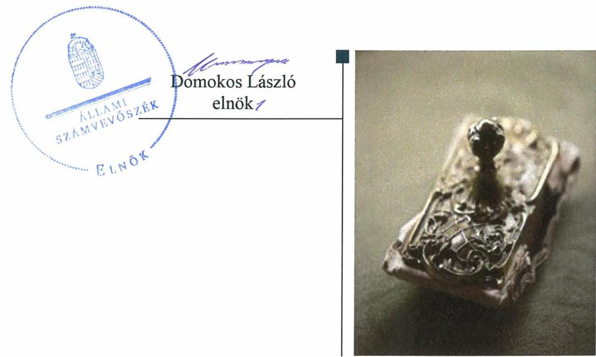
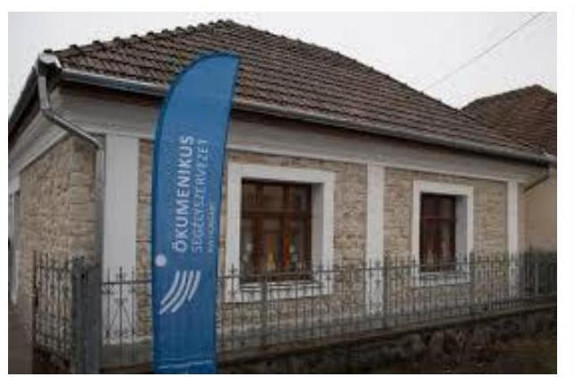
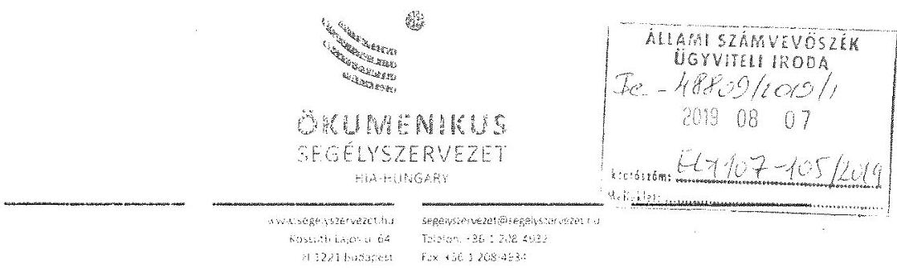
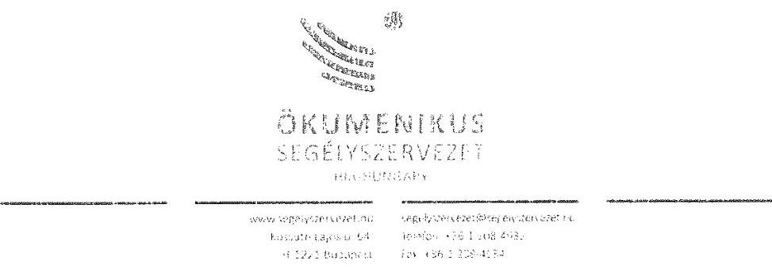
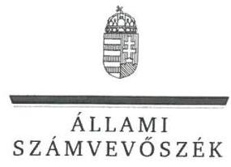
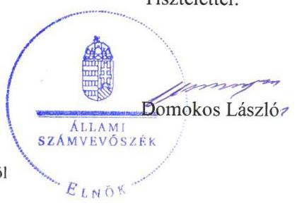

# Jelenetés 

## Nem állami humánszolgáltatók ellenőrzése

A humánszolgáltatást nyújtó államháztartáson kívüli szociális intézmények, szolgáltatók fenntartói központi költségvetésből kapott támogatásai felhasználásának ellenőrzése Magyar Ökumenikus Segélyszervezet 2019.

19190
www.asz.hu

---

# Jelenetés 

## Nem állami humánszolgáltatók ellenőrzése

A humánszolgáltatást nyújtó államháztartáson kívüli szociális intézmények, szolgáltatók fenntartói központi költségvetésből kapott támogatásai felhasználásának ellenőrzése Magyar Ökumenikus Segélyszervezet
2019. 02. hó 24. nap

---

# AZ ELLENŐRZÉST FELÜGYELTE:

- KAKAS SÁNDOR felügyeleti vezető
- TÓTH MARIANNA felügyeleti vezető

# AZ ELLENŐRZÉST VEZETTE ÉS A VÉGREHAJTÁSÁÉRT FELELŐS:

- HUDÁK KATALIN ellenőrzésvezető
- VERTKOVCZI MÁRIA ellenőrzésvezető

# A PROGRAM ÖSSZEÁLLÍTÁSÁÉRT FELELŐS:

- TÓTPÁL SZABOLCS osztályvezető

Jelentéseink az Országgyűlés számítógépes hálózatán és az Interneten a www.asz.hu címen is olvashatóak.

|  IKTATÓSZÁM: EL-2002-001/2019. | |
| --- | --- |
|  TÉMASZÁM: 2491 | |
|  ELLENŐRZÉS-AZONOSÍTÓ SZÁM: V083505 | |

---

# TARTALOMJEGYZÉK 

■ ÖSSZEGZÉS ..... 5
■ AZ ELLENŐRZÉS CÉLJA ..... 6
■ AZ ELLENŐRZÉS TERÜLETE ..... 7
■ AZ ELLENŐRZÉS HÁTTERE, INDOKOLTSÁGA ..... 8
■ A JELENTÉS LÉNYEGES KÉRDÉSKÖREI ..... 9
■ AZ ELLENŐRZÉS HATÓKÖRE ÉS MÓDSZEREI ..... 10
■ MEGÁLLAPÍTÁSOK ..... 12
■ JAVASLATOK ..... 14
■ MELLÉKLETEK ..... 15
I. sz. melléklet: Értelmező szótár ..... 15
■ FÜGGELÉKEK ..... 17
I. sz. függelék a jelentéshez ..... 17
II. sz. függelék: Észrevételek ..... 18
■ RÖVIDÍTÉSEK JEGYZÉKE ..... 25

---

.

---

# ÖSSZEGZÉS 

A Magyar Ökumenikus Segélyszervezet a központi költségvetési támogatásokat szabályszerűen tartotta nyilván. Éves számviteli beszámolók hiányában a közfeladatot ellátó intézményei működtetéséhez felhasznált közpénzekre vonatkozó gazdálkodása nem volt átlátható, elszámoltatható.

## Az ellenőrzés társadalmi indokoltsága

Az Állami Számvevőszék stratégiájában célul tűzte ki, hogy az államháztartáson kívülre nyújtott költségvetési támogatások ellenőrzésével hozzájárul ahhoz, hogy a közpénzeket az államháztartáson kívüli szervezetek is átlátható módon használják fel a közfeladatok szerződésben vállalt ellátása érdekében. Tekintettel az elmúlt években a szociális területet érintő finanszírozási változásokra, a társadalom fokozott érdeklődéssel figyeli a szociális feladatokra fordított források felhasználását. Fontos a közvélemény biztosítása arról, hogy a közpénz államháztartáson kívüli felhasználása ezen a területen sem marad ellenőrizetlenül. Az ellenőrzés eredményeképpen a nyilvánosság és a szolgáltatást igénybe vevők megfelelő tájékoztatást kaphatnak az államháztartáson kívüli közfeladatot ellátó működéséről.

A Magyar Ökumenikus Segélyszervezetnél végzett ellenőrzést indokolja az is, hogy a humánszolgáltatási közfeladat ellátására az ellenőrzött időszakban finanszírozási szerződések alapján több mint 1,2 milliárd Ft központi költségvetési támogatásban részesült.

## Főbb megállapítások, következtetések, javaslatok

A Magyar Ökumenikus Segélyszervezet a 2015-2017. években rendelkezett a jogszabályban előírt számviteli szabályzatokkal, nyilvántartásokkal, kialakította a szabályszerű működési és gazdálkodási feltételeket. A közfeladatot ellátó intézményei működtetéséhez kapott költségvetési támogatásokat szabályszerűen számolta el és tartotta nyilván.

A Magyar Ökumenikus Segélyszervezet a gazdálkodásáról éves számviteli beszámolókat nem készített a 2015-2017. években, ezért a közfeladatot ellátó intézményei működtetéséhez felhasznált közpénzekre vonatkozó gazdálkodása nem volt elszámoltatható, továbbá nem biztosította az Alaptörvényben előírt átláthatóság elvének érvényesülését.

Az Állami Számvevőszék a jelentésben foglalt megállapítások alapján a Magyar Ökumenikus Segélyszervezet ügyvezetőjének egy javaslatot fogalmazott meg. A javaslatokat megalapozó megállapításokra az érintettnek 30 napon belül intézkedési tervet kell készítenie.

---

# AZ ELLENŐRZÉS CÉLJA

**AZ ELLENŐRZÉS CÉLJA** annak értékelése, hogy a nem állami, nem önkormányzati szociális intézmények fenntartói központi költségvetésből kapott támogatásainak felhasználása szabályszerű volt-e, a támogatások igénylése, évközi módosítása és év végi elszámolása megfelel-e a jogszabályi előírásoknak.

---

# AZ ELLENŐRZÉS TERÜLETE 

## Magyar Ökumenikus Segélyszervezet

A Magyar Ökumenikus Segélyszervezetet 1991. évben a magyarországi református, evangélikus, metodista, ortodox és unitárius egyházak alapították. A Fenntartó ${ }^{1}$ Alapszabályban² rögzített célja, hogy a jelen kor társadalmi kihívásainak megfelelően, erősítse az alapítók társadalmi szolgálatát a hazai és nemzetközi humanitárius segítségnyújtás, a hazai és nemzetközi fejlesztés, a hazai szociális segítségnyújtás, valamint a kommunikáció és szemléletformálás területein, a legszélesebb ökumenikus összefogás alapján.

Közhasznú tevékenysége keretében a Fenntartó szociális alapszolgáltatást és szakosított ellátást, gyermekjóléti alapellátást biztosított, hátrányos helyzetű csoportok társadalmi esélyegyenlőségének elősegítését, egészségmegőrzést, betegségmegelőzést, gyógyító-, egészségügyi rehabilitációs tevékenységet végzett.

A Fenntartó a 2015-2017. években Magyarország több megyéjében 17 szociális humánszolgáltatási közfeladatot ellátó intézmény útján nappali intézményi ellátást és átmeneti szállást biztosított pszichiátriai betegek, szenvedélybetegek és hajléktalanok részére, alacsonyküszöbű ellátást és szociális étkeztetést biztosított, utcai szociális munkát végzett, családok átmeneti otthonában átmeneti ellátást, illetve éjjeli menedékhely ellátást biztosított.

Az ellenőrzött időszakban a Fenntartó egyesületi formában működött, döntéshozó szerve a Közgyűlés ${ }^{3}$ volt, az ügyvezetői feladatokat Elnök-igazgató ${ }^{4}$, a működésének és gazdálkodásának ellenőrzését öttagú Felügyelő szerv ${ }^{5}$ látta el. A Fenntartó szociális humánszolgáltatási ellátó intézményei nem voltak önálló jogi személyek.

A Fenntartó szociális alapszolgáltatási feladatokra, szociális szakosított ellátásra és gyermekjóléti alapellátásokra Magyarország éves költségvetéséből támogatási határozatok és finanszírozási szerződések alapján 2015-ben 376 M Ft, 2016-ban 414 M Ft és 2017-ben 448 M Ft összegű támogatást kapott.

---

# AZ ELLENŐRZÉS HÁTTERE, INDOKOLTSÁGA 

A szociális feladatokat ellátó nem állami intézményfenntartók részére közfeladataik ellátására évente jelentős összegű pénzügyi támogatást biztosítottak a mindenkori költségvetési törvények a bennük megfogalmazott feltételek mellett. A felhasználható állami támogatások a Kvtv.-ekben (a 2014. évi C. törvény Magyarország 2015. évi központi költségvetéséről, 2015. évi C. törvény Magyarország 2016. évi központi költségvetéséről, 2016. évi XC. törvény Magyarország 2017. évi központi költségvetéséről) a 2015-2017. években a szociális ágazatra vonatkozóan 273 Mrd Ft előirányzatot határoztak meg. Módosították a szociális igazgatásról és szociális ellátásokról szóló 1993. évi III. törvényt, amely - többek között - 2012. január 1-jei hatállyal megfogalmazta a finanszírozási rendszerbe történő befogadással összefüggő szabályokat.

Az ÁSZ ${ }^{6}$ stratégiájában foglaltak alapján is indokolt az ellenőrzés, amely a társadalom számára jelzi, hogy a közpénz államháztartáson kívüli felhasználása sem maradhat ellenőrizetlenül. Az államháztartáson kívülre nyújtott költségvetési támogatások ellenőrzésével az ÁSZ hozzájárul ahhoz, hogy a közpénzeket a nem állami humán fenntartók átlátható módon használják fel a közfeladatok ellátására kötött szerződésekben vállalt kötelezettségek teljesítése érdekében. Az ellenőrzés javaslataival hozzájárulhat az említett rendszerek szabályszerű támogatás felhasználásához, javíthatja a társadalmi-gazdasági döntések megalapozottságát, amely a „jól irányított állam" működéséhez járul hozzá.

A holisztikus megközelítés jegyében az ellenőrzés keretében egyedi kockázatelemzés alapján kiválasztott fenntartóknál és intézményeiknél értékeljük az államháztartáson kívüli szociális tevékenységhez kapcsolódó támogatások felhasználásának megfelelőségét.

---

# A JELENTÉS LÉNYEGES KÉRDÉSKÖREI 

1. A szociális humánszolgáltató közfeladatot ellátó fenntartó szabályszerű működési- és gazdálkodási környezet kialakításával megteremtette-e a költségvetési támogatások átlátható, elszámoltatható igénybevételének, felhasználásának feltételeit?
2. Az államháztartáson kívüli fenntartó az átvállalt szociális humánszolgáltatási közfeladathoz biztosított költségvetési támogatásokat szabályszerűen fordította-e a humánszolgáltató intézményei működtetésére?
3. Az államháztartáson kívüli fenntartó a szociális humánszolgáltató intézményei működtetéséhez felhasznált közpénzekre vonatkozó gazdálkodásával a nyilvánosság előtt elszámolt-e?

---

# AZ ELLENŐRZÉS HATÓKÖRE ÉS MÓDSZEREI 

## Az ellenőrzés típusa

Megfelelőségi ellenőrzés

## Az ellenőrzött időszak

A 2015. január 1-je és 2017. december 31-e közötti időszak A helyszíni szemle tekintetében 2018. január 1-jétől az utolsó helyszíni szemle időpontjáig, 2019. február 26-áig tartó időszak.

## Az ellenőrzés tárgya

Az ellenőrzés a szociális humánszolgáltatási közfeladatokat ellátó államháztartáson kívüli fenntartók, humánszolgáltatási közfeladatai ellátásához a költségvetési törvényekben biztosított központi költségvetési támogatások igénylése, évközi módosítása és év végi elszámolása fenntartói feladatainak ellátása, illetve e központi költségvetésből kapott támogatásaik humánszolgáltatási közfeladatokra való fenntartó általi felhasználása szabályszerűségének értékelésére terjed ki.

## Az ellenőrzött szervezet

- Magyar Ökumenikus Segélyszervezet

## Az ellenőrzés jogalapja

Az ellenőrzés jogszabályi alapját az ÁSZ tv. 1. § (3) bekezdése, 5. § (3) bekezdés, valamint az 5. § (11) bekezdés c) pontjában foglalt előírások adják.

## Az ellenőrzés módszerei

Az ellenőrzést az ellenőrzési program szempontjai, kérdései, az ellenőrzött időszakban hatályos jogszabályok, a nemzetközi standardokat irányadónak tekintve, az ellenőrzés szakmai szabályok és módszertanok figyelembe vételével végezte az ÁSZ. A közpénzekkel való felelős gazdálkodás segítésére irányuló javaslatok kidolgozásakor a hatályos jogszabályok voltak irányadóak.

---

Az ellenőrzés ideje alatt az ellenőrzött szervezettel történő kapcsolattartást az ÁSZ SZMSZ ${ }^{7}$-ének vonatkozó előírásai alapján biztosította az ÁSZ.

Az ellenőrzési kérdések megválaszolásához szükséges bizonyítékok megszerzése az ellenőrzött által rendelkezésre bocsátott dokumentumokra, adatokra alapozva megfigyelés, szemle (szemrevételezés), kérdésfeltevés (információkérés), valamint elemző eljárással történt.

Az ellenőrzési bizonyítékként felhasználható adatforrások közé tartoztak egyrészt az ellenőrzési program részletes szempontjainál felsorolt adatforrások, másrészt minden - az ellenőrzés folyamán feltárt, az ellenőrzés szempontjából információt tartalmazó - dokumentum.

Az ellenőrzés lefolytatásához az ellenőrzött szervezet a kitöltött tanúsítványok, valamint az ÁSZ által kért dokumentumok elektronikus úton való megküldésével szolgáltatott adatokat, információkat. Az így rendelkezésre bocsátott adatok, információk és a tanúsítványok adatai valódiságának kontrollja az ellenőrzés keretében történt.

Az egységes értelmezést támogatja a program mellékletét képező fogalomtár és rövidítésjegyzék.

Az ellenőrzést alapvetően a szociális humánszolgáltatások esetében a központi költségvetési támogatások igénylésével, módosításával, felhasználásával, elszámolásával kapcsolatos feladatokat ellátó államháztartáson kívüli fenntartóknál/szervezeteinél végeztük. A fenntartott intézményeknél helyszíni szemle keretében győződtünk meg a tényleges feladatellátásról (verifikáció).

A szociális humánszolgáltatások központi költségvetési támogatásai igénylésével, módosításával, elszámolásával kapcsolatos, államháztartáson kívüli fenntartó jogszabályokban előírt feladatai betartását, továbbá a központi költségvetési támogatások szabályszerű kezelését, nyilvántartását ellenőriztük a fenntartónál, az ott rendelkezésre álló határozatok, nyilvántartások, beszámolók és egyéb dokumentumok alapján. Az ellenőrzés nem terjedt ki a szociális humánszolgáltatások központi költségvetési támogatásai igénylése, módosítása, elszámolása valódiságának, megalapozottságának, helyességének - sem a fenntartónál, sem a székhely intézményeinél való - értékelésére (mivel ennek felülvizsgálata, ellenőrzése a finanszírozó jogszabályban előírt feladata, határozatai kiadása előtt). Továbbá nem terjedt ki az ellenőrzés e források, intézmények általi szabályszerű felhasználásának értékelésére.

---

# MEGÁLLAPÍTÁSOK 

## 1. A szociális humánszolgáltató közfeladatot ellátó fenntartó szabályszerű működési- és gazdálkodási környezet kialakításával megteremtette-e a költségvetési támogatások átlátható, elszámoltatható igénybevételének, felhasználásának feltételeit?

Összegző megállapítás A Fenntartó a működési- és gazdálkodási környezetét szabályszerűen kialakította.

A Ptk.-ban ${ }^{8}$ előírtak szerint a Fenntartó alapításáról az Alapszabályban rendelkeztek. A Fenntartó szervezetének felépítését, működésének rendjét, a felelősségi hatásköröket az SZMSZ ${ }_{1-4}{ }^{9}$ tartalmazta.

A Fenntartó a Számlarendjét ${ }_{1-2}{ }^{10}$, továbbá a Számviteli politikáját ${ }_{1-2}{ }^{11}$ és annak keretében az Eszközök és források leltárkészítési és leltározási szabályzatát ${ }_{1-2}{ }^{12}$, Pénzkezelési szabályzatát ${ }_{1-2}{ }^{13}$, Eszközök és források értékelési szabályzatát ${ }_{1-2}{ }^{14}$ a Számv. tv. ${ }^{15}$ előírásai szerint elkészítette.

A Fenntartó a költségvetési támogatások és azok célszerinti felhasználásának elkülönített nyilvántartását a Civilszr ${ }_{1,2}$-ben ${ }^{16,17}$ foglalt előírásoknak eleget téve kialakította. A költségvetési támogatások igénylési, módosítási és elszámolási feladatait a Fenntartó az Atr.-ben ${ }^{18}$ és a Civil tv. ${ }^{19}$-ben foglaltak alapján szabályszerűen látta el.

## 2. Az államháztartáson kívüli fenntartó az átvállalt szociális humánszolgáltatási közfeladathoz biztosított költségvetési támogatásokat szabályszerűen fordította-e a humánszolgáltató intézményei működtetésére?

Összegző megállapítás A Fenntartó az átvállalt szociális humánszolgáltatási közfeladathoz biztosított költségvetési támogatásokat szabályszerűen tartotta nyilván és számolta el.

A Fenntartó a humánszolgáltatási közfeladathoz biztosított költségvetési támogatásokat a Számv. tv.-ben és a Civil tv.-ben foglaltak szerint támogatásonként elkülönítetten tartotta nyilván. A költségvetési támogatásokat a Fenntartó az Atr.-ben és Számv. tv.-ben foglaltak alapján feladatonkénti bontásban elkülönítetten kezelte.

A Fenntartó meghatározta a humánszolgáltatást végző intézményei alapfeladatit és működési kereteit, a
 szociális intézményei rendelkeztek az $\mathrm{SzCsM}^{20}$ rendeletben és az SZMSZ-ben előírt szabályzatokkal. A Fenntartó biztosította a szociális humánszolgáltatást ellátó intézményei részére a közfeladat ellátáshoz szükséges személyi, tárgyi és működési feltételeket.

---

# 3. Az államháztartáson kívüli fenntartó a szociális humánszolgáltató intézményei működtetéséhez felhasznált közpénzekre vonatkozó gazdálkodásával a nyilvánosság előtt elszámolt-e? 

Összegző megállapítás A Fenntartó a felhasznált közpénzekre vonatkozó gazdálkodásával nem számolt el a nyilvánosság előtt.

A Fenntartó a 2015-2017. években a Számv. tv. 4. § (1) bekezdésében, a Civil. tv. 28. (1) bekezdésében foglaltak ellenére nem készített éves számviteli beszámolót.

---

# JAVASLATOK 

Az ÁSZ tv. 33. § (1) bekezdésében foglaltak értelmében az ellenőrzött szervezet vezetője köteles a jelentésben foglalt megállapításokhoz kapcsolódó intézkedési tervet összeállítani és azt a jelentés kézhezvételétől számított 30 napon belül az ÁSZ részére megküldeni. Amennyiben az ellenőrzött szervezet vezetője nem küldi meg határidőben az intézkedési tervet, vagy továbbra sem elfogadható intézkedési tervet küld, az Állami Számvevőszék elnöke az ÁSZ tv. 33. § (3) bekezdése a) és b) pontjaiban foglaltakat érvényesítheti.

## a Magyar Ökumenikus Segélyszervezet ügyvezetőjének

1. $\quad$ Tegyen eleget a beszámoló készítési kötelezettségének a jogszabályi előírások szerint.
(3. sz. megállapítás 1. bekezdése alapján)

---

# MELLÉKLETEK 

- I. SZ. MELLÉKLET: ÉRTELMEZŐ SZÓTÁR
humánszolgáltatás
költségvetési támogatás
nem állami, nem önkormányzati (államháztartáson kívüli) intézmény fenntartó
telephely

Külön törvényben meghatározott szociális, gyermekjóléti, gyermekvédelmi, közoktatási, felsőoktatási, kulturális közfeladatok (2014. évi Kvtv. 34. § (1), (4) bekezdés, 1. számú melléklet XX/20/2. alcím, 19. alcím, 2015. évi Kvtv. 43. § (1), (4) bekezdés, 1. számú melléklet XX/20/2/3. jogcím csoport, 19. alcím, 2016. évi Kvtv. 41. § (1), (4) bekezdés, 1. számú melléklet XX/20/2/3. jogcím csoport, 19. alcím.
A társadalombiztosítás pénzügyi alapjai kivételével az államháztartás központi alrendszeréből ellenérték nélkül, pénzben nyújtott támogatások (Áht. 21 1. § 14. pont).
A költségvetési törvényekben (2013. évi CCXXX. törvény 33-34. §, 2014. évi C. törvény 42-43. §, 2015. évi C. törvény 40-41. §) megállapított támogatás. Például a 2015. évi C. törvény 40-41. § szerint többek között: Az Országgyűlés a szociális, gyermekjóléti, gyermekvédelmi közfeladatot ellátó intézményt, szolgáltatást fenntartó egyházi jogi személy, civil szervezet, közalapítvány, országos nemzetiségi önkormányzat, települési vagy területi nemzetiségi önkormányzat, gazdasági társaság, és a humánszolgáltatást alaptevékenységként végző, az Szja tv. hatálya alá tartozó egyéni vállalkozó (a továbbiakban együtt: nem állami szociális fenntartó) részére támogatást állapít meg a következők szerint: a támogatás a nem állami szociális fenntartót a települési önkormányzatok 2. melléklet III. pont 3. alpont c)-k) pontjában és III. pont 5. alpont a) pontjában meghatározott támogatásaival azonos jogcímeken, összegben és feltételek mellett illeti meg. A szociális, gyermekjóléti és gyermekvédelmi közfeladatokat /humánszolgáltatásokat ellátó intézményt fenntartó egyházi jogi személy, társadalmi szervezet, alapítvány, közalapítvány, civil szervezet, országos nemzetiségi önkormányzat, nonprofit gazdasági társaság, gazdasági társaság és a humánszolgáltatást alaptevékenységként végző, Szja tv. hatálya alá tartozó egyéni vállalkozó. (2013. évi Kvtv. 35. § (1), (3) bekezdés, 2014. évi Kvtv. 33. §, 34. § (1), (4) bekezdés, 2015. évi Kvtv. 42. §, 43. § (1), (4) bekezdés, 2016. évi Kvtv. 40. §, 41. § (1), (4) bekezdés, 2017. évi Kvtv. 41. § (1), (4))
a szolgáltató székhelyétől különböző, szolgáltató/intézmény használatában álló hely, a szociális humánszolgáltatáshoz használt, bejegyzett hely. (Sznyvhr. 1.§ I) pont) (hatályos: 2015. január 1-től)

---

.

---

# FÜGGELÉKEK 

- I. SZ. FÜGGELÉK A JELENTÉSHEZ

Az Állami Számvevőszék az ellenőrzések során feltárt tényekhez kapcsolódó további körülmények tisztázására eszközrendszerrel nem rendelkezik. Amennyiben az ellenőrzésen túlmutatóan indokoltnak látszik az ellenőrzés során feltárt körülmények további vizsgálata, az Állami Számvevőszék törvényi felhatalmazás alapján az ellenőrzés által feltárt körülményeket továbbítja a hatáskörrel rendelkező szervnek a szükséges intézkedések megtétele, eljárások lefolytatása érdekében.

Az ellenőrzés feltárta, hogy a Fenntartó a 2015-2017. években a Számv. tv. 4. § (1) bekezdésében és a Civil tv. 28. § (1) bekezdésében foglaltak ellenére nem készített hiteles éves számviteli beszámolót. Ezáltal a Fenntartó a vagyoni és pénzügyi helyzetéről, működéséről nem adott megbízható és valós összképet. Hiteles beszámolók hiányában nem igazolt, hogy a közhiteles nyilvántartásba érvényes, hiteles adatok kerültek, ezért a közzétett adatok megtévesztőek.

Az eset konkrét körülményeinek feltárására a Fővárosi Törvényszéknek és a Nemzeti Adó- és Vámhivatalnak van hatásköre.

---

A jelentéstervezetet a Számvevőszék 15 napos észrevételezésre megküldte az ellenőrzött szervezet vezetőjének az ÁSZ tv. 29. §* (1) bekezdése előírásának megfelelően.

Az ÁSZ a jelentéstervezetet észrevételezésre megküldte a Magyar Ökumenikus Segélyszervezet elnök-igazgatója részére.
A Magyar Ökumenikus Segélyszervezet elnök-igazgatója az ÁSZ tv. 29. § (2) bekezdésében foglalt észrevételezési jogával élt, a jelentéstervezet megállapításaira a törvényes határidőn belül észrevételt tett.
A Magyar Ökumenikus Segélyszervezet elnök-igazgatója észrevételét és az arra adott választ a függelék tartalmazza.

[^0]
[^0]:    * 29. § (1) Az Állami Számvevőszék az ellenőrzési megállapításait megküldi az ellenőrzött szervezet vezetőjének vagy az általa megbízott személynek, és annak, akinek személyes felelősségét állapította meg.
    (2) Az ellenőrzött szervezet vezetője és a felelősként megjelölt személy az ellenőrzés megállapításaira tizenöt napon belül írásban észrevételt tehet.
    (3) Az Állami Számvevőszék az észrevételre a beérkezésétől számított harminc napon belül írásban válaszol. A figyelembe nem vett észrevételeket köteles a jelentésben feltüntetni, és megindokolni, hogy azokat miért nem fogadta el.

---

# Domokos László 

elnök úr részére

## Állami Számvevőszék

Budapest 4.
Pf. 54.
1364

Tárgy: Jelentéstervezetre vonatkozó észrevétel (ikt. szám: EL-1107-102/2019.)

## Tisztelt Elnök Úr!

Köszönettel kézhez vettük az Állami Számvevőszék fenti iktatási számú jelentéstervezetét, amelynek vonatkozásában a Magyar Ökumenikus Segélyszervezet a következő észrevételeket teszi:

A jelentéstervezet több helyen is - leghangsúlyosabban a „Megállapítások" 3. pontjában (13. oldal) - azt tartalmazza, hogy a „Fenntartó a 2015-2017. években a Számv. tv. 4. § (1) bekezdésében, a Civil tv. 28. § (1) bekezdésében foglaltak ellenére nem készített éves számviteli beszámolót".

A fenti megállapítást a leghatározottabban vitatni kívánjuk, tekintettel arra, hogy a Segélyszervezet minden évben, így a 2015-2017. években is elkészítette és a jogszabályi előírásoknak megfelelően határidőben közzétette a Számv. tv. 4. § (1) bek. és a Civil tv. 28. § (1) bek. szerinti éves beszámolóját. Tekintettel arra, hogy az éves beszámoló elfogadása a Segélyszervezet alapszabályának 10.1 pontja alapján a közgyűlés kizárólagos hatáskörébe tartozik, a Segélyszervezet a közzététel során minden alkalommal csatolta a vonatkozó közgyűlési jegyzőkönyvet, amelyet a levezető elnök, a jegyzőkönyvvezető és a jegyzőkönyv-hitelesítők is aláírásukkal hitelesítettek.

A közzétételre egyebekben a civil szervezetek bírósági nyilvántartásáról és az ezzel összefüggő eljárási szabályokról szóló 2011. évi CLXXXI. törvény (Cny tv.) 40. § (1), (4)-(5) bekezdéseinek megfelelően került sor. A Cnytv. hivatkozott rendelkezései előírják, hogy
(1) „Ha a szervezet a beszámolót elektronikus úton küldi meg az OBH részére, ennek során nincs helye a papír alapú beszámoló képi formátumú elektronikus okirattá történő átalakításánál."
(4) „A beszámolót a szervezetnek - a szervezet nyilvántartásba bejegyzett képviselője kivételével meghatalmazással igazolt - képviselője küldi meg az OBH részére."
(5) „Ha a szervezet a beszámolóról - külön jogszabály szerint arra feljogosított által aláírt - papír alapú okirat alapján határozott, úgy a (4) bekezdés szerinti személy egyben igazolja, hogy az ezt követően elektronikus úton megküldött beszámoló megegyezik a jóváhagyott beszámolóval.

---

Ebben az esetben a (4) bekezdés szerinti személy a papír alapú beszámoló egy eredeti példányát annak elfogadásától számított tíz évig megőrzi, és amennyiben a megküldött beszámoló szabályszerűségével összefüggésben kétség merülne fel, köteles azt a bíróság, illetve a törvényességi ellenőrzést folytató ügyészség indítványára bemutatni."

A Segélyszervezet a beszámolói közzététele során a fentieknek megfelelően járt el, amelynek igazolására mellékelten csatolja a vonatkozó és az OBH részére az éves beszámolókkal egyidejűleg - külön fájlban, a papír alapú irat átalakított elektronikus másolataiként - megküldött közgyűlési jegyzőkönyveket, valamint az önálló képviseleti joggal rendelkező elnök-igazgatótól származó, a beszámolók benyújtására vonatkozó meghatalmazásokat.

A fentieken túlmenően a beszámolók minden évre vonatkozóan tartalmazzák a KPMG Hungária Kft. független könyvvizsgálói jelentését, amely szerint „az éves beszámoló megbízható és valós képet ad a Segélyszervezet (tárgyévben) fennálló vagyoni és pénzügyi helyzetéről, valamint a (tárgyévre) vonatkozó jövedelmi helyzetéről a Magyarországon hatályos, a számvitelről szóló 2000. évi C. törvénnyel összhangban".

A Segélyszervezet az Állami Számvevőszék ellenőrzése során mindhárom beszámolóját rendelkezésre bocsátotta oly módon, hogy a megadott felületre a következő neveken feltöltötte:

- mösz számviteli beszámoló 2015.pdf
- mösz számviteli beszámoló 2016.pdf
- mösz számviteli beszámoló 2017.pdf

A feltöltött beszámolók megegyeznek az OBH részére a Cnytv. fent hivatkozott rendelkezéseinek megfelelően megküldött és az OBH által közzétett elektronikus iratokkal.

Itt kívánjuk megjegyezni, hogy a Tisztelt Számvevőszék a Segélyszervezet által feltöltött dokumentumok vonatkozásában több alkalommal is hiánypótlási felhívást közölt, azonban a 2015-2017. évi számviteli beszámolókkal formai kifogást nem fogalmazott meg.

A fentieken túlmenően a Segélyszervezet elnök-igazgatója az ellenőrzés során, 2018. szeptember 18-án nyilatkozott, hogy a Segélyszervezet intézményei nem önálló jogi személyek, így külön számviteli beszámolókkal nem rendelkeznek, továbbá 2018. szeptember 19-én a benyújtott dokumentumok vonatkozásában teljességi és hitelességi nyilatkozatot tett.

Végezetül hangsúlyozni szeretnénk, hogy amennyiben a Segélyszervezet az ellenőrzés során esetlegesen - bármely okból - nem megfelelő formában bocsátotta a Tisztelt Számvevőszék rendelkezésére a 2015-2017. évekre vonatkozó számviteli beszámolót, ebben az esetben sem állapítható meg az, hogy a Segélyszervezet „a közpénzekre vonatkozó gazdálkodásával nem számolt el a nyilvánosság előtt" illetőleg „nem készített éves beszámolót". Ezek a kijelentések ugyanis teljességgel ellentétben állnak azzal a ténnyel, hogy a Segélyszervezet beszámolási és közzétételi kötelezettségének a jogszabályoknak megfelelően és az OBH által is igazoltan teljes körűen eleget tett.

---

Mindezek alapján kérjük, nagy a jelentéstervezetet felülvizsgálni és a fentieknek megfelelően módosítani, illetve amennyiben a fentiek alátámasztására további dokumentumok becsatolása szükséges, úgy azt közölni szíveskedjenek.

Budapest, 2019. július 30.

Tisztelettel:

Mellékletek:

1. Könyvvizsgálattal alátámasztott 2015-2017. évi számviteli beszámolók (Egyszerűsített éves beszámoló és közhasznúsági melléklet)
2. 2015-2017. évi számviteli beszámolóval egyidejűleg benyújtott közgyűlési jegyzőkönyvek
3. 2018. szeptember 18-án kelt nyilatkozat
4. 2018. szeptember 19-én kelt teljességi és hitelességi nyilatkozat

---

ELNÖK

Ikt.szám: EL-1107-106/2019.

# Lehel László 

elnök-igazgató
Magyar Ökumenikus Segélyszervezet

## Budapest

## Tisztelt Elnök-igazgató Úr!

A ,,Nem állami humánszolgáltatók ellenőrzése - A humánszolgáltatást nyújtó államháztartáson kívüli szociális intézmények, szolgáltatók fenntartói központi költségvetésből kapott támogatásai felhasználásának ellenőrzése - Magyar Ökumenikus Segélyszervezet" címmel készített számvevőszéki jelentéstervezetre tett észrevételeit megkaptam.
Az Állami Számvevőszék észrevételekre vonatkozó álláspontjáról a felügyeleti vezető által készített részletes tájékoztatást csatoltan megküldöm.
Tájékoztatom Elnök-igazgató urat, hogy a számvevőszéki jelentésben - az Állami Számvevőszékről szóló 2011. évi LXVI. törvény 29. § (3) bekezdése alapján - a figyelembe nem vett észrevételeket szerepeltetjük az elutasítás indokának feltüntetésével.

Budapest, 2019. 08 hó 29 nap

Tisztelettel:

Melléklet: Tájékoztatás az észrevételek kezeléséről

---

# Tájékoztatás az észrevételek kezeléséről 

A „Nem állami humánszolgáltatók ellenőrzése - A humánszolgáltatást nyújtó államháztartáson kívüli szociális intézmények, szolgáltatók fenntartói központi költségvetésből kapott támogatásai felhasználásának ellenőrzése - Magyar Ökumenikus Segélyszervezet"
 című jelentéstervezetre (továbbiakban: jelentéstervezet) a 2019. július 30-án kelt levelében megküldött észrevételeit áttekintettem. Az észrevételek kezeléséről az alábbi tájékoztatást adom.

## 1) Észrevétel a számviteli beszámoló készítésére vonatkozóan (Jelentéstervezet 3. sz. megállapítás)

Elnök-igazgató úr észrevételében vitatta az Állami Számvevőszék jelentéstervezetének azon megállapítását, hogy a Magyar Ökumenikus Segélyszervezet (továbbiakban: MÖSSZ) a 2015-2017. évekről nem készített éves számviteli beszámolót. Elmondása szerint a MÖSSZ 2015-2017. évi számviteli beszámolóit a számvitelről szóló 2000. évi C. törvény (továbbiakban: Számv. tv.) 4. § (1) bekezdésben és az egyesülési jogról, a közhasznú jogállásról, valamint a civil szervezetek működéséről és támogatásáról szóló 2011. évi CLXXV. törvény (továbbiakban: Civil tv.) 28. § (1) bekezdésében foglaltaknak megfelelően elkészítették és a jogszabályi előírásoknak megfelelően közzétették. Az éves beszámoló elfogadása a MÖSSZ alapszabályának 10.1 pontja szerint a közgyűlés kizárólagos hatáskörébe tartozik, ezért a közzététel során minden alkalommal csatolták annak elfogadásáról a vonatkozó közgyűlési jegyzőkönyvet, amelyet a levezető elnök, a jegyzőkönyvvezető és a jegyzőkönyv hitelesítők aláírásukkal hitelesítettek.
Elmondta továbbá, hogy a közzétételre egyebekben a civil szervezetek bírósági nyilvántartásáról és az ezzel összefüggő eljárási szabályokról szóló 2011. évi CLXXXI. törvény (továbbiakban: Cnytv.) 40. § (1), (4)-(5) bekezdéseinek megfelelően került sor. A MÖSSZ az ellenőrzési adatszolgáltatás során a 2015-2017. évi számviteli beszámolókat rendelkezésre bocsájtotta, amelyek megegyeznek az OBH részére a Cnytv. rendelkezéseinek megfelelően megküldött és az OBH által közzétett elektronikus iratokkal.
Az észrevételére válaszolva tájékoztatom, hogy észrevételét az alábbiakra tekintettel nem fogadjuk el. A Civil tv. 30. § (6) bekezdése kimondja, hogy a civil szervezet beszámolójára egyebekben a számvitelről szóló törvény, valamint az annak felhatalmazása alapján kiadott kormányrendelet előírásait kell alkalmazni. A Számv. tv. 20. § (6) bekezdése szerint az éves beszámoló részét képező mérleget, eredménykimutatást és kiegészítő mellékletet a hely és a kelte feltüntetésével a vállalkozó képviseletére jogosult személy köteles aláírni, amely jogszabályhely alkalmazásának szükségességét a MÖSSZ 2017. január 1-től hatályos számviteli politikájának III.1. pontja is megerősíti.

---

Az ÁSZ kapcsolódó adatbekérésére beküldött dokumentumok sem az elnök-igazgató aláírását, sem a beszámoló közgyűlés általi elfogadásáról készült hiteles jegyzőkönyvek másolatát nem tartalmazták, így hiteles dokumentumként nem kerültek elfogadásra. Az ÁSZ az ellenőrzési megállapításait az adatszolgáltatás során a részére törvényi határidőben rendelkezésre bocsátott dokumentumokra alapozva fogalmazza meg. Fentiekre tekintettel az észrevételét nem fogadom el, a jelentéstervezet módosítása nem indokolt.

Budapest, 2019. hó nap

Kakas Sándor
felügyeleti vezető

---

# RÖVIDÍTÉSEK JEGYZÉKE 

${ }^{1}$ Fenntartó
${ }^{2}$ Alapszabály
${ }^{3}$ Közgyűlés
${ }^{4}$ Elnök-igazgató
${ }^{5}$ Felügyelő szerv
${ }^{6}$ ÁSZ
${ }^{7}$ ÁSZ SZMSZ
${ }^{8}$ Ptk.
${ }^{9} \mathrm{SZMSZ}_{1-4}$

## ${ }^{10}$ Számlarend $_{1-2}$

${ }^{11}$ Számviteli politika $_{1-2}$
${ }^{12}$ Eszközök és források leltárkészítési és leltározási szabályzata ${ }_{1-2}$
${ }^{13}$ Pénzkezelési szabályzat ${ }_{1-2}$

Magyar Ökumenikus Segélyszervezet
A Magyar Ökumenikus Segélyszervezet módosításokkal egységes szerkezetbe foglalt Alapszabálya (hatályos: 2014. május 28-ától 2015. május 27-éig)
A Magyar Ökumenikus Segélyszervezet módosításokkal egységes szerkezetbe foglalt Alapszabálya (hatályos: 2015. május 28-ától)
Magyar Ökumenikus Segélyszervezet Közgyűlése
Magyar Ökumenikus Segélyszervezet Elnök-igazgatója
Magyar Ökumenikus Segélyszervezet Felügyelő szerve
Állami Számvevőszék
Állami Számvevőszék Szervezeti és Működési Szabályzata
2013. évi V. törvény a Polgári Törvénykönyvről
(hatályos: 2014. április 15-étől)
Ökumenikus Segélyszervezet HIA-Hungary Szervezeti és működési szabályzat ${ }_{1}$ (hatályos: 2015. január 1. és 2015. november 17. között)
Ökumenikus Segélyszervezet HIA-Hungary Szervezeti és működési szabályzat ${ }_{2}$ (hatályos: 2015. november 18. és 2016. január 25. között)
Ökumenikus Segélyszervezet HIA-Hungary Szervezeti és működési szabályzat ${ }_{3}$ (hatályos: 2016. január 26. és 2017. február 5. között)
Ökumenikus Segélyszervezet HIA-Hungary Szervezeti és működési szabályzat ${ }_{4}$ (hatályos: 2017. február 6-ától)
Ökumenikus Segélyszervezet HIA-Hungary Számviteli szabályzat ${ }_{1}$ Számlakeret, Számlarend
(hatályos: 2012. január 1-jétől 2016. december 31-éig)
Ökumenikus Segélyszervezet HIA-Hungary Számviteli szabályzat ${ }_{2}$ Számlakeret, Számlarend
(hatályos: 2017. január 1-jétől)
Ökumenikus Segélyszervezet HIA-Hungary Számviteli szabályzat ${ }_{1}$ - Számviteli politika (hatályos: 2012. január 1-jétől 2016. december 31-éig)
Ökumenikus Segélyszervezet HIA-Hungary Számviteli szabályzat ${ }_{1}$ - Számviteli politika (hatályos: 2017. január 1-jétől)
Ökumenikus Segélyszervezet HIA-Hungary Számviteli szabályzat ${ }_{1}$ - Eszközök és források leltározási és leltárkezelési szabályzata (hatályos: 2012. január 1-jétől 2016. december 31-éig)
Ökumenikus Segélyszervezet HIA-Hungary Számviteli szabályzat ${ }_{2}$ - Eszközök és források leltározási és leltárkezelési szabályzata (hatályos: 2017. január 1-jétől)
Ökumenikus Segélyszervezet HIA-Hungary Számviteli szabályzat ${ }_{1}$ Pénzkezelési szabályzat
(hatályos: 2012. január 1-jétől 2016. december 31-éig)
Ökumenikus Segélyszervezet HIA-Hungary Számviteli szabályzat ${ }_{2}$ Pénzkezelési szabályzat (hatályos: 2017. január 1-jétől)

---

${ }^{14}$ Eszközök és források értékelési szabályzata1-2 Ökumenikus Segélyszervezet HIA-Hungary Számviteli szabályzat1- Eszközök és források értékelési szabályzata
(hatályos: 2012. január 1-jétől 2016. december 31-éig)
Ökumenikus Segélyszervezet HIA-Hungary Számviteli szabályzat2 - Eszközök és források értékelési szabályzata (hatályos: 2017. január 1-jétől)
${ }^{15}$ Számv. tv.
${ }^{16}$ Civilszr ${ }_{1}$
${ }^{17}$ Civilszr $r_{2}$
${ }^{18}$ Atr.
${ }^{19}$ Civil tv.
${ }^{20}$ SzCsM rendelet
${ }^{21}$ Áht.
2000. évi C. törvény a számvitelről (hatályos: 2001. január 1-jétől)
224/2000. (XII. 19.) Korm. rendelet az egyes egyéb szervezetek beszámoló készítési és könyvvezetési kötelezettségének sajátosságairól (hatályos: 2016. december 31-ig)
479/2016. (XII. 28.) Korm. rendelet a számviteli törvény szerinti egyes egyéb szervezetek beszámoló készítési és könyvvezetési kötelezettségének sajátosságairól (hatályos: 2017. január 1-jétől)
489/2013. (XII. 18.) Korm. rendelet az egyházi és nem állami fenntartású szociális, gyermekjóléti és gyermekvédelmi szolgáltatók, intézmények és hálózatok állami támogatásáról
2011. évi CLXXV. tv. az egyesülési jogról, a közhasznú jogállásról, valamint a civil szervezetek működéséről és támogatásáról (hatályos: 2011. december 22-étől)
1/2000. (I.7.) a személyes gondoskodást nyújtó szociális intézmények szakmai feladatairól és működésük feltételeiről
2011. évi CXCV. törvény az államháztartásról
(hatályos: 2011. december 31-étől)

---

# ÁLLAMI SZÁMVEVŐSZÉK 

1052 Budapest, Apáczai Csere János utca 10.
Levélcím: 1364 Budapest 4. Pf. 54
Telefon: +36 14849100 Telefax: +36 14849200
www.asz.hu
