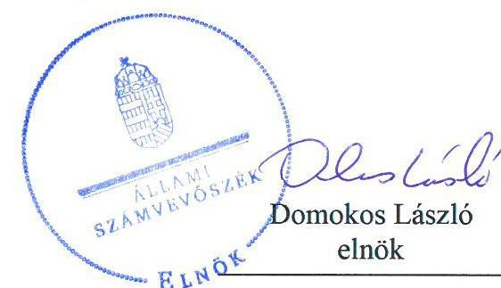
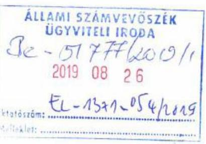
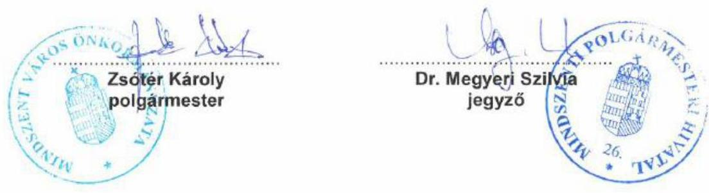
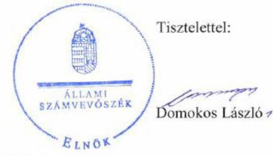
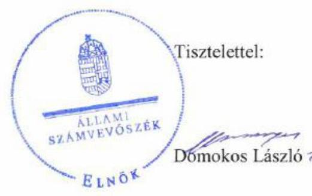

# Jelentés 

## Önkormányzatok ellenőrzése Integritás- és belső kontrollrendszer

Mindszent Város Önkormányzata 2019.

---

# Jelentés 

## Önkormányzatok ellenőrzése - Integritás- és belső kontrollrendszer

Mindszent Város Önkormányzata 2019. No. hó 29. nap

---

# AZ ELLENŐRZÉST FELÜGYELTE:

DR. NAGY IMRE felügyeleti vezető

# AZ ELLENŐRZÉST VEZETTE ÉS A VÉGREHAJTÁSÁÉRT FELELŐS:

GÁL MAGDOLNA ellenőrzésvezető

# A PROGRAM ÖSSZEÁLLÍTÁSÁÉRT FELELŐS:

TÓTPÁL SZABOLCS osztályvezető

---

IKTATÓSZÁM: EL-2013-001/2019

TÉMASZÁM: 2485

---

Jelentéseink az Országgyűlés számítógépes hálózatán és az Interneta a www.asz.hu címen is olvashatóak.

---

ELLENŐRZÉS-AZONOSÍTÓ SZÁM: V082958

---

# TARTALOMJEGYZÉK 

■ ÖSSZEGZÉS ..... 5
■ AZ ELLENŐRZÉS CÉLJA ..... 6
■ AZ ELLENŐRZÉS TERÜLETE ..... 7
■ AZ ELLENŐRZÉS HÁTTERE, INDOKOLTSÁGA ..... 8
■ A JELENTÉS LÉNYEGES KÉRDÉSKÖREI ..... 9
■ AZ ELLENŐRZÉS HATÓKÖRE ÉS MÓDSZEREI ..... 10
■ MEGÁLLAPÍTÁSOK ..... 12
■ JAVASLATOK ..... 14
■ MELLÉKLETEK ..... 17
I. sz. melléklet: Értelmező szótár ..... 17
■ FÜGGELÉKEK ..... 19
I. sz. függelék a jelentéshez ..... 19
II. sz. függelék: Észrevételek ..... 20
■ RÖVIDÍTÉSEK JEGYZÉKE ..... 35

---

.

---

# ÖSSZEGZÉS 

Mindszent Város Önkormányzata belső kontrollrendszerének kialakítása és müködtetése nem volt szabályszerű, így nem volt biztosított az átlátható, elszámoltatható közpénz felhasználás, a nemzeti vagyonnal való felelős gazdálkodás. A müködés során az integritás szemlélet nem érvényesült.

## Az ellenőrzés társadalmi indokoltsága

Az Állami Számvevőszék alapvető feladata a közpénzekkel, az állami és önkormányzati vagyonnal való gazdálkodás ellenőrzése. Az Alaptörvény szerint az önkormányzatok kötelezettsége a kiegyensúlyozott, átlátható és fenntartható költségvetési gazdálkodás elvének érvényesítése, a nemzeti vagyonnal való rendeltetésszerű és felelős módon való gazdálkodás biztosítása. Az Állami Számvevőszék stratégiájában megfogalmazott célkitűzése az integritás alapú, átlátható és elszámoltatható közpénzfelhasználás elősegítése. Ennek megvalósítása érdekében az Állami Számvevőszék prioritásként kezeli a közpénzzel gazdálkodó szervezetek esetében a belső kontrollrendszer működésének ellenőrzését.

## Főbb megállapítások, következtetések

Mindszent Város Önkormányzata belső kontrollrendszerének kialakítása és müködtetése a 2017. évben nem volt szabályszerű.

A kontrollkörnyezet nem támogatta Mindszent Város Önkormányzata szabályszerű működését és gazdálkodását, nem gondoskodtak gazdasági program és iratkezelési szabályzat elkészítéséről. Az integrált kockázatkezelés eljárásrendjét nem alakította ki, kockázatelemzéseket nem végzett. A kontrolltevékenységek gyakorlása nem volt szabályszerű, ezáltal a szabályszerű közpénzfelhasználás, a nemzeti vagyonnal való rendeltetésszerű és felelős módon történő gazdálkodás feltételei nem voltak biztosítottak. Mindszent Város Önkormányzatánál az információs és kommunikációs rendszer működtetése nem volt szabályszerű, mivel nem alakított ki olyan rendszereket, amelyek biztosították, hogy a megfelelő információk a megfelelő időben eljussanak az illetékes szervezethez, szervezeti egységhez, illetve személyhez. A belső és a külső ellenőrzések nyilvántartásának hiányosságai miatt a monitoring rendszer működtetése nem volt szabályszerű, így nem volt biztosított az ellenőrzések hasznosulása, az intézkedések nyomon követése.

Mindszent Város Önkormányzata a szervezet integritását támogató kontrollokat nem építette ki, a szervezeti teljesítmény mérésére alkalmas követelményeket nem alakította ki, így a teljesítmény mérésének lehetőségét nem biztosította.

---

# AZ ELLENŐRZÉS CÉLJA 

AZ ELLENŐRZÉS CÉLJA annak megállapítása volt, hogy az önkormányzat belső kontrollrendszere biz-tosította-e a közpénzekkel és a nemzeti vagyonnal történő elszámoltatható, átlátható, szabályszerű, gazdaságos, hatékony és eredményes gazdálkodás feltételeit. Az ellenőrzés keretében értékeltük továbbá, hogy az önkormányzatnál kiépítették és erősítették-e a korrupciós kockázatok kezelését szolgáló integritás kontrollokat és azt, hogy megteremtették-e a teljesítményellenőrzés feltételeit.

---

# AZ ELLENŐRZÉS TERÜLETE 

## Mindszent Város Önkormányzata

Mindszent város Csongrád megyében, a Hódmezővásárhelyi járásban található. Lakossága 2018. január 1. napján - a Központi Statisztikai Hivatal által kiadott, Magyarország közigazgatási helynévkönyve alapján - 6440 fő volt.

A képviselő-testület ${ }^{1}$ - a polgármesterrel ${ }^{2}$ együtt - kilenc tagból állt, munkáját három állandó bizottság ${ }^{3}$ segítette. Az Önkormányzat ${ }^{4}$ a Hivatalon ${ }^{5}$ kívül kettő költségvetési szervvel (Keller Lajos Városi Könyvtár és Kulturális Központ és Károlyi Óvoda), valamint egy gazdasági társaságban (Mindszenti Városgazda Nonprofit Kft.-ben) 100\%-os tulajdoni részaránnyal rendelkezett, egy Társulásnak ${ }^{6}$ volt tagja. A településen Roma nemzetiségi önkormányzat múködött.

Az Önkormányzat gazdálkodási feladatait a gazdasági szervezettel rendelkező Hivatal látta el. A Hivatalban foglalkoztatottak 2017. évi engedélyezett létszáma 31 fő volt.

A polgármester a 2014. évi önkormányzati választások óta töltötte be tisztségét, a jegyző ${ }^{7}$ 2011. november 1. napjától látta el feladatait.

Az Önkormányzat a 2017. évi konszolidált éves költségvetési beszámoló szerint 1456,4 millió Ft költségvetési bevételt ért el, valamint 967,3 millió Ft költségvetési kiadást teljesített. 2017. december 31-én a befektetett eszközvagyon értéke 5399,9 millió Ft, a mérlegfőösszege 6084,9 millió Ft volt, a követelésállománya 64,9 millió Ft, a kötelezettségeinek állománya 85,0 millió Ft volt.

---

# AZ ELLENŐRZÉS HÁTTERE, INDOKOLTSÁGA 

Az ÁSZ ${ }^{8}$ az ÁSZ törvényben kapott felhatalmazással élve ellenőrzi az önkormányzatok gazdálkodását, múködését, hogy az ellenőrzések megállapításaival támogassa az ellenőrzött önkormányzatok szabályszerű gazdálkodását, javaslataival elősegítse az Alaptörvényben ${ }^{9}$ megfogalmazott alapvetések érvényesülését a mindennapi életben az önkormányzatok szintjén. Az önkormányzati rendszerben zajló folyamatok holisztikus elemzései, a kockázatok folyamatos figyelemmel kísérésének módszerével, az így kiválasztott önkormányzatok célzott, hatékony ellenőrzéseivel az ÁSZ betölti a legfőbb gazdasági ellenőrző szerv küldetését. Az egyes ellenőrzések megállapításaival és egy időszak ellenőrzési eredményeinek elemzésével az ÁSZ ráirányíthatja a jogalkotók figyelmét az önkormányzati alrendszerben esetlegesen felmerülő pénzügyi, szabályozási feszültségekre. Az elvégzett nagyszámú ellenőrzés során az ÁSZ „jó gyakorlatokat" is azonosíthat, melyeket tanácsadó funkciója keretében szélesebb körben is megismertethet az érintettekkel, ezáltal is hozzájárulva az önkormányzati alrendszer szabályozott, átlátható, kiegyensúlyozott és fenntartható múködéséhez.

A belső kontrollrendszer kialakítása és múködtetése nélkül nem valósítható meg a közpénzek, a közvagyon átlátható, szabályos, gazdaságos, hatékony és eredményes felhasználása. A belső kontrollrendszer azt a célt szolgálja, hogy a költségvetési szervek múködésük és gazdálkodásuk során a tevékenységeket szabályszerűen hajtsák végre, teljesítsék elszámolási kötelezettségeiket és megvédjék az erőforrásokat a veszteségektől, a károktól és a nem rendeltetésszerű használattól. A belső kontrollrendszer magában foglalja mindazon elveket, eljárásokat és belső szabályzatokat, melyek biztosítják, hogy a költségvetési szerv valamennyi tevékenysége és célja összhangban legyen a szabályszerűséggel, szabályozottsággal, valamint a gazdaságosság, hatékonyság és eredményesség követelményeivel, az eszközökkel és forrásokkal való gazdálkodásban ne kerüljön sor pazarlásra, visszaélésre, rendeltetésellenes felhasználásra. Megfelelő, pontos és naprakész információk álljanak rendelkezésre a költségvetési szerv múködésével kapcsolatosan, és a belső kontrollrendszer harmonizációjára, öszszehangolására vonatkozó jogszabályok végrehajtásra kerüljenek. Az integritás kontrollok kiépítése, erősítése a szervezet korrupciós kockázatainak kezelését szolgálja. A teljesítménykövetelmények meghatározása és múködtetése megalapozhatja az önkormányzatoknál a teljesítményellenőrzés lefolytatását.

---

# A JELENTÉS LÉNYEGES KÉRDÉSKÖREI 

1. Az Önkormányzat belső kontrollrendszerének kialakítása és müködtetése szabályszerű volt-e?
2. Az Önkormányzatnál alakítottak-e ki a teljesítmény mérésére alkalmas követelményeket?

---

# AZ ELLENŐRZÉS HATÓKÖRE ÉS MÓDSZEREI 

## Az ellenőrzés típusa

Megfelelőségi ellenőrzés

## Az ellenőrzött időszak

Az ellenőrzött időszak a 2017. év, illetve az éves költségvetési beszámoló Áht. ${ }^{10}$ által megállapított jóváhagyásáig (2018. május 31-éig) tartó időszak volt.

## Az ellenőrzés tárgya

Mindszent Város Önkormányzata és a gazdálkodási feladatokat ellátó Mindszenti Polgármesteri Hivatal belső kontrollrendszerének kialakítása és múködtetése, valamint az integritás kontrollok kiépítettsége, a teljesítményellenőrzés feltételei.

## Az ellenőrzött szervezet

Mindszent Város Önkormányzata

## Az ellenőrzés jogalapja

Az ellenőrzés jogszabályi alapját az ÁSZ tv ${ }^{11}$. 1. § (3) bekezdés, 5. § (2) és (6) bekezdései, valamint az Áht. 61. § (2) bekezdésének előírásai képezték.

## Az ellenőrzés módszerei

Az ÁSZ ${ }^{12}$ az ellenőrzést az ellenőrzési program szempontjai, az ellenőrzött időszakban hatályos jogszabályok, az ellenőrzés szakmai szabályai, a jelen ellenőrzésre irányadó ÁSZ módszertanok figyelembevételével hajtotta végre.

Az ellenőrzés ideje alatt az ellenőrzött szervezettel történő kapcsolattartást az ÁSZ SZMSZ ${ }^{13}$-ének vonatkozó előírásai alapján biztosította az ÁSZ.

Az ellenőrzési kérdések megválaszolásához szükséges bizonyítékok megszerzése az ellenőrzött által rendelkezésre bocsátott dokumentumokra, adatokra alapozva megfigyelés, mintavételezés, valamint elemző eljárás útján történt. Az ellenőrzési bizonyítékként felhasznált adatforrások

---

közé tartoztak az ellenőrzési program részletes szempontjainál felsorolt adatforrások, valamint minden egyéb - az ellenőrzés folyamán feltárt, az ellenőrzés szempontjából információt tartalmazó - dokumentumok.

Az ellenőrzés lefolytatásához az ellenőrzött szervezet tanúsítványok kitöltésével, valamint az ÁSZ által kért dokumentumok megküldésével szolgáltatott adatokat, amelyek valódiságát és teljes körűségét az ellenőrzött szervezet vezetője által tett teljességi és hitelességi nyilatkozat igazolja. A rendelkezésre bocsátott adatok, információk kontrollja az ellenőrzés keretében történt.

Az önkormányzat belső kontrollrendszere egyes pilléreinek kialakítására és működtetésére vonatkozó értékelés:
$\longrightarrow$ „szabályszerű", amennyiben az értékelt területen az elért „igen" válaszok százalékban kifejezett, egész számra kerekített aránya legalább $85 \%$,
$\longrightarrow$ „nem szabályszerű", ha nem éri el a 85\%-ot,
Az önkormányzat belső kontrollrendszerének összesített értékelése az egyes részterületek esetében kapott megfelelőségi arányok számtani átlaga alapján történik és megegyezik a pillérenként (kontroll-területenként) alkalmazott százalékos értékelésekkel, a következő eltérésekkel: a kontrollrendszer egésze esetében a „szabályszerű" értékelésnek a százalékos értéken felül további feltétele, hogy egyik kontrollterület sem kaphat „nem szabályszerű" értékelést.

A 2017. évi kiadások teljesítéséhez kapcsolódó pénzgazdálkodási belső kontrollok működésének szabályszerűsége esetében az ellenőrzés azokra a legnagyobb értékű tételekre - a lényeges sokaságra - terjedt ki, melyek összértéke eléri a teljes sokaság összértékének 50\%-át.

A lényeges sokaságból véletlen mintavételi eljárással kiválasztott tételek kerültek ellenőrzésre.
„Szabályszerűnek" értékeltük az ellenőrzött területet, amennyiben 95\%-os bizonyossággal az ellenőrzött sokaságban az átlagos hibaarány legfeljebb 10\%, "nem szabályszerűnek", amennyiben 10\%-nál magasabb arányt képviselt.

Abban az esetben, ha az ellenőrzött sokaság tekintetében a 10\%-os hibaarányhoz való viszony megítélésnek megbízhatósága nem érte el a 95\%ot, annak elérése érdekében értékelésünket további szempontokkal egészítettük ki, és figyelembe vettük a feltárt hibák értékét.

Amennyiben az önkormányzat múködését és gazdálkodását alapvetően meghatározó dokumentum hiánya miatt, valamely lényeges kérdéskörre vonatkozóan az ÁSZ megállapítást tett, további ellenőrzési tevékenységek az adott kérdéskörrel és az azzal szoros logikai kapcsolatban lévő kérdéskörökkel - ráépülő jelleggel - nem kerültek végrehajtásra.

---

# 1. Az Önkormányzat belső kontrollrendszerének kialakítása és múködtetése szabályszerű volt-e? 

Összegző megállapítás

Az Önkormányzat belső kontrollrendszerének kialakítása és múködtetése a 2017. évben nem volt szabályszerű.

AZ ÖNKORMÁNYZAT NEM SZABÁLYSZERŰ KONTROLLKÖRNYEZETBEN MÜKÖDÖTT mivel:
$\longrightarrow$ az Mötv. ${ }^{14}$ 116. § (1) bekezdésében foglaltak ellenére az Önkormányzat nem rendelkezett a képviselő-testület hosszú távú fejlesztési elképzeléseit rögzítő gazdasági programmal;
$\longrightarrow$ a jegyző a Bkr. ${ }^{15}$ 6. § (3) bekezdésében foglaltak ellenére a Hivatal ellenőrzési nyomvonalát nem készítette el;
$\longrightarrow$ a jegyző a Bkr. 6. § (4) bekezdésében előírtak ellenére nem szabályozta a szervezeti integritást sértő események kezelésének eljárásrendjét, valamint az integrált kockázatkezelés eljárásrendjét;
$\longrightarrow$ a jegyző a Vnytv. ${ }^{16}$ 11. § (6) bekezdésében előírtak ellenére szabályzatban nem állapította meg a vagyonnyilatkozat átadására, nyilvántartására, a vagyonnyilatkozatban foglalt személyes adatok védelmére vonatkozó szabályokat;
$\longrightarrow$ a Számv. tv. 161. § (1) bekezdésében foglaltak ellenére a polgármester az Önkormányzat számlarendjét, a jegyző a Hivatal számlarendjét 2017. november 30-ig nem készítette el;
$\longrightarrow$ a jegyző az Önkormányzat és a Hivatal vonatkozásában nem gondoskodott az Ltv. ${ }^{17}$ 9. § (4) bekezdése és a 10. § (1) bekezdés a) és c) pontjának előírása szerint iratkezelési szabályzat elkészítéséről.
A képviselő-testület múködésének részletes szabályait - a Mötv. előírása szerint - az Önkormányzati SZMSZ ${ }^{18}$-ben, a Hivatal feladatellátásának részletes rendjét - az Ávr. ${ }^{19}$ előírásait betartva - a Hivatali SZMSZ-ben ${ }^{20}$ meghatározták.

AZ INTEGRÁLT KOCKÁZATKEZELÉSI RENDSZERT a jegyző nem szabályozta, és a Bkr. 7. § (1) bekezdése előírása ellenére nem múködtette.

A KONTROLLTEVÉKENYSÉGEK GYAKORLÁSA az Önkormányzatnál nem volt szabályszerű, mivel az Áht. 37. § (1) bekezdésében foglalt előírás ellenére egyes kiadási előirányzatok vonatkozásában nem történt írásbeli kötelezettségvállalás, továbbá az Áht. 38. § (1) bekezdésében előírtak ellenére teljesítés igazolása nélkül történt kifizetés.

A kötelezettségvállalásra, pénzügyi ellenjegyzésre, teljesítés igazolására, érvényesítésre, utalványozásra jogosult személyekről és aláírás-mintájukról az Ávr. szerinti naprakész nyilvántartást vezettek.

---

AZ INFORMÁCIÓS ÉS KOMMUNIKÁCIÓS rendszer múködtetése nem volt szabályszerű, mert a jegyző a Bkr. 3. d) pontjában és a Bkr. 9. § (1) - (2) bekezdéseiben előírtak ellenére nem alakított ki olyan rendszereket, amelyek biztosították, hogy a megfelelő információk a megfelelő időben eljussanak az illetékes szervezethez, szervezeti egységhez, illetve személyhez, továbbá nem határozta meg a beszámolási szinteket, határidőket, módokat.

A MONITORING RENDSZER működtetése nem volt szabályszerű, mert
$\longrightarrow$ a jegyző a Bkr. 10. § -ban foglaltak ellenére az operatív tevékenységek keretében megvalósuló folyamatos és eseti nyomon követés rendszerét nem alakította ki;
$\longrightarrow$ a belső ellenőrzési vezető a Bkr. 47. § (1) bekezdésében előírtak ellenére nem vezetett éves bontásban olyan nyilvántartást, mellyel a belső ellenőrzési jelentésekben tett megállapításokat, javaslatokat, a vonatkozó intézkedési terveket és azok végrehajtását nyomon követte volna;
$\longrightarrow$ jegyző a Bkr. 14. § (1) bekezdésében előírtak ellenére nem gondoskodott a Bkr. 47. § (2) bekezdésében előírt tartalmú nyilvántartás vezetéséről a külső ellenőrzések javaslatai alapján készült intézkedési tervek végrehajtásáról.
A belső kontrollrendszer minőségéről szóló 2017. évi jegyző által tett nyilatkozat nincs összhangban az ellenőrzés megállapításaival.

Az Önkormányzat a korrupciós kockázatok kezelésére alkalmas integritás kontrollokat nem építette ki. Az Önkormányzatnál nem végeztek kockázatelemzéseket. Nem mérték fel és nem azonosították a korrupciós kockázatokat, az integritás alapú múködést nem biztosították.

# 2. Az Önkormányzatnál alakítottak-e ki a teljesítmény mérésére alkalmas követelményeket? 

Összegző megállapítás Az Önkormányzatnál nem alakítottak ki a teljesítmény mérésére alkalmas követelményeket.

A SZERVEZET CÉLOK elérését szolgáló feladatok, folyamatok, tevékenységek mérését szolgáló indikátorokat, mérőszámokat, feladat- és teljesítménymutatókat nem képeztek, az Önkormányzat a teljesítmény mérésének lehetőségét nem biztosította.

---

# JAVASLATOK 

Az ÁSZ tv. 33. § (1) bekezdésében foglaltak értelmében az ellenőrzött szervezet vezetője köteles a jelentésben foglalt megállapításokhoz kapcsolódó intézkedési tervet összeállítani és azt a jelentés kézhezvételétől számított 30 napon belül az ÁSZ részére megküldeni. Amennyiben az ellenőrzött szervezet vezetője nem küldi meg határidőben az intézkedési tervet, vagy továbbra sem elfogadható intézkedési tervet küld, az Állami Számvevőszék elnöke az ÁSZ tv. 33. § (3) bekezdése a) és b) pontjaiban foglaltakat érvényesítheti.

## Mindszenti Polgármesteri Hivatal jegyzőjének

1. Az Önkormányzat szabályszerű kontrollkörnyezetének kialakítása és müködtetése érdekében gondoskodjon:
a) az ellenőrzési nyomvonal elkészitéséről;
(1. sz. megállapítás 1. bekezdés 2. részbekezdés alapján)
b) a szervezeti integritást sértő események kezelése eljárásrendjének elkészitéséről;
(1. sz. megállapítás 1. bekezdés 3. részbekezdés első tagmondata alapján)
c) az integrált kockázatkezelés eljárásrendjének elkészitéséről;
(1. sz. megállapítás 1. bekezdés 3. részbekezdés második tagmondata alapján)
d) a vagyonnyilatkozat átadására, nyilvántartására, a vagyonnyilatkozatban foglalt személyes adatok védelmére vonatkozó szabályok szabályzatban történő megállapításáról;
(1. sz. megállapítás 1. bekezdés 4. részbekezdés alapján)
e) az Önkormányzat és a Hivatal iratkezelési szabályzatának kiadásáról.
(1. sz. megállapítás 1. bekezdés 6. részbekezdés alapján)
2. Gondoskodjon az Önkormányzat integrált kockázatkezelési rendszerének müködtetéséről.
(1. sz. megállapítás 3. bekezdése alapján)

---

3. A kontrolltevékenységek szabályszerű müködtetése érdekében gondoskodjon:
a) arról, hogy a pénzügyi teljesitést megelőzően írásbeli kötelezettségvállalás történjen;
(1. sz. megállapítás 4. bekezdés 2. tagmondata alapján)
b) a kifizetések teljesítés igazolásáról.
(1. sz. megállapítás 4. bekezdés 3. tagmondata alapján)
4. Az információs és kommunikációs rendszer szabályszerű müködtetése érdekében intézkedjen:
a) a jogszabályi előírásoknak megfelelően olyan rendszerek müködtetéséről, amelyek biztositják, hogy a megfelelő információk a megfelelő időben eljutnak az illetékes szervezethez, szervezeti egységhez, illetve személyhez;
(1. sz. megállapítás 6. bekezdés 2. és 3. tagmondata alapján)
b) a beszámolási szintek, határidők és módok meghatározásáról.
(1. sz. megállapítás 6. bekezdés utolsó tagmondata alapján)
5. A monitoring rendszer szabályszerű müködtetése érdekében gondoskodjon:
a) a belső ellenőrzési jelentésekben tett megállapításokat, javaslatokat, a vonatkozó intézkedési terveket és azok nyomon követését tartalmazó nyilvántartás belső ellenőrzési vezető általi, éves bontásban való vezetéséről;
(1. sz. megállapítás 7. bekezdés 2. részbekezdése alapján)
b) nyilvántartás vezetéséről a külső ellenőrzések javaslatai alapján készült intézkedési tervek végrehajtása tekintetében.
(1. sz. megállapítás 7. bekezdés 3. részbekezdése alapján)

# Mindszent Város Önkormányzat polgármesterének 

1. Gondoskodjon a Képviselő-testület hosszú távú fejlesztési elképzeléseinek gazdasági programban való rögzitéséről.
(1. sz. megállapítás 1. bekezdés 1. részbekezdése alapján)

---

.

---

# MELLÉKLETEK 

- I. SZ. MELLÉKLET: ÉRTELMEZŐ SZÓTÁR
belső ellenőrzés
belső kontrollrendszer
belső kontrollrendszer területei
információs és kommunikációs rendszer
integrált kockázatkezelési rendszer
integritás
irányító szerv/felügyeleti szerv
kockázat
kontrollkörnyezet
kontrolltevékenységek

Független, tárgyilagos bizonyosságot adó és tanácsadó tevékenység, amelynek célja, hogy az ellenőrzött szervezet működését fejlessze és eredményességét növelje, az ellenőrzött szervezet céljai elérése érdekében rendszerszemléletű megközelítéssel és módszeresen értékeli, illetve fejleszti az ellenőrzött szervezet irányítási és belső kontrollrendszerének hatékonyságát. (Forrás: Bkr. 2. § b) pontja)
A belső kontrollrendszer a kockázatok kezelése és tárgyilagos bizonyosság megszerzése érdekében kialakított folyamatrendszer, amely azt a célt szolgálja, hogy a működés és gazdálkodás során a tevékenységeket szabályszerűen, gazdaságosan, hatékonyan, eredményesen hajtsák végre, az elszámolási kötelezettségeket teljesítsék, megvédjék az erőforrásokat a veszteségektől, károktól és nem rendeltetésszerű használattól. (Forrás: Áht. 69. § (1) bekezdése)
A kontrollkörnyezet, az integrált kockázatkezelési rendszer, a kontrolltevékenységek, az információs és kommunikációs rendszer, valamint a nyomon követési (monitoring) rendszer. (Forrás: Bkr. 3. §-a)
A költségvetési szerv vezetője által kialakított és működtetett olyan rendszer, mely biztosítja, hogy a megfelelő információk a megfelelő időben eljutnak az illetékes szervezethez, szervezeti egységhez, illetve személyhez. (Forrás: Bkr. 9. § (1) bekezdés)
Olyan folyamatalapú kockázatkezelési rendszer, amely a szervezet minden tevékenységére kiterjed, egységes módszertan és eljárások alkalmazásával, a szervezet célkitűzéseinek és értékeinek figyelembevételével biztosítja a szervezet kockázatainak teljes körű azonosítását, azok meghatározott kritériumok szerinti értékelését, valamint a kockázatok kezelésére vonatkozó intézkedési terv elkészítését és az abban foglaltak nyomon követését. (Forrás: Bkr. 2. § m) pontja, 2016. október 1-jétől)
Az integritás az elvek, értékek, cselekvések, módszerek, intézkedések konzisztenciáját jelenti, vagyis olyan magatartásmódot, amely meghatározott értékeknek megfelel. (Forrás: Nemzetgazdasági Minisztérium: Magyarországi államháztartási belső kontroll standardok Útmutató 1.6.1. pontja, 2012. december)
A költségvetési szerv tekintetében az Áht-ban meghatározott irányítási hatáskört gyakorló szerv. (Forrás: Áht. 1. § 9. pontja)
A kockázat annak a valószínűségét jelenti, hogy egy vagy több esemény vagy intézkedés nem kívánt módon befolyásolja a rendszer működését, céljainak megvalósulását. (Forrás: Javaslatok a korrupciós kockázatok kezelésére - Kockázatkezelési és ellenőrzési módszertan 35. oldal, ÁSZ)
A költségvetési szerv vezetője által kialakított olyan elvek, eljárások, belső szabályzatok összessége, amelyben világos a szervezeti struktúra, a folyamatok átláthatók, egyértelműek a felelősségi, hatásköri viszonyok és feladatok, meghatározottak, ismertek és elfogadottak az etikai elvárások a szervezet minden szintjén, átlátható a humánerőforrás-kezelés, biztosított a szervezeti célok és értékek irányában való elkötelezettség fejlesztése és elősegítése. (Forrás: Bkr. 6. § (1) bekezdés)
A költségvetési szerv vezetője által a szervezeten belül kialakított (kontroll) tevékenységek, melyek biztosítják a kockázatok kezelését, hozzájárulnak a szervezet céljainak eléréséhez és erősítik a szervezet integritását. (Forrás: Bkr. 8. § (1) bekezdés)

---

| kommunikáció | Az a tevékenység, melynek során információ továbbítása valósul meg. A kommunikációs folyamat résztvevői között tájékoztatás történik, mely során tényeket, ezek magyarázatát közlik. |
| :--: | :--: |
| monitoring | A monitoring általánosságban a különböző szintű szervezeti célok megvalósításának folyamatát kíséri figyelemmel, melynek során a releváns eseményekről és tevékenységekről (együtt: folyamatokról) rendszeres jelleggel, strukturált, döntéstámogató információkhoz jutnak a szervezet vezetői. (Forrás: NGM Útmutató a költségvetési szervek monitoring rendszeréhez 2011. november) |
| monitoring-rendszer | A költségvetési szerv vezetője köteles kialakítani a szervezet tevékenységének a célok megvalósításának nyomon követését biztosító rendszert, amely az operatív tevékenységek keretében megvalósuló folyamatos és eseti nyomon követésből, valamint az operatív tevékenységektől függetlenül működő belső ellenőrzésből állhat. (Forrás: Bkr. 10. §) |
| önkormányzati hivatal | A polgármesteri hivatal, a főpolgármesteri hivatal, a megyei önkormányzati hivatal és a közös önkormányzati hivatal. (Forrás: Áht. 1. § 18. pont) |
| társulás | A helyi önkormányzatok képviselő-testületei megállapodhatnak abban, hogy egy vagy több önkormányzati feladat- és hatáskör, valamint a polgármester és a jegyző államigazgatási feladat- és hatáskörének hatékonyabb, célszerűbb ellátására jogi személyiséggel rendelkező társulást hoznak létre. (Forrás: Mötv. 87. §) |

---

# FÜGGELÉKEK 

- I. SZ. FÜGGELÉK A JELENTÉSHEZ

Az Állami Számvevőszék az ellenőrzések során feltárt tényekhez kapcsolódó további körülmények tisztázására eszközrendszerrel nem rendelkezik. Amennyiben az ellenőrzésen túlmutatóan indokoltnak látszik az ellenőrzés során feltárt körülmények további vizsgálata, az Állami Számvevőszék törvényi felhatalmazás alapján az ellenőrzés által feltárt körülményeket továbbítja a hatáskörrel rendelkező szervnek a szükséges intézkedések megtétele, eljárások lefolytatása érdekében.
Az Önkormányzat a 2017. évben 10,4 millió Ft összegű kiadási előirányzat teljesítését nem támasztotta alá írásbeli kötelezettségvállalással, továbbá 11,8 millió Ft összeg kifizetése teljesítés igazolás hiányában történt. Ezzel megsértették az Áht. 37. § (1) és a 38. § (1) bekezdését.

A feltárt szabálytalanságok miatt nem igazolt, hogy a kiadások az Önkormányzat feladatellátásának körében keletkeztek és azok teljesítése a jogszabályok szerint történt, ezáltal nem zárható ki, hogy az Önkormányzatnál vagyoni hátrány keletkezett.
Az eset konkrét körülményeinek felderítésére az ügyészség rendelkezik hatáskörrel.

---

A jelentéstervezetet a Számvevőszék 15 napos észrevételezésre megküldte az ellenőrzött szervezetek vezetőinek az ÁSZ tv. 29. §̊ (1) bekezdése előirásának megfelelően.

Mindszent Város Önkormányzatának polgármestere és a Mindszenti Polgármesteri Hivatal jegyzője élt az ÁSZ tv. 29. § (2) bekezdésében foglalt észrevételezési jogával, a törvényes határidőn belül észrevételt tettek.
A függelék tartalmazza az ellenőrzöttek észrevételeit, illetve az el nem fogadott észrevételek elutasításának indoklását.

[^0]
[^0]:    * 29. § (1) Az Állami Számvevőszék az ellenőrzési megállapításait megküldi az ellenőrzött szervezet vezetőjének vagy az általa megbízott személynek, és annak, akinek személyes felelősségét állapította meg.
    (2) Az ellenőrzött szervezet vezetője és a felelősként megjelölt személy az ellenőrzés megállapításaira tizenöt napon belül írásban észrevételt tehet.
    (3) Az Állami Számvevőszék az észrevételre a beérkezésétől számított harminc napon belül írásban válaszol. A figyelembe nem vett észrevételeket köteles a jelentésben feltüntetni, és megindokolni, hogy azokat miért nem fogadta el.

---

# Mindszent Város Önkormányzata 

6630 Mindszent, Köztársaság tér 31. Tel.: 62/527-010 Fax: 62/527-027
E-mail: mindszent@mindszent.hu www.mindszent.hu

Száma: MIN/403-20/2019.
Előadó: Szücsné Tóth Szilvia (62/527-019)

Tárgy: Észrevétel Számvevőszéki jelentéstervezetre
Ell.felügy: Dr. Nagy Imre
Hiv.sz.: EL-1371-050/2019.

Állami Számvevőszék
Domokos László elnök részére
Budapest
Apáczai Csere János u. 10.
1052

Tisztelt Elnök Úr!

A 2019.08.06-án hivatalunkhoz érkezett Számvevőszéki jelentéstervezetre a biztosított határidőn belül az alábbi észrevételt tesszük:

## A Mindszenti Polgármesteri Hivatal jegyzőjének címzett javaslatok tekintetében:

- Kontrollkörnyezet szabályszerű müködtetése
1.b) Az Önkormányzat szabályszerű kontrollkörnyezetének kialakítása és müködtetése érdekében gondoskodjon a szervezeti integritást sértő események kezelése eljárásrendjének elkészitéséről. (1.sz. megállapítás 1. bekezdés 3. részbekezdés 1. tagmondata alapján):

Mind az Önkormányzat, mint a Hivatal rendelkezik Szabálytalanságok kezelésének eljárásrendjéről szóló szabályzattal, mely feltöltésre került 2019.01.16-án I_1_13_1_Szabalytalansagi szabalyzat PolgHiv.pdf és I_1_13_2_Szabalytalansagi szabalyzat ONK.pdf kódszámokon (Nyilatkozat 84. és 85. sora)
1.c) Az Önkormányzat szabályszerű kontrollkörnyezetének kialakítása és müködtetése érdekében gondoskodjon az integrált kockázatkezelés eljárásrendjének elkészitéséről. (1.sz. megállapítás 1. bekezdés 3. részbekezdés 2. tagmondata alapján):

Az Integrált kockázatkezelési szabályzatot Mindszent Város Képviselő-testülete 114/2019. (V.29.) Kt. számú határozatával fogadta el.
1.e) Az Önkormányzat szabályszerű kontrollkörnyezetének kialakítása és müködtetése érdekében gondoskodjon az Önkormányzat és a Hivatal iratkezelési szabályzatának kiadásáról. (1.sz. megállapítás 1. bekezdés 6. részbekezdés alapján):

---

Mindszent Város Önkormányzata és a Mindszenti Polgármesteri Hivatal rendelkezik Iratkezelési Szabályzattal, mely feltöltésre került 2019.01.16-án I_1_31_1_Iratkezelési szabályzat PMH.pdf és I_1_31_2_Iratkezelési Szabályzat PMH.pdf kódszámokon. A I_1_31_1_... kódszámú szabályzat 2017. október 15ig volt érvényben. A I_1_31_2_... kódszámú szabályzat 2019. október 16-tól van hatályban. Mindkét „szabályzat hatálya - a jogviszonyától függetlenül - a Polgármesteri Hivatal dolgozóira, a polgármesterre, illetve az iratkezelési tevékenységgel érintett képviselő-testületi, bizottsági tagokra, továbbá a Hivatal által kezelt iratokra terjed ki."

# - Kontrolltevékenység gyakorlásának szabályszerűsége 

3.b) A kontrolltevékenységek szabályszerű müködtetése érdekében gondoskodjon a kifizetések teljesítés igazolásáról. (1.sz. megállapítás 4. bekezdés 3. tagmondata alapján):

A Számvevőszéki jelentéstervezet Megállapítások értelmében a kontrolltevékenységek gyakorlása az Önkormányzatnál nem volt szabályszerű, mivel az Áht. 38.§ (1) bekezdésében előírtak ellenére teljesítés igazolása nélkül történt kifizetés. Mindszent Város Önkormányzata és a Mindszenti Polgármesteri Hivatal külön-külön rendelkezik Kötelezettségvállalási Szabályzattal. Mindkét szabályzat II.3. és IV.3. pontja részletesen tartalmazza, hogy ki és milyen módon igazolhatja le a teljesítéseket. Tudomásunk szerint minden kifizetést megelőzi a teljesítés igazolása, ezért kérem, hogy konkrétan határozzák meg, mely esetekben, illetve a bekért adatok, bizonylatok közül mely kódszámhoz kapcsolódó iraton nem történt a kifizetést megelőzően teljesítés-igazolás!

## Mindszent Város Önkormányzat polgármesterének címzett javaslatok tekintetében:

## - Kontrollkörnyezet szabályszerű müködtetése

1. Gondoskodjon a Képviselő-testület hosszú távú fejlesztési elképzeléseinek gazdasági programban való rögzítéséről. (1.sz. megállapítás 1. bekezdés 1. részbekezdés alapján):

Mindszent Város Képviselő-testülete a 258/2014. (XI.26.) Kt. számú határozattal fogadta el Mindszent Város Önkormányzatának Gazdasági programját, mely megtalálható Mindszent Város Önkormányzatának honlapján is (https://mindszent.hu/wp-content/uploads/2014/02/Az-Onkormanyzat-2015-2019-Gazdasagi-es-Munkaprogramja.pdf), illetve 2019.01.16-án feltöltésre került a I_02_Az Onkormanyzat-2015-2019-Gazdasagi-es-Munkaprogramja.pdf kódszámon.

## Az összegző megállapítások tekintetében:

Az ellenőrzési jelentéstervezet megállapítja, hogy az Önkormányzatnál nem alakitottak ki a teljesítmény mérésére alkalmas követelményeket.

Ismereteink szerint jelenleg nincs olyan jogszabály vagy módszertani útmutató, amely meghatározza az önkormányzati szférában a teljesítménymérés kötelezettségét és paramétereit. Amennyiben Önöknek ez rendelkezésre áll, úgy kérjük, segítsék munkánkat, és végleges jelentésükben jelöljék meg azokat.

---

Kérem a Tisztelt Elnök Urat, hogy az önkormányzat belső kontrollrendszere egyes pilléreinek kialakítására és müködtetésére vonatkozó értékelését a fenti észrevételek figyelembevételével szíveskedjen ismételten megállapítani, illetve ez alapján a végleges Számvevőszéki jelentésüket fenti észrevételek figyelembevételével szíveskedjen megtenni.

Mindszent, 2019. augusztus 16.

Tisztelettel:

---

ELNÖK

# Zsótér Károly úr 

polgármester
Mindszent Város Önkormányzata

## Mindszent

## Tisztelt Polgármester Úr!

Az „Önkormányzatok ellenőrzése - Integritás- és belső kontrollrendszer - Mindszent Város Önkormányzata" címmel készített számvevőszéki jelentéstervezetre tett, MIN/403-20/2019. számú észrevételeit köszönettel megkaptam.
Az Állami Számvevőszék észrevételekre vonatkozó álláspontjáról a felügyeleti vezető által készített részletes tájékoztatást csatoltan megküldöm.
Tájékoztatom Polgármester urat, hogy a számvevőszéki jelentésben - az Állami Számvevőszékről szóló 2011. évi LXVI. törvény 29. § (3) bekezdése alapján - a figyelembe nem vett észrevételeket szerepeltetjük annak indoklásával, hogy azokat miért nem fogadtuk el.

Budapest, 2019. 00 hó 16 nap

Melléklet: Tájékoztatás az észrevételek kezeléséről

---

FELÜGYELETI VEZETŐ

Melléklet:
Ikt.szám: EL-1371-055/2019.

# Tájékoztatás   az észrevételek kezeléséről 

Az „Önkormányzatok ellenőrzése - Integritás- és belső kontrollrendszer - Mindszent Város Önkormányzata" címủ jelentéstervezetre a MIN/403-20/2019. iktatószámú levélben foglalt észrevételeit áttekintettem. Az észrevételek kezeléséről az alábbi tájékoztatást adom.

1. A jelentéstervezet 1. megállapítás 1. bekezdés 3. részbekezdés első tagmondatára vonatkozó észrevétel:
Az ÁSZ az ellenőrzési megállapításait az adatszolgáltatás során a részére törvényi határidőben rendelkezésre bocsátott dokumentumokra alapozva fogalmazta meg. A 2019. január 16án kelt teljességi és hitelességi nyilatkozat szerint az ÁSZ részére átadott dokumentumok, adatok megbízhatóak, és a bekért adatokra, dokumentumokra vonatkozóan teljes körú információt tartalmaznak.
Az ÁSZ az EL-1371-005/2018. ikt. számú adatbekérő levél 2. számú mellékletének I. 1. 14. pontjában kérte a 2017. évre vonatkozó az Integritást sértő események kezelésének eljárásrendjét. Az Önkormányzat és a Polgármesteri Hivatal az adatbekérő levélre válaszképpen feltöltötte az Önkormányzat vonatkozásában 2017. február 20-tól, a Polgármesteri Hivatal vonatkozásában 2017. február 17-tól hatályos Szabálytalansági szabályzatot.
A Bkr. 6. § (4) bekezdés előírásának 2016. október 1-jétől hatályos változása azonban már nem a szabálytalanságok kezelésének eljárásrendjét írja elő szabályozási kötelezettségnek, hanem a szervezeti integritást sértő események kezelésének eljárásrendjét, ami a Bkr. 2. § u) pontja szerint magába foglal minden olyan eseményt, amely a szervezetre vonatkozó szabályoktól, valamint a jogszabályi keretek között a költségvetési szerv vezetője és az irányító szerv által meghatározott szervezeti célkitüzéseknek, értékeknek és elveknek megfelelő müködéstől eltér.
Fentiek alapján a polgármester és a jegyző az Önkormányzat és a Polgármesteri Hivatal vonatkozásában a szervezeti integritást sértő események kezelésének eljárásrendjét nem bocsátotta az ellenőrzés rendelkezésére, ezért a jelentéstervezet módosítása nem indokolt.
2. A jelentéstervezet 1. megállapítás 1. bekezdés 3. részbekezdés második tagmondatára vonatkozó észrevétel:
Az ÁSZ az ellenőrzési megállapításait az adatszolgáltatás során a részére törvényi határidőben rendelkezésre bocsátott dokumentumokra alapozva fogalmazta meg. A 2019. január 16-

---

án kelt teljességi és hitelességi nyilatkozat szerint az ÁSZ részére átadott dokumentumok, adatok megbízhatóak, és a bekért adatokra, dokumentumokra vonatkozóan teljes körü információt tartalmaznak.
Az ÁSZ az EL-1371-005/2018. ikt. számú adatbekérő levél 2. számú mellékletének I. 1.26. pontjában kérte az integrált kockázatkezelési rendszer müködtetésére vonatkozó belső szabályozást, eljárásrendet, a szükséges intézkedéseket és a folyamatos nyomon követés módját meghatározó dokumentumokat, amelyeket az Önkormányzat és a Polgármesteri Hivatal nem bocsátott az ÁSZ ellenőrzés rendelkezésére és ezt a tényt a teljességi és hitelességi nyilatkozat is alátámasztja azzal, hogy nem tartalmazza.
Fentiek alapján a polgármester és a jegyző az Önkormányzat és a Polgármesteri Hivatal vonatkozásában az integrált kockázatkezelés eljárásrendjét nem bocsátotta az ellenőrzés rendelkezésére, ezért a jelentéstervezet módosítása nem indokolt.
3. A jelentéstervezet 1. megállapítás 1. bekezdés 6. részbekezdésére vonatkozó észrevétel:

Az ÁSZ az ellenőrzési megállapításait az adatszolgáltatás során a részére törvényi határidőben rendelkezésre bocsátott dokumentumokra alapozva fogalmazta meg. A 2019. január 16án kelt teljességi és hitelességi nyilatkozat szerint az ÁSZ részére átadott dokumentumok, adatok megbízhatóak, és a bekért adatokra, dokumentumokra vonatkozóan teljes körü információt tartalmaznak.
Az ÁSZ az EL-1371-005/2018. ikt. számú adatbekérő levél 2. számú mellékletének I. 1. 31. pontjában kérte az iratkezelési szabályzatot és annak éves felülvizsgálatát igazoló dokumentumot. Az Önkormányzat és a Polgármesteri Hivatal az adatbekérő levélre válaszképpen feltöltötte a 2011. december 19-ei, valamint a 2017. október 16 -ai keltezésü iratkezelési szabályzatokat, azonban nem töltötte fel és az ÁSZ ellenőrzés részére más módon sem igazolta, hogy az iratkezelési szabályzatokat az Ltv. 10. § (1) bekezdés a) és c) pont elöirása szerint az illetékes közlevéltárral, illetve a Magyar Nemzeti Levéltárral és a Csongrád Megyei Kormányhivatallal egyetértésben adta ki. Így az ellenőrzött részéről megküldött iratkezelési szabályzatok nem érvényesek.
Fentiek alapján a polgármester és a jegyző által, az Önkormányzat és a Polgármesteri Hivatal vonatkozásában megküldött iratkezelési szabályzatok nem érvényesek, ezért a jelentéstervezet módosítása nem indokolt.
4. A jelentéstervezet 1. megállapítás 4. bekezdés 3. tagmondatára vonatkozó észrevétel:

A polgármester és a jegyző közös észrevételében a megállapítást és az arra tett javaslatot nem vitatta.
A jelentéstervezet „Az ellenörzés módszerei" címủ fejezete tartalmazza, hogy ,,az ellenörzés lefolytatásához az ellenörzött szervezetek a tanúsitványok kitöltésével, valamint az ÁSZ által kért dokumentumok megküldésével szolgáltattak adatokat, amelyek valódiságát és teljes körüségét az ellenörzött szervezet vezetöje által tett teljességi és hitelességi nyilatkozat igazolta". Az ellenőrzési kérdések megválaszolásához az ÁSZ statisztikai módszereken alapuló mintavételt is alkalmazott. A mintavétellel ellenőrzött területeken szabályszerűnek értékeltünk egy ellenőrzött területet, amennyiben $95 \%$-os bizonyossággal az ellenőrzött sokaságban

---

az átlagos hibaarány legfeljebb $10 \%$ volt, nem szabályszerűnek amennyiben az $10 \%$-nál magasabb arányt képviselt.
Az ÁSZ a mintavétellel ellenőrzött területek esetében az ellenőrzés rendelkezésére álló dokumentumok alapján, statisztikai módszerek figyelembevételével és ,,Az ellenörzés módszerei" címủ fejezetben részletezett szempontok szerint elvégzett kiértékelés eredményeként tette meg a jelentéstervezetben rögzített megállapításait, vonta le a következtetéseket.
5. A jelentéstervezet 1. megállapítás 1. bekezdés 1. részbekezdésére vonatkozó észrevétel:

Az ÁSZ az ellenőrzési megállapításait az adatszolgáltatás során a részére törvényi határidőben rendelkezésre bocsátott dokumentumokra alapozva fogalmazta meg. A 2019. január 16án kelt teljességi és hitelességi nyilatkozat szerint az ÁSZ részére átadott dokumentumok, adatok megbízhatóak, és a bekért adatokra, dokumentumokra vonatkozóan teljes körű információt tartalmaznak.
Az ÁSZ az EL-1371-005/2018. ikt. számú adatbekérő levél 2. számú mellékletének I. 1. 2. pontjában kérte a gazdasági programot. Az Önkormányzat és a Polgármesteri Hivatal az adatbekérő levélre válaszképpen feltöltötte Mindszent Város Önkormányzatának 20152019. évekre szóló Gazdasági és Munkaprogramját.

A feltöltött gazdasági program nem hiteles, mivel nincs a polgármester által aláirva, lepecsételve, továbbá az ellenőrzött nem töltött fel olyan dokumentumot, amivel igazolta az ÁSZ ellenőrzés részére annak Képviselő-testület által történő elfogadását.
Fentiek alapján a megküldött gazdasági program nincs hatályban, ezért a jelentéstervezet módosítása nem indokolt.
6. A jelentéstervezet 2. megállapítás „Összegző megállapítására" vonatkozó észrevétel:

A polgármester és a jegyző közös észrevételében a megállapítást nem vitatta.
Az ÁSZ az ellenőrzési megállapításait az adatszolgáltatás során a részére törvényi határidőben rendelkezésre bocsátott dokumentumokra alapozva fogalmazta meg. A 2019. január 16án kelt teljességi és hitelességi nyilatkozat szerint az ÁSZ részére átadott dokumentumok, adatok megbízhatóak, és a bekért adatokra, dokumentumokra vonatkozóan teljes körű információt tartalmaznak.
Az ÁSZ az EL-1371-005/2018. ikt. számú adatbekérő levél 2. számú mellékletének I. 3. pontjában kérte a teljesítménymérés dokumentumait, amelyeket az Önkormányzat nem bocsátott az ÁSZ ellenőrzés rendelkezésére és ezt a tényt a teljességi és hitelességi nyilatkozat is alátámasztja azzal, hogy nem tartalmazza.

---

Fentiek alapján az Önkormányzat nem igazolta, hogy a szervezet céljainak elérését szolgáló feladatok, folyamatok, tevékenységek mérésére, a teljesítmény mérésére alkalmas számszerúsíthető követelményeket, a megvalósulást mérő indikátorokat (pl.: mérőszámokat, feladatmutatókat, teljesítmény mutatókat, stb.) kialakított volna, ezért a jelentéstervezet módosítása nem indokolt.

Budapest, 2019. 09. hó 16. nap

Dr. Nagy Imre
felügyeleti vezető

---

ELNÖK

# Dr. Megyeri Szilvia úrhölgy 

jegyzö
Mindszenti Polgármesteri Hivatal

## Mindszent

## Tisztelt Jegyző Úrhölgy!

Az „Önkormányzatok ellenőrzése - Integritás- és belső kontrollrendszer - Mindszent Város Önkormányzata" címmel készített számvevőszéki jelentéstervezetre tett, MIN/403-20/2019. számú észrevételeit köszönettel megkaptam.
Az Állami Számvevőszék észrevételekre vonatkozó álláspontjáról a felügyeleti vezető által készített részletes tájékoztatást csatoltan megküldőm.
Tájékoztatom Jegyző úrhölgyet, hogy a számvevőszéki jelentésben - az Állami Számvevőszékről szóló 2011. évi LXVI. törvény 29. § (3) bekezdése alapján - a figyelembe nem vett észrevételeket szerepeltetjük annak indoklásával, hogy azokat miért nem fogadtuk el.

Budapest, 2019. 09 hó 16 nap

Melléklet: Tájékoztatás az észrevételek kezeléséről

---

# Tájékoztatás   az észrevételek kezeléséről 

Az „Önkormányzatok ellenőrzése - Integritás- és belső kontrollrendszer - Mindszent Város Önkormányzata" címú jelentéstervezetre a MIN/403-20/2019. iktatószámú levélben foglalt észrevételeit áttekintettem. Az észrevételek kezeléséről az alábbi tájékoztatást adom.

1. A jelentéstervezet 1. megállapítás 1. bekezdés 3. részbekezdés első tagmondatára vonatkozó észrevétel:
Az ÁSZ az ellenőrzési megállapításait az adatszolgáltatás során a részére törvényi határidőben rendelkezésre bocsátott dokumentumokra alapozva fogalmazta meg. A 2019. január 16án kelt teljességi és hitelességi nyilatkozat szerint az ÁSZ részére átadott dokumentumok, adatok megbízhatóak, és a bekért adatokra, dokumentumokra vonatkozóan teljes körú információt tartalmaznak.
Az ÁSZ az EL-1371-005/2018. ikt. számú adatbekérő levél 2. számú mellékletének I. 1. 14. pontjában kérte a 2017. évre vonatkozó az Integritást sértő események kezelésének eljárásrendjét. Az Önkormányzat és a Polgármesteri Hivatal az adatbekérő levélre válaszképpen feltöltötte az Önkormányzat vonatkozásában 2017. február 20-tól, a Polgármesteri Hivatal vonatkozásában 2017. február 17-tól hatályos Szabálytalansági szabályzatot.
A Bkr. 6. § (4) bekezdés előírásának 2016. október 1-jétől hatályos változása azonban már nem a szabálytalanságok kezelésének eljárásrendjét írja elő szabályozási kötelezettségnek, hanem a szervezeti integritást sértő események kezelésének eljárásrendjét, ami a Bkr. 2. § u) pontja szerint magába foglal minden olyan eseményt, amely a szervezetre vonatkozó szabályoktól, valamint a jogszabályi keretek között a költségvetési szerv vezetője és az irányító szerv által meghatározott szervezeti célkitúzéseknek, értékeknek és elveknek megfelelő müködéstől eltér.
Fentiek alapján a polgármester és a jegyző az Önkormányzat és a Polgármesteri Hivatal vonatkozásában a szervezeti integritást sértő események kezelésének eljárásrendjét nem bocsátotta az ellenőrzés rendelkezésére, ezért a jelentéstervezet módosítása nem indokolt.
2. A jelentéstervezet 1. megállapítás 1. bekezdés 3. részbekezdés második tagmondatára vonatkozó észrevétel:
Az ÁSZ az ellenőrzési megállapításait az adatszolgáltatás során a részére törvényi határidőben rendelkezésre bocsátott dokumentumokra alapozva fogalmazta meg. A 2019. január 16-

---

án kelt teljességi és hitelességi nyilatkozat szerint az ÁSZ részére átadott dokumentumok, adatok megbízhatóak, és a bekért adatokra, dokumentumokra vonatkozóan teljes körü információt tartalmaznak
Az ÁSZ az EL-1371-005/2018. ikt. számú adatbekérő levél 2. számú mellékletének I. 1.26. pontjában kérte az integrált kockázatkezelési rendszer müködtetésére vonatkozó belső szabályozást, eljárásrendet, a szükséges intézkedéseket és a folyamatos nyomon követés módját meghatározó dokumentumokat, amelyeket az Önkormányzat és a Polgármesteri Hivatal nem bocsátott az ÁSZ ellenőrzés rendelkezésére és ezt a tényt a teljességi és hitelességi nyilatkozat is alátámasztja azzal, hogy nem tartalmazza.
Fentiek alapján a polgármester és a jegyző az Önkormányzat és a Polgármesteri Hivatal vonatkozásában az integrált kockázatkezelés eljárásrendjét nem bocsátotta az ellenőrzés rendelkezésére, ezért a jelentéstervezet módosítása nem indokolt.
3. A jelentéstervezet 1. megállapítás 1. bekezdés 6. részbekezdésére vonatkozó észrevétel:

Az ÁSZ az ellenőrzési megállapításait az adatszolgáltatás során a részére törvényi határidőben rendelkezésre bocsátott dokumentumokra alapozva fogalmazta meg. A 2019. január 16án kelt teljességi és hitelességi nyilatkozat szerint az ÁSZ részére átadott dokumentumok, adatok megbízhatóak, és a bekért adatokra, dokumentumokra vonatkozóan teljes körü információt tartalmaznak.
Az ÁSZ az EL-1371-005/2018. ikt. számú adatbekérő levél 2. számú mellékletének I. 1. 31. pontjában kérte az iratkezelési szabályzatot és annak éves felülvizsgálatát igazoló dokumentumot. Az Önkormányzat és a Polgármesteri Hivatal az adatbekérő levélre válaszképpen feltöltötte a 2011. december 19-ei, valamint a 2017. október 16 -ai keltezésű iratkezelési szabályzatokat, azonban nem töltötte fel és az ÁSZ ellenőrzés részére más módon sem igazolta, hogy az iratkezelési szabályzatokat az Ltv. 10. § (1) bekezdés a) és c) pont elöirása szerint az illetékes közlevéltárral, illetve a Magyar Nemzeti Levéltárral és a Csongrád Megyei Kormányhivatallal egyetértésben adta ki. Így az ellenőrzött részéről megküldött iratkezelési szabályzatok nem érvényesek.
Fentiek alapján a polgármester és a jegyző által, az Önkormányzat és a Polgármesteri Hivatal vonatkozásában megküldött iratkezelési szabályzatok nem érvényesek, ezért a jelentéstervezet módosítása nem indokolt.
4. A jelentéstervezet 1. megállapítás 4. bekezdés 3. tagmondatára vonatkozó észrevétel:

A polgármester és a jegyző közös észrevételében a megállapítást és az arra tett javaslatot nem vitatta.
A jelentéstervezet „Az ellenörzés módszeref" címü fejezete tartalmazza, hogy „az ellenörzés lefolytatásához az ellenörzött szervezetek a tanúsitványok kitöltésével, valamint az ÁSZ által kért dokumentumok megküldésével szolgáltattak adatokat, amelyek valódiságát és teljes körüségét az ellenörzött szervezet vezetöje által tett teljességi és hitelességi nyilatkozat igazolta". Az ellenőrzési kérdések megválaszolásához az ÁSZ statisztikai módszereken alapuló mintavételt is alkalmazott. A mintavétellel ellenőrzött területeken szabályszerűnek értékeltünk egy ellenőrzött területet, amennyiben $95 \%$-os bizonyossággal az ellenőrzött sokaságban

---

az átlagos hibaarány legfeljebb $10 \%$ volt, nem szabályszerűnek amennyiben az $10 \%$-nál magasabb arányt képviselt.
Az ÁSZ a mintavétellel ellenőrzött területek esetében az ellenőrzés rendelkezésére álló dokumentumok alapján, statisztikai módszerek figyelembevételével és ,Az ellenörzés módszerei" címủ fejezetben részletezett szempontok szerint elvégzett kiértékelés eredményeként tette meg a jelentéstervezetben rögzített megállapításait, vonta le a következtetéseket.
5. A jelentéstervezet 1. megállapítás 1. bekezdés 1. részbekezdésére vonatkozó észrevétel:

Az ÁSZ az ellenőrzési megállapításait az adatszolgáltatás során a részére törvényi határidőben rendelkezésre bocsátott dokumentumokra alapozva fogalmazta meg. A 2019. január 16án kelt teljességi és hitelességi nyilatkozat szerint az ÁSZ részére átadott dokumentumok, adatok megbízhatóak, és a bekért adatokra, dokumentumokra vonatkozóan teljes körü információt tartalmaznak.
Az ÁSZ az EL-1371-005/2018. ikt. számú adatbekérő levél 2. számú mellékletének I. 1. 2. pontjában kérte a gazdasági programot. Az Önkormányzat és a Polgármesteri Hivatal az adatbekérő levélre válaszképpen feltöltötte Mindszent Város Önkormányzatának 20152019. évekre szóló Gazdasági és Munkaprogramját.

A feltöltött gazdasági program nem hiteles, mivel nincs a polgármester által aláirva, lepecsételve, továbbá az ellenőrzött nem töltött fel olyan dokumentumot, amivel igazolta az ÁSZ ellenőrzés részére annak Képviselő-testület által történő elfogadását.
Fentiek alapján a megküldött gazdasági program nincs hatályban, ezért a jelentéstervezet módosítása nem indokolt.
6. A jelentéstervezet 2. megállapítás „Összegző megállapítására" vonatkozó észrevétel:

A polgármester és a jegyző közös észrevételében a megállapítást nem vitatta.
Az ÁSZ az ellenőrzési megállapításait az adatszolgáltatás során a részére törvényi határidőben rendelkezésre bocsátott dokumentumokra alapozva fogalmazta meg. A 2019. január 16án kelt teljességi és hitelességi nyilatkozat szerint az ÁSZ részére átadott dokumentumok, adatok megbízhatóak, és a bekért adatokra, dokumentumokra vonatkozóan teljes körü információt tartalmaznak.
Az ÁSZ az EL-1371-005/2018. ikt. számú adatbekérő levél 2. számú mellékletének I. 3. pontjában kérte a teljesítménymérés dokumentumait, amelyeket az Önkormányzat nem bocsátott az ÁSZ ellenőrzés rendelkezésére és ezt a tényt a teljességi és hitelességi nyilatkozat is alátámasztja azzal, hogy nem tartalmazza.

---

Fentiek alapján az Önkormányzat nem igazolta, hogy a szervezet céljainak elérését szolgáló feladatok, folyamatok, tevékenységek mérésére, a teljesítmény mérésére alkalmas számszerúsíthető követelményeket, a megvalósulást mérő indikátorokat (pl.: mérőszámokat, feladatmutatókat, teljesítmény mutatókat, stb.) kialakított volna, ezért a jelentéstervezet módosítása nem indokolt.

Budapest, 2019. 09. hó .6. nap

Dr. Nagy Imre
felügyeleti vezető

---

.

---

# RÖVIDÍTÉSEK JEGYZÉKE 

${ }^{1}$ képviselő-testület
${ }^{2}$ polgármester
${ }^{3}$ állandó bizottság
${ }^{4}$ Önkormányzat
${ }^{5}$ Hivatal
${ }^{6}$ Társulás
${ }^{7}$ jegyző
${ }^{8}$ ÁSZ
${ }^{9}$ Alaptörvény
${ }^{10}$ Áht.
${ }^{11}$ ÁSZ tv.
${ }^{12}$ ÁSZ
${ }^{13}$ ÁSZ SZMSZ
${ }^{14}$ Mötv.
${ }^{15}$ Bkr.
${ }^{16}$ Vnytv.
${ }^{17}$ Ltv.
${ }^{18}$ Önkormányzati SZMSZ
${ }^{19}$ Ávr.
${ }^{20}$ Hivatali SZMSZ

Mindszent Város Önkormányzatának Képviselő-testülete
Mindszent Város Önkormányzatának polgármestere
Pénzügyi és Úgyrendi Bizottság, Egészségügyi és Szociális
Bizottság, Oktatási, Kulturális és Sport Bizottság
Mindszent Város Önkormányzata
Mindszenti Polgármesteri Hivatal
Hódmezővásárhelyi Többcélú Kistérségi Társulás
Mindszenti Polgármesteri Hivatal jegyzője
Állami Számvevőszék
Magyarország Alaptörvénye
2011. évi CXCV. törvény az államháztartásról
2011. évi LXVI. törvény az Állami Számvevőszékről

Állami Számvevőszék
Az Állami Számvevőszék elnökének 2/2018. (XII.28.) ÁSZ utasítása az Állami
Számvevőszék Szervezeti és Múködési Szabályzatáról
2011. évi CLXXXIX. törvény Magyarország helyi önkormányzatairól

370/2011. (XII. 31.) Korm. rendelet a költségvetési szervek belső
kontrollrendszeréről és belső ellenőrzéséről
2007. évi CLII. törvény egyes vagyonnyilatkozat-tételi kötelezettségekről
a köziratokról, a közlevéltárakról és a magánlevéltári anyag védelméről szóló
1995.évi LXVI. törvény
Mindszent Város Önkormányzatának 22/2014. (X. 18.) önkormányzati rendelete
az önkormányzat szervezeti és múködési szabályzatáról hatályos 2014. október
18-tól (módosította a 38/2016. (XII. 15.) önkormányzati rendelet és a 7/2017. (III.
30.) önkormányzati rendelet egységes szerkezet)

368/2011. (XII.31.) Korm. rendelet az államháztartásról szóló törvény végrehajtásáról
Mindszenti Polgármesteri Hivatal Szervezeti és Múködési Szabályzata hatályos 2015. október 30-tól (a képviselő-testület a 221/2015. (X. 30.) számú határozatával hagyta jóvá. (módosította a 309/2016. (XII. 14.) Kt. sz., valamint a 85/2017. (III. 29.) Kt. sz. határozata egységes szerkezet)

---

# ÁLLAMI SZÁMVEVŐSZÉK 

1052 Budapest, Apáczai Csere János utca 10.
Levélcím: 1364 Budapest 4. Pf. 54
Telefon: +36 14849100 Telefax: +36 14849200
www.asz.hu