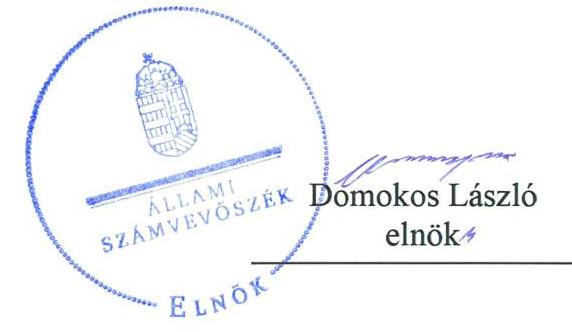
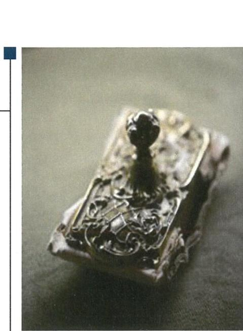
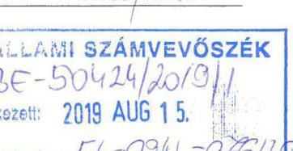
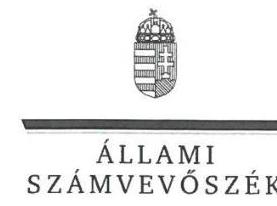
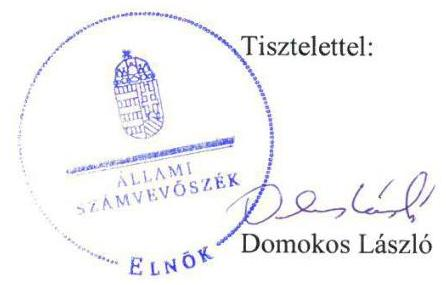
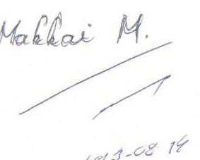

# Jelentés 

## Nemzeti tulajdonú gazdasági társaságok ellenőrzése

Szabad Tér Színház Nonprofit Korlátolt Felelősségű Társaság
2019. 10. hó 24. nap

---

# AZ ELLENŐRZÉST FELÜGYELTE:

## MAKKAI MÁRIA felügyeleti vezető

## AZ ELLENŐRZÉST VEZETTE ÉS A VÉGREHAJTÁSÁÉRT FELELŐS:

### VALASTYÁNNÉ DR. VÍZHÁNYÓ JÚLIA ellenőrzésvezető

### ÁRPÁSI TIBOR ellenőrzésvezető

## A PROGRAM ÖSSZEÁLLÍTÁSÁÉRT FELELŐS:

### TÓTPÁL SZABOLCS osztályvezető

IKTATÓSZÁM: EL-2015-001/2019.

|  Jelentéseink az Országgyűlés számítógépes hálózatán és az Interneten a www.asz.hu címen is olvashatóak. | TÉMASZÁM: 2478  |
| --- | --- |
|   | ELLENŐRZÉS-AZONOSÍTÓ SZÁM: V082248  |

---

# TARTALOMJEGYZÉK 

■ ÖSSZEGZÉS ..... 5
■ AZ ELLENŐRZÉS CÉLJA ..... 6
■ AZ ELLENŐRZÉS TERÜLETE ..... 7
■ AZ ELLENŐRZÉS HÁTTERE, INDOKOLTSÁGA ..... 8
■ A JELENTÉS LÉNYEGES KÉRDÉSKÖREI ..... 9
■ AZ ELLENŐRZÉS HATÓKÖRE ÉS MÓDSZEREI ..... 10
■ MEGÁLLAPÍTÁSOK ..... 12
■ JAVASLATOK ..... 14
■ MELLÉKLETEK ..... 15
I. sz. melléklet: Fogalomtár ..... 15
■ FÜGGELÉKEK ..... 17
I. sz. függelék a jelentéshez ..... 17
II. sz. függelék: Észrevételek ..... 18
■ RÖVIDÍTÉSEK JEGYZÉKE ..... 25

---

.

---

# ÖSSZEGZÉS 

A Szabad Tér Színház Nonprofit Korlátolt Felelősségű Társaság vagyongazdálkodása nem volt szabályszerű. A Társaságnál nem volt biztosított a vagyonnal való felelős gazdálkodás, az átláthatóság és elszámoltathatóság. Budapest Főváros Önkormányzata tulajdonosi joggyakorlása során betartotta a jogszabályi előírásokat.

## Az ellenőrzés társadalmi indokoltsága

Az Állami Számvevőszék stratégiájában megfogalmazta, hogy az államháztartáson kívül működő feladatellátó rendszerek ellenőrzéseivel hozzájárul ahhoz, hogy a közpénzeket, illetve az ingyenesen juttatott közvagyont az államháztartáson kívül működő szervezetek is átlátható, rendezett módon használják fel.

Az állam és a helyi önkormányzatok tulajdona nemzeti vagyon. A nemzeti vagyon megőrzése, megóvása érdekében kiemelten fontos a nemzeti tulajdonú gazdasági társaságok ellenőrzése.

Az Állami Számvevőszék céljaival és a társadalmi igénnyel összhangban, a gazdasági társaságok kiemelt fontosságú szerepe miatt került sor a Budapest Főváros Önkormányzata kizárólagos tulajdonában álló Szabad Tér Színház Nonprofit Korlátolt Felelősségű Társaság vagyongazdálkodásának, gazdálkodásának a kormányzati szektor hiányára, az államadósságra gyakorolt hatásának, illetve az Önkormányzat tulajdonosi joggyakorlásának ellenőrzésére.

## Főbb megállapítások, következtetések, javaslatok

A Szabad Tér Színház Nonprofit Korlátolt Felelősségű Társaság feletti tulajdonosi joggyakorlás kereteit az alapító Budapest Főváros Önkormányzata a jogszabályoknak és belső szabályzatainak megfelelően alakította ki, a tulajdonosi jogait szabályszerűen gyakorolta.

A Szabad Tér Színház Nonprofit Korlátolt Felelősségű Társaság vagyongazdálkodása nem volt szabályszerű, mert az éves beszámolók mérlegtételeit nem támasztotta alá leltárral, ezáltal nem volt biztosított a nemzeti vagyon értékének védelme.

Az Állami Számvevőszék a jelentésben foglalt megállapítások alapján a Szabad Tér Színház Nonprofit Korlátolt Felelősségű Társaság ügyvezetőjének öt javaslatot fogalmazott meg. A javaslatokat megalapozó megállapításokra az érintettnek 30 napon belül intézkedési tervet kell készítenie.

---

# AZ ELLENŐRZÉS CÉLJA 

AZ ELLENŐRZÉS CÉLJA annak megállapítása volt, hogy a tulajdonosi joggyakorló a gazdasági társasága feletti tulajdonosi joggyakorlás kereteit kialakította-e, tulajdonosi jogait megfelelően gyakorolta-e és kötelezettségeit teljesítette-e. A gazdasági társaság biztosította-e a vagyon védelmét a nyilvántartások szabályszerű vezetése és a mérleg tételeinek leltárral történő alátámasztása útján, valamint szabályszerűen gondoskodott-e a társaság használatában lévő nemzeti vagyon értékének megőrzéséről, gyarapításáról, hasznosításáról. Az ellenőrzés célja volt továbbá annak megítélése, hogy a kormányzati szektorba sorolt nemzeti tulajdonban lévő gazdasági társaság gazdálkodásának a kormányzati szektor hiányára és az államadósságra befolyással bíró elemei a jogszabályi előírásoknak megfeleltek-e és a gazdasági társaság az adatszolgáltatási kötelezettségének eleget tett-e.

---

# AZ ELLENŐRZÉS TERÜLETE

## Budapest Főváros Önkormányzata és a Szabad Tér Színház Nonprofit Korlátolt Felelősségű Társaság

Budapest Főváros Önkormányzata 1996-ban alapította a Szabad Tér Színház Közhasznú Társaságot, amelynek átalakulásával jött létre 2009-ben a Szabad Tér Színház Nonprofit Korlátolt Felelősségű Társaság. Az Önkormányzat¹ kizárólagos tulajdonában álló Társaság fő feladata az Önkormányzat Mötv.² szerinti kulturális és turisztikai közfeladatainak ellátása volt. A Társaság³ jegyzett tőkéje 3,5 M Ft volt, az ellenőrzött időszakban nem változott.

Az Önkormányzattal 2012-ben kötött Fenntartói megállapodás⁴ alapján a Társaság közhasznú előadó-művészeti szervezetként gondoskodott az Önkormányzat Mötv.-ben foglalt országos szerepkörével összefüggő kulturális szolgáltatás körében az Önkormányzat részére meghatározott feladat ellátásáról. A Társaság feladata volt az ellenőrzött időszakban többek között a Budapesti Nyári Fesztivál megszervezése, a Margitszigeti Szabadtéri Színpadon és a Városmajori Színpadon előadások műsorra tűzése, vidéki és határon túli társulatok előadásának, matinék, gyermek és családi előadások megszervezése, kortárs műfajok, kamara-előadások folyamatos műsoron tartása.

A Társaság 2015-ben 83,1 M Ft, 2016-ban 7,5 M Ft veszteséget realizált, míg 2017-ben adózott eredménye 11,0 M Ft-ot ért el. A Társaság értékesítésből származó nettó árbevétele 2015-ben 304,1 M Ft, 2016-ban 312,4 M Ft, 2017-ben 412,6 M Ft volt. A saját tőke 2015-ben 119,9 M Ft, 2016-ban 112,3 M Ft, 2017-ben 123,4 M Ft volt. A foglalkoztatottak létszáma az ellenőrzött években nem változott, 10 fő volt.

A Társaság feladatait saját eszközeivel, illetve az Önkormányzattal kötött Haszonbérleti szerződés⁵ alapján átvett eszközökkel látta el. A Társaság vagyonkezelésbe vett eszközzel, más gazdasági társaságban részesedéssel nem rendelkezett.

A Társaság ügyvezetője⁶, továbbá a főpolgármester⁷ és a főjegyző⁸ személye az ellenőrzött időszakban nem változott. A Társaság a Számv. tv.⁹ 155. § (2) bekezdése alapján könyvvizsgálatra volt kötelezett.

A Társaság 2017. június 15-től a kormányzati szektorba sorolt egyéb szervezetek közé tartozott.

---

# AZ ELLENŐRZÉS HÁTTERE, INDOKOLTSÁGA 

Az Alaptörvény ${ }^{10}$ 38. cikke alapján az állam és a helyi önkormányzatok tulajdona nemzeti vagyon. A nemzeti vagyon megőrzése, megóvása érdekében kiemelten fontos ezen nemzeti tulajdonú gazdasági társaságok ellenőrzése. Gazdálkodásuk jellemzően a közérdeklődés és a média figyelmének középpontjában áll, amihez hozzájárul a gazdálkodásuk körébe tartozó - a nemzeti vagyon részét képező - vagyon nagysága, illetve az általuk ellátott közszolgáltatások minősége és hatékonysága.

Ellenőrzéseink feltárhatják, hogy a tulajdonosi felügyelet hozzájárult-e a szabályszerű gazdálkodáshoz és feladatellátáshoz. Az ellenőrzés eredményeként meghatározhatóvá válnak a gazdasági társaság vagyongazdálkodást érintő kockázatai, ezzel lehetővé téve a kockázatok csökkentését. A megállapítások alapján megfogalmazott számvevőszéki javaslatok hasznosítása elősegítheti a meglévő hibák megszüntetését. A jó gyakorlatok bemutatásával az ÁSZ ${ }^{11}$ hozzájárulhat a követendő megoldások megismertetéséhez, terjesztéséhez.

---

# A JELENTÉS LÉNYEGES KÉRDÉSKÖREI 

1. A Társaság feletti tulajdonosi joggyakorlás megfelelt-e az előírásoknak?
2. A Társaság vagyongazdálkodása szabályszerű volt-e?
3. A Társaság gazdálkodásának a kormányzati szektor hiányára és az államadósságra befolyással bíró elemei megfeleltek-e a jogszabályi előírásoknak, az adatszolgáltatási kötelezettségének eleget tett-e?

---

# AZ ELLENŐRZÉS HATÓKÖRE ÉS MÓDSZEREI 

## Az ellenőrzés típusa

Megfelelőségi ellenőrzés.

## Az ellenőrzött időszak

A tulajdonosi joggyakorlás tekintetében az ellenőrzött időszak 2017. január 1-től 2018. szeptember 28-ig, az ellenőrzés megkezdésének napjáig terjedt ki az éves beszámolók elfogadása kivételével, amelynél az ellenőrzött időszak 2015. január 1-től az ellenőrzés megkezdésének napjáig tartott.

A társaság vagyongazdálkodási tevékenységét illetően az ellenőrzött időszak a 2015 - 2017. évek, a 2017. évi beszámoló jóváhagyása és közzététele tekintetében 2018. június elsejéig tartó időszak.

A társaság gazdálkodásának a kormányzati szektor hiányára és az államadósságra befolyással bíró elemei és a jogszabályi előírásoknak megfelelő adatszolgáltatási kötelezettsége teljesítése tekintetében az ellenőrzött időszak 2017. június 15 -től 2017. december 31-ig, a 2017. évi beszámoló jóváhagyása és közzététele tekintetében 2018. június elsejéig tartó időszak.

## Az ellenőrzés tárgya

A Szabad Tér Színház Nonprofit Korlátolt Felelősségű Társaság feletti tulajdonosi joggyakorlás kialakítása és működtetése.

A Szabad Tér Színház Nonprofit Korlátolt Felelősségű Társaság vagyongazdálkodási tevékenysége, a társaság használatában lévő nemzeti vagyon, illetve a saját vagyona tekintetében a vagyonnyilvántartások vezetése, leltára, a nemzeti vagyon értékének megőrzése, gyarapítása, hasznosítása.

A Szabad Tér Színház Nonprofit Korlátolt Felelősségű Társaság gazdálkodásának a kormányzati szektor hiányára és az államadósságra befolyással bíró elemei és a jogszabályi előírásoknak megfelelő adatszolgáltatási kötelezettség teljesítése.

## Az ellenőrzött szervezet

Budapest Főváros Önkormányzata
Szabad Tér Színház Nonprofit Korlátolt Felelősségű Társaság

---

# Az ellenőrzés jogalapja 

Az ellenőrzés jogszabályi alapját az ÁSZ tv. ${ }^{12} 1 . \S$ (3) bekezdése és 5. § (3) - (5) bekezdései képezték.

## Az ellenőrzés módszerei

Az ÁSZ az ellenőrzést az ellenőrzési program ellenőrzési kérdései, az ellenőrzött időszakban hatályos jogszabályok, az ellenőrzés szakmai szabályok és módszertanok alapján, a nemzetközi standardok figyelembe vételével végezte.

Az ÁSZ az ellenőrzés ideje alatt az ellenőrzött szervezettel történő kapcsolattartást az ÁSZ Szervezeti és Működési Szabályzatának vonatkozó előírásai alapján biztosította.

Az ÁSZ 2017. január 1-től az ellenőrzés megkezdésének napjáig - 2018. szeptember 28-ig - ellenőrizte a tulajdonosi joggyakorlás kereteinek kialakítását, a tulajdonosi joggyakorló tevékenységét a felügyelő bizottság és a független könyvvizsgáló működéséhez kapcsolódóan, valamint azt, hogy a tulajdonosi joggyakorló a nemzeti vagyon értékének megőrzése érdekében monitorozta-e a gazdasági társaság feladatellátásához kapcsolódóan meghatározott követelmények, elvárások teljesülését. Az ÁSZ a 2015. január 1-től 2018. szeptember 28-ig terjedő teljes ellenőrzött időszakra ellenőrizte a tulajdonosi joggyakorló részvételét az éves beszámoló elfogadására vonatkozó döntéshozatalban.

A gazdasági társaság vagyonhoz kapcsolódó nyilvántartásai vezetésének megfelelősége, a nemzeti vagyon értéke megőrzésének, gyarapításának, hasznosításának szabályszerűsége 2015. és 2017. évek tekintetében került ellenőrzésre. A 2015-2017. éveket érintően történt meg a lényeges dokumentumok értékelése, kiemelten a mérleg tételeinek leltárral való alátámasztottsága.

Az ellenőrzési kérdések megválaszolásához szükséges bizonyítékok megszerzése a következő ellenőrzési eljárások alkalmazásával történt: megfigyelés, információkérés, összehasonlítás, lényeges sokaságból mintavétel, valamint elemző eljárás. Az ellenőrzési bizonyítékként felhasználható adatforrások közé tartoztak az ellenőrzési programban felsorolt adatforrások, továbbá minden - az ellenőrzés folyamán - feltárt, az ellenőrzés szempontjából információkat tartalmazó dokumentum. Az ellenőrzést a kérdésekre adott válaszok kiértékelésével, valamint a megjelölt adatforrások, a csatolt tanúsítványok felhasználásával, továbbá az adott időszakban hatályos jogszabályok figyelembe vételével folytatta le az ÁSZ.

A vagyonnyilvántartások és a leltár szabályszerűsége esetében az ellenőrzés azokra a legnagyobb értékű tételekre - a lényeges sokaságra - terjedt ki, melyek összértéke elérte a teljes sokaság összértékének 50%-át. A lényeges sokaságot tételesen ellenőrizte az ÁSZ.

A kormányzati szektorba sorolt gazdasági társaság adatszolgáltatási kötelezettségére vonatkozó jogszabályi előírások betartását a 2017. évre vonatkozóan értékelte az ÁSZ.

---

# 1. A Társaság feletti tulajdonosi joggyakorlás megfelelt-e az előírásoknak? 

Összegző megállapítás Az Önkormányzat Társaság feletti tulajdonosi joggyakorlása szabályszerű volt.

A TULAJDONOSI JOGGYAKORLÁS RENDJÉT az Alapító ${ }^{13}$ az Mötv., az Nvtv ${ }^{14}$., illetve a Ptk. ${ }^{15}$ előírásainak megfelelően a Vagyonrendeletben ${ }^{16}$, az SZMSZ-ben ${ }^{17}$, illetve a Társaság Alapító okiratában ${ }_{1-}$ $3^{18}$ határozta meg.

Az Alapító megalkotta a Taktv. ${ }^{19}$ előírásaival összhangban lévő, a vezető tisztségviselők, a felügyelőbizottság ${ }^{20}$ tagjai és az Mt. ${ }^{21} 208$. § hatálya alá tartozó munkavállalók javadalmazásáról, valamint a jogviszony megszűnése esetére biztosított juttatások módjának, mértékének elveiről, annak rendszeréről szóló Javadalmazási szabályzatot ${ }^{22}$.

A TULAJDONOSI JOGOK GYAKORLÁSA SORÁN az Alapító a Ptk. és az Alapító okirat ${ }_{1-3}$ előírásaival összhangban megválasztotta a Társaság ügyvezetőjét, a felügyelőbizottság tagjait, a könyvvizsgálót ${ }^{23}$, elfogadta a felügyelőbizottság ügyrendjét ${ }^{24}$. Az Alapító a Társaság 2015-2017. évi éves beszámolóit a Ptk. és a Számv. tv. előírásaival
 összhangban a felügyelőbizottság és a könyvvizsgáló írásbeli jelentésének birtokában hagyta jóvá.

A felügyelőbizottság az ügyrendjében foglaltaknak megfelelően rendszeresen tárgyalta és véleményezte a Közgyűlés elé kerülő, a Társaság tevékenységéről készített beszámolókat.

## 2. A Társaság vagyongazdálkodása szabályszerű volt-e?

## Összegző megállapítás

A Társaság vagyongazdálkodása nem volt szabályszerű.
A Társaság leltározási szabályzata ${ }^{25}$ nem felelt meg a Számv. tv. 69. § (3) bekezdésében foglalt - a számviteli alapelveknek megfelelő folyamatos mennyiségi nyilvántartás vezetése mellett a legalább háromévente mennyiségi felvétellel történő leltározás kötelezettségét tartalmazó - előírásnak, mivel az ingatlanok, építmények, lealapozott gépek és berendezések, valamint a kellék- és jelmezraktárban lévő eszközök esetében 5 évben határozta meg a mennyiségi leltárfelvétel gyakoriságát. A Társaság a Számv. tv. előírásaival összhangban álló számlarendjében ${ }^{26}$ alakította ki a saját vagyon, illetve az önkormányzati vagyonelemek elkülönített nyilvántartásának feltételeit.

A Társaság 2017-ben a Számv. tv. 52. § (2) bekezdésében foglaltakat megsértve a tárgyi eszközök üzembe helyezését nem dokumentálta.

---

A vagyongazdálkodás a 2015-2017. években nem volt szabályszerű. A Társaság a 2015-2017. évi éves beszámolók mérlegtételeit a Számv. tv. 69. § (1) bekezdése ellenére a - mérleg fordulónapján meglévő eszközöket és forrásokat mennyiségben és értékben tartalmazó - leltárral nem támasztotta alá. A tárgyi eszközökről a Társaság folyamatos mennyiségi nyilvántartást vezetett, azonban a Számv. tv. 69. § (3) bekezdésben előírtak ellenére a legalább háromévenkénti mennyiségi felvétellel történő leltározást nem végezte el. A Társaság a pénzeszközök mérlegfordulónapra vonatkozó értékéről a Számv. tv. 69. § (3) bekezdésében és a leltározási szabályzat VI. pontjában előírtak ellenére 2015-2017. években leltározással nem győződött meg. A Társaság 2017-ben a Számv. tv. 69. § (4) bekezdésben előírt kötelezettséget figyelmen kívül hagyva a készletek mennyiségi felvétellel történő leltározását nem végezte el, annak ellenére, hogy azokról nem vezetett a számviteli alapelveknek megfelelő mennyiségi nyilvántartást.

A mérleg tételeit alátámasztó leltár hiányában a 2015-2017. évi éves beszámolókban nem volt biztosított a Társaság elszámoltathatósága, a nemzeti vagyon megőrzése. A Számv. tv. szerinti leltárak hiánya ellenére a könyvvizsgáló a 2015-2017. évi éves beszámolókat korlátozás nélküli hitelesítő záradékkal látta el.

# 3. A Társaság gazdálkodásának a kormányzati szektor hiányára és az államadósságra befolyással bíró elemei megfeleltek-e a jogszabályi előírásoknak, az adatszolgáltatási kötelezettségének eleget tett-e? 

Összegző megállapítás

A Társaság nem tartotta be az adatszolgáltatási kötelezettségére vonatkozó jogszabályi előírásokat.

A Társaságnak a kormányzati szektor hiányára befolyással bíró eleme, az államadósságra befolyással bíró gazdasági eseménye, adósságot keletkeztető ügylete az ellenőrzött időszakban nem volt.

A Társaság a 2017. évi éves számviteli beszámolóját, az arról készített könyvvizsgálói jelentést, kiemelt mutatói, költségvetési kapcsolatai bemutatását nem küldte meg az államháztartásért felelős miniszter részére, ezzel nem tett eleget adatszolgáltatási kötelezettségének, figyelmen kívül hagyva az Áht. ${ }^{27}$ 107. § (1) bekezdésre tekintettel az Ávr. ${ }^{28} 5$. mellékletének 23. pontjában foglaltakat.

---

# JAVASLATOK 

Az ÁSZ tv. 33. § (1) bekezdésében foglaltak értelmében az ellenőrzött szervezet vezetője köteles a jelentésben foglalt megállapításokhoz kapcsolódó intézkedési tervet összeállítani és azt a jelentés kézhezvételétől számított 30 napon belül az ÁSZ részére megküldeni. Amennyiben az ellenőrzött szervezet vezetője nem küldi meg határidőben az intézkedési tervet, vagy továbbra sem elfogadható intézkedési tervet küld, az Állami Számvevőszék elnöke az ÁSZ tv. 33. § (3) bekezdése a) és b) pontjaiban foglaltakat érvényesítheti.

## a Szabad Tér Színház Nonprofit Korlátolt Felelősségű Társaság ügyvezetőjének

1. Intézkedjen az eszközök és a források leltárkészítési és leltározási szabályzatának Számv. tv. előírásainak megfelelő elkészítéséről.
(2. sz. megállapítás 1. bekezdése alapján)
2. Intézkedjen a tárgyi eszközök üzembe helyezésének Számv. tv. előírásának megfelelő dokumentálásáról.
(2. sz. megállapítás 2. bekezdése alapján)
3. Intézkedjen az éves beszámoló mérlegtételeit alátámasztó leltár jogszabályi előírásnak megfelelő elkészítéséről.
(2. sz. megállapítás 3. bekezdés második mondata alapján)
4. Intézkedjen a Számv. tv. előírásának megfelelően a leltározás végrehajtásáról.
(2. sz. megállapítás 3. bekezdés harmadik, negyedik és ötödik mondata alapján)
5. Intézkedjen az Áht.-ben előírt adatszolgáltatási kötelezettség teljesítéséről.
(3. sz. megállapítás 2. bekezdése alapján)

---

# MELLÉKLETEK 

- I. SZ. MELLÉKLET: FOGALOMTÁR
gazdasági társaság
hasznérleti szerződés
kormányzati szektorba sorolt egyéb szervezet
közszolgáltatás
közfeladat
nemzeti vagyon
nonprofit gazdasági társaság
tulajdonosi jogok gyakorlója
vagyonkezelői jog

A gazdasági társaságok üzletszerű közös gazdasági tevékenység folytatására, a tagok vagyoni hozzájárulásával létrehozott, jogi személyiséggel rendelkező vállalkozások, amelyekben a tagok a nyereségből közösen részesednek, és a veszteséget közösen viselik. (Forrás: Ptk. 3:88. § (1) bekezdése)
Haszonbérleti szerződés alapján a haszonbérlő hasznot hajtó dolog időleges használatára vagy hasznot hajtó jog gyakorlására és hasznainak szedésére jogosult, és ennek fejében köteles haszonbért fizetni. A haszonbérleti szerződést írásba kell foglalni. A haszonbérlő a dolog hasznainak szedésére a rendes gazdálkodás szabályainak megfelelően jogosult. A haszonbérlet tárgyát képező dolog fenntartásához szükséges felújítás és javítás, továbbá a dologgal kapcsolatos terhek viselése a haszonbérlőt terheli. A rendkívüli felújítás és javítás a haszonbérbeadót terheli. A haszonbért időszakonként utólag kell megfizetni. (Forrás: Ptk. XLV. Fejezet)
Az a szervezet, amely az Áht. alapján nem része az államháztartásnak, azonban az Európai Közösséget létrehozó szerződéshez csatolt, a túlzott hiány esetén követendő eljárásról szóló jegyzőkönyv alkalmazásáról szóló 2009. május 25-i 479/2009/EK rendelet ${ }^{29}$ szerint a kormányzati szektorba tartozik.
Az Ebktv. ${ }^{30}$ 3. § d) pontja a következőképpen határozza meg a közszolgáltatást: „szerződéskötési kötelezettség alapján a lakosság alapvető szükségleteinek ellátására irányuló szolgáltatás, így különösen a villamos energia-, gáz-, hő-, víz-, szenny-víz- és hulladékkezelési, köztisztasági, postai és távközlési szolgáltatás, továbbá a menetrend alapján közlekedő járművekkel végzett közforgalmú személyszállítás".
Az Áht. 3/A. § (1) bekezdése alapján közfeladat a jogszabályban meghatározott állami vagy önkormányzati feladat.
Nvtv. 1. § (2) bekezdése szerint nemzeti vagyonba tartozik többek között:
„az állam vagy a helyi önkormányzat kizárólagos tulajdonában álló dolgok,
az a) pont hatálya alá nem tartozó, állam vagy a helyi önkormányzat tulajdonában lévő dolog,
az állam vagy a helyi önkormányzat tulajdonában lévő pénzügyi eszközök, továbbá az államot vagy a helyi önkormányzatot megillető társasági részesedések, az államot vagy a helyi önkormányzatot megillető bármely vagyoni értékkel rendelkező jogosultság, amelyet jogszabály vagyoni értékű jogként nevesít."
Az a gazdasági társaság minősül nonprofit gazdasági társaságnak és cégnevében az a gazdasági társaság tüntetheti fel a nonprofit jelleget, amelynek létesítő okirata tartalmazza, hogy a gazdasági társaság tevékenységéből származó nyereség a tagok között nem osztható fel, hanem az a gazdasági társaság vagyonát gyarapítja
Aki a nemzeti vagyon felett az államot vagy a helyi önkormányzatot megillető tulajdonosi jogok és kötelezettségek összességének gyakorlására jogosult. (Forrás: Nvtv. 3. § (1) bekezdés 17. pontja)
A vagyonkezelő köteles a vagyontárgy állagának megóvásáról, jó karbantartásáról, működtetéséről gondoskodni, jogszabályban és szerződésben előírt más kötelezettségét teljesíteni, valamint a vagyontárgyat jogszabályban vagy szerződésben meghatározott célnak megfelelően használni. A vagyonkezelő - a központi költségvetési szervek és a kizárólag közfeladatot ellátó nem központi költségvetési szerv vagyonkezelők kivételével - köteles díjat fizetni, jogszabályban és szerződésben előírt más kötelezettségét teljesíteni, valamint a vagyontárgyat jogszabályban vagy

---

szerződésben meghatározott célnak megfelelően használni. Amennyiben a vagyonkezelő ezen kötelezettségeinek nem tesz eleget, a tulajdonosi joggyakorló jogosult a szerződést azonnali hatállyal felmondani. (Forrás: Vtv. ${ }^{21}$ 27. § (2), (2a) bekezdések)

---

# FÜGGELÉKEK 

- I. SZ. FÜGGELÉK A JELENTÉSHEZ

Az Állami Számvevőszék az ellenőrzések során feltárt tényekhez kapcsolódó további körülmények tisztázására eszközrendszerrel nem rendelkezik. Amennyiben az ellenőrzésen túlmutatóan indokoltnak látszik az ellenőrzés során feltárt körülmények további vizsgálata, az Állami Számvevőszék törvényi felhatalmazás alapján az ellenőrzés által feltárt körülményeket továbbítja a hatáskörrel rendelkező szervnek a szükséges intézkedések megtétele, eljárások lefolytatása érdekében.
I. A Szabad Tér Színház Nonprofit Korlátolt Felelősségű Társaság a 2015., 2016., 2017. évi beszámoló mérlegtételeinek értékét nem támasztotta alá leltárral. A Társaság ezért a 2015-2017. években megsértette a Számv. tv. 69. § (1) bekezdésében előírtakat. A szabálytalanság miatt nem igazolt, hogy a Társaság 2015-2017. évi éves beszámolói megbízható, valós összképet mutatnak.
Az eset konkrét körülményeinek feltárására a Nemzeti Adó- és Vámhivatal rendelkezik hatáskörrel.
II. A Szabad Tér Színház Nonprofit Korlátolt Felelősségű Társaság 2015-2017. években a tárgyi eszközök mennyiségi felvétellel történő leltározását a Számv. tv. 69. § (3) bekezdésben előírtak ellenére nem végezte el. A Társaság a pénzeszközök mérlegfordulónapra vonatkozó értékét a Számv. tv. 69. § (3) bekezdésében és a leltározási szabályzat VI. pontjában előírtak ellenére a 2015-2017. években leltárral nem támasztotta alá. A Társaság 2017-ben a Számv. tv. 69. § (4) bekezdésében előírt kötelezettséget figyelmen kívül hagyva a készletek mennyiségi felvétellel történő leltározását nem végezte el, és azokról nem vezetett a számviteli alapelveknek megfelelő mennyiségi nyilvántartást. A leltározás elmaradása miatt nem igazolt, hogy a beszámolók mérlegeiben szereplő tételek a valóságban is megtalálhatók, ezért nem zárható ki, hogy a Társaságot vagyoni hátrány érte.
Az eset összes körülményeinek felderítésére az ügyészség rendelkezik hatáskörrel.

---

A jelentéstervezetet a Számvevőszék 15 napos észrevételezésre megküldte az ellenőrzött szervezetek vezetőinek az ÁSZ tv. 29. § (1) bekezdése előírása szerint.

Az ÁSZ a jelentéstervezetet észrevételezésre megküldte a Szabad Tér Színház Nonprofit Korlátolt Felelősségű Társaság ügyvezetőjének és Budapest Főváros Önkormányzata főpolgármesterének.
A Szabad Tér Színház Nonprofit Korlátolt Felelősségű Társaság ügyvezetője észrevételét és az arra adott választ, valamint Budapest Főváros Önkormányzata főpolgármestere nemleges észrevételét a függelék tartalmazza.

[^0]
[^0]:    * 29. § (1) Az Állami Számvevőszék az ellenőrzési megállapításait megküldi az ellenőrzött szervezet vezetőjének vagy az általa megbízott személynek, és annak, akinek személyes felelősségét állapította meg.
    (2) Az ellenőrzött szervezet vezetője és a felelősként megjelölt személy az ellenőrzés megállapításaira tizenöt napon belül írásban észrevételt tehet.
    (3) Az Állami Számvevőszék az észrevételre a beérkezésétől számított harminc napon belül írásban válaszol. A figyelembe nem vett észrevételeket köteles a jelentésben feltüntetni, és megindokolni, hogy azokat miért nem fogadta el.

---

# 18.95 

Szabad Tér Színház Nonprofit Kft.

Halbai H.

Állami Számvevőszék
Domokos László
elnök úr részére

Budapest 4.
Pf. 54.
1364

Tisztelt Elnök Úr!

Az EL-0941-071/2019. iktatószámú (Témaszám: 2478; Ellenőrzés-azonosító szám: V082248) Számvevőszéki jelentéstervezetben szereplő megállapításokra a következő észrevételeket tesszük:

- A jelentéstervezet 2. sz. megállapítás 3. bekezdés második mondata, mely a következő „A Társaság a 2015-2017. évi éves beszámolók mérlegtételeit a Számv. tv. 69. § (1) bekezdése ellenére a - mérleg fordulónapján meglévő eszközöket és forrásokat mennyiségben és értékben tartalmazó - leltárral nem támasztotta alá" megállapítása véleményünk szerint nem helytálló.

2015-2017. években tételes leltárt készítettünk az eszközökről és forrásokról december 31-i fordulónappal és az auditálás dátumával lezárva: Vevőkről, Szállítókról, Egyéb követelésekről, Egyéb rövid lejáratú kötelezettségekről, Aktív időbeli elhatárolásokról, valamint a Passzív időbeli elhatárolásokról, melyeket a kért adatbekéréshez évenként csatoltunk is.

A Pénztár készpénz-állományáról külön leltárt nem készítettünk, az adott év december 31-i pénztárjelentésének záró-készpénzállományát tekintettük leltárnak, valamint a Bankbetétek tekintetében szintén az adott év december 31-i bankszámlakivonat záró egyenlegét tekintettük leltárnak. Az adatbekérés során az ÁSZ
 elektronikus felületére nem kerültek feltöltésre a pénzeszközökre vonatkozó leltározás bizonylatai, melyet azonban hiánypótlás keretében haladéktalanul a rendelkezésükre bocsátunk.

- A jelentés tervezet 2. sz. megállapítás 3. bekezdés harmadik mondata a következő „A tárgyi eszközökről a Társaság folyamatos mennyiségi nyilvántartást vezetett, azonban a Számv. tv. 69. § (3) bekezdésben előírtak ellenére a legalább háromévenkénti mennyiségi felvétellel történő leltározást nem végezte el".

---

Szabad Tér Színház Nonprofit Kft.

Megállapításukkal kapcsolatban az alábbiakról szeretnénk tájékoztatni Önöket: 2018. évben a Leltározási Szabályzat módosításra került, a módosított Leltározási Szabályzatnak megfelelően 2018.12.31-re vonatkozóan teljeskörű fizikai leltárt készítettünk.

- A jelentéstervezet 2. sz. megállapítás 3. bekezdés ötödik mondatában szereplő megállapításukat elfogadjuk, azonban a következtetésük levonásával kapcsolatban kérjük Önöktől az alábbiak mérlegelését: készlet értéke mindössze 95 e Ft volt. A jövőben a készletek fordulónapi felleltározását el fogjuk végezni.
- Az Áht.-ben előírt adatszolgáltatási kötelezettségünket 2019. augusztus 1-jén teljesítettük.

Mellékletben küldjük a Budapest Főváros Önkormányzata, mint a Szabad Tér Színház Nonprofit Kft. tulajdonos által közgyűlésen megválasztott, Leitner+Leitner Audit és Könyvvizsgáló Kft., a könyvvizsgálatért felelős Siklós Márta könyvvizsgálójának az észrevételeit a Számvevőszéki jelentéstervezetben szereplő megállapításokra.

Budapest, 2019. augusztus 13.

Tisztelettel:

Bán Teodóra ügvezető

Mellékletek: 1 db Könyvvizsgálói észrevétel
1 db 2015.12.31-i Pénztárjelentés
1 db 2015.12.31-i Bankkivonat
1 db 2016.12.31-i Pénztárjelentés
1 db 2016.12.31-i Bankkivonat
1 db 2017.12.31-i Pénztárjelentés
1 db 2017.12.31-i Bankkivonat

---

ELNÖK

Ikt.szám: EL-0941-077/2019.

# Bán Teodóra 

ügyvezető
Szabad Tér Színház Nonprofit Korlátolt Felelősségű Társaság
Budapest

## Tisztelt Ügyvezető Úrhölgy!

A „Nemzeti tulajdonú gazdasági társaságok ellenőrzése - Szabad Tér Színház Nonprofit Korlátolt Felelősségű Társaság" címmel készített számvevőszéki jelentéstervezetre tett észrevételét köszönettel megkaptam.

Az Állami Számvevőszék észrevételre vonatkozó álláspontjáról a felügyeleti vezető által készített részletes tájékoztatást mellékelten megküldöm.

Tájékoztatom Ügyvezető úrhölgyet, hogy a számvevőszéki jelentésben - az Állami Számvevőszékről szóló 2011. évi LXVI. törvény 29. § (3) bekezdése alapján - a figyelembe nem vett észrevételt szerepeltetjük, annak indoklásával, hogy azt az Állami Számvevőszék miért nem fogadta el.

Budapest, 2019. 06. hó 06. nap

Melléklet: Tájékoztatás az észrevétel kezeléséről

---

# Tájékoztatás   az észrevétel kezeléséről 

A „Nemzeti tulajdonú gazdasági társaságok ellenőrzése - Szabad Tér Színház Nonprofit Korlátolt Felelősségű Társaság" című jelentéstervezetre 2019. augusztus 15-én érkezett észrevételét áttekintettük, annak kezelésével kapcsolatban a következő tájékoztatást adom.

## 1. A jelentéstervezet 2. számú megállapítás 3. bekezdés második mondatával kapcsolatban tett észrevételre adott válasz

Az észrevétel a 2015-2017. évi beszámolók leltárral való alátámasztásának hiányára vonatkozik, arról tájékoztat, hogy a Társaság a pénztár készpénz-állományáról nem készített leltárt, az adott év december 31-i pénztárjelentésének záró-készpénzállományát tekintették leltárnak. Továbbá az észrevétel rögzíti, hogy a pénzeszközök leltározásának bizonylatai az adatszolgáltatás során nem kerültek átadásra.
Az észrevétel az ÁSZ megállapítását megerősíti. Továbbá tájékoztatom Ügyvezető úrhölgyet, hogy az ÁSZ ellenőrzési megállapításai az Állami Számvevőszékről szóló 2011. évi LXVI. törvénynek (továbbiakban ÁSZ tv.) megfelelően minden esetben az ellenőrzés során bekért és az arra nyitva álló határidőn belül rendelkezésre bocsátott dokumentumokon alapulnak. Ügyvezető úrhölgy az ÁSZ rendelkezésére bocsátott dokumentumokról teljességi és hitelességi nyilatkozatot állított ki, melyben nyilatkozott, hogy az ÁSZ részére átadott dokumentumok megbízhatóak, a bekért adatokra, dokumentumokra vonatkozóan teljes körű információt tartalmaznak. Az észrevételt nem fogadjuk el, a jelentéstervezet módosítása nem indokolt.

## 2. A jelentéstervezet 2. számú megállapítás 3. bekezdés harmadik mondatával kapcsolatban tett észrevételre adott válasz

A tárgyi eszközök leltározásával kapcsolatban az észrevétel arról tájékoztat, hogy 2018. évben a Leltározási Szabályzatot módosították és annak megfelelően 2018. 12. 31-re teljes körű fizikai leltárt készítettek. Az észrevétel nem cáfolja az ÁSZ megállapítását, annak módosítása nem indokolt.

## 3. A jelentéstervezet 2. számú megállapítás 3. bekezdés ötödik mondatával kapcsolatban tett észrevételre adott válasz

Az észrevétel a készletek 2017. évi leltározásának hiányára tett megállapítást elfogadja, azonban a készletek értékének nagyságára tekintettel kéri a jelentéstervezet módosítását. Tekintettel arra, hogy a Számv. tv. vonatkozó előírása a leltározás kötelezettségét nem értékhatárhoz köti, az észrevételben leírtak alapján a jelentéstervezetet nem módosítjuk.

---

# 4. A jelentéstervezet 3. számú megállapításával kapcsolatban tett észrevételre adott válasz 

Az adatszolgáltatási kötelezettséggel kapcsolatban írt észrevétel rögzíti, hogy az Áht.-ben előírt adatszolgáltatási kötelezettséget 2019. augusztus 1-jén teljesítették. Az észrevétel nem cáfolja az ÁSZ megállapítását, mely szerint a Társaság a 2017. évi éves számviteli beszámolóját, az arról készített könyvvizsgálói jelentést, kiemelt mutatói, költségvetési kapcsolatai bemutatását nem küldte meg az államháztartásért felelős miniszter részére a jogszabályban előírt határidőn belül. Fentiek alapján a megállapítás módosítása nem indokolt.
A levél mellékleteként megküldött Leitner+Leitner Audit és Könyvvizsgáló Kft. könyvvizsgálatért felelős könyvvizsgálójának észrevételével kapcsolatban tájékoztatom, hogy az ÁSZ tv. 29. § (2) bekezdése szerint az ellenőrzés megállapításaira az ellenőrzött szervezet vezetője és a felelősként megjelölt személy tehet észrevételt. Fentiek alapján a könyvvizsgálatért felelős személy észrevételét az Állami Számvevőszék nem veszi figyelembe.

Budapest, 2019. 08. hó 08. nap

Makkai Mária
felügyeleti vezető

---

BUDAPEST FŐPOLGÁRMESTERE

Ikt.sz: 70/86-40/2019.
Tárgy: észrevétel az
EL-0941-071/2019.
íktatószámú jelentés-tervezetre

Állami Számvevőszék

Domokos László Elnök Úr részére

ÁLLAMI SZÁMVEVŐSZÉK
2019-50128/2013/1
Érkezett: 2019. AUG 13.
Iktatószám: EL-1013-013/2019
Melléklet:

Tisztelt Elnök Úr!

Fenti számon érkezett, az „Nemzeti tulajdonú gazdasági társaságok ellenőrzése – Szabad Tér
Színház Nonprofit Kft” című jelentés-tervezetet köszönettel megkaptam.

A jelentés-tervezetet áttekintve megállapítható, hogy a tulajdonosi joggyakorló Fővárosi
Önkormányzat a tulajdonosi joggyakorlás kereteit a jogszabályoknak és belső szabályzatainak
megfelelően alakította ki, a tulajdonosi jogait szabályszerűen gyakorolta, amelynek okán
elmarasztaló megállapítást, javaslatot nem fogalmaz meg.

A társasági tevékenységet érintően feltárt hiányosságok, megfogalmazott javaslatok
ugyanakkor felhívják figyelmünket a folyamatos kontrolltevékenység erősítése igénye mellett
a fővárosi szabályozó előírások áttekintése, pontosítása feladatára, amelyre jövőbeni
tevékenységünkben hangsúlyos figyelmet fordítunk.

Előzőekre tekintettel a jelentés-tervezetre észrevételt nem teszünk.

Munkájukat ezúttal is tisztelettel megköszönöm.

Budapest, 2019. augusztus „D. „

Tisztelettel:

Tarlós István

Jt. 2000/0000000000000000000000000000000000000000000000000000000000000000000000000000000000000000000000000000000000000000000000000000000000000000000000000000000000000000000000000000000000000000000000000000000

---

# RÖVIDÍTÉSEK JEGYZÉKE 

${ }^{1}$ Önkormányzat
${ }^{2}$ Mötv.
${ }^{3}$ Társaság
${ }^{4}$ Fenntartói megállapodás
${ }^{5}$ Haszonbérleti szerződés
${ }^{6}$ ügyvezető
${ }^{7}$ főpolgármester
${ }^{8}$ főjegyző
${ }^{9}$ Számv. tv.
${ }^{10}$ Alaptörvény
${ }^{11}$ ÁSZ
${ }^{12}$ ÁSZ tv.
${ }^{13}$ Alapító
${ }^{14}$ Nvtv.
${ }^{15}$ Ptk.
${ }^{16}$ Vagyonrendelet
${ }^{17}$ SZMSZ
${ }^{18}$ Alapító Okirat ${ }_{1-3}$
${ }^{19}$ Taktv.
${ }^{20}$ felügyelőbizottság
${ }^{21} \mathrm{Mt}$.
${ }^{22}$ Javadalmazási szabályzat ${ }_{1,2}$
${ }^{23}$ könyvvizsgáló

Budapest Főváros Önkormányzata
2011. évi CLXXXIX. törvény Magyarország helyi önkormányzatairól (hatályos: 2012. január 1-től)
Szabad Tér Színház Nonprofit Korlátolt Felelősségű Társaság
a Fővárosi Közgyűlés 1963/2012. (X.3.) Főv. Kgy. határozatával elfogadott, az Önkormányzat és a Társaság által 2012. október 26-án kötött, a Fővárosi Közgyűlés 1454/2015. (X.28.) Főv. Kgy. határozatával módosított Fenntartói megállapodás (hatályos: 2013. január 1-től)
az Önkormányzat és a Társaság között létrejött haszonbérleti szerződés az Önkormányzat kizárólagos tulajdonában lévő ingatlanok haszonbérbe adásáról (hatályos: 2014. január 1-jétől)
a Társaság ügyvezetője
Budapest Főváros Önkormányzata főpolgármestere
Budapest Főváros Önkormányzata főjegyzője
2000. évi C. törvény a számvitelről (hatályos: 2001. január 1-től)

Magyarország Alaptörvénye
Állami Számvevőszék
2011. évi LXVI. törvény az Állami Számvevőszékről (hatályos: 2011. július 1-től)

Budapest Főváros Önkormányzata Közgyűlése
2011. évi CXCVI. törvény a nemzeti vagyonról (hatályos: 2011. december 31-től) 2013. évi V. törvény a Polgári Törvénykönyvről (hatályos: 2014. március 15-től) a Fővárosi Közgyűlés többször módosított 22/2012. (III. 14.) Főv. Kgy. rendelete Budapest Főváros Önkormányzata vagyonáról, a vagyonelemek feletti tulajdonosi jogok gyakorlásáról (hatályos: 2012. március 15-től)
a Fővárosi Közgyűlés többször módosított 53/2014. (XII. 12.) Főv. Kgy. rendelete a Fővárosi Önkormányzat Szervezeti és Működési Szabályzatáról (hatályos: 2014. december 13-tól)
a Társaság Alapító Okirata változásokkal egységes szerkezetben
Alapító Okirat1: hatályos: 2013. július 18-tól 2016. március 10-ig
Alapító Okirat2: hatályos: 2016. március 11-től 2017. május 1-ig
Alapító Okirat1: hatályos: 2017. május 2-től
2009. évi CXXII. törvény a köztulajdonban álló gazdasági társaságok takarékosabb működéséről (hatályos: 2009. december 4-től)
a Társaság felügyelőbizottsága
2012. évi I. törvény a munka törvénykönyvéről (hatályos: 2012. július 1-től)
a Fővárosi Közgyűlés 168/2014. (02.26.) számú határozatával kiadott, 863/2014. (06.30.) számú határozatával, valamint a 1563/2015. (12.02.) határozatával módosított egységes szerkezetbe foglalt, A Fővárosi Önkormányzat kulturális ágazatba tartozó, egyszemélyes tulajdonban lévő gazdasági társaságai ügyvezetőinek, egyéb vezető állású munkavállalóinak, valamint felügyelőbizottsági tagjainak szabályzata a vezetői javadalmazásról
Javadalmazási szabályzat1: hatályos: 2015. december 2-től 2017. szeptember 30-ig Javadalmazási szabályzat2: hatályos: 2017. október 1-től
a Társaság könyvvizsgálója (Leitner+Leitner Audit Könyvvizsgáló és Könyvelő Kft.)

---

${ }^{24}$ felügyelőbizottság ügyrendje
${ }^{25}$ leltározási szabályzat
${ }^{26}$ számlarend
${ }^{27}$ Áht.
${ }^{28}$ Ávr.
${ }^{29}$ 479/2009/EK rendelet
${ }^{30}$ Ebktv.
${ }^{31}$ Vtv.
a Társaság felügyelőbizottságának a Fővárosi Közgyűlés 755/2015 (05.27.) számú határozatával jóváhagyott ügyrendje (hatályos: 2015. június 6-tól)
a Társaság Eszközök és források leltározási és leltárkészítési szabályzata (hatályos: 2011. január 1-től)
a Társaság számlarendje (hatályos: 2011. január 1-től)
2011. évi CXCV. törvény az államháztartásról (hatályos: 2011. december 31-től)

368/2011. (XII. 31.) Korm. rendelet az államháztartásról szóló törvény végrehajtásáról (hatályos: 2012. január 1-től)
a Tanács 479/2009/EK rendelete az Európai Közösséget létrehozó szerződéshez csatolt, a túlzott hiány esetén követendő eljárásról szóló jegyzőkönyv alkalmazásáról 2003. évi CXXV. törvény az egyenlő bánásmódról és az esélyegyenlőség előmozdításáról (hatályos: 2004. január 27-től)
2007. évi CVI. törvény az állami vagyonról (hatályos: 2007. szeptember 25-től)

---

# ÁLLAMI SZÁMVEVŐSZÉK 

1052 Budapest, Apáczai Csere János utca 10.
Levélcím: 1364 Budapest 4. Pf. 54
Telefon: +36 14849100 Telefax: +36 14849200
www.asz.hu
