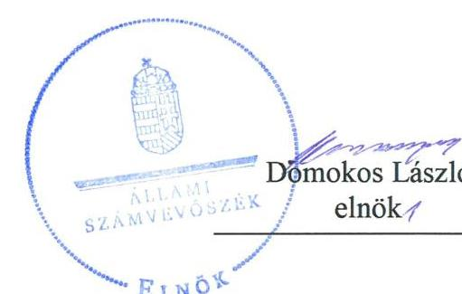

# Jelenetés 

## Nemzeti tulajdonú gazdasági társaságok ellenőrzése

Ózdi Sport- és Élményközpont
Nonprofit Kft.
2020.

---

# Jelentés 

## Nemzeti tulajdonú gazdasági társaságok ellenőrzése

Ózdi Sport- és Élményközpont
Nonprofit Kft.
2020. 01. hó 23. nap

---

# AZ ELLENŐRZÉST FELÜGYELTE:

- **KLINGA LÁSZLÓ** felügyeleti vezető
- **AZ ELLENŐRZÉST VEZETTE ÉS A VÉGREHAJTÁSÁÉRT FELELŐS:**
  - **DR. PELLEI TAMÁS** ellenőrzésvezető
  - **A PROGRAM ÖSSZEÁLLÍTÁSÁÉRT FELELŐS:**
    - **TÓTPÁL SZABOLCS** osztályvezető

**IKTATÓSZÁM:** EL-2016-001/2019

**TÉMASZÁM:** 2478

**ELLENŐRZÉS-AZONOSÍTÓ SZÁM:** V082240; V082261

Jelentéseink az Országgyűlés számítógépes hálózatán és az Interneta a www.asz.hu címen is olvashatóak.

---

# TARTALOMJEGYZÉK 

■ ÖSSZEGZÉS ..... 5
■ AZ ELLENŐRZÉS CÉLJA ..... 6
■ AZ ELLENŐRZÉS TERÜLETE ..... 7
■ AZ ELLENŐRZÉS HÁTTERE, INDOKOLTSÁGA ..... 8
■ A JELENTÉS LÉNYEGES KÉRDÉSKÖREI ..... 9
■ AZ ELLENŐRZÉS HATÓKÖRE ÉS MÓDSZEREI ..... 10
■ MEGÁLLAPÍTÁSOK ..... 12
■ JAVASLATOK ..... 14
■ MELLÉKLETEK ..... 15
I. sz. melléklet: Értelmező szótár ..... 15
■ FÜGGELÉK: ÉSZREVÉTELEK ..... 17
■ RÖVIDÍTÉSEK JEGYZÉKE ..... 19

---

.

---

# ÖSSZEGZÉS 

Az Ózdi Sport- és Élményközpont Nonprofit Kft. vagyongazdálkodása nem volt szabályszerű, ezért müködésének átláthatósága és elszámoltathatósága nem volt biztosított.

## Az ellenőrzés társadalmi indokoltsága

Az Állami Számvevőszék kiemelt célja, hogy ellenőrzéseivel hozzájáruljon ahhoz, hogy a közpénzeket, illetve az ingyenesen juttatott közvagyont az államháztartáson kívül működő szervezetek is átlátható, rendezett módon használják fel.

Az állam és a helyi önkormányzatok tulajdona nemzeti vagyon, melynek megőrzése érdekében kiemelten fontos a nemzeti tulajdonú gazdasági társaságok ellenőrzése. Ellenőrzésüket további társadalmi elvárás is indokolja. Részben a gazdálkodásuk körébe tartozó vagyon nagysága, részben az általuk ellátott közszolgáltatások, sajátos feladatellátások, mivel tevékenységükön keresztül a lakosság széles köre kerül kapcsolatba a társaságokkal.

Az Állami Számvevőszék céljaival és a társadalmi igénnyel összhangban, a gazdasági társaságok kiemelt fontosságú szerepe miatt került sor az Ózdi Sport- és Élményközpont Nonprofit Kft. vagyongazdálkodásának, illetve az Ózd Város Önkormányzata tulajdonosi joggyakorlásának ellenőrzésére.

## Főbb megállapítások, következtetések, javaslatok

Ózd Város Önkormányzata a tulajdonosi jogok gyakorlásának kereteit a jogszabályi előírásoknak megfelelően kialakította, tulajdonosi jogait a törvényi és a belső előírások szerint gyakorolta.

Az Ózdi Sport- és Élményközpont Nonprofit Kft. vagyongazdálkodási tevékenysége nem volt szabályszerű. A jogszabályi előírások ellenére a számviteli politikát, az eszközök és a források értékelési szabályzatát, a pénzkezelési szabályzatot, illetve számlarendet nem készítették el, így nem alakították ki a jogszabályi előírások ellenére a vagyonhoz kapcsolódó nyilvántartások vezetésének kereteit. A 2015-2017. években mérlege alátámasztásához nem készített a jogszabályi előírásoknak megfelelő leltárt, ezért az éves beszámolói nem voltak megalapozottak, így a valódiság elve, mint számviteli alapelv nem érvényesült. A 2017. évi befejezetlen beruházási kiadás a jogszabályi előírás ellenére számviteli bizonylattal nem volt alátámasztva. A jogszabályban előírt számviteli szabályzatok és leltárak, illetve a számviteli bizonylat hiányában az Ózdi Sport- és Élményközpont Nonprofit Kft. vagyongazdálkodása nem volt szabályszerű, amellyel nem biztosította a nemzeti vagyonnal való elszámoltathatóság feltételeit.

Az Állami Számvevőszék a jelentésben foglalt megállapítások alapján az Ózdi Sport- és Élményközpont Nonprofit Kft. ügyvezetője részére öt javaslatot fogalmazott meg. A javaslatokat megalapozó megállapításokra az érintettnek 30 napon belül intézkedési tervet kell készítenie.

---

# AZ ELLENŐRZÉS CÉLJA 

AZ ELLENŐRZÉS CÉLJA annak megállapítása, hogy a tulajdonosi joggyakorló a gazdasági társaságai feletti tulajdonosi joggyakorlás kereteit kialakította-e, tulajdonosi jogait megfelelően gyakorolta-e és kötelezettségeit teljesítette-e. Az ellenőrzés értékeli, hogy a gazdasági társaság biztosította-e a vagyon védelmét a nyilvántartások szabályszerű vezetése és a mérleg tételeinek leltárral történő alátámasztása útján, valamint szabályszerűen gondoskodott-e a gazdasági társaság használatában, kezelésében lévő nemzeti vagyon értékének megőrzéséről, gyarapításáról, hasznosításáról. Az ellenőrzés célja továbbá annak megítélése, hogy a kormányzati szektorba sorolt nemzeti tulajdonban lévő gazdasági társaság gazdálkodásának a kormányzati szektor hiányára és az államadósságra befolyással bíró elemei a jogszabályi előírásoknak megfeleltek-e és a gazdasági társaság az adatszolgáltatási kötelezettségének eleget tett-e.

---

# **AZ ELLENŐRZÉS TERÜLETE**

## **Ózd Város Önkormányzata és a kizárólagos tulajdonában lévő Ózdi Sport- és Élményközpont Nonprofit Kft.**

Ózd Város Önkormányzata az Ózdi Sport- és Élményközpont Nonprofit Kft. kizárólagos tulajdonosa, amelyet 2015. április 1-jén 3,0 millió forint összegű jegyzett tőkével alapított.

A Társaság1 létrehozásának legfőbb célja az önkormányzat tulajdonában lévő sportlétesítmények, illetve szabadidős tevékenységekhez kapcsolódó egyéb létesítmények üzemeltetése volt. Az Önkormányzat2 a Társaság tevékenységének ellátása érdekében a sportcsarnok-stadion-lőtér, a strand és az uszoda üzemeltetése érdekében üzemeltetési szerződést3 kötött a Társasággal.

Az Önkormányzat az ellenőrzött időszakban támogatási szerződések keretében biztosította a Társaság feladatellátását. Az Önkormányzat által nyújtott működési támogatások öszszege az egyéb bevételek jelentős részét képezte, amely 2015. évben 79,7 millió forint, a 2016. évben 112,5 millió forint, valamint a 2017. évben 105,1 millió forint volt.

A Társaságnak tulajdonosi részesedése más gazdasági társaságban nem volt. A Társaságnál foglalkoztatottak száma az ellenőrzött időszakban 17 fő volt.

A Társaságnál – az Alapítói Okiratban4 meghatározottak szerint – három tagú Felügyelő Bizottság5 működött. A Társaság a Számv. tv.6 155. § (3) bekezdése alapján könyvvizsgálatra nem volt kötelezett.

Az ellenőrzött időszakban a polgármester7 és a jegyző8 személyében nem történt változás. A Társaságot képviselő ügyvezető9 személye egy alkalommal, 2018. július 13-ától változott.

A Társaság a 2017. június 15-től hatályos NGM10 közlemény szerint kormányzati szektorba sorolt egyéb szervezetnek minősült. A Társaság, mint kormányzati szektorba sorolt egyéb szervezet adósságot keletkeztető ügyletet nem kötött, így gazdálkodásában az államadósságra befolyással bíró gazdasági esemény nem került elszámolásra.

---

# AZ ELLENŐRZÉS HÁTTERE, INDOKOLTSÁGA 

Az Alaptörvény ${ }^{11}$ 38. cikke alapján az állam és a helyi önkormányzatok tulajdona nemzeti vagyon. A nemzeti vagyon megőrzése, megóvása érdekében kiemelten fontos ezen nemzeti tulajdonú gazdasági társaságok ellenőrzése. Gazdálkodásuk jellemzően a közérdeklődés és a média figyelmének középpontjában áll, amihez hozzájárul a gazdálkodásuk körébe tartozó - a nemzeti vagyon részét képező - vagyon nagysága, illetve az általuk ellátott közszolgáltatások minősége és hatékonysága. Ellenőrzéseink feltárhatják, hogy a tulajdonosi felügyelet hozzájárult-e a szabályszerű gazdálkodáshoz és feladatellátáshoz.

Az ellenőrzés eredményeként meghatározhatóvá válnak a szervezet vagyongazdálkodást érintő kockázatai, ezzel lehetővé téve a kockázatok csökkentését. A megállapítások alapján megfogalmazott számvevőszéki javaslatok hasznosítása elősegítheti a meglévő hibák megszüntetését. A jó gyakorlatok bemutatásával az ÁSZ ${ }^{12}$ hozzájárulhat a követendő megoldások megismertetéséhez, terjesztéséhez.

---

# A JELENTÉS LÉNYEGES KÉRDÉSKÖREI 

1. A Társaság feletti tulajdonosi joggyakorlás megfelelt-e a jogszabályi és belső előírásoknak?
2. A Társaság vagyongazdálkodási tevékenysége szabályszerü volt-e?

---

# AZ ELLENŐRZÉS HATÓKÖRE ÉS MÓDSZEREI 

## Az ellenőrzés típusa

Megfelelőségi ellenőrzés.

## Az ellenőrzött időszak

A tulajdonosi joggyakorlás tekintetében az ellenőrzött időszak 2017. január 1-től az ellenőrzés megkezdésének napjáig terjedt ki az éves beszámolók elfogadására vonatkozó döntéshozatal és a vagyonkezelésbe adott vagyonnal való gazdálkodás tulajdonosi ellenőrzése kivételével, amelyeknél az ellenőrzött időszak 2015. április 1-jétől az ellenőrzés megkezdésének napjáig tartott.

A Társaság vagyongazdálkodása vonatkozásában az ellenőrzött időszak 2015-2017. évek, a 2017. évi beszámoló jóváhagyása tekintetében 2018. június 1-jéig tartó időszak.

A Társaság gazdálkodásának a kormányzati szektor hiányára és az államadósságra befolyással bíró elemei, és a kapcsolódó adatszolgáltatása tekintetében az ellenőrzött időszak 2017. június 15-étől 2017. december 31-éig, a 2017. évi beszámoló jóváhagyása és közzététele tekintetében a 2018. június 1-jéig tartó időszak.

## Az ellenőrzés tárgya

Az önkormányzati tulajdonban lévő gazdasági társaság feletti tulajdonosi joggyakorlás kialakítása és múködtetése.

Önkormányzati tulajdonban lévő gazdasági társaság vagyongazdálkodása keretében a társaság használatában, kezelésében lévő nemzeti vagyon, illetve a saját vagyon tekintetében a vagyonnyilvántartások vezetése, leltára.

A kormányzati szektorba sorolt önkormányzati tulajdonban lévő gazdasági társaság gazdálkodásának a kormányzati szektor hiányára és az államadósságra befolyással bíró elemei és a jogszabályi előírásoknak megfelelő adatszolgáltatási kötelezettség teljesítése.

## Az ellenőrzött szervezet

Özd Város Önkormányzata, valamint az Ózdi Sport- és Élményközpont Nonprofit Kft.

---

# Az ellenőrzés jogalapja 

Az ellenőrzés jogalapját az ÁSZ tv. ${ }^{13} 1 . \S$ (3) bekezdése és 5. § (3)-(5) bekezdései képezték.

## Az ellenőrzés módszerei

Az ellenőrzést az ellenőrzési program ellenőrzési kérdései, az ellenőrzött időszakban hatályos jogszabályok, az ellenőrzés szakmai szabályok és módszertanok alapján, a nemzetközi standardok figyelembe vételével végeztük.

Az ellenőrzés ideje alatt az ellenőrzött szervezettel történő kapcsolattartást az ÁSZ SZMSZ-ének ${ }^{14}$ vonatkozó előírásai alapján biztosítottuk.

A gazdasági társaság vagyonhoz kapcsolódó nyilvántartásai vezetésének megfelelősége, a mérleg tételeinek leltárral való alátámasztottsága, valamint a nemzeti vagyon értékmegőrzésének, hasznosításának szabályszerűsége a 2015-2017. évek tekintetében került ellenőrzésre.

A vagyonnyilvántartások és a leltár szabályszerűsége esetében az ellenőrzés azokra a legnagyobb értékű tételekre - a lényeges sokaságra terjedt ki, melyek összértéke eléri a teljes sokaság összértékének 50\%-át. A lényeges sokaságot tételesen ellenőriztük.

A kormányzati szektorba sorolt gazdasági társaság gazdálkodásának a kormányzati szektor hiányára befolyással bíró gazdasági eseményei elszámolásának megfelelősége 2017. év tekintetében került ellenőrzésre, a kormányzati szektorba sorolt gazdasági társaság adatszolgáltatási kötelezettségére vonatkozó jogszabályi előírások betartását az e területre vonatkozó teljes ellenőrzött időszakra értékeltük.

Az ellenőrzési kérdések megválaszolásához szükséges bizonyítékok megszerzése a következő ellenőrzési eljárások alkalmazásával történt: megfigyelés, információkérés, összehasonlítás, elemző eljárás. Az ellenőrzési bizonyítékként felhasználható adatforrások közé tartoznak az ellenőrzési programban felsorolt adatforrások, továbbá minden - az ellenőrzés folyamán - feltárt, az ellenőrzés szempontjából információkat tartalmazó dokumentum.

Az ellenőrzést a kérdésekre adott válaszok kiértékelésével, valamint a megjelölt adatforrások, a csatolt tanúsítványok felhasználásával, továbbá az adott időszakban hatályos jogszabályok figyelembe vételével folytattuk le.

Amennyiben a Társaság múködését és gazdálkodását alapvetően meghatározó dokumentum hiánya miatt, valamely lényeges kérdéskörre vonatkozóan az ÁSZ megállapítást tett, további ellenőrzési tevékenységek az adott kérdéskörrel és az azzal szoros logikai kapcsolatban lévő kérdéskörökkel - ráépülő jelleggel - nem kerültek végrehajtásra.

---

# 1. A Társaság feletti tulajdonosi joggyakorlás megfelelt-e a jogszabályi és belső előírásoknak? 

Összegző megállapítás

### 1.1. számú megállapítás

A tulajdonosi joggyakorlás szabályszerű volt.
Az Önkormányzat a Táraság feletti tulajdonosi joggyakorlása kereteit a jogszabályi előírások szerint alakította ki.

## A TULAJDONOSI JOGOK GYAKORLÁSÁNAK

RENDJÉT az Önkormányzat az Nvtv.-ben ${ }^{15}$, Mötv.-ben ${ }^{16}$, az Áht.-ban ${ }^{17}$ és a Ptk.-ban ${ }^{18}$ rögzített előírások figyelembe vételével a Vagyonrendeletben ${ }^{19}$, az SZMSZ-ben ${ }^{20}$, valamint a Társaság Alapító Okiratában szabályszerűen kialakította. A Társaság feladatellátásához kapcsolódó további követelményeket az üzemeltetési szerződések tartalmazták.

A Társaság legfőbb szerve megalkotta a vezető tisztségviselők, a felügyelő bizottsági tagok javadalmazásáról szóló szabályzatot. A javadalmazási szabályzat ${ }^{21}$ a Taktv. ${ }^{22}$ 5. § (3) bekezdésében előírtak ellenére nem tartalmazta az Mt. ${ }^{23}$ 208. §-ának hatálya alá tartozó munkavállalók javadalmazásának, valamint a jogviszony megszűnése esetére biztosított juttatások módjának, mértékének elveit.

### 1.2. számú megállapítás

A Társaság feletti tulajdonosi joggyakorlás szabályszerű volt.

## A TÁRSASÁG EGYSZERŰSÍTETT ÉVES BESZÁMOLÓIT az Önkormányzat a Ptk. és az Alapító Okirat előírásainak megfelelően a Felügyelő Bizottság írásbeli jelentésének birtokában fogadta el, amely során szabályszerűen döntött az eredmény felosztásáról is.

A FELÜGYELŐ BIZOTTSÁG tevékenységéhez kapcsolódóan az Önkormányzat tulajdonosi joggyakorlása szabályszerű volt. A Felügyelő Bizottság létrehozása megfelelt a Ptk. és a Taktv. előírásainak. A Felügyelő Bizottság ügyrendjét az Önkormányzat Képviselő-testülete ${ }^{24}$ határozatával elfogadta.

AZ ÜZLETI TERVET a Társaság az ellenőrzött időszakban elkészítette, amelyet a Képviselő-testület határozatával elfogadott.

---

# 2. A Társaság vagyongazdálkodási tevékenysége szabályszerű volt-e? 

Összegző megállapítás

A Társaság vagyongazdálkodási tevékenysége nem volt szabályszerű.

A VAGYONGAZDÁLKODÁSI TEVÉKENYSÉG FELTÉTELEIT a Társaság nem szabályszerűen alakította ki az ellenőrzött időszakban, mivel a Számv. tv. 14. § (3) bekezdésének előírása ellenére nem rendelkezett számviteli politikával és a Számv. tv. 14. § (5) bekezdés b) és d) pontjaiban előírt eszközök és források értékelési szabályzatával, illetve pénzkezelési szabályzattal. Számlarendet a Társaság a Számv. tv. 161. § (1) bekezdés előírásának ellenére nem készített.

Leltározási szabályzattal ${ }^{25}$ a Társaság a Számv. tv. előírásának megfelelően rendelkezett, amely tartalmazta a leltározásra és a leltárkészítésre vonatkozó általános szabályokat, előírásokat.

A TÁRSASÁG VAGYONGAZDÁLKODÁSA nem volt szabályszerű, mert a mérleg tételeinek alátámasztásához a Társaság a Számv. tv. 69. § (1) bekezdésének előírása ellenére 2015-2017. évekre vonatkozóan nem állított össze olyan leltárt, amely tételesen, ellenőrizhető módon tartalmazta a mérleg fordulónapján meglévő eszközöket és forrásokat mennyiségben és értékben. Leltár hiányában a 2015-2017. évi egyszerűsített éves beszámolók részét képező mérlegek nem voltak megalapozottak, így a beszámolók összeállítása során nem érvényesült a Számv. tv. 15. § (3) bekezdésében foglalt valódiság elve.

A Társaság a 2017. évi 10930 709,- Ft összegű beruházási kiadásból 2 811 394,- Ft összegű kiadást a Számv. tv. 165. § (1) bekezdésében előírtak ellenére számviteli bizonylattal nem támasztott alá, ezért a Társaság a Számv. tv. 165. § (2) bekezdésében előírtak ellenére bizonylat hiányában rögzítette számviteli nyilvántartásában a kiadással kapcsolatos adatokat.

---

# JAVASLATOK 

Az ÁSZ tv. 33. § (1) bekezdésében foglaltak értelmében az ellenőrzött szervezet vezetője köteles a jelentésben foglalt megállapításokhoz kapcsolódó intézkedési tervet összeállítani és azt a jelentés kézhezvételétől számított 30 napon belül az ÁSZ részére megküldeni. Amennyiben az ellenőrzött szervezet vezetője nem küldi meg határidőben az intézkedési tervet, vagy továbbra sem elfogadható intézkedési tervet küld, az Állami Számvevőszék elnöke az ÁSZ tv. 33. § (3) bekezdése a) és b) pontjaiban foglaltakat érvényesítheti.

## Ózdi Sport- és Élményközpont Nonprofit Kft. ügyvezetőjének

1. Intézkedjen arról, hogy a javadalmazási szabályzat a Taktv. előírásainak megfelelően tartalmazza az Mt. 208. §-ának hatálya alá tartozó munkavállalók javadalmazásának, valamint a jogviszony megszünése esetére biztositott juttatások módjának, mértékének elveit.
(1.1. sz. megállapítás 2. bekezdés 2. mondata alapján)
2. Gondoskodjon a Számv. tv.-ben foglaltak szerint a számviteli politika, az eszközök és források értékelési szabályzata, valamint a pénzkezelési szabályzat elkészitéséről.
(2. sz. megállapítás 1. bekezdés 1. mondat 2. tagmondata alapján)
3. Gondoskodjon a Számv. tv.-ben foglaltak szerint a számlarend elkészitéséről.
(2. sz. megállapítás 1. bekezdés 2. mondata alapján)
4. Gondoskodjon a Számv. tv. előírásai szerint a beszámoló mérleg tételeinek leltárral való alátámasztásáról.
(2. sz. megállapítás 3. bekezdés 1. mondata alapján)
5. Gondoskodjon a Számv. tv. előírásainak megfelelően a beruházási kiadások számviteli bizonylattal történő alátámasztásáról.
(2. sz. megállapítás 4. bekezdése alapján)

---

# MELLÉKLETEK 

- I. SZ. MELLÉKLET: ÉRTELMEZŐ SZÓTÁR
gazdasági társaság
nemzeti vagyon
tulajdonosi jogok gyakorlója
vagyongazdálkodás
nonprofit gazdasági társaság
kormányzati szektorba sorolt egyéb szervezet

Ptk. 3:88. § (1) bekezdése szerint „a gazdasági társaságok üzletszerű közös gazdasági tevékenység folytatására, a tagok vagyoni hozzájárulásával létrehozott, jogi személyiséggel rendelkező vállalkozások, amelyekben a tagok a nyereségből közösen részesednek, és a veszteséget közösen viselik".
Nvtv. 1. § (2) bekezdése szerint nemzeti vagyonba tartozik többek között: „az állam vagy a helyi önkormányzat kizárólagos tulajdonában álló dolgok, az a) pont hatálya alá nem tartozó, állam vagy a helyi önkormányzat tulajdonában lévő dolog,
az állam vagy a helyi önkormányzat tulajdonában lévő pénzügyi eszközök, továbbá az államot vagy a helyi önkormányzatot megillető társasági részesedések, az államot vagy a helyi önkormányzatot megillető bármely vagyoni érték-kel rendelkező jogosultság, amelyet jogszabály vagyoni értékű jogként nevesít
Aki a nemzeti vagyon felett az államot vagy a helyi önkormányzatot megillető tulajdonosi jogok és kötelezettségek összességének gyakorlására jogosult. (Forrás: Nvtv. 3. § (1) bekezdés 17. pontja)

A nemzeti vagyongazdálkodás feladata a nemzeti vagyon rendeltetésének megfelelő, az állam, az önkormányzat mindenkori teherbíró képességéhez igazodó, elsődlegesen a közfeladatok ellátásához és a mindenkori társadalmi szükségletek kielégítéséhez szükséges, egységes elveken alapuló, átlátható, hatékony és költségtakarékos működtetése, értékének megőrzése, állagának védelme, értéknövelő használata, hasznosítása, gyarapítása, továbbá az állam vagy a helyi önkormányzat feladatának ellátása szempontjából feleslegessé váló vagyontárgyak elidegenítése.
Forrás: Nvtv. 7. § (2) bekezdése.
az a gazdasági társaság minősül nonprofit gazdasági társaságnak és cégnevében az a gazdasági társaság tüntetheti fel a nonprofit jelleget, amelynek létesítő okirata tartalmazza, hogy a gazdasági társaság tevékenységéből származó nyereség a tagok között nem osztható fel, hanem az a gazdasági társaság vagyonát gyarapítja.
Forrás: Ctv. ${ }^{26}$ 9/F. § (2) bekezdés
Az a szervezet, amely az Áht. alapján nem része az államháztartásnak, azonban az Európai Közösséget létrehozó szerződéshez csatolt, a túlzott hiány esetén követendő eljárásról szóló jegyzőkönyv alkalmazásáról szóló 2009. május 25-i 479/2009/EK rendelet szerint kormányzati szektorba tartozik.

---

.

---

# FÜGGELÉK: ÉSZREVÉTELEK 

A jelentéstervezetet a Számvevőszék 15 napos észrevételezésre megküldte az ellenőrzött szervezet vezetőjének az ÁSZ tv. 29. §* (1) bekezdése előírásának megfelelően.

Ózd Város Önkormányzatának polgármestere, illetve az Ózdi Sport- és Élményközpont Nonprofit Kft. ügyvezetője az ÁSZ tv. 29. § (2) bekezdésében foglalt észrevételezési jogával nem élt, a jelentéstervezetre észrevételt nem tett.

[^0]
[^0]:    * 29. § (1) Az Állami Számvevőszék az ellenőrzési megállapításait megküldi az ellenőrzött szervezet vezetőjének vagy az általa megbízott személynek, és annak, akinek személyes felelősségét állapította meg.
    (2) Az ellenőrzött szervezet vezetője és a felelősként megjelölt személy az ellenőrzés megállapításaira tizenöt napon belül írásban észrevételt tehet.
    (3) Az Állami Számvevőszék az észrevételre a beérkezésétől számított harminc napon belül írásban válaszol. A figyelembe nem vett észrevételeket köteles a jelentésben feltüntetni, és megindokolni, hogy azokat miért nem fogadta el.

---

.

---

# RÖVIDÍTÉSEK JEGYZÉKE 

${ }^{1}$ Társaság
${ }^{2}$ Önkormányzat
${ }^{3}$ üzemeltetési szerződés
${ }^{4}$ Alapító Okirat
${ }^{5}$ Felügyelő Bizottság
${ }^{6}$ Számv. tv.
${ }^{7}$ polgármester
${ }^{8}$ jegyző
${ }^{9}$ ügyvezető
${ }^{10}$ NGM
${ }^{11}$ Alaptörvény
${ }^{12}$ ÁSZ
${ }^{13}$ ÁSZ tv.
${ }^{14}$ ÁSZ SZMSZ
${ }^{15}$ Nvtv.
${ }^{16}$ Mötv.
${ }^{17}$ Áht.
${ }^{18}$ Ptk.
${ }^{19}$ Vagyonrendelet
${ }^{20}$ SZMSZ
${ }^{21}$ javadalmazási szabályzat

Özdi Sport- és Élményközpont Nonprofit Kft.
Özd Város Önkormányzata
Az Önkormányzat és a Társaság között létrejött három kiemelt üzemeltetési szerződés a sportcsarnok-stadion-lőtér, a strand és az uszoda üzemeltetésére (hatályos: 2015. május 1-étől)
Özdi Sport- és Élményközpont Nonprofit Kft. Alapító Okirata és módosításai (hatályos: 2015. április 1-jétől, 2015. május 3-ától, 2016. április 5-étől, 2016. június 1-jétől)

Özdi Sport- és Élményközpont Nonprofit Kft. Felügyelő Bizottsága
A számvitelről szóló 2000. évi C. törvény (hatályos: 2001. január 1-jétől)
Özd Város Önkormányzata polgármestere
Özd Városi Polgármesteri Hivatal jegyzője
a Társaság ügyvezetője
Nemzetgazdasági Minisztérium
Magyarország Alaptörvénye (hatályos: 2012. január 1-jétől)
Állami Számvevőszék
Az Állami Számvevőszékről szóló 2011. évi LXVI. törvény
(hatályos: 2011. július 1-jétől)
Állami Számvevőszék Szervezeti és Múködési Szabályzata
A nemzeti vagyonról szóló 2011. évi CXCVI. törvény
(hatályos: 2011. december 31-étől)
Magyarország helyi önkormányzatairól szóló 2011. évi CLXXXIX. törvény (hatályos: 2012. január 1-jétől)
Az államháztartásról szóló 2011. évi CXCV. törvény (hatályos: 2011. december 31-étől)
A Polgári Törvénykönyvről szóló 2013. évi V. törvény (hatályos: 2014. március 15-étől)
Özd Város Önkormányzata Képviselő-testületének 3/2013. (II. 27.) önkormányzati rendelete Özd Város Önkormányzatának tulajdonáról és a vagyongazdálkodás főbb szabályairól (hatályos: 2013. február 28-tól, egységes szerkezetben a 8/2013. (III.29.), a 23/2013. (IX.29.), az 1/2015. (I.30.), a 17/2015. (XI.26.), a 6/2016. (IV.18.), a 8/2016. (IV.29.) és a 9/2018. (XI.16.) önkormányzati rendeletekkel)
Özd Város Önkormányzata Képviselő-testületének 4/2013. (II.27.) önkormányzati rendelete Özd Város Önkormányzata Képviselő-testületének Szervezeti és Múködési Szabályzatáról (hatályos 2013. február 28-ától, módosítva: a 6/2013. (III. 20.), a 7/2013. (III.28.), a 9/2014. (XII. 11.), az 5/2015. (III. 02.), a 9/2015. (VI. 25.), a 6/2016. (IV.18.), a 7/2016. (IV. 29.), 12/2016. (IX. 20.), a 2/2017. (II. 3.) és a 11/2017. (X.27.) 2/2018.(III.26.) önkormányzati rendeletekkel), valamint Özd Város Önkormányzata Képviselő-testületének 2/2018. (III.26.) önkormányzati rendelete Özd Város Önkormányzata Képviselő-testületének Szervezeti és Múködési Szabályzatáról (hatályos: 2018. április 15-től)
Özd Város Önkormányzata Képviselő-testületének a 80/KH/2013. (III. 28.), 202/KH/2009. (XII. 21.) számú határozataival módosított 161/KH/2008. (VI. 27.) számú határozattal elfogadott - Özd Város Önkormányzata többségi befolyása alatt álló gazdálkodó szervezeti vezető tisztségviselőinek és felügyelőbizottsági

---

|  | tagjainak javadalmazási elveiről szóló - Javadalmazási szabályzat (hatályos: 2008. június 28-ától) |
| :--: | :--: |
| ${ }^{22}$ Taktv. | A köztulajdonban álló gazdasági társaságok takarékosabb múködéséről szóló 2009. évi CXXII. törvény (hatályos: 2009. december 4-től) |
| ${ }^{23} \mathrm{Mt}$. | A munka törvénykönyvéről szóló 2012. évi I. törvény (hatályos: 2012. július 1-jétől) |
| ${ }^{24}$ Képviselő-testület | Ózd Város Önkormányzata Képviselő testülete |
| ${ }^{25}$ leltározási szabályzat | Ózdi Sport- és Élményközpont Nonprofit Kft. Leltározási És Leltárkészítési Szabályzat (hatályos: 2015. május 1-jétől) |
| ${ }^{26}$ Ctv. | A cégnyilvánosságról, a bírósági cégeljárásról és a végelszámolásról szóló 2006. évi V. törvény (hatályos: 2006. július 1-jétől) |

---

# ÁLLAMI SZÁMVEVŐSZÉK 

1052 Budapest, Apáczai Csere János utca 10.
Levélcím: 1364 Budapest 4. Pf. 54
Telefon: +36 14849100 Telefax: +36 14849200
www.asz.hu