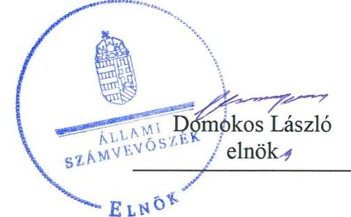
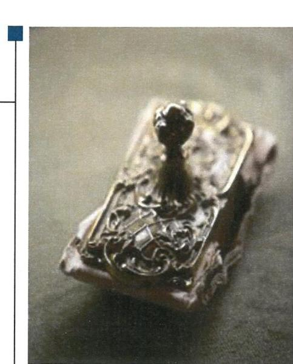
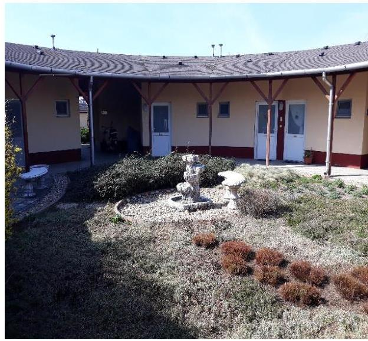
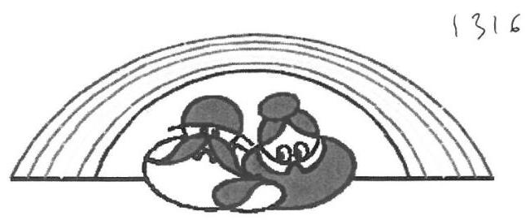
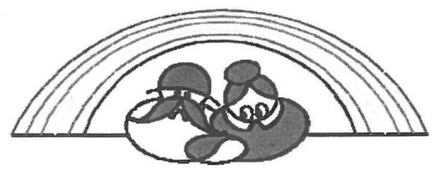
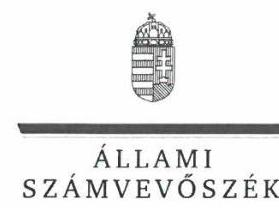
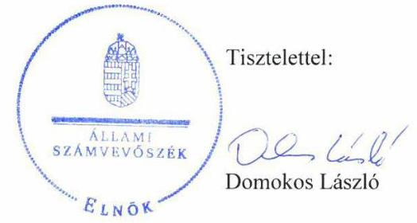

# Jelenetés 

## Nem állami humánszolgáltatók ellenőrzése

A humánszolgáltatást nyújtó államháztartáson kívüli szociális intézmények, szolgáltatók fenntartói központi költségvetésből kapott támogatásai felhasználásának ellenőrzése "Harmónia K" Szociális Szolgáltató Közhasznú Nonprofit Kft.
2019.

---

# Jelentés 

## Nem állami humánszolgáltatók ellenőrzése

A humánszolgáltatást nyújtó államháztartáson kívüli szociális intézmények, szolgáltatók fenntartói központi költségvetésből kapott támogatásai felhasználásának ellenőrzése "Harmónia K" Szociális Szolgáltató Közhasznú Nonprofit Kft.
2019. 10. hó 17. nap

---

# AZ ELLENŐRZÉST FELÜGYELTE:

- VARGA EDIT felügyeleti vezető
- AZ ELLENŐRZÉST VEZETTE ÉS A VÉGREHAJTÁSÁÉRT FELELŐS:
  - LACZI HEDVIG ANNA ellenőrzésvezető
  - A PROGRAM ÖSSZEÁLLÍTÁSÁÉRT FELELŐS:
    - TÓTPÁL SZABOLCS osztályvezető

**IKTATÓSZÁM:** EL-2018-001/2019

**TÉMASZÁM:** 2491

**ELLENŐRZÉS-AZONOSÍTÓ SZÁM:** V083503

Jelentéseink az Országgyűlés számítógépes hálózatán és az Interneten a www.asz.hu címen is olvashatóak.

---

# TARTALOMJEGYZÉK 

■ ÖSSZEGZÉS ..... 5
■ AZ ELLENŐRZÉS CÉLJA ..... 6
■ AZ ELLENŐRZÉS TERÜLETE ..... 7
■ AZ ELLENŐRZÉS HÁTTERE, INDOKOLTSÁGA ..... 8
■ A JELENTÉS LÉNYEGES KÉRDÉSKÖREI ..... 9
■ AZ ELLENŐRZÉS HATÓKÖRE ÉS MÓDSZEREI ..... 10
■ MEGÁLLAPÍTÁSOK ..... 12
■ JAVASLATOK ..... 14
■ MELLÉKLETEK ..... 15
I. sz. melléklet: Értelmező szótár ..... 15
■ FÜGGELÉKEK ..... 17
I. sz. függelék a jelentéshez ..... 17
II. sz. függelék: Észrevételek ..... 18
■ RÖVIDÍTÉSEK JEGYZÉKE ..... 25

---

.

---

# ÖSSZEGZÉS 

A "Harmónia K" Szociális Szolgáltató Közhasznú Nonprofit Kft. nem alakította ki a szabályszerű gazdálkodási környezetét, továbbá nem tartotta nyilván a szociális közfeladat ellátáshoz rendelt költségvetési támogatásokat, gazdálkodásával nem számolt el. Ezáltal nem teremtette meg a költségvetési támogatások felhasználásának szabályszerű feltételeit és a költségvetési támogatások felhasználásának átláthatóságát, elszámoltathatóságát.

## Az ellenőrzés társadalmi indokoltsága

Az Állami Számvevőszék stratégiájában hangsúlyos szerepet szán annak, hogy szilárd szakmai alapon álló, értékteremtő ellenőrzéseivel előmozdítsa a közpénzügyek átláthatóságát, rendezettségét és javaslataival a közpénzek és a közvagyon szabályos, gazdaságos, hatékony és eredményes felhasználását segítse. Az Állami Számvevőszék a stratégiájában célul tűzte ki, hogy az államháztartáson kívülre nyújtott költségvetési támogatások ellenőrzésével hozzájárul ahhoz, hogy a közpénzeket az államháztartáson kívüli szervezetek is átlátható módon használják fel a közfeladatok szerződésben vállalt ellátása érdekében.

Az Állami Számvevőszék e stratégiai céljaival összhangban - az Állami Számvevőszékről szóló 2011. évi LXVI. törvény felhatalmazása alapján - végzi a központi költségvetésből származó források, nyújtott támogatások - kedvezményezett szervezetek közfeladat ellátásához való - felhasználásának az ellenőrzését. Az Állami Számvevőszék hozzájárul ezzel ahhoz is, hogy a nyilvánosság és az igénybevevők megfelelő tájékoztatást kapjanak az államháztartáson kívüli közfeladatot ellátók működéséről.

## Főbb megállapítások, következtetések

A "Harmónia K" Szociális Szolgáltató Közhasznú Nonprofit Kft. nem alakította ki a szabályszerű gazdálkodási környezetét, a költségvetési támogatások átlátható felhasználásának feltételeit, módszereit.

A "Harmónia K" Szociális Szolgáltató Közhasznú Nonprofit Kft. a gazdálkodásával nem számolt el, mivel számviteli nyilvántartásaiban nem különítette el a saját és intézményei gazdálkodásával összefüggő tételeket, továbbá a költségvetési támogatások felhasználását nem feladatonkénti bontásban, elkülönítetten kezelte, így a költségvetési támogatások felhasználásának átláthatósága és elszámoltathatósága nem volt biztosított.

---

# AZ ELLENŐRZÉS CÉLJA 

AZ ELLENŐRZÉS CÉLJA annak értékelése, hogy a "Harmónia K" Szociális Szolgáltató Közhasznú Nonprofit Kft., mint szociális intézmények fenntartója központi költségvetésből kapott támogatásainak felhasználása szabályszerű volt-e, a támogatások igénylése, évközi módosítása és év végi elszámolása megfelelt-e a jogszabályi előírásoknak.

---

# **AZ ELLENŐRZÉS TERÜLETE**

## **Harmónia K. Szociális Szolgáltató Közhasznú Nonprofit Kft.**

A gyömrői székhelyű "Harmónia K." Szociális Szolgáltató Közhasznú Nonprofit Kft-t 1999-ben alapította egy magánszemély. A 2016. március 12-ei keltezésű Társasági Szerződésben1 foglaltak szerint négy magánszemély lett a tulajdonosa.

A Fenntartó2 legfőbb döntéshozó szerve 2016. március 12-től a taggyűlés3 volt.

A Fenntartó a szociális feladatait négy helyszínen lévő, nem önálló jogi személyiséggel rendelkező intézményeiben4 látta el. A Fenntartó közhasznú tevékenysége körében idősek, fogyatékosok bentlakásos ellátását végezte. Emellett egyéb humán egészségügyi ellátást, bentlakásos nem kórházi ápolást is végzett. A Fenntartó 2015-2017. években közhasznú szervezetként működött.

A Fenntartó intézményeit az SzCsM.5 rendeletben foglaltak szerint a Kormányhivatal6 nyilvántartásba vette, valamint az intézmények az Sznyvhr.-ben7 meghatározott tanúsítvánnyal rendelkeztek.

A Fenntartó bevételeinek alakulását az 1. táblázat mutatja be:

1. táblázat

|  A FENNTARTÓ BEVÉTELEINEK ALAKULÁSA 2015-2017. KÖZÖTTI IDŐSZAKBAN (MFT) |  |  |   |
| --- | --- | --- | --- |
|  Megnevezés | 2015. | 2016. | 2017.  |
|  Összes bevétel | 1158,6 | 1202,5 | 1215,1  |
|  Ebből: nettó árbevétel | 803,0 | 846,5 | 830,8  |
|  közhasznú tevékenység támogatása | 346,3 | 350,9 | 377,8  |
|  egyéb bevétel | 5,0 | 5,1 | 3,7  |
|  egyéb támogatás | 3,0 | 0,0 | 2,6  |
|  pénzügyi, és rendkívüli bevétel | 1,3 | 0,0 | 0,2  |
|  közhasznú tevékenység támogatása/ összes bevétel aránya | 29,9 % | 29,2 % | 31,1 %  |

*Forrás: "Harmónia K." Nonprofit Kft. 2015-2017. évi beszámolói*

---

# AZ ELLENŐRZÉS HÁTTERE, INDOKOLTSÁGA 

A szociális feladatokat ellátó nem állami intézményfenntartók részére közfeladataik ellátására 2015-2017. években jelentős összegű pénzügyi támogatást biztosítottak a mindenkori költségvetési törvények a bennük megfogalmazott feltételek mellett.

Az ÁSZ8 a stratégiájában célul tűzte ki, hogy az államháztartáson kívülre nyújtott költségvetési támogatások ellenőrzésével hozzájárul ahhoz, hogy a közpénzeket az államháztartáson kívüli szervezetek is átlátható módon használják fel a közfeladatok szerződésben vállalt ellátása érdekében. Az ÁSZ a stratégiájában foglaltak alapján is indokolt az ellenőrzés, amely a társadalom számára jelzi, hogy a közpénz államháztartáson kívüli felhasználása sem maradhat ellenőrizetlenül. Az államháztartáson kívülre nyújtott költségvetési támogatások ellenőrzésével az ÁSZ hozzájárul ahhoz, hogy a közpénzeket a nem állami fenntartók átlátható módon használják fel a közfeladatok ellátására kötött szerződésekben vállalt kötelezettségek teljesítése érdekében. Az ÁSZ az ellenőrzés javaslataival hozzájárulhat az említett rendszerek szabályszerű támogatás-felhasználásához, javíthatja a társadalmi-gazdasági döntések megalapozottságát, amely a "jó kormányzás" feltétele.

---

# A JELENTÉS LÉNYEGES KÉRDÉSKÖREI 

1. A szociális humánszolgáltató közfeladatot ellátó fenntartó szabályszerű működési - és gazdálkodási környezet kialakításával megteremtette-e a költségvetési támogatások átlátható, elszámoltatható igénybevételének, felhasználásának feltételeit?
2. Az államháztartáson kívüli fenntartó az átvállalt szociális humánszolgáltatási közfeladathoz biztosított költségvetési támogatásokat szabályszerűen fordította-e a humánszolgáltató intézményei működtetésére. Az intézményei működtetéséhez felhasznált közpénzekre vonatkozó gazdálkodásával elszámolt-e?

---

# AZ ELLENŐRZÉS HATÓKÖRE ÉS MÓDSZEREI 

## Az ellenőrzés típusa

Megfelelőségi ellenőrzés.

## Az ellenőrzött időszak

A 2015. január 1-je és 2017. december 31-e közötti időszak. A helyszíni szemle tekintetében 2018. január 1-jétől az utolsó helyszíni szemle időpontjáig 2019. március 21.-ig tartó időszak.

## Az ellenőrzés tárgya

Az ellenőrzés a szociális humánszolgáltatási közfeladatokat ellátó államháztartáson kívüli fenntartók, humánszolgáltatási közfeladatai ellátásához a költségvetési törvényekben biztosított központi költségvetési támogatások igénylése, évközi módosítása és év végi elszámolása fenntartói feladatainak ellátása, illetve e központi költségvetésből kapott támogatásaik humánszolgáltatási közfeladatokra való fenntartó általi felhasználása szabályszerűségének értékelésére terjed ki.

## Az ellenőrzött szervezet

"Harmónia K" Szociális Szolgáltató Közhasznú Nonprofit Kft.

## Az ellenőrzés jogalapja

Az ellenőrzés jogszabályi alapját az ÁSZ tv.9 1. § (3) bekezdése, 5. § (3) bekezdésben foglalt előírások adták.

## Az ellenőrzés módszerei

Az ellenőrzést az ellenőrzési program szempontjai, kérdései, az ellenőrzött időszakban hatályos jogszabályok, a nemzetközi standardokat irányadónak tekintve, az ellenőrzés szakmai szabályok és módszertanok figyelembe vételével végeztük. A közpénzekkel való felelős gazdálkodás segítésére irányuló javaslatok kidolgozásakor a hatályos jogszabályok voltak az irányadóak.

Az ellenőrzés ideje alatt az ellenőrzött szervezettel történő kapcsolattartást az ÁSZ SZMSZ10-ének vonatkozó előírásai alapján biztosítottuk.

---

Az ellenőrzési kérdések megválaszolásához szükséges bizonyítékok megszerzése az ellenőrzött által rendelkezésre bocsátott dokumentumokra, adatokra alapozva megfigyelés, szemle (szemrevételezés), kérdésfeltevés (információkérés), valamint elemző eljárással történt.

Az ellenőrzési bizonyítékként felhasználható adatforrások közé tartoztak egyrészt az ellenőrzési program részletes szempontjainál felsorolt adatforrások, másrészt minden - az ellenőrzés folyamán feltárt, az ellenőrzés szempontjából információt tartalmazó - dokumentum.

Az ellenőrzés lefolytatásához az ellenőrzött szervezet a kitöltött tanúsítványok, valamint az ÁSZ által kért dokumentumok elektronikus úton való megküldésével szolgáltatott adatokat, információkat. Az így rendelkezésre bocsátott adatok, információk és a tanúsítványok adatai valódiságának kontrollja az ellenőrzés keretében történt.

Az egységes értelmezést támogatta a jelentés mellékletét képező fogalomtár és rövidítésjegyzék.

Az ellenőrzést alapvetően a szociális humánszolgáltatások esetében a központi költségvetési támogatások igénylésével, módosításával, felhasználásával, elszámolásával kapcsolatos feladatokat ellátó államháztartáson kívüli fenntartóknál végeztük. A fenntartott intézményeknél helyszíni szemle keretében győződtünk meg a tényleges feladatellátásról (verifikáció).

A szociális humánszolgáltatások központi költségvetési támogatásai igénylésével, módosításával, elszámolásával kapcsolatos, államháztartáson kívüli fenntartó jogszabályokban előírt feladatai betartását, továbbá a központi költségvetési támogatások szabályszerű kezelését, nyilvántartását ellenőriztük a fenntartónál, az ott rendelkezésre álló határozatok, nyilvántartások, beszámolók és egyéb dokumentumok alapján. Az ellenőrzés nem terjedt ki a szociális humánszolgáltatások központi költségvetési támogatásai igénylése, módosítása, elszámolása valódiságának, megalapozottságának, helyességének - sem a fenntartónál, sem a székhely intézményeinél való - értékelésére (mivel ennek felülvizsgálata, ellenőrzése a finanszírozó jogszabályban előírt feladata, határozatai kiadása előtt). Továbbá nem terjedt ki az ellenőrzés e források, intézmények általi szabályszerű felhasználásának értékelésére.

---

# MEGÁLLAPÍTÁSOK 

## 1. A szociális humánszolgáltató közfeladatot ellátó fenntartó szabályszerű működési - és gazdálkodási környezet kialakításával megteremtette-e a költségvetési támogatások átlátható, elszámoltatható igénybevételének, felhasználásának feltételeit?

Összegző megállapítás

A Fenntartó a működési környezetet szabályosan kialakította, azonban nem gondoskodott a szabályszerű gazdálkodási környezet kialakításáról. Ezáltal nem teremtette meg a költségvetési támogatások átlátható, elszámoltatható felhasználásának feltételeit.

A Fenntartó a Ptk.-ban11 előírtaknak megfelelően rendelkezett alapító okirattal, valamint társasági szerződéssel, amely tartalmazta a tevékenységét és a Civil tv.-ben12 meghatározott, a közhasznú jogálláshoz szükséges rendelkezéseket. A Fenntartó az SZMSZ-ben13 a Szoc. tv.14 előírásaival összhangban gondoskodott a humánszolgáltatást végző intézményei feladatainak és működési kereteinek meghatározásáról.

A Fenntartó rendelkezett a Számv. tv.15 előírásai szerinti számviteli politikával1,2 és az annak keretében elkészítendő szabályzatokkal valamint számlarenddel.

A költségvetési támogatások igénylése, módosítása és a Kincstár16 felé történő elszámolása az Atr.-ben17 meghatározottak alapján történt.

A Fenntartó a Számv. tv. 161/A §. (2) bekezdésének előírása ellenére nem gondoskodott a közpénzek felhasználásának ellenőrizhetősége érdekében a könyvvezetési rendszerének oly módon való szabályozásáról, továbrészletezéséről, hogy abból az Atr.-ben, mint vonatkozó külön jogszabályban meghatározott adatok rendelkezésre álljanak.

---

# 2. Az államháztartáson kívüli fenntartó az átvállalt szociális humánszolgáltatási közfeladathoz biztosított költségvetési támogatásokat szabályszerűen fordította-e a humánszolgáltató intézményei működtetésére. Az intézményei működtetéséhez felhasznált közpénzekre vonatkozó gazdálkodásával elszámolt-e? 

Összegző megállapítás

A Fenntartó nem igazolta, hogy a szociális közfeladathoz biztosított költségvetési támogatásokat az intézményei működtetésére fordította, a közpénzekre vonatkozó gazdálkodásával nem számolt el.

A Fenntartó az Atr. 16. § (1) bekezdésében előírtak ellenére számviteli rendjében nem különítette el a saját és humánszolgáltatást végző intézményei gazdálkodását, valamint a támogatások felhasználását feladatonkénti bontásban, elkülönítetten nem mutatta ki.

A Fenntartó a Számv. tv. 4. § (1) bekezdésében meghatározattak ellenére a 2015-2017. évi beszámolóit a Számv. tv. 161/A §. (2) bekezdésében foglaltaknak megfelelő könyvvezetéssel nem támasztotta alá.

---

# JAVASLATOK 

Az ÁSZ
 tv. 33. § (1) bekezdésében foglaltak értelmében az ellenőrzött szervezet vezetője köteles a jelentésben foglalt megállapításokhoz kapcsolódó intézkedési tervet összeállítani és azt a jelentés kézhezvételétől számított 30 napon belül az ÁSZ részére megküldeni. Amennyiben az ellenőrzött szervezet vezetője nem küldi meg határidőben az intézkedési tervet, vagy továbbra sem elfogadható intézkedési tervet küld, az Állami Számvevőszék elnöke az ÁSZ tv. 33. § (3) bekezdése a) és b) pontjaiban foglaltakat érvényesítheti.

## „HARMÓNIA K" Szociális Szolgáltató Közhasznú Nonprofit Kft. ügyvezetője részére

1. A szabályszerű gazdálkodási környezet kialakítása, a költségvetési támogatások átlátható, elszámoltatható felhasználása feltételeinek megteremtése érdekében gondoskodjon a Fenntartó könyvvezetési rendszerének jogszabályi előírásoknak megfelelő módon történő kialakításáról és részletezéséről.
(1. sz. megállapítás 4. bekezdése alapján)
2. A költségvetési támogatások szabályszerű felhasználása, a beszámoló jogszabályi előírásoknak megfelelő alátámasztása érdekében gondoskodjon a Fenntartó számviteli rendjében a Fenntartó és intézményei gazdálkodásának elkülönítéséről, és a támogatások felhasználásának feladatonként elkülönítve történő kimutatásáról.
(2. sz. megállapítás 1. és 2. bekezdései alapján)

---

# MELLÉKLETEK 

- I. SZ. MELLÉKLET: ÉRTELMEZŐ SZÓTÁR
befogadás
civil szervezet
ellátási terület
feladatfinanszírozás
humánszolgáltatás
költségvetési támogatás
nem állami, nem önkormányzati (államháztartáson kívüli) intézmény fenntartó
székhely intézmény
telephely

A Szoctv. illetve a Gyvt. szerinti, a szociális szolgáltatások és a gyermekjóléti szolgáltató tevékenységek területi lefedettségét figyelembe vevő finanszírozási rendszerbe történő befogadás.
A Civil tv. 2. § 6. pontja szerint civil szervezet a civil társaság, a Magyarországon nyilvántartásba vett egyesület (a párt, a szakszervezet és a kölcsönös biztosító egyesület kivételével), a közalapítvány és a pártalapítvány kivételével az alapítvány.
Az a terület, ahonnan az engedélyes gyermekeket, illetve más ellátottakat fogad.
A közfeladat államháztartáson kívüli szervezet által történő ellátásához közvetlenül kapcsolódó, arányos működési költségeket finanszírozó költségvetési támogatás.
Külön törvényben meghatározott szociális, gyermekjóléti, gyermekvédelmi, közoktatási, felsőoktatási, kulturális közfeladatok (2014. évi Kvtv. 34. § (1), (4) bekezdés, 1. számú melléklet XX/20/2. alcím, 19. alcím, 2015. évi Kvtv. 43. § (1), (4) bekezdés, 1. számú melléklet XX/20/2/3. jogcím csoport, 19. alcím, 2016. évi Kvtv. 41. § (1), (4) bekezdés, 1. számú melléklet XX/20/2/3. jogcím csoport, 19. alcím).
a társadalombiztosítás pénzügyi alapjai kivételével az államháztartás központi alrendszeréből ellenérték nélkül, pénzben nyújtott támogatások (Áht. ${ }^{18}$ 1. § 14. pont)
A költségvetési törvényekben (2013. évi CCXXX. törvény 33-34. §, 2014. évi C. törvény 42-43. §, 2015. évi C. törvény 40-41. §) megállapított támogatás. Például a 2015. évi C. törvény 40-41. § szerint többek között: Az Országgyűlés a szociális, gyermekjóléti, gyermekvédelmi közfeladatot ellátó intézményt, szolgáltatást fenntartó egyházi jogi személy, civil szervezet, közalapítvány, országos nemzetiségi önkormányzat, települési vagy területi nemzetiségi önkormányzat, gazdasági társaság, és a humánszolgáltatást alaptevékenységként végző, az Szja tv. hatálya alá tartozó egyéni vállalkozó (a továbbiakban együtt: nem állami szociális fenntartó) részére támogatást állapít meg a következők szerint: a támogatás a nem állami szociális fenntartót a települési önkormányzatok 2. melléklet III. pont 3. alpont c)-k) pontjában és III. pont 5. alpont a) pontjában meghatározott támogatásaival azonos jogcímeken, összegben és feltételek mellett illeti meg.
A szociális, gyermekjóléti és gyermekvédelmi közfeladatokat/humánszolgáltatásokat ellátó intézményt fenntartó egyházi jogi személy, társadalmi szervezet, alapítvány, közalapítvány, civil szervezet, országos nemzetiségi önkormányzat, nonprofit gazdasági társaság, gazdasági társaság és a humánszolgáltatást alaptevékenységként végző, Szja tv. hatálya alá tartozó egyéni vállalkozó. (2013. évi Kvtv. ${ }^{19}$ 35. § (1), (3) bekezdés, 2014. évi Kvtv. 33. §, 34. § (1), (4) bekezdés, 2015. évi Kvtv. 42. §, 43. § (1), (4) bekezdés, 2016. évi Kvtv. 40. §, 41. § (1), (4) bekezdés, 2017. évi Kvtv. ${ }^{20} 41 . \S$ (1), (4))
a szolgáltató székhelye, azaz a szolgáltató központi ügyintézésének helye, függetlenül attól, hogy használják-e szolgáltatás nyújtására (Sznyvhr. ${ }^{21} 1 . \S$ k) pont) (hatályos: 2013. december 1-től)
a szolgáltató székhelyétől különböző, szolgáltató/intézmény használatában álló hely, a szociális humánszolgáltatáshoz használt, bejegyzett hely. (Sznyvhr. 1.§ l) pont) (hatályos: 2015. január 1-től)

---

.

---

# FÜGGELÉKEK 

- I. SZ. FÜGGELÉK A JELENTÉSHEZ

Az Állami Számvevőszék az ellenőrzések során feltárt tényekhez kapcsolódó további körülmények tisztázásra eszközrendszerrel nem rendelkezik. Amennyiben az ellenőrzésen túlmutatóan indokoltnak látszik az ellenőrzés során feltárt körülmények további vizsgálata, az Állami Számvevőszék törvényi felhatalmazás alapján az ellenőrzés által feltárt körülményeket továbbítja a hatáskörrel rendelkező szervnek a szükséges intézkedések megtétele, eljárások lefolytatása érdekében.

1. A Fenntartó a 2015-2017. évek vonatkozásában a Számv. tv. 161/A §. (2) bekezdésének előírása ellenére nem gondoskodott a közpénzek felhasználásának ellenőrizhetősége érdekében a könyvvezetési rendszerének oly módon való továbbrészletezéséről, hogy abból az Atr.-ben, mint vonatkozó külön jogszabályban meghatározott adatok rendelkezésre álljanak.
2. A Fenntartó a 2015-2017. évek vonatkozásában a számviteli rendjében nem biztosította az Atr. 16. § (1) bekezdésében foglaltak ellenére a saját és az intézményei gazdálkodásának elkülönített elszámolását, továbbá a támogatások felhasználásának feladatonkénti bontását.
A Fenntartónál a gazdálkodásra vonatkozó szabályozási hiányosság és az elkülönített nyilvántartás vezetésének elmaradása miatt felmerült a támogatások nem rendeltetésszerű felhasználásának gyanúja.
Az 1. és 2. pontban részletezett esetek konkrét körülményeinek feltárására a Magyar Államkincstár rendelkezik hatáskörrel.

---

A jelentéstervezetet a Számvevőszék 15 napos észrevételezésre megküldte az ellenőrzött szervezet vezetőjének az ÁSZ tv. 29. §* (1) bekezdése előírásának megfelelően.

A „Harmónia K" Szociális Szolgáltató Közhasznú Nonprofit Kft. ügyvezetője a jelentéstervezet megállapításaira írásban észrevételt tett.
Az ÁSZ tv. 29. § (3) bekezdésével összhangban az ÁSZ a Függelékben feltünteti az ellenőrzés megállapításaival kapcsolatban tett, figyelembe nem vett észrevételeket, és megindokolja, hogy azokat miért nem fogadta el.

[^0]
[^0]:    * 29. § (1) Az Állami Számvevőszék az ellenőrzési megállapításait megküldi az ellenőrzött szervezet vezetőjének vagy az általa megbízott személynek, és annak, akinek személyes felelősségét állapította meg.
    (2) Az ellenőrzött szervezet vezetője és a felelősként megjelölt személy az ellenőrzés megállapításaira tizenöt napon belül írásban észrevételt tehet.
    (3) Az Állami Számvevőszék az észrevételre a beérkezésétől számított harminc napon belül írásban válaszol. A figyelembe nem vett észrevételeket köteles a jelentésben feltüntetni, és megindokolni, hogy azokat miért nem fogadta el.

---

Ikt.szám: EL-1105-037/2019
Cím: Állami Számvevőszék
1052 Budapest, Apáczai Csere János utca 10
1364 Budapest 4. Pf. 54

Domokos László
Elnök Úr
és
Varga Edit
Felügyeleti Vezető Úrasszony részére

# Tisztelt Elnök Úr! 

## Tisztelt Felügyeleti Vezető Úrasszony!

A 2019. 08. 09.-én kelt és 2019. 08. 13.-án érkeztetett fenthivatkozott iktatószámú Számvevőszéki jelentéstervezettel kapcsolatosan a Harmónia K Közhasznú Nonprofit Kft. továbbiakban, mint Fenntartó - képviseletében hálás köszönetünket szeretnénk kifejezni azért,
hogy az Önök által közölt két megállapításban és javaslatban foglaltak maradéktalan teljesítésével a Fenntartó mind a négy szociális intézménye/szolgáltatója vonatkozásában még pontosabban tehet eleget azon küldetésének,
mellyel immáron közel 20 éve biztosítja a több mint 450 idős, fogyatékos és pszichiátriai beteg biztonságos és színvonalas ellátását,
valamint a komoly hivatástudattal rendelkező közel 200 megbecsült munkatársa és családjaik számára, a perspektivikus és biztonságos megélhetést.

Az ÁSZ tv. 29. § (2) bekezdésében foglaltak szerint észrevételezzük, hogy a
Megállapítások 1. pontjában foglaltak szerint a könyvvezetési rendszerünk továbbrészletezésével a közpénzek felhasználásának ellenőrizhetősége még pontosabbá válhat és így az Atr.-ben, mint vonatkozó külön jogszabályban meghatározott adatok részletezve is rendelkezésre fognak állni.

---

"HARMÓNIA K" Közhasznú Nonprofit Kft.
2230 Gyömrő, Táncsics Mihály u. 2/a
Tel.: (29)-530-150
Fax: (29)-530-151
E-mail: info@harmonia-k.hu

A most megváltoztatásra kerülő eddigi gyakorlatunk azért öltötte fel jelenlegi formáját, mert a vizsgált időszak valamennyi évében a Fenntartó - a hatályos költségvetési törvény értelmében - Szakmai dolgozók átlagbére alapján számított béralapú támogatásban részesült. A költségvetési törvényben foglaltak értelmében a Fenntartó kizárólag munkabérre fordíthatta a támogatást. A Fenntartó éves bérköltsége viszont minden évben magasan meghaladta a támogatás mértékét, így a támogatás maradéktalanul, jogszerűen került felhasználásra, amit az Igazgatóság ellenőrzései is maradéktalanul visszaigazoltak.

A Megállapítások 2. pontjában foglaltak szerint a Fenntartó számviteli rendjében kell elkülöníteni a saját és humánszolgáltatást végző intézményei gazdálkodását, valamint a támogatások felhasználását feladatonkénti bontásban.

A Fenntartó eddigi számviteli rendjének kialakítása azért történt fenntartói szinten összesítve, mert a Fenntartónak nincs különálló gazdasági tevékenysége, bevételei, kiadásai és a támogatások felhasználása csak és kizárólag intézményein keresztül valósult meg.

Megállapításaikat és javaslataikat tiszteletben tartva és megköszönve, a jelentés majdani kézhezvételét követő 30 napon belül elkészítjük intézkedési tervünket, és annak Önök részéről történő jóváhagyását követően az abban foglaltakat maradéktalanul végrehajtjuk.

Ellenőrzésüket és munkájukat megköszönve, maradok tisztelettel:

Gyömrő, 2019. augusztus 16.-án
"HARMÓNIA K"
Közhasznú Nonprofit Kft.
2230 Gyömrő, Táncsics M. u. 2/a
Adószám: 20548324-1-13
dr. Huszár László Richard
ügyvezető

---

ELNÖK

Ikt.szám: EL-1105-050/2019.

# dr. Huszár László Richárd úr 

ügyvezető
"HARMÓNIA K" Szociális Szolgáltató Közhasznú Nonprofit Kft.

## Gyömrő

## Tisztelt Ügyvezető Úr!

A ,,Nem állami humánszolgáltatók ellenőrzése - A humánszolgáltatást nyújtó államháztartáson kívüli szociális intézmények, szolgáltatók fenntartói központi költségvetésből kapott támogatásai felhasználásának ellenőrzése - ,,Harmónia K" Szociális Szolgáltató Közhasznú Nonprofit Kft." címmel készített számvevőszéki jelentéstervezetre tett észrevételét köszönettel megkaptam.
Az Állami Számvevőszék észrevételre vonatkozó álláspontjáról a felügyeleti vezető által készített részletes tájékoztatást csatoltan megküldöm.
Tájékoztatom Ügyvezető urat, hogy a számvevőszéki jelentésben - az Állami Számvevőszékről szóló 2011. évi LXVI. törvény 29. § (3) bekezdése alapján - a figyelembe nem vett észrevételeket szerepeltetjük, annak indoklásával, hogy azokat az Állami Számvevőszék miért nem fogadta el.

Budapest, 2019. 08. hó 12. nap

Melléklet: Tájékoztatás az észrevételek kezeléséről

---

# Tájékoztatás az észrevételek kezeléséről 

A „Nem állami humánszolgáltatók ellenőrzése - A humánszolgáltatást nyújtó államháztartáson kívüli szociális intézmények, szolgáltatók fenntartói központi költségvetésből kapott támogatásai felhasználásának ellenőrzése - „Harmónia K" Szociális Szolgáltató Közhasznú Nonprofit Kft. "című jelentéstervezetre a 2019. augusztus 16 -án kelt levelében tett észrevételét áttekintettük, annak kezeléséről az alábbi tájékoztatást adom.

## I. Az 1. számú megállapítás kapcsán tett észrevételekre vonatkozóan

Észrevételében jelezte, hogy a megállapítások 1. pontjában foglaltak szerint a könyvvezetési rendszerünk továbbrészletezésével a közpénzek felhasználásának ellenőrizhetősége még pontosabbá válhat és így az Atr.-ben, mint vonatkozó külön jogszabályban meghatározott adatok részletezve is rendelkezésre fognak állni. A most megváltoztatásra kerülő eddigi gyakorlatuk azért öltötte fel jelenlegi formáját, mert a vizsgált időszak valamennyi évében a hatályos költségvetési törvény értelmében „Szakmai dolgozók átlagbére alapján számított béralapú támogatásban" részesültek, amit a költségvetési törvényben foglaltak szerint kizárólag munkabérre fordíthattak. Az éves bérköltségük minden évben meghaladta az észrevételben hivatkozott támogatás mértékét, így a támogatást maradéktalanul, jogszerűen használták fel.
A jelentéstervezet észrevétellel érintett megállapítása szerint a Fenntartó a Számv. tv. 161/A §. (2) bekezdésének előírása ellenére nem gondoskodott a közpénzek felhasználásának ellenőrizhetősége érdekében a könyvvezetési rendszerének oly módon való szabályozásáról, továbbrészletezéséről, hogy abból az Atr.-ben, mint vonatkozó külön jogszabályban meghatározott adatok rendelkezésre álljanak.
Az Atr. 16. § (1) bekezdés előírása szerint a fenntartó a támogatás felhasználását, nem önállóan gazdálkodó szolgáltatók esetén a fenntartó és az egyes szolgáltatók gazdálkodását, továbbá a szolgáltató a támogatás felhasználását a számviteli rendjében feladatonkénti bontásban, elkülönítetten köteles kezelni. Az adatbekérés során az Állami Számvevőszék (továbbiakban: ÁSZ) rendelkezésére bocsátott, 2013. január 1-jétől hatályos számlarend és számviteli politika alapján megállapítható, hogy
 nem gondoskodtak könyvvezetési rendszerük oly módon való szabályozásáról, továbbszármazékolásáról, hogy abból az Atr.-ben, mint vonatkozó külön jogszabályban meghatározott adatok, így a fenntartó és az egyes szolgáltatók gazdálkodására, továbbá a szolgáltatók támogatás felhasználására vonatkozó adatok feladatonkénti bontásban, elkülönítetten rendelkezésre álljanak.
A Magyar Államkincstár Budapesti és Pest Megyei Igazgatóság a Fenntartó 2015-2017. évi költségvetési támogatásait megállapító határozatai szerint, az észrevételben hivatkozott támogatás megállapítására a Fenntartóhoz tartozó szolgáltatók vonatkozásában az általuk ellátott feladatokhoz kapcsolódóan került sor. A támogatás felhasználása számviteli rendben szabályozott feladatonkénti bontásban történő elkülönítése hiányában nem igazolt a támogatás jogszerű felhasználása.

---

Mindezek alapján az észrevételt nem fogadjuk el, az ÁSZ megállapítása helytálló, a jelentéstervezet módosítása nem indokolt.

# II. A 2. számú megállapítás kapcsán tett észrevételre vonatkozóan 

A megállapítások 2. pontjára vonatkozó észrevétele szerint a Fenntartó eddigi számviteli rendjének kialakítása azért történt fenntartói szinten összesítve, mert a Fenntartónak nincs különálló gazdasági tevékenysége, bevételei, kiadásai és a támogatások felhasználása csak és kizárólag intézményein keresztül valósult meg.
A jelentéstervezet észrevétellel érintett megállapítása szerint a Fenntartó az Atr. 16. § (1) bekezdésében előírtak ellenére számviteli rendjében nem különítette el a saját és humánszolgáltatást végző intézményei gazdálkodását, valamint a támogatások felhasználását feladatonkénti bontásban, elkülönítetten nem mutatta ki.
Kapcsolódva tájékoztatásom I. pontjához, az Atr. 16. § (1) bekezdés előírása szerint a fenntartó a támogatás felhasználását, nem önállóan gazdálkodó szolgáltatók esetén a fenntartó és az egyes szolgáltatók gazdálkodását, továbbá a szolgáltató a támogatás felhasználását a számviteli rendjében feladatonkénti bontásban, elkülönítetten köteles kezelni. Az ellenőrzés során az ÁSZ rendelkezésére bocsátott 2015-2017. évi főkönyvi kivonatokból megállapítható, hogy a vonatkozó évi költségvetési támogatások felhasználása feladatonkénti bontásban történő elkülönítésére, elszámolására és kimutatására, az egyes szolgáltatók gazdálkodásának, továbbá a Fenntartó - alapító okiratában, illetve társasági szerződésében szereplő, szociális feladatokhoz nem köthető tevékenységei, így különösen a képviselet, könyvvezetés, könyvvizsgálat stb. - gazdálkodásának elkülönítésére nem került sor.
Mindezek alapján az észrevételt nem fogadjuk el, az ÁSZ megállapítása helytálló, a jelentéstervezet módosítása nem indokolt.

Budapest, 2019. 05 hó 12 nap

Varga Edit
felügyeleti vezető

---

.

---

# RÖVIDÍTÉSEK JEGYZÉKE 

${ }^{1}$ Társasági Szerződés
${ }^{2}$ Fenntartó
${ }^{3}$ taggyülés
${ }^{4}$ intézmények
${ }^{5}$ SzCsM. rendelet
${ }^{6}$ Kormányhivatal
${ }^{7}$ Sznyvhr.
${ }^{8}$ ÁSZ
${ }^{9}$ ÁSZ tv.
${ }^{10}$ ÁSZ SZMSZ
${ }^{11}$ Ptk.
${ }^{12}$ Civil tv.
${ }^{13}$ SZMSZ1
SZMSZ2
SZMSZ3
${ }^{14}$ Szoc. tv.
${ }^{15}$ Számv. tv.
${ }^{16}$ Kincstár
${ }^{17}$ Atr.
${ }^{18}$ Áht.
${ }^{19}$ 2013. évi Kvtv.
${ }^{20}$ 2017. évi Kvtv.
${ }^{21}$ Sznyvhr.
„Harmónia K" Szociális Szolgáltató Közhasznú Nonprofit Kft. Társasági Szerződése (hatályos: 2016. március 12-től)
„Harmónia K" Szociális Szolgáltató Közhasznú Nonprofit Kft.
„Harmónia K" Szociális Szolgáltató Közhasznú Nonprofit Kft. taggyúlése
Szivárvány Ház 2230 Gyömrő, Pál Mihály u. 6.,Harmónia Idősek Háza 230, Gyömrő, Táncsics Mihály u. 2/a., Borostyán Ház 2230 Gyömrő, Pál Mihály u.8., Nefelejcs Ház 2230 Gyömrő, Pál Mihály u. 10.
1/2000. (I. 7.) SzCsM rendelet a személyes gondoskodást nyújtó szociális intézmények szakmai feladatairól és működésük feltételeiről
Pest Megyei Kormányhivatal Szociális és Gyámhivatal
369/2013. (X. 24.) Korm. rendelet a szociális, gyermekjóléti és gyermekvédelmi szolgáltatók, intézmények és hálózatok hatósági nyilvántartásáról és ellenőrzéséről
Állami Számvevőszék
2011. évi LXVI. törvény az Állami Számvevőszékről

Az Állami Számvevőszék elnökének 2/2018. (XII. 28.) ÁSZ utasítása az Állami Számvevőszék Szervezeti és Működési Szabályzatáról (hatályos: 2019. január 1-jétől),
2013. évi V. törvény a Polgári törvénykönyvről
2011. évi CLXXV. törvény az egyesülési jogról, a közhasznú jogállásról, valamint a civil szervezetek működéséről és támogatásáról
„HARMÓNIA K" Közhasznú Nonprofit Kft. Szervezeti és Működési Szabályzata (hatályos: 2011.július 12-től)
„HARMÓNIA K" Közhasznú Nonprofit Kft. Szervezeti és Működési Szabályzata (hatályos: 2016. szeptember 1-től)
„HARMÓNIA K" Közhasznú Nonprofit Kft. Szervezeti és Működési Szabályzata (hatályos: 2017. október 4-től)
1993. évi III. törvény a szociális igazgatásról és szociális ellátásokról, 2000. évi C. törvény a számvitelről

Magyar Államkincstár
489/2013. (XII.18.) Korm. rendelet az egyházi és nem állami fenntartású szociális gyermekjóléti és gyermekvédelmi szolgáltatók, intézmények és hálózatok állami támogatásáról,
2011. évi CXCV. törvény az államháztartásról
2012. évi CCIV. törvény Magyarország 2013. évi központi költségvetéséről
2016. évi XC. törvény Magyarország 2017. évi központi költségvetéséről

369/2013. (X. 24.) Korm. rendelet a szociális, gyermekjóléti és gyermekvédelmi szolgáltatók, intézmények és hálózatok hatósági nyilvántartásáról és ellenőrzéséről

---

# ÁLLAMI SZÁMVEVŐSZÉK 

1052 Budapest, Apáczai Csere János utca 10.
Levélcím: 1364 Budapest 4. Pf. 54
Telefon: +36 14849100 Telefax: +36 14849200
www.asz.hu
