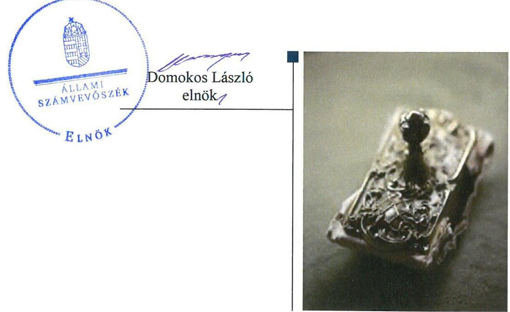
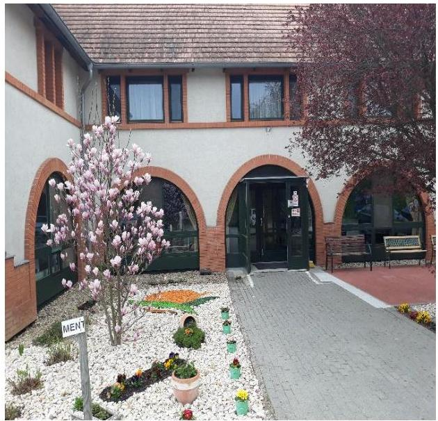
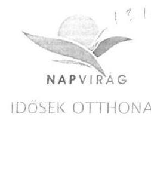
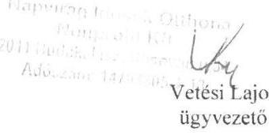
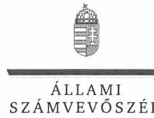
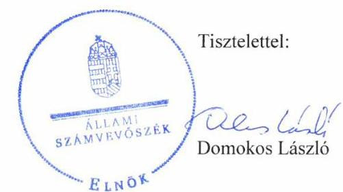
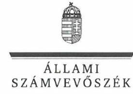

# Jelentés 

## Nem állami humánszolgáltatók ellenőrzése

A humánszolgáltatást nyújtó államháztartáson kívüli szociális intézmények, szolgáltatók fenntartói központi költségvetésből kapott támogatásai felhasználásának ellenőrzése Napvirág Idősek Otthona Nonprofit Szolgáltató Közhasznú Korlátolt Felelősségű Társaság 2019.

---

# Jelentés 

## Nem állami humánszolgáltatók ellenőrzése

A humánszolgáltatást nyújtó államháztartáson kívüli szociális intézmények, szolgáltatók fenntartói központi költségvetésből kapott támogatásai felhasználásának ellenőrzése Napvirág Idősek Otthona Nonprofit Szolgáltató Közhasznú Korlátolt Felelősségű Társaság
2019. 10. hó 17. nap

---

# AZ ELLENŐRZÉST FELÜGYELTE:

- KAKAS SÁNDOR felügyeleti vezető
- AZ ELLENŐRZÉST VEZETTE ÉS A VÉGREHAJTÁSÁÉRT FELELŐS:
  - DR. TÓTH VIKTÓRIA ellenőrzésvezető
  - RÁCZKEVI KATALIN ellenőrzésvezető
- A PROGRAM ÖSSZEÁLLÍTÁSÁÉRT FELELŐS:
  - TÓTPÁL SZABOLCS osztályvezető

**IKTATÓSZÁM:** EL-2019-001/2019

**TÉMASZÁM:** 2491

**ELLENŐRZÉS-AZONOSÍTÓ SZÁM:** V083523

Jelentéseink az Országgyűlés számítógépes hálózatán és az Interneten a www.asz.hu címen is olvashatóak.

---

# TARTALOMJEGYZÉK 

■ ÖSSZEGZÉS ..... 5
■ AZ ELLENŐRZÉS CÉLJA ..... 6
■ AZ ELLENŐRZÉS TERÜLETE ..... 7
■ AZ ELLENŐRZÉS HÁTTERE, INDOKOLTSÁGA ..... 8
■ A JELENTÉS LÉNYEGES KÉRDÉSKÖREI ..... 9
■ AZ ELLENŐRZÉS HATÓKÖRE ÉS MÓDSZEREI ..... 10
■ MEGÁLLAPÍTÁSOK ..... 12
■ JAVASLATOK ..... 14
■ MELLÉKLETEK ..... 15
I. sz. melléklet: Értelmező szótár ..... 15
■ FÜGGELÉKEK ..... 17
I. sz. függelék a jelentéshez ..... 17
II. sz. függelék: Észrevételek ..... 18
■ RÖVIDÍTÉSEK JEGYZÉKE ..... 23

---

.

---

# ÖSSZEGZÉS 

A Napvirág Idősek Otthona Nonprofit Szolgáltató Közhasznú Korlátolt Felelősségű Társaság, mint fenntartó a működési és gazdálkodási környezetét nem szabályszerűen alakította ki. A szociális ellátás közfeladathoz biztosított központi költségvetési támogatások szabályszerű felhasználását nem igazolta, ezáltal nem biztosította az elszámoltathatóságot.

## Az ellenőrzés társadalmi indokoltsága

Az Állami Számvevőszék stratégiájában hangsúlyos szerepet szán annak, hogy szilárd szakmai alapon álló, értékteremtő ellenőrzéseivel előmozdítsa a közpénzügyek átláthatóságát, rendezettségét és javaslataival a közpénzek és a közvagyon szabályos, gazdaságos, hatékony és eredményes felhasználását segítse. Az ÁSZ a stratégiájában célul tűzte ki, hogy az államháztartáson kívülre nyújtott költségvetési támogatások ellenőrzésével hozzájárul ahhoz, hogy a közpénzeket az államháztartáson kívüli szervezetek is átlátható módon használják fel a közfeladatok szerződésben vállalt ellátása érdekében. Tekintettel az elmúlt években a szociális területet érintő finanszírozási változásokra, a társadalom fokozott érdeklődéssel figyeli a szociális feladatokra fordított források felhasználását. Fontos a közvélemény biztosítása arról, hogy a közpénz államháztartáson kívüli felhasználása ezen a területen sem marad ellenőrizetlenül.

A Napvirág Idősek Otthona Nonprofit Szolgáltató Közhasznú Korlátolt Felelősségű Társaságnál végzett ellenőrzést indokolja az is, hogy a humánszolgáltatási közfeladat ellátására az ellenőrzött időszakban több, mint 329,1 millió Ft központi költségvetési támogatásban részesült.

## Főbb megállapítások, következtetések, javaslatok

A Napvirág Idősek Otthona Nonprofit Szolgáltató Közhasznú Korlátolt Felelősségű Társaság, mint fenntartó a működési és gazdálkodási környezetét nem szabályszerűen alakította ki, számlarenddel nem rendelkezett, ezáltal nem teremtette meg a közfeladathoz biztosított költségvetési támogatások elszámoltatható felhasználásának feltételeit.

A Napvirág Idősek Otthona Nonprofit Szolgáltató Közhasznú Korlátolt Felelősségű Társaság, mint fenntartó, nem igazolta, hogy a szociális közfeladat ellátásához részére kiutalt támogatásokat szabályszerűen fordította intézménye működtetésére, mert a saját és intézménye gazdálkodását számviteli rendjében feladatonkénti bontásban, elkülönítetten nem kezelte.

Az Állami Számvevőszék a jelentésben foglalt megállapítások alapján a Napvirág Idősek Otthona Nonprofit Szolgáltató Közhasznú Korlátolt Felelősségű Társaság ügyvezetőjének két javaslatot fogalmazott meg. A javaslatokat megalapozó megállapításokra az érintettnek 30 napon belül intézkedési tervet kell készítenie.

---

# AZ ELLENŐRZÉS CÉLJA 

AZ ELLENŐRZÉS CÉLJA annak értékelése, hogy a nem állami, nem önkormányzati szociális intézmények fenntartói központi költségvetésből kapott támogatásainak felhasználása szabályszerű volt-e, a támogatások igénylése, évközi módosítása és év végi elszámolása megfelelt-e a jogszabályi előírásoknak.

---

# **AZ ELLENŐRZÉS TERÜLETE**

## **Napvirág Idősek Otthona Nonprofit Szolgáltató Közhasznú Korlátolt Felelősségű Társaság, mint fenntartó**

A Társaság1 2009. május 4-én jött létre azzal a céllal, hogy megvalósítsa időskorúak személyes gondozását. A Társaságot két magánszemély alapította. A Társaságon belül három tagú Felügyelőbizottság működött.

A Fenntartó2 az ellenőrzött időszakban3 szociális közfeladatát megvalósítva egy intézményt4 tartott fenn, a Budakalászon működő Napvirág Idősek Otthonát.

A Napvirág Idősek Otthona jogi személyiséggel nem rendelkezett, alaptevékenysége időskorúak ápoló-gondozó bentlakásos ellátása, valamint időskorúak napközbeni ellátása volt, összesen 150 fő engedélyezett férőhellyel. Az alapfeladatai ellátására idősek otthona átlagos szintű ellátása, idősek otthona demens betegek ellátása, valamint idősek otthona emelt szintű ellátása jogcímén vett igénybe állami támogatást.

A Fenntartó 2015-2017. években közhasznú szervezetként működött. A szervezet képviselőjének személye az ellenőrzött időszakban több alkalommal változott, 2015. szeptember 19-ig egy fő önálló, 2015. szeptember 20-tól 2016. november 20-ig két fő együttes képviseletre jogosult ügyvezető, majd 2016. november 21-től a jelenlegi önálló képviseletre jogosult ügyvezető látta el a feladatát. A Társaságnál 2017. szeptember 27-től egy fő cégvezető került kinevezésre.

A Fenntartó kettős könyvvitelt vezetett, a Számv. tv.5 előírásai szerint egyszerűsített éves beszámolót készített. A Fenntartó által igénybevett központi költségvetési támogatás összege 2015. évben 103,2 millió Ft, 2016. évben 106,1 millió Ft, 2017. évben 119,8 millió Ft volt.

---

# AZ ELLENŐRZÉS HÁTTERE, INDOKOLTSÁGA 

A szociális feladatokat ellátó nem állami intézményfenntartók részére közfeladataik ellátására évente jelentős összegű pénzügyi támogatást biztosítottak a mindenkori költségvetési törvények a bennük megfogalmazott feltételek mellett. A felhasználható állami támogatások a Kvtv.-ekben (a 2014. évi C. törvény Magyarország 2015. évi központi költségvetéséről, 2015. évi C. törvény Magyarország 2016. évi központi költségvetéséről, 2016. évi XC. törvény Magyarország 2017. évi központi költségvetéséről) a 2015-2017. években a szociális ágazatra vonatkozóan 273 Mrd Ft előirányzatot határoztak meg. Módosították a szociális igazgatásról és szociális ellátásokról szóló 1993. évi III. törvényt, amely többek között - 2012. január 1-jei hatállyal megfogalmazta a finanszírozási rendszerbe történő befogadással összefüggő szabályokat.

Az ÁSZ ${ }^{6}$ stratégiájában foglaltak alapján is indokolt az ellenőrzés, amely a társadalom számára jelzi, hogy a közpénz államháztartáson kívüli felhasználása sem maradhat ellenőrizetlenül. Az államháztartáson kívülre nyújtott költségvetési támogatások ellenőrzésével az ÁSZ hozzájárul ahhoz, hogy a közpénzeket a nem állami humán fenntartók átlátható módon használják fel a közfeladatok ellátására kötött szerződésekben vállalt kötelezettségek teljesítése érdekében. Az ellenőrzés javaslataival hozzájárulhat az említett rendszerek szabályszerű támogatás felhasználásához, javíthatja a társadalmi-gazdasági döntések megalapozottságát, amely a „jól irányított állam" működéséhez járul hozzá.

A holisztikus megközelítés jegyében az ellenőrzés keretében egyedi kockázatelemzés alapján kiválasztott fenntartóknál és intézményeiknél értékeljük az államháztartáson kívüli szociális tevékenységhez kapcsolódó támogatások felhasználásának megfelelőségét.

---

# A JELENTÉS LÉNYEGES KÉRDÉSKÖREI 

1.- A szociális humánszolgáltató közfeladatot ellátó fenntartó szabályszerű működési- és gazdálkodási környezet kialakításával megteremtette-e a költségvetési támogatások átlátható, elszámoltatható igénybevételének, felhasználásának feltételeit?
2.- Az államháztartáson kívüli fenntartó az átvállalt szociális humánszolgáltatási közfeladathoz biztosított költségvetési támogatásokat szabályszerűen fordította-e a humánszolgáltató intézményei működtetésére?

---

# AZ ELLENŐRZÉS HATÓKÖRE ÉS MÓDSZEREI 

## Az ellenőrzés típusa

Megfelelőségi ellenőrzés.

## Az ellenőrzött időszak

A 2015. január 1-je és 2017. december 31-e közötti időszak. A helyszíni szemle tekintetében 2018. január 1-jétől az utolsó helyszíni szemle időpontjáig, 2019. április 11-éig tartó időszak.

## Az ellenőrzés tárgya

Az ellenőrzés a szociális humánszolgáltatási közfeladatokat ellátó államháztartáson kívüli fenntartók, humánszolgáltatási közfeladatai ellátásához a költségvetési törvényekben biztosított központi költségvetési támogatások igénylése, évközi módosítása és év végi elszámolása fenntartói feladatainak ellátása, illetve e központi költségvetésből kapott támogatásaik humánszolgáltatási közfeladatokra való fenntartó általi felhasználása szabályszerűségének értékelésére terjed ki.

## Az ellenőrzött szervezet

- Napvirág Idősek Otthona Nonprofit Szolgáltató Közhasznú Korlátolt Felelősségű Társaság

## Az ellenőrzés jogalapja

Az ellenőrzés jogszabályi alapját az ÁSZ tv. ${ }^{7}$ 1. § (3) bekezdésében, az 5. § (3) bekezdésében foglalt előírások adták.

## Az ellenőrzés módszerei

Az ellenőrzést az ellenőrzési program szempontjai, kérdései, az ellenőrzött időszakban hatályos jogszabályok, a nemzetközi standardokat irányadónak tekintve, az ellenőrzés szakmai szabályok és módszertanok figyelembe vételével végezte az ÁSZ. A közpénzekkel való felelős gazdálkodás segítésére irányuló javaslatok kidolgozásakor a hatályos jogszabályok az irányadóak.

---

Az ellenőrzés ideje alatt az ellenőrzött szervezettel történő kapcsolattartást az ÁSZ SZMSZ ${ }^{8}$-ének vonatkozó előírásai alapján biztosította az ÁSZ.

Az ellenőrzési kérdések megválaszolásához szükséges bizonyítékok megszerzése az ellenőrzött által rendelkezésre bocsátott dokumentumokra, adatokra alapozva megfigyelés, szemle (szemrevételezés), kérdésfeltevés (információkérés), valamint elemző eljárással történt.

Az ellenőrzési bizonyítékként felhasználható adatforrások közé tartoznak egyrészt az ellenőrzési program részletes szempontjainál felsorolt adatforrások, másrészt minden - az ellenőrzés folyamán feltárt, az ellenőrzés szempontjából információt tartalmazó - dokumentum.

Az ellenőrzés lefolytatásához az ellenőrzött szervezet az ÁSZ által kért dokumentumok elektronikus úton való megküldésével szolgáltatott adatokat, információkat.

Az egységes értelmezést támogatja a program mellékletét képező fogalomtár és rövidítésjegyzék.

Az ellenőrzést a szociális humánszolgáltatások esetében a központi költségvetési támogatások igénylésével, módosításával, felhasználásával, elszámolásával kapcsolatos feladatokat ellátó államháztartáson kívüli fenntartónál/szervezeteinél végezte az ÁSZ. A fenntartott intézménynél helyszíni szemle keretében győződött meg az ÁSZ a tényleges feladatellátásról (verifikáció).

A szociális humánszolgáltatások központi költségvetési támogatásai igénylésével, módosításával, elszámolásával kapcsolatos, államháztartáson kívüli fenntartó jogszabályokban előírt feladatai betartását, továbbá a központi költségvetési támogatások szabályszerű kezelését, nyilvántartását ellenőrizte az ÁSZ a fenntartónál, az ott rendelkezésre álló határozatok, nyilvántartások, beszámolók és egyéb dokumentumok alapján. Az ellenőrzés nem terjedt ki a szociális humánszolgáltatások központi költségvetési támogatásai igénylése, módosítása, elszámolása valódiságának, megalapozottságának, helyességének - sem a fenntartónál, sem a székhely intézményeinél való értékelésére (mivel ennek felülvizsgálata, ellenőrzése a finanszírozó jogszabályban előírt feladata, határozatai kiadása előtt). Továbbá nem terjedt ki az ellenőrzés e források, intézmények általi szabályszerű felhasználásának értékelésére.

---

# MEGÁLLAPÍTÁSOK 

## 1. A szociális humánszolgáltató közfeladatot ellátó fenntartó szabályszerű működési- és gazdálkodási környezet kialakításával megteremtette-e a költségvetési támogatások átlátható, elszámoltatható igénybevételének, felhasználásának feltételeit?

Összegző megállapítás

A Fenntartó működési- és gazdálkodási környezetét nem szabályszerűen alakította ki, a költségvetési támogatások átlátható, elszámoltatható igénybevételének, felhasználásának feltételeit nem teremtette meg.

A Fenntartó a Ptk. ${ }^{9}$ előírásainak megfelelően társasági szerződéssel rendelkezett.

SZÁMLARENDET a Fenntartó a Számv. tv. 161. § (1) bekezdésében foglaltak ellenére nem készített. A Számv. tv. által előírt számviteli politikával és annak részeként elkészítendő szabályzatokkal a Fenntartó rendelkezett.

A Fenntartó a költségvetési támogatások igénylését, módosítását, valamint elszámolását az Atr. -ben ${ }^{10}$ előírtak szerint nyújtotta be a Kincstárhoz, a támogatásokat megállapító és elszámoló kincstári határozatokkal rendelkezett.

## 2. Az államháztartáson kívüli fenntartó az átvállalt szociális humánszolgáltatási közfeladathoz biztosított költségvetési támogatásokat szabályszerűen fordította-e a humánszolgáltató intézményei működtetésére?

Összegző megállapítás

A Fenntartó a szociális humánszolgáltatási közfeladathoz biztosított költségvetési támogatások humánszolgáltató intézményének működtetésére történő szabályszerű felhasználását nem igazolta.

A Fenntartó a Szoc. tv. ${ }^{11}$ előírásainak megfelelően elkészítette az intézmény SZMSZ-ét és szakmai programját.

EGYSZERŰSÍTETT ÉVES BESZÁMOLÓJÁT és közhasznúsági mellékletét a Fenntartó a 2015-2017. évekre a Számv. tv. és a Civil. tv. ${ }^{12}$ előírásainak megfelelően elkészítette.

---

# A TÁMOGATÁSOK FELHASZNÁLÁSÁNAK 

átláthatóságát a Fenntartó nem biztosította, mivel a Fenntartó a saját és intézménye gazdálkodását az Atr. 16. § (1) bekezdésében foglaltak ellenére számviteli rendjében feladatonkénti bontásban, elkülönítetten nem kezelte.

---

# JAVASLATOK 

Az ÁSZ tv. 33. § (1) bekezdésében foglaltak értelmében az ellenőrzött szervezet vezetője köteles a jelentésben foglalt megállapításokhoz kapcsolódó intézkedési tervet összeállítani és azt a jelentés kézhezvételétől számított 30 napon belül az ÁSZ részére megküldeni. Amennyiben
 az ellenőrzött szervezet vezetője nem küldi meg határidőben az intézkedési tervet, vagy továbbra sem elfogadható intézkedési tervet küld, az Állami Számvevőszék elnöke az ÁSZ tv. 33. § (3) bekezdése a) és b) pontjaiban foglaltakat érvényesítheti.

## a Napvirág Idősek Otthona Nonprofit Szolgáltató Közhasznú Korlátolt Felelősségű Társaság ügyvezetőjének

1. Intézkedjen a számlarend elkészítéséről a Számv. tv. előírásai szerint.
(1. megállapítás 2. bekezdés 1. mondata alapján)
2. Gondoskodjon az intézmény gazdálkodásának a számviteli rendben történő feladatonkénti elkülönített kezeléséről.
(2. megállapítás 3. bekezdése alapján)

---

# MELLÉKLETEK 

- I. SZ. MELLÉKLET: ÉRTELMEZŐ SZÓTÁR
humánszolgáltatás
kültségvetési támogatás
nem állami, nem
önkormányzati
(államháztartáson kívüli)
intézmény fenntartó

Külön törvényben meghatározott szociális, gyermekjóléti, gyermekvédelmi, közoktatási, felsőoktatási, kulturális közfeladatok (2014. évi Kvtv. 34. § (1), (4) bekezdés, 1. számú melléklet XX/20/2. alcím, 19. alcím, 2015. évi Kvtv. 43. § (1), (4) bekezdés, 1. számú melléklet XX/20/2/3. jogcím csoport, 19. alcím, 2016. évi Kvtv. 41. § (1), (4) bekezdés, 1. számú melléklet XX/20/2/3. jogcím csoport, 19. alcím.

A társadalombiztosítás pénzügyi alapjai kivételével az államháztartás központi alrendszeréből ellenérték nélkül, pénzben nyújtott támogatások (Áht. ${ }^{13} 1 . \S 14$. pont).
A költségvetési törvényekben (2013. évi CCXXX. törvény 33-34. §, 2014. évi C. törvény 42-43. §, 2015. évi C. törvény 40-41. §) megállapított támogatás. Például a 2015. évi C. törvény 40-41. § szerint többek között: Az Országgyűlés a szociális, gyermekjóléti, gyermekvédelmi közfeladatot ellátó intézményt, szolgáltatást fenntartó egyházi jogi személy, civil szervezet, közalapítvány, országos nemzetiségi önkormányzat, települési vagy területi nemzetiségi önkormányzat, gazdasági társaság, és a humánszolgáltatást alaptevékenységként végző, az Szja tv. hatálya alá tartozó egyéni vállalkozó (a továbbiakban együtt: nem állami szociális fenntartó) részére támogatást állapít meg a következők szerint: a támogatás a nem állami szociális fenntartót a települési önkormányzatok 2. melléklet III. pont 3. alpont c)-k) pontjában és III. pont 5. alpont a) pontjában meghatározott támogatásaival azonos jogcímeken, összegben és feltételek mellett illeti meg
A szociális, gyermekjóléti és gyermekvédelmi közfeladatokat /humánszolgáltatásokat ellátó intézményt fenntartó egyházi jogi személy, társadalmi szervezet, alapítvány, közalapítvány, civil szervezet, országos nemzetiségi önkormányzat, nonprofit gazdasági társaság, gazdasági társaság és a humánszolgáltatást alaptevékenységként végző, Szja tv. hatálya alá tartozó egyéni vállalkozó. (2013. évi Kvtv. 35. § (1), (3) bekezdés, 2014. évi Kvtv. 33. §, 34. § (1), (4) bekezdés, 2015. évi Kvtv. 42. §, 43. § (1), (4) bekezdés, 2016. évi Kvtv. 40. §, 41. § (1), (4) bekezdés, 2017. évi Kvtv. 41. § (1), (4))

---

.

---

# FÜGGELÉKEK 

- I. SZ. FÜGGELÉK A JELENTÉSHEZ

Az Állami Számvevőszék az ellenőrzések során feltárt tényekhez kapcsolódó további körülmények tisztázására eszközrendszerrel nem rendelkezik. Amennyiben az ellenőrzésen túlmutatóan indokoltnak látszik az ellenőrzés során feltárt körülmények további vizsgálata, az Állami Számvevőszék törvényi felhatalmazás alapján az ellenőrzés által feltárt körülményeket továbbítja a hatáskörrel rendelkező szervnek a szükséges intézkedések megtétele, eljárások lefolytatása érdekében.
A szociális humánszolgáltató közfeladatot ellátó fenntartó a központi költségvetéstől átvállalt feladatra 2015. évben 103,2 millió Ft, 2016. évben 106,1 millió Ft, 2017. évben 119,8 millió Ft értékben kapott támogatást.
A Fenntartó a saját és intézménye gazdálkodását az Atr. 16. § (1) bekezdésében foglaltak ellenére számviteli rendjében feladatonkénti bontásban, elkülönítetten nem kezelte, a támogatások felhasználásának átláthatóságát a Fenntartó nem biztosította, ezáltal nem zárható ki, hogy a költségvetésből származó pénzeszközöket a jóváhagyott céltól eltérően használta fel.
Az eset további körülményeinek feltárására a Magyar Államkincstár rendelkezik hatáskörrel.

---

A jelentéstervezetet a Számvevőszék 15 napos észrevételezésre megküldte az ellenőrzött szervezet vezetőjének az ÁSZ tv. 29. § (1) bekezdése előírásának megfelelően.

A Napvirág Idősek Otthona Nonprofit Szolgáltató Közhasznú Korlátolt Felelősségű Társaság ügyvezetője a jelentéstervezet megállapításaira írásban észrevételt tett.
Az ÁSZ tv. 29. § (3) bekezdésével összhangban az ÁSZ a Függelékben feltünteti az ellenőrzés megállapításaival kapcsolatban tett, figyelembe nem vett észrevételeket, és megindokolja, hogy azokat miért nem fogadta el.

[^0]
[^0]:    * 29. § (1) Az Állami Számvevőszék az ellenőrzési megállapításait megküldi az ellenőrzött szervezet vezetőjének vagy az általa megbízott személynek, és annak, akinek személyes felelősségét állapította meg.
    (2) Az ellenőrzött szervezet vezetője és a felelősként megjelölt személy az ellenőrzés megállapításaira tizenöt napon belül írásban észrevételt tehet.
    (3) Az Állami Számvevőszék az észrevételre a beérkezésétől számított harminc napon belül írásban válaszol. A figyelembe nem vett észrevételeket köteles a jelentésben feltüntetni, és megindokolni, hogy azokat miért nem fogadta el.

---

Állami Számvevőszék
Domokos László elnök

Budapest
Apáczai Csere János utca 10.
1052

Hiv. szám: EL-1125-039/2019.
Tárgy: Észrevétel számvevőszéki jelentéstervezethez
Kelt: Budakalász, 2019. augusztus 15.

Tisztelt Elnök Úr!

Számvevőszéki jelentéstervezetüket a Napvirág Idősek Otthona Nonprofit Szolgáltató Közhasznú Kft. központi költségvetésből kapott támogatásai felhasználásának ellenőrzése tárgyában 2019. augusztus 05-én megkaptuk.

Az ellenőrzés során feltárt javaslatok megvalósításáról az intézkedési tervet összeállítjuk és megküldjük az Állami Számvevőszék részére az arra nyitva álló határidőre tekintettel.

Észrevételt a jelentéstervezet szöveges összegző megállapításainak megfogalmazására szeretnék tenni, elsősorban az I. számú Függelék 3. bekezdésében leírtakhoz, idézem ,..., ezáltal nem zárható ki, hogy a költségvetésből származó pénzeszközöket a jóváhagyott céltól eltérően használta fel."

Érzésem szerint ez a megfogalmazás negatív színben tünteti fel az intézmény működését, gazdálkodását annak ellenére, hogy a Magyar Államkincstár az Önök által is vizsgált 2015., 2016. és 2017. éveket érintő időszakokban, a költségvetési támogatások elszámolásának és felhasználásának vonatkozásában hiányosságot nem tárt fel, a támogatás elszámolása megfelelt a jogszabályi előírásoknak, valamint a támogatás jogszerű felhasználásának követelményei biztosítottak voltak.

Fentiekre tekintettel tisztelettel kérem, hogy az ,..., ezáltal nem zárható ki, hogy a költségvetésből származó pénzeszközöket a jóváhagyott céltól eltérően használta fel." szövegrész kerüljön ki a jelentéstervezetből.

Tisztelettel:

---

# Vetési Lajos úr 

ügyvezető
Napvirág Idősek Otthona Nonprofit Szolgáltató Közhasznú Kft.

## Budakalász

## Tisztelt Ügyvezető Úr!

A Nem állami humánszolgáltatók ellenőrzése - Napvirág Idősek Otthona Nonprofit Szolgáltató Közhasznú Korlátolt Felelősségű Társaság címmel készített számvevőszéki jelentéstervezetre tett észrevételeit megkaptam.
Az Állami Számvevőszék észrevételekre vonatkozó álláspontjáról a felügyeleti vezető által készített részletes tájékoztatást csatoltan megküldöm.
Tájékoztatom Ügyvezető urat, hogy a számvevőszéki jelentésben - az Állami Számvevőszékről szóló 2011. évi LXVI. törvény (továbbiakban: ÁSZ tv.) 29. § (3) bekezdése alapján - a figyelembe nem vett észrevételeket szerepeltetjük az elutasítás indokának feltüntetésével.

Budapest, 2019. 05. hó 12. nap

Melléklet: Tájékoztatás az észrevételek kezeléséről

---

FELÜGYELETI VEZETŐ

Melléklet
az EL-1125-042/2019.
iktatószámú levélhez

# Tájékoztatás az észrevételek kezeléséről 

A Nem állami humánszolgáltatók ellenőrzése - Napvirág Idősek Otthona Nonprofit Szolgáltató Közhasznú Korlátolt Felelősségű Társaság című jelentéstervezetre a 2019. augusztus 15-én kelt levelében megküldött észrevételeit áttekintettem. Az észrevételek kezeléséről az alábbi tájékoztatást adom.

## A jelentéstervezet I. számú Függelék 3. bekezdésével kapcsolatban tett észrevétel

Úgyvezető úr észrevételében jelezte, hogy az Állami Számvevőszék által ellenőrzött 2015-2017. éveket a Magyar Államkincstár is vizsgálta. A Magyar Államkincstár az ellenőrzése során a költségvetési támogatások elszámolásának és felhasználásának vonatkozásában hiányosságot nem tárt fel, a támogatás elszámolása megfelelt a jogszabályi előírásoknak, valamint a támogatás jogszerű felhasználásának követelményei biztosítottak voltak. Az előbbiek miatt kérte a jelentéstervezet I. számú Függelék 3. bekezdés utolsó tagmondatának törlését.
Az ÁSZ tv. 23. § (1) bekezdésében foglaltak szerint az ÁSZ által végzett ellenőrzések szakmai szabályait, módszereit az ÁSZ maga alakítja ki. Az ÁSZ az ellenőrzési megállapításait az adatszolgáltatás során a részére törvényi határidőben rendelkezésre bocsátott dokumentumokra alapozva fogalmazza meg, megállapításai megtételéhez más ellenőrző szerv ellenőrzési megállapításait nem veszi figyelembe.
A fentiekre tekintettel az észrevételt nem fogadjuk el, a jelentéstervezet módosítása nem indokolt.

Budapest, 2019. 01. hó 42. nap

Kakas Sándor
felügyeleti vezető

---

.

---

# RÖVIDÍTÉSEK JEGYZÉKE 

${ }^{1}$ Társaság
${ }^{2}$ Fenntartó
${ }^{3}$ ellenőrzött időszak
${ }^{4}$ intézmény
${ }^{5}$ Számv. tv.
${ }^{6}$ ÁSZ
${ }^{7}$ ÁSZ. tv.
${ }^{8}$ ÁSZ SZMSZ
${ }^{9}$ Ptk.
${ }^{10}$ Atr.
${ }^{11}$ Szoc. tv.
${ }^{12}$ Civil. tv.
${ }^{13}$ Áht.

Napvirág Idősek Otthona Nonprofit Szolgáltató Közhasznú Korlátolt Felelősségű Társaság
Napvirág Idősek Otthona Nonprofit Szolgáltató Közhasznú Korlátolt Felelősségű Társaság
2015-2017. évek
Napvirág Idősek Otthona
a számvitelről szóló 2000. évi C. törvény
Állami Számvevőszék
2011. évi LXVI. törvény az Állami Számvevőszékről
Állami Számvevőszék Szervezeti és Működési Szabályzata
2013. évi V. törvény a Polgári Törvénykönyvről (hatályos 2014. március 15-étől) 489/2013. (XII. 18.) Korm. rendelet az egyházi és nem állami fenntartású szociális, gyermekjóléti és gyermekvédelmi szolgáltatók, intézmények és hálózatok állami támogatásáról (hatályos 2014. január 1-től)
1993. évi III. törvény a szociális igazgatásról és szociális ellátásokról, hatályos 1993. január 27-étől
2011. évi CLXXV. törvény az egyesülési jogról, a közhasznú jogállásról, valamint a civil szervezetek működéséről és támogatásáról (hatályos 2011. december 22-étől)
2011. évi CXCV. törvény az államháztartásról (hatályos 2011. december 31-étől)

---

# ÁLLAMI SZÁMVEVŐSZÉK 

1052 Budapest, Apáczai Csere János utca 10.
Levélcím: 1364 Budapest 4. Pf. 54
Telefon: +36 14849100 Telefax: +36 14849200
www.asz.hu
