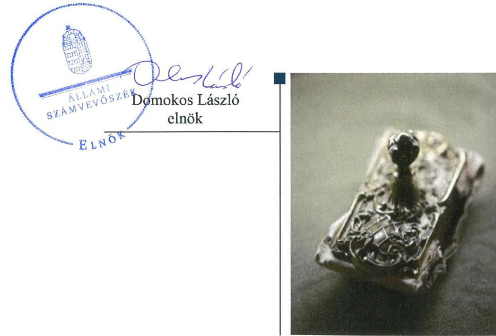
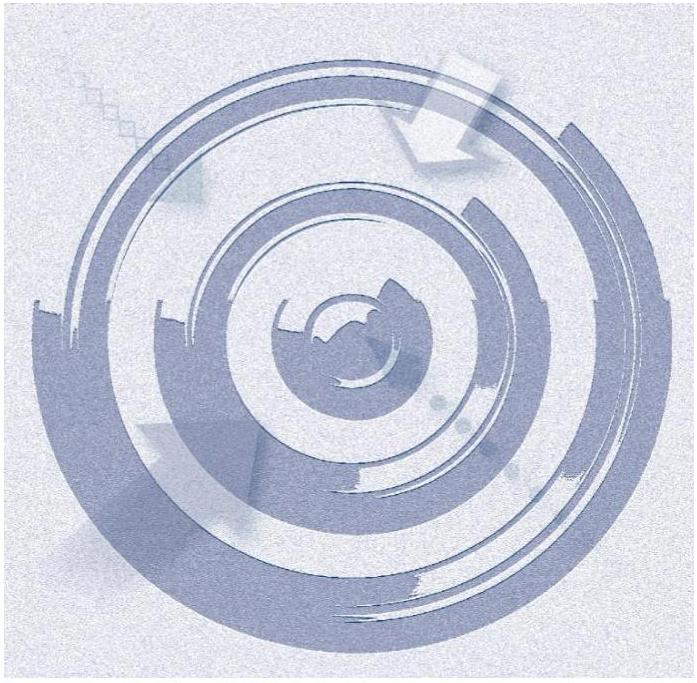
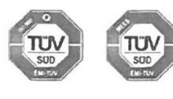
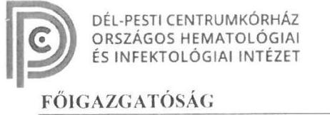
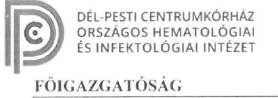
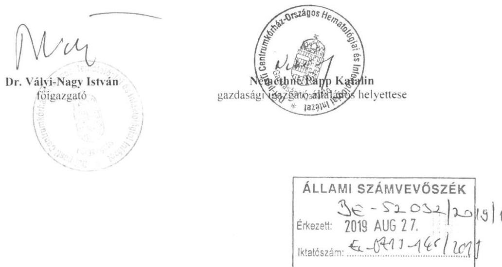
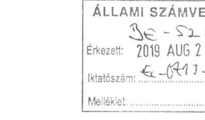
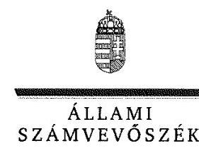
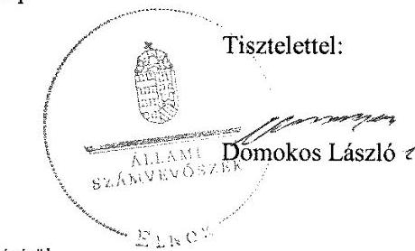
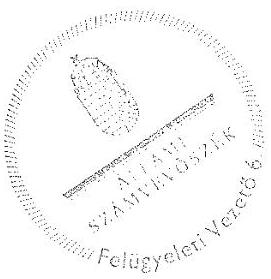

# Jelenetés 

## Központi költségvetési szervek ellenőrzése

Dél-pesti Centrumkórház - Országos Hematológiai és Infektológiai Intézet 2019.

---

# Jelentés 

## Központi költségvetési szervek ellenőrzése

Dél-pesti Centrumkórház - Országos Hematológiai és Infektológiai Intézet 2019. 10. hó 16. nap

---

# AZ ELLENŐRZÉST FELÜGYELTE:

DR. BENEDEK MÁRIA felügyeleti vezető

# AZ ELLENŐRZÉST VEZETTE ÉS A VÉGREHAJTÁSÁÉRT FELELŐS:

FORCZEK ANDREA ellenőrzésvezető 2019. január 27-ig

NEMESVÁRI-HORTHY ESZTER ellenőrzésvezető 2019. január 28-tól

# A PROGRAM ÖSSZEÁLLÍTÁSÁÉRT FELELŐS:

TÓTPÁL SZABOLCS osztályvezető

IKTATÓSZÁM: EL-0715-156/2019.

|  Jelentéseink az Országgyűlés számítógépes hálózatán és az Interneta a www.asz.hu címen is olvashatóak. | TÉMASZÁM: 2479  |
| --- | --- |
|   | ELLENŐRZÉS-AZONOSÍTÓ SZÁM: V079132  |

---

# TARTALOMJEGYZÉK 

■ ÖSSZEGZÉS ..... 5
■ AZ ELLENŐRZÉS CÉLJA ..... 6
■ AZ ELLENŐRZÉS TERÜLETE ..... 7
■ AZ ELLENŐRZÉS HÁTTERE, INDOKOLTSÁGA ..... 8
■ A JELENTÉS LÉNYEGES KÉRDÉSKÖREI ..... 10
■ AZ ELLENŐRZÉS HATÓKÖRE ÉS MÓDSZEREI ..... 11
■ MEGÁLLAPÍTÁSOK ..... 14
■ JAVASLATOK ..... 18
■ MELLÉKLETEK ..... 21
I. sz. melléklet: Értelmező szótár ..... 21
■ FÜGGELÉK: ÉSZREVÉTELEK ..... 25
■ RÖVIDÍTÉSEK JEGYZÉKE ..... 49

---

.

---

# ÖSSZEGZÉS 

A Dél-pesti Centrumkórház - Országos Hematológiai és Infektológiai Intézet belső kontrollrendszerének kialakítása és müködtetése, pénzügyi és vagyongazdálkodása nem volt szabályszerű, ezáltal nem volt biztosított a közpénzekkel, a nemzeti vagyonnal való átlátható, elszámoltatható és felelős gazdálkodás. Az integritás elvü müködést támogató kontrollok nem kerültek kiépítésre, az integritás alapú müködés nem volt biztosított.

## Az ellenőrzés társadalmi indokoltsága

A közpénzek felhasználásában és az állami vagyonnal való gazdálkodásban a központi költségvetési szervek meghatározó súlyt képviselnek. Ez indokolja, hogy az Állami Számvevőszék ellenőrzéseket folytasson a pénzügyi és vagyongazdálkodás területén. Az Állami Számvevőszék az ellenőrzései során értékeli a belső kontrollrendszer jogszabályi előírások szerinti kialakítását és működtetése szabályszerűségét, feltárja a gazdálkodás esetleges hiányosságait, rámutathat a vagyongazdálkodási tevékenység - ezen belül a tulajdonosi joggyakorlás és vagyonkezelés - esetleges szabálytalanságaira. Az Állami Számvevőszék az ellenőrzésével hozzá kíván járulni a központi intézmények pénzügyi helyzetének pontosabb megítéléséhez, a jó gyakorlat kialakításán és terjesztésén keresztül az ellenőrzések elősegíthetik a gazdálkodás szabályszerűségének javítását.

Az egészségügyi ellátások közfeladat teljesítése a társadalom széles körét érinti és az közérdeklődés középpontjában áll. A központi költségvetésből az egyik legjelentősebb kiadást az egészségügyi ellátásokra fordított kiadások jelentik, amelyekből a kórházak kapják a legtöbb támogatást. A Dél-pesti Centrumkórház - Országos Hematológiai és Infektológiai Intézet egészségügyi közfeladatot látott el és jelenős mértékű állami vagyont kezelt.

## Főbb megállapítások, következtetések, javaslatok

A Dél-pesti Centrumkórház - Országos Hematológiai és Infektológiai Intézetnél a kontrollkörnyezet kialakítása szabályszerű volt, a müködés és gazdálkodás alapvető előírásait belső szabályzatokban meghatározta. Az integrált kockázatkezelési rendszer működtetéséről a jogszabályi előírások ellenére nem gondoskodott. A kontrolltevékenységek gyakorlása nem volt szabályszerű, 2015-2017. években a kötelezettségvállalásokat nem vette az államháztartási számviteli jogszabály szerinti tartalmú nyilvántartásba, 2015. évben nem az arra felhatalmazott vállalt kötelezettséget. A monitoring rendszer működtetése szabályszerű volt, a belső ellenőrzést működtette. Az információs és kommunikációs rendszer nem volt szabályszerű, törvényi előírás ellenére a közzétételi kötelezettségét nem teljesítette. Ennek következtében nem volt biztosított az átláthatóság és elszámoltathatóság a közpénzek és a nemzeti vagyon felhasználása során.

A pénzügyi gazdálkodás nem volt szabályszerű. A megkötött szerződések nem tartalmazták a szerződő fél átlátható szervezetre vonatkozó nyilatkozatát, a költségvetési maradvány megállapítása nem volt szabályszerű. A kötelezettségvállalásokról nem vezette a jogszabályban előírt tartalmú nyilvántartást és 2017. évben az államháztartási törvényi előírások ellenére a módosított kiadási előirányzatot jelentősen meghaladó mértékben - 2,4 milliárd Ft-tal - vállalt kötelezettséget.

A vagyongazdálkodás nem volt szabályszerű, a mérlegtételeket a törvényi előírás ellenére leltárral nem támasztotta alá, ezáltal az éves beszámolók nem mutattak megbízható és valós összképet.

Az integritás elvű müködés nem volt biztosított, a korrupciós kockázatokat mérséklő integritás kontrollokat nem alakította ki.

Az Állami Számvevőszék az intézkedések megtétele céljából az Állami Egészségügyi Ellátó Központ főigazgatója részére egy, a Dél-pesti Centrumkórház - Országos Hematológiai és Infektológiai Intézet főigazgatója részére kilenc javaslatot fogalmazott meg.

---

# AZ ELLENŐRZÉS CÉLJA 

AZ ELLENŐRZÉS CÉLJA annak megítélése volt, hogy a Dél-pesti Centrumkórház - Országos Hematológiai és Infektológiai Intézetre vonatkozó irányító szervi feladatellátás a jogszabályi előírások betartásával történte, a Dél-pesti Centrumkórház - Országos Hematológiai és Infektológiai Intézetnél a belső kontrollrendszer kialakítása és múködtetése szabályszerű volt-e, biztosította-e az átlátható, szabályszerű, gazdaságos, hatékony és eredményes gazdálkodás feltételeit; a pénzügyi és vagyongazdálkodása megfelelt-e a jogszabályi előírásoknak és belső szabályzatainak. Az ellenőrzés célja volt annak értékelése, hogy a költségvetési maradvány megállapítása szabályszerű volt-e. Az ellenőrzés célja volt annak megállapítása is, hogy a Dél-pesti Centrumkórház - Országos Hematológiai és Infektológiai Intézet megfelelt-e annak az Alaptörvényben meghatározott alapvetésnek, hogy Magyarország a kiegyensúlyozott, átlátható és fenntartható költségvetési gazdálkodás elvét érvényesíti; érvényesült-e a nemzeti vagyon kezelésének és védelmének célja, azaz a vagyona a közérdeket szolgálta-e a közös szükségletek kielégítése és a természeti erőforrások megóvása, valamint a jövő nemzedékek szükségleteinek figyelembevétele mellett. Az ellenőrzés keretében az Állami Számvevőszék értékelte a Délpesti Centrumkórház—Országos Hematológiai és Infektológiai Intézetnél a korrupciós kockázatok kezelését szolgáló integritás kontrollok kiépítettségét és az integritás szemlélet érvényesülését.

---

# **AZ ELLENŐRZÉS TERÜLETE**

## **Dél-pesti Centrumkórház – Országos Hematológiai és Infektológiai Intézet**

A budapesti székhelyű Dél-pesti Centrumkórház – Országos Hematológiai és Infektológiai Intézet, amely 2018. január 1-jét megelőzően Egyesített Szent István és Szent László Kórház-Rendelőintézet néven működött, jogi személy, előirányzatai felett teljes jogkörrel rendelkező költségvetési szerv. Áht.1 szerinti átalakítására 2015-2016. években nem került sor. Közfeladata az Eütv.2 alapján az ellátási területére kiterjedően járó- és fekvőbetegek diagnosztikus és terápiás szakorvosi ellátása, rehabilitációja és követéses gondozása volt. A fekvőbetegek ellátását 2015-2017. években 1640 ágyon végezte.

Az emberi erőforrások minisztere az irányító szervi hatásköröket az Emberi Erőforrások Minisztériuma útján gyakorolta. Egyes irányítási hatásköröket a középirányító szerv, az Állami Egészségügyi Ellátó Központ (2015. február 28-ig a Gyógyszerészeti és Egészségügyi Minőség- és Szervezetfejlesztési Intézet) gyakorolta.

A 2015. és a 2017. évekre elkészített éves beszámolóinak adatai alapján befektetett eszközeinek állománya a 2015. évi 25,6 Milliárd Ft-ról 3,5 %-os növekedéssel 2017. évre 26,5 Milliárd Ft-ra változott. A teljesített bevétel a 2015. évi 30,3 Milliárd Ft-ról 6,9 %-os növekedéssel 2017. évre 32,4 Milliárd Ft-ra, a teljesített kiadás a 2015. évi 29,6 Milliárd Ft-ról 7,1 %-os növekedéssel 2017. évre 31,7 Milliárd Ft-ra emelkedett.

A Főigazgató3 és a Gazdasági igazgató4 személyében 2015-2017. évek között nem történt változás. A gazdálkodási feladatokat a gazdasági igazgató irányítása alatt működő gazdasági igazgatóság látta el. Az átlagos statisztikai állományi létszáma a 2015. évi 2147 főről 2017. évre 1,4 %-os csökkenéssel 2118 főre változott.

---

# AZ ELLENŐRZÉS HÁTTERE, INDOKOLTSÁGA 

Az államháztartás központi alrendszerének közpénz felhasználása, az intézmények által ellátott közfeladatok sokrétúsége, valamint a feladatellátásához rendelt vagyon nagyságrendje indokolja, hogy az ÁSZ ${ }^{5}$ ellenőrzéseket folytasson a pénzügyi és vagyongazdálkodás területén. Az ÁSZ az ellenőrzései során feltárja a gazdálkodást, a központi alrendszer intézményei átalakulását, átszervezését érintő szabályozások esetleges hiányosságait, a szabályozással nem érintett gazdálkodási területeket, rámutathat a vagyongazdálkodási tevékenység - ezen belül a tulajdonosi joggyakorlás és vagyonkezelés - esetleges szabálytalanságaira, értékeli az állami vagyon nyilvántartására és elszámolására vonatkozó eljárásokat.

Az ellenőrzés várhatóan hozzájárul a központi intézmények pénzügyi helyzetének pontosabb megítéléséhez.

Az ellenőrzések megállapításai támogathatják az ellenőrzött szervezetek szabályszerű gazdálkodását, javaslataival elősegítheti az Alaptörvényben megfogalmazott alapvetések érvényesülését a mindennapi életben a szervezetek szintjén. A központi költségvetés rendszerében zajló folyamatok holisztikus elemzései, a kockázatok folyamatos figyelemmel kísérésének módszerével, az így kiválasztott szervezetek célzott, hatékony ellenőrzéseivel az ÁSZ betölti a legfőbb gazdasági ellenőrző szerv küldetését.

A belső kontrollrendszer kialakítása és működtetése nélkül nem valósítható meg a közpénzek, a közvagyon átlátható, szabályos, gazdaságos, hatékony és eredményes felhasználása. A belső kontrollrendszer azt a célt szolgálja, hogy a költségvetési szervek működésük és gazdálkodásuk során a tevékenységeket szabályszerűen hajtsák végre, teljesítsék elszámolási kötelezettségeiket és megvédjék az erőforrásokat a veszteségektől, a károktól és a nem rendeltetésszerű használattól. A belső kontrollrendszer magában foglalja mindazon elveket, eljárásokat és belső szabályzatokat, melyek biztosítják, hogy a költségvetési szerv valamennyi tevékenysége és célja összhangban legyen a szabályszerűséggel, szabályozottsággal, valamint a gazdaságosság, hatékonyság és eredményesség követelményeivel, az eszközökkel és forrásokkal való gazdálkodásban ne kerüljön sor pazarlásra, visszaélésre, rendeltetésellenes felhasználásra. Megfelelő, pontos és naprakész információk álljanak rendelkezésre a költségvetési szerv múködésével kapcsolatosan, és a belső kontrollrendszer harmonizációjára, öszszehangolására vonatkozó jogszabályok végrehajtásra kerüljenek. Az integritás kontrollok kiépítése, erősítése a szervezet korrupciós kockázatainak kezelését szolgálja. A teljesítménykövetelmények meghatározása és múködtetése megalapozhatja a központi költségvetési szervnél a teljesítményellenőrzés lefolytatását.

A központi költségvetési szerveknél az Ávr. ${ }^{6}$ 150. §-a meghatározza azokat az eseteket, amelyeket kötelezettségvállalással terhelt maradványnak kell tekinteni. Az Áhsz. ${ }^{7}$ 14. § (8) bekezdése értelmében, a mérlegben a kötelezettségek között az egységes rovatrend szerinti rovatokhoz kapcsolódóan vezetett nyilvántartási számlákon nyilvántartott végleges kötelezettségvállalásokat, más fizetési kötelezettségeket kell kimutatni mindaddig, amíg azokat pénzügyileg ki nem egyenlítették, el nem engedték vagy

---

egyéb módon nem rendezték. Amennyiben a költségvetési szerv gazdálkodása során a vonatkozó jogszabályokat betartja, év végén a kötelezettségvállalással terhelt maradványon felül nem rendelkezhet ki nem fizetett szállítói kötelezettséggel. Mindezekre tekintettel az ÁSZ kiemelten ellenőrzi a kötelezettségvállalással terhelt maradvány dokumentumokkal történő alátámasztottságát.

Az egyes ellenőrzések megállapításaival és egy időszak ellenőrzési eredményeinek elemzésével az ÁSZ ráirányíthatja a jogalkotók figyelmét a központi alrendszerben vagy annak egy ágazatában esetlegesen felmerülő pénzügyi, szabályozási feszültségekre. Az elvégzett ellenőrzések során az ÁSZ „jó gyakorlatokat" is azonosíthat, melyeket tanácsadó funkciója keretében szélesebb körben is megismertethet az érintettekkel, ezáltal is hozzájárulva a költségvetési rendszer szabályozott, átlátható, kiegyensúlyozott és fenntartható múködéséhez.

---

# A JELENTÉS LÉNYEGES KÉRDÉSKÖREI 

1.     - Szabályszerú volt-e az ellenőrzött központi költségvetési szervre vonatkozó irányító szervi feladatellátás?
2.     - A belső kontrollrendszer kialakítása és müködtetése szabályszerű volt-e, biztositotta-e a közpénzekkel és a nemzeti vagyonnal történő szabályszerű és átlátható gazdálkodást?
3.     - A központi költségvetési szerv pénzügyi gazdálkodása és a maradvány megállapítása szabályszerű volt-e?
4.     - A központi költségvetési szerv vagyongazdálkodása szabályszerű volt-e?
5.     - A központi költségvetési szervnél alakítottak-e ki a teljesítmény mérésére vonatkozó követelményeket?

---

# AZ ELLENŐRZÉS HATÓKÖRE ÉS MÓDSZEREI 

## Az ellenőrzés típusa

Megfelelőségi ellenőrzés, a 2017. évi maradvány megállapítása tekintetében szabályszerűségi ellenőrzés.

## Az ellenőrzött időszak

2015. január 1-2017. december 31. közötti időszak. A 2017. évre készített költségvetési beszámoló vonatkozásában a beszámoló jóváhagyásáig (2018. június 30.) terjedő időszak.

## Az ellenőrzés tárgya

A Dél-pesti Centrumkórház - Országos Hematológiai és Infektológiai Intézetre vonatkozó irányító szervi feladatok ellátása a 2015-2016. években. A belső kontrollrendszer kialakítása és működtetése 2015-2017. években, valamint az integritáskontrollok kiépítettsége és a teljesítményellenőrzés feltételei a 2017. évben. A Dél-pesti Centrumkórház - Országos Hematológiai és Infektológiai Intézet pénzügyi és vagyongazdálkodása a 2015-2016. években.

A 2017. évre vonatkozóan a Dél-pesti Centrumkórház - Országos Hematológiai és Infektológiai Intézet vagyongazdálkodási feltételeinek kialakítása, annak szabályszerűsége, az elszámoltathatóság biztosítása a szabályozás szintjén. A vagyonváltozást eredményező döntések, a vagyonban bekövetkezett változások végrehajtásának, nyilvántartásba vételének, elszámolásának szabályszerűsége. Az állami vagyon kimutatásának szabályszerűsége, ennek keretében az állami vagyonnal történő rendelkezés, a vagyonmozgások, a vagyon nyilvántartásba vétele, értékelése és a mérleg alátámasztás szabályszerűsége. A költségvetési maradvány megállapításának szabályszerűsége a 2017. év vonatkozásában.

Az ellenőrzés kiterjedt minden olyan körülményre és adatra, amely az ÁSZ jogszabályban meghatározott feladatainak teljesítéséhez, valamint a program végrehajtása folyamán felmerült újabb összefüggések feltárásához szükséges volt.

## Az ellenőrzött szervezet

Dél-pesti Centrumkórház - Országos Hematológiai és Infektológiai Intézet, valamint az irányító szervi feladatellátás tekintetében az Emberi Erőforrások Minisztériuma és az Állami Egészségügyi Ellátó Központ (2015.

---

február 28-ig Gyógyszerészeti és Egészségügyi Minőség- és Szervezetfejlesztési Intézet).

# Az ellenőrzés jogalapja 

Az ellenőrzés jogszabályi alapját az ÁSZ tv. ${ }^{8}$ 1. § (3) bekezdés, 5. § (2)-(4) és (6) bekezdései, valamint az Áht. 61. § (2) bekezdésének előírásai képezték.

## Az ellenőrzés módszerei

Az ellenőrzésre a szakmai program szempontjai, az ellenőrzött időszakban hatályos jogszabályok, az ellenőrzés szakmai szabályai, a jelen ellenőrzésre irányadó ÁSZ módszertanok figyelembevételével került sor.

Az ÁSZ az ellenőrzés ideje alatt a Dél-pesti Centrumkórház - Országos Hematológiai és Infektológiai Intézettel, az Irányító szervvel ${ }^{9}$ és a Középirányító szervvel ${ }^{10}$ a kapcsolattartást az ÁSZ SZMSZ ${ }^{11}$-ének vonatkozó előírásai alapján biztosította. Az ellenőrzési kérdések megválaszolásához szükséges bizonyítékok megszerzése a Kórház, az Irányító szerv és a Középirányító szerv által rendelkezésre bocsátott dokumentumokra, adatokra alapozva megfigyelés, szemle (szemrevételezés), kérdésfeltevés (információkérés), mintavételezés, valamint elemző eljárás útján történt. Az ellenőrzési bizonyítékként felhasználható adatforrások közé tartoztak egyrészt a szakmai program részletes szempontjainál felsorolt adatforrások, másrészt minden egyéb - az ellenőrzés folyamán feltárt, az ellenőrzés szempontjából információt tartalmazó - dokumentum.

Az ellenőrzés lefolytatásához a Dél-pesti Centrumkórház - Országos Hematológiai és Infektológiai Intézet, az Irányító szerv és a Középirányító szerv a tanúsítványok kitöltésével, valamint az ÁSZ által kért dokumentumok megküldésével szolgáltatott adatokat, amelyek valódiságát és teljes körűségét az ellenőrzött szervezet vezetője által tett teljességi és hitelességi nyilatkozat igazolta. Az így rendelkezésre bocsátott adatok, információk kontrollja az ellenőrzés keretében történt.

A központi költségvetési szerv belső kontrollrendszere egyes pilléreinek kialakítására és működtetésére vonatkozó értékelés „szabályszerü", amennyiben az értékelt területen az elért „igen" válaszok százalékban kifejezett, egész számra kerekített aránya legalább 85\%, „nem szabályszerű", ha nem éri el a 85\%-ot. A központi költségvetési szerv belső kontrollrendszerének összesített értékelése az egyes részterületek esetében kapott megfelelőségi arányok számtani átlaga alapján történt és megegyezik a pillérenként (kontrollterületenként) alkalmazott százalékos értékelésekkel, a következő eltérésekkel: a kontrollrendszer egésze esetében a „szabályszerű" értékelésnek a százalékos értéken felül további feltétele, hogy egyik kontrollterület sem kaphat „nem szabályszerű" értékelést.

Az ÁSZ statisztikai módszereken alapuló mintavételt alkalmazott.
A kiadások ellenőrzésére a 2015-2017. évek vonatkozásában, a bevételek ellenőrzésére a 2015-2016. évek vonatkozásában került sor. A kiadások (külső személyi juttatások, felhalmozási kiadások, dologi kiadások) és bevételek (értékesítésből és bérbeadásból származó bevételek) esetében az

---

ellenőrzés azokra a legnagyobb értékű tételekre - a lényeges sokaságra terjedt ki, melyek összértéke eléri a teljes sokaság összértékének 50\%-át.

A 2015-2017. évi kiadások és a 2015-2016. évi bevételek elszámolásának szabályszerűséget a lényeges sokaságból véletlen mintavételi eljárással kiválasztott tételek alapján ellenőrizte az ÁSZ.

A 2015-2016. évi felhalmozási kiadások lényeges sokasága és a 2017. évi pénzmozgáshoz nem kapcsolódó vagyonváltozások szabályszerűségének esetében tételes ellenőrzésre került sor.

A 2017. évi beruházások, felújítások végrehajtásának, a feladatellátást szolgáló állami vagyontárgyak használatának és év végi értékelésének szabályszerűsége véletlen mintavétellel kiválasztott tételek alapján történt.

A mintavétellel ellenőrzött területek esetében minden egyes tétel vonatkozásában a használat, elszámolás és értékelés szabályszerűségére vonatkozó kérdéseket tett fel az ÁSZ. Szabályszerűnek értékelt egy ellenőrzött területet, amennyiben 95\%-os bizonyossággal az ellenőrzött sokaságban az átlagos hibaarány legfeljebb 10\%, nem szabályszerűnek, amennyiben 10\%-nál magasabb arányt képviselt.

Abban az esetben, ha az ellenőrzött sokaság tekintetében a 10\%-os hibaarányhoz való viszony megítélésének megbízhatósága nem érte el a 95\%-ot, annak elérése érdekében az értékelés további szempontokkal került kiegészítésre, a feltárt hibák értékének figyelembe vételével.

---

# 1. Szabályszerú volt-e az ellenőrzött központi költségvetési szervre vonatkozó irányító szervi feladatellátás? 

Összegző megállapítás

A Kórházra ${ }^{12}$ vonatkozó irányító szervi feladatellátás szabályszerű volt.

A Kórház rendelkezett az Irányító szerv által az Áht. szerint kiadott, az Ávr.ben meghatározott tartalmú alapító okirattal ${ }^{13}$. A Középirányító szerv a 27/2015. (II. 25.) Korm. rendelet ${ }^{14}$ felhatalmazása alapján irányítói hatáskörben jóváhagyta a Kórház SZMSZ ${ }^{15}$-eit.

Az Irányító szerv az Ávr. előírásai szerint a tervezett bevételek és kiadások megállapításához meghatározta a tervezési követelményeket, az Áht. és az Áhsz. előírásai alapján jóváhagyta a Kórház elemi költségvetéseit és éves költségvetési beszámolóit.

Munkáltatói jogait az Irányító szerv szabályszerűen gyakorolta. A Főigazgató és a Gazdasági igazgató a jogszabályi előírások szerinti kinevezéssel rendelkezett 2015-2016. években.

## 2. A belső kontrollrendszer kialakítása és múködtetése szabályszerű volt-e, biztosította-e a közpénzekkel és a nemzeti vagyonnal történő szabályszerű és átlátható gazdálkodást?

Összegző megállapítás

A belső kontrollrendszer kialakítása és múködtetése 20152017. években nem volt szabályszerű, nem biztosította a közpénzekkel és a nemzeti vagyonnal történő szabályszerű és átlátható gazdálkodást.

A KONTROLLKÖRNYEZET kialakítása szabályszerű volt. A Kórház rendelkezett az Áht., az Ávr. előírásai szerint SZMSZ ${ }^{16}$-el, továbbá a gazdasági szervezetre vonatkozó belső előírásokat rögzítő, az Ávr. szerinti tartalmú ügyrenddel ${ }^{17}$. A Kórház a gazdálkodására jellemző szabályokat, előírásokat - a Számv. tv. előírásai alapján - számviteli politikában ${ }^{18}$ és annak keretében elkészített leltározási és leltárkészítési szabályzatban ${ }^{19}$, értékelési szabályzatban ${ }^{20}$, pénzkezelési szabályzatban, ${ }^{21}$ és önköltségszámítási szabályzatban ${ }^{22}$ rögzítette és kiadta a számlarendet ${ }^{23}$. Az Ávr. előírásai alapján a Kórház belső szabályzatokban rögzítette a múködéshez kapcsolódó, pénzügyi kihatással bíró jogszabályban nem szabályozott kérdéseket.

AZ INTEGRÁLT KOCKÁZATKEZELÉSI RENDSZER
nem volt szabályszerű, a Főigazgató - a Bkr. ${ }^{24}$ 7. § (1) bekezdésében foglalt előírások ellenére - az integrált kockázatkezelési rendszert nem múködtette.

---

A KONTROLLTEVÉKENYSÉGEK gyakorlása nem volt szabályszerű. A Kórház a 2015-2017. években nem rendelkezett az Áhsz. 39. § (3) bekezdésében foglalt előírás ellenére a 14. melléklet II. 4. a)-g) pontja előírásai szerinti tartalmú kötelezettségvállalások nyilvántartásával. A kontrolltevékenységek gyakorlása körében 2015-2017. években feltárt szabálytalanságok:
A kötelezettségvállalást követően 2015-2017. években - az Ávr. 56. § (1) bekezdés előírása ellenére - nem gondoskodott annak az államháztartási számviteli kormányrendelet szerinti nyilvántartásba vételéről.
A kötelezettségvállalást a 2015. évben - az Ávr. 52. § (1) bekezdés a) pontja előírása ellenére - nem a Kórház Főigazgatója, vagy az általa írásban felhatalmazott személy végezte.

# AZ INFORMÁCIÓS ÉS KOMMUNIKÁCIÓS RENDSZER nem volt szabályszerű. A Főigazgató a Bkr. előírásai alapján kialakította a Kórház információs és kommunikációs rendszerét, azonban a Kórház az Info tv. ${ }^{25}$ 37. § (1) bekezdés előírása és 1. melléklete II./1. és III./1. pontja előírásai ellenére (SZMSZ, adatvédelmi és adatbiztonság szabályzat, 2015-2017. évi éves költségvetés és beszámoló) közzétételi kötelezettségének 2015-2017. években nem tett eleget. 

A MONITORING RENDSZER kialakítása és múködtetése szabályszerű volt. A Főigazgató a Bkr. előírásai alapján kialakította a célok megvalósításának nyomon követését biztosító rendszert, azonban 20152016. években a követelmények folyamatos és eseti nyomon követéséről - a Bkr. 10. §-ában foglalt előírás ellenére - nem gondoskodott. A belső ellenőrzés kialakításáról a Főigazgató az Áht. előírásai szerint gondoskodott, a Bkr. előírásai szerint biztosította a belső ellenőrzés szervezeti és funkcionális függetlenségét.

A Főigazgató a belső kontrollrendszer minőségét a Bkr. 1. sz. melléklete szerinti nyilatkozatban értékelte, azonban a 2016-2017. évre vonatkozó nyilatkozatot - a Bkr. 11. § (2) bekezdésben előírtak ellenére - az Irányító szerv részére nem küldte meg. A Főigazgató nyilatkozott arról, hogy gondoskodott a Kórház belső kontrollrendszere kialakításáról, valamint szabályszerű, eredményes és hatékony működéséről, a rendelkezésre álló előirányzatok cél szerinti felhasználásáról, a gazdálkodási lehetőségek és kötelezettségek összhangjáról. Az ÁSZ ellenőrzés megállapításai nem igazolták a nyilatkozatban foglaltakat.

A Kórház kockázatelemzést nem végzett, az integritás elvű működést támogató kontrollok nem kerültek kialakításra. A Kórház nem múködtetett integritást erősítő kontrollokat. A korrupciós kockázatokat mérséklő integritás kontrollokat a Kórház nem alakított ki.

---

# 3. A központi költségvetési szerv pénzügyi gazdálkodása és a maradvány megállapítása szabályszerű volt-e? 

## Összegző megállapítás

### 3.1. számú megállapítás

A Kórház pénzügyi gazdálkodása és a maradvány megállapítása nem volt szabályszerű.

## A Kórház pénzügyi gazdálkodása nem volt szabályszerű.

## A KIADÁSI ELŐIRÁNYZATOK FELHASZNÁLÁSA

nem volt szabályszerű, mert a Kórház 2015-2016. években nem tartotta be a jogszabályi előírásokat:

- A Kórház által jogi személlyel, jogi személyiséggel nem rendelkező szervezettel kötött visszterhes szerződés - az Ávr. 50. § (1a) bekezdésében foglalt előírás ellenére - nem tartalmazta a szervezet képviselőjének arra vonatkozó nyilatkozatát, hogy átlátható szervezetnek minősül.
- A Kórház a Kbt. ${ }^{26}$ 6. § (1) bekezdés b) pontja szerinti ajánlatkérőként 2015. évben - a Kbt. ${ }_{1}$ 5. §-a előírása ellenére - a közbeszerzési eljárás lefolytatásának kötelezettségét nem teljesítette. A Kórház a Kbt. ${ }^{27}$ 5. § (1) bekezdés c) pontja szerinti ajánlatkérőként 2016. évben - a Kbt. ${ }_{2}$ 4. §-a előírása ellenére - - a közbeszerzési eljárás lefolytatásának kötelezettségét nem teljesítette.
3.2. számú megállapítás

A maradvány megállapítása 2015-2016. években nem volt szabályszerű.

A Kórház az éves költségvetési beszámoló részeként elkészített maradvány kimutatását az Áhsz. 39. § (3) bekezdésében foglalt előírás ellenére a 14. melléklet II. 4. előírásai szerinti tartalmú kötelezettségvállalások nyilvántartásával nem támasztotta alá. A kötelezettségvállalások és más fizetési kötelezettségek nyilvántartása 2015. évben az Áhsz. 14. melléklet II. 4. a), c, e), f) g) pontjaiban; 2016. évben az a), e), f), g) pontjaiban foglalt tartalmi hiányosságok következtében nem volt szabályszerű.

### 3.3. számú megállapítás

A maradvány megállapítása 2017. évben nem volt szabályszerű.
A Kórház kötelezettségvállalással terhelt maradvány kimutatása alátámasztásához vezetett részletező nyilvántartása a 2017. évben nem felelt meg az Áhsz. 39. § (3) bekezdésében foglaltak ellenére az Áhsz. 14. melléklet II/4. a), e), f), g) pontjaiban meghatározott tartalmi követelményeknek.

A Kórház a 2017. évben az Áht. 36. § (1) bekezdésben előírtak ellenére a módosított előirányzatát meghaladó mértékben vállalt kötelezettséget, a Kórház kötelezettségvállalása a 2017. évben 2,4 milliárd Ft-tal meghaladta a módosított kiadási előirányzatát. A Kórház a 2017. évben nem biztosította az Áhsz. 17. melléklet 1. a) pontban előírt azon kötelezettséget, hogy a költségvetési számvitelen belül a gazdálkodási szabályokból adódóan a 05. számlacsoportban vezetett nyilvántartási számlákon belül az előirányzatok nyilvántartására vezetett számlák egyenlegét ne haladja meg a költségvetési évben esedékes kötelezettségek nyilvántartására szolgáló számlák egyenlege.

---

# 4. A központi költségvetési szerv vagyongazdálkodása szabályszerű volt-e? 

## Összegző megállapítás

A Kórház vagyongazdálkodása nem volt szabályszerű.
A Kórház a 2015-2017. években a Számv. tv. 69. § (1) bekezdésében előírtak ellenére az éves beszámoló elkészítéséhez a mérleg tételeinek alátámasztásához nem állított össze leltárt, amely tételesen, ellenőrizhető módon tartalmazza a mérleg fordulónapján meglévő eszközöket és forrásokat mennyiségben és értékben. Ezzel a Kórház megsértette a Számv. tv. 15. § (3) bekezdésében előírt valódiság elvét.

## 5. A központi költségvetési szervnél alakítottak-e ki a teljesítmény mérésére vonatkozó követelményeket?

## Összegző megállapítás

A Kórháznál a teljesítmény mérésére vonatkozó követelményeket alakítottak ki.

A Főigazgató a szervezeti célok elérését szolgáló feladatok, folyamatok, tevékenységek mérését szolgáló indikátorokat, mérőszámokat, feladat- és teljesítménymutatókat a 2017. évben képzett, azonban az adatok megbízhatóságának hiánya miatt a valós teljesítmény mérésének feltételei nem állnak fenn.

---

# JAVASLATOK 

Az ÁSZ tv. 33. § (1) bekezdésében foglaltak értelmében az ellenőrzött szervezet vezetője köteles a jelentésben foglalt megállapításokhoz kapcsolódó intézkedési tervet összeállítani és azt a jelentés kézhezvételétől számított 30 napon belül az ÁSZ részére megküldeni. Amennyiben az ellenőrzött szervezet vezetője nem küldi meg határidőben az intézkedési tervet, vagy továbbra sem elfogadható intézkedési tervet küld, az Állami Számvevőszék elnöke az ÁSZ tv. 33. § (3) bekezdése a) és b) pontjaiban foglaltakat érvényesítheti.

## az ÁEEK föigazgatójának

1. 

Tegyen intézkedéseket a feltárt hiányosságok és/vagy szabálytalanságok tekintetében a felelősség tisztázása érdekében, és szükség szerint intézkedjen a felelősség érvényesítéséről
(2. számú megállapítás 2. bekezdés, 3. bekezdés 2. mondat, 3. bekezdés 1. francia bekezdés, 4. bekezdés 2. mondat 2. tagmondat, 4. bekezdés 3. mondat, 5. bekezdés 4. mondat, 6. bekezdés 1. mondat 2. tagmondat, 3.1. megállapítás 1. bekezdés 1-2. francia bekezdése, 3.3 sz. megállapítás 1. bekezdés 1. mondat, 2. bekezdés, 4. sz. megállapítás 1. bekezdés alapján)

## a Dél-pesti Centrum Kórház - Országos Hematológiai és Infektológiai Intézet föigazgatójának

1. Intézkedjen a Bkr. előírásának megfelelően integrált kockázatkezelési rendszer müködtetéséről.
(2. sz. megállapítás 2. bekezdés alapján)
2. Gondoskodjon a kötelezettségvállalások Áhsz. szerinti tartalmú nyilvántartásáról.
(2. sz. megállapítás 3. bekezdés 2. mondat alapján)
3. Gondoskodjon az Ávr. előírásának megfelelően a kötelezettségvállalást követően annak haladéktalan nyilvántartásba vételéről.
(2. sz. megállapítás 3. bekezdés 1. francia bekezdés alapján)

---

4. Intézkedjen az Info tv. 1. melléklete szerinti általános közzétételi lista II/1. és III/1. pontjában meghatározott adatok közül az SZMSZ, éves költségvetés és beszámoló jogszabályi előírásoknak megfelelő közzétételéről.
(2. sz. megállapítás 4. bekezdés 2. mondat 2. tagmondat alapján)
5. Intézkedjen a Bkr. előírásának megfelelően a nyilatkozat irányító szerv részére történő megküldéséről.
(2. sz. megállapítás 6. bekezdés 1. mondat 2. tagmondat alapján)
6. Intézkedjen arról, hogy
a) a Kórház által jogi személlyel, jogi személyiséggel nem rendelkező szervezettel kötött visszterhes szerződés az Ávr. előírásainak megfelelően tartalmazza a szervezet képviselőjének arra vonatkozó nyilatkozatát, hogy átlátható szervezetnek minősül, továbbá
b) a Kbt. előírásának megfelelően a közbeszerzési eljárás lefolytatásáról.
(3.1. megállapítás 1. bekezdés 1-2. francia bekezdése alapján)
7. Intézkedjen az Áhsz.-ben foglalt előírásnak megfelelően a maradvány kimutatás alátámasztásához szükséges kötelezettségvállalásokról, más fizetési kötelezettségekről kötelező minimum tartalmú részletező nyilvántartás vezetéséről.
(3.3 sz. megállapítás 1. bekezdés 1. mondat alapján)
8. Intézkedjen arról, hogy
a) az Áht. előírásainak megfelelően kötelezettségvállalásra csak szabad előirányzat mértékéig kerüljön sor, továbbá intézkedjen
b) a költségvetési számvitelen belül a gazdálkodási szabályokból adódóan az Áhsz. 17. melléklet 1. a) pontjában előírt kötelezettség betartásáról.
(3.3. sz. megállapítás 2. bekezdés alapján)
9. Intézkedjen a Számv. tv. előírásának megfelelően a beszámoló elkészítéséhez, a mérleg tételeinek alátámasztásához olyan leltár összeállításáról, amely tételesen, ellenőrizhető módon tartalmazza a mérleg fordulónapján meglévő eszközeit és forrásait mennyiségben és értékben.
(4. sz. megállapítás 1. bekezdés alapján)

---

.

---

# MELLÉKLETEK 

- I. SZ. MELLÉKLET: ÉRTELMEZŐ SZÓTÁR
állami vagyon
állami vagyonnak minősül:
a) az állam tulajdonában lévő dolog, valamint a dolog módjára hasznosítható természeti erő,
b) az a) pont hatálya alá nem tartozó mindazon vagyon, amely vonatkozásában törvény az állam kizárólagos tulajdonjogát nevesíti,
c) az állam tulajdonában lévő tagsági jogviszonyt megtestesítő értékpapír, illetve az államot megillető egyéb társasági részesedés,
d) az államot megillető olyan immateriális, vagyoni értékkel rendelkező jogosultság, amelyet jogszabály vagyoni értékű jogként nevesít. (Forrás: Vtv. ${ }^{28}$ 1. § (2) bekezdése)
állami vagyon használója Az a természetes vagy jogi személy, jogi személyiséggel nem rendelkező szervezet, aki, vagy amely törvény vagy szerződés alapján, bármely jogcímen (bérlet, haszonbérlet, használat stb.) állami vagyont birtokol, használ, szedi annak hasznait, hasznosít, ide nem értve a haszonélvezőt, a vagyonkezelőt és a tulajdonosi jogok gyakorlóját. (Forrás: Vtvr. 1. § (7) bekezdés a) pontja)
állami vagyon hasznosítása Az állami vagyont az MNV Zrt. maga kezeli, vagy szerződés - így különösen bérlet, haszonbérlet, megbízás - alapján központi költségvetési szervnek, természetes vagy jogi személynek, vagy jogi személyiséggel nem rendelkező gazdálkodó szervezetnek hasznosításra átengedi.
(Forrás: Vtv. 23. § (1) bekezdése, hatályos 2012. január 1-jétől)
Az állami vagyonnal a tulajdonosi joggyakorló maga gazdálkodik, vagy szerződés így különösen bérlet, haszonbérlet, megbízás - alapján hasznosításra átengedi, illetőleg vagyonkezelésbe, haszonélvezetbe adja. (Forrás: Vtv. 23. § (1) bekezdése, hatályos 2013. június 28 -ától)
Az állami vagyont az MNV Zrt. maga kezeli, vagy szerződés - így különösen bérlet, haszonbérlet, megbízás - alapján központi költségvetési szervnek, természetes vagy jogi személynek, vagy jogi személyiséggel nem rendelkező gazdálkodó szervezetnek hasznosításra átengedi." Az állami vagyonra vonatkozóan az MNV Zrt. kizárólag az Nvtv. ${ }^{29}$-ben meghatározott személyekkel köthet vagyonkezelési szerződést. (Forrás: Vtv. 27. § (1) bekezdése, hatályos 2012. január 1-jétől)
Az ÁSZ 2011-ben indította el a közintézmények integritását vizsgáló és fejlesztő kérdőíves kutatását, melynek hétéves felmérési időszaka 2017. évben zárult le. Az ÁSZ az Integritás felmérés keretében 2017. évben hetedik alkalommal értékelte a közszféra intézményeinek korrupciós kockázatait, illetve a korrupció ellen védelmet biztosító kontrollok kiépítettségét. (Forrás: https://asz.hu/tanulmanyok-2017-ev Elemzés a közszféra integritás helyzetéről 2017. Vezetői összefoglaló 4. oldal)
átalakítás
belső ellenőrzés

A költségvetési szerv általános jogutódlással történő megszüntetése átalakítással történhet. Az átalakítás lehet egyesítés vagy különválás. Az egyesítés lehet beolvadás vagy összeolvadás. (Áht. 11. § (2) bekezdés)
Független, tárgyilagos bizonyosságot adó és tanácsadó tevékenység, amelynek célja, hogy az ellenőrzött szervezet működését fejlessze és eredményességét növelje, az ellenőrzött szervezet céljai elérése érdekében rendszerszemléletű megközelítéssel és módszeresen értékeli, illetve fejleszti az ellenőrzött szervezet irányítási és belső kontrollrendszerének hatékonyságát. (Forrás: Bkr. 2. § b) pontja)

---

belső kontrollrendszer

A belső kontrollrendszer a kockázatok kezelése és tárgyilagos bizonyosság megszerzése érdekében kialakított folyamatrendszer, amely azt a célt szolgálja, hogy a müködés és gazdálkodás során a tevékenységeket szabályszerűen, gazdaságosan, hatékonyan, eredményesen hajtsák végre, az elszámolási kötelezettségeket teljesítsék, megvédjék az erőforrásokat a veszteségektől, károktól és nem rendeltetésszerű használattól. (Forrás: Áht. 69. § (1) bekezdése)
belső kontrollrendszer területei

A kontrollkörnyezet, a kockázatkezelési rendszer, a kontrolltevékenységek, az információs és kommunikációs rendszer, valamint a nyomon követési (monitoring) rendszer. (Forrás: Bkr. 3. §-a)
ellenőrzési nyomvonal

Az ellenőrzési nyomvonal a költségvetési szerv működési folyamatainak szöveges, táblázatokkal vagy folyamatábrákkal szemléltetett leírása, amely tartalmazza különösen a felelősségi és információs szinteket és kapcsolatokat, irányítási és ellenőrzési folyamatokat, lehetővé téve azok nyomon követését és utólagos ellenőrzését. (Forrás: Bkr. 6. § (3) bekezdés)
hasznosítás

A nemzeti vagyon birtoklásának, használatának, hasznok szedése jogának bármely a tulajdonjog átruházását nem eredményező - jogcímen történő átengedése, ide nem értve a vagyonkezelésbe adást, valamint a haszonélvezeti jog alapítását. (Forrás: Nvtv. 3. § (1) bekezdés 4. pontja)
információs és kommunikációs rendszer

A költségvetési szerv vezetője által kialakított és működtetett olyan rendszer, mely biztosítja, hogy a megfelelő információk a megfelelő időben eljutnak az illetékes szervezethez, szervezeti egységhez, illetve személyhez. (Forrás: Bkr. 9. § (1) bekezdés)
integritás

Az integritás - egyik gyakran használt jelentése szerint - az elvek, értékek, cselekvések, módszerek, intézkedések konzisztenciáját jelenti, vagyis olyan magatartásmódot, amely meghatározott értékeknek megfelel. Integritás-irányítási rendszer bevezetése a szervezetben a szervezethez rendelt közfeladatok integritás szempontú ellátását, az érték alapú müködéssel (integritással) összefüggő szervezeti követelmények következetes érvényesítését jelenti. (Forrás: Nemzetgazdasági Minisztérium: Államháztartási Belső Kontroll Standardok és Gyakorlati Útmutató 1.6. Etikai értékek és integritás 46. oldal, 2017. szeptember)
irányító szerv/felügyeleti szerv
kockázat

A költségvetési szerv tekintetében az Áht.-ban meghatározott irányítási hatáskört gyakorló szerv. (Forrás: Áht. 1. § 9. pontja)
kockázatkezelési rendszer

A kockázat annak a valószínűségét jelenti, hogy egy vagy több esemény vagy intézkedés nem kívánt módon befolyásolja a rendszer müködését, céljainak megvalósulását. (Forrás: Javaslatok a korrupciós kockázatok kezelésére - Kockázatkezelési és ellenőrzési módszertan 35. oldal, ÁSZ)
integrált kockázatkezelési rendszer
kontrollkörnyezet

Olyan irányítási eszközök és módszerek összessége, melynek elemei a szervezeti célok elérését veszélyeztető tényezők (kockázatok) azonosítása, elemzése, csoportosítása, nyomon követése, valamint szükség esetén a kockázati kitettség mérséklése.(Forrás: Bkr. 2. § m) pontja)
Olyan folyamatalapú kockázatkezelési rendszer, amely a szervezet minden tevékenységére kiterjed, egységes módszertan és eljárások alkalmazásával, a szervezet célkitűzéseinek és értékeinek figyelembevételével biztosítja a szervezet kockázatainak teljes körű azonosítását, azok meghatározott kritériumok szerinti értékelését, valamint a kockázatok kezelésére vonatkozó intézkedési terv elkészítését és az abban foglaltak nyomon követését. (Forrás: Bkr. 2. § m) pontja, 2016. október 1-jétől)
kontrollkörnyezet

A költségvetési szerv vezetője által kialakított olyan elvek, eljárások, belső szabályzatok összessége, amelyben világos a szervezeti struktúra, a folyamatok átláthatók, egyértelműek a felelősségi, hatásköri viszonyok és feladatok, meghatározottak, ismertek és elfogadottak az etikai elvárások a szervezet minden szintjén, átlátható a humán-erőforrás-kezelés. (Forrás: Bkr. 6. § (1) bekezdés)

---

kontrolltevékenységek

középirányító szerv
közfeladat
maradvány
nyomon követési rendszer (monitoring)
tulajdonosi joggyakorló
vagyongazdálkodás

A költségvetési szerv vezetője által a szervezeten belül kialakított (kontroll) tevékenységek, melyek biztosítják a kockázatok kezelését, hozzájárulnak a szervezet céljainak eléréséhez és erősítik a szervezet integritását. (Forrás: Bkr. 8. § (1) bekezdés)
A költségvetési szerv tekintetében törvény vagy kormányrendelet alapján meghatározott, átruházott irányítási hatásköröket gyakorló szerv. (Forrás: Áht. 9. § (4) bekezdés)
Jogszabályban meghatározott állami vagy önkormányzati feladat, amit az arra kötelezett közérdekből, a jogszabályban meghatározott követelményeknek és feltételeknek megfelelve végez, ideértve a lakosság közszolgáltatásokkal való ellátását, továbbá az állam nemzetközi szerződésekben vállalt kötelezettségeiből adódó közérdekű feladatokat, valamint e feladatok ellátásakor szükséges infrastruktúra biztosítását is. (Forrás: Nvtv. 3. § (1) bekezdés 7. pontja)
A költségvetési év során a bevételek és kiadások különbözete, amely az alaptevékenység bevételei és kiadásai tekintetében a költségvetési maradvány, a vállalkozási tevékenység bevételei és kiadásai tekintetében a vállalkozási maradvány. (Forrás: Áht. 1. § 17. pont)
A költségvetési szerv vezetője köteles kialakítani a szervezet tevékenységének a célok megvalósításának nyomon követését biztosító rendszert, amely az operatív tevékenységek keretében megvalósuló folyamatos és eseti nyomon követésből, valamint az operatív tevékenységektől függetlenül múködő belső ellenőrzésből áll. (Forrás: Bkr. 10. §)

Aki a nemzeti vagyon felett az államot vagy a helyi önkormányzatot megillető tulajdonosi jogok és kötelezettségek összességének gyakorlására jogosult. (Forrás: Nvtv. 3. § (1) bekezdés 17. pontja)

A nemzeti vagyongazdálkodás feladata a nemzeti vagyon rendeltetésének megfelelő, az állam, az önkormányzat mindenkori teherbíró képességéhez igazodó, elsődlegesen a közfeladatok ellátásához és a mindenkori társadalmi szükségletek kielégítéséhez szükséges, egységes elveken alapuló, átlátható, hatékony és költségtakarékos múködtetése, értékének megőrzése, állagának védelme, értéknövelő használata, hasznosítása, gyarapítása, továbbá az állam vagy a helyi önkormányzat feladatának ellátása szempontjából feleslegessé váló vagyontárgyak elidegenítése. (Forrás: Nvtv. 7. § (2) bekezdése)

---

.

---

# FÜGGELÉK: ÉSZREVÉTELEK 

A jelentéstervezetet a Számvevőszék 15 napos észrevételezésre megküldte az ellenőrzött szervezet vezetőjének az ÁSZ tv. 29. §* (1) bekezdése előírásának megfelelően.

A Dél-pesti Centrumkórház - Országos Hematológiai és Infektológiai Intézet föigazgatója a jelentéstervezet megállapításaira írásban észrevételt tett.
Az ÁSZ tv. 29. § (3) bekezdésével összhangban az ÁSZ a Függelékben feltünteti az ellenőrzés megállapításaival kapcsolatban tett, figyelembe nem vett észrevételeket, és megindokolja, hogy azokat miért nem fogadta el.

[^0]
[^0]:    * 29. § (1) Az Állami Számvevőszék az ellenőrzési megállapításait megküldi az ellenőrzött szervezet vezetőjének vagy az általa megbízott személynek, és annak, akinek személyes felelősségét állapította meg.
    (2) Az ellenőrzött szervezet vezetője és a felelősként megjelölt személy az ellenőrzés megállapításaira tizenöt napon belül írásban észrevételt tehet.
    (3) Az Állami Számvevőszék az észrevételre a beérkezésétől számított harminc napon belül írásban válaszol. A figyelembe nem vett észrevételeket köteles a jelentésben feltüntetni, és megindokolni, hogy azokat miért nem fogadta el.

---

# FÓIGAZGATÓSÁG 

## Állami Számvevőszék

## Domokos László

elnök

## Budapest

Apáczai Csere János utca 10.
1052

## Tisztelt Elnök Úr!

Köszönettel megkaptuk az Állami Számvevőszék EL-0715-136/2019. iktatószámú levelét és a mellékleteként csatolt - Központi költségvetési szervek ellenőrzése Dél-pesti Centrumkórház Országos Hematológiai és Infektológiai Intézet (a továbbiakban: DPC) 2019. tárgyú Számvevőszéki jelentéstervezetet.

Az ÁSZ tv. 29. § (2) bekezdése alapján az ellenőrzés megállapításaira az alábbi észrevételeket tesszük.
Általános észrevételünk, hogy az ilyen méretü intézmény esetében, mint a DPC, az adatszolgáltatás teljesitésére rendelkezésre álló 5 munkanap jelentősen megnehezíti mind a kért, hatalmas mennyiségú adatfeltöltési kötelezettség teljesitését, mind - a humánerőforrás szükössége okán - a folyamatos müködés biztosítását is.

|  | Ellenőrzés tárgya | Ellenőrzés megállapítása/Intézményünk észrevétele |
| :--: | :--: | :--: |
| 2. | A belső kontrollrendszer kialakítása és müködletése szabályszerü volt-e, biztosította-e a közpénzekkel és a nemzeti vagyonnal történő szabályszerü és átlátható gazdálkodást. | A belső kontrollrendszer kialakítása és müködletése 2015-2017. években nem volt szabályszerű, nem biztosította a közpénzekkel és a nemzeti vagyonnal történő szabályszerű és átlátható gazdálkodást. |
|  | Integrált   kockázatkezelési rendszer | Az integrált kockázatkezelési rendszer nem volt szabályszerű, a Föigazgató - a Bkr.7. § (1) bekezdésében foglalt előírások ellenére az integrált kockázatkezelési rendszert nem müködhette. |
|  | Észrevétel: | A Belső kontrollrendszer müködésének ellenőrzési nyomvonalai, kockázatelenzése és kezelése, szabálytalanságok kezelése címü SZ-60 számú szabályzat az MB2 mellékletében szereplő kockázat nyilvántartó lapokon dokumentálva 2016.08.17-től tartalmazza az intézmény müködési területeinek kockázatelenzését és kockázatkezelési tervét. A kockázatkezelési rendszer szabályozása évente dokumentáltan felülvizsgálatra került. Az SZ-60 szabályzat felöltésre került az EL-0715-018, ikt. számú adatbekérés 2.1.20. pontjában. |

---

# FÓIGAZGATÓSÁG 

| Kontrolltevékeny-   ségek   Megállapítás | A kontrolltevékenységek gyakorlása nem volt szabályszerü. A Kórház a 2015-2017. években nem rendelkezett az Ahsz. 39. § (3) bekezdésében foglalt elöírás ellenére a 14. melléklet II.4. a)-g) pontja elöírásai szerinti tartalmú kötelezettségvállalások nyilvántartásával. |
| :--: | :--: |
| Megállapítás | A kontrolltevékenységek gyakorlása körében 2015-2017. években feltárt szabálytalanságok:   A kötelezettségvállalást követően 2015-2017. években - az Avr.56.§ (1) bekezdés elöírása ellenére - nem gondoskodott annak az államháztartási számviteli kormányrendelet szerinti nyilvántartásba vételéről. |
| Észrevétel: | Intézményünk a 2015-2017. években a kötelezettségvállalást követően gondoskodott annak nyilvántartásba vételéről. A DPC esetében valamennyi kötelezettségvállalás (összeghatártól függetlenül) írásban történik a Kötelezettségvállalási Szabályzat alapján (Az Sz-25 Kötelezettségvállalási szabályzat 5.2 .2 pontja szerint „Mind a megrendelés, mind a szerződés esetében a kötelezettségvállalás feltétele a kötelezettségvállalási nyilvántartó program müködtetésével megbízott személy aláírásával, bélyegzővel való igazolása, hogy az elöirányzat felhasználási terven (gazdálkodási terven) alapul."), valamint minden szállítói számla kifizetése - többek között - érvényes kötelezettségvállalás alapján történik. A DPC több mint 10 éve a CompuTrend Zrt. által fejlesztett, CT-EcoSTAT nevezetü integrált ügyviteli programot használja, így a kötelezettségvállalás nyilvántartásba vételénck ténye bármikor ellenörizhető nemcsak a „Fökönyv", hanem az analitikaként használatos „Rendelés", valamint „Kötelezettségvállalás" moduljában. A rendszer sajátossága, hogy a szállítóívevői számlák könyvelésénél a rendszer ragaszkodik az analitikában már rögzített kötelezettségvállalások hozzá rendeléséhez ezek programban történő nyomon követése bármikor megtekinthető a DPC-ben. |
| Megállapítás | A kötelezettségvállalást a 2015. évben - az Avr. 52. § (1) bekezdés a) pontja ellenére - nem a Kórház Föigazgatója, vagy az általa írásban felhatalmazott személy végezte. |
| Észrevétel: | 2015. évben a Kórház Föigazgatója vagy az általa írásban felhatalmazott személy végezte a kötelezettségvállalási feladatot. Csatoljuk a hiányzó felhatalmazást, illetve egyéb iratokat, ami sajnos nem került feltöltésre az adatszolgáltatáskor (1. számú melléklet). Az EL-0715-058/2018. iktatószámú adatbekérő levél 3. A. sz. mellékletében szereplő kötelezettségvállalások esetén a 1. sz. mellékletben csatolt kötelezettségvállaló írt alá, illetve az EL-0715114/2019. iktatószámú levél $2 / \mathrm{B}$ mellékletének B.12. pontjához feltöltésre került szerződésben is ( 2 . sz. melléklet). |
| Az információs és kommunikációs rendszer   Megállapítás | Az információs és kommunikációs rendszer nem volt szabályszerü. A Föigazgató a Bkr. elöírásai alapján kialakította a Kórház információs és kommunikációs rendszert, azonban a Kórház az Info tv. 37. § (1) bekezdés elöírása és 1. melléklete II./1. és III./1. pontja elöírásai ellenére (SZMSZ, adatvédelmi és adatbiztonsági szabályzat, 20152017. évi éves költségvetés és beszámoló) közzétételi kötelezettségének 2015-2017. években nem tett eleget. A Kórház a 2015. és a 2017. évi éves költségvetési beszámolóra vonatkozó |

- Cím: 1097 Budapest, Nagyvárad tér 1.
- 20: 1476 Budapest, Pf. 10.
- Tel.: +36 14555701 Fax: +36 12161493
- Web: www.dpekorhaz.hu $\cdot$ E-mail: foigazgatosag@dpekorhaz.hu

---

# FÓIGAZGATÓSÁG 

adatszolgáltatási kötelezettségét az Áhsz. 32. § (1) bekezdés elöirása ellenére határidöben nem teljesítette.
Nyilvántartásunk szerint a DPC eleget tett az Info tv. 37. § (1) bekezdése, 1. melléklete II/1. és III/1. pontjai elöirásainak az ellenőrzött időszakban, tekintettel arra, hogy Intézményünk a saját honlapján tette közzé mind az SZMSZ-ét, mind az adatvédelmi és adatbiztonsági szabályzatát, továbbá a 2015-2017. évi éves költségvetését és beszámolóját.
Az Áhsz. 32. § (1) bekezdés elöirásait betartottuk, ugyanis a KGR-ben a beszámolók „Feladott" státuszba kerültek a tárgyévet követő év megadott napjáig, illetve a KGR tájékoztatói szerinti határidőmódosításig. A 2015-ös éves költségvetési beszámoló 2016. február 29-én feladásra került (határidő: 2016. március 2.), majd verzióváltásokat (újranyílt) követően március 29-én került újra feladott státuszba. A 2017. évi költségvetési beszámoló valóban 2018. április 4én lett feladva, ugyanis meg kellett várni, hogy a Kérelem nyomtatványon beadott módosításokat a KGR központilag betöltse, és ez április 3-án történt meg.
Mindezek igazolására a 3. számú mellékletben csatoljuk a feltöltéseket igazoló listákat.
Monitoring rendszer A Föigazgató a Bkr. elöírásai alapján kialakította a célok megvalósitásának nyomon követését biztosító rendszert, azonban 2015-2016. években a követelmények folyamatos és eseti nyomon követéséről - a Bkr. 10. §-ában foglalt előírás ellenére - nem gondoskodott.
Eszrevétel
Intézményünk erre a megállapításra észrevételt nem tesz.
Megállapítás
A Kórház 2015-2017. évben - a Bkr. 22. § (1) bekezdés a) pontja és a 17. § (1) bekezdésében elöírtak ellenére - nem rendelkezett a belső ellenőrzési vezető által készített és a Főigazgató által jóváhagyott belső ellenőrzési kézikönyvvel.
Eszrevétel
A DPC eleget tett az Bkr. 22. § (1) bekezdés a) pontja, és a 17. § (1) bekezdés előírásainak az ellenőrzött időszakban, tekintettel arra, hogy Intézményünkben a belső ellenőrzési vezető által elkészített belső ellenőrzési kézikönyv az SZ-53 Belső ellenőrzési szabályzat 1. számú mellékletét képezi (SZ-53 M01), amely szabályzat jóváhagyója a főigazgató, ebből következik, hogy a szabályzat mellékletét képező belső ellenőrzési kézikönyvet is jóváhagyta a főigazgató. A jogszabály nem ír elő olyan kötelezettséget, hogy a belső ellenőrzési kézikönyvet külön dokumentumban szükséges kiadni. Az SZ-53 az M01 melléklettel feltöltésre került az EL-0715-044/2018. 6.2. pontjához.
Megállapítás
A Föigazgató a belső kontrollrendszer minőségét a Bkr. 1. sz. melléklete szerint nyilatkozatban értékelte, azonban a 2016-2017. évre vonatkozó nyilatkozatot a - Bkr.11. § (2) bekezdésében foglaltak ellenére - az irányító szerv részére nem küldte meg.
Eszrevétel
Minden évben megkapjuk az irányító szerv évzárásra vonatkozó körlevelét, melyben meghatározásra kerülnek az egyes adatszolgáltatási határidők. A DPC minden évben határidőre elektronikusan, majd papírformában megküldi a középirányító szerv (ÁEEK) részére az éves költségvetési beszámolóval együtt annak

- Cím: 1097 Budapest, Nagyvárad tér 1.
- 1476 Budapest, Pf. 10.
- Tel.: +36 14555701 - Fax: +36 12161493
- Web: www.dpekorhaz.hu - E-mail: föigazgatosag@dpekorhaz.hu

---

# FÓIGAZGATÓSÁG 

mellékleteit, így az 1. sz. melléklet (a 370/2011 (XII.31) Korm. rendelet 1. számú melléklete) is. A 2015. évi nyilatkozatot 2018. július 4-i EL-0715-016/2018. adatbekérés 1.2. pontja, a 2016. évi nyilatkozatot a 2018. július 10-i EL-0715-018/2018. adatbekérés 2.6.2. pontjában a „Nyilatkozat a korábban bekért adatokról"-ban nyilatkoztunk, míg a 2017. évi nyilatkozatot 2018. július 4-i EL-0715016/2018. adatbekérés 2.5. pontjában feltöltöttük az ellenőrzési dokumentumok közé. Csatoljuk (4. sz. melléklet) a felügyeleti szervnek megküldött beszámoló-mellékletek igazolását.
A Kórház kockázatelemzést nem végzett, az integritás elvü müködést támogató kontrollok nem kerültek kialakításra. A Kórház nem müködtetett integritást erősitő kontrollokat. A korrupciós kockázatokat mérséklő integritás kontrollokat a Kórház nem alakította ki.
Észrevétel
A Belsö kontrollrendszer müködésének ellenörzési nyomvonalai, kockázatelemzése és kezelése, szabálytalanságok kezelése címü SZ-60 számú szabályzat 2016.08.17-tól tartalmazza az intézmény kockázatelemzését.
A vizsgálathoz az EL-0715-018, ikt. számú adatberkérés 2.1.20.pontjában feltöltött SZ-60 M02 kockázat nyilvántartó lapjain elérhető a finanszírozási adatszolgáltatás, üzemeltetés, emberi erőforrás, személyi kiadások, rendészeti, pénzügyi, könyvviteli, gazdálkodási, belső ellenőrzési, élelmezés, ápolásszakmai, informatikai és infekciókontroll területek kockázatainak azonosítása, értékelése és kockázatkezelési terve.
Az intézmény kialakította és müködtette a vizsgálat teljes időszakában integritást erősitő, integritás elvü müködését támogató kontrolljait. Integritáskontrollként az intézmény rendelkezett a követendő elvek és értékek nyilvános közzétételéhez küldetési nyilatkozattal, minőségpolitikával, minőségcélokkal és minőségfejlesztési stratégiai tervvel. Szintén nem kötelezően elöirt belső integritás szabályozásként meghatározta a pályázati eljárási folyamatokkal kapcsolatos, valamint a kitüntetések, elismerések adományozásáról és az orvosi előléptetésekről szóló folyamatokkal kapcsolatos követelményeket. A korrupciós kockázatokat mérséklő kontrollként az intézmény rendelkezett etikai elöírásokkal, szabályozta pénzkezelési és beszerzési folyamatait, meghatározta az összeférhetetlenséggel, adatkezeléssel, információkezeléssel, iratkezeléssel kapcsolatos követelményeket. A vizsgálat időszakában az intézmény rendszeres korrupciós kockázatelemzést végzett az integritás felmérésekben történő részvétellel.
3.
A központi költségvetési szerv pénzügyi gazdálkodása és a maradvány megállapítása és a maradvány megállapítása szabályszerű volt-e?
3.1.

Megállapítás

A Kórház pénzügyi gazdálkodása és a maradvány megállapítása nem volt szabályszerű.

A Kórház pénzügyi gazdálkodása nem volt szabályszerű.
A kiadási előirányzatok felhasználása nem, mert a Kórház 2015-2016. években nem tartotta be a jogszabályi előírásokat:

- Cím: 1097 Budapest, Nagyvárad tér 1.
- 30: 1476 Budapest, Pf. 10.
- Tel.: +36 14555701 Fax: +36 12161493
- Web: www.dpckorbaz.hu - E-mail: folgazgatosag@dpckorbaz.hu

---

# FÓIGAZGATÓSÁG 

|  | A Kórház által jogi személlyel, jogi személyiséggel nem rendelkező szervezettel kötött visszterhes szerződés - az Avr. 50. § (1a) bekezdésében foglalt elöírás ellenére - nem tartalmazta a szervezet képviselőjének arra vonatkozó nyilatkozatát, hogy átlátható szervezetnek minösül. |
| :--: | :--: |
| Észrevétel: | A DPC már az ellenőrzött időszakban intézkedéseket hozott az Ávr. 50. § (1a) bekezdésében foglalt elöírás betartása érdekében, azaz a jogszabály hatálybalépését követően kötött szerződések már tartalmazzák az átláthatóságra vonatkozó nyilatkozatot, illetve erre vonatkozó külön nyilatkozatokat kér be a partnereitől. A régebben megkötött szerződésekre pedig utólagosan megkérte. A mintatételek közé feltöltött EL-0715-058/2018. ikt. számú adatkérés pontjaihoz kapcsolódó átláthatósági nyilatkozatokat pótlólag 5. sz. mellékletként csatoltan megküldjük, figyelemmel arra, hogy a nemzeti vagyonról szóló 2011. évi CXCVI. törvény 3. § (1) bekezdés 1. a) pontjában foglaltak alapján az állam, a költségvetési szerv, az olyan gazdálkodó szervezet, amelyben az állam vagy a helyi önkormányzat külön-külön vagy együtt $100 \%$-os részesedéssel rendelkezik, átlátható szervezetnek minösül. |
| Megállapítás | - A Kórház a Kbt. 6. § (1) bekezdés b) pontja szerinti ajánlatkérőként 2015. évben - a Kbt. 5. §-a elöírás ellenére - a közbeszerzési eljárás lefolytatásának kötelezettségét nem teljesítette. A Kórház a Kbt. 5. § (1) bekezdés c) pontja szerinti ajánlatkérőként a 2016. évben a - a Kbt. 4. §-a elöírás ellenére - a közbeszerzési eljárás lefolytatásának kötelezettségét nem teljesítette. |
| Észrevétel | Intézményünk erre a megállapításra észrevételt nem tesz. |
| 3.2 sz. megállapítás | A maradvány megállapítása 2015-2016. években nem volt szabályszerű |
| Megállapítás | A Kórház az éves költségvetési beszámoló részeként elkészített maradvány-kimutatását az Ahsz. 39. § (3) bekezdésében foglalt elöírás ellenére a 14. melléklet II. 4. elöírásai szerinti tartalmú kötelezettségvállalások nyilvántartásával nem támasztotta alá. A kötelezettségvállalások és más fizetési kötelezettségek nyilvántartása 2015. évben az Ahsz. 14. melléklet II. 4. a), c), e), f), g) pontjaiban; 2016. évben az a), e), f), g) pontjaiban foglalt tartalmi hiányosságok következtében nem volt szabályszerű. |
| Észrevétel | A DPC több mint 10 éve a CompuTrend Zrt által fejlesztett, CTEcoSTAT nevezetü integrált ügyviteli programot használja, beleértve annak „Rendelés", valamint „Kötelezettségvállalás" modulját. A kötelezettségvállalás nyilvántartásba vételének ténye bármikor ellenőrizhető. Az analitikában nyilvántartott kötelezettségvállalások a megfelelő fókönyvi számlákon könyvelésre kerültek, illetve megtörténtek a havi feladások is az analitikából a fókönyv felé - ezek programban történő nyomon követése bármikor megtekinthető a DPCben. Az Ahsz. 14. sz. mellékletében elöírt adatokat egyetlen modulból sajnos nem tudjuk elöállítani, hiszen az előzetes kötelezettségvállalás adatai a „Rendelés", illetve „Kötelezettségvállalás" modulból, a végleges kötelezettségvállalás (számla beérkeztetése) illetve pénzügyi teljesítéssel kapcsolatos információk a „Pénzügy 2" modulban, a fókönyvi nyilvántartásba vétel pedig a „FK - RéNyí" (Fókönyv - |

---

# FÓIGAZGATÓSÁG 

Részletező nyilvántartás) modulban találhatók. Információink szerint jelenleg az integrált program nem alkalmas arra, hogy a jogszabályban elöírt adattartalom átlátható módon, egyetlen helyről kinyerhető lenne.

| 3.3 számú   megállapítás | A maradvány megállapítása 2017. évben nem volt szabályszerű |
| :--: | :--: |
| Megállapítás | A Kórház kötelezettségvállalással terhelt maradvány kimutatása alátámasztásához vezetett részletező nyilvántartása a 2017. évben nem felelt meg az Áhsz. 39. § (3) bekezdésében foglaltak ellenére az Ahsz. 14. melléklet II/4. a), c), f), g) pontjaiban meghatározott tartalmi követelményeknek. |
| Eszrevétel: | 3.2 számú megállapításra tett észrevételünkben foglaltakat ennél a pontnál is fenntartjuk. |
| Megállapítás | A Kórház a 2017. évben az Áht. 36. § (1) bekezdésben elöírtak ellenére a módosított elöirányzatát meghaladó mértékben vállalt kötelezettséget, a Kórház kötelezettségvállalása a 2017. évben 2,4 milliárd Ft-tal meghaladta a módosított kiadási elöirányzatát. A Kórház a 2017. évben nem biztosította az Ahsz. 17. melléklet 1. a) pontban elöírt azon kötelezettséget, hogy a költségvetési számvitelen belül a gazdálkodási szabályokból adódóan a 05 . számlacsoportban vezetett nyilvántartási számlákon belül az elöirányzatok nyilvántartására vezetett számlák egyenlegét ne haladja meg a költségvetési évben esedékes kötelezettségek nyilvántartására szolgáló számlák egyenlege. |
| Eszrevétel: | Az időközi költségvetési jelentés, a negyedéves mérlegjelentés, illetve az éves beszámoló elkészitéséhez szükséges zárlat keretében a költségvetési és pénzügyi könyvvezetés helyességének ellenőrzését az Ahsz. mellékletében meghatározott egyezőségeket minden esetben elvégezzük, ezt nagyban segítik az integrált ügyviteli rendszerbe beépített ellenőrző listák. A DPC a területi és sürgősségi betegellátási kötelezettségének folyamatos és biztonságos teljesítéséhez szükséges személyi és tárgyi feltételeket a jelenlegi finanszírozás mellett csak a szabad elöirányzat mértékét meghaladó kötelezettségvállalással tudja biztosítani. Országos gyógyintézetként, országos és regionális területi ellátású szakmáinkban más kórházakat meghaladó mennyiségủ és minőségủ ellátási kötelezettség hárul kórházunkra. Az elöirányzat túllépés ténye az irányító szerveink (ÁEEK, EMMI) és a Magyar Államkincstár előtt ismert volt, hiszen a havi idöközi költségvetési jelentést, illetve az éves költségvetési beszámolót is csak figyelmeztető hibaüzenettel tudtuk feladott státuszba helyezni. Pénzügyminiszter Úr 2018. szeptember 01-tól - 2020. június 30 -ig költségvetési felügyelőt nevezett ki intézményünkbe. |
| 4. A központi költségvetési szerv vagyongazdálkodás a szabályszerű voltv   Megállapítás | A Kórház vagyongazdálkodása nem volt szabályszerű |
| Megállapítás | A Kórház a 2015-2017. években a Számv. tv 69. § (1) bekezdésében elöírtak ellenére az éves beszámoló elkészitéséhez a mérleg tételeinek alátámasztásához nem állított össze leltárt, amely tételesen, ellenőrizhető módon tartalmazza a mérleg fordulónapján meglévő |

- Cím: 1097 Budapest, Nagyvárad tér 1.
- 1476 Budapest, Pf. 10.
- Tel.: +36 14553701 - Fax: +36 12161493
- Web: www.dpckorhaz.hu $\cdot$ E-mail: foigazgatosag@dpckorhaz.hu

---

# FÓIGAZGATÓSÁG 

|  | eszközöket és forrásokat mennyiségben és értékben. Ezzel a Körház megsértette a Számv. tv. 15. § (3) bekezdésében elöírt valódiság elvét. |
| :--: | :--: |
| Eszrevétel | A DPC Körház 2015-2017. években is a Számv. tv 69. § (1) bekezdésében elöírtaknak és a Leltározási Szabályzatnak megfelelően az éves beszámoló elkészitéséhez a mérleg tételeinek alátámasztásához tételesen és ellenőrizhető módon, a mérleg fordulónapján meglévő eszközöket és forrásokat mennyiségben és értékben leltározta.   A mennyiségi felvétellel történő leltározásról a Gazdálkodási Osztály, míg az egyeztetéssel történő leltározásról a Pénzügyi és Számviteli Osztály gondoskodott. A leltáreltérések az elöírásoknak megfelelően átvezetésre kerültek az analitikus és a fükönyvi könyvelésben. Az adatbeküldés időszakában (tavaly nyáron-összel) mindkét helyen vezetőváltás történt, és a dolgozói állományban is jelentős volt a fluktuáció, illetve a rendkívül rövid rendelkezésre álló idő miatt a leltárak hiányosan kerültek feltöltésre, melyek természetesen rendelkezésre állnak, és most csatoljuk ( 6 . sz. melléklet).   A valódiság elve nem került megsértésre ezt az adott évi éves könyvvizsgálat is megállapította, a könyvvizsgálat elvégzésénél a könyvvizsgálók meggyőződtek többek között a mérleg leltárral való alátámasztásáról, a mérleg és a leltáregyezőségről is, és annak tikrében adták ki a könyvvizsgálói jelentésüket (7.sz. melléklet) |
| 5. A központi költségvetési szervnél alakítottak-e ki a teljesítmény mérésére vonatkozó követelményeket? | A Körháznál a teljesítmény mérésére vonatkozó követelményeket alakítottak ki. A Föigazgató a szervezeti célok elérését szolgáló feladatok, folyamatok, tevékenységek mérését szolgáló indikátorokat, mérőszámokat, feladat- és teljesiménymutatokat a 2017. évben képzett, azonban az adatok megbizhatóságának hiánya miatt a valós teljesítmény mérésének feltételei nem állnak fenn. |
| Eszrevétel | A kórházak kontrolling rendszerének kialakítása 2015-ben kezdődött. Azonban a 2015 -ös év adatai még csak pilot rendszer formájában jöttek létre. A 2015 -ös egységes kontrolling kézikönyv is csak kezdeti, nem megfelelően egységesített és kidolgozott szabályokat tartalmazott, melyeket a következő 2 évben sikerült lényegében pontosítani. Azonban még 2019-ben is akadtak olyan kérdések, egyéni specifikációk, melyek tisztázásra szorultak és melyeket minden alkalommal egyeztetett az intézmény az Állami Egészségügyi Ellátó Központtal (AEEK). Ennek megfelelően a Dél-pesti Centrumkórház kontrolling és indikátorrendszere is folyamatos változásokon ment és megy keresztül.   A DPC az egységszintü müködési eredményét minden negyedévben elküldte az AEEK-nek, mely elemzéseken és kiértékeléseken ment keresztül. A visszajelzések alapján az összes hiba, vagy hiányosság javitásra került. Ezt bizonyitja, hogy az elmúlt időszakok kontrolling adatainak komoly minőségi javulását az AEEK levelében kiemelte. Az indikátorok kialakítását szintén az AEEK végezte, melyet a kontrolling beszámolót követő hónapban, minden alkalommal meg is küldünk a fenntartó intézménynek. Ez az indikátor rendszer 2017 I. negyedévétől kezdődően folyamatosan müködik. |

---

# FÓIGAZGATÓSÁG 

Tájékoztatjuk Tisztelt Elnök Urat, hogy valamennyi felsorolt melléklet pendrive-on kerül átadásra.

Tisztelt Elnök Úr!
Ellenörzésüket és intézményünk további müködését segitỏ megállapításaikat köszönjük, a megfogalmazott kritikai észrevételek alapján, a rendelkezésünkre álló eszközökkel mindent megteszünk az általunk befolyásolható hibák kijavítására.

Kérjük, hogy a levelünkben foglalt észrevételeket és a becsatolt dokumentumokat szíveskedjenek figyelembe venni a Jelentés véglegesitése során.

Budapest, 2019. augusztus 23.

Tisztelettel

---

ELNÖK

Ikt.szám: EL-0715-155/2019.

# Prof. Dr. Vályi-Nagy István úr   föigazgató 

## Dél-pesti Centrumkórház - Országos Hematológiai és Infektológiai Intézet

## Budapest

## Tisztelt Föigazgató Úr!

A „Központi költségvetési szervek ellenőrzése - Dél-pesti Centrumkórház - Országos Hematológiai és Infektológiai Intézet" címmel készített számvevőszéki jelentéstervezetre tett, 11539 - 006/2019. iktatószámú észrevételét köszönettel megkaptam.
Az Állami Számvevőszék észrevételekre vonatkozó álláspontjáról a felügyeleti vezető által készített részletes tájékoztatást csatoltan megküldöm.
Tájékoztatom Főigazgató urat, hogy a számvevőszéki jelentésben - az Állami Számvevőszékről szóló 2011. évi LXVI. törvény 29. § (3) bekezdése alapján - a figyelembe nem vett észrevételeket szerepeltetjük annak indoklásával, hogy azokat miért nem fogadtuk el.

Budapest, 2019. 10 hó 10 nap

Melléklet: Tájékoztatás az észrevételek kezeléséről

---

# Tájékoztatás az észrevételek kezeléséről 

A „Központi költségvetési szervek ellenőrzése - Dél-pesti Centrumkórház - Országos Hematológiai és Infektológiai Intézet" címü jelentéstervezetre az 11539-006/2019. iktatószámú levélben megküldött észrevételeit áttekintettem. Az észrevételek kezeléséről az alábbi tájékoztatást adom.

1) Az integrált kockázatkezelési rendszer müködésével kapcsolatban feltárt hiányosságok (jelentéstervezet 14. oldal utolsó bekezdés) megállapítására vonatkozó észrevétel:
A Föigazgató jelzi, hogy ,,A Belső kontrollrendszer müködésének ellenörzési nyomvonalai, kockázatelemzése és kezelése, szabálytalanságok kezelése címü SZ-60 számú szabályzat az M02 mellékletében szereplő kockázat nyilvántartó lapokon dokumentálva 2016.08.17-töl tartalmazza az intézmény müködési területeinek kockázatelemzését és kockázatkezelési tervét. A kockázatkezelési rendszer szabályozása évente dokumentáltan felülvizsgálatra került. Az SZ60 szabályzat felöltésre került az EL-0715-018, ikt. számú adatbekérés 2.1.20. pontjában."

## Az észrevételhez kapcsolódó értékelés:

Az Állami Számvevőszék (továbbiakban: ÁSZ) a Dél-pesti Centrumkórház - Országos Hematológiai és Infektológiai Intézet (továbbiakban: Kórház) adatszolgáltatásra biztosított határidőben rendelkezésére bocsátott dokumentumok felülvizsgálata során az alábbiakat állapította meg. Föigazgató úr észrevételében hivatkozott, az ÁSZ az EL-0715-018/2018 iktatószámú adatbekérő levél 2. sz. melléklete 2.1.20. pontjában a 2015. január 1. és 2016. december 31. közötti időszakban hatályos szabálytalanság kezelésének eljárásrendjét kérte rendelkezésre bocsátani.
A Kórház által az ÁSZ adatszolgáltatási rendszerébe - a 2018.07.17-i keltezésű Teljességi és Hitelességi nyilatkozat (továbbiakban: THNY) 2.1.20. pontja alapján megküldött „,SZ-60 2014.11.05-2015.11.30. pdf" dokumentum a Kórház ,,belső kontrollrendszere müködésének ellenörzési nyomvonalai, kockázatkezelése, szabálytalanságok kezelése" címü, 2014. november 5. és 2015. november 30. között hatályos szabályzat, valamint a 2018. 06.17-i keltezésű Nyilatkozat a korábban bekért adatok felhasználhatóságáról 2.1.20. pontja szerint megküldött" „,SZ-60 16.8.17-17.6.29.pdf" a Kórház ,,belső kontrollrendszere müködésének ellenörzési nyomvonalai, kockázatkezelése, szabálytalanságok kezelése" címü, 2015. december 01. és 2016. augusztus 16. között hatályos szabályzat, továbbá a mellékleteiket képező aláirást és adatokat nem tartalmazó kockázat nyilvántartó lap „,SZ-60 A01.pdf", valamint a főbb kockázati csoportok felsorolása megnevezésű dokumentum a „,SZ-60 M02.pdf." fájlok. Az „,SZ-60 M02.pdf." fájl tartalma szerint „föbb kockázati csoportok", valamint „Kockázat nyilvántartó

---

lap, finanszírozási adatszolgáltatás" megnevezésủ dokumentumok, amelyek dátumot, aláirást és bélyegző lenyomatot nem tartalmaznak, így nem tekinthetők hiteles dokumentumnak.
Az ÁSZ az EL-0715-044/2018 iktatószámú adatbekérő levél 2. sz. melléklete 2.1. pontjában a 2017. január 1. és 2017. december 31. közötti időszakra kérte rendelkezésre bocsátani az integrált kockázatkezelési rendszer müködtetését alátámasztó dokumentumokat. A Kórház által az ÁSZ adatszolgáltatási rendszerébe - a 2018. augusztus.17-i keltezésű THNY 2.1. pontja (2.1.1. -2.1.5. alpontjai) alapján megküldött dokumentumok „SZ-60 16.8.1717.6.29.pdf" és „,SZ-78 17.9.13-.pdf" fájlban a Kórház ,,belső kontrollrendszere müködésének ellenörzési nyomvonalai, kockázatkezelése, szabálytalanságok kezelése" címü, 2016. augusztus 17. és 2017. június 29. között hatályos, továbbá a 2017. szeptember 13. és 2018. január 14. között hatályos integrált kockázatkezelési szabályzatát küldte meg.
A fentiekben nevesített, a Kórház által az ÁSZ adatszolgáltatási rendszerébe beküldött szabályzatok az integrált kockázatkezelési rendszer 2016. október 1-től történő müködtetését nem igazolják, kizárólag annak kialakítását alátámasztó dokumentumok. A Kórház az integrált kockázatkezelési rendszer müködtetését dokumentumokkal nem igazolta.
A fent leírtak alapján észrevételét az ÁSZ nem veszi figyelembe, a számvevőszéki jelentéstervezetben szereplő megállapítás módosítása nem indokolt. Az ÁSZ fenntartja a jelentéstervezet 14. oldal utolsó bekezdésben foglalt megállapítását.
2) A Kontrolltevékenységek gyakorlásával kapcsolatban feltárt hiányosságok (jelentéstervezet 15. oldal 2. bekezdés és annak az első francia bekezdése) megállapítására vonatkozó észrevétel:
A Főigazgató az észrevétele 2. pontjában jelzi, hogy ,,Intézményünk a 2015-2017. években a kötelezettségvállalást követően gondoskodott annak nyilvántartásba vételéről. A DPC esetében valamennyi kötelezettségvállalás (összeghatártól függetlenül) írásban történik a Kötelezettségvállalási Szabályzat alapján (Az Sz-25 Kötelezettségvállalási szabályzat 5.2.2 pontja szerint). Mind a megrendelés, mind a szerződés esetében a kötelezettségvállalás feltétele a kötelezettségvállalási nyilvántartó program müködtetésével megbízott személy aláírásával, bélyegzővel való igazolása, hogy az elöirányzat felhasználási terven (gazdálkodási terven) alapul."), valamint minden szállitói számla kifizetése - többek között - érvényes kötelezettségvállalás alapján történik.
A DPC több mint 10 éve a CompuTrend Zrt által fejlesztett, CT-EcoSTAT nevezetü integrált ügyviteli programot használja, beleértve annak „Rendelés", valamint „Kötelezettségvállalás" modulját. A kötelezettségvállalás nyilvántartásba vételének ténye bármikor ellenörizhető. Az analitikában nyilvántartott kötelezettségvállalások a megfelelő fökönyvi számlákon könyvelésre kerültek, illetve megtörténtek a havi feladások is az analitikából a fókönyv felé ezek programban történő nyomon követése bármikor megtekinthető a DPC-ben."

# Az észrevételhez kapcsolódó értékelés: 

Az ÁSZ az adatszolgáltatásra biztosított határidőben rendelkezésére bocsátott dokumentumok felülvizsgálata során az alábbiakat állapította meg. Az EL-0715-004/2018 és az EL-

---

0715-016/2018 iktatószámú adatbekérő levelek 2. sz. melléklete 1.7. pontjai, valamint az EL-0715-060/2018 iktatószámú adatbekérő levél 2. sz. melléklete alapján bekért és a Kórház által az ÁSZ adatszolgáltatási rendszerébe a 2018. április 17-i, valamint a 2018. július 11-i keltezésű, a korábban bekért adatok felhasználhatóságáról szóló nyilatkozat, valamint a 2018. július 11-i keltezésű THNY 1.7. pontjai és a 2018. október 12-i keltezésű THNY 8. és 8.1 pontjai alapján megküldött dokumentumok: a 2015. év vonatkozásában fökönyvi kivonat részletező, a 2016. évi fökönyvi számlák forgalma, a 2017. év vonatkozásában „Leltárfelvétel a 2017. december 31-i 0023 következő évi elözetes kötelezettségvállalásokról" című és egy cím nélküli x1sx fájlok. Ezek a Kórház által az ÁSZ adatszolgáltatási rendszerébe feltöltött dokumentumok azt támasztják alá, hogy 2015-2017. években a Kórház nem rendelkezett a jogszabály által előírt tartalmú kötelezettségvállalás nyilvántartással.
A beküldött dokumentumok tartalma alapján nem állapítható meg, hogy a Kórháznál az ÁSZ által az adatszolgáltatásra biztosított határidőben rendelkezésére bocsátott dokumentumok az ellenőrzött kötelezettségvállalások az Ávr. 56. § (1) bekezdésében előírtak szerint a szabad előirányzatok terhére nyilvántartásba vételre kerültek, a nyilvántartásba vétel ténye dokumentumokkal nem igazolt.
A fent leírtak alapján észrevételét az ÁSZ nem veszi figyelembe, a számvevőszéki jelentéstervezetben szereplő megállapítás módosítása nem indokolt. Az ÁSZ fenntartja a jelentéstervezet 15 . oldal 2 . bekezdésében és annak első francia bekezdésében tett megállapítását.
3) A Kontrolltevékenységek gyakorlásával feltárt hiányosságok (jelentéstervezet 15. oldal 2. bekezdés második francia bekezdés) megállapítására vonatkozó észrevétel:

A Föigazgató észrevétele 3. pontjában jelzi, hogy ,,2015. évben a Kórház Föigazgatója vagy az általa írásban felhatalmazott személy végezte a kötelezettségvállalási feladatot. Csatoljuk a hiányzó felhatalmazást, illetve egyéb iratokat, ami sajnos nem került feltöltésre az adatszolgáltatáskor (1. számú melléklet). Az EL-0715-058/2018. iktatószámú adatbekérő levél 3. A. sz. mellékletében szereplő kötelezettségvállalások esetén a 1. sz. mellékletben csatolt kötelezettségvállaló írt alá, illetve az EL-0715-114/2019. iktatószámú levél 2/B mellékletének B.12. pontjához feltöltésre került szerződésben is (2. sz. melléklet).

# Az észrevételhez kapcsolódó értékelés: 

Az észrevételéhez mellékleteként csatolt, az adatszolgáltatásra biztosított határidő után megküldött, utólag rendelkezésre bocsátott dokumentumokat az ÁSZ nem értékeli.
Tájékoztatom Főigazgató urat, hogy az észrevételében hivatkozott EL-0715-114/2019. iktatószámú adatbekérő levél 2/B. sz. melléklete B.12. pontja alapján bekért és a Kórház által az ÁSZ adatszolgáltatási rendszerébe a 2019. március 29-i THNY 37. és 37.1 pontjai alapján megküldésre került a „B12.pdf" file a Kórház 2015/UT/024413 sorszámú utalvány másolata, a „B12 szerzodés.pdf" file pedig a Kórház büfé bérbeadásról és annak módosításairól szóló bérleti és energia ellátási szerződése jogi személlyel. A Főigazgató észrevételében hivatkozott EL-0715-058/2018. iktatószámú adatbekérő levél 3. A. sz. mellékletében szereplő kötelezettségvállaláshoz, valamint az EL-0715-114/2019. iktatószámú levél 2/B mellékletének

---

B.12. pontjához kapcsolódó, az adatszolgáltatásra biztosított határidőben az ÁSZ rendelkezésére bocsátott dokumentumokkal a Főigazgató azt igazolta, hogy a kötelezettségvállalást a 2015. évben - az Ávr. 52. § (1) bekezdés a) pontja előírása ellenére - nem a Kórház Főigazgatója, vagy az általa írásban felhatalmazott személy végezte.
A fent leírtak alapján észrevételét az ÁSZ nem veszi figyelembe, a számvevőszéki jelentéstervezetben szereplő megállapítás módosítása nem indokolt. Az ÁSZ fenntartja a jelentéstervezet 15 . oldal 2 . bekezdés felsorolás második francia bekezdésében tett megállapítását.
4) Az információs és kommunikációs rendszer müködtetésével kapcsolatban feltárt hiányosságok (jelentéstervezet 15. oldal 3. bekezdés) megállapítására vonatkozó észrevétel:
A Főigazgató észrevétele 4. pontjában jelzi, hogy ,,Nyilvántartásunk szerint a DPC eleget tett az Info tv. 37. § (1) bekezdése, 1. melléklete 11/1. és 111/1. pontjai elöirásainak az ellenörzött időszakban, tekintettel arra, hogy Intézményünk a saját honlapján tette közzé mind az SZMSZ-ét, mind az adatvédelmi és adatbiztonsági szabályzatát, továbbá a 2015-2017. évi éves költségvetését és beszámolóját.

# Az észrevételhez kapcsolódó értékelés: 

Az ÁSZ az adatszolgáltatásra biztosított határidőben rendelkezésre bocsátott dokumentumok felülvizsgálata során a következőket állapította meg. Az ÁSZ az EL-0715-018/2018. iktatószámú adatbekérő levél 2. mellékletének 2.4.3. pontjában a 2015. január 1. és a 2016. december 31. közötti időszakra vonatkozóan, az EL-0715-044/2018. iktatószámú adatbekérő levél 4.10. pontjában a 2017. január 1. és a 2017. december 31. közötti időszakra vonatkozóan kérte a közzétételi kötelezettség teljesítését igazoló dokumentumot. A 2018. július 17-én kelt THNY 2.4.3. pontja és a 2018. augusztus 17-én kelt THNY 4.10. pontja szerinti dokumentumok a jogszabályban előírt közzétételi kötelezettség teljesítését nem igazolják. Erre tekintettel az ÁSZ a Főigazgató észrevételét nem veszi figyelembe, a számvevőszéki jelentéstervezetben szereplő megállapítás módosítása nem indokolt. Az ÁSZ fenntartja a jelentéstervezet 15. oldal 3. bekezdés 2. mondata 2. mondatrészében tett megállapítását.

A Főigazgató észrevétele 4. pontjában továbbá jelzi, hogy az Áhsz. 32. § (1) bekezdés elöírásait betartottuk, ugyanis a KGR-ben a beszámolók „Feladott" státuszba kerültek a tárgyévet követő év megadott napjáig, illetve a KGR tájékoztatói szerinti határidő-módosításig. A 2015-ös éves költségvetési beszámoló 2016. február 29-én feladásra került (határidő: 2016. március 2.), majd verzióváltásokat (újranyilt) követően március 29-én került újra feladott státuszba. A 2017. évi költségvetési beszámoló valóban 2018. április 4-én lett feladva, ugyanis meg kellett várni, hogy a Kérelem nyomtatványon beadott módosításokat a KGR központilag betöltse, és ez április 3-án történt meg. Mindezek igazolására a 3. számú mellékletben csatoljuk a feltöltéseket igazoló listákat. "

---

Az észrevételhez kapcsolódó értékelés:
Az ÁSZ az adatszolgáltatásra biztosított határidőben rendelkezésére bocsátott dokumentumok felülvizsgálatát elvégezte, a Főigazgató észrevételét figyelembe veszi és a jelentéstervezet tárgyi megállapítását törli.
5) A monitoring rendszer müködtetésével kapcsolatban feltárt hiányosságok (jelentéstervezet 15. oldal 4. bekezdés 2. mondat) megállapítására vonatkozó észrevétel:
A Főigazgató észrevétele 5. pontja szerint: „Intézményünk erre a megállapításra észrevételt nem tesz."

# Az észrevételhez kapcsolódó értékelés: 

A Főigazgató az ellenőrzési megállapítás tartalmát nem vitatja, észrevételt nem tett. Az ÁSZ fenntartja a jelentéstervezet 15 . oldal 4 . bekezdés 2 . mondatra vonatkozó megállapítást.
6) A monitoring rendszer müködtetésével kapcsolatban feltárt hiányosságok (jelentéstervezet 15. oldal 4. bekezdés 4. mondat) megállapítására vonatkozó észrevétel:
Főigazgató úr észrevételének 6. pontjában jelzi, hogy:, A DPC eleget tett az Bkr. 22. § (1) bekezdés a) pontja, és a 17. § (1) bekezdés elöirásainak az ellenörzött időszakban, tekintettel arra, hogy Intézményünkben a belső ellenörzési vezető által elkészített belső ellenörzési kézikönyv az SZ-53 Belső ellenörzési szabályzat 1. számú mellékletét képezi (SZ-53 M01), amely szabályzat jóváhagyója a föigazgató, ebből következik, hogy a szabályzat mellékletét képező belső ellenörzési kézikönyvet is jóváhagyta a föigazgató. A jogszabály nem ír elő olyan kötelezettséget, hogy a belső ellenörzési kézikönyvet külön dokumentumban szükséges kiadni. Az SZ-53 az M01 melléklettel feltöltésre került az EL-0715-044/2018. 6.2. pontjához."

## Az észrevételhez kapcsolódó értékelés:

Az ÁSZ az adatszolgáltatásra biztosított határidőben rendelkezésére bocsátott dokumentumok felülvizsgálatát elvégezte, a Főigazgató észrevételét figyelembe veszi és a jelentéstervezet tárgyi megállapítását törli.
7) A monitoring rendszer müködtetésével kapcsolatban feltárt hiányosságok (jelentéstervezet 15. oldal 5. bekezdés első mondata) megállapítására vonatkozó észrevétel:
A Főigazgató észrevétele 7. pontjában jelzi, hogy ,,Minden évben megkapjuk az irányitó szerv évzárásra vonatkozó körlevelét, melyben meghatározásra kerülnek az egyes adatszolgáltatási határidők. A DPC minden évben határidőre elektronikusan, majd papírformában megküldi a középirányitó szerv (ÁEEK) részére az éves költségvetési beszámolóval együtt annak mellékleteit, igy az 1. sz. melléklet (a 370/2011 (XII.3 1) Korm. rendelet 1. számú melléklete) is. A 2015. évi nyilatkozatot 2018. július 4-i EL-0715-016/2018. adatbekérés 1.2. pontja, a 2016. évi nyilatkozatot a 2018. július 10-i EL-0715-018/2018. adatbekérés 2.6.2. pontjában a „,Nyilatkozat a korábban bekért adatokról"-ban nyilatkoztunk, míg a 2017. évi nyilatkozatot

---

2018. július 4- i EL-0715-016/2018. adatbekérés 2.5. pontjában feltöltöttük az ellenörzési dokumentumok közé. Csatoljuk (4. sz. melléklet) a felügyeleti szervnek megküldött beszámolómellékletek igazolását."

# Az észrevételhez kapcsolódó értékelés: 

Az ÁSZ az adatszolgáltatásra biztosított határidőben rendelkezésére bocsátott dokumentumok felülvizsgálata során a következőket állapította meg. Az EL-0715-018/2018 iktatószámú adatbekérő levél 2. sz. melléklete 2.6.2. pontja alapján, valamint az EL-0715-016/20109 iktatószámú adatbekérő levél 2. sz. melléklete 2.5 pontjában bekért és a Kórház által az ÁSZ adatszolgáltatási rendszerébe a 2018. június 17-i keltezésű, a korábban bekért adatok felhasználhatóságáról szóló nyilatkozat 2.6.2. pontja alapján megküldött „Nyilatkozat.pdf" file, valamint a 2018. július 23-i keltezésű THNY 2.5 pontja alapján megküldött ,,2.5 2017. évi vezető nyilatkozat.pdf" dokumentumok föigazgató úr Bkr. 1. melléklet szerinti nyilatkozatai, melyben értékelte a Kórház belső kontrollrendszerének minőségét a 2016. és 2017. évekre vonatkozóan. Ugyanakkor a nyilatkozatok irányító szerv részére történő, a Bkr. 11. § (2) bekezdése előírásai szerinti megküldését főigazgató úr az adatszolgáltatásra biztosított határidőben dokumentumokkal nem igazolta.
Az észrevételre mellékleteként csatolt, az adatszolgáltatásra biztosított határidő után rendelkezésre bocsátott dokumentumokat az ÁSZ nem értékeli.
A fent leírtak alapján észrevételét az ÁSZ nem veszi figyelembe, a számvevőszéki jelentéstervezetben szereplő megállapítás módosítása nem indokolt. Az ÁSZ fenntartja a jelentéstervezet 15 . oldal 5 . bekezdésében tett megállapítását.
8) A monitoring rendszer müködtetésével kapcsolatban feltárt hiányosságok (jelentéstervezet 15. oldal 6. bekezdés) megállapítására vonatkozó észrevétel:
A Föigazgató észrevétele 8. pontjában jelzi, hogy: „A Belső kontrollrendszer müködésének ellenörzési nyomvonalai, kockázatelemzése és kezelése, szabálytalanságok kezelése címü SZ60 számú szabályzat 2016.08.17-től tartalmazza az intézmény kockázatelemzését.
A vizsgálathoz az EL-0715-018, ikt. számú adatbekérés 2.1.20. pontjában feltöltött SZ-60 M02 kockázat nyilvántartó lapjain elérhető a finanszírozási adatszolgáltatás, üzemeltetés, emberi erőforrás, személyi kiadások, rendészeti, pénzügyi, könyvviteli, gazdálkodási, belső ellenörzési, élelmezés, ápolásszakmai, informatikai és infekciókontrol 1 területek kockázatainak azonosítása, értékelése és kockázatkezelési terve. Az intézmény kialakította és müködtette a vizsgálat teljes időszakában integritást erősitő, integritás elvü müködését támogató kontrolijait. Integritáskontrollként az intézmény rendelkezett a követendő elvek és értékek nyilvános közzétételéhez küldetési nyilatkozattal, minőségpolitikával, minőségcélokkal és minőségfejlesztési stratégiai tervvel. Szintén nem kötelezöen elöirt belső integritás szabályozásként meghatározta a pályázati eljárási folyamatokkal kapcsolatos, valamint a kitüntetések, elismerések adományozásáról és az orvosi előléptetésekről szóló folyamatokkal kapcsolatos követelményeket. A korrupciós kockázatokat mérséklő kontrollként az intézmény rendelkezett etikai elöírásokkal, szabályozta pénzkezelési és beszerzési folyamatait, meghatározta az összeférhetetlenséggel, adatkezeléssel, információkezeléssel, iratkezeléssel kapcsolatos követelményeket.

---

A vizsgálat időszakában az intézmény rendszeres korrupciós kockázatelemzést végzett az integritás felmérésekben történő részvétellel."

# Az észrevételhez kapcsolódó értékelés: 

Az ÁSZ az adatszolgáltatásra biztosított határidőben rendelkezésére bocsátott dokumentumok felülvizsgálata során az alábbiakat állapította meg. Föigazgató úr észrevételében hivatkozott, az ÁSZ az EL-0715-018/2018 iktatószámú adatbekérő levél 2. sz. melléklete 2.1.20. pontjában a 2015. január 1. és 2016. december 31. közötti időszakban hatályos szabálytalanság kezelésének eljárásrendjét kérte rendelkezésre bocsátani.
A Kórház által az ÁSZ adatszolgáltatási rendszerébe - a 2018.07.17-i keltezésű Teljességi és Hitelességi nyilatkozat (továbbiakban: THNY) 2.1.20. pontja alapján megküldött „,SZ-60 2014.11.05-2015.11.30. pdf" dokumentum a Kórház ,,belső kontrollrendszere müködésének ellenörzési nyomvonalai, kockázatkezelése, szabálytalanságok kezelése" címü, 2014. november 5. és 2015. november 30. között hatályos szabályzat, valamint a 2018. 06.17-i keltezésű Nyilatkozat a korábban bekért adatok felhasználhatóságáról 2.1.20. pontja szerint megküldött" „,SZ-60 16.8.17-17.6.29.pdf" a Kórház ,,belső kontrollrendszere müködésének ellenörzési nyomvonalai, kockázatkezelése, szabálytalanságok kezelése" címü, 2015. december 01. és 2016. augusztus 16. között hatályos szabályzat, továbbá a mellékleteiket képező aláírást és adatokat nem tartalmazó kockázat nyilvántartó lap ,,SZ-60 A01.pdf", valamint a főbb kockázati csoportok felsorolása megnevezésű dokumentum a „,SZ-60 M02.pdf." fájlok.
A Kórház által az ÁSZ adatszolgáltatási rendszerébe - a 2018. augusztus.17-i keltezésű THNY 2.1. pontja (2.1.1. -2.1.5. alpontjai) alapján megküldött dokumentumok „,SZ-60 16.8.17-17.6.29.pdf" és „,SZ-78 17.9.13-.pdf" fájlban a Kórház ,,belső kontrollrendszere müködésének ellenörzési nyomvonalai, kockázatkezelése, szabálytalanságok kezelése" címü, 2016. augusztus 17. és 2017. június 29. között hatályos, továbbá a 2017. szeptember 13. és 2018. január 14. között hatályos integrált kockázatkezelési szabályzatát küldte meg.

Az ,,SZ-60 M02.pdf." fájl tartalma szerint „főbb kockázati csoportok", valamint „Kockázat nyilvántartó lap, finanszírozási adatszolgáltatás" megnevezésű dokumentumok, amelyek dátumot, aláirást és bélyegző lenyomatot nem tartalmaznak, így nem tekinthetők hiteles dokumentumnak. Így a Kórház az adatszolgáltatásra biztosított határidőben nem bocsátott az ÁSZ rendelkezésére a Főigazgató észrevételében hivatkozott EL-0715-018/2018. iktatószámú adatbekérő lap 2. számú melléklete második bekezdése szerinti aláirt és hiteles dokumentumokat, mellyel azt igazolta volna, hogy a Kórház kockázatelemzést végzett, és az integritás elvű működést támogató kontrollok kialakításra kerültek.
A fent leírtak alapján észrevételét az ÁSZ nem veszi figyelembe, a számvevőszéki jelentéstervezetben szereplő megállapítás módosítása nem indokolt. Az ÁSZ fenntartja jelentéstervezet 15 . oldal 6 . bekezdésében tett megállapítását.

---

9) A pénzügyi gazdálkodással kapcsolatban feltárt hiányosságok (jelentéstervezet 16. oldal 3.1. számú megállapítás 1. bekezdés 1. francia bekezdés) megállapítására vonatkozó észrevétel:
A Főigazgató az észrevétele 9. pontjában jelzi, hogy: „A DPC már az ellenőrzött időszakban intézkedéseket hozott az Ávr. 50. § (1a) bekezdésében foglalt elöirás betartása érdekében, azaz a jogszabály hatálybalépését követően kötött szerződések már tartalmazzák az átláthatóságra vonatkozó nyilatkozatot, illetve erre vonatkozó külön nyilatkozatokat kér be a partnereitől. A régebben megkötött szerződésekre pedig utólagosan megkérte."
A mintatételek közé feltöltött EL-0715-058/2018. ikt. számú adatkérés pontjaihoz kapcsolódó átláthatósági nyilatkozatokat pótlólag 5. sz. mellékletként csatoltan megküldjük, figyelemmel arra, hogy a nemzeti vagyonról szóló 2011. évi CXCVI. törvény 3. § (1) bekezdés 1. a) pontjában foglaltak alapján az állam, a költségvetési szerv, az olyan gazdálkodó szervezet, amelyben az állam vagy a helyi önkormányzat külön-külön vagy együtt 100\%-os részesedéssel rendelkezik, átlátható szervezetnek minösül."

# Az észrevételhez kapcsolódó értékelés: 

Az észrevételben foglaltak értékelése alapján főigazgató úr nem vitatja a jelentéstervezet 16. oldal 2. bekezdés 1 . francia bekezdésében foglaltakat.

Az észrevételre mellékleteként csatolt, az adatszolgáltatásra biztosított határidő után rendelkezésre bocsátott dokumentumokat az ÁSZ nem értékeli.
A fent leírtak alapján észrevételét az ÁSZ nem veszi figyelembe, a számvevőszéki jelentéstervezetben szereplő megállapítás módosítása nem indokolt. Az ÁSZ fenntartja a jelentéstervezet 16. oldal 3.1 számú megállapítást 1. bekezdés 1. francia bekezdésében tett megállapítását.
10) A pénzügyi gazdálkodással kapcsolatban feltárt hiányosságok (jelentéstervezet 16. oldal 3.1. számú megállapítás 1. bekezdés 2. francia bekezdés) megállapítására vonatkozó észrevétel:
A Főigazgató észrevétele 10. pontjában jelzi, hogy ,,Intézményünk erre a megállapításra észrevételt nem tesz."

## Az észrevételhez kapcsolódó értékelés:

A Főigazgató az ellenőrzési megállapítás tartalmát nem vitatja, észrevételt nem tett. Az ÁSZ fenntartja a jelentéstervezet 16. oldal 3.1. számú megállapítás 1. bekezdés 2. francia bekezdésében foglaltakat.
11) A 2015-2016. évi maradvány megállapításával kapcsolatban feltárt hiányosságokra (jelentéstervezet 16. oldal 3.2. számú megállapítás) vonatkozó észrevétel:
A Főigazgató észrevétele 11. pontjában jelzi, hogy ,,A DPC több mint 10 éve a CompuTrend Zrt által fejlesztett, CT-EcoSTAT nevezetü integrált ügyviteli programot használja, beleértve annak ,,Rendelés", valamint „Kötelezettségvállalás" modulját.

---

A kötelezettségvállalás nyilvántartásba vételének ténye bármikor ellenőrizhető. Az analitikában nyilvántartott kötelezettségvállalások a megfelelő fókönyvi számlákon könyvelésre kerültek, illetve megtörténtek a havi feladások is az analitikából a fókönyv felé - ezek programban történő nyomon követése bármikor megtekinthető a DPC-ben. Az Ahsz. 14. sz. mellékletében elöirt adatokat egyetlen modulból sajnos nem tudjuk elöállítani, hiszen az elözetes kötelezettségvállalás adatai a „Rendelés", illetve „Kötelezettségvállalás" modulból, a végleges kötelezettségvállalás (számla beérkeztetése) illetve pénzügyi teljesitéssel kapcsolatos információk a „Pénzügy 2" modulban, a fókönyvi nyilvántartásba vétel pedig a „FK - RéNyi" (Fökönyv - Részletező nyilvántartás) modulban találhatók. Információink szerint jelenleg az integrált program nem alkalmas arra, hogy a jogszabályban elöirt adattartalom átlátható módon, egyetlen helyröl kinyerhető lenne."

# Az észrevételhez kapcsolódó értékelés: 

Az észrevételben foglaltak értékelése alapján az ÁSZ az adatszolgáltatásra biztosított határidőben rendelkezésére bocsátott dokumentumok felülvizsgálata során a következőket állapította meg. Az EL-0715-004/2018 és az EL-0715-018/2018. iktatószámú adatbekérő levelek 2. sz. melléklete alapján bekért és a Kórház által az ÁSZ adatszolgáltatási rendszerébe a 2018. április 17-i keltezésű nyilatkozat a korábban bekért adatok felhasználhatóságáról, valamint a 2018. július 17-i keltezésű THNY 2.7.11 pontja alapján megküldött dokumentumok: a 2015. év vonatkozásában 7 db pdf file, pénzforgalmi kimutatás, a Kórház belső levelezései, támogatási szerződés. A 2016. év vonatkozásában beküldött dokumentumok a Kórház különböző főkönyvi számláinak forgalmát és egyenlegét bemutató, összesen 10 db pdf és xlsx formátumú fájlok. Ezek a dokumentumok azt támasztják alá, hogy a 2015-2016. években a Kórház maradvány kimutatásához vezetett nyilvántartás tartalmilag nem felelt meg a jogszabály által előírtaknak.
Főigazgató észrevételében tájékoztatást ad, hogy „Az Ahsz. 14. sz. mellékletében elöirt adatokat egyetlen modulból sajnos nem tudjuk elöállítani" továbbá ,,az integrált program nem alkalmas arra, hogy a jogszabályban elöirt adattartalom átlátható módom egyetlen helyröl kinyerhető lenne". Főigazgató úr nem vitatja a jelentéstervezet Megállapítások fejezet 3. pont 3.2. számú megállapításban foglaltakat.

A fent leírtak alapján észrevételét az ÁSZ nem veszi figyelembe, a számvevőszéki jelentéstervezetben szereplő megállapítás módosítása nem indokolt. Az ÁSZ fenntartja a jelentéstervezet 16. oldal 3.2. számú megállapításban foglaltakat.
12) A 2017. évi maradvány megállapításával kapcsolatban feltárt hiányosságokra (jelentéstervezet 16. oldal 3.3 számú megállapítás első bekezdés) vonatkozó észrevétel:

A Főigazgató az észrevétele 12. pontjában jelzi, hogy „A 3.2 számú megállapításra tett észrevételünkben foglaltakat ennél a pontnál is fenntartjuk."

---

# Az észrevételhez kapcsolódó értékelés: 

Az ÁSZ az adatszolgáltatásra biztosított határidőben rendelkezésére bocsátott dokumentumok felülvizsgálata során a következőket állapította meg. Az EL-0715-060/2018 alapján bekért és a Kórház által az ÁSZ adatszolgáltatási rendszerébe a 2018. október 12-i keltezésű THNY 12. pontja alapján megküldött dokumentumok: a 2017. év vonatkozásában „I. 2. maradvány analitika.pdf" című fájl. Ezek a dokumentumok azt támasztják alá, hogy a 2017. évben a Kórház maradvány kimutatásához vezetett részletező nyilvántartás tartalmilag nem felelt meg a jogszabály által előírtaknak.
A fent leírtak alapján észrevételét az ÁSZ nem veszi figyelembe, a számvevőszéki jelentéstervezetben szereplő megállapítás módosítása nem indokolt. Az ÁSZ fenntartja a jelentéstervezet 16. oldal 3.3. számú megállapítás első bekezdésében tett megállapítását.
13) A 2017. évi maradvány megállapításával kapcsolatban feltárt hiányosságokra (jelentéstervezet 16. oldal 3.3 számú megállapítás második bekezdés) vonatkozó észrevétel:
A Főigazgató az észrevétele 13. pontjában tájékoztat: „Az idöközi költségvetési jelentés, a negyedéves mérlegjelentés, illetve az éves beszámoló elkészitéséhez szükséges zárlat keretében a költségvetési és pénzügyi könyvvezetés helyességének ellenőrzését az Ahsz. mellékletében meghatározott egyezőségeket minden esetben elvégezzük, ezt nagyban segitik az integrált ügyviteli rendszerbe beépitett ellenörzö listák. A DPC a területi és sürgösségi betegellátási kötelezettségének folyamatos és biztonságos teljesitéséhez szükséges személyi és tárgyi feltételeket a jelenlegi finanszírozás mellett csak a szabad elöirányzat mértékét meghaladó kötelezettségvállalással tudja biztositani. Országos gyógyintézetként, országos és regionális területi ellátású szakmáinkban más kórházakat meghaladó mennyiségü és minőségü ellátási kötelezettség hárul kórházunkra. Az elöirányzat tüllépés ténye az irányitó szerveink (ÁEEK, EMMI) és a Magyar Államkincstár elött ismert volt, hiszen a havi idöközi költségvetési jelentést, illetve az éves költségvetési beszámolót is csak figyelmeztető hibaüzenettel tudtuk feladott státuszba helyezni. Pénzügyminiszter Úr 2018. szeptember 01-től - 2020. június 30-ig költségvetési felügyelöt nevezett ki intézményünkbe."

## Az észrevételhez kapcsolódó értékelés:

Az ÁSZ az adatszolgáltatásra biztosított határidőben rendelkezésére bocsátott dokumentumok felülvizsgálata során a következőket állapította meg. Az EL-0715-044/2018 iktatószámú adatbekérő levél 2. sz. melléklete 8.2.1. pontja alapján bekért és a Kórház által az ÁSZ adatszolgáltatási rendszerébe a 2018. augusztus 17. keltezésű THNY 8.2.1. pontja alapján megküldött „11.1 2017.évi beszámoló.pdf" file 01/A. Költségvetési kiadások űrlap alapján a kötelezettségvállalások éves összege meghaladja a módosított kiadási előirányzat összegét. (az űrlap $6+7$. oszlop összesen adata nagyobb, mint az 5 . oszlopának összesen adata). Így az Áhsz. 17. melléklet 1. a) pontjában előírt kötelezettség a Kórház beszámolója alapján nem teljesült, továbbá az Áht. 36. § (1) bekezdésében előírtakat megsértve a módosított előirányzatát meghaladó mértékben vállalt kötelezettséget. Föigazgató úr nem vitatja a jelentéstervezet 3. pont 3.3. számú megállapítás második bekezdés első mondatában foglaltakat.

---

A fent leírtak alapján észrevételét az ÁSZ nem veszi figyelembe, a számvevőszéki jelentéstervezetben szereplő megállapítás módosítása nem indokolt. Az ÁSZ fenntartja a jelentéstervezet 16. oldal 3.3 számú megállapítás második bekezdésében tett megállapításait.
14) A vagyongazdálkodással kapcsolatban feltárt hiányosságokra (jelentéstervezet 17. oldal 4. sz. megállapítás) vonatkozó észrevétel:
A Föigazgató által tett észrevétel 14. pontjában tájékoztat, hogy: A DPC Kórház 20152017. években is a Számv. tv 69. § (1) bekezdésében elöirtaknak és a Leltározási Szabályzatnak megfelelöen az éves beszámoló elkészitéséhez a mérleg tételeinek alátámasztásához tételesen és ellenőrizhető módon, a mérleg fordulónapján meglévő eszközöket és forrásokat mennyiségben és értékben leltározta.
A mennyiségi felvétellel történő leltározásról a Gazdálkodási Osztály, míg az egyeztetéssel történő leltározásról a Pénzügyi és Számviteli Osztály gondoskodott. A leltáreltérések az elöírásoknak megfelelően átvezetésre kerültek az analitikus és a fökönyvi könyvelésben. Az adatbeküldés időszakában a rendkívül rövid rendelkezésre álló idő miatt a leltárak hiányosan kerültek feltöltésre, melyek természetesen rendelkezésre állnak, és most csatoljuk (6. sz. melléklet). A valódiság elve nem került megsértésre ezt az adott évi éves könyvvizsgálat is megállapította, a könyvvizsgálat elvégzésénél a könyvvizsgálók meggyőződtek többek között a mérleg leltárral való alátámasztásáról, a mérleg és a leltáregyezőségről is, és annak tükrében adták ki a könyvvizsgálói jelentésüket (7.sz. melléklet)

# Az észrevételhez kapcsolódó értékelés: 

Az ÁSZ az adatszolgáltatásra biztosított határidőben rendelkezésre bocsátott dokumentumok felülvizsgálata során a következőket állapította meg. Az EL-0715-018/2018 iktatószámú adatbekérő levél 2. sz. melléklete 2.8.1. pontja és az EL-0715-016/2018 iktatószámú adatbekérő levél 2.4. pontja alapján bekért és a Kórház által az ÁSZ adatszolgáltatási rendszerébe a 2018. július. 17-i és a 2018. július 11-i keltezésű THNY-ek 2.8.1. pontja, valamint 2.4. pontja alapján megküldött $5 \mathrm{db}+14 \mathrm{db}$ pdf file tartalmazza a Kórháznak a 2015-2017. évi leltározásra vonatkozó adatszolgáltatását.

A fentiekben nevesített, a Kórház által az ÁSZ adatszolgáltatási rendszerébe beküldött dokumentumok a 2015. és 2017. évek esetében a könyvviteli mérlegben kimutatott: Befektetett eszközök közé tartozó beruházások felújítások, Forgóeszközök, Követelések, Kötelezettségek közé tartozó költségvetési évet követen esedékes kötelezettségek finanszírozási kiadásokra és a Passzív időbeli elhatárolások közé tartozó halasztott eredményszemléletű bevételek mérlegsorok leltározását nem tartalmazzák. A Kórház a 2016. évi könyvviteli mérlegben kimutatott eszközök és források mérlegsoraihoz az adatszolgáltatásra biztosított határidőben leltár dokumentumot nem bocsátott az ÁSZ rendelkezésére. Ezek a dokumentumok azt támasztják alá, hogy a Kórház a 2015-2017. években a Számv. tv. 69. § (1) bekezdése előírásának megfelelő leltárt nem állított össze, és ezzel megsértette a valódiság elvét.

---

Az észrevételre mellékleteként csatolt, az adatszolgáltatáson kívül megküldött, utólag rendelkezésre bocsátott dokumentumokat az ÁSZ nem értékeli.
A fent leírtak alapján észrevételét az ÁSZ nem veszi figyelembe, a számvevőszéki jelentéstervezetben szereplő megállapítás módosítása nem indokolt. Az ÁSZ fenntartja a jelentéstervezet 17. oldal 4. sz. megállapításban foglaltakat.
15) A Teljesítmény mérésére vonatkozó követelmények kialakítására (a jelentéstervezet 17. oldal 5. megállapítás) vonatkozó észrevétel:
A Föigazgató által tett észrevétel 15. pontjában tájékoztat, hogy: „A kórházak kontrolling rendszerének kialakítása 2015-ben kezdődött. Azonban a 2015-ös év adatai még csak pilot rendszer formájában jöttek létre. A 2015-ös egységes kontrolling kézikönyv is csak kezdeti, nem megfelelően egységesített és kidolgozott szabályokat tartalmazott, melyeket a következö 2 évben sikerült lényegében pontosítani. Azonban még 2019-ben is akadtak olyan kérdések, egyéni specifikációk, melyek tisztázásra szorultak és melyeket minden alkalommal egyeztetett az intézmény az Állami Egészségügyi Ellátó Központtal (ÁEEK). Ennek megfelelően a Délpesti Centrumkórház kontrolling és indikátorrendszere is folyamatos változásokon ment és megy keresztül.
A DPC az egységszintü müködési eredményét minden negyedévben elküldte az ÁEEK-nek, mely elemzéseken és kiértékeléseken ment keresztül. A visszajelzések alapján az összes hiba, vagy hiányosság javitásra került. Ezt bizonyitja, hogy az elmúlt időszakok kontrolling adatainak komoly minőségi javulását az. ÁEEK levelében kiemelte. Az indikátorok kialakítását szintén az ÁEEK végezte, melyet a kontrolling beszámolót követő hónapban, minden alkalommal meg is küldünk a fenntartó intézménynek. Ez az indikátor rendszer 2017 I. negyedévétől kezdödöen folyamatosan müködik."

# Az észrevételhez kapcsolódó értékelés: 

Az ÁSZ az adatszolgáltatásra biztosított határidőben rendelkezésére bocsátott dokumentumok felülvizsgálata során az alábbiakat állapította meg. Az EL-0715-044/2018 iktatószámú adatbekérő levél 2. sz. melléklete 5.3. pontja alapján bekért és Kórház által az ÁSZ adatszolgáltatási rendszerébe a 2018.07.17-i keltezésű THNY 5.3.1. - 5.3.5. pontjai alapján megküldött 9 db pdf fájl: a Kórház ,,Minőségirányitási eljárás, Helyesbitő és megelőző tevékenység. Nem megfelelő kezelése" címủ, 2016. február 15. és 2018. július 12. között hatályos szabályzata és mellékletei, továbbá a Föigazgató 2016. október 14-i keltezésű 4/2016. számú föigazgatói utasítása a rendelkezésre álló források gazdaságos, hatékony és eredményes felhasználását biztosító követelmények kialakításáról, valamint a 2017. május 29-i keltezésű 13/2017. számú föigazgatói utasítása az integritásról. A 4/2016. számú föigazgatói utasítás mellékletét képező 1-11. számú indikátor adatlapok tartalmazzák a kialakított indikátorokat, mérőszámokat, feladat- és teljesítmény mutatókat, azonban az ÁSZ ellenőrzése megállapította, hogy a Kórháznál a belső kontrollrendszer működtetésének hiányosságai, valamint az integritási kontrollrendszer hiányosságai miatt a valós teljesítmény mérésének feltételei nem állnak fenn.

---

A fent leírtak alapján észrevételét az ÁSZ nem veszi figyelembe, a számvevőszéki jelentéstervezetben szereplő megállapítás módosítása nem indokolt. Az ÁSZ fenntartja a jelentéstervezet 17 . oldal 5 . megállapításában foglaltakat.

Budapest, 2019. 10. hó 10. nap

Tisztelettel:

---

.

---

# RÖVIDÍTÉSEK JEGYZÉKE 

${ }^{1}$ Áht.
${ }^{2}$ Eütv.
${ }^{3}$ Főigazgató
${ }^{4}$ Gazdasági igazgató
${ }^{5}$ ÁSZ
${ }^{6}$ Ávr.
${ }^{7}$ Áhsz.
${ }^{8}$ ÁSZ tv.
${ }^{9}$ Irányító szerv
${ }^{10}$ Középirányító szerv
${ }^{11}$ ÁSZ SZMSZ
${ }^{12}$ Kórház
${ }^{13}$ alapító okirat
${ }^{14}$ 27/2015. (II. 25.) Korm. rendelet
${ }^{15}$ SZMSZ
${ }^{16}$ SZMSZ
${ }^{17}$ ügyrend
${ }^{18}$ számviteli politika
${ }^{19}$ leltározási és leltárkészítési szabályzat
2011. évi CXCV. törvény az államháztartásról (hatályos 2012. január 1-jétől)
1997. évi CLIV. törvény az egészségügyről (hatályos: 1998. július 1-jétől)

Dél-pesti Centrumkórház - Országos Hematológiai és Infektológiai Intézet főigazgatója
Dél-pesti Centrumkórház - Országos Hematológiai és Infektológiai Intézet gazdasági igazgatója
Állami Számvevőszék
az államháztartásról szóló törvény végrehajtásáról szóló 368/2011. (XII. 31.) Korm. rendelet (hatályos: 2012. január 1-jétől)
az államháztartás számviteléről szóló 4/2013. (I. 11.) Korm. rendelet (hatályos 2014. január 1-jétől)
2011. évi LXVI. törvény az Állami Számvevőszékről (hatályos 2011. július 1-jétől)

Emberi Erőforrások Minisztériuma
Állami Egészségügyi Ellátó Központ (2015. február 28-ig Gyógyszerészeti és Egészségügyi Minőség- és Szervezetfejlesztési Intézet)
Állami Számvevőszék Szervezeti és Működési Szabályzata
Dél-pesti Centrumkórház - Országos Hematológiai és Infektológiai Intézet, amely 2018. január 1-jét megelőzően Egyesített Szent István és Szent László KrházRendelőintézet , a 2018. január 1-jétől hatályos 66293-2/2017/JEÚEGYH okiratszámú alapító okirat szerint Dél-pesti Centrumkórház - Országos Hematológiai és Infektológiai Intézet
Dél-pesti Centrumkórház - Országos Hematológiai és Infektológiai Intézet ellenőrzött időszakban hatályos alapító okirata (hatályos 2012. január 1-jétől), amely 2014. január 1-jétől hatályos alapító okirat kiegészítéssel került kiegészítésre.
az Állami Egészségügyi Ellátó Központról szóló 27/2015. (II. 25.) Korm. rendelet (hatályos 2015. március 1-jétől)
Dél-pesti Centrumkórház - Országos Hematológiai és Infektológiai Intézet 20152016. években hatályos, a Középirányító szerv által jóváhagyott Szervezeti és Müködési Szabályzatai, hatályos: 2015. szeptember 21-étől; 2016. július 2-ától, 2016. szeptember 1-jétől.

Dél-pesti Centrumkórház - Országos Hematológiai és Infektológiai Intézet ellenőrzött időszakban hatályos Szervezeti és Müködési Szabályzatai, hatályos: 2015. szeptember 21-étől; 2016. július 2-ától, 2016. szeptember 1-jétől, 2017. február 7-től, 2017. június 1-jétől, 2017. augusztus 15-től.
Dél-pesti Centrumkórház - Országos Hematológiai és Infektológiai Intézet Egységszintű Müködési Szabályzat a Gazdasági Igazgatóság részére (hatályos 2014. október 15-től, 2016. március 25-től, hatályos 2017. március 8 -tól) és a Gazdasági Igazgatóság szervezeti egységeinek egységszintű ügyrendjei.
Dél-pesti Centrumkórház - Országos Hematológiai és Infektológiai Intézet Számviteli politika (hatályos 2014. július 9-től, 2016. május 4-től, 2016. december 15-től)
Dél-pesti Centrumkórház - Országos Hematológiai és Infektológiai Intézet Leltározási szabályzat (hatályos: 2014. október 15-től, 2015. június 1-jétől, 2016. március 1-jétől, 2016. szeptember 2-től, 2017. március 31-től)

---

${ }^{20}$ értékelési szabályzat.
${ }^{21}$ pénzkezelési szabályzat
${ }^{22}$ önköltség-számítási szabályzat
${ }^{23}$ számlarend
${ }^{24}$ Bkr.
${ }^{25}$ Info tv.
${ }^{26} \mathrm{Kbt} .1$
${ }^{27} \mathrm{Kbt} .2$
${ }^{28} \mathrm{Vtv}$.
${ }^{29} \mathrm{Nvtv}$.

Dél-pesti Centrumkórház - Országos Hematológiai és Infektológiai Intézet Eszközök és források értékelési szabályzata (hatályos 2014. augusztus 15-től, 2016. június 10-től, 2016. október 21-től)

Dél-pesti Centrumkórház - Országos Hematológiai és Infektológiai Intézet Pénzkezelési források értékelési szabályzata (hatályos 2014. július 4-től, 2016. február 10-től, 2016. június 20-tól, 2017. január 18-tó)|
Dél-pesti Centrumkórház - Országos Hematológiai és Infektológiai Intézet Önköltségszámítási szabályzat (hatályos: 2014. november 1-jétől, 2016. május 4től, 2017. március 31-től, 2017. szeptember 29-től)
Dél-pesti Centrumkórház - Országos Hematológiai és Infektológiai Intézet Számlarend (hatályos 2014. október 1-jétől, 2015. június 10-től, 2015. november 11-től, 2016. október 27-től, 2017. január 27-től, 2017. július 15-től)
a költségvetési szervek belső kontrollrendszeréről és belső ellenőrzéséről szóló 370/2011. (XII. 31.) Korm. rendelet (hatályos 2012. január 1-jétől)
2011. évi CXII. törvény az információs önrendelkezési jogról és az információszabadságról (hatályos 2012. július 27-től)
2011. évi CVIII. törvény a közbeszerzésekről (hatálytalan 2015. november 1-jétől) 2015. évi CXLIII. törvény a közbeszerzésekről (hatályos 2015. november 1-jétől) 2007. évi CVI. törvény az állami vagyonról (hatályos 2007. szeptember 25-től) 2011. évi CXCVI. törvény a nemzeti vagyonról (hatályos 2012. január 1-jétől)

---

# ÁLLAMI SZÁMVEVŐSZÉK 

1052 Budapest, Apáczai Csere János utca 10.
Levélcím: 1364 Budapest 4. Pf. 54
Telefon: +36 14849100 Telefax: +36 14849200
www.asz.hu