# Jelentés 

## 2018. évi zárszámadás

Magyarország 2018. évi központi költségvetése végrehajtásának ellenőrzése
2019.

19197
T/7556/2
www.asz.hu

---

# Jelentés 

## 2018. évi zárszámadás

Magyarország 2018. évi központi költségvetése végrehajtásának ellenőrzése
2019. 10. hó 11. nap
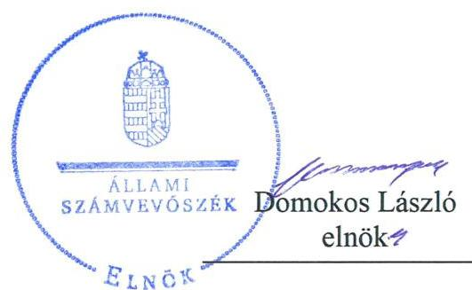

---

|   | AZ ELLENŐRZÉST FELÜGYELTE:  |
| --- | --- |
|   | PETŐ KRISZTINA felügyeleti vezető  |
|   | AZ ELLENŐRZÉST VEZETTE ÉS A VÉGREHAJTÁSÁÉRT FELELŐS:  |
|   | JANIK JÓZSEF ellenőrzésvezető  |
|   | A PROGRAM ÖSSZEÁLLÍTÁSÁÉRT FELELŐS:  |
|   | SALAMON ILDIKÓ tervezési vezető  |
|   | A TÉMÁHOZ KAPCSOLÓDÓ KORÁBBI SZÁMVEVŐSZÉKI JELENTÉSEK:  |
|   | - címe: Jelentés Magyarország 2017. évi központi költségvetése végrehajtásának ellenőrzéséről  |
|   | - sorszáma: 18275  |
|  Jelentéseink az Országgyűlés számítógépes hálózatán és az Interneten a www.asz.hu címen is olvashatóak. | - címe: Jelentés Magyarország 2016. évi központi költségvetése végrehajtásának ellenőrzéséről  |
|   | - sorszáma: 17208  |
|   | IKTATÓSZÁM: EL-1242-3886/2019.  |
|   | TÉMASZÁM: 2507  |
|   | ELLENŐRZÉS-AZONOSÍTÓ SZÁM: V0851  |

---

# TARTALOMJEGYZÉK 

■ ÖSSZEGZÉS ..... 5
■ AZ ELLENŐRZÉS CÉLJA ..... 7
■ AZ ELLENŐRZÉS TERÜLETE ..... 8
■ AZ ELLENŐRZÉS HÁTTERE, INDOKOLTSÁGA ..... 10
■ A JELENTÉS LÉNYEGES KÉRDÉSKÖREI ..... 11
■ AZ ELLENŐRZÉS HATÓKÖRE ÉS MÓDSZEREI ..... 12
■ MEGÁLLAPÍTÁSOK ..... 15
■ MELLÉKLETEK ..... 29
I. sz. melléklet: Értelmező szótár ..... 29
II. sz. melléklet: A belső kontrollrendszer értékelése ..... 32
III. sz. melléklet: Az integritás kontroll rendszer értékelése ..... 34
IV. sz. melléklet: A 2018. évi időközi és nemzetiségi választásokra, valamint a 2018. évi országgyűlési képviselőválasztásra fordított pénzeszközök felhasználásának értékelése. ..... 35
V. sz. melléklet: Ellenőrzött fejezetek és szervezetek ..... 38
■ FÜGGELÉKEK ..... 41
I. sz. függelék: Az ellenőrzött szervezetek ÁSZ által el nem fogadott észrevételei ..... 41
II. sz. függelék: Az Országgyűlés felé beszámolásra kötelezett intézmények összefoglaló értékelése ..... 47
III. sz. függelék: tájékoztatás a figyelemfelhívó levelekről ..... 51
■ RÖVIDÍTÉSEK JEGYZÉKE ..... 53

---

.

---

# ÖSSZEGZÉS 

A 2018. évi zárszámadási törvényjavaslatban szereplő teljesített bevételi és kiadási adatok megbízhatóak. A 2018. évi központi költségvetés végrehajtása a jogszabályi előírások szerint történt, a hiány és az államadósság a törvényi követelményekkel összhangban alakult.

## Az ellenőrzés társadalmi indokoltsága

A kiegyensúlyozott, átlátható és fenntartható költségvetési gazdálkodás elvét az Alaptörvény rögzíti, továbbá előírja, hogy a közpénzekkel gazdálkodó szervezetek kötelesek a nyilvánosság előtt elszámolni. Ennek érdekében a központi költségvetésről és az annak végrehajtásáról szóló törvényjavaslatnak azonos szerkezetben, átlátható módon és észszerű részletezettséggel kell tartalmaznia az állami kiadásokat és bevételeket. A költségvetés végrehajtásának, a zárszámadásnak az ellenőrzése az Állami Számvevőszék törvény alapján végrehajtandó feladata.

A zárszámadási törvényjavaslat ellenőrzésével az Állami Számvevőszék ennek az alkotmányos feladatának tesz eleget. Ellenőrzi az államháztartás központi alrendszerébe tartozó szervezeteknél a bevételek és kiadások elszámolásának megbízhatóságát, valamint éves gazdálkodásuk szabályszerűségét. A zárszámadás ellenőrzése kiemelten támogatja a közpénzügyek átláthatóságát azzal, hogy a központi költségvetés, ezen belül a központi és a fejezeti kezelésű előirányzatok, a társadalombiztosítás pénzügyi alapjai, az elkülönített állami pénzalapok, valamint az államháztartás központi alrendszerébe tartozó költségvetési szervek bevételi és kiadási előirányzatai teljesítésének ellenőrzésén keresztül a központi alrendszer egésze bevételi és kiadási adatainak megbízhatóságáról ad számot. A törvényben előírt ellenőrzési kötelezettség végrehajtása, a zárszámadásról adott számvevőszéki értékelés támogatja az Országgyűlést a költségvetés végrehajtására vonatkozó törvényjavaslat megalapozott elfogadásában, hozzájárulva az elszámoltathatóság és az átláthatóság követelményének érvényesüléséhez, az ellenőrzött szervezetek közpénzekkel való felelős gazdálkodásához, egyidejűleg szolgálva a közvélemény széleskörű tájékoztatását is.

## Főbb megállapítások

Az államháztartás központi alrendszerébe tartozó költségvetési szervek, a központi és a fejezeti kezelésű előirányzatok, a társadalombiztosítás pénzügyi alapjai, továbbá az elkülönített állami pénzalapok bevételi és kiadási előirányzatainak teljesítési adatai megbízhatóak voltak, azokat a 2018. évi zárszámadási törvényjavaslat valósághűen tartalmazza.

Az államháztartás központi alrendszerének pénzforgalmi hiánya mind összegében, mind pedig GDP-arányosan jelentős csökkenést mutatott az előző évhez képest, a 2018. évben mintegy 21\%-kal kevesebb, 1 451,6 Mrd Ft volt, amely a GDP 3,4\%-át tette ki (szemben a 2017. évi 4,7\%-kal). A Stabilitási törvény szerinti adósságcsökkentési követelmény teljesült, mivel az államadósság GDP arányosan az előző évi 71,9\%-ról a tárgyévben 69,0\%-ra mérséklődött. A kormányzati szektor uniós módszertan szerinti hiánya az előző évihez képest csökkenő, 2,3\%-os mértékű volt. A hiány és adósság mutatók kedvező alakulásában fontos szerepe volt a GDP jelentős, 9,9\%-os mértékű bővülésének, amely ellensúlyozta a kormányzati szektor uniós módszertan szerint számított hiányának előző évihez képest közel 52,0 Mrd Ft-tal történt növekedését is.

A Konvergencia Programban a 2018. évre meghatározott célok teljesültek, mivel a kormányzati szektor hiányának összege, valamint az államadósság mutató a tervezettnél alacsonyabb szinten realizálódott.

A 2018. évi zárszámadási törvényjavaslatot a Pénzügyminisztérium az államháztartásról szóló 2011. évi CXCV. törvény előírásainak megfelelő szerkezetben és tartalommal készítette el. A törvényjavaslat tartalmazza a jogszabály szerinti kötelező tartalmi elemeket.

A költségvetési intézményrendszer a közpénzekkel való gazdálkodás szabályszerűségét biztosította.

---

A központi alrendszer 2018. évi bevételi és kiadási előirányzatainak teljesítési adatait és azok minősítését az 1. ábra mutatja be.

1. ábra

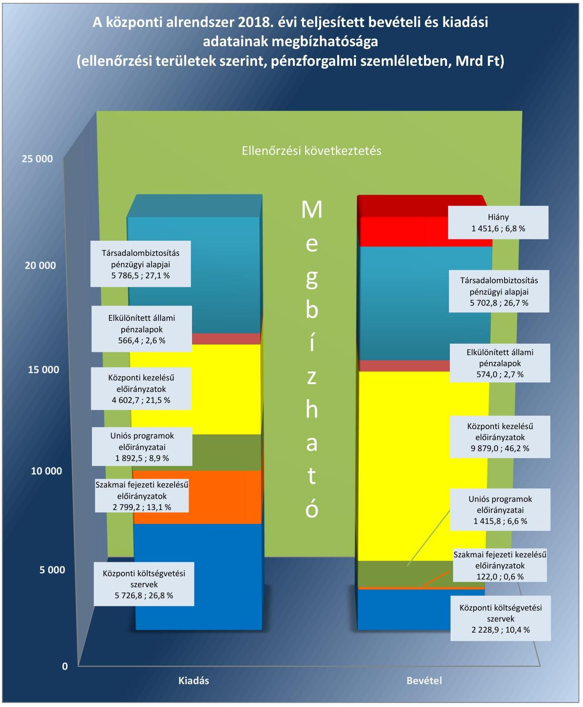

*Forrás: 2018. évi zárszámadási törvényjavaslat, ÁSZ saját szerkesztés*

---

# AZ ELLENŐRZÉS CÉLJA 

Az ÁSZ¹ a zárszámadási törvényjavaslat megfelelőségét és az abban szereplő adatok megbízhatóságát ellenőrizte, észszerű bizonyosság szerzése céljával arról, hogy:
$\longrightarrow$ a zárszámadási törvényjavaslat tartalma, szerkezete megfelel-e a jogszabályi előírásoknak;
$\longrightarrow$ az Alaptörvény és a Stabilitási tv.² államadósságra vonatkozó előírásai érvényesültek-e, az államháztartás központi alrendszerében a hiány alakulása megfelelt-e a Kvtv.³ előírásainak;
$\longrightarrow$ az államháztartás bevételeit a Kvtv.-ben rögzítettekkel összhangban, a közpénzekkel való gazdálkodás jogszabályi követelményeinek megfelelően használták-e fel, a törvényjavaslat valósághűen mutatja-e be a költségvetés végrehajtására vonatkozó pénzügyi adatokat, információkat;
$\longrightarrow$ a központi költségvetés bevételi és kiadási előirányzatainak teljesítése megfelelt-e a jogszabályi előírásoknak és tartalmaz-e lényeges hibát;
$\longrightarrow$ a költségvetés végrehajtásában jog- és hatáskörrel rendelkezők a 2018. évi költségvetésben meghatározott pénzügyi keretek között szabályszerűen gazdálkodtak-e a közpénzekkel.

Az ellenőrzés kiterjedt a 2019. évi költségvetési folyamatok nyomon követésére, kiemelten az államadósság alakulására ható tényezők monitoringjára is.

Az ellenőrzés célja volt továbbá a 2018. évi időközi és nemzetiségi választásokra, valamint a 2018. évi országgyűlési képviselőválasztásra fordított pénzeszközök tervezése, felhasználása és elszámolása szabályszerűségének értékelése is.

---

# **AZ ELLENŐRZÉS TERÜLETE**

## **2018. évi zárszámadás – Magyarország 2018. évi központi költségvetése végrehajtásának ellenőrzése**

A központi és szakmai fejezeti kezelésű előirányzatok, a költségvetési szervek, a TB Alapok⁴, valamint az ELKA⁵ a vagyonról és a költségvetés végrehajtásáról az Áht.⁶ előírásainak megfelelően éves költségvetési beszámolót, az éves költségvetési beszámolók alapján évente, az elfogadott költségvetéssel összehasonlítható módon zárszámadást készít.

A Kincstár⁷ az Áhsz.⁸ előírásainak megfelelően az éves költségvetési beszámolók adataiból a zárszámadási törvényjavaslat Országgyűlés elé terjesztésének időpontját megelőző 30. napig, azaz augusztus 31-ig az államháztartás központi alrendszeréről összevont (konszolidált) beszámolót készít.

A 2018. évben az államháztartás központi alrendszerének tervezett bevételi főösszege 18 751,4 Mrd Ft, kiadási főösszege 20 112,1 Mrd Ft, hiánya 1 360,7 Mrd Ft volt. A központi alrendszer teljesített bevételi és kiadási főösszege a 2018. évben 19 922,5 Mrd Ft, illetve 21 374,1 Mrd Ft, tényleges hiánya 1 451,6 Mrd Ft volt.

A 2018-as költségvetés végrehajtásáról szóló törvényjavaslat alapján a 2018. évben a központi alrendszer bevételeit, kiadásait és azok egyenlegeként a központi alrendszer hiányának alakulását folyó áron, pénzforgalmi szemléletben a 2. ábra szemlélteti.

2. ábra

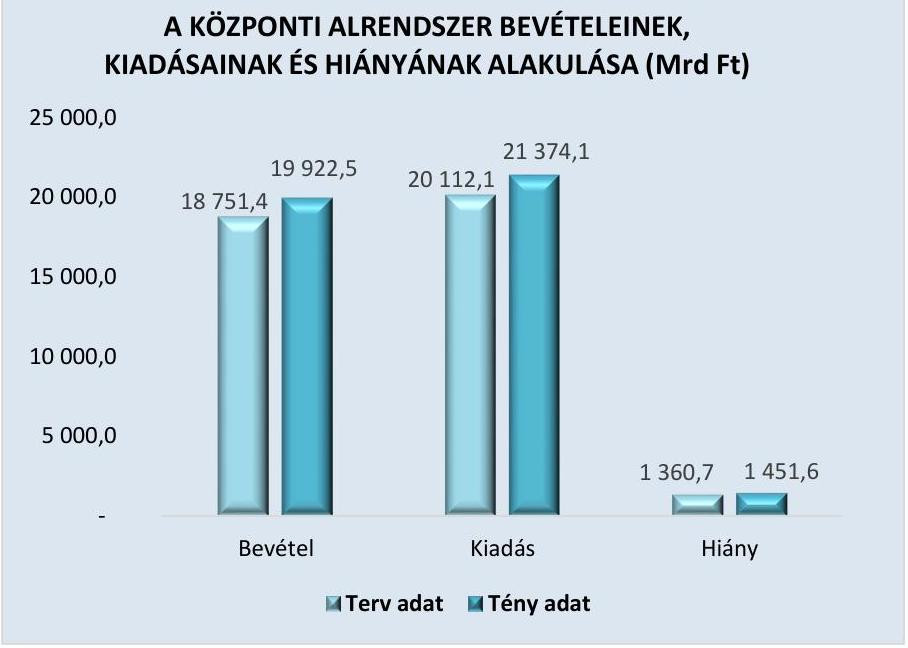

*Forrás: 2018. évi zárszámadási törvényjavaslat*

---

A közpénzek védelme, felelős felhasználása kapcsán kulcsfontosságú a belső kontrollrendszer, valamint az integritás kontrollok kiépítettsége, működtetése. Ennek ellenőrzése elősegíti, hogy az ellenőrzött szervezetek működésük és gazdálkodásuk során feladataikat szabályszerűen, gazdaságosan, hatékonyan és eredményesen lássák el, továbbá, hogy elszámolási kötelezettségeiket teljesítsék.

A 2018. évi időközi és nemzetiségi választások előirányzatai, valamint a 2018. évi országgyűlési képviselőválasztás előirányzatai a fejezeti kezelésű előirányzatok részét képezik. Ezen előirányzatok keretében a választási célokra fordított közpénzek összege 3 974,8 millió Ft volt. A Nemzeti Választási Irodánál történt a választási pénzeszközök szabályszerű tervezésének, felhasználásának és elszámolásának értékelése.

A 2018. évi időközi és nemzetiségi választások, valamint a 2018. évi országgyűlési képviselőválasztás előirányzatainak alakulását a 1. táblázat tartalmazza.

1. táblázat

# A 2018. ÉVI IDŐKÖZI ÉS NEMZETISÉGI VÁLASZTÁSOK, VALAMINT A 2018. ÉVI ORSZÁGGYŰLÉSI KÉPVISELŐVÁLASZTÁS FEJEZETI KEZELÉSŰ ELŐIRÁNYZATAI KIADÁSAINAK ALAKULÁSA 2018. ÉVBEN (M Ft)

|  Megnevezés | Eredeti
előirányzat | Módosított
előirányzat | Teljesítés  |
| --- | --- | --- | --- |
|  Időközi és nemzetiségi választások | 458,0 | 448,8 | 420,4  |
|  2018. évi országgyűlési képviselő- | 6600,0 | 3554,4 | 3554,4  |
|  választás |  |  |   |

Fonrás: 2018. évi zárszámadási törvényjavaslat

---

# AZ ELLENŐRZÉS HÁTTERE, INDOKOLTSÁGA 

Az Alaptörvény szerint a központi költségvetés végrehajtásának ellenőrzését az ÁSZ végzi el. Az ÁSZ tv.⁹ előírásainak megfelelően a zárszámadási ellenőrzés végrehajtása az ÁSZ éves gyakorisággal elvégzendő feladata. Az ÁSZ törvényi kötelezettségének teljesítésével hozzájárul ahhoz, hogy az Országgyűlés a zárszámadási törvény elfogadásával kapcsolatban megalapozott döntést hozzon. Az ellenőrzés elvégzésével az ÁSZ teljes és objektív képet ad a 2018. évi zárszámadási törvényjavaslatban szereplő adatok megbízhatóságáról, továbbá a megállapításokkal elősegíti az ellenőrzöttek közpénzekkel való felelős gazdálkodását.

A Ve.¹⁰ előírása alapján a választások előkészítésével és lebonyolításával kapcsolatos állami feladatok végrehajtásának költségeit, valamint a választási szervek tevékenységével összefüggő egyéb költségeket - az Országgyűlés által megállapított mértékben - a központi költségvetésből kell biztosítani. A központi költségvetésből biztosított választási pénzeszközök felhasználásáról az ÁSZ tájékoztatja az Országgyűlést. Ennek a Ve.-ben rögzített kötelezettségének az ÁSZ a zárszámadásról szóló jelentés keretében tesz eleget.

Az ÁSZ az ellenőrzéssel hozzájárul az értékteremtő rend kialakításához és megőrzéséhez.

---

# A JELENTÉS LÉNYEGES KÉRDÉSKÖREI 

1. A zárszámadási törvényjavaslat tartalma, szerkezete összhangban volt-e a jogszabályi előírásokkal, érvényesültek-e az Alaptörvény és a Stabilitási törvény államadósságra vonatkozó előírásai, továbbá az államháztartás központi alrendszerében a hiány a törvényi előírások szerint alakult-e?
2. A zárszámadási törvényjavaslat valósághűen mutatja-e be a költségvetés végrehajtására vonatkozó pénzügyi adatokat, információkat, az abban szereplő bevételi és kiadási előirányzatok teljesítési adatai megbízhatóak-e?
3. A központi alrendszer bevételi és kiadási előirányzatainak teljesítése, az előirányzatok módosítása, a költségvetési maradvány megállapítása és az éves költségvetési beszámolók összeállítása során betartották-e a jogszabályi előírásokat?

---

# AZ ELLENŐRZÉS HATÓKÖRE ÉS MÓDSZEREI 

## Az ellenőrzés típusa

Megfelelőségi ellenőrzés. A 2018. évi időközi és nemzetiségi választásokra, valamint a 2018. évi országgyűlési képviselőválasztásra fordított pénzeszközök esetében szabályszerűségi ellenőrzés.

## Az ellenőrzött időszak

A 2018. év, a zárszámadási törvényjavaslat összeállítása tekintetében a 2019. szeptember 30-ig tartó időszak.

## Az ellenőrzés tárgya

A zárszámadási ellenőrzés során az ÁSZ a zárszámadási törvényjavaslat megfelelőségét és az abban szereplő adatok megbízhatóságát ellenőrzi. Az ellenőrzés keretében az ÁSZ valamennyi

 ellenőrzött területen (központi kezelésű előirányzatok; központi költségvetési szervek; fejezeti kezelésű előirányzatok, uniós és kapcsolódó költségvetési támogatások; ELKA; TB Alapok) a gazdálkodás és az előirányzat-felhasználás megfelelőségét, a költségvetési gazdálkodásra vonatkozó szabályokkal való összhangját ellenőrzi.

A zárszámadási ellenőrzés keretében az ÁSZ ellenőrzi továbbá a 2018. évi időközi és nemzetiségi választások, valamint a 2018. évi országgyűlési képviselőválasztás előkészítése és lebonyolítása során a választásokra fordított pénzeszközök felhasználásának szabályszerűségét.

## Az ellenőrzött szervezetek

A PM ${ }^{11}$, Kincstár, NAV ${ }^{12}$, ÁKK Zrt. ${ }^{13}$, ÁEEK ${ }^{14}$, központi előirányzatok, TB Alapok (Nyugdíjbiztosítási Alap, Egészségbiztosítási Alap), ELKA, a mintavételezéssel kiválasztott fejezeti kezelésű előirányzatok és kezelő szerveik. Az alkotmányos fejezetek intézményei (OGYH ${ }^{15}$, KE${ }^{16}$, AB${ }^{17}$, AJBH ${ }^{18}$, Legfőbb Ügyészség, Bíróságok, OBH ${ }^{19}$, Kúria), az OGY ${ }^{20}$ részére a tevékenységükről beszámolásra kötelezett intézmények (KH${ }^{21}$, NAIH ${ }^{22}$, EBH${ }^{23}$, MEKH${ }^{24}$, NVI${ }^{25}$, NEBH${ }^{26}$, NÉBIH${ }^{27}$, GVH${ }^{28}$, KSH${ }^{29}$, MTA${ }^{30}$, MMA${ }^{31}$, NKFIH ${ }^{32}$ ), továbbá a központi alrendszer mintavételezéssel kiválasztott intézményei. Az ellenőrzött szervezeteket teljes körűen a V. számú melléklet tartalmazza.

A 2018. évi időközi és nemzetiségi választásokra, valamint a 2018. évi országgyűlési képviselőválasztásokra fordított fejezeti kezelésű előirányzatok esetében az NVI.

---

# Az ellenőrzés jogalapja 

Az ellenőrzés lefolytatásának jogalapját az ÁSZ tv. 5. § (2) és (7) bekezdései, valamint a Ve. 12. §-a képezte.

## Az ellenőrzés módszerei

Az ellenőrzést az ÁSZ az ellenőrzési program szempontjai szerint, az ellenőrzött időszakban hatályos jogszabályok alapján, az ellenőrzés szakmai szabályok és módszertanok figyelembevételével végezte.

Az ellenőrzés ideje alatt az ellenőrzött szervezetekkel a kapcsolattartás az ÁSZ SZMSZ ${ }^{33}$-ének vonatkozó előírásai alapján történt.

Az ellenőrzési bizonyítékként felhasználható adatforrások közé tartoztak egyrészt az ellenőrzési program részletes szempontjainál felsorolt adatforrások, másrészt az ellenőrzés folyamán feltárt, az ellenőrzés szempontjából információt tartalmazó dokumentumok. Az ellenőrzési kérdések megválaszolásához szükséges bizonyítékok megszerzése az ellenőrzött által rendelkezésre bocsátott dokumentumokra, adatokra alapozva megfigyelés, szemle (szemrevételezés), kérdésfeltevés (információkérés), mintavételezés, valamint elemző eljárás útján történt.

A mintavételezés módszere biztosította, hogy az ÁSZ megalapozott értékelést tudjon adni a zárszámadás minden lényeges területére (központi és fejezeti kezelésű előirányzatok, költségvetési szervek, elkülönített állami pénzalapok, társadalombiztosítási alapok) vonatkozóan a törvényjavaslatban szereplő adatok megbízhatóságáról.

A központi költségvetési szervek bevételi és kiadási adatainak ellenőrzése pénzegység alapú mintavétel alkalmazásával történt.

Az Országgyűlés felé beszámolásra kötelezett intézmények és a TB Alapok esetében az értékelés szervezetenként külön-külön történt, ezért a minta elemszámának meghatározására szervezetenként az eredendő és a kontroll kockázat szintje alapján, a 2. táblázat szerint került sor.
2. táblázat

MINTA ELEMSZÁM MEGHATÁROZÁSÁT BEFOLYÁSOLÓ TÉNYEZŐK

| Eredendő kockázat   értékelése | Belső kontrollrendszer   összevont értékelése | A mintavételes ellenőrzéstől   várt konfidencia szintnek   megfelelő legkisebb értéke |
| :--: | :--: | :--: |
|  | Megfelelő | $45 \%$ |
| Nem nagy | Részben megfelelő | $67 \%$ |
|  | Nem megfelelő vagy nem   volt kontroll teszt | $95 \%$ |
|  | Megfelelő | $67 \%$ |
|  | Részben megfelelő | $80 \%$ |
| Nagy | Nem megfelelő vagy nem   volt kontroll teszt | $95 \%$ |

Forrás: ÁSZ
Az alkotmányos fejezetek intézményeinek összevont kiadási és bevételi adatállományaiból területenként rétegezett mintavétellel 150 elemű

---

minta kiválasztására került sor. Az adatbázisok heterogenitására tekintettel, a megfelelő bizonyosság elérése érdekében nagy kockázattal számolva került meghatározásra a minta elemszáma.

A központi költségvetés összes egyéb intézménye esetében két lépcsős mintavételi eljárással történt a kiválasztás. Az egyéb intézményekből első lépésben rétegzett mintavétel alkalmazásával az összes intézmény 10\%-ának megfelelő számú intézmény kiválasztására került sor. A kiválasztott intézmények bevételi és kiadási adataiból ezt követően pénzegység alapú mintavétel alkalmazásával történt a kiválasztás.

A mintatételek kiértékelése során az ellenőrzés 95%-os megbízhatóság mellett megbecsülte az egyes mintavételi területeken előforduló hibák összegének felső korlátját. Az ÁSZ a zárszámadási törvényjavaslat megbízhatóságát befolyásoló összes hiba összegét viszonyította a lényegességi küszöbértékhez, amelyet mind a központi alrendszer egésze, mind pedig az egyes részterületek tekintetében a bevételi, illetve kiadási főösszeg (teljesítési adat) 2%-ában határozott meg.

A zárszámadás ellenőrzése keretében az ÁSZ elvégezte az I. Országgyűlés fejezet 24/2/1 „Időközi és nemzetiségi választások lebonyolítása" fejezeti kezelésű előirányzat, valamint az I. Országgyűlés fejezet 24/2/3 „2018. évi országgyűlési képviselőválasztás" fejezeti kezelésű előirányzat kiadási előirányzatai terhére a választásokra fordított pénzeszközök ellenőrzését. A Ve. 12. §-ában előírtaknak eleget téve az Állami Számvevőszék a 2018. évi zárszámadásról szóló jelentés elkülönített mellékletében tájékoztatást ad az Országgyűlés részére a választásokra fordított pénzeszközök felhasználásáról.

A választásokra fordított pénzeszközök felhasználásának szabályszerűségét egyszerű véletlen mintavételi módszer alapján értékelte az ÁSZ. Szabályszerű volt az ellenőrzött terület, amennyiben 95%-os bizonyossággal az ellenőrzött sokaságban az átlagos hibaarány legfeljebb 10% volt, illetve nem szabályszerű, amennyiben 10%-nál magasabb arányt képviselt.

---

# MEGÁLLAPÍTÁSOK 

## 1. A zárszámadási törvényjavaslat tartalma, szerkezete összhangban volt-e a jogszabályi előírásokkal, érvényesültek-e az Alaptörvény és a Stabilitási törvény államadósságra vonatkozó előírásai, továbbá az államháztartás központi alrendszerében a hiány a törvényi előírások szerint alakult-e?

## Összegző megállapítás

1.1. számú megállapítás
3. táblázat

## A 2018. ÉVI ZÁRSZÁMADÁSI TÖRVÉNYJAVASLAT

## többek között tartalmazta:

- a költségvetési mérleget alrendszerenként és összevontan, közgazdasági és funkcionális tagolásban;
- a Stabilitási tv. szerinti államadósságot és a központi költségvetés adósságállományának változását;
- a költségvetési hiány finanszírozásának módját;
- az adóbevételekben érvényesülő közvetett támogatásokat;
- az államháztartás központi alrendszere és a kormányzati szektorba sorolt egyéb szervezetek tekintetében a nem teljesítő hitelkövetelések állományát;
- az állami és az önkormányzati garancia- és kezességvállalások állományát.

Forrás: 2018. évi zárszámadási törvényjavaslat

A törvényjavaslat szerkezete és tartalma megfelelt az Áht. előírásainak. Az államháztartás központi alrendszerének hiánya és az államadósság a törvényi követelményekkel összhangban alakult.

A zárszámadási törvényjavaslat összeállítása szabályszerű volt.
A törvényjavaslat szerkezete és tartalma megfelelt az Áht. előírásainak, tartalmazta a törvényi követelményeket. A törvényjavaslatot az elfogadott költségvetéssel összehasonlítható módon állították össze. A 2018. évi zárszámadási törvényjavaslat szöveges általános indokolása tájékoztatás céljából bemutatta az uniós és az államháztartási elszámolások főbb módszertani eltéréseit. A tartalmi követelmények teljesítését a 3. táblázat tartalmazza.

A PM az Áht. és az Ávr. ${ }^{34}$ előírásaival összhangban a zárszámadási törvényjavaslat készítésének folyamatát szabályzatban határozta meg, amely kiterjedt az összeállítást megalapozó módszertani elvekre, a beszámolási keretrendszerre, a feladatokra, azok ütemezésére és felelőseire.

A zárszámadási törvényjavaslat összeállítását támogató informatikai rendszerek, így a PM KAR ${ }^{35}$ és AHAB ${ }^{36}$ rendszere, illetve a Kincstár KGR K11${ }^{37}$ elektronikus információs rendszere adatainak sértetlenségét, hitelességét, megfelelőségét befolyásoló főbb kontrollok kiépítettsége és működése megfelelő volt.

---

### 1.2. számú megállapítás

Az államháztartás központi alrendszerének pénzforgalmi hiánya a törvényi előírások szerint alakult. Az államadósság GDP-hez viszonyított aránya az Alaptörvény és a Stabilitási tv. előírásainak megfelelően csökkenő tendenciát mutatott. A kormányzati szektor uniós módszertan szerinti hiánya és adósságmutatója a jogszabályoknak megfelelt.

Az államháztartás központi alrendszerének hiánya folyó áron, pénzforgalmi szemléletben 1451,6 Mrd Ft összegben teljesült. A központi alrendszer pénzforgalmi hiányáról területenként a 4. táblázat ad áttekintést. A központi alrendszer hiányát és annak a GDP-hez viszonyított arányát a 2017. és a 2018. években a 3. ábra szemlélteti.
3. ábra
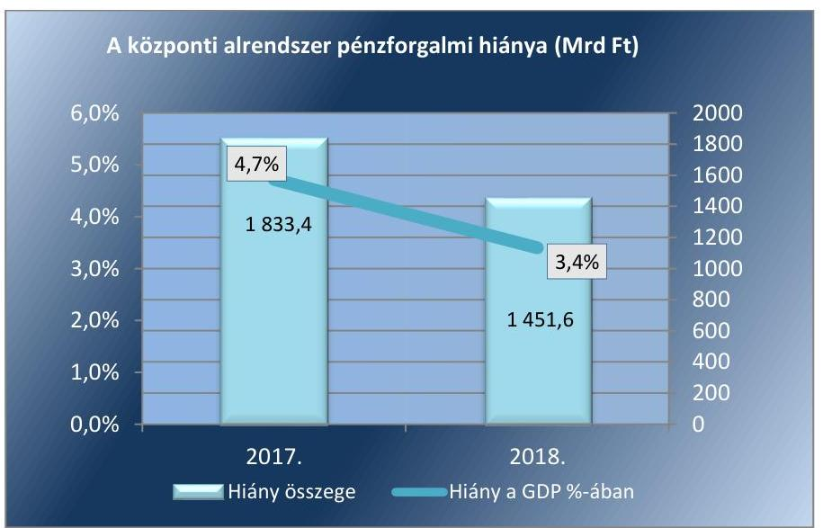

Forrás: 2018. évi zárszámadási törvényjavaslat
A pénzforgalmi hiány GDP-hez viszonyított aránya a hiány nominális összegénél nagyobb mértékben csökkent, mivel a GDP 2018-ban 9,9%-kal, az előző évi 38 835,2 Mrd Ft-ról 42 661,8 Mrd Ft-ra nőtt.

A hiány összegén belül az uniós fejlesztési költségvetés hiánya 51,9%-os részarányt képviselt. Ez arra vezethető vissza, hogy az uniós támogatások az EU-tól lehívott összegek tényleges beérkezését megelőzően a hazai költségvetés terhére megelőlegezésre kerültek. A felülről nyitott előirányzatok 206,1 Mrd Ft összegű túlteljesítése a központi alrendszer 2018. év végén fennálló hiányához 14,2%-ban járult hozzá.

A központi alrendszer 2018. évi hiányának belső összetételét az 5. táblázat mutatja be.
5. táblázat

# A KÖZPONTI ALRENDSZER HIÁNYÁNAK ÖSSZETÉTELE (MRD FT) 

|  | Terv | Tény | Eltérés |
| :-- | --: | --: | --: |
| Hazai működési költségvetés | 0,0 | 0,0 | 0,0 |
| Hazai felhalmozási költségvetés | 857,3 | 698,3 | $-159,0$ |
| Uniós fejlesztési költségvetés | 503,4 | 753,3 | 249,9 |
| Összesen | $\mathbf{1 3 6 0 , 7}$ | $\mathbf{1 4 5 1 , 6}$ | $\mathbf{9 0 , 9}$ |

Forrás: 2018. évi zárszámadási törvényjavaslat

---

A központi alrendszer tervezett és teljesített bevételi, kiadási előirányzatait és hiányát, valamint azok megoszlását a 4. ábra szemlélteti.
4. ábra
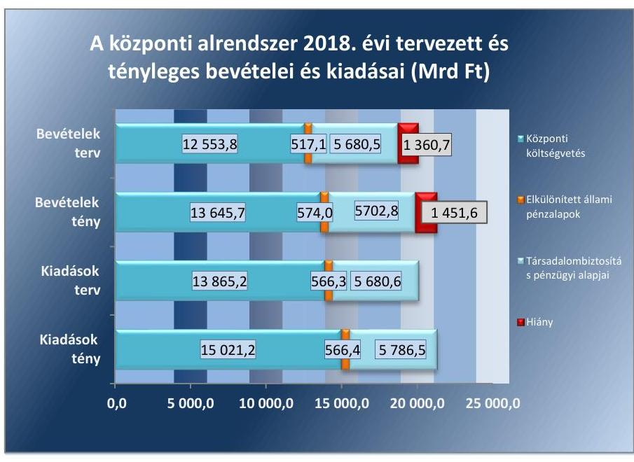

Forrás: 2018. évi zárszámadási törvényjavaslat, ÁSZ saját szerkesztés
A Stabilitási tv. szerinti államadósság-mutató a 2017. év végi 71,9%-hoz képest a 2018. év végére 69,0%-ra csökkent. Az államadósság-mutató alakulása a 2018. évben megfelelt az Alaptörvényben foglalt, az államadósság GDP-hez viszonyított arányának csökkentését előíró követelménynek, mivel a 2017. évi államadósság-mutatónál alacsonyabb lett.

A konszolidált, Stabilitási tv. szerinti államadósság, illetve államadósságmutató 2017. és 2018. évi alakulását az 5. ábra szemlélteti.
5. ábra
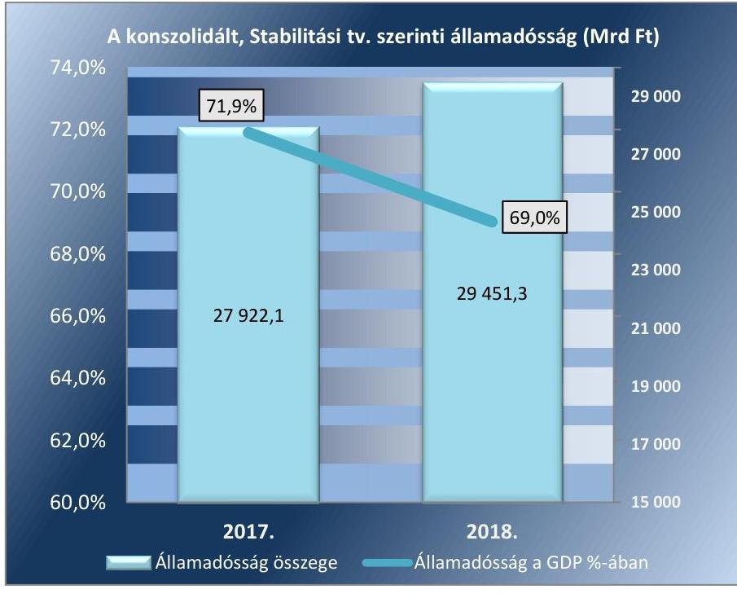

Forrás: 2018. évi zárszámadási törvényjavaslat, ÁSZ saját szerkesztés

---

A kormányzati szektor uniós módszertan szerinti GDP-arányos hiánya a 2017. évihez képest csökkent, a Konvergencia Programban ${ }^{38}$ rögzített 2,4%-os tervezett hiánycélnál kedvezőbben, 2,3%-on teljesült. A kormányzati szektor 2018. évi hiányának nominális összege 976,5 Mrd Ft, így az előző évihez képest 51,8 Mrd Ft-tal magasabb volt, ugyanakkor ennek a hiánycélra gyakorolt negatív hatását teljes egészében kompenzálta a GDP mintegy 9,9%-os mértékű növekedése.

A kormányzati szektor uniós módszertan szerinti hiányát a 6. ábra mutatja be. (A 6. és 7. ábra adatai az EUROSTAT részére 2019. október 1-jén megküldött EDP-jelentés adatain alapulnak, így az ÁSZ 2017. évi költségvetés végrehajtásáról szóló jelentéséhez képest eltérést mutatnak.)
6. ábra
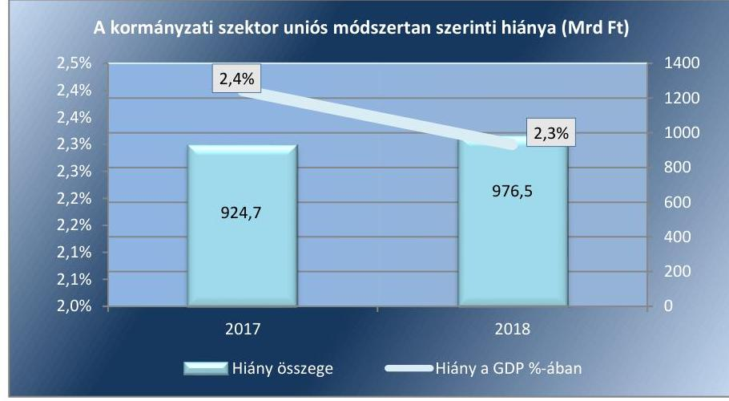

Forrás: 2019. október 1-jei EDP-jelentés, ÁSZ saját szerkesztés
A kormányzati szektor az uniós kritériumok szerinti adósságcsökkentési követelményt teljesítette, valamint a Konvergencia Programban a 2018. évre meghatározott céloknak is megfelelt. Az uniós módszertan szerinti adósság a 2018. évben 29 951,2 Mrd Ft volt. A GDP-hez viszonyított adósságmutató a 2017. évhez 72,9%-ról a 2018. évre 70,2%-ra csökkent.

---

A kormányzati szektor uniós módszertan szerinti adósságát a 7. ábra mutatja be.
7. ábra
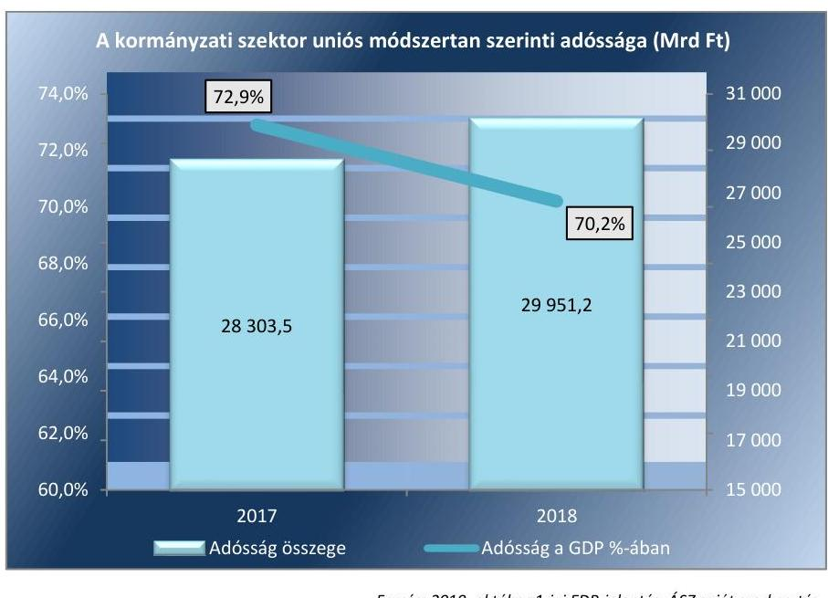

Forrás: 2019. október 1-jei EDP-jelentés, ÁSZ saját szerkesztés

# 2. A zárszámadási törvényjavaslat valósághűen mutatja-e be a költségvetés végrehajtására vonatkozó pénzügyi adatokat, információkat, az abban szereplő bevételi és kiadási előirányzatok teljesítési adatai megbízhatóak-e? 

Összegző megállapítás
2.1. számú megállapítás
6. táblázat

A KÖZPONTI KEZELÉSŰ ELŐIRÁNYZATOK BEVÉTELEI, KIADÁSAI (MRD FT)

| Adat | Bevétel | Kiadás |
| :-- | --: | --: |
| Központi kezelésű   előirányzatok összesen   Ebből: | 9879,0 | 4602,7 |
| Adóbevételek | 8851,9 | - |
| Önkormányzatok   támogatása | - | 746,8 |
| Adósságszolgálat | 120,5 | 1080,8 |
| Kezességvállalás | 4,8 | 12,5 |
| NCSSZA | 1,7 | 642,8 |
| Állami vagyon | 184,6 | 305,6 |
| Egyéb | 715,5 | 1814,2 |

Forrás: 2018.
 évi zárszámadási törvényjavaslat

A zárszámadási törvényjavaslat valósághűen mutatja be a költségvetés végrehajtására vonatkozó pénzügyi adatokat, információkat, az abban szereplő bevételi és kiadási előirányzatok teljesítési adatai megbízhatóak.

A központi költségvetés részét képező központi kezelésű előirányzatok teljesítési adatai megbízhatóak.

A központi kezelésű előirányzatok bevételi és kiadási teljesítési adatai megbízhatóak voltak. A központi kezelésű előirányzatok bevételeinek és kiadásainak alakulását a 6. táblázat mutatja be.

A költségvetés központi kiadási előirányzatai terhére teljesített kiutalások során betartották a jogszabályi előírásokat. Az önkormányzatok támogatásainak kiutalása, az adósságszolgálat, a kezesség- és garanciavállalás kiadási előirányzatainak felhasználása megbízható volt. A további központi kezelésű előirányzatok kiadásai (közöttük a Pártok és a Pártalapítványok támogatása, a Közszolgálati médiaszolgáltatás támogatása, a Szociálpolitikai menetdíj támogatás, a Lakástámogatások, a Vállalkozások folyó támogatása, a Kormányzati rendkívüli kiadások) elszámolása a jogszabályi előírásoknak megfelelően dokumentumokkal alátámasztott, megbízható volt. A kiadásokon belül az NCSSZA ${ }^{20}$ teljesítési adatai nem voltak megbízhatóak,

---

7. táblázat

|  ÁLLAMI VAGYONNAL |  |   |
| --- | --- | --- |
|  KAPCSOLATOS BEVÉTELEK, |  |   |
|  KIADÁSOK TELJESÍTÉSE (MRD FT) |  |   |
|  Adat | Bevétel | Kiadás  |
|  Állami vagyon | 84,0 | 185,5  |
|  Nemzeti Földalap | 13,1 | 19,1  |
|  Tulajdonosi |  |   |
|  joggyakorlás | 87,5 | 101,0  |
|  Összesen | 184,6 | 305,6  |
|  Forrás: 2018. évi zárszámadási törvényjavaslat |  |   |

### 2.2. számú megállapítás

8. táblázat

A szakmai fejezeti kezelésű előirányzatok teljesítése (MRD FT)

|  Kiadás | Bevétel  |
| --- | --- |
|  2799,2 | 122,0  |

Forrás: 2018. évi zárszámadási törvényjavaslat ez azonban nem befolyásolta a kiadások összességének megbízható minősítését.

A bevételi adatok megbízhatóak voltak. Az adóbevételeknél az ellenőrzés megbízhatósági hibát nem tárt fel, az állami vagyonnal kapcsolatos bevételek megbízható minősítését a feltárt megbízhatósági hibák nem befolyásolták.

A XX. EMMI40 FEJEZET NCSSZA alcím Családi támogatások, illetve Jövedelempótló és jövedelemkiegészítő szociális támogatások jogcímcsoportjai terhére teljesített kiadások esetében az ellenőrzés megbízhatósági hibákat állapított meg, mivel a Számv. tv. ${ }^{41}$ előírásai ellenére nem álltak rendelkezésre a folyósított ellátások megállapításának bizonylatai. A megbízhatósági hibák összértéke meghaladta a lényegességi szintet, ezért az NCSSZA kiadási adatai nem voltak megbízhatóak.

Az állami vagyonnal kapcsolatos bevételek és kiadások megbízhatóak voltak, a bevételeknél feltárt megbízhatósági hibák összértéke nem haladta meg a lényegességi szintet. Az állami vagyonnal kapcsolatos bevételek és kiadások teljesítéséről a 7. táblázat ad áttekintést.

A központi költségvetés részét képező fejezeti kezelésű előirányzatok teljesítési adatai megbízhatóak.

## A szakmai fejezeti kezelésű előirányzatok

bevételi és kiadási előirányzatainak teljesítési adatai megbízhatóak voltak. A szakmai fejezeti kezelésű előirányzatok kiadásait és bevételeit a 8. táblázat tartalmazza.

A szakmai fejezeti kezelésű előirányzatok kiadásainak összetételét a 8. ábra szemlélteti. 8. ábra

A szakmai fejezeti kezelésű előirányzatok kiadásai (Mrd Ft)

|  122,8 | 146,3 | 156,8  |
| --- | --- | --- |
|  124,1 |  |   |
|  139,8 |  | 792,3  |
|   | 378,2 | 893,9  |
|   | 243 | 893,9  |
|  |   |   |
|  ■ Emberi Erőforrások Minisztériuma |  | ■ Innovációs és Technológiai Minisztérium  |
|  ■ Belügyminisztérium |  | ■ Miniszterelnökség  |
|  ■ Miniszterelnöki Kormányiroda |  | ■ Miniszterelnöki Kabinetiroda  |
|  ■ Agrárminisztérium |  | ■ Külgazdasági és Külügyminisztérium  |
|  ■ Egyéb |  |   |

Forrás: 2018. évi zárszámadási törvényjavaslat

---

A szakmai fejezeti kezelésű előirányzatok bevételeinek összetételét a 9. ábra mutatja be.
9. ábra
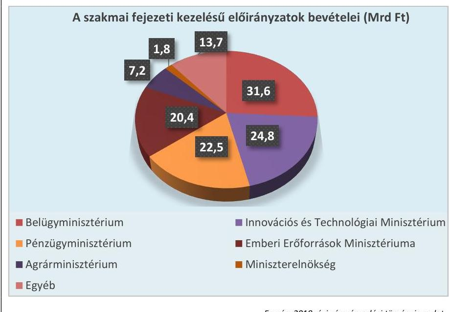

Forrás: 2018. évi zárszámadási törvényjavaslat
Az uniós fejlesztések kiadási előirányzatainak teljesítése megbízható volt. A 2018. évi teljesítési adatokat a 9. táblázat tartalmazza.
9. táblázat

# XIX. UNIÓS FEJLESZTÉSEK FEJEZET 2018. ÉVI KIADÁSAINAK TELJESÍTÉSI ADATAI (Mrd Ft) 

| Megnevezés | Összeg |
| :-- | :--: |
| 2014-2020 közötti kohéziós politikai operatív programok | 1509,0 |
| Vidékfejlesztési és halászati programok (2014-2020) | 180,3 |
| Európai Területi Együttműködés (2014-2020) | 16,3 |
| Nemzeti Stratégiai Referenciakeret | 48,1 |
| Egyéb uniós előirányzatok (Svájci Alap, EGT, Norvég Alap) | 6,2 |
| Uniós programok további előirányzatai | 136,6 |

Forrás: 2018. évi zárszámadási törvényjavaslat, ÁSZ szerkesztés
Az ellenőrzés a kiadások megbízhatóságának minősítését nem befolyásoló mértékű megbízhatósági hibákat tárt fel az uniós fejlesztéseken belül a 2014-2020 közötti kohéziós politikai operatív programok, valamint a Vidékfejlesztési program ${ }^{42}$ kiadásai esetében.
2.3. számú megállapítás

A központi költségvetés intézményei bevételi és kiadási előirányzatainak teljesítési adatai megbízhatóak.

Az OGY felé beszámolásra kötelezett intézmények és az alkotmányos fejezetek intézményei bevételi és kiadási adatainak kapcsán megbízhatósági hiba nem volt.

Az egyéb költségvetési intézmények bevételeinél és kiadásainál az ellenőrzés során feltárt megbízhatósági hibák összértéke nem haladta meg a lényegességi szintet.

A központi költségvetés intézményei bevételi és kiadási előirányzatainak teljesítési adatait a 10. táblázat mutatja be.

---

10. táblázat

# A KÖZPONTI KÖLTSÉGVETÉSI INTÉZMÉNYEK BEVÉTELEI ÉS KIADÁSAI (Mrd Ft) 

|  | OGY felé   beszámoló   intézmények | Alkotmányos   fejezetek   intézményei | Egyéb   intézmények | Mindösszesen |
| :-- | :--: | :--: | :--: | :--: |
| Bevétel | 37,1 | 9.3 | 2182,5 | 2228,9 |
| Kiadás | 74,8 | 202,5 | 5449,5 | 5726,8 |

Forrás: 2018. évi zárszámadási törvényjavaslat, ÁSZ szerkesztés
2.4. számú megállapítás

A TB Alapok bevételi és kiadási előirányzatainak teljesítési adatai megbízhatóak.

A TB alapok bevételi és kiadási előirányzatainak teljesítése megbízható volt.

A bevételek és kiadások alaponkénti megoszlását a 10. ábra mutatja be. 10. ábra
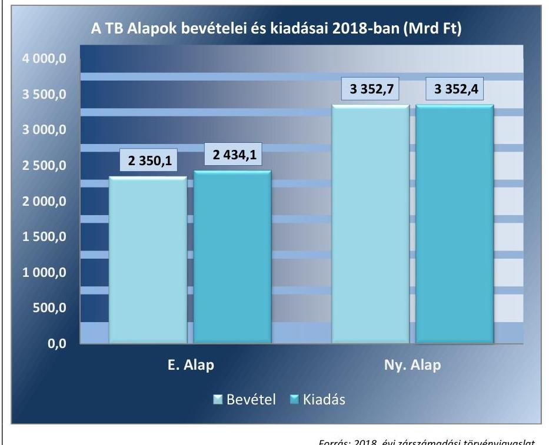

Forrás: 2018. évi zárszámadási törvényjavaslat
2.5. számú megállapítás

Az ELKA bevételi és kiadási előirányzatainak teljesítési adatai megbízhatóak.

Az ELKA (BGA ${ }^{43}$, KNPA $^{44}$, NEFA $^{45}$, NKA $^{46}$, NKFIA $^{47}$ ) bevételi előirányzatainak teljesítése, kiadási előirányzatainak felhasználása megbízható volt.

Megbízhatósági hiba a BGA kiadásainál fordult elő, ez azonban az ELKA összesített kifizetéseinek megbízhatóságát nem befolyásolta.

---

A bevételek és kiadások alaponkénti megoszlását a 11. ábra mutatja be. 11. ábra
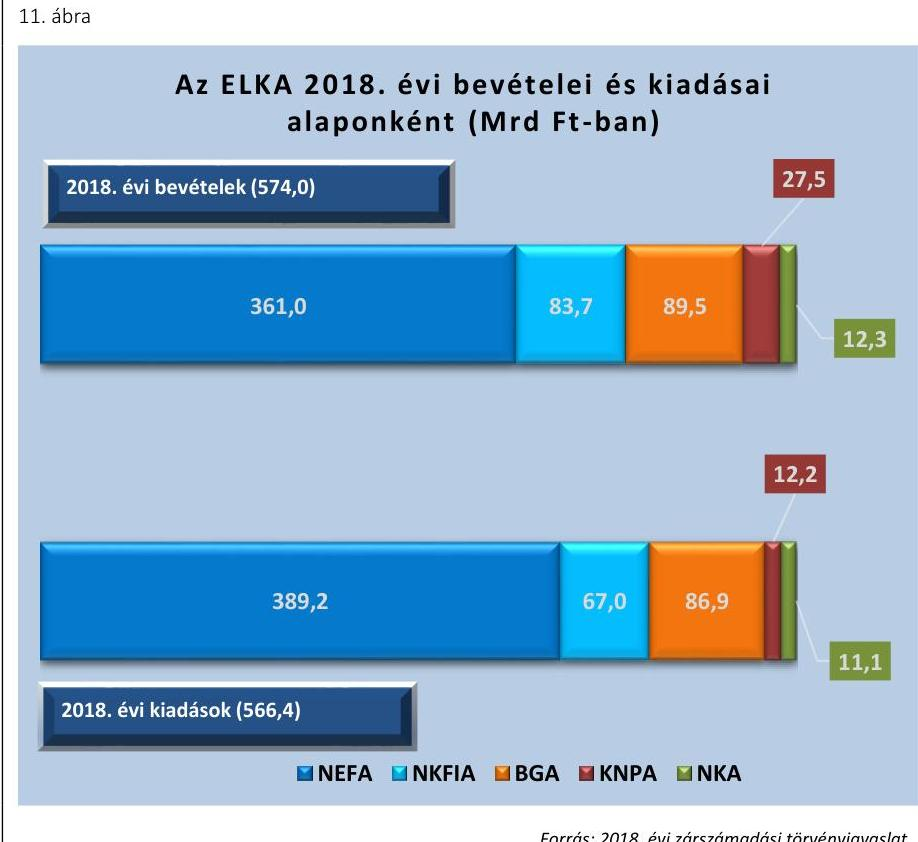

# 3. A központi alrendszer bevételi és kiadási előirányzatainak teljesítése, az előirányzatok módosítása, a költségvetési maradvány megállapítása és az éves költségvetési beszámolók összeállítása során betartották-e a jogszabályi előírásokat? 

Összegző megállapítás

A központi költségvetés, a TB Alapok és az ELKA bevételi és kiadási előirányzatainak teljesítése, az előirányzat-módosítás, a költségvetési maradvány megállapítása és az éves költségvetési beszámolók összeállítása során betartották a jogszabályi előírásokat.
3.1. számú megállapítás

A központi költségvetés részét képező központi kezelésű bevételi és kiadási előirányzatok teljesítése során betartották a jogszabályi előírásokat.

A központi kezelésű előirányzatok bevételeinek és kiadásainak teljesítése szabályszerű volt. Az ellenőrzés az NCSSZA-ból teljesített kiadásokat érintően szabályszerűségi hibákat állapított meg.

A XX. EMMI FEJEZET NCSSZA alcím Jövedelempótló és jövedelemkiegészítő szociális támogatások jogcímcsoportja terhére történt kiutalások során az Ávr. előírásai ellenére esetenként elmaradtak a kifizetést megelőzően szükséges kontrollok.

---

Az állami vagyonnal kapcsolatos bevételek és kiadások szabályszerűen teljesültek.

Az adósságszolgálattal kapcsolatosan a forintban és devizában fennálló adósság kamat és egyéb kiadásainak, valamint bevételeinek elszámolása a jogszabályi előírások betartásával történt. Az ÁKK Zrt. eleget tett az adósságszolgálati bevételekkel és kiadásokkal összefüggő, a Kincstár részére teljesítendő adatszolgáltatási és beszámolási kötelezettségének. A KESZ ${ }^{48}$ és a letéti számlák kezelése szabályszerű volt. A kiadások teljesítéséhez szükséges fedezetet biztosították.

Az állam által nyújtott hitelek visszatérülése kapcsán az Áht. követelés kezelésére vonatkozó előírásait betartották. Az önkormányzatok és azok társulásait érintő adósságátvállalás nem történt.

Az állami kezesség és viszontgarancia vállalása keretében teljesített kiadások, a kezesség visszatérülésével kapcsolatos bevételek elszámolása szabályszerű volt.

A költségvetési tartalékok képzése és felhasználása a jogszabályi előírások betartásával, szabályszerűen történt.

Az Országvédelmi Alap, a Céltartalékok és a Rendkívüli kormányzati intézkedésekre tervezett tartalékok rendelkezésre bocsátása a jogszabályokban rögzített célokkal összhangban történt, a források terhére történő kötelezettségvállalás, és azok felhasználása szabályszerű volt.

# 3.2. számú megállapítás 

A központi költségvetés részét képező fejezeti kezelésű előirányzatok teljesítése, az előirányzat módosítása, a költségvetési maradvány megállapítása és az éves költségvetési beszámolók összeállítása során betartották a jogszabályi előírásokat.

A szakmai fejezeti kezelésű kiadási előirányzatok terhére teljesített kifizetések szabályszerűek voltak. A bevételi előirányzatok teljesítése és elszámolása a jogszabályok rendelkezései szerint történt, azokat hiteles és megbízható számviteli bizonylatokkal alátámasztottan, megfelelő nyilvántartási számlákon számolták el.

Az előirányzatok módosításai, átcsoportosításai az Áht. és az Ávr. előírásai szerint történtek, elszámolásuk szabályszerű volt. A saját hatáskörben végrehajtott módosításokról az Ávr.-ben előírt határidőn belül tájékoztatták a Kincstárt.

A maradvány kimutatásokat a jogszabályok rendelkezései szerint állították össze és mutatták be az éves költségvetési beszámolókban.

Az éves költségvetési beszámolók elkészítése az Áhsz. előírásainak figyelembevételével történt, azokat főkönyvi kivonattal alátámasztották.

Az uniós fejlesztések fejezet pénzügyi forrásainak 2018. évi lekötése a 2018. évi fejlesztéspolitikai célokról szóló 1367/2018. (VIII. 13.) Korm. határozatban előírt mértékben valósult meg.

---

A 2014-2020-as programozási időszakban finanszírozott kohéziós politikai operatív programok, valamint a Vidékfejlesztési és Halászati Programok forrásainak felhasználása során betartották a jogszabályi előírásokat. A Belügyi Alapok képzése és igénybevétele szabályszerűen történt.

Az uniós programok bevételei, az egyéb uniós bevételek, valamint az uniós tagsággal kapcsolatos hazai befizetések elszámolásai összhangban voltak a Kvtv. előírásaival.

Az uniós bevételekkel kapcsolatos teljesítési adatatokat a 2018. évben a 11. táblázat szemlélteti.
11. táblázat

Uniós bevételek teljesítési adatai (Mrd Ft)

| Megnevezés | Összeg |
| :-- | :--: |
| Uniós programok bevétele (XLII. fejezeten belül) | 1053,8 |
| Egyéb uniós bevételek (XLII. fejezeten belül) | 276,6 |
| Fejezeti kezelésű előirányzatok EU támogatása | 85,4 |

A központi költségvetés intézményei bevételi és kiadási előirányzatainak teljesítése, az előirányzatok módosítása, a költségvetési maradvány megállapítása és az éves költségvetési beszámolók összeállítása során betartották a jogszabályi előírásokat.

Az OGY felé beszámolásra kötelezett intézmények bevételeinek és kiadásainak elszámolása szabályszerű volt, a személyi juttatások, a dologi és felhalmozási kiadások, valamint a bevételek elszámolásánál a gazdálkodási jogkörgyakorlás és a döntések dokumentáltságára vonatkozó kontrollok működtetése a jogszabályok szerint történt. Az előirányzat-módosításra, átcsoportosításra, valamint a maradvány kimutatásra vonatkozóan is betartották a jogszabályi előírásokat.

Az éves költségvetési beszámolókat az Áht., az Ávr. és az Áhsz. előírásait betartva állították össze. A beszámolók részét képező eredménykimutatásokat és kiegészítő mellékleteket a jogszabályi előírások szerint készítették el. A követelésekre és kötelezettségekre vonatkozóan az Áhsz.-ben előírt kötelező egyezőségek érvényesültek.

Az alkotmányos fejezetek intézményei a bevételekkel és a kiadásokkal szabályszerűen számoltak el.

Az alkotmányos fejezetek intézményei az előirányzat módosítására és átcsoportosítására vonatkozóan az Áht., az Ávr, és az Áhsz. előírásait betartották, a költségvetési maradvány kimutatást analitikával alátámasztották. A szabályszerű minősítést nem befolyásoló hibaként előfordult, hogy a saját hatáskörű előirányzat-módosításokról az intézmény az Ávr. előírásaitól eltérően az irányító
 szervet nem tájékoztatta.

A beszámolókat, valamint az azok részét képező költségvetési jelentéseket és maradvány-kimutatásokat szabályszerűen állították össze. Az Áhsz. kötelező egyezőségekre vonatkozó előírásai érvényesültek.

# A KÖZPONTI KÖLTSÉGVETÉS EGYÉB INTÉZMÉ-

NYEI a bevételekkel szabályszerűen számoltak el, a kiadások teljesítése a jogszabályi előírásokkal összhangban történt.

---

Az előirányzat-módosítások során szabályszerűségi hibaként fordult elő, hogy az Ávr.-ben foglaltak ellenére a saját hatáskörben végrehajtott előirányzat-módosításokról, átcsoportosításokról a fejezetet irányító szervet nem tájékoztatták.

Az NRSZKH ${ }^{49}$ és az SZBKH ${ }^{50}$ esetében az Áhsz.-ben foglaltakat megsértve nem állt rendelkezésre az irányító szerv által jóváhagyott költségvetési beszámoló.

Egyes egészségügyi intézmények az Áht. előírásainak megsértésével a szabad előirányzat mértékét meghaladóan vállaltak kötelezettséget, ennek következtében a beszámolójukban az Áhsz. szerinti kötelező egyezőségek nem érvényesültek.

A központi költségvetés egyéb intézményei a maradvány-kimutatásokat az Áhsz. szerinti formában készítették el, azonban a költségvetési beszámolóban kimutatott kötelezettségvállalással terhelt maradvány összegét az Áhsz.-ben előírtak ellenére a részletező nyilvántartás nem minden esetben támasztotta alá.

# 3.4. számú megállapítás 

A TB Alapok bevételi és kiadási előirányzatainak teljesítése, az előirányzatok módosítása, a költségvetési maradvány megállapítása és az éves költségvetési beszámolók összeállítása során betartották a jogszabályi előírásokat.

A TB ALAPOK bevételi és kiadási előirányzatainak teljesítése szabályszerű volt.

A TB Alapok esetében a bevételi és kiadási előirányzatok módosítása, a költségvetési jelentések és kiegészítő mellékletek összeállítása, valamint a költségvetési maradványok megállapítása szabályszerűen, a jogszabályi előírások betartásával történt. A kötelezettségvállalással terhelt maradvány összegének megállapítása az Ávr.-ben előírtakkal összhangban történt.

A TB Alapok pénzügyi számvitellel készített mérlegei valósághűen, leltárral alátámasztottan mutatták be a vagyon alakulását. Az eredménykimutatásokat a Számv. tv.-ben és az Áhsz.-ben előírtak szerint állították össze.

### 3.5. számú megállapítás

Az ELKA bevételi és kiadási előirányzatainak teljesítése, az előirányzatok módosítása és az éves költségvetési beszámolók összeállítása során betartották a jogszabályi előírásokat.

AZ ELKA kiadási előirányzatai terhére teljesített kifizetések szabályszerűek voltak.

A NAV által beszedett, NEFA-t, NKA-t, NKFIA-t megillető adó- és járulékbevételekről készített adatszolgáltatások a jogszabályi előírások betartásával, határidőben teljesültek az alapkezelők felé.

Az előirányzatok módosítása, valamint azok számviteli nyilvántartásokon történő átvezetése a jogszabályi előírások szerint történt.

A költségvetési maradvány megállapítása során a jogszabályi előírásokat betartották. A kötelezettségvállalással terhelt maradvány kimutatása a BGA és az NKFIA esetében nem volt szabályszerű. Az Áhsz.-ben foglaltak ellenére az NKFIA kötelezettségvállalással terhelt maradványát részletező

---

nyilvántartással nem támasztották alá, míg a BGA esetében a kötelezettségvállalással terhelt maradvány összege eltért a részletező nyilvántartásban kimutatott összegtől.

Az éves költségvetési beszámolókat az alapkezelők a jogszabályi előírásokkal összhangban állították össze.

---

.

---

# MELLÉKLETEK 

- I. SZ. MELLÉKLET: ÉRTELMEZŐ SZÓTÁR
államadósság-mutató
államháztartás központi alrendszere
belső kontrollrendszer

EDP jelentések

Elkülönített Állami Pénzalapok
uniós forrás
fejezetet irányító szerv
fejezeti kezelésű előirányzat

Az államadósság-mutató olyan százalékban kifejezett, egy tizedesig kerekített hányados, amely számlálójában az államháztartás központi alrendszerének, az államháztartás önkormányzati alrendszerének, és a kormányzati szektorba sorolt egyéb szervezetek egymással szembeni kötelezettségek kiszűrésével számított (konszolidált) adósságának, nevezőjében a nemzeti és regionális számlák európai rendszeréről szóló tanácsi rendeletben meghatározottak szerint számított bruttó hazai terméknek a Stabilitási törvény szerinti értéke szerepel. (Forrás: Stabilitási tv. 2. § (1))
Az államháztartás központi és önkormányzati alrendszerből áll. Az államháztartás központi alrendszerébe tartozik az állam, a központi költségvetési szerv, a törvény által az államháztartás központi alrendszerébe sorolt köztestület, illetve az e köztestület által irányított köztestületi költségvetési szerv. (Forrás: Áht. 3. §)
A belső kontrollrendszer a kockázatok kezelése és tárgyilagos bizonyosság megszerzése érdekében kialakított folyamatrendszer, amely azt a célt szolgálja, hogy a működés és gazdálkodás során a tevékenységeket szabályszerűen, gazdaságosan, hatékonyan, eredményesen hajtsák végre, az elszámolási kötelezettségeket teljesítsék, megvédjék az erőforrásokat a veszteségektől, károktól és nem rendeltetésszerű használattól. (Forrás: Áht. 69. § (1) bekezdése)
Az Európai Unió Túlzott Hiány Eljárása (Excessive Deficit Procedure = EDP) keretében a tagországok évente kétszer adatszolgáltatásban (EDP-Jelentés) jelentik a kormányzati szektor két kiemelt mutatójának: a kormányzati szektor hiányának és adósságának alakulását. Annak érdekében, hogy az uniós konvergencia kritériumok által meghatározott mutatók és az államháztartási mutatók módszertani megkülönböztetése egyértelmű legyen, az Áht. a kormányzati szektor hiánya, illetve adóssága elnevezéseket használja. (Forrás: PM honlap szerinti definíció)
Az elkülönített állami pénzalapok a közfeladatok ellátása során az állam nevében beszedendő költségvetési bevételek és teljesítendő költségvetési kiadások alapszerű elszámolására szolgálnak. Elkülönített állami pénzalapot közfeladat részben vagy egészben államháztartáson kívüli forrásból történő ellátásának biztosítása céljából törvény hozhat létre. Ide tartozik a Nemzeti Foglalkoztatási Alap, a Bethlen Gábor Alap, a Központi Nukleáris Pénzügyi Alap, a Nemzeti Kulturális Alap, valamint a Nemzeti Kutatási, Fejlesztési és Innovációs Alap. (Forrás: Áht. 6/A. § (5) bek., Kvtv. 10. §)

Az Európai Unió költségvetéséből, az Európai Gazdasági Térség Európai Unión kívüli tagállamának költségvetéséből, valamint a Svájci Hozzájárulás programból származó forrás. (Forrás: Áht. 1. § 7. pont)
A fejezetet irányító szerv látja el a központi kezelésű előirányzatokhoz, a fejezeti kezelésű előirányzatokhoz, az elkülönített állami pénzalapokhoz és a társadalombiztosítás pénzügyi alapjaihoz kapcsolódó tervezési, gazdálkodási, ellenőrzési, adatszolgáltatási és beszámolási feladatokat. A fejezetet irányító szerveket az Ávr. 1. sz. melléklete határozza meg. (Forrás: Áht. 6/B. § (1) bek., Ávr. 6. §)

A fejezeti kezelésű előirányzatok a fejezetet irányító szerv sajátos szakmai, ágazati feladatai ellátása, vagy az államnak a fejezethez tartozó költségvetési szervek tevékenységével kapcsolatban felmerülő, illetve szakmailag ahhoz kapcsolódó sajátos kötelezettségei teljesítése során felmerülő költségvetési bevételek és költségvetési kiadások elszámolására szolgálnak. (Forrás: Áht. 6/A. § (3) bek.)

---

Integrált kockázatkezelési rendszer
integritás
kezelő szerv

Kincstári Egységes Számla
konszolidált adósság (államadósság)
kontrollkörnyezet
kontrolltevékenységek
kormányzati szektor egyenlege
költségvetési bevételi és kiadási előirányzatok
költségvetési támogatás
kötelezettségvállalás

Olyan folyamatalapú kockázatkezelési rendszer, amely a szervezet minden tevékenységére kiterjed, egységes módszertan és eljárások alkalmazásával, a szervezet célkitűzéseinek és értékeinek figyelembevételével biztosítja a szervezet kockázatainak teljes körű azonosítását, azok meghatározott kritériumok szerinti értékelését, valamint a kockázatok kezelésére vonatkozó intézkedési terv elkészítését és az abban foglaltak nyomon követését. (Forrás: Bkr. 2. § m) pontja 2016. október 1-jétől) Az integritás az elvek, értékek, cselekvések, módszerek, intézkedések konzisztenciáját jelenti, vagyis olyan magatartásmódot, amely meghatározott értékeknek megfelel. (Forrás: ÁSZ integritás honlap, NGM Magyarországi államháztartási belső kontroll standardok Útmutató 1.6.1. pont, 2012. december)
A központi kezelésű előirányzat, a fejezeti kezelésű előirányzat és az elkülönített állami pénzalapok előirányzata esetében jogszabály a fejezetet irányító szerv feladatai ellátására - a tervezéssel, az előirányzatok módosításával, átcsoportosításával és az éves költségvetési beszámoló jóváhagyásával kapcsolatos feladatok kivételével - kezelő szervet jelölhet ki. Ha az Áht. központi kezelésű előirányzat, fejezeti kezelésű előirányzat vagy elkülönített állami pénzalapok előirányzata kezelő szervéről rendelkezik, azon - kezelő szerv kijelölése hiányában - a fejezetet irányító szervet kell érteni. (Forrás: Áht. 6/B. § (3) bek.)
A Magyar Államkincstár a Magyar Nemzeti Banknál Kincstári Egységes Számla elnevezésű számlával rendelkezik. A Kincstári Egységes Számla az államháztartás központi alrendszerébe tartozó jogi személyek és előirányzatok részére végzett fize-tési-számlavezetési tevékenységgel összefüggő pénzforgalom lebonyolítását szolgálja. (Forrás: Áht. 77. §, 79. §)
Az államháztartás központi alrendszerének, az államháztartás önkormányzati alrendszerének, és a kormányzati szektorba sorolt egyéb szervezetek egymással szembeni kötelezettségek kiszűrésével számított adóssága. (Forrás: Stabilitási tv. 2. § (1) bek. a) pont)
Olyan szabályozási környezet, amelyben világos a szervezeti struktúra, a folyamatok átláthatóak, egyértelműek a felelősségi, hatásköri viszonyok és feladatok, meghatározottak, ismertek és elfogadottak az etikai elvárások a szervezet minden szintjén, átlátható a humánerőforrás-kezelés, biztosított a szervezeti célok és értékek irányában való elkötelezettség fejlesztése és elősegítése. (Forrás: Bkr. 6. § (1) bek.)
Azok a szervezeten belüli tevékenységek, amelyek biztosítják a kockázatok kezelését, hozzájárulnak a szervezet céljainak eléréséhez és erősítik a szervezet integritását. (Forrás: Bkr. 8. §)
Az Európai Közösséget létrehozó szerződéshez csatolt, a túlzott hiány esetén követendő eljárásról szóló jegyzőkönyv alkalmazásáról szóló 2009. május 25-i 479/2009/EK tanácsi rendelet alapján számított egyenleg. (Forrás: Stabilitási tv. 1. § a) pont)
A központi költségvetésről szóló törvényben a költségvetési bevételi előirányzatok és a költségvetési kiadási előirányzatok központi kezelésű előirányzatként, fejezeti kezelésű előirányzatként, társadalombiztosítás pénzügyi alapjai előirányzataiként, elkülönített állami pénzalapok előirányzataiként, az államháztartás központi alrendszerébe tartozó költségvetési szervek előirányzataiként jelennek meg. (Forrás: Áht. 6/A. § (1) bek.)
A TB Alapok kivételével az államháztartás központi alrendszeréből ellenérték nélkül, pénzben nyújtott támogatások. (Forrás: Áht. 1. § 14. pont)
A kiadási előirányzatok terhére fizetési kötelezettség vállalásáról szóló - így különösen a foglalkoztatásra irányuló jogviszony létesítésére, szerződés megkötésére, költségvetési támogatás biztosítására irányuló - szabályszerűen megtett jognyilatkozat. (Forrás: Áht. 1. § 15. pont)

---

monitoring rendszer

A szervezet tevékenységének, a célok megvalósításának nyomon követését biztosító rendszer, amely az operatív tevékenységek keretében megvalósuló folyamatos és eseti nyomon követésből, valamint az operatív tevékenységektől független belső ellenőrzésből állhat. (Forrás: Bkr. 10. §)

---

# II. SZ. MELLÉKLET: A BELSŐ KONTROLLRENDSZER ÉRTÉKELÉSE 

Az ÁSZ a 2018. évi zárszámadás keretében a kontrollkörnyezet és belső kontrollrendszer összevont minősítését végezte el. Az alkotmányos fejezetek intézményei, az egyéb intézmények és a fejezeti kezelésű előirányzatok tekintetében a kontrollkörnyezet megfelelőségét, míg az OGY felé beszámolásra kötelezett intézmények és a TB Alapok esetében a teljes belső kontrollrendszer megfelelőségét értékelte az ÁSZ.

Amennyiben a megfelelőség elérte legalább a 80\%-os mértéket, a kontrollkörnyezet, illetve a belső kontrollrendszer minősítése megfelelő volt, ha a megfelelőség százalékosan nem érte el ezt a kritériumot, akkor a minősítés nem megfelelő lett.

A központi költségvetés 62 ellenőrzött egyéb intézménye közül tíz esetében a Bkr. ${ }^{51}$-ben szabályozott kontrollkörnyezet minősítése nem megfelelő lett (KEMGYK ${ }^{52}$, MKHP ${ }^{53}$, NMGYVK-TGYSZ ${ }^{54}$, NSK ${ }^{55}$, VMFSZPSZI ${ }^{56}$, VMGYK ${ }^{57}$, LBMSZSZK ${ }^{58}$, SBMSZSZ ${ }^{59}$, SZSZC ${ }^{60}$, PMGYK ${ }^{61}$ ). Jellemző, szabályozást érintő hibaként fordult elő a számviteli politika és annak keretében készítendő szabályzatok tartalmi hiányossága, valamint az integrált kockázatkezelési eljárásrend hiányos szabályozása. Jelentős egyedi hiányosságként jelentkezett, hogy az intézmény nem rendelkezett az arra jogosult által jóváhagyott, hatályos SZMSZ-szel.
A kontrollkörnyezet kialakítása az alkotmányos intézmények mindegyikénél megfelelő volt, továbbá a belső kontrollrendszer egészének minősítése a TB Alapok, valamint az OGY felé beszámolásra kötelezett intézmények esetében megfelelő minősítést kapott.

Az ELKA kezelő szerveinél a kontrollkörnyezet kialakítása megfelelő volt. Az alapokat kezelő szervek elkészítették a működésüket meghatározó szabályzatokat, a szabályszerű gazdálkodást meghatározó számviteli szabályzatokat, a gazdálkodási jogkörök gyakorlására vonatkozó eljárásrendet, valamint a beszámolási feladatok teljesítésével kapcsolatos belső szabályzatokat.

A kontrollkörnyezet megfelelőségének minősítését az M1. ábra mutatja be.

M1. ábra
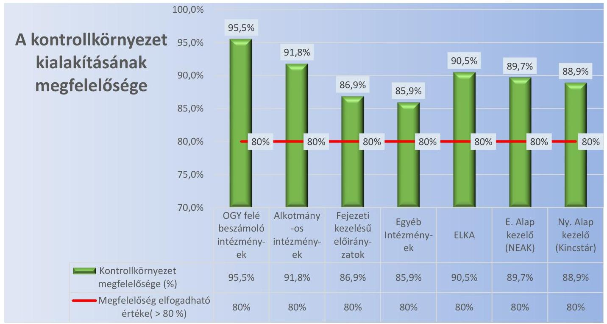

Forrás: ÁSZ kimutatás

---

A belső kontrollrendszer összevont - és ezen belül az egyes pillérek - megfelelőségének minősítését az M2. ábra tartalmazza.

M2. ábra

# Az OGY felé beszámoló intézmények és a TB Alapok kezelő szervei belső kontrollrendszere egészének, illetve az egyes pillérek megfelelőségének értékelése 

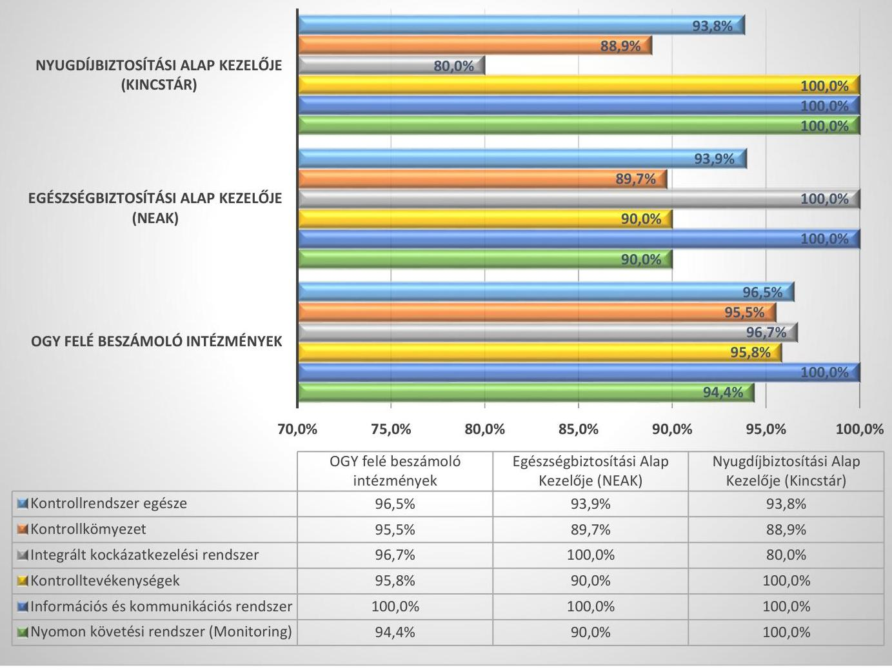

Forrás: ÁSZ kimutatás

---

# III. SZ. MELLÉKLET: AZ INTEGRITÁS KONTROLL RENDSZER ÉRTÉKELÉSE 

Az ÁSZ az integritás szemlélet kialakítását és működtetését a költségvetési intézmények és TB Alapok kezelő szervei esetében minősítette. Az
 intézmények esetében intézménytípusonként összevontan, a TB Alapok esetében az Egészségbiztosítási Alap és a Nyugdíjbiztosítási Alap kezelő szervei vonatkozásában értékelte az integritás kontrollokat, azok egyes területei (a szervezeti kultúra, a kockázatkezelési rendszer működtetése, a belső szabályozottság és a belső ellenőrzési rendszerek) szerint.
Az integritás szemlélet kialakítása megfelelőségének minősítése kiváló lett, amennyiben az elért pontszám és a maximálisan elérhető pontszám aránya 80% és 100% közötti volt. Ha az arány 79% és 60% közötti volt, akkor megfelelő minősítést kapott, míg 60% alatt fejlesztendő minősítési kategóriába tartozott.
Az integritás szemlélet kialakítása, működtetése négy egyéb intézmény esetében (FMKK ${ }^{62}$, Kastély Otthon ${ }^{63}$, SZSZC, PMGYK) kapott „fejlesztendő" minősítést, mert hiányosságok voltak a kockázatkezelési rendszer működtetése, a belső ellenőrzés és a belső szabályozottság területén.
Az integritás szemlélet érvényesülésének összevont értékelését intézménytípusonként az M3. ábra mutatja be.

M3. ábra

## Integritás kontrollok összevont értékelése intézménytípusonként

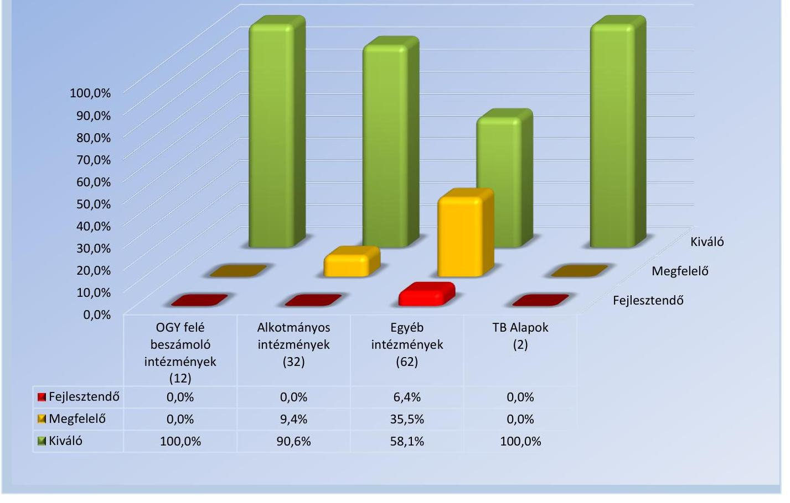

Forrás: ÁSZ kimutatás

---

# - IV. SZ. MELLÉKLET: A 2018. ÉVI IDŐKÖZI ÉS NEMZETISÉGI VÁLASZTÁSOKRA, VALAMINT A 2018. ÉVI ORSZÁGGYŰLÉSI KÉPVISELŐVÁLASZTÁSRA FORDÍTOTT PÉNZESZKÖZÖK FELHASZNÁLÁSÁNAK ÉRTÉKELÉSE 

Az ÁSZ a 2018. évi zárszámadás keretében ellenőrizte a választásokra fordított pénzeszközök felhasználását, ennek során az I. Országgyűlés fejezet 24/2/1 „Időközi és nemzetiségi választások lebonyolítása", valamint az I. Országgyűlés fejezet 24/2/3 „2018. évi országgyűlési képviselőválasztás" fejezeti kezelésű előirányzatokat.
Az ellenőrzött fejezeti kezelésű előirányzatok felhasználása szabályszerű volt.
A 2018. évi országgyűlési képviselőválasztásra az összes elszámolt kiadás 7 494,7 millió Ft volt. Ennek 47,4%-át a 2018. évi fejezeti kezelésű előirányzat terhére, 49,2%-át az NVI intézményi előirányzat terhére, és 3,4%-át a Külgazdasági és Külügyminisztérium részére előirányzat-átcsoportosítással a külképviseleti kiadások terhére biztosították. A kiadási előirányzatok terhére elszámolt teljesítések megoszlásának adatait főbb kiadási típusok szerint az M1. táblázat tartalmazza.
M1. táblázat

## A 2018. ÉVI ORSZÁGGYŰLÉSI KÉPVISELŐVÁLASZTÁS KIADÁSI ELŐIRÁNYZATAI TERHÉRE ELSZÁMOLT TELJESÍTÉSEK (M FT)

| Megnevezés | Dologi kiadások | Személyi juttatások | Munkaadói járulékok | Informatikai kiadások | Összesen |
| :--: | :--: | :--: | :--: | :--: | :--: |
| 2018. évi országgyűlési képviselőválasztás összes kiadása | 2480,8 | 2941,0 | 516,7 | 1556,2 | 7494,7 |
| - ebből: a 2018. évi országgyűlési képviselőválasztás fejezeti kezelésű előirányzat terhére | 337,8 | 2742,6 | 474,1 | 0,0 | 3554,5 |
| - ebből: NVI intézményi előirányzat terhére | 1948,9 | 149,2 | 34,2 | 1556,2 | 3688,5 |
| - ebből: Külgazdasági és Külügyminisztérium előirányzat terhére | 194,1 | 49,2 | 8,4 | 0,0 | 251,7 |

A 2018. évi időközi és nemzetiségi választásokra elszámolt kiadás 523,0 millió Ft volt. Az összes kiadás 80,4%-át a 2018. évi fejezeti kezelésű előirányzat terhére, 19,6%-át az NVI intézményi előirányzat terhére biztosították. Mivel időközi országgyűlési választás az ellenőrzött időszakban nem volt, annak előirányzata az időközi önkormányzati választások kiadásainak fedezetére működési célú pénzeszközként átadásra került. A kiadási előirányzatok terhére elszámolt teljesítések megoszlásának adatait főbb kiadási típusok szerint az M2. táblázat mutatja be.
M2. táblázat

## A 2018. ÉVI IDŐKÖZI ÉS NEMZETISÉGI VÁLASZTÁSOK KIADÁSI ELŐIRÁNYZATAI TERHÉRE ELSZÁMOLT TELJESÍTÉSEK (M Ft)

| Megnevezés | Eredeti előirányzat | Módosított előirányzat | Teljesítés |
| :--: | :--: | :--: | :--: |
| 2018. évi időközi és nemzetiségi választások összes kiadása | 458,0 | 575,9 | 523,0 |
| Fejezeti kezelésű előirányzat | 458,0 | 448,8 | 420,4 |
| - ebből: időközi országgyűlési választás | 15,6 | 15,6 | 15,6 |
| - ebből: időközi önkormányzati választás | 392,7 | 419,7 | 398,7 |
| - ebből: nemzetiségi választás | 49,7 | 13,5 | 6,1 |
| Intézményi előirányzat | 0,0 | 127,1 | 102,6 |
| - ebből: időközi országgyűlési választás | 0,0 | 0,0 | 0,0 |
| - ebből: időközi önkormányzati választás | 0,0 | 126,7 | 102,2 |
| - ebből: nemzetiségi választás | 0,0 | 0,4 | 0,4 |

A választásokkal kapcsolatos kifizetések szabályszerűek voltak, megfeleltek az Áht. és az Ávr. előírásainak. Az előirányzatok szabályszerű felhasználása érdekében az NVI kialakította az Ávr. előírásai szerinti belső szabályzatokat, valamint a Ve. és a Központi névjegyzék, valamint egyéb választási nyilvántartások vezetéséről szóló 17/2013.

---

(VII. 17.) KIM rendelet előírásai szerinti informatikai rendszert. Az NVI a jogszabályi előírásokkal összhangban elkészítette a választások pénzügyi feladat- és költségterveit. A választások céljára biztosított pénzeszközöket a jogszabályok rendelkezéseinek eleget téve választásonként elkülönítetten kezelték. A kötelezettségvállalásra és teljesítésigazolásra vonatkozó belső kontrollok érvényesültek. Az NVI a jogszabályokban előírtakkal összhangban a választásokban résztvevő szervezetek (HVI ${ }^{64}$, OEVI ${ }^{65}$, TVI ${ }^{66}$ és külképviseletek) részére határidőben biztosította a feladatok ellátásához szükséges forrásokat. A többlettámogatások szabályszerűen, a normatívák és előírások figyelembevételével kerültek megállapításra és folyósításra.
A 2018. évi országgyűlési képviselőválasztás előirányzatainak nyilvántartása, elszámolása és ellenőrzése szabályszerű volt. Az NVI ellenőrizte a pénzeszközök célhoz kötött felhasználását és az elszámolások megalapozottságát, határidőben megküldte az elszámolás elfogadásáról szóló okiratokat a lebonyolításban résztvevő választási irodák, valamint a Külgazdasági és Külügyminisztérium részére. A választás összesítő elszámolása az NVI elnöki utasításban előírt formában és tartalommal készült el. A választás előkészítésében és lebonyolításában résztvevők a 2/2018. (I. 3.) IM rendelet ${ }^{67}$ 7. § (1) bekezdésében előírt, a szavazás napját követő huszonöt napon belüli pénzügyi elszámolásra vonatkozó határidőt nem minden esetben tartották be, esetenként jelentős, 20-25 napos késedelemmel készítették el az elszámolást. Az NVI a 2/2018. (I. 3.) IM rendelet 7. § (4) bekezdésében, az összesítő elszámolásra vonatkozó húsz napos határidőt nem tartotta be, azt hatvannégy napos késedelemmel készítette el. Az elszámolási határidők betartásával kapcsolatosan feltárt hibák a minősítést nem befolyásolták.

Az összesítő elszámolás kiemelt előirányzatonként és választási szerv szintenként tartalmazta a kiadásokat, amelyeket az M4. ábra szemléltet.
M4. ábra
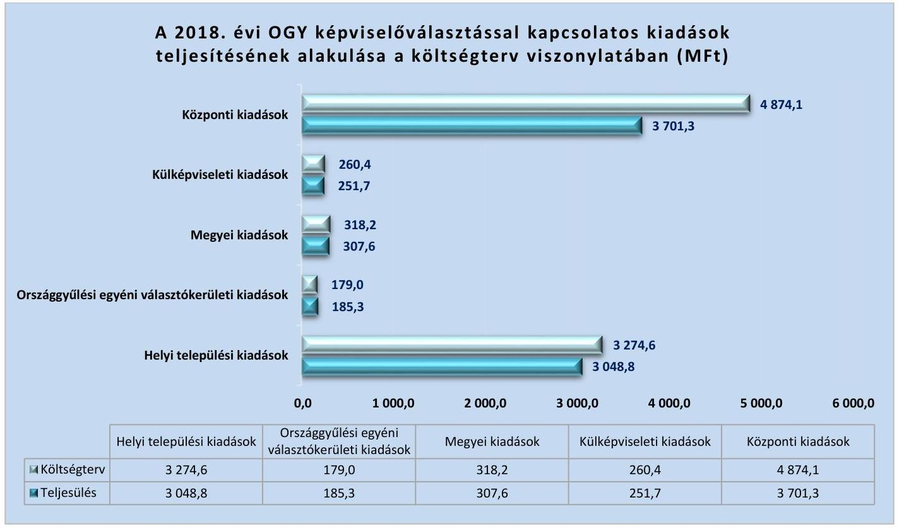

Forrás: NVI által készített összesítő elszámolás a 2018. évi országgyűlési képviselőválasztásról (ÁSZ szerkesztés)
A 2018. évi időközi önkormányzati és nemzetiségi képviselőválasztások előirányzatainak nyilvántartása, elszámolása és ellenőrzése szabályszerű volt. A 2018. évi időközi önkormányzati és nemzetiségi képviselőválasztásokról az NVI a helyi önkormányzati képviselők és polgármesterek időközi választása és a nemzetiségi önkormányzati képviselők időközi választása költségeinek normatíváiról, tételeiről, elszámolási és belső ellenőrzési rendjéről szóló 23/2018. (VIII. 30.) IM rendelet 7. § (4) bekezdésében foglaltak szerint az összesítő elszámolást határidőben, az éves költségvetési beszámolója készítésével egyidejűleg elkészítette. Az időközi választásokban résztvevő szervezetek esetenként

---

a 7/2014. (XI. 6.) IM rendelet ${ }^{68}$ 7. § (1) bekezdésében előírt, a szavazás napját követő tizenöt napos elszámolási határidőn túl, 3-15 napos késedelemmel küldték meg az elszámolást az NVI elnöke részére. Az NVI ellenőrizte a pénzeszközök célhoz kötött felhasználását és az elszámolások megalapozottságát, azonban egyes esetekben a 7/2014. (XI. 6.) IM rendelet 8. § (2) bekezdésében előírt - az elszámolás ellenőrzésére vonatkozó - 25 napos határidőt nem tartotta be, az ellenőrzéseket 5-6 napos késedelemmel végezte el. Az elszámolási és ellenőrzési határidők betartásával kapcsolatosan feltárt hibák a minősítést nem befolyásolták.

---

# V. SZ. MELLÉKLET: ELLENŐRZÖTT FEJEZETEK ÉS SZERVEZETEK 

## Országgyűlés felé beszámolásra kötelezett intézmények

| Egyenlő Bánásmód Hatóság | Gazdasági Versenyhivatal | Közbeszerzési Hatóság |
| :--: | :--: | :--: |
| Központi Statisztikai Hivatal | Magyar Energetikai és Közmű-   szabályozási Hivatal | Magyar Művészeti Akadémia |
| Magyar Tudományos Akadémia | Nemzeti Adatvédelmi és   Információszabadság Hatóság | Nemzeti Élelmiszerlánc-biztonsági Hivatal |
| Nemzeti Emlékezet Bizottságának Hivatala | Nemzeti Kutatási, Fejlesztési és   Innovációs Hivatal | Nemzeti Választási Iroda |
| Alkotmányos fejezetek intézményei |  |  |
| Alapvető Jogok Biztosának Hivatala | Alkotmánybíróság | Balassagyarmati Törvényszék |
| Budapest Környéki Törvényszék | Debreceni Ítélőtábla | Debreceni Törvényszék |
| Egri Törvényszék | Fővárosi Ítélőtábla | Fővárosi Törvényszék |
| Győri Ítélőtábla | Győri Törvényszék | Gyulai Törvényszék |
| Kaposvári Törvényszék | Kecskeméti Törvényszék | Köztársasági Elnöki Hivatal |
| Kúria | Legfőbb Ügyészség | Miskolci Törvényszék |
| Nyíregyházi Törvényszék | Országgyűlés Hivatala | Országos Bírósági Hivatal |
| Pécsi Ítélőtábla | Pécsi Törvényszék | Szegedi Ítélőtábla |
| Szegedi Törvényszék | Székesfehérvári Törvényszék | Szekszárdi Törvényszék |
| Szolnoki Törvényszék | Szombathelyi Törvényszék | Tatabányai Törvényszék |
| Veszprémi Törvényszék | Zalaegerszegi Törvényszék |  |
| Fejezeti kezelésű előirányzatok |  |  |
| Agrárminisztérium | Belügyminisztérium | Emberi Erőforrások Minisztériuma |
| Gazdasági Versenyhivatal | Honvédelmi Minisztérium | Igazságügyi Minisztérium |
| Innovációs és Technológiai Minisztérium | Központi Statisztikai Hivatal | Köztársasági Elnöki Hivatal |
| Külgazdasági és Külügyminisztérium | Legfőbb Ügyészség | Magyar Művészeti Akadémia |
| Magyar Tudományos Akadémia | Miniszterelnökség | Miniszterelnöki Kabinetiroda |
| Miniszterelnöki Kormányiroda | Nemzeti Kutatási, Fejlesztési és Innova-   ciós Hivatal | Pénzügyminisztérium |
| Országgyűlés Hivatala | Országos Bírósági Hivatal |  |

---

| Központi kezelésű és az állami vagyonnal kapcsolatos bevételi és kiadási előirányzatok |  |  |
| :--: | :--: | :--: |
| Agrárminisztérium | Agrár-Vállalkozási Hitelgarancia Alapítvány | Államadósság Kezelő Központ Zrt. |
| Állami Egészségügyi Ellátó Központ | Belügyminisztérium | Emberi Erőforrások Minisztériuma |
| Garantiqa Hitelgarancia Zrt. | Innovációs és Technológiai Minisztérium | KAVOSZ Vállalkozásfejlesztési Zrt. |
| Kormányhivatalok | Magyar Államkincstár | Magyar Bányászati és Földtani Szolgálat |
| Magyar Exporthitel Biztosító Zrt. | Magyar Export-Import Bank Zrt. | Magyar Fejlesztési Bank Zrt. |
| Magyar Nemzeti Vagyonkezelő Zrt. | Miniszterelnöki Kormányiroda | Miniszterelnökség |
| Nemzeti Adó- és Vámhivatal | Nemzeti Egészségbiztosítási Alapkezelő | Nemzeti Eszközkezelő Zrt. |
| Nemzeti Földügyi Központ (2018-ban: Nemzeti Földalapkezelő Szervezet) | Nemzeti Útdijfizetési Szolgáltató Zrt. | Pénzügyminisztérium |
| Elkülönített állami pénzalapok és kezelő szerveik |  |  |
| Bethlen Gábor Alap -   Bethlen Gábor Alapkezelő Zrt. | Központi Nukleáris Pénzügyi Alap Innovációs és Technológiai Minisztérium | Nemzeti Foglalkoztatási Alap Pénzügyminisztérium |
| Nemzeti Kulturális Alap -   Emberi Erőforrás Támogatáskezelő | Nemzeti Kutatási, Fejlesztési és Innovációs Alap - Nemzeti Kutatási, Fejlesztési és Innovációs Hivatal |  |
| Társadalombiztosítási alapok |  |  |
| Magyar Államkincstár | Nemzeti Egészségbiztosítási Alapkezelő |  |
| A központi költségvetés egyéb intézményei |  |  |
| Alkotmányvédelmi Hivatal | Alsó-Duna-völgyi Vízügyi Igazgatóság | Bélapátfalvai Idősek, Fogyatékosok Otthona |
| Bevándorlási és Menekültügyi Hivatal | Bevándorlási és Menekültügyi Hivatal Befogadó Állomás és Közösségi Szállás | Budapesti Vendéglátóipari és Humán Szakképzési Centrum (2019. augusztus 1-jével beolvadt a Semmelweis Egyetembe) |
| Ceglédi Szakképzési Centrum | Ceglédi Tankerületi Központ | Csongrád Megyei Gesztenyeliget Otthon |
| Csongrád Megyei Napsugár Otthon | Csongrád Megyei Területi Gyermekvédelmi Szakszolgálat | Emberi Erőforrások Minisztériuma |
| Emberi Erőforrás Támogatáskezelő | Fejér Megyei Múvelődési Központ | Fiatalkorúak Büntetés-végrehajtási Intézete (Tököl) |
| Győri Szakképzési Centrum (2018-ban:

 Győri Szolgáltatási Szakképzési Centrum) | Győr-Moson-Sopron Megyei Dr. Piróth Endre Szociális Központ | Hódmezővásárhelyi Tankerületi Központ |
| Innovációs és Technológiai Minisztérium | „Kastély Otthon" Jász-Nagykun-Szolnok Megyei Pszichiátriai és Szenvedélybetegek Otthona és Rehabilitációs Intézménye | Kelet-Pesti Tankerületi Központ |
| Komárom-Esztergom Megyei Gyermekvédelmi Központ, Területi Gyermekvédelmi Szakszolgálat és Általános Iskola | Komárom-Esztergom Megyei Rendőr-főkapitányság | Kormányzati Informatikai Fejlesztési Ügynökség |

---

| Körös-Maros Nemzeti Park Igazgatóság | Lippai János Mezőgazdasági Szakgimnázium és Szakközépiskola | Lipthay Béla Mezőgazdasági és   Élelmiszeripari Szakgimnázium,   Szakközépiskola és Kollégium |
| :--: | :--: | :--: |
| Lumniczer Sándor Kórház-   Rendelőintézet | Magyar Kereskedelmi és Vendéglátóipari   Múzeum | Margit Kórház Pásztó |
| Mátészalkai Szakképzési Centrum | Mezőkövesdi Tankerületi Központ | Nagykőrösi Rehabilitációs Szakkórház   és Rendelőintézet |
| Nemzeti Akkreditáló Hatóság | Nógrád Megyei Gyermekvédelmi   Központ és Területi Gyermekvédelmi   Szakszolgálat | Nógrád Megyei Kormányhivatal |
| Nemzeti Sportközpontok | Nemzeti Szakképzési és Felnőttképzési   Hivatal | Országos Széchényi Könyvtár |
| Országos Vízügyi Főigazgatóság | Pannon Egyetem | Pénzügyminisztérium |
| Pest Megyei Gyermekvédelmi Központ és   Területi Gyermekvédelmi   Szakszolgálat | Pest Megyei Rendőr-főkapitányság | Pesti Magyar Színház |
| Pest Megyei Viktor Egyesített Szociális Intézmény | Péterfy Kórház-Rendelőintézet és   Manninger Jenő Országos Traumatológiai   Intézet | Sátoraljaújhelyi Erzsébet Kórház |
| Serényi Béla Mezőgazdasági Szakgimnázium és Szakközépiskola | Siófoki Szakképzési Centrum | Somogy Megyei Büntetés-végrehajtási Intézet |
| Somogy Megyei Kaposi Mór Oktató Kórház | Szegedi Rendészeti Szakgimnázium | Szent Borbála Kórház |
| Szolnoki Szakképzési Centrum   (2018-ban: Szolnoki Szolgáltatási Szakképzési Centrum) | Tiszalöki Országos Büntetés-   végrehajtási Intézet | Uzsoki Utcai Kórház |
| Váci Szakképzési Centrum | Veszprém Megyei Büntetés-végrehajtási   Intézet | Veszprém Megyei Fogyatékos Személyek,   Pszichiátriai és Szenvedélybetegek Integrált Intézménye |
| Veszprém Megyei Gyermekvédelmi Központ, Általános Iskola, Szakiskola, Készségfejlesztő Iskola és Területi Gyermekvédelmi Szakszolgálat   (2018-ban: Veszprém Megyei Gyermekvédelmi Központ, Általános Iskola, Speciális   Szakiskola, Készségfejlesztő Speciális   Szakiskola és Területi Gyermekvédelmi   Szakszolgálat) | Veszprém Megyei Rendőr-főkapitányság |  |

---

# FÜGGELÉKEK 

- I. SZ. FÜGGELÉK: AZ ELLENŐRZÖTT SZERVEZETEK ÁSZ ÁLTAL EL NEM FOGADOTT ÉSZREVÉTELEI

A jelentéstervezetet a Számvevőszék 15 napos észrevételezésre megküldte az ellenőrzött szervezetek vezetőinek az ÁSZ tv. 29. § (1) bekezdése előírásának megfelelően.

Az ÁSZ tv. 29. § (3) bekezdésével összhangban az ÁSZ a Függelékben feltünteti az ellenőrzés megállapításaival kapcsolatban tett, figyelembe nem vett észrevételeket, és megindokolja, hogy azokat miért nem fogadta el.

[^0]
[^0]:    * 29. § (1) Az Állami Számvevőszék az ellenőrzési megállapításait megküldi az ellenőrzött szervezet vezetőjének vagy az általa megbízott személynek, és annak, akinek személyes felelősségét állapította meg.
    (2) Az ellenőrzött szervezet vezetője és a felelősként megjelölt személy az ellenőrzés megállapításaira tizenöt napon belül írásban észrevételt tehet.
    (3) Az Állami Számvevőszék az észrevételre a beérkezésétől számított harminc napon belül írásban válaszol. A figyelembe nem vett észrevételeket köteles a jelentésben feltüntetni, és megindokolni, hogy azokat miért nem fogadta el.

---

# BETHLEN GÁBOR ALAPKEZELŐ KÖZHASZNÚ NONPROFIT ZRT. 

Észrevétel (a kötelezettségvállalás, teljesítésigazolás és számviteli bizonylatok hiányával kapcsolatban):
A vezérigazgató levelében az ÁSZ elnöke által megküldött figyelemfelhívó levélben foglalt, a Bethlen Gábor Alapnál (BGA) az ellenőrzés során feltárt jogszabálysértő gyakorlatok vonatkozásában fogalmazta meg észrevételeit. A figyelemfelhívó levélben megfogalmazott jogszabálysértő gyakorlatok az ELKA kiadási előirányzatai terhére teljesített mintavétel alapján történő kifizetések kiértékelésének az eredménye. Az észrevétel szerint az adatszolgáltatás során valamennyi kifizetéshez kapcsolódóan a kötelezettségvállalást és a kifizetést igazoló dokumentumot, valamint a gazdálkodás belső szabályozási rendjét és a kapcsolódó aláírás-mintákat megküldték az ÁSZ részére.

## Az észrevétel el nem fogadásának indoklása:

Az ÁSZ az ellenőrzési megállapításait az adatszolgáltatás során a részére törvényi határidőben rendelkezésre bocsátott, teljességi és hitelességi nyilatkozattal alátámasztott dokumentumokra alapozva fogalmazza meg. Az ÁSZ a 2018. évi zárszámadási törvényjavaslatban szereplő pénzforgalmi kiadások teljesítésének megfelelőségét statisztikai mintavételi módszer alapján értékelte, és „Az ellenőrzés módszerei" című fejezetben részletezett szempontok szerint elvégzett kiértékelés eredményeként tette meg a jelentéstervezetben rögzített megállapításait, vonta le a következtetéseket. Az ellenőrzés rendelkezésére álló dokumentumok ismételt felülvizsgálata alapján megállapítható, hogy a kifizetésekhez kapcsolódó gazdasági események szabályszerű elszámolását a Számv. tv. 165. § (1) és (2) bekezdésében előírtak ellenére számviteli bizonylattal (kötelezettségvállalás dokumentuma, kifizetést igazoló bizonylat) nem támasztották alá, azok a 2019. július 25-én aláírt teljességi és hitelességi nyilatkozatban sem szerepeltek. Megállapítható továbbá az ellenőrzési dokumentumok alapján, hogy a teljesítésigazoló az Ávr. 57. § (4) bekezdése előírása ellenére nem minden esetben rendelkezett írásbeli kijelöléssel.

## Észrevétel (a 3.5. számú megállapítás 4. bekezdésével kapcsolatban):

Az észrevétel szerint a 2018. évi maradvány összegének megállapítása során a kötelezettségvállalással terhelt maradvány összegében nem került figyelembe vételre 321868 Ft, amely árfolyamveszteséghez, bankköltséghez kapcsolódott. A vezérigazgató észrevételben jelzett álláspontja szerint ezt nem kell kötelezettségvállalással terhelt maradványként figyelembe venni.

## Az észrevétel el nem fogadásának indoklása:

Az ellenőrzési dokumentumok alapján a BGA 2018. évi éves költségvetési beszámolójának 07/A. űrlapján található maradvány-kimutatásában szereplő, kötelezettségvállalással terhelt maradvány 3271313590 forint összegét az államháztartás számviteléről szóló az 4/2013. (I. 11.) Korm. rendelet 39. § (3) bekezdésében előírt, a 14. számú mellékletében meghatározott adattartalmú analitikus/részletező nyilvántartás nem támasztotta alá. A 2019. július 9-én kelt teljességi és hitelességi nyilatkozat 25. pontjában megnevezett, az ellenőrzési dokumentumok között megtalálható maradvány analitika alapján a kötelezettségvállalással terhelt maradvány összege a 2018. évben 1836557646 forint volt, amely 1434755944 forinttal kevesebb a beszámolóban kimutatott összegnél. A BGA 2018. évi költségvetési maradványa felhasználásának engedélyezését tartalmazó, PM-nek megküldött - a teljességi és hitelességi nyilatkozat 5. pontjában megnevezett és az ellenőrzési dokumentumok között megtalálható elszámolás alapján a BGA az „LXV. Bethlen Gábor Alap fejezet 9. Határtalanul! program támogatása" címen további 1380896064 forint kötelezettségvállalással terhelt maradvánnyal is rendelkezett. A BGA nem bocsátott olyan dokumentumot az ÁSZ rendelkezésére, amely a hivatkozott 1380896064 forint, valamint a beszámolóban szereplő összegből fennmaradó 53859880 forint kötelezettségvállalással terhelt maradvánnyt a jogszabály szerinti analitikus/részletező nyilvántartás alátámasztotta volna.

Az éves költségvetési beszámolóban kimutatott, árfolyamveszteséghez, bankköltséghez kapcsolódó 321686 forint figyelembe nem vett összeget a BGA a PM felé történő elszámolásában - az észrevételben foglaltakkal egyezően már nem szerepeltette. Az észrevételben foglaltak megerősítik azt a számvevőszéki megállapítást, hogy a 2018. évi kötelezettségvállalással terhelt maradvány kimutatása a BGA esetében nem volt szabályszerű.

---

# GYŐRI ÍTÉLŐTÁBLA 

Észrevétel (a 3.3. sz. megállapítás 4. bekezdésének 2. mondatával kapcsolatban):
Az elnök észrevételében jelezte, hogy a saját hatáskörben végrehajtott előirányzat-módosításokról az irányító szerv felé megküldött tájékoztató leveleket csak 2018. II. félévétől archiválták, ezért azok az adatszolgáltatás során nem álltak teljes körűen rendelkezésre.

## Az észrevétel el nem fogadásának indoklása:

Az ÁSZ az ellenőrzési megállapításait az adatszolgáltatás során a részére törvényi határidőben rendelkezésre bocsátott, teljességi és hitelességi nyilatkozattal ellátott dokumentumokra alapozva fogalmazza meg. Az elnök az észrevételében elismerte a saját hatáskörben végrehajtott előirányzat-módosítások irányító szerv felé történő megküldését alátámasztó dokumentumok hiányosságát, ezért a jelentéstervezet módosítása nem indokolt.

## MAGYAR ÁLLAMKINCSTÁR

## Észrevétel (a 2.1. sz. megállapítás 5. bekezdésével kapcsolatban):

Az elnök észrevételében jelezte, hogy a családok támogatásáról szóló 1998. évi LXXXIV. törvény (Cst. tv.) - 2005. augusztus 1-je előtt hatályos - 36. § (1) bekezdése értelmében a megállapító szerveknek az ellátásra vonatkozó igények teljesítéséről nem kellett alakszerű határozatot hozni. Az észrevétel szerint a 2013. március 31-jét követően megállapított családtámogatási ellátások esetében a döntéseket ügyviteli szoftverrel állítják elő és tárolják. Elnök úr jelezte továbbá, hogy a családtámogatásokat megállapító határozatok hiányára vonatkozóan az Emberi Erőforrások Minisztériuma szakmai irányító jogkörében eljárva eljárásrendet adott ki, amelyben előírta a 2013. április 1-je előtt megállapított és jelenleg folyósítás alatt lévő ügyek felülvizsgálatát és a hiányzó dokumentumok pótlását, amelynek módosított határideje 2020. május 31-e.

## Az észrevétel el nem fogadásának indoklása:

A Családi támogatások jogcímcsoport terhére teljesített kiadások vonatkozásában a folyósított ellátások megállapítását bizonylatokkal nem támasztották alá. Az ellátásra vonatkozó igények teljesítéséről szóló döntések időpontja, továbbá a csoportos utalványozásra tekintettel az egyes kifizetések összege nem minden esetben állapítható meg. Az elnök észrevételében a jelentéstervezet megállapítását megerősítette azzal, hogy a 2005. augusztus 1-jét követően, de 2013. március 31-ét megelőzően megállapított családtámogatási eljárások tekintetében a folyósítás alatt álló ügyek felülvizsgálata és a hiányzó dokumentumok pótlása jelenleg folyamatban van. Az ÁSZ részére átadott, a kifizetéseket alátámasztó dokumentumok hiánya miatt nem ítélhető meg, hogy az ellenőrzött tételek tekintetében melyek esetében történt az ellátás teljesítéséről szóló döntés 2005. augusztus 1-jét megelőzően, amelyekre vonatkozóan a Cst. tv. hivatkozott rendelkezése értelmében a határozathozatal nem volt kötelező érvényű.
A Családi támogatások, illetve Jövedelempótló és jövedelemkiegészítő szociális támogatások jogcímcsoportjai terhére teljesített kiadások vonatkozásában továbbá két kormányhivatal nem teljesített adatszolgáltatást, a folyósított ellátások megállapítását és kifizetését dokumentumokkal (kérelem, hiánypótlás, határozat, pénzügyi teljesítések és elszámolások bizonylatai, utalvány, utalás engedélyező lista, a teljesítés nyilvántartási számlái, kincstárnak benyújtott adatszolgáltatások, elszámolások, igénylőlapok) nem támasztotta alá.
Észrevétel (a 3.1. sz. megállapítás 2. bekezdéséhez, a Jövedelempótló és jövedelemkiegészítő szociális támogatások jogcímcsoportjai terhére történt kiutalások szabályszerűségével kapcsolatban):
Az elnök észrevételében jelezte, hogy a Nyugdíjfolyósító Igazgatóság a kifizetések során minden esetben az Ávr. előírt kontrollokat alkalmazza, valamint hogy az utalványozás és az érvényesítés csoportosan történik, így az nem maradhat el esetenként. Az észrevétel szerint a Korhatár alatti ellátások és a Jövedelempótló és jövedelemkiegészítő szociális támogatások jogcímcsoportjai terhére történt kiutalások jogszabályon alapuló fizetési kötelezettségek (pl. szépkorúak jubileumi juttatása), ezért a Kincstár az Ávr. 57. § (3) bekezdésében előírt teljesítésigazolás elvégzése alól mentesül.

---

# Az észrevétel el nem fogadásának indoklása: 

Az ellenőrzési dokumentumok alapján a Jövedelempótló és jövedelemkiegészítő szociális támogatások jogcímcsoport 1.3.8. Járási szociális feladatok ellátása jogcím terhére teljesített kiadások esetében a kifizetéseket megelőzően szükséges kontrollokat - két kormányhivatal esetében - nem végezték el. Az említett két kormányhivatal az ÁSZ részére nem adott át olyan dokumentumokat, ellenőrzési bizonyítékokat (kérelem, határozat, pénzügyi teljesítések és elszámolások bizonylatai, utalvány, utalás engedélyező lista, elszámolások, igénylőlapok), amelyek kétséget kizáróan bizonyították volna a kifizetések előtti kontrollok működését.

## MARGIT KÓRHÁZ PÁSZTÓ

Észrevétel (a II. sz. melléklet 3. bekezdésének 1. mondatával kapcsolatban):
Észrevételében a főigazgató tájékoztatta az ÁSZ elnökét a Margit Kórház Pásztónál az Állami Egészségügyi Ellátó Központ Egészségügyi Intézményi Ellenőrzési Főosztály által lefolytatott ellenőrzésről. Levelében foglaltak szerint a feltárt hiányosságok alapján intézkedési tervet készítettek a szabályzatok tartalmi hiányosságainak megszüntetése és a jogszabályi előírások szerinti működés megteremtése érdekében.

## Az észrevétel el nem fogadásának indoklása:

Észrevételében a főigazgató a jelentéstervezetben foglalt megállapítást nem cáfolta, a szabályszerű működés megteremtése érdekében
 megtett intézkedéseiről adott tájékoztatásában a kontrollkörnyezet kialakítására vonatkozó megállapítást megerősítette.

## Észrevétel (a 3.3. sz. megállapítás 7. bekezdésével kapcsolatban):

A főigazgató észrevételében a jelentéstervezetben foglalt megállapítást nem cáfolta. Levelében foglaltak szerint a saját hatáskörben végrehajtott előirányzat-módosításokról szóló tájékoztatásokat az irányító szerv felé az ellenőrzött időszakot követően pótolták.

## Az észrevétel el nem fogadásának indoklása:

A szabályszerű működés megteremtése érdekében megtett intézkedésekről adott tájékoztatás a kontrollkörnyezet kialakítására vonatkozó, jelentéstervezetben szereplő megállapítást megerősítette.

## NEMZETI KUTATÁSI FEJLESZTÉSI ÉS INNOVÁCIÓS HIVATAL

Észrevétel (a 3.5. sz. megállapítás 4. bekezdés 2-3. mondatával kapcsolatban):
Az elnök észrevételében jelezte, hogy a Nemzeti Kutatási, Fejlesztési és Innovációs Alap (NKFIA) a 2018. évi kötelezettségvállalással terhelt maradvány részletező nyilvántartásával rendelkezett a vizsgált időszakban, azonban a nyilvántartás nem került feltöltésre az ÁSZ rendszerébe.

## Az észrevétel el nem fogadásának indoklása:

A teljességi és hitelességi nyilatkozat alapján az adatszolgáltatás során az NKFIA-ra vonatkozóan nem bocsátottak az ellenőrzés rendelkezésére olyan dokumentumot, amely a kötelezettségvállalással terhelt maradvány részletező nyilvántartással történő alátámasztását igazolta volna. Az észrevételben foglaltak mindezeket megerősítik.

## NEMZETI VÁLASZTÁSI IRODA

Észrevétel (a IV. sz. melléklet 6. bekezdésének 5. mondatával kapcsolatban):
Az elnök észrevételében jelezte, hogy a Nemzeti Választási Iroda (NVI) a 2/2018. (I. 3.) IM rendelet 7. § (4) bekezdése szerinti határidőben eleget tett adatszolgáltatási kötelezettségének. Az észrevétel szerint az utolsóként elfogadott Külügazdasági és Külügyminisztérium (KKM) elszámolás dátuma 2018. június 19-e, így az összesített elszámolás elkészítési határideje 2018. július 9-e volt. Az NVI az összesített elszámolást a 2/2018. (I. 3.) IM rendeletben meghatározott határidő előtt, 2018. július 6-án készítette el, így az észrevétel szerint jogszabálysértő gyakorlat nem áll fenn.

---

# Az észrevétel el nem fogadásának indoklása: 

Az ellenőrzési dokumentumok között megtalálható, az NVI - az észrevételben is hivatkozott - 2018. július 6-án kelt összesített elszámolása hitelesítést, aláírást nem tartalmazott, így ellenőrzési bizonyítékként nem értékelhető. Megbízhatónak tekinti az ÁSZ az ellenőrzés szempontjából azon bizonyítékot, amely kétséget kizáróan bizonyítja a benne foglaltakat. A 2018. évi országgyűlési képviselőválasztás - 2018. július 6-án kelt összesített elszámoláshoz képest módosított adattartalmú - számszaki beszámolóját az NVI elnöke 2018. szeptember 11-én hagyta jóvá. Az NVI a szeptemberben jóváhagyott beszámolót még két alkalommal, 2018. október 30-án és 2018. december 17-én módosította. Az észrevételben is hivatkozott, utolsóként elfogadott KKM elszámolás 2018. június 19-ei dátumára tekintettel az összesített elszámolás - 2/2018. (I. 3.) IM rendelet 7. § (4) bekezdése szerinti - elkészítési határideje 2018. július 9-e volt, amelyhez képest az NVI első hitelesített beszámolót határidőn túl (64 nappal később), 2018. szeptember 11-én készítette el.

## PÉCSI TÖRVÉNYSZÉK

Észrevétel (a 3.3. sz. megállapítás 4. bekezdésének 2. mondatával kapcsolatban):
Az elnök észrevételében jelezte, hogy az előirányzat-átcsoportosításokhoz kapcsolódó mintatételek esetében az irányító szerv részére történő megküldést igazoló dokumentumot az adatbekérés során nem csatolták.

## Az észrevétel el nem fogadásának indoklása:

A teljességi és hitelességi nyilatkozat alapján az adatszolgáltatás során a Pécsi Törvényszék nem bocsátott az ellenőrzés rendelkezésére olyan dokumentumot, amely a saját hatáskörű előirányzat-módosítások esetében az irányító szerv tájékoztatását igazolta volna. Az észrevételben foglaltak mindezeket megerősítik.

## PÉNZÜGYMINISZTÉRIUM

## Észrevétel (a 2.1. sz. megállapítás 5. bekezdésével kapcsolatban):

Az észrevétel szerint a Családi támogatások, valamint a Jövedelempótló és jövedelemkiegészítő szociális támogatások jogcímcsoportok esetében az ellátások megállapítása a járási hivatalok feladata, amelyeknél a Kincstár - a családtámogatási ellátások folyósítását megalapozó dokumentumok teljes körűsége tekintetében - folytat ellenőrzéseket. A családtámogatásokat megállapító határozatok hiányára vonatkozóan az Emberi Erőforrások Minisztériuma szakmai irányító jogkörében eljárva eljárásrendet adott ki, amelyben előírta a folyósítás alatt lévő ügyek felülvizsgálatát és a hiányzó dokumentumok pótlását.

## Az észrevétel el nem fogadásának indoklása:

A rendelkezésre álló ellenőrzési dokumentumok felülvizsgálata alapján a Családi támogatások jogcímcsoport terhére teljesített kiadások vonatkozásában a folyósított ellátások megállapítását bizonylatokkal nem támasztották alá. Az ellátásra vonatkozó igények teljesítéséről szóló döntések időpontja, továbbá a csoportos utalványozásra tekintettel az egyes kifizetések összege nem minden esetben állapítható meg. Az észrevételében foglaltak megerősítik a családtámogatásokat megállapító határozatok hiányosságát azzal, hogy a 2013. április 1-jét megelőzően megállapított családtámogatási eljárások tekintetében a folyósítás alatt álló ügyek felülvizsgálata és a hiányzó dokumentumok pótlása jelenleg folyamatban van.

A Családi támogatások, illetve Jövedelempótló és jövedelemkiegészítő szociális támogatások jogcímcsoportjai terhére teljesített kiadások vonatkozásában továbbá az ÁSZ felhívására két kormányhivatal nem teljesített adatszolgáltatást, a folyósított ellátások megállapítását és kifizetését dokumentumokkal (kérelem, hiánypótlás, határozat, pénzügyi teljesítések és elszámolások bizonylatai, utalvány, utalás engedélyező lista, a teljesítés nyilvántartási számlái, kincstárnak benyújtott adatszolgáltatások, elszámolások, igénylőlapok) nem támasztotta alá.
Észrevétel (a 3.1. sz. megállapítás 2. bekezdéséhez, a Jövedelempótló és jövedelemkiegészítő szociális támogatások jogcímcsoportjai terhére történt kiutalások szabályszerűségével kapcsolatban):
Az észrevételben foglaltak szerint a Korhatár alatti ellátások, valamint a Jövedelempótló és jövedelemkiegészítő szociális támogatások jogcímcsoportjai terhére történt kiutalások során a Nyugdíjfolyósító Igazgatóság minden esetben alkalmazza az Ávr. szerinti kontrollokat. Az utalványozás és érvényesítés csoportosan történik, így azok nem maradhatnak el.

---

# Az észrevétel el nem fogadásának indoklása: 

Az ÁSZ részére átadott dokumentumok ismételt felülvizsgálatát követően megállapítható, hogy a Jövedelempótló és jövedelemkiegészítő szociális támogatások jogcímcsoport 1.3.8. Járási szociális feladatok ellátása jogcím terhére teljesített kiadások esetében a kifizetéseket megelőzően szükséges kontrollokat - két kormányhivatal esetében - nem végezték el. Az említett két kormányhivatal az ÁSZ részére nem adott át olyan dokumentumokat, ellenőrzési bizonyítékokat (kérelem, határozat, pénzügyi teljesítések és elszámolások bizonylatai, utalvány, utalás engedélyező lista, elszámolások, igénylőlapok), amely kétséget kizáróan bizonyították volna a kifizetések előtti kontrollok működését.

---

# KÖZBESZERZÉSI HATÓSÁG (I. ORSZÁGGYŰLÉS FEJEZET, 5. CÍM) 

A Közbeszerzési Hatóság belső kontrollrendszere szabályszerűen, az Áht., az Ávr. és a Bkr. előírásainak megfelelően került kiépítésre. Az integritás kontrollok kialakításával megteremtették a korrupciós kockázatok megfelelő kezelésének feltételeit.

Az intézmény bevételi és kiadási adatai megbízhatóak voltak, bevételeinek és kiadásainak elszámolása szabályszerű volt.

Az intézmény az előirányzat-módosításra, átcsoportosításra, és a költségvetési maradvány kimutatásra vonatkozóan az Áht., az Ávr. és az Áhsz. előírásait betartotta, a beszámoló részét képező mérleget, eredménykimutatást és kiegészítő mellékletet a jogszabályi előírásokkal összhangban állította össze. Az Áhsz. kötelező egyezőségekre vonatkozó előírásai érvényesültek.

## NEMZETI ADATVÉDELMI ÉS INFORMÁCIÓSZABADSÁG HATÓSÁG (I. ORSZÁGGYŰLÉS FEJEZET, 21. CÍM)

A Nemzeti Adatvédelmi és Információszabadság Hatóság belső kontrollrendszere szabályszerűen, az Áht., az Ávr. és a Bkr. előírásainak megfelelően került kiépítésre. Az integritás kontrollok kialakításával megteremtették a korrupciós kockázatok megfelelő kezelésének feltételeit.

Az intézmény bevételi és kiadási adatai megbízhatóak voltak, bevételeinek és kiadásainak elszámolása szabályszerű volt.

Az intézmény az előirányzat módosításra, átcsoportosításra, és a költségvetési maradvány kimutatásra vonatkozóan az Áht., az Ávr. és az Áhsz. előírásait betartotta, a beszámoló részét képező mérleget, eredménykimutatást és kiegészítő mellékletet a jogszabályi előírásokkal összhangban állította össze. Az Áhsz. kötelező egyezőségekre vonatkozó előírásai érvényesültek.

## EGYENLŐ BÁNÁSMÓD HATÓSÁG (I. ORSZÁGGYŰLÉS FEJEZET, 22. CÍM)

Az Egyenlő Bánásmód Hatóság belső kontrollrendszere szabályszerűen, az Áht., az Ávr. és a Bkr. előírásainak megfelelően került kiépítésre. Az integritás kontrollok kialakításával megteremtették a korrupciós kockázatok megfelelő kezelésének feltételeit.

Az intézmény bevételi és kiadási adatai megbízhatóak voltak, bevételeinek és kiadásainak elszámolása szabályszerű volt.

Az intézmény az előirányzat módosításra, átcsoportosításra, és a költségvetési maradvány kimutatásra vonatkozóan az Áht., az Ávr. és az Áhsz. előírásait betartotta, a beszámoló részét képező mérleget, eredménykimutatást és kiegészítő mellékletet a jogszabályi előírásokkal összhangban állította össze. Az Áhsz. kötelező egyezőségekre vonatkozó előírásai érvényesültek.

## MAGYAR ENERGETIKAI ÉS KÖZMŰ-SZABÁLYOZÁSI HIVATAL (I. ORSZÁGGYŰLÉS FEJEZET, 23. CÍM)

A Magyar Energetikai és Közmű-szabályozási Hivatal belső kontrollrendszere szabályszerűen, az Áht., az Ávr. és a Bkr. előírásainak megfelelően került kiépítésre. Az integritás kontrollok kialakításával megteremtették a korrupciós kockázatok megfelelő kezelésének feltételeit.

Az intézmény bevételi és kiadási adatai megbízhatóak voltak, bevételeinek és kiadásainak elszámolása szabályszerű volt.

Az intézmény az előirányzat módosításra, átcsoportosításra, és a költségvetési maradvány kimutatásra vonatkozóan az Áht., az Ávr. és az Áhsz. előírásait betartotta, a beszámoló részét képező mérleget, eredménykimutatást és kiegészítő mellékletet a jogszabályi előírásokkal összhangban állította össze. Az Áhsz. kötelező egyezőségekre vonatkozó előírásai érvényesültek.

---

# NEMZETI VÁLASZTÁSI IRODA (I. ORSZÁGGYŰLÉS FEJEZET, 24. CÍM) 

A Nemzeti Választási Iroda belső kontrollrendszere szabályszerűen, az Áht., az Ávr. és a Bkr. előírásainak megfelelően került kiépítésre. Az integritás kontrollok kialakításával megteremtették a korrupciós kockázatok megfelelő kezelésének feltételeit.

Az intézmény bevételi és kiadási adatai megbízhatóak voltak, bevételeinek és kiadásainak elszámolása szabályszerű volt.

Az intézmény az előirányzat módosításra, átcsoportosításra, és a költségvetési maradvány kimutatásra vonatkozóan az Áht., az Ávr. és az Áhsz. előírásait betartotta, a beszámoló részét képező mérleget, eredménykimutatást és kiegészítő mellékletet a jogszabályi előírásokkal összhangban állította össze. Az Áhsz. kötelező egyezőségekre vonatkozó előírásai érvényesültek.

## NEMZETI EMLÉKEZET BIZOTTSÁGÁNAK HIVATALA (I. ORSZÁGGYŰLÉS FEJEZET, 25. CÍM)

A Nemzeti Emlékezet Bizottságának Hivatala belső kontrollrendszere szabályszerűen, az Áht., az Ávr. és a Bkr. előírásainak megfelelően került kiépítésre. Az integritás kontrollok kialakításával megteremtették a korrupciós kockázatok megfelelő kezelésének feltételeit.

Az intézmény bevételi és kiadási adatai megbízhatóak voltak, bevételeinek és kiadásainak elszámolása szabályszerű volt.

Az intézmény az előirányzat módosításra, átcsoportosításra, és a költségvetési maradvány kimutatásra vonatkozóan az Áht., az Ávr. és az Áhsz. előírásait betartotta, a beszámoló részét képező mérleget, eredménykimutatást és kiegészítő mellékletet a jogszabályi előírásokkal összhangban állította össze. Az Áhsz. kötelező egyezőségekre vonatkozó előírásai érvényesültek.

## NEMZETI ÉLELMISZERLÁNC-BIZTONSÁGI HIVATAL (XII. FÖLDMŰVELÉSÜGYI MINISZTÉRIUM FEJEZET, 2. CÍM)

A Nemzeti Élelmiszerlánc-biztonsági Hivatal belső kontrollrendszere szabályszerűen, az Áht., az Ávr. és a Bkr. előírásainak megfelelően került kiépítésre. Az integritás kontrollok kialakításával megteremtették a korrupciós kockázatok megfelelő kezelésének feltételeit.

Az intézmény bevételi és kiadási adatai megbízhatóak voltak, bevételeinek és kiadásainak elszámolása szabályszerű volt.

Az intézmény az előirányzat módosításra, átcsoportosításra, és a költségvetési maradvány kimutatásra vonatkozóan az Áht., az Ávr. és az Áhsz. előírásait betartotta, a beszámoló részét képező mérleget, eredménykimutatást és kiegészítő mellékletet a jogszabályi előírásokkal összhangban állította össze. Az Áhsz. kötelező egyezőségekre vonatkozó előírásai érvényesültek.

## GAZDASÁGI VERSENYHIVATAL (XXX. GAZDASÁGI VERSENYHIVATAL FEJEZET)

A Gazdasági Versenyhivatal belső kontrollrendszere szabályszerűen, az Áht., az Ávr. és a Bkr. előírásainak megfelelően került kiépítésre. Az integritás kontrollok kialakításával megteremtették a korrupciós kockázatok megfelelő kezelésének feltételeit.

Az intézmény bevételi és kiadási adatai megbízhatóak voltak, bevételeinek és kiadásainak elszámolása szabályszerű volt.

Az intézmény az előirányzat módosításra, átcsoportosításra, és a költségvetési maradvány kimutatásra vonatkozóan az Áht., az Ávr. és az Áhsz. előírásait betartotta, a beszámoló részét képező mérleget, eredménykimutatást és kiegészítő mellékletet a jogszabályi előírásokkal összhangban állította össze. Az Áhsz. kötelező egyezőségekre vonatkozó előírásai érvényesültek.

---

# GAZDASÁGI VERSENYHIVATAL, FEJEZETI KEZELÉSŰ ELŐIRÁNYZATOK (XXX. GAZDASÁGI VERSENYHIVATAL FEJEZET, 2. CÍM) 

Az éves költségvetési beszámoló elkészítése szabályszerű volt, megfelelt az Áhsz. előírásainak. Az éves költségvetési beszámolót az intézmény a Magyar Államkincstár által működtetett elektronikus adatszolgáltatási rendszerbe az előírt határidőig feltöltötte. A költségvetési jelentés és a kapcsolódó főkönyvi számlákon
 szereplő előirányzat-maradványok összegei megegyeztek az analitikus nyilvántartásokban kimutatott összegekkel, azokat dokumentumok támasztották alá.

## KÖZPONTI STATISZTIKAI HIVATAL (XXXI. KÖZPONTI STATISZTIKAI HIVATAL FEJEZET)

A Központi Statisztikai Hivatal belső kontrollrendszere szabályszerűen, az Áht., az Ávr. és a Bkr. előírásainak megfelelően került kiépítésre. Az integritáskontrollok kialakításával megteremtették a korrupciós kockázatok megfelelő kezelésének feltételeit.

Az intézmény bevételi és kiadási adatai megbízhatóak voltak, bevételeinek és kiadásainak elszámolása szabályszerű volt.

Az intézmény az előirányzat módosításra, átcsoportosításra, és a költségvetési maradvány kimutatására vonatkozóan az Áht., az Ávr. és az Áhsz. előírásait betartotta, a beszámoló részét képező mérleget, eredménykimutatást és kiegészítő mellékletet a jogszabályi előírásokkal összhangban állította össze. Az Áhsz. kötelező egyezőségekre vonatkozó előírásai érvényesültek.

## KÖZPONTI STATISZTIKAI HIVATAL, FEJEZETI KEZELÉSŰ ELŐIRÁNYZATOK (XXXI. KÖZPONTI STATISZTIKAI HIVATAL FEJEZET, 6. CÍM)

Az éves költségvetési beszámoló elkészítése szabályszerű volt, megfelelt az Áhsz. előírásainak. Az éves költségvetési beszámolót az intézmény a Magyar Államkincstár által működtetett elektronikus adatszolgáltatási rendszerbe az előírt határidőig feltöltötte. A költségvetési jelentés és a kapcsolódó főkönyvi számlákon szereplő előirányzat-maradványok összegei megegyeztek az analitikus nyilvántartásokban kimutatott összegekkel, azokat dokumentumok támasztották alá.

## MAGYAR TUDOMÁNYOS AKADÉMIA (XXXIII. MAGYAR TUDOMÁNYOS AKADÉMIA FEJEZET)

A Magyar Tudományos Akadémia Titkársága a belső kontrollrendszert szabályszerűen, az Áht., az Ávr. és a Bkr. előírásainak megfelelően kiépítette. Az integritáskontrollok kialakításával megteremtették a korrupciós kockázatok megfelelő kezelésének feltételeit.

A bevételi és kiadási adatok megbízhatóak voltak, a bevételek és a kiadások elszámolása szabályszerű volt.
Az előirányzat módosításra, átcsoportosításra, és a költségvetési maradvány kimutatására vonatkozóan az Áht., az Ávr. és az Áhsz. előírásait betartották, a beszámoló részét képező mérleget, eredménykimutatást és kiegészítő mellékletet a jogszabályi előírásokkal összhangban állították össze. Az Áhsz. kötelező egyezőségekre vonatkozó előírásai érvényesültek.

## MAGYAR TUDOMÁNYOS AKADÉMIA, FEJEZETI KEZELÉSŰ ELŐIRÁNYZATOK (XXXIII. MAGYAR TUDOMÁNYOS AKADÉMIA FEJEZET, 6. CÍM)

Az éves költségvetési beszámoló elkészítése szabályszerű volt, megfelelt az Áhsz. előírásainak. Az éves költségvetési beszámoló feltöltése a Magyar Államkincstár által működtetett elektronikus adatszolgáltatási rendszerbe az előírt határidőig megtörtént. A költségvetési jelentés és a kapcsolódó főkönyvi számlákon szereplő előirányzat-maradványok összegei megegyeztek az analitikus nyilvántartásokban kimutatott összegekkel, azokat dokumentumok támasztották alá.

---

# MAGYAR MŰVÉSZETI AKADÉMIA (XXXIV. MAGYAR MŰVÉSZETI AKADÉMIA FEJEZET) 

A Magyar Művészeti Akadémia Titkársága a belső kontrollrendszert szabályszerűen, az Áht., az Ávr. és a Bkr. előírásainak megfelelően kiépítette. Az integritáskontrollok kialakításával megteremtették a korrupciós kockázatok megfelelő kezelésének feltételeit.

A bevételi és kiadási adatok megbízhatóak voltak, a bevételek és a kiadások elszámolása szabályszerű volt.
Az előirányzat módosításra, átcsoportosításra, és a költségvetési maradvány kimutatására vonatkozóan az Áht., az Ávr. és az Áhsz. előírásait betartották, a beszámoló részét képező mérleget, eredménykimutatást és kiegészítő mellékletet a jogszabályi előírásokkal összhangban állították össze. Az Áhsz. kötelező egyezőségekre vonatkozó előírásai érvényesültek.

## NEMZETI KUTATÁSI, FEJLESZTÉSI ÉS INNOVÁCIÓS HIVATAL (XXXV. NEMZETI KUTATÁSI, FEJLESZTÉSI ÉS INNOVÁCIÓS HIVATAL FEJEZET)

A Nemzeti Kutatási, fejlesztési és Innovációs Hivatal belső kontrollrendszere szabályszerűen, az Áht., az Ávr. és a Bkr. előírásainak megfelelően került kiépítésre. Az integritáskontrollok kialakításával megteremtették a korrupciós kockázatok megfelelő kezelésének feltételeit.

Az intézmény bevételi és kiadási adatai megbízhatóak voltak, bevételeinek és kiadásainak elszámolása szabályszerű volt.

Az intézmény az előirányzat módosításra, átcsoportosításra, és a költségvetési maradvány kimutatására vonatkozóan az Áht., az Ávr. és az Áhsz. előírásait betartotta, a beszámoló részét képező mérleget, eredménykimutatást és kiegészítő mellékletet a jogszabályi előírásokkal összhangban állította össze. Az Áhsz. kötelező egyezőségekre vonatkozó előírásai érvényesültek.

## NEMZETI KUTATÁSI, FEJLESZTÉSI ÉS INNOVÁCIÓS HIVATAL, FEJEZETI KEZELÉSŰ ELŐIRÁNYZATOK (XXXV. NEMZETI KUTATÁSI, FEJLESZTÉSI ÉS INNOVÁCIÓS HIVATAL FEJEZET, 2. CÍM)

Az éves költségvetési beszámoló elkészítése szabályszerű volt, megfelelt az Áhsz. előírásainak. Az éves költségvetési beszámolót az intézmény a Magyar Államkincstár által működtetett elektronikus adatszolgáltatási rendszerbe az előírt határidőig feltöltötte. A költségvetési jelentés és a kapcsolódó főkönyvi számlákon szereplő előirányzat-maradványok összegei megegyeztek az analitikus nyilvántartásokban kimutatott összegekkel, azokat dokumentumok támasztották alá.

---

# - III. SZ. FÜGGELÉK: TÁJÉKOZTATÁS A FIGYELEMFELHÍVÓ LEVELEKRŐL 

A 2018. évi központi költségvetés végrehajtásának ellenőrzése során feltárt szabályszerűségi hibák kijavítására az Állami Számvevőszék elnöke figyelemfelhívó levélben szólította fel az érintett intézmények vezetőit. A figyelemfelhívó levélben foglaltakat az ÁSZ törvény előírásai szerint az ellenőrzött szervezet vezetőjének tizenöt napon belül szükséges elbírálnia, a megfelelő intézkedést megtennie, és a megtett intézkedésekről az Állami Számvevőszék elnökét értesítenie.

Az ellenőrzés során feltárt hiányosságok, szabálytalanságok kapcsán összesen 38 ellenőrzött szervezet vezetője részére került sor figyelemfelhívó levél megküldésére. A figyelemfelhívásokban rögzített szabálytalanságok a számvitel, a könyvvezetés, a költségvetési beszámoló készítésének területeit, a kifizetést megelőző kontrollok működésének, a szabad előirányzat nélküli kötelezettségvállalások, valamint az irányító szerv felé történő tájékoztatási kötelezettség témaköreit érintették.

Az ellenőrzés során feltárt, a figyelemfelhívó levelekben rögzített hibák, hiányosságok a lényegességi szintet nem érték el, így a zárszámadási törvényjavaslatban szereplő adatok megbízhatóságát, a központi költségvetés egészének végrehajtásának szabályszerűségét nem befolyásolták.

---

.

---

# RÖVIDÍTÉSEK JEGYZÉKE 

${ }^{1}$ ÁSZ
${ }^{2}$ Stabilitási tv.
${ }^{3}$ Kvtv.
${ }^{4}$ TB Alapok
${ }^{5}$ ELKA
${ }^{6}$ Áht.
${ }^{7}$ Kincstár
${ }^{8}$ Áhsz.
${ }^{9}$ ÁSZ tv.
${ }^{10} \mathrm{Ve}$.
${ }^{11} \mathrm{PM}$
${ }^{12} \mathrm{NAV}$
${ }^{13}$ ÁKK Zrt.
${ }^{14}$ ÁEEK
${ }^{15}$ OGYH
${ }^{16} \mathrm{KE}$
${ }^{17} \mathrm{AB}$
${ }^{18}$ AJBH
${ }^{19} \mathrm{OBH}$
${ }^{20} \mathrm{OGY}$
${ }^{21} \mathrm{KH}$
${ }^{22}$ NAIH
${ }^{23} \mathrm{EBH}$
${ }^{24}$ MEKH
${ }^{25}$ NVI
${ }^{26}$ NEBH
${ }^{27}$ NÉBIH
${ }^{28}$ GVH
${ }^{29}$ KSH
${ }^{30}$ MTA
${ }^{31}$ MMA
${ }^{32}$ NKFIH
${ }^{33}$ ÁSZ SZMSZ
${ }^{34}$ Ávr.
${ }^{35}$ KAR
${ }^{36}$ AHAB
${ }^{37}$ KGR K11
${ }^{38}$ Konvergencia Program
${ }^{39}$ NCSSZA

Állami Számvevőszék
2011. évi CXCIV. törvény Magyarország gazdasági stabilitásáról
2017. évi C. törvény Magyarország 2018. évi központi költségvetéséről

Társadalombiztosítási Alapok: Nyugdíjbiztosítási Alap és Egészségbiztosítási Alap
Elkülönített Állami Pénzalapok
2011. évi CXCV. törvény az államháztartásról

Magyar Államkincstár
4/2013. (I. 11.) Korm. rendelet az államháztartás számviteléről
2011. évi LXVI. tv. az Állami Számvevőszékről
A választási eljárásokról szóló 2013. évi XXXVI. törvény
Pénzügyminisztérium
Nemzeti Adó- és Vámhivatal
Államadósság Kezelő Központ Zártkörűen Működő Részvénytársaság
Állami Egészségügyi Ellátó Központ
Országgyűlés Hivatala
Köztársasági Elnöki Hivatal
Alkotmánybíróság
Alapvető Jogok Biztosának Hivatala
Országos Bírósági Hivatal
Országgyűlés
Közbeszerzési Hatóság
Nemzeti Adatvédelmi és Információszabadság Hatóság
Egyenlő Bánásmód Hatóság
Magyar Energetikai és Közmű-szabályozási Hivatal
Nemzeti Választási Iroda
Nemzeti Emlékezet Bizottságának Hivatala
Nemzeti Élelmiszerlánc-biztonsági Hivatal
Gazdasági Versenyhivatal
Központi Statisztikai Hivatal
Magyar Tudományos Akadémia
Magyar Művészeti Akadémia
Nemzeti Kutatási, Fejlesztési és Innovációs Hivatal
Állami Számvevőszék Szervezeti és Működési Szabályzata
368/2011. (XII. 31.) Korm. rendelet az államháztartásról szóló törvény végrehajtásáról
Költségvetési Adatcserélő Rendszer
Államháztartási Adatbázis
Költségvetés Gazdálkodási Rendszer K11 adatgyűjtő-beszámoló rendszer
Magyarország konvergencia programja 2018-2022 (2018. április)
Nemzeti Család- és Szociálpolitikai Alap (XX. Emberi Erőforrások Minisztériuma fejezet, 21. cím 1. alcím)

---

${ }^{40}$ EMMI
${ }^{41}$ Számv. tv.
${ }^{42}$ Vidékfejlesztési program
${ }^{43}$ BGA
${ }^{44}$ KNPA
${ }^{45}$ NEFA
${ }^{46}$ NKA
${ }^{47}$ NKFIA
${ }^{48}$ KESZ
${ }^{49}$ NRSZKH
${ }^{50}$ SZBKH
${ }^{51}$ Bkr.
${ }^{52}$ KEMGYK
${ }^{53}$ MKHP
${ }^{54}$ NMGYVK-TGYSZ
${ }^{55}$ NSK
${ }^{56}$ VMFSZPSZI
${ }^{57}$ VMGYK
${ }^{58}$ LBMSZSZK
${ }^{59}$ SBMSZSZ
${ }^{60}$ SZSZC
${ }^{61}$ PMGYK
${ }^{62}$ FMMK
${ }^{63}$ Kastély Otthon
${ }^{64}$ HVI
${ }^{65}$ OEVI
${ }^{66}$ TVI
${ }^{67}$ 2/2018. (I. 3.) IM rendelet
${ }^{68}$ 7/2014. (XI. 6.) IM rendelet

Emberi Erőforrások Minisztériuma
a számvitelről szóló 2000. évi C. törvény
Kvtv. 2. cím, 12. alcím, 2. jogcímcsoport /Vidékfejlesztési program 2014-2020
Bethlen Gábor Alap
Központi Nukleáris Pénzügyi Alap
Nemzeti Foglalkoztatási Alap
Nemzeti Kulturális Alap
Nemzeti Kutatási, Fejlesztési és Innovációs Alap
Kincstári Egységes Számla
Nagykőrösi Rehabilitációs Szakkórház és Rendelőintézet
Szent Borbála Kórház
370/2011. (XII. 31.) Korm. rendelet a költségvetési szervek belső
kontrollrendszeréről és belső ellenőrzéséről
Komárom-Esztergom Megyei Gyermekvédelmi Központ, Területi
Gyermekvédelmi Szakszolgálat és Általános Iskola
Margit Kórház Pásztó
Nógrád Megyei Gyermekvédelmi Központ és Területi Gyermekvédelmi Szakszolgálat
Nemzeti Sportközpontok
Veszprém Megyei Fogyatékos Személyek, Pszichiátriai és Szenvedélybetegek Integrált Intézménye
Veszprém Megyei Gyermekvédelmi Központ, Általános Iskola, Szakiskola, Készségfejlesztő Iskola és Területi Gyermekvédelmi Szakszolgálat
Lipthay Béla Mezőgazdasági és Élelmiszeripari Szakgimnázium, Szakközépiskola és Kollégium
Serényi Béla Mezőgazdasági Szakgimnázium és Szakközépiskola
Szolnoki Szakképzési Centrum
Pest Megyei Gyermekvédelmi Központ és Területi Gyermekvédelmi Szakszolgálat
Fejér Megyei Művelődési Központ
„Kastély Otthon" Jász-Nagykun-Szolnok Megyei Pszichiátriai és
Szenvedélybetegek Otthona és Rehabilitációs Intézménye
Helyi Választási Iroda
Országgyűlési Egyéni Választókerületi Választási Iroda
Területi, illetve Fővárosi Választási Iroda
2/2018. (I. 3.) IM rendelet az országgyűlési képviselők választása költségeinek normatíváiról, tételeiről, elszámolási és belső ellenőrzési rendjéről
7/2014. (XI. 6.) IM rendelet a helyi önkormányzati képviselők és polgármesterek választásán a megismételt szavazás, a helyi önkormányzati képviselők és a polgármesterek időközi választása, a nemzetiségi önkormányzati képviselők választásán a megismételt szavazás és a nemzetiségi önkormányzati képviselők időközi választása költségeinek normatíváiról, tételeiről, elszámolási és belső ellenőrzési rendjéről

---

# ÁLLAMI SZÁMVEVŐSZÉK 

1052 Budapest, Apáczai Csere János utca 10.
Levélcím: 1364 Budapest 4. Pf. 54
Telefon: +36 14849100 Telefax: +36 14849200
www.asz.hu
