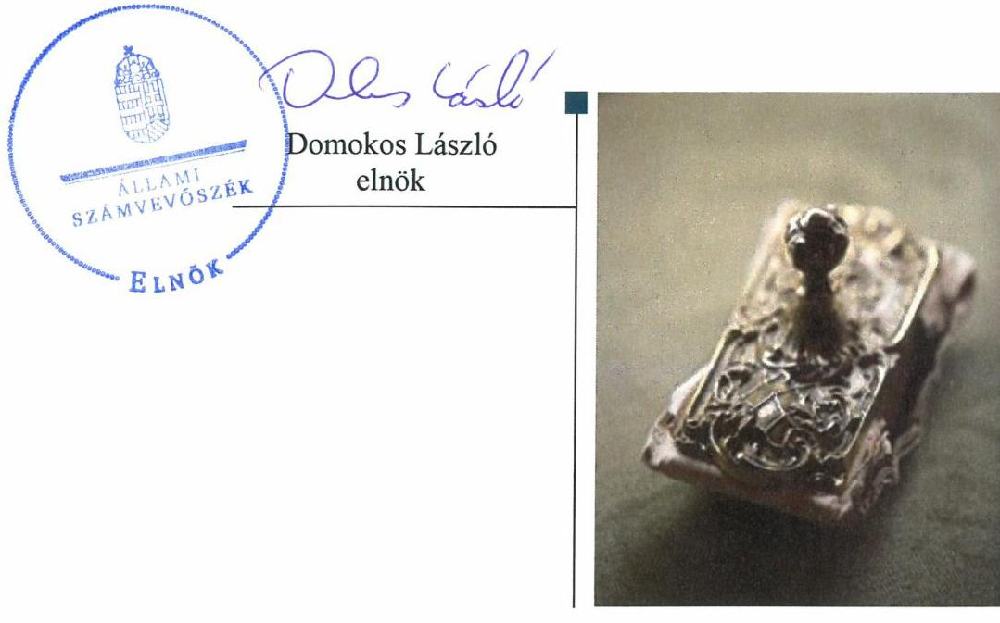
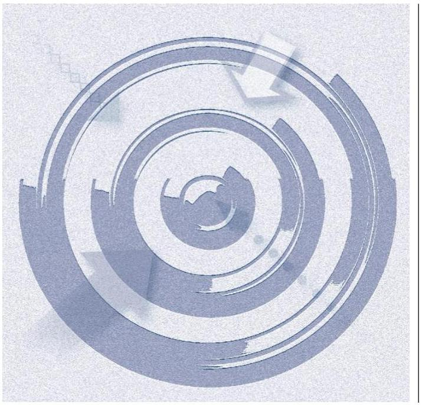
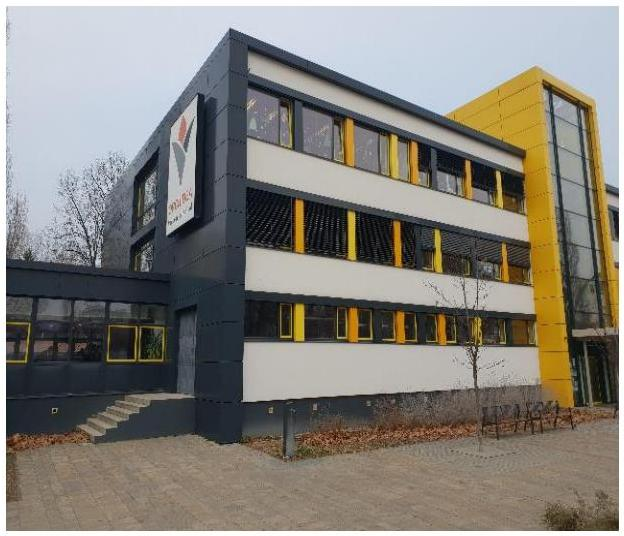

# Jelentés 

## Nem állami humánszolgáltatók ellenőrzése

A humánszolgáltatást nyújtó államháztartáson kívüli köznevelési és szociális intézmények, szolgáltatók fenntartói központi költségvetésből kapott támogatásai felhasználásának ellenőrzése - Prizma Oktatási és Kulturális Alapítvány 2019.

19198
www.asz.hu

---

# Jelentés 

## Nem állami humánszolgáltatók ellenőrzése

A humánszolgáltatást nyújtó államháztartáson kívüli köznevelési és szociális intézmények, szolgáltatók fenntartói központi költségvetésből kapott támogatásai felhasználásának ellenőrzése - Prizma Oktatási és Kulturális Alapítvány
2019. 10. hó 17. nap

---

# AZ ELLENŐRZÉST FELÜGYELTE:

## MAROZSÁN LÁSZLÓNÉ felügyeleti vezető

## AZ ELLENŐRZÉST VEZETTE ÉS A VÉGREHAJTÁSÁÉRT FELELŐS:

### KUSZINGER ANDREA ellenőrzésvezető

### A PROGRAM ÖSSZEÁLLÍTÁSÁÉRT FELELŐS:

### TÓTPÁL SZABOLCS osztályvezető

---

**IKTATÓSZÁM:** EL-2070-001/2019

**TÉMASZÁM:** 2448

**ELLENŐRZÉS-AZONOSÍTÓ SZÁM:** V079426

---

Jelentéseink az Országgyűlés számítógépes hálózatán és az Interneta a www.asz.hu címen is olvashatóak.

---

# TARTALOMJEGYZÉK 

■ ÖSSZEGZÉS ..... 5
■ AZ ELLENŐRZÉS CÉLJA ..... 6
■ AZ ELLENŐRZÉS TERÜLETE ..... 7
■ AZ ELLENŐRZÉS HÁTTERE, INDOKOLTSÁGA ..... 8
■ A JELENTÉS LÉNYEGES KÉRDÉSKÖREI ..... 9
■ AZ ELLENŐRZÉS HATÓKÖRE ÉS MÓDSZEREI ..... 10
■ MEGÁLLAPÍTÁSOK ..... 12
■ JAVASLATOK ..... 15
■ MELLÉKLETEK ..... 17
I. sz. melléklet: Értelmező szótár ..... 17
■ FÜGGELÉKEK ..... 19
I. sz. függelék a jelentéshez ..... 19
II. sz. függelék: Észrevételek ..... 20
■ RÖVIDÍTÉSEK JEGYZÉKE ..... 23

---

.

---

# ÖSSZEGZÉS 

A Prizma Oktatási és Kulturális Alapítvány a központi költségvetési támogatások igénylése, módosítása, elszámolása során nem szabályszerűen járt el. Az általa kapott költségvetési támogatás felhasználásának elszámoltathatóságát nem biztosította. A kapott közpénzek felhasználásának átláthatósága a 2014-2017. években nem érvényesült.

## Az ellenőrzés társadalmi indokoltsága

Az Állami Számvevőszék stratégiájában hangsúlyos szerepet szán annak, hogy szilárd szakmai alapon álló, értékteremtő ellenőrzéseivel előmozdítsa a közpénzügyek átláthatóságát, rendezettségét és javaslataival a közpénzek és a közvagyon szabályos, gazdaságos, hatékony és eredményes felhasználását segítse. Az Állami Számvevőszék a stratégiájában célul tűzte ki, hogy az államháztartáson kívülre nyújtott költségvetési támogatások ellenőrzésével hozzájárul ahhoz, hogy a közpénzeket az államháztartáson kívüli szervezetek is átlátható módon használják fel a közfeladatok szerződésben vállalt ellátása érdekében. Tekintettel a köznevelés finanszírozását és a köznevelési intézmények fenntartását érintően végbement változásokra, a társadalom fokozott érdeklődéssel figyeli a köznevelési feladatok ellátására fordított források felhasználását. A Prizma Oktatási és Kulturális Alapítványnál végzett ellenőrzést további társadalmi elvárás is indokolta köznevelési tevékenységéből adódóan, amelynek keretében óvodai, általános iskolai és gimnáziumi feladatok ellátásában is részt vett.

## Főbb megállapítások, következtetések, javaslatok

A Prizma Oktatási és Kulturális Alapítvány a költségvetési támogatások igénylési, módosítási és elszámolási feladatainak ellátása során nem szabályszerűen járt el, mivel változás-bejelentési kötelezettségének és a számviteli törvény által előírt bizonylat-megőrzési kötelezettségének nem tett eleget, valamint a kapott támogatással feladat-ellátási helyenként nem számolt el. Ennek következtében nem biztosította az általa kapott közpénzek felhasználásának elszámoltathatóságát.

A Prizma Oktatási és Kulturális Alapítvány a köznevelési közfeladatot ellátó intézménye működtetéséhez felhasznált közpénzekre vonatkozó gazdálkodásával a 2014-2017. években a nyilvánosság előtt nem számolt el, mivel a 2014-2016. évi egyszerűsített éves beszámolóit a jogszabály által előírt határidőben nem tette közzé és azokat saját honlapján nem hozta nyilvánosságra, valamint a 2017. évben beszámoló készítési kötelezettségének nem tett eleget, ezáltal nem biztosította az átláthatóság elvének érvényesülését.

Az Állami Számvevőszék a Prizma Oktatási és Kulturális Alapítvány kuratóriumi elnökének öt javaslatot fogalmazott meg. A javaslatokat megalapozó megállapításokra az érintettnek 30 napon belül intézkedési tervet kell készítenie.

---

# AZ ELLENŐRZÉS CÉLJA 

AZ ELLENŐRZÉS CÉLJA annak értékelése, hogy a Prizma Oktatási és Kulturális Alapítvány, mint Fenntartó ${ }^{1}$ központi költségvetésből kapott támogatásainak felhasználása szabályszerű volt-e, a támogatások igénylése, évközi módosítása és év végi elszámolása meg-felelt-e a jogszabályi előírásoknak.

---

# **AZ ELLENŐRZÉS TERÜLETE**

## **Prizma Oktatási és Kulturális Alapítvány**

A Prizma Oktatási és Kulturális Alapítvány magánszemély által alapított, 2006-ban nyilvántartásba vett, közhasznú alapítvány. Fő célja a Magyarországon élő magyar és nem magyar nemzetiségű diákok több nyelven folyó oktatásának támogatása, anyanyelvi oktatók oktatásban történő részvételének szervezése, kül- és belföldi tanulmányutak és iskolai kapcsolatok szervezése.

A Prizma Oktatási és Kulturális Alapítvány ügyvezető szerve a Kuratórium². Külső szervezetek felé történő képviseletére a 2014-2017. években a Kuratórium elnöke és egy tagja volt jogosult. A Kuratórium elnökének és tagjainak személye az ellenőrzött időszakban változott. Az alapító a Kuratórium munkájának ellenőrzése céljából felügyelő bizottságot hozott létre.

A Prizma Oktatási és Kulturális Alapítvány a 2014-2017. években a budapesti székhelyű Orchidea Magyar-Angol Két Tanítási Nyelvű Óvoda, Általános Iskola és Gimnázium fenntartásával, működtetésével látta el közfeladatát, mely az ellenőrzött időszakban a székhelyén kívül egy telephellyel rendelkezett.

A 2017. év végén a hatályos működési engedélyben foglaltak szerint a fenntartott intézményben engedélyezett maximális tanulói létszám a székhelyen működő feladat-ellátási helyen 554 fő, a telephelyen működő feladat-ellátási helyen 315 fő volt.

A 2014-2017. években a Prizma Oktatási és Kulturális Alapítvány intézménye fenntartására és működtetésére 2014-ben 104,7 millió Ft, 2015-ben 142,8 millió Ft, 2016-ban 184,9 millió Ft, és 2017-ben 211,4 millió Ft központi költségvetési támogatást kapott.

---

# AZ ELLENŐRZÉS HÁTTERE, INDOKOLTSÁGA 

A köznevelési feladatokat ellátó nem állami intézményfenntartók részére közfeladataik ellátására a 2014-2017. években jelentős összegű pénzügyi támogatást biztosítottak a mindenkori költségvetési törvények a bennük megfogalmazott feltételek mellett. A 2013. évben jelentős változások következtek be a normatív finanszírozás rendszerében. Az Országgyűlés elfogadta a nemzeti köznevelésről szóló törvényt, amely jelentősen átalakította a korábbi finanszírozási rendszert 2013 szeptemberétől. Új feladatfinanszírozási forma (átlagbéralapú támogatás) jelent meg, amely az államháztartáson kívüli intézményfenntartókra is vonatkozik.

Az ÁSZ ${ }^{3}$ stratégiájában célul tűzte ki, hogy az államháztartáson kívülre nyújtott költségvetési támogatások ellenőrzésével hozzájárul ahhoz, hogy a közpénzeket az államháztartáson kívüli szervezetek is átlátható módon használják fel közfeladatok ellátására kötött szerződésekben vállalt ellátása érdekében. Az ÁSZ stratégiájában foglaltak alapján is indokolt az ellenőrzés, amely a társadalom számára jelzi, hogy a közpénz államháztartáson kívüli felhasználása sem maradhat ellenőrizetlenül. Az államháztartáson kívülre nyújtott költségvetési támogatások ellenőrzésével az ÁSZ hozzájárul ahhoz, hogy a közpénzeket a nem állami humán fenntartók átlátható módon használják fel a közfeladatok ellátására kötött szerződésekben vállalt kötelezettségek teljesítése érdekében. Az ellenőrzés javaslataival hozzájárulhat az említett rendszerek szabályszerű támogatás felhasználásához, javíthatja a társadalmi-gazdasági döntések megalapozottságát, amely a „jól irányított állam" feltétele.

---

# A JELENTÉS LÉNYEGES KÉRDÉSKÖREI 

1. A köznevelési közfeladatot ellátó Fenntartó szabályszerű mükö-dési- és gazdálkodási környezet kialakításával megteremtette-e a költségvetési támogatások átlátható, elszámoltatható igénybevételének, felhasználásának feltételeit?
2. A Fenntartó az átvállalt köznevelési közfeladathoz biztositott költségvetési támogatásokat szabályszerűen fordította-e a köznevelési intézményei müködtetésére?
3. A Fenntartó a köznevelési intézményei müködtetéséhez felhasznált közpénzekre vonatkozó gazdálkodásával a nyilvánosság előtt elszámolt-e, ennek megalapozása érdekében az ellenőrzési és a külső ellenőrzésekkel kapcsolatos intézkedési feladatait szabályszerűen látta-e el?

---

# AZ ELLENŐRZÉS HATÓKÖRE ÉS MÓDSZEREI 

## Az ellenőrzés típusa

Megfelelőségi ellenőrzés

## Az ellenőrzött időszak

A 2014. január 1-je és 2017. december 31-e közötti időszak. A helyszíni szemle tekintetében 2018. január 1-jétől 2019. január 22-ig tartó időszak.

## Az ellenőrzés tárgya

Az ellenőrzés a köznevelési közfeladatokat ellátó államháztartáson kívüli Fenntartó humánszolgáltatási közfeladatai ellátásához a költségvetési törvényekben biztosított központi költségvetési támogatások igénylése, évközi módosítása és év végi elszámolása fenntartói feladatainak ellátása, illetve e központi költségvetésből kapott támogatásaik humánszolgáltatási közfeladatokra való fenntartó általi felhasználása szabályszerűségének értékelésére terjedt ki.

## Az ellenőrzött szervezet

Prizma Oktatási és Kulturális Alapítvány

## Az ellenőrzés jogalapja

Az ellenőrzés jogszabályi alapját az ÁSZ tv. ${ }^{4}$ 1. § (3) bekezdése, 5. § (3) bekezdésben foglalt előírások adták.

## Az ellenőrzés módszerei

Az ellenőrzést az ellenőrzési program szempontjai, kérdései, az ellenőrzött időszakban hatályos jogszabályok, a nemzetközi standardokat irányadónak tekintve, az ellenőrzés szakmai szabályok és módszertanok figyelembe vételével végezte az ÁSZ. A közpénzekkel való felelős gazdálkodás segítésére irányuló javaslatok kidolgozásakor a hatályos jogszabályok voltak az irányadóak.

Az ellenőrzés ideje alatt az ellenőrzött szervezettel történő kapcsolattartást az ÁSZ SZMSZ5-ének vonatkozó előírásai alapján biztosította az ÁSZ.

---

Az ellenőrzési kérdések megválaszolásához szükséges bizonyítékok megszerzése az ellenőrzött által rendelkezésre bocsátott dokumentumokra, adatokra alapozva, valamint elemző eljárással történt.

Az ellenőrzési bizonyítékként felhasználható adatforrások közé tartoztak egyrészt a szakmai program részletes szempontjainál felsorolt adatforrások, másrészt minden - az ellenőrzés folyamán feltárt, az ellenőrzés szempontjából információt tartalmazó - dokumentum.

Az ellenőrzés lefolytatásához az ellenőrzött szervezet a kitöltött tanúsítványok, valamint az ÁSZ által kért dokumentumok elektronikus úton való megküldésével szolgáltatott adatokat, információkat. Az így rendelkezésre bocsátott adatok, információk és a tanúsítványok adatai valódiságának kontrollja az ellenőrzés keretében történt.

A fenntartott köznevelési intézménynél helyszíni szemle keretében győződött meg az ÁSZ a tényleges feladatellátásról (verifikáció).

A köznevelési humánszolgáltatások központi költségvetési támogatásai igénylésével, módosításával, elszámolásával kapcsolatos, államháztartáson kívüli fenntartó jogszabályokban előírt feladatai betartását, továbbá a központi költségvetési támogatások szabályszerű kezelését, nyilvántartását ellenőrizte az ÁSZ a Fenntartónál határozatok, nyilvántartások és egyéb dokumentumok alapján. Az ellenőrzés nem terjedt ki a köznevelési humánszolgáltatások központi költségvetési támogatásai igénylése, módosítása, elszámolása valódiságának, megalapozottságának, helyességének - sem a Fenntartónál, sem a székhely intézményeinél való - értékelésére. Továbbá nem terjedt ki az ellenőrzés e források, intézmények általi szabályszerű felhasználásának értékelésére.

---

# MEGÁLLAPÍTÁSOK 

## 1. A köznevelési közfeladatot ellátó Fenntartó szabályszerű mú-ködési- és gazdálkodási környezet kialakításával megterem-tette-e a költségvetési támogatások átlátható, elszámoltatható igénybevételének, felhasználásának feltételeit?

Összegző megállapítás

A Fenntartó köznevelési közfeladat ellátásának megszervezése és belső szabályozottságának kialakítása szabályszerű volt. A Fenntartó a költségvetési támogatások igénylési, módosítási és elszámolási feladatait nem szabályszerűen látta el.

ALAPÍTÓ OKIRATTAL ${ }^{6}$ a jogszabályi előírások szerint rendelkezett a Fenntartó. A Törvényszék ${ }^{7}$ nyilvántartásában a Fenntartó szerepelt.

SZÁMVITELI POLITIKÁVAL ${ }^{8}$ valamint a számviteli politika keretében elkészítendő szabályzatokkal és számlarenddel ${ }^{9}$ a Fenntartó a 2014-2017. években a Számv. tv. ${ }^{10}$ előírásai szerint rendelkezett.

A KÖLTSÉGVETÉSI TÁMOGATÁSOK igénylése, módosítása és év végi elszámolása nem volt szabályszerű. A Fenntartó az Nkt. vhr. ${ }^{11}$ 37/H. § (1) bekezdésében foglaltak ellenére a 2014. és a 2017. évben a kuratóriumi elnök személyével kapcsolatos változás-bejelentési kötelezettségét nem teljesítette. A Fenntartó nem tett eleget bizonylatmegőrzési kötelezettségének, mivel a Számv. tv. 169. § (2) bekezdésében foglaltak ellenére a 2014-2017. években a támogatás igénylőlapjait visszakereshető módon nem őrizte meg. A Fenntartó a 2014. évre vonatkozó költségvetési támogatás elszámolása során nem tartotta be a Kvtv. ${ }^{12}$ 33. § (8) bekezdésében foglalt határidőt, illetve a Fenntartó az Nkt. vhr. 37/L. § (1) bekezdésében foglaltak ellenére a 2014-2017. években elszámolását feladat-ellátási helyenként nem készítette el. A Fenntartó az Nkt. vhr. 37/L. § (2) bekezdésében foglaltak ellenére a 2016. évben a támogatások elszámolásához nem csatolta a pedagógus- és nevelő-oktató munkát segítő munkakörben a tárgyévben foglalkoztatottakkal kapcsolatos fenntartói nyilatkozatot arról, hogy az illetmények, bérek és járulékai megfizetésre kerültek. A Fenntartó a 2014-2017. években az Nkt. vhr. 37/L. § (3) bekezdésében előírtakat az elszámolás során nem tartotta be.

---

# 2. A Fenntartó az átvállalt köznevelési közfeladathoz biztosított költségvetési támogatásokat szabályszerűen fordította-e a köznevelési intézményei működtetésére? 

Összegző megállapítás

A Fenntartó az átvállalt köznevelési közfeladathoz biztosított költségvetési támogatások felhasználásának elszámoltathatóságát nem biztosította.

A FENNTARTÓ a központi költségvetési támogatások igénylési, módosítási és év végén elszámolási feladatait a 2014-2017. években nem szabályszerűen végezte, mivel nem tartotta be a Számv. tv. 169. § (2) bekezdésében, a Kvtv. 33. § (8) bekezdésében, az Nkt. vhr. 37/H. § (1) bekezdésében, és az Nkt. vhr. 37/L. § (1)-(3) bekezdéseiben foglaltakat. A Fenntartó a 2017. évben az Nkt. vhr. 37/G. § (1) bekezdésében foglaltak ellenére elkülönített nyilvántartással nem rendelkezett. Ezeknek következtében nem biztosította a kapott költségvetési támogatás szabályszerű felhasználásának feltételeit, a támogatás felhasználásának az elszámoltathatóságát.

## 3. A Fenntartó a köznevelési intézményei működtetéséhez felhasznált közpénzekre vonatkozó gazdálkodásával a nyilvánosság előtt elszámolt-e, ennek megalapozása érdekében az ellenőrzési és a külső ellenőrzésekkel kapcsolatos intézkedési feladatait szabályszerűen látta-e el?

Összegző megállapítás

A Fenntartó a 2014-2017. években a köznevelési intézménye működtetéséhez felhasznált közpénzekre vonatkozó gazdálkodásával a nyilvánosság előtt nem számolt el. A Fenntartó ellenőrizte a fenntartott intézmény múködését és gazdálkodását, a külső ellenőrzésekkel kapcsolatos intézkedési kötelezettségének eleget tett.

A 2014-2016. ÉVI EGYSZERÚSÍTETT ÉVES BESZÁMOLÓJÁT és közhasznúsági mellékletét a Fenntartó a Civil tv. ${ }^{13}$ 30. § (1) bekezdésében előírt határidőben nem tette közzé, illetve a Civil tv. 30. § (4) bekezdésében előírtak ellenére saját honlapján nem hozta nyilvánosságra.

A Fenntartó a Civil tv. 28. § (1) bekezdésében foglaltak ellenére a 2017. évben beszámoló készítési kötelezettségének nem tett eleget.

A Fenntartó a 2014-2017. években ellenőrizte - az Nkt. ${ }^{14}$-ban foglalt lehetőség alapján - a fenntartott intézmény múködését és gazdálkodását.

A KORMÁNYHIVATAL ${ }^{15}$ TÖRVÉNYESSÉGI ELLENÖRZÉSE a Fenntartó intézménye feladatellátását érintette az ellenőr-

---

zött időszakban, az ellenőrzések során tett javaslatokra meghatározott intézkedési kötelezettségének a Fenntartó eleget tett. A Fenntartónál a 2014. évre vonatkozóan történt a Kincstár ${ }^{16}$ által végzett költségvetési támogatás elszámolásának jogszerűségét és szabályszerűségét vizsgáló helyszíni ellenőrzés. A Fenntartónak visszafizetési kötelezettsége keletkezett, amelyet teljesített.

---

# JAVASLATOK 

Az ÁSZ tv. 33. § (1) bekezdésében foglaltak értelmében az ellenőrzött szervezet vezetője köteles a jelentésben foglalt megállapításokhoz kapcsolódó intézkedési tervet összeállítani és azt a jelentés kézhezvételétől számított 30 napon belül az ÁSZ részére megküldeni. Amennyiben az ellenőrzött szervezet vezetője nem küldi meg határidőben az intézkedési tervet, vagy továbbra sem elfogadható intézkedési tervet küld, az Állami Számvevőszék elnöke az ÁSZ tv. 33. § (3) bekezdése a) és b) pontjaiban foglaltakat érvényesítheti.

## Prizma Oktatási és Kulturális Alapítvány kuratóriumi elnökének

1. Tegyen eleget a Kincstár felé az Nkt. vhr.-ben elöirt változás-bejelentési kötelezettségének.
(1. sz. megállapítás 3. bekezdésének 2. mondata alapján)
2. Gondoskodjon a Számv. tv-ben elöirtak szerint a támogatás igénylési dokumentumok visszakereshető módon történő megőrzéséről.
(1. sz. megállapítás 3. bekezdésének 3. mondata alapján)
3. Intézkedjen arról, hogy az igénybevett költségvetési támogatásokkal a jogszabályi elöírások szerint számoljanak el.
(1. sz. megállapítás 3. bekezdésének 4. mondat 2. tagmondata és 6. mondata alapján)
4. Gondoskodjon a költségvetési támogatásra vonatkozóan a jogszabályi elöírás szerinti nyilvántartás vezetéséről.
(2. sz. megállapítás 1. bekezdésének 2. mondata alapján)
5. Intézkedjen az éves beszámoló jogszabályi elöírások szerinti elkészítéséről.
(3. sz. megállapítás 2. bekezdése alapján)

---

.

---

# MELLÉKLETEK 

- I. SZ. MELLÉKLET: ÉRTELMEZŐ SZÓTÁR
civil szervezet
humánszolgáltatás
költségvetési támogatás
köznevelési közfeladat
köznevelési intézmény
nem állami, nem önkormányzati (államháztartáson kívüli) intézmény fenntartó

A Civil tv. 2. § 6. pontja szerint civil szervezet a civil társaság, a Magyarországon nyilvántartásba vett egyesület (a párt, a szakszervezet és a kölcsönös biztosító egyesület kivételével), a közalapítvány és a pártalapítvány kivételével az alapítvány.
Külön törvényben meghatározott szociális, gyermekjóléti, gyermekvédelmi, közoktatási, felsőoktatási, kulturális közfeladatok (2014. évi Kvtv. 34. § (1), (4) bekezdés, 1. számú melléklet XX/20/2. alcím, 19. alcím, 2015. évi Kvtv. 43. § (1), (4) bekezdés, 1. számú melléklet XX/20/2/3. jogcím csoport, 19. alcím, 2016. évi Kvtv. 41. § (1), (4) bekezdés, 1. számú melléklet XX/20/2/3. jogcím csoport, 19. alcím).
a társadalombiztosítás pénzügyi alapjai kivételével az államháztartás központi alrendszeréből ellenérték nélkül, pénzben nyújtott támogatások (Áht. ${ }^{17}$ 1. § 14. pont)
A költségvetési törvényekben (2013. évi CCXXX. törvény 33-34. §, 2014. évi C. törvény 42-43. §, 2015. évi C. törvény 40-41. §) megállapított támogatás. A 2015. évi C. törvény 40-41. § szerint többek között: Az Országgyűlés a köznevelési feladat ellátására átlagbéralapú támogatást állapít meg. A nevelési-oktatási, valamint pedagógiai szakszolgálati intézményt fenntartó nemzetiségi önkormányzat, az egyházi és magán köznevelési intézmény fenntartója részére az általuk fenntartott nevelési-oktatási intézményben, továbbá pedagógiai szakszolgálati intézményben pedagógus és - a b) pont kivételével - nevelő-oktató munkát közvetlenül segítő munkakörben foglalkoztatottak után a 7. melléklet I. pontja, valamint az óvoda, egységes óvoda-bölcsőde esetében a 2. melléklet II. pont 1. alpontja szerint és az 5. alpontjában meghatározott jogosultak után, az őket ott megillető mértékek szerint. Müködési támogatást állapít meg a nemzetiségi önkormányzat vagy az egyházi jogi személy által fenntartott nevelési-oktatási intézményekben ellátott, továbbá a pedagógiai szakszolgálati intézményekben gyógypedagógiai tanácsadásban, korai fejlesztésben, oktatásban és gondozásban, valamint a fejlesztő nevelésben részt vevő gyermekekre, tanulókra tekintettel a nemzetiségi önkormányzat és a bevett egyház részére a 7. melléklet II. pontja szerint.
A köznevelési intézmény alapító okiratában, szakmai alapdokumentumában foglalt feladat: óvodai nevelés, nemzetiséghez tartozók óvodai nevelése, általános iskolai nevelés-oktatás, nemzetiséghez tartozók általános iskolai nevelése-oktatása, kollégiumi ellátás, nemzetiségi kollégiumi ellátás, gimnáziumi nevelés-oktatás, szakközépiskolai nevelés-oktatás, szakiskolai nevelés-oktatás, nemzetiség gimnáziumi nevelés-oktatása, nemzetiség szakközépiskolai nevelés-oktatása, nemzetiség szakiskolai nevelés-oktatása, Köznevelési Hidprogramok keretében folyó nevelés-oktatás, felnőttoktatás, alapfokú művészetoktatás, fejlesztő nevelés, fejlesztő nevelés-oktatás, pedagógiai szakszolgálati feladat, a többi gyermekkel, tanulóval együtt nevelhető, oktatható sajátos nevelési igényű gyermekek, tanulók óvodai nevelése és iskolai nevelése-oktatása, azoknak a sajátos nevelési igényű gyermekeknek, tanulóknak az óvodai, iskolai, kollégiumi ellátása, akik a többi gyermekkel, tanulóval nem foglalkoztathatók együtt, a gyermekgyógyüdülőkben, egészségügyi intézményekben, rehabilitációs intézményekben tartós gyógykezelés alatt álló gyermekek tankötelezettségének teljesítéséhez szükséges oktatás, pedagógiai-szakmai szolgáltatás. (Nkt. 4. § 1. pont) A nevelési- oktatási intézmény, pedagógiai szakszolgálati intézmény, pedagógiai-szakmai szolgáltatást nyújtó intézmény.(Nkt. 7. § (1) bekezdés)
A köznevelési és szociális, gyermekjóléti és gyermekvédelmi közfeladatokat/humánszolgáltatásokat ellátó intézményt fenntartó egyházi jogi személy, társadalmi szervezet, alapítvány, közalapítvány, civil szervezet, országos nemzetiségi önkormányzat, nonprofit gazdasági társaság, gazdasági társaság és a humánszolgáltatást alaptevékenységként végző, Szja tv. hatálya alá tartozó egyéni vállalkozó. (2013. évi Kvtv. 35. § (1), (3) bekezdés, 2014. évi Kvtv. 33. §, 34. § (1), (4) bekezdés, 2015. évi Kvtv. 42. §, 43. § (1), (4) bekezdés, 2016. évi Kvtv. 40. §, 41. § (1), (4) bekezdés)

---

.

---

# FÜGGELÉKEK 

- I. SZ. FÜGGELÉK A JELENTÉSHEZ

Az Állami Számvevőszék az ellenőrzések során feltárt tényekhez kapcsolódó további körülmények tisztázására eszközrendszerrel nem rendelkezik. Amennyiben az ellenőrzésen túlmutatóan indokoltnak látszik az ellenőrzés során feltárt körülmények további vizsgálata, az Állami Számvevőszék törvényi felhatalmazás alapján az ellenőrzés által feltárt körülményeket továbbítja a hatáskörrel rendelkező szervnek a szükséges intézkedések megtétele, eljárások lefolytatása érdekében.
A Fenntartó az ellenőrzött időszakban a költségvetési támogatások igénylése, módosítása és év végi elszámolása során nem szabályszerűen járt el, mivel a 2014-2017. években a Számv. tv. 169. § (2) bekezdésében foglalt bizonylat-megőrzési kötelezettségének, illetve a 2014. és a 2017. évben az Nkt. vhr. 37/H. § (1) bekezdésében foglalt változásbejelentési kötelezettségének nem tett eleget. A Fenntartó a 2014. évi támogatás elszámolását a Kvtv. 33. § (8) bekezdésében foglalt határidőben nem teljesítette, valamint a 2014-2017. években az Nkt. vhr. 37/L. § (1) bekezdésében foglaltak ellenére a kapott támogatással feladat-ellátási helyenként nem számolt el és az Nkt. vhr. 37/L. § (3) bekezdésben előírtakat az elszámolás során nem tartotta be, továbbá a 2016. évben az Nkt. vhr. 37/L. § (2) bekezdésében foglalt nyilatkozatot elszámolásához nem csatolta.

A fentiekben leírt szabálytalanságok következtében a Fenntartó az általa kapott támogatás szabályszerű felhasználásának feltételeit a 2014-2017. években nem biztosította, nem igazolta az általa igénybe vett támogatás jogosságát és összegszerűségét, illetve a célhoz kötött közpénzfelhasználást. Továbbá nem igazolt, hogy a Fenntartó az Nkt. vhr. 37/G. § (1) bekezdésében foglaltak szerint a támogatások felhasználását alapfeladatonkénti bontásban, elkülönítetten és naprakészen tartotta nyilván, az adatok valódiságát megfelelő nyilvántartással, szakmai és pénzügyi dokumentációval támasztotta alá, valamint, hogy a támogatásokat átadta az intézménye részére és az általa kapott támogatásokat cél szerint használta fel. Ennek következtében nem zárható ki, hogy a Fenntartó a 2014-2017. években kapott 643,8 millió Ft központi költségvetési támogatást nem a köznevelési feladatot ellátó intézménye müködtetésére fordította.
Az eset konkrét körülményeinek feltárására a Magyar Államkincstár rendelkezik hatáskörrel.

---

A jelentéstervezetet a Számvevőszék 15 napos észrevételezésre megküldte az ellenőrzött szervezetek vezetőinek az ÁSZ tv. 29. §* (1) bekezdése előirásának megfelelően.

A Prizma Oktatási és Kulturális Alapítvány kuratóriumi elnöke a jelentéstervezet megállapításaira írásban észrevételt tett.
Az ÁSZ tv. 29. § (3) bekezdésével összhangban az ÁSZ a Függelékben feltünteti az ellenőrzés megállapításaival kapcsolatban tett, figyelembe nem vett észrevételeket, és megindokolja, hogy azokat miért nem fogadta el.

[^0]
[^0]:    * 29. § (1) Az Állami Számvevőszék az ellenőrzési megállapításait megküldi az ellenőrzött szervezet vezetőjének vagy az általa megbízott személynek, és annak, akinek személyes felelősségét állapította meg.
    (2) Az ellenőrzött szervezet vezetője és a felelősként megjelölt személy az ellenőrzés megállapításaira tizenöt napon belül írásban észrevételt tehet.
    (3) Az Állami Számvevőszék az észrevételre a beérkezésétől számított harminc napon belül írásban válaszol. A figyelembe nem vett észrevételeket köteles a jelentésben feltüntetni, és megindokolni, hogy azokat miért nem fogadta el.

---

A „Nem állami humánszolgáltatók ellenőrzése - A humánszolgáltatást nyújtó államháztartáson kívüli köznevelési és szociális intézmények, szolgáltatók fenntartói központi költségvetésből kapott támogatásai felhasználásának ellenőrzése - Prizma Oktatási és Kulturális Alapítvány" címmel készített számvevőszéki jelentéstervezet megállapításaival kapcsolatban a kuratórium elnöke által 2019. szeptember 10-én tett (az Állami Számvevőszékhez 2019. szeptember 17-én érkezett) észrevételek és azok kezelésének indokolása.

1. Az 1. számú összegző megállapítás 2. mondatára, az azt alátámasztó 3. bekezdésre, valamint a kapcsolódó 2. és 3. számú javaslatokra tett észrevétel (észrevétel 1. pontja):
A kuratóriumi elnök észrevétele szerint szabályosan jártak el a költségvetési támogatások igénylése, módosítása során. A Számv. tv. 169. § (2) bekezdésében foglalt bizonylat-megőrzési kötelezettség észrevétele szerint nem vonatkozik a támogatások igénylőlapjaira. Nem tartja megalapozottnak a támogatások elszámolási határidejére tett megállapítást, mert a jelentéstervezetben hivatkozott jogszabályhely azt nem támasztja alá. Az észrevételben leírta, hogy a Kincstár ellenőrizte a 2016. évi támogatás elszámolását, amelyet elfogadott, és amelyhez az illetmények, bérek és azok járulékai megfizetéséről szóló fenntartói nyilatkozatot a Fenntartó a Kincstár felé benyújtotta.
Az észrevételt nem fogadtuk el. Nem helytálló a kuratórium elnökének észrevétele, amely szerint a költségvetési támogatások igénylőlapjára nem terjed ki a Számv. tv. szerinti bizonylat-megőrzési kötelezettség, mivel az igénylőlap a támogatás igénylését alátámasztó és a támogatási összeg Kincstár általi megállapításához szükséges alapdokumentum.
A 2014. évi támogatások elszámolására vonatkozó határidő tekintetében a Kvtv. 2014. december 12-étől, a 2014. évi elszámolás idején is hatályos változata azonos a jelentéstervezetben hivatkozott jogszabályhellyel, így a jelentéstervezetben a 33. § (8) bekezdés helyes hivatkozás, amely szerint az átlagbér alapú támogatás és a működési támogatás tényleges gyermek-, tanuló létszám szerinti elszámolására a költségvetési évet követő év március 31-éig kormányrendeletben meghatározott módon kerül sor. A jogszabály 2014. december 11-éig hatályos változata szerint az elszámolás határideje a költségvetési évet követő év január 31-e volt. Az ellenőrzés során teljességi és hitelességi nyilatkozattal igazoltan az adatszolgáltatás során az ÁSZ rendelkezésére bocsátott dokumentumok alapján a Fenntartó a 2014. évi támogatásokra vonatkozó elszámolását - a Kincstár 16232/15/2015. iktatószámú határozata szerint azonban mindkét határidőt túllépve, 2015. április 7-én nyújtotta be.
A kuratóriumi elnök észrevétele nem cáfolja 2016. évre az Nkt. vhr. 37/L. § (2) bekezdésében szereplő 37./C § (7) bekezdés c) pontja szerinti nyilatkozatok hiányára vonatkozó megállapítást. A Fenntartó az észrevételben leírtak szerint az említett nyilatkozatot a Kincstár részére küldte meg. Az ÁSZ az adatszolgáltatásra rendelkezésre álló idő alatt rendelkezésre bocsátott dokumentumok alapján fogalmazza meg a jelentéstervezet megállapításait. A Fenntartó az észrevételével érintett nyilatkozatokat az ÁSZ részére igazoltan nem adta át.
Az észrevétel alapján a jelentéstervezet módosítása nem indokolt.
2. A 2. számú összegző megállapítás 1. bekezdésre, valamint a kapcsolódó 4. számú javaslatra tett észrevétel (észrevétel 2. pontja):
A kuratóriumi elnök észrevétele szerint a Fenntartó rendelkezik elkülönített nyilvántartásokkal, a számlarendjét is eszerint alakították ki. A főkönyvi tételeket analitikus nyilvántartás támasztja alá. Az intézménye részére átadott támogatásokról készült nyilvántartásokat maradéktalanul az ÁSZ rendelkezésére bocsátották.
A kuratóriumi elnök észrevétele cáfolja a jelentéstervezetben az Nkt. vhr. 37/G. § (1) bekezdésében előírt nyilvántartás hiányára tett megállapítást. Az észrevételben hivatkozott számlarend és főkönyvi analitikák nem felelnek meg a támogatások felhasználásáról, az ingyenesség, tandíj, térítési díj megállapításával, beszedésével kapcsolatos rendelkezésekről, okiratokról alapfeladatonkénti bontásban elkülönítetten és naprakészen vezetett olyan nyilvántartásnak, amelyből megállapítható, hogy a támogatások milyen határnappal kerültek átadásra és milyen célra kerültek felhasználásra. Az észrevétel alapján a jelentéstervezet módosítása nem indokolt.
3. A 3. számú összegző megállapítás 1. mondatára, az azt alátámasztó 1-2. bekezdésekre, valamint a kapcsolódó 5. számú javaslatra tett észrevétel (észrevétel 3. pontja):

A kuratóriumi elnök észrevétele szerint a Fenntartó elkészítette a 2017 évi beszámolóját, amelyet önhibáján kívül, az ÁSZ rendszerének leállása miatt nem tudott határidőben feltölteni az ellenőrzés részére. A beszámolók letétbe helyezése és közzététele a beszámoló-nyomtatvány OBH részére történő megküldésével megtörtént.

---

Az észrevételt nem fogadtuk el. Az ÁSZ a megállapításait az ÁSZ tv. 28. § (1)-(2) bekezdései alapján az adatszolgáltatás során, az arra nyitva álló határidőn belül az ÁSZ rendelkezésére bocsátott dokumentumokra alapozva teszi meg, melynek csak egyik lehetősége az elektronikus felületre való feltöltés. A Fenntartó által 2018. szeptember 12-én postai úton megküldött 2017. évi beszámoló 2018. szeptember 14-én érkezett meg az ÁSZ-hoz. Mivel a Fenntartó 2018. augusztus 14-én vette át az adatbekérő levelet, az adatszolgáltatási határidő 2018. augusztus 22-én járt le, ezért a postán megküldött dokumentumok az adatszolgáltatási határidőn túl érkeztek meg, azokat a megállapítások során nem lehet figyelembe venni.
A Fenntartó beszámolóinak közzétételére és a letétbe helyezésére a Civil tv. 30. § (1) bekezdése határidőt állapít meg, melyet a Fenntartó az Országos Bírósági Hivatal közhiteles nyilvántartása szerint a közzététel során nem tartott be, a nyilvánosságot ezáltal nem biztosította. Az észrevétel alapján a jelentéstervezet módosítása nem indokolt.

---

# RÖVIDÍTÉSEK JEGYZÉKE 

${ }^{1}$ Fenntartó
${ }^{2}$ Kuratórium
${ }^{3}$ ÁSZ
${ }^{4}$ ÁSZ tv.
${ }^{5}$ ÁSZ SZMSZ
${ }^{6}$ Alapító Okirat

[^0]Prizma Oktatási és Kulturális Alapítvány
Prizma Oktatási és Kulturális Alapítvány Kuratóriuma
Állami Számvevőszék
Az Állami Számvevőszékről szóló 2011. évi LXVI. törvény (hatályos: 2011. július 1-jétől)
Az Állami Számvevőszék Szervezeti és Működési Szabályzata
alapító okirat1 Prizma Oktatási és Kulturális Alapítvány alapító okirata (hatályos: 2011. január 18-tól)
alapító okirat2 Prizma Oktatási és Kulturális Alapítvány alapító okirata (hatályos: 2014. április 10-től)
alapító okirat3 Prizma Oktatási és Kulturális Alapítvány alapító okirata (hatályos: 2015. október 12-től)
alapító okirat4 Prizma Oktatási és Kulturális Alapítvány alapító okirata (hatályos: 2017. augusztus 29-től)
Fővárosi Törvényszék
számviteli politika1 Prizma Oktatási és Kulturális Alapítvány Számviteli politika (hatályos: 2014. január 1-jétől)
számviteli politika2 Prizma Oktatási és Kulturális Alapítvány Számviteli politika (hatályos: 2015. január 1-jétől)
számviteli politika3 Prizma Oktatási és Kulturális Alapítvány Számviteli politika (hatályos: 2016. január 1-jétől)
számviteli politika4 Prizma Oktatási és Kulturális Alapítvány Számviteli politika (hatályos: 2017. január 1-jétől)
számlarend5 Prizma Oktatási és Kulturális Alapítvány Számlarend (hatályos: 2014. január 1-jétől)
számlarend6 Prizma Oktatási és Kulturális Alapítvány Számlarend (hatályos: 2015. január 1-jétől)
számlarend7 Prizma Oktatási és Kulturális Alapítvány Számlarend (hatályos: 2016. január 1-jétől)
számlarend8 Prizma Oktatási és Kulturális Alapítvány Számlarend (hatályos: 2017. január 1-jétől)
a számvitelről szóló 2000. évi C. törvény (hatályos: 2001. január 1-jétől)
a nemzeti köznevelésről szóló törvény végrehajtásáról szóló 229/2012. (VIII. 28.) Korm. rendelet (hatályos: 2012. szeptember 1-jétől)
Magyarország 2014. évi költségvetéséről szóló 2013. évi CCXXX. törvény (hatályos: 2013. december 22-étől)
az egyesülési jogról, a közhasznú jogállásról, valamint a civil szervezetek müködéséről és támogatásáról szóló 2011. évi CLXXV. törvény (hatályos: 2011. december 22-től)
a nemzeti köznevelésről szóló 2011. évi CXC. törvény (hatályos: 2012. szeptember 1-jétől)
Budapest Főváros Kormányhivatala
Magyar Államkincstár
az államháztartásról szóló 2011. évi CXCV. törvény (hatályos: 2012. január 1-jétől)

[^0]:    ${ }^{9}$ Számlarend

    ${ }^{10}$ Számv. tv.
    ${ }^{11}$ Nkt. vhr.
    ${ }^{12}$ Kvtv.
    ${ }^{13}$ Civil tv.
    ${ }^{14}$ Nkt.
    ${ }^{15}$ Kormányhivatal
    ${ }^{16}$ Kincstár
    ${ }^{17}$ Áht.

---

# ÁLLAMI SZÁMVEVŐSZÉK 

1052 Budapest, Apáczai Csere János utca 10.
Levélcím: 1364 Budapest 4. Pf. 54
Telefon: +36 14849100 Telefax: +36 14849200
www.asz.hu