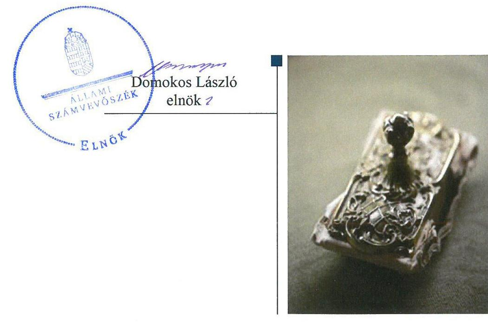
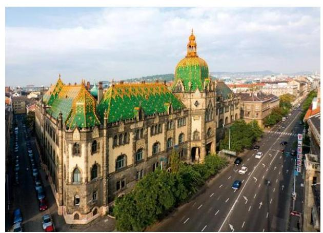

# Jelentés 

## Központi költségvetési szervek ellenőrzése

Iparművészeti Múzeum 2019.

---

# Jelentés 

## Központi költségvetési szervek ellenőrzése

Iparművészeti Múzeum
2019. 10. hó 15. nap

---

# AZ ELLENŐRZÉST FELÜGYELTE:

DR. NAGY IMRE felügyeleti vezető

# AZ ELLENŐRZÉST VEZETTE ÉS A VÉGREHAJTÁSÁÉRT FELELŐS:

DR. KOVÁCS DIÁNA ellenőrzésvezető

# A PROGRAM ÖSSZEÁLLÍTÁSÁÉRT FELELŐS:

TÓTPÁL SZABOLCS osztályvezető

---

IKTATÓSZÁM: EL-2062-001/2019.

TÉMASZÁM: 2450

ELLENŐRZÉS-AZONOSÍTÓ SZÁM: V079135

---

Jelentéseink az Országgyűlés számítógépes hálózatán és az Interneten a www.asz.hu címen is olvashatóak.

---

# TARTALOMJEGYZÉK 

■ ÖSSZEGZÉS ..... 5
■ AZ ELLENŐRZÉS CÉLJA ..... 6
■ AZ ELLENŐRZÉS TERÜLETE ..... 7
■ AZ ELLENŐRZÉS HÁTTERE, INDOKOLTSÁGA ..... 8
■ A JELENTÉS LÉNYEGES KÉRDÉSKÖREI ..... 9
■ AZ ELLENŐRZÉS HATÓKÖRE ÉS MÓDSZEREI ..... 10
■ MEGÁLLAPÍTÁSOK ..... 12
■ JAVASLATOK ..... 15
■ MELLÉKLETEK ..... 17
I. sz. melléklet: Értelmező szótár ..... 17
■ FÜGGELÉKEK ..... 21
I. sz. függelék a jelentéshez ..... 21
II. sz. függelék: Észrevételek ..... 22
■ RÖVIDÍTÉSEK JEGYZÉKE ..... 27

---

.

---

# ÖSSZEGZÉS 

Az Iparművészeti Múzeumnál a belső kontrollrendszer kialakítása és működtetése, a pénzügyi- és vagyongazdálkodás nem volt szabályszerű, ezáltal nem volt biztosított a közpénzekkel és a nemzeti vagyonnal történő átlátható, szabályszerű és eredményes gazdálkodás. A Múzeum főigazgatója nem építette ki a korrupciós helyzetek megelőzését biztosító rendszert.

## Az ellenőrzés társadalmi indokoltsága

Az Állami Számvevőszék ellenőrzi a költségvetési szervek gazdálkodását, működését, hogy megállapításaival támogassa az ellenőrzött szervezetek szabályszerű gazdálkodását, javaslataival elősegítse az Alaptörvényben ${ }^{1}$ megfogalmazott alapvetések érvényesülését a mindennapi életben a szervezetek szintjén. A központi költségvetés rendszerében zajló folyamatok holisztikus elemzései, a kockázatok folyamatos figyelemmel kísérésének módszerével, az így kiválasztott szervezetek célzott, hatékony ellenőrzéseivel az Állami Számvevőszék betölti a legfőbb gazdasági ellenőrző szerv küldetését. Az ellenőrzések megállapításaival és egy adott időszak ellenőrzési eredményeinek elemzésével az Állami Számvevőszék ráirányíthatja a jogalkotók figyelmét a központi alrendszerben vagy annak egy ágazatában esetlegesen felmerülő pénzügyi, szabályozási feszültségekre. Az elvégzett ellenőrzések során az Állami Számvevőszék „jó gyakorlatokat" is azonosíthat, melyeket tanácsadó funkciója keretében szélesebb körben is megismertethet az érintettekkel, ezáltal is hozzájárulva a költségvetési rendszer szabályozott, átlátható, kiegyensúlyozott és fenntartható működéséhez.

## Főbb megállapítások, következtetések, javaslatok

Az Iparművészeti Múzeum belső kontrollrendszerének kialakítása és működtetése, pénzügyi- és vagyongazdálkodása nem volt szabályszerű az ellenőrzött időszakban. Az Iparművészeti Múzeum nem rendelkezett a számviteli politika keretében elkészítendő eszközök és források értékelési szabályzatával. A számviteli politika részét képező szabályzat hiányában az Iparművészeti Múzeumnál nem volt biztosított annak feltétele, hogy a költségvetési beszámolója a Számv. tv. előírásainak megfeleljen.

Az Iparművészeti Múzeum 2017. évi mérlege és beszámolója nem volt megalapozott, nem érvényesült a Számv. tv-ben előírt valódiság elve, mivel a Múzeum a mérleg tételeinek alátámasztásához nem állított össze olyan leltárt, amely tételesen, ellenőrizhető módon tartalmazta a mérleg fordulónapján meglévő eszközeit és forrásait. Az állami vagyon védelme nem volt biztosított, mert az állami vagyon kimutatását nem átláthatóan, a valóságnak megfelelő módon végezték.

A 2017. évben a költségvetési maradvány kimutatása nem volt szabályszerű. A Múzeum főigazgatója nem építette ki a korrupciós helyzetek megelőzésére szolgáló integritási kontrollokat.

A teljesítmény mérésre alkalmas követelményeket nem alakították ki, a szervezeti célok elérését szolgáló feladatokat nem határozták meg.

Az irányítószervi feladatellátás szabályszerű volt.
Az Állami Számvevőszék az intézkedések megtétele céljából az Iparművészeti Múzeum főigazgatója részére 8 javaslatot fogalmazott meg.

---

# AZ ELLENŐRZÉS CÉLJA 

AZ ELLENŐRZÉS CÉLJA annak megállapítása volt, hogy az Iparművészeti Múzeumra² vonatkozó irányító szervi feladatellátás a jogszabályi előírások betartásával történt-e, a Múzeum belső kontrollrendszere biztosította-e az átlátható, szabályszerű, gazdaságos, hatékony és eredményes gazdálkodás feltételeit, szabályszerű volt-e a beszámolási és adatszolgáltatási kötelezettségek teljesítése, valamint az, hogy a Múzeum pénzügyi és vagyongazdálkodása megfelelt-e a jogszabályi előírásoknak és belső szabályzatainak, a költségvetési maradvány megállapítása szabályszerűen történt-e. Az ellenőrzés keretében értékeltük, hogy a Múzeumnál kiépítették és erősítették-e a korrupciós kockázatok kezelését szolgáló integritási kontrollokat, továbbá megteremtették-e a teljesítményellenőrzés feltételeit.

Az ellenőrzés célja volt továbbá annak értékelése, hogy az államháztartás központi alrendszerébe tartozó Múzeum gazdálkodása elszámoltatható-e és megfelelt-e annak az Alaptörvényben meghatározott alapvetésnek, hogy Magyarország a kiegyensúlyozott, átlátható és fenntartható költségvetési gazdálkodás elvét érvényesíti. Érvényesült-e a nemzeti vagyon kezelésének és védelmének célja, azaz a Múzeum vagyona a közérdeket szolgálja, a közös szükségletek kielégítése és a természeti erőforrások megóvása, valamint a jövő nemzedékek szükségleteinek figyelembevétele mellett.

---

# **AZ ELLENŐRZÉS TERÜLETE**

## **Iparművészeti Múzeum**

A budapesti Iparművészeti Múzeumot 1872-ben alapította a Magyar Országgyűlés.

A Múzeum az ellenőrzött időszakban gazdasági szervezettel rendelkező központi költségvetési szerv volt, szakmai besorolása alapján országos múzeum. A Múzeum feletti irányító szervi feladatokat az EMMI3 látta el.

A Múzeum alapvető közfeladata örökségvédelmi és múzeumi tevékenység. Gyűjtőköre kiterjedt a magyar és nemzetközi iparművészet alkotásaira, az ókortól napjainkig. Gyűjtőterülete az egész ország és - a nemzetközi egyezmények figyelembevételével - a világ minden olyan pontja, ahol a szóban forgó alkotások fellelhetőek. A Múzeum vállalkozási tevékenység folytatására jogosult volt.

A Múzeum telephelyei közé tartozott a Nagytétényi Kastély, valamint a Ráth György Villa.

A Múzeum élén főigazgató állt, akinek személye az ellenőrzött időszakban nem változott. A főigazgató munkáját a gazdasági vezető támogatta.

A Múzeum 2017-ben 124 fő közalkalmazottat foglalkoztatott, illetve a 2017. évi mérlegfőösszege több mint 10 milliárd Ft volt.

Az ellenőrzött időszakban, a Múzeum szervezetét és működését érintő átalakítás, átszervezés nem volt.

---

# AZ ELLENŐRZÉS HÁTTERE, INDOKOLTSÁGA 

Az államháztartás központi alrendszerébe tartozó szervezet vagyona a nemzeti vagyon része, és az Alaptörvény is rögzíti, hogy a vagyonnal való gazdálkodás célja a közérdek szolgálata. Az ÁSZ ${ }^{4}$ ellenőrzi az éves költségvetési törvény végrehajtását, az ellenőrzés során feltárt kockázatok és a terület folyamatos kockázatelemzésével beazonosított kockázatok kezelése érdekében ráépülő ellenőrzésekkel ellenőrzi a költségvetési szervek gazdálkodását, működését, hogy az ellenőrzések megállapításaival támogassa az ellenőrzött szervezetek szabályszerű gazdálkodását, javaslataival elősegítse az Alaptörvényben megfogalmazott alapvetések érvényesülését a mindennapi életben a szervezetek szintjén.

A belső kontrollrendszer kialakítása és működtetése nélkül nem valósítható meg a közpénzek, a közvagyon átlátható, szabályos, gazdaságos, hatékony és eredményes felhasználása. A belső kontrollrendszer azt a célt szolgálja, hogy a költségvetési szervek működésük és gazdálkodásuk során a tevékenységeket szabályszerűen hajtsák végre, teljesítsék elszámolási kötelezettségeiket és megvédjék az erőforrásokat a veszteségektől, a károktól és a nem rendeltetésszerű használattól. A belső kontrollrendszer magában foglalja mindazon elveket, eljárásokat és belső szabályzatokat, melyek biztosítják, hogy a költségvetési szerv valamennyi tevékenysége és célja összhangban legyen a szabályszerűséggel, szabályozottsággal, valamint a gazdaságosság, hatékonyság és eredményesség követelményeivel, az eszközökkel és forrásokkal való gazdálkodásban ne kerüljön sor pazarlásra, visszaélésre, rendeltetésellenes felhasználásra. Megfelelő, pontos és naprakész információk álljanak rendelkezésre a költségvetési szerv működésével kapcsolatosan, és a belső kontrollrendszer harmonizációjára, összehangolására vonatkozó jogszabályok végrehajtásra kerüljenek. Az integritás kontrollok kiépítése, erősítése a szervezet korrupciós kockázatainak kezelését szolgálja. A teljesítménykövetelmények meghatározása és működtetése megalapozhatja a központi költségvetési szervnél a teljesítményellenőrzés lefolytatását.

---

# A JELENTÉS LÉNYEGES KÉRDÉSKÖREI 

1. Az irányító szerv Múzeumra vonatkozó feladatellátása szabályszerű volt-e?
2. A Múzeum belső kontrollrendszerének kialakítása és működtetése szabályszerű volt-e, az biztosította-e a közpénzfelhasználás és az állami vagyonnal való gazdálkodás szabályosságát?
3. A Múzeum pénzügyi- és vagyongazdálkodása szabályszerű volt-e?
4. A Múzeumnál alakítottak-e ki a teljesítmény mérésére alkalmas követelményeket?

---

# AZ ELLENŐRZÉS HATÓKÖRE ÉS MÓDSZEREI 

## Az ellenőrzés típusa

Megfelelőségi ellenőrzés.

## Az ellenőrzött időszak

2015. január 1. és 2017. december 31. közötti időszak.

## Az ellenőrzés tárgya

A Múzeumra vonatkozó irányító szervi feladatok ellátása a 2015-2016. években. A Múzeum belső kontrollrendszerének kialakítása és működtetése 2015-2017. években, valamint az integritás kontrollok kiépítettsége és a teljesítményellenőrzés feltételei a 2017. évben.

A Múzeum pénzügyi és vagyongazdálkodása a 2015-2016. években.
A 2017. évre vonatkozóan a Múzeum vagyongazdálkodási feltételeinek kialakítása, annak szabályszerűsége, az elszámoltathatóság biztosítása a szabályozás szintjén. A Múzeumnál hozott vagyonváltozást eredményező döntések, a vagyonban bekövetkezett változások végrehajtásának, nyilvántartásba vételének, elszámolásának szabályszerűsége. Az állami vagyon kimutatásának szabályszerűsége, ennek keretében az állami vagyonnal történő rendelkezés, a vagyonmozgások, a vagyonnyilvántartásba vétele, értékelése és a mérleg alátámasztás szabályszerűsége. A költségvetési maradvány megállapításának szabályszerűsége 2017. év vonatkozásában.

## Az ellenőrzött szervezet

Iparművészeti Múzeum, Emberi Erőforrások Minisztériuma mint irányító szerv.

## Az ellenőrzés jogalapja

Az ellenőrzés jogszabályi alapját az ÁSZ tv. ${ }^{5}$ 1. § (3) bekezdése, 5. § (2)(3) bekezdései, (4) bekezdés a) pontja és (6) bekezdése, valamint az Áht. ${ }^{6}$ 61. § (2) bekezdésében foglalt előírások adták.

---

# Az ellenőrzés módszerei 

Az ÁSZ az ellenőrzést az ellenőrzési program szempontjai, az ellenőrzött időszakban hatályos jogszabályok, az ellenőrzés szakmai szabályai, a jelen ellenőrzésre irányadó ÁSZ módszertanok figyelembevételével hajtotta végre.

Az ellenőrzési kérdések megválaszolásához szükséges bizonyítékok megszerzése az ellenőrzött által rendelkezésre bocsátott dokumentumokra, adatokra alapozva megfigyelés, szemle (szemrevételezés), kérdésfeltevés (információkérés), mintavételezés, valamint elemző eljárás útján történt. Az ellenőrzési bizonyítékként felhasználható adatforrások közé tartoztak az ellenőrzési program részletes szempontjainál felsorolt adatforrások, valamint minden egyéb - az ellenőrzés folyamán feltárt, az ellenőrzés szempontjából információt tartalmazó - dokumentum.

Az ellenőrzés lefolytatásához az ellenőrzött szervezet tanúsítványok kitöltésével, valamint az ÁSZ által kért dokumentumok megküldésével szolgáltatott adatokat, amelyek valódiságát és teljes körűségét az ellenőrzött szervezet vezetője által tett teljességi és hitelességi nyilatkozat igazolta. A rendelkezésre bocsátott adatok, információk kontrollja az ellenőrzés keretében történt.

A Múzeum belső kontrollrendszere egyes pilléreinek kialakítására és működtetésére vonatkozó értékelés:
$\longrightarrow$ „szabályszerű", amennyiben az értékelt területen az elért „igen" válaszok százalékban kifejezett, egész számra kerekített aránya legalább $85 \%$,
$\longrightarrow$ „nem szabályszerű", ha nem éri el a $85 \%$-ot.
A Múzeum belső kontrollrendszerének összesített értékelése az egyes részterületek esetében kapott megfelelőségi arányok számtani átlaga alapján történt és megegyezik a pillérenként (kontrollterületenként) alkalmazott százalékos értékelésekkel, a következő eltérésekkel: a kontrollrendszer egésze esetében a „szabályszerű" értékelésnek a százalékos értéken felül további feltétele, hogy egyik kontrollterület sem kaphat „nem szabályszerű" értékelést.

Az ellenőrzés ideje alatt az ellenőrzött szervezettel történő kapcsolattartás az ÁSZ SZMSZ-ének vonatkozó előírásai alapján volt biztosított.

---

# 1. Az irányító szerv Múzeumra vonatkozó feladatellátása szabályszerű volt-e? 

Összegző megállapítás Az irányító szervi feladatellátás szabályszerű volt a Múzeum vonatkozásában.

AZ EMMI szabályszerűen járt el a tervezési követelmények meghatározásakor, az elemi költségvetés és a beszámoló összeállításához készült tájékoztató kiadásakor, a Múzeum költségvetésének, az éves beszámolójának, valamint a Múzeum SZMSZ ${ }_{1,2}{ }^{7}$-ének jóváhagyásakor.

## 2. A Múzeum belső kontrollrendszerének kialakítása és működtetése szabályszerű volt-e, az biztosította-e a közpénzfelhasználás és az állami vagyonnal való gazdálkodás szabályosságát?

Összegző megállapítás

A Múzeum belső kontrollrendszerének kialakítása és működtetése nem volt szabályszerű, nem biztosította a közpénzekkel és a nemzeti vagyonnal történő szabályszerű gazdálkodást.

A KONTROLLKÖRNYEZET KIALAKÍTÁSA nem volt szabályszerű a 2015-2017. években, mert a Múzeum a Számv. tv. ${ }^{8}$ 14. § (5) bekezdés b) pontjában előírtakat megsértve nem rendelkezett a számviteli politika keretében elkészítendő eszközök és források értékelési szabályzatával.

A KOCKÁZATKEZELÉSI rendszert 2015. január 1. és 2016. szeptember 30. között, integrált kockázatkezelési rendszert 2016. október 1. és 2017. december 31.
 között a Múzeum nem működtetett, megsértve a Bkr. ${ }^{9} 7 . \S$ (1) bekezdésekben foglaltakat.

A KONTROLLTEVÉKENYSÉG gyakorlásának feltételeit a Múzeum 2017. évben nem biztosította, mivel a kiadási előirányzatai felhasználásáról a főkönyve alátámasztására a 2017. évben a Számv. tv. 161. § (3) bekezdésében és az Áhsz. ${ }^{10}$ 39. § (1) bekezdésében foglaltak ellenére nem vezetett a valóságnak megfelelő, folyamatos, zárt rendszerű, áttekinthető részletező nyilvántartást.

AZ INFORMÁCIÓS ÉS KOMMUNIKÁCIÓS rendszer kialakításáról a Múzeum a 2015-2017. években nem gondoskodott, ezzel megsértette a Bkr. 3. § d) pont és 9. § (1)-(2) bekezdésben foglaltakat.

---

MONITORING RENDSZERT a 2015-2017. évekre vonatkozóan a Múzeum nem alakított ki, ezért megsértette a Bkr. 10. § előírásait.

BELSŐ ELLENŐRZÉST a Múzeum 2015-2017. években nem alakított ki, megsértve az Áht. 70. § (1) bekezdésében foglalt előírásokat.

A Főigazgató a 2015. évben a Bkr. 11. § (1) bekezdésében foglaltak ellenére nem értékelte a Múzeum belső kontrollrendszerének minőségét. A Főigazgató a 2016. és 2017. években értékelte a Múzeum belső kontrollrendszerének minőségét. Az ÁSZ ellenőrzés megállapításai nem igazolták a nyilatkozatban foglaltakat.

A Főigazgató a 2016-2017. években a Bkr. 11. § (2) bekezdésében foglaltak ellenére a Bkr. 1. melléklet szerinti nyilatkozatot az éves költségvetési beszámolóval együtt nem küldte meg az EMMI részére.

A Múzeum nem építette ki az integritás kontrollrendszerét.

# 3. A Múzeum pénzügyi- és vagyongazdálkodása szabályszerű volt-e? 

Összegző megállapítás

A Múzeum pénzügyi- és vagyongazdálkodása nem volt szabályszerű.

A MÚZEUM PÉNZÜGYI GAZDÁLKODÁSA a 2015-2016. években nem volt szabályszerű, mert a Múzeum a Számv. tv. 14. § (5) bekezdés b) pontjában foglaltak ellenére nem rendelkezett az eszközök és források értékelési szabályzatával. Az eszközök és források értékelési szabályzatának hiányában az eszközök és források beszámolóban szerepeltetendő értékének meghatározása nem volt biztosított, így a Múzeum költségvetési beszámolója nem a Számv. tv. előírásai szerint készült.

A KÖLTSÉGVETÉSI MARADVÁNY megállapítása nem volt szabályszerű a 2017. évben. A Múzeum nem vezetett az Áhsz. 39. § (3) bekezdésében foglaltak ellenére az Áhsz. 14. melléklet II. 4. a)-g) pontokban meghatározott minimum tartalomnak megfelelő, az előirányzat-maradvány szabályszerű megállapításához szükséges kötelezettségvállalások, más fizetési kötelezettségek részletező nyilvántartást.

A MÚZEUM VAGYONGAZDÁLKODÁSA a 2015-2017. években nem volt szabályszerű. Az ellenőrzött szervezet a Számv. tv. 14. § (5) bekezdés b) pontjában foglaltak ellenére nem rendelkezett az eszközök és források értékelési szabályzatával. A Múzeum a 2017. évben az Áhsz. 5. § (1) bekezdés, a 22. § (1)-(2) bekezdés és a Számv. tv. 69. § (1) bekezdés előírása ellenére a mérleg tételeinek alátámasztásához nem állított össze leltárt, amely tételesen, ellenőrizhető módon tartalmazta a mérleg fordulónapján meglévő eszközeit és forrásait.

---

# 4. A Múzeumnál alakítottak-e ki a teljesítmény mérésére alkalmas követelményeket? 

Összegző megállapítás A Múzeumnál a 2017. évben nem alakítottak ki teljesítmény mérésére alkalmas követelményeket.

A szervezeti célok elérését szolgáló feladatok, folyamatokat szolgáló indikátorokat, mérőszámokat, feladat- és teljesítménymutatókat a Múzeum nem képezett, így nem biztosította a teljesítménymérés lehetőségét.

---

# JAVASLATOK 

Az ÁSZ tv. 33. § (1) bekezdésében foglaltak értelmében az ellenőrzött szervezet vezetője köteles a jelentésben foglalt megállapításokhoz kapcsolódó intézkedési tervet összeállítani és azt a jelentés kézhezvételétől számított 30 napon belül az ÁSZ részére megküldeni. Amennyiben az ellenőrzött szervezet vezetője nem küldi meg határidőben az intézkedési tervet, vagy továbbra sem elfogadható intézkedési tervet küld, az Állami Számvevőszék elnöke az ÁSZ tv. 33. § (3) bekezdése a) és b) pontjaiban foglaltakat érvényesítheti.

## Iparművészeti Múzeum főigazgatója részére

1. Intézkedjen az eszközök és források értékelési szabályzatának kiadásáról a jogszabályi előírásoknak megfelelően.
(2. sz. megállapítás 1. bekezdés 1. mondat 2. mondatrész alapján)
2. Intézkedjen az integrált kockázatkezelési rendszer működtetéséről a jogszabályi előírásnak megfelelően.
(2. sz. megállapítás 2. bekezdése alapján)
3. Intézkedjen a kiadási előirányzatai felhasználásáról a valóságnak megfelelő, folyamatos, zárt rendszerű, áttekinthető nyilvántartás vezetéséről a jogszabályi előírásnak megfelelően.
(2. sz. megállapítás 3. bekezdése alapján)
4. Intézkedjen az információs és kommunikációs rendszer kialakításáról és működtetéséről a jogszabályi előírásnak megfelelően.
(2. sz. megállapítás 4. bekezdése alapján)
5. Intézkedjen a belső ellenőrzés kialakításáról és működtetéséről a jogszabályi előírásoknak megfelelően.
(2. sz. megállapítás 6. bekezdés alapján)
6. Intézkedjen a belső kontrollrendszer minőségének értékeléséről szóló jogszabály szerinti nyilatkozat megküldéséről az irányító szerv részére a jogszabályi előírásnak megfelelően.
(2. sz. megállapítás 8. bekezdése alapján)

---

7. Intézkedjen a kötelezettségvállalások jogszabályban előírt tartalmú nyilvántartásának vezetéséről.
(3. sz. megállapítás 2. bekezdés 2. mondata alapján)
8. Intézkedjen jogszabályi előírás szerint leltár készítéséről.
(3. sz. megállapítás 3. bekezdés 3. mondata alapján)

---

# MELLÉKLETEK 

- I. SZ. MELLÉKLET: ÉRTELMEZŐ SZÓTÁR
állami vagyon
állami vagyonnak minősül:
a) az állam tulajdonában lévő dolog, valamint a dolog módjára hasznosítható természeti erő,
b) az a) pont hatálya alá nem tartozó mindazon vagyon, amely vonatkozásában törvény az állam kizárólagos tulajdonjogát nevesíti,
c) az állam tulajdonában lévő tagsági jogviszonyt megtestesítő értékpapír, illetve az államot megillető egyéb társasági részesedés,
d) az államot megillető olyan immateriális, vagyoni értékkel rendelkező jogosultság, amelyet jogszabály vagyoni értékű jogként nevesít. (Forrás: Vtv. 1. § (2) bekezdése)
állami vagyon értékesítése
állami vagyon haladója
állami vagyon használója
állami vagyon hasznosítása
állami vagyon hasznosítására kötött szerződés
állami vagyon kezelője /vagyonkezelő
a) az államet jogcímen történő, használ, szedi annak használt, hasznosít, ide nem értve a haszonélvezőt, a vagyonkezelőt és a tulajdonosi jogok gyakorlóját". (Forrás: Vtvr. 1. § (7) bekezdés a) pontja)
Az állami vagyont az MNV Zrt. maga kezeli, vagy szerződés - így különösen bérlet, haszonbérlet, megbízás - alapján központi költségvetési szervnek, természetes vagy jogi személynek, vagy jogi személyiséggel nem rendelkező gazdálkodó szervezetnek hasznosításra átengedi.
(Forrás: Vtv. 23. § (1) bekezdése, hatályos 2012. január 1-jétől)
Az állami vagyonnal a tulajdonosi joggyakorló maga gazdálkodik, vagy szerződés így különösen bérlet, haszonbérlet, megbízás - alapján hasznosításra átengedi, illetőleg vagyonkezelésbe, haszonélvezetbe adja. (Forrás: Vtv. 23. § (1) bekezdése, hatályos 2013. június 28 -ától)
Az állami vagyon hasznosítására kötött szerződések elsődleges célja az állami vagyon hatékony működtetése, állagának védelme, értékének megőrzése, illetve gyarapítása, az állami és közfeladatok ellátásának elősegítése. (Forrás: Vtv. 23. § (2) bekezdése)
Az állami vagyont az MNV Zrt. maga kezeli, vagy szerződés - így különösen bérlet, haszonbérlet, megbízás - alapján központi költségvetési szervnek, természetes vagy jogi személynek, vagy jogi személyiséggel nem rendelkező gazdálkodó szervezetnek hasznosításra átengedi." Az állami vagyonra vonatkozóan az MNV Zrt. kizárólag az Nvtv-ben meghatározott személyekkel köthet vagyonkezelési szerződést. (Forrás: Vtv. 27. § (1) bekezdése, hatályos 2012. január 1-jétől)

---

| ÁSZ Integritás Projekt | Az Állami Számvevőszék 2009-ben indította el a „Korrupciós kockázatok feltérképe- |
| :--: | :--: |
|  | zése - Integritás alapú közigazgatási kultúra terjesztése" című, európai uniós forrás- |
|  | ból megvalósított kiemelt projektjét (Integritás Projekt). Az Integritás Projekt célja, hogy felmérje a közszféra intézményei korrupciós kockázatoknak való kitettségét, illetőleg az azok mérséklésére hivatott kontrollok szintjét. Az Állami Számvevőszék a projekt révén az integritás szemlélet minél szélesebb körrel történő megismerteté- |
|  | sét, gyakorlatba ültetését kívánja elérni. Az integritás követelményeinek megfelelő szervezeti működést előnyben részesítő közigazgatási kultúra elterjesztését és a korrupció elleni fellépést az ÁSZ önmagára nézve is stratégiai jelentőségű célként fogalmazta meg. A projekt a felmérésben résztvevő intézmények számára helyzetükről egyfajta „tükörképet" mutat be, ami alapot teremt a jövőbeni pozitív irányú elmozduláshoz. (Forrás: a http://integritas.asz.hu honlapon közzétett, a 2013. évi Integritás felmérés eredményeiről készült összefoglaló tanulmány) |
| belső ellenőrzés | Független, tárgyilagos bizonyosságot adó és tanácsadó tevékenység, amelynek célja, hogy az ellenőrzött szervezet működését fejlessze és eredményességét növelje, az ellenőrzött szervezet céljai elérése érdekében rendszerszemléletű megközelítéssel és módszeresen értékeli, illetve fejleszti az ellenőrzött szervezet irányítási és belső kontrollrendszerének hatékonyságát. (Forrás: Bkr. 2. § b) pontja) |
| belső kontrollrendszer | A belső kontrollrendszer a kockázatok kezelése és tárgyilagos bizonyosság megszerzése érdekében kialakított folyamatrendszer, amely azt a célt szolgálja, hogy a működés és gazdálkodás során a tevékenységeket szabályszerűen, gazdaságosan, hatékonyan, eredményesen hajtsák végre, az elszámolási kötelezettségeket teljesítsék, megvédjék az erőforrásokat a veszteségektől, károktól és nem rendeltetésszerű használattól. (Forrás: Áht. 69. § (1) bekezdése) |
| belső kontrollrendszer területei | A kontrollkörnyezet, a kockázatkezelési rendszer, a kontrolltevékenységek, az információs és kommunikációs rendszer, valamint a nyomon követési (monitoring) rendszer. (Forrás: Bkr. 3. §-a) |
| felújítás | Az elhasználódott tárgyi eszköz eredeti állaga (kapacitása, pontossága) helyreállítását szolgáló időszakonként visszatérő olyan tevékenység, melynek során az eszköz élettartama megnövekszik, minősége, használata jelentősen javul, így a pótlólagos ráfordításból a jövőben gazdasági előnyök származnak. (Forrás: Számv. tv. 3. § (4) bekezdés 8. pontja) |
| hasznosítás | A nemzeti vagyon birtoklásának, használatának, hasznok szedése jogának bármely a tulajdonjog átruházását nem eredményező - jogcímen történő átengedése, ide nem értve a vagyonkezelésbe adást, valamint a haszonélvezeti jog alapítását. (Forrás: Nvtv. 3. § (1) bekezdés 4. pontja) |
| információs és kommunikációs rendszer | A költségvetési szerv vezetője által kialakított és működtetett olyan rendszer, mely biztosítja, hogy a megfelelő információk a megfelelő időben eljutnak az illetékes szervezethez, szervezeti egységhez, illetve személyhez. (Forrás: Bkr. 9. § (1) bekezdés) |
| integritás | Az integritás - egyik gyakran használt jelentése szerint - az elvek, értékek, cselekvések, módszerek, intézkedések konzisztenciáját jelenti, vagyis olyan magatartásmódot, amely meghatározott értékeknek megfelel. Integritás-irányítási rendszer bevezetése a szervezetben a szervezethez rendelt közfeladatok integritás szempontú ellátását, az érték alapú működéssel (integritással) összefüggő szervezeti követelmények következetes érvényesítését jelenti. (Forrás: Nemzetgazdasági Minisztérium: Államháztartási Belső Kontroll Standardok és Gyakorlati Útmutató 1.6. Etikai értékek és integritás 46. oldal, 2017. szeptember) |
| irányító szerv | A költségvetési szerv tekintetében az Áht-ban meghatározott irányítási hatáskört gyakorló szerv. (Forrás: Áht. 1. § 9. pontja) |

---

kincstári költségvetés
kockázat
kockázatkezelési rendszer
integrált kockázatkezelési rendszer
kontrollkörnyezet
kontrolltevékenységek
kommunikáció
középirányító szerv
közfeladat
monitoring
monitoring-rendszer

A központi költségvetésről szóló törvény elfogadását követően a fejezetet irányító szerv az államháztartás központi alrendszerébe tartozó költségvetési szerv és a fejezeti kezelésű előirányzat kiemelt előirányzatait, valamint az elkülönített állami pénzalapok és a társadalombiztosítás pénzügyi alapjai jogszabályi előírás szerinti bevételeit és kiadásait kincstári költségvetés kiadásával állapítja meg. (Forrás: Áht. 28. § (2) bekezdés)
A kockázat annak a valószínűségét jelenti, hogy egy vagy több esemény vagy intézkedés nem kívánt módon befolyásolja a rendszer működését, céljainak megvalósulását. (Forrás: Javaslatok a korrupciós kockázatok kezelésére - Kockázatkezelési és ellenőrzési módszertan 35. oldal, ÁSZ)
Olyan irányítási eszközök és módszerek összessége, melynek elemei a szervezeti célok elérését veszélyeztető tényezők (kockázatok) azonosítása, elemzése, csoportosítása, nyomon követése, valamint szükség esetén a kockázati kitettség mérséklésére vonatkozó intézkedések. (Forrás: Bkr. 2. § m) pontja)
Olyan folyamatalapú kockázatkezelési rendszer, amely a szervezet minden tevékenységére kiterjed, egységes módszertan és eljárások alkalmazásával, a szervezet célkitűzéseinek és értékeinek figyelembevételével biztosítja a szervezet kockázatainak teljes körű azonosítását, azok meghatározott kritériumok szerinti értékelését, valamint a kockázatok kezelésére vonatkozó intézkedési terv
 elkészítését és az abban foglaltak nyomon követését. (Forrás: Bkr. 2. § m) pontja, 2016. október 1-jétől)
A költségvetési szerv vezetője által kialakított olyan elvek, eljárások, belső szabályzatok összessége, amelyben világos a szervezeti struktúra, a folyamatok átláthatók, egyértelműek a felelősségi, hatásköri viszonyok és feladatok, meghatározottak, ismertek és elfogadottak az etikai elvárások a szervezet minden szintjén, átlátható a humánerőforrás-kezelés. (Forrás: Bkr. 6. § (1) bekezdés)
A költségvetési szerv vezetője által a szervezeten belül kialakított (kontroll) tevékenységek, melyek biztosítják a kockázatok kezelését, hozzájárulnak a szervezet céljainak eléréséhez és erősítik a szervezet integritását. (Forrás: Bkr. 8. § (1) bekezdés)
Az a tevékenység, melynek során információtovábbítás valósul meg. A kommunikációs folyamat résztvevői között tájékoztatás történik, mely során tényeket, ezek magyarázatát közlik.
A költségvetési szerv tekintetében törvény vagy kormányrendelet alapján meghatározott, átruházott irányítási hatásköröket gyakorló szerv. (Forrás: Áht. 9. § (4) bekezdés)
Jogszabályban meghatározott állami vagy önkormányzati feladat, amit az arra kötelezett közérdekből, a jogszabályban meghatározott követelményeknek és feltételeknek megfelelve végez, ideértve a lakosság közszolgáltatásokkal való ellátását, továbbá az állam nemzetközi szerződésekben vállalt kötelezettségeiből adódó közérdekű feladatokat, valamint e feladatok ellátásakor szükséges infrastruktúra biztosítását is. (Forrás: Nvtv. 3. § (1) bekezdés 7. pontja)
A monitoring általánosságban a különböző szintű szervezeti célok megvalósításának folyamatát kíséri figyelemmel, melynek során a releváns eseményekről és tevékenységekről (együtt: folyamatokról) rendszeres jelleggel, strukturált, döntéstámogató információkhoz jutnak a szervezet vezetői. (Forrás: NGM Útmutató a költségvetési szervek monitoring rendszeréhez 2011. november)
A költségvetési szerv vezetője köteles kialakítani a szervezet tevékenységének a célok megvalósításának nyomon követését biztosító rendszert, amely az operatív tevékenységek keretében megvalósuló folyamatos és eseti nyomon követésből, valamint az operatív tevékenységektől függetlenül működő belső ellenőrzésből áll. (Forrás: Bkr. 10. §)

---

tulajdonosi joggyakorló vagyongazdálkodás

Aki a nemzeti vagyon felett az államot vagy a helyi önkormányzatot megillető tulajdonosi jogok és kötelezettségek összességének gyakorlására jogosult. (Forrás: Nvtv. 3. § (1) bekezdés 17. pontja)

A nemzeti vagyongazdálkodás feladata a nemzeti vagyon rendeltetésének megfelelő, az állam, az önkormányzat mindenkori teherbíró képességéhez igazodó, elsődlegesen a közfeladatok ellátásához és a mindenkori társadalmi szükségletek kielégítéséhez szükséges, egységes elveken alapuló, átlátható, hatékony és költségtakarékos működtetése, értékének megőrzése, állagának védelme, értéknövelő használata, hasznosítása, gyarapítása, továbbá az állam vagy a helyi önkormányzat feladatának ellátása szempontjából feleslegessé váló vagyontárgyak elidegenítése. (Forrás: Nvtv. 7. § (2) bekezdése)

---

# FÜGGELÉKEK 

- I. SZ. FÜGGELÉK A JELENTÉSHEZ

Az Állami Számvevőszék az ellenőrzések során feltárt tényekhez kapcsolódó további körülmények tisztázására eszközrendszerrel nem rendelkezik. Amennyiben az ellenőrzésen túlmutatóan indokoltnak látszik az ellenőrzés során feltárt körülmények további vizsgálata, az Állami Számvevőszék törvényi felhatalmazás alapján az ellenőrzés által feltárt körülményeket továbbítja a hatáskörrel rendelkező szervnek a szükséges intézkedések megtétele, eljárások lefolytatása érdekében.

1. 

A Múzeum a 2017. évben az Áhsz. 5. § (1) bekezdés, a 22. § (1)-(2) bekezdés és a Számv. tv. 69. § (1) bekezdés előírása ellenére a beszámoló elkészítéséhez, a mérleg tételeinek alátámasztásához nem állított össze leltárt. Leltár hiányában nem igazolt, hogy a beszámoló adatai megbízható és valós összképet mutatnak.

Az eset konkrét körülményeinek feltárására a Nemzeti Adó- és Vámhivatal rendelkezik hatáskörrel.

---

A jelentéstervezetet a Számvevőszék 15 napos észrevételezésre megküldte az ellenőrzött szervezetek vezetőinek az ÁSZ tv. 29. § (1) bekezdése előírásának megfelelően.

Az Emberi Erőforrások Minisztériuma a jelentéstervezet megállapításaira nem tett észrevételt.

Az Iparművészeti Múzeum megbízott főigazgatója a jelentéstervezet megállapításaira írásban észrevételt tett.
Az ÁSZ tv. 29. § (3) bekezdésével összhangban az ÁSZ a Függelékben feltünteti az ellenőrzés megállapításaival kapcsolatban tett, figyelembe nem vett észrevételeket, és megindokolja, hogy azokat miért nem fogadta el.

[^0]
[^0]:    * 29. § (1) Az Állami Számvevőszék az ellenőrzési megállapításait megküldi az ellenőrzött szervezet vezetőjének vagy az általa megbízott személynek, és annak, akinek személyes felelősségét állapította meg.
    (2) Az ellenőrzött szervezet vezetője és a felelősként megjelölt személy az ellenőrzés megállapításaira tizenöt napon belül írásban észrevételt tehet.
    (3) Az Állami Számvevőszék az észrevételre a beérkezésétől számított harminc napon belül írásban válaszol. A figyelembe nem vett észrevételeket köteles a jelentésben feltüntetni, és megindokolni, hogy azokat miért nem fogadta el.

---

A „Központi költségvetési szervek ellenőrzése - Iparművészeti Múzeum" címmel készített számvevőszéki jelentéstervezet megállapításaival kapcsolatban a megbízott főigazgató által 2019. szeptember 3-án tett (az Állami Számvevőszékhez 2019. szeptember 9-én érkezett) el nem fogadott észrevételek és azok kezelésének indokolása.

# 1. Az Összegző megállapításra tett észrevétel: 

A Múzeum főigazgatója észrevételében leírta, hogy az ellenőrzés rendelkezésére bocsátott dokumentumok nem voltak teljes körűek, ezért azokat az észrevételhez csatoltan megküldi. Leírta továbbá, hogy a Múzeum az ellenőrzés időszakában rekonstrukciós beruházás miatt költözés közben volt, a gazdasági osztályon személyi változások történtek, mindezek ellenére azonban a pénzügyi és vagyongazdálkodását szabályszerűen működtette, rendelkezett szabályzatokkal, és minden évben elkészítette a fenntartó által jóváhagyott éves költségvetési beszámolóját, valamint a Bkr. szerinti nyilatkozatot. A főigazgató észrevétele szerint a Múzeumhoz kirendelt költségvetési felügyelő a kötelezettségvállalásokat előzetesen véleményezte, éves jelentései kedvező és megnyugtató képet mutattak a Múzeum gazdálkodásáról. A Múzeum az ellenőrzött időszakban foglalkoztatott belső ellenőrt, a belső kontrollrendszer elemei folyamatosan megvalósításra kerültek. Az intézménynél biztosított volt az átlátható és szabályszerű, eredményes gazdálkodás, a korrupciós helyzetek megelőzését biztosító rendszer.

A főigazgató észrevételében leírtak részben nem kapcsolódnak a jelentéstervezetben leírt megállapításhoz. A megállapítást érintő észrevételre adott választ a tájékoztatásban az adott megállapításra tett észrevételnél tesszük meg.
2. A 2. számú megállapítás 1. bekezdésére, valamint a kapcsolódó 1. számú javaslatra tett észrevétel:

A Múzeum főigazgatójának észrevétele szerint rendelkeznek hatályos eszközök és források értékelési szabályzatával, amelyet az észrevételhez mellékelten megküldtek. Az ellenőrzésnek átadott számviteli politikák tartalmazzák az eszközök és források értékelésének általános szabályait.

A Múzeum észrevételében hivatkozott, 2014. október 1. és 2017. január 19-e között, valamint a 2017. január 20-ától hatályos számviteli politikák „I. Általános rész 1.1. A számviteli politika célja, hatálya" részek 4. bekezdései szerint a számviteli politika keretében, önálló szabályzatként kerül elkészítésre az eszközök és források értékelési szabályzata (az eszközök és források leltározási és leltárkészítési, a pénzkezelési, valamint az önköltség-számítási szabályzathoz hasonlóan), amely előírás megfelel a Számv. tv. 14. § (5) bekezdésében foglaltaknak. A Múzeum a számviteli politikákban előírtak ellenére nem készítette el az eszközök és források önálló értékelési szabályzatát. Az észrevételben jelzett, a számviteli politikákban foglalt általános értékelési szabályok ennek az előírásnak nem felelnek meg. Az észrevételhez mellékelt, 2016. szeptember 20-ától hatályos Értékelési szabályzatot, mint az adatszolgáltatáson kívül megküldött, utólag rendelkezésre bocsátott dokumentumot az ÁSZ nem értékeli, ezért a jelentéstervezet módosítása nem indokolt.

## 3. A 2. számú megállapítás 2. bekezdésére, valamint a 2. számú javaslatra tett észrevétel:

A Múzeum főigazgatója észrevételében leírta, hogy 2019. július 1-ei hatállyal kiadta az Integritást sértő események kezelésének eljárásrendjét és az Integrált kockázatkezelésre vonatkozó szabályzatot. Előtte a 2014. október 1-től hatályos Kockázatkezelési szabályzat szerint mérte fel a szervezet tevékenységében rejlő és a szervezeti célokkal összefüggő kockázatokat, és határozta meg a szükséges intézkedéseket, azok nyomon követésének módját.
A Múzeum az ellenőrzés során az adatbekérő levélben megjelölt dokumentumok közül csak a 2014-től hatályos Kockázatkezelési szabályzatot bocsátotta rendelkezésre. A Bkr. 2014 októbere utáni változásai miatt a szabályzat módosítása nem történt meg, valamint a Múzeum a 2018. november 21-ei, EL-1065-003/2018. iktatószámú adatbekérő levél 2. melléklet 2. pontjában kért egyéb, a kockázatkezelési rendszerhez kapcsolódó dokumentumokat nem adott át az ÁSZ részére. A főigazgató által az ellenőrzési időszakot követően kiadott szabályzat az ellenőrzés megállapítását nem befolyásolja. A fentiek miatt a jelentéstervezet módosítása nem indokolt.
4. A jelentéstervezet 2. számú megállapítás 4. bekezdésére, valamint a 4. számú javaslatra tett észrevétel:

A főigazgató észrevétele szerint a Múzeum az ellenőrzött időszakban a kiadási előirányzatok felhasználásáról folyamatos részletező nyilvántartást vezetett az EcoStat Integrált Ügyviteli Rendszerben. A kötelezettségvállalási nyilvántartásokat excel formátumban a Múzeum az ellenőrzés során az ÁSZ rendelkezésére bocsátotta. A főigazgató jelezte, hogy intézkedik a Múzeum kötelezettségvállalásai, az előirányzatok felhasználása nyilvántartásainak a jogszabályban előírt tartalommal történő vezetéséről.

---

A főigazgató észrevétele alátámasztja, hogy az ÁSZ ellenőrzés részére átadott kötelezettségvállalási nyilvántartások tartalma nem felelt meg a megállapítás szerinti jogszabályi előírásnak. Az észrevétel alapján a jelentéstervezet módosítása nem indokolt.

# 5. A jelentéstervezet 2. számú megállapítás 5. bekezdésére, valamint az 5. számú javaslatra tett észrevétel: 

A főigazgató észrevétele szerint a Múzeum SZMSZ-e - amit az ellenőrzés során az ÁSZ rendelkezésére bocsátott - részletesen rögzítette az intézményi kommunikációs feladatok ellátásának rendjét. Az ellenőrzés során szintén átadták az ÁSZ-nak a 2009. december 18-án jóváhagyott Iratkezelési és irattározási szabályzatot, a 2014. október 1-jétől hatályos Közérdekű adatok kezelésének szabályzatát. Az észrevételhez mellékelték a 2018. május 23-ától hatályos Adatkezelési tájékoztatót, az elektronikus iktatórendszer bevezetéséhez kapcsolódó, 2015. decemberi szerződést, a nyilatkozattétel rendjére vonatkozó főigazgatói utasításokat, valamint képernyőkép másolatát a közbeszerzésekre vonatkozó adatok közzétételéről. A jelezte, hogy intézkedik a Múzeum információs és kommunikációs rendszerének egységes szerkezetű szabályzatban történő kiadásáról.

A Múzeum által az ellenőrzés rendelkezésére bocsátott dokumentumok tartalma nem felelt meg a Bkr. 3. § d) pontjában és a 9. § (1)-(2) bekezdéseiben foglalt előírásoknak, az intézmény nem rendelkezett az információáramlás rendjére vonatkozó, a szervezet minden szintjén érvényesülő szabályozással, eljárásrenddel. Az észrevételhez csatolt, az adatszolgáltatáson kívül megküldött, utólag rendelkezésre bocsátott dokumentumokat az ÁSZ nem értékeli, ezért a jelentéstervezet módosítása nem indokolt.

## 6. A jelentéstervezet 2. számú megállapítás 6. bekezdésére tett észrevétel:

A főigazgató észrevétele szerint a Múzeum monitoring rendszere az operatív tevékenységek keretében megvalósuló folyamatos és eseti nyomon követésből, valamint az operatív tevékenységektől függetlenül működő belső ellenőrzésből áll. Az ÁSZ részére az adatszolgáltatás során megküldték a 2016. december 16-ától hatályos Monitoring stratégiát. A főigazgató az észrevételhez mellékelte a Múzeum 2014. október 1-jétől hatályos FEUVE szabályzatát - Szabálytalanságok kezelésének eljárásrendjét, valamint a működési folyamatok ellenőrzési nyomvonalát, amely az SZMSZ mellett lehetővé teszi a felelősségi és információs szintek, kapcsolatok, irányítási és ellenőrzési folyamatok nyomon követését, utólagos ellenőrzését.

A jelentéstervezet megállapítása a Bkr. 10. §-ában előírt monitoring rendszer hiányát tárta fel. A Múzeum által az ellenőrzés során átadott monitoring stratégia tartalma nem felel meg a hivatkozott jogszabályi előírásnak. A főigazgató észrevételében jelzett, ahhoz az adatszolgáltatáson kívül megküldött, utólag rendelkezésre bocsátott dokumentumokat az ÁSZ nem értékeli, ezért a jelentéstervezet módosítása nem indokolt.

## 7. A jelentéstervezet 2. számú megállapítás 7. bekezdésére, valamint a 6. számú javaslatra tett észrevétel:

A főigazgató észrevétele szerint a Múzeum 2013. május 1-je és 2016. április 30-a között közalkalmazotti jogviszonyban foglalkoztatott belső ellenőrrel látta el a belső ellenőrzési feladatokat, amelynek megszűnése után pályázatot írtak ki a feladat ellátására. A pályázat eredménytelenül zárult,
 majd külső közreműködővel kötöttek szerződéseket, amelyeket az észrevételhez mellékeltek. A belső ellenőrzésre vonatkozó szabályokat a Múzeum SZMSZ-e, a belső ellenőrzési kézikönyv és az ellenőrzési nyomvonal tartalmazza, amelyeket az adatbekérés során az ÁSZ rendelkezésére bocsátottak. A főigazgató az észrevételhez mellékelve megküldte a 2015. évre vonatkozó belső ellenőrzési jelentést, a 2016. évi belső ellenőrzési tervet, valamint a 2017. november-december, a 2018. szeptember és a 2019. január 15.-december 31. időszakokra a külső vállalkozóval a belső ellenőrzési feladatok ellátására vonatkozó szerződést.

Az ellenőrzés során a Múzeum nem bocsátott az ÁSZ rendelkezésére a belső ellenőrzés működését igazoló dokumentumokat. Teljességi és hitelességi nyilatkozattal igazoltan a 2017. november 1. és 2017. december 31. közötti időszakra kötött szerződést, az abban megnevezett vállalkozó 2018. november 16-ai keltű, a belső ellenőrök hatósági képzésének teljesítését igazoló tanúsítványt, valamint a 2015. szeptemberében jóváhagyott belső ellenőrzési kézikönyvet küldte meg. A főigazgató észrevétele a jelentéstervezet megállapítását alátámasztja, mivel az ellenőrzés időszakára vonatkozóan a belső ellenőr foglalkoztatását igazoló dokumentumokat az észrevételéhez mellékelte. Mivel az adatszolgáltatáson kívül megküldött, utólag rendelkezésre bocsátott dokumentumokat az ÁSZ nem értékeli, ezért a jelentéstervezet módosítása nem indokolt.

---

# 8. A jelentéstervezet 2. számú megállapítás 8-9. bekezdéseire, valamint a 7. számú javaslatra tett észrevétel: 

A főigazgató észrevételében leírta, hogy a Múzeum, mint költségvetési szerv, a belső kontrollrendszere minőségének értékeléséről adott vezetői nyilatkozatot a 2015., a 2016. és a 2017. évekre vonatkozóan egyaránt megküldte az irányító szervének. Az ÁSZ ellenőrzés részére az adatbekérés során teljességi és hitelességi nyilatkozattal igazoltan átadta a 2016. és a 2017. évekre vonatkozó vezetői nyilatkozatokat. A 2015. évre vonatkozó, eddig az ÁSZ részére át nem adott, valamint a 2016. és 2017. évekre vonatkozó nyilatkozatokat az észrevételhez mellékelte.

A jelentéstervezet megállapítása szerint a 2015. évre a Múzeum főigazgatója nem értékelte vezetői nyilatkozatban az intézmény belső kontrollrendszerének minőségét, mivel arra vonatkozó dokumentumot nem adott át az adatszolgáltatás során az ÁSZ részére. A főigazgató észrevétele a megállapítást megerősíti, mivel leírta, hogy a 2015. évi vezetői nyilatkozatot az észrevételhez mellékelten küldte meg az ÁSZ részére. A jelentéstervezet megállapítása szerint a főigazgató a 2016. és 2017. évekre értékelte vezetői nyilatkozatban az intézmény belső kontrollrendszerének minőségét, azonban a nyilatkozatok irányító szerv részére történő megküldését a Múzeum dokumentummal nem igazolta, valamint az ÁSZ ellenőrzés megállapításai nem támasztották alá a nyilatkozatokban foglaltakat. A főigazgató észrevételében nem vitatta a jelentéstervezetnek a nyilatkozatok tartalmára tett megállapítását. Az észrevételhez mellékelt, az adatszolgáltatáson kívül megküldött, utólag rendelkezésre bocsátott dokumentumokat az ÁSZ nem értékeli, ezért a jelentéstervezet módosítása nem indokolt.

## 9. A jelentéstervezet 2. számú megállapítás 10. bekezdésére tett észrevétel:

A főigazgató észrevételében jelezte, hogy 2019. július 1-jei hatállyal kiadták az Integritást sértő események kezelésének eljárásrendjét és az Integrált kockázatkezelési szabályzatot, amelyeket észrevételéhez mellékelten megküldött.

A főigazgató észrevételében jelzett, 2019-ben kiadott integritási szabályzatok, eljárásrendek az ellenőrzött időszakra tett megállapítást nem érintik, ezért a jelentéstervezet módosítása nem indokolt.

## 10. A jelentéstervezet 3. számú megállapítás 1. bekezdésére tett észrevétel:

A Múzeum főigazgatójának észrevétele szerint rendelkeznek hatályos eszközök és források értékelési szabályzatával, amelyet az észrevételhez mellékelten megküldtek. Az ellenőrzésnek átadott számviteli politikák tartalmazzák az eszközök és források értékelésének általános szabályait. Az ellenőrzött időszakban a Múzeum mérlegében kimutatott eszközök és források értékének meghatározása megfelelt a Számv. tv., az Áhsz. és a belső számviteli szabályzatokban előírtaknak, továbbá a mérleg tételeit leltár támasztotta alá. A költségvetési beszámolók a jogszabályi előírásoknak megfelelően készültek.

A Múzeum észrevételében hivatkozott, 2014. október 1. és 2017. január 19-e között, valamint a 2017. január 20-ától hatályos számviteli politikák „I. Általános rész 1.1. A számviteli politika célja, hatálya" részek 4. bekezdései szerint a számviteli politika keretében, önálló szabályzatként kerül elkészítésre az eszközök és források értékelési szabályzata (az eszközök és források leltározási és leltárkészítési, a pénzkezelési, valamint az önköltség-számítási szabályzathoz hasonlóan), amely előírás megfelel a Számv. tv. 14. § (5) bekezdésében foglaltaknak. A Múzeum a számviteli politikákban előírtak ellenére nem készítette el az eszközök és források önálló értékelési szabályzatát. Az észrevételben jelzett, a számviteli politikákban foglalt általános értékelési szabályok ennek az előírásnak nem felelnek meg. Az észrevételhez mellékelt, 2016. szeptember 20-ától hatályos Értékelési szabályzatot, mint az adatszolgáltatáson kívül megküldött, utólag rendelkezésre bocsátott dokumentumot az ÁSZ nem értékeli, ezért a jelentéstervezet módosítása nem indokolt.

## 11. A jelentéstervezet 3. számú megállapítás 2. bekezdésére, valamint a 8. számú javaslatra tett észrevétel:

A főigazgató észrevétele szerint a Múzeum az ellenőrzött időszakban a kiadási előirányzatok felhasználásáról folyamatos részletező nyilvántartást vezetett az EcoStat Integrált Ügyviteli Rendszerben. A kötelezettségvállalási nyilvántartásokat excel formátumban a Múzeum az ellenőrzés során az ÁSZ rendelkezésére bocsátotta. A főigazgató jelezte, hogy intézkedik a Múzeum kötelezettségvállalásai, az előirányzatok felhasználása nyilvántartásainak a jogszabályban előírt tartalommal történő vezetéséről.

A főigazgató észrevétele alátámasztja, hogy az ÁSZ ellenőrzés részére átadott kötelezettségvállalási nyilvántartások tartalma nem felelt meg a megállapítás szerinti jogszabályi előírásnak. Az észrevétel alapján a jelentéstervezet módosítása nem indokolt.

---

# 12. A jelentéstervezet 3. számú megállapítás 3. bekezdés 1.-2. mondataira tett észrevétel: 

A főigazgató észrevétele szerint a Múzeum 2016-2017-ben rendelkezett eszközök és források értékelési szabályzatával, amelyet az észrevételhez mellékelten megküldtek. Kérte továbbá, hogy az észrevételének 2. pontjánál leírtakat az ÁSZ itt is vegye figyelembe.

A Múzeum észrevételében hivatkozott, 2014. október 1. és 2017. január 19-e között, valamint a 2017. január 20-ától hatályos számviteli politikák „I. Általános rész 1.1. A számviteli politika célja, hatálya" részek 4. bekezdései szerint a számviteli politika keretében, önálló szabályzatként kerül elkészítésre az eszközök és források értékelési szabályzata (az eszközök és források leltározási és leltárkészítési, a pénzkezelési, valamint az önköltség-számítási szabályzathoz hasonlóan), amely előírás megfelel a Számv. tv. 14. § (5) bekezdésében foglaltaknak. A Múzeum a számviteli politikákban előírtak ellenére nem készítette el az eszközök és források önálló értékelési szabályzatát. Az észrevételben jelzett, a számviteli politikákban foglalt általános értékelési szabályok ennek az előírásnak nem felelnek meg. Az észrevételhez mellékelt, 2016. szeptember 20-ától hatályos Értékelési szabályzatot, mint az adatszolgáltatáson kívül megküldött, utólag rendelkezésre bocsátott dokumentumot az ÁSZ nem értékeli, ezért a jelentéstervezet módosítása nem indokolt.

## 13. A jelentéstervezet 3. számú megállapítás 3. bekezdés 3. mondatára, valamint a 9. számú javaslatra tett észrevétel:

A főigazgató észrevétele szerint a Múzeum a 2017. évi költségvetési beszámoló mérlegadatainak alátámasztása érdekében elvégezte az eszközök és források leltározását a nyilvántartások egyeztetésével, illetve a tárgyi eszközök és készletek mennyiségi leltározásával. A vagyonleltárt az észrevételhez mellékelten megküldték az ÁSZ részére. A leltározás elvégzéséhez kiadták az ütemtervet, meghatározták a leltározandó eszközöket, kijelölték a leltári körzeteket, a résztvevő személyeket, felelősöket, határidőket. A leltárak kiértékeléséről záró jegyzőkönyv készült, leltáreltérést nem állapítottak meg. A főigazgató jelezte, hogy az adatszolgáltatás során teljességi és hitelességi nyilatkozattal igazoltan az ÁSZ rendelkezésére bocsátották a leltározási ütemtervet és a jegyzőkönyvet.

A jelentéstervezet 2. pont 1. bekezdésében leírt, az eszközök és források értékelési szabályzatának hiányára tett megállapítás miatt, valamint az adatszolgáltatás során az ÁSZ rendelkezésére bocsátott leltározási dokumentumok (ütemterv, leltárzáró jegyzőkönyv) alapján nem állapítható meg, hogy a Múzeum beszámolójában szereplő mérlegtételek értéke, a vagyon kimutatása valós-e. A főigazgató észrevételhez mellékelt, 2017. december 31-ei fordulónapra elvégzett leltározás dokumentumait, mint az adatszolgáltatáson kívül megküldött, utólag rendelkezésre bocsátott dokumentumot az ÁSZ nem értékeli, ezért a jelentéstervezet módosítása nem indokolt.

## 14. A jelentéstervezet 4. számú megállapítására tett észrevétel:

A főigazgató észrevétele szerint a Múzeum minden évre vonatkozóan elkészítette a szervezeti célok elérését szolgáló feladatokat és a teljesítménymutatókat tartalmazó teljesítményértékelő lapokat. A 2015. évre vonatkozó teljesítményértékelő lapot az észrevételhez mellékelten megküldték.

A jelentéstervezetben tett megállapítás a teljesítmény mérésére alkalmas követelmények, indikátorok, mérőszámok, feladat- és teljesítménymutatók, azaz a teljesítménymérés lehetőségét megalapozó feltételrendszer hiányára vonatkozik. A főigazgató észrevétele nem támasztja alá, hogy a Múzeum rendelkezett az ellenőrzött időszakban azokkal. A teljesítményértékelés elvégzésének igazolásaként az észrevételhez mellékelt, az adatszolgáltatáson kívül megküldött, utólag rendelkezésre bocsátott dokumentumot az ÁSZ nem értékeli, ezért a jelentéstervezet módosítása nem indokolt.

---

# RÖVIDÍTÉSEK JEGYZÉKE 

${ }^{1}$ Alaptörvény
${ }^{2}$ Múzeum
${ }^{3}$ EMMI
${ }^{4}$ ÁSZ
${ }^{5}$ ÁSZ tv.
${ }^{6}$ Áht.
${ }^{7}$ SZMSZ 1

SZMSZ 2
${ }^{8}$ Számv. tv.
${ }^{9}$ Bkr.
${ }^{10}$ Áhsz.

Magyarország Alaptörvénye (2011. április 25.)
Iparművészeti Múzeum
Emberi Erőforrások Minisztériuma
Állami Számvevőszék
az Állami Számvevőszékről szóló 2011. évi LXVI. törvény (hatályos: 2011. július 1-jétől)
az államháztartásról szóló 2011. évi CXCV. törvény (hatályos: 2012. január 1-jétől)
Iparművészeti Múzeum Szervezeti és Működési Szabályzata, hatályos 2015. február 23-tól 2016. december 13-ig
Iparművészeti Múzeum Szervezeti és Működési Szabályzata, Hatályba lépett: 2016. december 14-től
2001. évi C. törvény a számvitelről (hatályos: 2001. január 1-jétől) 370/2011. (XII. 31.) Korm. rendelet a költségvetési szervek belső kontrollrendszeréről és belső ellenőrzéséről
az államháztartás számviteléről szóló 4/2013. (I. 11.) Korm. rendelet (hatályos 2014. január 1-jétől)

---

# ÁLLAMI SZÁMVEVŐSZÉK 

1052 Budapest, Apáczai Csere János utca 10.
Levélcím: 1364 Budapest 4. Pf. 54
Telefon: +36 14849100 Telefax: +36 14849200
www.asz.hu
