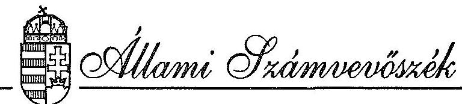
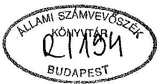
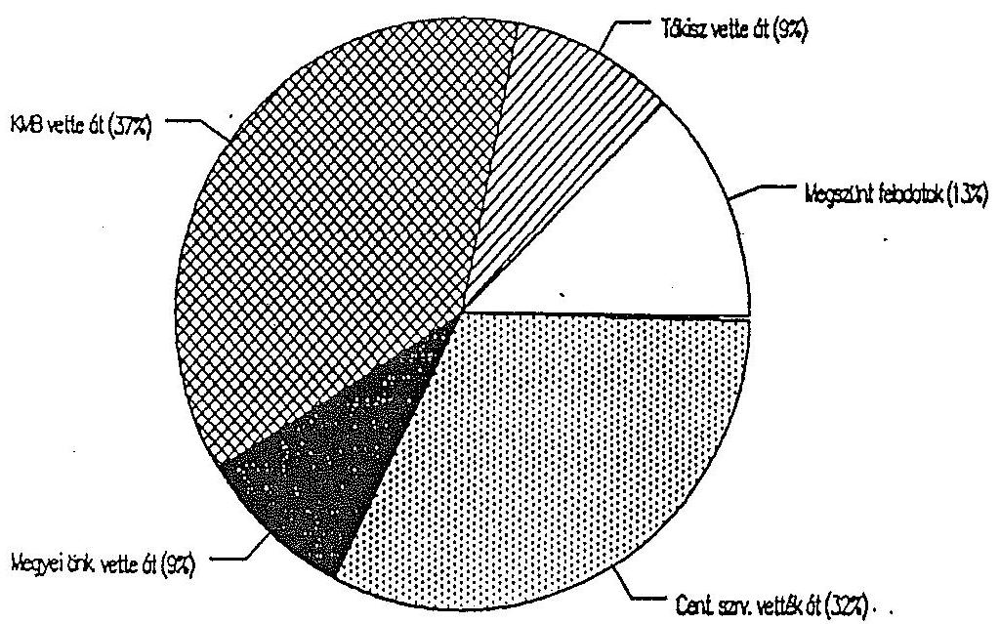
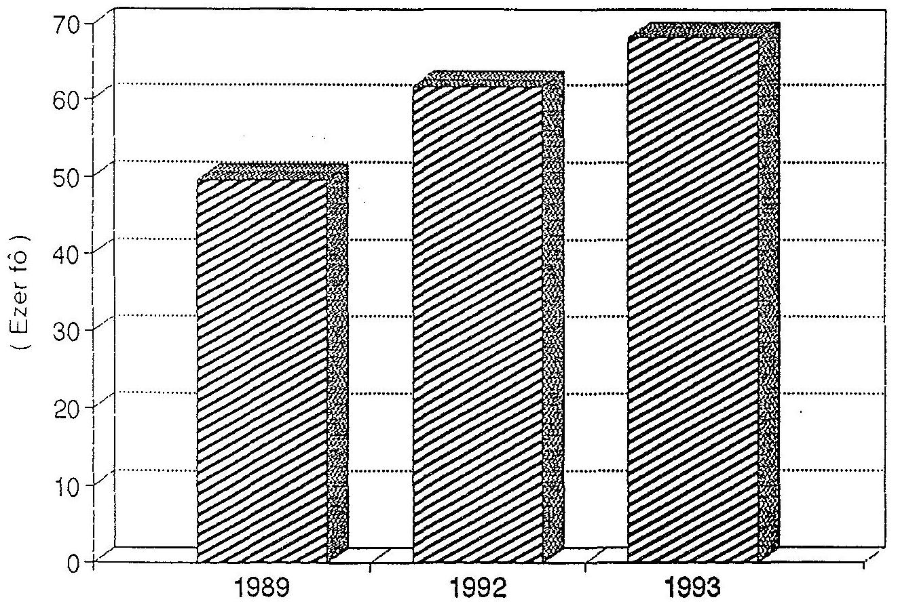
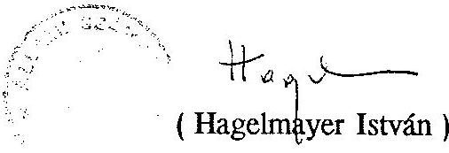
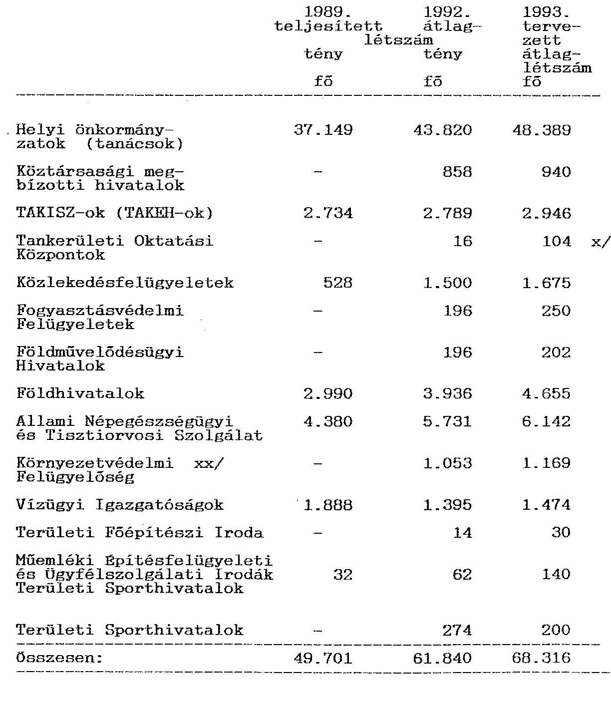

#  

## JELENTÉS

a helyi és területi államigazgatási szervek
létszám- és bérgazdálkodásának ellenőrzéséről

---

# JELENTÉS 

## a helyi és területi államigazgatási szervek létszám- és bérgazdálkodásának ellenőrzéséről

1990-ben a korábbiaktól lényegesen eltérő helyi és területi közigazgatási szervezet jött létre. A települési önkormányzati rendszer sajátossága, hogy a helyi döntéshozók számára jelentős cselekvési szabadságot biztosít.
A hierarchikus irányítási eszközök helyébe a normák útján történő irányítás lépett, a költségvetés kiadási szabályozását a bevételi forrásszabályozás váltotta fel.

Az 1990. évi választásokat megelőzően a tanácsrendszerben a községek közel kétharmada tartozott közös tanácsba, ami közös testületet és hivatalt jelentett.
1991. január 1-jén 529 körjegyzőségbe tartozott 1526 települési önkormányzat. Jelenleg a települések közel felében önálló polgármesteri hivatal működik. A másik fele társult igazgatási szervezettel oldja meg az igazgatási és gazdasági feladatát.

A települések kiválási folyamata nem tekinthető előnyösnek sem az igazgatási munka szakszerűsége, sem a hatásköri decentralizáció szempontjából. A települési önkormányzatok önállósodási törekvései elaprózott, hatékonyan nem működtethető ellátási rendszereket eredményeznek.

Az önálló hivatalok - még szakképzett jegyző esetén sem - képesek az első fokú hatáskörök jó részét szakszerűen gyakorolni.

Az önállósági törekvéseket valamelyest táplálja a jelenlegi finanszírozási rendszer is. Kezdetben ösztönzően hatott, hogy a körjegyző bérét az állami költségvetés finanszírozta. Az önálló kisközségeknek járó általános települési normatíva (2 millió Ft településenként) azonban erőteljesebb késztetést jelentett a kiválásra.

---

A települési önkormányzati rendszer bevezetése és a középirányítói szint megszüntetése szükségszerűen azzal járt, hogy az állam, ahol nélkülözhetetlennek tartja az adott feladat végrehajtásának egységes és központilag ellenőrizhető megszervezését, s ahol ki szeretné zárni a helyi érdekek befolyását, a regionális és a nagyobb térségi feladatok megoldására külön, vertikálisan megszervezett ún. centrális alárendeltségű szervezeteket hozott létre. E lehetőséget az Alkotmány a 40. szakasz (3) bekezdésében a következőképpen fogalmazza meg:
"A Kormány jogosult az államigazgatás bármely ágát közvetlenül felügyelete alá vonni, és erre külön szervezetet létesíteni".

Az egyszintű önkormányzati igazgatási, valamint a centrálisan alárendelt területi közigazgatási rendszer kialakulása indokolta az ellenőrzés céljaként megfogalmazni

- struktúraváltozásnak a létszámszükségletre és a feladatellátásra gyakorolt hatását, továbbá azt, hogy
- a helyi önkormányzatoknak miként sikerült a megnövekedett feladatokhoz szükséges személyi feltételeket biztosítaniuk.

Ennek alapján a vizsgálat annak megállapítására irányult, hogy

- a helyi és területi államigazgatási szervek struktúrája, szervezeti rendje és személyi feltételei az ellátandó feladatokhoz igazodtak-e;
- az igazgatási feladatok ellátásában tapasztalható-e hiány, vagy indokolatlan párhuzamosság;
- a helyi önkormányzatok hivatalainál a megnövekedett hatáskörök gyakorlásának személyi feltételei miképpen biztosítottak;
- a vizsgált szervek a bér- és munkaerő-gazdálkodásra vonatkozó szabályokat betartják-e, illetve milyen intézkedéseket tettek a köztisztviselői törvény helyi végrehajtására.

A vizsgálatot törvényességi, eredményességi szempontok alapján végeztük. Az ellenőrzés kiterjedt a 2. sz. mellékletben foglalt önkormányzatokra és centrálisan alárendelt államigazgatási szervekre.

---

# A vizsgálat megállapításai 

## 1. A szervezeti keret, a feladat és a létszám összhangja

Az önkormányzati rendszerre való áttéréssel a helyi és területi közigazgatás szervezeti rendszere alapvetően megváltozott. Az állami feladatok jelentős részét az önkormányzatok vették át. A volt megyei tanácsi feladatok többségét részben a korábban is működő, részben az újonnan alakult centrális alárendeltségű államigazgatási szervek vették át.

A változás lényeges eleme a Köztársasági Megbízotti Hivatalok (KMBH) megalakulása. A hivatalok ellátják a helyi önkormányzatok törvényességi felügyeletét, ellenőrzését, valamint a másodfokú hatósági feladatok túlnyomó részét.
A KMBH-ok a megalakulásuk után, újonnan kapott feladatként közreműködnek az államigazgatási szervek továbbfejlesztésében és a hatósági tevékenység korszerűsítésében. Foglalkoznak a közigazgatási szakemberek képzésével és továbbképzésével, a település- és területfejlesztéssel kapcsolatos koordinációs feladatokkal, katasztrófa- és kárelhárítási tevékenység koordinálásával stb.

A Területi Államháztartási és Közigazgatási Információs Szolgálat (TÁKISZ)-ok a Kormány 19/1991. (I.29.) rendelete alapján jöttek létre a korábban működő tanácsi költségelszámoló hivatalok átszervezésével. A TÁKISZ-ok átvették a jogelőd szervezetek hagyományos illetményszámfejtési feladatait, valamint a költségvetési szervek könyvviteli adatainak számítógépes feldolgozását, továbbá új feladatként ellátják az önkormányzati költségvetések tervezési és zárszámadási anyagainak számszaki felülvizsgálatát, feldolgozásának előkészítését. Közreműködnek a cél- és címzett támogatások igénylésével kapcsolatos előkészítő feladatokban, a normatív támogatások elszámolásában stb.

Számítások szerint a volt megyei, fővárosi tanácsi feladatok döntő hányadát a centrálisan alárendelt szervezetek vették át, a feladatok egy része a rendszerváltozás következtében megszűnt. Időközben új feladatokat telepítettek a települési önkormányzatokhoz, illetve a centrálisan alárendelt szervezetekhez.

A volt megyei tanácsi - ügykörfajtákban kifejezett - feladatai átrendeződésének arányait a következő ábra mutatja:

---

# A volt megyei tanácsi feladatok átrendeződése 

---

Az újonnan létrehozott hivatalok tovább növelték a központi alárendeltségű területi államigazgatási szervek számát. Egy minisztérium több centrális alárendeltségű szervezettel is rendelkezik (FM, BM, KHVM, KTM, stb.).

A területi közigazgatás ilyen nagymérvű tagoltsága mellett, gyakori az olyan feladat- és hatáskör-telepítés, mely megnehezíti az egységes joggyakorlat kialakulását, esetenként többlet-adminisztrációt, költségnövekedést eredményez, vagy gátolja az ügyfelek eligazodását.
Kialakult az osztott hatáskörök rendszere, melyben bizonyos államigazgatási ügykörök megoszlanak az önkormányzatok és a centrális alárendeltségű szervek között. Gyakori ezért, hogy egy-egy ügycsoporthoz tartozó feladatokat több szervezet lát el, amely nehezíti az egységes jogalkalmazási gyakorlat kialakulását (például építésügy, környezetvédelem, oktatásügy, népjóléti igazgatás).

Nehezíti az állampolgárok és az önkormányzatok eligazodását, hogy az egyes centrális alárendeltségű szervezetek területi hatásköre lényegesen eltér egymástól. A szervezetek egy része megyei, míg másik részük regionális szinten szerveződött. A helyzetet tovább bonyolítja, hogy a regionálisan szerveződött centrálisan alárendelt szervezetek is eltérő megyéket, területeket fednek le. A kialakult helyzetet illusztrálja, hogy a Közlekedési, Hírközlési és Vízügyi Minisztériumnál például a területi államigazgatási feladatok ellátása 4 különböző dekoncentrált hatósági szervhez tartozik. A zalaegerszegi körzetben a közlekedési felügyeletet a zalaegerszegi, a postaigazgatást a pécsi, a frekvenciagazdálkodást a veszprémi és végül a vízügyi igazgatást a szombathelyi székhelyű minisztériumi irányítású szervezet látja el. (A négyből három regionális szintű feladatellátásra szerveződött, de még kivételesen sem azonos székhellyel). Ugyancsak eltérő a működési területük a regionálisan szerveződött Környezetvédelmi Felügyelőségeknek és a Főépítészeti Irodáknak. Ugyanakkor meg kell jegyezni, hogy a Megyei Közlekedési Felügyeletben belül a közúti, vasúti és a járműfelügyeleti osztálynak is van külön hatósági, illetve hatósági felügyeleti csoportja.
A szervezeti rendszer tagoltsága miatti koordináció szükségességét a Kormány is felismerte és a 77/1992.(IV.20.) Korm.sz. rendeletben a köztársasági megbízott feladatává tette. Tartalmi elemei viszont tisztázatlanok az eszközrendszer és a megfelelő módszer kialakulatlansága miatt. Az önkormányzatok és a centrális alárendeltségű szervek munkakapcsolatai többnyire esetiek, véletlenszerűek.

---

Ilyen körülmények között nem zárható ki a különböző területi államigazgatási szervek közötti párhuzamos feladatellátás, illetve a feladatellátás elmaradása.
Ez utóbbira legjobb és legáltalánosabb példa a területfejlesztési és a környezetvédelmi feladatok ellátásának területi koordinálatlansága, gazdátlansága. A katasztrófa esetén - különösen az árvízvédelem terén - nincs kellő biztosíték a korábbi évekhez hasonló, (tanácsok és vízügyi államigazgatási szervek között) jól bevált együttműködés megvalósításának, a hatékony kárelhárításnak.

Nincs olyan szervezet, amely az egyes megyékben, térségekben a címzett- és céltámogatással megvalósuló infrastruktúrális beruházásokat összehangolja. A térségi fejlesztési feladatok koordinálásában a megyei önkormányzatok szerepvállalása némileg javít a helyzeten, de azok is eseti jellegűek és jogilag nem szabályozottak.
Ugyanakkor részben párhuzamos feladatellátás tapasztalható a Pedagógiai Intézetek és a Regionálisan szerveződött Tankerületi Oktatási Központok között, miután nincs egyértelműen körülhatárolva ezen szervezetek feladatköre.
Továbbá a megyei főépítész és a Területi Főépítészi Iroda feladatellátásában is felfedezhető párhuzamosság.

Az önkormányzati rendszer bevezetésével a helyi közigazgatási struktúra is megváltozott. Az 1579 helyi tanács helyébe 3071 önkormányzat lépett. (Jelenleg 3149 önkormányzat működik.) A települési önkormányzatokkal egyidejűleg megalakultak a megyei önkormányzatok is, amelyeknek - a saját intézményeiket kivéve - irányítói feladatai nincsenek.

A települések közös feladatellátására kevés gyakorlati példa van. A körjegyzőség modellje lehetne az igazgatási tevékenység közös ellátásának, de itt fokozatos visszalépés érzékelhető. Szinte minden megyében megfigyelhető a megalakult közös hivatalok osztódása, felbomlása.

A körjegyzőségek felbomlásának kiváltó okaként, részben az előző években erőszakkal kialakított közös igazgatási forma ellentétes politikai reakciója jelölhető meg, továbbá indukálja a kiválást az is, hogy a kistelepülések teljeskörű esélyegyenlősége társulásos formában nem valósul meg.

---

Meg kell állapítani továbbá, hogy a szabályozás sem segíti az integrációs folyamatokat.
A társulás a támogatásokra nem pályázhat. Az önkormányzati törvény ugyan nevesíti a hatósági igazgatási, intézményirányító társulásokat, szabályozásuk azonban nem eléggé gyakorlati szempontú. Sok olyan nyitott kérdés van, ami miatt a települések idegenkednek a létrehozásuktól. (Például nem szabályozottak a fenntartási költségek megosztásának szempontjai.)

A polgármesteri hivatalok létszámszükségletét a tanácsi dolgozók számát alapulvéve határozták meg, bár a korábbi társközségek szétválása és önálló önkormányzatok létrejötte önmagában is a létszámszükséglet növekedése irányába hatott.
1989-ben a tanácsokban országosan 37.149 fő dolgozott, 1992-ben az önkormányzatoknál 43.820 főt foglalkoztattak (3. sz. melléklet).

A létszámnövekedés elsősorban az aprófalvas megyékben jelentkezett, döntő része az új hivatalok megalakulásával hozható összefüggésbe. A GAMESZ-ek tömeges megszüntetése és beolvasztása a hivatali szervezetbe ugyancsak hozzájárult az igazgatási létszám növekedéséhez. A létszámemelkedés és az infláció részbeni ellensúlyozása miatt a bérköltségek jelentős mértékben növekedtek (4. sz. melléklet).

Borsod-Abaúj-Zemplén megyében a helyi közigazgatásban dolgozók száma 52,3%-kal, Baranya megyében 40%-kal, Nógrádban 22%-kal haladta meg az 1988. évi szintet.

Az 1000 fő alatti településeken is gyakori az önálló hivatalok alakítása, holott az önkormányzati törvény ezeknél a körjegyzőségek létrehozását ajánlja.

Baranya megyében 14 településen is polgármesteri hivatalt hoztak létre, amelynek lélekszáma az 500 fót nem éri el.

Az aprófalvak által létrehozott Polgármesteri Hivatalokban a tapasztalatlanságon túl nagyobb gond, hogy jelentős anyagi erőforrásokat kötnek le a település költségvetéséből, szűkítve ezzel a kötelező feladatellátásra fordítható erőforrásokat.

---

A nógrád megyei Hont községben a költségvetési kiadások 16%-át, Szilaspogonyban az összes tervezett kiadás 19%-át az önálló hivatal megteremtése kötötte le, de helyenként ez az arány még nagyobb, Szabolcs-Szatmár-Bereg megyében Turricse községben az éves költségvetésük 23%-át fordították a hivatal működtetésére. Az összehasonlítás céljából megjegyzendő, hogy egy 20 ezer lakosú Nógrád megyei városnál ez az arány 6-8%-os.

A megyei önkormányzatok hivatalainak létszáma 50-70 fő között szóródik, az önkormányzatok összlétszámának 4,8%-a a megyei és a fővárosi önkormányzati hivatalokban dolgozik. A megyei önkormányzatok többségében a létrehozott hivatali álláshelyek számának közel 1/5-e vezetői státusz, és aránytalanul sok az ügykezelő. Főleg a hivatalok megalakulásakor nem egy megyében előfordult, hogy egy vezető 2-3 beosztottat irányított, illetőleg 1 ügykezelő 2-3 fő ügyintézőt szolgált ki.

A foglalkoztatott létszám arányait és a növekedés ütemét a következő ábra szemlélteti. (Számszaki alakulását a 3. számú melléklet tartalmazza.)

---

# Vizsgálatba bevont szervek létszámának alakulása 

---

# 2. A létszám és bérgazdálkodás irányítása, szabályozása 

Az önkormányzati területen a középirányítói szint kiiktatásával a bér- és a létszámgazdálkodás közvetlen felügyeleti jellegű szakmai irányítása megszűnt. Az önkormányzati testületekre van bízva, hogy a béremelést milyen színvonalon, milyen forrásból teremtik meg, a feladatokat milyen belső szervezeti keretek között és milyen nagyságú, szakmai összetételű létszámmal oldják meg. Az önkormányzatok mozgásterét az Államháztartási törvény és a költségvetési szervek gazdálkodását érintő
 egyéb jogszabályok befolyásolják, de itt is sokkal nagyobb önállóságot engedélyeznek az önkormányzatoknak, mint a központi költségvetési szerveknek.

A vizsgált időszakban, de napjainkban is, az önkormányzatok létszámnövelésének, a bérelőirányzatuk alakulásának semmiféle adminisztratív korlátja nincs, ezzel is magyarázható, hogy mind a létszámellátottságban, mind pedig az átlagbér színvonalában jelentős különbségek, szélsőségek tapasztalhatók.

A vizsgált centrális alárendeltségű szerveknél a felügyeleti irányításban két területen tapasztaltunk gondokat.
A köztársasági megbízotti hivatalok, mint önálló költségvetési szervek, a Belügyminisztériumi fejezethez tartoznak. Ennek ellenére a Belügyminisztériumnak a köztársasági megbízotti hivatalok gazdálkodási tevékenysége felügyeleti jellegű irányítására, beszámoltatására jogosítványa nincs. A hivatalok működési költségeit az állami költségvetés a BM fejezetben biztosítja, ugyanakkor a BM Szervezeti és Működési Szabályzatában nem szerepelnek.
E sajátos helyzetből adódóan a nyolc - azonos jogállású - köztársasági megbízotti hivatal gazdálkodásával kapcsolatos felügyeleti szervi tevékenység nem - a fejezethez tartozó - más címekhez hasonlóan működik. Ez is hozzájárult ahhoz, hogy a Baranya-Somogy-Tolna Megyei Köztársasági Megbízotti Hivatalban az ellenőrzés több szabálytalanságot tárt fel a bér- és létszámgazdálkodás, a pénzgazdálkodás, a számviteli és bizonylati rend területén.
Az Állami Népegészségügyi és Tisztiorvosi Szolgálat (továbbiakban ÁNTSZ-ek) irányítását a Népjóléti Minisztérium látja el részben közvetlenül, részben az Országos Népegészségügyi Központ útján (ONK). Így nemcsak a szakmai, hanem a pénzügyi-gazdasági irányításban is átfedések voltak tapasztalhatók. Esetenként az ONK olyan intézkedést adott ki a bér- és létszámgazdálkodás területén, amely már sértette az önálló bérgazdálkodói jogosítványokat. Például: évközben rendel-

---

kezett álláshelyek és költségvetési előirányzatok zárolásáról. Az ONK és az ÁNTSZ-ek a vizsgálat időszakában csak ideiglenes SZMSZ-szel rendelkeztek.

# 3. Létszámgazdálkodás 

## a/ Centrálisan alárendelt szerveknél

A vizsgált centrális alárendeltségű szerveknél 5,4 ezer fős létszámbővülést a közigazgatás átszervezése (új vagy újtípusú hivatalok létrehozása), továbbá az azt követő feladatnövekedések eredményezték (3. sz. melléklet).

Ezen szervezetek megalakulását nem előzte meg a funkciók pontosításán alapuló, a feladatellátás feltételeit elemző, mérlegelő, létszám-szükséglet számítás. A bér és az ezzel kapcsolatos kiadások megtervezése az induláskori helyzet feltárása és rögzítése nélkül történt. A továbbiakban ez az "ingoványos" előzmény képezte az alapját a költségvetés kiadási szükségleteinek a megtervezéséhez.

A centrális alárendeltségű szervek felügyeletét ellátó minisztériumok az új munkaerők beállításához csak a többletfeladatok mértékéig biztosították a bérkeretet. Ilyen esetekben is elmaradt azonban a szervezet tényleges létszámhelyzetének a felülvizsgálata. A többletigényeket így olyankor is befogadta a központi költségvetés, amikor az adott szervezetnél számottevő volt a tartósan be nem töltött álláshelyek száma.

Az esetek többségében az ebből képződött átmeneti bérmegtakarítás nyújtott fedezetet a dolgozók jutalmazására, s gyakran a bérük emelésére is.

A vizsgált TÁKISZ-oknál és az ÁNTSZ-eknél az ellenőrzött időszakban mintegy 8-12%-os üres állás permanensen volt tapasztalható.

Kedvezőnek értékelhető ugyanakkor, hogy az időközben bekövetkezett létszámmozgások általában minőségi cserét eredményeztek. Az egyes centrálisan alárendelt szerveknél eltérő mértékben, de érzékelhetően nőtt a felsőfokú végzettségű dolgozók aránya, így ezen szervezetek szakember ellátottsága meghaladja az önkormányzati igazgatásét. Például a KMB hivataloknál 80-90%-os, a TÁKISZ-oknál 20%-os, az ÁNTSZ-eknél 50-60%-os a felsőfokú végzettségű dolgozók aránya (8. sz. melléklet).

---

A földhivatalok létszáma a vizsgált időszakban érzékelhetően nőtt, az 1989. évi 2.990-ről 1992. évben 3.936 főre emelkedett, ennek ellenére a foglalkoztatott létszám és a hivatali feladatok közötti összhang hiánya a legerőteljesebben ezen a területen érzékelhető. E szervek részére a hagyományos alapfeladatokon túl a kárpótlás, az önkormányzati lakások értékesítése, továbbá a tulajdonviszonyok változása olyan nagytömegű munkát jelentett, amelyet a létszám bővítésével sem tudtak megnyugtatóan megoldani. A kampányfeladatok a hagyományos tevékenységekben jelentős határidőcsúszásokat eredményeztek. Valamennyi hivatalban számottevően emelkedett az elintézetlen ügyiratok - közöttük az olyan adás-vételi szerződések száma, melyek késleltették az államháztartási bevételek (illetékek) kivetését, beszedését. A legkedvezőtlenebb a helyzet a fővárosban, ahol a munkatorlódás lényegesen meghaladja az országos átlagot.

A Fővárosi és a Kerületi Földhivatalban 1992. évben az ügyiratoknak csak 38,6%-át intézték el határidőben, a felhalmozódott hátralék közel kétszerese (mintegy 120 ezer db) volt a beérkezett ügyiratoknak.
Pest megyében 1992-ben a 30 napon túl intézett ügyek aránya 20%, a 6 hónapon túl pedig 10% volt.
Zala megyében is hasonló a helyzet, 1993-ban az elintézetlen ügyiratok aránya elérte a 37%-ot.

A földhivatali ügyintézésben tapasztalható jelentős hátralékok okai - a már jelzett feladatnövekedés mellett - a számítástechnikai eszközök hiányával, a rossz elhelyezési körülményekkel, továbbá a rendkívül alacsony bérek miatti fluktuációval és szakember hiánnyal magyarázható. A rendszerváltozást követően, kezdetben kormányszinten sem fordítottak e területre kellő figyelmet és így a jelenlegi helyzet már esetenként a piacgazdálkodás kialakulásának, működésének a gátjává válhat. A kormányszintű intézkedések megtételére csak a legutóbbi időben került sor, de ennek hatása még alig érzékelhető.

# b/ Létszámgazdálkodás az önkormányzatoknál 

Az önkormányzatok megalakulásával a helyi és területi közigazgatás szervezeti keretei jelentősen megváltoztak. A feladat- és hatáskörmegosztás folyamatosan, több lépcsőben történt. A helyi önkormányzatokról szóló törvény, illetve hatásköri feladatokról intézkedő 1991. évi XX. tv. hatályba lépését követően a Kormány és egyéb központi államigazgatási szervek jelentős számú hatáskört telepítettek az önkormányzatokhoz.

---

Például: a helyi közlekedési, a távfűtési díjak megállapítása, valamint a központi igazgatási feladatok kötelezettségeit ruházta át (pl. útlevélügyintézés, munkanélküliek segélyezése, kárpótlási ügyek koordinálására felállított bizottságok működtetése, stb.)

Mindez maga után vonta azt, hogy a közigazgatási szervek feladathoz igazodó létszámszükségletét előzetes normatívák figyelembevételével meghatározni nem lehetett.

Megalakulásuk óta központi jogszabályok alapján az önkormányzatok több esetben kaptak feladatot, ezen rendelkezések a végrehajtáshoz szükséges bérfedezetet nem biztosították. A vizsgált egységek differenciált pénzügyi feltételeik függvényében különbözőképpen oldották meg az időközben jelentkező feladatokat.

A városok a legtöbb esetben a növekvő feladatokhoz igazították létszámaikat (Tatabánya, Salgótarján).

Az engedélyezett létszámkeret betöltése általában mindenhol megtörtént. Nagyon kevés helyen és ott is csak átmeneti ideig tapasztalt a vizsgálat üres álláshelyeket.

A Fővárosi Önkormányzatnál a vezetés folyamatosan napirenden tartotta a hivatali szervezet és a létszám vizsgálatát. A főjegyzői munkacsoport megállapítása, hogy a főpolgármesteri hivatal létszáma a folyamatosan végrehajtott többszöri áttekintés ellenére is túlméretezett. A Munkabizottság megítélése szerint a 25 ügyosztály létrehozása önmagában is relatív létszámnövekedést indukál, az irányítási lépcsők száma magas, egyes vezetőkre jutó beosztottak száma 2 főtől 12 főig terjed. Az egyes ügyosztályok párhuzamos feladatot látnak el, a rendezési terv előkészítésében és végrehajtásában, a világörökség részévé nyilvánított terület városrendezésével kapcsolatban.

A racionálisabb munkaerőgazdálkodás megvalósítását, és annak mérhetőségét nehezíti, hogy nem alakult ki egy olyan módszer, mely objektíven segítené a hivatali feladatok létszámszükségletének tervezését, mérését. Az ennek hiányában alkalmazott "ráépítéses" módszer pedig csak konzerválja a meglévő aránytalanságokat, s gyakran többletfoglalkoztatást eredményez.

A munkaerőellátottság és a szükséglet összhangjának megítéléséhez támpontul szolgálhatnak a feladatokat részletező ügyrendek és munkaköri leírások. Ezek kimunkálására, a teljesítmény követelmények megfogalmazására, s főként a

---

naprakészségük biztosítására azonban a munkáltatók az esetek többségében nem fordítottak kellő figyelmet.
A kidolgozott munkaköri leírások jórészt általánosak, az ellátandó feladatokat nem megfelelő részletezettséggel tartalmazták, teljesítmény követelményeket nem fogalmaztak meg.

A feladatok és a létszám közötti aránytalanságok kimutatására nincs egzakt mutató. Azonos gazdasági, demográfiai körülmények, a hasonló nagyságrendű, infrastruktúrájú, népességű településeken azonban az igazgatási létszám lényeges különbözőségei nem indokolhatóak.

Szinte valamennyi megyében van példa arra, hogy hasonló lélekszámú községekben, városokban a hivatal létszáma markáns differenciákat mutat.

Például az egyformán 17 ezer lakosú Püspökladány és Berettyóújfalu hivatalaiban foglalkoztatott munkaerő száma közel 40%-kal tér el. Az előzőben 45 fő, az utóbbi városban 72 fő. Szintén Hajdú-Bihar megyében az 1957 fő lakosú Hajdúbagos Polgármesteri Hivatal létszáma 19 fő, ezzel szemben a 2.854 fős Görbeházán csupán 10 fő.

Záhony állandó lakossága 5000 fő, az 1000 lakosra jutó hivatali létszáma 4,8 fő, Rakamaz Nagyközség állandó népessége 5500 fő, fajlagos mutatója 2,4 fő.

Csopakon 8,6 fő (népessége 1503 fő) az ezer lakosra jutó köztisztviselők száma, míg Szentgálon (2719 fő) ez az arány 3,3.

Az ezer lakosra jutó igazgatási létszám Hont esetében mindössze 1,5 fő, a hasonló lélekszámú Szilaspogonynál pedig 8,9.

A mutatók összehasonlítását természetesen bizonyos fenntartásokkal kell kezelni, mert eltérő a települések ellátó-hálózata, infrastruktúrája. A városokban a szervezeti megoldásokban lévő különbözőségek befolyásolják a hivatali létszámszükségletet. Több városban a hivatalon kívüli szervezet látja el az önkormányzati vagyonkezelési, a gondnoksági és a közterületfelügyeleti feladatokat.

A kistelepülések létszáma a feladatellátásban még azokban az esetekben is gondot okoz, ahol megfelelő nagyságú hivatalt hoztak létre, mivel a sokirányú teendők speciális ismereteket igényelnek.

Az aprófalvak nem jelentenek vonzerőt a képzett szakembereknek. A korábbiakhoz képest bonyolultabb, nagyobb felelősséget igénylő, összetettebb önkor-

---

mányzati munka személyi feltételei emiatt rövid időn belül megoldhatatlannak tűnnek.
Az iskolai végzettség, a szakképzettség, a gyakorlottság azonban még a létszám nagyságánál is determinálóbb a végzett munkában.

Az ellenőrzés tapasztalata szerint éppen a községi, különösen a kisközségi hivatalokban van e téren a legtöbb hiányosság. Az ügyintézők többsége általában középfokú végzettségű, rutinból dolgozó, újszerű ismeretekkel nem rendelkezik.

Borsod-Abaúj-Zemplén megyében a községi hivatalok dolgozóinak 90,8%-a középfokú, 6,8%-a felsőfokú, 2,4%-a alapfokú végzettségű.

A nagyközségekben valamivel kedvezőbb a kép, de még itt sem megnyugtató a diplomás munkavállalók aránya, kb. (15%).
A városokban általában az ügyintézők 30-40%-a felsőfokú végzettségű, de viszonylag nagy eltérések észlelhetők.

Tatabánya Megyei Jogú Város Polgármesteri Hivatala személyi állományának csak 20%-a felsőfokú végzettségű, Kisbér városban mindössze 16%.

A legkedvezőbb helyzet a megyei közgyűlések hivatalaiban. Ebben a körben dolgozó érdemi ügyintézők közül szinte kivétel nélkül egyetemet vagy főiskolát végeztek. Ugyanakkor ezen önkormányzatok feladat- és hatásköre lényegesen szűkreszabottabbak, mint pl. a megyeszékhely városoké.

# 4. Bérgazdálkodás 

a/ Centrálisan alárendelt szerveknél
A bázis szemléletű tervezés, a felügyeleti szervek hozzáállása és a pénzügyi irányítás eltérő színvonala következtében jelentős különbségek alakultak ki a területi szervek bérellátottságában, s így a dolgozók jövedelmi helyzetében is.

A béralap tervezése és megállapítása változatlanul bázisszemléletben, ráépítéssel történik. A módszer különösen azért okozott indokolatlan aránytalanságokat, mert a felügyeleti szervek részéről nem fogalmazódott meg a béralap belső összetétele megismerésének az igénye. A köztisztviselői törvényben rögzített bérrendszer elemzése elmaradt annak ellenére, hogy az 1993. évi tervek összeállításához az megfelelő kiindulási alapot adhatott volna.

---

A Belügyminisztérium fejezethez tartozó KMB hivatalok 1992. évben kormányhatározat alapján 142,3 millió, a TÁKISZ-ok az 1993. évi pótköltségvetésben 193,8 millió Ft többlet béralapot kaptak. Különösen az előbbi bérintézkedés a dolgozók jövedelmének jelentős mértékű növelését tette lehetővé.

A Hajdú-Bihar és Szabolcs-Szatmár-Bereg Megyei KMB Hivatal 1992. évben kormányhatározat alapján 12,5 millió Ft többlet béralapot kapott, amely a saját hatáskörű előirányzat módosítással együtt a dolgozók bérének 30%-os emelésére nyújtott fedezetet. Az éves szinten kifizetett jutalom összege pedig meghaladta az 5 havi átlagbért.

A jövedelemszint szóródását eredményezi az is, hogy a felügyeleti szervek eltérő módszert követnek az évközi fejlesztések finanszírozásában. A KMB Hivatalok a megalakuláskor, a teljes évi bérszükségletet megtervezhették,
 annak ellenére, hogy a létszámot évközben csak folyamatosan tudták feltölteni. Az ebből származó jelentős "bérmegtakarítás" a hivataloknál maradt. A Népjóléti Minisztérium fejezethez tartozó Országos Népegészségügyi Központ viszont a hivatalai (ÁNTSZ-ek) részére csak a fejlesztés tényleges megvalósulásakor engedélyezi a tervezett bér felhasználását.

A Győri Régió Köztársasági Megbizott Hivatalaiban 1991. évben átlagosan 5,5 havi bérnek megfelelő jutalmat és havi $6.346 \mathrm{Ft} /$ fő határozott idejű béremelést tudtak adni a dolgozóknak, miközben a bérük jelentős mértékben meghaladta a közigazgatás más területén dolgozókét.

A Baranya-Somogy-Tolna megyei KMBH az 1991. évi bérmaradványából a több havi jutalmazás mellett a terven felüli beszerzéseket, felújításokat is finanszirozott.

Gyakran a saját bevételek szándékos alultervezésével jutottak egyes hivatalok olyan többlethez, melyből a béralapot évközben saját hatáskörben megemelhették.

A Csongrád Megyei TÁKISZ 1992. évben 15 millió Ft saját bevételt irányzott elő, a tényleges összeg megközelítette az 53 millió Ft-ot.

A Pest Megyei TÁKISZ többletbevételből saját hatáskörben 1992. évben több, mint 13 millió Ft-tal ( $18,7 \%$-kal), 1993. évben 24 millió Ft-tal ( $29,1 \%$ ) növelte béralapját.

A többletbevételek egy része vállalkozási tevékenységből származott, külön gondot okozott, hogy e tevékenység köre egyértelműen nem volt meghatározva. Az 1992. évi költségvetési törvény az alapító okiratok - ilyen szempontból történő -

---

felülvizsgálatát elrendelte. A felügyeleti szervek azonban e kötelezettségüknek nem tettek eleget.

A belügyminiszternek a 9/1992. BM utasítás 15. pontja felhatalmazta a hatáskörébe tartozó költségvetési szerveket, hogy a kamatbevétel 1%-ából jutalomalapot képezzenek. E lehetőséggel élve a Hajdú-Bihar és Szabolcs-Szatmár-Bereg Megyei KMB Hivatal 730 eFt-tal megemelte az 1992. évi béralapját.

Ez a gyakorlat ellentétes az időközben megjelent 137/1993. (X. 12.) Kormányrendeletben foglaltakkal, így a Belügyminisztérium a vizsgálat alapján intézkedést tett a 9/1992. BM utasítás 15. pontjának a hatályon kívül helyezésére.

Az államigazgatás területi szerveinél dolgozók besorolási bérében és jövedelmében szakmai szempontokkal nem indokolható különbségek vannak. Az átlagost lényegesen meghaladó a közlekedési felügyeletek, fogyasztóvédelmi felügyelőségek, KMB hivatalok besorolási bérei, s indokolatlanul alacsony az ÁNTSZ-eknél, földhivataloknál, továbbá a - jelentős mértékű felzárkóztatás ellenére - TÁKISZoknál (5. sz. melléklet).

Jász-Nagykun-Szolnok megyében az ÁNTSZ 102 fő felsőfokú iskolai végzettségű dolgozójának a besorolás szerinti átlagbére $23.340,-$ Ft, míg a Közlekedési Felügyeletnél a hasonló végzettségű dolgozók (10 fő) havi 42.280 Ft-ot kerestek.

A Békés megyei Közlekedési Felügyelet dolgozói a köztisztviselői törvény szerinti illetménynek 93%-át, míg ugyanitt a TÁKISZ dolgozók csak 64%-át kapják havonta.

A költségvetési kondíciók eltérő meghatározása következtében jelentős szóródás tapasztalható a béren kívüli juttatások terén is. Az ezek körét meghatározó kormányrendelet ugyanis a hivatalvezetőket hatalmazza fel a mértékek megállapítására. Az ilyen kifizetések a köztisztviselők jövedelmét lényegesen befolyásolják.

A hivatalok egy részénél a felső határként megjelölt mértékű ruházati költségtérítést, étkezést, esetenként üdülési hozzájárulást fizetnek. A fogyasztóvédelmi felügyelőségeknél, ÁNTSZ-eknél ugyanakkor a dolgozók ilyen juttatásban nem részesülnek.

---

# b/ A helyi önkormányzatok bérgazdálkodása 

A béralap tervezésének módjára kötelező szabályok nincsenek. Ennek következtében a bérezés alapelveiben, gyakorlatában indokolatlan különbségek tapasztalhatók.

Kezdetben az önkormányzatok többségénél az induló béreknél és a béralapnál a tanácsi rendszerből örökölt bázisszemléletű tervezés volt a jellemző.
Béralapjukat a bázis évi eredeti előirányzatból kiindulva, a szerkezeti változás, a szintrehozás és a tárgyévi bérfejlesztés figyelembevételével tervezték meg. Az induló létszám meghatározása sok esetben eltért a tanácsi hivatali létszámtól, így előfordult, hogy a testület által meghatározott béralap és létszám nem volt összhangban.

Salgótarján város képviselőtestülete a bázisalapú ráépítéses módszerrel meghatározott bérelőirányzata 2,9 millió Ft-tal meghaladta a létszám alapján figyelembe vehető bruttó bérszükségletét. Az említett összeg a szabad rendelkezésű bértartalékként funkcionált.

Egyes önkormányzatok az 1991. évi igazgatási bérelőirányzat számításánál sajátos módszert alkalmaztak.
A bérigény centruma egy fiktív átlagbérszint, amely az esetek többségében úgy lett meghatározva, hogy az a mai napig jó alapot ad a személyi állomány anyagi elismerésére.

Például Győr-Moson-Sopron megyében a megyei önkormányzatnál az induló béreket úgy alakították ki, hogy az érdemi ügyintézőknél az akkor ismert csoportvezetői, az adminisztrátoroknál a főelőadói illetményalapot határozták meg.

1992-től már a bérszükségletből kiinduló tervezési módszer volt az elterjedtebb. Ez a megoldás közelebb áll a jelenlegi finanszírozási formához, de gyakori tapasztalat, hogy itt sem volt szoros kapcsolat az ellátandó feladat és azok bérvonzata között. A meglévő létszám és az ellátandó feladat gyakran nem volt összhangban (üres állások, többletlétszámok miatt), mivel a béralapot az előzőekből vezették le. A testületek az eltéréseket esetenként csak az év végén érzékelték.

A testületi döntések meghatározó szerepe általában érvényesült, de gyakori tapasztalat az is, hogy a béralap összetevőiről nincs tudomásuk.

---

Tiszacsegén 1992-ben a testület által meghatározott összegnél 170.000,- Ft-tal több béralappal gazdálkodtak, valamint engedély nélkül további 500.000,- Ft-tal növelték a jutalomkeretet.

Békéscsaba Megyei Jogú Városban és a Nógrád Megyei Önkormányzatnál a testületnek egész évben nem volt információja az igazgatási bér előirányzatának az alakulásáról.

A kisebb települések önkormányzatai a hivatali dolgozóinak a közalkalmazottakhoz hasonló bérfejlesztést engedélyeztek a testületek azzal a szándékkal, hogy a köztisztviselők ne kapjanak nagyobb bért, mint a településen foglalkoztatott közalkalmazottak.
A nagyobb egységeknél (főleg a városok és a megye) a bérfejlesztés és a bérszint meghatározásánál - figyelmen kívül hagyva az eltérő feladatrendszert - a központi államigazgatási szervek bérfejlesztését vették alapul.

Az előirányzatok gyakori módosítása is az utóbb említett szerveknél jellemzőbb.

A megyei közgyűlések hivatalainál 1991-ben és 1992-ben rendkívül gyakran, 5-8 alkalommal került sor bérelőirányzat módosításra (pl. Békés, Veszprém, Nógrád).

A bérelőirányzat tervezésének és az évközi előirányzat módosításának a megalapozottságát esetenként megkérdőjelezte a nagyarányú bérmaradvány és a korrekt információkat nélkülöző előterjesztés.

Békés megyei Önkormányzat 1991. évi bérmaradványa 1/4 részét teszi ki az éves felhasználásnak.

A Hajdú-Bihar megyei Önkormányzat közgyűlésétől az előterjesztő 1992-ben - a köztisztviselői törvény többlet-bérszükségletére hivatkozással - a béralap 2.394 eFt-os megemelését kérte, melyből 908 eFt-ot később a 14. havi bér kifizetésére használtak fel.

# 5. A köztisztviselői törvény végrehajtásának tapasztalatai 

A köztisztviselők jogállásáról szóló 1992. évi XXIII. tv. (továbbiakban: Ktv.) hatálya az önkormányzatokra is kiterjed, az abban foglalt illetmény-rendszertől a Ktv. 42. §. (3) pont szerint a Ktv-ben meghatározott elvek és arányok betartásával eltérhetnek.

---

A vizsgált önkormányzatok többsége az illetményrendszertől való eltérés lehetőségét tágan értelmezte. Úgy vélték, hogy a törvényi felhatalmazásukba beletartozik az is, ha nemcsak az illetményalaptól, a szorzókulcsoktól térnek el, hanem bevezetik az illetménykiegészítés és a vezetői illetménypótlékok jogintézményét is.

A Belügyminisztérium Közigazgatásfejlesztési Főosztálya - látva e törvény alkalmazásában a bizonytalanságot - a 21-165/1993. számú leiratában - ami az Önkormányzati Tájékoztatóban is megjelent - a Ktv. 42. §. (3) bekezdésében foglaltak gyakorlati végrehajtására törvényértelmezési magyarázatot adott ki, amelyben többek között a következőket mondta ki: ...
"Az önkormányzat képviselő testülete az alábbiak szabályozására jogosult:
— Eltérhet a törvényben megállapított illetményalap összegétől, ezen túlmenően rendeletalkotási joga kiterjed az egyes fizetési fokozatokhoz tartozó szorzószámok egységes megváltoztatására (emelés, csökkentés), valamint jogosult a Ktv. 45. §-ában foglalt vezetői illetmények szorzószámainak emelésére vagy csökkentésére is. E változások azonban nem bonthatják meg a Ktv. szerinti illetményarányokat. Ennek értelmében a Ktv-ben meghatározott szorzószámok közötti arányoktól nem térhet el.
— A különböző pótlékok százalékszáma csak akkor növelhető, ha ezzel együtt az illetményrendszer szorzószámainak arányos növelésére is sor kerül.

A fentiek figyelembevételével tehát az önkormányzat képviselő-testülete vezetői pótlékot nem állapíthat meg a jegyző, főosztályvezető, főosztályvezető-helyettes, osztályvezető számára, mivel a Ktv. 46. §-a értelmében csak az ott felsorolt vezetők jogosultak e pótlékra.

Illetménykiegészítést megyei önkormányzat szintén nem állapíthat meg, mert ez a díjazási forma, mint a Ktv. illetményrendszerének egyik intézménye, az állami közigazgatási szintek közötti különbségtételt fejezi ki.

Közigazgatási szintekről a közigazgatási szervek egymáshoz mért, alá- és fölérendeltséget tükröző helyzetéről csak az állami szervek körében beszélhetünk, ezért az illetménykiegészítés megállapítása az önkormányzati hivatalok esetében fogalmilag kizárt."

---

A vizsgálat tapasztalata szerint a félreérthető törvényi szabályozás, valamint egyéb szubjektív okok miatt az illetményrendszer kialakításánál a következők összegezhetők:

A Ktv. lehetőséget adott az önkormányzatoknak, hogy az illetményalap rögzített összegétől bármilyen irányban eltérjenek.
Ezzel a lehetőséggel rendkívül kevés esetben éltek.

Romhány nagyközségben (Nógrád megye) az ezévi illetményalap 15.000, Adonyban 14.000, Móron 13.000, Baranya megyében 20 községben 9-18.000 Ft között állapították meg az illetményalapot.

A megyei önkormányzatok saját szerepkörük hangsúlyozása érdekében - a Ktv. 44. §-ában foglaltak ellenére - szinte minden esetben 10% illetménykiegészítést állapítottak meg.
(Békés, Szabolcs-Szatmár-Bereg, Győr-Moson-Sopron megyék, stb.)

- Hasonló nagyságú illetménykiegészítést állapítottak meg a vizsgált körben Győr, Pécs, Nyíregyháza Megyei Jogú Városok, Csopak önkormányzata is.
- Békés megyében több helyen csak a vezetők részére adtak illetménykiegészítést (Megyei Önkormányzat, Békéscsaba, Gyula, Orosháza).
- Az arányok megsértésével nagyobb kulcsokat alkalmaztak Hajdú-Bihar, Borsod-Abaúj-Zemplén, Békés megyei önkormányzatoknál a jegyző, az osztályvezetők részére. Putnok városnál a jegyzőnél 5-szörös, az osztályvezetőknél 4,5-szeres a szorzó.
- Vezetői illetménypótlékot tartalmaz a helyi rendelet Fejér, Baranya, Szabolcs-Szatmár-Bereg megye, a Főváros Polgármesteri Hivatala, Székesfehérvár, Nyíregyháza, Komló, Szigetvár, Pápa, Püspökladány, Polgár, Nagykálló, Gödöllő, Aszód város esetében.
- A pótlékok mértéke az alapilletmény 10%-ától az illetményalap 210%-ig terjedt. Ez különösen magas Nyíregyháza Megyei Jogú Városnál, ahol a jegyző 210, az osztályvezető 110, a Ferencvárosi Polgármesteri Hivatalnál a jegyző 150, az irodavezetők 120%-ra tarthatnak igényt.

---

Nyíregyháza városnál köztisztviselői pótlékot határoztak meg az irodavezető-helyettesek, a csoportvezetők, a főmunkatársak, a referensek részére, mértékük az illetményalap 65-80%-ig terjed.
A Ferencvárosi Önkormányzat a vezetők részére a testületi munkáért további $6.000 \mathrm{Ft} /$ hó testületi pótlékot szavazott meg.

A köztisztviselői törvény illetményrendszerétől eltérő módon megállapított megyei önkormányzati főjegyző havi illetménye 62.000 és $125.000 \mathrm{Ft} /$ hó között változik (7. sz. melléklet).

A törvény előírásaival ellentétes gyakorlatot a vizsgált körben feltártuk, javasoltuk az önkormányzatoknak a törvényes állapotok helyreállítását.
A szükséges intézkedések megtétele megkezdődött, a vizsgálat önkormányzatoknál történő realizálását nehezíti, hogy a törvényességi felügyeletet ellátó köztársasági megbízotti hivatalok az illetményrendszerre vonatkozó önkormányzati rendeletek egy részére észrevételt nem tettek. Az önkormányzatoktól eddig beérkezett realizáló válaszlevelek kisebb hányada nem megfelelő, mivel a törvényesség helyreállítására az intézkedéseket nem vagy csak részben tették meg.

A Kormány 170/1992. (XII.22.) számú rendeletében szabályozta az egyéb juttatásokat. A rendelet csak a jubileumi jutalom és a napidíj tekintetében tartalmaz kötelező előírásokat az önkormányzatok számára.
Ennek ellenére néhány település rendelete ezeken a területeken is szabályellenes előírásokat tartalmazott.

A jubileumi jutalom kifizetésének feltételei nem a törvényi szabályozásnak megfelelőek: a Békés Megyei, a Komárom-Esztergom Megyei Önkormányzatoknál, Békéscsaba, Szada (Pest megye) Csopak, Magyarpolány Önkormányzatok (Veszprém megye) rendeletében.

Az önkormányzatok rendkívül sokféle és eltérő nagyságú egyéb juttatásokat adnak. A nagyfokú eltérések mellett általános tapasztalat, hogy a megyei önkormányzatok kiemelkedő összegű térítést állapítottak meg a ruházati, étkezési hozzájárulásban, amire a törvényes rendelkezések lehetőséget adnak.

A megyei közgyűlési vezetők részére általában költségtérítések elszámolását is engedélyezték a testületek, holott itt zömében személyi használatú és egyéb
 hivatali gépkocsik is rendelkezésre álltak.

---

Hajdú-Bihar megyében a főjegyző alapilletményének 50, az irodavezető 25, helyetteseik 15%-át kapják költségtérítésként.

Baranya megyében a közgyűlés hivatalánál a vezetőknek meghatározott 15-30%-os mérték mellett valamennyi köztisztviselő részére megállapítottak 10% költségtérítést.

Veszprém megyében is általános a vezetői költségtérítés gyakorlata.
A községi önkormányzatok az étkezési hozzájáruláson kívül, többségében ruházati, esetenként utazási költségtérítést rögzítettek a rendeleteikben.

Nyergesújfaluban (Komárom-Esztergom megye) az általános 15-27 eFt ruházati költségtérítés helyett 1 havi bruttó munkabérnek megfelelő összeget fizetnek a köztisztviselőnek.
Alcsútdobozon (Fejér megye) ugyanakkor étkezési hozzájárulást sem fizetnek. Veszprém megyében előfordul 3.000 Ft/hó/fő összegű étkezési hozzájárulás is.

Sajátos jellegű juttatásokat tapasztalt a vizsgálat Veszprém megyében.
Magyarpolányban a 13. havi illetmény helyett közműépítésre vissza nem térítendő állami támogatást fizettek ki.

Csopakon az alapbér 50%-ig terjedő érdekeltségi kifizetésre ad lehetőséget a vállalkozási szabályzatuk.
1992-ben a két havi jutalom összegén felül átlagosan 70 eFt-ot térítettek a hivatal dolgozóinak.

A köztisztviselők alapbére és a bérbeállási szintje nagyarányú szóródást mutat, 53%-tól 120%-ig terjed. A megyei önkormányzatok köztisztviselői vannak a legkedvezőbb helyzetben, itt a bérbeállás 90% körül szóródik, Zala és Szabolcs-Szatmár-Bereg megyében 100% felett van. A városok és a községek zöme 60-75%-os sávban helyezkedik el.

Az egyes községek átlagbére között is igen nagy a különbség, ami az önkormányzat anyagi helyzetén kívül függ a képviselő-testület felfogásától is. Az azonos nagyságú községek jegyzői bérátlaga 20.000-63.000 Ft között váltakozott 1993-ban.

---

A köztisztviselői törvény illetményrendszerének tapasztalatai ráirányítják a figyelmet a szabályozásból eredő ellentmondásra, amelyek a következőkben összegezhetők:

- Az önkormányzatok a köztisztviselői illetményrendszertől eltérhetnek, ez a tág szabott mozgástér eredményezi azokat a feszültségeket és torzulásokat, amelyek a bérezési és egyéb juttatási területeken tapasztalhatók.
- A jegyzői feladatok között az illetményrendszer nem differenciál. A községi és városi jegyző, továbbá a körjegyző szorzószáma nem tér el egymástól, holott a feladat szinte össze sem hasonlítható egy 500 fős településen és egy 100.000 lakosú városban.
- Az önkormányzati vezetők többletterhét az illetmény- rendszer nem minden esetben ismeri el. A jegyző keresete csak kis mértékben haladja meg a főtanácsosokét, és azonos a felügyelete alá beosztott osztályvezetőkével. Ezek miatt tapasztalható, hogy az önkormányzatok a törvény szellemével össze nem egyeztethető kísérleteket tesznek a problémák feloldására.
- A hivatal vezetőinél megoszlik az alkalmazási jogosultság és a feladat ellátásának felelőssége a polgármester és a jegyző között, ami nehézkessé teheti, teszi a hivatal irányíthatóságát.

# 6. Következtetések, javaslatok 

A tanácsrendszer megszűnését követően a megalakuló új centrális és önkormányzati hivatalok feladatai, létszáma és bérellátottsága rendkívül nagy szóródást mutatnak. Az eltérésekhez a jogi szabályozatlanságon túl hozzájárult, hogy az esetek többségében az eltelt időszakban nem vizsgálták a feladat és a munkaerő összhangját. A helyi és területi államigazgatási szervek struktúrájának kialakítását torzította, hogy azt mindezideig nem alapozta meg szakmailag is kidolgozott közigazgatási koncepció.
A polgármesteri hivatalok önkormányzati és államigazgatási feladatainak egyértelmű elkülönítése nem történt meg, mivel hiányzik az állami és az önkormányzati feladatok egyértelmű elhatárolása is.

---

Az önkormányzati rendszert a település-nagyság megkötése nélküli polgármesteri hivatalalakítás szükségtelenül megdrágította. Az elaprózódás következtében működésében permanens gondot okoz a megfelelő szakemberek hiánya.
Ezzel párhuzamosan a dolgozók leterheltsége településszintenként differenciáltan változott. A köztisztviselők javadalmazása elsősorban a testületek hozzáállásának függvényében változott. A számottevő feladat és hatáskör nélküli megyei önkormányzatok a szerepkörük, létjogosultságuk hangsúlyozásaként helyenként indokolatlan bér- és bérjellegű kifizetéseket engedélyeztek.
A köztisztviselői törvény végrehajtására hozott önkormányzati rendeletek egy része jogszabályellenes. A törvényes állapot helyreállítására a Köztársasági Megbízotti Hivatalok területenként eltérő mértékben hívták fel a figyelmet.

# Az előzőek alapján a következőket javasoljuk: 

## 1. A Belügyminisztérium részére:

a.) A helyi és a területi közigazgatás túlzottan tagolt rendszerének kialakulása és a tevékenységük közötti koordináció hiánya miatt a racionális munkaerőgazdálkodás nem valósult meg. A közigazgatási rendszer továbbfejlesztése érdekében ezért az önkormányzati középszintű szakmai irányítás kialakításával összhangban indokolt lenne a centrális alárendeltségű szervezetek tevékenységének a felülvizsgálata. A közigazgatási rendszer továbbfejlesztése során célszerű megvizsgálni, hogy egyszerűbb szervezeti rendszerrel és a koordináció javításával miként lehetne a hatékonyabb feladatellátást megvalósítani.
b.) Az önkormányzatok kötelező és önként vállalt feladatainak ellátásában, valamint a hivatali szervezetek tekintetében az integrációs folyamatok létrejöttét célszerű lenne az önkormányzatok pénzügyi szabályozó rendszerével is ösztönözni. Az önkormányzatok költségvetési támogatását szabályozó rendszerébe indokolt lenne beépíteni olyan elemeket is, amelyek a kevésbé hatékonyan működő önálló polgármesteri hivatalok integrálódását, a társulásos feladatellátási formák előtérbe helyezését segítik elő.
c.) A köztársasági megbízottak hivatalainak fejezetszintű pénzügyi-gazdasági irányítása nem megoldott, a fennálló jogszabályok a fejezeti irányítást ugyanis nem rendezik. Célszerű lenne a köztársasági megbízottakról intézkedő törvénynek

---

olyan irányú felülvizsgálata, amely egyértelműen rendezné a fejezetnek - jelen esetben a Belügyminisztériumnak - a köztársasági megbízottak költségvetési gazdálkodásával kapcsolatos irányítói kötelezettségeit, hatáskörét és felelősségét.
d.) A köztisztviselői illetményrendszernek az önkormányzatoknál történő alkalmazása - részben a szabályozás félreérthetősége miatt -, részben pedig egyéb okok következtében - szélsőségeket takar. Szükséges ezért mérlegelni, hogy indokolt-e a fenti törvény 42. §-ának (3.) bekezdésében foglalt azon szabályok további fenntartása, mely szerint az önkormányzatok az illetményrendszertől eltérhetnek. Hasonlóképpen megfontolást igényel, hogy a jegyzők esetében alkalmazható illetményalap szorzókulcsa - a települések között lévő különbség miatt - megfelel-e a jegyzői feladatokkal szemben támasztott követelmény és felelősség súlya közötti differenciáltságnak.

# 2. Földművelésügyi Minisztérium részére: 

A földhivataloknál az ellátandó feladat és a rendelkezésre álló létszám közötti összhang hiányzik. Az ügyintézés területén tapasztalható jelentős elintézetlen hátralékos ügy nehezíti az ingatlanforgalmat, akadályozza a tulajdonváltozások nyilvántartását. A Földművelésügyi Minisztérium tekintse át, hogy a földhivatalok munkájának a megjavítása érdekében tett eddigi intézkedésektől megfelelő eredmények várhatók-e. Amennyiben szükséges, további programok kidolgozásával el kellene érni, hogy egy-két éven belül a hivatalok feladat-ellátásának a színvonala, az ügyintézés határideje a hatályos törvényekben foglaltaknak megfelelő legyen.

## 3. Népjóléti Minisztérium részére:

Az Állami Népegészségügyi és Tisztiorvosi Szolgálatok (ÁNTSZ-ek) szakmai felügyeletét a Népegészségügyi Központ látja el. A központ átszervezése, szervezeti rendjének a kialakulása, az SZMSZ-ének a jóváhagyása még a vizsgálat időpontjában sem történt meg. Ennek következtében az irányítói tevékenységének a formája és hatásköre nem tisztázott, tapasztalható a szakmai és a pénzügyi irányítás közötti koordináció és összhang hiánya, amely alapvetően kihat az ÁNTSZ-ek bér- és létszámgazdálkodására is.

---

A Népjóléti Minisztérium vizsgálja felül az ÁNTSZ-ek szakmai irányítását végző Népegészségügyi Központ működését, irányítói tevékenységét, szervezeti-működési szabályait. Az irányító szervezet működésének kereteit a szervezeti és működési szabályzatának a jóváhagyásával alakítsa ki. Meg kell szüntetni az ÁNTSZ-ek szakmai és a pénzügyi irányítása közötti átfedéseket.

# 4. Pénzügyminisztérium részére: 

A vizsgált szervezetek bérbeállási szintje a vizsgálat időpontjában meglehetősen nagy eltéréseket, és a Köztisztviselői törvény szerinti bérszínvonaltól nagyfokú elmaradást mutatott. A köztisztviselői illetményrendszer illetményalapjának az 1995. január 1-jei kötelező bevezetéséhez szükséges lenne felmérni a centrális alárendeltségű szerveknél az áttérés bérszükségletét annak érdekében, hogy a Pénzügyminisztérium az 1995. évi költségvetési tervezési folyamatba ezen feladat megoldását beépíthesse, kezelhesse.

## 5. Köztársasági Megbízottak részére:

A köztisztviselői törvény illetményrendszerével kapcsolatban az önkormányzatoknál jelentős számban tapasztalhatók törvénysértések. Ezért a köztársasági megbízottak az 1990. évi XC. tv. 8. §. (1) bekezdése alapján vizsgálják felül a törvény alkalmazását célzó önkormányzati rendeleteket és intézkedjenek a törvényes állapotok helyreállítására, a törvénysértő rendelkezések visszavonására.

Budapest, 1994. február hó
Melléklet: 8 db

---

# 1. sz. melléklet 

a V-13-113/1993-94. sz. jelentéshez

A vizsgálatot vezette:
Nagy József
A vizsgálat szervezésében és az összefoglaló készítésében
részt vett:
Bocsi Sándor
Kozák György
Dr. Szirota István
A helyszíni vizsgálatot végezte
Baranya megye:
Dr. Nagy Ágnes
Békés megye:
Kollár Lászlóné
Borsod-Abaúj-Zemplén megye:
Hegedűs György
Csongrád megye:
Dr. Klapcsik László
Fejér megye:
Horváth József
Győr-Moson-Sopron megye:
Vécsey László
Hajdú-Bihar megye:
Kozák György
Jász-Nagykun-Szolnok megye:
Csomán Mihály
Komárom-Esztergom megye:
Koltayné Szepesi Zsuzsanna
Nógrád megye:
Bocsi Sándor
Pest megye:
Benczik Lászlóné
Tímár József
Szabolcs-Szatmár-Bereg megye:
Kenéz Sándor
Veszprém megye:
Rénes Mária
Zala megye:
Budapest Főváros:
Angyalosi Dániel
Dr. Molnár Klára
Nagy Józsefné

---

2. sz. melléklet
a V-13-113/1993-94. sz. jelentéshez

A vizsgált szervezetek köre
a/ Helyi önkormányzatok

- Megyei önkormányzatok (főváros):

Baranya megye
Békés megye
Borsod-Abaúj-Zemplén megye
Csongrád megye
Fejér megye
Győr-Moson-Sopron megye
Hajdú-Bihar megye
Jász-Nagykun-Szolnok megye
Komárom-Esztergom megye
Nógrád megye
Pest megye
Szabolcs-Szatmár-Bereg megye
Veszprém megye
Zala megye
Budapest Főváros

- Megyei jogú városok:

Pécs
Békéscsaba
Székesfehérvár
Győr
Tatabánya
Nyíregyháza
Veszprém
Zalaegerszeg
Nagykanizsa

- Városok:

Komló
Szigetvár
Gyula
Mezőhegyes
Mezőkovácsháza
Orosháza
Mezőkövesd
Putnok
Csongrád
Kistelek
Szentes
Bicske

Tiszaföldvár
Kisbér
Nyergesújfalu
Salgótarján
Rétság
Aszód
Gödöllő
Nagykálló
Záhony
Ajka
Balatonalmádi
Balatonfüred

---

Mór
Polgár
Püspökladány
Szolnok
Jászapáti

- Nagyközségek:

Pécsvárad
Szirmabesenyő
Sándorfalva
Adony
Pusztaszabolcs
Kaba
Tiszacsege
Fegyvernek
Acs
Veresegyház

- Községek

Mánfa
Pusztaottlaka
Harsány
Onod
Bordány
Földvár
Opusztaszer
Ruzsa
Szegvár
Alcsútdoboz
Bakonycsernye
Lövő
Röjtökmuzsaly
Cserkeszőlő
Mezőhék
Szajol

- Körjegyzőségek:

Sásd
Turony
Isztimér
Romhány
Devecser

Pápa
Tapolca
Várpalota
Letenye
Zalaszentgrót

Tiszaföldvár
Nyírbogát
Rakamaz
Balatonfüzfő
Herend
Ráfülp
Zalakaros
Zalalövő
Mindszent

Lábatlan
Szomód
Hont
Ságújfalu
Szilaspagony
Erdőkertes
Kerepes-tarcsa
Szada
Balsa
Tiszabercel
Turricse
Csépa
Kisladány
Magyarpolány
Szentgál

Noszlop
Gellénháza
Galambok
Pakod
Zalabaksa

- Fővárosi kerületek:

IX. Ferencváros
XIV. Zugló

---

b/ Centrális alárendeltségű államigazgatási szervek

- Köztársasági Megbízotti Hivatalok (KMBH):

Győr székhellyel
Budapest "
Miskolc "
Debrecen "
Szeged "
Pécs
Veszprém "
Budapest Főváros

- Területi Államtartási és Közigazgatási Információs

Szolgálat (TAKISZ)
Baranya megye
Békés megye
Borsod-Abaúj-Zemplén megye
Csongrád megye
Fejér megye
Győr-Moson-Sopron megye
Hajdú-Bihar megye
Jász-Nagykun-Szolnok megye
Komárom-Esztergom megye
Nógrád megye
Pest megye
Szabolcs-Szatmár-Bereg megye
Veszprém megye
Zala megye
Budapest Főváros

- Állami Népegészségügyi és Tisztiorvosi Szolgálat
(ÁNTSZ)
Baranya megye
Békés megye
Borsod-Abaúj-Zemplén megye
Csongrád megye
Fejér megye
Győr-Moson-Sopron megye
Hajdú-Bihar megye
Jász-Nagykun-Szolnok megye
Komárom-Esztergom megye
Nógrád megye
Pest megye
Szabolcs-Szatmár-Bereg megye
Veszprém megye
Zala megye
Budapest Főváros

---

Földhivatalok

- Békés megye
- Fejér megye
- Jász-Nagykun-Szolnok megye
- Nógrád megye
- Pest megye
- Szabolcs-Szatmár-Bereg megye
- Zala megye

Az adatgyűjtést kiterjesztettük:

- A Környezetvédelmi Felügyelőségekre,
- A Vízügyi Igazgatóságokra,
- A Területi Főépítészeti Irodákra,
- A Területi Sporthivatalokra,
- A Műemléki Építésfelügyeleti és

Ügyfélszolgálati Irodákra

- A Földművelésügyi Hivatalokra,
- A Regionális Oktatási Központokra,
- A Közlekedésfelügyeletre.

---

A vizsgálatba bevont helyi és területi államigazgatási feladatokat ellátó szervek létszámadatai

x/ 1992. szeptemberben alakultak
xx/ 1990-ig a Vízügyi Igazgatóságok szervezetében működtek

---

A vizsgálatba bevont helyi és területi államigazgatási feladatokat ellátó szervek béradatai

|  |  |  | Millió Ft |
| :--: | :--: | :--: | :--: |
| Megnevezés | $\begin{aligned} & \text { 1989. } \\ & \text { tény } \end{aligned}$ | $\begin{aligned} & 1992 . \\ & \text { tény } \end{aligned}$ | $\begin{gathered} 1993 . \\ \text { elő- } \\ \text { irányzat } \end{gathered}$ |
| Helyi önkormányzatok | 5.352 | 10.430 | 15.167 |
| Köztársasági Megbízotti Hivatalok | - | 412 | 491 |
| TAKISZ-ok | 397 | 945 | 902 |
| Tankerületi Oktatási Központok | - | 1 | $77^{x}$ |
| Közlekedésfelügyeletek | 92 | 588 | 757 |
| Fogyasztóvédelmi felügyelőségek | - | 117 | 151 |
| Földművelésügyi Hivatalok | - | 78 | 94 |
| Földhivatalok | 352 | 991 | 1197 |
| ÁNTSZ-ek | 632 | 1770 | 1998 |
| Környezetvédelmi Felügyelőségek ${ }^{\text {xx }}$ | - | 352 | 368 |
| Vízügyi Igazgatóságok | 308 | 454 | 528 |
| Területi Főépítészi Irodák | - | 3 | 14 |
| Műemléki Irodák | 5 | 27 | 86 |
| Területi Sporthivatalok | - | 101 | 84 |
| összesen | 7138 | 16269 | 21914 |

x/ 1992. szeptemberben alakultak
xx/ 1990-ig a Vízügyi Igazgatóságok szervezetében működtek

---

A vizsgált centrális alárendeltségű szervek
besorolás szerinti átlagbér adatairól információ
1993. május 31.

A legkisebb átlagbér A legnagyobb
Ft/fő/hó

1. Köztársasági Megbízotti Hivataloknál
33.829 - 43.060 Ft
2. TAKISZ (FAKISZ)-nál
20.157 - 28.784 Ft
3. ÁNTSZ-nál
19.132 - 26.000 Ft
4. Közlekedési Felügyeleteknél
22.133 - 33.965 Ft
5. Földhivatal
20.335 - 25.173 Ft
6. Földművelésügyi Hivatal
33.349 - 37.675 Ft
7. Testnevelési és Sporthivatal
26.487 - 34.175 Ft
8. Fogyasztóvédelmi Felügyelőség
35.156 - 45.034 Ft

---

9. Környezetvédelmi Felügyelőség
$\qquad$
20.851 - 31.531 Ft
10. Vízügyi Igazgatóság
$\qquad$
21.239 - 32.711 Ft
11. Főépítészi Iroda
$\qquad$
35.806 - 44.664 Ft
12. Tankerületi Oktatásügyi Központ (TOK)
$\qquad$
31.300 - 46.300 Ft

---

A vizsgált helyi önkormányzatok besorolása

 szerinti
átlagbéréről információ
1993. május 31.

A legkisebb átlagbér

$$
\text { átlagbér }
$$

$\mathrm{Ft} / \mathrm{fő} / \mathrm{hó}$

1. Megyei önkormányzatoknál
35.010 - 51.532 Ft
2. Megyei jogú városi önkormányzatoknál
21.136 - 41.143 Ft
3. Városi önkormányzatoknál
20.449 - 41.997 Ft
4. Nagyközségi önkormányzatoknál
14.525 - 35.813 Ft
5. Községi önkormányzatoknál
15.763 - 34.525 Ft
6. Körjegyzőségeknél
18.519 - 34.400 Ft
7. Fővárosi kerületeknél
25.367 - 25.400 Ft

---

A fő(jegyzők) besorolás szerinti átlagbérének alakulása
1993. május 31. állapot

A legkisebb A legnagyobb átlagbér
( Ft/fő/hó)

1. Megyei önkormányzatok
$62.000-125.125 \mathrm{Ft}$
2. Megyei jogú városi önkormányzatok
$69.600-100.900 \mathrm{Ft}$
3. Városi önkormányzatok
$45.000-100.720 \mathrm{Ft}$
4. Nagyközségi önkormányzatok
$42.000-63.000 \mathrm{Ft}$
5. Községi önkormányzatok
$20.000-63.000 \mathrm{Ft}$
6. Körjegyzőségek
$40.000-53.500 \mathrm{Ft}$
7. Fővárosi kerületek
$59.350-70.000 \mathrm{Ft}$

---

A vizsgált helyi önkormányzatok érdemi ügyintézőinek végzettségi aránya
$\qquad$
$\qquad$
Megnevezés
Felsőfokú végzettségűek aránya %-ban

1. Baranya megye
$\qquad$
Megyei Közgyűlés 75,6
Pécs Megyei Jogú Város 41,2
Komló város 32,5
Szigetvár város 37,0
Pécsvárad nagyközség 23,1
Mánfa község 33,3
Sásd körjegyzőség 14,3
Túrony
2. Békés megye
$\qquad$
Megyei képviselőtestület 63,4
Békéscsaba Megyei Jogú Város 41,6
Gyula város 29,0
Mezőhegyes város 15,8
Mezőkovácsháza város 47,8
Orosháza város 35,1
Pusztaottlaka község
3. Borsod-Abaúj-Zemplén megye
$\qquad$
Megyei önkormányzat 89,2
Mezőkövesd város 42,9
Putnok város 15,4
Szirmabesenyő nagyközség 16,7
Harsány község 16,7
Onod község 16,7

---

4. Csongrád megye
Megyei önkormányzat ..... 80,4
Csongrád város ..... 22,9
Kistelek város ..... 5,8
Szentes város ..... 46,8
Mindszent nagyközség ..... 11,7
Sándorfalva nagyközség ..... 21,4
Bordány község ..... -
Földeák ..... -
Opusztaszer ..... -
Ruzsa ..... 33,3
Szegvár ..... -
5. Fejér megye
Megyei önkormányzat ..... 77,4
Székesfehérvár Megyei Jogú Város ..... 44,3
Bicske város ..... 12,2
Mór ..... 40,0
Adony nagyközség ..... 10,0
Pusztaszabolcs nagyközség ..... -
Alcsutdoboz község ..... -
Bakonycsernye ..... -
Isztimér körjegyzőség ..... -
6. Győr-Moson-Sopron megye
Megyei önkormányzat ..... 69,2
Győr Megyei Jogú Város ..... 38,9
Lövő község ..... -
Röjtökmuzsaj község ..... -
7. Hajdú-Bihar megye
Megyei önkormányzat ..... 83,3
Polgár város ..... 4,0
Püspökladány város ..... 44,8
Kaba nagyközség ..... 21,4
Tiszacsege

---

8. Jász-Nagykun-Szolnok megye
Megyei Önkormanyzat ..... 75,7
Szolnok város ..... 35,9
Jászapáti város ..... 21,1
Tiszaföldvár város ..... 3,6
Fegyvernek nagyközség ..... 5,8
Cserkeszőlő község ..... 10,0
Mezőkék ..... -
Szajol ..... -
9. Komárom-Esztergom megye
Megyei Önkormanyzat ..... 82,9
Tatabánya Megyei Jogú Város ..... 20,3
Kisbér város ..... 16,7
Nyergesújfalu város ..... -
Acs nagyközség ..... -
Lábatlan község ..... 26,3
Szomód ..... -
10. Nógrád megye
Megyei Önkormanyzat ..... 100,0
Salgótarján város ..... 50,5
Rétság város ..... 53,8
Hont község ..... -
Ságújfalu község ..... -
Szilaspogony ..... 50,0
Romhány körjegyzőség ..... 20,0
11. Pest megye
Megyei Önkormanyzat ..... 76,7
Aszód város ..... 8,3
Gödöllő város ..... 47,1
Veresegyház nagyközség ..... 5,6
Erdőkertes község
Kerepes-tarcsa község ..... 20,6
Szada község ..... 16,7

---

12. Szabolcs-Szatmár-Bereg megye
Megyei Önkormanyzat ..... 94,7
Nyíregyháza Megyei Jogú Város ..... 35,6
Nagykálló város ..... 4,5
Záhony város ..... 50,0
Tiszalök nagyközség ..... 6,7
Nyírbogát ..... -
Rakamaz ..... 40,0
Balsa község ..... 20,0
Tiszabercel község ..... -
Turricse
13. Veszprém megye
Megyei Önkormanyzat ..... 65,2
Veszprém Megyei Jogú Város ..... 26,2
Ajka város ..... 37,2
Balatonalmádi város ..... 32,1
Balatonfüred város ..... 34,0
Pápa város ..... 39,3
Tapolca város ..... 41,5
Várpalota város ..... 28,3
Balatonfüzfő nagyközség ..... 7,7
Herend ..... 28,6
Révfülöp ..... -
Csopak község ..... 18,2
Kislőd ..... -
Magyarpolány község ..... -
Szentgál ..... 20,0
Devecser körjegyzőség ..... -
Noszlop ..... -
14. Zala megye
Megyei Önkormanyzat ..... 72,2
Zalaegerszeg Megyei Jogú Város ..... 47,1
Nagykanizsa Megyei Jogú Város ..... 50,0
Letenye város ..... 15,8
Zalaszentgrót város ..... 47,6
Zalakaros nagyközség ..... 50,0

---

Zalalövő nagyközség ..... 16,7
Gellénháza körjegyzőség ..... 11,0
Galambok ..... 11,0
Pakod ..... -
Zalabaksa ..... 20,0
15. Budapest
Fővárosi önkormányzat ..... 56,3
IX. Ferencvárosi ..... 25,1
XIV. Zuglói ..... 26,5

