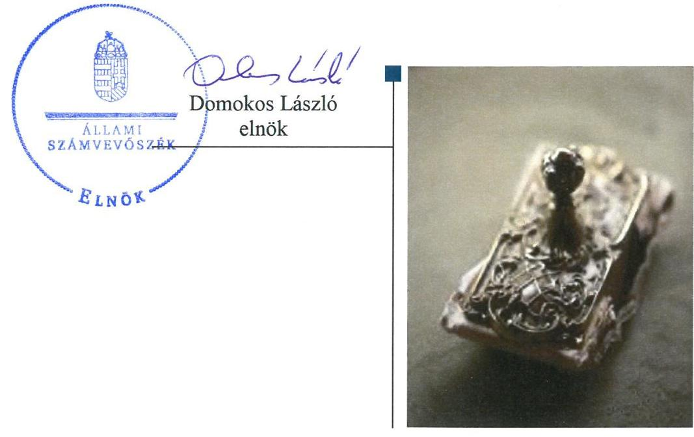
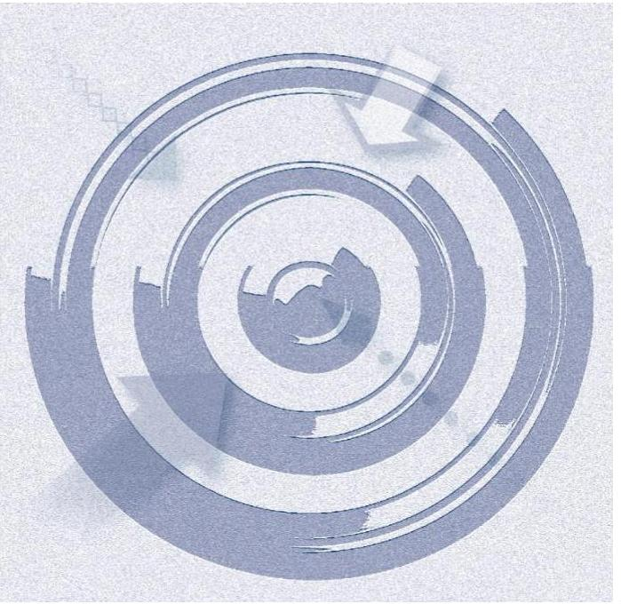
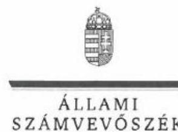
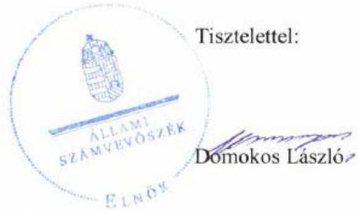

# Jelenetés 

## Nem állami humánszolgáltatók ellenőrzése

A humánszolgáltatást nyújtó államháztartáson kívüli szociális intézmények, szolgáltatók fenntartói központi költségvetésből kapott támogatásai felhasználásának ellenőrzése Kéznyújtás a Rászorultakért Közhasznú Alapítvány 2019.

---

# Jelentés 

## Nem állami humánszolgáltatók ellenőrzése

A humánszolgáltatást nyújtó államháztartáson kívüli szociális intézmények, szolgáltatók fenntartói központi költségvetésből kapott támogatásai felhasználásának ellenőrzése Kéznyújtás a Rászorultakért Közhasznú Alapítvány 2019. 10. hó 18. nap

---

# AZ ELLENŐRZÉST FELÜGYELTE:

## TÓTH MARIANNA felügyeleti vezető

## AZ ELLENŐRZÉST VEZETTE ÉS A VÉGREHAJTÁSÁÉRT FELELŐS:

### DR. PELLEI TAMÁS ellenőrzésvezető

### A PROGRAM ÖSSZEÁLLÍTÁSÁÉRT FELELŐS:

### TÓTPÁL SZABOLCS osztályvezető

---

**IKTATÓSZÁM:** EL-2071-001/2019.

**TÉMASZÁM:** 2491

**ELLENŐRZÉS-AZONOSÍTÓ SZÁM:** V083512

---

Jelentéseink az Országgyűlés számítógépes hálózatán és az Interneta a www.asz.hu címen is olvashatóak.

---

# TARTALOMJEGYZÉK 

■ ÖSSZEGZÉS ..... 5
■ AZ ELLENŐRZÉS CÉLJA ..... 6
■ AZ ELLENŐRZÉS TERÜLETE ..... 7
■ AZ ELLENŐRZÉS HÁTTERE, INDOKOLTSÁGA ..... 8
■ A JELENTÉS LÉNYEGES KÉRDÉSKÖRE ..... 9
■ AZ ELLENŐRZÉS HATÓKÖRE ÉS MÓDSZEREI ..... 10
■ MEGÁLLAPÍTÁSOK ..... 12
■ KÖVETKEZTETÉSEK ..... 13
■ MELLÉKLETEK ..... 15
I. sz. melléklet: Értelmező szótár ..... 15
■ FÜGGELÉKEK ..... 17
I. sz. függelék a jelentéshez ..... 17
II. sz. függelék: Észrevételek ..... 18
■ RÖVIDÍTÉSEK JEGYZÉKE ..... 23

---

.

---

# ÖSSZEGZÉS 

A Kéznyújtás a Rászorultakért Közhasznú Alapítvány a szociális feladatokat ellátó intézményei müködtetéséhez igénybe vett közpénzekkel való gazdálkodása nem volt elszámoltatható és átlátható.

## Az ellenőrzés társadalmi indokoltsága

Az Állami Számvevőszék stratégiájában célul tűzte ki, hogy az államháztartáson kívülre nyújtott költségvetési támogatások ellenőrzésével hozzájáruljon ahhoz, hogy a közpénzeket az államháztartáson kívüli szervezetek is átlátható módon használják fel a közfeladatok szerződésben vállalt ellátása érdekében. Tekintettel az elmúlt években a szociális területet érintő finanszírozási változásokra, a társadalom fokozott érdeklődéssel figyeli a szociális feladatokra fordított források felhasználását. Fontos a közvélemény biztosítása arról, hogy a közpénz államháztartáson kívüli felhasználása ezen a területen sem marad ellenőrizetlenül.

A Kéznyújtás a Rászorultakért Közhasznú Alapítványnál végzett ellenőrzést indokolta az is, hogy a szociális feladatok ellátásához az ellenőrzött időszakban közel 500 millió Ft központi költségvetési támogatásban részesült. Az ellenőrzés eredményeképpen a nyilvánosság és a szolgáltatást igénybe vevők megfelelő tájékoztatást kaphatnak az államháztartáson kívüli közfeladatot ellátó müködéséről, a szociális területen történő közpénzfelhasználásról.

## Főbb megállapítások, következtetések

A Kéznyújtás a Rászorultakért Közhasznú Alapítvány a 2015-2017. években nem rendelkezett a jogszabályi előírások ellenére számviteli politikával és az annak keretében elkészítendő szabályzatokkal, ezáltal nem alakította ki a szabályszerű működés és gazdálkodás kereteit. A szabályozás hiánya miatt a pénzgazdálkodás felelős végrehajtása, a számviteli elszámolások szabályszerűsége, illetve a közpénzekkel való rendeltetésszerű és felelős gazdálkodás nem volt biztosított. Beszámoló készítési kötelezettségének nem tett eleget.

---

# AZ ELLENŐRZÉS CÉLJA

**AZ ELLENŐRZÉS CÉLJA** annak értékelése, hogy a nem állami, nem önkormányzati szociális intézmények fenntartói központi költségvetésből kapott támogatásainak felhasználása szabályszerű volt-e, a támogatások igénylése, évközi módosítása és év végi elszámolása megfelel-e a jogszabályi előírásoknak.

---

# AZ ELLENŐRZÉS TERÜLETE 

## Kéznyújtás a Rászorultakért Közhasznú Alapítvány

A Kéznyújtás a Rászorultakért Közhasznú Alapítványt 2004. évben alapította egy magánszemély, közhasznúsági jogállását 2014. évben szerezte meg. Székhelye az ellenőrzött időszakban Budapesten volt. Célja segítséget nyújtani a rászorulóknak, elsősorban a hajlék nélkül élőknek, továbbá olyan szervezetek és intézmények támogatása, amelyek hajléktalanok szálláshoz jutását, élelemmel való ellátását biztosítják, illetve annak elősegítése és támogatása, hogy az országban elegendő számú hajléktalan szálló létesüljön.

A Fenntartó ${ }^{1}$ céljai megvalósítása érdekében két intézményt hozott létre, Budapesten 50 férőhelyes hajléktalan átmeneti szállót és 70 férőhelyes nappali melegedőt, Székesfehérváron 150 férőhelyes hajléktalan átmeneti szállót, 50 férőhelyes éjjeli menedékhelyet, 50 férőhelyes nappali melegedőt és népkonyhát üzemeltetett. A tevékenységét, gazdálkodását három tagú kuratórium irányította és felügyelte.

A Fenntartó a központi költségvetésből szociális közfeladatainak ellátására 2015. évben 155,0 millió Ft, 2016. évben 159,1 millió Ft és a 2017.évben 155,0 millió Ft normatív központi költségvetési támogatásban részesült.

---

# AZ ELLENŐRZÉS HÁTTERE, INDOKOLTSÁGA 

A szociális feladatokat ellátó nem állami intézményfenntartók részére közfeladataik ellátására évente jelentős összegű pénzügyi támogatást biztosítottak a mindenkori költségvetési törvények² a bennük megfogalmazott feltételek mellett. A költségvetési törvények a szociális ágazat feladatai ellátására 273 Mrd Ft állami támogatás előirányzatot biztosítottak a 20152017. években. Módosították a szociális igazgatásról és szociális ellátásokról szóló 1993. évi III. törvényt, amely - többek között - 2012. január 1-jei hatállyal megfogalmazta a finanszírozási rendszerbe történő befogadással összefüggő szabályokat.

Az ÁSZ³ stratégiájában hangsúlyos szerepet szánt annak, hogy szilárd szakmai alapokon álló, értékteremtő ellenőrzéseivel előmozdítsa a közpénzügyek átláthatóságát, rendezettségét, és javaslataival a közpénzek és a közvagyon szabályos, gazdaságos, hatékony és eredményes felhasználását segítse. Az államháztartáson kívülre nyújtott költségvetési támogatások ellenőrzésével az ÁSZ hozzájárul ahhoz, hogy a közpénzeket a nem állami humán fenntartók átlátható módon használják fel a közfeladatok ellátására kötött szerződésekben vállalt kötelezettségek teljesítése érdekében. Az ellenőrzés javaslataival hozzájárulhat az említett rendszerek szabályszerű támogatás felhasználásához, javíthatja a társadalmi-gazdasági döntések megalapozottságát, amely a „jól irányított állam" múködéséhez járul hozzá.

Az ellenőrzés keretében egyedi kockázatelemzés alapján kiválasztott fenntartóknál és intézményeiknél értékeljük az államháztartáson kívüli szociális tevékenységhez kapcsolódó támogatások felhasználásának megfelelőségét.

---

# A JELENTÉS LÉNYEGES KÉRDÉSKÖRE 

- A Fenntartó szabályszerű müködési és gazdálkodási környezet kialakításával megteremtette-e a költségvetési támogatások átlátható, elszámoltatható igénybevételének, felhasználásának feltételeit?

---

# AZ ELLENŐRZÉS HATÓKÖRE ÉS MÓDSZEREI 

## Az ellenőrzés típusa

Megfelelőségi ellenőrzés.

## Az ellenőrzött időszak

A 2015. január 1-je és 2017. december 31-e közötti időszak.

## Az ellenőrzés tárgya

Az ellenőrzés a szociális humánszolgáltatási közfeladatokat ellátó államháztartáson kívüli fenntartók, humánszolgáltatási közfeladatai ellátásához a költségvetési törvényekben biztosított központi költségvetési támogatások igénylése, évközi módosítása és év végi elszámolása fenntartói feladatainak ellátása, illetve e központi költségvetésből kapott támogatásaik humánszolgáltatási közfeladatokra való fenntartó általi felhasználása szabályszerűségének értékelésére terjed ki.

## Az ellenőrzött szervezet

- Kéznyújtás a Rászorultakért Közhasznú Alapítvány

## Az ellenőrzés jogalapja

Az ellenőrzés jogszabályi alapját az ÁSZ tv. ${ }^{4}$ 1. § (3) bekezdése, 5. § (3) bekezdésében foglalt előírások adják.

## Az ellenőrzés módszerei

Az ellenőrzést az ellenőrzési program szempontjai, kérdései, az ellenőrzött időszakban hatályos jogszabályok alapján, a nemzetközi standardokat irányadónak tekintve, az ellenőrzés szakmai szabályok és módszertanok figyelembe vételével végezte az ÁSZ. A közpénzekkel való felelős gazdálkodás segítésére irányuló javaslatok kidolgozásakor a hatályos jogszabályok az irányadóak.

Az ellenőrzés ideje alatt az ellenőrzött szervezettel történő kapcsolattartást az ÁSZ SZMSZ5-ének vonatkozó előírásai alapján biztosította az ÁSZ.

---

Az ellenőrzési kérdések megválaszolásához szükséges bizonyítékok megszerzése az ellenőrzött által rendelkezésre bocsátott dokumentumokra, adatokra alapozva megfigyelés, szemle (szemrevételezés), kérdésfeltevés (információkérés), valamint elemző eljárással történt. Az ellenőrzési bizonyítékként felhasználható adatforrások közé tartoznak egyrészt az ellenőrzési program részletes szempontjainál felsorolt adatforrások, másrészt minden - az ellenőrzés folyamán feltárt, az ellenőrzés szempontjából információt tartalmazó - dokumentum.

Az ellenőrzés lefolytatásához az ellenőrzött szervezet az ÁSZ által kért dokumentumok elektronikus úton való megküldésével szolgáltatott adatokat, információkat.

Amennyiben a Fenntartó múködését és gazdálkodását alapvetően meghatározó dokumentum hiánya miatt, valamely lényeges kérdéskörre vonatkozóan az ÁSZ megállapítást tett, további ellenőrzési tevékenységek az adott kérdéskörrel és az azzal szoros logikai kapcsolatban lévő kérdéskörökkel - ráépülő jelleggel - nem kerültek végrehajtásra.

---

# MEGÁLLAPÍTÁSOK 

## A Fenntartó szabályszerű múködési és gazdálkodási környezet kialakításával megteremtette-e a költségvetési támogatások átlátható, elszámoltatható igénybevételének, felhasználásának feltételeit?

Összegző megállapítás

A költségvetési támogatások átlátható, elszámoltatható igénybevételének és felhasználásának feltételeit a Fenntartó nem teremtette meg, így a gazdálkodása nem volt szabályszerű.

A Fenntartó múködésének szabályozottsága, ennek keretében a gazdálkodásra vonatkozó belső szabályozás nem felelt meg a jogszabályi előírásoknak, mivel a 2015-2017. években nem rendelkezett a Számv. tv. ${ }^{6}$ 14. § (3) bekezdésében előírt számviteli politikával, a Számv. tv. 14. § (5) bekezdés a)-b) és d) pontjaiban előírt eszközök és források leltárkészítési és leltározási szabályzatával, az eszközök és források értékelési szabályzatával, valamint pénzkezelési szabályzattal.

A Fenntartó a Civil tv. ${ }^{7}$ 28. § (1) bekezdésében, valamint a Civilszr ${ }_{1}{ }^{8} 6 . \S$ (1) bekezdésében és Civilszr ${ }_{2}{ }^{9} 7 . \S$ (1) bekezdésében foglalt beszámoló készítési kötelezettségének nem tett eleget.

---

# KÖVETKEZTETÉSEK 

Az ÁSZ tv. 32. § (1) bekezdésében foglaltak értelmében az ÁSZ jelentés tartalmazza a feltárt tényeket, az ezeken alapuló megállapításokat, következtetéseket, amelyeknek a 24. § (1) d) pontja szerint okszerünek és megalapozottnak kell lenniük.
A Kéznyújtás a Rászorultakért Közhasznú Alapítvány a szabályszerű gazdálkodási környezetet nem alakította ki, ezáltal nem voltak biztosítottak a központi költségvetésből kapott támogatások átlátható és elszámoltatható igénybevételének és felhasználásának feltételei. Mindezek következtében nem volt igazolható a támogatásokkal való szabályszerű elszámolás.

A Fenntartó azzal, hogy a jogszabályi előírásokkal ellentétben beszámolási kötelezettségének nem tett eleget, nem biztosította a közpénzekkel való felelős gazdálkodás átláthatóságát, ellenőrizhetőségét.

---

.

---

# MELLÉKLETEK 

- I. SZ. MELLÉKLET: ÉRTELMEZŐ SZÓTÁR
költségvetési támogatás a társadalombiztosítás pénzügyi alapjai kivételével az államháztartás központi alrendszeréből ellenérték nélkül, pénzben nyújtott támogatások (Áht. 1. § 14. pont)
A költségvetési törvényekben (2014. évi C. törvény 42-43. §, 2015. évi C. törvény 4041. §, 2016. évi XC. törvény 41. §) megállapított támogatás. Például a 2016. évi XC. törvény 41. § szerint többek között: Az Országgyűlés a szociális, gyermekjóléti, gyermekvédelmi közfeladatot ellátó intézményt, szolgáltatást fenntartó egyházi jogi személy, civil szervezet, közalapítvány, országos nemzetiségi önkormányzat, települési vagy területi nemzetiségi önkormányzat, gazdasági társaság, és a humánszolgáltatást alaptevékenységként végző, az Szja tv. hatálya alá tartozó egyéni vállalkozó (a továbbiakban együtt: nem állami szociális fenntartó) részére támogatást állapít meg a következők szerint: a támogatás a nem állami szociális fenntartót a települési önkormányzatok 2. melléklet III. pont 3. alpont c)-m) pontjában és III. pont 5. alpont a) pontjában meghatározott támogatásaival azonos jogcímeken, összegben és feltételek mellett illeti meg.
„Közfeladat a jogszabályokban meghatározott állami vagy önkormányzati feladat. ... A közfeladatok ellátásában államháztartáson kívüli szervezet jogszabályban meghatározott rendben közremüködhet." A közfeladatok meghatározó jogszabályban meg kell határozni a közfeladat ellátásának módját és egyidejűleg rendezni kell annak az ellátásához szükséges pénzügyi fedezet biztosításáról. (Az államháztartásról szóló 2011. évi CXCV. törvény 3/A. § (1)-(3) bekezdés)
szociális intézmény
nem állami, nem önkormányzati (államháztartáson kívüli) intézmény fenntartó
A szociális igazgatásról szóló 1993. évi III. törvényben meghatározott nappali, illetve bentlakásos ellátást, vagy támogatott lakhatást nyújtó szervezet. (Szoc.tv. 4. § (1) bekezdés (h) pont)
A szociális, gyermekjóléti és gyermekvédelmi közfeladatokat /humánszolgáltatásokat ellátó intézményt fenntartó egyházi jogi személy, társadalmi szervezet, alapítvány, közalapítvány, civil szervezet, országos nemzetiségi önkormányzat, nonprofit gazdasági társaság, gazdasági társaság és a humánszolgáltatást alaptevékenységként végző, Szja tv. hatálya alá tartozó egyéni vállalkozó. (2013. évi Kvtv. 35. § (1), (3) bekezdés, 2014. évi Kvtv. 33. §, 34. § (1), (4) bekezdés, 2015. évi Kvtv. 42. §, 43. § (1), (4) bekezdés, 2016. évi Kvtv. 40. §, 41. § (1), (4) bekezdés, 2017. évi Kvtv. 41. § (1), (4))

---

.

---

# FÜGGELÉKEK 

- I. SZ. FÜGGELÉK A JELENTÉSHEZ

Az Állami Számvevőszék az ellenőrzések során feltárt tényekhez kapcsolódó további körülmények tisztázására eszközrendszerrel nem rendelkezik. Amennyiben az ellenőrzésen túlmutatóan indokoltnak látszik az ellenőrzés során feltárt körülmények további vizsgálata, az Állami Számvevőszék törvényi felhatalmazás alapján az ellenőrzés által feltárt körülményeket továbbítja a hatáskörrel rendelkező szervnek a szükséges intézkedések megtétele, eljárások lefolytatása érdekében.
A Fenntartó 2015-2017. évekre vonatkozóan nem rendelkezett a Számv. tv. 14. § (3) és 14.§ (5) a) - b) és d) pontjaiban előírt számviteli politikával és az annak keretében elkészítendő, az eszközök és a források leltárkészítési és leltározási szabályzatával, az eszközök és a források értékelési szabályzatával, valamint pénzkezelési szabályzattal. A Fenntartó beszámoló készítési kötelezettségének a Civil tv. 28. § (1) bekezdésében és a Számv. tv. 4. § (1) bekezdésében előírtak ellenére nem tett eleget. Ezáltal a Fenntartó a vagyoni és pénzügyi helyzetéről, müködéséről nem adott megbízható és valós összképet. A számviteli szabályzatok és az éves számviteli beszámolók hiánya miatt nem volt igazolt, hogy a költségvetési támogatások igénybevétele jogszerüen történt, továbbá az, hogy a Fenntartó a költségvetési támogatásokat a szociális intézményei müködtetésére fordította. Ezáltal nem zárható ki, hogy a költségvetésből származó pénzeszközöket a jóváhagyott céltól eltérően használta fel.
Az eset összes körülményének feltárására a Magyar Államkincstár rendelkezik hatáskörrel.

---

A jelentéstervezetet a Számvevőszék 15 napos észrevételezésre megküldte az ellenőrzött szervezet vezetőjének az ÁSZ tv. 29. §* (1) bekezdése előírásának megfelelően.

A Kéznyújtás a Rászorultakért Közhasznú Alapítvány kuratóriumi elnöke a jelentéstervezet megállapításaira írásban észrevételt tett.
Az ÁSZ tv. 29. § (3) bekezdésével összhangban az ÁSZ a Függelékben feltünteti az ellenőrzés megállapításaival kapcsolatban tett, figyelembe nem vett észrevételeket, és megindokolja, hogy azokat miért nem fogadta el.

[^0]
[^0]:    * 29. § (1) Az Állami Számvevőszék az ellenőrzési megállapításait megküldi az ellenőrzött szervezet vezetőjének vagy az általa megbízott személynek, és annak, akinek személyes felelősségét állapította meg.
    (2) Az ellenőrzött szervezet vezetője és a felelősként megjelölt személy az ellenőrzés megállapításaira tizenöt napon belül írásban észrevételt tehet.
    (3) Az Állami Számvevőszék az észrevételre a beérkezésétől számított harminc napon belül írásban válaszol. A figyelembe nem vett észrevételeket köteles a jelentésben feltüntetni, és megindokolni, hogy azokat miért nem fogadta el.

---

Állami Számvevőszék
Budapest
Apáczai Cs. j. u. 10.
1052

Tárgy: észrevétel jelentéstervezetre, ellenőrzés megállapításaira

Alulírott Polinger Sándor Viktor, mint a Kéznyújtás a Rászorultakért Közhasznú Alapítvány kuratóriumi elnöke az alábbi észrevételt teszem az EL-1114-025/2019. iktatószámú, 2491 témaszámú, V083512 ellenőrzés azonosítószámú megállapításokra:

Alapítványunk a 2015-2017. évekre rendelkezett és jelenleg is rendelkezik Számviteli Politikával és az annak keretében elkészített szabályzatokkal, valamint a 2015-2017. évekre beszámoló készítési kötelezettségének is eleget tett. A Számviteli Politikát és a 2015-2017. évekre elkészített beszámolóinkat 2018.09.19-én feltöltöttük az Önök által rendelkezésre bocsájtott elektronikus adatszolgáltatási rendszerbe, mely a https://abr.asz.hu webcímen volt elérhető és postai úton tértivevénnyel is megküldtük az Önök részére 2018. 09. 20-án. A tértivevény szerint - melyet másolatban jelen levelünkhöz csatolunk - ezt Önök 2018.09.24-én átvették.

Azonban az ellenőrzés megállapításai szerint ezek valamilyen - számunkra nem ismert - okokból mégsem álltak az Önök rendelkezésére. Ezért jelen levelünkhöz ismételten csatoljuk Számviteli Politikánkat és az annak részeként elkészített szabályzatokat, valamint a 2015-2017. évekre vonatkozó - az Országos Bírósági Hivatal által érkeztetett - elkészített beszámolóinkat, melyek elérhetőek a https://birosag.hu/civil-szervezetek-nevjegyzeke oldalon is beszámoló keresés után.

Kérjük, hogy a fentiek figyelembevételével megállapításaikat felülvizsgálni szíveskedjenek.

Tisztelettel:
Budapest, 2019. augusztus 27.

Polinger Sándor Viktor
kuratórium elnöke
Kéznyújtás a Rászorultakért Közhasznú Alapítvány
Számviteli, 2019. 6. 2019. 09:00:00 00:00:00
Alulírott, 2019. 6. 2019. 09:00:00 00:00:00
A. 2019. 6. 2019. 09:00:00 00:00:00
A. 2019. 6. 2019. 09:00:00 00:00:00
A. 2019. 6. 2019. 09:00:00 00:00:00
A. 2019. 6. 2019. 09:00:00 00:00:00
A. 2019. 6. 2019. 09:00:00 00:00:00
A. 2019. 6. 2019. 09:00:00 00:00:00
A. 2019. 6. 2019. 09:00:00 00:00:00
A. 2019. 6. 2019. 09:00:00 00:00:00
A. 2019. 6. 2019. 09:00:00 00:00:00
A. 2019. 6. 2019. 09:00:00 00:00:00
A. 2019. 6. 2019. 09:00:00 00:00:00
A. 2019. 6. 2019. 09:00:00 00:00:00
A. 2019. 6. 2019. 09:00:00 00:00:00
A. 2019. 6. 2019. 09:00:00 00:00:00
A. 2019. 6. 2019. 09:00:00 00:00:00
A. 2019. 6. 2019. 09:00:00 00:00:00
A. 2019. 6. 2019. 09:00:00 00:00:00
A. 2019. 6. 2019. 09:00:00 00:00:00
A. 2019. 6. 2019. 09:00:00 00:00:00
A. 2019. 6. 2019. 09:00:00 00:00:00
A. 2019. 6. 2019. 09:00:00 00:00:00
A. 2019. 6. 2019. 09:00:00 00:00:00
A. 2019. 6. 2019. 09:00:00 00:00:00
A. 2019. 6. 2019. 09:00:00 00:00:00
A. 2019. 6. 2019. 09:00:00 00:00:00
A. 2019. 6. 2019. 09:00:00 00:00:00
A. 2019. 6. 2019. 09:00:00 00:00:00
A. 2019. 6. 2019. 09:00:00 00:00:00
A. 2019. 6. 2019. 09:00:00 00:00:00
A. 2019. 6. 2019. 09:00:00 00:00:00
A. 2019. 6. 2019. 09:00:00 00:00:00

---

ELNÖK

# Polinger Sándor Viktor úr 

kuratórium elnöke
Kéznyújtás a Rászorultakért Közhasznú Alapítvány

## Budapest

## Tisztelt Elnök Úr!

A „Nem állami humánszolgáltatók ellenörzése - A humánszolgáltatást nyújtó államháztartáson kivâli szociális intézmények, szolgáltatók fenntartói központi költségvetésböl kapott támogatásai felhasználásának ellenörzése - Kéznyújtás a Rászorultakért Közhasznú Alapítvány" címmel készített számvevőszéki jelentéstervezetre tett észrevételeit köszönettel megkaptam.
Az Állami Számvevőszék észrevételekre vonatkozó álláspontjáról a felügyeleti vezető által készített részletes tájékoztatást csatoltan megküldőm.
Tájékoztatom Elnök urat, hogy a számvevőszéki jelentésben - az Állami Számvevőszékről szóló 2011. évi LXVI. törvény 29. § (3) bekezdése alapján - a figyelembe nem vett észrevételeket szerepeltetjük annak indoklásával, hogy azokat miért nem fogadtuk el.

Budapest, 2019. 09 hó 20 nap

Melléklet: Tájékoztatás az észrevételek kezeléséről

---

# Tájékoztatás   az észrevételek kezeléséről 

Az „Nem állami humánszolgáltatók ellenörzése - A humánszolgáltatást nyújtó államháztartáson kivüli szociális intézmények, szolgáltatök fenntartói központi költségvetésböl kapott támogatásai felhasználásának ellenörzése - Kéznyújtás a Rászorultakért Közhasznú Alapítvány" címü jelentéstervezetre a tett észrevételeit áttekintettem. Az észrevételek kezeléséről az alábbi tájékoztatást adom.

1. A jelentéstervezet 1. megállapítás 1. bekezdés 1. mondat második tagmondatára és a 2. bekezdésre vonatkozó észrevétel:

Az ÁSZ az ellenőrzési megállapításait az adatszolgáltatás során a részére törvényi határidőben rendelkezésre bocsátott dokumentumokra alapozva fogalmazta meg. A 2018. szeptember 19-én és 2018. október 1-jén kelt teljességi és hitelességi nyilatkozat szerint az ÁSZ részére átadott dokumentumok, adatok megbízhatóak, és a bekért adatokra, dokumentumokra vonatkozóan teljes körü információt tartalmaznak.
Az ÁSZ az EL-1114-001/2018. ikt. számú adatbekérő levél 2. számú mellékletének 1., 2. pontjában kérte az államháztartáson kívüli fenntartó vonatkozásában, a 2015-2017. években hatályos számviteli politikát és ennek keretében kialakítandó szabályzatokat, továbbá az államháztartáson kívüli fenntartó 2015-2017. évi számviteli beszámolóit. Az Alapítvány az adatbekérő levélre válaszképpen feltöltötte a Kéznyújtás a Rászorultakért Közhasznú Alapítvány számviteli politikáját és ennek keretében kialakítandó szabályzatokat (eszközök és források értékelési szabályzatát, eszközök és források leltárkészítési és leltározási szabályzatát, pénzkezelési szabályzatát) (továbbiakban: szabályzatok), valamint a 2015-2017. évi beszámolót és közhasznúsági mellékletet (továbbiakban: beszámolók).
A feltöltött szabályzatok és beszámolók nem hitelesek, mivel nincs a kuratórium elnöke által aláirva, lepecsételve, továbbá az Alapítvány nem töltött fel olyan dokumentumot, amivel igazolta volna az ÁSZ ellenőrzés részére a szabályzatok és beszámolók elektronikus úton történő aláírását.

---

Fentiek alapján a megküldött szabályzatok és beszámolók nem érvényesek, ezért a jelentéstervezet módosítása nem indokolt.

Budapest, 2019. 03. hó 20. nap

Tóth Marianna
felügyeleti vezető

---

# RÖVIDÍTÉSEK JEGYZÉKE 

${ }^{1}$ Fenntartó
${ }^{2}$ költségvetési törvények
${ }^{3}$ ÁSZ
${ }^{4}$ ÁSZ tv.
${ }^{5}$ ÁSZ SZMSZ
${ }^{6}$ Számv. tv.
${ }^{7}$ Civil tv.
${ }^{8}$ Civilszr ${ }_{1}$
${ }^{9}$ Civilszr $_{2}$

Kéznyújtás a Rászorultakért Közhasznú Alapítvány
Magyarország 2015. évi központi költségvetéséről szóló 2014. évi C. törvény (hatályos: 2015. január 1-jétől 2018. december 31-éig)
Magyarország 2016. évi központi költségvetéséről szóló 2015. évi C. törvény (hatályos: 2015. július 4-étől)
Magyarország 2017. évi központi költségvetéséről szóló 2016. évi XC. törvény (hatályos: 2016. november 1-jétől)
Állami Számvevőszék
Az Állami Számvevőszékről szóló 2011. évi LXVI. törvény (hatályos: 2011. július 1-jétől)
Állami Számvevőszék Szervezeti és Működési Szabályzata
A számvitelről szóló 2000. évi C. törvény (hatályos: 2001. január 1-jétől)
Az egyesülési jogról, a közhasznú jogállásról, valamint a civil szervezetek müködéséről és támogatásáról szóló 2011. évi CLXXV. törvény (hatályos: 2011. december 22-étől)
Az egyes egyéb szervezetek beszámoló készítési és könyvvezetési kötelezettségének sajátosságairól szóló 224/2000. (XII. 19.) Korm. rendelet (hatályos: 2016. december 31-ig)
A számviteli törvény szerinti egyes egyéb szervezetek beszámoló készítési és könyvvezetési kötelezettségének sajátosságairól szóló 479/2016. (XII. 28.) Korm. rendelet (hatályos: 2017. január 1-jétől)

---

# ÁLLAMI SZÁMVEVŐSZÉK 

1052 Budapest, Apáczai Csere János utca 10.
Levélcím: 1364 Budapest 4. Pf. 54
Telefon: +36 14849100 Telefax: +36 14849200
www.asz.hu