# Jelentés 

## Az állami vagyon feletti tulajdonosi joggyakorlással kapcsolatos tevékenységek ellenőrzése

2019.

---

# Jelentés 

## Az állami vagyon feletti tulajdonosi joggyakorlással kapcsolatos tevékenységek ellenőrzése

2019. 10. hó 14. nap
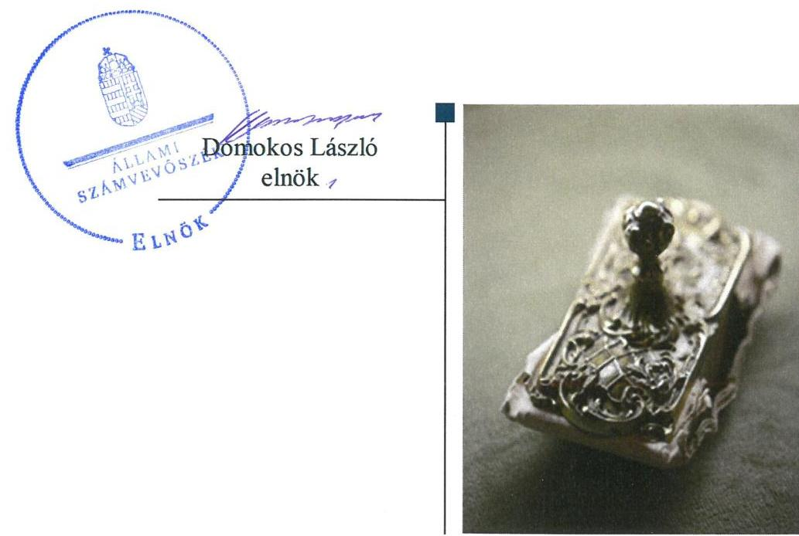

---

|  AZ ELLENŐRZÉST FELÜGYELTE: |  |  |  |  |   |
| --- | --- | --- | --- | --- | --- |
|   | PETŐ KRISZTINA felügyeleti vezető |  |  |  |   |
|   | AZ ELLENŐRZÉST VEZETTE ÉS A VÉGREHAJTÁSÁÉRT FELELŐS: |  |  |  |   |
|   | GÖRGÉNYI GÁBOR ellenőrzésvezető |  |  |  |   |
|   | A PROGRAM ÖSSZEÁLLÍTÁSÁÉRT FELELŐS: |  |  |  |   |
|   | SALAMON ILDIKÓ tervezési vezető |  |  |  |   |
|   | A TÉMÁHOZ KAPCSOLÓDÓ KORÁBBI SZÁMVEVŐSZÉKI JELENTÉSEK: |  |  |  |   |
|   | • címe: | Az állami vagyon feletti tulajdonosi joggyakorlás-sal kapcsolatos tevékenységek ellenőrzése |  |  |   |
|   | • sorszáma: | 19158 |  |  |   |
|  Jelentéseink az Országgyűlés számítógépes hálózatán és az Interneten a www.asz.hu címen is olvashatóak. | • címe: | Az állami vagyon feletti tulajdonosi joggyakorlás-sal kapcsolatos tevékenységek ellenőrzése |  |  |   |
|   | • sorszáma: | 18203 |  |  |   |
|   | IKTATÓSZÁM: EL-1580-002/2019. |  |  |  |   |
|   | TÉMASZÁM: 2516 |  |  |  |   |
|   | ELLENŐRZÉS-AZONOSÍTÓ SZÁM: V0860 |  |  |  |   |

---

# TARTALOMJEGYZÉK 

■ ÖSSZEGZÉS ..... 5
■ AZ ELLENŐRZÉS CÉLJA ..... 7
■ AZ ELLENŐRZÉS TERÜLETE ..... 8
■ AZ ELLENŐRZÉS HÁTTERE, INDOKOLTSÁGA ..... 10
■ A JELENTÉS LÉNYEGES KÉRDÉSKÖREI ..... 11
■ AZ ELLENŐRZÉS HATÓKÖRE ÉS MÓDSZEREI ..... 12
■ MEGÁLLAPÍTÁSOK ..... 16
■ JAVASLATOK ..... 23
■ MELLÉKLETEK ..... 25
I. sz. melléklet: Értelmező szótár ..... 25
II. sz. melléklet: Az intézkedési tervek végrehajtásának értékelése ..... 27
■ FÜGGELÉK: ÉSZREVÉTELEK ..... 33
■ RÖVIDÍTÉSEK JEGYZÉKE ..... 43

---

.

---

# ÖSSZEGZÉS 

Az ellenőrzött tulajdonosi joggyakorló szervezetek a nemzeti vagyon megőrzésének, kezelésének és védelmének Alaptörvényben rögzített céljával és követelményével összhangban a rábízott állami vagyonra vonatkozó szabályozási, nyilvántartási, beszámolási és vagyonmegóvási kötelezettségüket 2018-ban szabályszerűen teljesítették. A tulajdonosi joggyakorlás keretében így biztosított volt a rábízott állami vagyonnal történő gazdálkodás átláthatósága és elszámoltathatósága.
Az Állami Számvevőszék korábbi ellenőrzésének megállapításait a tulajdonosi joggyakorló szervezetek hasznosították, ezáltal az átlátható működés és az állami vagyonnal való gazdálkodás kockázatai jelentős mértékben csökkentek.

## Az ellenőrzés társadalmi indokoltsága

Az Állami Számvevőszék a közvagyonnal való felelős gazdálkodás elősegítése érdekében, törvényi kötelezettségének is eleget téve minden évben ellenőrzi az állami vagyon feletti tulajdonosi joggyakorlással kapcsolatos tevékenységeket. Az ellenőrzéssel hozzájárul az állami vagyon feletti kontrollok, a felelős, szabályszerű vagyongazdálkodás erősítéséhez, az állami vagyon megóvását, a közjó érdekében való hasznosítását célzó feladatellátás javításához, valamint az annak jövőbeli fejlesztését célzó döntések megalapozott előkészítéséhez. Ezzel támogatja a jó kormányzás gyakorlatát, és objektív képet szolgáltat a társadalom részére a közvagyonnal való felelős gazdálkodás megvalósulásáról.

A számvevőszéki munka hasznosulásának javítását is szolgáló utóellenőrzés az ellenőrzések eredményeként feltárt hibák, hiányosságok kijavítását célzó intézkedések tényleges megvalósításának értékelésével szolgálja a közvagyonnal való gazdálkodás átláthatóságának, elszámoltathatóságának erősítését.

## Főbb megállapítások, következtetések, javaslatok

Az állami vagyon feletti tulajdonosi joggyakorlással kapcsolatos tevékenységek szabályozási kontrolljainak kiépítettsége hozzájárult a tulajdonosi joggyakorló szervezetek szabályszerű és elszámoltatható feladatellátásához.

A tulajdonosi joggyakorlók az állami tulajdonú ingatlanok vagyonkezelésbe adását a vonatkozó jogszabályi előírások betartásával végezték. A vagyonkezelésbe adott állami vagyont a tulajdonosi joggyakorló szervezetek nyilvántartották, de a vagyon értékének pontos, naprakész nyomon követését veszélyeztette, hogy a Magyar Nemzeti Vagyonkezelő Zrt.-nél hiányosságok voltak ezeknek a vagyonelemek nyilvántartása terén. A vagyonkezelésbe, használatba adott állami vagyon megóvását ugyanakkor a tulajdonosi ellenőrzések rendszere támogatta.

Az állami tulajdonú ingatlanok értékesítése szabályszerűen történt.
A tulajdonosi joggyakorlók a többségi állami tulajdonú gazdasági társaságok feletti tulajdonosi joggyakorlással kapcsolatos tevékenységüket szabályszerűen látták el, de az Állami Egészségügyi Ellátó Központ a társaságok beszámolójáról esetenként nem a jogszabályi előírásokkal összhangban döntött, illetve nem intézkedett a veszteségek rendezéséről.

A rábízott állami vagyonnal kapcsolatos elkülönítési és beszámolási kötelezettségüknek a tulajdonosi joggyakorló szervezetek szabályszerűen eleget tettek, a rábízott vagyonra vonatkozó 2018. évi beszámoló elkészítéséhez elvégezték a vagyonelemek értékelését és leltározását.

Az átláthatóság követelményének érvényesülését támogatta, hogy a tulajdonosi joggyakorlók az információs és kommunikációs folyamatokat szabályszerűen kialakították és működtették, a rábízott vagyonra vonatkozó éves költségvetési beszámolójukat közzétették.

---

Az állami vagyon feletti tulajdonosi joggyakorlással kapcsolatos tevékenységek 2018. évi értékeléséről az 1. számú táblázat ad összefoglaló áttekintést. Az ellenőrzött szervezetek esetében az ellenőrzés célja szempontjából az adott szervezetre releváns funkciók értékelése történt meg, erre tekintettel a táblázat nem minden szervezet esetében tartalmazza valamennyi funkció minősítését:

1. táblázat

|  Funkció | Vagyon-
kezelésbe
adás | Vagyon
értékesítése | Társaságok
feletti
tulajdonosi
joggyakorlás | Beszámolás | Vagyon
értékesítése, leltá-
rozása | Vagyonkeze-
lésbe
adott vagyon
nyilvántartása | Szabályozási
kontrollok | Ellenőrzési fel-
adatok  |
| --- | --- | --- | --- | --- | --- | --- | --- | --- |
|  Szervezet |  |  |  |  |  |  |  |   |
|  MNV Zrt. | szabályszerű | szabályszerű | szabályszerű | szabályszerű | szabályszerű | nem szabályszerű | szabályszerű | szabályszerű  |
|  NFA | szabályszerű | szabályszerű | --- | szabályszerű | szabályszerű | szabályszerű | szabályszerű | szabályszerű  |
|  ÁEEK | szabályszerű | szabályszerű | nem szabályszerű | szabályszerű | szabályszerű | szabályszerű | szabályszerű | szabályszerű  |
|  MFB Zrt. | --- | --- | szabályszerű | szabályszerű | szabályszerű | --- | helyénvaló | ---  |

Az állami vagyonnal történő szabályszerű gazdálkodás erősítése, a hibák, hiányosságok kijavítása érdekében a tulajdonosi joggyakorlók felelősen hasznosították az Állami Számvevőszék 2016. évi tulajdonosi joggyakorlásra vonatkozó ellenőrzésének megállapításait. Ennek következtében az átlátható működés és az állami vagyonnal való gazdálkodás kockázatai jelentős mértékben csökkentek.

A 2018. évi tulajdonosi joggyakorlással kapcsolatos tevékenységekre vonatkozó megállapítások alapján az Állami Számvevőszék a tulajdonosi joggyakorlóknak összesen 3 javaslatot fogalmazott meg, amelyekre a jelentés kézhezvételétől számított 30 napon belül intézkedési tervet kell készíteniük.

---

# AZ ELLENŐRZÉS CÉLJA 

Az ellenőrzés célja annak megítélése volt, hogy az állami vagyon felett tulajdonosi jogokat gyakorló szervezetek tulajdonosi joggyakorlása megfelelt-e a vonatkozó jogszabályok előírásainak. Továbbá annak értékelése, hogy az állami vagyon feletti 2016. évi tulajdonosi joggyakorlásra vonatkozó számvevőszéki jelentésben foglalt megállapításokra készített intézkedési tervben meghatározott feladatokat az ellenőrzött szervezetek végrehajtották-e.

---

# AZ ELLENŐRZÉS TERÜLETE 

## Az állami vagyon feletti tulajdonosi joggyakorlással kapcsolatos tevékenységek

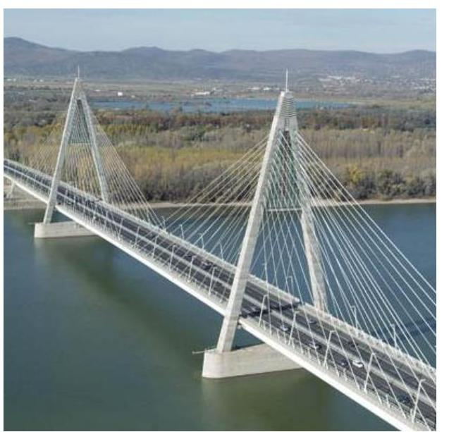

A közvagyon meghatározó részét kitevő állami vagyonnal való felelős, átlátható és elszámoltatható gazdálkodás követelményét az Alaptörvény ${ }^{1}$ rögzíti.

Az Alaptörvény rendelkezéseihez igazodóan az Nvtv. ${ }^{2}$ többek között meghatározza a nemzeti vagyon rendeltetését, kategóriáit és a vagyongazdálkodás keretszabályait.

Az állam tulajdonában álló vagyon feletti tulajdonosi joggyakorlás módját, a vagyon védelmének, hasznosításának, kezelésének, nyilvántartásának általánosan érvényes szabályait a Vtv. ${ }^{3}$ állapítja meg.

A Vtv. az államot megillető tulajdonosi jogok és kötelezettségek összességének tulajdonosi joggyakorlójaként - ha törvény vagy miniszteri rendelet eltérően nem rendelkezik - az MNV Zrt. ${ }^{4}$-t nevesíti.

Az ellenőrzés az állami vagyonnal kapcsolatos nyilvántartások kialakítása és vezetése, az adatszolgáltatások és a beszámolási kötelezettség teljesítése; az állami ingatlanvagyon vagyonkezelésbe adása, tulajdonjogának átruházása; a társasági részesedések feletti tulajdonosi joggyakorlás; valamint tulajdonosi joggyakorlás belső szabályozási rendszerének és a tulajdonosi ellenőrzési rendszer kialakítása és működtetése tevékenységeire terjedt ki az állami vagyoni kör feletti négy legjelentősebb tulajdonosi joggyakorló szervezet esetében:
$\longrightarrow$ Az MNV Zrt. a Magyar Állam által alapított egyszemélyes gazdasági társaság, amely előkészíti és végrehajtja az Országgyűlés, a Kormány és a nemzeti vagyon kezeléséért felelős tárca nélküli miniszter állami vagyonnal kapcsolatos döntéseit, közreműködik a Nemzeti Vagyongazdálkodási Irányelvek és az Éves Nemzeti Vagyongazdálkodási Program előkészítésében, nyilvántartást vezet a tulajdonosi joggyakorlása alá tartozó vagyonról, továbbá az állami vagyonnal kapcsolatos polgári jogi jogviszonyban képviseli a Magyar Államot.
$\longrightarrow$ Az NFK ${ }^{5}$ 2019. július 1-jén az NFA ${ }^{6}$ általános jogutódjaként jött létre. Az agrárpolitikáért felelős miniszter irányítása alatt álló NFK változatlanul ellátja az NFA korábbi feladatait, a Magyar Állam nevében gyakorolja a Nemzeti Földalapba tartozó állami földvagyon felett a tulajdonosi jogokat.
$\longrightarrow$ Az ÁEEK ${ }^{7}$ gyakorolja a Ttv. ${ }^{8}$ alapján az állam fenntartásába, illetve tulajdonába került egészségügyi intézmények, továbbá az országos gyógyintézetek és az Országos Vérellátó Szolgálat felett az egyes fenntartói jogokat, a gazdasági társaságok tekintetében a tagsági jogokat, valamint az alapítványok esetében az alapítói jogokat. Az ÁEEK ellátja továbbá az EVÖ tv. ${ }^{9}$ alapján az állam fenntartásába, illetve tulajdonába került egészségügyi intézmény felett, valamint a miniszter irányítása alá tartozó egészségügyi szolgáltató felett az

---

egyes fenntartói jogokat, valamint a Ttv. és a 2013. évi XXV. törvény ${ }^{10}$, illetve a 2006. évi CXXXII. törvény ${ }^{11}$ alapján az államot megillető tulajdonosi jogokat.

- Az MFB Zrt. ${ }^{12}$ a magyar állam 100%-os tulajdonában álló szakosított hitelintézet, melynek alapfeladata a hazai vállalkozások, illetve magánszemélyek számára kedvező konstrukciójú hitelek biztosítása, valamint a hosszú távú gazdaságfejlesztés támogatása, azokhoz pénzpiaci források bevonása. A Vtv., illetve 2018. május 18-ától az MFB tv. ${ }^{13}$ alapján az MFB Zrt. feletti tulajdonosi jogokat az állami vagyon felügyeletéért felelős miniszter látta el.
Az Országgyűlés felé történő beszámolás tekintetében az ellenőrzés a nemzeti vagyon kezeléséért felelős tárca nélküli miniszterre és az Agrárminisztériumra terjedt ki:
- A nemzeti vagyon kezeléséért felelős tárca nélküli miniszter 2018. május 22-étől felel az állami vagyon felügyeletéért, valamint az állami vagyonnal való gazdálkodás szabályozásáért. A Vtv. előírása szerint a Kormány (nemzeti vagyon kezeléséért felelős tárca nélküli miniszter útján) az állam nevében tulajdonosi jogokat gyakorló szervezetek működéséről, az állami vagyon állományának alakulásáról, az állami vagyonnal való gazdálkodás folyamatairól évente, a tárgyévet követő év december 31. napjáig beszámol az Országgyűlésnek.
- Az Agrárminisztérium vezetését 2018. május 22-től látja el az agrárminiszter. Az Nfatv. ${ }^{14}$ alapján a Kormány az agrárminiszter útján évente köteles beszámolni az Országgyűlésnek a földbirtok-politikai irányelvek érvényesüléséről, a Nemzeti Földalap helyzetéről és az NFA tevékenységéről.
Az utóellenőrzés az állami vagyon feletti tulajdonosi joggyakorlással kapcsolatos
 tevékenységek 2016-ra vonatkozó ellenőrzéséről készült, 2018. augusztus 9-én nyilvánosságra hozott, 18203 számú jelentés javaslatainak és megállapításainak hasznosulását értékelte, az MNV Zrt.-re, az Agrárminisztériumra, a NFA-ra és az ÁEEK-ra kiterjedően.

A tulajdonosi joggyakorlókra rábízott állami vagyon befektetett eszközértéke 10 895,0 Mrd Ft volt 2018. december 31-én, amelynek megoszlását az 2. táblázat mutatja be:
2. táblázat

# AZ ÁLLAMI VAGYON BEFEKTETETT ESZKÖZÉRTÉKÉNEK MEGOSZLÁSA (ADATOK E FT-BAN) 

|  | MNV Zrt. | NFA | ÁEEK | MFB Zrt. |
| :--: | :--: | :--: | :--: | :--: |
| Immateriális javak | 734577443 | - | 450 | - |
| Tárgyi Eszközök | 286537500 | 75441256 | 10490134 | - |
| Befektetett pénzügyi eszközök | 1200836408 | - | 772401 | 184102748 |
| Koncesszióba, vagyonkezelésbe adott eszközök | 8068747206 | 333409028 | 20880 | - |
| Nemzeti vagyonba tartozó befektetett eszközök: | 10290698556 | 408850284 | 11283863 | 184102748 |

Forrás: ellenőrzött szervezetek 2018. évi rábízott állami vagyonról szóló beszámolói

---

# AZ ELLENŐRZÉS HÁTTERE, INDOKOLTSÁGA 

Az állami vagyonról szóló 2007. évi CVI. törvény 3. § (4) bekezdése szerint az állami vagyon feletti tulajdonosi joggyakorlással kapcsolatos tevékenységeket az ÁSZ ${ }^{15}$ évente ellenőrzi. A Nemzeti Földalap feletti tulajdonosi joggyakorlással kapcsolatos tevékenység éves gyakorisággal történő ellenőrzéséről pedig a Nemzeti Földalapról szóló 2010. évi LXXXVII. törvény 14. § (1) bekezdése rendelkezik.

Az ellenőrzés eredményeként az ÁSZ véleményt formál arról, hogy a Magyar Állam tulajdonosi joggyakorlásában érintett szervezetek működése és az állami vagyonnal való gazdálkodása összhangban volt-e az állami vagyonra vonatkozó jogszabályok rendelkezéseivel. Az ellenőrzés rámutathat az állami vagyon feletti joggyakorlás tevékenységeinek esetleges szabályozási problémáira és hiányosságaira, hozzájárulva az állami vagyon feletti kontrollok, a felelős, szabályszerű vagyongazdálkodás erősítéséhez, valamint az állami vagyon megóvását, a közjó érdekében való hasznosítását célzó feladatellátás javításához.

Az utóellenőrzés az ellenőrzött szervezet szintjén feltárja, hogy a szervezet az intézkedések végrehajtásával hasznosította-e a korábbi ellenőrzési jelentésben a hiányosságok megszüntetése, illetve a kockázatok kezelése érdekében megfogalmazott javaslatokat, illetve az intézkedések végrehajtása elmaradásának következtében továbbra is fennálló szabálytalanság esetén értékeli a közpénzek, közvagyon veszélyeztetettségét.

Az ÁSZ szintjén az utóellenőrzés visszacsatolást ad az ellenőrzési jelentések hasznosulásáról, az intézkedések elmaradásának, vagy részleges megvalósulásának a közpénzek, közvagyon veszélyeztetettségére gyakorolt valószínűsített hatásának értékelése, további intézkedéseket vonhat maga után.

---

# A JELENTÉS LÉNYEGES KÉRDÉSKÖREI 

1.     - A tulajdonosi joggyakorló szervezetek az állami tulajdonú ingatlanok és a többségi állami tulajdonban álló társaságban lévő társasági részesedések feletti tulajdonosi joggyakorlással kapcsolatos tevékenységüket szabályszerűen látták-e el?
2.     - Az állami vagyonról való nyilvántartással, beszámolással, és adatszolgáltatással összefüggő feladatok ellátása szabályszerű volt-e?
3.     - A tulajdonosi joggyakorló szervezetek kialakítottak-e és működtettek-e az állami vagyon feletti tulajdonosi joggyakorlással kapcsolatos tevékenységek szabályszerű ellátását biztosító kontrollrendszert?
4.     - Az MFB Zrt. helyénvalóan alakította-e ki és működtette-e a tulajdonosi joggyakorlási feladatok ellátását támogató belső szabályozási rendszert?
5.     - A tulajdonosi joggyakorló szervezetek az állami vagyon feletti 2016. évi tulajdonosi joggyakorlásra vonatkozó számvevőszéki jelentés alapján hozott intézkedési tervekben foglaltakat az előírt határidőben végrehajtották-e?

---

# AZ ELLENŐRZÉS HATÓKÖRE ÉS MÓDSZEREI 

## Az ellenőrzés típusa

Megfelelőségi ellenőrzés.

## Az ellenőrzött időszak

Az állami vagyon feletti tulajdonosi joggyakorlás vonatkozásában a 2018. év.

Az utóellenőrzés vonatkozásában az utóellenőrzés alapját képező ÁSZ jelentés közzétételének napjától (2018. augusztus 9.) az ellenőrzésről szóló adatbekérő levél keltének napjáig (2019. július 9.) tartó időszak.

## Az ellenőrzés tárgya

A Magyar Állam tulajdonosi joggyakorlásában érintett szervezetek állami vagyonra vonatkozó tulajdonosi joggyakorlással kapcsolatos intézkedései és a tulajdonosi joggyakorlási feladatok szabályszerű ellátását támogató belső szabályozási, közzétételi kontrollok és a tulajdonosi ellenőrzési rendszer. A tulajdonosi joggyakorlási feladatok ellátását támogató belső szabályozási rendszer helyénvalósága.

Az utóellenőrzés tekintetében a számvevőszéki jelentésben foglalt megállapításokkal és javaslatokkal összhangban - a Magyar Állam tulajdonosi joggyakorlásában érintett szervezetek által - készített intézkedési tervben foglaltak végrehajtásának ellenőrzése.

## Az ellenőrzött szervezet

A Magyar Nemzeti Vagyonkezelő Zrt., a Nemzeti Földügyi Központ, az Állami Egészségügyi Ellátó Központ, az MFB Magyar Fejlesztési Bank Zrt.

Az Országgyűlés felé történő beszámolás tekintetében a nemzeti vagyon kezeléséért felelős tárca nélküli miniszter és az Agrárminisztérium.

Az utóellenőrzés tekintetében a Magyar Nemzeti Vagyonkezelő Zrt., az Agrárminisztérium, a Nemzeti Földügyi Központ és az Állami Egészségügyi Ellátó Központ.

A Nemzeti Földügyi Központ 2019. július 1-jétől a Nemzeti Földügyi Központ létrehozásáról szóló 1150/2019. (III. 25.) Korm. határozat, valamint a 2019. évi XL. törvény ${ }^{16}$ alapján a megszüntetett Nemzeti Földalapkezelő Szervezet általános jogutódjaként került ellenőrzésre.

---

# Az ellenőrzés jogalapja 

Az ellenőrzés jogszabályi alapját az ÁSZ tv. ${ }^{17}$ 5. § (4) bekezdés a) pontja, a Vtv. 3. § (4) bekezdése és az Nfatv. 14. § (1) bekezdése képezik.

Az utóellenőrzés jogszabályi alapját az ÁSZ tv. 33. § (7) bekezdésének előírása képezi.

## Az ellenőrzés módszerei

Az ellenőrzést az ellenőrzött időszakban hatályos jogszabályok, az ellenőrzés szakmai szabályai, a jelen ellenőrzésre irányadó ÁSZ módszertanok, az ellenőrzési programban foglalt értékelési szempontok szerint került sor.

Az ellenőrzés ideje alatt az ellenőrzött szervezettel történő kapcsolattartás az ÁSZ SZMSZ-ének vonatkozó előírásai alapján történt.

Az állami vagyonnal kapcsolatos nyilvántartások kialakítását és vezetését, az adatszolgáltatások, a rábízott vagyonnal összefüggő beszámolási kötelezettség teljesítését az MNV Zrt., az MFB Zrt., az NFA, és az ÁEEK szervezeteknél, a beszámolási kötelezettség teljesítését az Országgyűlés felé a nemzeti vagyon kezeléséért felelős tárca nélküli miniszternél és az Agrárminisztériumnál ellenőrizte az ÁSZ.

Az állami ingatlanvagyon vagyonkezelésbe adása az MNV Zrt., az ÁEEK és az NFA, tulajdonjogának átruházása az MNV Zrt., az ÁEEK és az NFA, valamint a társasági részesedések feletti tulajdonosi joggyakorlás az MNV Zrt., az MFB Zrt., az ÁEEK szervezetek, a lejárt tulajdonosi kölcsönök visszafizetése ellenőrzése az MNV Zrt. esetében történt.

A tulajdonosi joggyakorlás belső szabályozási rendszerét és a tulajdonosi ellenőrzési rendszer kialakítását, működtetését az MNV Zrt., az NFA, az ÁEEK szervezetekre vonatkozóan szabályszerűségi kritériumok alapján ellenőrizte az ÁSZ. Az MFB Zrt. tekintetében a tulajdonosi joggyakorlás belső szabályozási rendszere kialakítását helyénvalósági kritériumok alapján ellenőrizte az ÁSZ, mert az MFB Zrt.-re nem vonatkoznak a Bkr. ${ }^{18}$ előírásai.

Az ÁSZ 18203. számú jelentése alapján hozott intézkedési tervben foglaltak végrehajtását az MNV Zrt., az Agrárminisztérium, az NFA és az ÁEEK tekintetében ellenőrizte az ÁSZ.

Az ellenőrzési kérdések megválaszolásához szükséges bizonyítékok megszerzése az ellenőrzöttek által rendelkezésre bocsátott dokumentumokra, adatokra alapozva megfigyelés, szemle (szemrevételezés), kérdésfeltevés (információkérés), mintavételezés, valamint elemző eljárás alkalmazásával történt.

Az ÁSZ tételesen ellenőrizte az ÁEEK esetében az állami tulajdonú ingatlanok értékesítésével kapcsolatos intézkedések, a többségi állami tulajdonban álló társaságban lévő társasági részesedések feletti tulajdonosi joggyakorlása és ellenőrzési rendszere szabályszerűségét, az MFB esetében a többségi állami tulajdonban álló társaságban lévő társasági részesedések feletti tulajdonosi joggyakorlása szabályszerűségét.

Az ÁSZ mintavétellel ellenőrizte az MNV Zrt. esetében az állami tulajdonú ingatlanok nyilvántartása és vagyonkezelésbe adásával kapcsolatos

---

intézkedések és az állami tulajdonú ingatlanok értékesítésével kapcsolatos intézkedések szabályszerűségét, továbbá a többségi állami tulajdonban álló társaságban lévő társasági részesedések feletti tulajdonosi joggyakorlása és ellenőrzési rendszere szabályszerűségét, az ÁEEK esetében az állami tulajdonú ingatlanok nyilvántartása és vagyonkezelésbe adásával kapcsolatos intézkedések szabályszerűségét, és az NFA-nál az állami tulajdonú ingatlanok nyilvántartása és vagyonkezelésbe adásával kapcsolatos intézkedések és az állami tulajdonú ingatlanok értékesítésével kapcsolatos intézkedések szabályszerűségét, valamint ellenőrzési rendszere szabályszerűségét.

A mintavétellel ellenőrzött területek esetében minden egyes mintatétel vonatkozásában a szabályszerűségre vonatkozó kérdéseket tett fel az ÁSZ. Szabályszerű értékelést kapott egy ellenőrzött területet, amennyiben 95\%-os bizonyossággal az ellenőrzött sokaságban az átlagos hibaarány legfeljebb 10\%, nem szabályszerű minősítést, amennyiben 10\%-nál magasabb arányt képviselt.

Abban az esetben, ha az ellenőrzött sokaság tekintetében a 10\%-os hibaarányhoz való viszony megítélésének megbízhatósága nem érte el a 95\%ot, annak elérése érdekében értékelést további szempontokkal egészítette ki az ÁSZ, és figyelembe vette a feltárt hibák értékét.

Az ellenőrzési bizonyítékként felhasználható adatforrások közé tartoztak egyrészt a szakmai program részletes szempontjainál felsorolt adatforrások, másrészt minden - az ellenőrzés folyamán feltárt, az ellenőrzés szempontjából információt tartalmazó - dokumentum.

A program ellenőrzési szempontjait a helyénvalósági szempontok szerinti ellenőrzésben a tulajdonosi joggyakorlók által általánosan elfogadott jó gyakorlat szerinti előírások mentén határozta meg az ÁSZ. A helyénvalóság szempontjából minimum követelményeket határozott meg az ÁSZ, amelyeket akkor minősített megfelelőnek, ha az elért pontok alapján a teljesítésük legalább 85\%-os mértékű volt.

Az utóellenőrzés során az intézkedési tervben előírt feladatokat azok végrehajthatósága, illetve végrehajtása szempontjából az alábbiak szerint értékelte az ÁSZ:
„határidőben végrehajtott" a feladat, ha a teljesítés dokumentáltan, az intézkedési tervben előírt határidőben és tartalommal megtörtént;
„határidőn túl végrehajtott" a feladat, ha annak teljesítése az intézkedési tervben meghatározott módon, de az abban előírt határidőn túl történt meg;
„nem végrehajtott" a feladat, ha a végrehajtás nem történt meg, dokumentumokkal nem igazolt annak teljesítése;
„okafogyottá vált" a feladat, ha végrehajtására - meghatározott esemény bekövetkezése, továbbá külső körülmény, a működést érintő feltétel változása miatt - már nincs szükség, illetve lehetőség, és egyértelműen megállapítható, hogy az intézkedést szükségessé tevő körülmény a jövőben nem fordulhat elő;
„nem időszerű" az a feladat, amelynek ellenőrzési időszakon belüli végrehajtására azért nem került (kerülhetett) sor, mert az intézkedést alapjául szolgáló esemény nem következett be, de annak jövőbeni előfordulása lehetséges, a végrehajtása nem volt esedékes, vagy a végrehajtás határideje még nem járt le.
Az ellenőrzés lefolytatásához az ellenőrzött szervezet a tanúsítványok elektronikus kitöltésével, valamint az ÁSZ által kért dokumentumok elektronikus megküldésével szolgáltattak adatokat, amelyek valódiságát és teljes körűségét az ellenőrzött szervezet vezetője által tett teljességi és hitelességi nyilatkozat igazolta. A rendelkezésre bocsátott adatok, információk kontrollja az ellenőrzés keretében történt.

---

# MEGÁLLAPÍTÁSOK 

## 1. A tulajdonosi joggyakorló szervezetek az állami tulajdonú ingatlanok és a többségi állami tulajdonban álló társaságban lévő társasági részesedések feletti tulajdonosi joggyakorlással kapcsolatos tevékenységüket szabályszerűen látták-e el?

Összegző megállapítás

1.1. számú megállapítás

1.2. számú megállapítás

1.3. számú megállapítás

A tulajdonosi joggyakorló szervezetek az állami tulajdonú ingatlanok feletti tulajdonosi joggyakorlással kapcsolatos feladataikat szabályszerűen látták el, a többségi állami tulajdonban lévő társaságok felett a tulajdonosi jogokat - az ÁEEK kivételével - szabályszerűen gyakorolták.

Az állami tulajdonú ingatlanok vagyonkezelésbe adása szabályszerű volt.

Az MNV Zrt., az NFA és az ÁEEK az állami tulajdonú ingatlanok vagyonkezelésbe adásával kapcsolatos feladatait az Nvtv., a Vtv., a Vtvr., ${ }^{19}$ valamint az Nfatv. és az 262/2010. (XI. 17.) Korm. rendelet ${ }^{20}$ előírásaival összhangban, szabályszerűen hajtotta végre. A vagyonkezelési szerződések tartalma összhangban volt a jogszabályi előírásokkal.

Az állami tulajdonú ingatlanok értékesítését az MNV Zrt., az NFA és az ÁEEK szabályszerűen végezte.

Az MNV Zrt., az NFA és az ÁEEK az ingatlanok értékesítését a Vtv., a Vtvr. és a
 262/2010. (XI. 17.) Korm. rendelet előírásai szerint szabályszerűen végezte, betartva a Ptk. ${ }^{21}$ és más irányadó jogszabályok rendelkezéseit is.

A többségi állami tulajdonú társaságok feletti tulajdonosi joggyakorlás az MNV Zrt. és az MFB Zrt. esetében szabályszerű volt. Az ÁEEK tulajdonosi joggyakorlása nem volt szabályszerű.

Az MNV Zrt. és az MFB Zrt. a Ptk. előírásaival összhangban szabályszerűen járt el a többségi állami tulajdonú gazdasági társaságok beszámolói elfogadásánál, eredményének felosztásánál, vesztesége rendezésénél.

A lejárt és pénzügyileg nem rendezett tulajdonosi kölcsönök visszafizetése érdekében az MNV Zrt.-nek 4 társaság esetében kellett intézkedéseket tennie, amelynek szabályszerűen eleget tett. Ennek eredményeként a követelés két esetben megtérült, egy esetben részletfizetést engedélyezett az MNV Zrt., illetve egy esetben a felszámolási eljárásban jelentette be hitelezői igényét.

---

Az ÁEEK többségi tulajdonosi joggyakorlásába tartozó 13 gazdasági társaság közül öt esetben a beszámolóról a Ptk. 3:120. § (2) bekezdésében foglaltak ellenére a felügyelőbizottság írásbeli jelentése nélkül döntött. A saját tőke törvényben meghatározott szint alá csökkenése esetén két esetben a Ptk. 3:189. § (2) bekezdésében foglaltak ellenére a pótbefizetés előírásáról, a törzstőke mértékét elérő saját tőke más módon való biztosításáról vagy a törzstőke leszállításáról, illetve ezek hiányában a társaságok átalakulásáról, egyesüléséről, szétválásáról vagy jogutód nélküli megszüntetéséről az ÁEEK nem határozott.

# 2. Az állami vagyonról való nyilvántartással, beszámolással, és adatszolgáltatással összefüggő feladatok ellátása szabályszerű volt-e? 

Összegző megállapítás

Az állami vagyonról szóló beszámolással és adatszolgáltatással kapcsolatos feladatok ellátása szabályszerű volt. A tulajdonosi joggyakorlók az állami vagyont - az MNV Zrt. által vagyonkezelésbe adott vagyon kivételével - szabályszerűen tartották nyilván.
2.1. számú megállapítás

Az állami vagyonnal való gazdálkodásról a nemzeti vagyon kezeléséért felelős tárca nélküli miniszter és az agrárminiszter az Országgyűlés részére szabályszerűen beszámolt.

A Nemzeti vagyon kezeléséért felelős tárca nélküli miniszter az állam nevében tulajdonosi jogokat gyakorló szervezetek működéséről, az állami vagyon állományának alakulásáról, az állami vagyonnal való gazdálkodás folyamatairól a Vtv. előírásaival összhangban beszámolót készített az Országgyűlés részére.

Az agrárminiszter az Nfatv. előírásaival összhangban beszámolt az Országgyűlésnek a földbirtok-politikai irányelvek érvényesüléséről, a Nemzeti Földalap helyzetéről és az NFA tevékenységéről az agrárgazdaság helyzetéről szóló éves beszámoló keretében.
2.2. számú megállapítás

Az MNV Zrt., az NFA, az ÁEEK és az MFB Zrt. a rábízott állami vagyonnal kapcsolatos elkülönítési és beszámolási kötelezettségének szabályszerűen eleget tett. A vagyonkezelésbe adott vagyon nyilvántartása az NFA-nál és az ÁEEK-nál szabályszerű, az MNV Zrt.-nél nem szabályszerű volt.

Az éves költségvetési beszámolót az MNV Zrt., az NFA, az ÁEEK és az MFB Zrt. a Vtv., az Nfatv. és az Áhsz. ${ }^{22}$ előírásaival összhangban elkészítette a könyvviteli mérlegben kimutatható rábízott állami vagyonról.

Az eszközök értékelését, leltározását a rábízott állami vagyon esetében az MNV Zrt., az NFA, az ÁEEK és az MFB Zrt. a Számv. tv., ${ }^{23}$ az Áhsz. és a belső szabályzatok szerint végezte el.

---

A vagyon nyilvántartását a vagyonkezelésbe adott állami vagyon tekintetében az NFA és az ÁEEK szabályszerűen, az MNV Zrt. nem szabályszerűen teljesítette. Az MNV Zrt. nyilvántartása nem tartalmazta:
$\longrightarrow$ az Áhsz. 14. melléklet IX. 1. pontjában előírtak ellenére a vagyonkezelő megnevezését, a vagyonkezelés időtartamát, a vagyonkezeléssel kapcsolatos követelések, kötelezettségek azonosításához szükséges adatokat, továbbá
$\longrightarrow$ a Vtvr. 14. § (2) bekezdésében előírtak ellenére a vagyonelemek azonosító adatait, valamint a kapcsolódó jogokat.
Az MNV Zrt. a szabálytalanság kijavítását az ÁSZ korábbi ellenőrzése alapján készített intézkedési tervében vállalta. (lásd: II/1. számú melléklet)
2.3. számú megállapítás

Az NFA, az ÁEEK és az MFB Zrt. az adatszolgáltatási kötelezettségét szabályszerűen teljesítette.

# A rábízott állami vagyonról készített 

mérlegről, valamint a mérleg soraival megegyező, vagyonelemenkénti tételes adatokról szóló adatszolgáltatást az NFA, az ÁEEK és az MFB Zrt. a Vtvr. előírásaival összhangban teljesítette az MNV Zrt. részére.

Az időközi mérlegjelentést a rábízott állami vagyonra az NFA és az ÁEEK az Ávr. ${ }^{24}$ előírásaival összhangban feltöltötte a Kincstár által működtetett elektronikus adatszolgáltató rendszerbe.

## 3. A tulajdonosi joggyakorló szervezetek kialakítottak-e és működtettek-e az állami vagyon feletti tulajdonosi joggyakorlással kapcsolatos tevékenységek szabályszerű ellátását biztosító kontrollrendszert?

Összegző megállapítás

A tulajdonosi joggyakorló szervezetek kialakítottak és működtettek az állami vagyon feletti tulajdonosi joggyakorlással kapcsolatos tevékenységek szabályszerű ellátását biztosító kontrollrendszert.

### 3.1. számú megállapítás

Az MNV Zrt., az NFA és az ÁEEK szabályszerűen kialakította a tulajdonosi joggyakorlás rendjét.

## A tulajdonosi joggyakorlás szervezeti

kereteit az MNV Zrt., az NFA és az ÁEEK az Áht., az Ávr. és a Bkr. előírásaival összhangban szabályszerűen kialakította. A szervezetek rendelkeztek a tulajdonosi joggyakorlásra vonatkozó, a világos szervezeti struktúra kialakítását, valamint a felelősségi és hatásköri viszonyok elhatárolását biztosító, szabályszerű belső szabályzatokkal.

## A tulajdonosi joggyakorlás belső szabá-

lyait az MNV Zrt., az NFA és az ÁEEK a Számv. tv., a Vtv., az Nfatv., az Áhsz. és a Vtvr. előírásaival összhangban elkészítette, illetve aktualizálta. A

---

# Megállapítások 

3.2. számú megállapítás
3.3. számú megállapítás
szervezetek rendelkeztek a számviteli, a vagyon nyilvántartási, a beszámolási és adatszolgáltatási feladatokra vonatkozó szabályszerű belső szabályozásokkal.

Az MNV Zrt., az NFA és az ÁEEK szabályszerűen kialakította és működtette a tulajdonosi joggyakorlási feladatok szabályszerű ellátását támogató kockázatkezelési, nyomon követési, valamint információs és kommunikációs rendszereket.

Az integrált kockázatkezelési rendszer kialakítása és működtetése szabályszerű volt az MNV Zrt.-nél, az NFA-nál és az ÁEEK-nál. A szervezetek a belső szabályozások keretében a Bkr. előírásaival összhangban felmérték a tevékenységben rejlő és a szervezeti célokkal összefüggő kockázatokat, illetve meghatározták az egyes kockázatokkal kapcsolatban szükséges intézkedéseket, valamint azok teljesítésének folyamatos nyomon követésének módját.

A nyomon követési rendszert az MNV Zrt., az NFA és az ÁEEK a tulajdonosi feladatellátáshoz kapcsolódóan szabályszerűen kialakította, amely a Bkr. előírásaival összhangban biztosította a szervezetek tulajdonosi joggyakorlással kapcsolatos tevékenységének és a célok megvalósulásának nyomon követését.

Az információs és kommunikációs rendszerek kialakítása és működtetése az MNV Zrt.-nél, az NFA-nál és az ÁEEK-nál szabályszerű volt a tulajdonosi joggyakorlásuk alá tartozó társaságok vonatkozásában. A szervezetek az Info tv. ${ }^{25}$ előírásai szerint szabályozták a közérdekű adatok megismerésére irányuló igények teljesítésének, valamint a kötelezően közzéteendő adatok nyilvánosságra hozatalának rendjét, a honlapjukon közzétették a rábízott vagyonra vonatkozó éves költségvetési beszámolójukat.

Az MNV Zrt., az NFA és az ÁEEK a tulajdonosi joggyakorlással összefüggő ellenőrzési feladatait szabályszerűen ellátta.

A tulajdonosi ellenőrzési rendszert az MNV Zrt., az NFA és az ÁEEK az Nvtv., a Vtv. és Vtvr. előírásaival összhangban alakította ki. Az ellenőrzések végrehajtását kockázatelemzés alapján összeállított ellenőrzési tervek alapozták meg, és ellenőrzési programok támogatták. A megállapítások írásba foglalása a Vtv.-ben és a Vtvr.-ben meghatározottak szerint történt.

Az ellenőrzések megállapításainak hasznosítása érdekében az MNV Zrt., az NFA és az ÁEEK intézkedett a vagyonkezelőknél, haszonbérlőknél a jogszerű állapot helyreállítása érdekében.

---

# 4. Az MFB Zrt. helyénvalóan alakította-e ki és működtette-e a tulajdonosi joggyakorlási feladatok ellátását támogató belső szabályozási rendszert? 

## Összegző megállapítás

Az MFB Zrt. a tulajdonosi joggyakorlási feladatok ellátását támogató belső szabályozási rendszert helyénvalóan alakította ki és működtette.

A tulajdonosi joggyakorlással kapcsolatos feladatok ellátásának szabályozása érdekében az MFB Zrt.-nél az alapszabályban rögzítették az állami vagyon feletti tulajdonosi joggyakorlással kapcsolatos feladatokat ellátó szervezeti egységek megnevezését, a munkakörökhöz tartozó feladat- és hatásköröket, a hatáskörök gyakorlásának módját. Az MFB Zrt. rendelkezett az igazgatósága által jóváhagyott szervezeti és működési szabályzattal, amely tartalmazta az MFB Zrt. felépítését és működés rendjét, szervezeti egységei megnevezését, feladatait, szervezeti ábráját.

A tulajdonosi joggyakorláshoz kapcsolódóan az adatszolgáltatási és közzétételi kötelezettség teljesítésével kapcsolatos belső előírásokat, feltételeket a belső szabályzatok tartalmazták.

A tulajdonosi joggyakorláshoz kapcsolódó ellenőrzési feladatok belső szabályait a szervezeti és működési szabályzatban, belső ellenőrzési szabályzatban és irányelvekben, illetve kontrolling szabályzatban rendezték.

A magatartási, viselkedési és etikai elvárásokat belső szabályzatban és etikai kódexben határozták meg a tulajdonosi joggyakorlással kapcsolatos feladatokat ellátó szervezeti egység alkalmazottai, valamint a belső ellenőrök számára.

Az ÁSZ tulajdonosi joggyakorlást érintő megállapításai hasznosultak. Az MFB Zrt. tulajdonosi joggyakorlását érintően az ÁSZ a 18073. számú jelentésében javaslatot fogalmazott meg az MFB Zrt. vezérigazgatója részére. Az MFB Zrt. a javaslatra a felelős és a végrehajtási határidő megjelölésével intézkedési tervet készített.

Az MFB Zrt. a Belső Ellenőrzési Kézikönyv előírása ellenére nem vezetett nyilvántartást a külső ellenőrzések javaslatai alapján készített intézkedési tervek végrehajtásáról.

---

# 5. A tulajdonosi joggyakorló szervezetek az állami vagyon feletti 2016. évi tulajdonosi joggyakorlásra vonatkozó számvevőszéki jelentés alapján hozott intézkedési tervekben foglaltakat az előírt határidőben végrehajtották-e? 

Összegző megállapítás

A tulajdonosi joggyakorlók az állami vagyon feletti 2016. évi tulajdonosi joggyakorlásra vonatkozó 18203. számú számvevőszéki jelentés alapján készített intézkedési tervekben foglalt intézkedéseket a 2018. év végére végrehajtották.

A tulajdonosi joggyakorló szervezetek az ÁSZ állami vagyon feletti tulajdonosi joggyakorlás 2016-ra vonatkozó ellenőrzéséről készült jelentésében megtett 9 javaslatot megalapozó megállapításra az intézkedési terveikben meghatározott részletes intézkedések több mint fele számviteli, nyilvántartási hiányosságok kijavítására vonatkozott, megoszlásukat az 1. ábra szemlélteti:

1. ábra
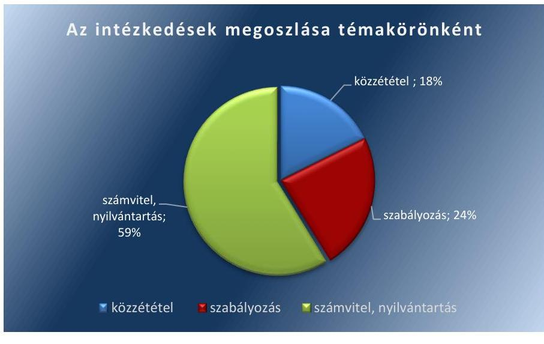

Forrás: ÁSZ szerkesztés
Az intézkedési tervekben rögzített intézkedések közül két intézkedés végrehajtása nem történt meg, mely a számviteli, nyilvántartási területet érintette a 2017. évi beszámoláshoz kapcsolódóan:

- Az NFA az intézkedési tervében meghatározott feladatai több mint 83%-át végrehajtotta, de a 2017. évi beszámoló készítéséhez kapcsolódóan vállalt két feladat, amely a leltározásra és az eszközök értékelésére vonatkozott, nem került végrehajtásra. A 2018. évi beszámoló készítéséhez kapcsolódóan azonban az NFA szabályszerűen végrehajtotta ezeket a feladatokat.

---

Az intézkedések végrehajtásának összesített értékelését a 2. ábra mutatja be:
2. ábra
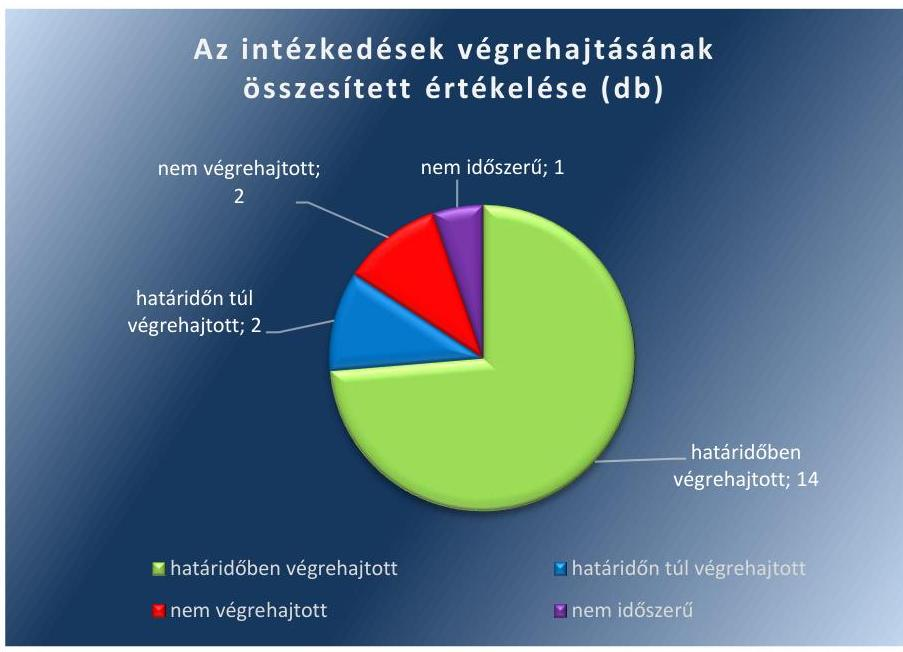

Forrás: ÁSZ szerkesztés
Az MNV Zrt. számvitel, nyilvántartás területét érintő intézkedésének végrehajtása a vállalt határidő miatt még nem volt időszerű. Az ÁEEK a számvitel, nyilvántartás és a szabályozás terén vállalt intézkedések mindegyikét végrehajtotta. Az Agrárminisztérium az intézkedési tervében meghatározott közzétételre vonatkozó feladatot végrehajtotta. Az intézkedések végrehajtásának szervezetenkénti megoszlását a 3. ábra tartalmazza:
3. ábra
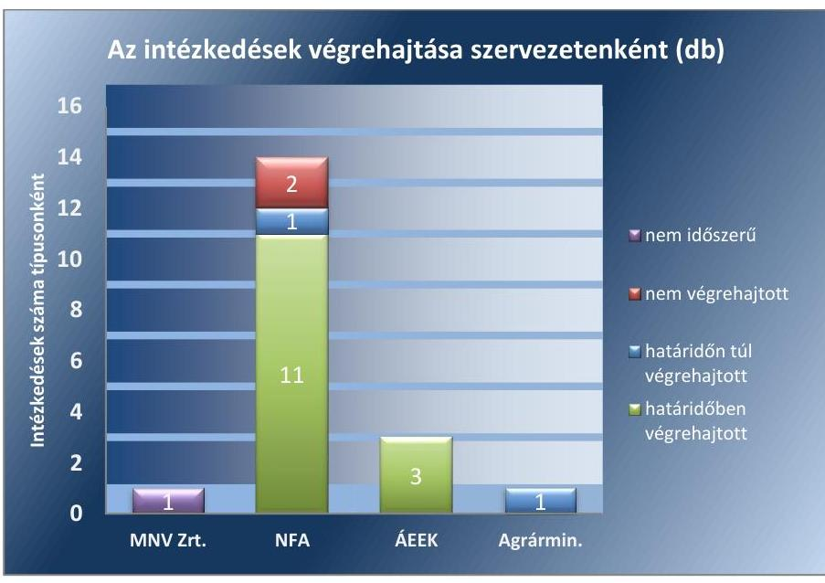

Forrás: ÁSZ szerkesztés
Az egyes ellenőrzött szervezetek intézkedési terveiben meghatározott intézkedéseket és azok végrehajtását részletesen a II/1.-II/4. számú mellékletek mutatják be.

---

# JAVASLATOK 

Az ÁSZ tv. 33. § (1) bekezdésében foglaltak értelmében az ellenőrzött szervezet vezetője köteles a jelentésben foglalt megállapításokhoz kapcsolódó intézkedési tervet összeállítani és azt a jelentés kézhezvételétől számított 30 napon belül az ÁSZ részére megküldeni. Amennyiben az ellenőrzött szervezet vezetője nem küldi meg határidőben az intézkedési tervet, vagy továbbra sem elfogadható intézkedési tervet küld, az Állami Számvevőszék elnöke az ÁSZ tv. 33. § (3) bekezdése a) és b) pontjaiban foglaltakat érvényesítheti.

## az MNV Zrt. vezérigazgatójának

1. Intézkedjen a vagyonkezelésbe adott állami vagyon jogszabály szerinti nyilvántartásáról.
(2.2. sz. megállapítás 3. bekezdésének 1-2. francia bekezdései alapján)

## az Állami Egészségügyi Ellátó Központ főigazgatójának

1. Intézkedjen, hogy a beszámolóról a jogszabályban előírtakkal összhangban a felügyelőbizottság írásbeli jelentésének birtokában döntsenek.
(1.3. sz. megállapítás 3. bekezdésének 1. mondata alapján)
2. Kezdeményezze a gazdasági társaság saját tőke törvényben meghatározott szint alá csökkenése esetén a Ptk.-ban foglaltak szerinti határozathozatalt.
(1.3. sz.
 megállapítás 3. bekezdésének 2. mondata alapján)

---

.

---

# MELLÉKLETEK 

- I. SZ. MELLÉKLET: ÉRTELMEZŐ SZÓTÁR
állami vagyon
nemzeti vagyon
rábízott állami vagyon

A Vtv. alkalmazásában állami vagyonnak minősül:
a) az állam tulajdonában lévő dolog, valamint dolog módjára hasznosítható természeti erő;
b) az a) pont hatálya alá tartozó mindazon vagyon, amely vonatkozásában törvény az állam kizárólagos tulajdonjogát nevesíti;
c) az állam tulajdonában lévő tagsági jogviszonyt megtestesítő értékpapír, illetve az államot megillető egyéb társasági részesedés;
d) az államot megillető olyan immateriális, vagyoni értékkel rendelkező jogosultság, amelyet jogszabály vagyoni értékű jogként nevesít;
e) az állam tulajdonában lévő pénzügyi eszközök.
(Forrás: Vtv. 1. § (2) bekezdése)
A nemzeti vagyonba tartozik:
a) az állam vagy a helyi önkormányzat kizárólagos tulajdonában álló dolgok,
b) az a) pont hatálya alá nem tartozó, az állam vagy a helyi önkormányzat tulajdonában lévő dolog,
c) az állam vagy a helyi önkormányzat tulajdonában lévő pénzügyi eszközök, továbbá az államot vagy a helyi önkormányzatot megillető társasági részesedések,
d) az államot vagy a helyi önkormányzatot megillető bármely vagyoni értékkel rendelkező jogosultság, amelyet jogszabály vagyoni értékű jogként nevesít,
e) Magyarország határa által körbezárt terület feletti légtér,
f) az üvegházhatású gázok kibocsátási egységeinek kereskedelméről szóló törvény szerinti kibocsátási egység és légiközlekedési kibocsátási egység, valamint az ENSZ Éghajlatváltozási Keretegyezménye és annak Kiotói Jegyzőkönyvének végrehajtási keretrendszeréről szóló törvény szerinti kiotói egység,
g) állami vagy helyi önkormányzati fenntartású közgyűjtemény (muzeális intézmény, levéltár, közgyűjteményként működő kép- és hangarchívum, valamint könyvtár) saját gyűjteményében nyilvántartott kulturális javak körébe tartozó dolog, kivéve, ha az állami vagy önkormányzati tulajdon jogszerű létrejötte kétséget kizáró módon nem bizonyítható és a dologra nézve más a tulajdonjogát bizonyítja vagy a kulturális javakra vonatkozó jogszabályokban meghatározott eljárás keretében valószínűsíti,
h) a régészeti lelet,
i) a nemzeti adatvagyon körébe tartozó állami nyilvántartások fokozottabb védelméről szóló törvény szerinti nemzeti adatvagyon.
(Forrás: Nvtv. 1. § (2) bekezdése)
Az Nfatv. 1. § (1) bekezdése szerint a Nemzeti Földalapba tartozó földvagyon tekinthető rábízott vagyonnak. (Forrás: Vtv. 22. § (6) bekezdése; Nfatv. 1. § (1) bekezdése)
Az MNV Zrt. saját vagyonával való gazdálkodásától elkülönített, az MNV Zrt.-re bízott állami vagyon, valamint az ennek értékesítésével és hasznosításával összefüggő bevételek és kiadások (Forrás: Vtv. 22. § (6) bekezdése)

---

tulajdonosi ellenőrzés

A Vtvr. 20. § (2) bekezdése alapján a tulajdonosi ellenőrzés célja az állami vagyonnal való gazdálkodás vizsgálata, ennek keretében a rendeltetésellenes, jogszerűtlen, szerződésellenes, vagy a tulajdonos érdekeit sértő, illetve a központi költségvetést hátrányosan érintő vagyongazdálkodási intézkedések feltárása és a jogszerű állapot helyreállítása, továbbá a vagyonnyilvántartás hitelességének, teljességének és helyességének biztosítása.
Az Nfatv. vhr. 47. § (2) bekezdése szerint a tulajdonosi ellenőrzés célja a földrészlettel való gazdálkodás vizsgálata, ennek keretében a rendeltetésellenes, jogszerűtlen, szerződésellenes, vagy a tulajdonos érdekeit sértő intézkedések feltárása és a jogszerű állapot helyreállítása, továbbá a vagyonnyilvántartás hitelességének, teljességének és helyességének biztosítása.
A 263/2010. (XI. 17.) Korm. rendelet 11. § (1) bekezdése szerint a vagyonkezelési szerződésben foglaltak betartását az NFA ellenőrzi.
(Forrás: Vtvr. 20. § (2) bekezdése, Nfatv. vhr. 47. § (2) bekezdése, 263/2010. (XI. 17.) Korm. rendelet 11. § (1) bekezdése)
tulajdonosi joggyakorlás és vagyongazdálkodás feladata

A Vtv. 2. § (1) bekezdése szerint az állami vagyon rendeltetésének megfelelő - az állami feladatok ellátásához, a társadalmi szükségletek kielégítéséhez, valamint a Kormány gazdaságpolitikája megvalósításának elősegítéséhez szükséges, egységes elveken alapuló, önálló ágazatként megjelenő - hatékony, költségtakarékos, értékmegőrző, értéknövelő felhasználásának biztosítása (közvetlen felhasználás), illetve közvetett hasznosítása (beleértve a vagyoni kör változását eredményező értékesítést), valamint az állami vagyon gyarapítása (ideértve a vagyoni kör bővítését is).
(Forrás: Vtv. 2. § (1) bekezdése)
tulajdonosi joggyakorló Nvtv. 3. § (1) bekezdés 17. pontja szerint, aki a nemzeti vagyon felett az államot vagy a helyi önkormányzatot megillető tulajdonosi jogok és kötelezettségek összességének gyakorlására jogosult.
(Forrás: Nvtv. 3. § (1) bekezdés 17. pontja)

---

# II. SZ. MELLÉKLET: AZ INTÉZKEDÉSI TERVEK VÉGREHAJTÁSÁNAK ÉRTÉKELÉSE

## II/1. SZÁMÚ MELLÉKLET: MAGYAR NEMZETI VAGYONKEZELŐ ZRT.

|  Intézkedési
terv
szerinti
sorszám | Az intézkedési tervben meghatározott feladat | Határidő | Felelős | A feladat végrehajtása  |
| --- | --- | --- | --- | --- |
|   |  | Nem időszerű feladat |  |   |
|  1. | Az Állami Számvevőszék az állami vagyon feletti tulajdonosi joggyakorlással kapcsolatos tevékenységek ellenőrzése tárgyban készített, 18203. sz. jelentésében foglalt megállapítások alapján megküldött intézkedési terv keretében megvalósítandó - az állami vagyon nyilvántartásának fejlesztését érintő - feladatokhoz kapcsolódóan olyan egységes nyilvántartási és lekérdezési rendszer kialakítása, amely biztosítja az Állami Számvevőszék jelentésében megjelölt adattartalom lekérdezhetőségét. | 2019.12.31. | operatív működés
menedzsment
igazgató | A feladat végrehajtása érdekében 2019. április 15-én hatályba lépett „az MNV Zrt. tulajdonosi joggyakorlásába tartozó vagyont érintő Vagyonnyilvántartási Szabályzatáról, különös tekintettel a vagyonkezeléssel összefüggő adatszolgáltatásokra" című a 14/2019. számú vezérigazgatói utasítás. Az egységes nyilvántartási és lekérdezési rendszer kialakítása még nem történt meg, illetve annak végrehajtása még nem időszerű tekintettel az intézkedési tervben vállalt határidőre.  |

---

II/2. SZÁMÚ MELLÉKLET: NEMZETI FÖLDALAPKEZELŐ SZERVEZET/NEMZETI FÖLDÜGYI KÖZPONT

|  Intézkedési
terv
szerint
sorszám | Az intézkedési tervben meghatározott feladat | Határidő | Felelős | A feladat végrehajtása  |
| --- | --- | --- | --- | --- |
|  |   |   |   |   |
|  1/a. | 2017. 12. 31-i leltárban követelések és egyéb elszámolások értékelése Áhsz. és értékelési szabályzat előírásainak megfelelően. Az épületek és egyéb építmények értékelési szabályzatban írtaknak megfelelő értékelése. | az intézkedési
terv szerint már
megtett intéz-
kedés, illetve
folyamatos | Gazdasági Igazgató | Az NFA a 2018. évi beszámoló készítéséhez kapcsolódóan végezte el állami vagyonba tartozó eszközök értékelését a leltározást követően. (A 2017. évre vonatkozó értékelést a nem végrehajtott feladatok rész tartalmazza.)  |
|  1/b. | 2018. 09. 15-ig a FORRÁS SQL rendszer eszköz modul aktiválása és egyedi értékelések megvalósítása a modulban. | 2018.09.15.
illetve
folyamatos | Gazdasági Igazgató | A FORRÁS SQL rendszer eszköz modul aktiválása megtörtént, az egyedi értékeléseket az NFA elvégezte.  |
|  1/c. | Az Épületek, egyéb építmények, továbbá a követelések és az egyéb sajátos elszámolásoknak megfelelő értékelését az Áhsz., és az Számv. tv. 46. § (3) bekezdése és az aktuális értékelési szabályzat alapján a jogszabályi előírásoknak megfelelően megköveteljük. | az intézkedési
terv kiadását
megelőzően teljesült | Gazdasági Igazgató | A feladat végrehajtása érdekében 2018. szeptember 4-én kiadmányozásra került a Nemzeti Földalapkezelő Szervezet vagyonfejezetének Értékelési Szabályzatáról szóló 27/2018. (IX. 04.) NFA utasítás.  |
|  2. | 2017. 12. 31-i leltározás az Áhsz. és a Leltározási és Leltárkészítési szabályzat szerint történt. | az intézkedési
terv szerint már megtett intézkedés | Gazdasági Igazgató | Az NFA a 2018. évi beszámoló készítéséhez kapcsolódóan végezte el a leltározást az Áhsz., valamint a Leltározási és Leltárkészítési szabályzat szerint. (A 2017. évre vonatkozó értékelést a nem végrehajtott feladatok rész tartalmazza.)  |
|  3/a. | Épület, építmények esetében a bruttó érték változást az egyedi kartonokon szerepeltetjük. | 2018.09.15. | Gazdasági Igazgató | A bruttó érték változását az egyedi kartonok alapján a 2018. évi záró eszköznyilvántartás vagyonelemenként tartalmazta, amely összhangban volt az Nvtv. 10. § (1) bekezdésének előírásaival.  |
|  3/b. | Az Erdőrészletek vagyon-nyilvántartási rendszerbe történő megjelenítése informatikai fejlesztés útján 2018 februárjában megvalósult a Nemzeti Földalap vagyonnyilvántartásának szabályairól szóló 11/2011. (II. 22.) Kormányrendelet 3. § (2) bekezdés c) pontja, 4. § ha) és hb) pontjainak rendelkezéseinek eleget téve. További intézkedést nem igényel. | az intézkedési
terv kiadását
megelőzően tel-
jesült | Vagyon-nyilvántar-
tási igazgató | Az erdőrészlet nyilvántartás az „@vatar" rendszerben megvalósult, amely összhangban van a 11/2011. (II. 22.) Korm. rendelet 16. előírásaival.  |

---

|  3/c. | A vagyonkezelési szerződések a vagyon-nyilvántartási rendszerben szerepelnek, melyeknél rögzítésre került a nyilvántartásban az aláírás dátumának, birtokba lépés kezdete, a szerződés lejáratának dátuma, melyekből a vagyonkezelői jog kezdő és lejárati időpontja illetve a határozatlan idejű vagyonkezelői jog megállapítható. A vagyonkezelői joghoz kapcsolódó díjtétel, így ellenértékének összege vagy az ingyenesség ténye is felvezetésre került. További intézkedést nem igényel. | az intézkedési terv kiadását megelőzően teljesült | Vagyon-nyilvántartási igazgató | A nyilvántartás az intézkedési tervben vállalt feladattal összhangban tartalmazza a vagyonkezelői jog kezdő- és lejárati időpontját, a határozatlan idejű vagyonkezelői jogra történő utalást, továbbá a vagyonkezelői jog ellenértékének összegét, illetve az ingyenesség tényét.  |
| --- | --- | --- | --- | --- |
|  3/d. | 2017. december 31-ig megvalósult, a főkönyv felé a @vatar nyilvántartó rendszer feladja a 0 -ás főkönyvi számlaosztályba vezetendő tételeket összesítve. További intézkedést nem igényel. | az intézkedési terv kiadását megelőzően teljesült | Gazdasági igazgató | A feladat végrehajtása az „@vatar" nyilvántartó rendszerben biztosított.  |
|  4. | Az értékelési szabályzat aktualizálása a 4. pontban leírtaknak megfelelően. | 2018.09.03. | Gazdasági igazgató | Az NFK az értékelés szabályzata aktualizálásra került, az Áhsz. 50. § (2) bekezdés d) pontjában foglaltakkal összhangban tartalmazta a vagyonkezelésbe adott eszközök vagyonértékelése során alkalmazott értékelési eljárás elveit, módszerét, dokumentálásának szabályait, felelőseit.  |
|  5/a. | Az nfa.hu honlapon fejlesztésre kerül egy közzétételi felület, ahol az egyes jogszabályok által előírt összeghatár feletti szerződések megtalálhatóak. | 2018.12.31. | Általános
Ennákhelyettes, | A közzététel felülete a NFK honlapján létrehozásra került, ahol az egyes jogszabályok által előírt összeghatárok feletti szerződések megtalálhatóak.  |
|  5/c. | A közzéteendő adatok nyilvánosságra hozatalának rendjét rögzítő szabályzatot elkészítjük. | 2018.11.30. | Általános
Ennákhelyettes, | A Közzétételi Szabályzat a 36/2018. (XI. 30.) számú elnöki utasításban elkészült.  |
|  Határidőn túl végrehajtott feladat |  |  |  |   |
|  5/b. | Az NFA honlapján kifejlesztett közzétételi felületre 2019. május 31-ig folyamatosan feltöltésre kerülnek a jogszabályok által meghatározott szerződések az MNV Zrt. gyakorlatának megfelelően. | 2019. május 31. | Általános
Ennákhelyettes, | A jogszabályok által meghatározott szerződések határidőn túl 2019. július 16-ig kerültek feltöltésre.  |
|  Nem végrehajtott feladatok |  |  |  |   |
|  1/a. | 2017. 12. 31-i leltárban követelések és egyéb elszámolások értékelése Áhsz. és értékelési szabályzat előírásainak megfelelően. Az épületek és egyéb építmények értékelési szabályzatban írtaknak megfelelő értékelése. | az intézkedési terv szerint már megtett intézkedés, illetve folyamatos | Gazdasági igazgató | Az NFA a 2017. évi beszámoló készítéséhez kapcsolódóan nem végezte el állami vagyonba tartozó eszközök értékelését a leltározást követően. (A 2018. évre vonatkozó értékelést a határidőben végrehajtott feladatok rész tartalmazza.)  |
|  2. | 2017. 12. 31-i leltározás az Áhsz.
 és a Leltározási és Leltárkészítési szabályzat szerint történt. | az intézkedési terv szerint már megtett intézkedés | Gazdasági igazgató | Az NFA a 2017. évi beszámoló készítéséhez kapcsolódóan nem végezte el a leltározást az Áhsz., valamint a Leltározási és Leltárkészítési szabályzat szerint. (A 2018. évre vonatkozó értékelést a határidőben végrehajtott feladatok rész tartalmazza.)  |

---

#### II/3. SZÁMÚ MELLÉKLET: ÁLLAMI EGÉSZSÉGÜGYI ELLÁTÓ KÖZPONT

|  Intézkedési
terv
szerinti
sorszám | Az intézkedési tervben meghatározott feladat | Határidő | Felelős | A feladat végrehajtása  |
| --- | --- | --- | --- | --- |
|   |  | Határidőben végrehajtott feladatok |  |   |
|  1.3-a) | Ct-Ecostat integrált gazdasági és gazdálkodási rendszer fejlesztésének megvalósítása, lehetőséget teremtve a vagyonkezelésbe adott ingatlanok értéke változásának nyilvántartására.
Az ÁEEK a vagyonkezelésbe adott ingatlanok analitikus nyilvántartását a CT-Ecostat integrált számviteli, gazdálkodási rendszer tárgyi eszköz moduljában biztosítja. A vagyonkezelésbe adott ingatlanokban történt változásokat (vagyonkezelésbe adás/vagyonkezelésből visszavétel) a vagyonkezelői szerződés megkötését követően rögzíti intézményünk a számviteli (analitikus) nyilvántartásokban. A vagyonkezelésbe adott ingatlanok értékben/változásának rögzíthetőségének megvalósítására a Ct-Ecostat rendszerben fejlesztést valósít meg az ÁEEK, amelynek eredményeként lehetőség nyílik a vagyonkezelésbe adott ingatlanok értékének nyilvántartásokban történő változtatására, annak megjelenítésére. A fejlesztett szoftverben az ÁEEK a vagyonkezelésbe adás folyamata során a Vhr. 14. § (2) bekezdés előírása szerint analitikus nyilvántartásban rögzíti a vagyonkezelésbe adott ingatlanok értékének változását. | 2018.12.31. | Számviteli
Osztályvezető | Az Ct-Ecostat integrált gazdasági és gazdálkodási rendszer fejlesztésének következtében az ÁEEK nyilvántartása a Vhr. 14. § (2) bekezdésének előírása szerint az ingatlanok értékének változását is tartalmazza.  |
|  1.3-b) | Ct-Ecostat integrált gazdasági és gazdálkodási rendszer fejlesztésének megvalósítása, lehetőséget teremtve a vagyonkezelésbe adott ingatlanokra vonatkozó vagyonkezelési szerződések időtartamának rögzítésére.
Az ÁEEK a vagyonkezelésbe adott ingatlanok analitikus nyilvántartását a CT-Ecostat integrált számviteli, gazdálkodási rendszer tárgyi eszköz moduljában biztosítja. A vagyonkezelésbe adott ingatlanokra vonatkozóan a vagyonkezelésbe adás alapját képező vagyonkezelési szerződés időtartama rögzíthetőségének megteremtésére fejlesztést valósít meg az ÁEEK, melynek eredménye- | 2018.12.31. | Számviteli
Osztályvezető | Ct-Ecostat integrált gazdasági és gazdálkodási rendszer bevezetésének következtében a nyilvántartás a vagyonkezelés időtartamát tartalmazza.  |

---

|  Mellékletek |  |  |  |   |
| --- | --- | --- | --- | --- |
|   | ként az analitikus nyilvántartás tartalmazza a vagyonkezelés időtartamát. Az ÁEEK rögzíti az analitikus nyilvántartási rendszerben a vagyonkezelésbe adás időtartamát. |  |  |   |
|  2.a) | Az állami vagyonról szóló 2007. évi CVI. tv, 2017. december végi módosítását követően elkészült – a jogszabályváltozásokkal összhangban – az ÁEEK fenntartásában lévő intézményekkel megkötendő új, egységes szerkezetbe foglalt vagyonkezelési szerződésminta. A minta már teljes körűen tartalmazza a korábbi észrevételek szerinti kiegészítéseket és pontosításokat, többek között a jelen megállapítás szerinti azt a nyilatkozatot is, miszerint a felek a tulajdonosi ellenőrzés eljárásrendjét, a felek jogait és kötelezettségeit a szerződés részének tekintik. 2018. évben valamennyi korábban kötött vagyonkezelési szerződés újrakötése, a szerződések adatainak aktualizálása megtörténik, az új szerződések az új vagyonkezelési szerződésminta alapján készülnek. | 2018.12.31. | Vagyongazdálkodási Főosztályvezető | Az ÁEEK által kötött vagyonkezelési szerződésekben rögzítették, hogy a felek a tulajdonosi ellenőrzés eljárásrendjét, továbbá a felek jogait és kötelezettségeit a szerződés részének tekintik.  |

---

II/4. SZÁMÚ MELLÉKLET: AGRÁRMINISZTÉRIUM

|  Intézkedési
terv
szerinti
sorszám | Az intézkedési tervben meghatározott feladat | Határidő | Felelős | A feladat végrehajtása  |
| --- | --- | --- | --- | --- |
|   |  | Határidőn túl végrehajtott feladat |  |   |
|  1. | A kötelezően közzéteendő adatok nyilvánosságra hozatalának rendjét miniszteri utasításban kell szabályozni. | 2018.12.31. | közigazgatási államtitkár | A vállalt határidőn túl, 2019. január 16-án került kiadmányozásra a közérdekű adatok megismerésére irányuló kérelmek intézésének, továbbá a kötelezően közzéteendő adatok nyilvánosságra hozatalának rendjéről szóló 1/B/2019. (I. 18.) utasítás.  |

---

# FÜGGELÉK: ÉSZREVÉTELEK 

A jelentéstervezetet a Számvevőszék 15 napos észrevételezésre megküldte az ellenőrzött szervezetek vezetőinek az ÁSZ tv. 29. § (1) bekezdése előírásának megfelelően.

A jelentéstervezet megállapításaira az Állami Egészségügyi Ellátó Központ főigazgatója és a Magyar Nemzeti Vagyonkezelő Zrt. vezérigazgatója törvényes határidőben írásban észrevételt tett. Az Agrárminisztérium minisztere, az MFB Magyar Fejlesztési Bank Zrt. elnök-vezérigazgatója, a Nemzeti Földügyi Központ elnöke és a nemzeti vagyon kezeléséért felelős tárca nélküli miniszter nem tett észrevételt.
Az ÁSZ tv. 29. § (3) bekezdésével összhangban az ÁSZ a Függelékben feltünteti az ellenőrzés megállapításaival kapcsolatban tett, figyelembe nem vett észrevételeket, és megindokolja, hogy azokat miért nem fogadta el.

[^0]
[^0]:    * 29. § (1) Az Állami Számvevőszék az ellenőrzési megállapításait megküldi az ellenőrzött szervezet vezetőjének vagy az általa megbízott személynek, és annak, akinek személyes felelősségét állapította meg.
    (2) Az ellenőrzött szervezet vezetője és a felelősként megjelölt személy az ellenőrzés megállapításaira tizenöt napon belül írásban észrevételt tehet.
    (3) Az Állami Számvevőszék az észrevételre a beérkezésétől számított harminc napon belül írásban válaszol. A figyelembe nem vett észrevételeket köteles a jelentésben feltüntetni, és megindokolni, hogy azokat miért nem fogadta el.

---

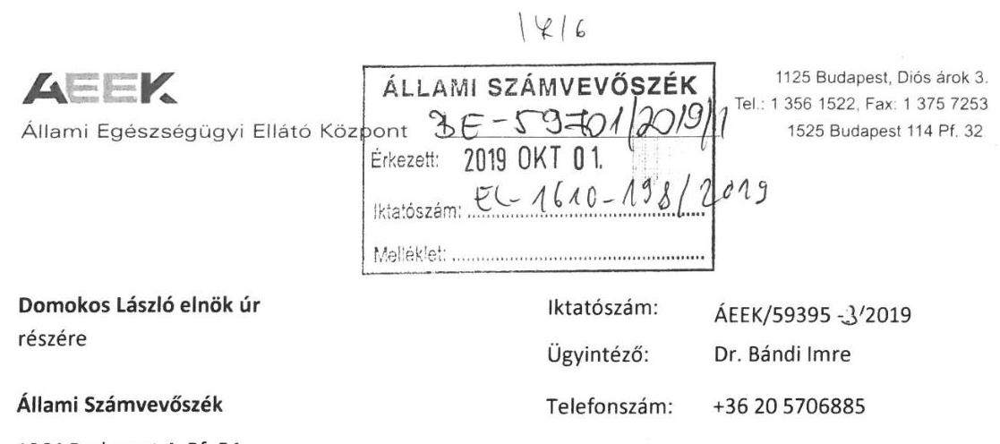

Tárgy: Észrevételek az állami vagyon feletti tulajdonosi joggyakorlással kapcsolatos tevékenységek ellenőrzése tárgyú számvevőszéki jelentés tervezet vonatkozásában

Tisztelt Elnök Úr!

Az Állami Egészségügyi Ellátó Központhoz (ÁEEK) érkezett EL-1610-186/2019. iktatószámú levelét, és a mellékletként csatolt „Az állami vagyon feletti tulajdonosi joggyakorlással kapcsolatos tevékenységek ellenőrzése" tárgyú Számvevőszéki jelentés tervezetet köszönettel megkaptam.

A jelentés tervezetet áttekintettük, mellyel kapcsolatban az ÁEEK tulajdonosi joggyakorló vonatkozásában az intézkedési terv végrehajtásának értékelése tárgyban készült II/C. sz. mellékletnek a feladat végrehajtásával kapcsolatos megállapításaira az alábbi észrevételeket teszem.

# 1.3. számú megállapítás: 

A többségi állami tulajdonú társaságok feletti tulajdonosi joggyakorlás az MNV Zrt. és az MFB Zrt. esetében szabályszerű volt. Az ÁEEK tulajdonosi joggyakorlása nem volt szabályszerű.

Az ÁEEK a többségi tulajdonosi joggyakorlásába tartozó 13 gazdasági társaság közül öt esetben a beszámolóról a Ptk. 3:120.§ (2) bekezdésében foglaltak ellenére a felügyelőbizottság írásbeli jelentése nélkül döntött. A saját tőke törvényben meghatározott szint alá csökkenése esetén két esetben a Ptk. 3:189.§ (2) bek. foglaltak ellenére a pótbefizetés előírásáról, a törzstöke mértékét elérő saját tőke más módon való biztosításáról vagy a törzstöke leszállításáról, illetve ezek hiányában a társaságok átalakulásáról, egyesüléséről, szétválásáról vagy jogutód nélküli megszüntetéséről az ÁEEK nem határozott.

---

# A 

Állami Egészségügyi Ellátó Központ

Az 1.3. sz. megállapításokat kérjük módosítani, azzal, hogy a megállapításokkal kapcsolatosan intézkedési terv készítését nem látjuk indokoltnak.

Indoklás

## 1.3. sz. megállapítás 3. bekezdésének 1. mondatához:

Az ÁEEK tulajdonosi joggyakorlásába tartozó gazdasági társaságoknál alapvető elvárás, hogy az éves beszámolóikat a Felügyelő Bizottság elfogadó határozatával együtt terjesszék a tulajdonosi joggyakorló elé. A tulajdonosi joggyakorló az éves beszámolók elfogadásakor a Felügyelő Bizottság határozata tükrében dönt. Valószínűsíthetően adatszolgáltatási probléma képezheti a jelen pontba foglalt megállapítás alapját.

### 1.3. sz. megállapítás 3. bekezdésének 2. mondatához:

A megállapítás egy egészségügyi szolgáltatóként működő (konkrétan: kórház) gazdasági társaságra vonatkozik, ahol a jegyzett tőke és saját tőke viszonya nem felelt meg a jogszabályi elvárásoknak. A helyzet megoldása érdekében a tulajdonosi joggyakorló megtette a szükséges lépést és kezdeményezte a gazdasági társaság költségvetési szervvé történő átalakítását.

Kérem, hogy a jelentés tervezet véglegezésekor fenti észrevételeimet figyelembe venni szíveskedjék. Elnök Úr együttműködését előre is köszönöm!

Budapest, 2019. 09. 26.
Tisztelettel:
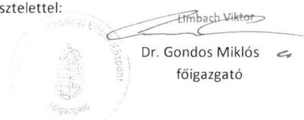

---

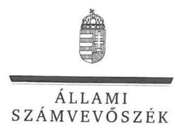

ELNÖK

Ikt.szám: EL-1610-201/2019.

# Dr. Gondos Miklós úr   főigazgató 

Állami Egészségügyi Ellátó Központ

## Budapest

## Tisztelt Főigazgató Úr!

„Az állami vagyon feletti tulajdonosi joggyakorlással kapcsolatos tevékenységek ellenőrzése" címmel készített számvevőszéki jelentéstervezetre tett észrevételeit megkaptam.
Az Állami Számvevőszék észrevételekre vonatkozó álláspontjáról a felügyeleti vezető által készített részletes tájékoztatást csatoltán megküldöm.
Tájékoztatom Főigazgató urat, hogy a számvevőszéki jelentésben - az Állami Számvevőszékről szóló 2011. évi LXVI. törvény 29. § (3) bekezdése alapján - a figyelembe nem vett észrevételeket szerepeltetjük az elutasítás indokának feltüntetésével.

Budapest, 2019. 10. 28.
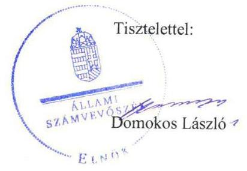

Melléklet: Tájékoztatás az észrevételek kezeléséről

---

# Tájékoztatás az észrevételek kezeléséről 

„Az állami vagyon feletti tulajdonosi joggyakorlással kapcsolatos tevékenységek ellenőrzése" című számvevőszéki jelentéstervezetre (továbbiakban: jelentéstervezet) az ÁEEK/593953/2019. iktatószámú, 2019. szeptember 26-án kelt levelében megküldött észrevételeit áttekintettem. Az észrevételek kezeléséről az alábbi tájékoztatást adom.

## 1. A jelentéstervezet 1.3. számú megállapítás 3. bekezdésének 1. mondatával kapcsolatban tett észrevétel

Az észrevételben jelezték, hogy az Állami Egészségügyi Ellátó Központ tulajdonosi joggyakorlásába tartozó gazdasági társaságoknál alapvető elvárás, hogy az éves beszámolóikat a Felügyelő Bizottság elfogadó határozatával együtt terjesszék a tulajdonosi joggyakorló elé. A tulajdonosi joggyakorló az éves beszámolók elfogadásakor a Felügyelő Bizottság határozata tükrében dönt. Az észrevétel szerint a jelentéstervezetben szereplő megállapítás alapját valószínűsíthetően adatszolgáltatási probléma okozhatta. Az észrevételben továbbá kérték az érintett megállapítás módosítását, hogy ahhoz kapcsolódóan intézkedési terv készítése nem indokolt.
Az Állami Számvevőszék (továbbiakban: ÁSZ) az ellenőrzési megállapításait az adatszolgáltatás során a részére törvényi határidőben rendelkezésre bocsátott dokumentumokra alapozva fogalmazza meg. A teljességi és hitelességi nyilatkozatuk szerint az ÁSZ részére átadott dokumentumok, adatok megbízhatóak, és a bekért adatokra, dokumentumokra vonatkozóan teljes körű információt tartalmaznak. A teljességi és hitelességi nyilatkozat alapján az adatszolgáltatás során nem bocsátottak az ellenőrzés rendelkezésére olyan dokumentumot, amely igazolta volna, hogy a tulajdonosi joggyakorló a beszámolóról a felügyelő bizottság írásbeli jelentése birtokában döntött. Az előbbiekre tekintettel az észrevételt nem fogadjuk el, a jelentéstervezet észrevétellel érintett megállapításának és ahhoz kapcsolódó javaslatának módosítása nem indokolt.

## 2. A jelentéstervezet 1.3. számú megállapításának 3. bekezdésének 2. mondatával kapcsolatban tett észrevétel

Az észrevételben jelezték, hogy a jegyzett tőke és a saját tőke viszonyának jogszabályi előírásoknak való megfelelősége érdekében a tulajdonosi joggyakorló a szükséges lépést megtette, és kezdeményezte a gazdasági társaság költségvetési szervvé történő átalakítását. Az észrevételben továbbá kérték az érintett megállapítás módosítását, hogy ahhoz kapcsolódóan intézkedési terv készítése nem indokolt.

---

Az ellenőrzött időszakot követően megtett intézkedésről adott tájékoztatását köszönjük, az a jelentéstervezet ellenőrzött időszakra vonatkozóan megfogalmazott megállapítását és az ahhoz kapcsolódó javaslatot nem befolyásolja, ezért a jelentéstervezet módosítása nem indokolt.

Budapest, 2019. 04. 08.

Pető Krisztina
felügyeleti vezető

---

# MNV MAGYAR NEMZETI   VAGYONKEZELŐ ZRT   VEZÉRIGAZGATÓ 

Állami Számvevőszék

## Domokos László

elnök

1052 Budapest
Apáczai Cs. J. u. 10.

ÁLLAMI SZÁMVEVŐSZÉK
$3 E-59697160 / 911$
Ésazett: 2018 SZPT 20
Hozzam: $EL-1610-192 / 24$
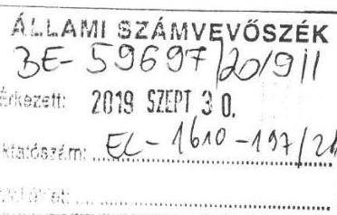

Ikt. sz.: MNV/01/8933/2019.
Hiv. sz.: EL-1610-186/2019.

Tisztelt Elnök Úr!
Tájékoztatom, hogy a 2019. szeptember 17. napján, ,,Az állami vagyon feletti tulajdonosi joggyakorlással kapcsolatos tevékenységek ellenőrzése" tárgyában kézhez vett, EL-1610-186/2019. iktatószámú számvevőszéki jelentéstervezethez az alábbi észrevételt tesszük.

A jelentéstervezet 27. oldalán a II/1. számú mellékletben szereplő, az intézkedési tervben meghatározott feladathoz tartozó felelős megjelölését kérjük, szíveskedjenek az „Állami Vagyonnyilvántartási Kft. útján"
 az ingó- és ingatlanvagyonért felelős vezérigazgató-helyettes/vagyonnyilvántartási igazgató" megjelölésre módosítani, tekintettel arra, hogy az MNV Zrt. 621/2018. (XII.12.) IG.sz. határozatával módosította és 2019. január 1-én hatályba lépett Szervezeti és Működési Szabályzata („SzMSz") alapján az Operatív Működés Menedzsment Igazgatóság ezen elnevezéssel megszűnt, és az érintett feladat az SzMSz 19. § (11) bekezdése alapján - az Állami Vagyonnyilvántartási Kft. útján - a Vagyonnyilvántartási Igazgatóság hatáskörébe került.

Megjegyezzük továbbá, hogy a jelentéstervezet 27. oldalán szereplő, az állami vagyon nyilvántartásának fejlesztését előíró feladat végrehajtása a „Nemzeti Hírközlési és Informatikai Tanácsról, valamint a Digitális Kormányzati Ügynökség Zártkörűen Működő Részvénytársaság és a kormányzati informatikai beszerzések központosított közbeszerzési rendszeréről" szóló 301/2018. (XII. 27.) Korm. rendelet 30 § (4) - (6) bekezdéseiben elrendelt 150 napos szerződéskötési korlátozásra tekintettel késedelmet szenved. A szerződéskötési korlátozás lejártát követően lefolytatásra kerülő informatikai tárgykörű beszerzési eljárások időigénye - a múltbeli tapasztalatok hiányában - az MNV Zrt. számára nem ismert, a gyakorlati információk rendelkezésre állását követően az MNV Zrt. megvizsgálja az intézkedési tervben vállalt határidő módosításának lehetőségét.

Kérem Elnök Urat, hogy a jelentés véglegesítése során jelen észrevételünket szíveskedjenek figyelembe venni.

Budapest, 2019. szeptember 30.
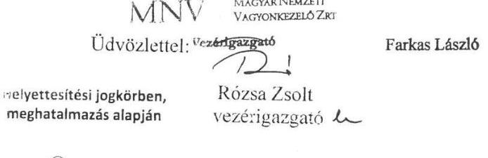

Cím: 1133 Budapest, Pőczei út 56. Postacím: 1399 Budapest, Pf. 708.
Telefon: +36 1 237-4400 Fax: +36 1 237-4100 Web: www.mnv.hu E-mail: info@mnv.hu

---

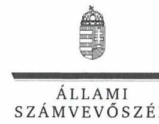

ELHÖK

Ikt.szám: EL-1610-200/2019.

# Rózsa Zsolt János úr 

vezérigazgató
Magyar Nemzeti Vagyonkezelő Zártkörűen Működő Részvénytársaság

## Budapest

## Tisztelt Vezérigazgató Úr!

„Az állami vagyon feletti tulajdonosi joggyakorlással kapcsolatos tevékenységek ellenőrzése" címmel készített számvevőszéki jelentéstervezetre tett észrevételeit megkaptam.
Az Állami Számvevőszék észrevételekre vonatkozó álláspontjáról a felügyeleti vezető által készített részletes tájékoztatást csatoltan megküldöm.
Tájékoztatom Vezérigazgató urat, hogy a számvevőszéki jelentésben - az Állami Számvevőszékről szóló 2011. évi LXVI. törvény 29. § (3) bekezdése alapján - a figyelembe nem vett észrevételeket szerepeltetjük az elutasítás indokának feltüntetésével.

Budapest, 2019. 09. hó 30. nap
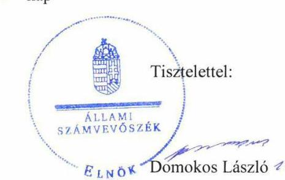

Melléklet: Tájékoztatás az észrevételek kezeléséről

---

# Tájékoztatás az észrevételek kezeléséről 

„Az állami vagyon feletti tulajdonosi joggyakorlással kapcsolatos tevékenységek ellenőrzése" című számvevőszéki jelentéstervezetre (továbbiakban: jelentéstervezet) az MNV/01/8933/21/2019. iktatószámú, 2019. szeptember 30-án kelt levelében megküldött észrevételeit áttekintettem. Az észrevételek kezeléséről az alábbi tájékoztatást adom.

## 1. A jelentéstervezet 27. oldal II/1. számú mellékletében szereplő táblázat „Felelős" oszlopához kapcsolódóan tett észrevétel

Észrevételükben jelezték, hogy az intézkedési terv felelősét, tekintettel a 2019. január 1-jén hatályba lépett Szervezeti és Működési Szabályzat módosítására, indokolt az „Állami Vagyonnyilvántartási Kft. útján az ingó- és ingatlanvagyonért felelős vezérigazgató-helyettes/vagyonnyilvántartási igazgató" megjelölésre módosítani.
Az Állami Számvevőszék a jelentéstervezet mellékletében az intézkedési terv felelőseként a tudomásul vett intézkedési tervben megjelölt felelőst rögzítette. Tekintettel arra, hogy a jelentéstervezetben az intézkedési terv tudomásul vételének időpontjában aktuális felelős szerepel, a jelentéstervezet érintett részének módosítása nem indokolt.

## 2. A jelentéstervezet 27. oldal II/1. számú mellékletében szereplő táblázat „Határidő" oszlopához kapcsolódóan adott tájékoztatás

Levelükben tájékoztatást adtak arról, hogy a szerződéskötési korlátozásra tekintettel az intézkedési terv határidejének felülvizsgálata szükséges a Magyar Nemzeti Vagyonkezelő Zártkörűen Működő Részvénytársaság részéről.
Az intézkedési terv határidejével kapcsolatos tájékoztatását köszönjük, az a jelentéstervezetben rögzítetteket nem befolyásolja, így annak módosítása nem indokolt.

Budapest, 2019.
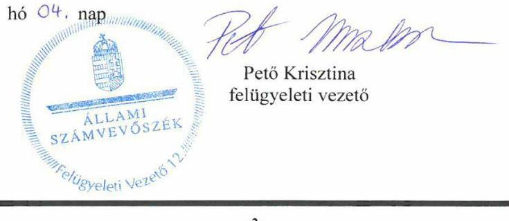

---

.

---

# RÖVIDÍTÉSEK JEGYZÉKE 

${ }^{1}$ Alaptörvény
${ }^{2}$ Nvtv.
${ }^{3}$ Vtv.
${ }^{4}$ MNV Zrt.
${ }^{5}$ NFK
${ }^{6}$ NFA
${ }^{7}$ ÁEEK
${ }^{8}$ Ttv.
${ }^{9}$ EVÖ tv.
${ }^{10}$ 2013. évi XXV. törvény
${ }^{11}$ 2006. évi CXXXII. törvény
${ }^{12}$ MFB Zrt.
${ }^{13}$ MFB tv.
${ }^{14}$ Nfatv.
${ }^{15}$ ÁSZ
${ }^{16}$ 2019. évi XL. törvény
${ }^{17}$ ÁSZ tv.
${ }^{18}$ Bkr.
${ }^{19}$ Vtvr.
${ }^{20}$ 262/2010. (XI. 17.) Korm. rendelet
${ }^{21}$ Ptk.
${ }^{22}$ Áhsz.
${ }^{23}$ Számv. tv.
${ }^{24}$ Ávr.

Magyarország Alaptörvénye (hatályos: 2011. április 25-től)
2011. évi CXCVI. törvény a nemzeti vagyonról (hatályos: 2011. december 31-től) az állami vagyonról szóló 2007. évi CVI. törvény (hatályos: 2007. szeptember 25-től)
Magyar Nemzeti Vagyonkezelő Zrt.
Nemzeti Földügyi Központ
Nemzeti Földalapkezelő Szervezet
Állami Egészségügyi Ellátó Központ
2012. évi XXXVIII. törvény a települési önkormányzatok fekvőbeteg-szakellátó intézményeinek átvételéről és az átvételhez kapcsolódó egyes törvények módosításáról (hatályos: 2012. április 28-tól)
2011. évi CLXXXVI. törvény Esztergom Város Önkormányzata egyes intézményeinek átvételéről (hatályos: 2011. december 28-tól)
2013. évi XXV. törvény a fekvőbeteg-szakellátó és egyes fekvőbetegszakellátóhoz kapcsolódó egészségügyi háttérszolgáltatást nyújtó, 100%-os állami tulajdonban lévő, valamint azok 100%-os tulajdonában lévő gazdasági társaságok által ellátott feladatok központi költségvetési szervek általi átvételéről, valamint az ezzel kapcsolatos eljárási kérdések rendezéséről (hatályos: 2013. március 28-tól)
2006. évi CXXXII. törvény az egészségügyi ellátórendszer fejlesztéséről (hatályos: 2007. január 1-jétől)
Magyar Fejlesztési Bank Zrt.
2001. évi XX. törvény a Magyar Fejlesztési Bank Részvénytársaságról (hatályos: 2001. június 15-től)
2010. évi LXXXVII. törvény a Nemzeti Földalapról (hatályos: 2010. szeptember 1-jétől)
Állami Számvevőszék
2019. évi XL. törvény a mezőgazdasági termékpiacok szervezésének egyes kérdéseiről, a termelői és a szakmaközi szervezetekről szóló 2015. évi XCVII. törvény módosításáról, valamint a Nemzeti Földügyi Központ létrehozásával összefüggő egyes törvénymódosításokról (hatálytalan: 2019. július 3-tól)
2011. évi LXVI. törvény az Állami Számvevőszékről (hatályos: 2011. július 1-jétől) 370/2011. (XII. 31.) Korm. rendelet a költségvetési szervek belső kontrollrendszeréről és belső ellenőrzéséről (hatályos: 2012. január 1-jétől) 254/2007. (X. 4.) Korm. rendelet az állami vagyonnal való gazdálkodásról (hatályos: 2007. október 4-től)
262/2010. (XI. 17.) Korm. rendelet a Nemzeti Földalapba tartozó földrészletek hasznosításának részletes szabályairól (hatályos: 2010. december 2-tól) 2013. évi V. törvény a Polgári Törvénykönyvről (hatályos: 2014. március 15-től) 4/2013. (I. 11.) Korm. rendelet az államháztartás számviteléről (hatályos: 2014. január 1-jétől)
2000. évi C. törvény a számvitelről (hatályos: 2001. január 1-jétől) 368/2011. (XII. 31.) Korm. rendelet az államháztartásról szóló törvény végrehajtásáról (hatályos: 2012. január 1-jétől)

---

${ }^{25}$ Info tv.
${ }^{26}$ 11/2011. (II.22.) Korm. rendelet
2011. évi CXII. törvény az információs önrendelkezési jogról és az információszabadságról (hatályos: 2011. július 27-től)
11/2011. (II. 22.) Korm. rendelet a Nemzeti Földalap vagyonnyilvántartásának szabályairól (hatályos: 2011. március 9-től)

---

# ÁLLAMI SZÁMVEVŐSZÉK 

1052 Budapest, Apáczai Csere János utca 10.
Levélcím: 1364 Budapest, Pf. 54
Telefon: +36 1 4849100 Telefax: +36 1 4849200
www.asz.hu
