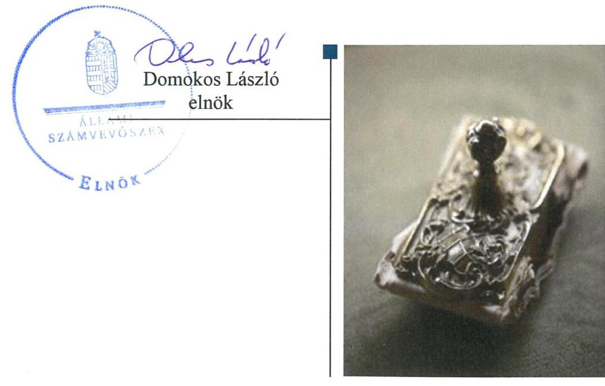
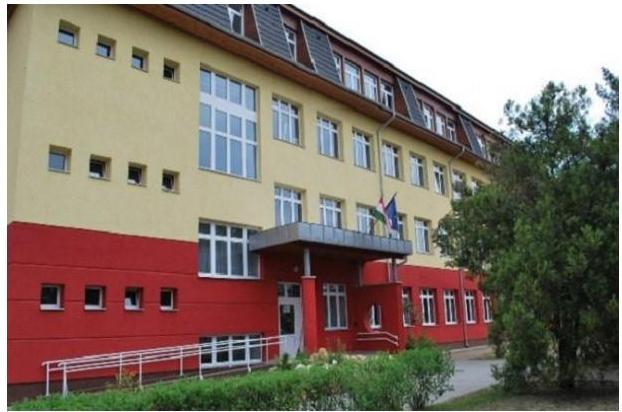
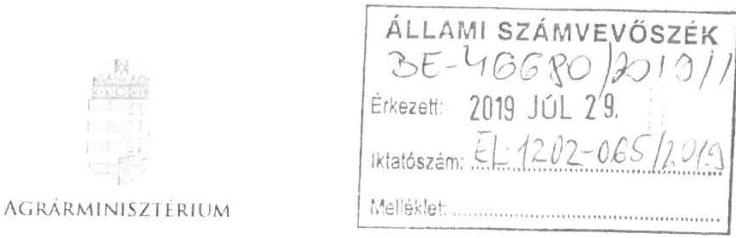
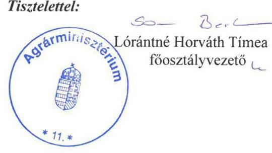
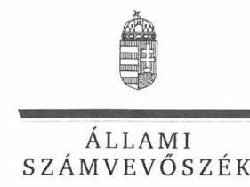
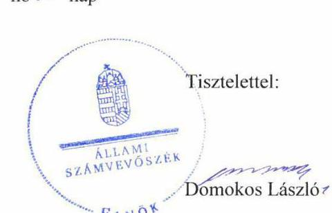
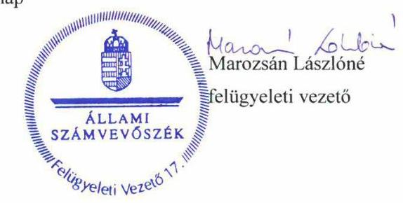

# Jelenetés 

## Központi költségvetési szervek ellenőrzése

Vay Ádám Gimnázium, Mezőgazdasági Szakképző Iskola és Kollégium 2019.

---

# Jelentés 

## Központi költségvetési szervek ellenőrzése

Vay Ádám Gimnázium, Mezőgazdasági Szakképző Iskola és Kollégium
2019. 10. hó 30. nap

---

# AZ ELLENŐRZÉST FELÜGYELTE:

## MAROZSÁN LÁSZLÓNÉ felügyeleti vezető

## AZ ELLENŐRZÉST VEZETTE ÉS A VÉGREHAJTÁSÁÉRT FELELŐS:

## ASZTALOSNÉ ZUPCSÁN ERIKA ellenőrzésvezető

## A PROGRAM ÖSSZEÁLLÍTÁSÁÉRT FELELŐS:

## TÓTPÁL SZABOLCS osztályvezető

IKTATÓSZÁM: EL-2068-001/2019.

TÉMASZÁM: 2450

ELLENŐRZÉS-AZONOSÍTÓ SZÁM: V079177

Jelentéseink az Országgyűlés számítógépes hálózatán és az Interneta a www.asz.hu címen is olvashatóak.

---

# TARTALOMJEGYZÉK 

■ ÖSSZEGZÉS ..... 5
■ AZ ELLENŐRZÉS CÉLJA ..... 6
■ AZ ELLENŐRZÉS TERÜLETE ..... 7
■ AZ ELLENŐRZÉS HÁTTERE, INDOKOLTSÁGA ..... 8
■ A JELENTÉS LÉNYEGES KÉRDÉSKÖREI ..... 9
■ AZ ELLENŐRZÉS HATÓKÖRE ÉS MÓDSZEREI ..... 10
■ MEGÁLLAPÍTÁSOK ..... 13
■ JAVASLATOK ..... 17
■ MELLÉKLETEK ..... 19
I. sz. melléklet: Értelmező szótár ..... 19
■ FÜGGELÉKEK ..... 21
I. sz. függelék a jelentéshez ..... 21
II. sz. függelék: Észrevételek ..... 22
■ RÖVIDÍTÉSEK JEGYZÉKE ..... 29

---

.

---

# ÖSSZEGZÉS 

A Vay Ádám Gimnázium, Mezőgazdasági Szakképző Iskola és Kollégium belső kontrollrendszere, pénzügyi és vagyongazdálkodása nem volt szabályszerű. Nem biztosította a közpénzek átlátható, szabályos felhasználását és a nemzeti vagyonnal történő elszámoltatható gazdálkodást. A felelős gazdálkodás nem érvényesült. Nem volt védett a korrupcióval szemben.

## Az ellenőrzés társadalmi indokoltsága

Magyarország versenyképességének és a magyar gazdaság fejlődésének alapvető feltétele a magyar munkavállalók megfelelő szakmai képzettsége és felkészültsége, amelyben a szakképzési rendszernek döntő szerepe van. A mezőgazdaság vonatkozásában is kiemelten fontos ez, hiszen a magyar mezőgazdaság piaci versenyképességét és eredményességét nagymértékben befolyásolja az agrárszférában dolgozók képzettsége, felkészültsége. A szakképzés legjelentősebb színterei a szakképző iskolák. Az eredményes és célszerű szakképzés alapja és alapvető feltétele a szakképző intézmények közpénzekkel és a közvagyonnal való törvényes, átlátható és a korrupcióval szembeni védelmet biztosító működése és gazdálkodása. Ezért ezen szervezetekkel szemben is alapvető társadalmi igény, hogy a rájuk bízott közpénzekkel, közvagyonnal szabályosan gazdálkodjanak. Emellett a szakképzésben részt vevő pedagógusok, tanulók és a szülők jogos elvárása, hogy a szakképző iskolák működése átlátható és elszámoltatható legyen. Mindezen igényekkel összhangban, a közpénzügyek átláthatóságának előmozdítása, a közvagyon védelme érdekében került sor az agrárszakképző iskolák belső kontrollrendszerének és gazdálkodásának ellenőrzésére.

## Főbb megállapítások, következtetések, javaslatok

A Vay Ádám Gimnázium, Mezőgazdasági Szakképző Iskola és Kollégium a belső kontrollrendszer részeként a kontrollkörnyezetet nem szabályszerűen alakította ki, a vagyonnyilatkozat-tételi kötelezettséget a szervezeti és működési szabályzatában nem tüntette fel. Nem mérte fel a szervezeti célokkal összefüggő kockázatokat. A kontrolltevékenységek gyakorlása nem alapozta meg a szabályszerű működés feltételeit. Az információs és kommunikációs rendszer működtetése, illetve a monitoring rendszer keretében a belső ellenőrzés működtetése nem volt szabályszerű. A feltárt szabálytalanságok miatt a Vay Ádám Gimnázium, Mezőgazdasági Szakképző Iskola és Kollégium belső kontrollrendszere a szabályszerű működés és gazdálkodás feltételeit nem biztosította.

A Vay Ádám Gimnázium, Mezőgazdasági Szakképző Iskola és Kollégium pénzügyi gazdálkodása nem volt szabályszerű, mivel a költségvetési könyvvezetés keretében a kötelezettségvállalásokról, más fizetési kötelezettségekről szabályszerű nyilvántartást nem vezetett.

A Vay Ádám Gimnázium, Mezőgazdasági Szakképző Iskola és Kollégium nem biztosította a szabályszerű vagyongazdálkodást, a 2016-2017. években nem készített leltárt.

A Vay Ádám Gimnázium, Mezőgazdasági Szakképző Iskola a korrupciós kockázatok elleni védelmet biztosító integritási kontrollokat nem építette ki, kockázatelemzést nem végzett, a teljesítmény mérés feltételeit nem biztosította.

Az Állami Számvevőszék az intézkedések megtétele céljából a Vay Ádám Gimnázium, Mezőgazdasági Szakképző Iskola és Kollégium igazgatója részére 12 javaslatot fogalmazott meg.

---

# AZ ELLENŐRZÉS CÉLJA 

AZ ELLENŐRZÉS CÉLJA annak megítélése volt, hogy az ellenőrzött intézményre vonatkozó irányító szervi feladatellátás a jogszabályi előírások betartásával történt-e; az intézménynél a belső kontrollrendszer kialakítása és múködtetése szabályszerű volt-e, biztosította-e az átlátható, szabályszerű, gazdaságos, hatékony és eredményes gazdálkodás feltételeit; az intézmény pénzügyi és vagyongazdálkodása megfelelt-e a jogszabályi előírásoknak és belső szabályzatainak. Az ellenőrzés keretében az ÁSZ1 értékelte, hogy a központi költségvetési szervnél kiépítették és erősítették-e korrupciós kockázatok kezelését szolgáló integritás kontrollokat, megteremtették-e a teljesítményellenőrzés feltételeit. Az ellenőrzés célja volt továbbá annak megállapítása, hogy az ellenőrzött szervezet gazdálkodása megfelelt-e annak az Alaptörvényben meghatározott alapvetésnek, hogy Magyarország a kiegyensúlyozott, átlátható és fenntartható költségvetési gazdálkodás elvét érvényesíti. Érvényesült-e a nemzeti vagyon kezelésének és védelmének célja, azaz a szervezet vagyona a közérdeket szolgálta-e a közös szükségletek kielégítése és a természeti erőforrások megóvása, valamint a jövő nemzedékek szükségleteinek figyelembevétele mellett.

---

# **AZ ELLENŐRZÉS TERÜLETE**

## **Vay Ádám Gimnázium, Mezőgazdasági Szakképző Iskola és Kollégium**

Az 1962-ben alapított, szakmai középfokú oktatást végző Intézmény2 felett a Minisztérium3 2013. augusztus 1. óta gyakorolja az irányítási, fenntartói jogokat és hatásköröket.

Az Intézmény székhelye a Szabolcs-Szatmár-Bereg megyei Baktalórántháza, több telephelye van Baktalórántházán és Nyírmadán. Az Intézmény közfeladata volt az ellenőrzött időszakban a gimnáziumi, a szakgimnáziumi, a szakközépiskolai és a kollégiumi nevelés-oktatás nappali és esti tagozaton. Az Intézmény tanulói létszáma a 2017/2018. évben 680 fő volt. Szakmai középfokú oktatás keretében képeztek mezőgazdasági, élelmiszeripari, informatikai, vendéglátásturisztikai, építészeti, valamint rendészeti, honvédelmi és közszolgálati szakembereket.

Az Intézményben az ellenőrzött időszakban átalakítás, átszervezés nem történt. Az igazgató személye a 2014. évi kinevezést követően nem változott, a gazdasági vezető személye 2017-ben változott.

Az Intézmény maga látta el a gazdálkodásával kapcsolatos feladatokat, illetve gazdasági szervezete a Minisztérium fenntartásában lévő, gazdasági szervezettel nem rendelkező több középiskola gazdálkodási feladatait is ellátta.

Az Intézmény Alapító Okirata szerint a köznevelési feladatok ellátásához nemzeti vagyonnal gazdálkodott.

Az Intézmény költségvetési kiadása 2016-ban 997 millió Forint, 2017-ben 1119 millió Forint, az Irányító szervtől működéséhez kapott költségvetési támogatása 2016-ban 766,4, 2017-ben 792,8 millió Forint volt.

---

# AZ ELLENŐRZÉS HÁTTERE, INDOKOLTSÁGA 

Az ellenőrzés a szervezet kockázatértékelése alapján, az egyedi és lényeges jellemzők figyelembevételével, az ellenőrzésre kiválasztott modullal történt. Az ÁSZ az ellenőrzései során feltárja a gazdálkodást, az intézmény átalakulását, átszervezését érintő szabályozások esetleges hiányosságait, a szabályozással nem érintett gazdálkodási területeket, rámutathat a vagyongazdálkodási tevékenység - ezen belül a tulajdonosi joggyakorlás és vagyonkezelés - esetleges szabálytalanságaira, értékeli az állami vagyon nyilvántartására és elszámolására vonatkozó eljárásokat.

Az ellenőrzés várhatóan hozzájárul a központi intézmények pénzügyi helyzetének pontosabb megítéléséhez, és a jó gyakorlat kialakításán és terjesztésén keresztül az ellenőrzések elősegíthetik a gazdálkodás szabályszerűségének javítását. A központi költségvetés rendszerében zajló folyamatok holisztikus elemzései, a kockázatok folyamatos figyelemmel kísérésének módszerével, az így kiválasztott szervezetek célzott, hatékony ellenőrzéseivel az ÁSZ betölti a legfőbb gazdasági ellenőrző szerv küldetését.

Az integritás- és belső kontroll modul a központi költségvetési szerv működésének irányítottságát, korrupció elleni védettségét értékeli. A belső kontrollrendszer kialakítása és működtetése nélkül nem valósítható meg a közpénzek, a közvagyon átlátható, szabályos, gazdaságos, hatékony és eredményes felhasználása. A belső kontrollrendszer azt a célt szolgálja, hogy a költségvetési szervek működésük és gazdálkodásuk során a tevékenységeket szabályszerűen hajtsák végre, teljesítsék elszámolási kötelezettségeiket és megvédjék az erőforrásokat a veszteségektől, a károktól és a nem rendeltetésszerű használattól. A belső kontrollrendszer magában foglalja mindazon elveket, eljárásokat és belső szabályzatokat, melyek biztosítják, hogy a költségvetési szerv valamennyi tevékenysége és célja összhangban legyen a szabályszerűséggel, szabályozottsággal, valamint a gazdaságosság, hatékonyság és eredményesség követelményeivel, az eszközökkel és forrásokkal való gazdálkodásban ne kerüljön sor pazarlásra, visszaélésre, rendeltetésellenes felhasználásra. Megfelelő, pontos és naprakész információk álljanak rendelkezésre a költségvetési szerv működésével kapcsolatosan, és a belső kontrollrendszer harmonizációjára, összehangolására vonatkozó jogszabályok végrehajtásra kerüljenek. Az integritás kontrollok kiépítése, erősítése a szervezet korrupciós kockázatainak kezelését szolgálja. A teljesítménykövetelmények meghatározása és működtetése megalapozhatja a központi költségvetési szervnél a teljesítményellenőrzés lefolytatását.

Az egyes ellenőrzések megállapításaival és egy időszak ellenőrzési eredményeinek elemzésével az ÁSZ ráirányíthatja a jogalkotók figyelmét a központi alrendszerben vagy annak egy ágazatában esetlegesen felmerülő pénzügyi, szabályozási feszültségekre. Az elvégzett ellenőrzések során az ÁSZ „jó gyakorlatokat" is azonosíthat, melyeket tanácsadó funkciója keretében szélesebb körben is megismertethet az érintettekkel, ezáltal is hozzájárulva a költségvetési rendszer szabályozott, átlátható, kiegyensúlyozott és fenntartható működéséhez.

---

# A JELENTÉS LÉNYEGES KÉRDÉSKÖREI 

1. Az Irányító szerv ellenőrzött Intézményre vonatkozó feladatellátása szabályszerű volt-e?
2. Az Intézmény belső kontrollrendszerének kialakítása és müködtetése biztositotta-e a közpénzekkel és a nemzeti vagyonnal történő szabályszerű, átlátható gazdálkodást, illetve a beszámolási és adatszolgáltatási kötelezettségek szabályszerű teljesitését?
3. Az Intézmény pénzügyi gazdálkodása szabályszerű volt-e?
4. Az Intézmény vagyongazdálkodása szabályszerű volt-e?
5. Az Intézménynél alakítottak-e ki a teljesítmény mérésére alkalmas követelményeket?

---

# AZ ELLENŐRZÉS HATÓKÖRE ÉS MÓDSZEREI 

## Az ellenőrzés típusa

Megfelelőségi ellenőrzés.

## Az ellenőrzött időszak

- Az Intézmény pénzügyi gazdálkodásának ellenőrzése tekintetében a 2016. év, az integritás és belső kontroll rendszerének valamint vagyongazdálkodásának ellenőrzése tekintetében a 2016-2017. évek.
- Az Irányító szerv feladatainak tekintetében a 2016. év.

## Az ellenőrzés tárgya

- Az Intézmény belső kontrollrendszerének kialakítása és múködtetése, pénzügyi és vagyongazdálkodása, az integritáskontrollok kiépítettsége, az integritás szemlélet érvényesülése, valamint a teljesítményellenőrzés feltételeinek kialakítása.
- Az Intézményre vonatkozó irányító szervi feladatok ellátása.

## Az ellenőrzött szervezet

- Vay Ádám Gimnázium, Mezőgazdasági Szakképző Iskola és Kollégium
- Földművelésügyi Minisztérium (2018. május 18-tól Agrárminisztérium), mint Irányító szerv4.

Az ellenőrzés jogalapja

Az ellenőrzés jogszabályi alapját az ÁSZ tv. ${ }^{5} 1 . \S$ (3) bekezdés, 5. § (2)-(3), a (4) bekezdés a) pontja, a (6) bekezdés, valamint az Áht ${ }^{6} .61 . \S$ (2) bekezdésének előírásai képezték.

---

# Az ellenőrzés módszerei 

Az ellenőrzésre a szakmai program szempontjai, az ellenőrzött időszakban hatályos jogszabályok, az ellenőrzés szakmai szabályai, a jelen ellenőrzésre irányadó ÁSZ módszertanok figyelembevételével került sor.

Az ÁSZ az ellenőrzés ideje alatt az ellenőrzött szervezetekkel a kapcsolattartást az ÁSZ SZMSZ'-ének vonatkozó előírásai alapján biztosította.

Az ellenőrzési kérdések megválaszolásához szükséges bizonyítékok megszerzése az ellenőrzött szervezetek által rendelkezésre bocsátott dokumentumokra, adatokra alapozva megfigyelés, szemle (szemrevételezés), kérdésfeltevés (információkérés), mintavételezés, valamint elemző eljárás útján történt.

Az ellenőrzési bizonyítékként felhasználható adatforrások közé tartoztak egyrészt a szakmai program részletes szempontjainál felsorolt adatforrások, másrészt minden egyéb - az ellenőrzés folyamán feltárt, az ellenőrzés szempontjából információt tartalmazó - dokumentum.

Az ellenőrzés lefolytatásához az ellenőrzött szervezetek a tanúsítványok kitöltésével, valamint az ÁSZ által kért dokumentumok megküldésével szolgáltattak adatokat, amelyek valódiságát és teljes körűségét az ellenőrzött szervezet vezetője által tett teljességi és hitelességi nyilatkozat igazolta. Az így rendelkezésre bocsátott adatok, információk kontrollja az ellenőrzés keretében történt.

A központi költségvetési szerv belső kontrollrendszere egyes pilléreinek kialakítására és múködtetésére vonatkozó értékelés:
$\longrightarrow$ „szabályszerü", amennyiben az értékelt területen az elért „igen" válaszok százalékban kifejezett, egész számra kerekített aránya legalább $85 \%$,
$\longrightarrow$ „nem szabályszerű", ha nem érte el a 85\%-ot,
Az Intézmény belső kontrollrendszerének összesített értékelése az egyes részterületek esetében kapott megfelelőségi arányok számtani átlaga alapján történt és megegyezett a pillérenként (kontrollterületenként) alkalmazott százalékos értékelésekkel, a következő eltérésekkel: a kontrollrendszer egésze esetében a „szabályszerű" értékelésnek a százalékos értéken felül további feltétele, hogy egyik kontrollterület sem kaphatott „nem szabályszerű" értékelést.

Az ÁSZ statisztikai módszereken alapuló mintavételt alkalmazott.
A kiadások ellenőrzésére a 2017. év vonatkozásában került sor. A kiadások (külső személyi juttatások, felhalmozási kiadások, dologi kiadások) esetében az ellenőrzés azokra a legnagyobb értékű tételekre - a lényeges sokaságra - terjedt ki, melyek összértéke elérte a teljes sokaság összértékének 50\%-át.

Az ÁSZ a 2017. évi kiadások elszámolásának szabályszerűségét a lényeges sokaságból véletlen mintavételi eljárással kiválasztott tételek alapján ellenőrizte. A feladatellátást szolgáló állami vagyontárgyak 2017. évi használatának szabályszerűségét a teljes sokaságból véletlen mintavétellel kiválasztott tételek alapján ellenőrizte.

---

A 2017. évi beruházások, felújítások végrehajtása, valamint a feladatellátást szolgáló állami vagyontárgyak év végi értékelése szabályszerűségének esetében tételes ellenőrzésre került sor.

Az ÁSZ a mintavétellel ellenőrzött területek esetében minden egyes tétel vonatkozásában a felhasználás, elszámolás és értékelés szabályszerűségére vonatkozó kérdéseket tett fel. Szabályszerű volt egy ellenőrzött területet, amennyiben 95\%-os bizonyossággal az ellenőrzött sokaságban az átlagos hibaarány legfeljebb 10\%, nem szabályszerű, amennyiben 10\%-nál magasabb arányt képviselt.

---

# MEGÁLLAPÍTÁSOK 

## 1. Az Irányító szerv ellenőrzött Intézményre vonatkozó feladatellátása szabályszerű volt-e?

Összegző megállapítás Az Irányító szerv Intézményre vonatkozó feladatellátása szabályszerű volt.

AZ IRÁNYÍTÓ SZERV az Alapító okiratot, ${ }^{8}$ az Áht.-ban, az Nktban ${ }^{9}$ és az Ávr. ${ }^{10}$-ben előírtakkal összhangban kiadta, a 2016. évi jogszabályi változások alapján módosította. Az Irányító szerv részéről a munkáltatói joggyakorlás szabályszerű volt, az Igazgatót ${ }^{11}$ és a gazdasági vezetőt a miniszter nevezte ki.

Az Irányító szerv az elemi költségvetés bevételeinek és kiadásainak megállapításához szükséges tervezési követelményeket az Ávr. előírásai szerint meghatározta, az Intézmény éves költségvetési beszámolóját jóváhagyta. Az Irányító szerv az Ávr. 153. § (4) bekezdésében előírtak ellenére az Intézmény költségvetési maradványát nem állapította meg.

## 2. Az Intézmény belső kontrollrendszerének kialakítása és múködtetése biztosította-e a közpénzekkel és a nemzeti vagyonnal történő szabályszerű, átlátható gazdálkodást, illetve a beszámolási és adatszolgáltatási kötelezettségek szabályszerű teljesítését?

Összegző megállapítás Az Intézmény belső kontrollrendszerének kialakítása és múködtetése a 2016-2017. években nem volt szabályszerű.

AZ INTÉZMÉNY BELSŐ KONTROLLRENDSZERE a 2016. évben nem volt szabályszerű. Nem tett eleget a Vnytv. ${ }^{12}$-ben előírt vagyonnyilatkozat-tételi eljárásra vonatkozó szabályozásnak, így a vezető nem tette meg a legalapvetőbb intézkedést sem a korrupció megelőzése érdekében.

A 2017. ÉVBEN A KONTROLLKÖRNYEZET kialakítása nem volt szabályszerű. Az Intézmény vezetője a Vnytv. 4. § a) pontban foglaltak ellenére az SZMSZ ${ }^{13}$-ben a vagyonnyilatkozat-tételi kötelezettséget nem tüntette fel és a Vnytv. 11 § (6) bekezdésben foglaltak ellenére nem állapította meg szabályzatban vagyonnyilatkozat átadására, nyilvántartására, a vagyonnyilatkozatban foglalt személyes adatok védelmére vonatkozó további szabályokat.

Az Intézmény az ellenőrzött időszakban az Ávr. 60. § (3) bekezdésben foglaltak ellenére a kötelezettségvállalásra, pénzügyi ellenjegyzésre,

---

teljesítés igazolására, érvényesítésre, utalványozásra jogosult személyekről és aláírás-mintájukról naprakész nyilvántartást nem vezetett.

Az Intézmény 2017. január 1-jétől 2017. szeptember-1-ig nem rendelkezett Belső kontrollrendszer szabályzattal ${ }^{14}$, 2017. január 1-jétől 2017. október 16-ig Etikai kódex-szel, ${ }^{15}$ és Beszerzési szabályzattal. ${ }^{16}$

Az Intézmény rendelkezett a gazdálkodás részletes rendjét tartalmazó Gazdálkodási Szabályzattal ${ }^{17}$ és a Gazdasági szervezet ügyrendjével ${ }^{18}$. Az Intézmény a Számv. tv ${ }^{19}$-ben előírtak szerint rendelkezett Számviteli politikával ${ }^{20}$ és az annak keretében elkészítendő szabályzatokkal ${ }^{21}$.

INTEGRÁLT KOCKÁZATKEZELÉSI RENDSZERT az Igazgató a Bkr. ${ }^{22}$ 3. § b) pontjában előírtak ellenére nem alakított ki és nem múködtetett. Nem mérte fel és nem állapította meg az Intézmény tevékenységében rejlő szervezeti célokkal összefüggő kockázatokat, a kockázatokkal kapcsolatban szükséges intézkedéseket.

A KONTROLLTEVÉKENYSÉGEK gyakorlása nem volt szabályszerű. Az Ávr. 57. § (1) bekezdés előírásai ellenére nem igazolták a kiadások teljesítésének jogosságát, mert a kifizetésekre teljesítésigazolás nélkül került sor. Az Áht. 37. § (1) bekezdése ellenére a kiadások pénzügyi teljesítését megelőző írásbeli kötelezettségvállalás nem történt.

# AZ INFORMÁCIÓS ÉS KOMMUNIKÁCIÓS 

RENDSZER működtetése nem volt szabályszerű. Az Igazgató Ávr. 13. § (2) bekezdés h) pontjában előírtak ellenére, belső szabályzatban nem rendezte a közérdekú adatok megismerésére irányuló igények teljesítésének és a kötelezően közzéteendő adatok nyilvánosságra hozatalának rendjét. Az Intézmény az Áhsz. 32. § (1) bekezdésében foglaltak ellenére az éves költségvetési beszámolójáról az adatszolgáltatási kötelezettségét az államháztartás információs rendszerébe határidőn túl teljesítette.

Az Intézmény az Ávr. 169. (2) bekezdésében előírtak ellenére időközi költségvetési jelentési kötelezettségét, az Ávr. 170. § (2) bekezdésében előírtak ellenére az időközi mérlegjelentési kötelezettségét a Kincstár által működtetett elektronikus adatszolgáltató rendszerbe határidőn túl teljesítette.

A MONITORING RENDSZER kialakítása és működtetése nem volt szabályszerű. Az Igazgató az Intézmény SZMSZ-ében a Bkr. 15. § (2) bekezdésben foglaltak ellenére nem írta elő a belső ellenőrzést végző személy feladatait. Az Intézmény a Bkr. 17. § (1) bekezdése és a Bkr. 22. § (1) bekezdés a) pontja ellenére nem rendelkezett belső ellenőrzési kézikönyvvel, a Bkr. 22. § (1) bekezdés b) pontja ellenére nem rendelkezett kockázatelemzéssel alátámasztott stratégiai és éves ellenőrzési tervvel. A belső ellenőr a Bkr. 39. § (1) bekezdésében foglaltak ellenére nem készített belső ellenőrzési jelentést, a Bkr. 22. § (1) bekezdésének g) pontjában foglaltakkal ellentétben nem állított össze éves ellenőrzési jelentést.

Az igazgató által aláírt, a Bkr. 1. számú mellékletben kötelezően előírt nyilatkozat szerint az Intézmény igazgatója a 2017. évben gondoskodott a belső kontrollrendszer kialakításáról, működtetéséről. Az Állami Számvevőszék ellenőrzése nem igazolta az Intézmény belső

---

kontrollrendszerének szabályszerű, eredményes, gazdaságos és hatékony működéséről tett igazgatói nyilatkozatot.

INTEGRITÁST TÁMOGATÓ KONTROLLOKAT az Intézmény nem épített ki, nem végzett kockázatelemzéseket, így nem támogatta a szervezet integritás elvű működését, nem volt védett a korrupciós kockázatokkal szemben.

# 3. Az Intézmény pénzügyi gazdálkodása szabályszerű volt-e? 

## Összegző megállapítás Az Intézmény pénzügyi gazdálkodása nem volt szabályszerű.

Az Intézmény az Áhsz. 39. § (3) bekezdésben előírtak ellenére a költségvetési könyvvezetés keretében a kötelezettségvállalásokról és más fizetési kötelezettségekről az Áhsz. 14. mellékletének II. 4. a)-b), valamint e)-g) pontjaiban meghatározott kötelező minimum tartalommal részletező nyilvántartást nem vezetett, ezáltal nem biztosította a pénzügyi gazdálkodás szabályszerűségét.

## 4. Az Intézmény vagyongazdálkodása szabályszerű volt-e?

## Összegző megállapítás Az Intézmény vagyongazdálkodása a 2016-2017. évben nem volt szabályszerű.

Az Intézmény beszámolója a 2016-2017. években nem nyújtott megbízható és valós képet az Intézmény vagyonáról, annak összetételéről.

Az Intézmény szöveges beszámolói szerint vagyonkezelője volt önkormányzati és állami tulajdonú ingatlanoknak. vagyonnyilvántartást a vagyonkezelt és használt vagyonról a Vtvr ${ }^{23}$. 14. § (1) bekezdése ellenére a 2017. évben nem vezetett.

LELTÁRT az Intézmény a Számv. tv. 69. § (1) bekezdésében előírtak ellenére a 2016-2017. években a mérleg tételeinek alátámasztásához nem állított össze.

A 2017. ÉVBEN A BERUHÁZÁSOK, felújítások végrehajtása nem volt szabályszerű, mivel az Ávr. 50. § (1a) bekezdés előírása ellenére a jogi személlyel, jogi személyiséggel nem rendelkező szervezetekkel kötött visszterhes szerződések, megrendelések nem tartalmazták a szervezet képviselőjének nyilatkozatát arra vonatkozóan, hogy átlátható szervezetnek minősül, továbbá az ingatlanfelújításhoz tartozó egyik alvállalkozói teljesítés esetében a Számv. tv. 165. § (1) bekezdésben foglaltak ellenére a gazdasági esemény számviteli nyilvántartásba vételét bizonylattal nem támasztották alá.

A feladatellátást szolgáló vagyontárgyak üzembe helyezését az Intézmény a Számv. tv. 52. § (2) bekezdésében előírtak ellenére nem dokumentálta hitelt érdemlő módon.

---

# 5. Az Intézménynél alakítottak-e ki a teljesítmény mérésére alkalmas követelményeket? 

Összegző megállapítás Az Intézménynél nem alakítottak ki a teljesítmény mérésére alkalmas követelményeket.

A TELJESÍTMÉNYÉNEK MÉRÉSÉRE alkalmas, a szervezet céljainak elérését szolgáló feladatok, folyamatok, tevékenységek, számszerűsíthető követelményeinek megvalósulását mérő indikátorokat az Igazgató nem dolgozott ki, így nem biztosította a teljesítménymérés lehetőségét.

---

# JAVASLATOK 

Az ÁSZ tv. 33. § (1) bekezdésében foglaltak értelmében az ellenőrzött szervezet vezetője köteles a jelentésben foglalt megállapításokhoz kapcsolódó intézkedési tervet összeállítani és azt a jelentés kézhezvételétől számított 30 napon belül az ÁSZ részére megküldeni. Amennyiben az ellenőrzött szervezet vezetője nem küldi meg határidőben az intézkedési tervet, vagy továbbra sem elfogadható intézkedési tervet küld, az Állami Számvevőszék elnöke az ÁSZ tv. 33. § (3) bekezdése a) és b) pontjaiban foglaltakat érvényesítheti.

## Vay Ádám Gimnázium, Mezőgazdasági Szakképző Iskola és Kollégium igazgatója részére

1. Intézkedjen a Vnytv. elöirásainak megfelelően
a) a vagyonnyilatkozat-tételi kötelezettség SZMSZ-ben való feltüntetéséről,
b) a vagyonnyilatkozat átadására, nyilvántartására, a vagyonnyilatkozatban foglalt személyes adatok védelmére vonatkozó további szabályok megállapításáról.
(2. sz. megállapítás 2. bekezdés 2. mondata alapján)
2. Intézkedjen az Ávr. elöirásainak megfelelően naprakész nyilvántartás vezetéséről a kötelezettségvállalásra, pénzügyi ellenjegyzésre, a teljesítés igazolására, érvényesítésre, utalványozásra jogosult személyekről és aláírás-mintájukról.
(2. sz. megállapítás 3. bekezdése alapján)
3. Intézkedjen a Bkr. elöirásának megfelelően az integrált kockázatkezelési rendszer kialakításáról és müködtetéséről.
(2. sz. megállapítás 6. bekezdése alapján)
4. Intézkedjen
a) a jogszabályi elöírásoknak megfelelő kötelezettségvállalásról,
b) a kiadások teljesítésének jogszabályi elöírásnak megfelelő igazolásáról.
(2. sz. megállapítás 7. bekezdése alapján)
5. Intézkedjen az Ávr. elöírásának megfelelően
a) a kötelezően közzéteendő adatok nyilvánosságra hozatala rendjének
b) a közérdekü adatok megismerésére irányuló kérelmek intézésének belső szabályzatban való rendezéséről.
(2. sz. megállapítás 8. bekezdés 2. mondata alapján)

---

6. Intézkedjen a belső ellenőrzés Bkr.-ben előírtaknak megfelelő kialakításáról és müködéséről.
(2. sz. megállapítás 10. bekezdés 2-4. mondata alapján)
7. Gondoskodjon a kötelezettségvállalások, más fizetési kötelezettségek Áhsz. előírásainak megfelelő nyilvántartásáról.
(3. sz. megállapítás 1. bekezdése alapján)
8. Gondoskodjon arról, hogy az Intézmény feladatellátásához vagyonkezelésbe és használatba kapott vagyonról az Vtvr. előírásainak megfelelő nyilvántartást vezessék.
(4. sz. megállapítás 2. bekezdése alapján)
9. Intézkedjen a Számv. tv. előírásainak megfelelően a mérleg tételeinek alátámasztásához leltár összeállításáról.
(4. sz. megállapítás 3. bekezdése alapján)
10. Gondoskodjon arról, hogy jogi személlyel, jogi személyiséggel nem rendelkező szervezettel kötött visszterhes szerződések esetén a szerződés az Ávr. előírásának megfelelően tartalmazza a szervezet képviselőjének nyilatkozatát arra vonatkozóan, hogy átlátható szervezetnek minősül.
(4. sz. megállapítás 4. bekezdése alapján)
11. Gondoskodjon arról, hogy az Intézmény könyvviteli nyilvántartásába a Számv. tv. előírásának megfelelően szabályszerűen kiállított bizonylatok alapján jegyezzék be az adatokat.
(4. sz. megállapítás 4. bekezdése alapján)
12. Intézkedjen, hogy a feladatellátást szolgáló vagyontárgyak üzembe helyezését a Számv. tv. előírásának megfelelően, hitelt érdemlő módon dokumentálják.
(4. sz. megállapítás 5. bekezdése alapján)

---

# MELLÉKLETEK 

- I. SZ. MELLÉKLET: ÉRTELMEZŐ SZÓTÁR
állami vagyon
állami vagyonnak minősül:
a) az állam tulajdonában lévő dolog, valamint a dolog módjára hasznosítható természeti erő,
b) az a) pont hatálya alá nem tartozó mindazon vagyon, amely vonatkozásában törvény az állam kizárólagos tulajdonjogát nevesíti,
c) az állam tulajdonában lévő tagsági jogviszonyt megtestesítő értékpapír, illetve az államot megillető egyéb társasági részesedés,
d) az államot megillető olyan immateriális, vagyoni értékkel rendelkező jogosultság, amelyet jogszabály vagyoni értékű jogként nevesít. (Forrás: Vtv. 1. § (2) bekezdése)
állami vagyon kezelője /vagyonkezelő
ázalakítás
belső ellenőrzés
belső kontrollrendszer
belső kontrollrendszer területei
ellenőrzési nyomvonal
információs és kommunikációs rendszer
integritás

Aállami vagyont az MNV Zrt ${ }^{24}$. maga kezeli, vagy szerződés - így különösen bérlet, haszonbérlet, megbízás - alapján központi költségvetési szervnek, természetes vagy jogi személynek, vagy jogi személyiséggel nem rendelkező gazdálkodó szervezetnek hasznosításra átengedi." Az állami vagyonra vonatkozóan az MNV Zrt. kizárólag az Nvtv ${ }^{25}$.-ben meghatározott személyekkel köthet vagyonkezelési szerződést. (Forrás: Vtv. 27. § (1) bekezdése, hatályos 2012. január 1-jétől)
A költségvetési szerv általános jogutódlással történő megszüntetése átalakítással történhet. Az átalakítás lehet egyesítés vagy különválás. Az egyesítés lehet beolvadás vagy összeolvadás. (2014. december 31-ig, Áht. 9/A. § (3) és (4) bekezdés, 2015. január 1-jétől Áht. 11. § (2) bekezdés)
Független, tárgyilagos bizonyosságot adó és tanácsadó tevékenység, amelynek célja, hogy az ellenőrzött szervezet működését fejlessze és eredményességét növelje, az ellenőrzött szervezet céljai elérése érdekében rendszerszemléletű megközelítéssel és módszeresen értékeli, illetve fejleszti az ellenőrzött szervezet irányítási és belső kontrollrendszerének hatékonyságát. (Forrás: Bkr. 2. § b) pontja)
A belső kontrollrendszer a kockázatok kezelése és tárgyilagos bizonyosság megszerzése érdekében kialakított folyamatrendszer, amely azt a célt szolgálja, hogy a múködés és gazdálkodás során a tevékenységeket szabályszerűen, gazdaságosan, hatékonyan, eredményesen hajtsák végre, az elszámolási kötelezettségeket teljesítsék, megvédjék az erőforrásokat a veszteségektől, károktól és nem rendeltetésszerű használattól. (Forrás: Áht. 69. § (1) bekezdése)
A kontrollkörnyezet, a kockázatkezelési rendszer, a kontrolltevékenységek, az információs és kommunikációs rendszer, valamint a nyomon követési (monitoring) rendszer. (Forrás: Bkr. 3. §-a)
Az ellenőrzési nyomvonal a költségvetési szerv működési folyamatainak szöveges, táblázatokkal vagy folyamatábrákkal szemléltetett leírása, amely tartalmazza különösen a felelősségi és információs szinteket és kapcsolatokat, irányítási és ellenőrzési folyamatokat, lehetővé téve azok nyomon követését és utólagos ellenőrzését. (Forrás: Bkr. 6. § (3) bekezdés)
A költségvetési szerv vezetője által kialakított és múködtetett olyan rendszer, mely biztosítja, hogy a megfelelő információk a megfelelő időben eljutnak az illetékes szervezethez, szervezeti egységhez, illetve személyhez. (Forrás: Bkr. 9. § (1) bekezdés) Az integritás - egyik gyakran használt jelentése szerint - az elvek, értékek, cselekvések, módszerek, intézkedések konzisztenciáját jelenti, vagyis olyan magatartásmódot, amely meghatározott értékeknek megfelel. Integritás-irányítási rendszer bevezetése a szervezetben a szervezethez rendelt közfeladatok integritás

---

integrált kockázatkezelési rendszer
irányító szerv/felügyeleti szerv
kockázat
kockázatkezelési rendszer
kontrollkörnyezet
kontrolltevékenységek
közfeladat
nyomon követési rendszer (monitoring)
tulajdonosi joggyakorló
vagyongazdálkodás
szempontú ellátását, az érték alapú múködéssel (integritással) összefüggő szervezeti követelmények következetes érvényesítését jelenti. (Forrás: Nemzetgazdasági Minisztérium: Államháztartási Belső Kontroll Standardok és Gyakorlati Útmutató 1.6. Etikai értékek és integritás 46. oldal, 2017. szeptember)
Olyan folyamatalapú kockázatkezelési rendszer, amely a szervezet minden tevékenységére kiterjed, egységes módszertan és eljárások alkalmazásával, a szervezet célkitúzéseinek és értékeinek figyelembevételével biztosítja a szervezet kockázatainak teljes körű azonosítását, azok meghatározott kritériumok szerinti értékelését, valamint a kockázatok kezelésére vonatkozó intézkedési terv elkészítését és az abban foglaltak nyomon követését. (Forrás: Bkr. 2. § m) pontja, 2016. október 1-jétől)
A költségvetési szerv tekintetében az Áht.-ban meghatározott irányítási hatáskört gyakorló szerv. (Forrás: Áht. 1. § 9. pontja)
A kockázat annak a valószínűségét jelenti, hogy egy vagy több esemény vagy intézkedés nem kívánt módon befolyásolja a rendszer múködését, céljainak megvalósulását. (Forrás: Javaslatok a korrupciós kockázatok kezelésére Kockázatkezelési és ellenőrzési módszertan 35. oldal, ÁSZ)
Olyan irányítási eszközök és módszerek összessége, melynek elemei a szervezeti célok elérését veszélyeztető tényezők (kockázatok) azonosítása, elemzése, csoportosítása, nyomon követése, valamint szükség esetén a kockázati kitettség mérséklése.(Forrás: Bkr. 2. § m) pontja 2016. szeptember 30-ig)
A költségvetési szerv vezetője által kialakított olyan elvek, eljárások, belső szabályzatok összessége, amelyben világos a szervezeti struktúra, a folyamatok átláthatók, egyértelmúek a felelősségi, hatásköri viszonyok és feladatok, meghatározottak, ismertek és elfogadottak az etikai elvárások a szervezet minden szintjén, átlátható a humánerőforrás-kezelés. (Forrás: Bkr. 6. § (1) bekezdés)
A költségvetési szerv vezetője által a szervezeten belül kialakított (kontroll) tevékenységek, melyek biztosítják a kockázatok kezelését, hozzájárulnak a szervezet céljainak eléréséhez és erősítik a szervezet integritását. (Forrás: Bkr. 8. § (1) bekezdés) Jogszabályban meghatározott állami vagy önkormányzati feladat, amit az arra kötelezett közérdekből, a jogszabályban meghatározott követelményeknek és feltételeknek megfelelve végez, ideértve a lakosság közszolgáltatásokkal való ellátását, továbbá az állam nemzetközi szerződésekben vállalt kötelezettségeiből adódó közérdekú feladatokat, valamint e feladatok ellátásakor szükséges infrastruktúra biztosítását is. (Forrás: Nvtv. 3. § (1) bekezdés 7. pontja)
A költségvetési szerv vezetője köteles kialakítani a szervezet tevékenységének a célok megvalósításának nyomon követését biztosító rendszert, amely az operatív tevékenységek keretében megvalósuló folyamatos és eseti nyomon követésből, valamint az operatív tevékenységektől függetlenül múködő belső ellenőrzésből áll. (Forrás: Bkr. 10. §)
Aki a nemzeti vagyon felett az államot vagy a helyi önkormányzatot megillető tulajdonosi jogok és kötelezettségek összességének gyakorlására jogosult. (Forrás: Nvtv. 3. § (1) bekezdés 17. pontja)
A nemzeti vagyongazdálkodás feladata a nemzeti vagyon rendeltetésének megfelelő, az állam, az önkormányzat mindenkori teherbíró képességéhez igazodó, elsődlegesen a közfeladatok ellátásához és a mindenkori társadalmi szükségletek kielégítéséhez szükséges, egységes elveken alapuló, átlátható, hatékony és költségtakarékos múködtetése, értékének megőrzése, állagának védelme, értéknövelő használata, hasznosítása, gyarapítása, továbbá az állam vagy a helyi önkormányzat feladatának ellátása szempontjából feleslegessé váló vagyontárgyak elidegenítése. (Forrás: Nvtv. 7. § (2) bekezdése)

---

# FÜGGELÉKEK 

- I. SZ. FÜGGELÉK A JELENTÉSHEZ

Az Állami Számvevőszék az ellenőrzések során feltárt tényekhez kapcsolódó további körülmények tisztázására eszközrendszerrel nem rendelkezik. Amennyiben az ellenőrzésen túlmutatóan indokoltnak látszik az ellenőrzés során feltárt körülmények további vizsgálata, az Állami Számvevőszék törvényi felhatalmazás alapján az ellenőrzés által feltárt körülményeket továbbítja a hatáskörrel rendelkező szervnek a szükséges intézkedések megtétele, eljárások lefolytatása érdekében.
I.

Az Intézmény a 2016-2017. évekre vonatkozó éves költségvetési beszámolója mérleg tételeinek alátámasztásához nem készített leltárt. Ezzel megsértette a Számv. tv. 69. § (1) bekezdésében foglaltakat. Leltár hiányában nem igazolt, hogy a beszámolóban szereplő tételek a valóságban is megtalálhatóak.
Az eset konkrét körülményeinek feltárására a Nemzeti Adó- és Vámhivatal rendelkezik hatáskörrel.
II.

A 2017. évben tíz esetben összesen 7,5 millió forint értékben, a kifizetések elrendelésére az Áht 37. § (1) bekezdésében és az Áht 38. § (1) bekezdésében foglaltak ellenére kötelezettségvállalás és teljesítés igazolás nélkül került sor. További négy esetben összesen 3,5 millió forint kifizetését kötelezettségvállalás, további hét esetben 3,3 millió forint kifizetését teljesítés igazolás nélkül teljesítették.
III.

Az Intézmény 810,8 millió forint bekerülési értékủ feladatellátást szolgáló vagyontárgy üzembe helyezését a Számv. tv. 52. § (2) bekezdésében elöírtak ellenére nem dokumentálta hitelt érdemlő módon a 2017. évi értékelési feladatok elvégzése során sem.
A jogszabályi előírások megsértése miatt nem igazolt, hogy valós teljesítések kapcsolódtak a kifizetésekhez, a kifizetések az Intézmény feladatellátását szolgálták, illetve nem igazolt a vagyontárgyak megléte. Nem zárható ki a vagyoni hátrány okozása.
Az eset konkrét körülményeinek feltárására az ügyészség rendelkezik hatáskörrel.

---

A jelentéstervezetet a Számvevőszék 15 napos észrevételezésre megküldte az ellenőrzött szervezetek vezetőinek az ÁSZ tv. 29. §* (1) bekezdése előírásának megfelelően.

A számvevőszéki jelentéstervezet megállapításaira az Agrárminisztérium részéről érkezett írásban észrevétel. A Vay Ádám Gimnázium, Mezőgazdasági Szakképző Iskola és Kollégium megbízott igazgatója a jelentéstervezet megállapításaira észrevételt nem nyújtott be.
Az ÁSZ tv. 29. § (3) bekezdésével összhangban az ÁSZ a Függelékben feltünteti az ellenőrzés megállapításaival kapcsolatban tett, figyelembe nem vett észrevételeket, és megindokolja, hogy azokat miért nem fogadta el.

[^0]
[^0]:    * 29. § (1) Az Állami Számvevőszék az ellenőrzési megállapításait megküldi az ellenőrzött szervezet vezetőjének vagy az általa megbízott személynek, és annak, akinek személyes felelősségét állapította meg.
    (2) Az ellenőrzött szervezet vezetője és a felelősként megjelölt személy az ellenőrzés megállapításaira tizenöt napon belül írásban észrevételt tehet.
    (3) Az Állami Számvevőszék az észrevételre a beérkezésétől számított harminc napon belül írásban válaszol. A figyelembe nem vett észrevételeket köteles a jelentésben feltüntetni, és megindokolni, hogy azokat miért nem fogadta el.

---

AGRÁRSZAKKÉPZÉSI FŐOSZTÁLY

Iktatószám: AszF/24/45/2019.
Ügyintéző: dr. Mándicsné dr. Szél Virág
Telefonszám: (1) 795-3376
E-mail: virag.szel.mandicsne@am.gov.hu

# Domokos László úr 

elnök részére

## Állami Számvevőszék

Budapest
4. Pf. 54

1364
valamint
elektronikus úton a vayadamgim@asz.hu, az elnok@asz.hu és a
programozasi_vezeto@asz.hu címekre

Tárgy: Észrevétel az Állami Számvevőszék „Központi költségvetési szervek ellenőrzése - Vay Ádám Gimnázium, Mezőgazdasági Szakképzö Iskola és Kollégium" címü jelentéstervezetére

## Tisztelt Elnök Úr!

Az EL-1202-061/2019. iktatószámú levelével megküldte a ,,Központi költségvetési szervek ellenőrzése - Vay Ádám Gimnázium, Mezőgazdasági Szakképzö Iskola és Kollégium" címü jelentéstervezetét.

A jelentéstervezettel kapcsolatban az alábbi észrevételt teszem:
A jelentéstervezet „Megállapítások" cím 1. pontjában lévő szakasz az alábbi megállapítást tartalmazza: ,,Az Irányitó szerv az Avr. 153. § (4) bekezdésében elöirtak ellenére az Intézmény költségvetési maradványát nem állapította meg."
Tájékoztatom, hogy az Agrárminisztérium Költségvetési Főosztálya a KF/1288-1/2017. iktatószámú levelével megküldte a Vay Ádám Gimnázium, Mezőgazdasági Szakképzö

---

Iskola és Kollégium számára a 2016. évi költségvetési maradványa jóváhagyásáról szóló értesítést.

Tájékoztatom, hogy a jelentéstervezet további részével egyetértek.
Budapest, 2019. július „ 19. "
Melléklet:

1. A Költségvetési Főosztály KF/1288-1/2017. iktatószámú levele

Tisztelettel:

---

ELNÖK

# Dr. Nagy István úr 

miniszter
Agrárminisztérium

## Budapest

## Tisztelt Miniszter Úr!

A „Központi költségvetési szervek ellenőrzése - Vay Ádám Gimnázium, Mezőgazdasági Szakképző Iskola és Kollégium" címmel készített számvevőszéki jelentéstervezetre tett, az Agrárszakképzési Főosztály vezetője által aláirt, AszF/21/13/2019. iktatószámú levélben megküldött észrevételt köszönettel megkaptam.
Az Állami Számvevőszék észrevételre vonatkozó álláspontjáról a felügyeleti vezető által készített részletes tájékoztatást csatoltan megküldöm.
Tájékoztatom Miniszter Urat, hogy a számvevőszéki jelentésben - az Állami Számvevőszékről szóló 2011. évi LXVI. törvény 29. § (3) bekezdése alapján - a figyelembe nem vett észrevételt szerepeltetjük az elutasítás indokának feltüntetésével.

Budapest, 2019.

Melléklet: Tájékoztatás az észrevétel kezeléséről

---

# Tájékoztatás az észrevétel kezeléséről 

A „Központi költségvetési szervek ellenőrzése - Vay Ádám Gimnázium, Mezőgazdasági Szakképző Iskola és Kollégium" címủ számvevőszéki jelentéstervezetre (továbbiakban: jelentéstervezet) tett, AszF/21/13/2019. iktatószámú levelében megküldött észrevételt áttekintettem. Az észrevétel kezeléséről az alábbi tájékoztatást adom.

A jelentéstervezet költségvetési maradvány megállapításával kapcsolatos megállapítására tett észrevétel (Jelentéstervezet Megállapítások fejezet 1. Összegző megállapítás 2. bekezdés 2. mondata):
Az Agrárszakképzési Főosztály vezetője az észrevételben beszámolt arról, hogy az Agrárminisztérium Költségvetési Főosztálya a KF/1288-1/2017. iktatószámú levelével megküldte a Vay Ádám Gimnázium, Mezőgazdasági Szakképző Iskola és Kollégium (továbbiakban: Intézmény) számára a 2016. évi költségvetési maradványa jóváhagyásáról szóló értesítést, mely dokumentumot az észrevételéhez csatolta.
Tájékoztatom Miniszter Urat, hogy az Állami Számvevőszék (továbbiakban: ÁSZ) az Állami Számvevőszékről szóló 2011. évi LXVI. tv. (továbbiakban: ÁSZ tv.) 28. § (1)-(2) bekezdései alapján az adatszolgáltatás során, az arra nyitva álló határidőn belül az ÁSZ rendelkezésére bocsátott dokumentumokra alapozva teszi meg ellenőrzési megállapításait.
Az Agrárminisztérium az adatbekérés során nem bocsátott az ÁSZ rendelkezésére az ellenőrzött időszak költségvetési maradványának megállapításával, jóváhagyásával kapcsolatos dokumentumot, továbbá az Agrárminisztérium Agrárszakképzési Főosztály AszF/21/3/2019. iktatószámú teljességi és hitelességi nyilatkozata nem tartalmazott az ellenőrzött időszak költségvetési maradványának megállapításával, jóváhagyásával kapcsolatos dokumentumot.
Az Agrárminisztérium parlamenti államtitkára a 2019. április 4-ci kcltczésű Nyilatkozatában a korábban bekért adatok felhasználhatóságára vonatkozóan arról nyilatkozott, hogy az EL-1198-006/2018. iktatószámú adatbekérő levélben kért adatok, köztük az észrevétellel érintett megállapítás vonatkozásában a 8 . pontban felsorolt „KF_1288_-1_2017. intézmények értesítése" elnevezésű dokumentum az ellenőrzés során felhasználható. Tájékoztatom, hogy az Agrárminisztérium által az ÁSZ rendelkezésére bocsátott fenti megnevezésű, KF/1288-1/2017. iktatószámú értesítés csak az intézmények értesítő levelének körlevél mintája, az ellenőrzött intézményre vonatkozóan megállapított költségvetési maradvány összegét is tartalmazó levél nem állt az ellenőrzés rendelkezésére.

---

Tájékoztatom, hogy az AszF/21/13/2019. iktatószámú levél mellékleteként megküldött dokumentum az előbbiekben ismertettek tények alapján nem kerül az ellenőrzés során felhasználásra.

A fent leírtak alapján az Agrárminisztérium a rendelkezésre álló adatszolgáltatási határidőn belül nem bocsátott az ÁSZ rendelkezésére olyan dokumentumot, amellyel az Intézmény 2016. évi költségvetési maradványának megállapítását hitelt érdemlően bizonyította volna. Mindezekre tekintettel észrevételét nem fogadjuk el, a jelentéstervezet módosítása nem indokolt.

Budapest, 2019.
O'k hő 2 tnap

---

.

---

# RÖVIDÍTÉSEK JEGYZÉKE 

${ }^{1}$ ÁSZ
${ }^{2}$ Intézmény
${ }^{3}$ Minisztérium
${ }^{4}$ Irányító szerv
${ }^{5}$ ÁSZ tv.
${ }^{6}$ Áht.
${ }^{7}$ ÁSZ SZMSZ
${ }^{8}$ Alapító okiratok
${ }^{9}$ Nkt.
${ }^{10}$ Ávr.
${ }^{11}$ Igazgató
${ }^{12}$ Vnytv.
${ }^{13}$ SZMSZ
${ }^{14}$ Belső kontrollrendszer szabályzat
${ }^{15}$ Etikai kódex
${ }^{16}$ Beszerzési szabályzat
${ }^{17}$ Gazdálkodási Szabályzat
${ }^{18}$ Gazdasági szervezetének ügyrendje
${ }^{19}$ Számv. tv.
${ }^{20}$ Számviteli politika
${ }^{21}$ Számviteli politika keretében elkészítendő szabályzatok
${ }^{22}$ Bkr.

Állami Számvevőszék
Vay Ádám Gimnázium, Mezőgazdasági Szakképző Iskola és Gimnázium Agrárminisztérium (az ellenőrzés időszakában Földművelésügyi Minisztérium) Agrárminisztérium (az ellenőrzés időszakában Földművelésügyi Minisztérium) 2011. évi LXVI. törvény az Állami Számvevőszékről (hatályos: 2011. július 1-től) 2011. évi CXCV. törvény az államháztartásról (hatályos: 2012. január 1-től) Állami Számvevőszék Szervezeti és Müködési Szabályzata
Vay Ádám Gimnázium, Mezőgazdasági Szakképző Iskola és Gimnázium Alapító Okirata (hatályos: 2015. augusztus 17-től)
Vay Ádám Gimnázium, Mezőgazdasági Szakképző Iskola és Gimnázium Alapító Okirata (hatályos: 2016. augusztus 17-től)
2011. évi CXC. törvény a nemzeti köznevelésről (hatályos: 2012. szeptember 1-től)
az államháztartásról szóló törvény végrehajtásáról szóló 368/2011. (XII. 31.) Korm. rendelet (hatályos: 2012. január 1-től)
Vay Ádám Gimnázium, Mezőgazdasági Szakképző Iskola és Kollégium igazgatója egyes vagyonnyilatkozat-tételi kötelezettségről szóló 2007. évi CLII. törvény (hatályos: 2007. december 6-tól)
Vay Ádám Gimnázium, Mezőgazdasági Szakképző Iskola és Kollégium Szervezeti és Müködési Szabályzata (hatályos: 2013. október 23-tól)
Vay Ádám Gimnázium, Mezőgazdasági Szakképző Iskola és Kollégium belső kontrollrendszere (hatályos:2017. november 1-től)
Vay Ádám Gimnázium, Mezőgazdasági Szakképző Iskola és Kollégium Etikai kódexe (hatályos: 2017. október 16-tól)
Vay Ádám Gimnázium, Mezőgazdasági Szakképző Iskola és Kollégium Beszerzések lebonyolítása szabályzata (hatályos 2017. október 16-tól)
Vay Ádám Gimnázium, Mezőgazdasági Szakképző Iskola és Kollégium Kötelezettségvállalás, pénzügyi ellenjegyzés, szakmai teljesítésigazolás, utalványozás rendje szabályai (hatályos: 2015. szeptember 1-től)
a Vay Ádám Gimnázium, Mezőgazdasági Szakképző Iskola és Kollégium gazdasági szervezetének ügyrendje, (hatályos: 2015. szeptember 1-től)
2000. évi C. törvény a számvitelről (hatályos: 2001. január 1-től)
Vay Ádám Gimnázium, Mezőgazdasági Szakképző Iskola és Kollégium Számviteli politikája (hatályos: 2015. szeptember 1-től)
Vay Ádám Gimnázium, Mezőgazdasági Szakképző Iskola és Kollégium Eszközök és források Értékelési szabályzata (hatályos: 2015. szeptember 1-től)
Vay Ádám Gimnázium, Mezőgazdasági Szakképző Iskola és Kollégium Pénzkezelési szabályzata (hatályos: 2013. szeptember 2-tól)
Vay Ádám Gimnázium, Mezőgazdasági Szakképző Iskola és Kollégium Önköltség számítási szabályzat (hatályos: 2015. január 1-től)
Vay Ádám Gimnázium, Mezőgazdasági Szakképző Iskola és Kollégium Leltározási szabályzata (hatályos: 2015. szeptember 1-től)
370/2011. (XII. 31.) Korm. rendelet a költségvetési szervek belső kontrollrendszeréről és belső ellenőrzéséről (hatályos: 2012. január 1-től)

---

${ }^{23}$ Vtvr.
${ }^{24}$ MNV Zrt.
${ }^{25} \mathrm{Nvtv}$.
254/2007. (X. 4.) Korm. rendelet az állami vagyonnal való gazdálkodásról (hatályos: 2007. október 4-től)
Magyar Nemzeti Vagyonkezelő Zrt.
2011. évi CXCVI. törvény a nemzeti vagyonról (hatályos: 2012. január 1-től)

---

# ÁLLAMI SZÁMVEVŐSZÉK 

1052 Budapest, Apáczai Csere János utca 10.
Levélcím: 1364 Budapest 4. Pf. 54
Telefon: +36 14849100 Telefax: +36 14849200
www.asz.hu