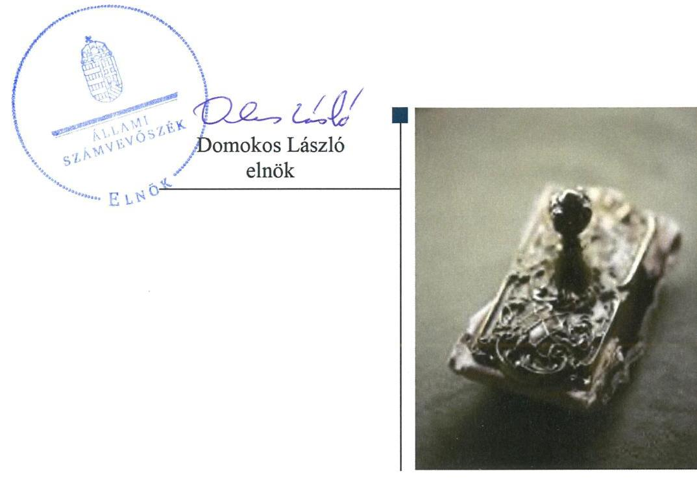
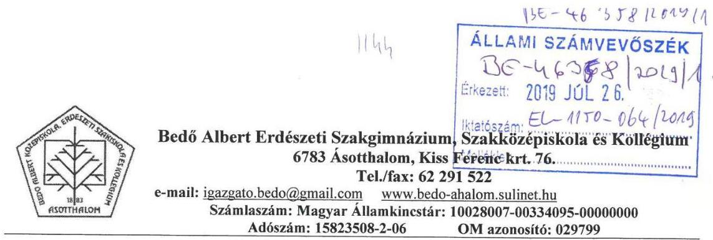
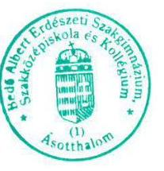
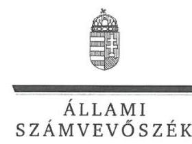
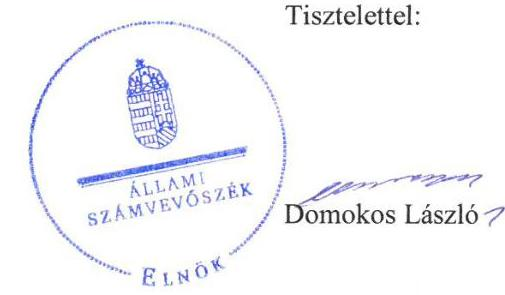

# Jelenetés 

## Központi költségvetési szervek ellenőrzése

Bedő Albert Erdészeti Szakgimnázium, Szakközépiskola és Kollégium 2019.

---

# Jelentés 

## Központi költségvetési szervek ellenőrzése

Bedő Albert Erdészeti Szakgimnázium, Szakközépiskola és Kollégium
2019. 4. hó 30 . nap

---

# AZ ELLENŐRZÉST FELÜGYELTE:

## MAKKAI MÁRIA felügyeleti vezető

## AZ ELLENŐRZÉST VEZETTE ÉS A VÉGREHAJTÁSÁÉRT FELELŐS:

### DÉZSINÉ KIS HAJNALKA ellenőrzésvezető

## A PROGRAM ÖSSZEÁLLÍTÁSÁÉRT FELELŐS:

### TÓTHPÁL SZABOLCS osztályvezető

---

**IKTATÓSZÁM:** EL-2085-001/2019

**TÉMASZÁM:** 8

**ELLENŐRZÉS-AZONOSÍTÓ SZÁM:** V079146

---

Jelentéseink az Országgyűlés számítógépes hálózatán és az Interneta a www.asz.hu címen is olvashatóak.

---

# TARTALOMJEGYZÉK 

■ ÖSSZEGZÉS ..... 5
■ AZ ELLENŐRZÉS CÉLJA ..... 6
■ AZ ELLENŐRZÉS TERÜLETE ..... 7
■ AZ ELLENŐRZÉS HÁTTERE, INDOKOLTSÁGA ..... 8
■ A JELENTÉS LÉNYEGES KÉRDÉSKÖREI ..... 9
■ AZ ELLENŐRZÉS HATÓKÖRE ÉS MÓDSZEREI ..... 10
■ MEGÁLLAPÍTÁSOK ..... 12
■ JAVASLATOK ..... 16
■ FÜGGELÉKEK ..... 19
I. sz. függelék a jelentéshez ..... 19
II. sz. függelék: Észrevételek ..... 20
■ RÖVIDÍTÉSEK JEGYZÉKE ..... 33

---

.

---

# ÖSSZEGZÉS 

A Bedő Albert Erdészeti Szakgimnázium, Szakközépiskola és Kollégium belső kontrollrendszerének kialakítása és müködtetése, pénzügyi és vagyongazdálkodása nem volt szabályszerű, nem biztosította a nemzeti vagyonnal való átlátható, elszámoltatható, felelős gazdálkodást. Nem volt védett a korrupcióval szemben.

## Az ellenőrzés társadalmi indokoltsága

Magyarország versenyképességének és a magyar gazdaság fejlődésének alapvető feltétele a magyar munkavállalók megfelelő szakmai képzettsége és felkészültsége, amelyben a szakképzési rendszernek döntő szerepe van. A mezőgazdaság vonatkozásában is kiemelten fontos ez, hiszen a magyar mezőgazdaság piaci versenyképességét és eredményességét nagymértékben befolyásolja az agrárszférában dolgozók képzettsége, felkészültsége. A szakképzés legjelentősebb színterei a szakképző iskolák. Az eredményes és célszerű szakképzés alapja és alapvető feltétele a szakképző intézmények közpénzekkel és a közvagyonnal való törvényes, átlátható és a korrupcióval szembeni védelmet biztosító múködése és gazdálkodása. Ezért ezen szervezetekkel szemben is alapvető társadalmi igény, hogy a rájuk bízott közpénzekkel, közvagyonnal szabályosan gazdálkodjanak. Emellett a szakképzésben részt vevő pedagógusok, tanulók és a szülők jogos elvárása, hogy a szakképző iskolák múködése átlátható és elszámoltatható legyen. Mindezen igényekkel összhangban, a közpénzügyek átláthatóságának előmozdítása, a közvagyon védelme érdekében került sor az agrárszakképző iskolák belső kontrollrendszerének és gazdálkodásának ellenőrzésére.

## Főbb megállapítások, következtetések, javaslatok

A Bedő Albert Erdészeti Szakgimnázium, Szakközépiskola és Kollégium nem múködött szabályszerű kontrollkörnyezetben, mert nem rendelkezett szervezetét, feladatai ellátásának részletes belső rendjét és módját, valamint a felelősségi viszonyokat megállapító szervezeti és múködési szabályzattal. A Bedő Albert Erdészeti Szakgimnázium, Szakközépiskola és Kollégium nem múködtetett integrált kockázatkezelési és monitoring rendszert, kontrolltevékenysége nem volt szabályszerű. Ezek alapján a belső kontrollrendszer kialakítása és múködtetése nem biztosította a szabályos közpénzfelhasználást.

A Bedő Albert Erdészeti Szakgimnázium, Szakközépiskola és Kollégium pénzügyi gazdálkodása a kiadási előirányzatok nem szabályszerű felhasználása és a kötelezettségvállalások nyilvántartásának tartalmi hiányossága miatt nem felelt meg az előírásoknak.

A Bedő Albert Erdészeti Szakgimnázium, Szakközépiskola és Kollégium vagyongazdálkodása a költségvetési beszámoló mérlegtételei leltárral való alátámasztásának hiánya miatt nem volt szabályszerű. Nem igazolt, hogy a mérlegben szereplő tételek a valóságban megtalálhatóak.

A Bedő Albert Erdészeti Szakgimnázium, Szakközépiskola és Kollégium a kötelezően előírt kontrollok hiányában nem teremtette meg az integritásalapú múködés feltételeit.

Az Állami Számvevőszék a jelentésben foglalt megállapítások alapján a Bedő Albert Erdészeti Szakgimnázium, Szakközépiskola és Kollégium Igazgatója részére tizennyolc javaslatot fogalmazott meg.

---

# AZ ELLENŐRZÉS CÉLJA 

CÉLJA annak megállapítása volt, hogy a központi költségvetési szervre vonatkozó irányító szervi feladatellátás a jogszabályi előírások betartásával történt-e; a központi költségvetési szerv belső kontrollrendszere biztosította-e az átlátható, szabályszerű, gazdaságos, hatékony és eredményes gazdálkodás feltételeit; kiépítették és erősítették e a korrupciós kockázatok kezelését szolgáló integritás kontrollokat; megteremtették-e a teljesítményellenőrzés feltételeit. Továbbá annak megállapítása, hogy a szervezet gazdálkodása során elszámoltatható és megfelel-e annak az Alaptörvényben meghatározott alapvetésnek, hogy Magyarország a kiegyensúlyozott, átlátható és fenntartható költségvetési gazdálkodás elvét érvényesíti. Érvé-nyesül-e a nemzeti vagyon kezelésének és védelmének célja, azaz a szervezet vagyona a közérdeket szolgálja, a közös szükségletek kielégítése és a természeti erőforrások megóvása, valamint a jövő nemzedékek szükségleteinek figyelembevétele mellett.

---

# **AZ ELLENŐRZÉS TERÜLETE**

## **Bedő Albert Erdészeti Szakgimnázium, Szakközépiskola és Kollégium**

A Bedő Albert Erdészeti Szakgimnázium, Szakközépiskola és Kollégium egy tagintézménnyel rendelkező közös igazgatású köznevelési intézmény.

Az ország első erdészeti iskolája 1883 óta képzi a szakembereket a Csongrád megyei Ásotthalmon.

Az Intézmény1 tevékenysége szakgimnáziumi, szakközépiskolai nevelés-oktatás és kollégiumi ellátás, valamint felnőttoktatás.

A képzések erdészet és vadgazdálkodás, valamint kertészet és parképítés szakágazatban folytak.

Az Intézmény alapítója és irányító szerve a Földművelésügyi Minisztérium, jelenleg Agrárminisztérium. AZ Igazgató2 és a Gazdasági vezető3 személye az ellenőrzés időszakában nem változott.

Az Intézmény saját gazdasági szervezete útján látta el a gazdálkodásával kapcsolatos feladatokat.

Az Intézmény a 2017. évben 663 millió Ft költségvetési bevétellel rendelkezett, költségvetési kiadása 580,1 millió Ft volt, és 887,8 millió Ft vagyonnal gazdálkodott. Az átlagos statisztikai állományi létszám 96 fő volt.

---

# AZ ELLENŐRZÉS HÁTTERE, INDOKOLTSÁGA 

Az ÁSZ ${ }^{4}$ ellenőrzi a költségvetési szervek gazdálkodását, működését, hogy megállapításaival támogassa az ellenőrzött szervezetek szabályszerű gazdálkodását, javaslataival elősegítse az Alaptörvényben ${ }^{5}$ megfogalmazott alapvetések érvényesülését a mindennapi életben a szervezetek szintjén. Az egyes ellenőrzések megállapításaival és egy időszak ellenőrzési eredményeinek elemzésével az ÁSZ ráirányíthatja a jogalkotók figyelmét a központi alrendszerben vagy annak egy ágazatában esetlegesen felmerülő pénzügyi, szabályozási feszültségekre.

Az elvégzett ellenőrzések során az ÁSZ „jó gyakorlatokat" is azonosíthat, melyeket tanácsadó funkciója keretében szélesebb körben is megismertethet az érintettekkel, ezáltal is hozzájárulva a költségvetési rendszer szabályozott, átlátható, kiegyensúlyozott és fenntartható működéséhez.

Az ellenőrzés a szervezet kockázatértékelése alapján, az egyedi és lényeges jellemzők figyelembevételével, az ellenőrzésre kiválasztott modullal történik.

Az integritás- és belső kontroll modul a központi költségvetési szerv múködésének irányítottságát, korrupció elleni védettségét értékeli.

A belső kontrollrendszer kialakítása és működtetése nélkül nem valósítható meg a közpénzek, a közvagyon átlátható, szabályos, gazdaságos, hatékony és eredményes felhasználása. A belső kontrollrendszer azt a célt szolgálja, hogy a költségvetési szervek múködésük és gazdálkodásuk során a tevékenységeket szabályszerűen hajtsák végre, teljesítsék elszámolási kötelezettségeiket és megvédjék az erőforrásokat a veszteségektől, a károktól és a nem rendeltetésszerű használattól.

Az államháztartás központi alrendszerébe tartozó szervezet vagyona a nemzeti vagyon része, és az Alaptörvény is rögzíti, hogy a vagyonnal való gazdálkodás célja a közérdek szolgálata.

---

# A JELENTÉS LÉNYEGES KÉRDÉSKÖREI 

1. Az irányító szerv ellenőrzött költségvetési szervre vonatkozó feladatellátása szabályszerű volt-e?
2. A belső kontrollrendszer kialakítása és müködtetése szabályszerűen történt-e?
3. A költségvetési szerv pénzügyi gazdálkodása szabályszerű volt-e?
4. A költségvetési szerv vagyongazdálkodása szabályszerű volt-e?

---

# AZ ELLENŐRZÉS HATÓKÖRE ÉS MÓDSZEREI 

## Az ellenőrzés típusa

Megfelelőségi ellenőrzés.

## Az ellenőrzött időszak

A belső kontroll rendszer és a vagyongazdálkodás tekintetében a 2016. és a 2017. év.

Az irányító szervi feladatellátás és a pénzügyi gazdálkodás tekintetében a 2016. év.

## Az ellenőrzés tárgya

Az ellenőrzött szervezetre vonatkozó irányító szervi feladatok ellátása. Az intézmény belső kontroll rendszerének kialakítása és múködtetése. Az intézmény pénzügyi és vagyongazdálkodása. Az intézménynél az integritáskontrollok kiépítettsége, az integritás szemlélet érvényesülése, a teljesítményellenőrzés feltételei.

## Az ellenőrzött szervezet

Bedő Albert Erdészeti Szakgimnázium, Szakközépiskola és Kollégium és irányítószerve az Agrárminisztérium.

## Az ellenőrzés jogalapja

Az ellenőrzés jogszabályi alapját az ÁSZ tv . 1. § (3) bekezdés, 5. § (2)-(3) és (6) bekezdései, (4) bekezdés a), pontja, valamint Áht. 61. § (2) bekezdésének előírásai képezik.

## Az ellenőrzés módszerei

Az ÁSZ az ellenőrzést az ellenőrzési program szempontjai, az ellenőrzött időszakban hatályos jogszabályok, az ellenőrzés szakmai szabályai, a jelen ellenőrzésre irányadó ÁSZ módszertanok figyelembevételével hajtja végre.

Az ellenőrzési kérdések megválaszolásához szükséges bizonyítékok megszerzése az ellenőrzött által rendelkezésre bocsátott dokumentumokra, adatokra alapozva megfigyelés, szemle (szemrevételezés), minta-

---

vételezés, valamint elemző eljárás útján történik. Az ellenőrzési bizonyítékként felhasználható adatforrások közé tartoznak az ellenőrzési program részletes szempontjainál felsorolt adatforrások, valamint minden egyéb az ellenőrzés folyamán feltárt, az ellenőrzés szempontjából információt tartalmazó - dokumentum.

Az ellenőrzés lefolytatásához az ellenőrzött szervezet tanúsítványok kitöltésével, valamint az ÁSZ által kért dokumentumok megküldésével szolgáltat adatokat, amelyek valódiságát és teljes körűségét az ellenőrzött szervezet vezetője által tett teljességi és hitelességi nyilatkozat igazolja. A rendelkezésre bocsátott adatok, információk kontrollja az ellenőrzés keretében történt.

A központi költségvetési szerv belső kontrollrendszere egyes pilléreinek kialakítására és múködtetésére vonatkozó értékelés:
$\longrightarrow$ „szabályszerű", amennyiben az értékelt területen az elért „igen" válaszok százalékban kifejezett, egész számra kerekített aránya legalább $85 \%$,
$\longrightarrow$ „nem szabályszerű", ha nem éri el a $85 \%$-ot.
A kontrollrendszer egésze esetében a „szabályszerű" értékelésnek a százalékos értéken felül további feltétele, hogy egyik kontrollterület sem kaphat „nem szabályszerű" értékelést.

A Kiadások és a Bevételek ellenőrzésére a 2016-2017 év vonatkozásában került sor. A Kiadások (külső személyi juttatások, felhalmozási kiadások, dologi kiadások) és Bevételek (értékesítésből és bérbeadásból származó bevételek) esetében az ellenőrzés azokra a legnagyobb értékű tételekre - a lényeges sokaságra - terjedt ki, melyek összértéke eléri a teljes sokaság összértékének 50\%-át.

A 2017. évi kiadások és a 2016. évi bevételek esetében a lényeges sokaságot tételesen ellenőriztük.

A 2016. évi kiadások elszámolásának szabályszerűséget a lényeges sokaságból véletlen mintavételi eljárással kiválasztott tételek alapján ellenőriztük.
2017. évben az ellenőrzött szervezet nem rendelkezett értékesítésből származó bevétellel.

A 2017. évi beruházások, felújítások végrehajtásának, valamint a feladatellátást szolgáló állami vagyontárgyak év végi értékelésének szabályszerűsége esetében tételes ellenőrzésre került sor.

A mintavétellel ellenőrzött területek esetében minden egyes tétel vonatkozásában a felhasználás, elszámolás és értékelés szabályszerűségére vonatkozó kérdéseket tettünk fel. Szabályszerűnek értékeltünk egy ellenőrzött területet, amennyiben 95\%-os bizonyossággal az ellenőrzött sokaságban az átlagos hibaarány legfeljebb 10\%, nem szabályszerűnek, amenynyiben 10\%-nál magasabb arányt képviselt.

Az ellenőrzés ideje alatt az ellenőrzött szervezettel történő kapcsolattartást az ÁSZ SZMSZ ${ }^{\circledR}$-ének vonatkozó előírásai alapján biztosítottuk.

---

# 1. Az irányító szerv ellenőrzött költségvetési szervre vonatkozó feladatellátása szabályszerű volt-e? 

Összegző megállapítás

Az Irányító szerv ${ }^{7}$ Intézményre vonatkozó feladatellátása a 2016. évben szabályszerű volt.

AZ IRÁNYÍTÓ SZERV ALAPÍTÓI jogosultságainak gyakorlása a 2016. évben a jogszabályi előírásoknak megfelelően történt.

Az Irányító szerv az Áht. ${ }^{8}$-ban foglalt jogkörében eljárva kiadmányozta az Intézmény alapító okiratának módosítását a szakképzés rendszerét érintő szabályozási környezet változása miatt az államháztartásért felelős miniszter előzetes egyetértésével.

Az alapító okirat tartalma megfelelt az Ávr. ${ }^{9}$ előírásainak.
AZ EGYÉB IRÁNYÍTÁSI, FELÜGYELETI ÉS ELLENÖRZÉSI JOGOSULTSÁGAIT az Irányító szerv szabályszerűen gyakorlata a 2016. évben.

Az Irányító szerv az Ávr.-nek megfelelően kiadta a kötelező tervezési követelményeket és jóváhagyta az Intézmény elemi költségvetését.

Az Irányító szerv az Áhsz.-ben ${ }^{10}$ meghatározott határidő betartásával jóváhagyta az Intézmény költségvetési beszámolóját és az Áht.-ben foglalt irányító szervi hatáskörében eljárva beszámoltatta az Intézményt az éves szakmai feladatellátásról.

MUNKÁLTATÓI JOGOSULTSÁGAIT az Irányító szerv a 2016. éven szabályszerűen gyakorolta.

## 2. A belső kontrollrendszer kialakítása és múködtetése szabályszerűen történt-e?

## Összegző megállapítás

A belső kontroll rendszer kialakítása és múködtetése nem volt szabályszerű a 2016-2017. években.

A KONTROLLKÖRNYEZET KIALAKÍTÁSA nem volt szabályszerű a 2016-2017. években.

Az Intézmény nem rendelkezett szervezetét, feladatai ellátásának részletes belső rendjét és módját megállapító szervezeti és működési szabályzattal az Áht. 10. § (5) bekezdésében foglaltak ellenére.

Az Intézmény nem rendelkezett ellenőrzési nyomvonallal Bkr. ${ }^{11}$ 6. § (3) bekezdése ellenére.

---

Az Intézmény nem rendelkezett a gazdasági szervezetre vonatkozó ügyrenddel az Ávr. 10/A § ellenére.

Az Intézmény nem rendelkezett közalkalmazotti szabályzattal a Kjt. ${ }^{12} 2$. § (1) bekezdése ellenére.

Az Intézmény nem rendelkezett számlarenddel a Sztv. ${ }^{13}$ 161. § (1) bekezdése ellenére.

Az Intézmény nem rendelkezett adatvédelmi és adatbiztonsági szabályzattal az Info tv. ${ }^{14} 24 . \S$ (3) bekezdése ellenére.

Az Intézmény nem rendelkezett iratkezelési szabályzattal a Ltv ${ }^{15} .10 . \S$ (1) bekezdése ellenére.

Az Intézmény nem határozta meg a szervezetre vonatkozó etikai elvárásokat a Bkr. 6. § (1) bekezdése c) pontja ellenére.

KOCKÁZATKEZELÉSI RENDSZERT az Intézmény nem alakított ki a 2016-2017. években.

Az Intézmény 2016. január 1-től 2016. szeptember 30-ig kockázatkezelési rendszert, 2016. október 1-től integrált kockázatkezelési rendszert nem alakított ki a Bkr. 6. § (4) bekezdése ellenére.

A KONTROLLTEVÉKENYSÉGEK gyakorlása nem volt szabályszerű a 2016-2017. években.

Az Intézmény a kötelezettségvállalásokat nem vette nyilvántartásba az Ávr. 56. § (1) bekezdésében előírtak ellenére.

Az Intézmény a kiadási előirányzatok felhasználását nem támasztotta alá írásbeli kötelezettségvállalással az Áht. 37. § (1) bekezdése ellenére.

# AZ INFORMÁCIÓS ÉS KOMMUNIKÁCIÓS FOLYAMATOK kialakítása és múködtetése nem volt szabályszerű a 2016-2017. években. 

Az Intézmény az Info tv. 30. § (6) bekezdésében előírtak ellenére nem szabályozta a közérdekú adatok megismerésére irányuló igények teljesítésének rendjét.

Az Intézmény az Info tv. 37. § (1) bekezdésében előírt közzétételi kötelezettségének nem tett eleget, az Info tv. 1. melléklet III/1 pontja előírása ellenére nem tette közzé az Intézmény 2017. évi éves költségvetését és 2016. évi éves költségvetési beszámolóját.

Az Intézmény nem tett eleget az Ávr. 5. melléklete szerinti tartozásállományra vonatkozó adatszolgáltatási kötelezettségének az Ávr. 167/M. § (1) bekezdésében előírtak ellenére.

A MONITORING RENDSZERT az Intézmény kialakította, azonban nem múködtette a 2016-2017. években.

Az Intézmény nem múködtetett a Bkr. 10. § előírása ellenére operatív tevékenységek keretében megvalósuló folyamatos és eseti nyomon követést, valamint belső ellenőrzést.

Az Intézmény Igazgatója eleget tett a Bkr. 11. § (1) bekezdésében előírt nyilatkozattételi kötelezettségének a belső kontrollrendszer értékelésére vonatkozóan. A nyilatkozat tartalmát az ellenőrzés nem igazolta

---

AZ INTEGRITÁS KONTROLLOK KIÉPÍTÉSE ÉS MŰKÖDTETÉSE nem volt megfelelő a 2016-2017. években, nem biztosította az integritás szemlélet érvényesülését.

Az Intézmény nem múködtette az integritást erősítő, kötelezően előírt kontrollokat. Nem végzett integritás kockázatelemzést. Az integritást erősítő, de kötelezően nem előírt kontrollokat nem múködtette.

A TELJESÍTMÉNY MÉRÉSÉRE ALKALMAS KÖVETELMÉNYEKET az Intézmény nem alakította ki a 2016-2017. években.

Az Intézmény nem képzett a szervezeti célok eléréséhez szükséges feladatok és folyamatok mérésére szolgáló indikátorokat, mérőszámokat, feladat és teljesítménymutatókat, így nem biztosították a teljesítménymérés feltételeit.

# 3. A költségvetési szerv pénzügyi gazdálkodása szabályszerű volt-e? 

Összegző megállapítás

Az Intézmény pénzügyi gazdálkodása a 2016. évben nem volt szabályszerű.

A KIADÁSI ELŐIRÁNYZATOK FELHASZNÁLÁSA
nem volt szabályszerű a 2016. évben.
Az Ávr. 50. § (1) bekezdés a)-c) pontjaiban foglaltak ellenére a kötelezettségvállalás alapját képező szerződések, illetve megrendelések nem tartalmazták a szakmai, műszaki teljesítés határidejét, a pénzügyi teljesítés módját és feltételeit, a kifizetés határidejét.

Az Intézmény a Számv. tv. 165.§ (2) bekezdésében foglaltak ellenére bizonylat nélkül számolt el kiadást a könyvviteli nyilvántartásban.

Az Ávr. 50. § (1a) bekezdésének előírása ellenére a kiadási előirányzatok terhére jogi személlyel, jogi személyiséggel nem rendelkező szervezettel kötött visszterhes szerződés nem tartalmazta a szervezet képviselőjének nyilatkozatát arra vonatkozóan, hogy átlátható szervezetnek minősül.

A VAGYONELEMEK HASZNOSÍTÁSA a 2016. évben nem volt szabályszerű.

Az Intézmény az Áhsz. 50.§ (3) bekezdésében foglaltak ellenére nem készített önköltségszámítást a rendszeresen végzett szolgáltatásnyújtásra.

## A KÖTELEZETTSÉGVÁLLALÁSOK NYILVÁNTARTÁSA a 2016. évben nem volt szabályszerű.

Az Intézmény a 2016. évben az Áhsz. 39.§ (3) bekezdésében foglaltak ellenére nem gondoskodott a kötelezettségvállalások részletező nyilvántartásának kötelező minimum tartalmáról, mert a nyilvántartás nem tartalmazta a pénzügyi teljesítési határidőket az Áhsz. 14. melléklet II. 4. e) pontja ellenére. Ennek eredményeként nem volt alátámasztott az Intézmény kötelezettségekkel terhelt tárgyévi maradványa.

---

# 4. A költségvetési szerv vagyongazdálkodása szabályszerű volt-e? 

## Összegző megállapítás

Az Intézmény vagyongazdálkodása nem volt szabályszerű a 2016-2017. években.

## A VAGYONTÁRGYAK HASZNÁLATA ÉS KIMUTATÁSA nem volt szabályszerű az Intézménynél.

Az Intézmény a 2016. évben a feladatellátását szolgáló ingatlanokat - az alapító okirata szerint - használatra kapta. A Vtv. ${ }^{16}$ 25. § (4) bekezdésében előírtak ellenére az ingatlanok használatára vonatkozó írásbeli szerződéssel nem rendelkezett, ezért nem minősült az állami vagyon jogszerű használójának.

Az Intézmény vagyon nyilvántartása 2016. évben nem felelt meg a Számv.tv. 23. § (2) bekezdésében és az Áhsz. 10. § (2) bekezdésében előírtaknak, mert könyveiben és a 2016. évi beszámoló mérlegében az intézmény az általa jogcím nélkül használt ingatlanokat vagyonkezelt eszközként szerepeltette.

Az Intézmény alapító okirata a 2017. évben módosításra került, mely szerint vagyonkezelője lett az ingatlanoknak, azonban a vagyonkezelői jogot keletkeztető vagyonkezelési szerződéssel az Nvtv ${ }^{17}$. 11. § (1) bekezdése előírásai ellenére nem rendelkezett.

Az Intézmény vagyonkezelési szerződés nélkül, vagyonkezelt eszközként szerepeltette a feladatellátásra kapott ingatlanokat a 2017. évi beszámolója mérlegében a Számv.tv. 23. § (2) bekezdésében és az Áhsz. 10. § (2) bekezdésében előírtak ellenére.

Az Intézmény a 2016-2017. években a Számv.tv. 69. § (1) bekezdésében előírtak ellenére a beszámoló elkészítéséhez, a mérleg tételeinek alátámasztásához nem állított össze leltárt. Az Intézmény a leltározási szabályzata 2. pontja valamint az Számv. tv. 69. § (3) bekezdése ellenére a tárgyi eszközök és készletek mennyiségi leltározását nem végezte el a 2016-2017. években.

Az Intézmény a 2016-2017. években a jogcím nélkül kezelt vagyontárgyak beszámoló mérlegében való megjelenítésével, valamint a beszámoló mérlegtételeinek tételes leltárral való alátámasztásának hiányával megsértette a Számv.tv. 15. § (3) bekezdését.

---

# JAVASLATOK 

Az ÁSZ tv. 33. § (1) bekezdésében foglaltak értelmében az ellenőrzött szervezet vezetője köteles a jelentésben foglalt megállapításokhoz kapcsolódó intézkedési tervet összeállítani és azt a jelentés kézhezvételétől számított 30 napon belül az ÁSZ részére megküldeni. Amennyiben az ellenőrzött szervezet vezetője nem küldi meg határidőben az intézkedési tervet, vagy továbbra sem elfogadható intézkedési tervet küld, az Állami Számvevőszék elnöke az ÁSZ tv. 33. § (3) bekezdése a) és b) pontjaiban foglaltakat érvényesítheti.

## a Bedő Albert Erdészeti Szakgimnázium, Szakközépiskola és Kollégium igazgatójának

1. Intézkedjen a szervezeti és müködési szabályzat jogszabályi előírásoknak megfelelő elkészítéséről.
(2. sz. megállapítás 2. bekezdése alapján)
2. Intézkedjen a Bkr. előírásainak megfelelő ellenőrzési nyomvonal elkészítéséről.
(2. sz. megállapítás 3. bekezdése alapján)
3. Intézkedjen a gazdasági szervezetre vonatkozó ügyrend jogszabályi előírásoknak megfelelő elkészítéséről.
(2. sz. megállapítás 4. bekezdése alapján)
4. Intézkedjen a közalkalmazotti szabályzat jogszabályi előírásoknak megfelelő elkészítéséről.
(2. sz. megállapítás 5. bekezdése alapján)
5. Intézkedjen a számlarend jogszabályi előírásoknak megfelelő elkészítéséről.
(2. sz. megállapítás 6. bekezdése alapján)
6. Intézkedjen az Info. tv. előírásainak megfelelően az adatvédelmi és adatbiztonsági szabályzat megalkotásáról.
(2. sz. megállapítás 7. bekezdése alapján)

---

7. Intézkedjen az iratkezelési szabályzat jogszabályi előirásoknak megfelelő elkészitéséről.
(2. sz. megállapítás 8. bekezdése alapján)
8. Intézkedjen az Intézmény szervezetre vonatkozó etikai elvárásai Bkr. előírásainak megfelelő meghatározásáról.
(2. sz. megállapítás 9. bekezdése alapján)
9. Intézkedjen a Bkr. előírásainak megfelelő integrált kockázatkezelési rendszer kialakításáról.
(2. sz. megállapítás 11. bekezdése alapján)
10. Intézkedjen a kiadási előirányzatok felhasználása során a jogszabályi előírásoknak megfelelő kötelezettségvállalásról és azok szabályszerű nyilvántartásáról.
(2. sz. megállapítás 13-14. bekezdései alapján)
11. Intézkedjen az Intézmény tartozásállományára vonatkozó adatszolgáltatási kötelezettség teljesítéséről a jogszabályi előírásoknak megfelelően.
(2. sz. megállapítás 18. bekezdése alapján)
12. Intézkedjen a Bkr. előírásainak megfelelő monitoring rendszer müködtetéséről.
(2. sz. megállapítás 19-20. bekezdése alapján)
13. Intézkedjen a kiadási előirányzatok felhasználása során a kötelezettségvállalás alapját képező szerződések, illetve megrendelések jogszabály előírásoknak megfelelő tartalmáról.
(3. sz. megállapítás 2. és 4. bekezdései alapján)
14. Intézkedjen a jogszabályi előírásoknak megfelelően az önköltségszámítás rendjére vonatkozó belső szabályzat elkészítéséről.
(3. sz. megállapítás 6. bekezdése alapján)
15. Intézkedjen, hogy a kötelezettségvállalások nyilvántartása megfeleljen a jogszabályi előírásoknak.
(3. sz. megállapítás 8. bekezdése alapján)

---

16. Kezdeményezze az intézmény alapító okirata szerinti állami vagyon jogszerü kezeléséhez a jogszabályi előirásoknak megfelelő szerződés megkötését.
(4. sz. megállapítás 4. bekezdése alapján)
17. Intézkedjen a jogszabályi előirásoknak megfelelően a mérleg tételeit alátámasztó leltár elkészítéséről, amely tételesen, ellenőrizhető módon tartalmazza a mérleg fordulónapján meglévő eszközöket és forrásokat mennyiségben és értékben.
(4. sz. megállapítás 6. bekezdés első mondata alapján)
18. Intézkedjen a leltározási szabályzat és a Számv. tv. előírásának megfelelően a leltározás végrehajtásáról.
(4. sz. megállapítás 6. bekezdés második mondata alapján)

---

# FÜGGELÉKEK 

- I. SZ. FÜGGELÉK A JELENTÉSHEZ

Az Állami Számvevőszék az ellenőrzések során feltárt tényekhez kapcsolódó további körülmények tisztázására eszközrendszerrel nem rendelkezik. Amennyiben az ellenőrzésen túlmutatóan indokoltnak látszik az ellenőrzés során feltárt körülmények további vizsgálata, az Állami Számvevőszék törvényi felhatalmazás alapján az ellenőrzés által feltárt körülményeket továbbítja a hatáskörrel rendelkező szervnek a szükséges intézkedések megtétele, eljárások lefolytatása érdekében.
1.

Az Intézmény a Számv. tv. 69. § (1) bekezdésében foglaltak ellenére a 2016-2017. években nem támasztotta alá költségvetési beszámolójának mérlegét leltárral.
A leltárral alá nem támasztott mérlegtételek értéke a 2016. évben 765,6 millió Ft, a 2017. évben 887,8 millió Ft.

Az Intézmény költségvetési beszámolójának mérlege az Áhsz. 10. § (2) bekezdésében foglaltak ellenére a 2016-2017. években vagyonkezelt eszközként tartalmazta azon ingatlanokat, amelyekre vagyonkezelési szerződéssel, földhivatali bejegyzéssel nem rendelkezett.

A vagyonkezelési szerződéssel nem rendelkező ingatlanok értéke a 2016. évben 720 millió Ft, a 2017. évben 701 millió Ft volt.
2.

Az Intézmény az Áht. 37. § (1) bekezdése ellenére a 2016. évben 3 esetben, összesen 866,4 ezer Ft összegű kiadási előirányzat teljesítését, a 2017. évben öt esetben összesen 50,8 millió Ft összegű kiadási előirányzat teljesítését nem támasztott alá írásbeli kötelezettségvállalással.
Az Intézmény a Számv. tv. 165.§ (2) bekezdésében foglaltak ellenére a 2017. évben egy esetben 2,7 millió Ft értékben bizonylat - írásbeli kötelezettségvállalás (Ávr. 37.§ (1) bekezdés) és a teljesítést igazoló (Ávr. 57.§ (1) bekezdés) - nélkül számolt el kiadást a könyvviteli nyilvántartásban.
A jogszabályban foglaltak megsértése miatt nem igazolt, hogy a kiadások az ellenőrzött szervezet feladatellátásának körében keletkeztek és a kifizetések valós teljesítéshez kapcsolódtak, ezért felvetődik, hogy az ellenőrzött szervezetnél vagyoni hátrány keletkezett.

Az esetek konkrét körülményeinek felderítésére az Ügyészség rendelkezik hatáskörrel.

---

A jelentéstervezetet a Számvevőszék 15 napos észrevételezésre megküldte az ellenőrzött szervezetek vezetőinek az ÁSZ tv. 29. §* (1) bekezdése előirásának megfelelően.

A Bedő Albert Erdészeti Szakgimnázium, Szakközépiskola és Kollégium igazgatója élt az ÁSZ törvény 29.§ (2) bekezdésében foglalt észrevételezési lehetőséggel, a törvényes határidőn belül észrevételt tett. Az észrevételeket és az arra adott válaszokat a függelék tartalmazza.

[^0]
[^0]:    * 29. § (1) Az Állami Számvevőszék az ellenőrzési megállapításait megküldi az ellenőrzött szervezet vezetőjének vagy az általa megbízott személynek, és annak, akinek személyes felelősségét állapította meg.
    (2) Az ellenőrzött szervezet vezetője és a felelősként megjelölt személy az ellenőrzés megállapításaira tizenöt napon belül írásban észrevételt tehet.
    (3) Az Állami Számvevőszék az észrevételre a beérkezésétől számított harminc napon belül írásban válaszol. A figyelembe nem vett észrevételeket köteles a jelentésben feltüntetni, és megindokolni, hogy azokat miért nem fogadta el.

---

Állami Számvevőszék

Domokos László
Elnök

Ásotthalom, 2019. július 22.
Ikt. sz.: 5/j-10/2019

Melléklet: 1 db adathordozó anyagokkal

Budapest
Apáczai Csere János u. 10.

1052

Tisztelt Elnök Úr!

Hivatkozva az EL-1150-061/2019. számú levéllel megküldött ellenőrzési jelentésre, a
jelentésben foglaltakra, élve észrevételezési lehetőségemmel, az alábbiakban teszek észrevételt.

Intézményünknél „A központi költségvetési szervek ellenőrzése” keretében 2016-17 évek
vonatkozásában zajlott ellenőrzés. Az ellenőrzés során bekért adatszolgáltatásokat minden
alkalommal határidőre, a legjobb tudásunk szerint teljesítettük, a kért dokumentumokat
feltöltöttük a megadott felületre. Az általunk feltöltött dokumentumokat mellékelten egy
adathordón ismételten megküldöm, mivel az ellenőrzési jelentéstervezetben leírtak kapcsán az
általunk feltöltött dokumentumok hiánya több esetben jelentkezik, annak ellenére, hogy
azokkal a dokumentumokkal rendelkeztünk. A nagy mennyiségű dokumentumfeltöltés, és
intézményünkben gyakran előforduló internet kapcsolat hiánya miatt előfordulhatott, hogy nem
minden dokumentum töltődött fel teljesen, rajtunk kívül álló okok miatt.

Részletes észrevételeim:

2. A belső kontrollrendszer kialakítása és működtetése szabályszerűen történt-e?

Kontrollkörnyezet kialakítása

- Intézményünk 2016 évre rendelkezett szervezeti és működési szabályzattal, melyet
évközben módosítottunk, így a 2016 évre vonatkozó SZMSZ-ből 2 változatot is
feltöltöttünk.

- Az intézmény ellenőrzési nyomvonalát az SZMSZ (2016. 09.01-től hatályos) 3. számú
melléklete tartalmazza.

---

- 2016-ban intézményünk rendelkezett Közalkalmazotti szabályzattal, melyet szintén feltöltöttünk.
- Intézményünk rendelkezett 2016-ban számlarenddel, melyet szintén az ellenőrzés rendelkezésére bocsátottunk.
- A 2016. évi Szervezeti és Müködési Szabályzatunk 5.sz. mellékleteként rendelkeztünk adatvédelmi és adatbiztonsági szabályzattal.
- Az intézmény rendelkezett 2016. évben iratkezelési szabályzattal, mely az érvényes SZMSZ 12. sz. mellékleteként került feltöltésre.
- 2016-ban külön ügyrenddel nem rendelkeztünk, az ügyrendi kérdéseket a Szervezeti és Müködési Szabályzatban fogalmaztuk meg. Az ügyrend kialakítása azóta már megtörtént, hatályos ügyrenddel rendelkezünk.
- 2016-ban intézményünk a szervezetre vonatkozó Etikai elvárásokkal nem rendelkezett, ezt a Pedagógiai programunk alapelvei azonban tartalmazták.

# Kockázatkezelési rendszer kialakítása 

Intézményünk kockázatkezelési és integrált kockázatkezelési rendszert müködtetett, de ezt nem szabályozta.

## Kontrolltevékenységek

- Az intézmény a kötelezettségvállalásokat nyilvántartotta, mely nem terjedt ki minden tekintetben a jogszabályi előírásokra, de a kötelezettség vállalások nyilvántartása már jelenleg szabályszerűen történik.
- Az intézmény a kiadási előirányzatok felhasználását írásbeli kötelezettségvállalással minden alkalommal alátámasztotta. A kiadások teljesítéséhez minden alkalommal sor került a teljesítésigazolás kiállítására.

## Információs és kommunikációs folyamatok

- Intézményünk a költségvetési beszámolókat 2013-tól kezdődően a honlapján közzétette (www.bedo-ahalom.sulinet.hu), mely jelenleg is megtalálható.
- Költségvetésünket a honlapon nem tettük közzé, ezt 2018. óta pótoljuk.
- Intézményünk a tartozásállományra vonatkozó adatszolgáltatását folyamatosan, határidőre teljesítette.

---

# Monitoring rendszer 

- Intézményünk kialakította és nyomon követte a monitoring rendszert, mely folyamatosan és eseti jelleggel is megvalósult. Az igazgató és a gazdasági vezető a mindennapok tevékenységében a monitoring rendszert müködtette.
- Intézményünk 2016-ban és 2017-ben is alkalmazott belső ellenőrt.
- Az intézmény igazgatója a belső kontrollrendszer értékelésére vonatkozóan külön írásos határozatokat nem készített, de a mindennapok gazdálkodásában a tapasztalatokat beépítette.
- Igazgatóként a belső kontrollrendszer működtetésére nagy figyelmet fordítok a felelős vagyongazdálkodás érdekében, a költségvetési beszámolókhoz kapcsolódó nyilatkozataim a valóságnak megfelelnek, bár néhány esetben csak feljegyzés szintű dokumentumok állnak rendelkezésre az alátámasztásra.

Integritás kontrollok kiépítése és müködtetése

- Intézményünk az integritást erősítő kötelezően előírt kontrollokat működtette, ennek szabályozása azonban nem történt meg.

## A teljesítmény mérésére alkalmas követelmények

- Intézményünk külön nem határozott meg a szervezeti célok eléréséhez szükséges indikátorokat, azonban a teljesítmények alakulását rendszeresen értékelte a heti megbeszéléseken, vezetői értekezleteken.

3. A költségvetési terv pénzügyi gazdálkodása szabályszerű volt-e?

A kiadási előirányzatok felhasználása

- Intézményünk 2016-ban is nyilvántartotta a kötelezettségvállalásait, melyek alapját képező szerződések tartalmazták a szakmai- és műszaki teljesítés határidejét, a pénzügyi teljesítés módját, feltételeit, valamint a kifizetés határidejét.
Tudomásul vesszük, hogy a kötelezettségvállalásainkat nem minden esetben tartottuk nyilván helyesen, ennek a javítása már megtörtént, hiszen intézményünk a kontrolltevékenysége kapcsán folyamatosan javítja az esetlegesen felmerült hibákat.
- Az intézménynél bizonylat nélkül elszámolt kiadás nem volt.

---

- Intézményünk valóban nem minden esetben csatolta a szerződésekhez a szervezet képviselőjének a nyilatkozatát, hogy a szervezet átláthatónak minősül-e. Intézményünk a partnerektől bekérte az átláthatósági nyilatkozatokat, melyeket a szerződéstárban külön tárol.

# Vagyonelemek hasznosítása 

- Intézményünk a vagyonelemek hasznosítása során a szolgáltatásnyújtások esetében a helyi viszonyokhoz igazodott, és nem minden esetben támasztotta alá a szolgáltatást önköltségszámítással.

## Kötelezettségvállalások nyilvántartása

- A korábban leírtaknak megfelelően a kötelezettségvállalások nyilvántartása megtörtént, igaz, nem teljesen az előírásoknak megfelelően, ennek ellenére a kötelezettséggel terhelt tárgyévi maradvány teljes egészében áttekinthető volt.

4. A költségvetési terv vagyongazdálkodása szabályszerű volt-e?

## A vagyontárgyak használata és kimutatása

Intézményünk 2013. augusztus 01-től került az akkori Vidékfejlesztési Minisztérium fenntartásába. Intézményünk ingatlanjai állami tulajdonban voltak, és még 2013. októberében kezdeményeztem a vagyonkezelői szerződés megkötését az MNV Zrt.-nél.

Folyamatosan jeleztem a vagyonkezelői szerződés megkötésének szükségességét, melynek aláírására 2017. március 8-án került sor. (az MNV Zrt-s levelezés egy része mellékelve)

A KLIK-től átvett eszközök 2013-ban az átadást követően kerültek be a könyveinkbe. Az ingóságokra kötött vagyonkezelői szerződést is mellékelem.

Mivel a vagyonkezelői szerződés megkötése folyamatban volt, 2016-ban ezért a ,jó gazda gondosságával" kezeltük a ránk bízott ingatlanokat, illetve tartottuk nyilván könyveinkben.

Az ingóságok vagyonkezelése a mellékelt fenntartói levél alapján történt.
2017-től kezdődően pedig már vagyonkezelői szerződés birtokában (melyet az ellenőrzés nem kért be) szerepeltettük az ingatlanokat a mérlegben. (Vagyonkezelői szerződést mellékelem) Intézményünk a számviteli törvény előírásainak megfelelően összeállította a mérleg tételeinek alátámasztására a leltárt tételesen ellenőrizhető módon. Az intézmény a leltározási szabályzata szerint 2016-ban elvégezte a készletek mennyiségi, a követelések, kötelezettségek és időbeli elhatárolások értékbeni, 2017-ben pedig a tárgyi eszközök és készletek mennyiségi, valamint a követelések, kötelezettségek, időbeli elhatárolások értékbeni leltározását.

---

Észrevétel a függelékben foglaltakra:
1.a) 2016-ban 765,6 millió Ft
2017-ben 887,8 millió Ft
mérlegtételek leltárral történő alátámasztása megtörtént (mellékelve)
b) 2016-ban még nem, de 2017-ben már rendelkeztünk az MNV Zrt-vel kötött vagyonkezelői szerződéssel (mellékelve)
2016-ban a KLIK által átadott vagyonelemeket szerepeltettük a beszámolóban (KLIK általi átadás-átvétel mellékelve)
2) a.) 2016. évi kötelezettségvállalások

Az ellenőrzés 3 pontban tett említést a hiányosságokról: A19, A21, A22-es tételek kapcsán:

- A Tankönyvellátó Kft-vel szerződést kötöttünk, a szerződést mellékeljük. Külön szerződés nem történt, viszont a megrendelt tankönyvek több részletben kerültek kiszállításra és leszámlázásra, ilyen egyik részlet az A19-es sorszámmal jelölt tétel is. (Az előzetes kötelezettségvállalást nem helyesen végeztük 2016-ban, de a szerződés és egyéb dokumentumai kötelezettségvállaló és pénzügyi ellenjegyzői aláirással vannak ellátva)
- Az Ásotthalom Önkormányzatával kötött tornacsarnok bérleti szerződés nem lett feltöltve az anyagok közé, mert a pénzügyi teljesítés dokumentumaira koncentráltunk. A szerződést levelünk mellékleteként pótoljuk. Ez a szerződés 2016. évre szól, negyedéves teljesítésekkel, tehát ez a szerződés az A21 és az A22-es tételhez is kapcsolódik. Kötelezettségvállaló és pénzügyi ellenjegyzői aláirással ellátva.
A 3 tétel összesen 266,409 Ft, 300,000 Ft és 300,000 Ft, azaz összesen 866,4 eFt.
b.) 2017. évi kötelezettségvállalások (kötelezettségvállalás + teljesítésigazolás)

A 2017. évi kötelezettségvállalások esetén megállapításra került egy 5 tételből álló, 50,8 millió forint értékủ kifogásolt tétel. A C04, C05, C06, C07, C08-as tételek egy Kehop-5.2.10-es kollégium felújítási uniós pályázathoz kapcsolódnak (ahogyan a később említett C02 tétel is). A fenntartó javaslatára pályáztunk, a közbeszerzést a Herman Ottó Intézet végezte helyettünk szerződés szerint. A két kollégium energetikai felújításának fő vállalkozója a Fehérép Kft. A kifizetések alátámasztására a teljesítésigazolások részletes szakmai tartalmát is mellékeltük mindegyik esetben a számla és a banki átutalás dokumentumai mellett, azonban a szerződés nem került feltöltésre, amit ezúttal pótolni kívánunk, mellékeljük továbbá a feltöltött anyagokat is ezen tételekkel kapcsolatban.
Szintén ehhez a pályázathoz kapcsolódik a szintén kifogásolt C02-es tétel, 2,7 millió forint értékben. A megállapítás szerint sem írásbeli kötelezettségvállalás, sem teljesítésigazolás nem történt. Áttekintve a feltöltött anyagokat, sajnálattal állapítottuk meg, hogy néhány esetben az egy adott ponthoz feltöltött több dokumentumból néhány elveszett a rendszer számára. Ez azért fordulhatott elő, mert többszörösen informatikai, és internetes problémákkal küzdött az Iskola a feltöltés közben, s talán ebből adódhatott ez a hiba. A C02-es tételhez tartozó szerződést és a teljes, általunk feltöltöttnek vélt további C02-es anyagot ezennel mellékeljük.

---

Ezért is döntöttünk úgy, hogy az általunk előkészített és feltölteni kívánt, illetve feltöltött anyagokat az eredeti feltöltési dátum szerint a mostani anyagok mellé ismét mellékeljük.

Kérem, a fenti észrevételek figyelembevételét.
Intézményünk kiemelt feladatának tekinti az állami vagyonnal való felelős gazdálkodást, valamint a közpénzek szabályos, átlátható felhasználását.
Gazdálkodásunkat, tevékenységünket ennek megfelelően végeztük és végezzük.
A jelentéstervezetben megfogalmazott hiányosságok nagyrészt, a nagy mennyiségủ adatfeltöltésből, esetlegesen informatikai problémákból (gyakran nincs internet kapcsolatunk) adódhattak.

Kérem, szíveskedjenek helyszíni ellenőrzéssel meggyőződni a jelzett hiányosságok meglétéről.

Hiánypótlásként bármilyen anyagot készséggel a rendelkezésükre bocsátunk, hiszen nekünk is a felelős átlátható gazdálkodás a célunk.

Megértésüket előre is köszönöm.

Tisztelettel

Andrésiné dr. Ambrus Ildikó

igazgató

---

ELNÖK

Ikt.szám: EL-1150-066/2019.

# Andrésiné Dr. Ambrus Ildikó úrhölgy igazgató 

Bedő Albert Erdészeti Szakgimnázium, Szakközépiskola és Kollégium
Ásotthalom

## Tisztelt Igazgató Úrhölgy!

A „Központi költségvetési szervek ellenőrzése - Bedő Albert Erdészeti Szakgimnázium, Szakközépiskola és Kollégium" címmel készített számvevőszéki jelentéstervezetre tett észrevételét köszönettel megkaptam.

Az Állami Számvevőszék észrevételre vonatkozó álláspontjáról a felügyeleti vezető által készített részletes tájékoztatást mellékelten megküldöm.

Tájékoztatom Igazgató úrhölgyet, hogy a számvevőszéki jelentésben - az Állami Számvevőszékről szóló 2011. évi LXVI. törvény 29. § (3) bekezdése alapján - a figyelembe nem vett észrevételt szerepeltetjük, annak indoklásával, hogy azt az Állami Számvevőszék miért nem fogadta el.

Budapest, 2019. 06 hó 22 nap

Melléklet: Tájékoztatás az észrevétel kezeléséről

---

# Tájékoztatás   az észrevétel kezeléséről 

A „Központi költségvetési szervek ellenörzése - Bedö Albert Erdészeti Szakgimnázium, Szakközépiskola és Kollégium" címủ jelentéstervezetre 2019. július 26-án érkezett észrevételét áttekintettük, annak kezelésével kapcsolatban a következő tájékoztatást adom.

1. A jelentéstervezet 2. számú összegző megállapítását alátámasztó megállapításokkal kapcsolatban tett észrevételekre adott válasz

- A kontrollkörnyezet nem szabályszerű kialakítására tett megállapításhoz kapcsolódóan az észrevétel tájékoztat arról, hogy az Intézmény a 2016. évre rendelkezett Közalkalmazotti szabályzattal, számlarenddel illetve szervezeti és müködési szabályzattal, mely mellékletében tartalmazta az Intézmény ellenőrzési nyomvonalát, adatvédelmi és adatkezelési szabályzatát, valamint az iratkezelési szabályzatot, továbbá az ügyrendi kérdéseket is a szabályzatban fogalmazták meg. Az észrevétel rögzíti, hogy a fenti dokumentumokat az ellenőrzés során rendelkezésre bocsátották.
Az Intézmény által hivatkozott dokumentumok nem tartalmazták a kiadmányozásra jogosult aláírását, hiteles és hatályos dokumentumként nem fogadhatók el. Az észrevételt nem fogadjuk el, a jelentéstervezet módosítása nem indokolt.
Az észrevétel megerősíti a jelentéstervezet azon megállapítását, mely az Intézmény szervezetre vonatkozó etikai elvárásainak hiányát rögzíti. Ugyanakkor tájékoztat arról, hogy az Etikai elvárásokat a Pedagógiai program alapelvei tartalmazzák. A jogszabály előírása a szervezet minden szintjén meghatározott, ismert és elfogadott etikai elvárásokat, míg a Pedagógiai program az Intézmény pedagógiai alapelveit, az iskolában folyó nevelési alapelveket tartalmazza. Az észrevételben foglaltak alapján a megállapítás módosítása nem indokolt.
- A kockázatkezelési rendszer kialakításával kapcsolatban tett észrevétel tájékoztat arról, hogy kockázatkezelési és integrált kockázatkezelési rendszert az Intézmény müködtetett, de nem szabályozta. Az észrevétel megerősíti a jelentéstervezet megállapítását, annak módosítása nem indokolt.
- A kontrolltevékenységekhez tett észrevétel első része rögzíti, az Intézmény kötelezettségvállalások nyilvántartása nem terjedt ki minden tekintetben a jogszabályi előírásokra. Az észrevétel a jelentéstervezet vonatkozó megállapítását megerősíti, módosítása nem indokolt.
Az észrevétel második része szerint az Intézmény írásbeli kötelezettségvállalással minden esetben alátámasztotta a kiadási előirányzatok felhasználását. Tájékoztatom, hogy az Állami Számvevőszék ellenőrzési megállapításai minden esetben az Állami Számvevőszékről szóló 2011. évi LXVI. törvénynek (továbbiakban: ÁSZ törvény) megfelelően az ellenőrzés során bekért és az arra nyitva álló határidőn belül

---

rendelkezésre bocsátott dokumentumokon alapulnak. Az ÁSZ az EL-1150027/2018. iktatószámú adatbekérő levelében a kiválasztott mintatételekhez kapcsolódóan bekérte a kontrolltevékenység szabályosságának ellenőrzéséhez szükséges dokumentumokat. Az Intézmény által rendelkezésre bocsátott dokumentumok alapján az ÁSZ megállapítása helytálló, az észrevételt nem fogadjuk el.

- Az információs és kommunikációs folyamatokkal kapcsolatos intézményi észrevétel első része arról tájékoztat, hogy az Intézmény honlapján 2013-tól kezdődően közzétette költségvetési beszámolóit. Tájékoztatom, hogy a www.bedoahalom.sulinet.hu hivatkozott honlapon nem található meg az Intézmény 2016. évi beszámolója. Fentiek alapján az észrevételt nem fogadjuk el, a jelentéstervezet módosítása nem indokolt.
Az észrevétel második része megerősíti az ÁSZ megállapítását, mely az Intézmény 2017. évi költségvetésének honlapon történő közzétételének hiányát rögzítette, a megállapítás módosítása nem indokolt.
Az észrevétel harmadik része vitatja a jelentéstervezet tartozásállományra vonatkozó adatszolgáltatási kötelezettség hiányára tett megállapítását. Felhívom Igazgató úrhölgy figyelmét, az ÁSZ ellenőrzése minden esetben a rendelkezésre bocsátott dokumentumokon alapul. Az Intézmény dokumentumokkal nem igazolta a jogszabályban előírt adatszolgáltatási kötelezettség teljesítését. Fentiekre tekintettel az észrevételt nem fogadjuk el, a jelentéstervezet módosítása nem indokolt.
- Az észrevétel vitatja a jelentéstervezet monitoring rendszer müködtetésére tett megállapítását és tájékoztat arról, hogy az igazgató és a gazdasági vezető tevékenységében a monitoring rendszert müködtette és az Intézmény alkalmazott belső ellenőrt a 2016-2017. évben. Tájékoztatom Igazgató Úrhölgyet, hogy a rendelkezésre bocsátott dokumentumok alapján az ellenőrzés megállapította, hogy az Intézmény nem rendelkezett éves belső ellenőrzési tervvel, nem készültek hiteles belső ellenőri jelentések, továbbá a belső ellenőrzési vezető nem vezetett nyilvántartást az elvégzett belső ellenőrzésekről. Mindezekre tekintettel az észrevételt nem fogadjuk el, a jelentéstervezet módosítása nem indokolt.
- Az integritás kontrollok kiépítésével és működtetésével kapcsolatos észrevétel rögzíti, hogy az Intézmény az integritást erősítő kötelezően előírt kontrollokat működtette, de ennek szabályozása nem történt meg. Az észrevétel megerősíti a jelentéstervezet megállapítását, módosítása nem indokolt.
- Az észrevétel tájékoztatása szerint az Intézmény nem határozott meg a szervezeti célok eléréséhez szükséges indikátorokat, megerősítve a jelentéstervezet teljesítmény mérésére alkalmas követelmények kialakításának hiányára tett megállapítását. Fentiek alapján a jelentéstervezet módosítása nem indokolt.

2. A jelentéstervezet 3. számú összegző megállapítását alátámasztó megállapításokkal kapcsolatban tett észrevételekre adott válasz

---

- A kiadási előirányzatok nem szabályszerű felhasználásával kapcsolatban tett észrevétel első és második része vitatja az ÁSZ megállapítását. Az észrevételben foglaltak szerint az Intézmény 2016. évi kötelezettségvállalásainak alapját képező szerződések tartalmazták a szakmai- és műszaki teljesítés határidejét, a pénzügyi teljesítés módját, feltételeit, valamint a kifizetés határidejét és bizonylat nélkül elszámolt kiadás nem volt. Tájékoztatom, hogy az ÁSZ ellenőrzési megállapításai minden esetben az adatszolgáltatásra rendelkezésre álló törvényes határidőn belül az Intézmény által rendelkezésre bocsátott dokumentumokon alapulnak, az észrevételt nem fogadjuk el, a megállapítás módosítása nem indokolt.
Az észrevétel harmadik része rögzíti, az Intézmény nem minden esetben csatolta a szerződésekhez a szervezet képviselőjének, a szervezet átláthatóságára vonatkozó nyilatkozatát. Az észrevételben foglaltak alapján a jelentéstervezet módosítása nem indokolt.
- A vagyonelemek hasznosításával kapcsolatban tett észrevétel, mely szerint az Intézmény a szolgáltatások nyújtását nem minden esetben támasztotta alá önköltség számítással, nem cáfolja az ÁSZ megállapítását. Az észrevétel alapján a megállapítás módosítása nem indokolt.
- Az észrevételben leírtak megerősítik a jelentéstervezet kötelezettségvállalások nem szabályszerű 2016. évi nyilvántartására vonatkozó megállapítását. Az észrevétel szerint az előírásoknak nem teljesen megfelelő kötelezettségvállalás nyilvántartása ellenére a tárgyévi maradvány teljes egészében áttekinthető volt. Felhívom Igazgató úrhölgy figyelmét, hogy az ÁSZ a megállapítása alapján, a hiányosság eredményeként a tárgyévi pénzmaradvány alátámasztását és nem áttekinthetőségét rögzítette. Fentiek alapján a jelentéstervezet módosítása nem indokolt.

3. A jelentéstervezet 4. számú összegző megállapítását alátámasztó megállapításokkal kapcsolatban tett észrevételekre adott válasz

- A vagyontárgyak használatára és kimutatására vonatkozó megállapításra tett észrevétel szerint 2016-ban a vagyonkezelési szerződés megkötése folyamatban volt, ezért az Intézmény a „jó gazda gondosságával" kezelte a rá bízott ingatlanokat, illetve tartotta nyilván könyveiben. A 2017. évtől pedig már vagyonkezelési szerződés birtokában szerepeltette az ingatlanokat mérlegében, melyet az ellenőrzés nem kért be. Felhívom Intézményvezető úrhölgy figyelmét, hogy az EL-1150029/2018. iktatószámú 2018. december 14-én átvett adatbekérő levél mellékletében szereplő dokumentumjegyzék szerint, az ÁSZ bekérte a 2017. év, mint ellenőrzött időszak vonatkozásában a vagyonkezelési szerződéseket. Fentiek alapján a megállapítás helytálló, módosítása nem indokolt.
- Az észrevétel tájékoztat arról, hogy az Intézmény 2016-ban elvégezte a készletek mennyiségi, a követelések, kötelezettségek és időbeli elhatárolások értékbeni, 2017ben pedig a tárgyi eszközök és készletek mennyiségi, valamint a követelések, kötelezettségek, időbeli elhatárolások értékbeni leltározását. Az Intézmény leltározási szabályzata 2. pontjának előírása szerint a mérlegben kimutatott

---

eszközöket és forrásokat minden évben leltározni kell. Az észrevétel megerősíti a jelentéstervezet megállapítását, annak módosítása nem indokolt.
A jelentéstervezet Függelékéhez írott észrevételével kapcsolatban tájékoztatom, hogy a Függelékben az Állami Számvevőszék az ellenőrzés során feltárt tényekhez kapcsolódó körülményeket rögzíti. Az Állami Számvevőszék ellenőrzési megállapításai ÁSZ törvénynek megfelelően minden esetben az ellenőrzés során bekért és az arra nyitva álló határidőn belül rendelkezésre bocsátott dokumentumokon alapulnak. Igazgató úrhölgy az ÁSZ rendelkezésére bocsátott dokumentumokról teljességi és hitelességi nyilatkozatot állított ki, melyben nyilatkozott, hogy az ÁSZ részére átadott dokumentumok megbízhatóak, a bekért adatokra, dokumentumokra vonatkozóan teljes körű információt tartalmaznak. A fentiekben leírtak miatt az észrevétellel megküldött dokumentumokat az ÁSZ nem értékelte.

Budapest, 2019. O.P. hó 28 nap

Makkai Mária
felügyeleti vezető

---

.

---

# RÖVIDÍTÉSEK JEGYZÉKE 

${ }^{1}$ Intézmény
${ }^{2}$ Igazgató
${ }^{3}$ Gazdasági vezető
${ }^{4}$ ÁSZ
${ }^{5}$ Alaptörvény
${ }^{6}$ ÁSZ SZMSZ
${ }^{7}$ Irányító szerv
${ }^{8}$ Áht.
${ }^{9}$ Ávr.
${ }^{10}$ Áhsz.
${ }^{11}$ Bkr.
${ }^{12}$ Kjt.
${ }^{13}$ SSztv.
${ }^{14}$ Info tv.
${ }^{15}$ Ltv.
${ }^{16}$ Vtv.
${ }^{17}$ Nvtv.

Bedő Albert Erdészeti Szakgimnázium, Szakközépiskola és Kollégium
Bedő Albert Erdészeti Szakgimnázium, Szakközépiskola és Kollégium igazgatója
Bedő Albert Erdészeti Szakgimnázium, Szakközépiskola és Kollégium gazdasági vezetője
Állami Számvevőszék
Magyarország Alaptörvénye (2011. április 25.)
Az Állami Számvevőszék elnökének 2/2018. (XII.28.) utasítása az Állami
Számvevőszék Szervezeti és Múködési Szabályzatáról
Földművelésügyi Minisztérium, jelenleg Agrárminisztérium
az államháztartásról szóló 2011. évi CXCV. törvény
az államháztartási törvény végrehajtásáról szóló 368/2011 (XII.31.) Korm. rendelet
az államháztartás számviteléről szóló 4/2013. (I. 11.) Korm. rendelet
a költségvetési szervek belső kontrollrendszeréről és belső ellenőrzéséről szóló 370/2011. (XII.31.) Korm. rendelet (hatályos: 2012. január 1-től)
a közalkalmazottak jogállásáról szóló 1992. évi XXXIII törvény
a számvitelről szóló 2000. évi C. törvény
az információs önrendelkezési jogról és az információszabadságról szóló 2011. évi CXII. törvény (hatályos: 2011. július 27-től)
a közokiratokról, a közlevéltárakról és a magánlevéltári anyag védelméről szóló 1995. évi LXVI. törvény
az állami vagyonról szóló 2007. évi CVI. törvény
a nemzeti vagyonról szóló 2011. évi CXCVI. törvény

---

# ÁLLAMI SZÁMVEVŐSZÉK 

1052 Budapest, Apáczai Csere János utca 10.
Levélcím: 1364 Budapest 4. Pf. 54
Telefon: +36 14849100 Telefax: +36 14849200
www.asz.hu