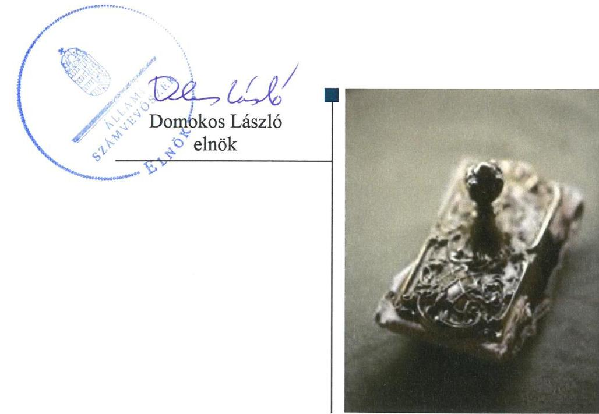
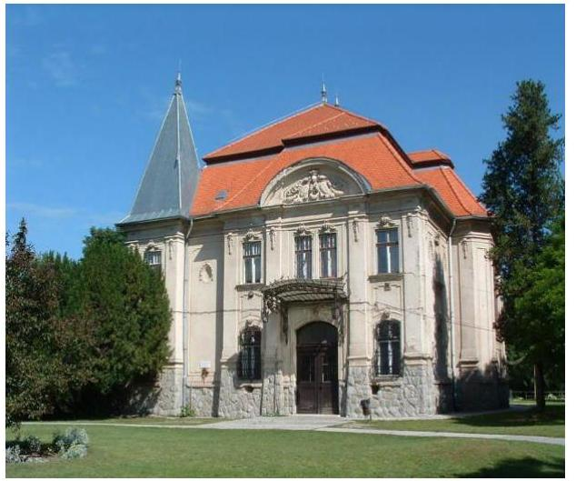

# Jelentés 

## Központi költségvetési szervek ellenőrzése

Fáy András Mezőgazdasági Szakgimnázium, Szakközépiskola és Kollégium 2019.

19205
www.asz.hu

---

# Jelentés 

## Központi költségvetési szervek ellenőrzése

Fáy András Mezőgazdasági Szakgimnázium, Szakközépiskola és Kollégium
2019. 10. hó 30. nap

---

# AZ ELLENŐRZÉST FELÜGYELTE:

## MAKKAI MÁRIA felügyeleti vezető

## AZ ELLENŐRZÉST VEZETTE ÉS A VÉGREHAJTÁSÁÉRT FELELŐS:

### DÉZSINÉ KIS HAJNALKA ellenőrzésvezető

## A PROGRAM ÖSSZEÁLLÍTÁSÁÉRT FELELŐS:

### TÓTHPÁL SZABOLCS osztályvezető

---

**IKTATÓSZÁM:** EL-2086-001/2019

**TÉMASZÁM:** 8

**ELLENŐRZÉS-AZONOSÍTÓ SZÁM:** V079152

---

Jelentéseink az Országgyűlés számítógépes hálózatán és az Interneta a www.asz.hu címen is olvashatóak.

---

# TARTALOMJEGYZÉK 

■ ÖSSZEGZÉS ..... 5
■ AZ ELLENŐRZÉS CÉLJA ..... 6
■ AZ ELLENŐRZÉS TERÜLETE ..... 7
■ AZ ELLENŐRZÉS HÁTTERE, INDOKOLTSÁGA ..... 8
■ A JELENTÉS LÉNYEGES KÉRDÉSKÖREI ..... 9
■ AZ ELLENŐRZÉS HATÓKÖRE ÉS MÓDSZEREI ..... 10
■ MEGÁLLAPÍTÁSOK ..... 13
■ JAVASLATOK ..... 16
■ FÜGGELÉKEK ..... 19
I. sz. függelék a jelentéshez ..... 19
II. sz. függelék: Észrevételek ..... 20
■ RÖVIDÍTÉSEK JEGYZÉKE ..... 21

---

.

---

# ÖSSZEGZÉS 

A Fáy András Mezőgazdasági Szakgimnázium, Szakközépiskola és Kollégium belső kontrollrendszere nem biztositotta a nemzeti vagyonnal való átlátható, elszámoltatható gazdálkodást. Az Intézmény pénzügyi és vagyongazdálkodása nem volt szabályszerű. Az integritás kontrollok korrupciós kockázatokkal arányos kialakítása nem történt meg.

## Az ellenőrzés társadalmi indokoltsága

Magyarország versenyképességének és a magyar gazdaság fejlődésének alapvető fel-tétele a magyar munkavállalók megfelelő szakmai képzettsége és felkészültsége, amelyben a szakképzési rendszernek döntő szerepe van. A mezőgazdaság vonatkozásában is kiemelten fontos ez, hiszen a magyar mezőgazdaság piaci versenyképességét és eredményességét nagymértékben befolyásolja az agrárszférában dolgozók képzettsége, felkészültsége. A szakképzés legjelentősebb színterei a szakképző iskolák. Az eredményes és célszerű szakképzés alapja és alapvető feltétele a szakképző intézmények közpénzekkel és a közvagyonnal való törvényes, átlátható és a korrupcióval szembeni védelmet biztosító múködése és gazdálkodása. Ezért ezen szervezetekkel szemben is alapvető társadalmi igény, hogy a rájuk bízott közpénzekkel, közvagyonnal szabályosan gazdálkodjanak. Emellett a szakképzésben részt vevő pedagógusok, tanulók és a szülők jogos elvárása, hogy a szakképző iskolák múködése átlátható és elszámoltatható legyen. Mindezen igényekkel összhangban, a közpénzügyek átláthatóságának előmozdítása, a közvagyon védelme érdekében került sor az agrárszakképző iskolák belső kontrollrendszerének és gazdálkodásának ellenőrzésére.

## Főbb megállapítások, következtetések, javaslatok

A Fáy András Mezőgazdasági Szakgimnázium, Szakközépiskola és Kollégium belső kontrollrendszerének kialakítása és múködtetése nem volt szabályszerű, mert az Intézmény nem rendelkezett vagyonnyilatkozat-tételi kötelezettségre vonatkozó, valamint adatvédelmi szabályozással. Továbbá nem múködtette szabályszerűen integrált kockázatkezelési rendszerét és nyomon követési rendszerét.

A Fáy András Mezőgazdasági Szakgimnázium, Szakközépiskola és Kollégium pénzügyi gazdálkodása nem felelt meg a jogszabályi előírásoknak a kötelezettség-vállalások nyilvántartásának hiányossága miatt. Ezáltal a kötelezettségvállalással terhelt maradvány alátámasztása nem volt biztosított.

A Fáy András Mezőgazdasági Szakgimnázium, Szakközépiskola és Kollégium nem rendelkezett az éves beszámoló mérlegét alátámasztó leltárral, ezért a mérlegben szereplő adatok valódisága, a vagyon védelme nem volt biztosított.

A Fáy András Mezőgazdasági Szakgimnázium, Szakközépiskola és Kollégium nem építette ki és nem múködtette megfelelően az integritás kontrollokat.

Az Állami Számvevőszék a jelentésben foglalt megállapítások alapján a Fáy András Mezőgazdasági Szakgimnázium, Szakközépiskola és Kollégium igazgatója részére hét javaslatot fogalmazott meg.

---

# AZ ELLENŐRZÉS CÉLJA 

CÉLJA annak megállapítása volt, hogy a központi költségvetési szervre vonatkozó irányító szervi feladatellátás a jogszabályi előírások betartásával történt-e; a központi költségvetési szerv belső kontrollrendszerének kialakítása és múködtetése szabályszerű volt-e, biztosította-e az átlátható, szabályszerű, gazdaságos, hatékony és eredményes gazdálkodás feltételeit; kiépítették és erősítették-e a korrupciós kockázatok kezelését szolgáló integritás kontrollokat; megteremtették-e a teljesítményellenőrzés feltételeit. Továbbá annak megállapítása, hogy a szervezet gazdálkodása során elszámoltatható és megfelel-e annak az Alaptörvényben meghatározott alapvetésnek, hogy Magyarország a kiegyensúlyozott, átlátható és fenntartható költségvetési gazdálkodás elvét érvényesíti. Érvényesül-e a nemzeti vagyon kezelésének és védelmének célja, azaz a szervezet vagyona a közérdeket szolgálja, a közös szükségletek kielégítése és a természeti erőforrások megóvása, valamint a jövő nemzedékek szükségleteinek figyelembevétele mellett.

---

# **AZ ELLENŐRZÉS TERÜLETE**

## **Fáy András Mezőgazdasági Szakgimnázium, Szakközépiskola és Kollégium**

A Pécelen fekvő Fáy András Mezőgazdasági Szakgimnázium, Szakközépiskola és Kollégium köznevelési Intézmény1, tevékenysége szakgimnáziumi, szakközépiskolai nevelés-oktatás és kollégiumi ellátás, valamint felnőttoktatás.

A képzések mezőgazdasági, vendéglátás turisztikai, közgazdasági, kertészet és parképítési szakágazatban folytak.

Az Intézmény alapítója és irányító szerve a Földművelésügyi Minisztérium, jelenleg Agrárminisztérium. Az Igazgató2 személye az ellenőrzés időszakában nem változott.

Az Intézmény gazdasági szervezeti feladatait a TM ÉSZSZK3 látta el az ellenőrzött időszakban.

Az Intézmény a 2017. évben 317,6 millió Ft költségvetési bevétellel rendelkezett, költségvetési kiadása 294,2 millió Ft volt, és 187 millió Ft vagyonnal gazdálkodott. Az átlagos statisztikai állományi létszám 43 fő volt.

---

# AZ ELLENŐRZÉS HÁTTERE, INDOKOLTSÁGA 

Az ÁSZ ${ }^{4}$ ellenőrzi a költségvetési szervek gazdálkodását, működését, hogy megállapításaival támogassa az ellenőrzött szervezetek szabályszerű gazdálkodását, javaslataival elősegítse az Alaptörvényben ${ }^{5}$ megfogalmazott alapvetések érvényesülését a mindennapi életben a szervezetek szintjén.

Az egyes ellenőrzések megállapításaival és egy időszak ellenőrzési eredményeinek elemzésével az ÁSZ ráirányíthatja a jogalkotók figyelmét a központi alrendszerben vagy annak egy ágazatában esetlegesen felmerülő pénzügyi, szabályozási feszültségekre.

Az elvégzett ellenőrzések során az ÁSZ „jó gyakorlatokat" is azonosíthat, melyeket tanácsadó funkciója keretében szélesebb körben is megismertethet az érintettekkel, ezáltal is hozzájárulva a költségvetési rendszer szabályozott, átlátható, kiegyensúlyozott és fenntartható működéséhez.

Az ellenőrzés a szervezet kockázatértékelése alapján, az egyedi és lényeges jellemzők figyelembevételével, az ellenőrzésre kiválasztott modullal történik.

Az integritás- és belső kontroll modul a központi költségvetési szerv működésének irányítottságát, korrupció elleni védettségét értékeli.

A belső kontrollrendszer kialakítása és működtetése nélkül nem valósítható meg a közpénzek, a közvagyon átlátható, szabályos, gazdaságos, hatékony és eredményes felhasználása. A belső kontrollrendszer azt a célt szolgálja, hogy a költségvetési szervek működésük és gazdálkodásuk során a tevékenységeket szabályszerűen hajtsák végre, teljesítsék elszámolási kötelezettségeiket és megvédjék az erőforrásokat a veszteségektől, a károktól és a nem rendeltetésszerű használattól.

Az államháztartás központi alrendszerébe tartozó szervezet vagyona a nemzeti vagyon része, és az Alaptörvény is rögzíti, hogy a vagyonnal való gazdálkodás célja a közérdek szolgálata.

---

# A JELENTÉS LÉNYEGES KÉRDÉSKÖREI 

1. Az irányító szerv ellenőrzött költségvetési szervre vonatkozó feladatellátása szabályszerű volt-e?
2. A belső kontrollrendszer kialakítása és müködtetése szabályszerűen történt-e?
3. A költségvetési szerv pénzügyi gazdálkodása szabályszerű volt-e?
4. A költségvetési szerv vagyongazdálkodása szabályszerű volt-e?

---

# AZ ELLENŐRZÉS HATÓKÖRE ÉS MÓDSZEREI 

## Az ellenőrzés típusa

Megfelelőségi ellenőrzés.

## Az ellenőrzött időszak

A belső kontroll rendszer és a vagyongazdálkodás tekintetében a 2016. és a 2017. év.

Az irányító szervi feladatellátás és a pénzügyi gazdálkodás tekintetében a 2016. év.

## Az ellenőrzés tárgya

Az ellenőrzött szervezetre vonatkozó irányító szervi feladatok ellátása. Az intézmény belső kontroll rendszerének kialakítása és múködtetése. Az intézmény pénzügyi és vagyongazdálkodása, átalakításának vagy átszervezésének lebonyolítása. Az intézménynél az integritáskontrollok kiépítettsége, az integritás szemlélet érvényesülése, a teljesítményellenőrzés feltételei.

## Az ellenőrzött szervezet

Fáy András Mezőgazdasági Szakgimnázium, Szakközépiskola és Kollégium és irányítószerve az Agrárminisztérium; valamint a gazdasági szervezeti feladatokat ellátó Toldi Miklós Élelmiszeripari Szakgimnázium, Szakközépiskola és Kollégium.

## Az ellenőrzés jogalapja

Az ellenőrzés jogszabályi alapját az ÁSZ tv . 1. § (3) bekezdés, 5. § (2)-(3) és (6) bekezdései, (4) bekezdés a), pontja, valamint Áht. 61. § (2) bekezdésének előírásai képezik.

## Az ellenőrzés módszerei

Az ÁSZ az ellenőrzést az ellenőrzési program szempontjai, az ellenőrzött időszakban hatályos jogszabályok, az ellenőrzés szakmai szabályai, a jelen ellenőrzésre irányadó ÁSZ módszertanok figyelembevételével hajtotta végre.

---

Az ellenőrzési kérdések megválaszolásához szükséges bizonyítékok megszerzése az ellenőrzött által rendelkezésre bocsátott dokumentumokra, adatokra alapozva megfigyelés, szemle (szemrevételezés), mintavételezés, valamint elemző eljárás útján történik. Az ellenőrzési bizonyítékként felhasználható adatforrások közé tartoznak az ellenőrzési program részletes szempontjainál felsorolt adatforrások, valamint minden egyéb az ellenőrzés folyamán feltárt, az ellenőrzés szempontjából információt tartalmazó - dokumentum.

Az ellenőrzés lefolytatásához az ellenőrzött szervezet tanúsítványok kitöltésével, valamint az ÁSZ által kért dokumentumok megküldésével szolgáltat adatokat, amelyek valódiságát és teljes körűségét az ellenőrzött szervezet vezetője által tett teljességi és hitelességi nyilatkozat igazolja. A rendelkezésre bocsátott adatok, információk kontrollja az ellenőrzés keretében történt.

A központi költségvetési szerv belső kontrollrendszere egyes pilléreinek kialakítására és működtetésére vonatkozó értékelés:
$\longrightarrow$ „szabályszerű", amennyiben az értékelt területen az elért „igen" válaszok százalékban kifejezett, egész számra kerekített aránya legalább $85 \%$,
$\longrightarrow$ „nem szabályszerű", ha nem éri el a $85 \%$-ot.
A kontrollrendszer egésze esetében a „szabályszerű" értékelésnek a százalékos értéken felül további feltétele, hogy egyik kontrollterület sem kaphat „nem szabályszerű" értékelést.

A Kiadások és a Bevételek ellenőrzésére a 2017. év vonatkozásában került sor. A Kiadások (külső személyi juttatások, felhalmozási kiadások, dologi kiadások) és Bevételek (értékesítésből és bérbeadásból származó bevételek) esetében az ellenőrzés azokra a legnagyobb értékű tételekre - a lényeges sokaságra - terjedt ki, melyek összértéke eléri a teljes sokaság összértékének 50\%-át.

A 2017. évi bevételek esetében a lényeges sokaságot tételesen ellenőriztük.

A 2017. évi kiadások elszámolásának szabályszerűséget a lényeges sokaságból véletlen mintavételi eljárással kiválasztott tételek alapján ellenőriztük.

A 2017. évi beruházások, felújítások végrehajtásának, valamint a feladatellátást szolgáló állami vagyontárgyak használatának és év végi értékelésének szabályszerűségét a teljes sokaságból véletlen mintavétellel kiválasztott tételek alapján ellenőriztük.

A 2017. évi pénzmozgáshoz nem kapcsolódó vagyonváltozások szabályszerűségének esetében tételes ellenőrzésre került sor.

A mintavétellel ellenőrzött területek esetében szabályszerűnek értékeltünk egy ellenőrzött területet, amennyiben 95\%-os bizonyossággal az ellenőrzött sokaságban az átlagos hibaarány legfeljebb 10\%, nem szabályszerűnek, amennyiben 10\%-nál magasabb arányt képviselt.

Abban az esetben, ha az ellenőrzött sokaság tekintetében a 10\%-os hibaarányhoz való viszony megítélésnek megbízhatósága nem érte el a 95\%ot, annak elérése érdekében értékelésünket további szempontokkal egészítettük ki, és figyelembe vettük a feltárt hibák értékét.

---

Az ellenőrzés ideje alatt az ellenőrzött szervezettel történő kapcsolattartást az ÁSZ SZMSZ-ének vonatkozó előírásai alapján biztosítottuk.

---

# 1. Az irányító szerv ellenőrzött költségvetési szervre vonatkozó feladatellátása szabályszerű volt-e? 

Összegző megállapítás Az Irányító szerv ${ }^{6}$ Intézményre vonatkozó feladatellátása a 2016. évben szabályszerű volt.

AZ IRÁNYÍTÓ SZERV ALAPÍTÓI jogosultságainak gyakorlása a 2016. évben a jogszabályi előírásoknak megfelelően történt.

Az Irányító szerv az Áht. ${ }^{7}$-ban foglalt jogkörében eljárva kiadmányozta az Intézmény alapító okiratának módosítását a szakképzés rendszerét érintő szabályozási környezet változása miatt.

Az alapító okirat tartalma megfelelt az Ávr. ${ }^{8}$ előírásainak.
AZ EGYÉB IRÁNYÍTÁSI, FELŰGYELETI ÉS ELLENÖRZÉSI JOGOSULTSÁGAIT az Irányító szerv a 2016. évben szabályszerűen gyakorlata.

Az Irányító szerv az Ávr.-nek megfelelően kiadta a kötelező tervezési követelményeket és jóváhagyta az Intézmény elemi költségvetését.

Az Irányító szerv az Áhsz.-ben ${ }^{9}$ foglaltaknak megfelelően jóváhagyta az Intézmény költségvetési beszámolóját és az Áht.-ben foglalt irányító szervi hatáskörében eljárva beszámoltatta az Intézményt az éves szakmai feladatellátásról.

Az Irányító szerv kijelölte a pénzügyi gazdasági feladatok ellátását végző költségvetési szervet és a feladatok ellátásáról szóló megállapodást jóváhagyta. Az együttműködési megállapodás 2015. szeptember 1-től lépett hatályba.

MUNKÁLTATÓI JOGOSULTSÁGAIT az Irányító szerv a 2016. évben szabályszerűen gyakorolta.

## 2. A belső kontrollrendszer kialakítása és múködtetése szabályszerűen történt-e?

Összegző megállapítás A belső kontroll rendszer kialakítása és múködtetése nem volt szabályszerű a 2016-2017. években.

A KONTROLLKÖRNYEZET kialakítása nem volt szabályszerű a 2016-2017. években.

Az Intézmény a 2016-2017. években nem készítette el a vagyonnyilatkozat átadására, nyilvántartására, a vagyonnyilatkozatban foglalt személyes adatok védelmére vonatkozó szabályzatát a Vnytv. ${ }^{10} 11 . \S$ (6) bekezdése ellenére.

---

Az Intézmény 2016. év januárjában a teljesítésigazolók aláírás mintájáról nem vezetett nyilvántartást az Ávr. 60. § (3) bekezdésében foglaltak ellenére, továbbá - az Ávr. 57. (4) bekezdésben foglaltak ellenére - a teljesítés igazolókat írásban nem jelölte ki.

Az Intézmény a 2016-2017. években nem rendelkezett a közlevéltár egyetértésével kiadott iratkezelési szabályzattal az Ltv. 10. § (1) bekezdés a) pontjában előírtak ellenére.

Az Intézmény a 2016-2017. években az Info tv. ${ }^{11}$ 24. § (3) bekezdésében foglaltak ellenére nem rendelkezett adatvédelmi és adatbiztonsági szabályzattal.

A KOCKÁZATKEZELÉSI RENDSZERT az Intézmény nem múködtette szabályszerűen a 2016-2017. években.

Az Intézmény nem múködtette szabályszerűen 2016. szeptember 30-ig kockázatkezelési rendszerét, majd 2016. október 1-jétől integrált kockázatkezelési rendszerét, mert a Bkr. ${ }^{127}$. § (2) bekezdésében foglaltak ellenére nem határozta meg az egyes kockázatokkal kapcsolatban szükséges intézkedéseket.

A KONTROLLTEVÉKENYSÉGEK gyakorlása nem volt szabályszerű a 2017. évben.

Az Intézmény az Ávr. 57. § (3) bekezdésében foglaltak ellenére a kiadások teljesítését nem igazolta az arra jogosult személy aláírásával, valamint nem jelölte meg az igazolás dátumát és a teljesítést tényét.

# AZ INFORMÁCIÓS ÉS KOMMUNIKÁCIÓS FOLYAMATOK kialakítása és múködtetése nem volt szabályszerű a 2016-2017. években. 

Az Intézmény az Info tv. 30. § (6) bekezdésében előírtak ellenére nem szabályozta a közérdekú adatok megismerésére irányuló igények teljesítésének rendjét.

Az Intézmény az Info tv. 35. § (3) bekezdésében előírtak ellenére nem szabályozta a kötelezően közzéteendő adatok nyilvánosságra hozatalának rendjét.

Az Intézmény az Info tv. 37. § (1) bekezdésében előírt közzétételi kötelezettségének nem tett eleget, az Info tv. 1. melléklet III/1 pontja előírása ellenére nem tette közzé az Intézmény 2016-2017. évi éves költségvetését és éves költségvetési beszámolóját.

A NYOMON KÖVETÉSI RENDSZER kialakítása szabályszerű volt, azonban múködtetése nem volt szabályszerű a 2016-2017. években.

Az Intézmény vezetője nem készített intézkedési tervet a belső ellenőrzési jelentésekben szereplő, az Intézmény részére címzett javaslatokkal összefüggésben a Bkr. 45. § (1) bekezdésben foglaltak ellenére.

Az Intézmény Igazgatója eleget tett a Bkr. 11. § (1) bekezdésében előírt nyilatkozattételi kötelezettségének a belső kontrollrendszer értékelésére vonatkozóan. A nyilatkozat tartalmát az ellenőrzés nem igazolta.

## AZ INTEGRITÁS KONTROLLOK KIÉPÍTÉSE ÉS MŰKÖDTETÉSE nem volt megfelelő.

---

Az Intézmény nem építette ki és nem működtette a kötelezően előírt, integritást támogató kontrolljait. Nem végzett integritás kockázatelemzést, nem működtette az integritást erősítő, nem kötelezően előírt kontrollokat.

# A TELJESÍTMÉNY MÉRÉSÉRE ALKALMAS KÖVE- 

TELMÉNYEKET az Intézmény nem alakította ki.

Az Intézmény nem képzett a szervezeti célok eléréséhez szükséges feladatok és folyamatok mérésére szolgáló indikátorokat, mérőszámokat, feladat és teljesítménymutatókat, így nem biztosították a teljesítménymérés feltételeit.

## 3. A költségvetési szerv pénzügyi gazdálkodása szabályszerű volt-e?

Összegző megállapítás

Az Intézmény pénzügyi gazdálkodása a 2016. évben nem volt szabályszerű.

A KÖTELEZETTSÉGVÁLLALÁSOK NYILVÁNTARTÁSA a 2016. évben nem volt szabályszerű.

A TM ÉSZSZK a 2016. évben az Áhsz. 39.§ (3) bekezdésében foglaltak ellenére nem gondoskodott a kötelezettségvállalások részletező nyilvántartásának kötelező minimum tartalmáról, mert a nyilvántartás nem tartalmazta a pénzügyi teljesítési határidőket az Áhsz. 14. melléklet II. 4. e) pontja ellenére.

## 4. A költségvetési szerv vagyongazdálkodása szabályszerű volt-e?

## Összegző megállapítás

Az Intézmény vagyongazdálkodása nem volt szabályszerű a 2016-2017. években.

Az Intézmény rendelkezett a feladatellátást szolgáló vagyon jogszerű használatát biztosító vagyonkezelési szerződésekkel, azonban a gazdasági szervezeti feladatokat ellátó szerv, a TM ÉSZSZK a 2016. évben a Számv.tv.23. § (2) bekezdésében és az Áhsz.10. § (2) bekezdésében előírtak ellenére a vagyonkezelésbe vett ingatlan vagyont a költségvetési beszámoló mérlegében nem mutatta ki.

A gazdasági szervezeti feladatokat ellátó szerv, a TM ÉSZSZK a 2016. és a 2017. évben nem támasztotta alá az Intézmény költségvetési beszámolójának mérlegét leltárral a Számv.tv. 69. § (1) bekezdésében foglaltak ellenére.

---

# JAVASLATOK 

Az ÁSZ tv. 33. § (1) bekezdésében foglaltak értelmében az ellenőrzött szervezet vezetője köteles a jelentésben foglalt megállapításokhoz kapcsolódó intézkedési tervet összeállítani és azt a jelentés kézhezvételétől számított 30 napon belül az ÁSZ részére megküldeni. Amennyiben az ellenőrzött szervezet vezetője nem küldi meg határidőben az intézkedési tervet, vagy továbbra sem elfogadható intézkedési tervet küld, az Állami Számvevőszék elnöke az ÁSZ tv. 33. § (3) bekezdése a) és b) pontjaiban foglaltakat érvényesítheti.

## a Fáy András Mezógazdasági Szakgimnázium, Szakközépiskola és Kollégium igazgatójának

1. Intézkedjen a vagyonnyilatkozat átadására, nyilvántartására, a vagyonnyilatkozatban foglalt személyes adatok védelmére vonatkozó szabályok szabályzatban való megállapításáról.
(2. sz. megállapítás 2. bekezdése alapján)
2. Intézkedjen az iratkezelési szabályzat jogszabályi elöírásoknak megfelelő elkészitéséről.
(2. sz. megállapítás 4. bekezdése alapján)
3. Intézkedjen az Info. tv. előírásainak megfelelően a belső adatvédelmi és adatbiztonsági szabályzat megalkotásáról.
(2. sz. megállapítás 5. bekezdése alapján)
4. Intézkedjen a Bkr. előírásainak megfelelő integrált kockázatkezelési rendszer müködtetéséről.
(2. sz. megállapítás 7. bekezdése alapján)
5. Intézkedjen a Bkr. előírásainak megfelelően a belső ellenőrzés, intézményt érintő javaslataival összefüggő intézkedési terv elkészitéséről.
(2. sz. megállapítás 15. bekezdése alapján)
6. Intézkedjen a kötelezettségvállalások jogszabályi előírásoknak megfelelő tartalmú részletező nyilvántartásának vezetéséről.
(3. sz. megállapítás 2. bekezdése alapján)

---

7. Intézkedjen a jogszabályi előírásoknak megfelelően a mérleg tételeit alátámasztó leltár elkészítéséről, amely tételesen, ellenőrizhető módon tartalmazza a mérleg fordulónapján meglévő eszközöket és forrásokat mennyiségben és értékben.
(4. sz. megállapítás 2. bekezdése alapján)

---

.

---

# FÜGGELÉKEK 

- I. SZ. FÜGGELÉK A JELENTÉSHEZ

Az Állami Számvevőszék az ellenőrzések során feltárt tényekhez kapcsolódó további körülmények tisztázására eszközrendszerrel nem rendelkezik. Amennyiben az ellenőrzésen túlmutatóan indokoltnak látszik az ellenőrzés során feltárt körülmények további vizsgálata, az Állami Számvevőszék törvényi felhatalmazás alapján az ellenőrzés által feltárt körülményeket továbbítja a hatáskörrel rendelkező szervnek a szükséges intézkedések megtétele, eljárások lefolytatása érdekében.
1.

A gazdasági szervezeti feladatokat ellátó TM ÉSZSZK az Intézmény 2016-2017. évi éves költségvetési beszámolójának alátámasztásához nem készített leltárt. Ezzel megsértette a Számv. tv. 69. § (1) bekezdésében foglaltakat.
A leltárral alá nem támasztott mérlegfőösszeg a 2016. évben 23,6 millió Ft, a 2017. évben 186,9 millió Ft volt.

Leltár hiányában nem igazolt, hogy a beszámolóban szereplő tételek a valóságban is megtalálhatók.
2.

A TM ÉSZSZK a 2016. évben a Számv.tv. 23. § (2) bekezdésében és az Áhsz.10. § (2) bekezdésében előirtak ellenére a vagyonkezelésbe vett ingatlan vagyont (140 millió Ft) nem mutatta ki az Intézmény költségvetési beszámolójának mérlegében, ezért az Intézmény 2016. évi beszámolója nem mutat valós képet az Intézmény vagyoni helyzetéről.
Az esetek konkrét körülményeinek feltárására a Nemzeti Adó- és Vámhivatal rendelkezik hatáskörrel.

---

A jelentéstervezetet a Számvevőszék 15 napos észrevételezésre megküldte az ellenőrzött szervezetek vezetőinek az ÁSZ tv. 29. §̊ (1) bekezdése előirásának megfelelően.

A Fáy András Mezőgazdasági Szakgimnázium, Szakközépiskola és Kollégium igazgatója, a gazdasági szervezeti feladatokat ellátó Toldi Miklós Élelmiszeripari Szakgimnázium, Szakközépiskola és Kollégium igazgatója és az Agrárminisztérium minisztere észrevételezési jogával nem élt.

[^0]
[^0]:    * 29. § (1) Az Állami Számvevőszék az ellenőrzési megállapításait megküldi az ellenőrzött szervezet vezetőjének vagy az általa megbízott személynek, és annak, akinek személyes felelősségét állapította meg.
    (2) Az ellenőrzött szervezet vezetője és a felelősként megjelölt személy az ellenőrzés megállapításaira tizenöt napon belül írásban észrevételt tehet.
    (3) Az Állami Számvevőszék az észrevételre a beérkezésétől számított harminc napon belül írásban válaszol. A figyelembe nem vett észrevételeket köteles a jelentésben feltüntetni, és megindokolni, hogy azokat miért nem fogadta el.

---

# RÖVIDÍTÉSEK JEGYZÉKE 

${ }^{1}$ Intézmény
${ }^{2}$ Igazgató
${ }^{3}$ TM ÉSZSZK
${ }^{4}$ ÁSZ
${ }^{5}$ Alaptörvény
${ }^{6}$ Irányító szerv
${ }^{7}$ Áht.
${ }^{8}$ Ávr.
${ }^{9}$ Áhsz.
${ }^{10}$ Vnytv.
${ }^{11}$ Info tv.
${ }^{12}$ Bkr.

Fáy András Mezőgazdasági Szakgimnázium, Szakközépiskola és Kollégium
Fáy András Mezőgazdasági Szakgimnázium, Szakközépiskola és Kollégium igazgatója
Toldi Miklós Élelmiszeripari Szakgimnázium, Szakközépiskola és Kollégium
Állami Számvevőszék
Magyarország Alaptörvénye (2011. április 25.)
Földművelésügyi Minisztérium/Agrárminisztérium
az államháztartásról szóló 2011. évi CXCV. törvény
az államháztartási törvény végrehajtásáról szóló 368/2011 (XII.31.) Korm. rendelet
az államháztartás számviteléről szóló 4/2013. (I. 11.) Korm. rendelet
2007. évi CLII. törvény - egyes vagyonnyilatkozat-tételi kötelezettségekről
2011. év CXII. törvény az információs önrendelkezési jogról és az információszabadságról
a költségvetési szervek belső kontrollrendszeréről és belső ellenőrzéséről szóló 370/2011. (XII.31.) Korm. rendelet

---

# ÁLLAMI SZÁMVEVŐSZÉK 

1052 Budapest, Apáczai Csere János utca 10.
Levélcím: 1364 Budapest 4. Pf. 54
Telefon: +36 14849100 Telefax: +36 14849200
www.asz.hu