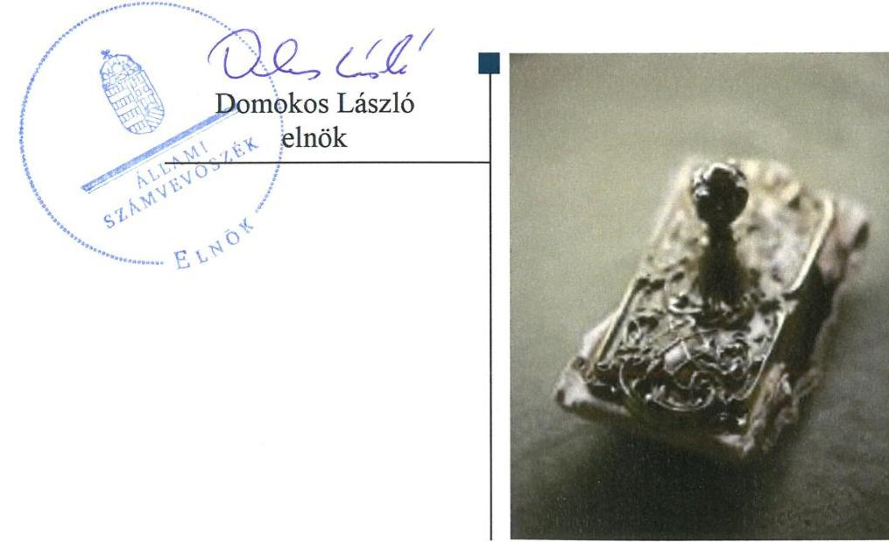
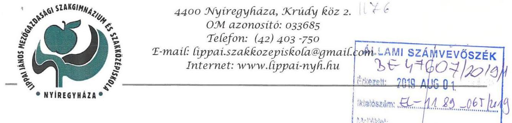
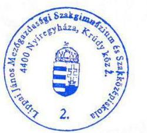
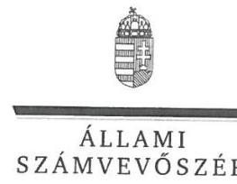
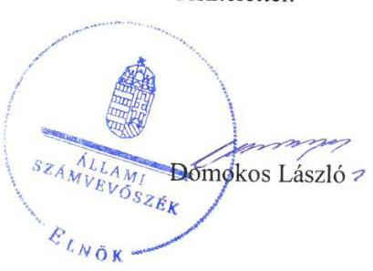
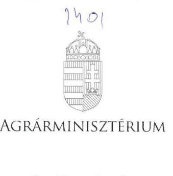
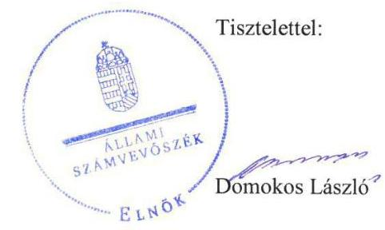

# Jelenetés 

## Központi költségvetési szervek ellenőrzése

Lippai János Mezőgazdasági Szakgimnázium és Szakközépiskola
2019.

---

# Jelenetés 

## Központi költségvetési szervek ellenőrzése

Lippai János Mezőgazdasági Szakgimnázium és Szakközépiskola
2019. 10. hó 30. nap

---

# AZ ELLENŐRZÉST FELÜGYELTE:

## MAKKAI MÁRIA felügyeleti vezető

## AZ ELLENŐRZÉST VEZETTE ÉS A VÉGREHAJTÁSÁÉRT FELELŐS:

### KISS ISTVÁN GYÖRGY ellenőrzésvezető

### A PROGRAM ÖSSZEÁLLÍTÁSÁÉRT FELELŐS:

### TÓTPÁL SZABOLCS osztályvezető

---

**IKTATÓSZÁM:** EL-2087-001/2019

**TÉMASZÁM:** 2450

**ELLENŐRZÉS-AZONOSÍTÓ SZÁM:** V079163, V0823163

---

Jelentéseink az Országgyűlés számítógépes hálózatán és az Interneta a www.asz.hu címen is olvashatóak.

---

# TARTALOMJEGYZÉK 

■ ÖSSZEGZÉS ..... 5
■ AZ ELLENŐRZÉS CÉLJA ..... 6
■ AZ ELLENŐRZÉS TERÜLETE ..... 7
■ AZ ELLENŐRZÉS HÁTTERE, INDOKOLTSÁGA ..... 8
■ A JELENTÉS LÉNYEGES KÉRDÉSKÖREI ..... 9
■ AZ ELLENŐRZÉS HATÓKÖRE ÉS MÓDSZEREI ..... 10
■ MEGÁLLAPÍTÁSOK ..... 13
■ JAVASLATOK ..... 16
■ MELLÉKLETEK ..... 19
I. sz. melléklet: Értelmező szótár ..... 19
■ FÜGGELÉKEK ..... 23
I. sz. függelék a jelentéshez ..... 23
II. sz. függelék: Észrevételek ..... 24
■ RÖVIDÍTÉSEK JEGYZÉKE ..... 35

---

.

---

# ÖSSZEGZÉS 

Lippai János Mezőgazdasági Szakgimnázium és Szakközépiskola belső kontrollrendszere, pénzügyi és vagyongazdálkodása nem volt szabályszerű, nem biztosította a közpénzekkel és a nemzeti vagyonnal való átlátható, elszámoltatható, felelős gazdálkodást. Az Intézmény nem volt védett a korrupcióval szemben.

## Az ellenőrzés társadalmi indokoltsága

Magyarország versenyképességének és a magyar gazdaság fejlődésének alapvető feltétele a magyar munkavállalók megfelelő szakmai képzettsége és felkészültsége, amelyben a szakképzési rendszernek döntő szerepe van. A mezőgazdaság vonatkozásában is kiemelten fontos ez, hiszen a magyar mezőgazdaság piaci versenyképességét és eredményességét nagymértékben befolyásolja az agrárszférában dolgozók képzettsége, felkészültsége. A szakképzés legjelentősebb színterei a szakképző iskolák. Az eredményes és célszerű szakképzés alapja és alapvető feltétele a szakképző intézmények közpénzekkel és a közvagyonnal való törvényes, átlátható és a korrupcióval szembeni védelmet biztosító múködése és gazdálkodása. Ezért ezen szervezetekkel szemben is alapvető társadalmi igény, hogy a rájuk bízott közpénzekkel, közvagyonnal szabályosan gazdálkodjanak. Emellett a szakképzésben részt vevő pedagógusok, tanulók és a szülők jogos elvárása, hogy a szakképző iskolák múködése átlátható és elszámoltatható legyen. Mindezen igényekkel összhangban, a közpénzügyek átláthatóságának előmozdítása, a közvagyon védelme érdekében került sor az agrárszakképző iskolák belső kontrollrendszerének és gazdálkodásának ellenőrzésére.

## Főbb megállapítások, következtetések, javaslatok

A Lippai János Mezőgazdasági Szakgimnázium és Szakközépiskola belső kontrollrendszerének kialakítása és múködtetése nem felelt meg a jogszabályi előírásoknak, nem biztosította a szabályos közpénzfelhasználást. Az intézmény nem rendelkezett szervezeti és múködési szabályzattal, amely tartalmazta volna a feladatokat és az azok ellátásáért felelősöket. Az intézménynél nem alakították ki az integrált kockázatkezelési rendszert, az információs és kommunikációs, valamint a monitoring rendszer múködtetése nem volt szabályszerű. Teljesítménymérésre alkalmas követelményeket nem alakítottak ki..

Az integritási kontrollok kiépítése a jogszabályban előírt kontrollok hiányában nem volt megfelelő. Az intézmény nem határozott meg követendő értékeket, így nem teremtette meg a szervezeti integritás feltételeit.

A pénzügyi gazdálkodás nem felelt meg a jogszabályi előírásoknak, mert a költségvetési források szabályszerű felhasználásának feltételei nem álltak fenn a kötelezettségvállalások nyilvántartása tartalmi hiányosságai miatt.

Az éves beszámolók mérlegtételeit nem támasztották alá leltárral, így a mérlegben szereplő adatok valódisága nem volt igazolt, nem volt biztosított a vagyon védelme.

Az Állami Számvevőszék a jelentésben foglalt megállapítások alapján a Lippai János Mezőgazdasági Szakgimnázium és Szakközépiskola igazgatója részére 9 javaslatot fogalmazott meg.

---

# AZ ELLENŐRZÉS CÉLJA

**AZ ELLENŐRZÉS CÉLJA** annak megállapítása volt, hogy az ellenőrzött intézményre vonatkozó irányító szervi feladatellátás a jogszabályi előírások betartásával történt-e; az intézménynél a belső kontrollrendszer kialakítása és működtetése szabályszerű volt-e; az intézmény pénzügyi és vagyongazdálkodása megfelel-e a jogszabályi előírásoknak és belső szabályzatainak; az intézmény átalakításának vagy átszervezésének lebonyolítása szabályszerűen történt-e.

Az ellenőrzés célja továbbá annak megállapítása volt, hogy a központi költségvetési szerv belső kontrollrendszere biztosította-e az átlátható, szabályszerű, gazdaságos, hatékony és eredményes gazdálkodás feltételeit; gazdálkodása során elszámoltatható és megfelel-e annak az Alaptörvényben meghatározott alapvetésnek, hogy Magyarország a kiegyensúlyozott, átlátható és fenntartható költségvetési gazdálkodás elvét érvényesíti. Érvényesült-e a nemzeti vagyon kezelésének és védelmének célja, azaz a szervezet vagyona a közérdeket szolgálta, a közös szükségletek kielégítése és a természeti erőforrások megóvása, valamint a jövő nemzedékek szükségleteinek figyelembevétele mellett.

Az ellenőrzés keretében értékeltük, hogy a központi költségvetési szervnél kiépítették és erősítették-e a korrupciós kockázatok kezelését szolgáló integritási kontrollokat, az integritás szemlélet érvényesülését, továbbá megteremtették-e a teljesítményellenőrzés feltételeit.

---

# AZ ELLENŐRZÉS TERÜLETE 

## Lippai János Mezőgazdasági Szakgimnázium és Szakközépiskola

Az Intézmény¹-t a nemzeti köznevelésről szóló 2011. évi CXC. törvény, a közoktatásról szóló 1993. évi LXXIX. törvény, valamint a szakképzésről szóló 2011. évi CLXXXVII. törvény rendelkezéseinek figyelembevételével a Földművelésügyi Minisztérium alapította 2013.július 25.-én, továbbá látta el irányítását és felügyeletét. Az Intézmény székhelye Szabolcs-Szatmár-Bereg megye székhelyén, Nyíregyházán található.

Az Intézmény alaptevékenysége a szakgimnáziumi, a szakközépiskolai nevelés-oktatás, a felnőttoktatás. A szakképzés a nyíregyházi központi intézményben, annak Apagy községben múködő tangazdaságában, valamint a tiszaberceli tagintézményben és annak tanúzemében folyik.

Az Intézmény a közfeladat ellátása mellett vállalkozási tevékenységet folytatott.

Az Intézmény saját gazdasági szervezettel rendelkező költségvetési szerv. Az ellenőrzött időszakban az igazgató és a gazdasági vezető személye nem változott. Az Intézmény szervezetét és múködését érintő átalakításra, átszervezésre az ellenőrzött időszakban nem került sor.

---

# AZ ELLENŐRZÉS HÁTTERE, INDOKOLTSÁGA 

Az államháztartás központi alrendszerének közpénz felhasználása, az intézmények által ellátott közfeladatok sokrétűsége, valamint a feladatellátásához rendelt vagyon nagyságrendje indokolja, hogy az ÁSZ ${ }^{2}$ ellenőrzéseket folytasson a pénzügyi és vagyongazdálkodás területén. Az államháztartás központi alrendszerébe tartozó szervezet vagyona a nemzeti vagyon része, és az Alaptörvény is rögzíti, hogy a vagyonnal való gazdálkodás célja a közérdek szolgálata.

Az ÁSZ az ellenőrzései során feltárja a gazdálkodást, a központi alrendszer intézményei átalakulását, átszervezését érintő szabályozások esetleges hiányosságait, a szabályozással nem érintett gazdálkodási területeket, rámutathat a vagyongazdálkodási tevékenység - ezen belül a tulajdonosi joggyakorlás és vagyonkezelés - esetleges szabálytalanságaira, értékeli az állami vagyon nyilvántartására és elszámolására vonatkozó eljárásokat.

A belső kontrollrendszer kialakítása és működtetése nélkül nem valósítható meg a közpénzek, a közvagyon átlátható, szabályos, gazdaságos, hatékony és eredményes felhasználása. A belső kontrollrendszer azt a célt szolgálja, hogy a költségvetési szervek működésük és gazdálkodásuk során a tevékenységeket szabályszerűen hajtsák végre, teljesítsék elszámolási kötelezettségeiket és megvédjék az erőforrásokat a veszteségektől, a károktól és a nem rendeltetésszerű használattól. A teljesítménykövetelmények meghatározása és működtetése megalapozhatja a központi költségvetési szervnél a teljesítményellenőrzés lefolytatását.

Az ellenőrzés várhatóan hozzájárul a központi intézmények pénzügyi helyzetének pontosabb megítéléséhez, és a jó gyakorlat kialakításán és terjesztésén keresztül az ellenőrzések elősegíthetik a gazdálkodás szabályszerűségének javítását.

---

# A JELENTÉS LÉNYEGES KÉRDÉSKÖREI 

1. Az Irányító szerv ellenőrzött Intézményre vonatkozó feladatellátása szabályszerű volt-e?
2. Az Intézmény belső kontrollrendszerének kialakítása és müködtetése szabályszerű volt-e?
3. Az Intézmény pénzügyi gazdálkodása szabályszerű volt-e?
4. Az Intézmény vagyongazdálkodása szabályszerű volt-e?

---

# AZ ELLENŐRZÉS HATÓKÖRE ÉS MÓDSZEREI 

## Az ellenőrzés típusa

Megfelelőségi ellenőrzés.

## Az ellenőrzött időszak

Az irányítószervi feladatellátás és a pénzügyi gazdálkodás tekintetében 2016. év.

A belső kontrollrendszer és vagyongazdálkodás tekintetében a 2016. és 2017. év.

## Az ellenőrzés tárgya

Az ellenőrzött szervezetre vonatkozó irányító szervi feladatok ellátása. Az intézmény pénzügyi és vagyongazdálkodása, átalakításának vagy átszervezésének lebonyolítása. Az intézmény belső kontroll rendszerének kialakítása és múködtetése. Az intézménynél az integritáskontrollok kiépítettsége, az integritás szemlélet érvényesülése, a teljesítményellenőrzés feltételei.

## Az ellenőrzött szervezet

Lippai János Mezőgazdasági Szakgimnázium és Szakközépiskola, valamint az Agrárminisztérium.

## Az ellenőrzés jogalapja

Az ellenőrzés jogszabályi alapját az ÁSZ tv. 1. § (3) bekezdés, 5. § (2)-(4) és (6) bekezdései, valamint az Áht. 61. § (2) bekezdésének előírásai képezik.

## Az ellenőrzés módszerei

Az ellenőrzésre az ellenőrzési program szempontjai, az ellenőrzött időszakban hatályos jogszabályok, az ellenőrzés szakmai szabályai, a jelen ellenőrzésre irányadó ÁSZ módszertanok figyelembevételével került sor.

Az ellenőrzés ideje alatt az ellenőrzött szervezetekkel a kapcsolattartást az ÁSZ SZMSZ ${ }^{3}$-ének vonatkozó előírásai alapján biztosította az ÁSZ.

---

Az ellenőrzési kérdések megválaszolásához szükséges bizonyítékok megszerzése az ellenőrzött szervezetek által rendelkezésre bocsátott dokumentumokra, adatokra alapozva megfigyelés, szemle (szemrevételezés), kérdésfeltevés (információkérés), mintavételezés, valamint elemző eljárás útján történt.

Az ellenőrzési bizonyítékként felhasználható adatforrások közé tartoztak egyrészt az ellenőrzési program részletes szempontjainál felsorolt adatforrások, másrészt minden egyéb - az ellenőrzés folyamán feltárt, az ellenőrzés szempontjából információt tartalmazó - dokumentum.

Az ellenőrzés lefolytatásához az ellenőrzött szervezet tanúsítványok kitöltésével, valamint az ÁSZ által kért dokumentumok megküldésével szolgáltat adatokat, amelyek valódiságát és teljes körűségét az ellenőrzött szervezet vezetője által tett teljességi és hitelességi nyilatkozat igazolja. A rendelkezésre bocsátott adatok, információk kontrollja az ellenőrzés keretében történt.

Az integritás szemlélet érvényesülésének értékelése az intézmény ÁSZ Integritási Projektje keretében kitöltött kérdőíve alapján, a kockázatkezelési rendszer keretében történt.

A központi költségvetési szerv belső kontrollrendszere egyes pilléreinek kialakítására és működtetésére vonatkozó értékelés:
$\longrightarrow$ „szabályszerü", amennyiben az értékelt területen az elért „igen" válaszok százalékban kifejezett, egész számra kerekített aránya legalább $85 \%$,
$\longrightarrow$ „nem szabályszerű", ha nem éri el a 85\%-ot,
A központi költségvetési szerv belső kontrollrendszerének összesített értékelése az egyes részterületek esetében kapott megfelelőségi arányok számtani átlaga alapján történik és megegyezik a pillérenként (kontrollterületenként) alkalmazott százalékos értékelésekkel, a következő eltérésekkel: a kontrollrendszer egésze esetében a „szabályszerű" értékelésnek a százalékos értéken felül további feltétele, hogy egyik kontrollterület sem kaphat „nem szabályszerű" értékelést.

Az ÁSZ statisztikai módszereken alapuló mintavételt alkalmazott. Mintavétellel ellenőriztük a bevételek, a kiadások és a vagyonváltozás elszámolása szabályszerűségét, az állami vagyontárgyak jogszerű használatát, valamint az állami vagyon szabályszerű év végi értékelését.

A kiadások (külső személyi juttatások, felhalmozási kiadások, dologi kiadások) és bevételek (értékesítésből és bérbeadásból származó bevételek) esetében az ellenőrzés azokra a legnagyobb értékű tételekre - a lényeges sokaságra - terjedt ki, melyek összértéke eléri a teljes sokaság összértékének 50\%-át.

A 2016. évi felhalmozási kiadások és a 2017. évi beruházások, felújítások végrehajtása szabályszerűségének esetében a teljes sokaság tételes ellenőrzésére került sor.

A 2017. évi kiadások elszámolásának szabályszerűséget a lényeges sokaságból véletlen mintavételi eljárással kiválasztott tételek alapján ellenőriztük.

A 2017. évi pénzmozgáshoz nem kapcsolódó vagyonváltozások és év végi értékelésének szabályszerűségét a teljes sokaságból véletlen mintavétellel kiválasztott tételek alapján ellenőriztük.

---

A mintavétellel ellenőrzött területek esetében minden egyes tétel vonatkozásában a felhasználás, elszámolás és értékelés szabályszerűségére vonatkozó kérdéseket tettünk fel. Szabályszerűnek értékeltünk egy ellenőrzött területet, amennyiben 95\%-os bizonyossággal az ellenőrzött sokaságban az átlagos hibaarány legfeljebb 10\%, nem szabályszerűnek, amenynyiben 10\%-nál magasabb arányt képviselt.

---

# MEGÁLLAPÍTÁSOK 

## 1. Az Irányító szerv ellenőrzött Intézményre vonatkozó feladatellátása szabályszerű volt-e?

Összegző megállapítás Az Irányító szervnek az ellenőrzött Intézményre vonatkozó feladatellátása szabályszerű volt 2016. évben.

AZ ALAPÍTÓI JOGOSULTSÁGAIT az Irányító szerv ${ }^{4}$ szabályszerűen gyakorolta. Az Irányító szerv az Áht. ${ }^{5}$-ban foglalt jogkörében eljárva az Intézmény részére kiadmányozta az alapító okirat ${ }^{6}$ módosítását, a szakképzés rendszerét érintő szabályozási környezetváltozás miatt, amely tartalmazta Ávr. ${ }^{7}$-ben kötelezően előírt információkat. Az NGM ${ }^{8}$ az alapító okirat kiadásához az előzetes egyetértését megadta.

AZ IRÁNYÍTÁSI, FELŰGYELETI ÉS ELLENŐRZÉSI JOGOSULTSÁGAIT az Irányító szerv az Ávr. és Áhsz. szerint szabályszerűen gyakorolta a tervezési követelmények meghatározásakor, az elemi költségvetés és a beszámoló összeállításához készült tájékoztató kiadásakor, valamint a költségvetés, valamint az éves beszámolójának jóváhagyásakor. Az Irányító szerv olyan éves költségvetési beszámolót hagyott jóvá, amely a vagyon védelmét biztosító leltárral nem volt alátámasztva.

## 2. Az Intézmény belső kontrollrendszerének kialakítása és müködtetése szabályszerű volt-e?

Összegző megállapítás Az Intézmény belső kontrollrendszerének kialakítása és müködtetése nem volt szabályszerű.

A KONTROLLKÖRNYEZET KIALAKÍTÁSA NEM VOLT SZABÁLYSZERŰ. Az Intézmény nem rendelkezett a szervezetét, feladatai ellátásának részletes belső rendjét és módját megállapító szervezeti és működési szabályzattal az Áht. 10. § (5) bekezdésében foglaltak ellenére.

A KONTROLLTEVÉKENYSÉGEK GYAKORLÁSA szabályszerű volt.

INTEGRÁLT KOCKÁZATKEZELÉS eljárásrendjét az igazgató a Bkr. ${ }^{9}$ 6. § (4) bekezdés előírása ellenére nem szabályozta.

AZ INFORMÁCIÓS ÉS KOMMUNIKÁCIÓS RENDSZER kialakítása nem volt szabályszerű volt. Az Intézmény az Info tv ${ }^{10}$. 24. § (3) bekezdésében előírtak ellenére nem rendelkezett adatvédelmi és

---

adatbiztonsági szabályzattal. Az igazgató az Lttv. ${ }^{11}$ 10. § (1) bekezdés a) pontjában foglaltak ellenére nem adott ki Iratkezelési szabályzatot.

# A CÉLOK MEGVALÓSÍTÁSÁNAK ESETI ÉS FOLYAMATOS NYOMONKÖVETÉSÉT biztosító rendszer múködtetése nem volt szabályszerű. A belső ellenőrzési vezető, a Bkr. 47. § (1)-(2) bekezdésben foglaltak ellenére nem vezetett nyilvántartást az ellenőrzési jelentésben szereplő javaslatokról, elfogadott intézkedési tervekről, illetve az azok alapján végrehajtott intézkedésekről. 

A BELSŐ KONTROLLRENDSZER minőségét az igazgató nyilatkozatban értékelte, azonban az abban foglaltakat az ÁSZ által tett megállapítások nem támasztották alá.

AZ INTEGRITÁSI KONTROLLOK kiépítése nem volt megfelelő, az integritási szemlélet nem érvényesült az Intézménynél a jogszabályok által előírt kontrollok hiányában. A szervezeti integritást sértő események kezelésének eljárásrendjével a Bkr. 6. § (4) bekezdés előírása ellenére nem rendelkezett.

A TELJESÍTMÉNYMÉRÉSÉRE alkalmas követelményeket az Intézmény nem alakított ki, a teljesítménymérés lehetőségét nem biztosították.

## 3. Az Intézmény pénzügyi gazdálkodása szabályszerű volt-e?

## Összegző megállapítás Az Intézmény pénzügyi gazdálkodása nem volt szabályszerű.

Az Intézmény kötelezettségvállalási nyilvántartása az Áhsz. 39. § (3) bekezdésében hivatkozott 14. melléklet II. fejezetének 4.a), 4.e) és 4.f) pontban meghatározottak ellenére nem tartalmazta a kötelezettségvállalás iktatószámát, a kötelezettségvállalás keltét, a pénzügyi ellenjegyzésre vonatkozó adatokat, a kötelezettségvállalás évek szerint megoszlását, valamint az a) pont szerint kötelezettségvállalás módosulását, ezért a pénzügyi gazdálkodás nem volt szabályszerű.

## 4. Az Intézmény vagyongazdálkodása szabályszerű volt-e?

## Összegző megállapítás Az intézmény vagyongazdálkodása nem volt szabályszerű.

## A VAGYONGAZDÁLKODÁS SZABÁLYOZOTTSÁGÁ-

NAK KIALAKÍTÁSA szabályszerű volt. Az Intézmény az ellenőrzött időszakban az Nvtv. ${ }^{12}$ alapján rendelkezett vagyonkezelési szerződésekkel ${ }^{13}$.

AZ INTÉZMÉNYNÉL AZ ÁLLAMI VAGYON KIMUTATÁSA, ÉRTÉKELÉSE NEM VOLT SZABÁLYSZERŰ. Az Intézmény az ellenőrzött időszakban a Számv.tv. ${ }^{14}$ 69. § (1)

---

bekezdésben foglaltak ellenére a beszámoló mérlegtételeit leltárral nem támasztotta alá.

A vagyontárgyak értékesítésének elszámolása 2017. évben nem volt szabályszerű, mivel a Számv. tv. 165. §. (2) bekezdésben foglaltak ellenére az értékesítést bizonylattal az Intézmény nem támasztotta alá.

A beruházások elszámolása nem volt szabályszerű. A Számv. tv. 165. § (2) bekezdésben foglaltak ellenére a vagyonnövekedéshez kapcsolódó gazdasági események elszámolását, az Intézménnyel üzleti kapcsolatban álló szervezet által kiállított bizonylat nem támasztotta alá.

---

# JAVASLATOK 

Az ÁSZ tv. 33. § (1) bekezdésében foglaltak értelmében az ellenőrzött szervezet vezetője köteles a jelentésben foglalt megállapításokhoz kapcsolódó intézkedési tervet összeállítani és azt a jelentés kézhezvételétől számított 30 napon belül az ÁSZ részére megküldeni. Amennyiben az ellenőrzött szervezet vezetője nem küldi meg határidőben az intézkedési tervet, vagy továbbra sem elfogadható intézkedési tervet küld, az Állami Számvevőszék elnöke az ÁSZ tv. 33. § (3) bekezdése a) és b) pontjaiban foglaltakat érvényesítheti.

## a Lippai János Mezőgazdasági Szakgimnázium és Szakközépiskola igazgatójának

1. Intézkedjen a szervezeti és müködési szabályzat jogszabályi előírásoknak megfelelő elkészitéséről.
(2. sz. megállapítás 1. bekezdése alapján)
2. Intézkedjen az integrált kockázatkezelés eljárásrendjének szabályozásáról.
(2. sz. megállapítás 3. bekezdése alapján)
3. Intézkedjen az Info. tv. előírásainak megfelelően az adatvédelmi és adatbiztonsági szabályzat megalkotásáról.
(2. sz. megállapítás 4. bekezdés második mondata alapján)
4. Intézkedjen az iratkezelési szabályzat jogszabályi előírásoknak megfelelő elkészitéséről.
(2. sz. megállapítás 4. bekezdés harmadik mondata alapján)
5. Intézkedjen a Bkr. előírásainak megfelelően az operatív tevékenységek keretében megvalósuló folyamatos és eseti nyomon követésről.
(2. sz. megállapítás 5. bekezdés első mondata alapján)
6. Intézkedjen a Bkr. előírásainak megfelelő nyilvántartás vezetéséről.
(2. sz. megállapítás 5. bekezdés második mondata alapján)
7. Intézkedjen a Bkr. előírásainak megfelelően a szervezeti integritást sértő események kezelésének eljárásrendje szabályozásáról.
(2. sz. megállapítás 7. bekezdés második mondata alapján)

---

8. Intézkedjen a kötelezettségvállalások jogszabályi előírásoknak megfelelő nyilvántartásának vezetéséről.
(3. sz. megállapítás alapján)
9. Intézkedjen a jogszabályi elöírásoknak megfelelően a mérleg tételeit alátámasztó leltár összeállításáról, amely tételesen, ellenőrizhető módon tartalmazza a mérleg fordulónapján meglévő eszközöket és forrásokat mennyiségben és értékben.
(4. sz. megállapítás 2. bekezdés második mondata alapján)

---

.

---

# MELLÉKLETEK 

- I. SZ. MELLÉKLET: ÉRTELMEZŐ SZÓTÁR
állami vagyon
állami vagyonnak minősül:
a) az állam tulajdonában lévő dolog, valamint a dolog módjára hasznosítható természeti erő,
b) az a) pont hatálya alá nem tartozó mindazon vagyon, amely vonatkozásában törvény az állam kizárólagos tulajdonjogát nevesíti,
c) az állam tulajdonában lévő tagsági jogviszonyt megtestesítő értékpapír, illetve az államot megillető egyéb társasági részesedés,
d) az államot megillető olyan immateriális, vagyoni értékkel rendelkező jogosultság, amelyet jogszabály vagyoni értékű jogként nevesít. (Forrás: Vtv. 1. § (2) bekezdése)
állami vagyon értékesítése
állami vagyon használója
állami vagyon hasznosítása
állami vagyon hasznosítása kötött szerződés
állami vagyon kezelője /vagyonkezelő

ÁSZ Integritás Projekt

Állami vagyonnak minősül:
a) az állam tulajdonában lévő dolog, valamint a dolog módjára hasznosítható természeti erő,
b) az a) pont hatálya alá nem tartozó mindazon vagyon, amely vonatkozásában törvény az állam kizárólagos tulajdonjogát nevesíti,
c) az állam tulajdonában lévő tagsági jogviszonyt megtestesítő értékpapír, illetve az államot megillető egyéb társasági részesedés,
d) az államot megillető olyan immateriális, vagyoni értékkel rendelkező jogosultság, amelyet jogszabály vagyoni értékű jogként nevesít. (Forrás: Vtv. 1. § (2) bekezdése)
Állami vagyon tulajdonjogának bármely jogcímen történő, visszterhes átruházása. (Forrás: Vtvr. 1. § (7) bekezdés d) pontja)
Az a természetes vagy jogi személy, jogi személyiséggel nem rendelkező szervezet, aki, vagy amely törvény vagy szerződés alapján, bármely jogcímen (bérlet, haszonbérlet, használat stb.) állami vagyont birtokol, használ, szedi annak hasznait, hasznosít, ide nem értve a haszonélvezőt, a vagyonkezelőt és a tulajdonosi jogok gyakorlóját". (Forrás: Vtvr. 1. § (7) bekezdés a) pontja)
Az állami vagyont az MNV Zrt. maga kezeli, vagy szerződés - így különösen bérlet, haszonbérlet, megbízás - alapján központi költségvetési szervnek, természetes vagy jogi személynek, vagy jogi személyiséggel nem rendelkező gazdálkodó szervezetnek hasznosításra átengedi.
(Forrás: Vtv. 23. § (1) bekezdése, hatályos 2012. január 1-jétől)
Az állami vagyonnal a tulajdonosi joggyakorló maga gazdálkodik, vagy szerződés - így különösen bérlet, haszonbérlet, megbízás - alapján hasznosításra átengedi, illetőleg vagyonkezelésbe, haszonélvezetbe adja. (Forrás: Vtv. 23. § (1) bekezdése, hatályos 2013. június 28 -ától)
Az állami vagyon hasznosítására kötött szerződések elsődleges célja az állami vagyon hatékony működtetése, állagának védelme, értékének megőrzése, illetve gyarapítása, az állami és közfeladatok ellátásának elősegítése. (Forrás: Vtv. 23. § (2) bekezdése)
Az állami vagyont az MNV Zrt. maga kezeli, vagy szerződés - így különösen bérlet, haszonbérlet, megbízás - alapján központi költségvetési szervnek, természetes vagy jogi személynek, vagy jogi személyiséggel nem rendelkező gazdálkodó szervezetnek hasznosításra átengedi." Az állami vagyonra vonatkozóan az MNV Zrt. kizárólag az Nvtv-ben meghatározott személyekkel köthet vagyonkezelési szerződést. (Forrás: Vtv. 27. § (1) bekezdése, hatályos 2012. január 1-jétől)
Az Állami Számvevőszék 2009-ben indította el a „Korrupciós kockázatok feltérképezése - Integritás alapú közigazgatási kultúra terjesztése" című, európai uniós forrásból megvalósított kiemelt projektjét (Integritás Projekt). Az Integritás Projekt célja, hogy felmérje a közszféra intézményei korrupciós kockázatoknak való kitettségét, illetőleg az azok mérséklésére hivatott kontrollok szintjét. Az Állami Számvevőszék a projekt révén az integritás szemlélet minél szélesebb körrel történő megismertetését, gyakorlatba ültetését kívánja elérni. Az integritás követelményeinek megfelelő szervezeti múködést előnyben részesítő közigazgatási kultúra elterjesztését és a korrupció elleni fellépést az ÁSZ önmagára nézve is stratégiai jelentőségű célként fogalmazta meg. A projekt a felmérésben résztvevő intézmények számára helyzetükről

---

egyfajta „tükörképet" mutat be, ami alapot teremt a jövőbeni pozitív irányú elmozduláshoz. (Forrás: a http://integritas.asz.hu honlapon közzétett, a 2013. évi Integritás felmérés eredményeiről készült összefoglaló tanulmány)
belső ellenőrzés
belső kontrollrendszer
belső kontrollrendszer területei
felújítás
hasznosítás
információs és kommunikációs rendszer
integritás
irányító szerv
kincstári költségvetés
kockázat
Független, tárgyilagos bizonyosságot adó és tanácsadó tevékenység, amelynek célja, hogy az ellenőrzött szervezet működését fejlessze és eredményességét növelje, az ellenőrzött szervezet céljai elérése érdekében rendszerszemléletű megközelítéssel és módszeresen értékeli, illetve fejleszti az ellenőrzött szervezet irányítási és belső kontrollrendszerének hatékonyságát. (Forrás: Bkr. 2. § b) pontja)
A belső kontrollrendszer a kockázatok kezelése és tárgyilagos bizonyosság megszerzése érdekében kialakított folyamatrendszer, amely azt a célt szolgálja, hogy a múködés és gazdálkodás során a tevékenységeket szabályszerűen, gazdaságosan, hatékonyan, eredményesen hajtsák végre, az elszámolási kötelezettségeket teljesítsék, megvédjék az erőforrásokat a veszteségektől, károktól és nem rendeltetésszerű használattól. (Forrás: Áht. 69. § (1) bekezdése)
A kontrollkörnyezet, a kockázatkezelési rendszer, a kontrolltevékenységek, az információs és kommunikációs rendszer, valamint a nyomon követési (monitoring) rendszer. (Forrás: Bkr. 3. §-a)
Az elhasználódott tárgyi eszköz eredeti állaga (kapacitása, pontossága) helyreállítását szolgáló időszakonként visszatérő olyan tevékenység, melynek során az eszköz élettartama megnövekszik, minősége, használata jelentősen javul, így a pótlólagos ráfordításból a jövőben gazdasági előnyök származnak. (Forrás: Számv. tv. 3. § (4) bekezdés 8. pontja)
A nemzeti vagyon birtoklásának, használatának, hasznok szedése jogának bármely a tulajdonjog átruházását nem eredményező - jogcímen történő átengedése, ide nem értve a vagyonkezelésbe adást, valamint a haszonélvezeti jog alapítását. (Forrás: Nvtv. 3. § (1) bekezdés 4. pontja)
A költségvetési szerv vezetője által kialakított és működtetett olyan rendszer, mely biztosítja, hogy a megfelelő információk a megfelelő időben eljutnak az illetékes szervezethez, szervezeti egységhez, illetve személyhez. (Forrás: Bkr. 9. § (1) bekezdés)
Az integritás - egyik gyakran használt jelentése szerint - az elvek, értékek, cselekvések, módszerek, intézkedések konzisztenciáját jelenti, vagyis olyan magatartásmódot, amely meghatározott értékeknek megfelel. Integritás-irányítási rendszer bevezetése a szervezetben a szervezethez rendelt közfeladatok integritás szempontú ellátását, az érték alapú múködéssel (integritással) összefüggő szervezeti követelmények következetes érvényesítését jelenti. (Forrás: Nemzetgazdasági Minisztérium: Államháztartási Belső Kontroll Standardok és Gyakorlati Útmutató 1.6. Etikai értékek és integritás 46. oldal, 2017. szeptember)
A költségvetési szerv tekintetében az Áht-ban meghatározott irányítási hatáskört gyakorló szerv. (Forrás: Áht. 1. § 9. pontja)
A központi költségvetésről szóló törvény elfogadását követően a fejezetet irányító szerv az államháztartás központi alrendszerébe tartozó költségvetési szerv és a fejezeti kezelésű előirányzat kiemelt előirányzatait, valamint az elkülönített állami pénzalapok és a társadalombiztosítás pénzügyi alapjai jogszabályi előírás szerinti bevételeit és kiadásait kincstári költségvetés kiadásával állapítja meg. (Forrás: Áht. 28. § (2) bekezdés)
A kockázat annak a valószínűségét jelenti, hogy egy vagy több esemény vagy intézkedés nem kívánt módon befolyásolja a rendszer múködését, céljainak megvalósulását. (Forrás: Javaslatok a korrupciós kockázatok kezelésére - Kockázatkezelési és ellenőrzési módszertan 35. oldal, ÁSZ)

---

kockázatkezelési rendszer
integrált kockázatkezelési rendszer
kontrollkörnyezet
kontrolltevékenységek
kommunikáció
középirányító szerv
közfeladat
monitoring
monitoring-rendszer
tulajdonosi joggyakorló
vagyongazdálkodás

Olyan irányítási eszközök és módszerek összessége, melynek elemei a szervezeti célok elérését veszélyeztető tényezők (kockázatok) azonosítása, elemzése, csoportosítása, nyomon követése, valamint szükség esetén a kockázati kitettség mérséklése.(Forrás: Bkr. 2. § m) pontja)
Olyan folyamatalapú kockázatkezelési rendszer, amely a szervezet minden tevékenységére kiterjed, egységes módszertan és eljárások alkalmazásával, a szervezet célkitűzéseinek és értékeinek figyelembevételével biztosítja a szervezet kockázatainak teljes körű azonosítását, azok meghatározott kritériumok szerinti értékelését, valamint a kockázatok kezelésére vonatkozó intézkedési terv elkészítését és az abban foglaltak nyomon követését. (Forrás: Bkr. 2. § m) pontja, 2016. október 1-jétől)
A költségvetési szerv vezetője által kialakított olyan elvek, eljárások, belső szabályzatok összessége, amelyben világos a szervezeti struktúra, a folyamatok átláthatók, egyértelműek a felelősségi, hatásköri viszonyok és feladatok, meghatározottak, ismertek és elfogadottak az etikai elvárások a szervezet minden szintjén, átlátható a humán-erőforrás-kezelés. (Forrás: Bkr. 6. § (1) bekezdés)
A költségvetési szerv vezetője által a szervezeten belül kialakított (kontroll) tevékenységek, melyek biztosítják a kockázatok kezelését, hozzájárulnak a szervezet céljainak eléréséhez és erősítik a szervezet integritását. (Forrás: Bkr. 8. § (1) bekezdés)
Az a tevékenység, melynek során információ továbbítása valósul meg. A kommunikációs folyamat résztvevői között tájékoztatás történik, mely során tényeket, ezek magyarázatát közlik.
A költségvetési szerv tekintetében törvény vagy kormányrendelet alapján meghatározott, átruházott irányítási hatásköröket gyakorló szerv. (Forrás: Áht. 9. § (4) bekezdés)
Jogszabályban meghatározott állami vagy önkormányzati feladat, amit az arra kötelezett közérdekből, a jogszabályban meghatározott követelményeknek és feltételeknek megfelelve végez, ideértve a lakosság közszolgáltatásokkal való ellátását, továbbá az állam nemzetközi szerződésekben vállalt kötelezettségeiből adódó közérdekű feladatokat, valamint e feladatok ellátásakor szükséges infrastruktúra biztosítását is. (Forrás: Nvtv. 3. § (1) bekezdés 7. pontja)
A monitoring általánosságban a különböző szintű szervezeti célok megvalósításának folyamatát kíséri figyelemmel, melynek során a releváns eseményekről és tevékenységekről (együtt: folyamatokról) rendszeres jelleggel, strukturált, döntéstámogató információkhoz jutnak a szervezet vezetői. (Forrás: NGM Útmutató a költségvetési szervek monitoring rendszeréhez 2011. november)
A költségvetési szerv vezetője köteles kialakítani a szervezet tevékenységének a célok megvalósításának nyomon követését biztosító rendszert, amely az operatív tevékenységek keretében megvalósuló folyamatos és eseti nyomon követésből, valamint az operatív tevékenységektől függetlenül múködő belső ellenőrzésből áll. (Forrás: Bkr. 10. §)

Aki a nemzeti vagyon felett az államot vagy a helyi önkormányzatot megillető tulajdonosi jogok és kötelezettségek összességének gyakorlására jogosult. (Forrás: Nvtv. 3. § (1) bekezdés 17. pontja)

A nemzeti vagyongazdálkodás feladata a nemzeti vagyon rendeltetésének megfelelő, az állam, az önkormányzat mindenkori teherbíró képességéhez igazodó, elsődlegesen a közfeladatok ellátásához és a mindenkori társadalmi szükségletek kielégítéséhez szükséges, egységes elveken alapuló, átlátható, hatékony és költségtakarékos múködtetése, értékének megőrzése, állagának védelme, értéknövelő használata, hasznosítása, gyarapítása, továbbá az állam vagy a helyi önkormányzat feladatának ellátása szempontjából feleslegessé váló vagyontárgyak elidegenítése. (Forrás: Nvtv. 7. § (2) bekezdése)

---

.

---

# FÜGGELÉKEK 

- I. SZ. FÜGGELÉK A JELENTÉSHEZ

Az Állami Számvevőszék az ellenőrzések során feltárt tényekhez kapcsolódó további körülmények tisztázására eszközrendszerrel nem rendelkezik. Amennyiben az ellenőrzésen túlmutatóan indokoltnak látszik az ellenőrzés során feltárt körülmények további vizsgálata, az Állami Számvevőszék törvényi felhatalmazás alapján az ellenőrzés által feltárt körülményeket továbbítja a hatáskörrel rendelkező szervnek a szükséges intézkedések megtétele, eljárások lefolytatása érdekében.
I.
1.

Az Intézmény 2017. évben a könyveiben elszámolt 1.328 ezer Ft értékű beruházás alátámasztására számviteli bizonylatokkal nem rendelkezett. Ezzel megsértette, a Számv.tv. 165. § (2) bekezdés előírásait.

A gazdsági események megtörténtét hitelt érdemlően igazoló bizonylatok hiányában nem igazolt, hogy a kifizetések valós, megtörtént teljesítésekhez kapcsolódtak, ezért felvetődik, hogy az Intézménynél vagyoni hátrány keletkezett.
Az eset konkrét körülményeinek felderítésére az Ügyészség rendelkezik hatáskörrel.
2.

Az Intézmény 2016-2017. évi beszámoló mérlegtételeit nem támasztotta alá leltárral. Az Intézmény ezért 2016. és 2017. években megsértette a Számv.tv. 69. § (1) bekezdésében előírtakat.
A fenti szabálytalanság miatt nem igazolt, hogy a mérlegben szereplő tételek a valóságban is megtalálhatóak.
Az eset konkrét körülményeinek felderítésére az Ügyészség rendelkezik hatáskörrel.
II.

Az I./1. és I/2. alatt rögzített szabálytalanságok alapján továbbá nem igazolt, hogy az Intézmény 2016-2017. évi beszámolói valós, megbízható képet mutatnak, továbbá a szabálytalan könyvviteli elszámolása az adókötelezettségek elszámolása jogszerüségének kétségességét is felvetik. Az Intézmény közfeladatai mellett vállalkozási tevékenységet is végez.
Az eset konkrét körülményeinek feltárására a Nemzeti Adó-és Vámhivatal rendelkezik hatáskörrel.

---

A jelentéstervezetet a Számvevőszék 15 napos észrevételezésre megküldte az ellenőrzött szervezetek vezetőinek az ÁSZ tv. 29. §̊ (1) bekezdése előirásának megfelelően.

Az ÁSZ a jelentéstervezetet észrevételezésre megküldte a Lippai János Mezőgazdasági Szakgimnázium és Szakközépiskola igazgatójának és az agrárminiszternek.
Lippai János Mezőgazdasági Szakgimnázium és Szakközépiskola igazgatója és az agrárminiszter észrevételét és az arra adott választ a függelék tartalmazza.

[^0]
[^0]:    * 29. § (1) Az Állami Számvevőszék az ellenőrzési megállapításait megküldi az ellenőrzött szervezet vezetőjének vagy az általa megbízott személynek, és annak, akinek személyes felelősségét állapította meg.
    (2) Az ellenőrzött szervezet vezetője és a felelősként megjelölt személy az ellenőrzés megállapításaira tizenöt napon belül írásban észrevételt tehet.
    (3) Az Állami Számvevőszék az észrevételre a beérkezésétől számított harminc napon belül írásban válaszol. A figyelembe nem vett észrevételeket köteles a jelentésben feltüntetni, és megindokolni, hogy azokat miért nem fogadta el.

---

Állami Számvevőszék

Iktatószám: 6-46/7/2019.
Úgyintéző: Jánóczki Józsefné
Telefonszám: +36-70/3138026

Domokos László
elnök úr részére

Budapest
Apáczai Csere János utca 10.
1052

Tárgy: Észrevétel a Lippai János Mezőgazdasági Szakgimnázium és Szakközépiskola ÁSZ ellenőrzés jelentéstervezete kapcsán

Tisztelt Elnök Úr!

Hivatkozva 2019.07.16. napján kelt EL-1189-061/2019. iktatószámú „jelentéstervezet" tárgyú levelére, a Lippai János Mezőgazdasági Szakgimnázium és Szakközépiskola vonatkozásában elkészített jelentéstervezetre az alábbi észrevételt kívánom tenni:

I. Jelentéstervezet 13. oldal 2. pont: Az Intézmény belső kontrollrendszerének kialakítása és működétése szabályszerű volt-e? Összegző megállapítás (...)

Észrevétel: Az intézményben 2019. május 31. napjával életbe lépett a hatályos jogszabályoknak mindenben megfelelő belső kontroll kézikönyv, mely részletesen szabályozza az összegző megállapításban nem szabályszerűnek minősített területeket.

II. Jelentéstervezet 14. oldal 3. pont: Az intézmény pénzügyi gazdálkodása szabályszerű volt-e? Összegző megállapítás (...)

1. „Az Intézmény pénzügyi gazdálkodása nem volt szabályszerű. Az intézmény kötelezettségvállalási nyilvántartása az Áhsz. 39. § (3) bekezdésében hivatkozott 14. melléklet II. fejezetének 4. a), 4. e) és 4. f) pontban meghatározottak ellenére nem tartalmazta a kötelezettségvállalás iktatószámát, a kötelezettségvállalás keltét, a pénzügyi ellenjegyzésre vonatkozó adatokat, a kötelezettségvállalás évek szerinti megoszlását, valamint az e) pont szerinti kötelezettségvállalás módosulását, ezért a pénzügyi gazdálkodás nem volt szabályszerű.

Észrevétel: Intézményünk által alkalmazott EPER pénzügyi- és számviteli rendszer nem tudja kezelni az összegző megállapítás szerinti hiányosságokat, ezért a Kollégák felveszik a kapcsolatot a szoftverfejlesztőkkel, hogy a fenti hiányosságokat a szoftver a későbbi időszakban a vonatkozó törvényi előírásoknak megfelelően kezelje és tartalmazza.

III. Jelentéstervezet 14. oldal 4. pont: Az intézmény vagyongazdálkodása szabályszerű volt-e? Összegző megállapítás (...)

1. „Az Intézménynél az állami vagyon kimutatása, értékelése nem volt szabályszerű. Az intézmény az ellenőrzött időszakban a Számv. tv. 69. § (1) bekezdésében foglaltak ellenére nem állított össze olyan leltárt a beszámoló mérleg tételeinek alátámasztásához, amely a mérleg forduló napján meglévő eszközeit és forrásait mennyiségben és értékben tételesen és ellenőrizhető módon tartalmazta."

Teléphely: 4553 Apagy, AG. lakótelep 1.
Tagintézmény: 4474 Tiszabercel, fő út 90.
Számlaszám: 10044001-00334019-00000000
Felnőttképzési nyilvántartási szám: E-000028/2013

---

4400 Nyiregyháza, Krüdy köz 2. O.M azonosító: 033685
Telefon: (42) 403 -750
E-mail: fippai.szakkozepiskola@gmail.com
Internet: www.fippai-nyh.hu

Észrevétel: Intézményünk valamennyi év vonatkozásában tételes leltárt készít mind a mennyiség, mind az érték figyelembe vétele szerint a törvény által megfogalmazottak alapján, így az ellenőrzött időszak 2016. és 2017. év vonatkozásában is elkészült a tételes leltár.

Kollégáim kizárólag az Önök által Részünkre megküldött bekérőlevél szövegezését figyelembe véve jártak el az adatszolgáltatás tekintetében, így azon dokumentumok, melyek a bekérő levélben nem kerültek nevesítésre, azok nem is kerültek feltöltésre. Természtesen rendelkezünk ezen dokumentumokkal, melyeket jelen levelemmel együtt megküldünk az Önök részére.

2.
a. „A vagyontárgyak értékesítésének elszámolása 2017. évben nem volt szabályszerű, mivel a Számv.tv. 165. § (2) bekezdésében foglaltak ellenére az értékesítést bizonylattal az intézmény nem támasztotta alá."

b. „A beruházások elszámolása nem volt szabályszerű. A Számv.tv. 165. § (2) bekezdésében foglaltak ellenére a vagyonnövekedéshez kapcsolódó gazdasági események elszámolását, az intézménnyel üzleti kapcsolatban álló szervezet által kiállított bizonylat nem támasztotta alá."

Észrevétel: Intézményünk valamennyi értékesítés- és beszerzés kapcsán rendelkezik számviteli bizonylattal. Ebben az esetben is a Kollégáim kizárólag az Önök által Részünkre megküldött bekérőlevél szövegezését figyelembe véve jártak el az adatszolgáltatás tekintetében, így azon dokumentumok, melyek a bekérő levélben nem kerültek nevesítésre, azok nem is kerültek feltöltésre (például számlák, valamint az Intézménnyel üzleti kapcsolatban álló szervezet által kiállított bizonylat). Természtesen a kapcsolódó dokumentumok rendelkezésre állnak intézményünknél, melyeket jelen levelemmel együtt ugyancsak megküldünk az Önök részére.

Tekintettel arra, hogy a levél szövegezésében nem került megfogalmazásra, kiemelésre egyes tételeknél a (például felhalmozási bevétel és felhalmozási kiadások) számla elnevezés, ezért ezen dokumentumok nem kerültek feltöltésre. Ezek az anomáliák kizárólag félreértésből adódnak, mert a kollégák kizárólag a bekérő levélben szereplő dokumentumok listájára- és elnevezésére koncentráltak. Ennek indoka, hogy az Önök bekérő levele által nem tartalmazott dokumentum típusokat ne küldjenek Kollégáim az adatszolgáltatásunk során, illetve nem kívántuk terhelni az Önök munkatársait- és szervereit feleslegesen.

Összességében elmondhatom, hogy Kollégáim a humán erőforrás rendkívül korlátozott rendelkezésre állása mellett is a legnagyobb odafigyeléssel, jogkövető magatartással végzik munkájukat. A jelentéstervezet vagyongazdálkodás szabályszerűsége vonatkozásában az összegző megállapításban megfogalmazottak kizárólag félreértés miatt keletkeztek. Továbbá az ellenőrzés nem adott lehetőséget semmilyen jellegű hiánypótlásra, így a rendelkezésre álló dokumentumokat sem tudtuk megküldeni további felhasználásra. Fontos megjegyeznem, Intézményünknek korábban nem volt hasonló típusú vizsgálata, így ebben a vonatkozásban nem is volt megfelelő szakmai tapasztalatunk, hogy az adatszolgáltatások során elkerülhetőek legyenek a fenti, félreértésekből adódó anomáliák.

Kollégáim az adatszolgáltatás folyamán többször kértek információt telefonon keresztül az Önök munkatársaitól, de egyértelműen nem kerültek definiálásra, hogy konkrétan, milyen dokumentumokat várnak egy adott tételhez.

Tekintettel arra, hogy fentiekhez hasonló típusú anomáliák a későbbi vizsgálatoknál elkerülhetőek legyenek, konstruktív javaslatként kérem az adatbekérő levél szövegezésének egyértelmű, pontos definiálását; mert a legnagyobb odafigyelésünk ellenére is negatív szemléletű gazdálkodást feltételez az ÁSZ vizsgálat jelentése, miközben törekszünk a pontos, precíz- és jogkövető intézményi üzemeltetésre, valamint gazdálkodásra.

Telephely: 4553 Apagy, A.G. fakót elépe 1.
Tagintézmény: 4474 Tiszabercef, fö út 90.
Számlaszám: 10044001-00334019-00000000
Felnőttképzési nyilvántartási szám: 1-000028/2013

---

4400 Nyíregyháza, Krúdý köz 2. OM azonosító: 033685
Telefon: (42) 403 -750
E-mail: lippai.szakkozepiskola@gmail.com
Internet: www.lippai-nyh.hu

Kérem észrevételünk szíves elfogadását.

Kelt: Nyíregyháza, 2019. július 23.

Tisztelettel:

Ferdinánd Tibor László igazgató

# Mellékletek: 

- Az ellenőrzött időszak 2016. és 2017. év vonatkozásában elkészült, a beszámoló mérleg tételeinek alátámasztására szolgáló tételes leltár kimutatások (1. és 2. melléklet)
- Felhalmozási bevételek esetén az Intézményünk által kiállított számlák hitelesített másolatai ( 3. melléklet)
- Felhalmozási kiadások esetén az Intézménnyel üzleti kapcsolatban álló szervezet által kiállított bizonylatok, számlák hitelesített másolatai (4. melléklet)

---

ELNÖK

Ikt.szám: EL-1189-066/2019.

# Ferdinánd Tibor László úr 

igazgató
Lippai János Mezőgazdasági
Szakgimnázium és Szakközépiskola

## Nyíregyháza

## Tisztelt Igazgató Úr!

A „Központi költségvetési szervek ellenőrzése - Lippai János Mezögazdasági Szakgimnázium és Szakközépiskola"címmel készített számvevőszéki jelentéstervezetre tett észrevételét köszönettel megkaptam.

Az Állami Számvevőszék észrevételre vonatkozó álláspontjáról a felügyeleti vezető által készített részletes tájékoztatást mellékelten megküldőm.

Tájékoztatom Igazgató urat, hogy a számvevőszéki jelentésben - az Állami Számvevőszékről szóló 2011. évi LXVI. törvény 29. § (3) bekezdése alapján - a figyelembe nem vett észrevételt szerepeltetjük, annak indoklásával, hogy azt az Állami Számvevőszék miért nem fogadta el.

Budapest, 2019. 88 hó 15 nap

Tisztelettel:

Melléklet: Tájékoztatás az észrevétel kezeléséről

---

# Tájékoztatás   az észrevétel kezeléséről 

A „Központi költségvetési szervek ellenőrzése - Lippai János Mezögazdasági Szakgimnázium és Szakközépiskola" című jelentéstervezetre 2019. augusztus 1-jén érkezett észrevételét áttekintettük, annak kezelésével kapcsolatban a következő tájékoztatást adom.
I. A jelentéstervezet 13. oldal 2. összegző megállapítással kapcsolatban tett észrevételre adott válasz
Az észrevételben a Lippai János Mezőgazdasági Szakgimnázium és Szakközépiskola (továbbiakban: Intézmény) tájékoztatást ad arról, hogy 2019. május 31 -én életbe lépett a jogszabályoknak mindenben megfelelő belső kontroll kézikönyv, amely részletesen szabályozza az összegző megállapításban nem szabályszerűnek minősített területeket.
A belső kontroll kézikönyv 2019. május 31 -én történt életbe léptetéséről adott tájékoztatást köszönjük. A szabályozást az ellenőrzött időszakot követően léptették életbe, ezért a jelentéstervezet megállapítása helytálló, annak módosítása nem indokolt.
II. A jelentéstervezet 14. oldal 3. összegző megállapítással és az azt alátámasztó megállapításokkal kapcsolatban tett észrevételre adott válasz
Az észrevételben az Intézmény tájékoztatást ad arról, hogy az általa alkalmazott pénzügyi és számviteli rendszer nem tudja kezelni a kötelezettségvállalás nyilvántartással kapcsolatban megállapított hiányosságokat, ezért megkeresik a szoftverfejlesztőket, hogy a rendszer a jogszabályi előírásoknak megfelelően kezelje és tartalmazza a feltárt hiányosságokat.
Az észrevétel a jelentéstervezet megállapításait nem kifogásolja, ezért azok módosítása nem indokolt.
III. A jelentéstervezet 14. oldal 4. összegző megállapításával és az azt alátámasztó megállapításokkal kapcsolatban tett észrevételre adott válasz

1. Az észrevételben a beszámolót alátámasztó leltár hiányára vonatkozó megállapítást kifogásolja a szervezet. Az észrevétel szerint az adatszolgáltatás során a megküldött adatbekérő levél szövegezését figyelembe véve jártak el, így azokat a dokumentumokat, amelyek nem kerültek nevesítésre az adatbekérő levélben, nem küldték meg. Az Intézmény a 2016. és 2017. évek vonatkozásában tételes leltárt készített, melynek dokumentumait az észrevétel mellékleteként megküldték.
Az Állami Számvevőszék ellenőrzési megállapításai az Állami Számvevőszékről szóló 2011. évi LXVI. törvénynek (továbbiakban: ÁSZ törvény) megfelelően minden esetben az ellenőrzés során bekért és az arra nyitva álló határidőn belül rendelkezésre bocsátott dokumentumokon alapulnak. Igazgató úr az ÁSZ rendelkezésére bocsátott dokumentumokról teljességi és hitelességi nyilatkozatot állított ki, melyben nyilatkozott, hogy az ÁSZ részére átadott dokumentumok megbízhatóak, a bekért adatokra,

---

dokumentumokra vonatkozóan teljes körű információt tartalmaznak. A fentiekben leírtak miatt az észrevétellel megküldött dokumentumokat az ÁSZ nem értékelte.
Az adatbekérés során rendelkezésre bocsátott dokumentumok alapján az Intézmény a számvitelről szóló 2000 . évi C. törvény (Számv. tv.) 69. § (1) bekezdése előírása ellenére a mérleg valamennyi sorát nem támasztotta alá leltárral, továbbá a 69. § (2) bekezdésben foglaltak ellenére a fökönyvi könyvelés és az analitikus nyilvántartások adatai közötti egyeztetést nem végezte el. Mindezek alapján a jelentéstervezet módosítása nem indokolt.
2. Észrevételt tett a vagyontárgyak értékesítése, valamint a beruházások szabályoknak nem megfelelő elszámolására vonatkozó megállapításokra. Az észrevételben leírtak szerint kizárólag azokat a dokumentumokat küldte meg az Intézmény az adatszolgáltatás során, amelyek az adatbekérő levelekben nevesítve voltak. Az adatbekérés során be nem küldött dokumentumokat az Intézmény az észrevétellel együtt megküldte.
Az Állami Számvevőszék ellenőrzési megállapításai az ÁSZ törvénynek megfelelően minden esetben az ellenőrzés során bekért és az arra nyitva álló határidőn belül rendelkezésre bocsátott dokumentumokon alapulnak. Igazgató úr az ÁSZ rendelkezésére bocsátott dokumentumokról teljességi és hitelességi nyilatkozatot állított ki, melyben nyilatkozott, hogy az ÁSZ részére átadott dokumentumok megbízhatóak, a bekért adatokra, dokumentumokra vonatkozóan teljes körű információt tartalmaznak. A fentiekben leírtak miatt az észrevétellel megküldött dokumentumokat az ÁSZ nem értékelte.
Az adatbekérés során rendelkezésre bocsátott dokumentumok alapján az Intézmény a Számv. tv. 165. § (2) bekezdése előírása ellenére a vagyontárgyak értékesítését bizonylattal nem támasztotta alá, ezért az értékesítés elszámolása nem volt szabályszerű. A beruházások elszámolását a Számv. tv. 165. § (2) bekezdése ellenére az Intézménnyel üzleti kapcsolatban álló szervezet által kiállított bizonylattal nem támasztották alá, ezért az elszámolás nem felelt meg a jogszabályi előírásoknak. Mindezek alapján a jelentéstervezet módosítása nem indokolt.

Budapest, 2019. G8 hó 20 nap

Makkai Mária
felügyeleti vezető

---

Állami Számvevőszék
ÜGYVITELI IRODA
TE-53143/2401
2019 09 02
El-MG 063/2019
Bultaklat:

DR. NAGY ÍSTVÁN
11101002589

Iktatószám: ASzF/ 533 / 7 /2019.

Ügyintéző: dr. Straub Andrea
Telefonszám: 06-1/896-2747
E-mail: andrea.straub@am.gov.hu

Domokos László úr
elnök részére

Állami Számvevőszék

Budapest
Apáczai Csere János u. 10.
1052

valamint

elektronikus úton az elnok@asz.hu e-mail címre

Tárgy: Észrevétel az Állami Számvevőszék „Központi költségvetési szervek
ellenőrzése – Lippai János Mezőgazdasági Szakgimnázium és Szakközépiskola”
címmel készített jelentéstervezetére

Tisztelt Elnök Úr!

Az EL-1189-062/2019. iktatószámú levelével megküldött jelentéstervezetre az alábbi
észrevételt teszem:

A jelentéstervezet „Megállapítások” cím 1. pont 2. bekezdésében lévő mondattal,
amely szerint „Az Irányító szerv olyan éves költségvetési beszámolót hagyott jóvá,
amely a vagyon védelmét biztosító leltárral nem volt alátámasztva.” , nem értek egyet.

Az államháztartás számviteléről szóló 4/2013 (I.11.) Korm. rendelet 31. § (1)
bekezdése alapján az éves költségvetési beszámoló elkészítéséért az éves költségvetési
beszámolót készítő szerv vezetője felelős. A beszámolót alátámasztó analitikus szintű
nyilvántartások megléte az intézmény felelőssége, az irányító szerv erre vonatkozóan
csak eseti ellenőrzéseket végezhet. Ugyan a beszámoló irányító szervi jóváhagyásának
pontos szakmai tartalma jogszabályi szinten nincs meghatározva, azonban a
jogszabályban meghatározott határidőket és a felülvizsgálat feladatának
teljeskörűségét figyelembe véve az csak az adatszolgáltatáson belüli egyezőségek,
összefüggések vizsgálatára terjedhet ki.

1052 Budapest, Apáczai Csere János utca 9.

31

---

Fentiek alapján kérem, hogy a jelentéstervezetben jelzett hiányosságot - a leltár vizsgálatát -, előíró jogszabályi hivatkozást megjelölni szíveskedjen.

Tájékoztatom, hogy a jelentéstervezet további részével egyetértek.
Ezen eredeti okiratot postai úton, illetve - a határidő rövidségére való tekintettel annak szkennelt változatát Elnök úr részére elektronikus úton is megküldjük.

Budapest, 2019. augusztus „ 28. "
Üdvözlettel:

---

ELNÖK

Ikt.szám: EL-1189-071/2019.

Dr. Nagy István úr
miniszter
Agrárminisztérium

# Budapest 

## Tisztelt Miniszter Úr!

A „Központi költségvetési szervek ellenőrzése - Lippai János Mezőgazdasági Szakgimnázium és Szakközépiskola"címmel készített számvevőszéki jelentéstervezetre tett észrevételét köszönettel megkaptam.

Az Állami Számvevőszék észrevételre vonatkozó álláspontjáról a felügyeleti vezető által készített részletes tájékoztatást mellékelten megküldőm.

Tájékoztatom Miniszter urat, hogy a számvevőszéki jelentésben - az Állami Számvevőszékről szóló 2011. évi LXVI. törvény 29. § (3) bekezdése alapján - a figyelembe nem vett észrevételt szerepeltetjük, annak indoklásával, hogy azt az Állami Számvevőszék miért nem fogadta el.

Budapest, 2019. 03 hó 1 E nap

Melléklet: Tájékoztatás az észrevétel kezeléséről

---

# Tájékoztatás   az észrevétel kezeléséről 

A „Központi költségvetési szervek ellenőrzése - Lippai János Mezőgazdasági Szakgimnázium és Szakközépiskola" címủ jelentéstervezetre 2019. szeptember 2-án érkezett észrevételét áttekintettük, annak kezelésével kapcsolatban a következő tájékoztatást adom.
A jelentéstervezet „Megállapítások" fejezet 1. pont 2. bekezdés 2. mondatára tett észrevételre adott válasz
Az észrevételben jelzettek szerint az Agrárminisztérium a jelentéstervezetnek azzal a megállapításával nem ért egyet, miszerint „Az Irányító szerv olyan éves költségvetési beszámolót hagyott jóvá, amely a vagyon védelmét biztositó leltárral nem volt alátámasztva. "
Az ellenőrzés a beszámoló Irányító szerv általi jóváhagyásával kapcsolatban hiányosságot nem állapított meg, azt szabályszerűnek értékelte. Megállapította ugyanakkor, hogy a Lippai János Mezőgazdasági Szakgimnázium és Szakközépiskola az ellenőrzött időszakban nem állított össze a beszámoló mérlegtételeit szabályszerűen alátámasztó leltárt. A kifogásolt mondatban szereplő ténymegállapítás a fentiek alapján helytálló, annak módosítása nem indokolt.

Budapest, 2019. 09. hó 18 nap

Makkai Mária
felügyeleti vezető

---

# RÖVIDÍTÉSEK JEGYZÉKE 

${ }^{1}$ Intézmény
${ }^{2}$ ÁSZ
${ }^{3}$ ÁSZ SZMSZ
${ }^{4}$ Irányító szerv
${ }^{5}$ Áht
${ }^{6}$ alapító okirat
${ }^{7}$ Ávr.
${ }^{8}$ NGM
${ }^{9}$ Bkr.
${ }^{10}$ Info. tv.
${ }^{11}$ Lttv.
${ }^{12}$ Nvtv.
${ }^{13}$ vagyonkezelői szerződések
${ }^{14}$ Számv.tv.

Lippai János Mezőgazdasági Szakgimnázium és Szakközépiskola
Állami Számvevőszék
Állami Számvevőszék Szervezeti és Működési Szabályzata
2014. június 6. - 2018. május 18. között Földművelésügyi Minisztérium
2018. május 18. - Agrárminisztérium
2011. évi CXCV. törvény az államháztartásról

Lippai János Mezőgazdasági Szakképző Iskola alapító okirata
2015. augusztus 31-től hatályos IfPF/939/2015 okiratszámú alapító okirat1
2016. szeptember 1-től hatályos IfPF/958/2/2016. okiratszámú alapító okirat2
368/2011. (XII. 31.) Korm. rendelet az államháztartásról szóló törvény végrehajtásáról
Nemzetgazdasági Minisztérium
370/2011. (XII. 31.) Korm. rendelet a költségvetési szervek belső
kontrollrendszeréről és belső ellenőrzéséről
az információs önrendelkezési jogról és az információszabadságról szóló 2011. év
CXII. törvény (hatályos: 2012. január 1-jétől)
a köziratokról, a közlevéltárakról és a magánlevéltári anyag védelméről szóló 1995. évi LXVI. törvény
a nemzeti vagyonról szóló 2011. évi CXCVI. törvény
a Nemzeti Földalapkezelő Szervezettel, valamint Nyíregyháza Megyei Jogú Város Önkormányzatával kötött vagyonkezelői szerződések
2000. évi C. törvény a számvitelről (hatályos: 2001.január 1-jétől)

---

# ÁLLAMI SZÁMVEVŐSZÉK 

1052 Budapest, Apáczai Csere János utca 10.
Levélcím: 1364 Budapest 4. Pf. 54
Telefon: +36 14849100 Telefax: +36 14849200
www.asz.hu