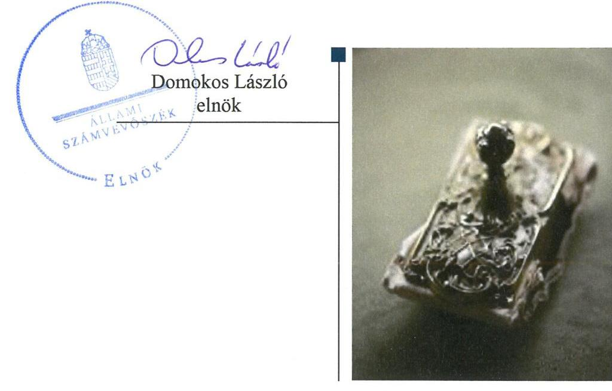
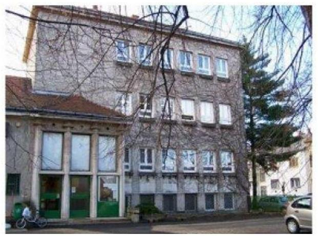
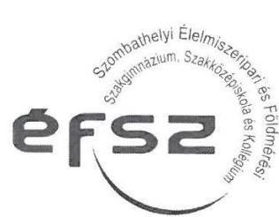
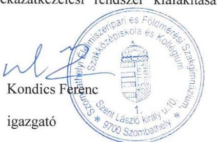
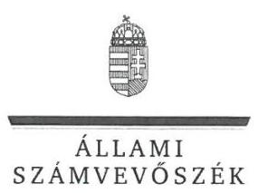
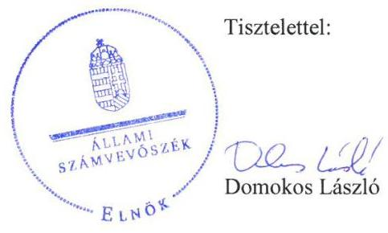
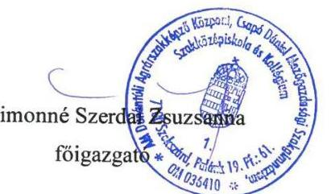
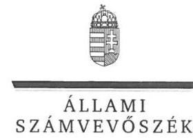
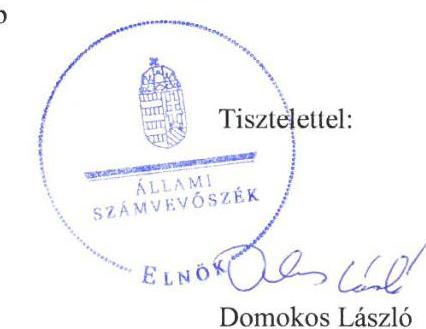

# Jelenetés 

## Központi költségvetési szervek ellenőrzése

Szombathelyi Élelmiszeripari és Földmérési Szakgimnázium, Szakközépiskola és Kollégium
2019.

---

# Jelentés 

## Központi költségvetési szervek ellenőrzése

Szombathelyi Élelmiszeripari és Földmérési Szakgimnázium, Szakközépiskola és Kollégium
2019. 10. hó 30. nap

---

# AZ ELLENŐRZÉST FELÜGYELTE:

## MAKKAI MÁRIA felügyeleti vezető

## AZ ELLENŐRZÉST VEZETTE ÉS A VÉGREHAJTÁSÁÉRT FELELŐS:

### DÉZSINÉ KIS HAJNALKA ellenőrzésvezető

## A PROGRAM ÖSSZEÁLLÍTÁSÁÉRT FELELŐS:

### TÓTHPÁL SZABOLCS osztályvezető

---

**IKTATÓSZÁM:** EL-2088-001/2019

**TÉMASZÁM:** 8

**ELLENŐRZÉS-AZONOSÍTÓ SZÁM:** V079174

---

Jelentéseink az Országgyűlés számítógépes hálózatán és az Interneten a www.asz.hu címen is olvashatóak.

---

# TARTALOMJEGYZÉK 

■ ÖSSZEGZÉS ..... 5
■ AZ ELLENŐRZÉS CÉLJA ..... 6
■ AZ ELLENŐRZÉS TERÜLETE ..... 7
■ AZ ELLENŐRZÉS HÁTTERE, INDOKOLTSÁGA ..... 8
■ A JELENTÉS LÉNYEGES KÉRDÉSKÖREI ..... 9
■ AZ ELLENŐRZÉS HATÓKÖRE ÉS MÓDSZEREI ..... 10
■ MEGÁLLAPÍTÁSOK ..... 12
■ JAVASLATOK ..... 15
■ FÜGGELÉKEK ..... 17
I. sz. függelék a jelentéshez ..... 17
II. sz. függelék: Észrevételek ..... 18
■ RÖVIDÍTÉSEK JEGYZÉKE ..... 25

---

.

---

# ÖSSZEGZÉS 

A Szombathelyi Élelmiszeripari és Földmérési Szakgimnázium, Szakközépiskola és Kollégium belső kontrollrendszere, pénzügyi és vagyongazdálkodása nem volt szabályszerű, nem biztosította a nemzeti vagyonnal való átlátható, elszámoltatható, felelős gazdálkodást. Az Intézmény nem volt védett a korrupcióval szemben.

## Az ellenőrzés társadalmi indokoltsága

Magyarország versenyképességének és a magyar gazdaság fejlődésének alapvető feltétele a magyar munkavállalók megfelelő szakmai képzettsége és felkészültsége, amelyben a szakképzési rendszernek döntő szerepe van. A mezőgazdaság vonatkozásában is kiemelten fontos ez, hiszen a magyar mezőgazdaság piaci versenyképességét és eredményességét nagymértékben befolyásolja az agrárszférában dolgozók képzettsége, felkészültsége. A szakképzés legjelentősebb színterei a szakképző iskolák. Az eredményes és célszerű szakképzés alapja és alapvető feltétele a szakképző intézmények közpénzekkel és a közvagyonnal való törvényes, átlátható és a korrupcióval szembeni védelmet biztosító működése és gazdálkodása. Ezért ezen szervezetekkel szemben is alapvető társadalmi igény, hogy a rájuk bízott közpénzekkel, közvagyonnal szabályosan gazdálkodjanak. Emellett a szakképzésben részt vevő pedagógusok, tanulók és a szülők jogos elvárása, hogy a szakképző iskolák működése átlátható és elszámoltatható legyen. Mindezen igényekkel összhangban, a közpénzügyek átláthatóságának előmozdítása, a közvagyon védelme érdekében került sor az agrárszakképző iskolák belső kontrollrendszerének és gazdálkodásának ellenőrzésére.

## Főbb megállapítások, következtetések, javaslatok

A Szombathelyi Élelmiszeripari és Földmérési Szakgimnázium, Szakközépiskola és Kollégium nem szabályszerű kontrollkörnyezetben működött, mert nem rendelkezett szervezetét, feladatai ellátásának részletes belső rendjét és módját, valamint a felelősségi viszonyokat megállapító szervezeti és működési szabályzattal. A Szombathelyi Élelmiszeripari, Földmérési Szakgimnázium, Szakközépiskola és Kollégium nem működtette szabályszerűen integrált kockázatkezelési és nyomon követési rendszerét. Ezek alapján a belső kontrollrendszer kialakítása és működtetése nem biztosította a közpénzfelhasználás szabályozottságát.

A Szombathelyi Élelmiszeripari és Földmérési Szakgimnázium, Szakközépiskola és Kollégium pénzügyi gazdálkodása nem felelt meg a jogszabályi előírásoknak, a költségvetési források szabályszerű felhasználásának feltételei nem álltak fenn a kötelezettségvállalások nyilvántartásának tartalmi hiányossága miatt.

A Szombathelyi Élelmiszeripari és Földmérési Szakgimnázium, Szakközépiskola és Kollégium költségvetési beszámolóinak mérlegtételei leltárral nem voltak alátámasztottak, így a mérlegben szereplő adatok valódisága nem volt igazolt, nem volt biztosított a vagyon védelme.

A Szombathelyi Élelmiszeripari és Földmérési Szakgimnázium, Szakközépiskola és Kollégium nem gondoskodott az integritást erősítő kötelezően előírt és nem kötelező kontrollok kiépítéséről és működtetéséről.

Az Állami Számvevőszék a jelentésben foglalt megállapítások alapján a Szombathelyi Élelmiszeripari és Földmérési Szakgimnázium, Szakközépiskola és Kollégium Igazgatója részére hat javaslatot fogalmazott meg.

---

# AZ ELLENŐRZÉS CÉLJA 

CÉLJA annak megállapítása volt, hogy a központi költségvetési szervre vonatkozó irányító szervi feladatellátás a jogszabályi előírások betartásával történt-e; a központi költségvetési szerv belső kontrollrendszere biztosította-e az átlátható, szabályszerű, gazdaságos, hatékony és eredményes gazdálkodás feltételeit; kiépítették és erősítették-e a korrupciós kockázatok kezelését szolgáló integritás kontrollokat; megteremtették-e a teljesítményellenőrzés feltételeit. Továbbá annak megállapítása, hogy a szervezet gazdálkodása során elszámoltatható és megfelel-e annak az Alaptörvényben meghatározott alapvetésnek, hogy Magyarország a kiegyensúlyozott, átlátható és fenntartható költségvetési gazdálkodás elvét érvényesíti. Érvényesül-e a nemzeti vagyon kezelésének és védelmének célja, azaz a szervezet vagyona a közérdeket szolgálja, a közös szükségletek kielégítése és a természeti erőforrások megóvása, valamint a jövő nemzedékek szükségleteinek figyelembevétele mellett.

---

# **AZ ELLENŐRZÉS TERÜLETE**

## **Szombathelyi Élelmiszeripari és Földmérési Szakgimnázium, Szakközépiskola és Kollégium**

A Szombathelyi Élelmiszeripari és Földmérési Szakgimnázium, Szakközépiskola és Kollégium köznevelési intézmény, amely jelenlegi nevét 2017. augusztus 1-től kapta.

Az Intézmény1 tevékenysége szakgimnáziumi, szakközépiskolai nevelés-oktatás és kollégiumi ellátás, valamint felnőttoktatás.

Az Intézmény alapítója és irányító szerve a Földművelésügyi Minisztérium, jelenleg Agrárminisztérium. Az Igazgató2 személye 2017. december 15-től változott.

Az Intézmény gazdasági szervezeti feladatait az AM DASZK3 látta el az ellenőrzött időszakban.

Az Intézmény a 2017. évben 539,6 millió Ft költségvetési bevétellel rendelkezett, költségvetési kiadása 506 millió Ft volt, és 317,6 millió Ft vagyonnal gazdálkodott. Az átlagos statisztikai állományi létszám 76 fő volt.

---

# AZ ELLENŐRZÉS HÁTTERE, INDOKOLTSÁGA 

Az ÁSZ ${ }^{4}$ ellenőrzi a költségvetési szervek gazdálkodását, működését, hogy megállapításaival támogassa az ellenőrzött szervezetek szabályszerű gazdálkodását, javaslataival elősegítse az Alaptörvényben ${ }^{5}$ megfogalmazott alapvetések érvényesülését a mindennapi életben a szervezetek szintjén. Az egyes ellenőrzések megállapításaival és egy időszak ellenőrzési eredményeinek elemzésével az ÁSZ ráirányíthatja a jogalkotók figyelmét a központi alrendszerben vagy annak egy ágazatában esetlegesen felmerülő pénzügyi, szabályozási feszültségekre.

Az elvégzett ellenőrzések során az ÁSZ „jó gyakorlatokat" is azonosíthat, melyeket tanácsadó funkciója keretében szélesebb körben is megismertethet az érintettekkel, ezáltal is hozzájárulva a költségvetési rendszer szabályozott, átlátható, kiegyensúlyozott és fenntartható működéséhez.

Az ellenőrzés a szervezet kockázatértékelése alapján, az egyedi és lényeges jellemzők figyelembevételével, az ellenőrzésre kiválasztott modullal történik.

Az integritás- és belső kontroll modul a központi költségvetési szerv működésének irányítottságát, korrupció elleni védettségét értékeli.

A belső kontrollrendszer kialakítása és működtetése nélkül nem valósítható meg a közpénzek, a közvagyon átlátható, szabályos, gazdaságos, hatékony és eredményes felhasználása. A belső kontrollrendszer azt a célt szolgálja, hogy a költségvetési szervek működésük és gazdálkodásuk során a tevékenységeket szabályszerűen hajtsák végre, teljesítsék elszámolási kötelezettségeiket és megvédjék az erőforrásokat a veszteségektől, a károktól és a nem rendeltetésszerű használattól.

Az államháztartás központi alrendszerébe tartozó szervezet vagyona a nemzeti vagyon része, és az Alaptörvény is rögzíti, hogy a vagyonnal való gazdálkodás célja a közérdek szolgálata.

---

# A JELENTÉS LÉNYEGES KÉRDÉSKÖREI 

1. Az irányító szerv ellenőrzött költségvetési szervre vonatkozó feladatellátása szabályszerű volt-e?
2. A belső kontrollrendszer kialakítása és működtetése szabályszerűen történt-e?
3. A költségvetési szerv pénzügyi gazdálkodása szabályszerű volt-e?
4. A költségvetési szerv vagyongazdálkodása szabályszerű volt-e?

---

# AZ ELLENŐRZÉS HATÓKÖRE ÉS MÓDSZEREI 

## Az ellenőrzés típusa

Megfelelőségi ellenőrzés.

## Az ellenőrzött időszak

A belső kontroll rendszer és a vagyongazdálkodás tekintetében a 2016. és a 2017. év.

Az irányító szervi feladatellátás és a pénzügyi gazdálkodás tekintetében a 2016. év.

## Az ellenőrzés tárgya

Az ellenőrzött szervezetre vonatkozó irányító szervi feladatok ellátása. Az intézmény belső kontroll rendszerének kialakítása és működtetése. Az intézmény pénzügyi és vagyongazdálkodása. Az intézménynél az integritáskontrollok kiépítettsége, az integritás szemlélet érvényesülése, a teljesítményellenőrzés feltételei.

## Az ellenőrzött szervezet

A Szombathelyi Élelmiszeripari és Földmérési Szakgimnázium, Szakközépiskola és Kollégium és irányítószerve az Agrárminisztérium, valamint a gazdasági szervezeti feladatokat ellátó AM Dunántúli Agrárszakképző Központ, Csapó Dániel Mezőgazdasági Szakgimnázium, Szakközépiskola és Kollégium.

## Az ellenőrzés jogalapja

Az ellenőrzés jogszabályi alapját az ÁSZ tv. 1. § (3) bekezdés, 5. § (2)-(3) és (6) bekezdései, (4) bekezdés a) pontja, valamint Áht. 61. § (2) bekezdésének előírásai képezik.

## Az ellenőrzés módszerei

Az ÁSZ az ellenőrzést az ellenőrzési program szempontjai, az ellenőrzött időszakban hatályos jogszabályok, az ellenőrzés szakmai szabályai, a jelen ellenőrzésre irányadó ÁSZ módszertanok figyelembevételével hajtja végre.

---

Az ellenőrzési kérdések megválaszolásához szükséges bizonyítékok megszerzése az ellenőrzött által rendelkezésre bocsátott dokumentumokra, adatokra alapozva megfigyelés, szemle (szemrevételezés), mintavételezés, valamint elemző eljárás útján történik. Az ellenőrzési bizonyítékként felhasználható adatforrások közé tartoznak az ellenőrzési program részletes szempontjainál felsorolt adatforrások, valamint minden egyéb az ellenőrzés folyamán feltárt, az ellenőrzés szempontjából információt tartalmazó dokumentum.

Az ellenőrzés lefolytatásához az ellenőrzött szervezet tanúsítványok kitöltésével, valamint az ÁSZ által kért dokumentumok megküldésével szolgáltat adatokat, amelyek valódiságát és teljes körűségét az ellenőrzött szervezet vezetője által tett teljességi és hitelességi nyilatkozat igazolja. A rendelkezésre bocsátott adatok, információk kontrollja az ellenőrzés keretében történt.

A központi költségvetési szerv belső kontrollrendszere egyes pilléreinek kialakítására és működtetésére vonatkozó értékelés:
$\longrightarrow$ „szabályszerű", amennyiben az értékelt területen az elért „igen" válaszok százalékban kifejezett, egész számra kerekített aránya legalább 85 %,
$\longrightarrow$ „nem szabályszerű", ha nem éri el a 85 %-ot.
A kontrollrendszer egésze esetében a „szabályszerű" értékelésnek a százalékos értéken felül további feltétele, hogy egyik kontrollterület sem kaphat „nem szabályszerű" értékelést.

A kiadások és a bevételek ellenőrzésére a 2016-2017 év vonatkozásában került sor. A kiadások (külső személyi juttatások, felhalmozási kiadások, dologi kiadások) és bevételek (értékesítésből és bérbeadásból származó bevételek) esetében az ellenőrzés azokra a legnagyobb értékű tételekre - a lényeges sokaságra - terjedt ki, melyek összértéke eléri a teljes sokaság összértékének 50%-át.

A 2016-2017. évi kiadások és a 2016. évi bevételek esetében a lényeges sokaságot tételesen ellenőriztük.

2017-ben az ellenőrzött szervezet nem rendelkezett értékesítésből származó bevétellel.

A 2017. évi beruházások, felújítások végrehajtásának, valamint a feladatellátást szolgáló állami vagyontárgyak év végi értékelésének szabályszerűsége esetében tételes ellenőrzésre került sor.

A 2017. évi feladatellátást szolgáló állami vagyontárgyak használatának szabályszerűségét a teljes sokaságból véletlen mintavétellel kiválasztott tételek alapján ellenőriztük.

A mintavétellel ellenőrzött területek esetében minden egyes tétel vonatkozásában a felhasználás, elszámolás és értékelés szabályszerűségére vonatkozó kérdéseket tettünk fel. Szabályszerűnek értékeltünk egy ellenőrzött területet, amennyiben 95%-os bizonyossággal az ellenőrzött sokaságban az átlagos hibaarány legfeljebb 10%, nem szabályszerűnek, amennyiben 10%-nál magasabb arányt képviselt.

Az ellenőrzés ideje alatt az ellenőrzött szervezettel történő kapcsolattartást az ÁSZ SZMSZ®-ének vonatkozó előírásai alapján biztosítottuk.

---

# 1. Az irányító szerv ellenőrzött költségvetési szervre vonatkozó feladatellátása szabályszerű volt-e? 

Összegző megállapítás

Az Irányító szerv7 Intézményre vonatkozó feladatellátása a 2016. évben szabályszerű volt.

AZ IRÁNYÍTÓ SZERV ALAPÍTÓI jogosultságainak gyakorlása a 2016. évben a jogszabályi előírásoknak megfelelően történt.

Az Irányító szerv az Áht.8-ban foglalt jogkörében eljárva kiadmányozta az Intézmény alapító okiratának módosítását a szakképzés rendszerét érintő szabályozási környezet változása miatt.

Az alapító okirat tartalma megfelelt az Ávr.9 előírásainak.
AZ EGYÉB IRÁNYÍTÁSI, FELÜGYELETI ÉS ELLENŐRZÉSI JOGOSULTSÁGAIT az Irányító szerv a 2016. évben szabályszerűen gyakorolta.

Az Irányító szerv az Ávr.-nek megfelelően kiadta a kötelező tervezési követelményeket és jóváhagyta az Intézmény elemi költségvetését.

Az Irányító szerv az Áhsz.-ben10 foglaltaknak megfelelően jóváhagyta az Intézmény költségvetési beszámolóját és az Áht.-ben foglalt irányító szervi hatáskörében eljárva beszámoltatta az Intézményt az éves szakmai feladatellátásról.

Az Irányító szerv kijelölte a pénzügyi gazdasági feladatok ellátását végző költségvetési szervet és a feladatok ellátásáról szóló megállapodást jóváhagyta. Az együttműködési megállapodás 2015. szeptember 1-től lépett hatályba.

MUNKÁLTATÓI JOGOSULTSÁGAIT az Irányító szerv a 2016. évben szabályszerűen gyakorolta.

## 2. A belső kontrollrendszer kialakítása és működtetése szabályszerűen történt-e?

Összegző megállapítás

A belső kontroll rendszer kialakítása és működtetése nem volt szabályszerű a 2016-2017. években.

A KONTROLLKÖRNYEZET KIALAKÍTÁSA nem
 volt szabályszerű a 2016-2017. években.

Az Intézmény nem rendelkezett szervezetét, feladatai ellátásának részletes belső rendjét és módját megállapító szervezeti és működési szabályzattal az Áht. 10. § (5) bekezdésében foglaltak ellenére.

---

Az Intézmény nem rendelkezett a közlevéltár egyetértésével kiadott iratkezelési szabályzattal az Ltv 10. § (1) bekezdés a) pontjában előírtak ellenére.

A kockázatkezelési rendszert az Intézmény szabályszerűen kialakította, azonban nem működtette szabályszerűen a 2016-2017. években.

Az Intézmény kialakította 2016. január 1-től 2016. szeptember 30-ig kockázatkezelési rendszerét, 2016. október 1-től integrált kockázatkezelési rendszerét, azonban a Bkr. ${ }^{11} 7$. § (2) bekezdésében előírtak ellenére nem mérte fel a költségvetési szerv tevékenységében rejlő és szervezeti célokkal összefüggő kockázatokat, valamint nem határozta meg az egyes kockázatokkal kapcsolatban szükséges intézkedéseket, valamint azok teljesítésének folyamatos nyomon követésének módját.

A kontrolltevékenységek gyakorlása a 2016. évben nem volt szabályszerű, a 2017. évben szabályszerű volt.

Az Intézménynél írásbeli kijelöléssel nem rendelkező személy végzett teljesítés igazolást a 2016. évben az Ávr. 57. (4) bekezdésben foglaltak ellenére.

# AZ INFORMÁCIÓS ÉS KOMMUNIKÁCIÓS FOLYAMATOKAT az Intézmény szabályszerűen kialakította, azonban nem működtette szabályszerűen a 2016-2017. években. 

Az Intézmény az Info tv. ${ }^{12}$ 37. § (1) bekezdésében előírt közzétételi kötelezettségének nem tett eleget, az Info tv. 1. melléklet III/1 pontja előírása ellenére nem tette közzé az Intézmény 2016-2017. évi éves költségvetését és éves költségvetési beszámolóját.

Nyomonkövetési rendszerét az Intézmény nem működtette szabályszerűen a 2016-2017. években.

Az AM DASZK nem végzett belső ellenőrzést az Intézménynél az együttműködési megállapodás 9. §-ban előírtak ellenére.

Az Intézmény a 2017. évben megbízást adott belső ellenőrzési feladatok ellátásra egy társaságnak, amelyhez a Bkr. 15.§ (4) bekezdésében foglaltak ellenére nem rendelkezett az irányítószerv vezetőjének írásos jóváhagyásával.

Az Intézmény Igazgatója eleget tett a Bkr. 11. § (1) bekezdésében előírt nyilatkozattételi kötelezettségének a belső kontrollrendszer értékelésére vonatkozóan. A nyilatkozat tartalmát az ellenőrzés nem igazolta

## AZ INTEGRITÁS KONTROLLOK KIÉPÍTÉSE ÉS

MŰKÖDTETÉSE nem volt megfelelő a 2016-2017. években.
Az Intézmény nem működtette az integritást erősítő, kötelezően és nem kötelezően előírt kontrollokat.

## A TELJESÍTMÉNY MÉRÉSÉRE ALKALMAS KÖVE-

TELMÉNYEKET az Intézmény nem alakította ki a 2016-2017. években.

---

Az Intézmény nem képzett a szervezeti célok eléréséhez szükséges feladatok és folyamatok mérésére szolgáló indikátorokat, mérőszámokat, feladat és teljesítménymutatókat, így nem biztosította a teljesítménymérés feltételeit.

# 3. A költségvetési szerv pénzügyi gazdálkodása szabályszerű volt-e? 

## Összegző megállapítás

Az Intézmény pénzügyi gazdálkodása a 2016. évben nem volt szabályszerű.

A kötelezettségvállalások nyilvántartása a 2016. évben nem volt szabályszerű.

Az AM DASZK a 2016. évben az Áhsz. 39.§ (3) bekezdésében és az együttműködési megállapodás 4. § (2) bekezdésében foglaltak ellenére nem gondoskodott a kötelezettségvállalások részletező nyilvántartásának jogszabálynak megfelelő tartalmáról, mert a nyilvántartás nem tartalmazta a kötelezettségvállalás keltét, a pénzügyi ellenjegyzés adatait az Áhsz. 14. melléklet II. 4. a) pontja ellenére.

## 4. A költségvetési szerv vagyongazdálkodása szabályszerű volt-e?

## Összegző megállapítás

Az Intézmény vagyongazdálkodása nem volt szabályszerű a 2016-2017. években.

A vagyontárgyak kimutatása nem volt szabályszerű a 2016-2017. években.

Az AM DASZK a Számv.tv. ${ }^{13}$ 69. § (1) bekezdésében, valamint az együttműködési megállapodás 1. § (3) bekezdésében előírtak ellenére a 2016-2017. években nem támasztotta alá az Intézmény beszámolójának mérlegtételeit leltárral.

---

# JAVASLATOK 

Az ÁSZ tv. 33. § (1) bekezdésében foglaltak értelmében az ellenőrzött szervezet vezetője köteles a jelentésben foglalt megállapításokhoz kapcsolódó intézkedési tervet összeállítani és azt a jelentés kézhezvételétől számított 30 napon belül az ÁSZ részére megküldeni. Amennyiben az ellenőrzött szervezet vezetője nem küldi meg határidőben az intézkedési tervet, vagy továbbra sem elfogadható intézkedési tervet küld, az Állami Számvevőszék elnöke az ÁSZ tv. 33. § (3) bekezdése a) és b) pontjaiban foglaltakat érvényesítheti.

## Szombathelyi Élelmiszeripari és Földmérési Szakképző Iskola és Kollégium igazgatójának

1. Intézkedjen a szervezeti és működési szabályzat jogszabályi előírásoknak megfelelő elkészítéséről.
(2. sz. megállapítás 2. bekezdése alapján)
2. Intézkedjen az iratkezelési szabályzat jogszabályi előírásoknak megfelelő kiadásáról.
(2. sz. megállapítás 3. bekezdése alapján)
3. Intézkedjen a Bkr. előírásainak megfelelő integrált kockázatkezelési rendszer működtetéséről.
(2. sz. megállapítás 5. bekezdése alapján)
4. Intézkedjen az együttműködési megállapodásnak megfelelően a belső ellenőrzés működtetéséről.
(2. sz. megállapítás 11. bekezdése alapján)
5. Intézkedjen a kötelezettségvállalások részletező nyilvántartásának jogszabályi előírásoknak megfelelő vezetéséről.
(3. sz. megállapítás 2. bekezdése alapján)
6. Intézkedjen a jogszabályi előírásoknak megfelelően a mérleg tételeit alátámasztó leltár elkészítéséről, amely tételesen, ellenőrizhető módon tartalmazza a mérleg fordulónapján meglévő eszközöket és forrásokat mennyiségben és értékben.
(4. sz. megállapítás 2. bekezdése alapján)

---

.

---

# FÜGGELÉKEK 

- I. SZ. FÜGGELÉK A JELENTÉSHEZ

Az Állami Számvevőszék az ellenőrzések során feltárt tényekhez kapcsolódó további körülmények tisztázására eszközrendszerrel nem rendelkezik. Amennyiben az ellenőrzésen túlmutatóan indokoltnak látszik az ellenőrzés során feltárt körülmények további vizsgálata, az Állami Számvevőszék törvényi felhatalmazás alapján az ellenőrzés által feltárt körülményeket továbbítja a hatáskörrel rendelkező szervnek a szükséges intézkedések megtétele, eljárások lefolytatása érdekében.
1.

A gazdasági feladatokat ellátó AM DASZK az Intézmény a 2016-2017. évi éves költségvetési beszámolójának alátámasztásához nem készített leltárt. Ezzel megsértette a Számv. tv. 69. § (1) bekezdésében foglaltakat.

A leltárral alá nem támasztott mérlegfőösszeg a 2016. évben 256,3 millió Ft, a 2017. évben 317,6 millió Ft volt.

Leltár hiányában nem igazolt, hogy a beszámolóban szereplő tételek a valóságban is megtalálhatók.
2.

Az Intézménynél az Ávr. 57. (4) bekezdésben foglaltak ellenére írásbeli kijelöléssel nem rendelkező személy végzett teljesítés igazolást a 2016. évben.
A kijelöléssel nem rendelkező személy által leigazolt teljesített kifizetés értéke 526 ezer Ft volt 2016-ban.
A szabálytalan teljesítés igazolás miatt nem igazolt, hogy a kiadás az ellenőrzött szervezet feladatellátásának körében keletkezett és a kifizetés valós teljesítéshez kapcsolódott, ezért felvetődik, hogy az ellenőrzött szervezetnél vagyoni hátrány keletkezett.

Az esetek konkrét körülményeinek feltárására a Nemzeti Adó- és Vámhivatal rendelkezik hatáskörrel.

---

A jelentéstervezetet a Számvevőszék 15 napos észrevételezésre megküldte az ellenőrzött szervezetek vezetőinek az ÁSZ tv. 29. § (1) bekezdése előírása szerint.

Az ÁSZ a jelentéstervezetet észrevételezésre megküldte a Szombathelyi Élelmiszeripari és Földmérési Szakgimnázium, Szakközépiskola és Kollégium igazgatójának, az AM Dunántúli Agrárszakképző Központ, Csapó Dániel Mezőgazdasági Szakgimnázium, Szakközépiskola és Kollégium főigazgatójának, valamint az agrárminiszternek.
Az agrárminiszter észrevételezési jogával nem élt, a jelentéstervezetre észrevételt nem tett. A Szombathelyi Élelmiszeripari és Földmérési Szakgimnázium, Szakközépiskola és Kollégium igazgatójának, az AM Dunántúli Agrárszakképző Központ, Csapó Dániel Mezőgazdasági Szakgimnázium, Szakközépiskola és Kollégium főigazgatója észrevételét és az arra adott választ a függelék tartalmazza.

[^0]
[^0]:    * 29. § (1) Az Állami Számvevőszék az ellenőrzési megállapításait megküldi az ellenőrzött szervezet vezetőjének vagy az általa megbízott személynek, és annak, akinek személyes felelősségét állapította meg.
    (2) Az ellenőrzött szervezet vezetője és a felelősként megjelölt személy az ellenőrzés megállapításaira tizenöt napon belül írásban észrevételt tehet.
    (3) Az Állami Számvevőszék az észrevételre a beérkezésétől számított harminc napon belül írásban válaszol. A figyelembe nem vett észrevételeket köteles a jelentésben feltüntetni, és megindokolni, hogy azokat miért nem fogadta el.

---

# Szombathelyi Élelmiszeripari és Földmérési Szakgimnázium, Szakközépiskola és Kollégium 

9700 Szombathely, Szent László király utca 10. * OM. 036756
$\underset{\text { Hozlap: www.efszk.hu; E-mail: efsz@efszk.hu }}{\text { Telefon } 94-513-500 \text { * Fax } 94-513-511}$
Hozlap: www.efszk.hu; E-mail: efsz@efszk.hu

Állami Számvevőszék
Ikt. szám: G-AM-30/2019.
Budapest
Apáczai Csere János utca 10.
1364 Domokos László
elnök

Tárgy: Írásbeli észrevétel

Tisztelt Elnök Úr!

Hivatkozva az EL-1199-044/2019 számú jelentéstervezetre a „Központi költségvetési szervek ellenőrzése Szombathelyi Élelmiszeripari és Földmérési Szakképző Iskola és Kollégium" címmel, az abban foglalt 2. számú megállapítással kapcsolatban a következő észrevételt kívánom tenni:

Megállapításra került, hogy kockázatkezelési rendszert az intézmény nem működtette szabályszerűen 2016-2017. években.

A szervezet 2017.01.01. napjától szabályozta az „Integrált kockázatkezelés eljárásrendjéről szóló szabályzat"-ban a kockázatok azonosításának és elemzésének folyamatát. Ezzel egyidejűleg a IV. fejezet 1.) pontja alapján kijelölésre kerültek a részfolyamatok folyamatgazdái (5 fő) valamint a belső kontroll koordinátor 2017.01.01-én kelt megbízások alapján.

Az intézmény 2017.02.13-án „Szombathelyi Élelmiszeripari és Földmérési Szakképző Iskola és Kollégium Folyamatainak azonosítása" és kockázatkezelése dokumentumban rögzítette a fő és részfolyamatok leírását, kockázatok azonosítását, kockázati leltárt, kockázatok értékelését.

2017.05.02-án a Kockázatkezelési Munkacsoport ülésén (Emlékeztető) a folyamatgazdák beszámolója alapján a szervezeten belüli integrált kockázatkezelési intézkedési terv az 1. sz. melléklet alapján összeállításra került.

Kérjük, a fentiek alapján szíveskedjék mérlegelni a kockázatkezelési rendszer kialakításával összefüggő megállapítását.

Szombathely, 2019. 08. 08.
Tisztelettel:

---

ELNÖK

Ikt.szám: EL-1199-051/2019.

# Kondics Ferenc úr 

igazgató
Szombathelyi Élelmiszeripari és Földmérési
Szakgimnázium, Szakközépiskola és Kollégium

## Szombathely

## Tisztelt Igazgató Úr!

A „Központi költségvetési szervek ellenőrzése - Szombathelyi Élelmiszeripari és Földmérési Szakgimnázium, Szakközépiskola és Kollégium"címmel készített számvevőszéki jelentéstervezetre tett észrevételét köszönettel megkaptam.

Az Állami Számvevőszék észrevételre vonatkozó álláspontjáról a felügyeleti vezető által készített részletes tájékoztatást mellékelten megküldöm.

Tájékoztatom Igazgató urat, hogy a számvevőszéki jelentésben - az Állami Számvevőszékről szóló 2011. évi LXVI. törvény 29. § (3) bekezdése alapján - a figyelembe nem vett észrevételt szerepeltetjük, annak indoklásával, hogy azt az Állami Számvevőszék miért nem fogadta el.

Budapest, 2019. 09 hó 05 nap

Melléklet: Tájékoztatás az észrevétel kezeléséről

---

# Tájékoztatás   az észrevétel kezeléséről 

A „Központi költségvetési szervek ellenőrzése - Szombathelyi Élelmiszeripari és Földmérési Szakgimnázium, Szakközépiskola és Kollégium" címú jelentéstervezetre 2019. augusztus 10-én érkezett észrevételét áttekintettük, annak kezelésével kapcsolatban a következő tájékoztatást adom.

## A jelentéstervezet 2. számú megállapításával kapcsolatban tett észrevételre adott válasz

Az észrevételben tájékoztatást adnak arról, hogy 2017. 01. 01-től az „Integrált kockázatkezelés eljárásrendjéről szóló szabályzat"-ban a kockázatok azonosításának és elemzésének folyamatát szabályozták, 2017. 02. 13-án rögzítették a fő és részfolyamatok leírását, kockázatok azonosítását, kockázati leltárt, kockázatok értékelését, 2017. 05. 02-án összeállításra került a kockázatkezelési intézkedési terv. Mindezek alapján kérik, hogy az Állami Számvevőszék mérlegelje a kockázatkezelési rendszer kialakításával összefüggő megállapítást.
Az adatbekérés során az Állami Számvevőszék rendelkezésére bocsátott hiteles (dátumot, aláírást, bélyegző lenyomatot tartalmazó) dokumentumok alapján a Szombathelyi Élelmiszeripari és Földmérési Szakgimnázium, Szakközépiskola és Kollégium (továbbiakban: Intézmény) a 2016. évben kockázatkezelési rendszert nem működtetett. Ezt a megállapítást az észrevétel sem vitatja. Az Intézmény a 2017. évben nem mérte fel és nem állapította meg a tevékenységében rejlő és a szervezeti célokkal összefüggő valamennyi kockázatot, mivel a kockázatkezelés a nevelési, oktatási, szakképzési tevékenységre, valamint a korrupciós kockázatok kezelésére nem terjedt ki. Mindezek alapján a jelentéstervezet megállapítása helytálló, annak módosítása nem indokolt.

Budapest, 2019. 05 hó 05 nap

Makkai Mária
felügyeleti vezető

---

ÁLLAMI SZÁMVEVŐSZÉK
Budapest
Apáczai Csere János utca 10
1364
Domokos László elnök

Tárgy: Észrevétel tétel
Melléklet:

# Tisztelt Elnök Úr! 

Hivatkozva az EL-1199-046/2019 számú jelentéstervezetre a „Központi költségvetési szervek ellenőrzése Szombathelyi Élelmiszeripari és Földmérési Szakképző Iskola és Kollégium" címmel, az abban foglalt 4. számú megállapítással kapcsolatban a következő észrevételt kívánom tenni:

Költségvetési szerv vagyongazdálkodásának szabályszerűségi ellenőrzése kapcsán megállapításra került, hogy az Intézmény vagyongazdálkodása 2016-2017. években nem volt szabályszerű a beszámoló mérlegtételeinek alátámasztásának hiánya miatt.

Az Intézmény a leltározási szabályzata alapján 2016. évben G-FM-49/2016. iktató számú Leltározási utasítás alapján 2016.12.31. fordulónappal a vagyontárgyak mennyiségi leltárfelvételét a vagyonkezelésben átadó tulajdonos 9/2016. (IX.6.)
 számú SZMJV Jegyzői utasítással összhangban elvégezte. A leltározás kiértékelését követően az állományváltozások főkönyvi egyeztetése megtörtént, mely dokumentálásra került a 2017.01.27-én kelt leltári jegyzőkönyvben.
2017. évi belső ellenőrzés tárgya volt a 2016. évi beszámoló vizsgálata, mely kitért a mérleg alátámasztások pénzügyi ellenőrzésére is, és megállapításra került, hogy a mérleg minden tétele mérlegleltárral lett alátámasztva.

A 2018. évi beszámoló ellenőrzési vizsgálatkor is megállapításra került, hogy az intézmény a mérleg minden tételének alátámasztásához mérlegleltárral rendelkezett.

Kérjük, a fentiek alapján szíveskedjék mérlegelni a vagyongazdálkodásra vonatkozó összegző megállapítását és azt szíveskedjék módosítani.

Tisztelettel:

---

ELNÖK

Ikt.szám: EL-1199-050/2019.

# Simonné Szerdai Zsuzsanna úrhölgy 

főigazgató
AM Dunántúli Agrárszakképző Központ, Csapó Dániel Mezőgazdasági Szakgimnázium, Szakközépiskola és Kollégium

## Szekszárd

## Tisztelt Főigazgató Úrhölgy!

A „Központi költségvetési szervek ellenőrzése - Szombathelyi Élelmiszeripari és Földmérési Szakgimnázium, Szakközépiskola és Kollégium"címmel készített számvevőszéki jelentéstervezetre tett észrevételét köszönettel megkaptam.

Az Állami Számvevőszék észrevételre vonatkozó álláspontjáról a felügyeleti vezető által készített részletes tájékoztatást mellékelten megküldöm.

Tájékoztatom Főigazgató úrhölgyet, hogy a számvevőszéki jelentésben - az Állami Számvevőszékről szóló 2011. évi LXVI. törvény 29. § (3) bekezdése alapján - a figyelembe nem vett észrevételt szerepeltetjük, annak indoklásával, hogy azt az Állami Számvevőszék miért nem fogadta el.

Budapest, 2019. 09. hó 05. nap

Melléklet: Tájékoztatás az észrevétel kezeléséről

---

# Tájékoztatás   az észrevétel kezeléséről 

A „Központi költségvetési szervek ellenőrzése - Szombathelyi Élelmiszeripari és Földmérési Szakgimnázium, Szakközépiskola és Kollégium" címú jelentéstervezetre 2019. augusztus 7-én érkezett észrevételét áttekintettük, annak kezelésével kapcsolatban a következő tájékoztatást adom.

## A jelentéstervezet 4. számú megállapításával kapcsolatban tett észrevételre adott válasz

Az észrevételben az AM Dunántúli Agrárszakképző Központ, Csapó Dániel Mezőgazdasági Szakgimnázium, Szakközépiskola és Kollégium főigazgatója tájékoztatást ad arról, hogy a 2016. évben 2016.12.31. fordulónappal a vagyontárgyak mennyiségi leltárfelvételét a vagyonkezelésbe átadó tulajdonos elvégezte, a leltározás kiértékelését követően az állományváltozások főkönyvi egyeztetése megtörtént. A 2017. évben a belső ellenőrzés megállapította, hogy a 2016. évi mérleg minden tétele mérlegleltárral lett alátámasztva. A 2018. évi beszámoló ellenőrzése során az került megállapításra, hogy az intézmény mérlegleltárral rendelkezett. Mindezek alapján kérik a megállapítás módosítását.
A számvitelről szóló 2000. évi C. törvény 69. § (1) bekezdése szerint a könyvek üzleti év végi zárásához, a beszámoló készítéséhez, a mérleg tételeinek alátámasztásához olyan leltárt kell összeállítani, amely tételesen, ellenőrizhető módon tartalmazza a mérleg fordulónapján meglévő eszközöket és forrásokat mennyiségben és értékben. A dokumentumok ismételt áttekintését követően megállapítottuk, hogy a Szombathelyi Élelmiszeripari és Földmérési Szakképző Iskola és Kollégiumnál (továbbiakban: Intézmény) az ellenőrzött időszakban a vagyonkezelt eszközök leltározása megtörtént, erről tájékoztatást adnak az észrevételben is. Az Intézmény 2016. évi beszámolójának mérlegsorai közül a készletek, a pénzeszközök, a követelések, az egyéb sajátos elszámolások, az aktív időbeli elhatárolások, valamint a források mérlegsorai, a 2017. évi beszámoló mérlegsorai közül a pénzeszközök, a követelések, az egyéb sajátos elszámolások, az aktív időbeli elhatárolások, valamint a források mérlegsorai nem voltak leltárral alátámasztva. Mindezek alapján a jelentéstervezet megállapítása helytálló, annak módosítása nem indokolt.

Budapest, 2019. 09. hó 09. nap

Makkai Mária
felügyeleti vezető

---

# RÖVIDÍTÉSEK JEGYZÉKE 

${ }^{1}$ Intézmény
${ }^{2}$ Igazgató
${ }^{3}$ AM DASZK
${ }^{4}$ ÁSZ
${ }^{5}$ Alaptörvény
${ }^{6}$ ÁSZ SZMSZ
${ }^{7}$ Irányító szerv
${ }^{8}$ Áht.
${ }^{9}$ Ávr.
${ }^{10}$ Áhsz.
${ }^{11}$ Bkr.
${ }^{12}$ Info tv.
${ }^{13}$ Számv. tv.

Szombathelyi Élelmiszeripari és Földmérési Szakgimnázium, Szakközépiskola és Kollégium
Szombathelyi Élelmiszeripari és Földmérési Szakgimnázium, Szakközépiskola és Kollégium igazgatója
AM Dunántúli Agrárszakképző Központ, Csapó Dániel Mezőgazdasági Szakgimnázium, Szakközépiskola és Kollégium
Állami Számvevőszék
Magyarország Alaptörvénye (2011. április 25.)
Az Állami Számvevőszék elnökének 2/2018. (XII.28.) utasítása az Állami Számvevőszék Szervezeti és Működési Szabályzatáról
Földművelésügyi Minisztérium, jelenleg Agrárminisztérium
az államháztartásról szóló 2011. évi CXCV. törvény
az államháztartási törvény végrehajtásáról szóló 368/2011 (XII.31.) Korm. rendelet
az államháztartás számviteléről szóló 4/2013. (I. 11.) Korm. rendelet
a költségvetési szervek belső kontrollrendszeréről és belső ellenőrzéséről szóló 370/2011. (XII.31.) Korm. rendelet
az információs önrendelkezési jogról és az információszabadságról szóló 2011. évi CXII. törvény
a számvitelről szóló 2000. évi C. törvény

---

# ÁLLAMI SZÁMVEVŐSZÉK 

1052 Budapest, Apáczai Csere János utca 10.
Levélcím: 1364 Budapest 4. Pf. 54
Telefon: +36 14849100 Telefax: +36 14849200
www.asz.hu
