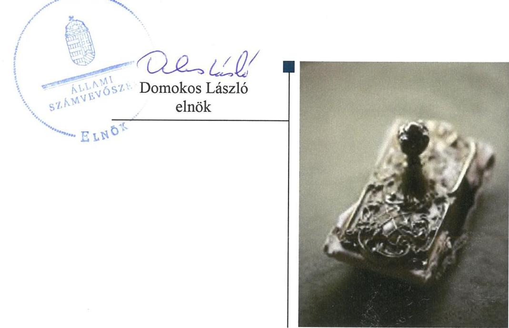

# Jelentés 

## Nemzeti tulajdonú gazdasági társaságok ellenőrzése

Balmazújvárosi VESZ Városi
Egészségügyi Szolgálat Nonprofit
Korlátolt Felelősségű Társaság
2019.

---

# Jelentés 

## Nemzeti tulajdonú gazdasági társaságok ellenőrzése

Balmazújvárosi VESZ Városi
Egészségügyi Szolgálat Nonprofit
Korlátolt Felelősségű Társaság
2019. 11. hó 26. nap

---

# AZ ELLENŐRZÉST FELÜGYELTE:

## MAKKAI MÁRIA felügyeleti vezető

## AZ ELLENŐRZÉST VEZETTE ÉS A VÉGREHAJTÁSÁÉRT FELELŐS:

### SIPOSNÉ DÓCZI KLÁRA ellenőrzésvezető

## A PROGRAM ÖSSZEÁLLÍTÁSÁÉRT FELELŐS:

### TÓTPÁL SZABOLCS osztályvezető

---

**IKTATÓSZÁM:** EL-2124-001/2019

**TÉMASZÁM:** 2478

**ELLENŐRZÉS-AZONOSÍTÓ SZÁM:** V082238 ÉS V082258

---

Jelentéseink az Országgyűlés számítógépes hálózatán és az Interneta a www.asz.hu címen is olvashatóak.

---

# TARTALOMJEGYZÉK 

■ ÖSSZEGZÉS ..... 5
■ AZ ELLENŐRZÉS CÉLJA ..... 6
■ AZ ELLENŐRZÉS TERÜLETE ..... 7
■ AZ ELLENŐRZÉS HÁTTERE, INDOKOLTSÁGA ..... 8
■ A JELENTÉS LÉNYEGES KÉRDÉSKÖREI ..... 9
■ AZ ELLENŐRZÉS HATÓKÖRE ÉS MÓDSZEREI ..... 10
■ MEGÁLLAPÍTÁSOK ..... 12
■ JAVASLATOK ..... 14
■ MELLÉKLETEK ..... 15
I. sz. melléklet: Értelmező szótár ..... 15
■ FÜGGELÉK: ÉSZREVÉTELEK ..... 17
■ RÖVIDÍTÉSEK JEGYZÉKE ..... 19

---

.

---

# ÖSSZEGZÉS 

A Balmazújvárosi VESZ Városi Egészségügyi Szolgálat Nonprofit Korlátolt Felelősségű Társaság vagyongazdálkodásának kialakítása biztositotta a szabályszerü, átlátható és elszámoltatható gazdálkodás feltételeit, az ellenőrzés a vagyongazdálkodás területén lényeges kockázatot nem azonositott.

## Az ellenőrzés társadalmi indokoltsága

Az Állami Számvevőszék kiemelt célja, hogy ellenőrzéseivel hozzájáruljon ahhoz, hogy a közpénzeket, illetve az ingyenesen juttatott közvagyont az államháztartáson kívül múködő szervezetek is átlátható, rendezett módon használják fel.

Az állam és a helyi önkormányzatok tulajdona nemzeti vagyon, melynek megőrzése érdekében kiemelten fontos a nemzeti tulajdonú gazdasági társaságok ellenőrzése. Ellenőrzésüket további társadalmi elvárás is indokolja. Részben a gazdálkodásuk körébe tartozó vagyon nagysága, részben az általuk ellátott közszolgáltatások, sajátos feladatellátások, mivel tevékenységükön keresztül a lakosság széles köre kerül kapcsolatba a társaságokkal.

Az Állami Számvevőszék céljaival és a társadalmi igénnyel összhangban, a gazdasági társaságok kiemelt fontosságú szerepe miatt került sor a Balmazújvárosi VESZ Városi Egészségügyi Szolgálat Nonprofit Korlátolt Felelősségű Társaság vagyongazdálkodásának, a kormányzati szektor hiányára kiható elszámolásainak, illetve Balmazújváros Város Önkormányzata tulajdonosi joggyakorlásának ellenőrzésére.

## Föbb megállapítások, következtetések, javaslatok

Balmazújváros Város Önkormányzata a tulajdonosi jogait nem szabályszerűen gyakorolta, mert nem alkotta meg a vezető tisztségviselők, a felügyelő bizottsági tagok és a vezető munkakörben dolgozó munkavállalók javadalmazására vonatkozó szabályzatot.

A Balmazújvárosi VESZ Városi Egészségügyi Szolgálat Nonprofit Korlátolt Felelősségű Társaság a számviteli beszámolók mérlegtételeit a törvényi előírásoknak megfelelő leltárakkal támasztotta alá, ezáltal érvényesült beszámolóiban a valódiság elve.

Az Állami Számvevőszék a jelentésbe foglalt megállapítások alapján Balmazújváros Város Önkormányzata polgármesterének kettő javaslatot, a Balmazújvárosi VESZ Városi Egészségügyi Szolgálat Nonprofit Korlátolt Felelősségű Társaság ügyvezetőjének egy javaslatot fogalmazott meg.

---

# AZ ELLENŐRZÉS CÉLJA 

AZ ELLENŐRZÉS CÉLJA annak megállapítása volt, hogy a tulajdonosi joggyakorló a gazdasági társaságai feletti tulajdonosi joggyakorlás kereteit kialakította-e, tulajdonosi jogait megfelelően gyakorolta-e és kötelezettségeit teljesítette-e. Az ellenőrzés célja volt továbbá annak megállapítása, hogy a gazdasági társaság biztosította-e a vagyon védelmét a nyilvántartások szabályszerű vezetése és a mérleg tételeinek leltárral történő alátámasztása útján, valamint szabályszerűen gondoskodott-e a társaság használatában, kezelésében lévő nemzeti vagyon értékének megőrzéséről, gyarapításáról, hasznosításáról, továbbá gazdálkodásának a kormányzati szektor hiányára és az államadósságra befolyással bíró elemei a jogszabályi előírásoknak megfeleltek-e és az adatszolgáltatási kötelezettségének eleget tett-e.

---

# **A2 ELLENŐRZÉS TERÜLETE**

## **Balmazújvárosi VESZ Városi Egészségügyi Szolgálat Nonprofit Korlátolt Felelősségű Társaság és a tulajdonosi jogokat gyakorló Balmazújváros Város Önkormányzata**

Balmazújváros Város Önkormányzat Képviselő testülete a Balmazújvárosi Egészségügyi Szolgálat Közhasznú Társaság jogutódjaként hozta létre a Társaságot2 2007. évben. A közfeladatot ellátó, 100%-ban önkormányzati tulajdonú Társaság jegyzett tőkéje 3 M Ft volt. A Társaság fő tevékenysége Balmazújváros orvosi alapellátásának és a térség mintegy 33 000 fő lakosa számára szakorvosi járóbeteg-ellátás biztosítása volt. Az Önkormányzat az egészségügyi tevékenység ellátásához Üzemeltetési szerződéssel2 ingatlan és egyéb vagyontárgyakat bocsátott a Társaság rendelkezésére. Az Önkormányzat vagyonkezelésbe nem adott vagyont a Társaság részére. A Társaság a 2013/60. Hivatalos Értesítőben közzétett 2013.12.16-tól hatályos, a 2015/66. Hivatalos Értesítőben közzétett 2015.12.30-től hatályos és a 2017/28. Hivatalos Értesítőben közzétett 2017.06.15-től hatályos NGM közlemények szerint kormányzati szektorba sorolt egyéb szervezet volt. A Társaság az ellenőrzött időszakban más gazdasági társaságban tulajdonrésszel nem rendelkezett.

A Társaság egyes pénzügyi adatait az 1. táblázat szemlélteti.

A Társaság munkavállalóinak létszáma 2015-ben és 2016-ban 12 fő, 2017-ben 11 fő volt.

Az ellenőrzött időszakban a Társaság irányítási feladatait ügyvezető, ellenőrzését három tagú felügyelőbizottság látta el. A Társaság számviteli beszámolóit választott könyvvizsgáló auditálta.

A polgármester személyében az ellenőrzött időszakban 2018-ban, a jegyző személyében 2019-ben volt változás.

1. táblázat

|  A TÁRSASÁG EGYES PÉNZÜGYI ADATAI (M FT) |  |  |   |
| --- | --- | --- | --- |
|   | 2015. | 2016. | 2017.  |
|  értékesítés nettó |  |  |   |
|  árbevétele | 278 | 319 | 360  |
|  adózott eredmény | 2 | 2 | 10  |
|  összes eszköz | 82 | 78 | 92  |
|  saját tőke | -7 | 5 | 15  |

*Fonrás: A Társaság 2015-2017 évi számviteli beszámolói*

---

# AZ ELLENŐRZÉS HÁTTERE, INDOKOLTSÁGA 

Az Alaptörvény 38. cikke alapján az állam és a helyi önkormányzatok tulajdona nemzeti vagyon. A nemzeti vagyon megőrzése, megóvása érdekében kiemelten fontos ezen nemzeti tulajdonú gazdasági társaságok ellenőrzése. Gazdálkodásuk jellemzően a közérdeklődés és a média figyelmének középpontjában áll, amihez hozzájárul a gazdálkodásuk körébe tartozó - a nemzeti vagyon részét képező - vagyon nagysága, illetve az általuk ellátott közszolgáltatások minősége és hatékonysága.

Ellenőrzéseink feltárhatják, hogy a tulajdonosi felügyelet hozzájárult-e a szabályszerű gazdálkodáshoz és feladatellátáshoz.

Az ellenőrzés eredményeként meghatározhatóvá válnak a szervezet vagyongazdálkodást érintő kockázatai, ezzel lehetővé téve a kockázatok csökkentését.

A megállapítások alapján megfogalmazott számvevőszéki javaslatok hasznosítása elősegítheti a meglévő hibák megszüntetését. A jó gyakorlatok bemutatásával az ÁSZ hozzájárulhat a követendő megoldások megismertetéséhez, terjesztéséhez.

---

# A JELENTÉS LÉNYEGES KÉRDÉSKÖREI 

1. A tulajdonosi jogok gyakorlása szabályszerű volt-e?
2. A gazdasági társaság vagyongazdálkodási tevékenysége szabályszerű volt-e?
3. A gazdasági társaságnak az államadósságra befolyással bíró elemei megfeleltek-e a jogszabályi előírásoknak, adatszolgáltatási kötelezettségének eleget tett-e?

---

# AZ ELLENŐRZÉS HATÓKÖRE ÉS MÓDSZEREI 

## Az ellenőrzés típusa

Megfelelőségi ellenőrzés.

## Az ellenőrzött időszak

A tulajdonosi joggyakorlás tekintetében az ellenőrzött időszak 2017. január 1-től az ellenőrzés megkezdésének napjáig, 2018. augusztus 14-ig terjedt az éves beszámoló jóváhagyása kivételével, amelynél az ellenőrzött időszak 2015. január 1-től az ellenőrzés megkezdésének napjáig tartott.

A gazdasági társaság vagyongazdálkodása vonatkozásában az ellenőrzött időszak 2015-2017, a 2017. évi beszámoló jóváhagyása tekintetében a 2018. június elsejéig tartó időszak.

Az ellenőrzött időszak a kormányzati szektorba tartozó gazdálkodás és adatszolgáltatás tekintetében a 2015-2017 évek, a 2017. évi beszámoló jóváhagyása és közzététele tekintetében 2018. június elsejéig tartó, a 2017. évre vonatkozó adatszolgáltatás teljesítése tekintetében 2018. június 29ig tartó időszak.

## Az ellenőrzés tárgya

Az önkormányzat tulajdonosi joggyakorlása, a 100\%-os tulajdonában lévő gazdasági társaság feletti tulajdonosi joggyakorlás kialakítása és múködtetése. A Társaság vagyongazdálkodása keretében a társaság által üzemeltetett nemzeti vagyon, illetve a saját vagyon tekintetében a vagyonnyilvántartások vezetése, leltára. Valamint a társaság gazdálkodásának az államadósságra befolyással bíró elemei és a jogszabályi előírásoknak megfelelő adatszolgáltatási kötelezettségének teljesítése.

## Az ellenőrzött szervezet

- Balmazújvárosi VESZ Városi Egészségügyi Szolgálat Nonprofit Korlátolt Felelősségű Társaság
- Balmazújváros Város Önkormányzata

## Az ellenőrzés jogalapja

Az ellenőrzés jogalapját az ÁSZ tv³ . 1. § (3) bekezdése, 5. § (4) bekezdése képezi.

---

# Az ellenőrzés módszerei 

Az ellenőrzést az ellenőrzési program ellenőrzési kérdései, az ellenőrzött időszakban hatályos jogszabályok, az ellenőrzés szakmai szabályok és módszertanok alapján, a nemzetközi standardok figyelembe vételével végeztük.

Az ellenőrzés ideje alatt az ellenőrzött szervezettel történő kapcsolattartást az ÁSZ ${ }^{4}$ Szervezeti és Múködési Szabályzatának vonatkozó előírásai alapján biztosítottuk.

Az ellenőrzési kérdések megválaszolásához szükséges bizonyítékok megszerzése a következő ellenőrzési eljárások alkalmazásával történt: megfigyelés, információkérés, összehasonlítás, elemző eljárás. Az ellenőrzési bizonyítékként felhasználható adatforrások közé tartoztak az ellenőrzési programban felsorolt adatforrások, továbbá minden - az ellenőrzés folyamán - feltárt, az ellenőrzés szempontjából információkat tartalmazó dokumentum.

Az ellenőrzést a kérdésekre adott válaszok kiértékelésével, valamint a megjelölt adatforrások, a tanúsítványok felhasználásával, továbbá az adott időszakban hatályos jogszabályok figyelembe vételével folytattuk le.

A 2017. január 1-től az ellenőrzés megkezdésének napjáig ellenőriztük a tulajdonosi joggyakorlás kereteinek kialakítását, a tulajdonosi joggyakorló tevékenységét a felügyelőbizottság és a független könyvvizsgáló múködéséhez kapcsolódóan.

A 2015. január 1-től az ellenőrzés megkezdésének napjáig ellenőriztük a tulajdonosi joggyakorló részvételét az éves beszámoló elfogadására vonatkozó döntéshozatalban.

A gazdasági társaság vagyonhoz kapcsolódó nyilvántartásai vezetésének megfelelősége, valamint a nemzeti vagyon értéke megőrzésének, gyarapításának, hasznosításának szabályszerűsége 2015. és 2017. évek tekintetében került ellenőrzésre. A teljes ellenőrzött időszakot érintően, 20152017 éveket érintően történt meg a lényeges dokumentumok, kiemelten a mérleg tételeinek leltárral való alátámasztottságának értékelése.

A vagyonnyilvántartások és a leltár szabályszerűségét mintavétellel ellenőriztük. Az ellenőrzés azokra a legnagyobb értékű tételekre - a lényeges sokaságra - terjedt ki, melyek összértéke elérte a teljes sokaság összértékének 50\%-át. A 2015. és a 2017. évben a lényeges sokaságot tételesen ellenőriztük.

A kormányzati szektorba sorolt gazdasági társaság adatszolgáltatási kötelezettségére vonatkozó jogszabályi előírások betartását az e területre vonatkozó teljes ellenőrzött időszakra értékeltük.

---

# 1. A tulajdonosi jogok gyakorlása szabályszerű volt-e? 

## Összegző megállapítás

A tulajdonosi jogok gyakorlása nem volt szabályszerű.

A tulajdonosi joggyakorlás kereteit az Önkormányzat Képviselő-testülete, mint a Társaság alapítója az Mötv ${ }^{5}$, a Ptk. ${ }^{6}$ és az Ectv. ${ }^{7}$ vonatkozó előírásai szerint az Alapító okiratban alakította ki. Az Alapító ${ }^{8}$ a Ptk. és a Taktv. ${ }^{9}$ előírásainak megfelelően jelölte ki a felügyelőbizottság tagjait. Az Alapító okirat előírása, mely szerint az Alapító a könyvvizsgálót határozatlan időre választotta meg, nem felelt meg a Ptk 3:130. § (2) bekezdésében meghatározott legfeljebb öt éves időszaknak.

Az Alapító a Taktv. 5. § (3) bekezdésben foglalt előírással ellentétben nem alkotott szabályzatot a vezető tisztségviselők, a felügyelőbizottsági tagok, valamint az Mt. ${ }^{10}$ 208. § hatálya alá tartozó munkavállalók javadalmazásának, valamint jogviszonyuk megszűnése esetére biztosított juttatások módjának, mértékének elveiről, annak rendszeréről.

Az Alapító az ellenőrzött időszakban a Ptk., a Számv. tv., és az Ectv. előírásai szerint határozatban döntött a Társaság számviteli törvény szerinti beszámolójának, valamint a közhasznúsági melléklet ${ }^{11}$-nek a jóváhagyásáról.

## 2. A gazdasági társaság vagyongazdálkodási tevékenysége szabályszerű volt-e?

## Összegző megállapítás

A Társaság a szabályszerű vagyongazdálkodás alapvető feltételeit kialakította, az ellenőrzés a vagyongazdálkodás területén lényeges kockázatot nem azonosított.

A Társaság a vagyonához kapcsolódó nyilvántartásait a Számv. tv. és a Számlarend ${ }_{1,2}{ }^{12}$ valamint az Értékelési szabályzat ${ }^{13}$ vonatkozó előírásainak megfelelően vezette.

A Társaság rendelkezett a Számv. tv. előírásainak megfelelő Leltározási szabályzat ${ }_{1-3}{ }^{14}$-tal.

A Társaság a Számv. tv. előírásai szerint az ellenőrzött időszak minden évében a Leltározási szabályzata szerinti leltárakkal támasztotta alá az egyszerűsített éves beszámolójának mérlegtételeit, és biztosította az üzleti év mérleg-fordulónapjára vonatkozóan a főkönyvi könyvelés és az analitikus nyilvántartások adatai közötti egyeztetést. A 2015-2017. évi számviteli beszámolókat alátámasztó leltárak a Számv. tv. szabályozása szerint tételesen és ellenőrizhető módon tartalmazták a Társaságnak a mérleg fordulónapján fennálló eszközeit és forrásait mennyiségben és értékben.

---

# 3. A gazdasági társaságnak az államadósságra befolyással bíró elemei megfeleltek-e a jogszabályi előírásoknak, adatszolgáltatási kötelezettségének eleget tett-e? 

## Összegző megállapítás

A Társaság a jogszabályokban előírt adatszolgáltatási kötelezettségének nem tett eleget.

A Társaságnak nem volt az államadósságra befolyással bíró kötelezettségvállalása. A Társaság az Áht. ${ }^{15}$ 107. § (1) bekezdésében és az Ávr. ${ }^{16}$ 5. melléklete 23. sorában előírt adatszolgáltatási kötelezettségének az ellenőrzött időszakban nem tett eleget, mert az államháztartásért felelős miniszternek nem küldte meg a számviteli törvény szerinti beszámolóit, az arról készített könyvvizsgálói jelentést, kiemelt mutatóit, költségvetési kapcsolatainak bemutatását.

---

# JAVASLATOK 

Az ÁSZ tv. 33. § (1) bekezdésében foglaltak értelmében az ellenőrzött szervezet vezetője köteles a jelentésben foglalt megállapításokhoz kapcsolódó intézkedési tervet összeállítani és azt a jelentés kézhezvételétől számított 30 napon belül az ÁSZ részére megküldeni. Amennyiben az ellenőrzött szervezet vezetője nem küldi meg határidőben az intézkedési tervet, vagy továbbra sem elfogadható intézkedési tervet küld, az Állami Számvevőszék elnöke az ÁSZ tv. 33. § (3) bekezdése a) és b) pontjaiban foglaltakat érvényesítheti.

## Balmazújváros Város polgármesterének

1. Kezdeményezze a Társaság könyvvizsgálója jogszabályi előírásoknak megfelelő megválasztását.
(1. sz. megállapítás 1. bekezdés harmadik mondata alapján)
2. Kezdeményezze a vezető tisztségviselők, felügyelőbizottsági tagok, valamint az Mt. 208. §-ának hatálya alá eső munkavállalók javadalmazása, valamint a jogviszony megszünése esetére biztosított juttatások módjának, mértékének elveire, annak rendszerére vonatkozó szabályzat megalkotását.
(1. sz. megállapítás 2. bekezdése alapján)

## a Balmazújvárosi VESZ Városi Egészségügyi Szolgálat Nonprofit Korlátolt Felelősségű Társaság ügyvezetőjének

1. Intézkedjen az Áht.-ben elöirt adatszolgáltatási kötelezettség teljesitéséről.
(3. sz. megállapítás 1. bekezdés második mondata alapján)

---

# MELLÉKLETEK 

- I. SZ. MELLÉKLET: ÉRTELMEZŐ SZÓTÁR
gazdasági társaság
nonprofit gazdasági társaság
közfeladat
nemzeti vagyon
tulajdonosi jogok gyakorlója
nemzeti vagyon hasznosítása
nemzeti vagyon hasznosítása

A gazdasági társaságok üzletszerű közös gazdasági tevékenység folytatására, a tagok vagyoni hozzájárulásával létrehozott, jogi személyiséggel rendelkező vállalkozások, amelyekben a tagok a nyereségből közösen részesednek, és a veszteséget közösen viselik. Forrás: Ptk. 3:88. § (1) bekezdése
Ctv. ${ }^{17}$ 9/F. § (2) bekezdése szerint „az a gazdasági társaság minősül nonprofit gazdasági társaságnak és cégnevében az a gazdasági társaság tüntetheti fel a nonprofit jelleget, amelynek létesítő okirata tartalmazza, hogy a gazdasági társaság tevékenységéből származó nyereség a tagok között nem osztható fel, hanem az a gazdasági társaság vagyonát gyarapítja." (hatályos 2014. március 15 -től)
Az Áht. 3/A. § (1) bekezdése alapján közfeladat a jogszabályban meghatározott állami vagy önkormányzati feladat.
Nvtv. ${ }^{18}$ 1. § (2) bekezdése szerint nemzeti vagyonba tartozik többek között: „az állam vagy a helyi önkormányzat kizárólagos tulajdonában álló dolgok, az a) pont hatálya alá nem tartozó, állam vagy a helyi önkormányzat tulajdonában lévő dolog,
az állam vagy a helyi önkormányzat tulajdonában lévő pénzügyi eszközök, továbbá az államot vagy a helyi önkormányzatot megillető társasági részesedések,
az államot vagy a helyi önkormányzatot megillető bármely vagyoni értékkel rendelkező jogosultság, amelyet jogszabály vagyoni értékű jogként nevesít. Aki a nemzeti vagyon felett az államot vagy a helyi önkormányzatot megillető tulajdonosi jogok és kötelezettségek összességének gyakorlására jogosult. Forrás: Nvtv. 3. § (1) 17. pontja
A tulajdonosi joggyakorló vagy a nemzeti vagyon használója által a nemzeti vagyon birtoklásának, használatának, hasznok szedése jogának bármely - a tulajdonjog átruházását nem eredményező - jogcímen történő átengedése, ide nem értve a vagyonkezelésbe adást, valamint a haszonélvezeti jog alapítását. Forrás: Nvtv. 3. § (1) bekezdés 4. pont
Azon természetes személy, jogi személy vagy jogi személyiséggel nem rendelkező szervezet, aki vagy amely állami vagyon tekintetében törvény vagy szerződés alapján, a helyi önkormányzat vagyona tekintetében törvény, a helyi önkormányzat rendelete vagy szerződés alapján bármely jogcímen nemzeti vagyont birtokol, használ, szedi annak hasznait, kivéve a tulajdonosi joggyakorló. Forrás: Nvtv. 3. § (1) bekezdés 11. pont

---

.

---

# FÜGGELÉK: ÉSZREVÉTELEK 

A jelentéstervezetet a Számvevőszék 15 napos észrevételezésre megküldte az ellenőrzött szervezetek vezetőinek az ÁSZ tv. 29. §* (1) bekezdése előírásának megfelelően.

Balmazújváros Város polgármestere és a Balmazújvárosi VESZ Városi Egészségügyi Szolgálat Nonprofit Korlátolt Felelősségű Társaság ügyvezetője a törvényes határidőn belül észrevételt nem tett.

[^0]
[^0]:    * 29. § (1) Az Állami Számvevőszék az ellenőrzési megállapításait megküldi az ellenőrzött szervezet vezetőjének vagy az általa megbízott személynek, és annak, akinek személyes felelősségét állapította meg.
    (2) Az ellenőrzött szervezet vezetője és a felelősként megjelölt személy az ellenőrzés megállapításaira tizenöt napon belül írásban észrevételt tehet.
    (3) Az Állami Számvevőszék az észrevételre a beérkezésétől számított harminc napon belül írásban válaszol. A figyelembe nem vett észrevételeket köteles a jelentésben feltüntetni, és megindokolni, hogy azokat miért nem fogadta el.

---

.

---

# RÖVIDÍTÉSEK JEGYZÉKE 

${ }^{1}$ Társaság
${ }^{2}$ Önkormányzat
${ }^{3}$ ÁSZ tv.
${ }^{4}$ ÁSZ
${ }^{5}$ Mötv.
${ }^{6}$ Ptk.
${ }^{7}$ Ectv.
${ }^{8}$ Alapító
${ }^{9}$ Taktv.
${ }^{10} \mathrm{Mt}$.
${ }^{11}$ közhasznúsági melléklet
${ }^{12}$ Számlarend:
Számlarend:
${ }^{13}$ Értékelési szabályzat
${ }^{14}$ Leltározási szabályzat:
Leltározási szabályzat:
Leltározási szabályzat:
${ }^{15}$ Áht.
${ }^{16}$ Ávr.
${ }^{17}$ Ctv.
${ }^{18} \mathrm{Nvtv}$.

Balmazújváros VESZ Városi Egészségügyi Szolgálat Nonprofit Kft.
Balmazújváros Város Önkormányzat
2011. évi LXVI. törvény az Állami Számvevőszékről (hatályos: 2011. július 1-től)

Állami Számvevőszék
2011. évi CLXXXIX. törvény Magyarország helyi önkormányzatairól (hatályos: 2012. január 1-től)
2013. évi V. törvény a Polgári Törvénykönyvről (hatályos: 2014. március 15-től) 2011. évi CLXXV. törvény az egyesülési jogról, a közhasznú jogállásról, valamint a civil szervezetek müködéséről és támogatásáról (hatályos: 2011. december 22-től)
Balmazújváros Város Önkormányzata
2009. évi CXXII. törvény a köztulajdonban álló gazdasági társaságok takarékosabb müködéséről (hatályos: 2009. december 4-től)
2012. évi I. törvény a munka törvénykönyvéről (hatályos: 2012. július 1-jétől)

Balmazújváros VESZ Városi Egészségügyi Szolgálat Nonprofit Kft. éves beszámoló adataival egyező, a 350/2011. (XII. 30.) Korm. rendelet a civil szervezetek gazdálkodása, az adománygyűjtés és a közhasznúság egyes kérdéseiről mellékletében meghatározott szerkezetú adatszolgáltatása
Balmazújvárosi VESZ Városi Egészségügyi Szolgálat Nonprofit Kft Számlarendje (hatályos 2015.01.01.)
Balmazújvárosi VESZ Városi Egészségügyi Szolgálat Nonprofit Kft Számlarendje (hatályos 2016.01.01.)
Balmazújvárosi VESZ Városi Egészségügyi Szolgálat Nonprofit Kft Értékelési szabályzata (hatályos: 2015.01.01.)
Balmazújvárosi VESZ Városi Egészségügyi Szolgálat Nonprofit Kft Eszközök és források leltárkészítési és leltározási szabályzata (hatályos: 2015.01.01.)
Balmazújvárosi VESZ Városi Egészségügyi Szolgálat Nonprofit Kft Eszközök és források leltárkészítési és leltározási szabályzata (hatályos: 2016.01.01.)
Balmazújvárosi VESZ Városi Egészségügyi Szolgálat Nonprofit Kft Eszközök és források leltárkészítési és leltározási szabályzata (hatályos: 2017.01.01.)
2011. évi CXCV. törvény az államháztartásról (hatályos: 2011. december 31-től) 368/2011. (XII. 31) Korm. rendelet az államháztartásról szóló törvény végrehajtásáról
2006. évi V. törvény a cégnyilvánosságról, a bírósági cégeljárásról és a végelszámolásról (hatályos: 2006. július 1-től)
2011. évi CXCVI. törvény a nemzeti vagyonról (hatályos: 2011. december 31-től)

---

# ÁLLAMI SZÁMVEVŐSZÉK 

1052 Budapest, Apáczai Csere János utca 10.
Levélcím: 1364 Budapest 4. Pf. 54
Telefon: +36 14849100 Telefax: +36 14849200
www.asz.hu