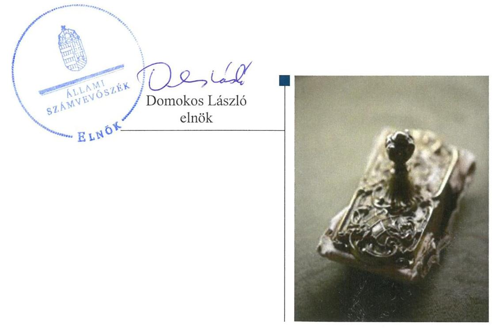
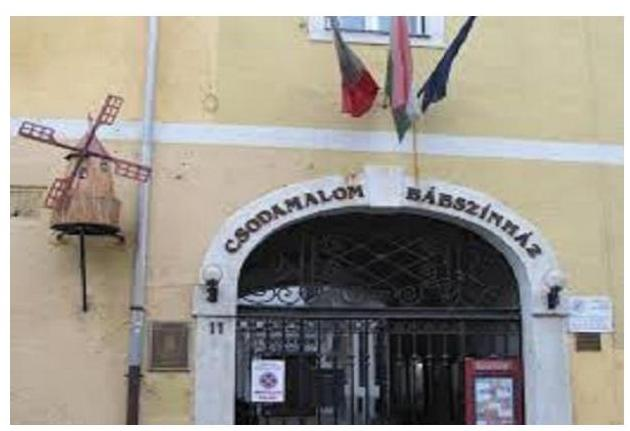

# Jelenetés 

## Nemzeti tulajdonú gazdasági társaságok ellenőrzése

Miskolci Csodamalom Bábszínház Nonprofit Kft.
2019.

---

# Jelenetés 

## Nemzeti tulajdonú gazdasági társaságok ellenőrzése

Miskolci Csodamalom Bábszínház
Nonprofit Kft.
2019. II. hó 21. nap

---

# AZ ELLENŐRZÉST FELÜGYELTE:

- KAKAS SÁNDOR felügyeleti vezető

- AZ ELLENŐRZÉST VEZETTE ÉS A VÉGREHAJTÁSÁÉRT FELELŐS:
  - **ÓDOR ZOLTÁN TAMÁS** ellenőrzésvezető
  - **A PROGRAM ÖSSZEÁLLÍTÁSÁÉRT FELELŐS:**
    - **TÓTPÁL SZABOLCS** osztályvezető

**IKTATÓSZÁM:** EL-2163-001/2019.

**TÉMASZÁM:** 2478

**ELLENŐRZÉS-AZONOSÍTÓ SZÁM:** V082245

Jelentéseink az Országgyűlés számítógépes hálózatán és az Interneten a www.asz.hu címen is olvashatóak.

---

# TARTALOMJEGYZÉK 

■ ÖSSZEGZÉS ..... 5
■ AZ ELLENŐRZÉS CÉLJA ..... 6
■ AZ ELLENŐRZÉS TERÜLETE ..... 7
■ AZ ELLENŐRZÉS HÁTTERE, INDOKOLTSÁGA ..... 8
■ A JELENTÉS LÉNYEGES KÉRDÉSKÖREI ..... 9
■ AZ ELLENŐRZÉS HATÓKÖRE ÉS MÓDSZEREI ..... 10
■ MEGÁLLAPÍTÁSOK ..... 12
■ JAVASLATOK ..... 14
■ MELLÉKLETEK ..... 15
I. sz. melléklet: Értelmező szótár ..... 15
■ FÜGGELÉK: ÉSZREVÉTELEK ..... 17
■ RÖVIDÍTÉSEK JEGYZÉKE ..... 19

---

.

---

# ÖSSZEGZÉS 

Miskolc Megyei Jogú Város Önkormányzata a tulajdonosi jogait nem szabályszerűen gyakorolta a Miskolci Csodamalom Bábszínház Nonprofit Kft. vonatkozásában.
A Miskolci Csodamalom Bábszínház Nonprofit Kft. vagyongazdálkodása nem volt szabályszerű. Számviteli beszámolóit 2015-2017. években nem támasztotta alá leltárral, így az elszámoltathatóság, a nemzeti vagyon megóvása nem volt biztosított.

## Az ellenőrzés társadalmi indokoltsága

Az Állami Számvevőszék kiemelt célja, hogy a helyi önkormányzatok gazdálkodásában rejlő pénzügyi kockázatok feltárásával, az államháztartáson kívülre nyújtott költségvetési támogatások és ingyenes vagyonjuttatások, valamint az államháztartáson kívül működő feladatellátó rendszerek ellenőrzéseivel hozzájáruljon ahhoz, hogy a közpénzeket az államháztartáson kívül működő szervezetek is átlátható, rendezett módon használják fel.

Magyarországon az önkormányzatok kötelező és önként vállalt feladataik vonatkozásában is egyre szélesebb körben alkalmazzák a költségvetésen kívüli feladatellátást, ezáltal - a nonprofit szervezetek mellett - az önkormányzati tulajdonú gazdasági társaságok is kiemelt fontosságú szerephez jutottak.

Az önkormányzati többségi tulajdonban álló gazdaságok ellenőrzése kiemelt jelentőségű, mivel működésük hatással van a tulajdonos önkormányzat gazdálkodására.

Miskolcon 2015-2017 között a Miskolci Csodamalom Bábszínház Nonprofit Kft. közfeladatokat látott el, Miskolc Megyei Jogú Város Önkormányzatával kötött megállapodás keretében, tevékenységén keresztül a lakosság széles köre kerülhet kapcsolatba a Társasággal és az általa nyújtott szolgáltatásokkal, ezért is indokolt az Állami Számvevőszék által folytatott ellenőrzés.

## Főbb megállapítások, következtetések, javaslatok

Miskolc Megyei Jogú Város Önkormányzata a tulajdonosi joggyakorlás kereteit nem a jogszabályi előírásokat követve alakította ki, a javadalmazással összefüggő szabályzatát nem alkotta meg. A tulajdonosi jogainak gyakorlása nem volt szabályszerű.

A Miskolci Csodamalom Bábszínház Nonprofit Kft. vagyongazdálkodási tevékenysége nem volt szabályszerű, 2015-2017. években a számviteli beszámolók mérlegtételeit nem támasztotta alá a Számv. tv. előírásai szerinti leltárral, ezért az egyszerűsített éves beszámolói nem voltak megalapozottak.

Az ellenőrzött időszakban a Társaság kormányzati szektorba sorolt szervezet volt, de államadósságot keletkeztető ügyletet nem kötött, továbbá a kormányzati szektor hiányára befolyást gyakorló gazdasági eseménye nem volt, adatszolgáltatási kötelezettségeit nem teljesítette.

Az Állami Számvevőszék Miskolc Megyei Jogú Város Önkormányzata polgármesterének egy, a Miskolci Csodamalom Bábszínház Nonprofit Kft. ügyvezetőjének három javaslatot fogalmazott meg. A javaslatokat megalapozó megállapításokra az érintetteknek 30 napon belül intézkedési tervet kell készíteniük.

---

# AZ ELLENŐRZÉS CÉLJA 

Az ellenőrzés célja annak megállapítása volt, hogy a tulajdonosi joggyakorló a gazdasági társaságai feletti tulajdonosi joggyakorlás kereteit kialakította-e, tulajdonosi jogait megfelelően gyakorolta-e és kötelezettségeit teljesítette-e, továbbá annak megállapítása, hogy a gazdasági társaság biztosította-e a vagyon védelmét a nyilvántartások szabályszerű vezetése és a mérleg tételeinek leltárral történő alátámasztása útján, valamint szabályszerűen gondoskodott-e a társaság használatában, kezelésében lévő nemzeti vagyon értékének megőrzéséről, gyarapításáról, hasznosításáról. További cél volt annak megítélése, hogy a gazdasági társaság gazdálkodásának a kormányzati szektor hiányára és az államadósságra befolyással bíró elemei megfeleltek-e a jogszabályi előírásoknak.

---

# AZ ELLENŐRZÉS TERÜLETE 

## Miskolci Csodamalom Bábszínház Nonprofit Kft. és a kizárólagos tulajdonosi jogokat gyakorló Miskolc Megyei Jogú Város Önkormányzata

Miskolc Megyei Jogú Város Önkormányzata 2011. november 17-én alapította a Miskolci Csodamalom Bábszínház Nonprofit Kft.-t a megszüntetett Miskolci Csodamalom Bábszínház, mint önálló költségvetési szerv utódszervezeteként. A Társaság ${ }^{1}$ a Civil tv². szerinti közhasznú szervezet. A Nonprofit Kft.-ben az Önkormányzat ${ }^{3}$ az alapítástól kezdve 100%-os tulajdoni hányaddal rendelkezett.

A Társaság jegyzett tőkéje 2015. január 1-én 10,78 M Ft volt, amely az ellenőrzött időszak végéig nem változott.

A Társaság Alapító okirat ${ }^{4}$-ban meghatározott fő tevékenysége előadó-művészet, valamint alkotóművészeti tevékenységet végzett, kulturális képzést nyújtott, művészeti létesítményt működtetett.

A Társaság az ellenőrzött időszakban saját vagyonával gazdálkodott, vagyonkezelt vagyonnal nem rendelkezett, koncessziós szerződést nem kötött. A Társaságnak nem volt másik gazdasági társaságban tulajdoni részesedése.

A Társaság a 2017. június 15-én kiadott NGM Közlemény ${ }^{5}$ és az Áht. ${ }^{6}$ 109. §. (8) bekezdés értelmében a kormányzati szektorba sorolt egyéb szervezetek közé tartozott.

A Társaság a Számv. tv. ${ }^{7}$ előírása alapján könyvvizsgálatra kötelezett volt.

A Társaságnál az Alapító okirat rendelkezése szerint háromtagú felügyelőbizottság ${ }^{8}$ működött a Ptk. ${ }^{9}$ 3:121. § (1) bekezdésének megfelelve. A társaság 2015-2017. években egyszerűsített éves beszámolót készített.

Az ellenőrzött időszakban a polgármester ${ }^{10}$, a jegyző ${ }^{11}$, a könyvvizsgálattal megbízott, a felügyelőbizottság, valamint a Társaság ügyvezetőjének személyében nem történt változás.

A Társaság által foglalkoztatottak száma 2015. évben 23 fő volt, 2017. évben 25 főre nőtt.

---

# AZ ELLENŐRZÉS HÁTTERE, INDOKOLTSÁGA 

Az Alaptörvény 38. cikke alapján az állam és a helyi önkormányzatok tulajdona nemzeti vagyon. A nemzeti vagyon megőrzése, megóvása érdekében kiemelten fontos ezen nemzeti tulajdonú gazdasági társaságok ellenőrzése. Gazdálkodásuk jellemzően a közérdeklődés és a média figyelmének középpontjában áll, amihez hozzájárul a gazdálkodásuk körébe tartozó vagyon nagysága is.

A nemzeti tulajdonú gazdasági társaságok ellenőrzése kiemelten fontos a nemzeti vagyon megőrzése érdekében. Gazdálkodásuk jellemzően a közérdeklődés és a média figyelmének középpontjában áll, amihez hozzájárul a gazdálkodásuk körébe tartozó - a nemzeti vagyon részét képező - vagyon nagysága, illetve az általuk ellátott közszolgáltatások minősége és hatékonysága. Ellenőrzéseink feltárhatják, hogy a tulajdonosi felügyelet hozzájárult-e a szabályszerű gazdálkodáshoz és feladatellátáshoz.

Az ellenőrzés eredményeként meghatározhatóvá válnak a szervezet vagyongazdálkodást érintő kockázatai, ezzel lehetővé téve a kockázatok csökkentését. A megállapítások alapján megfogalmazott számvevőszéki javaslatok hasznosítása elősegítheti a meglévő hibák megszüntetését. A jó gyakorlatok bemutatásával az ÁSZ hozzájárulhat a követendő megoldások megismertetéséhez, terjesztéséhez.

---

# A JELENTÉS LÉNYEGES KÉRDÉSKÖREI 

1. A gazdasági társaság feletti tulajdonosi joggyakorlás megfelel-e a jogszabályi és belső előírásoknak?
2. A Társaság vagyongazdálkodási tevékenysége szabályszerű volt-e?
3. A Társaság gazdálkodásának a kormányzati szektor hiányára és az államadósságra befolyással bíró elemei megfeleltek-e a jogszabályi előírásoknak?

---

# AZ ELLENŐRZÉS HATÓKÖRE ÉS MÓDSZEREI 

## Az ellenőrzés típusa

Megfelelőségi ellenőrzés.

## Az ellenőrzött időszak

A tulajdonosi joggyakorlás vonatkozásában az ellenőrzött időszak 2017. január 1-től az ellenőrzés megkezdésének napjáig, 2019. február 27-ig terjedt ki az éves beszámolók elfogadása és tulajdonosi ellenőrzése kivételével, amelyeknél az ellenőrzött időszak 2015. január 1-től az ellenőrzés megkezdésének napjáig tartott.

A Társaság vagyongazdálkodása és a kormányzati szektor hiányára és az államadósságra befolyással bíró elemei vonatkozásában az ellenőrzött időszak 2015-2017. évek, a 2017. évi beszámoló jóváhagyása tekintetében 2018. június elsejéig tartó időszak.

## Az ellenőrzés tárgya

Az önkormányzat 100%-os tulajdonában lévő gazdasági társaság feletti tulajdonosi joggyakorlás kialakítása és működtetése.

Önkormányzati tulajdonban lévő gazdasági társaság vagyongazdálkodása, saját vagyona tekintetében a vagyonnyilvántartások vezetése, leltára, továbbá a kormányzati szektorba sorolt nemzeti tulajdonban lévő gazdasági társaság gazdálkodásának a kormányzati szektor hiányára és az államadósságra befolyással bíró elemei és a jogszabályi előírásoknak megfelelő adatszolgáltatási kötelezettségük teljesítése.

## Az ellenőrzött szervezet

Miskolc Megyei Jogú Város Önkormányzata, Miskolci Csodamalom Bábszínház Nonprofit Kft.

## Az ellenőrzés jogalapja

Az ellenőrzés jogalapját az ÁSZ tv ${ }^{12}$. 1. § (3) bekezdése és 5. § (3)-(5) bekezdései képezték.

---

# Az ellenőrzés módszerei 

Az ellenőrzést az ellenőrzési program ellenőrzési kérdései, az ellenőrzött időszakban hatályos jogszabályok, az ellenőrzés szakmai szabályok és módszertanok alapján, a nemzetközi standardok figyelembe vételével végezte az ÁSZ.

Az ellenőrzés ideje alatt az ellenőrzött szervezettel történő kapcsolattartást az ÁSZ Szervezeti és Működési Szabályzatának vonatkozó előírásai alapján biztosította az ÁSZ.
2017. január 1-től 2019. február 27-ig, az ellenőrzés megkezdésének napjáig ellenőrizte az ÁSZ a tulajdonosi joggyakorlás kereteinek kialakítását, a tulajdonosi joggyakorló tevékenységét a felügyelő bizottság és a független könyvvizsgáló működéséhez kapcsolódóan, valamint azt, hogy a tulajdonosi joggyakorló - amennyiben a gazdasági társaság feladatellátásához kapcsolódóan határozott meg követelményeket, elvárásokat - a nemzeti vagyon értékének megőrzése érdekében monitorozta-e azok teljesülését. 2015. január 1-től az ellenőrzés megkezdésének napjáig ellenőrizte az ÁSZ a tulajdonosi joggyakorló részvételét az éves beszámoló elfogadására vonatkozó döntéshozatalban.

A gazdasági társaság vagyonhoz kapcsolódó nyilvántartásai vezetésének megfelelősége, valamint a nemzeti vagyon értéke megőrzésének, gyarapításának, hasznosításának szabályszerűsége 2015. és 2017. évek tekintetében került ellenőrzésre. A 2015-2017. éveket érintően történt meg a lényeges dokumentumok értékelése.

Az ellenőrzési kérdések megválaszolásához szükséges bizonyítékok megszerzése a Társaság vonatkozásában a következő ellenőrzési eljárások alkalmazásával történt: megfigyelés, információkérés, összehasonlítás, elemző eljárás. Az ellenőrzési bizonyítékként felhasználható adatforrások közé tartoznak az ellenőrzési programban felsorolt adatforrások, továbbá minden - az ellenőrzés folyamán - feltárt, az ellenőrzés szempontjából információkat tartalmazó dokumentum. Az ÁSZ az ellenőrzést a kérdésekre adott válaszok kiértékelésével, valamint a megjelölt adatforrások, a csatolt tanúsítványok felhasználásával, továbbá az adott időszakban hatályos jogszabályok figyelembe vételével folytatta le.

A vagyonnyilvántartások és a leltár szabályszerűségét mintavétellel ellenőrizte az ÁSZ. A vagyonnyilvántartások és a leltár szabályszerűsége esetében az ellenőrzés azokra a legnagyobb értékű tételekre - a lényeges sokaságra - terjedt ki, melyek összértéke eléri a teljes sokaság összértékének 50%-át. A lényeges sokaságot tételesen ellenőrizte az ÁSZ.

---

# 1. A gazdasági társaság feletti tulajdonosi joggyakorlás megfelel-e a jogszabályi és belső előírásoknak? 

Összegző megállapítás Az Önkormányzat tulajdonosi joggyakorlása nem volt szabályszerű.

A TÁRSASÁG FELETTI TULAJDONOSI JOGGYAKORLÁS KERETEIT az Alapító ${ }^{13}$ nem szabályszerűen alakította ki. A Közgyűlés ${ }^{14}$ a Taktv. ${ }^{15}$ 5. § (3) bekezdés előírása ellenére a 2015-2017. években nem alkotta meg a vezető tisztségviselők, felügyelő bizottsági tagok, az Mt. ${ }^{16}$ 208. §-ának hatálya alá eső munkavállalók javadalmazása, valamint a jogviszony megszűnése esetére biztosított juttatások módjának, mértékének elveiről, annak rendszeréről szóló szabályzatot.

## A TULAJDONOSI JOGGYAKORLÁSSAL KAPCSOLATBAN az Alapító az Alapító okirat rendelkezései szerint kijelölte a Társaság vezető tisztségviselőjét, a Felügyelőbizottság tagjait, valamint a könyvvizsgálót ${ }^{17}$, a Ptk. és a Taktv. előírásainak eleget téve meghatározta a Felügyelőbizottság feladatait, hatáskörét, azonban a Felügyelőbizottság ügyrendjét a Ptk. 3:122. § (3) bekezdésének előírása és az Alapító okirat 12.4 pontja ellenére nem hagyta jóvá.

Az Alapító a Társaság 2015-2017. évi egyszerűsített éves beszámolóit, a Ptk., a Számv. tv. és az Alapító okirat előírásai alapján a Felügyelőbizottság írásbeli jelentése birtokában fogadta el.

Az Alapító kialakította belső ellenőrzési rendszerét, ennek részeként elkészítették az Önkormányzat Belső ellenőrzési kézikönyvét. A Társaság ügyvezetője az Alapító okirat előírása szerint félévente, írásbeli
 jelentés formájában beszámolt a Társaság munkájáról és pénzügyi helyzetéről.

## 2. A Társaság vagyongazdálkodási tevékenysége szabályszerű volt-e?

## Összegző megállapítás

A Társaság vagyongazdálkodási tevékenysége nem volt szabályszerű.

A Társaság 2015. március 2-tól rendelkezett Számv. tv. szerinti leltárkészítési és leltározási szabályzattal ${ }^{18}$.

vagyonnyilvántartásának feltételeit saját vagyon tekintetében, jogszabályi előírásokkal összhangban, a Számviteli politikában ${ }^{19}$, a Számlarendben ${ }^{20}$ és az Értékelési szabályzatban ${ }^{21}$ alakította ki.

---

A Társaság 2015-ben és 2017-ben aktivált beruházásokat a Számv. tv. 165. § (1) bekezdésében előírtak ellenére számviteli bizonylattal nem támasztott alá, ezért a Társaság a Számv. tv. 165. § (2) bekezdésében előírtak ellenére bizonylat hiányában rögzítette számviteli nyilvántartásában a beruházással kapcsolatos adatokat.

A vagyongazdálkodása 2015-2017. években nem volt szabályszerű. A Társaság mérlegtételeinek alátámasztásához a Számv. tv. 69. § (1) bekezdésének előírása ellenére 2015-2017. évekre vonatkozóan nem állított össze leltárt, amely tételesen, ellenőrizhető módon tartalmazta volna a mérleg fordulónapján meglévő eszközöket és forrásokat mennyiségben és értékben. A mérleg tételeit alátámasztó leltár hiányában a mérleg nem volt alátámasztott, a 2015-2017. évi beszámoló nem volt megalapozott. A könyvvizsgáló az ellenőrzött időszak minden évében korlátozás nélküli véleményt adott a beszámolókról.

# 3. A Társaság gazdálkodásának a kormányzati szektor hiányára és az államadósságra befolyással bíró elemei megfeleltek-e a jogszabályi előírásoknak? 

Összegző megállapítás

A Társaság nem tartotta be az adatszolgáltatási kötelezettségére vonatkozó jogszabályi előírásokat.

az államadósságra befolyással bíró, a Stabilitási tv². 3. §. (1) bekezdésben meghatározott, adósságot keletkeztető ügyletet a Társaság az ellenőrzött időszakban nem kötött, továbbá a kormányzati szektor hiányára befolyást gyakorló gazdasági eseménye nem volt.

A Társaság éves beszámolóját nem küldte meg az államháztartásért felelős miniszter részére, ezzel nem tett eleget adatszolgáltatási kötelezettségének, figyelmen kívül hagyva az Áht. 107. § (1) bekezdésre tekintettel az Ávr. ${ }^{23} 5$. mellékletének 23. pontjában foglaltakat.

---

# JAVASLATOK 

Az ÁSZ tv. 33. § (1) bekezdésében foglaltak értelmében az ellenőrzött szervezet vezetője köteles a jelentésben foglalt megállapításokhoz kapcsolódó intézkedési tervet összeállítani és azt a jelentés kézhezvételétől számított 30 napon belül az ÁSZ részére megküldeni. Amennyiben az ellenőrzött szervezet vezetője nem küldi meg határidőben az intézkedési tervet, vagy továbbra sem elfogadható intézkedési tervet küld, az Állami Számvevőszék elnöke az ÁSZ tv. 33. § (3) bekezdése a) és b) pontjaiban foglaltakat érvényesítheti.

## Miskolci Csodamalom Bábszínház Nonprofit Kft. ügyvezetőjének

1. Intézkedjen arra vonatkozóan, hogy a Számv. tv. előírásai szerint a számviteli (könyvviteli) nyilvántartásokba csak szabályszerűen kiállított bizonylat alapján jegyezzenek be adatokat.
(2. megállapítás 3. bekezdése alapján)
2. Gondoskodjon a mérleg tételeinek alátámasztásához a jogszabályban előírt leltár összeállításáról.
(2. megállapítás 4. bekezdésének 2. mondata alapján)
3. Tegyen eleget a jogszabályi előírások szerinti adatszolgáltatási kötelezettségének.
(3. megállapítás 2. bekezdése alapján)

## Miskolc Megyei Jogú Város Önkormányzata polgármesterének

1. Kezdeményezze a Közgyűlésnél a vezető tisztségviselők, a felügyelő bizottsági tagok, az Mt. 208. §-ának hatálya alá eső munkavállalók javadalmazása, valamint a jogviszony megszünése esetére biztosított juttatások módjának, mértékének elveire, annak rendszerére vonatkozó szabályzat megalkotását a Taktv.-ben előírtaknak megfelelően.
(1. megállapítás 1. bekezdés 2. mondata alapján)

---

# MELLÉKLETEK 

- I. SZ. MELLÉKLET: ÉRTELMEZŐ SZÓTÁR
gazdasági társaság
koncessziós szerződés
közszolgáltatás
közfeladat
nemzeti vagyon
nemzeti vagyon használója
tulajdonosi jogok gyakorlója
vagyonkezelő

Ptk. 3:88. § (1) bekezdése szerint „a gazdasági társaságok üzletszerű közös gazdasági tevékenység folytatására, a tagok vagyoni hozzájárulásával létrehozott, jogi személyiséggel rendelkező vállalkozások, amelyekben a tagok a nyereségből közösen részesednek, és a veszteséget közösen viselik".
Az 1991. évi XVI. tv. alapján a kizárólagos állami, önkormányzati vagy önkormányzati társulási tulajdon hatékony működtetésének, valamint a kizárólagosan az állam vagy az önkormányzat hatáskörébe utalt tevékenységek gyakorlásának egyik lehetséges útja mindezek koncessziós szerződés alapján való átengedése
Az Ebktv. ${ }^{24}$ 3. § d) pontja a következőképpen határozza meg a közszolgáltatást: „szerződéskötési kötelezettség alapján a lakosság alapvető szükségleteinek ellátására irányuló szolgáltatás, így különösen a villamosenergia-, gáz-, hő-, víz-, szenny-víz- és hulladékkezelési, köztisztasági, postai és távközlési szolgáltatás, továbbá a menetrend alapján közlekedő járművekkel végzett közforgalmú személyszállítás".
Az Áht. 3/A. § (1) bekezdése alapján közfeladat a jogszabályban meghatározott állami vagy önkormányzati feladat
Nvtv. 1. § (2) bekezdése szerint nemzeti vagyonba tartozik többek között: „az állam vagy a helyi önkormányzat kizárólagos tulajdonában álló dolgok, az a) pont hatálya alá nem tartozó, állam vagy a helyi önkormányzat tulajdonában lévő dolog,
az állam vagy a helyi önkormányzat tulajdonában lévő pénzügyi eszközök, továbbá az államot vagy a helyi önkormányzatot megillető társasági részesedések, az államot vagy a helyi önkormányzatot megillető bármely vagyoni értékkel rendelkező jogosultság, amelyet jogszabály vagyoni értékű jogként nevesít
A tulajdonosi joggyakorló vagy a nemzeti vagyon használója által a nemzeti vagyon birtoklásának, használatának, hasznok szedése jogának bármely - a tulajdonjog átruházását nem eredményező - jogcímen történő átengedése, ide nem értve a vagyonkezelésbe adást, valamint a haszonélvezeti jog alapítását.
Forrás: Nvtv. 3. § (1) bekezdés 4. pont
Azon természetes személy, jogi személy vagy jogi személyiséggel nem rendelkező szervezet, aki vagy amely állami vagyon tekintetében törvény vagy szerződés alapján, a helyi önkormányzat vagyona tekintetében törvény, a helyi önkormányzat rendelete vagy szerződés alapján bármely jogcímen nemzeti vagyont birtokol, használ, szedi annak használt, kivéve a tulajdonosi joggyakorló.
Forrás: Nvtv. 3. § (1) bekezdés 11. pont
Aki a nemzeti vagyon felett az államot vagy a helyi önkormányzatot megillető tulajdonosi jogok és kötelezettségek összességének gyakorlására jogosult. (Forrás: Nvtv. 3. § (1) bekezdés 17. pontja)
az állam tulajdonában álló nemzeti vagyon tekintetében:
aa) költségvetési szerv,
ab) helyi önkormányzat, nemzetiségi önkormányzat, valamint ezek társulásai,
ac) az ab) alpontban felsoroltak fenntartása vagy irányítása alá tartozó intézmény, ad) köztestület,
ae) az állam, az aa)-ac) alpontban meghatározott személyek együtt vagy külön-külön 100%-os tulajdonában álló gazdálkodó szervezet,

---

af) az ae) alpont szerinti gazdálkodó szervezet 100%-os tulajdonában álló gazdálkodó szervezet,
ag) a törvény által kijelölt egyedileg meghatározott jogi személy.
b) a helyi önkormányzat tulajdonában álló nemzeti vagyon tekintetében:
ba) nemzetiségi önkormányzat, helyi vagy nemzetiségi önkormányzati társulás, valamint ezek fenntartása vagy irányítása alá tartozó intézmény,
bb) költségvetési szerv,
bc) köztestület,
bd) az állam, a helyi önkormányzat, a ba) alpontban meghatározott személyek együtt vagy külön-külön 100%-os tulajdonában álló gazdálkodó szervezet,
be) a bd) alpont szerinti gazdálkodó szervezet 100%-os tulajdonában álló gazdálkodó szervezet.
Forrás: Nvtv. 3. § (1) bekezdés 19. pont
vagyonkezelői jog
A vagyonkezelő köteles a vagyontárgy állagának megóvásáról, jó karbantartásáról, működtetéséről gondoskodni, jogszabályban és szerződésben előírt más kötelezettségét teljesíteni, valamint a vagyontárgyat jogszabályban vagy szerződésben meghatározott célnak megfelelően használni. A vagyonkezelő - a központi költségvetési szervek és a kizárólag közfeladatot ellátó nem központi költségvetési szerv vagyonkezelők kivételével - köteles díjat fizetni, jogszabályban és szerződésben előírt más kötelezettségét teljesíteni, valamint a vagyontárgyat jogszabályban vagy szerződésben meghatározott célnak megfelelően használni. Amennyiben a vagyonkezelő ezen kötelezettségeinek nem tesz eleget, a tulajdonosi joggyakorló jogosult a szerződést azonnali hatállyal felmondani.
Forrás: Vtv. 27. § (2), (2a
vagyongazdálkodás
A nemzeti vagyongazdálkodás feladata a nemzeti vagyon rendeltetésének megfelelő, az állam, az önkormányzat mindenkori teherbíró képességéhez igazodó, elsődlegesen a közfeladatok ellátásához és a mindenkori társadalmi szükségletek kielégítéséhez szükséges, egységes elveken alapuló, átlátható, hatékony és költségtakarékos működtetése, értékének megőrzése, állagának védelme, értéknövelő használata, hasznosítása, gyarapítása, továbbá az állam vagy a helyi önkormányzat feladatának ellátása szempontjából feleslegessé váló vagyontárgyak elidegenítése. (Forrás: Nvtv. 7. § (2) bekezdése).

---

# FÜGGELÉK: ÉSZREVÉTELEK 

A jelentéstervezetet a Számvevőszék 15 napos észrevételezésre megküldte az ellenőrzött szervezetek vezetőinek az ÁSZ tv. 29. § (1) bekezdése előírásának megfelelően.

A Miskolci Csodamalom Bábszínház Nonprofit Kft. ügyvezetője a jelentéstervezet megállapításaira írásban észrevételt tett. Miskolc Város Önkormányzatának polgármestere a jelentéstervezet megállapításaira nem kívánt észrevételt tenni.
Az ÁSZ tv. 29. § (3) bekezdésével összhangban az ÁSZ a Függelékben feltünteti az ellenőrzés megállapításaival kapcsolatban tett, figyelembe nem vett észrevételeket, és megindokolja, hogy azokat miért nem fogadta el.

A „Nemzeti tulajdonú gazdasági társaságok ellenőrzése - Miskolci Csodamalom Bábszínház Nonprofit Kft." címmel készített számvevőszéki jelentéstervezet megállapításaival kapcsolatban a Miskolci Csodamalom Bábszínház Nonprofit Kft. (továbbiakban: Társaság) ügyvezetője által 2019. szeptember 18-án kelt levélben tett (az Állami Számvevőszékhez 2019. szeptember 23-án érkezett) észrevételek és azok kezelésének indokolása.

1. A 2015. és 2017. évi beruházások számviteli bizonylatokkal történő alátámasztottsága kapcsán tett észrevétel (Jelentéstervezet 2. megállapítás 3. bekezdése, valamint I. függelék II. pontja)
A Társaság ügyvezetője észrevételében jelezte, hogy az Állami Számvevőszék EL-0937-057/2019. iktatószámú adatbekérő levelében bekért, 3 db beruházási tételre vonatkozó dokumentumok átadását a feltöltési határidő utolsó 5. napjának délutánján az adatszolgáltatási rendszerhez történő hozzáférési problémák miatt nem tudták elvégezni. Tájékoztatása szerint a 2015. és 2017. évi beruházások számviteli bizonylatai a Társaság székhelyén rendelkezésre állnak, ezért kérte a kérdéses dokumentumok figyelembe vételét és a jelentéstervezet kapcsolódó megállapításának módosítását.
Ügyvezető urat az észrevételében foglaltakra válaszolva tájékoztattuk, hogy az EL-0937-057/2019. iktatószámú adatbekérő levélben foglaltak szerint az Állami Számvevőszék által működtetett Elektronikus Adatszolgáltató Rendszeren keresztül az adatbekérő levél 2. számú mellékletben szereplő mintatételek vonatkozásában a 3. számú melléklet szerinti dokumentumokat, továbbá az adatszolgáltatáshoz kapcsolódó teljességi és hitelességi nyilatkozatot kellett volna soron kívül, de legkésőbb 5 munkanapon belül rendelkezésre bocsájtaniuk. Az adatbekérő levél tartalmazta azt az e-mail címet, amelyen lehetőségük lett volna jelezni, ha az adatszolgáltatással kapcsolatos kérdésük merült volna fel.

[^0]
[^0]:    * 29. § (1) Az Állami Számvevőszék az ellenőrzési megállapításait megküldi az ellenőrzött szervezet vezetőjének vagy az általa megbízott személynek, és annak, akinek személyes felelősségét állapította meg.
    (2) Az ellenőrzött szervezet vezetője és a felelősként megjelölt személy az ellenőrzés megállapításaira tizenöt napon belül írásban észrevételt tehet.
    (3) Az Állami Számvevőszék az észrevételre a beérkezésétől számított harminc napon belül írásban válaszol. A figyelembe nem vett észrevételeket köteles a jelentésben feltüntetni, és megindokolni, hogy azokat miért nem fogadta el.

---

Az adatbekérés körülményeit megvizsgáltuk és megállapítottuk, hogy az EL-0937-057/2019 iktatószámú adatbekérő levél 2019. április 9-i átvételéről a tájékoztatást 2019. április 10-én megküldték az Állami Számvevőszék részére, amelynek alapján az adatszolgáltatási felület megnyitásra került a 2019. április 10-e 00 óra 00 perctől 2019. április 16-án 23 óra 59 percig tartó időtartamra. Az adatszolgáltatásra rendelkezésre álló határidőn belül az adatszolgáltató rendszer naplózása szerint - az adatszolgáltatási felületre nem történt belépési kísérlet, az adatszolgáltatási felületre való belépési problémát telefonon vagy e-mail formájában nem jeleztek. A Társaság képviseletében az adatszolgáltatási határidőt követően, a 6. napon érkezett telefonhívás, amikor az adatszolgáltatási felület már lezárásra került.

Az Állami Számvevőszékről szóló 2011. évi LXVI. törvény 28. § (2) bekezdése alapján az adatbekérő levél átvételétől biztosított 5 munkanapon belül az adatbekérő levélben az ÁSZ által kért dokumentumok, valamint azokra vonatkozó teljességi és hitelességi nyilatkozat átadására nem került sor. Az ÁSZ az ellenőrzési megállapításait az adatszolgáltatás során a részére törvényi határidőben rendelkezésre bocsátott dokumentumokra alapozva fogalmazta meg. Fentiekre
 tekintettel az észrevételt nem fogadtuk el, a jelentéstervezet módosítása nem volt indokolt.
2. A 2015–2017. évi számviteli beszámolók mérlegeinek leltárral történő alátámasztottsága kapcsán tett észrevétel (Jelentéstervezet 2. megállapítás 4. bekezdése, valamint I. függelék I. pontja)

A Társaság ügyvezetője észrevételében kifejtette, hogy a Társaság 2015–2017. évi beszámolóinak mérlegtételeit leltárral alátámasztották, a leltár tételesen ellenőrizhető módon tartalmazza a mérleg fordulónapján meglévő eszközöket és forrásokat mennyiségben és értékben, így Társaságuk nem sértette meg a számvitelről szóló 2000. évi C. törvény (továbbiakban: Számv. tv.) 69. § (1) bekezdését. Tájékoztatása szerint a leltárakat a 2018. év folyamán az Állami Számvevőszék adatbekérő felületére feltöltötték.

Ügyvezető urat az észrevételében foglaltakra válaszolva tájékoztattuk, hogy a Társaság 2015–2017. évi leltárainak átadására a 2018. augusztus 21-én kelt teljességi és hitelességi nyilatkozattal alátámasztott módon valóban sor került. A beküldött dokumentumokat ismételten felülvizsgáltuk és megállapítottuk, hogy az átadott leltárak nem felelnek meg a Számv. tv. 69. § (1) bekezdésében foglalt előírásoknak, mivel a 2015. és 2017. években egyáltalán nem, a 2016. évben pedig hiányosan tartalmazták a Társaság tárgyi eszközeit. A jelentéstervezet megállapítása helytálló, mivel a 2015–2017. évi mérlegtételek alátámasztásához összeállított leltárak nem tartalmazták teljes körűen tételesen és ellenőrizhető módon a mérleg fordulónapján meglévő eszközöket és forrásokat mennyiségben és értékben. Fentiekre tekintettel az észrevételt nem fogadtuk el, a jelentéstervezet módosítása nem volt indokolt.
3. Az éves beszámolóknak az államháztartásért felelős miniszter részére történő megküldése vonatkozásában tett észrevétel (Jelentéstervezet 3. megállapítás 2. bekezdése)

A Társaság ügyvezetője észrevételében kifejtette, hogy elfogadják az Állami Számvevőszék azon megállapítását, mely szerint az éves beszámolót az államháztartásért felelős miniszter részére nem küldték meg. Tájékoztatást adott továbbá arról, hogy ez a mulasztás adminisztratív okokból történt, annak pótlása iránt haladéktalanul intézkednek és a jövőben erre vonatkozó kötelezettségeiket maradéktalanul teljesíteni fogják.

A Társaság ügyvezetője észrevételében nem vitatta az Állami Számvevőszék azon megállapítását, hogy elmulasztották teljesíteni az éves beszámolókhoz kapcsolódó, az államháztartásért felelős miniszter részére teljesítendő adatszolgáltatási kötelezettséget. Erre tekintettel a jelentéstervezet módosítása nem volt indokolt.

---

# RÖVIDÍTÉSEK JEGYZÉKE 

${ }^{1}$ Társaság
${ }^{2}$ Civil tv.
${ }^{3}$ Önkormányzat
${ }^{4}$ Alapító okirat
${ }^{5}$ NGM közlemény
${ }^{6}$ Áht.
${ }^{7}$ Számv. tv.
${ }^{8}$ felügyelőbizottság
${ }^{9}$ Ptk.
${ }^{10}$ polgármester
${ }^{11}$ jegyző
${ }^{12}$ ÁSZ tv
${ }^{13}$ Alapító
${ }^{14}$ Közgyűlés
${ }^{15}$ Taktv.
${ }^{16} \mathrm{Mt}$.
${ }^{17}$ könyvvizsgáló
${ }^{18}$ Leltározási szabályzat
${ }^{19}$ Számviteli politika
${ }^{20}$ Számlarend
${ }^{21}$ Értékelési szabályzat
${ }^{22}$ Stabilitási tv.
${ }^{23}$ Ávr.
${ }^{24}$ Ebktv.

Miskolci Csodamalom Bábszínház Nonprofit Kft.
2011. évi CLXXV. törvény az egyesülési jogról, a közhasznú jogállásról, valamint a civil szervezetek működéséről és támogatásáról
Miskolc Megyei Jogú Város Önkormányzata
A Miskolc Csodamalom Bábszínház Nonprofit Kft. Alapító Okirata
(2016. december 8-án kelt, a változásokkal egységes szerkezetben)
2017. június 15-én kiadott NGM Közlemény a kormányzati szektorba sorolt egyéb szervezetekről
2011. évi CXCV. törvény az államháztartásról (hatályos: 2012. január 1-jétől)
a számvitelről szóló 2000. évi C. törvény
Miskolci Csodamalom Bábszínház Nonprofit Kft. felügyelőbizottsága
2013. évi V. törvény a Polgári Törvénykönyvről

Miskolc Megyei Jogú Város Önkormányzat polgármestere
Miskolc Megyei Jogú Város Önkormányzat Jegyzője
Állami Számvevőszékről szóló 2011. évi LXVI. törvény
(hatályos: 2011. július 1-jétől)
Miskolc Megyei Jogú Város Önkormányzata
Miskolc Megyei Jogú Város Közgyűlése
2009. évi CXXII. törvény a köztulajdonban álló gazdasági társaságok takarékosabb működéséről (hatályos: 2009. december 4-től)
2012. évi I. törvény a munka törvénykönyvéről (hatályos: 2016. január 6-tól)

A Társaság könyvvizsgálója: Zentó-Audit Könyvvizsgáló Szolgáltató Kft 3525
Miskolc, Corvin u. 5., azon.:001658
A Társaság leltározási szabályzata (hatályos: 2015. március 2-ától)
A Társaság Számviteli politikája (hatályos: 2015. március 2-ától)
A Társaság Számlarendje, Számviteli politika része
(hatályos: 2015. március 2-ától)
Eszközök és források értékelési szabályzata (hatályos: 2012. október 1-től)
2011. évi CXCIV. törvény Magyarország gazdasági stabilitásáról

368/2011. (XII. 31.) Korm. rendelet az államháztartásról szóló törvény végrehajtásáról (hatályos: 2012. január 1-jétől)
egyenlő bánásmódról és az esélyegyenlőség előmozdításáról szóló 2003. évi
CXXV. törvény

---

# ÁLLAMI SZÁMVEVŐSZÉK 

1052 Budapest, Apáczai Csere János utca 10.
Levélcím: 1364 Budapest 4. Pf. 54
Telefon: +36 14849100 Telefax: +36 14849200
www.asz.hu
